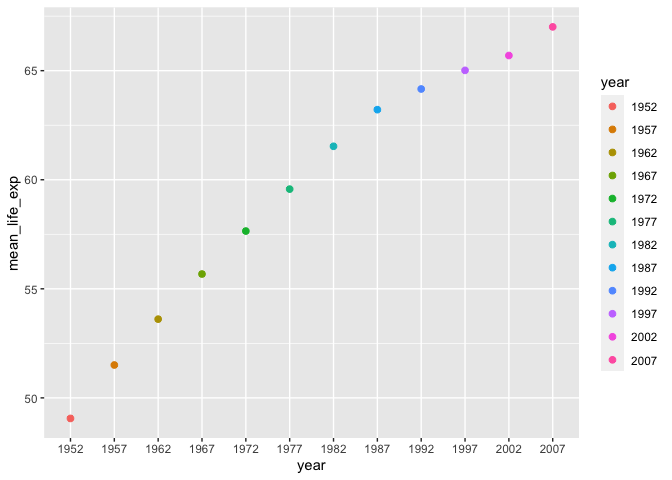
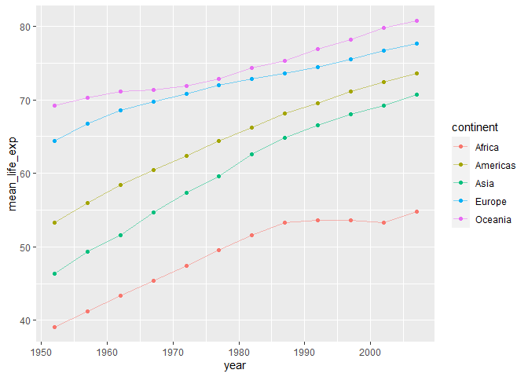
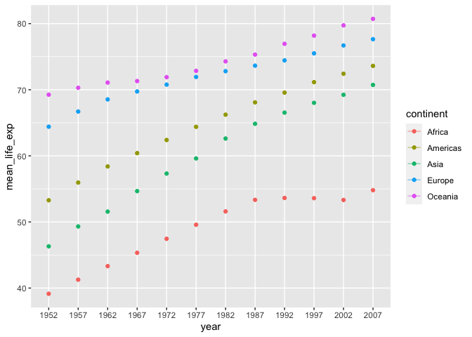

## Instructions
Answer the following questions and complete the exercises in RMarkdown. Please embed all of your code and push your final work to your repository. Your final lab report should be organized, clean, and run free from errors. Remember, you must remove the `#` for the included code chunks to run. Be sure to add your name to the author header above. For any included plots, make sure they are clearly labeled. You are free to use any plot type that you feel best communicates the results of your analysis.  

**In this homework, you should make use of the aesthetics you have learned. It's OK to be flashy!**

Make sure to use the formatting conventions of RMarkdown to make your report neat and clean!  

## Load the libraries

```r
library(tidyverse)
library(janitor)
library(here)
library(naniar)
library(RColorBrewer)
library(paletteer)
library(janitor)
library(ggthemes)
```

## Resources
The idea for this assignment came from [Rebecca Barter's](http://www.rebeccabarter.com/blog/2017-11-17-ggplot2_tutorial/) ggplot tutorial so if you get stuck this is a good place to have a look.  

## Gapminder
For this assignment, we are going to use the dataset [gapminder](https://cran.r-project.org/web/packages/gapminder/index.html). Gapminder includes information about economics, population, and life expectancy from countries all over the world. You will need to install it before use. This is the same data that we will use for midterm 2 so this is good practice.

```r
#install.packages("gapminder")
library("gapminder")
```

## Questions
The questions below are open-ended and have many possible solutions. Your approach should, where appropriate, include numerical summaries and visuals. Be creative; assume you are building an analysis that you would ultimately present to an audience of stakeholders. Feel free to try out different `geoms` if they more clearly present your results.  

**1. Use the function(s) of your choice to get an idea of the overall structure of the data frame, including its dimensions, column names, variable classes, etc. As part of this, determine how NA's are treated in the data.**  

```r
gapminder<- clean_names(gapminder)
summary(gapminder)
```

```
##         country        continent        year         life_exp    
##  Afghanistan:  12   Africa  :624   Min.   :1952   Min.   :23.60  
##  Albania    :  12   Americas:300   1st Qu.:1966   1st Qu.:48.20  
##  Algeria    :  12   Asia    :396   Median :1980   Median :60.71  
##  Angola     :  12   Europe  :360   Mean   :1980   Mean   :59.47  
##  Argentina  :  12   Oceania : 24   3rd Qu.:1993   3rd Qu.:70.85  
##  Australia  :  12                  Max.   :2007   Max.   :82.60  
##  (Other)    :1632                                                
##       pop              gdp_percap      
##  Min.   :6.001e+04   Min.   :   241.2  
##  1st Qu.:2.794e+06   1st Qu.:  1202.1  
##  Median :7.024e+06   Median :  3531.8  
##  Mean   :2.960e+07   Mean   :  7215.3  
##  3rd Qu.:1.959e+07   3rd Qu.:  9325.5  
##  Max.   :1.319e+09   Max.   :113523.1  
## 
```

```r
naniar::miss_var_summary(gapminder)
```

```
## # A tibble: 6 x 3
##   variable   n_miss pct_miss
##   <chr>       <int>    <dbl>
## 1 country         0        0
## 2 continent       0        0
## 3 year            0        0
## 4 life_exp        0        0
## 5 pop             0        0
## 6 gdp_percap      0        0
```
**2. Among the interesting variables in gapminder is life expectancy. How has global life expectancy changed between 1952 and 2007?**

```r
colors <- paletteer::palettes_d_names
```

```r
my_palette <- paletteer_d("khroma::smooth_rainbow")
```

```r
barplot(rep(1,14), axes=FALSE, col=my_palette)
```

<!-- -->

```r
gapminder %>%
  group_by(year) %>%
  summarise(year, mean(life_exp))
```

```
## `summarise()` has grouped output by 'year'. You can override using the
## `.groups` argument.
```

```
## # A tibble: 1,704 x 2
## # Groups:   year [12]
##     year `mean(life_exp)`
##    <int>            <dbl>
##  1  1952             49.1
##  2  1952             49.1
##  3  1952             49.1
##  4  1952             49.1
##  5  1952             49.1
##  6  1952             49.1
##  7  1952             49.1
##  8  1952             49.1
##  9  1952             49.1
## 10  1952             49.1
## # ... with 1,694 more rows
```


```r
gapminder %>%
  group_by(year) %>%
  summarise(mean_life_exp=mean(life_exp)) %>%
  ggplot(aes(x=year, y=mean_life_exp, color=year))+
  geom_point()+
  scale_fill_manual(values=my_palette)
```

<!-- -->

**3. How do the distributions of life expectancy compare for the years 1952 and 2007?**

```r
gapminder %>%
  filter(year==1952 | year==2007) %>% 
  mutate(year=as.factor(year)) %>%
  ggplot(aes(x=life_exp, group=year, fill=year))+
  geom_histogram(aes(y = ..density..), position = "dodge", alpha=0.7)+
  geom_density(alpha=0.2)
```

```
## `stat_bin()` using `bins = 30`. Pick better value with `binwidth`.
```

<!-- -->

**4. Your answer above doesn't tell the whole story since life expectancy varies by region. Make a summary that shows the min, mean, and max life expectancy by continent for all years represented in the data.**


**5. How has life expectancy changed between 1952-2007 for each continent?**

**6. We are interested in the relationship between per capita GDP and life expectancy; i.e. does having more money help you live longer?**

**7. Which countries have had the largest population growth since 1952?**

**8. Use your results from the question above to plot population growth for the top five countries since 1952.**

**9. How does per-capita GDP growth compare between these same five countries?**

**10. Make one plot of your choice that uses faceting!**

## Push your final code to GitHub!
Please be sure that you check the `keep md` file in the knit preferences. 
