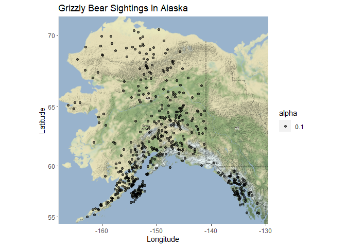
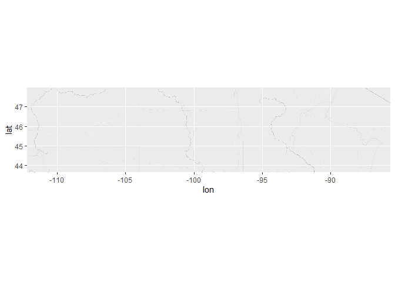
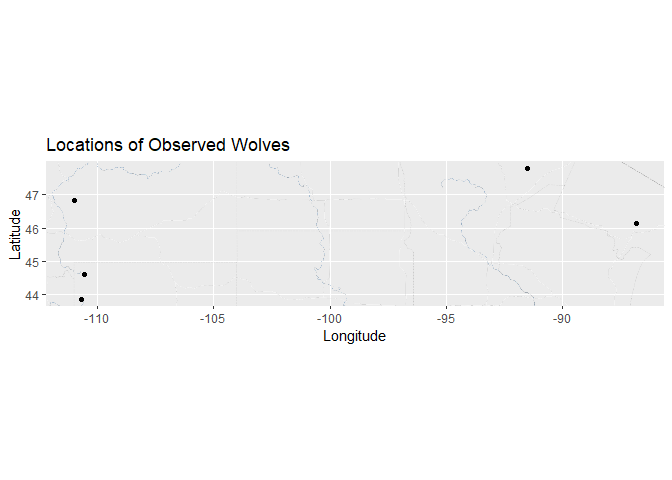
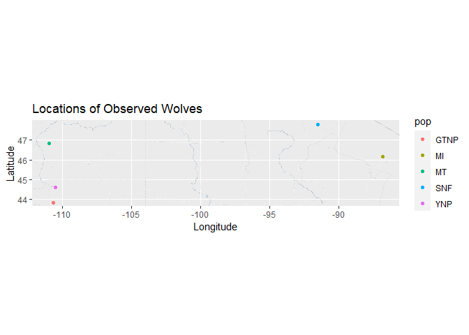

## Instructions
Answer the following questions and complete the exercises in RMarkdown. Please embed all of your code and push your final work to your repository. Your final lab report should be organized, clean, and run free from errors. Remember, you must remove the `#` for the included code chunks to run. Be sure to add your name to the author header above. For any included plots, make sure they are clearly labeled. You are free to use any plot type that you feel best communicates the results of your analysis.  

Make sure to use the formatting conventions of RMarkdown to make your report neat and clean!  

## Load the libraries

```r
library(tidyverse)
library(janitor)
library(here)
library(ggmap)
```


## Load the Data
We will use two separate data sets for this homework.  

1. The first [data set](https://rcweb.dartmouth.edu/~f002d69/workshops/index_rspatial.html) represent sightings of grizzly bears (Ursos arctos) in Alaska.  
2. The second data set is from Brandell, Ellen E (2021), Serological dataset and R code for: Patterns and processes of pathogen exposure in gray wolves across North America, Dryad, [Dataset](https://doi.org/10.5061/dryad.5hqbzkh51).  

1. Load the `grizzly` data and evaluate its structure. As part of this step, produce a summary that provides the range of latitude and longitude so you can build an appropriate bounding box.

```r
grizzly<- read_csv(here("lab12", "data", "bear-sightings.csv"))
```

```
## Rows: 494 Columns: 3
## -- Column specification --------------------------------------------------------
## Delimiter: ","
## dbl (3): bear.id, longitude, latitude
## 
## i Use `spec()` to retrieve the full column specification for this data.
## i Specify the column types or set `show_col_types = FALSE` to quiet this message.
```

```r
summary(grizzly)
```

```
##     bear.id       longitude         latitude    
##  Min.   :   7   Min.   :-166.2   Min.   :55.02  
##  1st Qu.:2569   1st Qu.:-154.2   1st Qu.:58.13  
##  Median :4822   Median :-151.0   Median :60.97  
##  Mean   :4935   Mean   :-149.1   Mean   :61.41  
##  3rd Qu.:7387   3rd Qu.:-145.6   3rd Qu.:64.13  
##  Max.   :9996   Max.   :-131.3   Max.   :70.37
```

2. Use the range of the latitude and longitude to build an appropriate bounding box for your map.

```r
lati<- c(55.02, 70.37)
longi<- c(-166.2, -131.3)
bobox <- make_bbox(longi, lati, f = 0.05)
```

3. Load a map from `stamen` in a terrain style projection and display the map.

```r
mapter<- get_map(bobox, maptype = "terrain", source = "stamen")
```

```
## Map tiles by Stamen Design, under CC BY 3.0. Data by OpenStreetMap, under ODbL.
```

```r
ggmap(mapter)
```

<!-- -->

4. Build a final map that overlays the recorded observations of grizzly bears in Alaska.

```r
ggmap(mapter)+
  geom_point(data = grizzly, aes(longitude, latitude, alpha=0.1))+
  labs(title = "Grizzly Bear Sightings In Alaska",
       x= "Longitude",
       y= "Latitude")
```

<!-- -->

Let's switch to the wolves data. Brandell, Ellen E (2021), Serological dataset and R code for: Patterns and processes of pathogen exposure in gray wolves across North America, Dryad, [Dataset](https://doi.org/10.5061/dryad.5hqbzkh51).  

5. Load the data and evaluate its structure.  

```r
wolves<- read_csv(here("lab12", "data", "wolves_data", "wolves_dataset.csv"))
```

```
## Rows: 1986 Columns: 23
## -- Column specification --------------------------------------------------------
## Delimiter: ","
## chr  (4): pop, age.cat, sex, color
## dbl (19): year, lat, long, habitat, human, pop.density, pack.size, standard....
## 
## i Use `spec()` to retrieve the full column specification for this data.
## i Specify the column types or set `show_col_types = FALSE` to quiet this message.
```

```r
wolves
```

```
## # A tibble: 1,986 x 23
##    pop     year age.cat sex   color   lat  long habitat human pop.density
##    <chr>  <dbl> <chr>   <chr> <chr> <dbl> <dbl>   <dbl> <dbl>       <dbl>
##  1 AK.PEN  2006 S       F     G      57.0 -158.    254.  10.4           8
##  2 AK.PEN  2006 S       M     G      57.0 -158.    254.  10.4           8
##  3 AK.PEN  2006 A       F     G      57.0 -158.    254.  10.4           8
##  4 AK.PEN  2006 S       M     B      57.0 -158.    254.  10.4           8
##  5 AK.PEN  2006 A       M     B      57.0 -158.    254.  10.4           8
##  6 AK.PEN  2006 A       M     G      57.0 -158.    254.  10.4           8
##  7 AK.PEN  2006 A       F     G      57.0 -158.    254.  10.4           8
##  8 AK.PEN  2006 P       M     G      57.0 -158.    254.  10.4           8
##  9 AK.PEN  2006 S       F     G      57.0 -158.    254.  10.4           8
## 10 AK.PEN  2006 P       M     G      57.0 -158.    254.  10.4           8
## # ... with 1,976 more rows, and 13 more variables: pack.size <dbl>,
## #   standard.habitat <dbl>, standard.human <dbl>, standard.pop <dbl>,
## #   standard.packsize <dbl>, standard.latitude <dbl>, standard.longitude <dbl>,
## #   cav.binary <dbl>, cdv.binary <dbl>, cpv.binary <dbl>, chv.binary <dbl>,
## #   neo.binary <dbl>, toxo.binary <dbl>
```

```r
summary(wolves)
```

```
##      pop                 year        age.cat              sex           
##  Length:1986        Min.   :1992   Length:1986        Length:1986       
##  Class :character   1st Qu.:2006   Class :character   Class :character  
##  Mode  :character   Median :2011   Mode  :character   Mode  :character  
##                     Mean   :2010                                        
##                     3rd Qu.:2016                                        
##                     Max.   :2019                                        
##                                                                         
##     color                lat             long            habitat       
##  Length:1986        Min.   :33.89   Min.   :-157.84   Min.   :  254.1  
##  Class :character   1st Qu.:44.60   1st Qu.:-123.73   1st Qu.:10375.2  
##  Mode  :character   Median :46.83   Median :-110.99   Median :11211.3  
##                     Mean   :50.43   Mean   :-116.86   Mean   :12797.4  
##                     3rd Qu.:57.89   3rd Qu.:-110.55   3rd Qu.:11860.8  
##                     Max.   :80.50   Max.   : -82.42   Max.   :34676.6  
##                                                                        
##      human          pop.density      pack.size    standard.habitat  
##  Min.   :   0.02   Min.   : 3.74   Min.   :3.55   Min.   :-1.63390  
##  1st Qu.:  80.60   1st Qu.: 7.40   1st Qu.:5.62   1st Qu.:-0.30620  
##  Median :2787.67   Median :11.63   Median :6.37   Median :-0.19650  
##  Mean   :2335.38   Mean   :14.91   Mean   :6.47   Mean   : 0.01158  
##  3rd Qu.:3973.47   3rd Qu.:25.32   3rd Qu.:8.25   3rd Qu.:-0.11130  
##  Max.   :6228.64   Max.   :33.96   Max.   :9.56   Max.   : 2.88180  
##                                                                     
##  standard.human     standard.pop      standard.packsize standard.latitude  
##  Min.   :-0.9834   Min.   :-1.13460   Min.   :-1.7585   Min.   :-1.805900  
##  1st Qu.:-0.9444   1st Qu.:-0.74630   1st Qu.:-0.5418   1st Qu.:-0.636900  
##  Median : 0.3648   Median :-0.29760   Median :-0.1009   Median :-0.392600  
##  Mean   : 0.1461   Mean   : 0.05084   Mean   :-0.0422   Mean   :-0.000006  
##  3rd Qu.: 0.9383   3rd Qu.: 1.15480   3rd Qu.: 1.0041   3rd Qu.: 0.814300  
##  Max.   : 2.0290   Max.   : 2.07150   Max.   : 1.7742   Max.   : 3.281900  
##                                                                            
##  standard.longitude    cav.binary       cdv.binary       cpv.binary    
##  Min.   :-2.144100   Min.   :0.0000   Min.   :0.0000   Min.   :0.0000  
##  1st Qu.:-0.359500   1st Qu.:1.0000   1st Qu.:0.0000   1st Qu.:1.0000  
##  Median : 0.306900   Median :1.0000   Median :0.0000   Median :1.0000  
##  Mean   :-0.000005   Mean   :0.8529   Mean   :0.2219   Mean   :0.7943  
##  3rd Qu.: 0.330200   3rd Qu.:1.0000   3rd Qu.:0.0000   3rd Qu.:1.0000  
##  Max.   : 1.801500   Max.   :1.0000   Max.   :1.0000   Max.   :1.0000  
##                      NA's   :321      NA's   :21       NA's   :7       
##    chv.binary       neo.binary      toxo.binary    
##  Min.   :0.0000   Min.   :0.0000   Min.   :0.0000  
##  1st Qu.:1.0000   1st Qu.:0.0000   1st Qu.:0.0000  
##  Median :1.0000   Median :0.0000   Median :0.0000  
##  Mean   :0.8018   Mean   :0.2804   Mean   :0.4832  
##  3rd Qu.:1.0000   3rd Qu.:1.0000   3rd Qu.:1.0000  
##  Max.   :1.0000   Max.   :1.0000   Max.   :1.0000  
##  NA's   :548      NA's   :538      NA's   :827
```

6. How many distinct wolf populations are included in this study? Mae a new object that restricts the data to the wolf populations in the lower 48 US states.

```r
wolves %>%
  count(n_distinct(pop))
```

```
## # A tibble: 1 x 2
##   `n_distinct(pop)`     n
##               <int> <int>
## 1                17  1986
```

```r
us_wolves<- wolves %>%
  filter(lat > 33.89 & lat < 50)
us_wolves
```

```
## # A tibble: 988 x 23
##    pop    year age.cat sex   color   lat  long habitat human pop.density
##    <chr> <dbl> <chr>   <chr> <chr> <dbl> <dbl>   <dbl> <dbl>       <dbl>
##  1 GTNP   2012 P       M     G      43.8 -111.  10375. 3924.        34.0
##  2 GTNP   2012 P       F     G      43.8 -111.  10375. 3924.        34.0
##  3 GTNP   2012 P       F     G      43.8 -111.  10375. 3924.        34.0
##  4 GTNP   2012 P       M     B      43.8 -111.  10375. 3924.        34.0
##  5 GTNP   2013 A       F     G      43.8 -111.  10375. 3924.        34.0
##  6 GTNP   2013 A       M     G      43.8 -111.  10375. 3924.        34.0
##  7 GTNP   2013 P       M     G      43.8 -111.  10375. 3924.        34.0
##  8 GTNP   2013 P       M     G      43.8 -111.  10375. 3924.        34.0
##  9 GTNP   2013 P       M     G      43.8 -111.  10375. 3924.        34.0
## 10 GTNP   2013 P       F     G      43.8 -111.  10375. 3924.        34.0
## # ... with 978 more rows, and 13 more variables: pack.size <dbl>,
## #   standard.habitat <dbl>, standard.human <dbl>, standard.pop <dbl>,
## #   standard.packsize <dbl>, standard.latitude <dbl>, standard.longitude <dbl>,
## #   cav.binary <dbl>, cdv.binary <dbl>, cpv.binary <dbl>, chv.binary <dbl>,
## #   neo.binary <dbl>, toxo.binary <dbl>
```

```r
summary(us_wolves)
```

```
##      pop                 year        age.cat              sex           
##  Length:988         Min.   :1997   Length:988         Length:988        
##  Class :character   1st Qu.:2006   Class :character   Class :character  
##  Mode  :character   Median :2010   Mode  :character   Mode  :character  
##                     Mean   :2010                                        
##                     3rd Qu.:2014                                        
##                     Max.   :2019                                        
##                                                                         
##     color                lat             long            habitat     
##  Length:988         Min.   :43.82   Min.   :-110.99   Min.   : 9511  
##  Class :character   1st Qu.:44.60   1st Qu.:-110.99   1st Qu.:11166  
##  Mode  :character   Median :46.15   Median :-110.55   Median :11166  
##                     Mean   :45.80   Mean   :-106.49   Mean   :12906  
##                     3rd Qu.:46.83   3rd Qu.:-110.55   3rd Qu.:11211  
##                     Max.   :47.75   Max.   : -86.82   Max.   :32018  
##                                                                      
##      human       pop.density      pack.size    standard.habitat  
##  Min.   :3240   Min.   :11.63   Min.   :4.81   Min.   :-0.41960  
##  1st Qu.:3240   1st Qu.:11.63   1st Qu.:5.62   1st Qu.:-0.20240  
##  Median :3973   Median :25.32   Median :7.12   Median :-0.20240  
##  Mean   :3997   Mean   :22.14   Mean   :6.87   Mean   : 0.02588  
##  3rd Qu.:3973   3rd Qu.:28.93   3rd Qu.:8.25   3rd Qu.:-0.19650  
##  Max.   :6229   Max.   :33.96   Max.   :8.25   Max.   : 2.53310  
##                                                                  
##  standard.human    standard.pop     standard.packsize standard.latitude
##  Min.   :0.5834   Min.   :-0.2976   Min.   :-1.0179   Min.   :-0.7219  
##  1st Qu.:0.5834   1st Qu.:-0.2976   1st Qu.:-0.5418   1st Qu.:-0.6369  
##  Median :0.9383   Median : 1.1548   Median : 0.3399   Median :-0.4677  
##  Mean   :0.9497   Mean   : 0.8179   Mean   : 0.1927   Mean   :-0.5058  
##  3rd Qu.:0.9383   3rd Qu.: 1.5378   3rd Qu.: 1.0041   3rd Qu.:-0.3926  
##  Max.   :2.0290   Max.   : 2.0715   Max.   : 1.0041   Max.   :-0.2927  
##                                                                        
##  standard.longitude   cav.binary       cdv.binary       cpv.binary    
##  Min.   :0.3069     Min.   :0.0000   Min.   :0.0000   Min.   :0.0000  
##  1st Qu.:0.3069     1st Qu.:1.0000   1st Qu.:0.0000   1st Qu.:1.0000  
##  Median :0.3302     Median :1.0000   Median :0.0000   Median :1.0000  
##  Mean   :0.5424     Mean   :0.8342   Mean   :0.2769   Mean   :0.8852  
##  3rd Qu.:0.3302     3rd Qu.:1.0000   3rd Qu.:1.0000   3rd Qu.:1.0000  
##  Max.   :1.5716     Max.   :1.0000   Max.   :1.0000   Max.   :1.0000  
##                     NA's   :41       NA's   :2        NA's   :4       
##    chv.binary       neo.binary      toxo.binary    
##  Min.   :0.0000   Min.   :0.0000   Min.   :0.0000  
##  1st Qu.:1.0000   1st Qu.:0.0000   1st Qu.:0.0000  
##  Median :1.0000   Median :0.0000   Median :0.0000  
##  Mean   :0.7903   Mean   :0.3777   Mean   :0.4817  
##  3rd Qu.:1.0000   3rd Qu.:1.0000   3rd Qu.:1.0000  
##  Max.   :1.0000   Max.   :1.0000   Max.   :1.0000  
##  NA's   :201      NA's   :207      NA's   :496
```

```r
us_wolves %>%
  count(n_distinct(lat))
```

```
## # A tibble: 1 x 2
##   `n_distinct(lat)`     n
##               <int> <int>
## 1                 5   988
```

7. Use the range of the latitude and longitude to build an appropriate bounding box for your map.

```r
latw<- c(43.82, 47.75)
longw<- c(-110.99, -86.82)
bboxw <- make_bbox(longw, latw, f = 0.05)
```

8.  Load a map from `stamen` in a `terrain-lines` projection and display the map.

```r
mapterline<- get_map(bboxw, maptype = "terrain-lines", source = "stamen")
```

```
## Map tiles by Stamen Design, under CC BY 3.0. Data by OpenStreetMap, under ODbL.
```

```r
ggmap(mapterline)
```

<!-- -->
9. Build a final map that overlays the recorded observations of wolves in the lower 48 states.

```r
ggmap(mapterline) +
  geom_point(data = us_wolves, aes(long, lat))+
  labs(title = "Locations of Observed Wolves",
       x= "Longitude",
       y= "Latitude")
```

<!-- -->
10. Use the map from #9 above, but add some aesthetics. Try to `fill` and `color` by population.

```r
ggmap(mapterline) +
  geom_point(data = us_wolves, aes(long, lat, fill=pop, color=pop))+
  labs(title = "Locations of Observed Wolves",
       x= "Longitude",
       y= "Latitude")
```

<!-- -->
## Push your final code to GitHub!
Please be sure that you check the `keep md` file in the knit preferences. 
