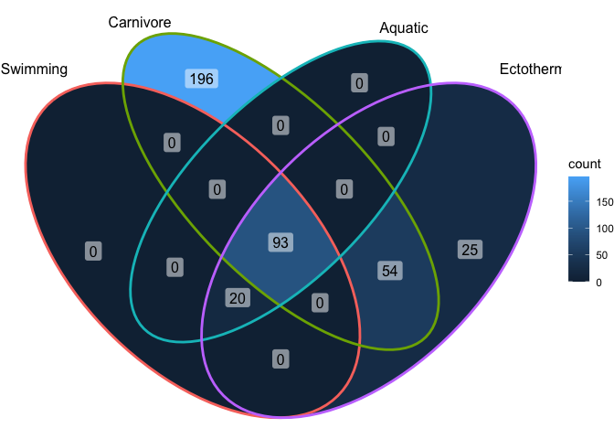

## Learning Goals
*At the end of this exercise, you will be able to:*    
1. Build a venn diagram
2. Build a word cloud


## Load Libraries

```r
library(tidyverse)
```

```
## -- Attaching packages --------------------------------------- tidyverse 1.3.1 --
```

```
## v ggplot2 3.3.5     v purrr   0.3.4
## v tibble  3.1.6     v dplyr   1.0.8
## v tidyr   1.2.0     v stringr 1.4.0
## v readr   2.1.2     v forcats 0.5.1
```

```
## Warning: package 'tidyr' was built under R version 4.1.2
```

```
## Warning: package 'readr' was built under R version 4.1.2
```

```
## Warning: package 'dplyr' was built under R version 4.1.2
```

```
## -- Conflicts ------------------------------------------ tidyverse_conflicts() --
## x dplyr::filter() masks stats::filter()
## x dplyr::lag()    masks stats::lag()
```

```r
#install.packages("ggVennDiagram")
library(ggVennDiagram)
library(RColorBrewer)
#install.packages("ggworldcloud")
library(ggwordcloud)
```

## Data
Let's use the homerange data-- I've slightly modified it with a new observation

```r
homerange <- read_csv("data/modified_Tamburelloetal_HomeRangeDatabase.csv")
```

```
## Rows: 570 Columns: 24
## -- Column specification --------------------------------------------------------
## Delimiter: ","
## chr (16): taxon, common.name, class, order, family, genus, species, primarym...
## dbl  (8): mean.mass.g, log10.mass, mean.hra.m2, log10.hra, dimension, preyma...
## 
## i Use `spec()` to retrieve the full column specification for this data.
## i Specify the column types or set `show_col_types = FALSE` to quiet this message.
```

## Venn Diagrams

[great info here](https://cran.r-project.org/web/packages/ggVennDiagram/vignettes/using-ggVennDiagram.html) on how these are coded in ggplot. 

Sometimes its tricky to figure out what kind of data can be represented with a Venn diagram. I like to think of them as asking a series of questions about each row in you dataset, that are not mutually exclusive/inclusive. 

For the animals in the homerange database, we will ask a series of yes/no questions.

Let's start with: Do they fly? Do they swim? 
We will use `pull` to create a vector of the `common.name`s of animals that would answer this question with "yes".

Do they fly?

```r
flying_vec <- homerange %>%
  filter(locomotion == "flying")%>%
  pull(common.name)
flying_vec
```

```
##   [1] "golden eagle"                   "common buzzard"                
##   [3] "short-toed snake eagle"         "Bonelli's eagle"               
##   [5] "booted eagle"                   "Egyptian vulture"              
##   [7] "European nightjar"              "inca dove"                     
##   [9] "common wood pigeon"             "European turtle dove"          
##  [11] "European roller"                "hoopoe"                        
##  [13] "great spotted cuckoo"           "common cuckoo"                 
##  [15] "Cooper's hawk"                  "Northern goshawk"              
##  [17] "Eurasian sparrowhawk"           "sharp-shinned hawk"            
##  [19] "red-tailed hawk"                "red-shouldered hawk"           
##  [21] "Swainson's hawk"                "hen harrier"                   
##  [23] "Montagu's harrier"              "red kite"                      
##  [25] "lanner falcon"                  "prairie falcon"                
##  [27] "peregrine falcon"               "American kestrel"              
##  [29] "European kestrel"               "melodious warbler"             
##  [31] "long-tailed tit"                "woodlark"                      
##  [33] "red-throated ant tanager"       "red-crowned ant tanager"       
##  [35] "Eurasian treecreeper"           "streaked fantail warbler"      
##  [37] "common raven"                   "spotted nutcracker"            
##  [39] "Peruvian plantcutter"           "grasshopper sparrow"           
##  [41] "indigo bunting"                 "Abert's towhee"                
##  [43] "canyon towhee"                  "American tree sparrow"         
##  [45] "chipping sparrow"               "common linnet"                 
##  [47] "common chaffinch"               "European serin"                
##  [49] "eastern meadowlark"             "western meadowlard"            
##  [51] "yellow-breasted chat"           "red-backed shrike"             
##  [53] "loggerhead shrike"              "lesser grey shrike"            
##  [55] "woodchat shrike"                "northern mockingbird"          
##  [57] "white wagtail"                  "western yellow wagtail"        
##  [59] "spotted flycatcher"             "northern wheatear"             
##  [61] "common redstart"                "whinchat"                      
##  [63] "black-capped chickadee"         "Carolina chickadee"            
##  [65] "Oak titmouse"                   "marsh tit"                     
##  [67] "mourning warbler"               "common yellowthroat"           
##  [69] "prothonotary warbler"           "ovenbird"                      
##  [71] "Blackburnian warbler"           "Kirtland's warbler"            
##  [73] "magnolia warbler"               "chestnut-sided warbler"        
##  [75] "American yellow warbler"        "American redstart"             
##  [77] "black-throated green warbler"   "Canada warbler"                
##  [79] "Western Bonelli's warbler"      "common firecrest"              
##  [81] "goldcrest"                      "European nuthatch"             
##  [83] "wrentit"                        "Marmora's warbler"             
##  [85] "Dartford warbler"               "Berwick's wren"                
##  [87] "Carolina wren"                  "house wren"                    
##  [89] "Eurasian wren"                  "eastern bluebird"              
##  [91] "eastern wood pewee"             "least flycatcher"              
##  [93] "American gray flycatcher"       "eastern kingbird"              
##  [95] "black-capped vireo"             "Bell's vireo"                  
##  [97] "white-eyed vireo"               "red-eyed vireo"                
##  [99] "black woodpecker"               "Eurasian wryneck"              
## [101] "white-backed woodpecker"        "middle spotted woodpeckers"    
## [103] "Eurasian three-toed woodpecker" "grey-headed woodpecker"        
## [105] "European green woodpecker"      "boreal owl"                    
## [107] "long-eared owl"                 "little owl"                    
## [109] "Eurasian eagle-owl"             "great horned owl"              
## [111] "Eurasian pygmy owl"             "snowy owl"                     
## [113] "tawny owl"                      "barn owl"                      
## [115] "Whiskered Bat"
```

Do they swim?

```r
swimming_vec <- homerange %>%
  filter(locomotion == "swimming")%>%
  pull(common.name)
swimming_vec
```

```
##   [1] "american eel"                     "blacktail redhorse"              
##   [3] "central stoneroller"              "rosyside dace"                   
##   [5] "longnose dace"                    "muskellunge"                     
##   [7] "pollack"                          "saithe"                          
##   [9] "lined surgeonfish"                "orangespine unicornfish"         
##  [11] "bluespine unicornfish"            "redlip blenny"                   
##  [13] "giant trevally"                   "rock bass"                       
##  [15] "pumpkinseed"                      "bluegill"                        
##  [17] "longear sunfish"                  "smallmouth bass"                 
##  [19] "largemouth bass"                  "white crappie"                   
##  [21] "eastern triangular butterflyfish" "Tahititan butterflyfish"         
##  [23] "chevron butterflyfish"            "melon butterflyfish"             
##  [25] "teardrop butterflyfish"           "red moki"                        
##  [27] "redspotted hawkfish"              "dwarf hawkfish"                  
##  [29] "cabezon"                          "japanese shrimpgoby"             
##  [31] "bluebanded goby"                  "rusty goby"                      
##  [33] "blackeye goby"                    "longfinned goby"                 
##  [35] "bermuda chub"                     "spanish hogfish"                 
##  [37] "humphead wrasse"                  "mediterranean rainbow wrasse"    
##  [39] "slippery dick"                    "yellowhead wrasse"               
##  [41] "clown wrasse"                     "blackear wrasse"                 
##  [43] "bluestreak cleaner wrasse"        "ballan wrasse"                   
##  [45] "maori wrasse"                     "california sheepshead"           
##  [47] "cunner"                           "bluehead wrasse"                 
##  [49] "moon wrasse"                      "thumbprint emperor"              
##  [51] "mutton snapper"                   "schoolmaster snapper"            
##  [53] "checkered snapper"                "gray snapper"                    
##  [55] "yellowtail snapper"               "ocean whitefish"                 
##  [57] "european seabass"                 "white goatfish"                  
##  [59] "whitesaddle goatfish"             "yellow perch"                    
##  [61] "canary damsel"                    "cherubfish"                      
##  [63] "damselfish"                       "twinspot damselfish"             
##  [65] "whitetail dascyllus"              "wards damsel"                    
##  [67] "australian gregory"               "bicolor damselfish"              
##  [69] "cocoa damselfish"                 "steephead parrotfish"            
##  [71] "striped parrotfish"               "rivulated parrotfish"            
##  [73] "redband parrotfish"               "redtail parrotfish"              
##  [75] "redfin parrotfish"                "stoplight parrotfish"            
##  [77] "peacock hind"                     "graysby"                         
##  [79] "yellowfin hind"                   "coral hind"                      
##  [81] "red hind"                         "dusky grouper"                   
##  [83] "red grouper"                      "nassau grouper"                  
##  [85] "greasy grouper"                   "redbanded perch"                 
##  [87] "half-banded seaperch"             "black grouper"                   
##  [89] "kelp bass"                        "barred sand bass"                
##  [91] "coral grouper"                    "coral trout"                     
##  [93] "comber"                           "painted comber"                  
##  [95] "salema"                           "gilthead seabream"               
##  [97] "cutthroat trout"                  "gila trout"                      
##  [99] "rainbow trout"                    "atlantic salmon"                 
## [101] "brown trout"                      "mottled sculpin"                 
## [103] "banded sculpin"                   "sculpin"                         
## [105] "copper rockfish"                  "japanese black rockfish"         
## [107] "quillback rockfish"               "black rockfish"                  
## [109] "blue rockfish"                    "yellow bullhead"                 
## [111] "long-snouted seahorse"            "worm pipefish"                   
## [113] "atlantic sharpnose puffer"
```

To build a Venn diagram of these, we make a list or the vectors that represent our questions. 
The list represents the number of circles going into the venn diagram" and the vectors represent "what are the numbers going into the venn diagram"


```r
fly_or_swim_list <- list(flying_vec, swimming_vec)

ggVennDiagram(fly_or_swim_list, category.names = c("Fly", "Swim"))
```

<!-- -->

Woah! an image!
But its not that useful. Since we are pretty familiar with this data, we know that `locomotion` is one column, and each animal only has one entry for locomotion, which is probably their primary for of movement. This results in `Swim` and `Fly` being mutually exclusive. 


So venn diagrams work best when asking questions **about data from 2 different columns**. 
Let's retry this with a more informative question: 

Do they fly? Are they a bird? 
We can recycle the `flying_vec`
Do they fly?

```r
flying_vec
```

```
##   [1] "golden eagle"                   "common buzzard"                
##   [3] "short-toed snake eagle"         "Bonelli's eagle"               
##   [5] "booted eagle"                   "Egyptian vulture"              
##   [7] "European nightjar"              "inca dove"                     
##   [9] "common wood pigeon"             "European turtle dove"          
##  [11] "European roller"                "hoopoe"                        
##  [13] "great spotted cuckoo"           "common cuckoo"                 
##  [15] "Cooper's hawk"                  "Northern goshawk"              
##  [17] "Eurasian sparrowhawk"           "sharp-shinned hawk"            
##  [19] "red-tailed hawk"                "red-shouldered hawk"           
##  [21] "Swainson's hawk"                "hen harrier"                   
##  [23] "Montagu's harrier"              "red kite"                      
##  [25] "lanner falcon"                  "prairie falcon"                
##  [27] "peregrine falcon"               "American kestrel"              
##  [29] "European kestrel"               "melodious warbler"             
##  [31] "long-tailed tit"                "woodlark"                      
##  [33] "red-throated ant tanager"       "red-crowned ant tanager"       
##  [35] "Eurasian treecreeper"           "streaked fantail warbler"      
##  [37] "common raven"                   "spotted nutcracker"            
##  [39] "Peruvian plantcutter"           "grasshopper sparrow"           
##  [41] "indigo bunting"                 "Abert's towhee"                
##  [43] "canyon towhee"                  "American tree sparrow"         
##  [45] "chipping sparrow"               "common linnet"                 
##  [47] "common chaffinch"               "European serin"                
##  [49] "eastern meadowlark"             "western meadowlard"            
##  [51] "yellow-breasted chat"           "red-backed shrike"             
##  [53] "loggerhead shrike"              "lesser grey shrike"            
##  [55] "woodchat shrike"                "northern mockingbird"          
##  [57] "white wagtail"                  "western yellow wagtail"        
##  [59] "spotted flycatcher"             "northern wheatear"             
##  [61] "common redstart"                "whinchat"                      
##  [63] "black-capped chickadee"         "Carolina chickadee"            
##  [65] "Oak titmouse"                   "marsh tit"                     
##  [67] "mourning warbler"               "common yellowthroat"           
##  [69] "prothonotary warbler"           "ovenbird"                      
##  [71] "Blackburnian warbler"           "Kirtland's warbler"            
##  [73] "magnolia warbler"               "chestnut-sided warbler"        
##  [75] "American yellow warbler"        "American redstart"             
##  [77] "black-throated green warbler"   "Canada warbler"                
##  [79] "Western Bonelli's warbler"      "common firecrest"              
##  [81] "goldcrest"                      "European nuthatch"             
##  [83] "wrentit"                        "Marmora's warbler"             
##  [85] "Dartford warbler"               "Berwick's wren"                
##  [87] "Carolina wren"                  "house wren"                    
##  [89] "Eurasian wren"                  "eastern bluebird"              
##  [91] "eastern wood pewee"             "least flycatcher"              
##  [93] "American gray flycatcher"       "eastern kingbird"              
##  [95] "black-capped vireo"             "Bell's vireo"                  
##  [97] "white-eyed vireo"               "red-eyed vireo"                
##  [99] "black woodpecker"               "Eurasian wryneck"              
## [101] "white-backed woodpecker"        "middle spotted woodpeckers"    
## [103] "Eurasian three-toed woodpecker" "grey-headed woodpecker"        
## [105] "European green woodpecker"      "boreal owl"                    
## [107] "long-eared owl"                 "little owl"                    
## [109] "Eurasian eagle-owl"             "great horned owl"              
## [111] "Eurasian pygmy owl"             "snowy owl"                     
## [113] "tawny owl"                      "barn owl"                      
## [115] "Whiskered Bat"
```

Are they a bird?

```r
bird_vec <- homerange %>%
  filter(taxon == "birds")%>%
  pull(common.name)
bird_vec
```

```
##   [1] "golden eagle"                   "common buzzard"                
##   [3] "short-toed snake eagle"         "Bonelli's eagle"               
##   [5] "booted eagle"                   "Egyptian vulture"              
##   [7] "gadwall"                        "northern brown kiwi"           
##   [9] "European nightjar"              "oystercatcher"                 
##  [11] "inca dove"                      "common wood pigeon"            
##  [13] "European turtle dove"           "European roller"               
##  [15] "hoopoe"                         "great spotted cuckoo"          
##  [17] "common cuckoo"                  "greater roadrunner"            
##  [19] "banded ground-cuckoo"           "Cooper's hawk"                 
##  [21] "Northern goshawk"               "Eurasian sparrowhawk"          
##  [23] "sharp-shinned hawk"             "red-tailed hawk"               
##  [25] "red-shouldered hawk"            "Swainson's hawk"               
##  [27] "hen harrier"                    "Montagu's harrier"             
##  [29] "red kite"                       "caracara"                      
##  [31] "red-throated caracara"          "lanner falcon"                 
##  [33] "prairie falcon"                 "peregrine falcon"              
##  [35] "American kestrel"               "European kestrel"              
##  [37] "hazel grouse"                   "sage grouse"                   
##  [39] "dusky grouse"                   "willow ptarmigan"              
##  [41] "grey partridge"                 "black grouse"                  
##  [43] "western capercaillie"           "greater prairie-chicken"       
##  [45] "brown wood rail"                "corncrake"                     
##  [47] "king rail"                      "melodious warbler"             
##  [49] "long-tailed tit"                "woodlark"                      
##  [51] "red-throated ant tanager"       "red-crowned ant tanager"       
##  [53] "Eurasian treecreeper"           "streaked fantail warbler"      
##  [55] "common raven"                   "spotted nutcracker"            
##  [57] "Peruvian plantcutter"           "grasshopper sparrow"           
##  [59] "indigo bunting"                 "Abert's towhee"                
##  [61] "canyon towhee"                  "American tree sparrow"         
##  [63] "chipping sparrow"               "common linnet"                 
##  [65] "common chaffinch"               "European serin"                
##  [67] "eastern meadowlark"             "western meadowlard"            
##  [69] "yellow-breasted chat"           "red-backed shrike"             
##  [71] "loggerhead shrike"              "lesser grey shrike"            
##  [73] "woodchat shrike"                "northern mockingbird"          
##  [75] "white wagtail"                  "western yellow wagtail"        
##  [77] "spotted flycatcher"             "northern wheatear"             
##  [79] "common redstart"                "whinchat"                      
##  [81] "black-capped chickadee"         "Carolina chickadee"            
##  [83] "Oak titmouse"                   "marsh tit"                     
##  [85] "mourning warbler"               "common yellowthroat"           
##  [87] "prothonotary warbler"           "ovenbird"                      
##  [89] "Blackburnian warbler"           "Kirtland's warbler"            
##  [91] "magnolia warbler"               "chestnut-sided warbler"        
##  [93] "American yellow warbler"        "American redstart"             
##  [95] "black-throated green warbler"   "Canada warbler"                
##  [97] "Western Bonelli's warbler"      "tooth-billed bowerbird"        
##  [99] "common firecrest"               "goldcrest"                     
## [101] "European nuthatch"              "wrentit"                       
## [103] "Marmora's warbler"              "Dartford warbler"              
## [105] "Berwick's wren"                 "Carolina wren"                 
## [107] "house wren"                     "Eurasian wren"                 
## [109] "eastern bluebird"               "eastern wood pewee"            
## [111] "least flycatcher"               "American gray flycatcher"      
## [113] "eastern kingbird"               "black-capped vireo"            
## [115] "Bell's vireo"                   "white-eyed vireo"              
## [117] "red-eyed vireo"                 "great bittern"                 
## [119] "least bittern"                  "black woodpecker"              
## [121] "Eurasian wryneck"               "white-backed woodpecker"       
## [123] "middle spotted woodpeckers"     "Eurasian three-toed woodpecker"
## [125] "grey-headed woodpecker"         "European green woodpecker"     
## [127] "kakapo"                         "greater rhea"                  
## [129] "lesser rhea"                    "boreal owl"                    
## [131] "long-eared owl"                 "little owl"                    
## [133] "Eurasian eagle-owl"             "great horned owl"              
## [135] "Eurasian pygmy owl"             "snowy owl"                     
## [137] "tawny owl"                      "barn owl"                      
## [139] "ostrich"                        "ornate tinamou"
```


```r
fly_or_bird_list <- list(flying_vec, bird_vec)

ggVennDiagram(fly_or_bird_list, category.names = c("Fly", "Bird"))
```

<!-- -->


What are the 26 non-flying birds?

```r
homerange%>%
  filter(taxon == "birds")%>%
  filter(locomotion != "flying")%>%
  select(common.name)
```

```
## # A tibble: 26 x 1
##    common.name          
##    <chr>                
##  1 gadwall              
##  2 northern brown kiwi  
##  3 oystercatcher        
##  4 greater roadrunner   
##  5 banded ground-cuckoo 
##  6 caracara             
##  7 red-throated caracara
##  8 hazel grouse         
##  9 sage grouse          
## 10 dusky grouse         
## # ... with 16 more rows
```

what is the flying non-bird?

```r
homerange%>%
  filter(taxon != "birds")%>%
  filter(locomotion == "flying")%>%
  select(common.name)
```

```
## # A tibble: 1 x 1
##   common.name  
##   <chr>        
## 1 Whiskered Bat
```


### Adding Circles
Are they an herbivore?


```r
herbivore_vec <- homerange %>%
  filter(trophic.guild == "herbivore")%>%
  pull(common.name)
herbivore_vec
```

```
##   [1] "lined surgeonfish"              "orangespine unicornfish"       
##   [3] "bluespine unicornfish"          "redlip blenny"                 
##   [5] "bermuda chub"                   "cherubfish"                    
##   [7] "damselfish"                     "twinspot damselfish"           
##   [9] "wards damsel"                   "australian gregory"            
##  [11] "bicolor damselfish"             "cocoa damselfish"              
##  [13] "steephead parrotfish"           "striped parrotfish"            
##  [15] "rivulated parrotfish"           "redband parrotfish"            
##  [17] "redtail parrotfish"             "redfin parrotfish"             
##  [19] "stoplight parrotfish"           "salema"                        
##  [21] "gadwall"                        "inca dove"                     
##  [23] "common wood pigeon"             "European turtle dove"          
##  [25] "hazel grouse"                   "sage grouse"                   
##  [27] "dusky grouse"                   "willow ptarmigan"              
##  [29] "grey partridge"                 "black grouse"                  
##  [31] "western capercaillie"           "greater prairie-chicken"       
##  [33] "corncrake"                      "spotted nutcracker"            
##  [35] "Peruvian plantcutter"           "Abert's towhee"                
##  [37] "canyon towhee"                  "common linnet"                 
##  [39] "tooth-billed bowerbird"         "kakapo"                        
##  [41] "greater rhea"                   "lesser rhea"                   
##  [43] "ostrich"                        "ornate tinamou"                
##  [45] "pronghorn"                      "impala"                        
##  [47] "hartebeest"                     "barbary sheep"                 
##  [49] "American bison"                 "European bison"                
##  [51] "goat"                           "Spanish ibex"                  
##  [53] "Peter's dukier"                 "bay dikier"                    
##  [55] "mountain gazelle"               "G<U+00FC>nther's dik-dik"      
##  [57] "mountain goat"                  "argali"                        
##  [59] "bighorn sheep"                  "steenbok"                      
##  [61] "chamois"                        "common eland"                  
##  [63] "bushbuck"                       "greater kudu"                  
##  [65] "moose"                          "chital"                        
##  [67] "roe deer"                       "red deer"                      
##  [69] "sika deer"                      "fallow deer"                   
##  [71] "Reeves's muntjac"               "mule deer"                     
##  [73] "white-tailed deer"              "pampas deer"                   
##  [75] "pudu"                           "reindeer"                      
##  [77] "giraffe"                        "okapi"                         
##  [79] "desert warthog"                 "Chacoan peccary"               
##  [81] "collared peccary"               "white-lipped peccary"          
##  [83] "water chevrotain"               "red panda"                     
##  [85] "thick-tailed three-toed jerboa" "kinkajou"                      
##  [87] "giant panda"                    "Lumholtz's tree-kangaroo"      
##  [89] "antilopine kangaroo"            "black-striped wallaby"         
##  [91] "Western grey kangaroo"          "Eastern grey kangaroo"         
##  [93] "common wallaroo"                "red-necked wallaby"            
##  [95] "red kangaroo"                   "allied rock-wallaby"           
##  [97] "eastern bettong"                "long-footed potoroo"           
##  [99] "greater glider"                 "bridled nail-tail wallaby"     
## [101] "red-legged pademelon"           "red-necked pademelon"          
## [103] "swamp wallaby"                  "common brushtail possum"       
## [105] "northern hairy-nosed wombat"    "common wombat"                 
## [107] "pygmy rabbit"                   "snowshoe hare"                 
## [109] "Arctic hare"                    "black-tailed jackrabbit"       
## [111] "cape hare"                      "European hare"                 
## [113] "Indian hare"                    "mountain hare"                 
## [115] "European rabbit"                "swamp rabbit"                  
## [117] "eastern cottontail"             "marsh rabbit"                  
## [119] "plateau pika"                   "American pika"                 
## [121] "horse"                          "white rhinoceros"              
## [123] "black rhinoceros"               "maned sloth"                   
## [125] "Asian elephant"                 "African bush elephant"         
## [127] "mountain beaver"                "cape dune mole rat"            
## [129] "Damaraland mole rat"            "common mole rat"               
## [131] "cape mole rat"                  "silvery mole rat"              
## [133] "naked mole rat"                 "Patagonian mara"               
## [135] "plains viscacha"                "western red-backed vole"       
## [137] "large-headed rice rat"          "Siberian brown lemming"        
## [139] "field vole"                     "California vole"               
## [141] "montane vole"                   "prairie vole"                  
## [143] "meadow vole"                    "woodland vole"                 
## [145] "water vole"                     "wood lemming"                  
## [147] "bushy-tailed woodrat"           "dusky-footed woodrat"          
## [149] "desert woodrat"                 "Southern plains woodrat"       
## [151] "muskrat"                        "salt marsh harvest mouse"      
## [153] "southern bog lemming"           "dwarf fat-tailed jerboa"       
## [155] "Cuvier's spiny rat"             "Tome's spiny rat"              
## [157] "Brazilian porcupine"            "North American porcupine"      
## [159] "Botta's pocket gopher"          "spectacled dormouse"           
## [161] "hazel dormouse"                 "giant kangaroo rat"            
## [163] "Merriam's kangaroo rat"         "Ord's kangaroo rat"            
## [165] "banner-tailed kangaroo rat"     "Stephen's kangaroo rat"        
## [167] "cape porcupine"                 "Indian crested porcupine"      
## [169] "African brush-tailed porcupine" "yellow-necked mouse"           
## [171] "wood mouse"                     "Indian desert jird"            
## [173] "broad-toothed mouse"            "Malagasy giant rat"            
## [175] "White-bellied<U+00A0>nesomys"   "island mouse"                  
## [177] "coruro"                         "Siberian chipmunk"             
## [179] "Northern parl squirrel"         "Northern flying squirrel"      
## [181] "Southern flying squirrel"       "yellow-bellied marmot"         
## [183] "groundhog"                      "red bush squirrel"             
## [185] "Abert's squirrel"               "eastern gray squirrel"         
## [187] "Japanese squirrel"              "fox squirrel"                  
## [189] "red squirrel"                   "California ground squirrel"    
## [191] "Columbian ground squirrel"      "Franklin's ground squirrel"    
## [193] "arctic ground squirrel"         "spotted ground squirrel"       
## [195] "thirteen-lined ground squirrel" "rock squirrel"                 
## [197] "yellow-pine chipmunk"           "least chipmunk"                
## [199] "Colorado chipmunk"              "Uinta chipmunk"                
## [201] "American red squirrel"          "striped ground squirrel"       
## [203] "spiny tail lizard"              "Galapagos land iguana"         
## [205] "Bahamian Andros iguana"         "blue iguana"                   
## [207] "Anegada ground iguana"          "Angel island chuckwalla"       
## [209] "common chuckwalla"              "desert iguana"                 
## [211] "Tenerife lizard"                "High Mountain Lizard"          
## [213] "land mullet"                    "ornate box turtle"             
## [215] "Spanish pond turtle"            "red-footed tortoise"           
## [217] "desert tortoise"                "gopher tortoise"               
## [219] "travancore tortoise"            "Speke's hinge-backed tortoise" 
## [221] "impressed tortoise"             "bushmanland tent tortoise"     
## [223] "leopard tortoise"               "spur-thighed tortoise"         
## [225] "mediterranean tortoise"         "Russian steppe tortoise"       
## [227] "Egyptian tortoise"
```


```r
fly_bird_herbi_list <- list(flying_vec, bird_vec, herbivore_vec)

ggVennDiagram(fly_bird_herbi_list, category.names = c("Fly", "Bird", "Herbivore"))
```

<!-- -->

### Make It Pretty!

Lets work with the 2 question plot for now:

```r
  # you can toggle edge size
venn_plot <- ggVennDiagram(fly_or_bird_list, category.names = c("Fly", "Bird"), edge_size = 1.5)

venn_plot +
  scale_fill_distiller(palette = "Greys")+ #distiller is for discrete data
  labs(title = "Do all birds fly? Do only birds fly?",
         caption = ("you can add a caption here, e.g.: Studys show not all birds fly, and not only birds fly")
  )
```

<!-- -->


```r
  # you can toggle edge size and label (Fly, Bird) colors here
ggVennDiagram(fly_or_bird_list,
              set_color = c("black", "blue"),             # sets label colors
              category.names = c("Fly", "Bird"),          # sets category label names
              label_color = "firebrick",                  # sets overlap-quantity label color
              label_size = 4                              # sets overlap-label size
              )+
  scale_color_brewer(palette = "Set3")+                   # sets palette for circle colors
  scale_fill_distiller(palette = "Greys")+                # distiller is for discrete data
  labs(title = "Do all birds fly? Do only birds fly?",
         caption = ("you can add a caption here, e.g.: Studys show not all birds fly, and not only birds fly") )
```

<!-- -->


## Practice

Try making a 4 circle Venn diagram to show the intersection of:
- swimming
- carnivores
- aquatic
- endotherms

You can use locomotion, trophic guild, realm, and thermoregulation. 


```r
#Set Up the vectors:

   #you can also recycle the one we made earlier
swimming_vec<- homerange %>%
  filter(locomotion=="swimming")%>%
  pull(common.name)

carni_vec<- homerange %>%
  filter(trophic.guild=="carnivore")%>%
  pull(common.name)

aqua_vec <- homerange %>% 
  filter(realm == "aquatic")%>%
  pull(common.name)

ecto_vec<- homerange %>%
  filter(thermoregulation =="ectotherm")%>%
  pull(common.name)
```


```r
# Make the list of vectors:
scaelist<- list(swimming_vec, carni_vec, aqua_vec, ecto_vec)
```

# Make the plot:

```r
ggVennDiagram(scaelist, category.names = c("Swimming", "Carnivore", "Aquatic", "Ectotherm"), label = "count")
```

<!-- -->

Use dplyr to determine which 20 animals from this plot are:
- Ectotherms
- Aquatic
- Swimmers
- NOT Carnivores?


```r
homerange %>%
  filter(thermoregulation == "ectotherm" & realm == "aquatic" & locomotion == "swimming" & trophic.guild != "carnivore") %>%
  select(common.name, thermoregulation, realm, locomotion, trophic.guild)
```

```
## # A tibble: 20 x 5
##    common.name             thermoregulation realm   locomotion trophic.guild
##    <chr>                   <chr>            <chr>   <chr>      <chr>        
##  1 lined surgeonfish       ectotherm        aquatic swimming   herbivore    
##  2 orangespine unicornfish ectotherm        aquatic swimming   herbivore    
##  3 bluespine unicornfish   ectotherm        aquatic swimming   herbivore    
##  4 redlip blenny           ectotherm        aquatic swimming   herbivore    
##  5 bermuda chub            ectotherm        aquatic swimming   herbivore    
##  6 cherubfish              ectotherm        aquatic swimming   herbivore    
##  7 damselfish              ectotherm        aquatic swimming   herbivore    
##  8 twinspot damselfish     ectotherm        aquatic swimming   herbivore    
##  9 wards damsel            ectotherm        aquatic swimming   herbivore    
## 10 australian gregory      ectotherm        aquatic swimming   herbivore    
## 11 bicolor damselfish      ectotherm        aquatic swimming   herbivore    
## 12 cocoa damselfish        ectotherm        aquatic swimming   herbivore    
## 13 steephead parrotfish    ectotherm        aquatic swimming   herbivore    
## 14 striped parrotfish      ectotherm        aquatic swimming   herbivore    
## 15 rivulated parrotfish    ectotherm        aquatic swimming   herbivore    
## 16 redband parrotfish      ectotherm        aquatic swimming   herbivore    
## 17 redtail parrotfish      ectotherm        aquatic swimming   herbivore    
## 18 redfin parrotfish       ectotherm        aquatic swimming   herbivore    
## 19 stoplight parrotfish    ectotherm        aquatic swimming   herbivore    
## 20 salema                  ectotherm        aquatic swimming   herbivore
```
## Word Clouds

Check out [this reference](https://lepennec.github.io/ggwordcloud/) on how word clouds are built in R. 


Word clouds allow you to make a image of multiple words, where their size is scaled to the frequency that they occur in the dataset. 

First, you have to make a frequency list with count, 

```r
hr_taxon_count <- homerange %>% 
  count(taxon)
hr_taxon_count
```

```
## # A tibble: 9 x 2
##   taxon             n
##   <chr>         <int>
## 1 birds           140
## 2 lake fishes       9
## 3 lizards          11
## 4 mammals         239
## 5 marine fishes    90
## 6 river fishes     14
## 7 snakes           41
## 8 tortoises        12
## 9 turtles          14
```

then you can plot like this!!

```r
hr_taxon_count %>% 
ggplot(aes(
  label = taxon, 
  size = n,
  color = taxon
  )) +
  geom_text_wordcloud() +
  scale_size_area(max_size = 20) +
  theme_minimal()
```

<!-- -->

## Practice
in the homework, we will make word clouds with the super hero data. 

For now, practice word clouds by making a could of all the different families in the class `reptilia`.
If they dont fit, try tinkering the `scale_size_area(max_size =   )`

make the count table:

```r
famcount<- homerange %>%
  filter(class == "reptilia") %>%
  count(family)
famcount
```

```
## # A tibble: 16 x 2
##    family            n
##    <chr>         <int>
##  1 agamidae          1
##  2 chelidae          2
##  3 chelydridae       1
##  4 colubridae       22
##  5 elapidae          3
##  6 emydidae          6
##  7 geoemydidae       1
##  8 iguanidae         6
##  9 kinosternidae     3
## 10 lacertilia        2
## 11 liolaemidae       1
## 12 pythonidae        1
## 13 scincidae         1
## 14 testudinidae     12
## 15 trionychidae      1
## 16 viperidae        15
```


make the plot:

```r
famcount %>% 
ggplot(aes(
  label = family, size = n, color = family
  )) +
  geom_text_wordcloud() +
  scale_size_area(max_size = 10) +
  theme_minimal()+
  labs(title = "Frequency of Families in Reptilia")
```

<!-- -->
