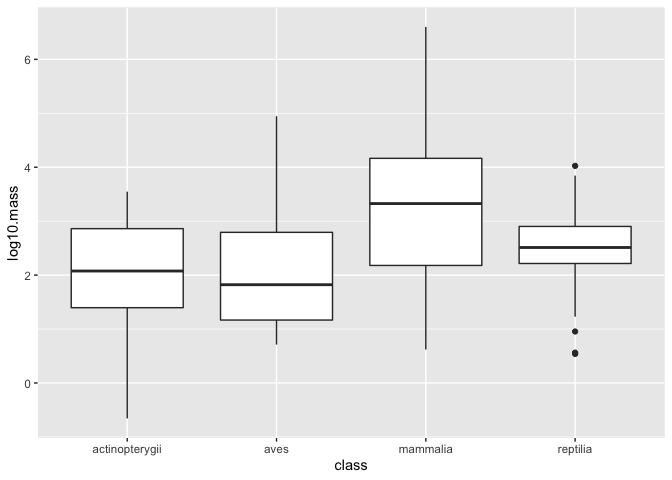

## Learning Goals
*At the end of this exercise, you will be able to:*    
1. Produce boxplots using `ggplot.`  
2. Customize labels on axes using `labs` and `themes`.  
3. Use `color`, `fill`, and `group` to customize plots and improve overall aesthetics.  

## Breakout Rooms  
Please take 5-8 minutes to check over your answers to HW 8 in your group. If you are stuck, please remember that you can check the key in [Joel's repository](https://github.com/jmledford3115/BIS15LW2022_jledford).  

##Resources
- [ggplot2 cheatsheet](https://www.rstudio.com/wp-content/uploads/2015/03/ggplot2-cheatsheet.pdf)
- [`ggplot` themes](https://ggplot2.tidyverse.org/reference/ggtheme.html)
- [Rebecca Barter `ggplot` Tutorial](http://www.rebeccabarter.com/blog/2017-11-17-ggplot2_tutorial/)

## Load the libraries

```r
library(tidyverse)
library(skimr)
library(janitor)
library(here)
library(palmerpenguins)
```

## Review
Now that you have been introduced to `ggplot`, let's practice a few more plot types. Remember that plots are built in layers: **plot= data + geom_ + aesthetics**. We have to specify each of these in order for a plot to be produced. If you get stuck, it is often helpful to stop and make a quick sketch of what you want or expect to see on a piece of scratch paper.  

Let's review using the `penguins` data. First, get an idea of the structure: Are the data tidy? Are there NA's? Are the variables discrete, categorical, or continuous?

```r
glimpse(penguins)
```

```
## Rows: 344
## Columns: 8
## $ species           <fct> Adelie, Adelie, Adelie, Adelie, Adelie, Adelie, Adel~
## $ island            <fct> Torgersen, Torgersen, Torgersen, Torgersen, Torgerse~
## $ bill_length_mm    <dbl> 39.1, 39.5, 40.3, NA, 36.7, 39.3, 38.9, 39.2, 34.1, ~
## $ bill_depth_mm     <dbl> 18.7, 17.4, 18.0, NA, 19.3, 20.6, 17.8, 19.6, 18.1, ~
## $ flipper_length_mm <int> 181, 186, 195, NA, 193, 190, 181, 195, 193, 190, 186~
## $ body_mass_g       <int> 3750, 3800, 3250, NA, 3450, 3650, 3625, 4675, 3475, ~
## $ sex               <fct> male, female, female, NA, female, male, female, male~
## $ year              <int> 2007, 2007, 2007, 2007, 2007, 2007, 2007, 2007, 2007~
```

```r
#The data is tidy, there are NAs. The variables are discrete?
```

In a previous lab, we asked how many penguins are on each island.

```r
penguins %>% count(island, species, sort = F)
```

```
## # A tibble: 5 x 3
##   island    species       n
##   <fct>     <fct>     <int>
## 1 Biscoe    Adelie       44
## 2 Biscoe    Gentoo      124
## 3 Dream     Adelie       56
## 4 Dream     Chinstrap    68
## 5 Torgersen Adelie       52
```

What if we wanted a plot that showed the number of measured penguins per species and the number of measured penguins per island?

```r
penguins %>% 
  group_by(island) %>% 
  ggplot(aes(x=species))+
  geom_bar()
```

<!-- -->

How about average bill length by sex?

```r
penguins %>% 
  filter(sex!="NA") %>% 
  group_by(sex) %>% 
  summarise(ave_bill_length=mean(bill_length_mm))
```

```
## # A tibble: 2 x 2
##   sex    ave_bill_length
##   <fct>            <dbl>
## 1 female            42.1
## 2 male              45.9
```


```r
penguins %>% 
  filter(sex!="NA") %>% 
  group_by(sex) %>% 
  summarise(ave_bill_length=mean(bill_length_mm)) %>% 
  ggplot(aes(x=sex, y=ave_bill_length)) +
  geom_col()
```

<!-- -->

## Box Plots
For the next series of examples, we will use the `homerange` data.  **Database of vertebrate home range sizes.**   

Reference: Tamburello N, Cote IM, Dulvy NK (2015) Energy and the scaling of animal space use. The American Naturalist 186(2):196-211. http://dx.doi.org/10.1086/682070.  
Data: http://datadryad.org/resource/doi:10.5061/dryad.q5j65/1  


```r
homerange <- read_csv(here("lab9", "data", "Tamburelloetal_HomeRangeDatabase.csv"))
homerange
```

```
## # A tibble: 569 x 24
##    taxon        common.name class order family genus species primarymethod N    
##    <chr>        <chr>       <chr> <chr> <chr>  <chr> <chr>   <chr>         <chr>
##  1 lake fishes  american e~ acti~ angu~ angui~ angu~ rostra~ telemetry     16   
##  2 river fishes blacktail ~ acti~ cypr~ catos~ moxo~ poecil~ mark-recaptu~ <NA> 
##  3 river fishes central st~ acti~ cypr~ cypri~ camp~ anomal~ mark-recaptu~ 20   
##  4 river fishes rosyside d~ acti~ cypr~ cypri~ clin~ fundul~ mark-recaptu~ 26   
##  5 river fishes longnose d~ acti~ cypr~ cypri~ rhin~ catara~ mark-recaptu~ 17   
##  6 river fishes muskellunge acti~ esoc~ esoci~ esox  masqui~ telemetry     5    
##  7 marine fish~ pollack     acti~ gadi~ gadid~ poll~ pollac~ telemetry     2    
##  8 marine fish~ saithe      acti~ gadi~ gadid~ poll~ virens  telemetry     2    
##  9 marine fish~ lined surg~ acti~ perc~ acant~ acan~ lineat~ direct obser~ <NA> 
## 10 marine fish~ orangespin~ acti~ perc~ acant~ naso  litura~ telemetry     8    
## # ... with 559 more rows, and 15 more variables: mean.mass.g <dbl>,
## #   log10.mass <dbl>, alternative.mass.reference <chr>, mean.hra.m2 <dbl>,
## #   log10.hra <dbl>, hra.reference <chr>, realm <chr>, thermoregulation <chr>,
## #   locomotion <chr>, trophic.guild <chr>, dimension <dbl>, preymass <dbl>,
## #   log10.preymass <dbl>, PPMR <dbl>, prey.size.reference <chr>
```

Boxplots help us visualize a range of values. So, on the x-axis we typically have something categorical and the y-axis is the range. In the case below, we are plotting `log10.mass` by taxonomic class in the `homerange` data. `geom_boxplot()` is the geom type for a standard box plot. The center line in each box represents the median, not the mean.

Let's look at the variable `log10.mass` grouped by taxonomic class.

```r
homerange %>% 
  group_by(class) %>% 
  summarize(min_log10.mass=min(log10.mass),
            max_log10.mass=max(log10.mass),
            median_log10.mass=median(log10.mass))
```

```
## # A tibble: 4 x 4
##   class          min_log10.mass max_log10.mass median_log10.mass
##   <chr>                   <dbl>          <dbl>             <dbl>
## 1 actinopterygii         -0.658           3.55              2.08
## 2 aves                    0.712           4.95              1.82
## 3 mammalia                0.620           6.60              3.33
## 4 reptilia                0.539           4.03              2.51
```


```r
homerange %>% 
  ggplot(aes(x = class, y = log10.mass)) +
  geom_boxplot()
```

<!-- -->

## Practice
1. There are more herbivores than carnivores in the homerange data, but how do their masses compare? Make a summary and boxplot that compares their masses. Use `log10.mass`.

```r
homerange %>%
  summarise(trophic.guild, log10.mass) 
```

```
## # A tibble: 569 x 2
##    trophic.guild log10.mass
##    <chr>              <dbl>
##  1 carnivore          2.95 
##  2 carnivore          2.75 
##  3 carnivore          1.53 
##  4 carnivore          0.602
##  5 carnivore          0.602
##  6 carnivore          3.55 
##  7 carnivore          2.87 
##  8 carnivore          2.65 
##  9 herbivore          2.04 
## 10 herbivore          2.89 
## # ... with 559 more rows
```


```r
homerange %>%
  ggplot(aes(x = trophic.guild, y = log10.mass))+
  geom_boxplot()
```

<!-- -->

2. Have a closer look at carnivorous mammals. Summarize and visualize the range of log10.mass by family.

```r
hm_mam_carni<- homerange %>%
  filter(class == "mammalia" & trophic.guild == "carnivore") %>%
  group_by(family) %>%
  summarise(trophic.guild, family, log10.mass)
```

```
## `summarise()` has grouped output by 'family'. You can override using the
## `.groups` argument.
```

```r
hm_mam_carni
```

```
## # A tibble: 80 x 3
## # Groups:   family [18]
##    family          trophic.guild log10.mass
##    <chr>           <chr>              <dbl>
##  1 canidae         carnivore           3.70
##  2 canidae         carnivore           4.44
##  3 canidae         carnivore           3.87
##  4 canidae         carnivore           3.60
##  5 canidae         carnivore           3.65
##  6 canidae         carnivore           3.51
##  7 canidae         carnivore           3.32
##  8 chrysochloridae carnivore           2.64
##  9 chrysochloridae carnivore           1.36
## 10 cricetidae      carnivore           1.34
## # ... with 70 more rows
```


3. Now use a boxplot to visualize the range of body mass by family of mammalian carnivore.

```r
hm_mam_carni %>%
  group_by(family) %>%
  ggplot(aes(x=log10.mass, y=family))+
  geom_boxplot()
```

<!-- -->

## That's it, let's take a break!   

-->[Home](https://jmledford3115.github.io/datascibiol/)
