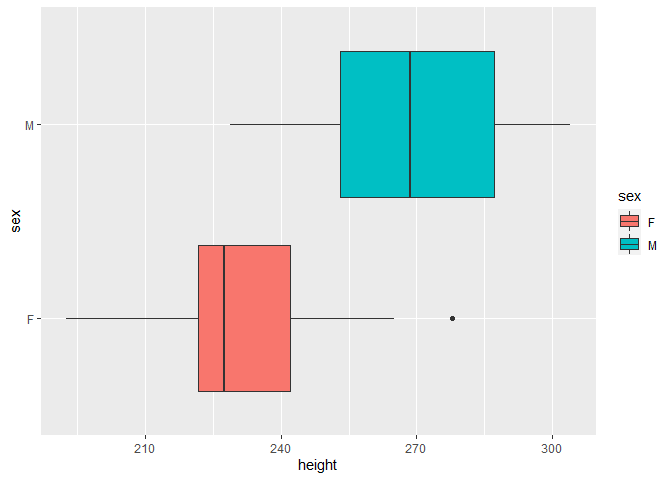
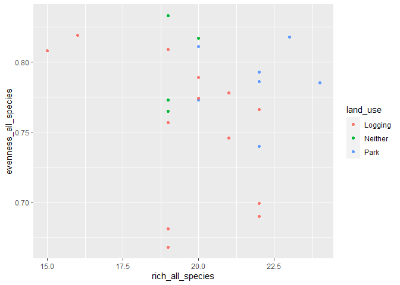

## Instructions
Answer the following questions and complete the exercises in RMarkdown. Please embed all of your code and push your final work to your repository. Your code should be organized, clean, and run free from errors. Remember, you must remove the `#` for any included code chunks to run. Be sure to add your name to the author header above. You may use any resources to answer these questions (including each other), but you may not post questions to Open Stacks or external help sites. There are 15 total questions, each is worth 2 points.  

Make sure to use the formatting conventions of RMarkdown to make your report neat and clean!  

This exam is due by 12:00p on Thursday, January 27.  

## Load the tidyverse
If you plan to use any other libraries to complete this assignment then you should load them here.

```r
library(tidyverse)
```

```
## -- Attaching packages --------------------------------------- tidyverse 1.3.1 --
```

```
## v ggplot2 3.3.5     v purrr   0.3.4
## v tibble  3.1.6     v dplyr   1.0.7
## v tidyr   1.2.0     v stringr 1.4.0
## v readr   2.1.2     v forcats 0.5.1
```

```
## -- Conflicts ------------------------------------------ tidyverse_conflicts() --
## x dplyr::filter() masks stats::filter()
## x dplyr::lag()    masks stats::lag()
```

```r
library(janitor)
```

```
## 
## Attaching package: 'janitor'
```

```
## The following objects are masked from 'package:stats':
## 
##     chisq.test, fisher.test
```

```r
library(naniar)
```

## Questions  
Wikipedia's definition of [data science](https://en.wikipedia.org/wiki/Data_science): "Data science is an interdisciplinary field that uses scientific methods, processes, algorithms and systems to extract knowledge and insights from noisy, structured and unstructured data, and apply knowledge and actionable insights from data across a broad range of application domains."  

1. (2 points) Consider the definition of data science above. Although we are only part-way through the quarter, what specific elements of data science do you feel we have practiced? Provide at least one specific example.  

  I think we have mainly covered the "extract knowledge and insights from noisy, structured and unstructured data" part. Many of the janitor functions help simplify and clarify a data set. The clean_names function is one of my personal favorites, it makes all the variable names lowercase and changes spaces to underscores. 


2. (2 points) What is the most helpful or interesting thing you have learned so far in BIS 15L? What is something that you think needs more work or practice?  

  I think the most useful thing is learning how to import data from excel files and process it in a more transparent program. I don't know much about excel but excel files are quite common. I would definitely be more comfortable analyzing a data set outside of class in RStudio rather than excel. One thing I need to work on is remembering functions that we've covered in past labs, so I can use them in future homework. 


In the midterm 1 folder there is a second folder called `data`. Inside the `data` folder, there is a .csv file called `ElephantsMF`. These data are from Phyllis Lee, Stirling University, and are related to Lee, P., et al. (2013), "Enduring consequences of early experiences: 40-year effects on survival and success among African elephants (Loxodonta africana)," Biology Letters, 9: 20130011. [kaggle](https://www.kaggle.com/mostafaelseidy/elephantsmf).  

3. (2 points) Please load these data as a new object called `elephants`. Use the function(s) of your choice to get an idea of the structure of the data. Be sure to show the class of each variable.

```r
elephants<- readr::read_csv("data/ElephantsMF.csv")
```

```
## Rows: 288 Columns: 3
## -- Column specification --------------------------------------------------------
## Delimiter: ","
## chr (1): Sex
## dbl (2): Age, Height
## 
## i Use `spec()` to retrieve the full column specification for this data.
## i Specify the column types or set `show_col_types = FALSE` to quiet this message.
```

```r
glimpse(elephants)
```

```
## Rows: 288
## Columns: 3
## $ Age    <dbl> 1.40, 17.50, 12.75, 11.17, 12.67, 12.67, 12.25, 12.17, 28.17, 1~
## $ Height <dbl> 120.00, 227.00, 235.00, 210.00, 220.00, 189.00, 225.00, 204.00,~
## $ Sex    <chr> "M", "M", "M", "M", "M", "M", "M", "M", "M", "M", "M", "M", "M"~
```

4. (2 points) Change the names of the variables to lower case and change the class of the variable `sex` to a factor.

```r
elephants<- clean_names(elephants)
elephants$sex<- as.factor(elephants$sex)
```

```r
names(elephants)
```

```
## [1] "age"    "height" "sex"
```

```r
class(elephants$sex)
```

```
## [1] "factor"
```

5. (2 points) How many male and female elephants are represented in the data?

```r
count(elephants, sex)
```

```
## # A tibble: 2 x 2
##   sex       n
##   <fct> <int>
## 1 F       150
## 2 M       138
```

6. (2 points) What is the average age all elephants in the data?

```r
mean(elephants$age)
```

```
## [1] 10.97132
```

7. (2 points) How does the average age and height of elephants compare by sex?

```r
elephants %>%
  group_by(sex) %>%
  summarise(mean_age=mean(age), mean_height=mean(height))
```

```
## # A tibble: 2 x 3
##   sex   mean_age mean_height
##   <fct>    <dbl>       <dbl>
## 1 F        12.8         190.
## 2 M         8.95        185.
```

8. (2 points) How does the average height of elephants compare by sex for individuals over 20 years old. Include the min and max height as well as the number of individuals in the sample as part of your analysis.  

```r
elephants %>%
  filter(age > 20) %>%
  group_by(sex) %>%
  summarise(min_h=min(height),
            max_h=max(height),
            mean_h=mean(height),
            n=n())
```

```
## # A tibble: 2 x 5
##   sex   min_h max_h mean_h     n
##   <fct> <dbl> <dbl>  <dbl> <int>
## 1 F      193.  278.   232.    37
## 2 M      229.  304.   270.    13
```
Boxplot for fun:

```r
elephants %>%
  filter(age > 20) %>%
  ggplot(aes(x=height, y=sex, fill=sex))+ geom_boxplot()
```

<!-- -->

For the next series of questions, we will use data from a study on vertebrate community composition and impacts from defaunation in [Gabon, Africa](https://en.wikipedia.org/wiki/Gabon). One thing to notice is that the data include 24 separate transects. Each transect represents a path through different forest management areas.  

Reference: Koerner SE, Poulsen JR, Blanchard EJ, Okouyi J, Clark CJ. Vertebrate community composition and diversity declines along a defaunation gradient radiating from rural villages in Gabon. _Journal of Applied Ecology_. 2016. This paper, along with a description of the variables is included inside the midterm 1 folder.  

9. (2 points) Load `IvindoData_DryadVersion.csv` and use the function(s) of your choice to get an idea of the overall structure. Change the variables `HuntCat` and `LandUse` to factors.

```r
gabon<- readr::read_csv("data/IvindoData_DryadVersion.csv")
```

```
## Rows: 24 Columns: 26
## -- Column specification --------------------------------------------------------
## Delimiter: ","
## chr  (2): HuntCat, LandUse
## dbl (24): TransectID, Distance, NumHouseholds, Veg_Rich, Veg_Stems, Veg_lian...
## 
## i Use `spec()` to retrieve the full column specification for this data.
## i Specify the column types or set `show_col_types = FALSE` to quiet this message.
```

```r
gabon<- clean_names(gabon)
glimpse(gabon)
```

```
## Rows: 24
## Columns: 26
## $ transect_id              <dbl> 1, 2, 2, 3, 4, 5, 6, 7, 8, 9, 13, 14, 15, 16,~
## $ distance                 <dbl> 7.14, 17.31, 18.32, 20.85, 15.95, 17.47, 24.0~
## $ hunt_cat                 <chr> "Moderate", "None", "None", "None", "None", "~
## $ num_households           <dbl> 54, 54, 29, 29, 29, 29, 29, 54, 25, 73, 46, 5~
## $ land_use                 <chr> "Park", "Park", "Park", "Logging", "Park", "P~
## $ veg_rich                 <dbl> 16.67, 15.75, 16.88, 12.44, 17.13, 16.50, 14.~
## $ veg_stems                <dbl> 31.20, 37.44, 32.33, 29.39, 36.00, 29.22, 31.~
## $ veg_liana                <dbl> 5.78, 13.25, 4.75, 9.78, 13.25, 12.88, 8.38, ~
## $ veg_dbh                  <dbl> 49.57, 34.59, 42.82, 36.62, 41.52, 44.07, 51.~
## $ veg_canopy               <dbl> 3.78, 3.75, 3.43, 3.75, 3.88, 2.50, 4.00, 4.0~
## $ veg_understory           <dbl> 2.89, 3.88, 3.00, 2.75, 3.25, 3.00, 2.38, 2.7~
## $ ra_apes                  <dbl> 1.87, 0.00, 4.49, 12.93, 0.00, 2.48, 3.78, 6.~
## $ ra_birds                 <dbl> 52.66, 52.17, 37.44, 59.29, 52.62, 38.64, 42.~
## $ ra_elephant              <dbl> 0.00, 0.86, 1.33, 0.56, 1.00, 0.00, 1.11, 0.4~
## $ ra_monkeys               <dbl> 38.59, 28.53, 41.82, 19.85, 41.34, 43.29, 46.~
## $ ra_rodent                <dbl> 4.22, 6.04, 1.06, 3.66, 2.52, 1.83, 3.10, 1.2~
## $ ra_ungulate              <dbl> 2.66, 12.41, 13.86, 3.71, 2.53, 13.75, 3.10, ~
## $ rich_all_species         <dbl> 22, 20, 22, 19, 20, 22, 23, 19, 19, 19, 21, 2~
## $ evenness_all_species     <dbl> 0.793, 0.773, 0.740, 0.681, 0.811, 0.786, 0.8~
## $ diversity_all_species    <dbl> 2.452, 2.314, 2.288, 2.006, 2.431, 2.429, 2.5~
## $ rich_bird_species        <dbl> 11, 10, 11, 8, 8, 10, 11, 11, 11, 9, 11, 11, ~
## $ evenness_bird_species    <dbl> 0.732, 0.704, 0.688, 0.559, 0.799, 0.771, 0.8~
## $ diversity_bird_species   <dbl> 1.756, 1.620, 1.649, 1.162, 1.660, 1.775, 1.9~
## $ rich_mammal_species      <dbl> 11, 10, 11, 11, 12, 12, 12, 8, 8, 10, 10, 11,~
## $ evenness_mammal_species  <dbl> 0.736, 0.705, 0.650, 0.619, 0.736, 0.694, 0.7~
## $ diversity_mammal_species <dbl> 1.764, 1.624, 1.558, 1.484, 1.829, 1.725, 1.9~
```

```r
gabon$hunt_cat<- as.factor(gabon$hunt_cat) 
gabon$land_use<- as.factor(gabon$land_use)
class(gabon$hunt_cat)
```

```
## [1] "factor"
```

```r
class(gabon$land_use)
```

```
## [1] "factor"
```

10. (4 points) For the transects with high and moderate hunting intensity, how does the average diversity of birds and mammals compare?

```r
gabon %>%
  filter(hunt_cat == "Moderate" | hunt_cat == "High") %>%
  group_by(hunt_cat) %>%
  summarise(mean_bird_div=mean(diversity_bird_species), mean_mam_div=mean(diversity_mammal_species))
```

```
## # A tibble: 2 x 3
##   hunt_cat mean_bird_div mean_mam_div
##   <fct>            <dbl>        <dbl>
## 1 High              1.66         1.74
## 2 Moderate          1.62         1.68
```


11. (4 points) One of the conclusions in the study is that the relative abundance of animals drops off the closer you get to a village. Let's try to reconstruct this (without the statistics). How does the relative abundance (RA) of apes, birds, elephants, monkeys, rodents, and ungulates compare between sites that are less than 3km from a village to sites that are greater than 25km from a village? The variable `Distance` measures the distance of the transect from the nearest village. Hint: try using the `across` operator.  

```r
gabon %>%
  filter(distance <=3) %>%
  select(ra_apes, ra_birds, ra_elephant, ra_monkeys, ra_rodent, ra_ungulate) %>%
  summarise(across(everything(), mean)) 
```

```
## # A tibble: 1 x 6
##   ra_apes ra_birds ra_elephant ra_monkeys ra_rodent ra_ungulate
##     <dbl>    <dbl>       <dbl>      <dbl>     <dbl>       <dbl>
## 1    0.12     76.6       0.145       17.3      3.90        1.87
```

```r
gabon %>%
  filter(distance >=25) %>%
  select(ra_apes, ra_birds, ra_elephant, ra_monkeys, ra_rodent, ra_ungulate) %>%
  summarise(across(everything(), mean)) 
```

```
## # A tibble: 1 x 6
##   ra_apes ra_birds ra_elephant ra_monkeys ra_rodent ra_ungulate
##     <dbl>    <dbl>       <dbl>      <dbl>     <dbl>       <dbl>
## 1    4.91     31.6           0       54.1      1.29        8.12
```

12. (4 points) Based on your interest, do one exploratory analysis on the `gabon` data of your choice. This analysis needs to include a minimum of two functions in `dplyr.`

```r
gabon %>%
  group_by(land_use) %>%
  summarise(mean(rich_all_species), mean(evenness_all_species),
            mean(diversity_all_species))
```

```
## # A tibble: 3 x 4
##   land_use `mean(rich_all_species)` `mean(evenness_all_specie~` `mean(diversit~`
##   <fct>                       <dbl>                       <dbl>            <dbl>
## 1 Logging                      19.6                       0.753             2.23
## 2 Neither                      19.2                       0.797             2.36
## 3 Park                         21.9                       0.787             2.43
```
Plot for fun:

```r
gabon %>%
  ggplot(aes(x=rich_all_species, y=evenness_all_species, color=land_use))+
  geom_point()
```

<!-- -->

