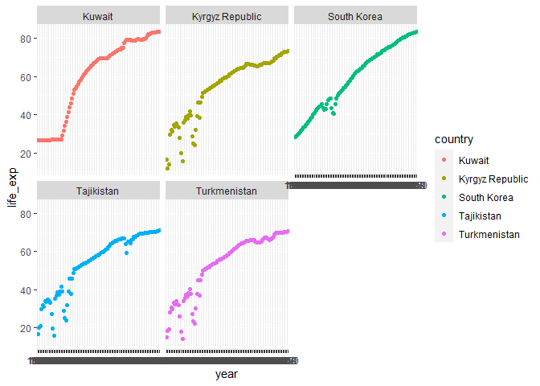
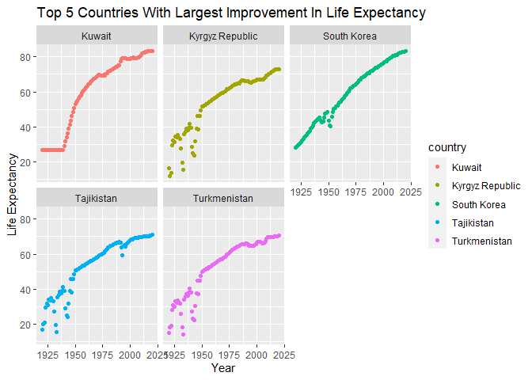
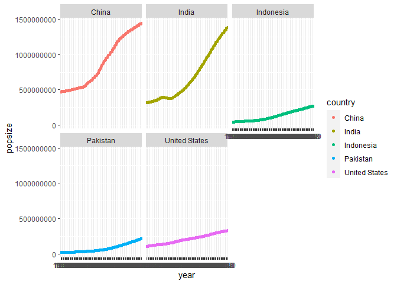
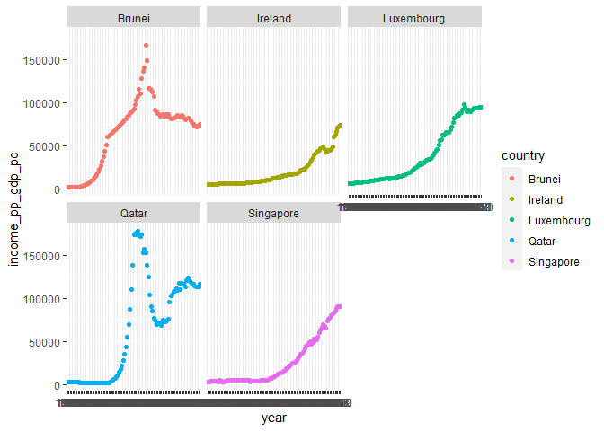
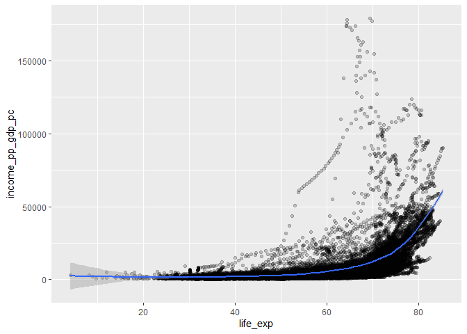

## Instructions
Answer the following questions and complete the exercises in RMarkdown. Please embed all of your code and push your final work to your repository. Your code should be organized, clean, and run free from errors. Be sure to **add your name** to the author header above. You may use any resources to answer these questions (including each other), but you may not post questions to Open Stacks or external help sites. There are 10 total questions.  

Make sure to use the formatting conventions of RMarkdown to make your report neat and clean! Your plots should use consistent aesthetics throughout.  

This exam is due by **12:00p on Tuesday, February 22**.  


```r
library(tidyverse)
```

```
## -- Attaching packages --------------------------------------- tidyverse 1.3.1 --
```

```
## v ggplot2 3.3.5     v purrr   0.3.4
## v tibble  3.1.6     v dplyr   1.0.8
## v tidyr   1.2.0     v stringr 1.4.0
## v readr   2.1.2     v forcats 0.5.1
```

```
## -- Conflicts ------------------------------------------ tidyverse_conflicts() --
## x dplyr::filter() masks stats::filter()
## x dplyr::lag()    masks stats::lag()
```

```r
library(janitor)
```

```
## 
## Attaching package: 'janitor'
```

```
## The following objects are masked from 'package:stats':
## 
##     chisq.test, fisher.test
```

```r
library(here)
```

```
## here() starts at C:/Users/V/Documents/GitHub/BIS15W2022_vliu
```

```r
library(naniar)
library(RColorBrewer)
library(paletteer)
library(janitor)
library(ggthemes)
```

```r
options(scipen=999)
```

## Gapminder
For this assignment, we are going to use data from  [gapminder](https://www.gapminder.org/). Gapminder includes information about economics, population, social issues, and life expectancy from countries all over the world. We will use three data sets, so please load all three as separate objects.    

```r
getwd()
```

```
## [1] "C:/Users/V/Documents/GitHub/BIS15W2022_vliu/midterm2"
```

1. population_total.csv  

```r
pop_total<- read.csv(here("midterm2","data", "population_total.csv"))
pop_total
```

```
##                            country     X1800     X1801     X1802     X1803
## 1                      Afghanistan   3280000   3280000   3280000   3280000
## 2                          Albania    400000    402000    404000    405000
## 3                          Algeria   2500000   2510000   2520000   2530000
## 4                          Andorra      2650      2650      2650      2650
## 5                           Angola   1570000   1570000   1570000   1570000
## 6              Antigua and Barbuda     37000     37000     37000     37000
## 7                        Argentina    534000    520000    506000    492000
## 8                          Armenia    413000    413000    413000    413000
## 9                        Australia    200000    205000    211000    216000
## 10                         Austria   3000000   3020000   3040000   3050000
## 11                      Azerbaijan    880000    880000    880000    880000
## 12                         Bahamas     27400     27400     27400     27400
## 13                         Bahrain     64500     64500     64500     64500
## 14                      Bangladesh  19200000  19200000  19300000  19300000
## 15                        Barbados     81700     81700     81700     81700
## 16                         Belarus   2360000   2360000   2360000   2360000
## 17                         Belgium   3250000   3260000   3270000   3280000
## 18                          Belize     25500     25500     25500     25500
## 19                           Benin    637000    637000    637000    637000
## 20                          Bhutan    392000    392000    392000    392000
## 21                         Bolivia    887000    897000    906000    916000
## 22          Bosnia and Herzegovina    852000    852000    852000    852000
## 23                        Botswana    121000    121000    120000    120000
## 24                          Brazil   2500000   2570000   2650000   2730000
## 25                          Brunei      2260      2260      2260      2260
## 26                        Bulgaria   2250000   2250000   2240000   2240000
## 27                    Burkina Faso   1670000   1670000   1670000   1670000
## 28                         Burundi    899000    899000    899000    899000
## 29                        Cambodia   2090000   2090000   2090000   2090000
## 30                        Cameroon   1860000   1860000   1860000   1860000
## 31                          Canada    500000    512000    525000    538000
## 32                      Cape Verde     55700     55700     55700     55700
## 33        Central African Republic    479000    479000    479000    479000
## 34                            Chad   1430000   1440000   1440000   1450000
## 35                           Chile    771000    771000    771000    771000
## 36                           China 330000000 332000000 333000000 335000000
## 37                        Colombia   1210000   1210000   1210000   1210000
## 38                         Comoros     56300     56300     56300     56300
## 39                Congo, Dem. Rep.   5160000   5160000   5160000   5160000
## 40                     Congo, Rep.    314000    314000    314000    314000
## 41                      Costa Rica     53000     53500     53900     54400
## 42                   Cote d'Ivoire   1090000   1090000   1090000   1090000
## 43                         Croatia   1230000   1230000   1230000   1230000
## 44                            Cuba    272000    293000    316000    340000
## 45                          Cyprus    184000    184000    184000    184000
## 46                  Czech Republic   5520000   5520000   5520000   5520000
## 47                         Denmark   1000000   1010000   1010000   1020000
## 48                        Djibouti     22800     22800     22800     22800
## 49                        Dominica     20000     20000     20000     20000
## 50              Dominican Republic    150000    146000    142000    139000
## 51                         Ecuador    500000    500000    500000    500000
## 52                           Egypt   3500000   3530000   3560000   3600000
## 53                     El Salvador    248000    238000    229000    219000
## 54               Equatorial Guinea     80400     80400     80400     80400
## 55                         Eritrea    205000    205000    205000    205000
## 56                         Estonia    334000    334000    334000    334000
## 57                        Eswatini     86000     85600     85100     84700
## 58                        Ethiopia  12000000  12000000  12000000  12000000
## 59                            Fiji    131000    131000    131000    131000
## 60                         Finland    800000    815000    831000    847000
## 61                          France  29000000  29100000  29200000  29300000
## 62                           Gabon    158000    158000    158000    158000
## 63                          Gambia    103000    103000    103000    103000
## 64                         Georgia   1070000   1070000   1070000   1070000
## 65                         Germany  18000000  18300000  18600000  18900000
## 66                           Ghana   2020000   2020000   2020000   2020000
## 67                          Greece   2250000   2250000   2260000   2260000
## 68                         Grenada     29400     29400     29400     29400
## 69                       Guatemala    463000    469000    475000    481000
## 70                          Guinea    984000    984000    984000    984000
## 71                   Guinea-Bissau    218000    218000    218000    218000
## 72                          Guyana    166000    166000    166000    166000
## 73                           Haiti    500000    509000    519000    528000
## 74                        Holy See       905       905       905       905
## 75                        Honduras    130000    130000    130000    131000
## 76                         Hungary   3250000   3290000   3330000   3370000
## 77                         Iceland     61400     61400     61400     61400
## 78                           India 201000000 201000000 202000000 202000000
## 79                       Indonesia  16100000  16200000  16200000  16200000
## 80                            Iran   6000000   6030000   6050000   6080000
## 81                            Iraq   1000000   1000000   1010000   1010000
## 82                         Ireland   5250000   5330000   5410000   5490000
## 83                          Israel    210000    210000    210000    210000
## 84                           Italy  19000000  19100000  19100000  19200000
## 85                         Jamaica    300000    304000    309000    313000
## 86                           Japan  28000000  28100000  28300000  28400000
## 87                          Jordan    200000    201000    202000    202000
## 88                      Kazakhstan   2040000   2040000   2040000   2040000
## 89                           Kenya   2570000   2590000   2600000   2620000
## 90                        Kiribati     17900     17900     17900     17900
## 91                          Kuwait     81300     81300     81300     81300
## 92                 Kyrgyz Republic    530000    530000    530000    530000
## 93                             Lao    470000    470000    470000    470000
## 94                          Latvia    591000    591000    591000    591000
## 95                         Lebanon    300000    302000    303000    305000
## 96                         Lesotho    276000    276000    276000    276000
## 97                         Liberia    314000    314000    314000    314000
## 98                           Libya    230000    230000    230000    230000
## 99                   Liechtenstein      5800      5800      5800      5800
## 100                      Lithuania    779000    779000    779000    779000
## 101                     Luxembourg    127000    127000    127000    127000
## 102                     Madagascar   1500000   1510000   1520000   1530000
## 103                         Malawi    737000    753000    769000    786000
## 104                       Malaysia    287000    287000    287000    287000
## 105                       Maldives     42400     42400     42400     42400
## 106                           Mali   1400000   1400000   1400000   1400000
## 107                          Malta    134000    134000    134000    134000
## 108               Marshall Islands      5830      5830      5830      5830
## 109                     Mauritania    383000    383000    383000    383000
## 110                      Mauritius     59000     60700     62400     64200
## 111                         Mexico   5100000   5170000   5230000   5300000
## 112          Micronesia, Fed. Sts.     16400     16400     16400     16400
## 113                        Moldova    713000    713000    713000    713000
## 114                         Monaco      7790      7790      7790      7790
## 115                       Mongolia    600000    601000    602000    603000
## 116                     Montenegro    127000    127000    127000    127000
## 117                        Morocco   2500000   2510000   2520000   2530000
## 118                     Mozambique   2000000   2000000   2010000   2010000
## 119                        Myanmar   6000000   5840000   5690000   5540000
## 120                        Namibia    229000    226000    223000    220000
## 121                          Nauru      1830      1830      1830      1830
## 122                          Nepal   4000000   3990000   3990000   3980000
## 123                    Netherlands   2000000   2000000   2010000   2010000
## 124                    New Zealand    200000    193000    187000    180000
## 125                      Nicaragua    186000    186000    186000    186000
## 126                          Niger    853000    853000    853000    853000
## 127                        Nigeria  12100000  12100000  12100000  12100000
## 128                    North Korea   4350000   4350000   4350000   4350000
## 129                North Macedonia    392000    392000    392000    392000
## 130                         Norway    900000    898000    897000    895000
## 131                           Oman    300000    301000    302000    303000
## 132                       Pakistan  13100000  13100000  13200000  13200000
## 133                          Palau      3880      3880      3880      3880
## 134                      Palestine    166000    166000    166000    166000
## 135                         Panama     75600     76200     76700     77300
## 136               Papua New Guinea    755000    755000    755000    755000
## 137                       Paraguay    300000    289000    279000    268000
## 138                           Peru   1270000   1270000   1280000   1280000
## 139                    Philippines   2500000   2440000   2370000   2310000
## 140                         Poland   9000000   9070000   9130000   9200000
## 141                       Portugal   2750000   2780000   2800000   2830000
## 142                          Qatar     14100     14100     14100     14100
## 143                        Romania   5500000   5540000   5580000   5630000
## 144                         Russia  31300000  31300000  31300000  31300000
## 145                         Rwanda    928000    928000    928000    928000
## 146                          Samoa     47300     47300     47300     47300
## 147                     San Marino      5490      5490      5490      5490
## 148          Sao Tome and Principe     22700     22700     22700     22700
## 149                   Saudi Arabia   2000000   2000000   2010000   2010000
## 150                        Senegal   1010000   1010000   1010000   1010000
## 151                         Serbia   2150000   2150000   2150000   2150000
## 152                     Seychelles     12500     12500     12500     12500
## 153                   Sierra Leone    794000    794000    794000    794000
## 154                      Singapore     30000     30000     30000     30000
## 155                Slovak Republic   2140000   2140000   2140000   2140000
## 156                       Slovenia    470000    470000    470000    470000
## 157                Solomon Islands     57000     57000     57000     57000
## 158                        Somalia    989000    989000    990000    990000
## 159                   South Africa   1450000   1450000   1460000   1460000
## 160                    South Korea   9400000   9400000   9400000   9400000
## 161                    South Sudan   1030000   1030000   1030000   1030000
## 162                          Spain  11500000  11500000  11600000  11600000
## 163                      Sri Lanka   1750000   1720000   1690000   1660000
## 164            St. Kitts and Nevis     17200     17200     17200     17200
## 165                      St. Lucia     24000     24000     24000     24000
## 166 St. Vincent and the Grenadines     25800     25800     25800     25800
## 167                          Sudan   3990000   4000000   4000000   4010000
## 168                       Suriname     80700     80700     80700     80700
## 169                         Sweden   2500000   2490000   2480000   2470000
## 170                    Switzerland   1750000   1760000   1770000   1780000
## 171                          Syria   1250000   1250000   1260000   1260000
## 172                     Tajikistan    467000    467000    467000    467000
## 173                       Tanzania   3000000   3000000   3000000   3000000
## 174                       Thailand   3000000   3070000   3140000   3210000
## 175                    Timor-Leste    137000    137000    137000    137000
## 176                           Togo    446000    446000    446000    446000
## 177                          Tonga     18700     18700     18700     18600
## 178            Trinidad and Tobago     20000     21100     22300     23600
## 179                        Tunisia    800000    804000    807000    811000
## 180                         Turkey   9760000   9780000   9790000   9810000
## 181                   Turkmenistan    367000    367000    367000    367000
## 182                         Tuvalu      2500      2500      2500      2500
## 183                         Uganda   2500000   2480000   2460000   2440000
## 184                        Ukraine  11200000  11200000  11200000  11200000
## 185           United Arab Emirates     40200     40200     40200     40200
## 186                 United Kingdom  10800000  10900000  11000000  11100000
## 187                  United States   6000000   6110000   6230000   6350000
## 188                        Uruguay     55000     55000     55000     55000
## 189                     Uzbekistan   1920000   1920000   1920000   1920000
## 190                        Vanuatu     27800     27800     27800     27800
## 191                      Venezuela   1000000    978000    957000    936000
## 192                        Vietnam   4000000   4100000   4200000   4310000
## 193                          Yemen   2590000   2590000   2590000   2590000
## 194                         Zambia    747000    758000    770000    782000
## 195                       Zimbabwe   1090000   1090000   1090000   1090000
##         X1804     X1805     X1806     X1807     X1808     X1809     X1810
## 1     3280000   3280000   3280000   3280000   3280000   3280000   3280000
## 2      407000    409000    411000    413000    414000    416000    418000
## 3     2540000   2550000   2560000   2560000   2570000   2580000   2590000
## 4        2650      2650      2650      2650      2650      2650      2650
## 5     1570000   1570000   1570000   1570000   1570000   1570000   1570000
## 6       37000     37000     37000     37000     37000     37000     37000
## 7      479000    466000    453000    441000    429000    417000    420000
## 8      413000    413000    413000    413000    413000    413000    413000
## 9      222000    227000    233000    239000    246000    252000    259000
## 10    3070000   3090000   3110000   3120000   3140000   3160000   3180000
## 11     880000    880000    880000    880000    880000    880000    880000
## 12      27400     27400     27400     27400     27400     27400     27400
## 13      64500     64500     64500     64500     64500     64500     64500
## 14   19300000  19400000  19400000  19500000  19500000  19500000  19600000
## 15      81700     81700     81700     81700     81700     81700     81700
## 16    2360000   2360000   2360000   2360000   2360000   2360000   2360000
## 17    3290000   3300000   3300000   3310000   3320000   3330000   3340000
## 18      25500     25500     25500     25500     25500     25500     25500
## 19     637000    637000    637000    637000    637000    637000    637000
## 20     392000    392000    392000    392000    392000    392000    392000
## 21     926000    936000    946000    956000    967000    977000    988000
## 22     852000    852000    852000    852000    852000    852000    852000
## 23     119000    119000    118000    118000    117000    117000    116000
## 24    2810000   2900000   2980000   3070000   3160000   3260000   3360000
## 25       2260      2260      2260      2260      2260      2260      2260
## 26    2240000   2230000   2230000   2230000   2220000   2220000   2220000
## 27    1670000   1670000   1670000   1670000   1670000   1670000   1670000
## 28     899000    899000    899000    899000    899000    899000    899000
## 29    2090000   2090000   2090000   2090000   2090000   2090000   2090000
## 30    1860000   1860000   1860000   1860000   1860000   1860000   1860000
## 31     551000    565000    579000    594000    608000    623000    639000
## 32      55700     55700     55700     55700     55700     55700     55700
## 33     479000    479000    479000    479000    479000    479000    479000
## 34    1460000   1460000   1470000   1480000   1480000   1490000   1500000
## 35     771000    771000    771000    771000    771000    771000    771000
## 36  336000000 338000000 339000000 341000000 343000000 344000000 347000000
## 37    1210000   1210000   1210000   1210000   1210000   1210000   1210000
## 38      56300     56300     56300     56300     56300     56300     56300
## 39    5160000   5160000   5160000   5160000   5160000   5160000   5160000
## 40     314000    314000    314000    314000    314000    314000    314000
## 41      54900     55300     55800     56300     56800     57300     57800
## 42    1090000   1090000   1090000   1090000   1090000   1090000   1090000
## 43    1230000   1230000   1230000   1230000   1230000   1230000   1230000
## 44     366000    394000    425000    458000    493000    531000    550000
## 45     184000    184000    185000    185000    185000    185000    185000
## 46    5520000   5520000   5520000   5520000   5520000   5520000   5520000
## 47    1030000   1040000   1040000   1050000   1060000   1070000   1070000
## 48      22800     22800     22800     22800     22800     22800     22800
## 49      20000     20000     20000     20000     20000     20000     20000
## 50     135000    132000    128000    125000    122000    119000    116000
## 51     500000    500000    500000    500000    500000    500000    500000
## 52    3630000   3660000   3700000   3730000   3760000   3800000   3830000
## 53     211000    202000    194000    186000    179000    172000    173000
## 54      80400     80400     80400     80400     80400     80400     80400
## 55     205000    205000    205000    205000    205000    205000    205000
## 56     334000    334000    334000    334000    334000    334000    334000
## 57      84200     83800     83300     82900     82500     82000     81600
## 58   12000000  12000000  12000000  12000000  12000000  12000000  12000000
## 59     131000    132000    132000    132000    132000    133000    133000
## 60     863000    880000    896000    914000    931000    949000    967000
## 61   29400000  29500000  29700000  29800000  29900000  30000000  30100000
## 62     158000    158000    158000    158000    158000    158000    158000
## 63     103000    103000    103000    103000    103000    103000    103000
## 64    1070000   1070000   1070000   1070000   1070000   1070000   1070000
## 65   19200000  19500000  19800000  20200000  20500000  20800000  21200000
## 66    2020000   2020000   2020000   2020000   2020000   2020000   2020000
## 67    2260000   2270000   2270000   2270000   2270000   2280000   2280000
## 68      29400     29400     29400     29400     29400     29400     29400
## 69     488000    494000    500000    507000    514000    520000    529000
## 70     984000    984000    984000    984000    984000    984000    984000
## 71     218000    218000    218000    218000    218000    218000    218000
## 72     166000    166000    166000    166000    166000    166000    166000
## 73     538000    548000    558000    569000    579000    590000    601000
## 74        905       905       905       905       905       905       905
## 75     131000    131000    131000    132000    132000    132000    132000
## 76    3410000   3450000   3500000   3540000   3580000   3630000   3670000
## 77      61400     61400     61400     61400     61400     61400     61400
## 78  202000000 203000000 203000000 204000000 204000000 204000000 205000000
## 79   16300000  16300000  16400000  16400000  16400000  16500000  16500000
## 80    6110000   6140000   6160000   6190000   6220000   6250000   6270000
## 81    1020000   1020000   1030000   1030000   1040000   1040000   1050000
## 82    5580000   5660000   5750000   5840000   5920000   6010000   6110000
## 83     210000    210000    210000    210000    210000    210000    210000
## 84   19200000  19300000  19300000  19400000  19500000  19500000  19600000
## 85     318000    323000    327000    332000    337000    342000    347000
## 86   28600000  28700000  28900000  29000000  29200000  29300000  29500000
## 87     203000    204000    205000    206000    207000    207000    208000
## 88    2040000   2040000   2040000   2040000   2040000   2040000   2040000
## 89    2630000   2640000   2660000   2670000   2690000   2700000   2710000
## 90      17900     17900     17900     17900     17900     17900     17900
## 91      81300     81300     81300     81300     81300     81300     81300
## 92     530000    530000    530000    530000    530000    530000    530000
## 93     470000    470000    470000    470000    470000    470000    470000
## 94     591000    591000    591000    591000    591000    591000    591000
## 95     306000    308000    309000    311000    312000    314000    316000
## 96     276000    276000    276000    276000    276000    276000    276000
## 97     314000    314000    314000    314000    314000    314000    314000
## 98     231000    231000    231000    231000    231000    231000    231000
## 99       5800      5800      5800      5800      5800      5800      5800
## 100    779000    779000    779000    779000    779000    779000    779000
## 101    127000    127000    127000    127000    127000    127000    127000
## 102   1530000   1540000   1550000   1560000   1570000   1580000   1590000
## 103    803000    820000    838000    856000    875000    894000    914000
## 104    287000    287000    287000    287000    287000    287000    287000
## 105     42400     42400     42400     42400     42400     42400     42400
## 106   1400000   1400000   1400000   1400000   1400000   1400000   1400000
## 107    134000    134000    134000    134000    134000    134000    134000
## 108      5830      5830      5830      5830      5830      5830      5830
## 109    383000    383000    383000    383000    383000    383000    383000
## 110     66000     67800     69800     71700     73800     75900     77300
## 111   5370000   5440000   5510000   5580000   5650000   5720000   5800000
## 112     16400     16400     16400     16400     16400     16400     16400
## 113    713000    713000    713000    713000    713000    713000    713000
## 114      7790      7790      7790      7790      7790      7790      7790
## 115    604000    605000    606000    607000    608000    608000    609000
## 116    127000    127000    127000    127000    127000    127000    127000
## 117   2540000   2550000   2560000   2560000   2570000   2580000   2590000
## 118   2020000   2020000   2030000   2030000   2040000   2040000   2050000
## 119   5390000   5250000   5110000   4970000   4840000   4710000   4590000
## 120    217000    214000    211000    209000    206000    203000    200000
## 121      1830      1830      1830      1830      1830      1830      1830
## 122   3980000   3970000   3960000   3960000   3950000   3950000   3940000
## 123   2020000   2020000   2030000   2030000   2040000   2040000   2060000
## 124    174000    168000    162000    157000    152000    146000    142000
## 125    186000    186000    186000    186000    186000    186000    186000
## 126    853000    853000    853000    853000    853000    853000    853000
## 127  12100000  12100000  12100000  12100000  12100000  12100000  12100000
## 128   4350000   4350000   4350000   4350000   4350000   4350000   4350000
## 129    392000    392000    392000    392000    392000    392000    392000
## 130    894000    892000    891000    889000    888000    886000    891000
## 131    304000    304000    305000    306000    307000    308000    309000
## 132  13200000  13200000  13300000  13300000  13300000  13400000  13400000
## 133      3880      3880      3880      3880      3880      3880      3880
## 134    166000    166000    166000    166000    166000    166000    166000
## 135     77800     78400     79000     79500     80100     80700     81300
## 136    755000    755000    755000    755000    755000    755000    755000
## 137    259000    249000    240000    231000    223000    215000    207000
## 138   1280000   1280000   1280000   1290000   1290000   1290000   1290000
## 139   2260000   2200000   2140000   2090000   2040000   1980000   1980000
## 140   9270000   9340000   9410000   9480000   9550000   9620000   9690000
## 141   2850000   2880000   2900000   2930000   2960000   2980000   3010000
## 142     14100     14100     14100     14100     14100     14100     14100
## 143   5670000   5710000   5750000   5800000   5840000   5880000   5930000
## 144  31300000  31300000  31300000  31300000  31300000  31300000  31300000
## 145    928000    928000    928000    928000    928000    928000    928000
## 146     47300     47300     47300     47200     47200     47200     47200
## 147      5490      5490      5490      5490      5490      5490      5490
## 148     22700     22700     22700     22700     22700     22700     22700
## 149   2020000   2020000   2030000   2030000   2040000   2040000   2050000
## 150   1010000   1010000   1010000   1010000   1010000   1010000   1010000
## 151   2150000   2150000   2150000   2150000   2150000   2150000   2150000
## 152     12500     12500     12500     12500     12500     12500     12500
## 153    794000    794000    794000    794000    794000    794000    794000
## 154     30000     30000     30000     30000     30000     30000     30000
## 155   2140000   2140000   2140000   2140000   2140000   2140000   2140000
## 156    470000    470000    470000    470000    470000    470000    470000
## 157     57000     57000     57000     57000     57000     57000     57000
## 158    991000    991000    991000    992000    992000    993000    993000
## 159   1470000   1470000   1480000   1490000   1490000   1500000   1500000
## 160   9400000   9400000   9400000   9400000   9400000   9400000   9400000
## 161   1030000   1030000   1040000   1040000   1040000   1040000   1040000
## 162  11600000  11700000  11700000  11700000  11800000  11800000  11800000
## 163   1630000   1600000   1570000   1540000   1510000   1480000   1460000
## 164     17200     17200     17200     17200     17200     17200     17200
## 165     24000     24000     24000     24000     24000     24000     24000
## 166     25800     25800     25800     25800     25800     25800     25800
## 167   4020000   4020000   4030000   4030000   4040000   4040000   4050000
## 168     80700     80700     80700     80700     80700     80700     80700
## 169   2460000   2450000   2440000   2430000   2420000   2410000   2410000
## 170   1790000   1810000   1820000   1830000   1840000   1850000   1860000
## 171   1270000   1270000   1280000   1280000   1280000   1290000   1290000
## 172    467000    467000    467000    467000    467000    467000    467000
## 173   3000000   3000000   3010000   3010000   3010000   3010000   3010000
## 174   3280000   3350000   3420000   3500000   3580000   3660000   3740000
## 175    137000    137000    137000    137000    137000    137000    137000
## 176    446000    446000    446000    446000    446000    446000    446000
## 177     18600     18600     18600     18600     18600     18600     18600
## 178     24900     26300     27800     29400     31000     32800     34700
## 179    814000    818000    822000    825000    829000    833000    837000
## 180   9820000   9840000   9850000   9870000   9880000   9900000   9910000
## 181    367000    367000    367000    367000    367000    367000    367000
## 182      2500      2500      2500      2500      2500      2500      2500
## 183   2410000   2390000   2370000   2350000   2330000   2310000   2290000
## 184  11200000  11200000  11200000  11200000  11200000  11200000  11200000
## 185     40200     40200     40200     40200     40200     40200     40200
## 186  11200000  11300000  11500000  11600000  11700000  11800000  12300000
## 187   6470000   6590000   6720000   6840000   6970000   7110000   7300000
## 188     55000     55000     55000     55000     55000     55000     55000
## 189   1920000   1920000   1920000   1920000   1920000   1920000   1920000
## 190     27800     27800     27800     27800     27800     27800     27800
## 191    916000    896000    876000    857000    838000    820000    808000
## 192   4410000   4530000   4640000   4750000   4870000   4990000   5120000
## 193   2590000   2590000   2590000   2590000   2590000   2590000   2590000
## 194    794000    806000    818000    831000    843000    856000    869000
## 195   1090000   1090000   1090000   1090000   1090000   1090000   1090000
##         X1811     X1812     X1813     X1814     X1815     X1816     X1817
## 1     3280000   3280000   3280000   3280000   3280000   3280000   3280000
## 2      420000    422000    424000    426000    427000    429000    431000
## 3     2600000   2610000   2620000   2630000   2640000   2650000   2660000
## 4        2650      2650      2650      2650      2650      2650      2650
## 5     1570000   1570000   1570000   1570000   1570000   1570000   1570000
## 6       37000     37000     37000     37000     37000     37000     37000
## 7      422000    429000    441000    453000    466000    479000    492000
## 8      413000    413000    413000    413000    413000    413000    413000
## 9      265000    272000    279000    287000    294000    302000    309000
## 10    3200000   3220000   3240000   3250000   3270000   3290000   3310000
## 11     880000    880000    880000    880000    880000    880000    880000
## 12      27400     27400     27400     27400     27400     27400     27400
## 13      64500     64500     64500     64500     64500     64500     64500
## 14   19600000  19700000  19700000  19800000  19800000  19900000  19900000
## 15      81700     81700     81700     81700     81700     81700     81700
## 16    2360000   2360000   2360000   2360000   2360000   2360000   2360000
## 17    3350000   3360000   3370000   3380000   3390000   3400000   3410000
## 18      25500     25500     25500     25500     25500     25500     25500
## 19     637000    637000    637000    637000    637000    637000    637000
## 20     392000    392000    392000    392000    392000    392000    392000
## 21     999000   1010000   1020000   1030000   1040000   1050000   1070000
## 22     852000    852000    852000    852000    852000    852000    852000
## 23     116000    116000    115000    115000    114000    114000    113000
## 24    3460000   3560000   3670000   3780000   3890000   4010000   4130000
## 25       2260      2260      2270      2280      2290      2310      2320
## 26    2220000   2210000   2210000   2210000   2200000   2200000   2200000
## 27    1670000   1670000   1670000   1670000   1670000   1670000   1670000
## 28     899000    899000    899000    899000    899000    899000    899000
## 29    2090000   2090000   2090000   2090000   2090000   2090000   2090000
## 30    1860000   1860000   1860000   1860000   1860000   1860000   1860000
## 31     655000    671000    688000    705000    722000    740000    759000
## 32      55700     55700     55700     55700     55700     55700     55700
## 33     479000    479000    479000    479000    479000    479000    479000
## 34    1500000   1510000   1520000   1520000   1530000   1540000   1540000
## 35     771000    771000    771000    771000    771000    771000    771000
## 36  349000000 353000000 356000000 359000000 363000000 367000000 370000000
## 37    1210000   1210000   1210000   1210000   1210000   1210000   1210000
## 38      56300     56300     56300     56300     56300     56300     56300
## 39    5160000   5160000   5160000   5160000   5160000   5160000   5160000
## 40     314000    314000    314000    314000    314000    314000    314000
## 41      58300     58800     59300     59800     60300     60900     61400
## 42    1090000   1090000   1090000   1090000   1090000   1090000   1090000
## 43    1230000   1230000   1230000   1230000   1230000   1230000   1230000
## 44     568000    578000    582000    585000    588000    592000    595000
## 45     185000    185000    185000    185000    185000    185000    185000
## 46    5520000   5520000   5520000   5520000   5520000   5520000   5520000
## 47    1080000   1090000   1100000   1110000   1110000   1120000   1130000
## 48      22800     22800     22800     22800     22800     22800     22800
## 49      20000     20000     20000     20000     20000     20000     20000
## 50     113000    110000    107000    104000    101000     98900     96300
## 51     500000    500000    500000    500000    500000    500000    500000
## 52    3870000   3900000   3940000   3970000   4010000   4050000   4080000
## 53     175000    179000    187000    195000    203000    211000    220000
## 54      80400     80400     80400     80400     80400     80400     80400
## 55     205000    205000    205000    205000    205000    205000    205000
## 56     334000    334000    334000    334000    334000    334000    334000
## 57      81200     80800     80300     79900     79500     79100     78700
## 58   12000000  12100000  12100000  12100000  12200000  12200000  12300000
## 59     133000    133000    134000    134000    134000    134000    134000
## 60     986000   1000000   1020000   1040000   1060000   1080000   1100000
## 61   30200000  30300000  30400000  30600000  30700000  30800000  30900000
## 62     158000    158000    158000    158000    158000    158000    158000
## 63     103000    103000    103000    103000    103000    103000    103000
## 64    1070000   1070000   1070000   1070000   1070000   1070000   1070000
## 65   21500000  21900000  22200000  22600000  23000000  23300000  23700000
## 66    2020000   2020000   2020000   2020000   2020000   2020000   2020000
## 67    2280000   2290000   2290000   2290000   2300000   2300000   2300000
## 68      29400     29400     29400     29400     29400     29400     29400
## 69     536000    543000    550000    557000    564000    571000    578000
## 70     984000    984000    984000    984000    984000    984000    984000
## 71     218000    218000    218000    218000    218000    218000    218000
## 72     166000    166000    166000    166000    166000    166000    166000
## 73     613000    624000    636000    647000    660000    672000    684000
## 74        905       905       905       905       905       905       905
## 75     133000    133000    133000    133000    134000    134000    134000
## 76    3720000   3760000   3810000   3850000   3900000   3950000   4000000
## 77      61400     61400     61400     61400     61400     61400     61400
## 78  205000000 206000000 206000000 207000000 207000000 208000000 208000000
## 79   16600000  16600000  16700000  16800000  16800000  16900000  17000000
## 80    6300000   6330000   6360000   6390000   6420000   6440000   6470000
## 81    1050000   1050000   1060000   1060000   1070000   1070000   1080000
## 82    6200000   6290000   6390000   6490000   6590000   6690000   6790000
## 83     210000    210000    210000    210000    210000    210000    210000
## 84   19600000  19700000  19800000  19800000  19900000  19900000  20000000
## 85     352000    357000    362000    368000    373000    378000    384000
## 86   29600000  29800000  29900000  30100000  30200000  30400000  30500000
## 87     209000    210000    211000    212000    213000    213000    214000
## 88    2040000   2040000   2040000   2040000   2040000   2040000   2040000
## 89    2730000   2740000   2760000   2770000   2790000   2800000   2820000
## 90      17900     17900     17900     17900     17900     17900     17900
## 91      81300     81300     81300     81300     81300     81300     81300
## 92     530000    530000    530000    530000    530000    530000    530000
## 93     470000    470000    470000    470000    470000    470000    470000
## 94     591000    591000    591000    591000    591000    591000    591000
## 95     317000    319000    320000    322000    324000    325000    327000
## 96     276000    276000    276000    276000    276000    276000    276000
## 97     314000    314000    314000    314000    314000    314000    314000
## 98     232000    232000    232000    233000    233000    233000    234000
## 99       5800      5800      5800      5800      5800      5800      5800
## 100    779000    779000    779000    779000    779000    779000    779000
## 101    127000    127000    127000    127000    127000    127000    127000
## 102   1600000   1610000   1620000   1630000   1640000   1640000   1650000
## 103    934000    954000    975000    996000   1020000   1040000   1060000
## 104    287000    287000    287000    287000    287000    287000    287000
## 105     42400     42400     42400     42400     42400     42400     42400
## 106   1400000   1400000   1400000   1400000   1400000   1400000   1400000
## 107    134000    134000    134000    134000    134000    134000    134000
## 108      5830      5830      5830      5830      5830      5830      5830
## 109    383000    383000    383000    383000    383000    383000    383000
## 110     78700     79900     80900     81900     82900     83900     84900
## 111   5870000   5950000   6020000   6100000   6180000   6260000   6340000
## 112     16400     16400     16400     16400     16400     16400     16400
## 113    713000    713000    713000    713000    713000    713000    713000
## 114      7790      7790      7790      7790      7790      7790      7790
## 115    610000    611000    612000    613000    614000    615000    616000
## 116    127000    127000    127000    127000    127000    127000    127000
## 117   2600000   2610000   2620000   2630000   2640000   2650000   2660000
## 118   2050000   2060000   2060000   2070000   2070000   2080000   2080000
## 119   4470000   4350000   4230000   4120000   4010000   3910000   3800000
## 120    198000    195000    193000    190000    188000    185000    183000
## 121      1830      1830      1830      1830      1830      1830      1830
## 122   3930000   3930000   3920000   3920000   3910000   3900000   3900000
## 123   2080000   2100000   2130000   2160000   2190000   2210000   2240000
## 124    137000    132000    128000    123000    119000    115000    111000
## 125    186000    186000    186000    186000    186000    186000    186000
## 126    853000    853000    854000    855000    856000    857000    859000
## 127  12100000  12100000  12100000  12100000  12100000  12100000  12100000
## 128   4350000   4350000   4350000   4350000   4350000   4350000   4350000
## 129    392000    392000    392000    392000    392000    392000    392000
## 130    895000    901000    910000    918000    927000    935000    944000
## 131    310000    311000    312000    312000    313000    314000    315000
## 132  13400000  13400000  13500000  13500000  13500000  13600000  13600000
## 133      3880      3880      3880      3880      3880      3880      3880
## 134    166000    166000    166000    166000    166000    166000    166000
## 135     81900     82500     83100     83700     84300     84900     85500
## 136    755000    755000    755000    755000    755000    755000    755000
## 137    200000    193000    186000    179000    172000    166000    160000
## 138   1300000   1300000   1300000   1300000   1310000   1310000   1310000
## 139   1970000   1980000   2000000   2030000   2050000   2080000   2100000
## 140   9760000   9830000   9900000   9980000  10100000  10100000  10200000
## 141   3040000   3070000   3090000   3120000   3150000   3180000   3210000
## 142     14100     14100     14100     14100     14100     14100     14100
## 143   5970000   6020000   6060000   6110000   6150000   6200000   6250000
## 144  31300000  31300000  31400000  31400000  31500000  31600000  31700000
## 145    928000    928000    928000    928000    928000    928000    928000
## 146     47200     47200     47200     47200     47200     47200     47200
## 147      5490      5490      5490      5490      5490      5490      5490
## 148     22700     22700     22700     22700     22700     22700     22700
## 149   2050000   2050000   2060000   2060000   2070000   2070000   2080000
## 150   1010000   1010000   1010000   1010000   1010000   1010000   1010000
## 151   2150000   2150000   2150000   2150000   2150000   2150000   2150000
## 152     12500     12500     12500     12500     12500     12500     12500
## 153    794000    794000    794000    794000    794000    794000    794000
## 154     30000     30000     30000     30000     30000     30000     30000
## 155   2140000   2140000   2140000   2140000   2140000   2140000   2140000
## 156    470000    470000    470000    470000    470000    470000    470000
## 157     57000     57000     57000     57000     57000     57000     57000
## 158    994000    995000    996000    998000   1000000   1000000   1000000
## 159   1510000   1510000   1520000   1530000   1540000   1550000   1550000
## 160   9400000   9400000   9400000   9400000   9400000   9400000   9400000
## 161   1040000   1040000   1050000   1050000   1050000   1050000   1060000
## 162  11900000  11900000  12000000  12000000  12000000  12100000  12100000
## 163   1430000   1410000   1380000   1350000   1330000   1310000   1280000
## 164     17200     17200     17200     17200     17200     17200     17200
## 165     24000     24000     24000     24000     24000     24000     24000
## 166     25800     25800     25800     25800     25800     25800     25800
## 167   4050000   4060000   4070000   4080000   4080000   4090000   4100000
## 168     80700     80700     80700     80700     80700     80700     80700
## 169   2420000   2430000   2450000   2470000   2480000   2500000   2520000
## 170   1880000   1890000   1900000   1910000   1920000   1940000   1950000
## 171   1300000   1300000   1310000   1310000   1310000   1320000   1320000
## 172    467000    467000    467000    467000    467000    467000    467000
## 173   3010000   3010000   3010000   3010000   3010000   3020000   3020000
## 174   3830000   3910000   4000000   4090000   4180000   4270000   4370000
## 175    137000    137000    137000    137000    137000    137000    137000
## 176    446000    446000    446000    446000    446000    446000    446000
## 177     18600     18600     18600     18600     18600     18600     18600
## 178     36700     38800     41000     43300     45700     48300     51000
## 179    840000    844000    848000    852000    856000    859000    863000
## 180   9930000   9940000   9960000   9980000  10000000  10000000  10000000
## 181    367000    367000    367000    367000    367000    367000    367000
## 182      2500      2500      2500      2500      2500      2500      2500
## 183   2270000   2250000   2230000   2210000   2190000   2180000   2160000
## 184  11200000  11200000  11200000  11200000  11200000  11200000  11200000
## 185     40200     40200     40200     40200     40200     40200     40200
## 186  12800000  13500000  14300000  15100000  16000000  16900000  17900000
## 187   7500000   7730000   7980000   8240000   8510000   8790000   9070000
## 188     55000     55000     55000     55000     55000     55000     55000
## 189   1920000   1920000   1920000   1920000   1920000   1920000   1920000
## 190     27800     27800     27800     27800     27800     27800     27800
## 191    795000    785000    776000    767000    759000    751000    742000
## 192   5250000   5380000   5520000   5650000   5790000   5940000   6090000
## 193   2590000   2590000   2590000   2590000   2590000   2590000   2590000
## 194    883000    896000    910000    924000    938000    952000    967000
## 195   1090000   1090000   1090000   1090000   1090000   1090000   1090000
##         X1818     X1819     X1820     X1821     X1822     X1823     X1824
## 1     3280000   3280000   3290000   3300000   3310000   3320000   3340000
## 2      433000    435000    437000    439000    441000    443000    445000
## 3     2670000   2680000   2690000   2690000   2700000   2700000   2710000
## 4        2650      2660      2670      2680      2690      2710      2730
## 5     1570000   1570000   1580000   1590000   1610000   1640000   1660000
## 6       37000     37000     37000     37000     37000     37000     37000
## 7      506000    519000    531000    542000    553000    562000    572000
## 8      413000    414000    416000    418000    421000    425000    429000
## 9      318000    324000    329000    332000    333000    333000    332000
## 10    3330000   3350000   3370000   3390000   3400000   3420000   3440000
## 11     880000    882000    885000    890000    896000    904000    913000
## 12      27400     27400     27400     27400     27400     27400     27400
## 13      64500     64500     64500     64500     64500     64500     64500
## 14   20000000  20000000  20100000  20100000  20200000  20300000  20300000
## 15      81700     82000     82600     83400     84600     86000     87500
## 16    2360000   2360000   2370000   2380000   2400000   2420000   2440000
## 17    3420000   3430000   3450000   3470000   3500000   3530000   3560000
## 18      25500     25500     25500     25500     25500     25600     25600
## 19     637000    637000    639000    642000    646000    651000    655000
## 20     392000    392000    391000    390000    388000    386000    385000
## 21    1080000   1090000   1100000   1110000   1120000   1120000   1130000
## 22     852000    853000    855000    858000    862000    868000    873000
## 23     113000    113000    112000    112000    111000    111000    110000
## 24    4250000   4370000   4470000   4570000   4650000   4730000   4800000
## 25       2340      2360      2390      2420      2450      2480      2510
## 26    2190000   2190000   2190000   2200000   2210000   2220000   2230000
## 27    1670000   1670000   1670000   1670000   1680000   1680000   1690000
## 28     899000    902000    907000    916000    927000    941000    955000
## 29    2090000   2090000   2090000   2100000   2100000   2100000   2110000
## 30    1860000   1870000   1880000   1890000   1910000   1940000   1960000
## 31     777000    799000    822000    849000    878000    910000    943000
## 32      55700     55800     56100     56400     56900     57500     58100
## 33     479000    482000    486000    493000    501000    513000    524000
## 34    1550000   1560000   1560000   1570000   1580000   1590000   1590000
## 35     771000    775000    782000    793000    807000    825000    844000
## 36  374000000 377000000 380000000 384000000 386000000 389000000 392000000
## 37    1210000   1210000   1230000   1260000   1290000   1340000   1380000
## 38      56300     56400     56400     56500     56600     56700     56800
## 39    5160000   5180000   5210000   5260000   5330000   5410000   5500000
## 40     314000    315000    318000    321000    325000    330000    335000
## 41      61900     62600     63500     64500     65800     67200     68700
## 42    1090000   1090000   1090000   1090000   1080000   1080000   1080000
## 43    1230000   1230000   1230000   1240000   1250000   1260000   1270000
## 44     598000    607000    622000    644000    672000    707000    744000
## 45     185000    185000    185000    185000    185000    185000    185000
## 46    5520000   5520000   5530000   5540000   5560000   5580000   5600000
## 47    1140000   1150000   1160000   1170000   1180000   1190000   1200000
## 48      22800     22900     23100     23400     23700     24200     24700
## 49      20000     20000     20000     20100     20100     20200     20300
## 50      93800     92200     91300     91300     92000     93500     95100
## 51     500000    502000    505000    510000    517000    525000    534000
## 52    4120000   4150000   4180000   4200000   4220000   4240000   4250000
## 53     229000    237000    244000    250000    255000    258000    261000
## 54      80400     80500     80900     81300     82000     82800     83700
## 55     205000    207000    210000    216000    223000    232000    242000
## 56     334000    335000    337000    339000    342000    346000    351000
## 57      78300     77800     77400     77000     76600     76200     75800
## 58   12300000  12400000  12500000  12600000  12700000  12800000  12900000
## 59     135000    135000    135000    135000    136000    136000    136000
## 60    1130000   1150000   1170000   1190000   1210000   1220000   1240000
## 61   31000000  31200000  31300000  31500000  31700000  31900000  32100000
## 62     158000    159000    160000    162000    165000    169000    172000
## 63     103000    103000    103000    104000    104000    104000    104000
## 64    1070000   1070000   1080000   1080000   1090000   1100000   1110000
## 65   24100000  24500000  24800000  25200000  25500000  25800000  26100000
## 66    2020000   2020000   2020000   2010000   2010000   2010000   2010000
## 67    2310000   2310000   2320000   2340000   2350000   2380000   2400000
## 68      29400     29400     29500     29500     29600     29800     29900
## 69     585000    593000    600000    603000    605000    611000    616000
## 70     984000    984000    985000    986000    987000    988000    990000
## 71     218000    218000    218000    218000    218000    217000    217000
## 72     166000    165000    163000    161000    158000    154000    150000
## 73     697000    709000    719000    728000    736000    742000    749000
## 74        905       905       905       905       905       905       905
## 75     134000    136000    137000    140000    144000    149000    153000
## 76    4050000   4090000   4130000   4170000   4210000   4240000   4270000
## 77      61400     61400     61300     61200     61000     60700     60500
## 78  209000000 209000000 210000000 210000000 211000000 212000000 212000000
## 79   17100000  17100000  17200000  17300000  17400000  17500000  17700000
## 80    6500000   6530000   6560000   6590000   6620000   6650000   6680000
## 81    1080000   1090000   1090000   1100000   1100000   1110000   1110000
## 82    6890000   6990000   7080000   7160000   7240000   7310000   7380000
## 83     210000    210000    210000    210000    210000    210000    210000
## 84   20100000  20100000  20200000  20300000  20400000  20600000  20700000
## 85     390000    394000    397000    398000    399000    397000    396000
## 86   30700000  30800000  30900000  31000000  31100000  31100000  31100000
## 87     215000    216000    218000    220000    222000    224000    227000
## 88    2040000   2050000   2050000   2060000   2080000   2100000   2120000
## 89    2830000   2850000   2860000   2880000   2890000   2910000   2920000
## 90      17900     17900     17900     18000     18100     18100     18200
## 91      81300     81300     81300     81300     81300     81300     81300
## 92     530000    531000    533000    536000    540000    545000    550000
## 93     470000    471000    473000    475000    479000    484000    488000
## 94     591000    593000    596000    602000    610000    620000    630000
## 95     329000    330000    332000    335000    337000    339000    342000
## 96     276000    276000    274000    272000    268000    265000    261000
## 97     314000    314000    314000    314000    315000    315000    316000
## 98     234000    235000    236000    236000    237000    238000    239000
## 99       5800      5810      5830      5850      5890      5930      5970
## 100    779000    781000    786000    793000    802000    814000    826000
## 101    127000    128000    129000    132000    135000    139000    143000
## 102   1660000   1680000   1690000   1710000   1730000   1760000   1790000
## 103   1080000   1110000   1130000   1160000   1180000   1210000   1230000
## 104    287000    288000    291000    294000    299000    305000    312000
## 105     42400     42400     42500     42700     42900     43100     43400
## 106   1400000   1400000   1410000   1410000   1410000   1410000   1420000
## 107    134000    134000    135000    135000    136000    136000    137000
## 108      5830      5860      5910      5990      6110      6250      6390
## 109    383000    382000    381000    378000    376000    372000    369000
## 110     85900     86800     87700     88400     89000     89500     90000
## 111   6420000   6480000   6520000   6550000   6550000   6520000   6500000
## 112     16400     16400     16500     16500     16600     16700     16700
## 113    713000    714000    716000    720000    726000    732000    739000
## 114      7790      7810      7850      7900      7980      8080      8170
## 115    617000    618000    619000    620000    621000    622000    623000
## 116    127000    127000    128000    129000    131000    133000    135000
## 117   2670000   2680000   2690000   2690000   2700000   2700000   2710000
## 118   2090000   2100000   2130000   2170000   2220000   2280000   2340000
## 119   3700000   3630000   3570000   3540000   3530000   3550000   3560000
## 120    180000    178000    175000    173000    171000    169000    166000
## 121      1830      1830      1840      1840      1840      1840      1840
## 122   3890000   3890000   3890000   3900000   3910000   3930000   3940000
## 123   2270000   2300000   2330000   2360000   2390000   2420000   2450000
## 124    107000    104000    102000    101000    100000    100000    100000
## 125    186000    187000    188000    190000    192000    195000    198000
## 126    861000    862000    865000    867000    870000    873000    876000
## 127  12100000  12100000  12100000  12200000  12200000  12200000  12300000
## 128   4350000   4350000   4350000   4350000   4350000   4350000   4360000
## 129    392000    393000    394000    396000    399000    402000    406000
## 130    952000    962000    973000    986000    999000   1010000   1030000
## 131    316000    317000    318000    319000    320000    321000    322000
## 132  13600000  13700000  13700000  13700000  13700000  13800000  13800000
## 133      3880      3880      3890      3900      3910      3930      3950
## 134    166000    166000    166000    166000    166000    166000    166000
## 135     86100     86800     87400     88000     88700     89300     90000
## 136    755000    755000    755000    755000    755000    756000    756000
## 137    154000    151000    149000    149000    152000    157000    161000
## 138   1310000   1320000   1320000   1320000   1330000   1330000   1340000
## 139   2130000   2150000   2180000   2220000   2250000   2290000   2340000
## 140  10300000  10400000  10400000  10500000  10600000  10700000  10700000
## 141   3240000   3270000   3290000   3310000   3340000   3350000   3370000
## 142     14100     14100     14100     14100     14100     14100     14100
## 143   6290000   6340000   6390000   6440000   6490000   6530000   6580000
## 144  31800000  31900000  32100000  32200000  32400000  32600000  32800000
## 145    928000    931000    938000    947000    959000    975000    991000
## 146     47200     47100     47100     47100     47100     47100     47100
## 147      5490      5500      5520      5540      5580      5620      5670
## 148     22700     22800     22800     22900     23100     23200     23400
## 149   2080000   2090000   2090000   2100000   2100000   2110000   2110000
## 150   1010000   1010000   1010000   1010000   1000000   1000000    999000
## 151   2150000   2150000   2140000   2140000   2140000   2130000   2130000
## 152     12500     12500     12500     12600     12600     12700     12700
## 153    794000    794000    794000    794000    793000    793000    792000
## 154     30000     30100     30400     30800     31300     31900     32600
## 155   2140000   2140000   2150000   2150000   2160000   2160000   2170000
## 156    470000    470000    472000    475000    478000    482000    486000
## 157     57000     57100     57400     57700     58200     58900     59500
## 158   1010000   1010000   1010000   1020000   1030000   1040000   1050000
## 159   1560000   1570000   1580000   1600000   1620000   1660000   1690000
## 160   9400000   9400000   9400000   9400000   9400000   9410000   9410000
## 161   1060000   1060000   1060000   1070000   1070000   1070000   1080000
## 162  12100000  12200000  12200000  12300000  12400000  12400000  12500000
## 163   1260000   1250000   1240000   1250000   1260000   1290000   1320000
## 164     17200     17300     17400     17600     17800     18100     18400
## 165     24000     24000     24000     24000     24000     24000     24000
## 166     25800     25800     25900     25900     26000     26200     26300
## 167   4110000   4120000   4140000   4150000   4160000   4170000   4190000
## 168     80700     80800     80800     80900     81000     81200     81300
## 169   2540000   2560000   2580000   2600000   2630000   2660000   2690000
## 170   1960000   1970000   1990000   2000000   2010000   2020000   2030000
## 171   1330000   1330000   1340000   1340000   1350000   1350000   1360000
## 172    467000    467000    469000    472000    475000    480000    484000
## 173   3020000   3030000   3060000   3090000   3140000   3210000   3270000
## 174   4470000   4550000   4620000   4670000   4700000   4720000   4740000
## 175    137000    138000    138000    139000    141000    143000    145000
## 176    446000    446000    447000    448000    450000    452000    454000
## 177     18600     18600     18600     18600     18600     18600     18600
## 178     53900     56400     58500     60100     61200     61800     62400
## 179    867000    872000    877000    883000    889000    896000    904000
## 180  10100000  10100000  10100000  10100000  10100000  10200000  10200000
## 181    367000    368000    369000    371000    374000    377000    381000
## 182      2500      2500      2510      2510      2520      2540      2550
## 183   2140000   2130000   2130000   2130000   2150000   2170000   2200000
## 184  11200000  11200000  11300000  11300000  11400000  11500000  11600000
## 185     40200     40200     40200     40200     40200     40200     40200
## 186  19000000  19900000  20700000  21300000  21800000  22100000  22400000
## 187   9370000   9670000   9970000  10300000  10600000  10900000  11200000
## 188     55000     55300     56000     57000     58400     60100     61900
## 189   1920000   1920000   1930000   1940000   1950000   1970000   1990000
## 190     27800     27800     28000     28100     28300     28600     28900
## 191    734000    731000    732000    738000    749000    765000    782000
## 192   6240000   6360000   6440000   6500000   6510000   6490000   6470000
## 193   2590000   2590000   2600000   2600000   2600000   2610000   2610000
## 194    981000    996000   1010000   1030000   1040000   1060000   1070000
## 195   1090000   1080000   1080000   1060000   1050000   1030000   1020000
##         X1825     X1826     X1827     X1828     X1829     X1830     X1831
## 1     3350000   3370000   3380000   3400000   3410000   3430000   3450000
## 2      447000    449000    451000    453000    455000    457000    459000
## 3     2710000   2720000   2720000   2730000   2730000   2740000   2740000
## 4        2750      2770      2790      2810      2830      2850      2870
## 5     1690000   1710000   1740000   1760000   1790000   1810000   1840000
## 6       37000     37000     37000     37000     37000     37000     37000
## 7      582000    592000    602000    613000    624000    635000    647000
## 8      433000    437000    441000    445000    449000    453000    457000
## 9      332000    332000    331000    331000    332000    335000    340000
## 10    3450000   3470000   3490000   3500000   3520000   3540000   3560000
## 11     921000    930000    938000    947000    955000    964000    973000
## 12      27500     27500     27500     27500     27500     27600     27600
## 13      64500     64500     64500     64500     64500     64500     64500
## 14   20400000  20500000  20600000  20700000  20800000  20900000  21000000
## 15      89000     90500     92100     93600     95200     96900     98500
## 16    2470000   2490000   2510000   2530000   2560000   2580000   2600000
## 17    3590000   3620000   3650000   3680000   3720000   3750000   3780000
## 18      25600     25600     25600     25600     25600     25600     25700
## 19     660000    665000    670000    675000    679000    684000    689000
## 20     383000    381000    379000    377000    375000    373000    371000
## 21    1140000   1150000   1160000   1170000   1180000   1180000   1190000
## 22     878000    884000    889000    895000    900000    906000    911000
## 23     110000    110000    109000    109000    108000    108000    108000
## 24    4880000   4960000   5030000   5110000   5200000   5280000   5360000
## 25       2550      2590      2640      2690      2740      2790      2850
## 26    2240000   2250000   2260000   2270000   2280000   2290000   2300000
## 27    1700000   1700000   1710000   1710000   1720000   1730000   1730000
## 28     969000    984000    999000   1010000   1030000   1040000   1060000
## 29    2110000   2120000   2120000   2130000   2130000   2140000   2140000
## 30    1990000   2010000   2040000   2070000   2100000   2120000   2150000
## 31     978000   1010000   1050000   1090000   1130000   1170000   1220000
## 32      58700     59400     60000     60600     61300     61900     62600
## 33     536000    548000    560000    573000    585000    598000    612000
## 34    1600000   1610000   1610000   1620000   1630000   1640000   1640000
## 35     863000    883000    903000    923000    944000    964000    985000
## 36  395000000 398000000 400000000 403000000 406000000 407000000 409000000
## 37    1430000   1480000   1530000   1580000   1630000   1670000   1700000
## 38      56900     57100     57200     57300     57400     57500     57700
## 39    5580000   5670000   5760000   5850000   5940000   6030000   6130000
## 40     341000    346000    352000    357000    363000    369000    375000
## 41      70100     71600     73200     74800     76300     77900     79500
## 42    1080000   1080000   1080000   1070000   1070000   1070000   1070000
## 43    1280000   1290000   1310000   1320000   1330000   1340000   1350000
## 44     783000    824000    867000    913000    950000    978000    998000
## 45     185000    185000    185000    185000    185000    185000    185000
## 46    5620000   5700000   5770000   5840000   5920000   6000000   6030000
## 47    1210000   1220000   1240000   1250000   1260000   1270000   1280000
## 48      25100     25600     26100     26600     27100     27600     28200
## 49      20400     20500     20600     20700     20800     21000     21100
## 50      96700     98300     99900    102000    103000    105000    107000
## 51     543000    552000    561000    570000    579000    589000    599000
## 52    4260000   4280000   4290000   4300000   4320000   4330000   4350000
## 53     265000    268000    272000    275000    279000    282000    286000
## 54      84500     85300     86200     87000     87900     88800     89700
## 55     252000    263000    274000    285000    297000    309000    322000
## 56     355000    359000    364000    368000    372000    377000    381000
## 57      75400     75000     74600     74300     73900     73500     73100
## 58   13100000  13200000  13400000  13500000  13700000  13900000  14100000
## 59     136000    137000    137000    137000    137000    138000    138000
## 60    1260000   1280000   1300000   1320000   1340000   1360000   1370000
## 61   32300000  32500000  32700000  32900000  33100000  33300000  33400000
## 62     176000    180000    183000    187000    191000    195000    200000
## 63     105000    105000    105000    106000    106000    106000    106000
## 64    1120000   1130000   1140000   1150000   1160000   1170000   1190000
## 65   26400000  26700000  27100000  27400000  27700000  28000000  28300000
## 66    2010000   2010000   2010000   2010000   2010000   2000000   2000000
## 67    2420000   2440000   2470000   2490000   2510000   2530000   2560000
## 68      30000     30100     30200     30300     30400     30600     30700
## 69     621000    626000    632000    637000    643000    648000    654000
## 70     991000    993000    994000    996000    997000    999000   1000000
## 71     217000    217000    216000    216000    216000    216000    215000
## 72     146000    142000    138000    135000    131000    128000    124000
## 73     755000    762000    768000    775000    782000    789000    795000
## 74        905       905       905       905       905       905       905
## 75     158000    164000    169000    174000    180000    186000    192000
## 76    4300000   4330000   4360000   4400000   4430000   4460000   4490000
## 77      60300     60100     59800     59600     59400     59200     59000
## 78  213000000 214000000 215000000 216000000 217000000 218000000 218000000
## 79   17800000  17900000  18000000  18200000  18300000  18500000  18600000
## 80    6710000   6740000   6770000   6800000   6830000   6860000   6890000
## 81    1120000   1120000   1130000   1130000   1140000   1140000   1150000
## 82    7460000   7530000   7600000   7680000   7750000   7810000   7870000
## 83     210000    210000    210000    210000    210000    210000    210000
## 84   20800000  21000000  21100000  21200000  21400000  21500000  21700000
## 85     395000    394000    392000    391000    390000    389000    388000
## 86   31200000  31200000  31200000  31300000  31300000  31300000  31400000
## 87     229000    232000    234000    237000    239000    242000    244000
## 88    2140000   2160000   2180000   2200000   2220000   2240000   2260000
## 89    2940000   2950000   2970000   2980000   3000000   3020000   3030000
## 90      18300     18400     18500     18600     18700     18800     18900
## 91      81300     81300     81300     81300     81300     81300     81300
## 92     555000    560000    565000    571000    576000    581000    586000
## 93     493000    498000    502000    507000    512000    517000    522000
## 94     641000    651000    662000    673000    684000    695000    706000
## 95     344000    347000    349000    352000    354000    357000    359000
## 96     257000    253000    249000    246000    242000    239000    235000
## 97     316000    317000    317000    318000    318000    319000    320000
## 98     240000    241000    242000    243000    244000    245000    246000
## 99       6010      6060      6100      6140      6190      6230      6270
## 100    838000    850000    863000    876000    889000    902000    915000
## 101    147000    151000    156000    161000    164000    168000    170000
## 102   1810000   1840000   1870000   1900000   1920000   1950000   1980000
## 103   1260000   1290000   1320000   1340000   1370000   1400000   1430000
## 104    318000    325000    331000    338000    345000    352000    360000
## 105     43600     43900     44200     44400     44700     45000     45200
## 106   1420000   1420000   1430000   1430000   1430000   1440000   1440000
## 107    138000    139000    140000    141000    141000    142000    143000
## 108      6540      6690      6850      7010      7170      7340      7510
## 109    365000    362000    358000    355000    352000    348000    345000
## 110     90500     91000     91500     92000     92800     93900     95300
## 111   6480000   6460000   6440000   6420000   6420000   6430000   6460000
## 112     16800     16900     17000     17100     17100     17200     17300
## 113    746000    753000    760000    767000    774000    781000    788000
## 114      8270      8370      8480      8580      8680      8790      8890
## 115    624000    625000    626000    627000    628000    629000    629000
## 116    137000    139000    141000    143000    146000    148000    150000
## 117   2710000   2720000   2730000   2730000   2740000   2740000   2750000
## 118   2400000   2470000   2540000   2610000   2680000   2760000   2830000
## 119   3570000   3590000   3600000   3610000   3630000   3640000   3660000
## 120    164000    162000    160000    158000    156000    154000    151000
## 121      1840      1840      1850      1850      1850      1850      1850
## 122   3960000   3970000   3990000   4000000   4020000   4030000   4050000
## 123   2480000   2510000   2540000   2570000   2600000   2630000   2660000
## 124    100000    100000    100000    100000     99300     97900     95900
## 125    201000    205000    208000    211000    215000    218000    222000
## 126    879000    883000    886000    890000    895000    899000    904000
## 127  12300000  12400000  12400000  12500000  12500000  12600000  12600000
## 128   4360000   4360000   4370000   4370000   4370000   4380000   4380000
## 129    409000    413000    417000    420000    424000    428000    432000
## 130   1040000   1060000   1080000   1090000   1110000   1120000   1130000
## 131    323000    324000    324000    325000    326000    327000    328000
## 132  13900000  13900000  14000000  14000000  14100000  14100000  14200000
## 133      3970      3990      4010      4030      4050      4070      4090
## 134    166000    166000    166000    166000    166000    166000    166000
## 135     90600     91300     91900     92600     93300     94000     94600
## 136    756000    757000    757000    757000    757000    758000    758000
## 137    166000    171000    176000    182000    187000    193000    199000
## 138   1350000   1350000   1360000   1360000   1380000   1410000   1450000
## 139   2380000   2420000   2460000   2510000   2550000   2600000   2640000
## 140  10800000  10900000  11000000  11100000  11100000  11200000  11300000
## 141   3390000   3410000   3430000   3450000   3470000   3490000   3510000
## 142     14100     14100     14100     14100     14100     14100     14100
## 143   6630000   6680000   6730000   6780000   6840000   6890000   6940000
## 144  33000000  33300000  33500000  33800000  34100000  34400000  34700000
## 145   1010000   1020000   1040000   1060000   1080000   1090000   1110000
## 146     47100     47100     47100     47100     47100     47100     47100
## 147      5710      5750      5800      5840      5890      5930      5980
## 148     23500     23700     23900     24100     24200     24400     24600
## 149   2110000   2120000   2120000   2130000   2130000   2140000   2140000
## 150    996000    994000    991000    988000    986000    983000    980000
## 151   2130000   2120000   2120000   2110000   2110000   2100000   2100000
## 152     12700     12800     12800     12900     12900     13000     13000
## 153    792000    791000    791000    790000    790000    789000    789000
## 154     33300     34000     34700     35400     36200     37000     37700
## 155   2180000   2190000   2200000   2210000   2210000   2220000   2230000
## 156    491000    495000    499000    504000    508000    513000    517000
## 157     60200     60800     61500     62100     62800     63500     64200
## 158   1070000   1080000   1100000   1110000   1120000   1140000   1150000
## 159   1730000   1770000   1810000   1850000   1890000   1930000   1980000
## 160   9420000   9420000   9430000   9430000   9440000   9440000   9450000
## 161   1080000   1090000   1090000   1090000   1100000   1100000   1110000
## 162  12600000  12700000  12800000  12900000  13000000  13000000  13100000
## 163   1340000   1370000   1400000   1430000   1450000   1480000   1510000
## 164     18700     19100     19400     19700     20100     20400     20800
## 165     24000     24000     24000     24000     24000     24000     24000
## 166     26400     26600     26700     26800     27000     27100     27300
## 167   4200000   4220000   4240000   4250000   4270000   4290000   4310000
## 168     81500     81600     81800     81900     82000     82200     82300
## 169   2720000   2750000   2780000   2810000   2840000   2870000   2900000
## 170   2040000   2050000   2070000   2080000   2090000   2100000   2110000
## 171   1360000   1360000   1370000   1370000   1380000   1380000   1390000
## 172    488000    493000    497000    502000    507000    511000    516000
## 173   3340000   3400000   3470000   3540000   3610000   3680000   3760000
## 174   4750000   4770000   4790000   4810000   4830000   4850000   4860000
## 175    147000    149000    151000    153000    155000    157000    159000
## 176    456000    458000    459000    461000    463000    465000    467000
## 177     18600     18600     18600     18500     18500     18500     18500
## 178     63000     63600     64200     64800     65400     66000     66700
## 179    911000    918000    926000    933000    940000    948000    956000
## 180  10200000  10300000  10300000  10300000  10400000  10400000  10400000
## 181    384000    388000    391000    395000    399000    402000    406000
## 182      2560      2570      2590      2600      2610      2620      2640
## 183   2230000   2250000   2280000   2300000   2330000   2360000   2380000
## 184  11700000  11800000  12000000  12100000  12200000  12300000  12400000
## 185     40200     40200     40200     40200     40200     40200     40200
## 186  22600000  22900000  23200000  23500000  23800000  24100000  24400000
## 187  11500000  11800000  12200000  12500000  12900000  13200000  13600000
## 188     63700     65600     67500     69500     71600     73700     75900
## 189   2010000   2030000   2050000   2060000   2080000   2100000   2120000
## 190     29200     29500     29800     30100     30400     30600     31000
## 191    798000    815000    833000    851000    871000    893000    918000
## 192   6460000   6440000   6420000   6400000   6380000   6360000   6340000
## 193   2620000   2620000   2630000   2630000   2640000   2640000   2650000
## 194   1090000   1110000   1120000   1140000   1160000   1180000   1200000
## 195   1000000    985000    969000    953000    938000    923000    908000
##         X1832     X1833     X1834     X1835     X1836     X1837     X1838
## 1     3460000   3480000   3490000   3510000   3520000   3540000   3550000
## 2      461000    463000    465000    467000    470000    472000    474000
## 3     2750000   2750000   2760000   2760000   2770000   2770000   2780000
## 4        2890      2910      2930      2950      2970      2990      3010
## 5     1870000   1900000   1920000   1950000   1980000   2010000   2040000
## 6       37000     37000     37000     37000     37000     37000     37000
## 7      659000    672000    685000    698000    712000    725000    739000
## 8      461000    465000    470000    474000    478000    483000    487000
## 9      347000    355000    364000    373000    382000    391000    400000
## 10    3570000   3590000   3610000   3630000   3640000   3660000   3680000
## 11     982000    991000   1000000   1010000   1020000   1030000   1040000
## 12      27600     27600     27700     27700     27700     27700     27700
## 13      64500     64500     64500     64500     64500     64500     64500
## 14   21000000  21100000  21200000  21300000  21400000  21500000  21600000
## 15     100000    102000    104000    105000    107000    109000    111000
## 16    2630000   2650000   2680000   2700000   2730000   2750000   2780000
## 17    3810000   3850000   3880000   3910000   3940000   3980000   4010000
## 18      25700     25700     25700     25700     25700     25700     25700
## 19     694000    699000    705000    710000    715000    720000    725000
## 20     369000    368000    366000    364000    362000    360000    358000
## 21    1200000   1210000   1220000   1230000   1240000   1250000   1260000
## 22     917000    923000    928000    934000    940000    946000    951000
## 23     107000    107000    106000    106000    106000    105000    105000
## 24    5450000   5530000   5620000   5710000   5800000   5890000   5990000
## 25       2910      2970      3030      3090      3160      3220      3290
## 26    2310000   2320000   2330000   2340000   2350000   2360000   2370000
## 27    1740000   1740000   1750000   1760000   1760000   1770000   1770000
## 28    1080000   1090000   1110000   1130000   1140000   1160000   1180000
## 29    2150000   2150000   2160000   2160000   2170000   2170000   2180000
## 30    2180000   2210000   2240000   2270000   2300000   2330000   2360000
## 31    1260000   1310000   1360000   1410000   1460000   1520000   1580000
## 32      63200     63900     64600     65300     66000     66700     67400
## 33     625000    639000    654000    668000    683000    699000    714000
## 34    1650000   1660000   1670000   1670000   1680000   1690000   1690000
## 35    1010000   1030000   1050000   1070000   1090000   1110000   1130000
## 36  410000000 410000000 410000000 410000000 411000000 411000000 411000000
## 37    1730000   1760000   1780000   1810000   1830000   1850000   1880000
## 38      57800     57900     58000     58100     58300     58400     58500
## 39    6220000   6320000   6420000   6520000   6620000   6720000   6830000
## 40     381000    387000    393000    400000    406000    413000    419000
## 41      81000     82500     84100     85700     87300     88900     90600
## 42    1070000   1060000   1060000   1060000   1060000   1060000   1060000
## 43    1360000   1380000   1390000   1400000   1410000   1430000   1440000
## 44    1010000   1010000   1010000   1010000   1010000   1010000   1010000
## 45     185000    185000    185000    185000    185000    185000    185000
## 46    6070000   6110000   6150000   6180000   6220000   6260000   6300000
## 47    1290000   1300000   1310000   1310000   1320000   1330000   1340000
## 48      28700     29300     29800     30400     31000     31600     32200
## 49      21200     21300     21400     21500     21600     21700     21800
## 50     109000    110000    112000    114000    116000    118000    120000
## 51     608000    618000    629000    639000    649000    660000    671000
## 52    4360000   4380000   4390000   4400000   4420000   4430000   4450000
## 53     290000    294000    297000    301000    305000    309000    313000
## 54      90600     91500     92400     93300     94300     95200     96200
## 55     336000    350000    364000    380000    396000    412000    429000
## 56     386000    391000    395000    400000    405000    410000    415000
## 57      72700     72300     72000     71600     71200     70800     70500
## 58   14300000  14500000  14700000  14900000  15100000  15300000  15600000
## 59     138000    138000    139000    139000    139000    139000    140000
## 60    1380000   1390000   1390000   1400000   1410000   1420000   1430000
## 61   33600000  33800000  33900000  34100000  34300000  34400000  34600000
## 62     204000    208000    213000    217000    222000    226000    231000
## 63     107000    107000    107000    108000    108000    108000    108000
## 64    1200000   1210000   1220000   1230000   1240000   1250000   1260000
## 65   28600000  28900000  29200000  29500000  29900000  30200000  30500000
## 66    2000000   2000000   2000000   2000000   2000000   2000000   1990000
## 67    2580000   2600000   2630000   2650000   2680000   2700000   2730000
## 68      30800     30900     31000     31200     31300     31400     31500
## 69     659000    665000    671000    676000    682000    688000    694000
## 70    1000000   1000000   1000000   1010000   1010000   1010000   1010000
## 71     215000    215000    215000    214000    214000    214000    214000
## 72     121000    118000    115000    112000    109000    106000    103000
## 73     802000    809000    816000    824000    831000    838000    845000
## 74        905       905       905       905       905       905       905
## 75     198000    204000    211000    218000    225000    232000    239000
## 76    4530000   4560000   4590000   4630000   4660000   4690000   4730000
## 77      58700     58500     58300     58100     57900     57600     57400
## 78  219000000 220000000 221000000 222000000 223000000 224000000 225000000
## 79   18800000  18900000  19100000  19200000  19400000  19600000  19700000
## 80    6920000   6950000   6980000   7010000   7050000   7080000   7110000
## 81    1150000   1160000   1160000   1170000   1170000   1180000   1180000
## 82    7930000   7980000   8030000   8080000   8140000   8190000   8240000
## 83     210000    210000    210000    210000    210000    210000    210000
## 84   21800000  21900000  22100000  22200000  22400000  22500000  22600000
## 85     386000    385000    384000    383000    382000    381000    379000
## 86   31400000  31400000  31500000  31500000  31500000  31600000  31600000
## 87     247000    250000    252000    255000    258000    261000    264000
## 88    2280000   2300000   2320000   2340000   2360000   2380000   2410000
## 89    3050000   3060000   3080000   3100000   3110000   3130000   3150000
## 90      18900     19000     19100     19200     19300     19400     19500
## 91      81300     81300     81300     81300     81300     81300     81300
## 92     592000    597000    603000    608000    614000    619000    625000
## 93     527000    532000    537000    542000    547000    552000    557000
## 94     718000    730000    742000    754000    766000    779000    792000
## 95     362000    365000    367000    370000    373000    375000    378000
## 96     232000    228000    225000    222000    219000    215000    212000
## 97     320000    321000    321000    322000    322000    323000    323000
## 98     247000    249000    250000    251000    252000    254000    255000
## 99       6320      6360      6410      6460      6500      6550      6590
## 100    929000    942000    956000    971000    985000    999000   1010000
## 101    172000    173000    174000    175000    176000    177000    178000
## 102   2010000   2040000   2070000   2100000   2140000   2170000   2200000
## 103   1460000   1500000   1530000   1560000   1600000   1630000   1670000
## 104    367000    375000    382000    390000    398000    406000    415000
## 105     45500     45800     46000     46300     46600     46800     47100
## 106   1440000   1450000   1450000   1450000   1460000   1460000   1460000
## 107    144000    145000    146000    147000    147000    148000    149000
## 108      7680      7860      8040      8230      8420      8620      8820
## 109    342000    339000    335000    332000    329000    326000    323000
## 110     97100     99200    101000    103000    106000    108000    110000
## 111   6510000   6570000   6640000   6710000   6770000   6840000   6910000
## 112     17400     17500     17600     17600     17700     17800     17900
## 113    795000    802000    810000    817000    825000    832000    840000
## 114      9000      9110      9220      9330      9440      9560      9670
## 115    630000    631000    632000    633000    634000    635000    636000
## 116    153000    155000    158000    160000    163000    165000    168000
## 117   2750000   2760000   2760000   2770000   2770000   2780000   2780000
## 118   2910000   2990000   3070000   3160000   3250000   3340000   3430000
## 119   3670000   3680000   3700000   3710000   3730000   3740000   3760000
## 120    149000    147000    146000    144000    142000    140000    138000
## 121      1850      1860      1860      1860      1860      1860      1860
## 122   4060000   4080000   4090000   4110000   4130000   4140000   4160000
## 123   2680000   2710000   2730000   2760000   2780000   2810000   2830000
## 124     93200     90000     86800     83800     80800     78000     75300
## 125    225000    229000    233000    236000    240000    244000    248000
## 126    909000    913000    918000    923000    928000    933000    938000
## 127  12700000  12700000  12800000  12800000  12800000  12900000  12900000
## 128   4380000   4390000   4390000   4390000   4400000   4400000   4400000
## 129    435000    439000    443000    447000    451000    455000    459000
## 130   1150000   1160000   1170000   1180000   1190000   1200000   1220000
## 131    329000    330000    331000    332000    333000    334000    335000
## 132  14200000  14200000  14300000  14300000  14400000  14400000  14500000
## 133      4110      4130      4150      4170      4190      4210      4230
## 134    166000    166000    166000    166000    166000    166000    166000
## 135     95300     96000     96700     97400     98100     98800     99600
## 136    758000    759000    759000    759000    759000    760000    760000
## 137    205000    211000    217000    224000    231000    238000    245000
## 138   1510000   1580000   1650000   1720000   1800000   1890000   1970000
## 139   2690000   2740000   2790000   2840000   2890000   2940000   2990000
## 140  11400000  11500000  11600000  11600000  11700000  11800000  11900000
## 141   3530000   3550000   3570000   3600000   3620000   3640000   3660000
## 142     14100     14100     14100     14100     14100     14100     14100
## 143   6990000   7040000   7100000   7150000   7200000   7260000   7310000
## 144  35000000  35300000  35600000  36000000  36300000  36600000  37000000
## 145   1130000   1150000   1170000   1190000   1210000   1230000   1250000
## 146     47000     47000     47000     47000     47000     47000     47000
## 147      6030      6070      6120      6170      6210      6260      6310
## 148     24700     24900     25100     25300     25500     25600     25800
## 149   2150000   2150000   2160000   2160000   2170000   2170000   2180000
## 150    978000    975000    973000    970000    967000    965000    962000
## 151   2100000   2090000   2090000   2080000   2080000   2070000   2070000
## 152     13100     13100     13200     13200     13200     13300     13300
## 153    788000    787000    787000    786000    786000    785000    785000
## 154     38500     39300     40200     41000     41900     42700     43600
## 155   2240000   2250000   2250000   2260000   2270000   2280000   2290000
## 156    522000    526000    531000    536000    540000    545000    550000
## 157     64900     65600     66300     67000     67700     68400     69200
## 158   1170000   1180000   1200000   1220000   1230000   1250000   1260000
## 159   2020000   2070000   2110000   2160000   2210000   2260000   2310000
## 160   9450000   9460000   9460000   9470000   9470000   9480000   9480000
## 161   1110000   1120000   1120000   1130000   1130000   1140000   1140000
## 162  13200000  13300000  13400000  13500000  13600000  13700000  13800000
## 163   1540000   1580000   1610000   1640000   1670000   1710000   1740000
## 164     21100     21500     21800     22200     22600     23000     23400
## 165     24000     24000     24000     24000     24000     24000     24000
## 166     27400     27500     27700     27800     28000     28100     28200
## 167   4330000   4350000   4370000   4390000   4410000   4420000   4440000
## 168     82500     82600     82800     82900     83100     83200     83400
## 169   2920000   2950000   2970000   3000000   3020000   3050000   3070000
## 170   2120000   2140000   2150000   2160000   2170000   2180000   2200000
## 171   1390000   1400000   1400000   1410000   1410000   1420000   1420000
## 172    521000    526000    530000    535000    540000    545000    550000
## 173   3830000   3910000   3990000   4060000   4150000   4230000   4310000
## 174   4880000   4900000   4920000   4940000   4960000   4980000   5000000
## 175    161000    163000    165000    167000    169000    172000    174000
## 176    469000    471000    473000    475000    477000    479000    481000
## 177     18500     18500     18500     18500     18500     18500     18500
## 178     67300     68000     68600     69300     70000     70600     71300
## 179    963000    971000    979000    987000    995000   1000000   1010000
## 180  10500000  10500000  10500000  10600000  10600000  10600000  10700000
## 181    410000    414000    417000    421000    425000    429000    433000
## 182      2650      2660      2670      2690      2700      2710      2730
## 183   2410000   2440000   2470000   2490000   2520000   2550000   2580000
## 184  12500000  12600000  12700000  12900000  13000000  13100000  13200000
## 185     40200     40200     40200     40200     40200     40200     40200
## 186  24600000  24900000  25200000  25400000  25700000  25900000  26200000
## 187  14000000  14400000  14800000  15200000  15600000  16100000  16500000
## 188     78100     80400     82800     85300     87800     90400     93100
## 189   2140000   2160000   2180000   2200000   2220000   2240000   2260000
## 190     31300     31600     31900     32200     32500     32800     33100
## 191    946000    977000   1010000   1040000   1070000   1110000   1150000
## 192   6320000   6310000   6290000   6270000   6250000   6230000   6210000
## 193   2650000   2660000   2660000   2660000   2670000   2670000   2680000
## 194   1210000   1230000   1250000   1270000   1290000   1310000   1330000
## 195    893000    879000    864000    850000    837000    823000    810000
##         X1839     X1840     X1841     X1842     X1843     X1844     X1845
## 1     3570000   3590000   3600000   3620000   3630000   3650000   3670000
## 2      476000    478000    480000    482000    485000    487000    489000
## 3     2780000   2790000   2790000   2800000   2800000   2810000   2810000
## 4        3030      3060      3080      3100      3120      3140      3170
## 5     2070000   2100000   2130000   2160000   2190000   2230000   2260000
## 6       37000     37000     37000     37000     37000     37000     37000
## 7      756000    776000    800000    826000    857000    888000    920000
## 8      492000    496000    501000    505000    510000    515000    519000
## 9      411000    424000    437000    452000    469000    487000    505000
## 10    3700000   3720000   3740000   3760000   3780000   3810000   3830000
## 11    1050000   1060000   1070000   1080000   1090000   1100000   1110000
## 12      27800     27800     27800     27800     27800     27900     27900
## 13      64500     64500     64500     64500     64500     64500     64500
## 14   21700000  21800000  21900000  22000000  22000000  22100000  22200000
## 15     113000    115000    117000    119000    121000    123000    125000
## 16    2800000   2830000   2850000   2880000   2910000   2930000   2960000
## 17    4050000   4080000   4120000   4150000   4190000   4220000   4260000
## 18      25800     25800     25800     25800     25800     25800     25800
## 19     731000    736000    741000    747000    752000    758000    763000
## 20     357000    355000    353000    351000    350000    348000    346000
## 21    1270000   1280000   1290000   1290000   1300000   1310000   1320000
## 22     957000    963000    969000    975000    981000    987000    993000
## 23     104000    104000    104000    103000    103000    102000    102000
## 24    6080000   6180000   6280000   6380000   6480000   6580000   6690000
## 25       3360      3430      3500      3570      3650      3720      3800
## 26    2380000   2390000   2400000   2410000   2420000   2430000   2440000
## 27    1780000   1790000   1790000   1800000   1810000   1810000   1820000
## 28    1200000   1210000   1230000   1250000   1270000   1290000   1310000
## 29    2180000   2190000   2190000   2200000   2200000   2210000   2210000
## 30    2390000   2420000   2460000   2490000   2520000   2560000   2590000
## 31    1640000   1700000   1770000   1830000   1910000   1980000   2060000
## 32      68100     68800     69500     70300     71000     71800     72500
## 33     730000    747000    763000    780000    798000    816000    834000
## 34    1700000   1710000   1720000   1730000   1730000   1740000   1750000
## 35    1160000   1180000   1200000   1220000   1250000   1270000   1290000
## 36  412000000 412000000 412000000 412000000 412000000 412000000 412000000
## 37    1900000   1920000   1940000   1960000   1970000   1980000   2000000
## 38      58600     58800     58900     59000     59100     59300     59400
## 39    6930000   7040000   7150000   7260000   7380000   7490000   7610000
## 40     426000    433000    440000    447000    454000    461000    469000
## 41      92100     93400     94500     95400     96100     96700     97400
## 42    1050000   1050000   1050000   1050000   1050000   1040000   1040000
## 43    1450000   1460000   1480000   1490000   1500000   1520000   1530000
## 44    1010000   1020000   1030000   1040000   1060000   1080000   1090000
## 45     185000    185000    185000    185000    185000    185000    185000
## 46    6340000   6380000   6420000   6470000   6510000   6550000   6600000
## 47    1350000   1360000   1370000   1380000   1400000   1410000   1430000
## 48      32800     33400     34100     34700     35400     36100     36800
## 49      21900     22000     22100     22300     22400     22600     22700
## 50     122000    124000    126000    128000    130000    132000    134000
## 51     682000    693000    705000    716000    728000    740000    752000
## 52    4480000   4530000   4610000   4700000   4810000   4930000   5050000
## 53     317000    322000    326000    330000    334000    339000    343000
## 54      97100     98100     99100    100000    101000    102000    103000
## 55     447000    466000    485000    506000    527000    549000    572000
## 56     420000    425000    430000    435000    441000    446000    451000
## 57      70100     69700     69400     69000     68600     68300     67900
## 58   15800000  16000000  16200000  16500000  16700000  16900000  17200000
## 59     140000    140000    140000    139000    139000    139000    138000
## 60    1440000   1450000   1460000   1480000   1490000   1510000   1530000
## 61   34700000  34900000  35000000  35200000  35300000  35500000  35600000
## 62     236000    241000    246000    251000    257000    262000    268000
## 63     109000    109000    109000    110000    110000    110000    111000
## 64    1280000   1290000   1300000   1310000   1320000   1340000   1350000
## 65   30800000  31100000  31400000  31600000  31900000  32200000  32400000
## 66    1990000   1990000   1990000   1990000   1990000   1990000   1990000
## 67    2750000   2780000   2800000   2830000   2850000   2880000   2910000
## 68      31600     31800     31900     32000     32100     32200     32400
## 69     701000    710000    721000    733000    747000    761000    775000
## 70    1010000   1010000   1020000   1020000   1020000   1020000   1020000
## 71     213000    213000    213000    213000    212000    212000    212000
## 72     102000    101000    102000    103000    106000    109000    112000
## 73     853000    860000    868000    875000    883000    890000    898000
## 74        905       905       905       905       905       905       905
## 75     247000    255000    263000    272000    281000    290000    299000
## 76    4760000   4800000   4830000   4870000   4900000   4940000   4980000
## 77      57300     57200     57300     57400     57600     57800     58000
## 78  226000000 227000000 227000000 228000000 229000000 230000000 231000000
## 79   19900000  20100000  20200000  20400000  20600000  20800000  21000000
## 80    7140000   7170000   7200000   7240000   7270000   7300000   7330000
## 81    1190000   1200000   1200000   1210000   1210000   1220000   1220000
## 82    8250000   8220000   8150000   8030000   7880000   7730000   7580000
## 83     210000    210000    210000    210000    210000    210000    210000
## 84   22800000  22900000  23100000  23200000  23400000  23500000  23700000
## 85     379000    379000    380000    381000    383000    386000    388000
## 86   31600000  31700000  31700000  31700000  31800000  31800000  31800000
## 87     266000    269000    272000    275000    278000    281000    284000
## 88    2430000   2450000   2470000   2500000   2520000   2540000   2570000
## 89    3160000   3180000   3200000   3210000   3230000   3250000   3270000
## 90      19600     19700     19800     19900     20000     20100     20200
## 91      81300     81300     81300     81300     81300     81300     81300
## 92     631000    637000    643000    648000    654000    660000    666000
## 93     563000    568000    574000    579000    585000    590000    596000
## 94     805000    818000    831000    845000    859000    873000    887000
## 95     381000    383000    386000    389000    392000    395000    398000
## 96     209000    206000    203000    200000    197000    194000    191000
## 97     324000    324000    325000    326000    326000    327000    327000
## 98     256000    257000    259000    260000    261000    263000    264000
## 99       6640      6690      6740      6780      6830      6880      6930
## 100   1030000   1040000   1060000   1080000   1090000   1110000   1120000
## 101    179000    180000    181000    183000    184000    185000    186000
## 102   2230000   2270000   2300000   2340000   2370000   2410000   2440000
## 103   1700000   1740000   1780000   1820000   1850000   1890000   1940000
## 104    423000    432000    441000    450000    460000    469000    479000
## 105     47400     47700     48000     48200     48500     48800     49100
## 106   1470000   1470000   1470000   1480000   1480000   1480000   1490000
## 107    150000    151000    152000    153000    154000    155000    156000
## 108      9020      9230      9450      9670      9890     10100     10400
## 109    320000    317000    314000    311000    308000    305000    302000
## 110    113000    117000    121000    126000    132000    138000    145000
## 111   6970000   7040000   7100000   7160000   7220000   7290000   7350000
## 112     18000     18100     18200     18300     18300     18400     18500
## 113    848000    855000    863000    871000    879000    887000    895000
## 114      9790      9910     10000     10200     10300     10400     10500
## 115    637000    638000    639000    640000    641000    642000    643000
## 116    170000    173000    176000    179000    181000    184000    187000
## 117   2790000   2790000   2800000   2800000   2810000   2810000   2820000
## 118   3520000   3620000   3720000   3820000   3930000   4040000   4150000
## 119   3770000   3780000   3800000   3810000   3830000   3840000   3860000
## 120    136000    134000    133000    131000    129000    127000    126000
## 121      1860      1870      1870      1870      1870      1870      1870
## 122   4170000   4190000   4210000   4220000   4240000   4250000   4270000
## 123   2860000   2880000   2910000   2930000   2950000   2970000   2990000
## 124     73500     72600     72700     73700     75500     77500     79400
## 125    252000    256000    260000    264000    268000    273000    277000
## 126    943000    948000    953000    958000    963000    968000    973000
## 127  13000000  13000000  13100000  13100000  13200000  13200000  13300000
## 128   4410000   4410000   4410000   4420000   4420000   4420000   4430000
## 129    463000    467000    471000    475000    479000    484000    488000
## 130   1230000   1240000   1260000   1270000   1280000   1300000   1310000
## 131    336000    337000    338000    339000    340000    341000    342000
## 132  14500000  14600000  14600000  14700000  14700000  14800000  14800000
## 133      4250      4270      4290      4310      4330      4350      4370
## 134    166000    166000    166000    166000    166000    167000    167000
## 135    100000    101000    102000    102000    103000    104000    105000
## 136    760000    761000    761000    761000    761000    762000    762000
## 137    252000    260000    268000    276000    284000    293000    302000
## 138   2060000   2160000   2260000   2360000   2470000   2580000   2700000
## 139   3040000   3090000   3140000   3190000   3240000   3290000   3340000
## 140  12000000  12100000  12200000  12300000  12300000  12400000  12500000
## 141   3680000   3700000   3710000   3730000   3740000   3750000   3760000
## 142     14100     14100     14100     14100     14100     14100     14100
## 143   7370000   7420000   7480000   7530000   7590000   7650000   7710000
## 144  37300000  37700000  38000000  38400000  38700000  39100000  39400000
## 145   1270000   1290000   1310000   1330000   1350000   1370000   1400000
## 146     47000     47000     47000     47000     47000     46900     46900
## 147      6360      6410      6460      6510      6560      6610      6660
## 148     26000     26200     26400     26600     26700     26900     27100
## 149   2180000   2190000   2190000   2200000   2200000   2210000   2210000
## 150    960000    957000    954000    952000    949000    947000    944000
## 151   2070000   2060000   2060000   2050000   2050000   2050000   2040000
## 152     13400     13400     13500     13500     13600     13600     13700
## 153    784000    784000    783000    783000    782000    782000    781000
## 154     44600     45500     46500     47400     48400     49500     50500
## 155   2300000   2310000   2310000   2320000   2330000   2340000   2350000
## 156    555000    560000    565000    570000    575000    580000    585000
## 157     69900     70700     71400     72200     73000     73800     74600
## 158   1280000   1300000   1310000   1330000   1350000   1370000   1380000
## 159   2360000   2410000   2470000   2520000   2580000   2640000   2690000
## 160   9490000   9490000   9500000   9500000   9510000   9510000   9520000
## 161   1150000   1150000   1160000   1160000   1170000   1170000   1180000
## 162  13800000  13900000  14000000  14100000  14200000  14300000  14400000
## 163   1780000   1810000   1850000   1890000   1930000   1970000   2010000
## 164     23800     24200     24600     25000     25500     25900     26300
## 165     24000     24000     24000     24000     24000     24000     24000
## 166     28400     28500     28700     28800     29000     29100     29300
## 167   4460000   4480000   4500000   4520000   4540000   4560000   4580000
## 168     83500     83700     83800     84000     84200     84300     84500
## 169   3100000   3130000   3160000   3190000   3220000   3250000   3290000
## 170   2210000   2220000   2240000   2250000   2270000   2280000   2300000
## 171   1430000   1430000   1430000   1440000   1440000   1450000   1450000
## 172    555000    560000    565000    571000    576000    581000    586000
## 173   4400000   4490000   4580000   4670000   4760000   4860000   4950000
## 174   5020000   5030000   5050000   5070000   5090000   5110000   5130000
## 175    176000    179000    181000    183000    186000    188000    191000
## 176    483000    486000    488000    490000    492000    494000    496000
## 177     18500     18500     18500     18500     18500     18500     18500
## 178     72000     72700     73400     74100     74800     75500     76300
## 179   1020000   1030000   1040000   1040000   1050000   1060000   1070000
## 180  10700000  10700000  10800000  10800000  10800000  10900000  10900000
## 181    437000    441000    445000    449000    453000    457000    461000
## 182      2740      2750      2770      2780      2790      2810      2820
## 183   2610000   2640000   2670000   2700000   2730000   2760000   2800000
## 184  13300000  13500000  13600000  13700000  13800000  14000000  14100000
## 185     40200     40200     40200     40200     40200     40200     40200
## 186  26400000  26600000  26700000  26800000  26900000  26900000  27000000
## 187  17000000  17500000  18000000  18500000  19100000  19700000  20300000
## 188     95800     98700    102000    105000    108000    111000    114000
## 189   2280000   2300000   2330000   2350000   2370000   2390000   2410000
## 190     33500     33800     34100     34500     34800     35100     35500
## 191   1180000   1200000   1220000   1240000   1250000   1260000   1270000
## 192   6200000   6180000   6160000   6140000   6120000   6110000   6090000
## 193   2680000   2690000   2690000   2700000   2700000   2710000   2710000
## 194   1350000   1370000   1390000   1410000   1430000   1460000   1480000
## 195    797000    784000    771000    759000    746000    734000    722000
##         X1846     X1847     X1848     X1849     X1850     X1851     X1852
## 1     3680000   3700000   3720000   3730000   3750000   3770000   3790000
## 2      491000    493000    496000    498000    501000    505000    510000
## 3     2820000   2820000   2830000   2840000   2850000   2870000   2900000
## 4        3190      3210      3230      3260      3280      3300      3320
## 5     2290000   2330000   2360000   2390000   2420000   2450000   2470000
## 6       37000     37000     37000     37000     37000     37000     37000
## 7      954000    989000   1030000   1060000   1090000   1120000   1140000
## 8      524000    529000    534000    539000    544000    549000    553000
## 9      524000    543000    563000    589000    623000    663000    712000
## 10    3850000   3880000   3900000   3930000   3950000   3980000   4010000
## 11    1120000   1130000   1140000   1150000   1160000   1170000   1180000
## 12      27900     27900     28000     28100     28400     28800     29400
## 13      64500     64500     64500     64500     64500     64500     64400
## 14   22300000  22400000  22500000  22600000  22700000  22700000  22800000
## 15     127000    129000    131000    134000    136000    137000    139000
## 16    2990000   3010000   3040000   3070000   3100000   3130000   3160000
## 17    4300000   4340000   4370000   4410000   4440000   4480000   4510000
## 18      25800     25800     25900     25900     25900     25900     25900
## 19     769000    774000    780000    785000    790000    795000    800000
## 20     344000    343000    341000    339000    338000    336000    335000
## 21    1330000   1340000   1350000   1360000   1370000   1380000   1390000
## 22     999000   1010000   1010000   1020000   1020000   1030000   1040000
## 23     102000    101000    101000    101000    101000    101000    102000
## 24    6790000   6900000   7010000   7120000   7230000   7350000   7460000
## 25       3880      3960      4040      4120      4210      4300      4390
## 26    2460000   2470000   2480000   2490000   2500000   2500000   2510000
## 27    1830000   1830000   1840000   1840000   1850000   1860000   1860000
## 28    1330000   1350000   1370000   1390000   1400000   1410000   1420000
## 29    2220000   2220000   2230000   2230000   2240000   2240000   2250000
## 30    2630000   2660000   2700000   2730000   2750000   2770000   2790000
## 31    2140000   2220000   2310000   2390000   2480000   2560000   2640000
## 32      73300     74100     74900     75700     76500     77500     78500
## 33     852000    872000    891000    907000    919000    928000    932000
## 34    1760000   1760000   1770000   1780000   1780000   1790000   1790000
## 35    1310000   1340000   1360000   1390000   1410000   1430000   1460000
## 36  412000000 412000000 412000000 411000000 410000000 408000000 405000000
## 37    2010000   2020000   2040000   2060000   2090000   2130000   2180000
## 38      59500     59600     59700     59900     60100     60500     60800
## 39    7730000   7850000   7970000   8070000   8150000   8200000   8230000
## 40     476000    484000    492000    498000    503000    506000    508000
## 41      98100     98900     99600    100000    102000    103000    105000
## 42    1040000   1040000   1040000   1040000   1040000   1040000   1050000
## 43    1540000   1560000   1570000   1580000   1600000   1610000   1630000
## 44    1110000   1130000   1150000   1170000   1190000   1210000   1230000
## 45     185000    185000    185000    185000    185000    185000    185000
## 46    6640000   6690000   6730000   6780000   6830000   6870000   6910000
## 47    1440000   1460000   1470000   1490000   1500000   1520000   1540000
## 48      37500     38200     38900     39500     40000     40300     40400
## 49      22900     23000     23200     23300     23500     23600     23700
## 50     137000    139000    141000    144000    147000    150000    154000
## 51     765000    777000    790000    802000    813000    824000    835000
## 52    5170000   5290000   5420000   5540000   5640000   5720000   5790000
## 53     348000    352000    357000    361000    366000    372000    378000
## 54     104000    105000    106000    107000    108000    109000    110000
## 55     596000    621000    647000    668000    684000    692000    695000
## 56     457000    462000    468000    474000    479000    485000    491000
## 57      67600     67200     66900     66700     66800     67000     67500
## 58   17400000  17700000  17900000  18200000  18400000  18400000  18400000
## 59     138000    138000    138000    137000    137000    137000    136000
## 60    1550000   1570000   1590000   1610000   1620000   1640000   1650000
## 61   35800000  35900000  36100000  36200000  36300000  36400000  36500000
## 62     274000    279000    285000    290000    295000    298000    301000
## 63     111000    111000    111000    112000    112000    113000    114000
## 64    1360000   1370000   1380000   1400000   1410000   1420000   1440000
## 65   32700000  32900000  33200000  33500000  33700000  34000000  34200000
## 66    1990000   1980000   1980000   1980000   1990000   1990000   2000000
## 67    2930000   2960000   2990000   3020000   3040000   3070000   3100000
## 68      32500     32600     32700     32800     32900     32800     32800
## 69     789000    804000    819000    834000    847000    860000    872000
## 70    1020000   1020000   1030000   1030000   1030000   1040000   1040000
## 71     212000    211000    211000    211000    211000    212000    212000
## 72     115000    118000    121000    124000    127000    129000    132000
## 73     906000    914000    922000    930000    939000    949000    958000
## 74        905       905       905       905       905       905       905
## 75     309000    319000    329000    338000    345000    351000    356000
## 76    5010000   5050000   5090000   5120000   5160000   5200000   5230000
## 77      58200     58400     58600     58900     59300     59900     60500
## 78  232000000 233000000 234000000 235000000 236000000 237000000 238000000
## 79   21100000  21300000  21600000  21800000  22000000  22200000  22400000
## 80    7370000   7400000   7430000   7470000   7510000   7550000   7590000
## 81    1230000   1230000   1240000   1240000   1250000   1260000   1260000
## 82    7440000   7290000   7150000   7020000   6890000   6770000   6650000
## 83     210000    210000    210000    210000    211000    212000    213000
## 84   23800000  24000000  24100000  24300000  24500000  24600000  24800000
## 85     390000    392000    395000    397000    400000    403000    407000
## 86   31900000  31900000  31900000  32000000  32100000  32100000  32200000
## 87     287000    290000    294000    296000    297000    297000    295000
## 88    2590000   2610000   2640000   2660000   2690000   2710000   2730000
## 89    3280000   3300000   3320000   3340000   3350000   3370000   3390000
## 90      20300     20400     20500     20600     20700     20800     20800
## 91      81300     81300     81300     81300     81300     81300     81300
## 92     673000    679000    685000    691000    698000    704000    710000
## 93     601000    607000    613000    619000    625000    630000    635000
## 94     902000    916000    931000    947000    962000    978000    994000
## 95     400000    403000    406000    409000    412000    415000    418000
## 96     189000    186000    183000    181000    181000    180000    181000
## 97     328000    328000    329000    330000    331000    333000    335000
## 98     265000    267000    268000    269000    271000    272000    274000
## 99       6980      7030      7080      7130      7180      7230      7290
## 100   1140000   1160000   1170000   1190000   1210000   1230000   1250000
## 101    188000    189000    190000    192000    193000    194000    195000
## 102   2480000   2520000   2550000   2590000   2610000   2630000   2640000
## 103   1980000   2020000   2060000   2100000   2130000   2140000   2150000
## 104    489000    499000    509000    520000    530000    541000    552000
## 105     49400     49700     50000     50300     50600     50800     51000
## 106   1490000   1490000   1500000   1500000   1500000   1510000   1530000
## 107    157000    157000    158000    159000    160000    161000    162000
## 108     10600     10800     11100     11400     11600     11900     12200
## 109    300000    297000    294000    292000    291000    290000    290000
## 110    151000    158000    166000    174000    183000    193000    204000
## 111   7410000   7470000   7530000   7610000   7690000   7780000   7880000
## 112     18600     18700     18800     18900     19000     19100     19200
## 113    904000    912000    920000    929000    937000    946000    954000
## 114     10700     10800     10900     11000     11200     11300     11500
## 115    644000    645000    646000    647000    648000    649000    650000
## 116    190000    193000    196000    199000    202000    205000    209000
## 117   2830000   2830000   2840000   2850000   2860000   2880000   2910000
## 118   4260000   4380000   4500000   4600000   4680000   4720000   4740000
## 119   3870000   3890000   3900000   3920000   3930000   3940000   3950000
## 120    124000    122000    121000    120000    119000    119000    120000
## 121      1880      1880      1880      1880      1880      1880      1890
## 122   4290000   4300000   4320000   4340000   4350000   4370000   4380000
## 123   3010000   3030000   3050000   3080000   3100000   3120000   3140000
## 124     81400     83500     85600     88100     90800     93900     97300
## 125    282000    286000    291000    295000    298000    302000    305000
## 126    978000    983000    988000    993000    999000   1000000   1000000
## 127  13300000  13400000  13400000  13500000  13500000  13600000  13700000
## 128   4430000   4430000   4440000   4440000   4440000   4460000   4470000
## 129    492000    497000    501000    505000    510000    514000    519000
## 130   1330000   1350000   1360000   1380000   1390000   1410000   1430000
## 131    343000    344000    345000    346000    347000    347000    348000
## 132  14900000  14900000  15000000  15000000  15100000  15100000  15100000
## 133      4390      4410      4440      4460      4480      4500      4520
## 134    167000    168000    168000    169000    170000    170000    171000
## 135    106000    106000    107000    108000    110000    112000    114000
## 136    762000    763000    763000    763000    763000    769000    774000
## 137    311000    320000    330000    338000    345000    350000    353000
## 138   2830000   2960000   3090000   3180000   3230000   3230000   3180000
## 139   3400000   3450000   3500000   3560000   3620000   3670000   3720000
## 140  12600000  12700000  12800000  12900000  13000000  13200000  13300000
## 141   3770000   3780000   3790000   3810000   3820000   3840000   3850000
## 142     14100     14100     14100     14100     14100     14100     14100
## 143   7760000   7820000   7880000   7940000   8000000   8050000   8110000
## 144  39800000  40200000  40500000  40900000  41300000  41700000  42100000
## 145   1420000   1440000   1470000   1490000   1500000   1510000   1520000
## 146     46900     46900     46900     46800     46700     46500     46200
## 147      6710      6770      6820      6870      6920      6980      7030
## 148     27300     27500     27700     27900     28100     28300     28500
## 149   2220000   2220000   2230000   2230000   2240000   2230000   2230000
## 150    942000    939000    937000    936000    937000    939000    942000
## 151   2040000   2030000   2030000   2020000   2020000   2020000   2010000
## 152     13700     13800     13800     13900     13900     14000     14000
## 153    781000    780000    780000    780000    781000    784000    788000
## 154     51600     52600     53700     54900     56000     57200     58300
## 155   2360000   2370000   2370000   2380000   2390000   2400000   2410000
## 156    590000    595000    600000    606000    611000    616000    622000
## 157     75400     76200     77000     77900     78700     79400     80000
## 158   1400000   1420000   1440000   1450000   1460000   1470000   1480000
## 159   2750000   2820000   2880000   2940000   2990000   3040000   3080000
## 160   9520000   9530000   9530000   9540000   9550000   9550000   9540000
## 161   1180000   1190000   1200000   1200000   1210000   1220000   1230000
## 162  14500000  14600000  14700000  14800000  14900000  15000000  15000000
## 163   2050000   2090000   2130000   2160000   2170000   2170000   2150000
## 164     26800     27300     27700     28200     28700     29200     29700
## 165     24000     24000     24000     24100     24200     24400     24600
## 166     29400     29600     29700     29900     30000     30200     30400
## 167   4610000   4630000   4650000   4670000   4690000   4690000   4700000
## 168     84600     84800     84900     85100     85200     85400     85600
## 169   3320000   3360000   3390000   3430000   3460000   3500000   3530000
## 170   2310000   2330000   2350000   2360000   2380000   2390000   2400000
## 171   1460000   1460000   1470000   1470000   1480000   1480000   1490000
## 172    592000    597000    603000    608000    614000    619000    625000
## 173   5050000   5150000   5260000   5340000   5400000   5440000   5460000
## 174   5150000   5170000   5190000   5210000   5230000   5260000   5290000
## 175    193000    196000    198000    201000    204000    206000    209000
## 176    498000    500000    502000    505000    507000    510000    513000
## 177     18500     18500     18500     18500     18500     18500     18600
## 178     77000     77700     78500     79400     80600     82000     83600
## 179   1080000   1090000   1100000   1100000   1110000   1120000   1140000
## 180  10900000  11000000  11000000  11000000  11100000  11100000  11100000
## 181    466000    470000    474000    479000    483000    487000    492000
## 182      2830      2850      2860      2870      2890      2900      2920
## 183   2830000   2860000   2890000   2920000   2950000   2970000   2980000
## 184  14200000  14400000  14500000  14600000  14800000  14900000  15000000
## 185     40200     40200     40200     40200     40200     40100     40100
## 186  27000000  27000000  27100000  27200000  27300000  27400000  27500000
## 187  20900000  21600000  22200000  22900000  23600000  24300000  25100000
## 188    118000    121000    125000    129000    134000    140000    147000
## 189   2430000   2460000   2480000   2500000   2520000   2550000   2570000
## 190     35800     36200     36500     36900     37300     37600     37900
## 191   1280000   1290000   1300000   1310000   1330000   1340000   1360000
## 192   6070000   6050000   6040000   6060000   6110000   6210000   6350000
## 193   2720000   2720000   2730000   2730000   2740000   2740000   2750000
## 194   1500000   1520000   1550000   1570000   1580000   1590000   1590000
## 195    711000    699000    688000    680000    676000    676000    679000
##         X1853     X1854     X1855     X1856     X1857     X1858     X1859
## 1     3810000   3830000   3840000   3860000   3880000   3900000   3920000
## 2      515000    520000    525000    530000    535000    540000    545000
## 3     2920000   2950000   2980000   3010000   3040000   3070000   3100000
## 4        3350      3370      3390      3420      3440      3460      3490
## 5     2490000   2510000   2530000   2550000   2570000   2600000   2620000
## 6       37000     37000     37000     37000     37000     36900     36900
## 7     1160000   1180000   1200000   1220000   1240000   1260000   1290000
## 8      558000    563000    568000    574000    579000    584000    589000
## 9      770000    832000    900000    973000   1050000   1140000   1220000
## 10    4030000   4060000   4090000   4120000   4150000   4180000   4210000
## 11    1190000   1200000   1210000   1220000   1230000   1250000   1260000
## 12      30100     30800     31500     32300     33100     33900     34600
## 13      64400     64400     64400     64400     64400     64400     64300
## 14   22800000  22900000  22900000  22900000  23000000  23000000  23000000
## 15     141000    143000    144000    146000    148000    149000    151000
## 16    3180000   3210000   3240000   3270000   3300000   3330000   3370000
## 17    4530000   4560000   4590000   4620000   4650000   4680000   4710000
## 18      26000     26000     26000     26000     26100     26100     26100
## 19     805000    809000    814000    819000    823000    828000    833000
## 20     333000    332000    330000    329000    327000    326000    324000
## 21    1400000   1410000   1410000   1420000   1430000   1440000   1450000
## 22    1040000   1050000   1060000   1060000   1070000   1070000   1080000
## 23     103000    104000    105000    106000    107000    108000    109000
## 24    7570000   7690000   7810000   7930000   8050000   8180000   8300000
## 25       4480      4580      4670      4770      4870      4980      5080
## 26    2510000   2520000   2520000   2530000   2530000   2530000   2540000
## 27    1870000   1880000   1880000   1890000   1890000   1900000   1900000
## 28    1430000   1440000   1450000   1450000   1460000   1470000   1480000
## 29    2250000   2260000   2260000   2270000   2270000   2280000   2280000
## 30    2800000   2810000   2830000   2840000   2850000   2860000   2870000
## 31    2720000   2810000   2890000   2980000   3070000   3160000   3250000
## 32      79600     80600     81700     82800     83900     85000     86100
## 33     933000    933000    934000    935000    935000    936000    937000
## 34    1800000   1800000   1800000   1800000   1810000   1810000   1810000
## 35    1490000   1510000   1540000   1570000   1590000   1620000   1650000
## 36  401000000 398000000 394000000 391000000 387000000 384000000 381000000
## 37    2240000   2300000   2370000   2430000   2500000   2560000   2610000
## 38      61200     61600     62100     62500     62900     63300     63800
## 39    8230000   8240000   8240000   8250000   8250000   8260000   8270000
## 40     508000    508000    508000    509000    509000    509000    510000
## 41     107000    109000    111000    113000    115000    117000    119000
## 42    1060000   1070000   1070000   1080000   1090000   1100000   1110000
## 43    1640000   1650000   1670000   1680000   1700000   1710000   1730000
## 44    1250000   1270000   1290000   1310000   1330000   1360000   1370000
## 45     185000    185000    185000    185000    185000    185000    185000
## 46    6960000   7000000   7050000   7090000   7140000   7190000   7230000
## 47    1560000   1580000   1590000   1610000   1630000   1660000   1680000
## 48      40400     40400     40400     40400     40400     40400     40400
## 49      23900     24000     24200     24300     24500     24600     24800
## 50     158000    162000    166000    170000    174000    179000    184000
## 51     844000    854000    863000    873000    883000    893000    903000
## 52    5840000   5900000   5950000   6000000   6060000   6110000   6170000
## 53     385000    391000    398000    405000    411000    418000    425000
## 54     110000    111000    112000    112000    113000    114000    115000
## 55     692000    689000    686000    683000    680000    677000    674000
## 56     497000    503000    509000    515000    521000    528000    534000
## 57      68200     68900     69600     70300     71000     71700     72400
## 58   18400000  18400000  18400000  18400000  18400000  18400000  18400000
## 59     136000    136000    135000    135000    134000    134000    134000
## 60    1660000   1670000   1680000   1690000   1700000   1720000   1720000
## 61   36600000  36700000  36800000  36900000  36900000  37000000  37100000
## 62     303000    305000    307000    309000    311000    313000    315000
## 63     114000    115000    116000    117000    117000    118000    119000
## 64    1450000   1460000   1480000   1490000   1500000   1520000   1530000
## 65   34500000  34700000  34900000  35200000  35400000  35700000  35900000
## 66    2010000   2020000   2030000   2040000   2050000   2060000   2070000
## 67    3130000   3160000   3190000   3220000   3250000   3280000   3310000
## 68      32700     32600     32500     32400     32300     32200     32200
## 69     883000    894000    906000    917000    929000    941000    953000
## 70    1050000   1060000   1070000   1070000   1080000   1090000   1100000
## 71     213000    214000    215000    216000    216000    217000    218000
## 72     133000    135000    137000    139000    141000    143000    145000
## 73     969000    979000    990000   1000000   1010000   1020000   1030000
## 74        905       905       906       906       906       906       906
## 75     359000    362000    365000    368000    371000    374000    377000
## 76    5270000   5300000   5340000   5380000   5410000   5450000   5490000
## 77      61300     62100     62900     63700     64500     65300     66000
## 78  239000000 240000000 241000000 242000000 242000000 243000000 244000000
## 79   22600000  22800000  23000000  23300000  23500000  23700000  24000000
## 80    7640000   7690000   7740000   7790000   7840000   7890000   7940000
## 81    1270000   1270000   1280000   1290000   1290000   1300000   1310000
## 82    6540000   6430000   6320000   6220000   6110000   6010000   5920000
## 83     215000    217000    218000    220000    222000    223000    225000
## 84   24900000  25100000  25200000  25400000  25600000  25700000  25900000
## 85     411000    416000    420000    424000    428000    433000    438000
## 86   32300000  32500000  32600000  32700000  32800000  32900000  33000000
## 87     293000    291000    288000    286000    284000    281000    279000
## 88    2760000   2780000   2810000   2830000   2860000   2880000   2910000
## 89    3410000   3430000   3450000   3470000   3490000   3510000   3540000
## 90      20900     21000     21100     21200     21300     21400     21500
## 91      81300     81400     81400     81400     81400     81400     81500
## 92     717000    723000    730000    736000    743000    750000    757000
## 93     640000    645000    651000    656000    661000    667000    672000
## 94    1010000   1030000   1040000   1060000   1080000   1090000   1110000
## 95     421000    424000    426000    429000    432000    435000    438000
## 96     183000    185000    187000    188000    190000    192000    194000
## 97     337000    339000    342000    344000    346000    349000    351000
## 98     277000    280000    284000    287000    290000    293000    297000
## 99       7340      7390      7450      7500      7560      7610      7670
## 100   1260000   1280000   1300000   1320000   1340000   1360000   1380000
## 101    196000    197000    198000    199000    200000    201000    202000
## 102   2650000   2660000   2660000   2670000   2680000   2680000   2690000
## 103   2150000   2150000   2150000   2150000   2150000   2150000   2150000
## 104    563000    574000    585000    597000    609000    621000    633000
## 105     51300     51500     51800     52000     52200     52500     52700
## 106   1540000   1550000   1560000   1580000   1590000   1600000   1610000
## 107    163000    164000    165000    166000    167000    168000    169000
## 108     12500     12800     13100     13500     13800     14100     14500
## 109    291000    292000    293000    294000    295000    296000    296000
## 110    216000    228000    242000    256000    271000    287000    300000
## 111   7990000   8100000   8210000   8320000   8440000   8560000   8660000
## 112     19300     19400     19500     19600     19700     19800     19900
## 113    963000    972000    981000    989000    998000   1010000   1020000
## 114     11600     11800     11900     12100     12300     12400     12600
## 115    651000    652000    652000    653000    654000    655000    656000
## 116    212000    215000    218000    222000    225000    229000    232000
## 117   2930000   2960000   2990000   3020000   3050000   3080000   3120000
## 118   4740000   4740000   4730000   4730000   4720000   4720000   4710000
## 119   3960000   3970000   3980000   3990000   4000000   4010000   4020000
## 120    121000    123000    124000    126000    127000    128000    130000
## 121      1890      1890      1890      1890      1890      1890      1900
## 122   4400000   4410000   4420000   4440000   4450000   4470000   4480000
## 123   3160000   3180000   3200000   3230000   3250000   3270000   3290000
## 124    101000    105000    109000    113000    118000    122000    128000
## 125    308000    310000    313000    316000    318000    321000    324000
## 126   1010000   1010000   1020000   1020000   1030000   1030000   1030000
## 127  13800000  13800000  13900000  14000000  14100000  14100000  14200000
## 128   4480000   4490000   4500000   4510000   4520000   4530000   4550000
## 129    524000    529000    534000    538000    543000    548000    553000
## 130   1450000   1470000   1490000   1510000   1530000   1550000   1570000
## 131    348000    349000    350000    350000    351000    351000    352000
## 132  15200000  15200000  15300000  15300000  15300000  15400000  15400000
## 133      4550      4570      4590      4610      4640      4660      4680
## 134    172000    173000    174000    176000    177000    179000    180000
## 135    117000    119000    122000    125000    128000    131000    134000
## 136    779000    785000    790000    795000    801000    806000    811000
## 137    355000    357000    358000    360000    362000    363000    365000
## 138   3080000   2990000   2900000   2820000   2730000   2650000   2590000
## 139   3780000   3840000   3890000   3950000   4010000   4070000   4140000
## 140  13500000  13700000  13900000  14000000  14200000  14400000  14600000
## 141   3870000   3890000   3910000   3920000   3940000   3960000   3980000
## 142     14100     14100     14100     14000     14000     14000     14000
## 143   8160000   8220000   8270000   8330000   8390000   8440000   8500000
## 144  42400000  42800000  43200000  43600000  44000000  44400000  44800000
## 145   1520000   1520000   1520000   1520000   1530000   1530000   1530000
## 146     45900     45600     45300     44900     44600     44300     44000
## 147      7080      7130      7180      7240      7290      7350      7400
## 148     28700     28900     29100     29300     29500     29700     29900
## 149   2230000   2230000   2230000   2230000   2220000   2220000   2220000
## 150    947000    953000    958000    963000    969000    974000    980000
## 151   2010000   2010000   2000000   2000000   1990000   1990000   1990000
## 152     14100     14200     14300     14300     14400     14500     14500
## 153    792000    797000    801000    806000    811000    815000    820000
## 154     59500     60700     61900     63200     64500     65800     67100
## 155   2420000   2430000   2430000   2440000   2450000   2460000   2470000
## 156    627000    633000    639000    644000    650000    656000    662000
## 157     80700     81400     82100     82700     83400     84100     84800
## 158   1480000   1480000   1480000   1480000   1480000   1470000   1470000
## 159   3110000   3150000   3180000   3220000   3260000   3300000   3330000
## 160   9540000   9540000   9540000   9540000   9540000   9540000   9540000
## 161   1240000   1250000   1260000   1270000   1280000   1300000   1310000
## 162  15100000  15200000  15300000  15300000  15400000  15500000  15600000
## 163   2120000   2090000   2060000   2030000   2000000   1970000   1960000
## 164     30200     30800     31300     31900     32400     33000     33600
## 165     24900     25200     25600     25900     26200     26500     26900
## 166     30600     30800     31000     31200     31400     31600     31800
## 167   4700000   4710000   4710000   4720000   4730000   4730000   4740000
## 168     85800     86000     86100     86300     86500     86700     86900
## 169   3570000   3600000   3640000   3680000   3710000   3750000   3790000
## 170   2420000   2430000   2440000   2460000   2470000   2480000   2490000
## 171   1490000   1500000   1500000   1510000   1510000   1510000   1520000
## 172    630000    636000    642000    648000    653000    659000    665000
## 173   5450000   5440000   5440000   5430000   5430000   5420000   5410000
## 174   5320000   5340000   5370000   5400000   5430000   5460000   5490000
## 175    211000    214000    216000    219000    222000    224000    227000
## 176    517000    520000    524000    527000    531000    535000    538000
## 177     18600     18600     18700     18700     18800     18800     18800
## 178     85400     87300     89200     91100     93100     95100     97200
## 179   1150000   1160000   1170000   1180000   1200000   1210000   1220000
## 180  11200000  11200000  11300000  11300000  11300000  11400000  11400000
## 181    496000    501000    505000    510000    515000    519000    524000
## 182      2930      2940      2960      2970      2990      3000      3010
## 183   3000000   3010000   3020000   3030000   3040000   3050000   3070000
## 184  15200000  15300000  15500000  15600000  15700000  15900000  16000000
## 185     40100     40000     40000     40000     40000     39900     39900
## 186  27700000  27900000  28000000  28200000  28400000  28600000  28800000
## 187  25900000  26700000  27500000  28400000  29200000  30200000  31100000
## 188    155000    163000    172000    182000    191000    202000    212000
## 189   2590000   2620000   2640000   2660000   2690000   2710000   2730000
## 190     38200     38500     38900     39200     39500     39800     40200
## 191   1370000   1390000   1410000   1430000   1440000   1460000   1480000
## 192   6530000   6710000   6900000   7100000   7300000   7500000   7720000
## 193   2750000   2750000   2760000   2760000   2760000   2770000   2770000
## 194   1590000   1590000   1600000   1600000   1600000   1600000   1600000
## 195    686000    693000    700000    707000    714000    721000    728000
##         X1860     X1861     X1862     X1863     X1864     X1865     X1866
## 1     3940000   3960000   3980000   4000000   4020000   4040000   4060000
## 2      551000    556000    561000    567000    572000    578000    584000
## 3     3130000   3170000   3200000   3230000   3260000   3290000   3330000
## 4        3510      3540      3560      3590      3610      3640      3660
## 5     2640000   2660000   2680000   2710000   2730000   2750000   2780000
## 6       36800     36700     36500     36300     36100     35900     35700
## 7     1320000   1350000   1390000   1440000   1480000   1530000   1580000
## 8      594000    600000    605000    610000    616000    621000    627000
## 9     1290000   1350000   1400000   1440000   1490000   1530000   1580000
## 10    4230000   4260000   4290000   4320000   4350000   4380000   4410000
## 11    1270000   1280000   1290000   1300000   1320000   1330000   1340000
## 12      35200     35800     36400     36800     37300     37700     38200
## 13      64300     64300     64300     64300     64300     64300     64200
## 14   23100000  23100000  23100000  23200000  23200000  23300000  23300000
## 15     152000    154000    155000    156000    157000    157000    158000
## 16    3400000   3430000   3460000   3490000   3520000   3560000   3590000
## 17    4740000   4770000   4810000   4840000   4880000   4910000   4950000
## 18      26100     26000     25900     25900     25800     25700     25600
## 19     840000    846000    854000    862000    871000    879000    888000
## 20     323000    321000    320000    318000    317000    316000    314000
## 21    1450000   1460000   1470000   1480000   1490000   1500000   1510000
## 22    1090000   1090000   1100000   1110000   1110000   1120000   1130000
## 23     111000    112000    113000    114000    115000    116000    117000
## 24    8430000   8560000   8690000   8820000   8960000   9100000   9240000
## 25       5190      5310      5420      5550      5680      5820      5970
## 26    2540000   2550000   2550000   2560000   2560000   2560000   2570000
## 27    1910000   1920000   1920000   1930000   1930000   1940000   1950000
## 28    1480000   1490000   1500000   1510000   1510000   1520000   1530000
## 29    2290000   2290000   2300000   2300000   2310000   2310000   2320000
## 30    2890000   2900000   2910000   2920000   2940000   2950000   2960000
## 31    3320000   3380000   3430000   3470000   3510000   3550000   3590000
## 32      87300     88400     89600     90800     92000     93200     94400
## 33     938000    939000    941000    943000    945000    947000    949000
## 34    1810000   1820000   1820000   1820000   1820000   1830000   1830000
## 35    1680000   1710000   1740000   1770000   1800000   1830000   1860000
## 36  378000000 376000000 373000000 372000000 370000000 368000000 366000000
## 37    2640000   2650000   2640000   2610000   2580000   2550000   2530000
## 38      64200     64600     65100     65500     66000     66400     66900
## 39    8290000   8330000   8370000   8420000   8470000   8530000   8580000
## 40     511000    513000    516000    519000    522000    526000    529000
## 41     121000    123000    125000    127000    129000    131000    133000
## 42    1110000   1120000   1130000   1140000   1140000   1150000   1160000
## 43    1750000   1760000   1780000   1790000   1810000   1820000   1840000
## 44    1380000   1390000   1390000   1380000   1380000   1370000   1370000
## 45     186000    186000    186000    186000    186000    186000    186000
## 46    7280000   7320000   7360000   7400000   7440000   7490000   7530000
## 47    1690000   1710000   1730000   1750000   1770000   1790000   1810000
## 48      40400     40300     40300     40300     40300     40300     40300
## 49      25000     25200     25300     25500     25700     25900     26100
## 50     188000    193000    198000    203000    208000    214000    219000
## 51     914000    924000    934000    945000    956000    967000    978000
## 52    6230000   6280000   6340000   6400000   6460000   6520000   6580000
## 53     432000    440000    447000    455000    462000    470000    478000
## 54     115000    116000    117000    117000    118000    119000    120000
## 55     671000    668000    665000    662000    659000    656000    653000
## 56     540000    547000    553000    560000    567000    574000    581000
## 57      73100     73900     74600     75400     76100     76900     77600
## 58   18400000  18300000  18300000  18300000  18300000  18300000  18300000
## 59     133000    133000    133000    132000    132000    132000    131000
## 60    1730000   1740000   1740000   1740000   1740000   1750000   1750000
## 61   37200000  37300000  37400000  37500000  37600000  37700000  37800000
## 62     317000    319000    320000    322000    325000    327000    329000
## 63     120000    120000    121000    122000    123000    124000    124000
## 64    1540000   1560000   1570000   1590000   1600000   1620000   1630000
## 65   36200000  36500000  36800000  37100000  37400000  37800000  38100000
## 66    2080000   2090000   2100000   2110000   2120000   2130000   2140000
## 67    3340000   3370000   3400000   3440000   3470000   3500000   3530000
## 68      32300     32600     33100     33600     34200     34800     35400
## 69     965000    977000    990000   1000000   1020000   1030000   1040000
## 70    1110000   1110000   1120000   1130000   1140000   1150000   1160000
## 71     219000    220000    221000    222000    223000    225000    226000
## 72     148000    151000    155000    159000    163000    167000    171000
## 73    1040000   1060000   1070000   1080000   1090000   1100000   1110000
## 74        906       906       906       906       906       907       907
## 75     380000    383000    387000    390000    393000    396000    400000
## 76    5520000   5560000   5600000   5640000   5680000   5710000   5750000
## 77      66600     67100     67500     67800     68100     68400     68700
## 78  245000000 246000000 247000000 248000000 249000000 250000000 251000000
## 79   24200000  24500000  24800000  25000000  25300000  25600000  25900000
## 80    7990000   8040000   8090000   8140000   8190000   8240000   8290000
## 81    1320000   1350000   1370000   1400000   1430000   1460000   1500000
## 82    5840000   5780000   5720000   5680000   5640000   5600000   5560000
## 83     228000    231000    235000    239000    243000    247000    252000
## 84   26000000  26200000  26400000  26600000  26700000  26900000  27100000
## 85     442000    448000    453000    459000    464000    470000    476000
## 86   33100000  33300000  33400000  33500000  33600000  33700000  33800000
## 87     277000    275000    272000    270000    268000    266000    264000
## 88    2930000   2960000   2990000   3010000   3040000   3070000   3090000
## 89    3560000   3580000   3600000   3620000   3640000   3660000   3680000
## 90      21600     21700     21800     21900     22000     22100     22200
## 91      81500     81500     81500     81600     81600     81600     81600
## 92     763000    770000    777000    784000    792000    799000    806000
## 93     678000    683000    689000    695000    700000    706000    712000
## 94    1130000   1150000   1170000   1190000   1210000   1230000   1240000
## 95     441000    444000    447000    450000    453000    456000    460000
## 96     196000    197000    199000    201000    203000    205000    207000
## 97     354000    356000    359000    362000    365000    367000    370000
## 98     300000    304000    307000    311000    314000    318000    322000
## 99       7720      7780      7840      7890      7950      8010      8070
## 100   1400000   1420000   1440000   1460000   1490000   1510000   1530000
## 101    202000    202000    202000    201000    201000    200000    200000
## 102   2700000   2700000   2710000   2710000   2720000   2730000   2730000
## 103   2150000   2150000   2150000   2150000   2150000   2140000   2140000
## 104    646000    659000    672000    685000    699000    713000    727000
## 105     53000     53200     53500     53700     54000     54200     54500
## 106   1630000   1640000   1650000   1670000   1680000   1690000   1700000
## 107    170000    171000    172000    173000    174000    175000    177000
## 108     14800     15200     15600     16000     16400     16800     17200
## 109    297000    298000    299000    300000    301000    302000    303000
## 110    311000    318000    323000    324000    325000    326000    327000
## 111   8740000   8810000   8870000   8900000   8940000   8980000   9020000
## 112     20000     20100     20200     20300     20400     20500     20600
## 113   1030000   1040000   1040000   1050000   1060000   1070000   1080000
## 114     12700     12900     13100     13300     13400     13600     13800
## 115    657000    658000    659000    660000    661000    662000    662000
## 116    236000    240000    243000    247000    251000    255000    259000
## 117   3150000   3180000   3210000   3240000   3280000   3310000   3340000
## 118   4710000   4700000   4690000   4680000   4680000   4670000   4660000
## 119   4030000   4040000   4050000   4060000   4070000   4080000   4090000
## 120    131000    133000    134000    135000    137000    138000    140000
## 121      1900      1900      1900      1900      1900      1900      1910
## 122   4500000   4510000   4530000   4540000   4560000   4570000   4590000
## 123   3320000   3340000   3370000   3400000   3430000   3460000   3480000
## 124    136000    145000    155000    168000    182000    197000    213000
## 125    326000    329000    332000    335000    337000    340000    343000
## 126   1040000   1040000   1050000   1060000   1060000   1070000   1070000
## 127  14300000  14400000  14500000  14600000  14600000  14700000  14800000
## 128   4560000   4570000   4580000   4590000   4600000   4610000   4620000
## 129    558000    563000    569000    574000    579000    584000    590000
## 130   1590000   1610000   1620000   1640000   1650000   1660000   1680000
## 131    353000    353000    354000    354000    355000    356000    356000
## 132  15400000  15500000  15500000  15600000  15600000  15600000  15700000
## 133      4710      4730      4750      4780      4800      4830      4850
## 134    182000    183000    185000    187000    189000    191000    193000
## 135    138000    141000    144000    148000    151000    155000    158000
## 136    817000    822000    827000    833000    838000    844000    849000
## 137    367000    368000    370000    372000    373000    375000    377000
## 138   2550000   2520000   2520000   2530000   2540000   2550000   2570000
## 139   4200000   4260000   4330000   4390000   4460000   4520000   4590000
## 140  14800000  14900000  15100000  15300000  15500000  15700000  15900000
## 141   4010000   4030000   4060000   4090000   4130000   4160000   4190000
## 142     14000     14000     14000     14000     14000     14000     14000
## 143   8560000   8610000   8670000   8730000   8790000   8850000   8910000
## 144  45200000  45600000  46100000  46500000  46900000  47300000  47800000
## 145   1530000   1530000   1530000   1540000   1540000   1540000   1540000
## 146     43700     43400     43100     42800     42500     42200     41900
## 147      7460      7510      7570      7620      7680      7740      7790
## 148     30200     30400     30600     30800     31000     31200     31500
## 149   2220000   2220000   2220000   2210000   2210000   2210000   2210000
## 150    986000    993000   1000000   1010000   1020000   1020000   1030000
## 151   1980000   1980000   1980000   1970000   1970000   1960000   1960000
## 152     14600     14700     14700     14800     14900     15000     15000
## 153    825000    831000    836000    842000    847000    853000    859000
## 154     68500     69900     71300     72800     74200     75700     77300
## 155   2480000   2490000   2490000   2500000   2510000   2520000   2530000
## 156    667000    673000    679000    685000    692000    698000    704000
## 157     85500     86200     87000     87700     88400     89100     89900
## 158   1470000   1470000   1470000   1470000   1470000   1470000   1470000
## 159   3370000   3410000   3450000   3490000   3530000   3570000   3610000
## 160   9540000   9540000   9540000   9540000   9540000   9540000   9540000
## 161   1320000   1330000   1340000   1360000   1370000   1380000   1390000
## 162  15600000  15700000  15800000  15800000  15900000  15900000  16000000
## 163   1970000   2010000   2070000   2150000   2240000   2330000   2420000
## 164     34200     34800     35400     36000     36600     37200     37800
## 165     27300     27700     28200     28700     29200     29700     30300
## 166     32100     32400     32800     33200     33600     33900     34400
## 167   4740000   4750000   4750000   4750000   4760000   4760000   4770000
## 168     87100     87200     87400     87600     87800     88000     88200
## 169   3820000   3860000   3890000   3920000   3960000   3990000   4030000
## 170   2510000   2520000   2540000   2550000   2560000   2580000   2590000
## 171   1520000   1530000   1530000   1540000   1540000   1540000   1550000
## 172    671000    677000    683000    690000    696000    702000    708000
## 173   5410000   5400000   5400000   5390000   5380000   5380000   5370000
## 174   5520000   5550000   5580000   5610000   5640000   5670000   5700000
## 175    230000    233000    235000    238000    241000    244000    247000
## 176    542000    546000    549000    553000    557000    560000    564000
## 177     18900     18900     18900     19000     19000     19100     19100
## 178     99400    102000    104000    106000    109000    111000    114000
## 179   1240000   1250000   1260000   1270000   1290000   1300000   1320000
## 180  11400000  11500000  11500000  11500000  11600000  11600000  11700000
## 181    529000    534000    538000    543000    548000    553000    558000
## 182      3030      3040      3060      3070      3090      3100      3120
## 183   3080000   3090000   3100000   3110000   3130000   3140000   3150000
## 184  16200000  16300000  16500000  16600000  16800000  17000000  17100000
## 185     39900     39900     39800     39800     39800     39800     39700
## 186  29000000  29200000  29400000  29700000  29900000  30200000  30400000
## 187  31900000  32800000  33600000  34400000  35300000  36100000  37000000
## 188    223000    234000    244000    255000    266000    278000    291000
## 189   2760000   2780000   2810000   2830000   2860000   2880000   2910000
## 190     40500     40900     41200     41500     41900     42200     42600
## 191   1500000   1520000   1540000   1550000   1570000   1590000   1610000
## 192   7930000   8160000   8390000   8620000   8870000   9120000   9380000
## 193   2780000   2780000   2780000   2790000   2790000   2790000   2800000
## 194   1600000   1600000   1600000   1600000   1600000   1600000   1600000
## 195    735000    743000    750000    758000    765000    773000    780000
##         X1867     X1868     X1869     X1870     X1871     X1872     X1873
## 1     4080000   4100000   4120000   4140000   4160000   4180000   4210000
## 2      589000    595000    601000    606000    612000    618000    624000
## 3     3360000   3390000   3430000   3460000   3500000   3530000   3570000
## 4        3690      3710      3740      3760      3790      3820      3840
## 5     2800000   2820000   2840000   2870000   2890000   2910000   2930000
## 6       35500     35300     35100     35000     34900     34900     34900
## 7     1630000   1680000   1740000   1790000   1850000   1910000   1970000
## 8      633000    638000    644000    650000    655000    661000    667000
## 9     1620000   1670000   1720000   1760000   1800000   1840000   1880000
## 10    4430000   4460000   4490000   4530000   4560000   4600000   4640000
## 11    1350000   1370000   1380000   1390000   1400000   1420000   1430000
## 12      38600     39100     39600     40100     40600     41200     41700
## 13      64200     64200     64300     64400     64600     64900     65300
## 14   23300000  23400000  23400000  23500000  23500000  23600000  23700000
## 15     159000    160000    161000    162000    163000    164000    165000
## 16    3620000   3660000   3690000   3720000   3760000   3790000   3830000
## 17    4980000   5020000   5060000   5100000   5140000   5180000   5220000
## 18      25500     25400     25400     25400     25500     25700     25900
## 19     897000    906000    915000    924000    933000    943000    952000
## 20     313000    311000    310000    309000    307000    306000    304000
## 21    1510000   1520000   1520000   1510000   1490000   1450000   1410000
## 22    1130000   1140000   1150000   1160000   1180000   1190000   1210000
## 23     119000    120000    121000    122000    123000    125000    126000
## 24    9380000   9530000   9680000   9840000  10000000  10200000  10400000
## 25       6120      6290      6460      6630      6660      6850      7060
## 26    2570000   2580000   2590000   2610000   2630000   2660000   2700000
## 27    1950000   1960000   1970000   1970000   1980000   1990000   2000000
## 28    1540000   1540000   1550000   1560000   1570000   1580000   1590000
## 29    2320000   2330000   2340000   2350000   2360000   2370000   2390000
## 30    2980000   2990000   3000000   3020000   3030000   3050000   3070000
## 31    3630000   3670000   3710000   3760000   3810000   3860000   3920000
## 32      95700     96900     98200     99500    101000    102000    103000
## 33     951000    953000    955000    958000    961000    964000    967000
## 34    1830000   1830000   1840000   1840000   1840000   1850000   1850000
## 35    1890000   1930000   1960000   1990000   2020000   2060000   2090000
## 36  364000000 362000000 361000000 360000000 360000000 361000000 362000000
## 37    2500000   2470000   2450000   2450000   2470000   2500000   2540000
## 38      67300     67800     68200     68700     69100     69600     70100
## 39    8630000   8690000   8750000   8800000   8870000   8930000   9000000
## 40     532000    536000    539000    543000    547000    551000    556000
## 41     135000    137000    139000    142000    145000    149000    154000
## 42    1170000   1170000   1180000   1190000   1200000   1210000   1220000
## 43    1860000   1870000   1890000   1910000   1920000   1940000   1960000
## 44    1360000   1350000   1350000   1360000   1360000   1380000   1400000
## 45     186000    186000    186000    186000    186000    186000    186000
## 46    7570000   7610000   7660000   7700000   7750000   7800000   7840000
## 47    1830000   1850000   1870000   1890000   1910000   1930000   1950000
## 48      40300     40300     40300     40300     40300     40400     40400
## 49      26300     26500     26700     26800     27000     27100     27200
## 50     225000    231000    236000    243000    249000    255000    262000
## 51     989000   1000000   1010000   1020000   1030000   1050000   1060000
## 52    6640000   6700000   6760000   6820000   6880000   6940000   7010000
## 53     486000    494000    503000    513000    524000    536000    549000
## 54     120000    121000    122000    123000    124000    125000    125000
## 55     650000    647000    645000    642000    639000    637000    635000
## 56     588000    595000    602000    609000    617000    624000    631000
## 57      78400     79200     80000     80800     81600     82400     83300
## 58   18300000  18300000  18300000  18300000  18300000  18300000  18200000
## 59     131000    131000    130000    130000    130000    129000    129000
## 60    1750000   1750000   1760000   1770000   1790000   1810000   1840000
## 61   37900000  38000000  38100000  38200000  38300000  38300000  38400000
## 62     331000    333000    335000    337000    339000    342000    344000
## 63     125000    126000    127000    128000    129000    130000    131000
## 64    1650000   1660000   1680000   1690000   1710000   1720000   1740000
## 65   38400000  38800000  39100000  39500000  39900000  40300000  40700000
## 66    2150000   2160000   2170000   2180000   2190000   2210000   2220000
## 67    3570000   3600000   3630000   3670000   3710000   3740000   3780000
## 68      36000     36600     37200     37700     38200     38700     39000
## 69    1050000   1070000   1080000   1100000   1110000   1120000   1140000
## 70    1170000   1180000   1190000   1200000   1210000   1220000   1230000
## 71     227000    228000    229000    231000    232000    234000    236000
## 72     176000    180000    185000    190000    195000    200000    205000
## 73    1130000   1140000   1150000   1160000   1180000   1190000   1200000
## 74        907       907       907       907       907       907       907
## 75     403000    406000    407000    404000    400000    392000    382000
## 76    5790000   5830000   5870000   5910000   5940000   5980000   6010000
## 77      69000     69300     69600     69800     70100     70300     70500
## 78  252000000 253000000 254000000 255000000 256000000 256000000 257000000
## 79   26200000  26500000  26800000  27100000  27400000  27700000  28000000
## 80    8340000   8400000   8440000   8490000   8530000   8570000   8600000
## 81    1530000   1560000   1590000   1620000   1640000   1650000   1660000
## 82    5520000   5480000   5440000   5410000   5380000   5350000   5330000
## 83     256000    261000    264000    267000    270000    271000    272000
## 84   27300000  27400000  27600000  27800000  27900000  28100000  28300000
## 85     482000    488000    495000    502000    509000    516000    524000
## 86   34000000  34100000  34200000  34400000  34600000  34800000  35000000
## 87     262000    260000    258000    257000    256000    256000    257000
## 88    3120000   3150000   3180000   3210000   3230000   3260000   3290000
## 89    3710000   3730000   3750000   3770000   3800000   3820000   3850000
## 90      22300     22400     22500     22600     22700     22800     22900
## 91      81600     81700     81800     82000     82300     82700     83200
## 92     813000    821000    828000    836000    843000    851000    858000
## 93     718000    724000    732000    742000    754000    768000    785000
## 94    1270000   1290000   1310000   1330000   1350000   1370000   1390000
## 95     463000    466000    468000    471000    472000    473000    474000
## 96     209000    211000    213000    215000    217000    219000    221000
## 97     373000    376000    379000    382000    385000    389000    392000
## 98     325000    329000    333000    336000    340000    344000    348000
## 99       8120      8180      8240      8300      8360      8430      8490
## 100   1550000   1580000   1600000   1620000   1650000   1670000   1700000
## 101    199000    199000    199000    199000    199000    200000    201000
## 102   2740000   2750000   2750000   2760000   2770000   2780000   2790000
## 103   2140000   2140000   2140000   2140000   2130000   2130000   2130000
## 104    742000    756000    774000    794000    816000    842000    870000
## 105     54700     55000     55200     55500     55700     56000     56300
## 106   1720000   1730000   1740000   1760000   1770000   1790000   1810000
## 107    178000    179000    180000    181000    182000    183000    184000
## 108     17600     18100     18500     19000     19400     19900     20400
## 109    304000    305000    306000    307000    308000    309000    310000
## 110    328000    329000    331000    332000    335000    337000    340000
## 111   9050000   9090000   9140000   9210000   9290000   9390000   9500000
## 112     20700     20800     20900     21000     21200     21300     21400
## 113   1090000   1100000   1110000   1120000   1130000   1140000   1150000
## 114     14000     14200     14300     14500     14700     14900     15100
## 115    663000    664000    665000    666000    667000    668000    669000
## 116    263000    267000    271000    275000    279000    284000    288000
## 117   3380000   3410000   3440000   3480000   3510000   3550000   3580000
## 118   4650000   4640000   4630000   4620000   4610000   4600000   4580000
## 119   4100000   4110000   4110000   4090000   4060000   4020000   3960000
## 120    142000    143000    145000    146000    148000    149000    151000
## 121      1910      1910      1910      1910      1910      1910      1910
## 122   4600000   4620000   4630000   4650000   4670000   4690000   4710000
## 123   3510000   3540000   3570000   3610000   3650000   3680000   3730000
## 124    231000    250000    269000    288000    308000    327000    347000
## 125    346000    349000    352000    356000    360000    365000    370000
## 126   1080000   1080000   1090000   1090000   1100000   1110000   1110000
## 127  14900000  15000000  15100000  15200000  15300000  15400000  15500000
## 128   4640000   4650000   4660000   4670000   4690000   4710000   4720000
## 129    595000    601000    606000    612000    617000    623000    629000
## 130   1690000   1710000   1720000   1740000   1750000   1770000   1790000
## 131    357000    357000    358000    359000    359000    360000    361000
## 132  15700000  15800000  15800000  15900000  15900000  16000000  16100000
## 133      4870      4900      4920      4950      4970      5000      5020
## 134    195000    197000    199000    201000    203000    205000    207000
## 135    162000    166000    170000    173000    176000    179000    181000
## 136    854000    860000    865000    870000    876000    881000    887000
## 137    379000    380000    379000    374000    367000    357000    344000
## 138   2580000   2590000   2610000   2630000   2650000   2680000   2720000
## 139   4660000   4730000   4800000   4880000   4950000   5020000   5100000
## 140  16100000  16300000  16600000  16800000  17000000  17300000  17500000
## 141   4220000   4260000   4290000   4320000   4350000   4380000   4410000
## 142     14000     14000     14000     14000     14000     14100     14200
## 143   8970000   9030000   9090000   9150000   9200000   9260000   9320000
## 144  48200000  48600000  49100000  49500000  49900000  50400000  50800000
## 145   1540000   1540000   1550000   1550000   1550000   1550000   1550000
## 146     41600     41300     41000     40700     40400     40100     39800
## 147      7850      7910      7970      8030      8090      8150      8210
## 148     31700     31900     32100     32400     32600     32800     33100
## 149   2210000   2200000   2200000   2200000   2200000   2200000   2190000
## 150   1040000   1050000   1060000   1060000   1070000   1090000   1100000
## 151   1960000   1950000   1950000   1950000   1940000   1940000   1940000
## 152     15100     15200     15200     15300     15400     15500     15500
## 153    865000    871000    877000    883000    889000    896000    903000
## 154     78800     80400     82300     84300     86600     89200     92000
## 155   2540000   2550000   2560000   2570000   2570000   2580000   2590000
## 156    710000    716000    723000    729000    736000    742000    749000
## 157     90600     91400     92100     92900     93700     94400     95200
## 158   1470000   1470000   1470000   1470000   1480000   1480000   1480000
## 159   3650000   3690000   3740000   3780000   3820000   3870000   3910000
## 160   9540000   9540000   9540000   9540000   9530000   9530000   9520000
## 161   1400000   1420000   1430000   1440000   1450000   1470000   1480000
## 162  16000000  16100000  16100000  16200000  16300000  16300000  16400000
## 163   2520000   2620000   2710000   2780000   2840000   2880000   2910000
## 164     38500     39100     39700     40300     40800     41300     41700
## 165     30800     31300     31900     32500     33200     33800     34500
## 166     34800     35200     35600     36000     36500     37000     37400
## 167   4770000   4780000   4780000   4790000   4790000   4800000   4800000
## 168     88400     88500     88700     88900     89100     89300     89500
## 169   4060000   4100000   4130000   4170000   4210000   4240000   4280000
## 170   2610000   2620000   2640000   2650000   2670000   2680000   2700000
## 171   1550000   1560000   1560000   1570000   1570000   1580000   1580000
## 172    715000    721000    728000    734000    741000    747000    754000
## 173   5370000   5360000   5350000   5350000   5340000   5340000   5330000
## 174   5730000   5760000   5800000   5830000   5870000   5910000   5960000
## 175    250000    253000    256000    259000    262000    266000    269000
## 176    568000    572000    576000    581000    586000    591000    597000
## 177     19100     19200     19200     19300     19300     19300     19400
## 178    117000    119000    122000    126000    129000    133000    138000
## 179   1330000   1340000   1360000   1370000   1390000   1400000   1420000
## 180  11700000  11700000  11800000  11800000  11900000  12000000  12000000
## 181    563000    568000    574000    579000    584000    589000    595000
## 182      3130      3150      3160      3180      3190      3210      3220
## 183   3160000   3180000   3190000   3200000   3220000   3230000   3250000
## 184  17300000  17400000  17600000  17800000  17900000  18100000  18300000
## 185     39700     39700     39700     39800     39900     40100     40300
## 186  30700000  31000000  31200000  31500000  31800000  32100000  32400000
## 187  37900000  38800000  39800000  40700000  41700000  42700000  43700000
## 188    303000    317000    330000    343000    355000    367000    378000
## 189   2940000   2960000   2990000   3010000   3040000   3070000   3100000
## 190     43000     43300     43700     44000     44400     44800     45200
## 191   1630000   1650000   1680000   1700000   1730000   1760000   1790000
## 192   9640000   9910000  10100000  10300000  10400000  10500000  10600000
## 193   2800000   2810000   2810000   2810000   2820000   2820000   2830000
## 194   1600000   1600000   1600000   1600000   1600000   1600000   1600000
## 195    788000    796000    804000    812000    820000    828000    837000
##         X1874     X1875     X1876     X1877     X1878     X1879     X1880
## 1     4230000   4250000   4270000   4290000   4310000   4330000   4350000
## 2      630000    636000    642000    648000    655000    661000    667000
## 3     3600000   3640000   3670000   3710000   3750000   3790000   3820000
## 4        3870      3900      3920      3950      3980      4010      4030
## 5     2940000   2960000   2980000   3000000   3020000   3040000   3060000
## 6       34900     34800     34800     34800     34800     34900     34900
## 7     2030000   2100000   2170000   2240000   2310000   2380000   2460000
## 8      673000    679000    685000    691000    698000    704000    710000
## 9     1920000   1960000   2010000   2050000   2090000   2140000   2200000
## 10    4690000   4730000   4770000   4810000   4860000   4900000   4940000
## 11    1440000   1460000   1470000   1480000   1500000   1510000   1520000
## 12      42300     42800     43400     44000     44600     45200     45700
## 13      65700     66100     66400     66800     67200     67600     68000
## 14   23800000  23800000  23900000  24000000  24100000  24200000  24300000
## 15     166000    167000    168000    169000    170000    171000    172000
## 16    3860000   3900000   3940000   3970000   4010000   4050000   4080000
## 17    5270000   5310000   5360000   5400000   5450000   5490000   5540000
## 18      26100     26300     26500     26700     27000     27200     27500
## 19     962000    972000    982000    992000   1000000   1010000   1020000
## 20     303000    302000    300000    299000    298000    296000    295000
## 21    1370000   1330000   1290000   1250000   1220000   1200000   1180000
## 22    1230000   1250000   1270000   1290000   1310000   1330000   1350000
## 23     127000    128000    130000    131000    132000    134000    135000
## 24   10600000  10800000  11000000  11200000  11400000  11600000  11800000
## 25       7280      7510      7760      8020      8280      8550      8840
## 26    2740000   2780000   2820000   2860000   2900000   2940000   2990000
## 27    2010000   2020000   2030000   2040000   2050000   2060000   2070000
## 28    1600000   1610000   1620000   1630000   1640000   1650000   1660000
## 29    2400000   2420000   2440000   2450000   2470000   2490000   2500000
## 30    3080000   3100000   3120000   3140000   3150000   3170000   3190000
## 31    3980000   4030000   4090000   4150000   4210000   4270000   4330000
## 32     105000    106000    108000    109000    110000    112000    113000
## 33     971000    974000    978000    981000    985000    988000    992000
## 34    1860000   1860000   1870000   1870000   1870000   1880000   1880000
## 35    2130000   2160000   2200000   2230000   2270000   2310000   2340000
## 36  363000000 364000000 365000000 366000000 367000000 368000000 369000000
## 37    2590000   2630000   2680000   2730000   2780000   2820000   2870000
## 38      70600     71000     71500     72000     72500     73000     73500
## 39    9070000   9140000   9210000   9270000   9350000   9410000   9470000
## 40     561000    565000    570000    575000    580000    584000    589000
## 41     158000    163000    168000    173000    178000    184000    189000
## 42    1230000   1240000   1250000   1250000   1260000   1270000   1280000
## 43    1980000   1990000   2010000   2030000   2050000   2060000   2080000
## 44    1420000   1440000   1460000   1480000   1500000   1520000   1530000
## 45     186000    186000    186000    186000    186000    186000    187000
## 46    7890000   7940000   7990000   8040000   8090000   8150000   8200000
## 47    1960000   1980000   2000000   2020000   2040000   2060000   2080000
## 48      40400     40500     40500     40500     40600     40600     40600
## 49      27300     27400     27500     27600     27700     27700     27700
## 50     268000    275000    282000    289000    297000    304000    312000
## 51    1070000   1080000   1090000   1110000   1120000   1130000   1140000
## 52    7070000   7140000   7200000   7270000   7330000   7410000   7480000
## 53     562000    575000    589000    603000    618000    632000    645000
## 54     126000    127000    128000    129000    130000    131000    132000
## 55     632000    630000    628000    625000    623000    620000    618000
## 56     639000    647000    655000    662000    670000    679000    687000
## 57      84100     85000     85800     86700     87500     88400     89300
## 58   18200000  18200000  18200000  18200000  18200000  18200000  18200000
## 59     129000    128000    128000    128000    127000    127000    126000
## 60    1870000   1890000   1920000   1950000   1980000   2010000   2040000
## 61   38400000  38500000  38500000  38600000  38600000  38700000  38700000
## 62     347000    349000    352000    354000    357000    359000    362000
## 63     133000    134000    135000    136000    138000    139000    140000
## 64    1760000   1770000   1790000   1800000   1820000   1840000   1850000
## 65   41200000  41600000  42000000  42500000  42900000  43400000  43800000
## 66    2230000   2250000   2260000   2270000   2290000   2300000   2320000
## 67    3820000   3860000   3900000   3940000   3980000   4030000   4070000
## 68      39400     39800     40200     40600     41000     41500     42200
## 69    1160000   1170000   1190000   1200000   1220000   1230000   1250000
## 70    1240000   1260000   1270000   1280000   1290000   1300000   1310000
## 71     238000    239000    241000    243000    245000    247000    249000
## 72     211000    216000    222000    228000    234000    239000    243000
## 73    1210000   1230000   1240000   1250000   1270000   1280000   1290000
## 74        908       908       908       908       908       908       908
## 75     372000    362000    353000    344000    335000    329000    328000
## 76    6040000   6080000   6110000   6150000   6180000   6210000   6250000
## 77      70700     70900     71100     71300     71500     71600     71700
## 78  258000000 258000000 259000000 259000000 260000000 261000000 262000000
## 79   28300000  28600000  29000000  29300000  29500000  29800000  30100000
## 80    8630000   8670000   8700000   8730000   8770000   8800000   8840000
## 81    1670000   1680000   1690000   1700000   1710000   1720000   1730000
## 82    5300000   5280000   5260000   5240000   5210000   5190000   5150000
## 83     273000    274000    275000    276000    276000    278000    280000
## 84   28400000  28600000  28700000  28900000  29100000  29200000  29400000
## 85     533000    541000    549000    558000    566000    574000    582000
## 86   35200000  35500000  35700000  35900000  36200000  36400000  36700000
## 87     257000    258000    258000    259000    259000    260000    260000
## 88    3320000   3350000   3380000   3410000   3440000   3470000   3500000
## 89    3880000   3900000   3930000   3960000   3980000   4010000   4040000
## 90      23000     23100     23200     23300     23400     23500     23600
## 91      83800     84300     84800     85300     85900     86400     87000
## 92     866000    874000    882000    890000    898000    906000    914000
## 93     802000    820000    837000    856000    874000    893000    913000
## 94    1420000   1440000   1460000   1490000   1510000   1530000   1560000
## 95     475000    475000    476000    476000    477000    477000    478000
## 96     223000    226000    228000    230000    232000    234000    236000
## 97     396000    399000    403000    406000    410000    413000    417000
## 98     352000    356000    360000    364000    369000    373000    378000
## 99       8550      8610      8670      8740      8800      8860      8930
## 100   1720000   1750000   1770000   1800000   1830000   1850000   1880000
## 101    202000    204000    205000    206000    207000    208000    209000
## 102   2800000   2810000   2820000   2830000   2840000   2850000   2860000
## 103   2130000   2120000   2120000   2120000   2120000   2120000   2120000
## 104    900000    930000    962000    994000   1030000   1060000   1100000
## 105     56500     56800     57000     57300     57600     57800     58100
## 106   1820000   1840000   1860000   1880000   1890000   1910000   1930000
## 107    185000    186000    187000    189000    190000    191000    192000
## 108     20900     21400     22000     22500     23100     23600     24200
## 109    312000    313000    314000    315000    317000    318000    319000
## 110    343000    346000    349000    353000    356000    359000    361000
## 111   9610000   9730000   9840000   9960000  10100000  10200000  10300000
## 112     21500     21600     21700     21800     21900     22100     22200
## 113   1160000   1170000   1180000   1200000   1210000   1220000   1230000
## 114     15300     15500     15700     15900     16200     16400     16600
## 115    670000    671000    672000    673000    674000    675000    676000
## 116    293000    297000    302000    306000    311000    316000    321000
## 117   3620000   3660000   3690000   3730000   3770000   3810000   3840000
## 118   4570000   4560000   4540000   4530000   4520000   4510000   4500000
## 119   3910000   3850000   3800000   3750000   3690000   3700000   3780000
## 120    153000    154000    156000    158000    160000    161000    163000
## 121      1920      1920      1920      1920      1920      1920      1920
## 122   4730000   4750000   4770000   4790000   4820000   4840000   4860000
## 123   3770000   3810000   3850000   3900000   3940000   3990000   4030000
## 124    368000    390000    413000    438000    464000    488000    510000
## 125    375000    381000    386000    392000    397000    403000    409000
## 126   1120000   1130000   1130000   1140000   1150000   1160000   1160000
## 127  15600000  15700000  15800000  15900000  16000000  16100000  16300000
## 128   4740000   4760000   4780000   4790000   4810000   4830000   4850000
## 129    634000    640000    646000    652000    658000    664000    670000
## 130   1810000   1820000   1840000   1860000   1880000   1900000   1910000
## 131    361000    362000    362000    363000    364000    364000    365000
## 132  16100000  16200000  16300000  16400000  16400000  16500000  16600000
## 133      5050      5070      5100      5120      5150      5170      5200
## 134    209000    212000    214000    217000    219000    222000    224000
## 135    183000    186000    188000    190000    193000    195000    198000
## 136    892000    897000    903000    908000    914000    919000    924000
## 137    331000    319000    307000    296000    285000    281000    285000
## 138   2750000   2790000   2820000   2860000   2900000   2930000   2970000
## 139   5170000   5250000   5330000   5410000   5490000   5560000   5620000
## 140  17800000  18100000  18300000  18600000  18900000  19200000  19400000
## 141   4440000   4460000   4490000   4520000   4550000   4580000   4610000
## 142     14200     14300     14400     14500     14600     14600     14700
## 143   9370000   9430000   9480000   9540000   9600000   9660000   9710000
## 144  51300000  51800000  52200000  52700000  53200000  53700000  54200000
## 145   1550000   1560000   1560000   1560000   1560000   1560000   1570000
## 146     39600     39300     39000     38700     38500     38200     37900
## 147      8270      8330      8390      8460      8520      8580      8640
## 148     33300     33500     33800     34000     34200     34500     34700
## 149   2190000   2190000   2190000   2190000   2180000   2180000   2180000
## 150   1110000   1120000   1130000   1140000   1160000   1170000   1180000
## 151   1930000   1930000   1920000   1920000   1920000   1920000   1930000
## 152     15600     15700     15800     15800     15900     16000     16100
## 153    910000    917000    924000    931000    939000    946000    953000
## 154     94900     97900    101000    104000    107000    111000    114000
## 155   2600000   2610000   2620000   2630000   2640000   2650000   2660000
## 156    755000    762000    769000    776000    783000    790000    797000
## 157     96000     96800     97600     98400     99200    100000    101000
## 158   1480000   1480000   1480000   1480000   1480000   1490000   1490000
## 159   3960000   4000000   4050000   4090000   4140000   4190000   4240000
## 160   9520000   9510000   9510000   9500000   9490000   9490000   9480000
## 161   1490000   1500000   1520000   1530000   1540000   1560000   1570000
## 162  16500000  16500000  16600000  16700000  16700000  16800000  16900000
## 163   2930000   2960000   2990000   3010000   3040000   3070000   3100000
## 164     42100     42600     43000     43400     43900     44300     44800
## 165     35200     36000     36700     37500     38300     38900     39600
## 166     37900     38400     38900     39400     40000     40400     40700
## 167   4800000   4810000   4810000   4820000   4820000   4820000   4830000
## 168     89700     89900     90100     90300     90400     90600     90800
## 169   4330000   4370000   4410000   4450000   4490000   4530000   4560000
## 170   2720000   2740000   2760000   2770000   2790000   2810000   2820000
## 171   1590000   1590000   1600000   1600000   1600000   1610000   1610000
## 172    761000    768000    775000    782000    789000    796000    803000
## 173   5330000   5320000   5310000   5310000   5300000   5300000   5300000
## 174   6010000   6050000   6100000   6140000   6190000   6240000   6290000
## 175    272000    275000    279000    282000    285000    288000    291000
## 176    603000    608000    614000    620000    626000    632000    638000
## 177     19400     19400     19500     19500     19600     19600     19600
## 178    142000    147000    152000    157000    162000    167000    172000
## 179   1430000   1450000   1460000   1480000   1490000   1510000   1520000
## 180  12100000  12200000  12300000  12300000  12400000  12500000  12600000
## 181    600000    606000    611000    617000    622000    628000    634000
## 182      3240      3250      3270      3280      3300      3320      3330
## 183   3260000   3280000   3300000   3310000   3330000   3340000   3360000
## 184  18400000  18600000  18800000  19000000  19100000  19300000  19500000
## 185     40500     40700     40900     41100     41400     41600     41800
## 186  32800000  33100000  33400000  33800000  34100000  34400000  34700000
## 187  44700000  45800000  46800000  47900000  49100000  50200000  51400000
## 188    390000    402000    414000    427000    440000    455000    471000
## 189   3120000   3150000   3180000   3210000   3240000   3270000   3290000
## 190     45500     45900     46300     46700     47100     47500     47900
## 191   1820000   1850000   1890000   1920000   1960000   1990000   2020000
## 192  10600000  10600000  10600000  10700000  10700000  10700000  10800000
## 193   2830000   2830000   2840000   2840000   2840000   2850000   2850000
## 194   1600000   1600000   1600000   1600000   1600000   1600000   1610000
## 195    845000    853000    862000    871000    879000    888000    897000
##         X1881     X1882     X1883     X1884     X1885     X1886     X1887
## 1     4380000   4400000   4420000   4440000   4460000   4490000   4510000
## 2      674000    680000    687000    693000    700000    707000    714000
## 3     3860000   3900000   3940000   3980000   4020000   4060000   4100000
## 4        4060      4090      4120      4150      4170      4200      4230
## 5     3080000   3100000   3120000   3140000   3160000   3180000   3200000
## 6       35000     35200     35400     35600     35800     36000     36200
## 7     2540000   2620000   2700000   2790000   2880000   2970000   3060000
## 8      716000    723000    729000    736000    742000    749000    756000
## 9     2270000   2340000   2420000   2510000   2600000   2690000   2780000
## 10    4990000   5030000   5080000   5120000   5170000   5210000   5260000
## 11    1540000   1550000   1570000   1580000   1600000   1610000   1620000
## 12      46200     46700     47200     47700     48200     48600     49100
## 13      68400     68800     69200     69600     70000     70400     70800
## 14   24400000  24400000  24500000  24600000  24700000  24800000  24900000
## 15     173000    174000    175000    176000    177000    179000    180000
## 16    4120000   4160000   4200000   4240000   4280000   4320000   4360000
## 17    5590000   5640000   5700000   5750000   5810000   5860000   5920000
## 18      27800     28200     28600     29000     29400     29900     30300
## 19    1030000   1040000   1050000   1050000   1060000   1070000   1080000
## 20     294000    292000    291000    290000    288000    287000    286000
## 21    1190000   1200000   1230000   1260000   1290000   1320000   1350000
## 22    1370000   1390000   1410000   1430000   1450000   1480000   1500000
## 23     136000    138000    139000    140000    142000    143000    145000
## 24   12100000  12300000  12500000  12800000  13000000  13200000  13500000
## 25       9130      9430      9740     10100     10400     10700     11100
## 26    3030000   3070000   3120000   3160000   3210000   3250000   3300000
## 27    2090000   2100000   2110000   2120000   2130000   2140000   2150000
## 28    1670000   1680000   1690000   1700000   1710000   1720000   1730000
## 29    2520000   2540000   2550000   2570000   2590000   2610000   2620000
## 30    3200000   3220000   3240000   3260000   3280000   3290000   3310000
## 31    4380000   4430000   4480000   4530000   4580000   4630000   4690000
## 32     115000    116000    118000    119000    121000    123000    124000
## 33     995000    999000   1000000   1010000   1010000   1010000   1020000
## 34    1890000   1890000   1900000   1900000   1910000   1910000   1920000
## 35    2380000   2420000   2460000   2490000   2530000   2570000   2610000
## 36  370000000 371000000 372000000 374000000 375000000 376000000 377000000
## 37    2930000   2980000   3030000   3080000   3140000   3190000   3250000
## 38      74000     74500     75000     75500     76000     76500     77000
## 39    9520000   9570000   9610000   9660000   9700000   9740000   9790000
## 40     593000    598000    602000    607000    611000    616000    620000
## 41     195000    201000    207000    214000    220000    227000    234000
## 42    1290000   1300000   1310000   1310000   1320000   1330000   1330000
## 43    2100000   2120000   2140000   2160000   2180000   2200000   2220000
## 44    1550000   1560000   1570000   1590000   1600000   1610000   1620000
## 45     188000    190000    192000    195000    197000    199000    201000
## 46    8250000   8300000   8350000   8400000   8450000   8500000   8550000
## 47    2100000   2120000   2140000   2170000   2190000   2210000   2230000
## 48      40700     40700     40700     40800     40800     40800     40900
## 49      27700     27600     27500     27400     27300     27200     27100
## 50     320000    328000    337000    345000    354000    363000    373000
## 51    1160000   1170000   1180000   1200000   1210000   1220000   1240000
## 52    7570000   7660000   7760000   7850000   7950000   8050000   8160000
## 53     657000    668000    679000    689000    700000    711000    722000
## 54     133000    134000    135000    136000    137000    138000    139000
## 55     616000    613000    611000    609000    606000    604000    601000
## 56     695000    703000    712000    720000    729000    738000    747000
## 57      90200     91100     92000     93000     93900     94800     95800
## 58   18200000  18200000  18200000  18200000  18100000  18100000  18100000
## 59     126000    125000    125000    124000    123000    123000    122000
## 60    2080000   2110000   2140000   2170000   2200000   2230000   2260000
## 61   38800000  38900000  39000000  39000000  39100000  39200000  39300000
## 62     365000    367000    370000    373000    375000    378000    381000
## 63     142000    143000    144000    146000    147000    149000    150000
## 64    1870000   1890000   1910000   1920000   1940000   1960000   1980000
## 65   44300000  44700000  45100000  45500000  45900000  46400000  46800000
## 66    2330000   2350000   2370000   2380000   2400000   2420000   2440000
## 67    4110000   4150000   4200000   4240000   4280000   4330000   4370000
## 68      42900     43800     44900     45900     47000     48100     49200
## 69    1260000   1280000   1290000   1310000   1320000   1340000   1350000
## 70    1330000   1340000   1350000   1360000   1370000   1390000   1400000
## 71     251000    253000    255000    257000    259000    261000    263000
## 72     247000    250000    253000    255000    257000    259000    262000
## 73    1310000   1320000   1340000   1350000   1370000   1380000   1390000
## 74        908       908       908       909       909       909       909
## 75     330000    335000    344000    354000    364000    374000    384000
## 76    6280000   6320000   6350000   6390000   6430000   6460000   6500000
## 77      71700     71600     71500     71400     71300     71200     71100
## 78  264000000 266000000 268000000 270000000 273000000 275000000 277000000
## 79   30400000  30700000  31100000  31400000  31900000  32200000  32600000
## 80    8870000   8910000   8940000   8970000   9010000   9040000   9080000
## 81    1740000   1750000   1760000   1770000   1790000   1800000   1810000
## 82    5110000   5070000   5020000   4970000   4920000   4870000   4820000
## 83     282000    285000    288000    291000    295000    298000    302000
## 84   29600000  29800000  30000000  30200000  30400000  30600000  30800000
## 85     589000    595000    601000    607000    613000    619000    625000
## 86   37000000  37200000  37600000  37900000  38200000  38500000  38800000
## 87     261000    261000    262000    262000    263000    263000    264000
## 88    3540000   3570000   3600000   3630000   3660000   3700000   3730000
## 89    4070000   4100000   4120000   4150000   4180000   4210000   4240000
## 90      23800     23900     24000     24100     24200     24300     24400
## 91      87500     88000     88600     89100     89700     90300     90800
## 92     923000    931000    940000    948000    957000    965000    974000
## 93     933000    953000    974000    995000   1020000   1040000   1060000
## 94    1580000   1610000   1640000   1660000   1690000   1720000   1750000
## 95     479000    479000    480000    480000    481000    482000    482000
## 96     239000    241000    243000    246000    248000    250000    253000
## 97     421000    424000    428000    432000    435000    439000    443000
## 98     383000    388000    394000    400000    406000    412000    418000
## 99       8990      9060      9130      9190      9260      9330      9390
## 100   1910000   1940000   1970000   2000000   2020000   2050000   2090000
## 101    210000    210000    210000    210000    210000    210000    210000
## 102   2870000   2880000   2890000   2900000   2910000   2910000   2920000
## 103   2120000   2120000   2120000   2130000   2130000   2140000   2140000
## 104   1140000   1170000   1210000   1260000   1300000   1340000   1390000
## 105     58400     58600     58900     59200     59400     59700     60000
## 106   1950000   1960000   1980000   2000000   2020000   2040000   2050000
## 107    193000    194000    196000    197000    198000    199000    200000
## 108     24800     25400     26100     26700     27400     28000     28700
## 109    321000    322000    324000    326000    327000    329000    330000
## 110    363000    364000    366000    367000    368000    369000    370000
## 111  10400000  10600000  10700000  10800000  10900000  11100000  11200000
## 112     22300     22400     22500     22600     22800     22900     23000
## 113   1240000   1250000   1260000   1270000   1290000   1300000   1310000
## 114     16800     17000     17200     17500     17700     17900     18200
## 115    677000    678000    679000    680000    681000    682000    682000
## 116    326000    331000    336000    341000    347000    352000    357000
## 117   3880000   3920000   3960000   4000000   4040000   4080000   4120000
## 118   4500000   4490000   4490000   4490000   4490000   4500000   4500000
## 119   3920000   4130000   4430000   4740000   5070000   5430000   5810000
## 120    165000    167000    169000    170000    172000    174000    176000
## 121      1930      1930      1930      1930      1930      1930      1930
## 122   4880000   4900000   4920000   4950000   4970000   4990000   5010000
## 123   4080000   4120000   4170000   4220000   4270000   4320000   4360000
## 124    529000    545000    559000    573000    587000    602000    617000
## 125    414000    420000    426000    432000    438000    445000    451000
## 126   1170000   1180000   1180000   1190000   1200000   1210000   1210000
## 127  16400000  16500000  16600000  16800000  16900000  17000000  17200000
## 128   4870000   4890000   4900000   4920000   4940000   4960000   4980000
## 129    676000    682000    688000    695000    701000    707000    714000
## 130   1920000   1930000   1940000   1950000   1960000   1970000   1970000
## 131    365000    366000    367000    367000    368000    369000    369000
## 132  16700000  16700000  16800000  16900000  17000000  17100000  17100000
## 133      5230      5250      5280      5310      5330      5360      5390
## 134    227000    230000    233000    235000    238000    241000    244000
## 135    200000    203000    206000    208000    211000    214000    216000
## 136    930000    935000    941000    946000    952000    957000    962000
## 137    297000    318000    348000    380000    415000    454000    497000
## 138   3010000   3050000   3090000   3120000   3160000   3210000   3250000
## 139   5680000   5720000   5750000   5790000   5820000   5860000   5890000
## 140  19700000  20000000  20300000  20600000  20900000  21300000  21600000
## 141   4650000   4690000   4730000   4770000   4810000   4850000   4900000
## 142     14800     14900     15000     15000     15100     15200     15300
## 143   9770000   9830000   9890000   9950000  10000000  10100000  10100000
## 144  54700000  55200000  55700000  56200000  56700000  57200000  57700000
## 145   1570000   1580000   1580000   1590000   1600000   1600000   1610000
## 146     37600     37400     37100     36900     36600     36300     36100
## 147      8710      8770      8840      8900      8970      9040      9100
## 148     35000     35200     35500     35700     36000     36200     36500
## 149   2180000   2180000   2170000   2170000   2170000   2170000   2160000
## 150   1190000   1200000   1210000   1220000   1230000   1240000   1250000
## 151   1940000   1960000   1990000   2010000   2040000   2060000   2090000
## 152     16200     16200     16300     16400     16500     16500     16600
## 153    961000    968000    976000    983000    991000    999000   1010000
## 154    118000    122000    126000    130000    134000    138000    142000
## 155   2670000   2670000   2680000   2690000   2700000   2710000   2720000
## 156    804000    811000    818000    825000    833000    840000    847000
## 157    102000    102000    103000    104000    105000    106000    107000
## 158   1490000   1490000   1490000   1490000   1490000   1500000   1500000
## 159   4280000   4330000   4380000   4430000   4480000   4540000   4590000
## 160   9480000   9470000   9460000   9460000   9450000   9450000   9440000
## 161   1580000   1600000   1610000   1620000   1640000   1650000   1670000
## 162  17000000  17000000  17100000  17200000  17300000  17400000  17500000
## 163   3130000   3160000   3200000   3230000   3270000   3300000   3340000
## 164     45200     45600     46000     46500     46900     47300     47800
## 165     40100     40500     40800     41200     41500     41800     42200
## 166     40900     41000     41000     41000     41000     41000     41000
## 167   4830000   4840000   4840000   4840000   4850000   4850000   4850000
## 168     91000     91200     91400     91600     91800     92000     92200
## 169   4590000   4620000   4640000   4660000   4680000   4700000   4720000
## 170   2840000   2850000   2860000   2870000   2880000   2890000   2910000
## 171   1620000   1620000   1630000   1630000   1640000   1640000   1650000
## 172    810000    817000    825000    832000    840000    847000    855000
## 173   5300000   5310000   5320000   5330000   5340000   5350000   5360000
## 174   6330000   6380000   6430000   6480000   6530000   6580000   6630000
## 175    293000    295000    297000    298000    300000    301000    303000
## 176    643000    649000    654000    659000    664000    669000    674000
## 177     19700     19700     19800     19800     19800     19900     19900
## 178    177000    181000    186000    191000    195000    200000    205000
## 179   1540000   1560000   1570000   1590000   1600000   1620000   1640000
## 180  12600000  12700000  12800000  12900000  12900000  13000000  13100000
## 181    639000    645000    651000    657000    663000    669000    675000
## 182      3350      3360      3380      3400      3410      3430      3440
## 183   3380000   3390000   3410000   3430000   3440000   3460000   3480000
## 184  19700000  19900000  20000000  20200000  20400000  20600000  20800000
## 185     42000     42200     42500     42700     42900     43100     43400
## 186  35000000  35300000  35600000  35900000  36200000  36500000  36800000
## 187  52600000  53900000  55100000  56400000  57700000  59100000  60500000
## 188    488000    507000    527000    548000    570000    593000    617000
## 189   3320000   3350000   3380000   3410000   3440000   3470000   3510000
## 190     48300     48700     49100     49500     49900     50300     50700
## 191   2050000   2080000   2110000   2150000   2180000   2210000   2240000
## 192  10800000  10800000  10800000  10900000  10900000  10900000  11000000
## 193   2860000   2860000   2860000   2870000   2870000   2880000   2880000
## 194   1610000   1610000   1620000   1620000   1620000   1630000   1630000
## 195    906000    915000    924000    933000    943000    952000    961000
##         X1888     X1889     X1890     X1891     X1892     X1893     X1894
## 1     4530000   4550000   4580000   4600000   4620000   4650000   4670000
## 2      720000    727000    735000    742000    749000    757000    764000
## 3     4140000   4180000   4220000   4260000   4300000   4340000   4390000
## 4        4260      4290      4320      4350      4380      4410      4440
## 5     3220000   3230000   3240000   3240000   3240000   3230000   3210000
## 6       36300     36500     36500     36400     36300     36100     35900
## 7     3160000   3260000   3370000   3480000   3600000   3720000   3840000
## 8      763000    769000    776000    783000    790000    797000    804000
## 9     2880000   2970000   3050000   3130000   3200000   3250000   3310000
## 10    5300000   5350000   5400000   5460000   5510000   5570000   5620000
## 11    1640000   1650000   1670000   1690000   1700000   1720000   1730000
## 12      49600     50200     50700     51300     52000     52700     53400
## 13      71200     71600     72000     72400     72900     73300     73700
## 14   24900000  25000000  25100000  25200000  25300000  25400000  25400000
## 15     181000    182000    183000    184000    186000    187000    188000
## 16    4400000   4440000   4480000   4520000   4560000   4600000   4650000
## 17    5980000   6030000   6090000   6150000   6210000   6270000   6330000
## 18      30700     31200     31700     32200     32800     33400     34000
## 19    1090000   1100000   1100000   1110000   1120000   1130000   1130000
## 20     285000    283000    282000    281000    280000    278000    277000
## 21    1380000   1410000   1450000   1480000   1520000   1550000   1590000
## 22    1520000   1540000   1560000   1580000   1600000   1620000   1630000
## 23     146000    148000    149000    151000    152000    154000    155000
## 24   13700000  14000000  14300000  14600000  15000000  15300000  15700000
## 25      11500     11800     12200     12600     13000     13500     13900
## 26    3350000   3400000   3450000   3500000   3550000   3600000   3660000
## 27    2160000   2170000   2180000   2200000   2210000   2220000   2240000
## 28    1740000   1750000   1750000   1750000   1740000   1730000   1720000
## 29    2640000   2660000   2680000   2700000   2710000   2730000   2750000
## 30    3330000   3340000   3350000   3350000   3340000   3320000   3310000
## 31    4740000   4790000   4840000   4890000   4940000   4990000   5040000
## 32     126000    127000    129000    131000    132000    134000    136000
## 33    1020000   1020000   1020000   1020000   1020000   1010000   1010000
## 34    1920000   1920000   1920000   1910000   1900000   1890000   1870000
## 35    2650000   2690000   2730000   2770000   2810000   2850000   2890000
## 36  379000000 380000000 382000000 383000000 385000000 387000000 389000000
## 37    3310000   3370000   3430000   3490000   3550000   3610000   3670000
## 38      77500     78100     78600     79100     79600     80200     80700
## 39    9830000   9860000   9860000   9850000   9820000   9770000   9710000
## 40     625000    628000    629000    629000    628000    625000    622000
## 41     241000    248000    255000    261000    267000    273000    279000
## 42    1340000   1350000   1360000   1370000   1380000   1390000   1400000
## 43    2240000   2260000   2280000   2300000   2320000   2340000   2360000
## 44    1630000   1640000   1650000   1660000   1660000   1670000   1670000
## 45     204000    206000    209000    211000    214000    217000    219000
## 46    8600000   8650000   8700000   8760000   8830000   8890000   8950000
## 47    2250000   2270000   2300000   2320000   2350000   2370000   2400000
## 48      40900     41000     41000     41100     41200     41300     41400
## 49      27000     27000     27000     27100     27200     27400     27600
## 50     382000    392000    402000    412000    423000    434000    445000
## 51    1250000   1270000   1280000   1300000   1310000   1320000   1340000
## 52    8260000   8370000   8480000   8590000   8700000   8820000   8940000
## 53     734000    745000    755000    764000    773000    780000    788000
## 54     140000    140000    141000    141000    140000    140000    139000
## 55     599000    597000    594000    592000    589000    587000    584000
## 56     756000    765000    774000    784000    793000    803000    812000
## 57      96700     97700     98700     99700    101000    102000    103000
## 58   18100000  18100000  18100000  18100000  18100000  18100000  18100000
## 59     122000    121000    121000    120000    120000    120000    120000
## 60    2300000   2330000   2360000   2390000   2420000   2440000   2470000
## 61   39400000  39500000  39500000  39600000  39600000  39700000  39700000
## 62     384000    385000    386000    386000    386000    384000    382000
## 63     151000    153000    154000    155000    157000    158000    159000
## 64    1990000   2010000   2030000   2050000   2070000   2090000   2110000
## 65   47200000  47700000  48300000  48800000  49500000  50100000  50800000
## 66    2460000   2470000   2490000   2510000   2530000   2550000   2570000
## 67    4420000   4460000   4510000   4560000   4600000   4650000   4700000
## 68      50400     51500     52500     53600     54600     55500     56500
## 69    1370000   1380000   1390000   1390000   1390000   1380000   1380000
## 70    1410000   1420000   1440000   1450000   1460000   1470000   1480000
## 71     265000    268000    270000    272000    274000    276000    278000
## 72     264000    266000    269000    271000    274000    276000    278000
## 73    1410000   1420000   1440000   1460000   1470000   1490000   1500000
## 74        909       909       909       909       909       910       910
## 75     395000    405000    416000    426000    437000    447000    458000
## 76    6530000   6570000   6610000   6660000   6700000   6750000   6800000
## 77      71000     71100     71300     71600     72100     72800     73500
## 78  280000000 282000000 284000000 285000000 286000000 287000000 287000000
## 79   33000000  33400000  33800000  34100000  34500000  34900000  35400000
## 80    9110000   9160000   9230000   9300000   9390000   9500000   9600000
## 81    1820000   1840000   1860000   1900000   1950000   2000000   2060000
## 82    4770000   4730000   4690000   4660000   4630000   4600000   4570000
## 83     305000    309000    313000    317000    320000    324000    328000
## 84   31100000  31300000  31500000  31700000  31900000  32100000  32200000
## 85     631000    637000    644000    651000    659000    667000    675000
## 86   39200000  39500000  39800000  40200000  40600000  41000000  41400000
## 87     264000    265000    265000    266000    266000    267000    267000
## 88    3760000   3800000   3830000   3860000   3900000   3930000   3970000
## 89    4270000   4290000   4300000   4290000   4280000   4260000   4240000
## 90      24500     24600     24700     24800     25000     25100     25200
## 91      91400     92000     92500     93100     93700     94300     94900
## 92     983000    992000   1000000   1010000   1020000   1030000   1040000
## 93    1080000   1110000   1130000   1160000   1180000   1210000   1230000
## 94    1770000   1800000   1830000   1860000   1890000   1920000   1950000
## 95     483000    483000    484000    485000    485000    486000    486000
## 96     255000    258000    260000    262000    265000    267000    270000
## 97     447000    451000    455000    459000    463000    467000    471000
## 98     425000    431000    438000    444000    451000    459000    466000
## 99       9460      9530      9600      9670      9740      9810      9880
## 100   2120000   2150000   2180000   2210000   2240000   2280000   2310000
## 101    210000    211000    212000    213000    215000    218000    220000
## 102   2930000   2940000   2940000   2930000   2910000   2890000   2870000
## 103   2140000   2150000   2140000   2140000   2140000   2130000   2120000
## 104   1430000   1480000   1530000   1590000   1640000   1690000   1750000
## 105     60300     60500     60800     61100     61400     61700     61900
## 106   2070000   2090000   2110000   2130000   2150000   2170000   2200000
## 107    202000    203000    204000    205000    206000    208000    209000
## 108     29400     30200     30900     31700     32500     33300     34100
## 109    332000    334000    336000    338000    340000    342000    344000
## 110    372000    373000    373000    374000    374000    374000    374000
## 111  11300000  11500000  11600000  11800000  11900000  12100000  12300000
## 112     23100     23200     23400     23500     23600     23700     23800
## 113   1320000   1330000   1340000   1360000   1370000   1380000   1390000
## 114     18400     18700     18900     19200     19400     19700     19900
## 115    683000    684000    685000    686000    687000    688000    689000
## 116    363000    369000    374000    380000    386000    392000    398000
## 117   4160000   4210000   4250000   4290000   4330000   4370000   4410000
## 118   4500000   4490000   4480000   4470000   4450000   4430000   4410000
## 119   6220000   6600000   6950000   7260000   7530000   7750000   7990000
## 120    178000    180000    182000    184000    186000    188000    190000
## 121      1940      1940      1940      1940      1940      1940      1940
## 122   5030000   5050000   5070000   5080000   5090000   5100000   5100000
## 123   4410000   4470000   4520000   4570000   4630000   4690000   4750000
## 124    632000    647000    662000    676000    690000    703000    717000
## 125    457000    464000    470000    477000    484000    491000    497000
## 126   1220000   1230000   1230000   1240000   1250000   1260000   1260000
## 127  17300000  17400000  17600000  17700000  17800000  18000000  18100000
## 128   5000000   5010000   5030000   5050000   5070000   5090000   5110000
## 129    720000    727000    734000    740000    747000    754000    761000
## 130   1980000   1990000   2010000   2020000   2040000   2060000   2090000
## 131    370000    370000    371000    372000    372000    373000    374000
## 132  17200000  17300000  17400000  17500000  17500000  17600000  17700000
## 133      5410      5440      5470      5490      5520      5550      5580
## 134    247000    250000    254000    257000    260000    263000    267000
## 135    219000    222000    225000    228000    231000    234000    237000
## 136    968000    973000    979000    984000    990000    995000   1000000
## 137    543000    577000    597000    605000    597000    575000    553000
## 138   3290000   3330000   3360000   3400000   3430000   3460000   3490000
## 139   5930000   5970000   6010000   6060000   6120000   6180000   6250000
## 140  21900000  22200000  22500000  22700000  22900000  23100000  23300000
## 141   4940000   4980000   5020000   5060000   5100000   5130000   5170000
## 142     15400     15500     15500     15600     15700     15800     15900
## 143  10200000  10200000  10300000  10400000  10400000  10500000  10500000
## 144  58200000  58800000  59300000  59900000  60400000  60900000  61500000
## 145   1620000   1620000   1620000   1620000   1610000   1600000   1590000
## 146     35800     35600     35300     35100     34800     34600     34300
## 147      9170      9240      9310      9380      9450      9520      9590
## 148     36700     37000     37300     37500     37800     38100     38300
## 149   2160000   2160000   2160000   2160000   2150000   2150000   2150000
## 150   1260000   1270000   1280000   1290000   1300000   1310000   1320000
## 151   2120000   2150000   2180000   2210000   2240000   2270000   2300000
## 152     16700     16800     17000     17200     17500     17800     18200
## 153   1010000   1020000   1030000   1040000   1050000   1050000   1060000
## 154    147000    151000    156000    161000    166000    171000    177000
## 155   2730000   2740000   2750000   2760000   2770000   2780000   2790000
## 156    855000    863000    870000    878000    886000    894000    902000
## 157    108000    108000    109000    110000    111000    112000    113000
## 158   1500000   1500000   1500000   1510000   1510000   1510000   1520000
## 159   4640000   4690000   4750000   4800000   4860000   4910000   4970000
## 160   9430000   9430000   9420000   9420000   9410000   9400000   9400000
## 161   1680000   1690000   1710000   1720000   1740000   1750000   1770000
## 162  17600000  17700000  17700000  17800000  17900000  18000000  18100000
## 163   3380000   3420000   3460000   3510000   3570000   3620000   3690000
## 164     48200     48500     48700     48800     48800     48600     48400
## 165     42500     43000     43500     44100     44800     45600     46500
## 166     41000     41100     41400     41800     42300     43000     43700
## 167   4860000   4860000   4860000   4870000   4870000   4870000   4880000
## 168     92400     92600     92800     93000     93200     93400     93600
## 169   4740000   4770000   4790000   4820000   4850000   4880000   4920000
## 170   2920000   2930000   2950000   2980000   3000000   3040000   3070000
## 171   1650000   1660000   1660000   1670000   1670000   1680000   1680000
## 172    862000    870000    878000    886000    894000    902000    910000
## 173   5370000   5370000   5360000   5340000   5310000   5260000   5220000
## 174   6680000   6740000   6790000   6850000   6920000   6990000   7050000
## 175    304000    306000    308000    310000    312000    314000    316000
## 176    679000    684000    690000    695000    700000    706000    711000
## 177     20000     20000     20000     20100     20100     20200     20200
## 178    210000    215000    220000    225000    230000    235000    240000
## 179   1660000   1670000   1690000   1710000   1730000   1740000   1760000
## 180  13200000  13300000  13300000  13400000  13500000  13600000  13700000
## 181    681000    687000    694000    700000    706000    713000    719000
## 182      3460      3480      3490      3510      3530      3540      3560
## 183   3500000   3510000   3520000   3520000   3520000   3520000   3510000
## 184  21000000  21200000  21400000  21600000  21800000  22000000  22200000
## 185     43600     43800     44100     44300     44500     44800     45000
## 186  37100000  37400000  37700000  38100000  38400000  38800000  39200000
## 187  61900000  63300000  64700000  66100000  67400000  68700000  70100000
## 188    642000    666000    690000    713000    735000    757000    780000
## 189   3540000   3570000   3600000   3630000   3660000   3700000   3730000
## 190     51200     51600     52000     52400     52900     53300     53800
## 191   2270000   2300000   2340000   2370000   2410000   2440000   2480000
## 192  11000000  11000000  11000000  11100000  11100000  11100000  11200000
## 193   2880000   2890000   2890000   2900000   2900000   2900000   2910000
## 194   1630000   1640000   1640000   1640000   1640000   1630000   1630000
## 195    971000    981000    991000   1000000   1010000   1020000   1030000
##         X1895     X1896     X1897     X1898     X1899     X1900     X1901
## 1     4690000   4710000   4740000   4760000   4790000   4830000   4880000
## 2      772000    780000    788000    795000    803000    811000    819000
## 3     4430000   4470000   4510000   4560000   4610000   4660000   4730000
## 4        4470      4500      4540      4570      4600      4630      4660
## 5     3200000   3190000   3180000   3170000   3150000   3140000   3120000
## 6       35700     35500     35300     35100     34900     34600     34400
## 7     3970000   4100000   4240000   4380000   4530000   4690000   4860000
## 8      812000    819000    826000    834000    841000    849000    856000
## 9     3380000   3440000   3500000   3570000   3630000   3690000   3760000
## 10    5680000   5740000   5800000   5860000   5920000   5980000   6040000
## 11    1750000   1760000   1780000   1800000   1810000   1830000   1850000
## 12      54100     54800     55500     56200     56900     57400     57900
## 13      74100     74600     75000     75400     75900     76300     76700
## 14   25500000  25600000  25700000  25800000  25900000  26000000  26000000
## 15     189000    191000    192000    193000    194000    194000    193000
## 16    4690000   4730000   4780000   4820000   4860000   4910000   4950000
## 17    6390000   6460000   6520000   6580000   6650000   6720000   6790000
## 18      34600     35300     35900     36600     37200     37700     38100
## 19    1140000   1150000   1160000   1170000   1170000   1180000   1190000
## 20     276000    275000    273000    272000    271000    270000    268000
## 21    1630000   1660000   1700000   1740000   1780000   1810000   1840000
## 22    1650000   1670000   1690000   1710000   1730000   1750000   1770000
## 23     157000    158000    160000    162000    163000    165000    168000
## 24   16100000  16500000  16800000  17300000  17700000  18100000  18500000
## 25      14400     14900     15300     15800     16400     16900     17500
## 26    3710000   3770000   3830000   3880000   3940000   3990000   4050000
## 27    2250000   2260000   2280000   2290000   2310000   2330000   2350000
## 28    1710000   1700000   1690000   1680000   1670000   1660000   1640000
## 29    2770000   2790000   2810000   2830000   2850000   2860000   2880000
## 30    3290000   3280000   3260000   3250000   3230000   3210000   3190000
## 31    5090000   5140000   5200000   5250000   5320000   5410000   5520000
## 32     138000    140000    141000    143000    145000    147000    149000
## 33    1010000   1000000    997000    992000    988000    983000    978000
## 34    1860000   1840000   1830000   1810000   1800000   1790000   1780000
## 35    2930000   2970000   3010000   3050000   3090000   3140000   3180000
## 36  391000000 393000000 395000000 397000000 399000000 402000000 404000000
## 37    3740000   3810000   3870000   3940000   4010000   4090000   4170000
## 38      81300     81800     82400     82900     83700     84800     86100
## 39    9660000   9610000   9560000   9510000   9450000   9390000   9310000
## 40     619000    616000    613000    610000    607000    603000    598000
## 41     285000    291000    297000    303000    310000    317000    323000
## 42    1410000   1420000   1430000   1440000   1450000   1460000   1470000
## 43    2380000   2400000   2420000   2440000   2460000   2490000   2510000
## 44    1670000   1680000   1680000   1680000   1700000   1720000   1750000
## 45     222000    225000    228000    231000    234000    237000    240000
## 46    9010000   9080000   9140000   9200000   9270000   9330000   9410000
## 47    2430000   2450000   2480000   2510000   2540000   2570000   2600000
## 48      41600     41700     41800     41900     42000     42200     42300
## 49      27800     28000     28200     28300     28600     28900     29300
## 50     456000    468000    480000    492000    505000    519000    533000
## 51    1350000   1370000   1390000   1400000   1420000   1440000   1460000
## 52    9070000   9190000   9310000   9440000   9570000   9700000   9830000
## 53     796000    805000    813000    821000    832000    845000    860000
## 54     138000    138000    137000    137000    136000    135000    134000
## 55     582000    580000    577000    575000    573000    572000    571000
## 56     822000    832000    842000    852000    862000    873000    883000
## 57     104000    105000    106000    107000    108000    110000    111000
## 58   18100000  18100000  18100000  18000000  18000000  18000000  18000000
## 59     120000    120000    120000    120000    120000    121000    122000
## 60    2500000   2530000   2560000   2580000   2610000   2640000   2670000
## 61   39800000  39800000  39900000  39900000  40000000  40000000  40100000
## 62     380000    378000    376000    375000    372000    370000    367000
## 63     160000    161000    163000    164000    165000    166000    168000
## 64    2130000   2140000   2160000   2180000   2200000   2220000   2240000
## 65   51500000  52200000  52900000  53700000  54400000  55200000  56000000
## 66    2590000   2620000   2640000   2660000   2680000   2700000   2720000
## 67    4750000   4800000   4850000   4900000   4950000   4990000   5030000
## 68      57400     58400     59400     60500     61400     62200     62800
## 69    1370000   1370000   1360000   1360000   1350000   1360000   1360000
## 70    1490000   1500000   1510000   1520000   1530000   1540000   1560000
## 71     281000    283000    285000    287000    290000    292000    294000
## 72     281000    283000    286000    288000    290000    292000    292000
## 73    1520000   1540000   1550000   1570000   1590000   1610000   1630000
## 74        910       910       910       910       910       910       910
## 75     469000    480000    492000    503000    515000    527000    540000
## 76    6850000   6900000   6950000   7000000   7060000   7110000   7160000
## 77      74200     74900     75600     76300     77100     77900     78700
## 78  288000000 289000000 289000000 290000000 291000000 292000000 293000000
## 79   35800000  36300000  36700000  37200000  37700000  38200000  38700000
## 80    9710000   9820000   9920000  10000000  10100000  10300000  10400000
## 81    2120000   2180000   2240000   2300000   2360000   2420000   2470000
## 82    4550000   4520000   4500000   4470000   4450000   4430000   4420000
## 83     333000    337000    341000    345000    349000    354000    358000
## 84   32400000  32600000  32800000  33000000  33200000  33400000  33700000
## 85     683000    692000    700000    709000    717000    726000    735000
## 86   41700000  42100000  42500000  42900000  43400000  43800000  44300000
## 87     268000    268000    269000    269000    270000    272000    274000
## 88    4000000   4040000   4070000   4110000   4150000   4180000   4220000
## 89    4220000   4200000   4170000   4150000   4130000   4100000   4070000
## 90      25300     25400     25500     25600     25800     25900     26000
## 91      95500     96100     96700     97300     97900     98500     99100
## 92    1050000   1060000   1070000   1080000   1090000   1100000   1110000
## 93    1260000   1290000   1320000   1340000   1370000   1380000   1380000
## 94    1990000   2020000   2050000   2080000   2120000   2150000   2190000
## 95     487000    488000    488000    489000    492000    497000    505000
## 96     273000    275000    278000    280000    283000    287000    291000
## 97     475000    479000    483000    488000    492000    496000    500000
## 98     473000    481000    489000    496000    504000    512000    520000
## 99       9960     10000     10100     10200     10200     10300     10400
## 100   2350000   2380000   2420000   2450000   2490000   2530000   2560000
## 101    223000    225000    228000    230000    233000    235000    238000
## 102   2840000   2820000   2800000   2780000   2760000   2740000   2730000
## 103   2110000   2100000   2100000   2090000   2080000   2070000   2060000
## 104   1810000   1870000   1940000   2000000   2070000   2130000   2190000
## 105     62200     62500     62800     63100     63400     63700     64000
## 106   2220000   2240000   2260000   2280000   2310000   2340000   2370000
## 107    210000    212000    213000    214000    215000    217000    218000
## 108     34900     35800     36700     37600     38500     39500     40400
## 109    346000    348000    350000    352000    354000    357000    359000
## 110    374000    374000    374000    375000    375000    375000    374000
## 111  12500000  12700000  12900000  13000000  13200000  13400000  13500000
## 112     24000     24100     24200     24300     24500     24600     24700
## 113   1410000   1420000   1430000   1440000   1460000   1470000   1480000
## 114     20200     20500     20700     21000     21300     21600     21800
## 115    690000    691000    692000    693000    695000    696000    698000
## 116    404000    410000    417000    423000    430000    436000    443000
## 117   4460000   4500000   4540000   4590000   4640000   4700000   4760000
## 118   4390000   4370000   4350000   4320000   4300000   4270000   4240000
## 119   8220000   8470000   8720000   8980000   9210000   9430000   9620000
## 120    192000    194000    196000    198000    201000    204000    207000
## 121      1950      1950      1950      1950      1950      1950      1950
## 122   5110000   5120000   5120000   5130000   5140000   5150000   5180000
## 123   4810000   4870000   4930000   4990000   5050000   5120000   5190000
## 124    731000    745000    759000    774000    790000    808000    827000
## 125    504000    512000    519000    526000    534000    542000    551000
## 126   1270000   1280000   1290000   1300000   1310000   1320000   1330000
## 127  18200000  18400000  18500000  18600000  18800000  18900000  19100000
## 128   5130000   5150000   5160000   5180000   5200000   5220000   5240000
## 129    768000    775000    782000    789000    796000    804000    811000
## 130   2110000   2130000   2160000   2180000   2200000   2220000   2240000
## 131    374000    375000    375000    376000    377000    379000    381000
## 132  17800000  17900000  18000000  18000000  18100000  18200000  18300000
## 133      5600      5630      5660      5690      5720      5750      5770
## 134    270000    274000    277000    281000    285000    289000    293000
## 135    240000    243000    246000    249000    253000    257000    262000
## 136   1010000   1010000   1020000   1020000   1030000   1030000   1040000
## 137    533000    513000    494000    475000    463000    456000    456000
## 138   3520000   3560000   3590000   3620000   3650000   3690000   3730000
## 139   6310000   6380000   6440000   6510000   6590000   6670000   6770000
## 140  23400000  23600000  23800000  24000000  24200000  24300000  24500000
## 141   5210000   5250000   5280000   5320000   5360000   5400000   5450000
## 142     16000     16100     16100     16200     16300     16400     16500
## 143  10600000  10700000  10700000  10800000  10900000  10900000  11000000
## 144  62100000  62600000  63200000  63800000  64400000  64900000  65500000
## 145   1580000   1570000   1560000   1550000   1540000   1530000   1520000
## 146     34100     33800     33600     33400     33300     33300     33500
## 147      9660      9730      9800      9880      9950     10000     10100
## 148     38600     38900     39200     39400     40000     40800     41900
## 149   2150000   2140000   2140000   2140000   2140000   2140000   2140000
## 150   1330000   1340000   1350000   1360000   1360000   1370000   1380000
## 151   2340000   2370000   2410000   2440000   2480000   2510000   2550000
## 152     18500     18800     19200     19500     19900     20300     20700
## 153   1070000   1080000   1090000   1100000   1100000   1110000   1120000
## 154    182000    188000    194000    200000    207000    215000    223000
## 155   2800000   2810000   2820000   2830000   2840000   2850000   2860000
## 156    910000    918000    926000    934000    942000    951000    959000
## 157    114000    115000    116000    117000    118000    119000    119000
## 158   1520000   1530000   1530000   1540000   1540000   1550000   1550000
## 159   5020000   5080000   5140000   5200000   5260000   5340000   5420000
## 160   9390000   9390000   9380000   9370000   9370000   9370000   9370000
## 161   1780000   1800000   1810000   1830000   1840000   1860000   1870000
## 162  18200000  18200000  18300000  18400000  18500000  18600000  18700000
## 163   3750000   3810000   3870000   3940000   4000000   4070000   4150000
## 164     48200     48000     47900     47700     47500     47300     47000
## 165     47300     48200     49100     50000     50700     51200     51500
## 166     44400     45100     45800     46500     47000     47200     47100
## 167   4880000   4880000   4880000   4890000   4890000   4890000   4900000
## 168     93800     94000     94200     94400     94600     94800     95000
## 169   4950000   4980000   5020000   5050000   5090000   5120000   5150000
## 170   3110000   3140000   3180000   3210000   3250000   3280000   3320000
## 171   1690000   1690000   1700000   1700000   1710000   1720000   1740000
## 172    918000    926000    935000    943000    952000    960000    969000
## 173   5180000   5140000   5090000   5050000   5020000   4980000   4960000
## 174   7120000   7190000   7260000   7330000   7410000   7490000   7580000
## 175    318000    320000    323000    325000    327000    329000    332000
## 176    717000    722000    728000    734000    739000    745000    751000
## 177     20200     20300     20300     20400     20400     20600     20800
## 178    245000    250000    256000    261000    267000    272000    278000
## 179   1780000   1800000   1810000   1830000   1850000   1880000   1900000
## 180  13800000  13800000  13900000  14000000  14100000  14200000  14300000
## 181    726000    732000    739000    746000    753000    759000    766000
## 182      3580      3590      3610      3630      3650      3660      3680
## 183   3510000   3510000   3500000   3500000   3490000   3480000   3460000
## 184  22400000  22600000  22800000  23000000  23300000  23500000  23700000
## 185     45300     45500     45700     46000     46200     46500     46700
## 186  39500000  39900000  40300000  40700000  41100000  41400000  41800000
## 187  71500000  72900000  74300000  75700000  77200000  78800000  80300000
## 188    803000    826000    851000    876000    899000    921000    941000
## 189   3760000   3800000   3830000   3860000   3900000   3930000   3970000
## 190     54200     54700     55100     55600     56000     56500     57000
## 191   2510000   2550000   2590000   2630000   2660000   2700000   2730000
## 192  11200000  11200000  11300000  11300000  11400000  11700000  12100000
## 193   2910000   2910000   2920000   2920000   2930000   2940000   2960000
## 194   1630000   1620000   1620000   1620000   1610000   1610000   1600000
## 195   1040000   1050000   1060000   1070000   1080000   1100000   1110000
##         X1902     X1903     X1904     X1905     X1906     X1907     X1908
## 1     4940000   5000000   5060000   5130000   5200000   5260000   5330000
## 2      826000    834000    842000    849000    857000    865000    873000
## 3     4800000   4880000   4950000   5030000   5120000   5200000   5280000
## 4        4690      4730      4760      4790      4830      4860      4890
## 5     3100000   3080000   3060000   3040000   3020000   3000000   2980000
## 6       34100     33800     33400     33100     32800     32500     32200
## 7     5040000   5230000   5430000   5640000   5860000   6080000   6310000
## 8      864000    871000    879000    887000    895000    903000    911000
## 9     3820000   3870000   3940000   4000000   4060000   4120000   4190000
## 10    6100000   6170000   6230000   6290000   6360000   6420000   6490000
## 11    1860000   1880000   1900000   1920000   1930000   1950000   1970000
## 12      58300     58500     58800     59100     59400     59700     60000
## 13      77200     77600     78100     78500     79000     79400     79900
## 14   26100000  26200000  26300000  26400000  26500000  26600000  26600000
## 15     191000    189000    186000    184000    181000    179000    177000
## 16    5000000   5050000   5090000   5140000   5190000   5240000   5280000
## 17    6860000   6940000   7010000   7090000   7170000   7250000   7330000
## 18      38500     38900     39200     39500     39800     40200     40500
## 19    1200000   1220000   1230000   1240000   1250000   1270000   1280000
## 20     267000    266000    265000    264000    262000    261000    260000
## 21    1860000   1880000   1890000   1910000   1930000   1950000   1970000
## 22    1790000   1810000   1830000   1850000   1870000   1890000   1910000
## 23     170000    173000    176000    179000    182000    185000    188000
## 24   18900000  19300000  19700000  20100000  20500000  21000000  21400000
## 25      18000     18600     19300     19900     20500     21200     21800
## 26    4100000   4150000   4200000   4250000   4310000   4360000   4410000
## 27    2380000   2410000   2430000   2460000   2490000   2520000   2550000
## 28    1630000   1620000   1600000   1590000   1570000   1560000   1540000
## 29    2900000   2920000   2940000   2960000   2980000   3000000   3020000
## 30    3160000   3130000   3110000   3080000   3050000   3020000   2990000
## 31    5660000   5810000   5970000   6140000   6310000   6480000   6660000
## 32     151000    153000    155000    157000    159000    161000    163000
## 33     972000    967000    961000    955000    950000    944000    939000
## 34    1770000   1770000   1760000   1760000   1750000   1740000   1740000
## 35    3220000   3260000   3300000   3340000   3380000   3430000   3470000
## 36  406000000 408000000 411000000 413000000 415000000 418000000 420000000
## 37    4250000   4340000   4430000   4520000   4620000   4710000   4810000
## 38      87700     89600     91500     93500     95500     97500     99600
## 39    9230000   9130000   9040000   8950000   8860000   8770000   8680000
## 40     593000    587000    582000    576000    570000    565000    559000
## 41     330000    337000    345000    352000    360000    367000    375000
## 42    1480000   1480000   1490000   1500000   1500000   1510000   1520000
## 43    2530000   2550000   2580000   2600000   2620000   2650000   2670000
## 44    1790000   1850000   1900000   1960000   2020000   2080000   2140000
## 45     243000    247000    251000    254000    258000    262000    265000
## 46    9480000   9550000   9620000   9690000   9750000   9830000   9900000
## 47    2630000   2660000   2690000   2720000   2750000   2790000   2820000
## 48      42400     42500     42600     42800     42900     43000     43100
## 49      29700     30100     30600     31100     31600     32100     32600
## 50     548000    565000    581000    598000    616000    634000    653000
## 51    1480000   1500000   1520000   1540000   1570000   1590000   1610000
## 52    9960000  10100000  10200000  10300000  10500000  10600000  10800000
## 53     877000    898000    918000    940000    961000    984000   1010000
## 54     133000    131000    130000    129000    128000    126000    125000
## 55     572000    572000    573000    574000    575000    576000    577000
## 56     894000    905000    916000    927000    938000    949000    961000
## 57     113000    115000    116000    118000    120000    122000    124000
## 58   18000000  18000000  18000000  18000000  18000000  18000000  18000000
## 59     123000    125000    127000    129000    131000    133000    135000
## 60    2700000   2730000   2750000   2780000   2810000   2840000   2870000
## 61   40100000  40200000  40200000  40300000  40300000  40400000  40400000
## 62     364000    360000    357000    353000    350000    346000    343000
## 63     169000    170000    171000    173000    174000    175000    177000
## 64    2270000   2290000   2310000   2330000   2350000   2370000   2390000
## 65   56800000  57600000  58500000  59400000  60300000  61200000  62100000
## 66    2740000   2770000   2790000   2810000   2830000   2860000   2880000
## 67    5070000   5110000   5140000   5180000   5220000   5250000   5290000
## 68      63300     63700     64100     64500     64900     65300     65700
## 69    1380000   1390000   1410000   1420000   1440000   1450000   1470000
## 70    1570000   1590000   1600000   1610000   1630000   1640000   1660000
## 71     297000    299000    301000    304000    306000    309000    311000
## 72     293000    292000    292000    291000    291000    290000    290000
## 73    1650000   1680000   1700000   1730000   1760000   1780000   1810000
## 74        910       911       911       911       911       911       911
## 75     552000    564000    577000    590000    604000    617000    631000
## 76    7210000   7260000   7310000   7360000   7410000   7460000   7510000
## 77      79600     80600     81600     82500     83500     84500     85600
## 78  295000000 297000000 299000000 301000000 303000000 305000000 307000000
## 79   39200000  39600000  40100000  40600000  41000000  41500000  41900000
## 80   10500000  10600000  10700000  10800000  10900000  11000000  11100000
## 81    2520000   2560000   2600000   2640000   2690000   2730000   2780000
## 82    4400000   4390000   4380000   4380000   4370000   4360000   4350000
## 83     363000    368000    373000    378000    383000    388000    393000
## 84   33900000  34200000  34500000  34800000  35100000  35300000  35600000
## 85     743000    752000    761000    770000    779000    788000    797000
## 86   44800000  45300000  45800000  46300000  46900000  47400000  47900000
## 87     277000    281000    284000    288000    291000    295000    299000
## 88    4260000   4300000   4340000   4370000   4410000   4450000   4490000
## 89    4040000   4010000   3980000   3950000   3910000   3880000   3850000
## 90      26100     26200     26300     26500     26600     26700     26800
## 91      99700    100000    101000    102000    102000    103000    104000
## 92    1120000   1130000   1140000   1150000   1160000   1170000   1180000
## 93    1380000   1360000   1350000   1340000   1330000   1320000   1300000
## 94    2220000   2260000   2300000   2330000   2370000   2410000   2450000
## 95     516000    530000    543000    557000    572000    587000    602000
## 96     295000    300000    304000    309000    314000    319000    324000
## 97     505000    509000    514000    518000    522000    527000    532000
## 98     528000    536000    545000    553000    561000    570000    579000
## 99      10500     10600     10600     10700     10800     10900     10900
## 100   2600000   2640000   2680000   2720000   2760000   2800000   2840000
## 101    240000    242000    245000    247000    249000    252000    254000
## 102   2710000   2700000   2690000   2680000   2660000   2650000   2640000
## 103   2040000   2030000   2010000   2000000   1980000   1970000   1950000
## 104   2250000   2310000   2360000   2420000   2490000   2550000   2610000
## 105     64300     64500     64800     65100     65400     65700     66000
## 106   2400000   2440000   2480000   2520000   2560000   2600000   2640000
## 107    219000    221000    222000    223000    225000    226000    227000
## 108     41400     42500     43500     44600     45700     46800     48000
## 109    362000    365000    368000    371000    374000    377000    380000
## 110    374000    374000    374000    374000    374000    374000    374000
## 111  13700000  13800000  13900000  14100000  14200000  14300000  14500000
## 112     24900     25000     25100     25200     25400     25500     25600
## 113   1500000   1510000   1530000   1540000   1550000   1570000   1580000
## 114     22100     22400     22700     23000     23300     23600     23900
## 115    700000    702000    705000    707000    709000    712000    714000
## 116    450000    457000    464000    471000    479000    486000    494000
## 117   4830000   4910000   4990000   5070000   5150000   5240000   5320000
## 118   4210000   4170000   4130000   4100000   4060000   4020000   3990000
## 119   9790000   9940000  10100000  10200000  10400000  10500000  10700000
## 120    210000    214000    217000    221000    225000    229000    233000
## 121      1960      1960      1960      1960      1960      1960      1960
## 122   5200000   5230000   5260000   5300000   5330000   5360000   5390000
## 123   5260000   5340000   5410000   5490000   5560000   5640000   5720000
## 124    848000    870000    892000    916000    940000    964000    989000
## 125    560000    569000    579000    589000    599000    609000    619000
## 126   1350000   1360000   1380000   1400000   1420000   1440000   1450000
## 127  19300000  19500000  19700000  19900000  20100000  20300000  20600000
## 128   5260000   5280000   5300000   5320000   5340000   5360000   5380000
## 129    818000    826000    833000    841000    849000    857000    864000
## 130   2260000   2280000   2290000   2310000   2320000   2340000   2350000
## 131    384000    388000    392000    395000    399000    403000    406000
## 132  18400000  18500000  18500000  18600000  18700000  18800000  18900000
## 133      5800      5830      5860      5890      5920      5950      5980
## 134    297000    301000    305000    309000    314000    319000    324000
## 135    267000    272000    278000    284000    290000    296000    302000
## 136   1040000   1050000   1060000   1060000   1070000   1070000   1080000
## 137    461000    471000    482000    494000    505000    517000    529000
## 138   3780000   3830000   3880000   3930000   3980000   4030000   4080000
## 139   6880000   6990000   7110000   7240000   7360000   7490000   7610000
## 140  24700000  24900000  25000000  25200000  25400000  25600000  25800000
## 141   5490000   5540000   5580000   5630000   5680000   5730000   5780000
## 142     16600     16700     16800     16900     17000     17000     17100
## 143  11100000  11200000  11200000  11300000  11400000  11500000  11600000
## 144  66100000  66700000  67300000  68000000  68600000  69200000  69800000
## 145   1510000   1500000   1490000   1470000   1460000   1450000   1440000
## 146     33800     34300     34800     35300     35800     36300     36800
## 147     10200     10200     10300     10400     10500     10600     10600
## 148     43300     45000     46800     48600     50600     52600     54700
## 149   2150000   2150000   2160000   2170000   2180000   2180000   2190000
## 150   1390000   1400000   1410000   1420000   1430000   1440000   1450000
## 151   2590000   2630000   2670000   2720000   2760000   2800000   2850000
## 152     21100     21600     22000     22500     22900     23400     23900
## 153   1130000   1140000   1150000   1160000   1170000   1170000   1180000
## 154    232000    241000    251000    261000    272000    284000    295000
## 155   2870000   2880000   2890000   2900000   2910000   2920000   2930000
## 156    968000    976000    985000    994000   1000000   1010000   1020000
## 157    120000    121000    122000    123000    124000    125000    126000
## 158   1560000   1560000   1560000   1570000   1570000   1580000   1580000
## 159   5510000   5610000   5710000   5810000   5910000   6020000   6120000
## 160   9380000   9380000   9390000   9400000   9410000   9420000   9420000
## 161   1890000   1900000   1920000   1940000   1950000   1970000   1980000
## 162  18800000  18900000  19100000  19200000  19300000  19500000  19600000
## 163   4220000   4300000   4380000   4460000   4540000   4630000   4710000
## 164     46800     46500     46200     45900     45600     45300     45100
## 165     51700     51600     51500     51500     51400     51300     51300
## 166     46800     46100     45500     44900     44300     43700     43200
## 167   4900000   4900000   4900000   4900000   4910000   4910000   4910000
## 168     95200     95400     95600     95800     96000     96200     96400
## 169   5190000   5220000   5250000   5290000   5320000   5350000   5390000
## 170   3360000   3410000   3450000   3490000   3530000   3580000   3620000
## 171   1750000   1780000   1800000   1820000   1840000   1870000   1890000
## 172    978000    986000    995000   1000000   1010000   1020000   1030000
## 173   4930000   4910000   4890000   4870000   4850000   4830000   4810000
## 174   7680000   7780000   7880000   7980000   8090000   8190000   8300000
## 175    334000    336000    338000    340000    343000    345000    347000
## 176    757000    762000    768000    774000    780000    786000    792000
## 177     21000     21300     21600     22000     22300     22600     22900
## 178    284000    290000    297000    303000    310000    316000    323000
## 179   1930000   1970000   2000000   2030000   2070000   2100000   2140000
## 180  14400000  14400000  14500000  14600000  14700000  14800000  14900000
## 181    773000    780000    787000    795000    802000    809000    816000
## 182      3700      3720      3730      3750      3770      3790      3810
## 183   3440000   3410000   3380000   3350000   3330000   3300000   3270000
## 184  23900000  24100000  24400000  24600000  24800000  25100000  25300000
## 185     47000     47200     47500     47700     48000     48200     48500
## 186  42200000  42600000  42900000  43300000  43700000  44100000  44500000
## 187  81900000  83600000  85300000  87000000  88800000  90600000  92400000
## 188    960000    976000    993000   1010000   1030000   1040000   1060000
## 189   4000000   4040000   4080000   4110000   4150000   4190000   4220000
## 190     57400     57900     58400     58900     59400     59900     60400
## 191   2760000   2790000   2820000   2860000   2890000   2920000   2950000
## 192  12600000  13300000  14000000  14700000  15500000  16300000  17200000
## 193   2980000   3010000   3030000   3060000   3090000   3110000   3140000
## 194   1590000   1580000   1570000   1560000   1550000   1540000   1530000
## 195   1130000   1150000   1170000   1190000   1210000   1230000   1250000
##         X1909     X1910     X1911     X1912     X1913     X1914     X1915
## 1     5470000   5680000   5980000   6360000   6850000   7370000   7920000
## 2      881000    888000    895000    901000    907000    913000    919000
## 3     5360000   5420000   5470000   5510000   5530000   5560000   5590000
## 4        4940      4990      5060      5150      5240      5330      5430
## 5     2960000   2950000   2930000   2920000   2920000   2910000   2900000
## 6       32000     31700     31500     31200     31000     30800     30600
## 7     6540000   6760000   6960000   7160000   7350000   7540000   7740000
## 8      919000    928000    936000    944000    953000    961000    970000
## 9     4250000   4330000   4410000   4490000   4590000   4680000   4770000
## 10    6540000   6570000   6590000   6590000   6570000   6560000   6540000
## 11    1990000   2010000   2020000   2040000   2060000   2080000   2100000
## 12      60200     60300     60200     60100     59800     59600     59300
## 13      80900     82400     84600     87300     90700     94200     97900
## 14   26700000  26800000  26800000  26900000  26900000  26900000  26900000
## 15     175000    173000    171000    169000    167000    166000    164000
## 16    5330000   5380000   5430000   5480000   5530000   5590000   5640000
## 17    7390000   7440000   7480000   7500000   7500000   7510000   7510000
## 18      40900     41300     41700     42200     42700     43300     43800
## 19    1290000   1300000   1310000   1330000   1340000   1350000   1360000
## 20     259000    259000    258000    258000    258000    258000    258000
## 21    1990000   2010000   2040000   2070000   2110000   2140000   2180000
## 22    1930000   1950000   1970000   1990000   2000000   2020000   2030000
## 23     191000    194000    197000    200000    203000    206000    209000
## 24   21900000  22400000  22800000  23300000  23800000  24300000  24900000
## 25      22400     23000     23200     23400     23900     24300     24700
## 26    4470000   4520000   4570000   4630000   4680000   4730000   4790000
## 27    2580000   2610000   2640000   2660000   2690000   2710000   2740000
## 28    1530000   1520000   1510000   1500000   1490000   1490000   1480000
## 29    3040000   3040000   3040000   3040000   3020000   3010000   3000000
## 30    2970000   2950000   2930000   2910000   2900000   2880000   2870000
## 31    6830000   7000000   7160000   7310000   7460000   7610000   7760000
## 32     164000    165000    165000    164000    162000    160000    159000
## 33     933000    928000    923000    919000    914000    910000    905000
## 34    1730000   1720000   1720000   1710000   1710000   1700000   1690000
## 35    3510000   3560000   3600000   3650000   3700000   3740000   3790000
## 36  423000000 426000000 430000000 434000000 439000000 444000000 449000000
## 37    4910000   5020000   5140000   5260000   5390000   5530000   5660000
## 38     102000    104000    106000    108000    111000    113000    116000
## 39    8600000   8530000   8460000   8410000   8360000   8310000   8260000
## 40     554000    550000    546000    542000    539000    536000    533000
## 41     383000    390000    397000    404000    411000    417000    424000
## 42    1520000   1530000   1540000   1550000   1560000   1570000   1580000
## 43    2690000   2720000   2740000   2760000   2790000   2810000   2840000
## 44    2210000   2270000   2340000   2410000   2490000   2570000   2640000
## 45     269000    273000    277000    280000    284000    287000    291000
## 46    9970000  10000000  10100000  10200000  10200000  10300000  10300000
## 47    2850000   2890000   2920000   2960000   2990000   3030000   3060000
## 48      43200     43300     43400     43500     43600     43700     43800
## 49      33100     33500     33900     34200     34500     34800     35100
## 50     671000    690000    708000    727000    745000    763000    782000
## 51    1640000   1660000   1680000   1700000   1720000   1730000   1750000
## 52   10900000  11000000  11200000  11300000  11400000  11500000  11600000
## 53    1030000   1050000   1080000   1100000   1130000   1150000   1180000
## 54     124000    123000    122000    121000    121000    120000    119000
## 55     577000    578000    578000    579000    579000    579000    579000
## 56     972000    984000    996000   1010000   1020000   1030000   1050000
## 57     126000    128000    130000    132000    134000    136000    139000
## 58   18000000  17900000  17900000  17900000  17900000  17900000  17900000
## 59     137000    139000    141000    142000    144000    146000    147000
## 60    2890000   2920000   2940000   2970000   2990000   3010000   3030000
## 61   40400000  40300000  40200000  40000000  39800000  39600000  39300000
## 62     340000    337000    335000    333000    331000    329000    327000
## 63     178000    179000    180000    182000    183000    184000    185000
## 64    2410000   2440000   2460000   2480000   2500000   2530000   2550000
## 65   62800000  63200000  63500000  63500000  63400000  63200000  63000000
## 66    2900000   2920000   2950000   2970000   2990000   3010000   3030000
## 67    5330000   5370000   5410000   5440000   5480000   5520000   5560000
## 68      65900     66100     66200     66200     66100     66000     65900
## 69    1490000   1500000   1520000   1530000   1550000   1570000   1590000
## 70    1670000   1690000   1710000   1720000   1740000   1760000   1770000
## 71     313000    316000    318000    320000    323000    325000    327000
## 72     289000    289000    289000    288000    288000    288000    288000
## 73    1840000   1870000   1900000   1930000   1960000   2000000   2030000
## 74        911       911       911       912       912       912       912
## 75     645000    658000    670000    682000    693000    704000    716000
## 76    7560000   7600000   7640000   7680000   7710000   7740000   7770000
## 77      86600     87600     88600     89500     90500     91500     92400
## 78  308000000 310000000 311000000 312000000 312000000 313000000 313000000
## 79   42400000  42800000  43200000  43700000  44200000  44600000  45100000
## 80   11200000  11100000  11100000  10900000  10700000  10500000  10300000
## 81    2830000   2880000   2930000   2990000   3050000   3120000   3180000
## 82    4340000   4330000   4330000   4320000   4320000   4320000   4310000
## 83     398000    403000    407000    411000    415000    418000    422000
## 84   35900000  36100000  36200000  36400000  36400000  36500000  36600000
## 85     806000    813000    820000    826000    830000    835000    840000
## 86   48500000  49100000  49600000  50200000  50800000  51400000  52000000
## 87     299000    297000    292000    283000    273000    262000    252000
## 88    4530000   4570000   4610000   4650000   4700000   4740000   4780000
## 89    3820000   3800000   3790000   3770000   3760000   3760000   3750000
## 90      26900     27100     27200     27300     27400     27600     27700
## 91     104000    105000    106000    107000    108000    109000    109000
## 92    1190000   1200000   1210000   1220000   1230000   1240000   1250000
## 93    1290000   1270000   1250000   1230000   1200000   1180000   1150000
## 94    2460000   2450000   2420000   2370000   2290000   2220000   2150000
## 95     617000    631000    644000    657000    669000    681000    694000
## 96     329000    334000    339000    345000    350000    355000    360000
## 97     536000    541000    545000    549000    553000    558000    562000
## 98     587000    596000    604000    612000    620000    628000    636000
## 99      11000     11100     11200     11300     11400     11500     11600
## 100   2860000   2850000   2830000   2770000   2700000   2630000   2560000
## 101    256000    258000    260000    261000    262000    263000    264000
## 102   2630000   2620000   2610000   2600000   2590000   2590000   2580000
## 103   1940000   1930000   1920000   1910000   1900000   1890000   1890000
## 104   2680000   2740000   2800000   2860000   2910000   2970000   3030000
## 105     66200     66300     66200     66100     65800     65500     65300
## 106   2680000   2720000   2750000   2790000   2820000   2860000   2890000
## 107    228000    229000    229000    229000    229000    229000    228000
## 108     49100     50400     51600     52900     54200     55500     56900
## 109    382000    385000    387000    390000    392000    393000    395000
## 110    374000    374000    374000    375000    376000    376000    377000
## 111  14600000  14700000  14700000  14700000  14700000  14700000  14700000
## 112     25800     25900     26000     26200     26300     26500     26600
## 113   1600000   1610000   1620000   1640000   1650000   1670000   1680000
## 114     24200     24300     24400     24400     24300     24200     24200
## 115    716000    718000    720000    721000    723000    724000    725000
## 116    499000    502000    503000    502000    499000    495000    492000
## 117   5400000   5460000   5510000   5550000   5580000   5610000   5630000
## 118   3950000   3930000   3900000   3880000   3860000   3840000   3820000
## 119  10800000  11000000  11100000  11200000  11300000  11400000  11400000
## 120    237000    241000    245000    249000    253000    257000    261000
## 121      1970      1970      1970      1970      1970      1970      1970
## 122   5420000   5430000   5440000   5450000   5440000   5440000   5430000
## 123   5800000   5890000   5970000   6060000   6150000   6240000   6330000
## 124   1010000   1040000   1060000   1080000   1100000   1120000   1130000
## 125    630000    641000    651000    663000    674000    685000    697000
## 126   1470000   1490000   1510000   1520000   1540000   1550000   1570000
## 127  20800000  21000000  21200000  21400000  21700000  21900000  22100000
## 128   5410000   5460000   5530000   5620000   5720000   5820000   5930000
## 129    872000    880000    888000    896000    905000    913000    921000
## 130   2370000   2390000   2410000   2430000   2460000   2480000   2510000
## 131    409000    412000    414000    415000    415000    416000    416000
## 132  19000000  19200000  19300000  19500000  19800000  20000000  20300000
## 133      6010      6040      6070      6100      6130      6160      6190
## 134    329000    333000    339000    346000    351000    352000    350000
## 135    310000    319000    329000    341000    355000    370000    385000
## 136   1070000   1060000   1030000   1000000    958000    918000    879000
## 137    541000    554000    567000    580000    594000    608000    622000
## 138   4130000   4190000   4240000   4290000   4350000   4400000   4460000
## 139   7740000   7880000   8010000   8150000   8290000   8430000   8580000
## 140  25800000  25800000  25700000  25600000  25300000  25000000  24700000
## 141   5820000   5850000   5880000   5900000   5920000   5930000   5950000
## 142     17200     17400     17500     17600     17700     17900     18000
## 143  11700000  11700000  11800000  11800000  11900000  11900000  12000000
## 144  70500000  71100000  71700000  72400000  73100000  73700000  74400000
## 145   1430000   1420000   1410000   1410000   1400000   1390000   1390000
## 146     37200     37400     37500     37400     37200     37000     36800
## 147     10700     10900     11000     11200     11300     11500     11700
## 148     56300     57500     58200     58400     58100     57800     57500
## 149   2200000   2210000   2220000   2230000   2240000   2250000   2270000
## 150   1460000   1470000   1470000   1480000   1490000   1500000   1510000
## 151   2890000   2950000   3000000   3060000   3130000   3190000   3260000
## 152     24300     24700     25000     25300     25600     25800     26100
## 153   1190000   1200000   1210000   1220000   1230000   1230000   1240000
## 154    306000    316000    325000    332000    338000    345000    352000
## 155   2940000   2950000   2960000   2970000   2980000   2990000   3000000
## 156   1030000   1040000   1050000   1060000   1070000   1080000   1090000
## 157    127000    128000    128000    128000    128000    127000    127000
## 158   1590000   1590000   1590000   1600000   1600000   1600000   1610000
## 159   6230000   6340000   6450000   6560000   6670000   6780000   6890000
## 160   9460000   9520000   9610000   9720000   9860000  10000000  10200000
## 161   2000000   2020000   2030000   2050000   2060000   2080000   2100000
## 162  19700000  19900000  20000000  20100000  20300000  20400000  20500000
## 163   4800000   4870000   4950000   5010000   5080000   5140000   5210000
## 164     44700     44300     43800     43200     42600     42000     41400
## 165     51300     51400     51500     51800     52100     52500     52800
## 166     42700     42500     42400     42400     42600     42800     43000
## 167   4910000   4910000   4920000   4920000   4920000   4920000   4920000
## 168     97300     98800    101000    104000    108000    112000    116000
## 169   5420000   5460000   5500000   5540000   5580000   5620000   5670000
## 170   3660000   3690000   3720000   3740000   3750000   3760000   3780000
## 171   1920000   1940000   1970000   1990000   2020000   2050000   2080000
## 172   1040000   1050000   1060000   1070000   1080000   1090000   1100000
## 173   4800000   4780000   4780000   4770000   4770000   4770000   4770000
## 174   8420000   8540000   8670000   8820000   8970000   9120000   9280000
## 175    349000    351000    353000    355000    357000    358000    360000
## 176    799000    805000    812000    819000    826000    833000    840000
## 177     23200     23500     23800     24000     24200     24400     24700
## 178    330000    336000    342000    348000    354000    360000    366000
## 179   2170000   2190000   2210000   2230000   2240000   2260000   2270000
## 180  14900000  15000000  14900000  14800000  14700000  14600000  14500000
## 181    824000    831000    839000    847000    854000    862000    870000
## 182      3820      3840      3860      3880      3900      3920      3930
## 183   3250000   3230000   3220000   3210000   3200000   3190000   3190000
## 184  25500000  25800000  26000000  26200000  26500000  26700000  27000000
## 185     48800     49100     49400     49800     50200     50600     50900
## 186  44900000  45200000  45400000  45700000  45900000  46100000  46300000
## 187  94200000  95900000  97500000  99000000 101000000 102000000 104000000
## 188   1080000   1100000   1130000   1150000   1180000   1210000   1240000
## 189   4260000   4300000   4340000   4380000   4410000   4450000   4490000
## 190     60600     60600     60300     59800     59100     58400     57600
## 191   2980000   3010000   3040000   3060000   3090000   3110000   3130000
## 192  17900000  18400000  18700000  18900000  18800000  18700000  18600000
## 193   3170000   3190000   3220000   3250000   3280000   3310000   3340000
## 194   1520000   1510000   1500000   1490000   1490000   1480000   1470000
## 195   1270000   1290000   1310000   1330000   1350000   1370000   1390000
##         X1916     X1917     X1918     X1919     X1920     X1921     X1922
## 1     8520000   9170000   9880000  10300000  10600000  10500000  10300000
## 2      926000    932000    938000    944000    949000    955000    960000
## 3     5620000   5640000   5670000   5710000   5750000   5800000   5860000
## 4        5530      5630      5740      5800      5820      5800      5740
## 5     2890000   2880000   2870000   2870000   2880000   2900000   2940000
## 6       30400     30200     30000     29900     29800     29800     29800
## 7     7940000   8150000   8360000   8590000   8830000   9080000   9350000
## 8      978000    987000    996000   1010000   1010000   1020000   1030000
## 9     4870000   4970000   5070000   5170000   5270000   5380000   5480000
## 10    6530000   6510000   6490000   6490000   6490000   6490000   6510000
## 11    2120000   2140000   2160000   2180000   2200000   2220000   2240000
## 12      59100     58800     58500     58400     58500     58800     59300
## 13     102000    106000    110000    113000    116000    117000    118000
## 14   27000000  27000000  27100000  27200000  27300000  27400000  27500000
## 15     163000    161000    160000    159000    159000    159000    160000
## 16    5690000   5740000   5790000   5850000   5900000   5960000   6010000
## 17    7520000   7530000   7530000   7550000   7570000   7600000   7640000
## 18      44300     44900     45400     45900     46500     47100     47700
## 19    1370000   1390000   1400000   1410000   1420000   1440000   1460000
## 20     259000    259000    259000    259000    259000    259000    259000
## 21    2210000   2250000   2280000   2320000   2350000   2380000   2410000
## 22    2050000   2060000   2080000   2090000   2110000   2130000   2140000
## 23     213000    216000    219000    223000    227000    231000    236000
## 24   25400000  25900000  26500000  27000000  27600000  28200000  28800000
## 25      25100     25600     26000     26400     26800     27200     27600
## 26    4840000   4900000   4960000   5020000   5090000   5170000   5250000
## 27    2760000   2790000   2810000   2840000   2860000   2900000   2930000
## 28    1470000   1470000   1460000   1460000   1460000   1480000   1490000
## 29    2980000   2970000   2960000   2940000   2930000   2920000   2900000
## 30    2850000   2840000   2830000   2830000   2830000   2850000   2880000
## 31    7920000   8070000   8240000   8400000   8570000   8730000   8890000
## 32     157000    156000    154000    152000    152000    153000    154000
## 33     901000    896000    892000    891000    893000    898000    906000
## 34    1690000   1680000   1670000   1670000   1680000   1690000   1700000
## 35    3840000   3890000   3930000   3980000   4030000   4080000   4140000
## 36  454000000 459000000 464000000 468000000 472000000 475000000 478000000
## 37    5800000   5950000   6090000   6240000   6390000   6540000   6700000
## 38     118000    121000    123000    125000    127000    129000    130000
## 39    8210000   8160000   8110000   8090000   8110000   8150000   8230000
## 40     530000    527000    524000    523000    524000    528000    533000
## 41     430000    437000    444000    451000    458000    465000    473000
## 42    1590000   1600000   1610000   1630000   1640000   1660000   1680000
## 43    2860000   2890000   2920000   2940000   2970000   2990000   3020000
## 44    2730000   2810000   2900000   2980000   3070000   3150000   3230000
## 45     295000    298000    302000    306000    310000    313000    317000
## 46   10200000  10100000  10000000   9920000   9980000  10000000  10100000
## 47    3100000   3130000   3170000   3210000   3240000   3270000   3310000
## 48      43800     43900     44000     44200     44400     44700     45100
## 49      35400     35700     36000     36300     36700     37200     37700
## 50     802000    822000    842000    865000    890000    919000    950000
## 51    1770000   1790000   1810000   1830000   1840000   1860000   1880000
## 52   11800000  11900000  12000000  12200000  12300000  12500000  12600000
## 53    1210000   1240000   1260000   1290000   1320000   1350000   1370000
## 54     118000    118000    117000    117000    117000    118000    119000
## 55     579000    579000    583000    587000    591000    596000    601000
## 56    1060000   1070000   1090000   1100000   1100000   1110000   1110000
## 57     141000    143000    145000    148000    150000    153000    156000
## 58   17900000  17900000  17900000  17900000  17900000  17900000  17900000
## 59     149000    151000    152000    154000    157000    160000    163000
## 60    3050000   3070000   3090000   3110000   3130000   3160000   3190000
## 61   39100000  38900000  38700000  38600000  38500000  38600000  38700000
## 62     325000    323000    321000    320000    321000    323000    326000
## 63     186000    188000    189000    190000    192000    194000    197000
## 64    2570000   2600000   2620000   2650000   2670000   2690000   2720000
## 65   62800000  62600000  62400000  62300000  62400000  62600000  62800000
## 66    3050000   3070000   3090000   3120000   3150000   3190000   3230000
## 67    5600000   5640000   5680000   5720000   5770000   5830000   5880000
## 68      65800     65700     65600     65700     66200     66800     67800
## 69    1600000   1620000   1640000   1650000   1670000   1690000   1710000
## 70    1790000   1810000   1820000   1840000   1860000   1890000   1920000
## 71     329000    332000    334000    336000    339000    343000    348000
## 72     287000    287000    287000    287000    288000    288000    289000
## 73    2060000   2100000   2130000   2170000   2200000   2230000   2260000
## 74        912       912       912       912       912       912       912
## 75     727000    739000    750000    764000    779000    797000    818000
## 76    7800000   7830000   7860000   7900000   7940000   8000000   8060000
## 77      93400     94400     95500     96500     97500     98600     99600
## 78  314000000 314000000 315000000 315000000 317000000 319000000 321000000
## 79   45500000  45800000  46200000  46700000  47300000  47900000  48400000
## 80   10100000   9890000   9690000   9600000   9620000   9740000   9970000
## 81    3250000   3320000   3380000   3440000   3500000   3550000   3600000
## 82    4310000   4310000   4300000   4270000   4200000   4100000   3980000
## 83     426000    429000    433000    439000    446000    454000    465000
## 84   36700000  36700000  36800000  37000000  37100000  37400000  37600000
## 85     845000    850000    855000    862000    870000    881000    894000
## 86   52600000  53300000  53900000  54600000  55300000  56000000  56800000
## 87     242000    233000    224000    219000    216000    215000    217000
## 88    4820000   4860000   4910000   4950000   5000000   5050000   5090000
## 89    3740000   3730000   3730000   3730000   3750000   3790000   3840000
## 90      27800     27900     28100     28200     28300     28500     28600
## 91     110000    111000    112000    113000    114000    115000    116000
## 92    1270000   1280000   1290000   1300000   1310000   1320000   1340000
## 93    1130000   1110000   1090000   1070000   1050000   1030000   1010000
## 94    2080000   2010000   1950000   1900000   1860000   1840000   1840000
## 95     706000    719000    733000    747000    761000    775000    789000
## 96     366000    371000    377000    383000    390000    397000    405000
## 97     566000    571000    574000    578000    584000    591000    599000
## 98     644000    653000    660000    668000    676000    683000    691000
## 99      11700     11800     11900     12000     12100     12100     12100
## 100   2490000   2430000   2360000   2320000   2290000   2270000   2280000
## 101    265000    265000    266000    268000    269000    271000    274000
## 102   2570000   2570000   2560000   2570000   2580000   2600000   2630000
## 103   1880000   1870000   1860000   1860000   1870000   1880000   1910000
## 104   3090000   3150000   3210000   3280000   3350000   3420000   3500000
## 105     65000     64700     64500     64500     64800     65200     65800
## 106   2930000   2970000   2990000   3020000   3050000   3080000   3120000
## 107    228000    227000    227000    227000    227000    228000    229000
## 108     58300     59700     61100     62500     64000     65500     67000
## 109    397000    399000    402000    405000    409000    414000    419000
## 110    378000    379000    380000    380000    382000    383000    384000
## 111  14700000  14700000  14600000  14700000  14800000  14900000  15100000
## 112     26700     26900     27000     27100     27300     27400     27500
## 113   1700000   1710000   1730000   1750000   1760000   1780000   1800000
## 114     24100     24000     23900     23900     23900     24100     24300
## 115    726000    727000    729000    730000    731000    733000    734000
## 116    488000    485000    482000    479000    475000    472000    469000
## 117   5660000   5690000   5720000   5760000   5800000   5850000   5910000
## 118   3800000   3780000   3770000   3770000   3780000   3810000   3850000
## 119  11500000  11600000  11700000  11800000  12000000  12100000  12200000
## 120    265000    270000    274000    278000    283000    289000    295000
## 121      1980      1980      1980      2000      2030      2080      2150
## 122   5430000   5420000   5420000   5420000   5410000   5410000   5410000
## 123   6420000   6510000   6610000   6700000   6800000   6900000   7000000
## 124   1150000   1170000   1190000   1220000   1240000   1260000   1280000
## 125    709000    721000    731000    741000    749000    756000    762000
## 126   1580000   1600000   1610000   1630000   1640000   1660000   1680000
## 127  22400000  22600000  22800000  23100000  23300000  23700000  24000000
## 128   6040000   6150000   6250000   6360000   6460000   6570000   6680000
## 129    930000    938000    946000    955000    963000    972000    980000
## 130   2530000   2560000   2580000   2610000   2630000   2650000   2670000
## 131    417000    417000    418000    419000    420000    421000    422000
## 132  20500000  20800000  21100000  21400000  21700000  22000000  22400000
## 133      6220      6250      6280      6310      6350      6380      6410
## 134    345000    339000    338000    341000    348000    356000    365000
## 135    400000    416000    433000    448000    459000    468000    474000
## 136    841000    805000    768000    739000    720000    709000    706000
## 137    637000    652000    667000    683000    699000    715000    732000
## 138   4520000   4580000   4630000   4690000   4760000   4830000   4900000
## 139   8720000   8870000   9040000   9220000   9400000   9590000   9790000
## 140  24500000  24200000  23900000  23800000  23800000  24000000  24200000
## 141   5960000   5980000   5990000   6020000   6050000   6100000   6160000
## 142     18200     18300     18500     18600     18800     18900     19100
## 143  12000000  12100000  12100000  12200000  12300000  12400000  12600000
## 144  75100000  75800000  76500000  77200000  77900000  78600000  79300000
## 145   1380000   1380000   1370000   1370000   1380000   1390000   1400000
## 146     36600     36400     36200     36400     37000     37900     39200
## 147     11900     12100     12300     12500     12600     12700     12700
## 148     57200     56900     56600     56400     56400     56500     56800
## 149   2280000   2290000   2310000   2330000   2360000   2380000   2400000
## 150   1520000   1520000   1530000   1550000   1560000   1580000   1600000
## 151   3330000   3400000   3470000   3550000   3620000   3700000   3780000
## 152     26300     26600     26800     27000     27200     27500     27700
## 153   1250000   1260000   1270000   1280000   1290000   1300000   1320000
## 154    358000    365000    372000    381000    392000    406000    421000
## 155   3010000   3020000   3030000   3040000   3060000   3070000   3080000
## 156   1100000   1100000   1110000   1120000   1130000   1140000   1150000
## 157    127000    126000    127000    125000    123000    120000    115000
## 158   1610000   1610000   1620000   1620000   1630000   1640000   1660000
## 159   7010000   7130000   7240000   7360000   7490000   7630000   7780000
## 160  10300000  10400000  10600000  10800000  11000000  11100000  11300000
## 161   2110000   2130000   2140000   2150000   2160000   2170000   2180000
## 162  20700000  20800000  21000000  21100000  21300000  21500000  21700000
## 163   5270000   5340000   5400000   5460000   5520000   5570000   5620000
## 164     40800     40200     39600     39100     38700     38400     38200
## 165     53200     53500     53900     54300     54800     55400     56100
## 166     43200     43400     43600     43800     44100     44400     44800
## 167   4920000   4920000   4950000   4970000   4990000   5010000   5040000
## 168    120000    125000    129000    133000    137000    140000    142000
## 169   5710000   5750000   5800000   5840000   5870000   5910000   5930000
## 170   3790000   3810000   3820000   3830000   3850000   3870000   3880000
## 171   2100000   2130000   2160000   2190000   2220000   2260000   2290000
## 172   1110000   1120000   1130000   1140000   1150000   1160000   1170000
## 173   4770000   4770000   4770000   4780000   4810000   4860000   4910000
## 174   9440000   9600000   9760000   9940000  10100000  10300000  10600000
## 175    362000    363000    365000    368000    372000    377000    382000
## 176    848000    855000    862000    870000    879000    890000    902000
## 177     24900     25100     25300     25500     25800     26100     26500
## 178    372000    378000    384000    390000    394000    398000    400000
## 179   2280000   2290000   2310000   2320000   2340000   2360000   2380000
## 180  14400000  14300000  14200000  14100000  14100000  14100000  14200000
## 181    878000    886000    894000    902000    910000    919000    927000
## 182      3950      3970      3990      4010      4030      4050      4070
## 183   3180000   3170000   3170000   3170000   3190000   3220000   3260000
## 184  27200000  27500000  27700000  28000000  28300000  28500000  28800000
## 185     51300     51700     52200     52600     53100     53500     54000
## 186  46500000  46700000  46900000  47000000  47100000  47100000  47100000
## 187 105000000 107000000 108000000 110000000 111000000 113000000 115000000
## 188   1270000   1300000   1330000   1360000   1400000   1430000   1460000
## 189   4530000   4570000   4620000   4660000   4700000   4740000   4790000
## 190     56900     56200     55600     55100     54700     54500     54400
## 191   3160000   3180000   3200000   3230000   3250000   3280000   3310000
## 192  18500000  18400000  18300000  18300000  18200000  18100000  18000000
## 193   3370000   3400000   3430000   3460000   3490000   3530000   3560000
## 194   1470000   1460000   1450000   1450000   1460000   1470000   1490000
## 195   1410000   1430000   1450000   1480000   1500000   1530000   1560000
##         X1923     X1924     X1925     X1926     X1927     X1928     X1929
## 1     9710000   9200000   8720000   8260000   7830000   7420000   7100000
## 2      965000    970000    975000    980000    985000    990000    997000
## 3     5920000   5990000   6050000   6120000   6190000   6260000   6340000
## 4        5630      5530      5430      5330      5240      5140      5080
## 5     2980000   3030000   3070000   3120000   3160000   3210000   3260000
## 6       29900     30000     30100     30200     30300     30400     30700
## 7     9630000   9910000  10200000  10500000  10800000  11200000  11500000
## 8     1040000   1050000   1060000   1070000   1080000   1090000   1100000
## 9     5590000   5690000   5800000   5910000   6020000   6140000   6240000
## 10    6530000   6550000   6580000   6600000   6620000   6650000   6660000
## 11    2260000   2280000   2300000   2320000   2340000   2360000   2390000
## 12      60100     60800     61600     62300     63100     63900     64700
## 13     118000    118000    118000    118000    118000    118000    118000
## 14   27600000  27700000  27900000  28000000  28100000  28200000  28400000
## 15     162000    164000    165000    167000    169000    171000    172000
## 16    6070000   6120000   6180000   6230000   6290000   6350000   6410000
## 17    7700000   7750000   7800000   7850000   7900000   7960000   8010000
## 18      48300     48900     49500     50100     50700     51400     52000
## 19    1480000   1500000   1530000   1550000   1570000   1600000   1620000
## 20     259000    259000    259000    259000    259000    259000    259000
## 21    2440000   2460000   2490000   2520000   2550000   2580000   2610000
## 22    2160000   2170000   2190000   2210000   2220000   2240000   2260000
## 23     241000    246000    251000    256000    262000    267000    273000
## 24   29300000  29900000  30600000  31200000  31800000  32500000  33100000
## 25      28000     28400     28900     29300     29700     30100     30700
## 26    5340000   5440000   5530000   5630000   5730000   5830000   5920000
## 27    2970000   3010000   3050000   3090000   3130000   3170000   3210000
## 28    1510000   1540000   1560000   1580000   1610000   1630000   1660000
## 29    2890000   2880000   2860000   2850000   2840000   2830000   2820000
## 30    2920000   2960000   3000000   3040000   3080000   3120000   3160000
## 31    9040000   9200000   9370000   9530000   9700000   9870000  10000000
## 32     156000    158000    161000    163000    165000    167000    170000
## 33     918000    930000    942000    954000    967000    979000    992000
## 34    1730000   1750000   1770000   1790000   1820000   1840000   1870000
## 35    4190000   4250000   4310000   4370000   4430000   4490000   4550000
## 36  479000000 481000000 483000000 484000000 486000000 488000000 490000000
## 37    6870000   7040000   7210000   7390000   7570000   7750000   7930000
## 38     131000    132000    133000    134000    135000    136000    136000
## 39    8340000   8450000   8560000   8670000   8790000   8900000   9020000
## 40     541000    549000    558000    566000    575000    583000    592000
## 41     481000    490000    499000    507000    516000    525000    535000
## 42    1710000   1730000   1760000   1780000   1810000   1840000   1870000
## 43    3050000   3070000   3100000   3130000   3150000   3180000   3210000
## 44    3310000   3390000   3480000   3570000   3660000   3750000   3840000
## 45     321000    324000    328000    332000    335000    339000    344000
## 46   10200000  10300000  10400000  10400000  10500000  10500000  10600000
## 47    3330000   3360000   3390000   3420000   3450000   3490000   3520000
## 48      45500     46000     46400     46900     47400     47900     48300
## 49      38300     38800     39400     40000     40600     41200     41800
## 50     985000   1020000   1060000   1100000   1140000   1180000   1220000
## 51    1890000   1910000   1920000   1940000   1960000   1970000   2000000
## 52   12700000  12900000  13000000  13200000  13300000  13500000  13600000
## 53    1400000   1430000   1460000   1490000   1520000   1560000   1590000
## 54     120000    122000    123000    125000    127000    128000    130000
## 55     607000    614000    620000    626000    632000    638000    645000
## 56    1110000   1120000   1120000   1120000   1120000   1120000   1120000
## 57     159000    163000    166000    170000    173000    177000    180000
## 58   17900000  17900000  17900000  17900000  17900000  17900000  17900000
## 59     167000    171000    175000    179000    183000    188000    192000
## 60    3220000   3250000   3280000   3310000   3350000   3380000   3410000
## 61   39000000  39300000  39500000  39800000  40000000  40300000  40500000
## 62     330000    334000    339000    343000    347000    352000    356000
## 63     200000    203000    206000    209000    212000    215000    218000
## 64    2740000   2770000   2790000   2820000   2850000   2870000   2900000
## 65   63300000  63700000  64100000  64500000  65000000  65400000  65900000
## 66    3280000   3330000   3380000   3430000   3480000   3530000   3580000
## 67    5950000   6010000   6080000   6140000   6210000   6280000   6350000
## 68      69000     70300     71600     72900     74200     75500     76800
## 69    1720000   1740000   1760000   1780000   1800000   1820000   1840000
## 70    1950000   1980000   2020000   2050000   2090000   2120000   2160000
## 71     353000    358000    364000    369000    375000    380000    386000
## 72     289000    290000    291000    291000    292000    293000    294000
## 73    2290000   2320000   2350000   2380000   2410000   2450000   2480000
## 74        912       912       912       912       912       912       912
## 75     841000    865000    889000    914000    939000    966000    991000
## 76    8120000   8190000   8260000   8330000   8400000   8470000   8540000
## 77     101000    102000    103000    104000    105000    106000    107000
## 78  325000000 328000000 331000000 334000000 337000000 340000000 344000000
## 79   49000000  49600000  50200000  50800000  51400000  52100000  52700000
## 80   10300000  10700000  11000000  11400000  11800000  12200000  12600000
## 81    3650000   3700000   3750000   3800000   3850000   3900000   3940000
## 82    3820000   3670000   3530000   3390000   3260000   3130000   3030000
## 83     477000    489000    502000    515000    528000    542000    558000
## 84   38000000  38300000  38600000  39000000  39300000  39700000  40000000
## 85     909000    924000    939000    955000    971000    987000   1000000
## 86   57600000  58400000  59200000  60100000  60900000  61800000  62600000
## 87     222000    227000    233000    238000    243000    249000    253000
## 88    5140000   5190000   5230000   5280000   5330000   5380000   5430000
## 89    3900000   3970000   4040000   4110000   4180000   4250000   4320000
## 90      28800     28900     29000     29200     29300     29500     29600
## 91     117000    118000    119000    120000    121000    122000    123000
## 92    1350000   1360000   1370000   1390000   1400000   1410000   1420000
## 93     987000    968000    950000    932000    914000    896000    884000
## 94    1840000   1850000   1850000   1860000   1860000   1870000   1870000
## 95     804000    819000    835000    850000    866000    882000    899000
## 96     414000    422000    431000    440000    450000    459000    469000
## 97     608000    617000    626000    635000    645000    654000    664000
## 98     699000    707000    714000    722000    730000    739000    747000
## 99      12100     12100     12100     12100     12100     12100     12100
## 100   2290000   2310000   2330000   2350000   2370000   2390000   2410000
## 101    277000    280000    283000    286000    289000    293000    295000
## 102   2670000   2710000   2750000   2790000   2830000   2870000   2920000
## 103   1930000   1960000   1990000   2020000   2050000   2080000   2110000
## 104   3570000   3650000   3730000   3820000   3900000   3990000   4070000
## 105     66600     67400     68200     69000     69900     70700     71500
## 106   3170000   3210000   3260000   3300000   3350000   3400000   3440000
## 107    231000    233000    234000    236000    237000    239000    241000
## 108     68500     70100     71800     73400     75100     76900     76800
## 109    425000    432000    438000    445000    451000    458000    465000
## 110    386000    388000    389000    391000    393000    395000    397000
## 111  15300000  15500000  15700000  15900000  16200000  16400000  16600000
## 112     27700     27800     27900     28100     28200     28300     28500
## 113   1810000   1830000   1850000   1860000   1880000   1900000   1910000
## 114     24600     24900     25200     25600     25900     26200     26500
## 115    735000    737000    738000    739000    740000    742000    743000
## 116    466000    463000    460000    457000    454000    451000    448000
## 117   5970000   6040000   6110000   6170000   6240000   6310000   6390000
## 118   3910000   3970000   4030000   4090000   4150000   4210000   4270000
## 119  12300000  12400000  12600000  12700000  12800000  13000000  13100000
## 120    301000    307000    314000    320000    327000    334000    341000
## 121      2240      2340      2430      2530      2640      2750      2840
## 122   5410000   5410000   5410000   5400000   5400000   5400000   5400000
## 123   7090000   7200000   7300000   7400000   7510000   7610000   7720000
## 124   1310000   1330000   1360000   1380000   1410000   1430000   1460000
## 125    767000    772000    776000    781000    786000    790000    797000
## 126   1710000   1730000   1760000   1780000   1810000   1830000   1860000
## 127  24400000  24800000  25200000  25600000  26000000  26400000  26800000
## 128   6790000   6900000   7020000   7130000   7250000   7370000   7490000
## 129    989000    997000   1010000   1020000   1020000   1030000   1040000
## 130   2690000   2700000   2720000   2740000   2750000   2770000   2790000
## 131    423000    424000    425000    426000    427000    428000    429000
## 132  22800000  23300000  23700000  24100000  24600000  25000000  25500000
## 133      6440      6470      6500      6530      6560      6590      6630
## 134    374000    385000    396000    408000    420000    432000    444000
## 135    477000    479000    482000    485000    487000    490000    495000
## 136    711000    717000    722000    727000    733000    738000    750000
## 137    749000    766000    784000    802000    821000    840000    860000
## 138   4980000   5060000   5140000   5220000   5300000   5380000   5470000
## 139  10000000  10200000  10400000  10600000  10900000  11100000  11300000
## 140  24600000  25000000  25400000  25900000  26300000  26700000  27100000
## 141   6240000   6310000   6390000   6460000   6540000   6620000   6700000
## 142     19300     19400     19600     19800     19900     20100     20300
## 143  12700000  12900000  13100000  13300000  13400000  13600000  13800000
## 144  80000000  80800000  81500000  82300000  83000000  83800000  84600000
## 145   1420000   1450000   1470000   1490000   1510000   1530000   1560000
## 146     41000     42900     44800     46800     48900     51100     53200
## 147     12700     12700     12700     12700     12700     12700     12800
## 148     57200     57500     57900     58300     58800     59200     59500
## 149   2420000   2440000   2470000   2490000   2510000   2530000   2560000
## 150   1620000   1650000   1670000   1700000   1720000   1750000   1770000
## 151   3860000   3940000   4020000   4110000   4190000   4280000   4370000
## 152     27900     28100     28300     28500     28800     29000     29300
## 153   1340000   1360000   1380000   1400000   1420000   1440000   1470000
## 154    439000    458000    478000    499000    520000    542000    563000
## 155   3090000   3100000   3110000   3120000   3140000   3150000   3160000
## 156   1160000   1170000   1190000   1200000   1210000   1220000   1230000
## 157    110000    105000    100000     95600     91100     86900     83600
## 158   1670000   1690000   1710000   1720000   1740000   1760000   1770000
## 159   7950000   8110000   8280000   8460000   8640000   8820000   9000000
## 160  11500000  11700000  11900000  12100000  12300000  12500000  12700000
## 161   2190000   2200000   2210000   2220000   2230000   2240000   2250000
## 162  21900000  22100000  22300000  22500000  22800000  23000000  23200000
## 163   5670000   5720000   5770000   5810000   5860000   5910000   5960000
## 164     38100     38000     37900     37800     37700     37600     37600
## 165     56900     57700     58600     59400     60300     61100     62000
## 166     45200     45600     46000     46400     46800     47200     47800
## 167   5060000   5080000   5100000   5130000   5150000   5170000   5190000
## 168    144000    146000    147000    149000    151000    153000    155000
## 169   5960000   5990000   6010000   6040000   6060000   6090000   6110000
## 170   3900000   3920000   3930000   3950000   3970000   3990000   4000000
## 171   2320000   2350000   2390000   2420000   2450000   2490000   2520000
## 172   1180000   1190000   1200000   1210000   1220000   1240000   1250000
## 173   4990000   5060000   5140000   5220000   5290000   5370000   5450000
## 174  10800000  11100000  11300000  11600000  11900000  12200000  12500000
## 175    389000    396000    403000    409000    416000    424000    429000
## 176    916000    930000    944000    958000    972000    987000   1000000
## 177     26900     27300     27700     28100     28500     29000     29400
## 178    402000    403000    405000    407000    408000    410000    413000
## 179   2410000   2430000   2460000   2490000   2520000   2540000   2570000
## 180  14300000  14400000  14500000  14600000  14700000  14800000  14900000
## 181    936000    944000    953000    962000    971000    979000    988000
## 182      4090      4110      4130      4150      4170      4190      4210
## 183   3320000   3370000   3430000   3490000   3550000   3610000   3670000
## 184  29000000  29300000  29600000  29900000  30100000  30400000  30700000
## 185     54400     54900     55400     55800     56300     56800     57300
## 186  47000000  46900000  46800000  46700000  46600000  46500000  46500000
## 187 116000000 118000000 120000000 121000000 123000000 125000000 127000000
## 188   1490000   1530000   1560000   1600000   1630000   1670000   1700000
## 189   4830000   4880000   4920000   4970000   5010000   5060000   5100000
## 190     54400     54400     54400     54400     54400     54400     54200
## 191   3340000   3380000   3410000   3440000   3480000   3510000   3550000
## 192  17900000  17900000  17800000  17700000  17600000  17500000  17500000
## 193   3590000   3630000   3660000   3700000   3730000   3770000   3800000
## 194   1510000   1530000   1550000   1580000   1600000   1620000   1650000
## 195   1600000   1630000   1660000   1700000   1730000   1770000   1810000
##         X1930     X1931     X1932     X1933     X1934     X1935     X1936
## 1     6870000   6720000   6640000   6640000   6640000   6640000   6640000
## 2     1000000   1010000   1020000   1030000   1040000   1050000   1060000
## 3     6420000   6520000   6630000   6740000   6860000   6990000   7110000
## 4        5040      5040      5060      5120      5170      5230      5280
## 5     3310000   3350000   3400000   3450000   3500000   3550000   3600000
## 6       31100     31800     32600     33600     34600     35700     36800
## 7    11700000  12000000  12200000  12500000  12700000  12900000  13100000
## 8     1110000   1120000   1130000   1140000   1150000   1160000   1170000
## 9     6330000   6410000   6480000   6540000   6590000   6650000   6700000
## 10    6680000   6690000   6700000   6700000   6700000   6700000   6700000
## 11    2410000   2430000   2450000   2480000   2500000   2520000   2540000
## 12      65600     66500     67400     68300     69300     70300     71200
## 13     118000    118000    118000    118000    118000    118000    118000
## 14   28700000  29100000  29600000  30200000  30800000  31400000  32000000
## 15     174000    176000    178000    180000    182000    184000    186000
## 16    6470000   6520000   6580000   6650000   6710000   6770000   6830000
## 17    8050000   8090000   8120000   8140000   8170000   8200000   8230000
## 18      52700     53500     54200     55000     55800     56700     57500
## 19    1640000   1670000   1690000   1720000   1740000   1760000   1790000
## 20     259000    259000    259000    259000    259000    259000    259000
## 21    2640000   2670000   2700000   2730000   2770000   2800000   2830000
## 22    2270000   2290000   2310000   2330000   2340000   2360000   2380000
## 23     278000    284000    290000    296000    302000    308000    314000
## 24   33800000  34500000  35200000  35900000  36700000  37400000  38200000
## 25      31300     32100     33000     34100     35100     36300     37400
## 26    6000000   6080000   6150000   6210000   6280000   6340000   6400000
## 27    3250000   3290000   3330000   3370000   3410000   3450000   3490000
## 28    1680000   1700000   1730000   1750000   1780000   1800000   1830000
## 29    2820000   2830000   2850000   2870000   2890000   2920000   2940000
## 30    3200000   3240000   3280000   3330000   3370000   3410000   3460000
## 31   10200000  10300000  10400000  10600000  10700000  10800000  10900000
## 32     173000    176000    180000    184000    188000    192000    197000
## 33    1000000   1020000   1030000   1040000   1050000   1070000   1080000
## 34    1890000   1910000   1940000   1960000   1980000   2010000   2030000
## 35    4620000   4690000   4770000   4850000   4940000   5020000   5110000
## 36  492000000 495000000 497000000 500000000 503000000 506000000 509000000
## 37    8090000   8240000   8380000   8500000   8630000   8760000   8890000
## 38     137000    138000    139000    140000    141000    142000    143000
## 39    9140000   9250000   9370000   9480000   9600000   9710000   9830000
## 40     600000    609000    618000    626000    635000    644000    653000
## 41     545000    556000    568000    580000    593000    606000    619000
## 42    1890000   1920000   1950000   1970000   2000000   2030000   2060000
## 43    3240000   3270000   3300000   3320000   3350000   3380000   3410000
## 44    3920000   4000000   4080000   4150000   4220000   4290000   4370000
## 45     350000    357000    365000    375000    385000    395000    405000
## 46   10600000  10700000  10800000  10800000  10800000  10900000  10900000
## 47    3550000   3580000   3600000   3630000   3660000   3690000   3720000
## 48      48800     49200     49600     50000     50400     50800     51200
## 49      42400     42900     43400     43900     44400     44900     45400
## 50    1260000   1300000   1340000   1380000   1420000   1460000   1500000
## 51    2020000   2060000   2100000   2150000   2210000   2260000   2310000
## 52   13800000  14000000  14100000  14300000  14500000  14700000  14900000
## 53    1610000   1640000   1660000   1680000   1700000   1730000   1750000
## 54     132000    133000    135000    136000    138000    140000    141000
## 55     651000    656000    662000    667000    672000    678000    683000
## 56    1120000   1120000   1120000   1120000   1120000   1120000   1120000
## 57     184000    188000    192000    196000    200000    204000    208000
## 58   17900000  17900000  17900000  17900000  17900000  17900000  17900000
## 59     197000    202000    208000    213000    219000    225000    232000
## 60    3440000   3470000   3490000   3520000   3540000   3570000   3590000
## 61   40600000  40700000  40700000  40600000  40600000  40500000  40400000
## 62     361000    365000    370000    374000    379000    383000    388000
## 63     221000    225000    228000    231000    234000    238000    241000
## 64    2920000   2950000   2980000   3010000   3030000   3060000   3090000
## 65   66300000  66800000  67200000  67700000  68200000  68700000  69100000
## 66    3630000   3690000   3740000   3790000   3840000   3900000   3950000
## 67    6430000   6510000   6590000   6680000   6780000   6870000   6960000
## 68      78100     79200     80400     81400     82500     83600     84700
## 69    1870000   1900000   1940000   1980000   2020000   2070000   2110000
## 70    2190000   2220000   2260000   2290000   2320000   2350000   2380000
## 71     392000    397000    403000    409000    414000    420000    426000
## 72     295000    298000    300000    304000    307000    310000    314000
## 73    2510000   2540000   2580000   2610000   2640000   2680000   2710000
## 74        912       912       912       912       912       912       912
## 75    1020000   1040000   1060000   1080000   1100000   1120000   1140000
## 76    8610000   8680000   8740000   8800000   8870000   8930000   8990000
## 77     108000    110000    111000    112000    113000    114000    116000
## 78  348000000 352000000 357000000 362000000 367000000 372000000 377000000
## 79   53400000  54100000  54900000  55800000  56600000  57400000  58300000
## 80   12900000  13200000  13500000  13700000  14000000  14200000  14500000
## 81    3980000   4000000   4020000   4030000   4040000   4050000   4070000
## 82    2960000   2910000   2890000   2890000   2900000   2900000   2900000
## 83     576000    597000    620000    646000    673000    702000    731000
## 84   40300000  40700000  41000000  41400000  41700000  42100000  42400000
## 85    1020000   1040000   1060000   1080000   1100000   1120000   1140000
## 86   63500000  64300000  65200000  66000000  66900000  67700000  68600000
## 87     256000    259000    260000    260000    260000    260000    260000
## 88    5480000   5530000   5580000   5630000   5680000   5730000   5790000
## 89    4390000   4450000   4520000   4580000   4640000   4710000   4780000
## 90      29700     29900     30000     30200     30300     30500     30600
## 91     124000    125000    126000    128000    129000    130000    131000
## 92    1440000   1450000   1460000   1480000   1490000   1510000   1520000
## 93     876000    873000    874000    881000    887000    893000    899000
## 94    1880000   1880000   1890000   1890000   1900000   1900000   1910000
## 95     916000    933000    950000    968000    986000   1000000   1020000
## 96     478000    488000    498000    508000    518000    529000    539000
## 97     674000    684000    693000    703000    713000    723000    733000
## 98     756000    766000    776000    787000    797000    808000    819000
## 99      12200     12200     12300     12300     12400     12500     12600
## 100   2420000   2430000   2430000   2440000   2440000   2440000   2440000
## 101    297000    298000    299000    299000    299000    300000    300000
## 102   2960000   3000000   3050000   3090000   3130000   3170000   3220000
## 103   2150000   2180000   2210000   2240000   2270000   2300000   2330000
## 104   4160000   4250000   4340000   4430000   4530000   4620000   4720000
## 105     72300     73000     73700     74300     74900     75600     76200
## 106   3490000   3540000   3580000   3630000   3680000   3720000   3770000
## 107    243000    245000    248000    251000    254000    257000    259000
## 108     75100     71900     67100     61100     55500     50500     45900
## 109    472000    478000    485000    492000    499000    506000    513000
## 110    399000    401000    403000    406000    409000    411000    414000
## 111  16900000  17200000  17500000  17800000  18100000  18400000  18700000
## 112     28600     28700     28900     29000     29200     29300     29400
## 113   1930000   1950000   1970000   1980000   2000000   2020000   2040000
## 114     26600     26700     26700     26600     26500     26400     26300
## 115    744000    746000    747000    748000    750000    751000    752000
## 116    445000    442000    439000    436000    433000    430000    428000
## 117   6480000   6570000   6680000   6800000   6920000   7040000   7170000
## 118   4340000   4400000   4460000   4520000   4590000   4650000   4720000
## 119  13300000  13400000  13600000  13800000  14000000  14200000  14400000
## 120    348000    355000    362000    369000    377000    384000    392000
## 121      2900      2950      2970      2970      2970      2970      2970
## 122   5400000   5400000   5400000   5400000   5400000   5400000   5400000
## 123   7820000   7920000   8020000   8110000   8210000   8310000   8410000
## 124   1480000   1500000   1510000   1530000   1540000   1560000   1570000
## 125    807000    819000    833000    850000    867000    884000    902000
## 126   1880000   1910000   1930000   1960000   1980000   2010000   2030000
## 127  27200000  27600000  28100000  28500000  28900000  29300000  29800000
## 128   7620000   7750000   7870000   8010000   8140000   8270000   8410000
## 129   1050000   1060000   1070000   1080000   1090000   1100000   1110000
## 130   2810000   2820000   2840000   2860000   2870000   2890000   2910000
## 131    430000    431000    432000    433000    434000    436000    437000
## 132  26000000  26400000  26900000  27400000  27900000  28400000  29000000
## 133      6660      6690      6720      6760      6790      6820      6850
## 134    457000    472000    492000    519000    554000    588000    617000
## 135    503000    514000    527000    543000    560000    577000    595000
## 136    769000    795000    830000    872000    917000    964000   1010000
## 137    880000    901000    922000    943000    966000    989000   1010000
## 138   5550000   5640000   5730000   5830000   5920000   6020000   6120000
## 139  11600000  11800000  12100000  12400000  12700000  13000000  13300000
## 140  27400000  27700000  27900000  28100000  28300000  28500000  28600000
## 141   6780000   6860000   6940000   7030000   7120000   7210000   7300000
## 142     20400     20600     20800     21000     21100     21300     21500
## 143  14000000  14200000  14300000  14500000  14700000  14800000  15000000
## 144  85400000  86200000  87000000  87800000  88600000  89400000  90200000
## 145   1580000   1600000   1630000   1650000   1670000   1690000   1720000
## 146     55000     56600     58000     59100     60300     61500     62700
## 147     12800     12900     13100     13300     13500     13700     13900
## 148     59800     60000     60200     60300     60400     60500     60600
## 149   2580000   2610000   2630000   2650000   2680000   2700000   2730000
## 150   1800000   1830000   1850000   1880000   1900000   1930000   1960000
## 151   4460000   4560000   4650000   4750000   4850000   4950000   5060000
## 152     29600     30000     30500     31000     31500     32100     32600
## 153   1490000   1510000   1530000   1550000   1570000   1600000   1620000
## 154    583000    601000    617000    632000    646000    662000    677000
## 155   3170000   3180000   3190000   3210000   3220000   3230000   3240000
## 156   1240000   1250000   1260000   1270000   1280000   1290000   1310000
## 157     81300     79700     79000     79100     79200     79300     79400
## 158   1790000   1810000   1820000   1840000   1850000   1870000   1880000
## 159   9190000   9380000   9570000   9760000   9960000  10200000  10400000
## 160  12900000  13000000  13200000  13400000  13500000  13700000  13800000
## 161   2260000   2270000   2280000   2290000   2300000   2310000   2320000
## 162  23400000  23700000  23900000  24100000  24300000  24600000  24800000
## 163   6010000   6050000   6100000   6140000   6190000   6230000   6280000
## 164     37600     37700     37800     38000     38200     38400     38600
## 165     62900     63900     64900     65900     66900     67900     69000
## 166     48500     49400     50600     51900     53200     54600     56000
## 167   5220000   5240000   5260000   5290000   5310000   5330000   5360000
## 168    157000    159000    162000    165000    168000    171000    175000
## 169   6140000   6160000   6180000   6210000   6230000   6250000   6270000
## 170   4020000   4040000   4060000   4070000   4090000   4110000   4120000
## 171   2560000   2600000   2630000   2670000   2710000   2750000   2780000
## 172   1260000   1270000   1280000   1290000   1310000   1320000   1330000
## 173   5530000   5610000   5690000   5770000   5850000   5930000   6020000
## 174  12700000  13000000  13300000  13600000  14000000  14300000  14600000
## 175    433000    434000    434000    432000    430000    428000    426000
## 176   1020000   1030000   1050000   1060000   1070000   1090000   1100000
## 177     29900     30300     30800     31300     31800     32300     32800
## 178    416000    421000    427000    434000    441000    448000    456000
## 179   2610000   2650000   2690000   2740000   2790000   2840000   2890000
## 180  15100000  15300000  15600000  15800000  16100000  16400000  16700000
## 181    997000   1010000   1020000   1030000   1030000   1040000   1050000
## 182      4230      4250      4270      4290      4310      4330      4350
## 183   3730000   3780000   3840000   3890000   3950000   4000000   4060000
## 184  31000000  31200000  31500000  31800000  32100000  32400000  32700000
## 185     57800     58200     58700     59200     59700     60300     60800
## 186  46500000  46600000  46800000  47000000  47200000  47500000  47700000
## 187 128000000 129000000 131000000 131000000 132000000 133000000 134000000
## 188   1740000   1770000   1790000   1820000   1840000   1870000   1890000
## 189   5150000   5200000   5250000   5290000   5340000   5390000   5440000
## 190     53800     53200     52400     51500     50600     49600     48700
## 191   3590000   3630000   3680000   3730000   3780000   3830000   3890000
## 192  17500000  17500000  17600000  17800000  17900000  18000000  18100000
## 193   3840000   3870000   3910000   3950000   3980000   4020000   4060000
## 194   1670000   1700000   1720000   1740000   1770000   1790000   1820000
## 195   1850000   1880000   1920000   1960000   2000000   2040000   2080000
##         X1937     X1938     X1939     X1940     X1941     X1942     X1943
## 1     6640000   6640000   6660000   6700000   6770000   6850000   6950000
## 2     1080000   1090000   1100000   1110000   1120000   1140000   1150000
## 3     7230000   7360000   7490000   7610000   7730000   7860000   7970000
## 4        5340      5390      5450      5510      5570      5630      5690
## 5     3650000   3700000   3750000   3810000   3870000   3940000   4010000
## 6       37900     39100     40100     41000     41700     42200     42600
## 7    13400000  13600000  13800000  14100000  14400000  14600000  14900000
## 8     1190000   1200000   1210000   1220000   1230000   1240000   1250000
## 9     6760000   6820000   6890000   6970000   7060000   7160000   7280000
## 10    6710000   6710000   6720000   6730000   6740000   6760000   6780000
## 11    2570000   2590000   2610000   2640000   2660000   2690000   2710000
## 12      72200     73300     74100     74800     75300     75600     75800
## 13     118000    118000    118000    118000    118000    117000    117000
## 14   32700000  33300000  33900000  34400000  34900000  35200000  35500000
## 15     188000    190000    192000    194000    196000    197000    199000
## 16    6890000   6960000   7020000   7080000   7150000   7210000   7280000
## 17    8250000   8280000   8310000   8340000   8360000   8390000   8420000
## 18      58300     59200     60000     60800     61600     62300     63000
## 19    1810000   1840000   1870000   1900000   1930000   1960000   1990000
## 20     259000    259000    257000    252000    246000    238000    228000
## 21    2860000   2900000   2920000   2950000   2970000   2980000   2990000
## 22    2400000   2410000   2430000   2450000   2470000   2490000   2510000
## 23     320000    327000    333000    340000    346000    353000    360000
## 24   39000000  39800000  40600000  41600000  42600000  43700000  44800000
## 25      38600     39800     40900     41800     42600     43100     43600
## 26    6470000   6530000   6600000   6660000   6720000   6780000   6840000
## 27    3530000   3570000   3620000   3670000   3720000   3780000   3840000
## 28    1850000   1880000   1910000   1940000   1970000   2000000   2040000
## 29    2970000   2990000   3030000   3100000   3180000   3290000   3420000
## 30    3500000   3540000   3590000   3650000   3700000   3760000   3820000
## 31   11000000  11100000  11300000  11400000  11600000  11800000  12000000
## 32     201000    205000    208000    209000    208000    206000    201000
## 33    1090000   1110000   1120000   1140000   1150000   1170000   1190000
## 34    2050000   2080000   2110000   2130000   2170000   2200000   2230000
## 35    5190000   5280000   5380000   5470000   5570000   5670000   5780000
## 36  512000000 515000000 518000000 521000000 524000000 527000000 530000000
## 37    9020000   9150000   9310000   9480000   9670000   9880000  10100000
## 38     144000    145000    146000    147000    148000    149000    151000
## 39    9950000  10100000  10200000  10300000  10500000  10700000  10800000
## 40     662000    671000    681000    692000    703000    716000    728000
## 41     632000    646000    662000    680000    700000    722000    746000
## 42    2090000   2120000   2150000   2180000   2220000   2260000   2300000
## 43    3440000   3470000   3500000   3540000   3570000   3600000   3630000
## 44    4450000   4520000   4610000   4700000   4800000   4910000   5030000
## 45     415000    426000    436000    444000    451000    457000    461000
## 46   10900000  10900000  11100000  11200000  11100000  11100000  11000000
## 47    3750000   3780000   3810000   3850000   3880000   3920000   3970000
## 48      51600     52000     52500     53100     53700     54500     55300
## 49      45900     46400     46900     47300     47700     48100     48400
## 50    1550000   1590000   1640000   1690000   1740000   1800000   1870000
## 51    2370000   2430000   2490000   2560000   2630000   2710000   2800000
## 52   15100000  15300000  15600000  15900000  16200000  16600000  17100000
## 53    1770000   1790000   1810000   1840000   1870000   1900000   1930000
## 54     143000    145000    147000    151000    156000    162000    169000
## 55     689000    694000    701000    708000    717000    727000    738000
## 56    1120000   1120000   1120000   1120000   1120000   1110000   1110000
## 57     212000    216000    221000    225000    229000    234000    238000
## 58   17900000  17900000  17900000  17900000  17900000  17900000  17900000
## 59     238000    245000    250000    255000    260000    263000    266000
## 60    3620000   3640000   3670000   3700000   3720000   3750000   3780000
## 61   40400000  40300000  40300000  40300000  40400000  40500000  40600000
## 62     393000    397000    402000    408000    414000    420000    427000
## 63     244000    248000    251000    255000    259000    264000    269000
## 64    3120000   3150000   3180000   3200000   3230000   3260000   3290000
## 65   69600000  70100000  70500000  70700000  70800000  70800000  70700000
## 66    4010000   4060000   4120000   4190000   4260000   4330000   4410000
## 67    7060000   7160000   7240000   7310000   7370000   7410000   7440000
## 68      85800     86900     87500     87600     87100     86200     84700
## 69    2160000   2210000   2260000   2320000   2380000   2450000   2520000
## 70    2420000   2450000   2490000   2530000   2570000   2610000   2660000
## 71     432000    438000    444000    451000    459000    467000    475000
## 72     317000    321000    325000    330000    336000    342000    349000
## 73    2740000   2780000   2820000   2850000   2890000   2920000   2960000
## 74        912       912       912       912       912       912       912
## 75    1170000   1190000   1210000   1240000   1260000   1290000   1320000
## 76    9060000   9120000   9180000   9220000   9250000   9260000   9270000
## 77     117000    118000    119000    121000    123000    125000    127000
## 78  383000000 388000000 392000000 394000000 394000000 393000000 390000000
## 79   59100000  60000000  60900000  61800000  62800000  63700000  64400000
## 80   14700000  15000000  15200000  15400000  15600000  15800000  15900000
## 81    4080000   4090000   4120000   4190000   4280000   4400000   4540000
## 82    2910000   2910000   2910000   2910000   2920000   2920000   2920000
## 83     762000    794000    827000    860000    894000    928000    963000
## 84   42800000  43100000  43500000  43800000  44100000  44400000  44700000
## 85    1160000   1180000   1200000   1220000   1240000   1260000   1280000
## 86   69500000  70400000  71300000  72200000  73200000  74200000  75300000
## 87     260000    260000    263000    270000    281000    296000    315000
## 88    5840000   5890000   5950000   6000000   6060000   6110000   6170000
## 89    4840000   4910000   4980000   5060000   5140000   5230000   5330000
## 90      30800     30900     31100     31200     31400     31500     31700
## 91     132000    133000    134000    135000    136000    138000    139000
## 92    1530000   1550000   1560000   1580000   1590000   1600000   1620000
## 93     905000    912000    929000    957000    997000   1050000   1120000
## 94    1910000   1920000   1920000   1930000   1930000   1930000   1930000
## 95    1040000   1060000   1080000   1100000   1120000   1140000   1170000
## 96     550000    561000    573000    584000    595000    607000    619000
## 97     743000    754000    765000    777000    789000    803000    817000
## 98     830000    842000    856000    872000    890000    912000    936000
## 99      12600     12700     12800     12900     12900     13000     13100
## 100   2440000   2450000   2450000   2460000   2460000   2470000   2480000
## 101    300000    300000    300000    300000    299000    299000    298000
## 102   3260000   3310000   3360000   3410000   3470000   3530000   3590000
## 103   2370000   2400000   2440000   2470000   2510000   2560000   2600000
## 104   4820000   4920000   5020000   5120000   5210000   5300000   5390000
## 105     76900     77500     77900     78100     77900     77600     76900
## 106   3820000   3870000   3930000   3980000   4040000   4110000   4180000
## 107    262000    265000    269000    272000    276000    280000    284000
## 108     41700     38000     34500     31400     28500     25900     23600
## 109    520000    528000    535000    544000    553000    562000    572000
## 110    416000    419000    422000    426000    431000    437000    443000
## 111  19000000  19400000  19800000  20200000  20800000  21400000  22200000
## 112     29600     29700     29900     30000     30200     30300     30500
## 113   2060000   2080000   2100000   2120000   2140000   2150000   2170000
## 114     26100     26000     25800     25500     25000     24400     23800
## 115    754000    755000    756000    758000    759000    761000    762000
## 116    425000    422000    419000    416000    414000    411000    408000
## 117   7290000   7420000   7550000   7680000   7800000   7920000   8040000
## 118   4780000   4850000   4920000   5000000   5080000   5170000   5260000
## 119  14500000  14700000  14900000  15200000  15400000  15600000  15900000
## 120    400000    408000    416000    425000    433000    441000    450000
## 121      2970      2970      2980      3000      3020      3060      3100
## 122   5400000   5400000   5450000   5560000   5720000   5940000   6230000
## 123   8510000   8610000   8720000   8820000   8940000   9050000   9170000
## 124   1590000   1600000   1620000   1640000   1660000   1680000   1710000
## 125    920000    939000    959000    982000   1010000   1030000   1060000
## 126   2060000   2090000   2120000   2150000   2180000   2220000   2250000
## 127  30200000  30700000  31100000  31600000  32200000  32700000  33300000
## 128   8550000   8690000   8840000   8990000   9130000   9290000   9440000
## 129   1120000   1130000   1140000   1150000   1160000   1170000   1180000
## 130   2920000   2940000   2960000   2980000   3000000   3030000   3060000
## 131    438000    439000    440000    441000    442000    443000    444000
## 132  29500000  30000000  30600000  31200000  31700000  32300000  32900000
## 133      6890      6920      6950      6990      7020      7050      7090
## 134    636000    658000    683000    709000    731000    752000    776000
## 135    613000    632000    651000    669000    687000    705000    723000
## 136   1070000   1120000   1180000   1240000   1300000   1370000   1440000
## 137   1040000   1060000   1090000   1110000   1140000   1180000   1210000
## 138   6220000   6320000   6420000   6530000   6640000   6750000   6870000
## 139  13600000  13900000  14200000  14500000  14900000  15300000  15600000
## 140  28800000  29000000  29000000  28900000  28700000  28300000  27700000
## 141   7390000   7480000   7570000   7650000   7730000   7810000   7890000
## 142     21700     21900     22100     22200     22400     22600     22800
## 143  15200000  15400000  15500000  15700000  15800000  15800000  15900000
## 144  91000000  91900000  92700000  93600000  94500000  95300000  96200000
## 145   1740000   1770000   1790000   1820000   1850000   1880000   1920000
## 146     63900     65200     66400     67700     69000     70300     71600
## 147     14100     14300     14400     14400     14400     14200     14000
## 148     60700     60800     60800     60800     60800     60700     60600
## 149   2750000   2780000   2800000   2830000   2860000   2880000   2910000
## 150   1990000   2010000   2040000   2080000   2110000   2150000   2180000
## 151   5160000   5270000   5380000   5500000   5610000   5730000   5850000
## 152     33200     33700     34200     34600     34900     35100     35200
## 153   1640000   1660000   1690000   1710000   1740000   1770000   1800000
## 154    693000    709000    727000    746000    767000    790000    815000
## 155   3250000   3270000   3280000   3290000   3300000   3310000   3330000
## 156   1320000   1330000   1340000   1350000   1360000   1380000   1390000
## 157     79500     79500     79800     80200     80800     81600     82500
## 158   1900000   1910000   1930000   1950000   1970000   2000000   2030000
## 159  10600000  10800000  11000000  11200000  11400000  11700000  11900000
## 160  14000000  14200000  14400000  14600000  15000000  15400000  15800000
## 161   2330000   2340000   2350000   2360000   2370000   2380000   2390000
## 162  25000000  25300000  25500000  25700000  26000000  26200000  26400000
## 163   6320000   6370000   6430000   6510000   6610000   6730000   6870000
## 164     38900     39100     39400     39700     40200     40700     41400
## 165     70100     71200     72200     73200     74200     75200     76100
## 166     57500     59000     60300     61300     62200     62900     63300
## 167   5380000   5410000   5430000   5450000   5480000   5500000   5530000
## 168    178000    181000    184000    187000    190000    193000    195000
## 169   6300000   6320000   6350000   6390000   6440000   6490000   6560000
## 170   4140000   4160000   4180000   4210000   4250000   4280000   4330000
## 171   2820000   2860000   2900000   2940000   2990000   3030000   3070000
## 172   1340000   1350000   1370000   1380000   1390000   1400000   1420000
## 173   6100000   6190000   6280000   6380000   6480000   6590000   6710000
## 174  14900000  15300000  15600000  16000000  16400000  16800000  17200000
## 175    424000    423000    421000    419000    418000    417000    416000
## 176   1120000   1140000   1150000   1170000   1190000   1210000   1230000
## 177     33400     33900     34500     35300     36200     37200     38300
## 178    463000    470000    479000    490000    501000    515000    529000
## 179   2940000   2990000   3040000   3090000   3140000   3190000   3240000
## 180  17000000  17300000  17600000  17900000  18200000  18500000  18900000
## 181   1060000   1070000   1080000   1090000   1100000   1110000   1120000
## 182      4370      4390      4420      4440      4460      4480      4500
## 183   4110000   4170000   4230000   4300000   4370000   4450000   4530000
## 184  33000000  33300000  33600000  33900000  34200000  34500000  34900000
## 185     61300     61800     62300     62900     63400     63900     64500
## 186  48000000  48200000  48400000  48600000  48900000  49100000  49200000
## 187 135000000 136000000 137000000 139000000 140000000 142000000 144000000
## 188   1920000   1950000   1970000   2000000   2020000   2050000   2070000
## 189   5490000   5540000   5590000   5640000   5690000   5750000   5800000
## 190     47900     47000     46400     45900     45700     45700     45800
## 191   3940000   3990000   4060000   4140000   4240000   4340000   4470000
## 192  18200000  18400000  18600000  18900000  19300000  19800000  20300000
## 193   4100000   4140000   4180000   4220000   4250000   4290000   4340000
## 194   1840000   1870000   1900000   1930000   1960000   1990000   2030000
## 195   2120000   2170000   2210000   2250000   2300000   2340000   2390000
##         X1944     X1945     X1946     X1947     X1948     X1949     X1950
## 1     7060000   7170000   7280000   7390000   7500000   7620000   7750000
## 2     1160000   1180000   1190000   1210000   1220000   1240000   1260000
## 3     8090000   8210000   8340000   8460000   8590000   8730000   8870000
## 4        5750      5810      5870      5930      5990      6080      6200
## 5     4080000   4160000   4230000   4310000   4390000   4470000   4550000
## 6       43000     43300     43700     44100     44500     45000     45500
## 7    15200000  15500000  15800000  16100000  16400000  16700000  17000000
## 8     1260000   1270000   1290000   1300000   1310000   1330000   1350000
## 9     7400000   7520000   7640000   7760000   7890000   8030000   8180000
## 10    6800000   6830000   6850000   6870000   6900000   6920000   6940000
## 11    2740000   2760000   2790000   2810000   2840000   2880000   2930000
## 12      76000     76100     76300     76500     76600     77500     79100
## 13     116000    116000    115000    115000    114000    114000    116000
## 14   35800000  36100000  36400000  36700000  37000000  37400000  37900000
## 15     201000    202000    204000    206000    207000    209000    211000
## 16    7350000   7420000   7480000   7550000   7620000   7690000   7750000
## 17    8450000   8480000   8510000   8540000   8570000   8600000   8640000
## 18      63700     64400     65100     65800     66500     67500     68900
## 19    2030000   2070000   2100000   2140000   2180000   2220000   2260000
## 20     219000    210000    201000    193000    185000    180000    177000
## 21    3000000   3000000   3010000   3020000   3030000   3050000   3080000
## 22    2530000   2540000   2560000   2580000   2600000   2630000   2660000
## 23     367000    374000    381000    388000    396000    404000    413000
## 24   46000000  47200000  48500000  49800000  51100000  52500000  54000000
## 25      44000     44400     44800     45200     45600     46500     48000
## 26    6900000   6950000   7010000   7070000   7130000   7190000   7250000
## 27    3900000   3960000   4030000   4090000   4160000   4220000   4280000
## 28    2070000   2110000   2150000   2190000   2230000   2270000   2310000
## 29    3550000   3690000   3830000   3980000   4140000   4290000   4430000
## 30    3890000   3960000   4020000   4090000   4160000   4230000   4310000
## 31   12300000  12500000  12700000  12900000  13200000  13400000  13700000
## 32     197000    193000    188000    184000    180000    178000    178000
## 33    1210000   1230000   1250000   1270000   1290000   1310000   1330000
## 34    2270000   2310000   2340000   2380000   2420000   2460000   2500000
## 35    5890000   6000000   6110000   6230000   6340000   6470000   6600000
## 36  532000000 535000000 538000000 541000000 544000000 548000000 554000000
## 37   10400000  10600000  10900000  11100000  11400000  11700000  12000000
## 38     152000    153000    154000    155000    156000    157000    159000
## 39   11000000  11200000  11400000  11600000  11700000  12000000  12200000
## 40     742000    755000    768000    782000    796000    811000    827000
## 41     772000    798000    825000    854000    883000    913000    946000
## 42    2340000   2380000   2420000   2470000   2510000   2570000   2630000
## 43    3660000   3690000   3730000   3760000   3790000   3820000   3850000
## 44    5150000   5270000   5400000   5530000   5660000   5790000   5920000
## 45     466000    470000    474000    479000    483000    488000    494000
## 46   11100000  10700000   9520000   8770000   8810000   8850000   8900000
## 47    4010000   4050000   4100000   4140000   4190000   4230000   4270000
## 48      56100     57000     57800     58700     59600     60700     62000
## 49      48800     49100     49400     49800     50100     50600     51100
## 50    1930000   2000000   2070000   2140000   2210000   2290000   2360000
## 51    2880000   2980000   3070000   3170000   3270000   3370000   3470000
## 52   17500000  18000000  18400000  18900000  19400000  19900000  20500000
## 53    1970000   2000000   2040000   2070000   2110000   2150000   2200000
## 54     177000    185000    193000    202000    211000    219000    226000
## 55     749000    760000    771000    783000    795000    808000    822000
## 56    1110000   1110000   1100000   1100000   1100000   1100000   1100000
## 57     243000    247000    252000    257000    262000    267000    273000
## 58   17900000  17900000  17900000  17900000  17900000  18000000  18100000
## 59     269000    271000    274000    277000    280000    284000    289000
## 60    3810000   3850000   3880000   3910000   3940000   3970000   4010000
## 61   40800000  40900000  41100000  41200000  41400000  41600000  41800000
## 62     434000    440000    448000    455000    462000    468000    473000
## 63     274000    278000    283000    289000    294000    299000    305000
## 64    3320000   3350000   3390000   3420000   3450000   3480000   3530000
## 65   70500000  70400000  70200000  70100000  69900000  69900000  70000000
## 66    4490000   4570000   4650000   4740000   4820000   4920000   5040000
## 67    7470000   7500000   7530000   7550000   7580000   7620000   7670000
## 68      83300     81900     80500     79100     77800     76900     76700
## 69    2600000   2680000   2760000   2840000   2930000   3020000   3110000
## 70    2710000   2760000   2810000   2860000   2910000   2960000   3010000
## 71     484000    492000    501000    510000    519000    528000    535000
## 72     357000    364000    372000    380000    388000    397000    407000
## 73    2990000   3030000   3060000   3100000   3140000   3180000   3220000
## 74        912       912       912       912       912       912       906
## 75    1350000   1380000   1410000   1440000   1470000   1510000   1550000
## 76    9270000   9280000   9280000   9290000   9290000   9310000   9340000
## 77     129000    131000    133000    135000    138000    140000    143000
## 78  387000000 384000000 382000000 379000000 376000000 375000000 376000000
## 79   64600000  64900000  65300000  66200000  67200000  68400000  69500000
## 80   16100000  16200000  16300000  16500000  16600000  16800000  17100000
## 81    4700000   4860000   5020000   5190000   5370000   5540000   5720000
## 82    2920000   2920000   2920000   2920000   2920000   2920000   2910000
## 83     999000   1040000   1080000   1120000   1160000   1210000   1260000
## 84   44900000  45200000  45500000  45800000  46000000  46300000  46600000
## 85    1290000   1310000   1330000   1350000   1360000   1380000   1400000
## 86   76300000  77400000  78400000  79500000  80700000  81700000  82800000
## 87     335000    357000    380000    404000    431000    456000    481000
## 88    6230000   6280000   6340000   6400000   6460000   6560000   6700000
## 89    5420000   5520000   5620000   5720000   5820000   5940000   6080000
## 90      31800     32000     32100     32300     32400     32700     33100
## 91     140000    141000    142000    144000    145000    148000    153000
## 92    1630000   1650000   1660000   1680000   1690000   1710000   1740000
## 93    1190000   1270000   1350000   1430000   1530000   1610000   1680000
## 94    1920000   1920000   1920000   1920000   1920000   1920000   1930000
## 95    1190000   1210000   1230000   1260000   1280000   1310000   1330000
## 96     630000    643000    655000    667000    680000    693000    705000
## 97     832000    847000    862000    878000    894000    911000    930000
## 98     961000    986000   1010000   1040000   1070000   1100000   1120000
## 99      13200     13200     13300     13400     13500     13600     13800
## 100   2490000   2510000   2520000   2530000   2540000   2550000   2570000
## 101    298000    297000    297000    296000    296000    296000    296000
## 102   3660000   3720000   3790000   3860000   3930000   4000000   4080000
## 103   2650000   2700000   2750000   2800000   2850000   2900000   2950000
## 104   5490000   5580000   5680000   5770000   5870000   5980000   6110000
## 105     76300     75700     75100     74500     73900     73600     73700
## 106   4250000   4320000   4400000   4470000   4550000   4630000   4710000
## 107    288000    292000    296000    300000    305000    309000    312000
## 108     21500     19500     17700     16100     14700     13600     13000
## 109    583000    593000    604000    615000    626000    638000    651000
## 110    449000    455000    461000    468000    474000    483000    493000
## 111  22900000  23700000  24500000  25300000  26200000  27100000  27900000
## 112     30600     30700     30900     31000     31200     31500     32000
## 113   2190000   2210000   2240000   2260000   2280000   2300000   2340000
## 114     23100     22500     21800     21200     20600     20200     20000
## 115    763000    765000    766000    767000    769000    773000    780000
## 116    405000    403000    400000    397000    395000    394000    395000
## 117   8160000   8280000   8410000   8530000   8660000   8810000   8990000
## 118   5360000   5450000   5550000   5650000   5750000   5850000   5960000
## 119  16100000  16400000  16700000  16900000  17200000  17500000  17800000
## 120    458000    467000    476000    485000    495000    504000    514000
## 121      3140      3180      3220      3270      3310      3370      3430
## 122   6540000   6850000   7180000   7530000   7900000   8220000   8480000
## 123   9290000   9410000   9530000   9660000   9790000   9910000  10000000
## 124   1730000   1760000   1790000   1810000   1840000   1870000   1910000
## 125   1090000   1120000   1160000   1190000   1220000   1260000   1290000
## 126   2290000   2330000   2370000   2410000   2450000   2500000   2560000
## 127  33900000  34500000  35200000  35800000  36400000  37100000  37900000
## 128   9600000   9760000   9920000  10100000  10300000  10400000  10500000
## 129   1190000   1200000   1210000   1220000   1230000   1240000   1250000
## 130   3090000   3120000   3150000   3170000   3200000   3230000   3270000
## 131    445000    446000    447000    448000    449000    452000    456000
## 132  33500000  34100000  34800000  35400000  36100000  36800000  37500000
## 133      7120      7160      7190      7230      7260      7330      7430
## 134    804000    834000    861000    884000    903000    922000    932000
## 135    741000    759000    779000    798000    818000    839000    860000
## 136   1510000   1590000   1670000   1760000   1850000   1930000   2000000
## 137   1240000   1280000   1320000   1360000   1390000   1430000   1470000
## 138   6980000   7100000   7220000   7350000   7470000   7620000   7780000
## 139  16000000  16400000  16800000  17200000  17600000  18100000  18600000
## 140  27200000  26700000  26200000  25700000  25200000  24900000  24800000
## 141   7960000   8040000   8120000   8190000   8270000   8350000   8420000
## 142     23000     23200     23400     23600     23800     24300     25000
## 143  15900000  15900000  16000000  16000000  16100000  16100000  16200000
## 144  97100000  98000000  98900000  99800000 101000000 102000000 103000000
## 145   1950000   1990000   2020000   2060000   2100000   2140000   2190000
## 146     73000     74300     75700     77100     78600     80200     82100
## 147     13800     13600     13300     13100     12900     12800     12800
## 148     60500     60300     60200     60100     60000     59900     60000
## 149   2930000   2960000   2990000   3020000   3040000   3080000   3120000
## 150   2220000   2260000   2300000   2350000   2390000   2440000   2490000
## 151   5980000   6100000   6230000   6360000   6500000   6620000   6730000
## 152     35300     35400     35500     35600     35700     35900     36300
## 153   1840000   1870000   1900000   1940000   1970000   2010000   2040000
## 154    840000    867000    894000    922000    951000    984000   1020000
## 155   3340000   3350000   3360000   3380000   3390000   3410000   3440000
## 156   1400000   1410000   1420000   1440000   1450000   1460000   1470000
## 157     83500     84500     85500     86400     87500     88600     89800
## 158   2060000   2090000   2120000   2160000   2190000   2220000   2260000
## 159  12100000  12300000  12600000  12800000  13100000  13300000  13600000
## 160  16300000  16800000  17200000  17700000  18300000  18800000  19200000
## 161   2400000   2410000   2430000   2440000   2450000   2460000   2480000
## 162  26700000  26900000  27100000  27400000  27600000  27800000  28100000
## 163   7020000   7160000   7310000   7460000   7620000   7790000   7970000
## 164     42000     42700     43300     44000     44700     45400     46100
## 165     77000     78000     78900     79900     80900     81800     82800
## 166     63800     64200     64700     65100     65600     66200     67000
## 167   5550000   5580000   5600000   5630000   5650000   5680000   5730000
## 168    197000    200000    202000    205000    207000    211000    215000
## 169   6620000   6690000   6750000   6820000   6890000   6950000   7010000
## 170   4380000   4420000   4470000   4520000   4560000   4610000   4670000
## 171   3110000   3160000   3200000   3250000   3290000   3350000   3410000
## 172   1430000   1440000   1460000   1470000   1480000   1500000   1530000
## 173   6830000   6960000   7080000   7210000   7340000   7480000   7650000
## 174  17700000  18200000  18600000  19100000  19600000  20100000  20700000
## 175    415000    415000    414000    413000    412000    413000    415000
## 176   1250000   1280000   1300000   1320000   1350000   1370000   1400000
## 177     39400     40600     41800     43100     44400     45800     47200
## 178    545000    560000    576000    593000    610000    628000    646000
## 179   3290000   3340000   3390000   3440000   3490000   3550000   3610000
## 180  19200000  19500000  19900000  20200000  20500000  20900000  21400000
## 181   1130000   1140000   1150000   1170000   1180000   1190000   1210000
## 182      4520      4550      4570      4590      4610      4640      4680
## 183   4610000   4690000   4770000   4860000   4950000   5050000   5160000
## 184  35200000  35500000  35800000  36200000  36500000  36900000  37300000
## 185     65000     65600     66100     66700     67300     68200     69600
## 186  49400000  49600000  49800000  50000000  50200000  50400000  50600000
## 187 146000000 148000000 150000000 152000000 154000000 156000000 159000000
## 188   2090000   2110000   2140000   2160000   2190000   2210000   2240000
## 189   5850000   5910000   5960000   6020000   6070000   6150000   6260000
## 190     46000     46200     46400     46600     46700     47100     47700
## 191   4590000   4730000   4860000   5000000   5140000   5300000   5480000
## 192  20900000  21600000  22200000  22800000  23500000  24200000  24800000
## 193   4380000   4420000   4460000   4500000   4540000   4600000   4660000
## 194   2070000   2100000   2140000   2180000   2220000   2260000   2310000
## 195   2430000   2480000   2530000   2580000   2620000   2680000   2750000
##         X1951     X1952     X1953     X1954     X1955     X1956     X1957
## 1     7840000   7940000   8040000   8150000   8270000   8400000   8540000
## 2     1290000   1320000   1350000   1380000   1420000   1460000   1500000
## 3     9020000   9190000   9360000   9560000   9770000  10000000  10300000
## 4        6690      7250      7860      8530      9230      9980     10800
## 5     4620000   4710000   4820000   4940000   5040000   5140000   5230000
## 6       46500     47400     48100     48900     49600     50500     51400
## 7    17400000  17700000  18100000  18400000  18800000  19100000  19500000
## 8     1380000   1420000   1460000   1510000   1560000   1620000   1680000
## 9     8400000   8600000   8780000   8970000   9170000   9370000   9590000
## 10    6930000   6930000   6940000   6940000   6950000   6970000   6990000
## 11    2990000   3060000   3140000   3230000   3330000   3430000   3540000
## 12      80000     81400     83400     85800     88600     91900     95600
## 13     117000    120000    123000    128000    134000    139000    145000
## 14   38700000  39500000  40300000  41100000  42100000  43100000  44200000
## 15     216000    220000    223000    225000    227000    228000    229000
## 16    7700000   7680000   7680000   7700000   7750000   7810000   7880000
## 17    8680000   8730000   8780000   8830000   8890000   8940000   9000000
## 18      71200     73400     75600     77700     79900     82100     84500
## 19    2260000   2260000   2270000   2290000   2300000   2320000   2350000
## 20     181000    185000    189000    193000    197000    202000    207000
## 21    3120000   3170000   3220000   3270000   3330000   3390000   3450000
## 22    2710000   2760000   2820000   2880000   2940000   2990000   3050000
## 23     424000    435000    445000    455000    463000    471000    479000
## 24   55600000  57300000  59000000  60700000  62500000  64400000  66200000
## 25      50900     53900     56900     60100     63400     66800     70400
## 26    7310000   7370000   7430000   7500000   7560000   7630000   7690000
## 27    4320000   4370000   4410000   4460000   4520000   4570000   4640000
## 28    2360000   2410000   2450000   2490000   2540000   2580000   2640000
## 29    4540000   4660000   4780000   4910000   5050000   5180000   5310000
## 30    4380000   4460000   4540000   4620000   4710000   4790000   4880000
## 31   14100000  14400000  14800000  15200000  15700000  16100000  16600000
## 32     186000    191000    195000    196000    197000    197000    198000
## 33    1340000   1360000   1370000   1390000   1400000   1420000   1440000
## 34    2540000   2590000   2640000   2690000   2740000   2790000   2840000
## 35    6730000   6870000   7020000   7170000   7320000   7480000   7640000
## 36  570000000 583000000 593000000 603000000 612000000 621000000 631000000
## 37   12300000  12600000  13000000  13400000  13800000  14200000  14600000
## 38     163000    167000    170000    173000    176000    179000    182000
## 39   12400000  12700000  12900000  13200000  13500000  13800000  14200000
## 40     842000    858000    875000    893000    911000    930000    951000
## 41     972000   1000000   1040000   1070000   1110000   1150000   1190000
## 42    2690000   2760000   2840000   2920000   3000000   3090000   3180000
## 43    3890000   3920000   3960000   4000000   4030000   4060000   4100000
## 44    6050000   6180000   6300000   6420000   6540000   6650000   6760000
## 45     500000    507000    513000    521000    530000    540000    549000
## 46    9010000   9110000   9210000   9290000   9360000   9420000   9470000
## 47    4310000   4350000   4380000   4410000   4440000   4470000   4500000
## 48      63300     64700     66300     67900     69600     71500     73700
## 49      51700     52300     52900     53700     54600     55500     56600
## 50    2440000   2520000   2600000   2690000   2780000   2880000   2980000
## 51    3560000   3650000   3750000   3850000   3960000   4070000   4180000
## 52   20900000  21500000  22000000  22600000  23200000  23900000  24500000
## 53    2240000   2280000   2330000   2380000   2430000   2490000   2550000
## 54     231000    234000    236000    238000    240000    242000    245000
## 55     835000    849000    865000    882000    900000    919000    939000
## 56    1110000   1130000   1140000   1150000   1160000   1170000   1180000
## 57     279000    285000    291000    297000    303000    309000    316000
## 58   18500000  18800000  19200000  19600000  19900000  20300000  20800000
## 59     296000    305000    314000    325000    335000    346000    357000
## 60    4050000   4100000   4140000   4190000   4240000   4280000   4320000
## 61   42000000  42300000  42700000  43000000  43400000  43800000  44200000
## 62     476000    479000    481000    482000    484000    487000    489000
## 63     309000    314000    318000    324000    330000    336000    343000
## 64    3560000   3590000   3630000   3670000   3710000   3760000   3820000
## 65   70300000  70600000  70900000  71200000  71500000  71900000  72200000
## 66    5140000   5270000   5410000   5570000   5730000   5900000   6070000
## 67    7740000   7810000   7880000   7950000   8010000   8070000   8130000
## 68      76600     77200     78200     79500     81100     82900     84700
## 69    3210000   3310000   3410000   3520000   3630000   3740000   3850000
## 70    3050000   3100000   3140000   3180000   3230000   3280000   3330000
## 71     544000    553000    560000    568000    576000    584000    593000
## 72     419000    433000    448000    465000    483000    500000    518000
## 73    3270000   3330000   3390000   3450000   3510000   3580000   3650000
## 74        883       883       890       899       900       909       908
## 75    1590000   1630000   1680000   1720000   1770000   1820000   1870000
## 76    9480000   9600000   9690000   9770000   9830000   9880000   9910000
## 77     145000    148000    151000    154000    158000    161000    165000
## 78  382000000 389000000 396000000 403000000 410000000 417000000 425000000
## 79   70800000  72300000  73800000  75500000  77300000  79200000  81200000
## 80   17500000  17900000  18400000  18800000  19300000  19800000  20300000
## 81    5900000   6070000   6220000   6360000   6500000   6650000   6800000
## 82    2910000   2910000   2900000   2890000   2870000   2850000   2840000
## 83    1350000   1440000   1530000   1610000   1690000   1770000   1840000
## 84   47000000  47400000  47700000  48100000  48300000  48600000  48900000
## 85    1440000   1470000   1500000   1520000   1540000   1560000   1580000
## 86   84300000  85700000  86900000  88000000  89000000  90000000  91000000
## 87     536000    576000    610000    644000    683000    728000    779000
## 88    6810000   7010000   7270000   7580000   7930000   8310000   8700000
## 89    6240000   6420000   6600000   6790000   6990000   7200000   7410000
## 90      33600     34300     35000     35800     36600     37400     38300
## 91     158000    163000    168000    174000    182000    192000    205000
## 92    1770000   1800000   1830000   1860000   1900000   1950000   1990000
## 93    1720000   1760000   1810000   1850000   1890000   1930000   1980000
## 94    1930000   1950000   1960000   1980000   2000000   2020000   2050000
## 95    1360000   1390000   1430000   1480000   1530000   1580000   1640000
## 96     717000    729000    741000    754000    767000    780000    794000
## 97     944000    959000    975000    993000   1010000   1030000   1050000
## 98    1140000   1160000   1190000   1210000   1250000   1280000   1320000
## 99      13900     14100     14300     14600     14800     15100     15400
## 100   2570000   2580000   2590000   2610000   2630000   2650000   2680000
## 101    298000    300000    302000    303000    305000    307000    309000
## 102   4170000   4260000   4350000   4440000   4540000   4650000   4750000
## 103   3010000   3070000   3140000   3200000   3270000   3340000   3420000
## 104   6270000   6450000   6640000   6840000   7040000   7250000   7460000
## 105     74200     75200     76500     78000     79700     81500     83400
## 106   4760000   4810000   4860000   4920000   4980000   5030000   5090000
## 107    312000    313000    313000    314000    314000    313000    313000
## 108     13200     13400     13600     13800     13900     14000     14100
## 109    667000    683000    700000    719000    738000    759000    780000
## 110    506000    521000    537000    554000    571000    588000    605000
## 111  28700000  29600000  30500000  31400000  32400000  33400000  34400000
## 112     33400     34600     35700     36800     37900     39100     40400
## 113   2380000   2430000   2490000   2560000   2630000   2700000   2780000
## 114     19400     19100     19000     19300     19700     20200     20800
## 115    794000    808000    823000    839000    855000    872000    890000
## 116    401000    411000    422000    433000    444000    453000    462000
## 117   9240000   9530000   9840000  10200000  10500000  10900000  11200000
## 118   6060000   6170000   6280000   6390000   6510000   6630000   6760000
## 119  18100000  18400000  18800000  19200000  19600000  20000000  20400000
## 120    524000    534000    545000    556000    568000    580000    593000
## 121      3470      3560      3660      3740      3820      3890      3960
## 122   8660000   8830000   9000000   9160000   9320000   9470000   9630000
## 123  10200000  10300000  10400000  10600000  10700000  10900000  11000000
## 124   1950000   1990000   2040000   2090000   2140000   2180000   2230000
## 125   1330000   1370000   1410000   1460000   1510000   1560000   1610000
## 126   2640000   2720000   2800000   2880000   2960000   3040000   3120000
## 127  38400000  39000000  39700000  40400000  41100000  41800000  42600000
## 128  10200000  10000000   9960000   9970000  10100000  10300000  10500000
## 129   1290000   1320000   1350000   1370000   1390000   1410000   1430000
## 130   3300000   3330000   3370000   3400000   3430000   3460000   3490000
## 131    462000    469000    477000    486000    496000    506000    516000
## 132  38000000  38500000  39100000  39800000  40500000  41300000  42100000
## 133      7490      7630      7820      8050      8320      8590      8900
## 134    924000    932000    949000    969000    988000   1000000   1020000
## 135    881000    904000    929000    954000    981000   1010000   1040000
## 136   2010000   2020000   2040000   2060000   2090000   2110000   2150000
## 137   1510000   1550000   1590000   1630000   1670000   1720000   1760000
## 138   7980000   8180000   8400000   8630000   8860000   9100000   9350000
## 139  19200000  19900000  20700000  21400000  22200000  23000000  23800000
## 140  25300000  25800000  26300000  26800000  27300000  27800000  28300000
## 141   8420000   8450000   8500000   8560000   8630000   8680000   8730000
## 142     27500     29900     32100     34100     35900     37600     39500
## 143  16500000  16800000  17000000  17200000  17500000  17700000  18000000
## 144 104000000 106000000 108000000 110000000 111000000 113000000 115000000
## 145   2250000   2310000   2380000   2450000   2530000   2610000   2700000
## 146     84400     86800     89200     91700     94200     96800     99500
## 147     12900     13100     13300     13500     13800     14100     14400
## 148     59200     58600     58200     58300     58800     59800     61000
## 149   3200000   3280000   3370000   3460000   3560000   3650000   3750000
## 150   2550000   2610000   2670000   2740000   2810000   2880000   2960000
## 151   6850000   6960000   7060000   7150000   7230000   7310000   7380000
## 152     36900     37500     38000     38500     39000     39400     39800
## 153   2060000   2090000   2110000   2140000   2170000   2190000   2220000
## 154   1070000   1120000   1180000   1240000   1310000   1370000   1440000
## 155   3510000   3590000   3660000   3740000   3820000   3890000   3950000
## 156   1480000   1490000   1500000   1510000   1530000   1540000   1550000
## 157     91800     94100     96500     99200    102000    105000    108000
## 158   2310000   2350000   2400000   2440000   2490000   2540000   2590000
## 159  13900000  14200000  14500000  14900000  15200000  15600000  15900000
## 160  19500000  19800000  20300000  20900000  21500000  22200000  23000000
## 161   2500000   2530000   2550000   2580000   2620000   2660000   2700000
## 162  28200000  28400000  28600000  28800000  29000000  29300000  29500000
## 163   8110000   8260000   8420000   8590000   8780000   8980000   9190000
## 164     46100     46500     47000     47700     48500     49300     49900
## 165     83800     84700     85400     85900     86500     87000     87500
## 166     68100     69300     70600     72100     73600     75100     76700
## 167   5880000   6040000   6200000   6370000   6550000   6730000   6920000
## 168    222000    229000    236000    242000    249000    256000    264000
## 169   7070000   7130000   7180000   7220000   7260000   7300000   7350000
## 170   4720000   4780000   4840000   4900000   4960000   5010000   5070000
## 171   3500000   3590000   3690000   3800000   3910000   4030000   4160000
## 172   1580000   1640000   1690000   1740000   1790000   1850000   1900000
## 173   7840000   8050000   8270000   8490000   8730000   8970000   9230000
## 174  21300000  21800000  22400000  23100000  23700000  24400000  25100000
## 175    419000    423000    428000    433000    439000    445000    452000
## 176   1430000   1440000   1450000   1460000   1470000   1490000   1510000
## 177     49300     51200     52800     54200     55300     56400     57400
## 178    659000    676000    695000    717000    740000    763000    786000
## 179   3700000   3770000   3840000   3890000   3940000   3990000   4030000
## 180  22000000  22500000  23100000  23700000  24300000  24900000  25500000
## 181   1230000   1260000   1290000   1330000   1360000   1410000   1450000
## 182      4780      4870      4940      5010      5070      5140      5190
## 183   5310000   5450000   5600000   5740000   5890000   6040000   6210000
## 184  37800000  38400000  38900000  39500000  40000000  40600000  41100000
## 185     67500     69200     72800     76500     79600     81600     83000
## 186  50600000  50700000  50800000  50900000  51100000  51300000  51500000
## 187 161000000 163000000 166000000 169000000 172000000 175000000 178000000
## 188   2260000   2290000   2310000   2340000   2370000   2400000   2440000
## 189   6470000   6670000   6860000   7070000   7280000   7500000   7740000
## 190     48900     50300     51800     53300     54900     56600     58200
## 191   5730000   5970000   6230000   6480000   6740000   7010000   7290000
## 192  25400000  26000000  26600000  27400000  28100000  29000000  29800000
## 193   4720000   4780000   4840000   4900000   4970000   5030000   5100000
## 194   2370000   2430000   2500000   2570000   2640000   2720000   2810000
## 195   2830000   2920000   3020000   3110000   3210000   3320000   3430000
##         X1958     X1959     X1960     X1961     X1962     X1963     X1964
## 1     8680000   8830000   9000000   9170000   9350000   9540000   9740000
## 2     1540000   1590000   1640000   1690000   1740000   1790000   1840000
## 3    10500000  10800000  11100000  11300000  11600000  11900000  12200000
## 4       11600     12500     13400     14400     15400     16400     17500
## 5     5310000   5380000   5450000   5530000   5610000   5680000   5730000
## 6       52300     53200     54100     55000     55800     56700     57600
## 7    19800000  20100000  20500000  20800000  21200000  21500000  21800000
## 8     1740000   1810000   1870000   1940000   2010000   2080000   2150000
## 9     9810000  10000000  10200000  10400000  10600000  10800000  11100000
## 10    7010000   7040000   7070000   7110000   7160000   7210000   7260000
## 11    3650000   3770000   3900000   4030000   4170000   4320000   4460000
## 12      99800    104000    110000    115000    121000    127000    134000
## 13     151000    157000    162000    168000    173000    178000    183000
## 14   45400000  46700000  48000000  49400000  50800000  52200000  53700000
## 15     230000    230000    231000    232000    233000    234000    235000
## 16    7960000   8040000   8120000   8200000   8280000   8350000   8430000
## 17    9050000   9110000   9170000   9230000   9280000   9340000   9390000
## 18      87000     89500     92100     94700     97400    100000    103000
## 19    2370000   2400000   2430000   2470000   2500000   2540000   2590000
## 20     212000    218000    223000    229000    235000    241000    247000
## 21    3520000   3590000   3660000   3730000   3800000   3880000   3960000
## 22    3110000   3170000   3230000   3290000   3350000   3420000   3480000
## 23     486000    494000    503000    513000    524000    536000    548000
## 24   68100000  70100000  72200000  74300000  76500000  78800000  81100000
## 25      74100     77900     81700     85600     89500     93500     97800
## 26    7750000   7820000   7890000   7950000   8020000   8090000   8160000
## 27    4700000   4760000   4830000   4890000   4960000   5030000   5100000
## 28    2690000   2740000   2800000   2850000   2910000   2960000   3030000
## 29    5440000   5580000   5720000   5870000   6030000   6180000   6330000
## 30    4980000   5070000   5180000   5290000   5400000   5520000   5640000
## 31   17000000  17400000  17800000  18200000  18600000  18900000  19300000
## 32     198000    199000    202000    205000    210000    216000    223000
## 33    1460000   1480000   1500000   1530000   1550000   1580000   1610000
## 34    2890000   2950000   3000000   3060000   3120000   3180000   3250000
## 35    7800000   7970000   8130000   8300000   8480000   8650000   8820000
## 36  640000000 650000000 660000000 671000000 682000000 694000000 708000000
## 37   15100000  15600000  16100000  16600000  17100000  17600000  18200000
## 38     185000    188000    191000    194000    197000    200000    204000
## 39   14500000  14900000  15200000  15600000  16000000  16500000  16900000
## 40     972000    995000   1020000   1040000   1070000   1100000   1130000
## 41    1240000   1280000   1330000   1380000   1430000   1490000   1540000
## 42    3280000   3390000   3500000   3630000   3770000   3920000   4070000
## 43    4130000   4160000   4190000   4220000   4250000   4280000   4300000
## 44    6880000   7010000   7140000   7290000   7450000   7620000   7790000
## 45     559000    567000    573000    576000    578000    578000    579000
## 46    9510000   9550000   9590000   9640000   9690000   9740000   9780000
## 47    4520000   4550000   4580000   4610000   4650000   4690000   4720000
## 48      76400     79600     83600     88500     94200    101000    108000
## 49      57800     58900     60000     61000     62000     62900     63900
## 50    3080000   3190000   3290000   3410000   3520000   3640000   3760000
## 51    4300000   4420000   4540000   4670000   4810000   4950000   5090000
## 52   25200000  25900000  26600000  27400000  28100000  28900000  29600000
## 53    2620000   2690000   2770000   2850000   2930000   3020000   3110000
## 54     248000    252000    255000    259000    262000    266000    271000
## 55     961000    983000   1010000   1030000   1060000   1090000   1120000
## 56    1190000   1200000   1220000   1230000   1250000   1260000   1280000
## 57     323000    330000    337000    343000    350000    357000    365000
## 58   21200000  21700000  22200000  22700000  23200000  23800000  24400000
## 59     368000    381000    393000    407000    422000    436000    451000
## 60    4360000   4400000   4430000   4470000   4500000   4530000   4550000
## 61   44700000  45100000  45700000  46300000  46900000  47600000  48200000
## 62     493000    497000    501000    506000    511000    518000    525000
## 63     350000    358000    365000    372000    380000    388000    396000
## 64    3880000   3940000   4010000   4080000   4150000   4220000   4300000
## 65   72500000  73000000  73400000  73900000  74500000  75100000  75700000
## 66    6250000   6440000   6640000   6850000   7070000   7300000   7520000
## 67    8180000   8230000   8270000   8310000   8350000   8390000   8420000
## 68      86600     88300     89900     91300     92500     93400     94100
## 69    3970000   4090000   4210000   4340000   4460000   4600000   4730000
## 70    3380000   3440000   3490000   3550000   3610000   3670000   3740000
## 71     601000    609000    616000    623000    629000    635000    642000
## 72     536000    554000    572000    589000    606000    623000    638000
## 73    3720000   3790000   3870000   3940000   4020000   4100000   4180000
## 74        905       905       904       904       901       898       877
## 75    1930000   1980000   2040000   2100000   2160000   2220000   2280000
## 76    9940000   9970000  10000000  10000000  10100000  10100000  10100000
## 77     168000    172000    176000    179000    183000    186000    189000
## 78  433000000 442000000 451000000 460000000 469000000 479000000 489000000
## 79   83300000  85500000  87800000  90100000  92500000  95000000  97600000
## 80   20800000  21400000  21900000  22500000  23100000  23700000  24300000
## 81    6950000   7120000   7290000   7480000   7670000   7890000   8120000
## 82    2820000   2800000   2790000   2790000   2790000   2800000   2810000
## 83    1910000   1980000   2060000   2140000   2230000   2330000   2410000
## 84   49100000  49400000  49700000  50100000  50400000  50900000  51300000
## 85    1590000   1610000   1630000   1650000   1680000   1700000   1730000
## 86   91900000  92800000  93700000  94600000  95500000  96400000  97400000
## 87     833000    886000    933000    974000   1010000   1050000   1100000
## 88    9110000   9520000   9930000  10300000  10800000  11100000  11500000
## 89    7640000   7870000   8120000   8380000   8650000   8930000   9220000
## 90      39200     40200     41200     42200     43300     44300     45400
## 91     222000    243000    269000    301000    337000    379000    424000
## 92    2050000   2110000   2170000   2240000   2320000   2400000   2490000
## 93    2030000   2070000   2120000   2170000   2220000   2270000   2330000
## 94    2080000   2100000   2130000   2160000   2190000   2210000   2240000
## 95    1690000   1750000   1800000   1860000   1930000   1980000   2040000
## 96     808000    822000    837000    853000    869000    886000    904000
## 97    1070000   1100000   1120000   1140000   1170000   1190000   1220000
## 98    1360000   1400000   1450000   1500000   1550000   1610000   1670000
## 99      15800     16100     16500     16900     17300     17700     18200
## 100   2700000   2740000   2770000   2810000   2850000   2890000   2930000
## 101    310000    312000    315000    317000    321000    324000    327000
## 102   4860000   4980000   5100000   5220000   5350000   5490000   5630000
## 103   3490000   3580000   3660000   3750000   3840000   3930000   4030000
## 104   7680000   7910000   8160000   8420000   8690000   8970000   9250000
## 105     85400     87600     89900     92300     94900     97500    100000
## 106   5150000   5210000   5260000   5320000   5380000   5440000   5500000
## 107    312000    312000    313000    314000    317000    319000    321000
## 108     14200     14400     14700     15100     15500     16100     16700
## 109    803000    826000    850000    876000    902000    929000    957000
## 110    623000    641000    660000    679000    698000    717000    736000
## 111  35500000  36600000  37800000  39000000  40200000  41500000  42800000
## 112     41700     43100     44500     45900     47400     48900     50500
## 113   2850000   2930000   3000000   3080000   3150000   3210000   3280000
## 114     21400     22000     22500     22800     23000     23200     23200
## 115    910000    931000    956000    982000   1010000   1040000   1070000
## 116    470000    478000    487000    498000    510000    521000    529000
## 117  11600000  12000000  12300000  12700000  13100000  13500000  13900000
## 118   6890000   7040000   7180000   7340000   7510000   7680000   7860000
## 119  20800000  21300000  21700000  22200000  22700000  23200000  23700000
## 120    606000    620000    634000    649000    665000    682000    699000
## 121      4050      4190      4380      4630      4940      5270      5590
## 122   9790000   9950000  10100000  10300000  10400000  10600000  10800000
## 123  11100000  11300000  11400000  11600000  11800000  11900000  12100000
## 124   2280000   2320000   2370000   2420000   2480000   2530000   2580000
## 125   1660000   1720000   1770000   1830000   1890000   1950000   2010000
## 126   3210000   3300000   3390000   3490000   3590000   3690000   3800000
## 127  43400000  44300000  45100000  46100000  47000000  48000000  49100000
## 128  10800000  11100000  11400000  11700000  11900000  12100000  12300000
## 129   1450000   1470000   1490000   1510000   1530000   1550000   1570000
## 130   3520000   3550000   3580000   3610000   3640000   3670000   3700000
## 131    528000    539000    552000    565000    579000    593000    609000
## 132  43000000  44000000  45000000  46100000  47200000  48400000  49600000
## 133      9190      9480      9770     10000     10300     10600     10800
## 134   1030000   1050000   1070000   1100000   1130000   1160000   1180000
## 135   1070000   1100000   1130000   1170000   1200000   1240000   1280000
## 136   2180000   2220000   2260000   2300000   2340000   2390000   2430000
## 137   1810000   1850000   1900000   1950000   2010000   2060000   2120000
## 138   9610000   9880000  10200000  10400000  10700000  11100000  11400000
## 139  24600000  25400000  26300000  27200000  28100000  29000000  30000000
## 140  28700000  29200000  29600000  30000000  30400000  30700000  31100000
## 141   8780000   8810000   8840000   8870000   8890000   8900000   8890000
## 142     41500     44100     47400     51400     56300     61700     67600
## 143  18200000  18400000  18600000  18800000  18900000  19100000  19200000
## 144 117000000 118000000 120000000 121000000 123000000 124000000 125000000
## 145   2780000   2860000   2940000   3000000   3050000   3110000   3160000
## 146    102000    105000    109000    112000    116000    120000    123000
## 147     14700     15100     15400     15800     16300     16700     17100
## 148     62300     63500     64300     64600     64500     64200     64300
## 149   3860000   3970000   4090000   4220000   4360000   4520000   4680000
## 150   3040000   3120000   3210000   3300000   3390000   3480000   3580000
## 151   7440000   7500000   7560000   7610000   7670000   7730000   7780000
## 152     40300     40900     41600     42500     43500     44500     45700
## 153   2250000   2280000   2320000   2350000   2390000   2430000   2470000
## 154   1510000   1570000   1630000   1690000   1740000   1790000   1830000
## 155   4020000   4080000   4140000   4200000   4250000   4300000   4340000
## 156   1560000   1580000   1590000   1600000   1610000   1610000   1620000
## 157    111000    114000    118000    121000    125000    129000    133000
## 158   2650000   2700000   2760000   2810000   2870000   2940000   3000000
## 159  16300000  16700000  17100000  17500000  18000000  18400000  18900000
## 160  23800000  24600000  25300000  26100000  26800000  27500000  28200000
## 161   2740000   2790000   2840000   2900000   2950000   3010000   3070000
## 162  29800000  30100000  30400000  30700000  31100000  31400000  31800000
## 163   9410000   9640000   9870000  10100000  10400000  10600000  10800000
## 164     50500     51000     51200     51200     51000     50500     49900
## 165     88100     88800     89700     90700     91900     93200     94600
## 166     78200     79600     81000     82200     83200     84200     85100
## 167   7120000   7330000   7540000   7770000   8000000   8250000   8500000
## 168    272000    280000    288000    296000    304000    312000    320000
## 169   7390000   7440000   7480000   7530000   7580000   7630000   7690000
## 170   5130000   5200000   5280000   5380000   5490000   5600000   5710000
## 171   4290000   4430000   4570000   4720000   4880000   5030000   5200000
## 172   1960000   2020000   2090000   2160000   2240000   2320000   2400000
## 173   9490000   9770000  10100000  10300000  10700000  11000000  11300000
## 174  25800000  26600000  27400000  28200000  29100000  30000000  30900000
## 175    459000    467000    475000    483000    492000    501000    510000
## 176   1540000   1560000   1580000   1600000   1610000   1630000   1660000
## 177     58500     59800     61600     63700     66200     69000     71700
## 178    808000    829000    848000    865000    879000    892000    903000
## 179   4080000   4130000   4180000   4240000   4310000   4380000   4460000
## 180  26200000  26800000  27500000  28100000  28800000  29500000  30200000
## 181   1500000   1550000   1600000   1660000   1720000   1770000   1830000
## 182      5240      5290      5320      5330      5340      5340      5350
## 183   6380000   6570000   6770000   6980000   7220000   7460000   7720000
## 184  41600000  42100000  42700000  43200000  43800000  44300000  44800000
## 185     84400     87200     92400    101000    112000    125000    138000
## 186  51800000  52000000  52400000  52700000  53100000  53500000  53900000
## 187 181000000 184000000 187000000 190000000 192000000 195000000 197000000
## 188   2470000   2510000   2540000   2570000   2600000   2640000   2670000
## 189   7990000   8250000   8530000   8810000   9110000   9430000   9760000
## 190     60000     61800     63700     65700     67800     69900     72100
## 191   7560000   7850000   8140000   8440000   8740000   9050000   9370000
## 192  30800000  31700000  32700000  33700000  34700000  35700000  36800000
## 193   5170000   5240000   5320000   5390000   5470000   5560000   5640000
## 194   2890000   2980000   3070000   3160000   3260000   3360000   3460000
## 195   3540000   3650000   3780000   3910000   4040000   4180000   4320000
##         X1965     X1966     X1967     X1968     X1969     X1970     X1971
## 1     9960000  10200000  10400000  10600000  10900000  11200000  11500000
## 2     1900000   1950000   2000000   2050000   2100000   2150000   2200000
## 3    12600000  12900000  13300000  13700000  14100000  14500000  14900000
## 4       18500     19600     20800     21900     23100     24300     25600
## 5     5770000   5780000   5770000   5770000   5800000   5890000   6040000
## 6       58700     59900     61200     62500     63600     64200     64400
## 7    22200000  22500000  22800000  23200000  23500000  23900000  24300000
## 8     2210000   2280000   2340000   2400000   2460000   2530000   2590000
## 9    11300000  11600000  11900000  12200000  12500000  12800000  13000000
## 10    7310000   7350000   7400000   7440000   7480000   7520000   7550000
## 11    4590000   4720000   4840000   4960000   5070000   5180000   5280000
## 12     140000    146000    153000    159000    164000    169000    174000
## 13     187000    192000    196000    201000    206000    213000    220000
## 14   55400000  57200000  59000000  60900000  62700000  64200000  65500000
## 15     235000    236000    237000    237000    238000    239000    240000
## 16    8510000   8590000   8670000   8750000   8840000   8910000   8990000
## 17    9440000   9490000   9530000   9570000   9600000   9630000   9660000
## 18     106000    109000    113000    116000    119000    122000    125000
## 19    2630000   2680000   2740000   2790000   2850000   2910000   2980000
## 20     254000    262000    270000    279000    288000    297000    307000
## 21    4040000   4120000   4210000   4300000   4390000   4480000   4580000
## 22    3540000   3590000   3630000   3680000   3720000   3760000   3810000
## 23     560000    572000    584000    597000    611000    628000    646000
## 24   83400000  85700000  88000000  90400000  92700000  95100000  97500000
## 25     102000    107000    112000    118000    124000    130000    136000
## 26    8220000   8280000   8340000   8400000   8450000   8510000   8560000
## 27    5170000   5260000   5340000   5430000   5530000   5620000   5720000
## 28    3090000   3170000   3250000   3340000   3410000   3480000   3530000
## 29    6470000   6590000   6690000   6780000   6880000   7000000   7140000
## 30    5770000   5910000   6050000   6200000   6360000   6520000   6690000
## 31   19600000  20000000  20300000  20700000  21000000  21400000  21700000
## 32     230000    239000    248000    256000    263000    269000    271000
## 33    1640000   1670000   1710000   1740000   1780000   1810000   1840000
## 34    3310000   3370000   3430000   3500000   3570000   3640000   3730000
## 35    8990000   9150000   9310000   9470000   9630000   9780000   9940000
## 36  724000000 742000000 763000000 784000000 806000000 828000000 849000000
## 37   18700000  19300000  19800000  20400000  20900000  21500000  22000000
## 38     207000    211000    216000    221000    225000    230000    235000
## 39   17400000  17900000  18400000  18900000  19500000  20000000  20600000
## 40    1160000   1190000   1220000   1250000   1290000   1330000   1370000
## 41    1590000   1650000   1700000   1750000   1800000   1850000   1900000
## 42    4230000   4380000   4540000   4710000   4900000   5100000   5330000
## 43    4330000   4350000   4370000   4390000   4410000   4420000   4440000
## 44    7960000   8120000   8270000   8410000   8560000   8710000   8870000
## 45     581000    585000    591000    598000    606000    614000    621000
## 46    9810000   9820000   9820000   9810000   9810000   9820000   9850000
## 47    4760000   4800000   4830000   4870000   4900000   4930000   4960000
## 48     115000    123000    131000    140000    150000    160000    169000
## 49      65000     66300     67700     69000     70200     71100     71600
## 50    3880000   4000000   4120000   4250000   4370000   4500000   4630000
## 51    5240000   5400000   5560000   5730000   5900000   6070000   6250000
## 52   30400000  31200000  32100000  32900000  33700000  34500000  35300000
## 53    3200000   3290000   3390000   3480000   3580000   3670000   3770000
## 54     276000    284000    292000    299000    304000    304000    299000
## 55    1150000   1180000   1210000   1240000   1280000   1310000   1350000
## 56    1290000   1300000   1320000   1330000   1350000   1360000   1370000
## 57     374000    384000    395000    407000    419000    431000    444000
## 58   25000000  25600000  26300000  26900000  27700000  28400000  29200000
## 59     464000    476000    488000    499000    510000    521000    532000
## 60    4570000   4580000   4590000   4590000   4600000   4610000   4630000
## 61   48700000  49200000  49700000  50000000  50400000  50800000  51200000
## 62     533000    543000    554000    566000    578000    589000    601000
## 63     405000    415000    427000    439000    451000    464000    478000
## 64    4370000   4450000   4520000   4590000   4660000   4710000   4760000
## 65   76300000  76800000  77400000  77800000  78300000  78600000  78800000
## 66    7740000   7940000   8130000   8320000   8520000   8740000   8970000
## 67    8450000   8490000   8530000   8570000   8610000   8660000   8720000
## 68      94600     94900     95000     94900     94700     94500     94200
## 69    4870000   5010000   5160000   5310000   5470000   5620000   5780000
## 70    3800000   3870000   3940000   4010000   4080000   4150000   4220000
## 71     650000    659000    669000    680000    692000    705000    718000
## 72     652000    665000    676000    686000    696000    705000    714000
## 73    4260000   4340000   4430000   4510000   4590000   4680000   4760000
## 74        853       814       766       711       670       649       645
## 75    2350000   2410000   2490000   2560000   2640000   2720000   2800000
## 76   10200000  10200000  10200000  10300000  10300000  10400000  10400000
## 77     192000    195000    197000    200000    202000    204000    207000
## 78  499000000 510000000 520000000 532000000 543000000 555000000 568000000
## 79  100000000 103000000 106000000 109000000 112000000 115000000 118000000
## 80   25000000  25600000  26300000  27000000  27800000  28500000  29300000
## 81    8380000   8650000   8950000   9260000   9590000   9920000  10300000
## 82    2820000   2830000   2850000   2860000   2880000   2910000   2940000
## 83    2490000   2560000   2620000   2680000   2740000   2810000   2900000
## 84   51700000  52100000  52400000  52800000  53200000  53500000  53900000
## 85    1760000   1780000   1800000   1830000   1850000   1880000   1900000
## 86   98400000  99600000 101000000 102000000 103000000 105000000 106000000
## 87    1170000   1270000   1380000   1500000   1620000   1720000   1810000
## 88   11800000  12100000  12400000  12600000  12800000  13000000  13300000
## 89    9530000   9850000  10200000  10500000  10900000  11300000  11700000
## 90      46400     47400     48400     49400     50300     51100     52000
## 91     472000    523000    577000    633000    689000    744000    799000
## 92    2570000   2650000   2740000   2820000   2900000   2970000   3040000
## 93    2380000   2440000   2500000   2560000   2620000   2690000   2760000
## 94    2270000   2290000   2310000   2340000   2360000   2380000   2400000
## 95    2090000   2140000   2170000   2210000   2250000   2300000   2350000
## 96     922000    942000    962000    984000   1010000   1030000   1050000
## 97    1250000   1270000   1300000   1330000   1370000   1400000   1440000
## 98    1730000   1800000   1880000   1960000   2040000   2130000   2230000
## 99      18600     19200     19700     20200     20800     21300     21700
## 100   2970000   3000000   3040000   3070000   3100000   3140000   3170000
## 101    330000    332000    334000    336000    338000    340000    342000
## 102   5770000   5920000   6070000   6230000   6400000   6580000   6760000
## 103   4130000   4240000   4350000   4460000   4580000   4700000   4830000
## 104   9530000   9790000  10000000  10300000  10500000  10800000  11100000
## 105    103000    105000    107000    110000    113000    116000    119000
## 106   5570000   5640000   5710000   5780000   5860000   5950000   6040000
## 107    322000    323000    322000    322000    321000    321000    320000
## 108     17300     17800     18400     19000     19600     20400     21300
## 109    986000   1020000   1050000   1080000   1110000   1150000   1180000
## 110    753000    770000    785000    799000    813000    826000    840000
## 111  44100000  45500000  47000000  48400000  49900000  51500000  53100000
## 112     52200     54200     56300     58400     60100     61400     62100
## 113   3340000   3390000   3450000   3500000   3550000   3600000   3650000
## 114     23300     23300     23300     23300     23300     23500     23700
## 115   1110000   1140000   1170000   1210000   1240000   1280000   1320000
## 116    534000    534000    530000    525000    521000    520000    523000
## 117  14200000  14600000  15000000  15300000  15700000  16000000  16400000
## 118   8040000   8230000   8420000   8610000   8820000   9020000   9230000
## 119  24300000  24800000  25400000  26000000  26600000  27300000  27900000
## 120    717000    735000    754000    773000    795000    817000    842000
## 121      5860      6070      6220      6340      6450      6550      6670
## 122  11000000  11200000  11400000  11600000  11800000  12100000  12300000
## 123  12200000  12400000  12600000  12700000  12900000  13000000  13100000
## 124   2630000   2670000   2700000   2740000   2770000   2820000   2870000
## 125   2070000   2130000   2200000   2260000   2330000   2410000   2480000
## 126   3910000   4030000   4140000   4260000   4390000   4510000   4640000
## 127  50100000  51200000  52300000  53500000  54700000  56000000  57300000
## 128  12500000  12900000  13200000  13600000  14000000  14400000  14800000
## 129   1590000   1620000   1640000   1670000   1700000   1720000   1740000
## 130   3720000   3750000   3780000   3820000   3850000   3880000   3910000
## 131    625000    642000    660000    680000    701000    724000    749000
## 132  50900000  52300000  53700000  55100000  56600000  58100000  59700000
## 133     11000     11200     11300     11500     11600     11800     12100
## 134   1190000   1180000   1170000   1140000   1130000   1130000   1150000
## 135   1310000   1350000   1390000   1430000   1480000   1520000   1560000
## 136   2490000   2540000   2600000   2660000   2720000   2780000   2850000
## 137   2170000   2230000   2290000   2350000   2410000   2470000   2540000
## 138  11700000  12000000  12400000  12700000  13100000  13500000  13800000
## 139  30900000  31900000  32800000  33800000  34800000  35800000  36800000
## 140  31400000  31600000  31900000  32100000  32400000  32600000  32900000
## 141   8860000   8810000   8750000   8690000   8650000   8650000   8700000
## 142     73600     79900     86300     93200    101000    110000    119000
## 143  19400000  19600000  19800000  20100000  20300000  20500000  20800000
## 144 127000000 127000000 128000000 129000000 129000000 130000000 131000000
## 145   3240000   3320000   3420000   3530000   3640000   3760000   3870000
## 146    127000    131000    134000    137000    140000    143000    145000
## 147     17500     17900     18300     18700     19000     19200     19400
## 148     64900     66200     68000     70300     72500     74600     76300
## 149   4840000   5020000   5200000   5390000   5600000   5840000   6100000
## 150   3680000   3790000   3900000   4010000   4130000   4260000   4390000
## 151   7840000   7890000   7940000   8000000   8060000   8120000   8190000
## 152     46800     47900     48900     50000     51100     52400     53700
## 153   2510000   2550000   2600000   2640000   2690000   2740000   2800000
## 154   1880000   1920000   1960000   2000000   2030000   2070000   2110000
## 155   4380000   4420000   4450000   4480000   4510000   4540000   4580000
## 156   1630000   1640000   1640000   1650000   1660000   1670000   1680000
## 157    137000    141000    145000    150000    155000    160000    166000
## 158   3070000   3140000   3230000   3310000   3390000   3440000   3470000
## 159  19400000  19900000  20400000  20900000  21500000  22100000  22700000
## 160  28900000  29600000  30200000  30900000  31500000  32200000  32900000
## 161   3130000   3200000   3270000   3340000   3420000   3490000   3580000
## 162  32100000  32500000  32800000  33200000  33500000  33900000  34300000
## 163  11100000  11400000  11700000  11900000  12200000  12500000  12700000
## 164     49200     48400     47400     46400     45500     44900     44500
## 165     96100     97700     99400    101000    103000    104000    105000
## 166     86000     86900     87800     88700     89600     90500     91500
## 167   8770000   9050000   9340000   9640000   9950000  10300000  10600000
## 168    329000    338000    348000    357000    364000    368000    369000
## 169   7750000   7810000   7880000   7940000   8000000   8050000   8100000
## 170   5810000   5900000   5970000   6040000   6100000   6150000   6200000
## 171   5370000   5550000   5740000   5940000   6140000   6350000   6570000
## 172   2490000   2570000   2660000   2750000   2840000   2930000   3020000
## 173  11600000  12000000  12300000  12700000  13100000  13500000  14000000
## 174  31800000  32800000  33800000  34800000  35800000  36900000  38000000
## 175    520000    529000    539000    549000    560000    572000    585000
## 176   1710000   1770000   1860000   1950000   2030000   2120000   2190000
## 177     74300     76800     79000     81100     82900     84300     85500
## 178    912000    919000    925000    931000    937000    945000    956000
## 179   4550000   4640000   4740000   4850000   4950000   5060000   5180000
## 180  31000000  31700000  32500000  33300000  34100000  34900000  35700000
## 181   1890000   1950000   2010000   2070000   2130000   2200000   2260000
## 182      5390      5440      5510      5600      5670      5740      5770
## 183   7990000   8260000   8550000   8840000   9130000   9410000   9670000
## 184  45300000  45700000  46100000  46400000  46700000  47100000  47400000
## 185    150000    160000    170000    183000    203000    235000    277000
## 186  54200000  54600000  54900000  55100000  55400000  55600000  55700000
## 187 200000000 202000000 204000000 206000000 208000000 210000000 211000000
## 188   2690000   2720000   2750000   2770000   2800000   2810000   2820000
## 189  10100000  10500000  10900000  11300000  11700000  12100000  12400000
## 190     74300     76400     78500     80700     82900     85400     88000
## 191   9690000  10000000  10400000  10700000  11000000  11400000  11700000
## 192  37900000  39000000  40100000  41200000  42300000  43400000  44500000
## 193   5730000   5820000   5910000   6000000   6100000   6190000   6290000
## 194   3570000   3680000   3800000   3920000   4050000   4180000   4320000
## 195   4470000   4620000   4780000   4940000   5110000   5290000   5480000
##         X1972     X1973     X1974     X1975     X1976     X1977     X1978
## 1    11800000  12100000  12400000  12700000  12900000  13200000  13300000
## 2     2250000   2310000   2360000   2410000   2460000   2520000   2570000
## 3    15300000  15700000  16100000  16600000  17100000  17600000  18100000
## 4       26900     28200     29500     30700     31800     32800     33700
## 5     6250000   6500000   6760000   7020000   7280000   7530000   7790000
## 6       64100     63600     63100     62700     62400     62200     62000
## 7    24700000  25100000  25500000  25900000  26300000  26700000  27100000
## 8     2650000   2710000   2770000   2830000   2890000   2940000   3000000
## 9    13200000  13400000  13600000  13800000  13900000  14100000  14200000
## 10    7580000   7610000   7630000   7640000   7640000   7640000   7630000
## 11    5390000   5480000   5580000   5670000   5770000   5860000   5960000
## 12     178000    182000    185000    189000    193000    197000    201000
## 13     229000    240000    252000    267000    284000    303000    323000
## 14   66600000  67600000  68700000  70100000  71700000  73500000  75500000
## 15     242000    243000    245000    246000    248000    249000    250000
## 16    9060000   9120000   9190000   9250000   9320000   9380000   9440000
## 17    9690000   9720000   9750000   9770000   9790000   9820000   9840000
## 18     127000    129000    131000    133000    135000    137000    139000
## 19    3040000   3110000   3190000   3270000   3350000   3430000   3520000
## 20     317000    327000    337000    348000    360000    371000    383000
## 21    4680000   4790000   4890000   5000000   5110000   5230000   5340000
## 22    3850000   3900000   3940000   3990000   4030000   4060000   4100000
## 23     667000    690000    715000    741000    770000    801000    832000
## 24   99900000 102000000 105000000 107000000 110000000 112000000 115000000
## 25     142000    149000    155000    162000    168000    175000    181000
## 26    8610000   8660000   8700000   8740000   8770000   8800000   8830000
## 27    5830000   5930000   6040000   6150000   6270000   6400000   6530000
## 28    3570000   3610000   3650000   3700000   3770000   3850000   3950000
## 29    7300000   7450000   7530000   7520000   7400000   7200000   6960000
## 30    6870000   7050000   7250000   7450000   7660000   7890000   8120000
## 31   22100000  22400000  22700000  23100000  23400000  23600000  23900000
## 32     272000    271000    270000    270000    271000    273000    276000
## 33    1870000   1890000   1920000   1960000   2000000   2040000   2090000
## 34    3820000   3910000   4000000   4090000   4170000   4260000   4340000
## 35   10100000  10300000  10400000  10600000  10800000  10900000  11100000
## 36  869000000 889000000 908000000 926000000 943000000 958000000 972000000
## 37   22500000  23000000  23500000  24100000  24600000  25200000  25700000
## 38     239000    244000    250000    257000    266000    276000    287000
## 39   21100000  21700000  22300000  22900000  23600000  24200000  25000000
## 40    1410000   1450000   1490000   1540000   1580000   1630000   1680000
## 41    1940000   1990000   2040000   2090000   2150000   2210000   2260000
## 42    5580000   5840000   6120000   6410000   6710000   7030000   7350000
## 43    4450000   4470000   4480000   4500000   4520000   4540000   4560000
## 44    9030000   9180000   9320000   9450000   9550000   9650000   9720000
## 45     628000    635000    642000    650000    658000    666000    673000
## 46    9890000   9950000  10000000  10100000  10100000  10200000  10300000
## 47    4990000   5020000   5040000   5060000   5080000   5100000   5110000
## 48     179000    191000    205000    224000    249000    277000    308000
## 49      71700     71700     71800     72100     72700     73400     74300
## 50    4760000   4880000   5010000   5140000   5280000   5410000   5540000
## 51    6430000   6610000   6800000   6990000   7190000   7380000   7580000
## 52   36100000  36900000  37700000  38500000  39400000  40300000  41300000
## 53    3870000   3960000   4060000   4150000   4250000   4340000   4430000
## 54     290000    278000    266000    256000    248000    242000    240000
## 55    1380000   1420000   1460000   1510000   1550000   1590000   1640000
## 56    1390000   1400000   1410000   1420000   1430000   1440000   1450000
## 57     457000    471000    485000    500000    516000    532000    550000
## 58   30100000  31000000  31900000  32600000  33100000  33600000  34000000
## 59     543000    554000    565000    577000    588000    598000    609000
## 60    4650000   4680000   4700000   4720000   4730000   4750000   4760000
## 61   51600000  52000000  52400000  52700000  53000000  53200000  53400000
## 62     612000    623000    635000    648000    661000    676000    692000
## 63     492000    507000    523000    540000    558000    577000    597000
## 64    4790000   4820000   4850000   4870000   4900000   4930000   4960000
## 65   78900000  78900000  78900000  78900000  78800000  78700000  78600000
## 66    9230000   9490000   9750000   9990000  10200000  10400000  10600000
## 67    8770000   8840000   8920000   9010000   9130000   9250000   9390000
## 68      94000     93700     93200     92500     91500     90200     89100
## 69    5940000   6100000   6270000   6430000   6600000   6770000   6930000
## 70    4290000   4360000   4420000   4490000   4560000   4630000   4700000
## 71     733000    746000    758000    766000    770000    772000    772000
## 72     722000    730000    738000    746000    754000    762000    770000
## 73    4840000   4920000   5000000   5090000   5190000   5290000   5400000
## 74        661       685       708       724       730       730       725
## 75    2880000   2970000   3060000   3150000   3250000   3350000   3460000
## 76   10400000  10500000  10500000  10500000  10600000  10600000  10700000
## 77     210000    213000    216000    218000    220000    222000    224000
## 78  581000000 595000000 609000000 623000000 638000000 652000000 667000000
## 79  121000000 124000000 127000000 131000000 134000000 137000000 141000000
## 80   30100000  30900000  31800000  32700000  33700000  34800000  36000000
## 81   10600000  11000000  11300000  11700000  12100000  12500000  12900000
## 82    2990000   3030000   3090000   3140000   3190000   3240000   3290000
## 83    3000000   3100000   3200000   3300000   3390000   3470000   3550000
## 84   54300000  54600000  55000000  55300000  55500000  55800000  56000000
## 85    1940000   1970000   2000000   2030000   2060000   2080000   2110000
## 86  108000000 110000000 111000000 112000000 114000000 115000000 116000000
## 87    1880000   1950000   2010000   2070000   2120000   2180000   2240000
## 88   13500000  13700000  13900000  14100000  14200000  14400000  14500000
## 89   12100000  12600000  13100000  13600000  14100000  14600000  15200000
## 90      52800     53600     54300     55100     55900     56800     57600
## 91     852000    906000    962000   1020000   1090000   1150000   1220000
## 92    3110000   3170000   3230000   3290000   3350000   3410000   3480000
## 93    2840000   2920000   2990000   3050000   3100000   3140000   3170000
## 94    2420000   2440000   2450000   2470000   2480000   2490000   2500000
## 95    2420000   2480000   2540000   2580000   2600000   2600000   2600000
## 96    1080000   1100000   1130000   1160000   1190000   1230000   1270000
## 97    1470000   1510000   1560000   1600000   1650000   1690000   1740000
## 98    2330000   2430000   2540000   2650000   2750000   2870000   2980000
## 99      22200     22600     23000     23400     23900     24500     25000
## 100   3200000   3240000   3270000   3300000   3330000   3350000   3380000
## 101    345000    348000    351000    354000    357000    359000    361000
## 102   6950000   7140000   7350000   7560000   7770000   8000000   8230000
## 103   4960000   5090000   5240000   5380000   5550000   5720000   5900000
## 104  11300000  11600000  11900000  12200000  12500000  12800000  13100000
## 105    123000    128000    132000    136000    141000    145000    149000
## 106   6150000   6260000   6370000   6480000   6600000   6710000   6830000
## 107    320000    321000    321000    322000    324000    325000    327000
## 108     22300     23400     24500     25600     26500     27500     28400
## 109   1220000   1250000   1290000   1330000   1370000   1410000   1450000
## 110    852000    865000    878000    892000    907000    922000    938000
## 111  54700000  56300000  58000000  59600000  61200000  62900000  64500000
## 112     62300     62300     62500     63100     64400     66100     68200
## 113   3700000   3750000   3800000   3840000   3880000   3910000   3940000
## 114     24000     24400     24800     25200     25500     25800     26100
## 115   1360000   1400000   1440000   1480000   1520000   1560000   1600000
## 116    529000    538000    547000    554000    560000    566000    570000
## 117  16700000  17000000  17400000  17800000  18200000  18600000  19100000
## 118   9450000   9670000   9910000  10200000  10400000  10700000  11000000
## 119  28600000  29200000  29900000  30600000  31300000  32000000  32700000
## 120    869000    896000    923000    948000    971000    993000   1010000
## 121      6800      6930      7060      7180      7280      7400      7510
## 122  12600000  12900000  13100000  13400000  13700000  14000000  14300000
## 123  13300000  13400000  13600000  13700000  13800000  13900000  14000000
## 124   2930000   2990000   3040000   3080000   3110000   3120000   3130000
## 125   2560000   2640000   2720000   2810000   2890000   2990000   3080000
## 126   4770000   4900000   5040000   5180000   5340000   5490000   5650000
## 127  58700000  60100000  61700000  63400000  65200000  67200000  69300000
## 128  15200000  15600000  16000000  16300000  16600000  16800000  17000000
## 129   1750000   1770000   1780000   1800000   1830000   1850000   1880000
## 130   3930000   3960000   3990000   4010000   4030000   4040000   4060000
## 131    776000    807000    842000    882000    927000    978000   1030000
## 132  61400000  63100000  64900000  66800000  68800000  71000000  73200000
## 133     12300     12600     12800     12900     12800     12600     12400
## 134   1180000   1230000   1280000   1320000   1360000   1400000   1430000
## 135   1610000   1650000   1700000   1750000   1790000   1840000   1880000
## 136   2920000   2990000   3060000   3140000   3220000   3300000   3390000
## 137   2600000   2660000   2720000   2790000   2860000   2940000   3010000
## 138  14200000  14600000  15000000  15400000  15800000  16300000  16700000
## 139  37900000  39000000  40100000  41300000  42400000  43600000  44800000
## 140  33100000  33400000  33700000  34000000  34300000  34600000  34900000
## 141   8790000   8910000   9040000   9170000   9300000   9430000   9550000
## 142    131000    142000    154000    164000    174000    182000    192000
## 143  21000000  21200000  21500000  21700000  21900000  22100000  22300000
## 144 132000000 132000000 133000000 134000000 135000000 135000000 136000000
## 145   3990000   4110000   4230000   4360000   4510000   4660000   4810000
## 146    147000    149000    150000    151000    152000    153000    154000
## 147     19500     19600     19700     19800     20100     20400     20800
## 148     77900     79500     81100     83100     85500     88100     90800
## 149   6390000   6710000   7050000   7420000   7800000   8210000   8650000
## 150   4520000   4660000   4800000   4930000   5060000   5180000   5310000
## 151   8260000   8340000   8420000   8500000   8580000   8660000   8750000
## 152     55100     56600     58100     59600     61000     62500     63900
## 153   2850000   2910000   2970000   3040000   3100000   3170000   3240000
## 154   2150000   2190000   2230000   2260000   2290000   2310000   2340000
## 155   4620000   4660000   4710000   4750000   4800000   4850000   4900000
## 156   1690000   1710000   1730000   1740000   1760000   1780000   1800000
## 157    173000    179000    186000    193000    201000    208000    215000
## 158   3480000   3510000   3630000   3880000   4280000   4800000   5380000
## 159  23300000  23900000  24600000  25200000  25800000  26500000  27100000
## 160  33500000  34200000  34800000  35400000  35900000  36500000  37000000
## 161   3660000   3750000   3840000   3940000   4040000   4140000   4250000
## 162  34700000  35100000  35500000  35900000  36300000  36700000  37000000
## 163  13000000  13300000  13500000  13800000  14000000  14300000  14500000
## 164     44300     44300     44300     44300     44100     43900     43700
## 165    106000    107000    108000    110000    111000    113000    114000
## 166     92500     93600     94600     95700     96700     97700     98700
## 167  11000000  11300000  11700000  12100000  12600000  13000000  13500000
## 168    368000    365000    362000    359000    358000    358000    358000
## 169   8130000   8150000   8170000   8200000   8220000   8250000   8280000
## 170   6250000   6290000   6320000   6340000   6340000   6320000   6300000
## 171   6800000   7040000   7280000   7540000   7790000   8060000   8340000
## 172   3110000   3200000   3300000   3390000   3490000   3590000   3690000
## 173  14400000  14900000  15400000  15900000  16400000  16900000  17400000
## 174  39100000  40200000  41300000  42300000  43400000  44400000  45400000
## 175    600000    614000    625000    629000    627000    620000    610000
## 176   2250000   2300000   2360000   2410000   2460000   2520000   2580000
## 177     86300     87000     87600     88300     89200     90300     91300
## 178    968000    982000    996000   1010000   1030000   1040000   1050000
## 179   5290000   5410000   5530000   5660000   5790000   5920000   6060000
## 180  36600000  37500000  38400000  39300000  40200000  41100000  42000000
## 181   2320000   2390000   2460000   2530000   2590000   2660000   2730000
## 182      5790      5820      5900      6060      6320      6650      7020
## 183   9930000  10200000  10500000  10700000  11000000  11400000  11700000
## 184  47800000  48100000  48500000  48800000  49000000  49300000  49500000
## 185    331000    395000    467000    548000    638000    735000    835000
## 186  55900000  56000000  56100000  56200000  56200000  56200000  56200000
## 187 213000000 215000000 217000000 219000000 221000000 223000000 225000000
## 188   2820000   2820000   2820000   2830000   2840000   2860000   2880000
## 189  12800000  13100000  13500000  13900000  14200000  14600000  15100000
## 190     90800     93700     96800     99900    103000    106000    109000
## 191  12100000  12500000  12800000  13200000  13600000  14000000  14400000
## 192  45500000  46600000  47700000  48700000  49800000  50900000  52000000
## 193   6390000   6500000   6630000   6780000   6970000   7180000   7410000
## 194   4470000   4620000   4780000   4940000   5110000   5290000   5470000
## 195   5670000   5880000   6090000   6290000   6500000   6710000   6930000
##         X1979      X1980      X1981      X1982      X1983      X1984      X1985
## 1    13400000   13400000   13200000   12900000   12500000   12200000   11900000
## 2     2630000    2680000    2740000    2790000    2840000    2900000    2970000
## 3    18600000   19200000   19800000   20500000   21100000   21800000   22400000
## 4       34800      36100      37500      39100      40900      42700      44600
## 5     8060000    8340000    8640000    8950000    9280000    9610000    9960000
## 6       61900      61900      61800      61800      61800      61800      61800
## 7    27500000   27900000   28300000   28800000   29300000   29700000   30200000
## 8     3050000    3100000    3150000    3190000    3240000    3290000    3340000
## 9    14400000   14600000   14800000   15000000   15200000   15400000   15700000
## 10    7620000    7610000    7600000    7600000    7600000    7610000    7610000
## 11    6050000    6150000    6250000    6350000    6450000    6560000    6670000
## 12     206000     211000     215000     220000     225000     230000     235000
## 13     343000     360000     374000     386000     396000     407000     419000
## 14   77500000   79600000   81800000   83900000   86100000   88400000   90800000
## 15     251000     252000     253000     254000     255000     255000     256000
## 16    9500000    9570000    9640000    9700000    9770000    9840000    9900000
## 17    9850000    9870000    9880000    9890000    9900000    9910000    9920000
## 18     141000     144000     148000     151000     156000     160000     165000
## 19    3620000    3720000    3820000    3930000    4040000    4160000    4280000
## 20     395000     407000     418000     429000     440000     451000     464000
## 21    5460000    5580000    5700000    5810000    5930000    6050000    6180000
## 22    4140000    4180000    4220000    4270000    4310000    4350000    4390000
## 23     865000     898000     930000     963000     996000    1030000    1070000
## 24  118000000  121000000  124000000  126000000  129000000  132000000  135000000
## 25     188000     194000     200000     206000     212000     218000     224000
## 26    8850000    8880000    8910000    8930000    8950000    8970000    8980000
## 27    6670000    6820000    6990000    7160000    7340000    7530000    7730000
## 28    4050000    4160000    4270000    4380000    4500000    4620000    4750000
## 29    6770000    6690000    6750000    6920000    7170000    7450000    7710000
## 30    8370000    8620000    8890000    9170000    9460000    9760000   10100000
## 31   24200000   24400000   24700000   24900000   25200000   25400000   25700000
## 32     280000     284000     289000     294000     300000     306000     312000
## 33    2140000    2200000    2260000    2340000    2410000    2480000    2540000
## 34    4420000    4510000    4610000    4720000    4830000    4960000    5100000
## 35   11300000   11400000   11600000   11700000   11900000   12100000   12300000
## 36  986000000 1000000000 1010000000 1030000000 1040000000 1060000000 1080000000
## 37   26300000   26900000   27500000   28100000   28700000   29300000   30000000
## 38     297000     308000     318000     327000     336000     345000     355000
## 39   25700000   26400000   27000000   27700000   28400000   29100000   29900000
## 40    1730000    1780000    1830000    1880000    1940000    2000000    2050000
## 41    2330000    2390000    2460000    2520000    2590000    2660000    2740000
## 42    7690000    8030000    8390000    8760000    9140000    9530000    9920000
## 43    4580000    4600000    4620000    4650000    4670000    4690000    4720000
## 44    9790000    9850000    9900000    9940000    9980000   10000000   10100000
## 45     680000     685000     689000     692000     694000     698000     704000
## 46   10300000   10300000   10400000   10400000   10400000   10300000   10300000
## 47    5120000    5120000    5130000    5120000    5120000    5120000    5110000
## 48     336000     359000     375000     385000     394000     406000     426000
## 49      75000      75300      75300      75000      74500      73800      73200
## 50    5670000    5800000    5940000    6070000    6200000    6330000    6460000
## 51    7780000    7990000    8200000    8410000    8620000    8840000    9070000
## 52   42300000   43300000   44400000   45500000   46700000   48000000   49300000
## 53    4510000    4590000    4670000    4740000    4800000    4870000    4940000
## 54     242000     250000     264000     285000     308000     332000     352000
## 55    1680000    1730000    1780000    1840000    1890000    1950000    2000000
## 56    1460000    1470000    1480000    1490000    1500000    1510000    1520000
## 57     568000     588000     608000     630000     652000     675000     699000
## 58   34500000   35100000   36000000   37000000   38100000   39400000   40700000
## 59     622000     635000     651000     668000     685000     700000     712000
## 60    4770000    4790000    4810000    4840000    4860000    4890000    4910000
## 61   53600000   53900000   54100000   54400000   54700000   55000000   55300000
## 62     709000     726000     745000     764000     784000     805000     827000
## 63     617000     637000     658000     678000     700000     726000     756000
## 64    4990000    5020000    5050000    5090000    5120000    5160000    5210000
## 65   78400000   78300000   78100000   77900000   77800000   77700000   77700000
## 66   10800000   11100000   11300000   11700000   12000000   12400000   12800000
## 67    9520000    9630000    9720000    9800000    9860000    9920000    9970000
## 68      88600      89000      90600      93100      96000      98500     100000
## 69    7110000    7280000    7470000    7650000    7850000    8040000    8240000
## 70    4780000    4870000    4970000    5080000    5200000    5330000    5470000
## 71     775000     782000     794000     810000     830000     851000     872000
## 72     776000     780000     782000     781000     779000     775000     770000
## 73    5520000    5640000    5770000    5910000    6050000    6190000    6340000
## 74        722        725        723        725        730        733        740
## 75    3570000    3680000    3790000    3910000    4030000    4150000    4280000
## 76   10700000   10800000   10700000   10700000   10700000   10600000   10600000
## 77     226000     228000     231000     233000     236000     239000     242000
## 78  683000000  699000000  715000000  732000000  749000000  767000000  784000000
## 79  144000000  147000000  151000000  154000000  158000000  162000000  165000000
## 80   37200000   38700000   40200000   41900000   43600000   45500000   47300000
## 81   13300000   13700000   14000000   14400000   14800000   15200000   15600000
## 82    3340000    3380000    3420000    3450000    3480000    3500000    3510000
## 83    3630000    3700000    3770000    3840000    3900000    3970000    4040000
## 84   56200000   56300000   56500000   56600000   56800000   56900000   56900000
## 85    2130000    2160000    2200000    2230000    2270000    2310000    2340000
## 86  117000000  118000000  119000000  120000000  120000000  121000000  122000000
## 87    2300000    2380000    2460000    2560000    2670000    2780000    2900000
## 88   14600000   14800000   15000000   15100000   15300000   15500000   15700000
## 89   15800000   16400000   17100000   17700000   18400000   19100000   19900000
## 90      58500      59300      60100      60900      61700      62700      64000
## 91    1300000    1370000    1440000    1510000    1580000    1650000    1740000
## 92    3540000    3610000    3680000    3760000    3830000    3910000    3990000
## 93    3210000    3260000    3320000    3400000    3490000    3590000    3690000
## 94    2510000    2520000    2530000    2540000    2550000    2560000    2580000
## 95    2590000    2590000    2590000    2610000    2620000    2640000    2650000
## 96    1300000    1340000    1380000    1420000    1450000    1490000    1530000
## 97    1790000    1850000    1920000    1990000    2060000    2110000    2150000
## 98    3100000    3220000    3350000    3480000    3610000    3750000    3870000
## 99      25500      25900      26200      26500      26800      27000      27300
## 100   3410000    3430000    3460000    3480000    3510000    3530000    3560000
## 101    363000     364000     365000     365000     365000     366000     367000
## 102   8470000    8720000    8970000    9230000    9500000    9780000   10100000
## 103   6080000    6250000    6410000    6570000    6740000    6960000    7270000
## 104  13500000   13800000   14100000   14500000   14800000   15200000   15600000
## 105    153000     158000     164000     170000     176000     183000     190000
## 106   6960000    7090000    7230000    7390000    7550000    7690000    7830000
## 107    329000     331000     334000     337000     340000     343000     346000
## 108     29400      30600      31900      33300      34900      36600      38300
## 109   1500000    1540000    1590000    1630000    1680000    1730000    1780000
## 110    953000     966000     978000     989000     999000    1010000    1020000
## 111  66100000   67800000   69400000   71100000   72700000   74400000   76000000
## 112     70500      72900      75400      78000      80600      83200      85600
## 113   3980000    4010000    4050000    4090000    4130000    4180000    4220000
## 114     26400      26800      27200      27600      28100      28500      28800
## 115   1650000    1690000    1730000    1780000    1820000    1870000    1920000
## 116    575000     581000     588000     595000     603000     609000     614000
## 117  19500000   20000000   20500000   21000000   21500000   22000000   22500000
## 118  11300000   11600000   11900000   12200000   12400000   12600000   12800000
## 119  33500000   34200000   35000000   35700000   36500000   37200000   38000000
## 120   1040000    1060000    1080000    1110000    1130000    1160000    1200000
## 121      7630       7750       7870       8020       8160       8330       8500
## 122  14700000   15000000   15400000   15700000   16100000   16500000   16900000
## 123  14100000   14100000   14200000   14300000   14400000   14400000   14500000
## 124   3140000    3150000    3160000    3190000    3220000    3240000    3270000
## 125   3170000    3270000    3360000    3460000    3550000    3640000    3730000
## 126   5820000    5990000    6160000    6340000    6530000    6720000    6920000
## 127  71400000   73400000   75400000   77400000   79400000   81400000   83600000
## 128  17200000   17500000   17700000   18000000   18300000   18600000   18900000
## 129   1900000    1920000    1940000    1960000    1970000    1970000    1980000
## 130   4070000    4090000    4100000    4110000    4120000    4140000    4150000
## 131   1090000    1150000    1220000    1290000    1360000    1430000    1500000
## 132  75600000   78100000   80700000   83400000   86300000   89200000   92200000
## 133     12200      12200      12300      12500      12800      13200      13500
## 134   1470000    1510000    1550000    1600000    1650000    1700000    1760000
## 135   1930000    1980000    2030000    2070000    2120000    2170000    2220000
## 136   3480000    3570000    3670000    3770000    3870000    3980000    4080000
## 137   3100000    3180000    3270000    3370000    3470000    3570000    3680000
## 138  17100000   17500000   18000000   18400000   18900000   19300000   19800000
## 139  46100000   47400000   48700000   50000000   51400000   52800000   54300000
## 140  35200000   35500000   35900000   36200000   36600000   36900000   37100000
## 141   9660000    9750000    9820000    9870000    9900000    9920000    9930000
## 142    205000     224000     248000     277000     309000     341000     371000
## 143  22500000   22600000   22700000   22800000   22900000   23000000   23100000
## 144 137000000  138000000  139000000  140000000  141000000  142000000  143000000
## 145   4980000    5150000    5330000    5500000    5690000    5900000    6150000
## 146    155000     156000     156000     157000     158000     159000     160000
## 147     21100      21500      21800      22000      22300      22500      22800
## 148     93500      95800      97800      99500     101000     103000     105000
## 149   9140000    9690000   10300000   11000000   11700000   12400000   13100000
## 150   5440000    5580000    5740000    5910000    6090000    6280000    6470000
## 151   8830000    8910000    8980000    9060000    9130000    9190000    9250000
## 152     65100      66200      67200      68100      68800      69400      69800
## 153   3310000    3390000    3460000    3540000    3620000    3710000    3810000
## 154   2370000    2410000    2460000    2520000    2580000    2640000    2710000
## 155   4950000    5000000    5040000    5070000    5110000    5140000    5170000
## 156   1820000    1840000    1860000    1880000    1900000    1930000    1950000
## 157    223000     231000     238000     246000     255000     263000     271000
## 158   5890000    6280000    6510000    6610000    6620000    6610000    6650000
## 159  27800000   28600000   29300000   30200000   31000000   31800000   32700000
## 160  37500000   38000000   38600000   39200000   39700000   40300000   40800000
## 161   4370000    4500000    4650000    4800000    4950000    5100000    5220000
## 162  37400000   37700000   38000000   38200000   38400000   38600000   38700000
## 163  14800000   15000000   15300000   15500000   15700000   15900000   16200000
## 164     43500      43200      43000      42700      42500      42200      41900
## 165    116000     118000     119000     121000     123000     124000     126000
## 166     99600     101000     101000     102000     103000     104000     105000
## 167  14000000   14500000   15000000   15600000   16100000   16700000   17200000
## 168    359000     360000     360000     361000     362000     365000     369000
## 169   8300000    8320000    8330000    8330000    8330000    8340000    8360000
## 170   6290000    6280000    6300000    6320000    6360000    6400000    6440000
## 171   8630000    8930000    9250000    9590000    9940000   10300000   10600000
## 172   3790000    3910000    4020000    4140000    4270000    4400000    4540000
## 173  18000000   18500000   19100000   19700000   20300000   21000000   21600000
## 174  46400000   47400000   48300000   49300000   50200000   51100000   52000000
## 175    602000     600000     604000     613000     627000     642000     657000
## 176   2640000    2720000    2810000    2920000    3030000    3140000    3250000
## 177     92300      93000      93400      93600      93700      93800      93900
## 178   1070000    1080000    1100000    1120000    1140000    1160000    1170000
## 179   6210000    6370000    6550000    6740000    6940000    7140000    7330000
## 180  43000000   44000000   45000000   46000000   47100000   48100000   49100000
## 181   2810000    2880000    2950000    3020000    3090000    3170000    3240000
## 182      7360       7630       7830       7950       8040       8110       8210
## 183  12100000   12400000   12800000   13200000   13600000   14100000   14600000
## 184  49700000   50000000   50200000   50400000   50600000   50700000   50900000
## 185    932000    1020000    1100000    1160000    1230000    1290000    1370000
## 186  56200000   56200000   56200000   56200000   56300000   56300000   56400000
## 187 227000000  229000000  232000000  234000000  236000000  238000000  240000000
## 188   2900000    2920000    2930000    2950000    2970000    2990000    3010000
## 189  15500000   15900000   16300000   16700000   17200000   17600000   18100000
## 190    113000     116000     119000     121000     124000     127000     130000
## 191  14800000   15200000   15600000   16000000   16400000   16900000   17300000
## 192  53100000   54300000   55500000   56800000   58100000   59500000   60900000
## 193   7670000    7940000    8230000    8540000    8870000    9210000    9570000
## 194   5660000    5850000    6060000    6270000    6480000    6700000    6920000
## 195   7160000    7410000    7680000    7960000    8250000    8560000    8880000
##          X1986      X1987      X1988      X1989      X1990      X1991
## 1     11700000   11600000   11600000   11900000   12400000   13300000
## 2      3040000    3120000    3200000    3260000    3290000    3280000
## 3     23100000   23800000   24400000   25100000   25800000   26400000
## 4        46500      48500      50400      52500      54500      56700
## 5     10300000   10700000   11100000   11500000   11800000   12200000
## 6        61800      61700      61800      62000      62500      63400
## 7     30700000   31200000   31700000   32100000   32600000   33100000
## 8      3390000    3450000    3500000    3540000    3540000    3510000
## 9     15900000   16200000   16500000   16700000   17000000   17200000
## 10     7630000    7640000    7660000    7690000    7720000    7770000
## 11     6780000    6890000    7010000    7130000    7240000    7360000
## 12      239000     243000     247000     252000     256000     261000
## 13      433000     449000     465000     481000     496000     510000
## 14    93200000   95700000   98200000  101000000  103000000  106000000
## 15      257000     258000     259000     260000     261000     262000
## 16     9970000   10000000   10100000   10100000   10200000   10200000
## 17     9930000    9940000    9960000    9980000   10000000   10000000
## 18      170000     174000     179000     183000     188000     191000
## 19     4400000    4540000    4670000    4820000    4980000    5150000
## 20      479000     494000     510000     522000     531000     535000
## 21     6310000    6440000    6580000    6720000    6860000    7010000
## 22     4440000    4480000    4510000    4510000    4460000    4370000
## 23     1110000    1150000    1200000    1240000    1290000    1330000
## 24   138000000  141000000  144000000  146000000  149000000  152000000
## 25      231000     238000     244000     251000     259000     266000
## 26     8970000    8960000    8940000    8900000    8840000    8770000
## 27     7930000    8140000    8360000    8580000    8810000    9050000
## 28     4890000    5030000    5170000    5310000    5440000    5560000
## 29     7960000    8200000    8440000    8690000    8980000    9290000
## 30    10400000   10700000   11100000   11400000   11800000   12100000
## 31    26100000   26400000   26800000   27200000   27500000   27900000
## 32      317000     321000     326000     331000     338000     346000
## 33     2600000    2650000    2690000    2750000    2810000    2880000
## 34     5250000    5410000    5590000    5770000    5960000    6160000
## 35    12400000   12600000   12800000   13100000   13300000   13500000
## 36  1100000000 1120000000 1140000000 1160000000 1180000000 1190000000
## 37    30600000   31200000   31800000   32500000   33100000   33800000
## 38      366000     377000     388000     400000     412000     424000
## 39    30700000   31500000   32400000   33500000   34600000   35900000
## 40     2110000    2170000    2230000    2290000    2360000    2420000
## 41     2810000    2880000    2960000    3040000    3120000    3200000
## 42    10300000   10700000   11100000   11500000   11900000   12400000
## 43     4740000    4760000    4770000    4780000    4780000    4760000
## 44    10200000   10300000   10400000   10500000   10600000   10700000
## 45      712000     723000     736000     751000     767000     783000
## 46    10300000   10300000   10300000   10300000   10300000   10300000
## 47     5110000    5120000    5120000    5130000    5140000    5150000
## 48      454000     490000     529000     564000     590000     607000
## 49       72500      71800      71200      70700      70400      70400
## 50     6600000    6730000    6860000    7000000    7130000    7270000
## 51     9290000    9520000    9760000    9990000   10200000   10500000
## 52    50600000   52000000   53400000   54800000   56100000   57400000
## 53     5000000    5070000    5130000    5200000    5270000    5340000
## 54      369000     383000     395000     407000     419000     433000
## 55     2060000    2130000    2190000    2230000    2260000    2270000
## 56     1540000    1550000    1560000    1570000    1570000    1550000
## 57      724000     749000     774000     798000     822000     845000
## 58    42000000   43300000   44800000   46300000   47900000   49600000
## 59      719000     722000     723000     725000     729000     735000
## 60     4930000    4950000    4960000    4980000    5000000    5020000
## 61    55500000   55800000   56100000   56400000   56700000   56900000
## 62      850000     874000     898000     924000     949000     976000
## 63      791000     831000     873000     916000     956000     993000
## 64     5270000    5330000    5380000    5410000    5410000    5370000
## 65    77800000   78000000   78300000   78700000   79100000   79500000
## 66    13200000   13600000   13900000   14400000   14800000   15200000
## 67    10000000   10100000   10100000   10200000   10200000   10300000
## 68      100000      99400      98100      96900      96300      96500
## 69     8440000    8640000    8840000    9050000    9260000    9480000
## 70     5630000    5800000    5980000    6170000    6350000    6530000
## 71      893000     913000     933000     954000     975000     998000
## 72      764000     757000     751000     746000     743000     744000
## 73     6480000    6620000    6760000    6900000    7040000    7180000
## 74         747        751        754        759        762        762
## 75     4410000    4540000    4680000    4810000    4960000    5100000
## 76    10500000   10500000   10400000   10400000   10400000   10400000
## 77      244000     247000     250000     252000     255000     258000
## 78   802000000  820000000  837000000  855000000  873000000  891000000
## 79   168000000  172000000  175000000  178000000  181000000  185000000
## 80    49300000   51200000   53100000   54800000   56400000   57700000
## 81    15900000   16300000   16600000   17000000   17400000   17900000
## 82     3520000    3520000    3510000    3510000    3510000    3520000
## 83     4100000    4170000    4240000    4330000    4450000    4590000
## 84    57000000   57000000   57000000   57000000   57000000   57100000
## 85     2360000    2380000    2390000    2400000    2420000    2440000
## 86   123000000  123000000  124000000  124000000  125000000  125000000
## 87     3020000    3130000    3260000    3400000    3570000    3760000
## 88    15900000   16000000   16200000   16300000   16400000   16400000
## 89    20600000   21400000   22200000   22900000   23700000   24500000
## 90       65500      67200      69100      70800      72400      73700
## 91     1830000    1940000    2030000    2090000    2100000    2030000
## 92     4080000    4160000    4240000    4310000    4370000    4420000
## 93     3790000    3910000    4020000    4140000    4260000    4380000
## 94     2600000    2630000    2650000    2660000    2660000    2650000
## 95     2660000    2670000    2680000    2730000    2800000    2920000
## 96     1560000    1600000    1630000    1670000    1700000    1740000
## 97     2160000    2150000    2130000    2110000    2080000    2040000
## 98     3990000    4110000    4220000    4330000    4440000    4540000
## 99       27600      27800      28100      28400      28800      29200
## 100    3590000    3630000    3660000    3680000    3700000    3700000
## 101     369000     371000     374000     378000     382000     386000
## 102   10400000   10600000   11000000   11300000   11600000   11900000
## 103    7670000    8140000    8640000    9080000    9400000    9600000
## 104   16000000   16500000   17000000   17500000   18000000   18500000
## 105     196000     203000     210000     217000     223000     230000
## 106    7950000    8060000    8170000    8300000    8450000    8640000
## 107     349000     353000     356000     359000     362000     365000
## 108      40200      42200      44100      45800      47300      48400
## 109    1830000    1880000    1930000    1980000    2030000    2090000
## 110    1020000    1030000    1040000    1050000    1060000    1070000
## 111   77600000   79200000   80800000   82400000   83900000   85500000
## 112      87900      90000      92000      94100      96300      98800
## 113    4250000    4290000    4320000    4350000    4370000    4380000
## 114      29100      29200      29200      29300      29400      29600
## 115    1980000    2030000    2090000    2140000    2180000    2220000
## 116     616000     617000     616000     615000     615000     616000
## 117   23000000   23400000   23900000   24400000   24800000   25300000
## 118   12800000   12800000   12800000   12800000   13000000   13300000
## 119   38700000   39400000   40100000   40700000   41300000   41900000
## 120    1240000    1290000    1340000    1390000    1430000    1480000
## 121       8680       8870       9060       9280       9510       9770
## 122   17200000   17600000   18000000   18400000   18900000   19400000
## 123   14600000   14700000   14800000   14900000   15000000   15100000
## 124    3290000    3310000    3330000    3360000    3400000    3450000
## 125    3820000    3910000    4000000    4080000    4170000    4270000
## 126    7120000    7330000    7550000    7780000    8030000    8290000
## 127   85800000   88000000   90400000   92800000   95200000   97700000
## 128   19200000   19400000   19700000   20000000   20300000   20600000
## 129    1990000    1990000    2000000    2000000    2000000    1990000
## 130    4170000    4190000    4210000    4230000    4250000    4270000
## 131    1560000    1620000    1680000    1740000    1810000    1890000
## 132   95200000   98300000  101000000  105000000  108000000  111000000
## 133      13800      14100      14400      14700      15100      15400
## 134    1820000    1880000    1950000    2020000    2100000    2190000
## 135    2270000    2320000    2370000    2420000    2470000    2520000
## 136    4190000    4290000    4400000    4510000    4620000    4730000
## 137    3780000    3890000    4000000    4110000    4220000    4330000
## 138   20200000   20700000   21200000   21600000   22100000   22500000
## 139   55800000   57300000   58800000   60300000   61900000   63500000
## 140   37400000   37500000   37700000   37800000   38000000   38100000
## 141    9930000    9910000    9900000    9890000    9900000    9920000
## 142     398000     422000     444000     462000     476000     487000
## 143   23200000   23300000   23400000   23500000   23500000   23500000
## 144  144000000  145000000  146000000  147000000  148000000  148000000
## 145    6440000    6780000    7090000    7280000    7290000    7080000
## 146     161000     161000     161000     162000     163000     164000
## 147      23000      23300      23500      23800      24100      24500
## 148     107000     110000     113000     116000     119000     122000
## 149   13800000   14400000   15100000   15700000   16200000   16800000
## 150    6670000    6880000    7090000    7300000    7530000    7760000
## 151    9310000    9350000    9400000    9450000    9520000    9600000
## 152      69900      69900      69900      70100      70600      71400
## 153    3920000    4040000    4160000    4250000    4320000    4350000
## 154    2760000    2820000    2870000    2940000    3010000    3100000
## 155    5190000    5220000    5240000    5270000    5290000    5310000
## 156    1960000    1980000    1990000    2000000    2010000    2010000
## 157     279000     287000     295000     303000     312000     321000
## 158    6740000    6860000    7010000    7130000    7230000    7270000
## 159   33500000   34300000   35100000   35900000   36800000   37700000
## 160   41300000   41700000   42100000   42500000   42900000   43400000
## 161    5330000    5420000    5490000    5510000    5490000    5420000
## 162   38900000   39000000   39000000   39100000   39200000   39300000
## 163   16400000   16600000   16900000   17100000   17300000   17500000
## 164      41500      41000      40600      40400      40300      40400
## 165     128000     131000     133000     136000     138000     140000
## 166     105000     106000     107000     107000     107000     108000
## 167   17800000   18300000   18900000   19500000   20100000   20900000
## 168     374000     381000     389000     397000     405000     413000
## 169    8380000    8420000    8460000    8510000    8570000    8630000
## 170    6470000    6510000    6550000    6600000    6650000    6720000
## 171   11000000   11400000   11700000   12100000   12400000   12800000
## 172    4690000    4840000    5000000    5150000    5280000    5400000
## 173   22300000   23000000   23700000   24400000   25200000   26100000
## 174   53000000   53900000   54900000   55800000   56600000   57200000
## 175     672000     686000     702000     719000     738000     760000
## 176    3360000    3470000    3580000    3680000    3770000    3860000
## 177      94100      94300      94600      94800      95100      95200
## 178    1180000    1190000    1200000    1210000    1220000    1230000
## 179    7520000    7700000    7880000    8060000    8240000    8430000
## 180   50100000   51100000   52100000   53000000   53900000   54800000
## 181    3320000    3410000    3490000    3590000    3680000    3790000
## 182       8340       8480       8640       8790       8910       9010
## 183   15100000   15600000   16200000   16800000   17400000   18000000
## 184   51100000   51200000   51300000   51400000   51500000   51500000
## 185    1450000    1530000    1630000    1730000    1830000    1940000
## 186   56500000   56700000   56800000   57000000   57100000   57300000
## 187  243000000  245000000  247000000  250000000  252000000  255000000
## 188    3030000    3050000    3070000    3090000    3110000    3130000
## 189   18500000   19000000   19400000   19900000   20400000   20900000
## 190     133000     136000     139000     143000     147000     151000
## 191   17800000   18200000   18700000   19200000   19600000   20100000
## 192   62300000   63700000   65100000   66600000   68000000   69400000
## 193    9940000   10300000   10700000   11200000   11700000   12300000
## 194    7150000    7370000    7600000    7820000    8040000    8250000
## 195    9200000    9530000    9850000   10200000   10400000   10700000
##          X1992      X1993      X1994      X1995      X1996      X1997
## 1     14500000   15800000   17100000   18100000   18900000   19400000
## 2      3250000    3200000    3150000    3110000    3100000    3100000
## 3     27000000   27600000   28200000   28800000   29300000   29700000
## 4        58900      61000      62700      63900      64400      64300
## 5     12700000   13100000   13500000   13900000   14400000   14900000
## 6        64500      65800      67200      68700      70200      71700
## 7     33500000   34000000   34400000   34800000   35200000   35700000
## 8      3440000    3360000    3280000    3220000    3170000    3130000
## 9     17400000   17600000   17800000   18000000   18200000   18400000
## 10     7830000    7890000    7950000    7990000    8020000    8030000
## 11     7470000    7580000    7680000    7780000    7860000    7930000
## 12      266000     271000     276000     280000     284000     287000
## 13      523000     536000     550000     564000     579000     595000
## 14   108000000  110000000  113000000  115000000  118000000  120000000
## 15      263000     264000     265000     266000     267000     268000
## 16    10200000   10100000   10100000   10100000   10000000   10000000
## 17    10100000   10100000   10200000   10200000   10200000   10200000
## 18      194000     198000     202000     207000     214000     222000
## 19     5330000    5520000    5710000    5910000    6090000    6280000
## 20      535000     533000     532000     535000     541000     552000
## 21     7160000    7310000    7470000    7620000    7780000    7940000
## 22     4230000    4080000    3940000    3830000    3760000    3740000
## 23     1360000    1400000    1430000    1470000    1500000    1540000
## 24   154000000  157000000  159000000  162000000  165000000  167000000
## 25      274000     282000     289000     297000     305000     312000
## 26     8680000    8580000    8470000    8380000    8290000    8210000
## 27     9300000    9550000    9820000   10100000   10400000   10700000
## 28     5690000    5800000    5900000    5990000    6060000    6120000
## 29     9620000    9970000   10300000   10700000   11000000   11300000
## 30    12500000   12900000   13200000   13600000   14000000   14300000
## 31    28200000   28500000   28900000   29200000   29500000   29700000
## 32      356000     366000     376000     386000     396000     404000
## 33     2960000    3050000    3140000    3220000    3310000    3390000
## 34     6360000    6560000    6780000    7010000    7250000    7500000
## 35    13700000   13900000   14200000   14400000   14600000   14800000
## 36  1210000000 1220000000 1230000000 1240000000 1250000000 1260000000
## 37    34400000   35100000   35800000   36400000   37100000   37700000
## 38      436000     449000     462000     475000     489000     502000
## 39    37300000   38800000   40300000   41600000   42800000   43800000
## 40     2490000    2560000    2630000    2710000    2790000    2870000
## 41     3290000    3370000    3460000    3550000    3630000    3720000
## 42    12800000   13300000   13700000   14200000   14700000   15100000
## 43     4730000    4700000    4660000    4620000    4570000    4530000
## 44    10700000   10800000   10800000   10900000   10900000   11000000
## 45      801000     819000     837000     855000     873000     891000
## 46    10400000   10400000   10400000   10400000   10400000   10300000
## 47     5170000    5190000    5210000    5230000    5250000    5280000
## 48      615000     619000     622000     630000     644000     661000
## 49       70500      70800      71000      71100      70900      70600
## 50     7410000    7550000    7680000    7820000    7950000    8080000
## 51    10700000   11000000   11200000   11500000   11700000   12000000
## 52    58700000   59900000   61100000   62300000   63600000   64900000
## 53     5420000    5490000    5560000    5630000    5690000    5750000
## 54      447000     463000     479000     497000     516000     536000
## 55     2260000    2240000    2220000    2200000    2200000    2200000
## 56     1520000    1490000    1460000    1430000    1420000    1410000
## 57      867000     888000     908000     927000     946000     963000
## 58    51400000   53300000   55200000   57000000   58900000   60700000
## 59      744000     755000     766000     775000     784000     793000
## 60     5040000    5070000    5100000    5120000    5140000    5150000
## 61    57100000   57400000   57600000   57800000   58000000   58200000
## 62     1000000    1030000    1060000    1080000    1110000    1140000
## 63     1030000    1060000    1090000    1130000    1160000    1200000
## 64     5300000    5210000    5100000    4980000    4850000    4710000
## 65    80000000   80400000   80800000   81100000   81300000   81400000
## 66    15700000   16100000   16600000   17000000   17500000   17900000
## 67    10400000   10500000   10600000   10700000   10800000   10900000
## 68       97200      98200      99300     100000     101000     102000
## 69     9710000    9940000   10200000   10400000   10600000   10900000
## 70     6720000    6900000    7080000    7270000    7460000    7660000
## 71     1020000    1040000    1070000    1090000    1110000    1130000
## 72      749000     754000     759000     761000     761000     758000
## 73     7320000    7460000    7600000    7740000    7890000    8030000
## 74         773        780        777        778        784        787
## 75     5240000    5390000    5550000    5710000    5870000    6050000
## 76    10400000   10400000   10400000   10300000   10300000   10300000
## 77      260000     263000     265000     268000     270000     273000
## 78   909000000  927000000  946000000  964000000  982000000 1000000000
## 79   188000000  191000000  194000000  197000000  200000000  203000000
## 80    58800000   59700000   60600000   61400000   62300000   63100000
## 81    18400000   19000000   19500000   20100000   20800000   21400000
## 82     3530000    3550000    3570000    3590000    3620000    3650000
## 83     4750000    4930000    5110000    5270000    5420000    5570000
## 84    57100000   57200000   57200000   57200000   57100000   56900000
## 85     2460000    2480000    2510000    2530000    2560000    2580000
## 86   125000000  126000000  126000000  126000000  127000000  127000000
## 87     3980000    4200000    4410000    4590000    4730000    4850000
## 88    16300000   16200000   16000000   15800000   15600000   15400000
## 89    25300000   26100000   27000000   27800000   28600000   29400000
## 90       74800      75700      76700      77700      78900      80200
## 91     1910000    1770000    1660000    1610000    1630000    1710000
## 92     4450000    4480000    4520000    4570000    4630000    4710000
## 93     4500000    4620000    4740000    4850000    4950000    5050000
## 94     2620000    2580000    2540000    2510000    2480000    2450000
## 95     3080000    3250000    3400000    3530000    3610000    3660000
## 96     1780000    1820000    1860000    1900000    1930000    1970000
## 97     2000000    1980000    1990000    2040000    2160000    2330000
## 98     4650000    4760000    4850000    4950000    5040000    5120000
## 99       29600      30000      30400      30900      31400      31800
## 100    3690000    3670000    3650000    3630000    3600000    3580000
## 101     391000     397000     402000     408000     414000     420000
## 102   12300000   12700000   13100000   13500000   13900000   14300000
## 103    9690000    9710000    9750000    9840000   10000000   10300000
## 104   19000000   19500000   20000000   20500000   21000000   21600000
## 105     236000     243000     249000     254000     259000     264000
## 106    8850000    9090000    9330000    9590000    9840000   10100000
## 107     368000     371000     374000     377000     380000     384000
## 108      49200      49800      50200      50500      50500      50500
## 109    2140000    2200000    2260000    2310000    2370000    2430000
## 110    1080000    1100000    1110000    1130000    1140000    1150000
## 111   87100000   88600000   90200000   91700000   93100000   94600000
## 112     101000     104000     106000     108000     108000     108000
## 113    4380000    4370000    4360000    4340000    4320000    4290000
## 114      29900      30100      30400      30700      31000      31300
## 115    2240000    2260000    2280000    2300000    2320000    2340000
## 116     617000     619000     620000     620000     620000     618000
## 117   25700000   26200000   26600000   27000000   27400000   27800000
## 118   13800000   14400000   14900000   15500000   16000000   16400000
## 119   42400000   42900000   43400000   43900000   44500000   45000000
## 120    1520000    1560000    1590000    1630000    1660000    1700000
## 121      10000      10300      10500      10600      10700      10600
## 122   19900000   20500000   21000000   21600000   22100000   22600000
## 123   15200000   15300000   15400000   15500000   15600000   15700000
## 124    3500000    3560000    3620000    3670000    3720000    3750000
## 125    4360000    4460000    4560000    4650000    4740000    4830000
## 126    8570000    8860000    9170000    9490000    9830000   10200000
## 127  100000000  103000000  105000000  108000000  111000000  113000000
## 128   20900000   21300000   21600000   21900000   22100000   22300000
## 129    1990000    1980000    1980000    1980000    1990000    2000000
## 130    4290000    4320000    4340000    4370000    4390000    4420000
## 131    1980000    2070000    2150000    2200000    2240000    2250000
## 132  114000000  117000000  120000000  124000000  127000000  131000000
## 133      15900      16300      16700      17200      17600      18000
## 134    2290000    2390000    2500000    2620000    2740000    2870000
## 135    2580000    2630000    2680000    2740000    2800000    2850000
## 136    4840000    4950000    5070000    5190000    5310000    5450000
## 137    4450000    4560000    4670000    4780000    4890000    5000000
## 138   23000000   23400000   23900000   24300000   24800000   25200000
## 139   65000000   66600000   68200000   69800000   71400000   73000000
## 140   38200000   38300000   38400000   38500000   38500000   38500000
## 141    9950000   10000000   10000000   10100000   10100000   10200000
## 142     495000     501000     507000     513000     523000     535000
## 143   23400000   23300000   23100000   23000000   22800000   22600000
## 144  148000000  148000000  148000000  148000000  148000000  148000000
## 145    6700000    6260000    5940000    5840000    6010000    6420000
## 146     165000     167000     169000     170000     171000     172000
## 147      24800      25200      25600      25900      26300      26600
## 148     125000     127000     129000     132000     134000     136000
## 149   17300000   17800000   18200000   18600000   19000000   19400000
## 150    7990000    8230000    8460000    8690000    8910000    9130000
## 151    9700000    9800000    9860000    9880000    9860000    9780000
## 152      72700      74100      75400      76700      77600      78400
## 153    4350000    4330000    4310000    4300000    4310000    4340000
## 154    3200000    3310000    3420000    3530000    3640000    3750000
## 155    5330000    5350000    5360000    5380000    5380000    5390000
## 156    2010000    2000000    2000000    1990000    1990000    1990000
## 157     330000     340000     349000     359000     370000     380000
## 158    7300000    7320000    7370000    7490000    7680000    7940000
## 159   38700000   39600000   40600000   41400000   42200000   43000000
## 160   43800000   44300000   44800000   45300000   45800000   46200000
## 161    5310000    5190000    5110000    5120000    5220000    5410000
## 162   39400000   39500000   39700000   39800000   39900000   40000000
## 163   17700000   17900000   18100000   18200000   18400000   18500000
## 164      40700      41100      41600      42100      42500      42900
## 165     142000     143000     145000     147000     149000     151000
## 166     108000     108000     108000     108000     108000     108000
## 167   21700000   22500000   23300000   24100000   24800000   25400000
## 168     421000     428000     435000     442000     448000     454000
## 169    8690000    8750000    8800000    8840000    8860000    8870000
## 170    6790000    6870000    6940000    7000000    7040000    7070000
## 171   13200000   13600000   14000000   14300000   14800000   15200000
## 172    5500000    5590000    5680000    5760000    5850000    5940000
## 173   27000000   27900000   28800000   29600000   30400000   31200000
## 174   57800000   58300000   58900000   59500000   60100000   60800000
## 175     783000     807000     828000     844000     855000     862000
## 176    3950000    4030000    4120000    4230000    4350000    4490000
## 177      95400      95600      95700      96000      96300      96600
## 178    1240000    1240000    1250000    1250000    1260000    1260000
## 179    8610000    8800000    8970000    9130000    9270000    9400000
## 180   55700000   56700000   57600000   58500000   59400000   60400000
## 181    3900000    4010000    4120000    4210000    4290000    4360000
## 182       9110       9190       9260       9300       9320       9330
## 183   18600000   19200000   19800000   20400000   21000000   21700000
## 184   51400000   51300000   51100000   50900000   50600000   50200000
## 185    2050000    2170000    2290000    2420000    2540000    2670000
## 186   57400000   57600000   57800000   57900000   58100000   58300000
## 187  257000000  260000000  262000000  265000000  268000000  272000000
## 188    3150000    3180000    3200000    3220000    3250000    3270000
## 189   21400000   21900000   22300000   22800000   23200000   23600000
## 190     155000     160000     164000     168000     172000     175000
## 191   20600000   21000000   21500000   21900000   22400000   22800000
## 192   70900000   72300000   73700000   74900000   76100000   77100000
## 193   13000000   13600000   14300000   14900000   15500000   16000000
## 194    8450000    8660000    8870000    9100000    9340000    9600000
## 195   10900000   11100000   11300000   11400000   11500000   11700000
##          X1998      X1999      X2000      X2001      X2002      X2003
## 1     19700000   20200000   20800000   21600000   22600000   23700000
## 2      3110000    3120000    3130000    3130000    3130000    3120000
## 3     30200000   30600000   31000000   31500000   31900000   32300000
## 4        64100      64400      65400      67300      70000      73200
## 5     15400000   15900000   16400000   16900000   17500000   18100000
## 6        73200      74700      76000      77200      78300      79300
## 7     36100000   36500000   36900000   37300000   37700000   38100000
## 8      3110000    3090000    3070000    3050000    3030000    3020000
## 9     18600000   18800000   19000000   19200000   19400000   19600000
## 10     8040000    8050000    8070000    8100000    8130000    8180000
## 11     7990000    8050000    8120000    8200000    8280000    8360000
## 12      291000     294000     298000     303000     308000     313000
## 13      614000     637000     665000     698000     735000     779000
## 14   123000000  125000000  128000000  130000000  132000000  135000000
## 15      269000     270000     272000     272000     273000     274000
## 16     9970000    9920000    9870000    9810000    9750000    9680000
## 17    10200000   10300000   10300000   10300000   10400000   10400000
## 18      230000     239000     247000     255000     262000     269000
## 19     6470000    6660000    6870000    7080000    7300000    7520000
## 20      564000     578000     591000     604000     616000     628000
## 21     8100000    8260000    8420000    8580000    8740000    8910000
## 22     3730000    3740000    3750000    3760000    3760000    3760000
## 23     1580000    1610000    1640000    1670000    1700000    1730000
## 24   170000000  172000000  175000000  177000000  180000000  182000000
## 25      319000     326000     333000     340000     347000     353000
## 26     8140000    8070000    8000000    7930000    7870000    7800000
## 27    11000000   11300000   11600000   11900000   12300000   12700000
## 28     6190000    6270000    6380000    6530000    6700000    6910000
## 29    11600000   11900000   12200000   12400000   12600000   12900000
## 30    14700000   15100000   15500000   15900000   16400000   16800000
## 31    30000000   30300000   30600000   30900000   31200000   31500000
## 32      413000     420000     428000     436000     443000     450000
## 33     3480000    3560000    3640000    3720000    3800000    3880000
## 34     7770000    8050000    8360000    8680000    9020000    9370000
## 35    15000000   15200000   15300000   15500000   15700000   15800000
## 36  1270000000 1280000000 1290000000 1300000000 1310000000 1320000000
## 37    38400000   39000000   39600000   40300000   40900000   41500000
## 38      515000     529000     542000     556000     569000     583000
## 39    44800000   45900000   47100000   48400000   49900000   51400000
## 40     2950000    3040000    3130000    3220000    3310000    3410000
## 41     3800000    3890000    3960000    4030000    4100000    4160000
## 42    15600000   16000000   16500000   16900000   17200000   17600000
## 43     4490000    4460000    4430000    4410000    4400000    4390000
## 44    11000000   11100000   11100000   11200000   11200000   11200000
## 45      909000     926000     943000     960000     977000     994000
## 46    10300000   10300000   10300000   10300000   10300000   10200000
## 47     5300000    5320000    5340000    5360000    5370000    5390000
## 48      680000     700000     718000     733000     747000     760000
## 49       70200      69800      69700      69700      69800      70100
## 50     8210000    8340000    8470000    8600000    8720000    8850000
## 51    12200000   12400000   12700000   12900000   13100000   13400000
## 52    66200000   67500000   68800000   70200000   71500000   72800000
## 53     5800000    5840000    5890000    5930000    5960000    5990000
## 54      558000     582000     606000     632000     658000     687000
## 55     2210000    2240000    2290000    2370000    2480000    2600000
## 56     1410000    1400000    1400000    1390000    1380000    1370000
## 57      980000     994000    1010000    1010000    1020000    1020000
## 58    62500000   64300000   66200000   68200000   70100000   72200000
## 59      800000     806000     811000     814000     815000     816000
## 60     5160000    5180000    5190000    5200000    5210000    5230000
## 61    58400000   58700000   59000000   59400000   59800000   60300000
## 62     1170000    1200000    1230000    1260000    1290000    1320000
## 63     1240000    1280000    1320000    1360000    1400000    1450000
## 64     4580000    4460000    4360000    4300000    4260000    4240000
## 65    81400000   81400000   81400000   81500000   81500000   81600000
## 66    18400000   18800000   19300000   19800000   20200000   20800000
## 67    11000000   11000000   11100000   11100000   11200000   11200000
## 68      102000     102000     103000     103000     104000     104000
## 69    11100000   11400000   11700000   11900000   12200000   12500000
## 70     7860000    8050000    8240000    8420000    8590000    8750000
## 71     1150000    1180000    1200000    1230000    1250000    1280000
## 72      754000     750000     747000     745000     745000     745000
## 73     8170000    8320000    8460000    8610000    8750000    8900000
## 74         786        788        790        792        792        792
## 75     6220000    6400000    6570000    6750000    6930000    7110000
## 76    10300000   10200000   10200000   10200000   10200000   10100000
## 77      275000     278000     280000     283000     285000     288000
## 78  1020000000 1040000000 1060000000 1080000000 1090000000 1110000000
## 79   206000000  209000000  212000000  214000000  217000000  220000000
## 80    64000000   64800000   65600000   66400000   67300000   68100000
## 81    22100000   22800000   23500000   24200000   24900000   25600000
## 82     3690000    3730000    3780000    3840000    3910000    3980000
## 83     5700000    5820000    5950000    6060000    6170000    6280000
## 84    56700000   56700000   56700000   56900000   57200000   57600000
## 85     2610000    2630000    2650000    2670000    2690000    2710000
## 86   127000000  127000000  128000000  128000000  128000000  128000000
## 87     4940000    5030000    5120000    5220000    5320000    5430000
## 88    15200000   15000000   14900000   14900000   15000000   15100000
## 89    30300000   31100000   32000000   32800000   33800000   34700000
## 90       81600      83000      84400      85800      87300      88800
## 91     1830000    1950000    2050000    2100000    2140000    2160000
## 92     4790000    4860000    4920000    4960000    4990000    5010000
## 93     5140000    5240000    5320000    5410000    5490000    5580000
## 94     2430000    2410000    2380000    2360000    2330000    2310000
## 95     3690000    3750000    3840000    3990000    4180000    4390000
## 96     2000000    2020000    2030000    2040000    2030000    2020000
## 97     2520000    2700000    2850000    2950000    3020000    3080000
## 98     5200000    5280000    5360000    5440000    5530000    5620000
## 99       32300      32800      33200      33500      33900      34200
## 100    3560000    3530000    3500000    3470000    3440000    3410000
## 101     426000     431000     436000     440000     444000     447000
## 102   14800000   15300000   15800000   16300000   16800000   17300000
## 103   10600000   10900000   11100000   11400000   11700000   12000000
## 104   22100000   22700000   23200000   23700000   24200000   24700000
## 105     268000     274000     279000     286000     294000     303000
## 106   10400000   10600000   10900000   11300000   11600000   12000000
## 107     387000     391000     394000     396000     399000     401000
## 108      50400      50400      50800      51400      52400      53500
## 109    2500000    2560000    2630000    2700000    2780000    2860000
## 110    1170000    1180000    1190000    1190000    1200000    1210000
## 111   96100000   97500000   98900000  100000000  102000000  103000000
## 112     108000     108000     107000     107000     107000     107000
## 113    4250000    4230000    4200000    4190000    4180000    4170000
## 114      31600      31800      32100      32500      32800      33100
## 115    2360000    2380000    2400000    2420000    2440000    2470000
## 116     616000     615000     614000     613000     613000     614000
## 117   28100000   28500000   28800000   29100000   29500000   29800000
## 118   16800000   17200000   17700000   18200000   18800000   19300000
## 119   45600000   46200000   46700000   47200000   47700000   48100000
## 120    1730000    1760000    1790000    1820000    1850000    1880000
## 121      10600      10400      10300      10200      10100       9990
## 122   23100000   23500000   23900000   24300000   24700000   25100000
## 123   15700000   15800000   15900000   16000000   16100000   16200000
## 124    3780000    3820000    3860000    3910000    3960000    4020000
## 125    4910000    4990000    5070000    5150000    5220000    5290000
## 126   10500000   10900000   11300000   11800000   12200000   12600000
## 127  116000000  119000000  122000000  125000000  129000000  132000000
## 128   22500000   22700000   22900000   23100000   23300000   23500000
## 129    2010000    2020000    2030000    2040000    2050000    2050000
## 130    4450000    4470000    4500000    4520000    4550000    4570000
## 131    2250000    2250000    2270000    2290000    2330000    2390000
## 132  135000000  139000000  142000000  146000000  150000000  153000000
## 133      18400      18800      19100      19400      19600      19800
## 134    3000000    3120000    3220000    3310000    3380000    3440000
## 135    2910000    2970000    3030000    3090000    3150000    3210000
## 136    5580000    5720000    5850000    5970000    6100000    6220000
## 137    5110000    5220000    5320000    5430000    5530000    5630000
## 138   25700000   26100000   26500000   26800000   27100000   27400000
## 139   74700000   76300000   78000000   79700000   81400000   83100000
## 140   38600000   38600000   38600000   38500000   38500000   38400000
## 141   10200000   10300000   10300000   10300000   10400000   10400000
## 142     552000     570000     592000     615000     641000     682000
## 143   22500000   22300000   22100000   22000000   21900000   21700000
## 144  147000000  147000000  146000000  146000000  145000000  145000000
## 145    6960000    7500000    7930000    8230000    8430000    8560000
## 146     173000     174000     174000     175000     176000     177000
## 147      26900      27100      27500      27800      28200      28600
## 148     138000     140000     142000     145000     147000     150000
## 149   19800000   20200000   20700000   21200000   21800000   22500000
## 150    9350000    9570000    9800000   10000000   10300000   10500000
## 151    9690000    9580000    9490000    9410000    9350000    9290000
## 152      79100      79900      81000      82400      84100      85800
## 153    4380000    4460000    4580000    4750000    4970000    5200000
## 154    3860000    3950000    4030000    4080000    4100000    4130000
## 155    5400000    5400000    5400000    5400000    5400000    5400000
## 156    1990000    1990000    1990000    1990000    1990000    1990000
## 157     391000     402000     413000     424000     435000     447000
## 158    8240000    8550000    8870000    9190000    9500000    9820000
## 159   43700000   44300000   45000000   45600000   46200000   46700000
## 160   46600000   47000000   47400000   47700000   48000000   48300000
## 161    5660000    5930000    6200000    6450000    6690000    6940000
## 162   40200000   40500000   40800000   41300000   41900000   42600000
## 163   18600000   18700000   18800000   18900000   19100000   19200000
## 164      43200      43600      44100      44600      45200      45700
## 165     153000     155000     157000     158000     159000     161000
## 166     108000     108000     108000     108000     108000     108000
## 167   26000000   26600000   27300000   28000000   28700000   29500000
## 168     460000     465000     471000     477000     482000     488000
## 169    8870000    8870000    8880000    8900000    8920000    8950000
## 170    7090000    7120000    7140000    7180000    7220000    7270000
## 171   15600000   16000000   16400000   16800000   17100000   17400000
## 172    6030000    6120000    6220000    6320000    6430000    6540000
## 173   31900000   32700000   33500000   34400000   35300000   36300000
## 174   61600000   62300000   63000000   63500000   64100000   64500000
## 175     867000     873000     884000     901000     923000     947000
## 176    4630000    4780000    4920000    5060000    5200000    5330000
## 177      97000      97500      98000      98500      99000      99600
## 178    1260000    1260000    1270000    1270000    1280000    1280000
## 179    9510000    9610000    9710000    9790000    9870000    9950000
## 180   61300000   62300000   63200000   64200000   65100000   66100000
## 181    4410000    4470000    4520000    4560000    4610000    4660000
## 182       9330       9340       9390       9480       9590       9720
## 183   22300000   23000000   23700000   24400000   25200000   26000000
## 184   49700000   49300000   48800000   48400000   48000000   47600000
## 185    2810000    2970000    3130000    3300000    3480000    3710000
## 186   58500000   58700000   58900000   59100000   59300000   59600000
## 187  275000000  279000000  282000000  285000000  287000000  290000000
## 188    3290000    3310000    3320000    3330000    3330000    3320000
## 189   24000000   24400000   24800000   25100000   25400000   25700000
## 190     178000     181000     185000     189000     194000     199000
## 191   23300000   23700000   24200000   24600000   25100000   25600000
## 192   78100000   79000000   79900000   80700000   81500000   82300000
## 193   16500000   16900000   17400000   17900000   18400000   19000000
## 194    9870000   10100000   10400000   10700000   11000000   11300000
## 195   11700000   11800000   11900000   11900000   12000000   12000000
##          X2004      X2005      X2006      X2007      X2008      X2009
## 1     24700000   25700000   26400000   27100000   27700000   28400000
## 2      3100000    3090000    3060000    3030000    3000000    2970000
## 3     32700000   33100000   33600000   34200000   34700000   35300000
## 4        76300      78900      81000      82700      83900      84500
## 5     18800000   19400000   20100000   20900000   21700000   22500000
## 6        80300      81500      82700      84000      85400      86700
## 7     38500000   38900000   39300000   39700000   40100000   40500000
## 8      3000000    2980000    2960000    2930000    2910000    2890000
## 9     19900000   20200000   20500000   20900000   21300000   21800000
## 10     8220000    8250000    8290000    8310000    8340000    8370000
## 11     8450000    8540000    8630000    8720000    8820000    8920000
## 12      319000     325000     331000     337000     344000     350000
## 13      830000     889000     958000    1040000    1110000    1190000
## 14   137000000  139000000  141000000  143000000  144000000  146000000
## 15      275000     276000     277000     279000     280000     281000
## 16     9620000    9560000    9520000    9480000    9450000    9430000
## 17    10500000   10500000   10600000   10700000   10800000   10900000
## 18      277000     284000     291000     299000     307000     315000
## 19     7750000    7980000    8220000    8450000    8700000    8940000
## 20      639000     649000     657000     665000     672000     678000
## 21     9070000    9230000    9400000    9560000    9720000    9880000
## 22     3760000    3770000    3770000    3760000    3750000    3740000
## 23     1770000    1800000    1840000    1880000    1920000    1950000
## 24   184000000  186000000  188000000  190000000  192000000  194000000
## 25      359000     365000     370000     375000     379000     384000
## 26     7740000    7690000    7630000    7580000    7520000    7470000
## 27    13000000   13400000   13800000   14300000   14700000   15100000
## 28     7130000    7360000    7610000    7860000    8130000    8400000
## 29    13100000   13300000   13500000   13700000   13900000   14100000
## 30    17300000   17700000   18200000   18700000   19300000   19800000
## 31    31800000   32200000   32500000   32900000   33300000   33700000
## 32      457000     463000     469000     475000     481000     487000
## 33     3960000    4040000    4120000    4200000    4270000    4340000
## 34     9730000   10100000   10500000   10800000   11200000   11600000
## 35    16000000   16200000   16400000   16500000   16700000   16900000
## 36  1320000000 1330000000 1340000000 1350000000 1350000000 1360000000
## 37    42100000   42600000   43200000   43700000   44300000   44800000
## 38      597000     612000     626000     642000     657000     673000
## 39    53100000   54800000   56600000   58500000   60400000   62400000
## 40     3510000    3620000    3750000    3880000    4010000    4150000
## 41     4230000    4290000    4350000    4400000    4460000    4520000
## 42    18000000   18400000   18800000   19200000   19600000   20100000
## 43     4380000    4380000    4370000    4360000    4350000    4340000
## 44    11300000   11300000   11300000   11300000   11200000   11200000
## 45     1010000    1030000    1050000    1060000    1080000    1100000
## 46    10200000   10300000   10300000   10400000   10400000   10500000
## 47     5400000    5420000    5440000    5470000    5500000    5530000
## 48      772000     783000     795000     805000     816000     828000
## 49       70400      70600      70700      70800      70800      70800
## 50     8970000    9100000    9220000    9340000    9460000    9580000
## 51    13600000   13800000   14100000   14300000   14500000   14800000
## 52    74200000   75500000   76900000   78200000   79600000   81100000
## 53     6020000    6050000    6080000    6110000    6130000    6160000
## 54      717000     750000     784000     822000     861000     902000
## 55     2720000    2830000    2920000    3000000    3060000    3120000
## 56     1360000    1360000    1350000    1340000    1340000    1340000
## 57     1030000    1030000    1040000    1040000    1050000    1060000
## 58    74200000   76300000   78500000   80700000   82900000   85200000
## 59      818000     822000     828000     836000     845000     854000
## 60     5240000    5260000    5280000    5300000    5320000    5340000
## 61    60700000   61100000   61500000   61900000   62200000   62500000
## 62     1350000    1390000    1430000    1470000    1520000    1570000
## 63     1500000    1540000    1590000    1640000    1690000    1740000
## 64     4230000    4210000    4190000    4170000    4140000    4120000
## 65    81600000   81600000   81500000   81300000   81100000   80900000
## 66    21300000   21800000   22400000   23000000   23600000   24200000
## 67    11200000   11200000   11200000   11100000   11000000   11000000
## 68      104000     105000     105000     105000     105000     106000
## 69    12800000   13100000   13400000   13700000   14000000   14300000
## 70     8930000    9110000    9310000    9520000    9740000    9960000
## 71     1310000    1340000    1380000    1410000    1450000    1480000
## 72      746000     746000     746000     746000     747000     748000
## 73     9050000    9200000    9340000    9500000    9650000    9800000
## 74         795        798        795        794        792        787
## 75     7280000    7460000    7630000    7810000    7980000    8150000
## 76    10100000   10100000   10100000   10000000    9990000    9960000
## 77      291000     295000     300000     305000     311000     316000
## 78  1130000000 1150000000 1170000000 1180000000 1200000000 1220000000
## 79   223000000  226000000  229000000  232000000  235000000  239000000
## 80    69000000   69800000   70600000   71300000   72100000   72900000
## 81    26300000   26900000   27400000   27900000   28400000   29000000
## 82     4060000    4140000    4230000    4320000    4420000    4490000
## 83     6400000    6530000    6680000    6850000    7020000    7190000
## 84    57900000   58300000   58500000   58700000   58900000   59100000
## 85     2730000    2740000    2750000    2770000    2780000    2800000
## 86   128000000  128000000  128000000  128000000  129000000  129000000
## 87     5580000    5770000    5990000    6260000    6560000    6890000
## 88    15300000   15400000   15600000   15700000   15900000   16000000
## 89    35600000   36600000   37600000   38700000   39800000   40900000
## 90       90500      92300      94300      96500      98800     101000
## 91     2200000    2270000    2370000    2500000    2660000    2820000
## 92     5040000    5080000    5120000    5180000    5250000    5330000
## 93     5660000    5750000    5850000    5940000    6050000    6150000
## 94     2280000    2250000    2230000    2200000    2170000    2140000
## 95     4570000    4700000    4760000    4770000    4760000    4810000
## 96     2010000    2000000    1990000    1990000    1990000    1990000
## 97     3140000    3220000    3330000    3460000    3610000    3750000
## 98     5710000    5800000    5890000    5970000    6060000    6130000
## 99       34400      34700      35000      35200      35500      35700
## 100    3380000    3340000    3300000    3260000    3210000    3170000
## 101     452000     458000     466000     475000     485000     497000
## 102   17800000   18300000   18900000   19400000   20000000   20600000
## 103   12300000   12600000   13000000   13300000   13700000   14100000
## 104   25200000   25700000   26200000   26700000   27200000   27700000
## 105     311000     320000     327000     335000     343000     353000
## 106   12400000   12800000   13200000   13700000   14100000   14600000
## 107     403000     405000     406000     408000     409000     412000
## 108      54500      55300      55800      56000      56200      56300
## 109    2940000    3020000    3110000    3200000    3300000    3390000
## 110    1220000    1220000    1230000    1230000    1240000    1240000
## 111  105000000  106000000  108000000  109000000  111000000  112000000
## 112     107000     106000     105000     104000     104000     103000
## 113    4170000    4160000    4150000    4130000    4110000    4100000
## 114      33500      33800      34200      34500      34900      35200
## 115    2500000    2530000    2560000    2590000    2630000    2670000
## 116     615000     616000     618000     620000     621000     623000
## 117   30100000   30500000   30800000   31200000   31500000   31900000
## 118   19900000   20500000   21100000   21700000   22300000   22900000
## 119   48600000   48900000   49300000   49600000   49900000   50300000
## 120    1910000    1940000    1970000    2010000    2040000    2080000
## 121       9910       9850       9830       9850       9880       9950
## 122   25400000   25700000   26100000   26400000   26700000   26900000
## 123   16300000   16400000   16400000   16500000   16600000   16600000
## 124    4080000    4140000    4190000    4230000    4280000    4320000
## 125    5360000    5440000    5510000    5590000    5670000    5750000
## 126   13100000   13600000   14100000   14700000   15300000   15800000
## 127  135000000  139000000  143000000  146000000  150000000  154000000
## 128   23700000   23900000   24100000   24200000   24300000   24400000
## 129    2060000    2060000    2060000    2070000    2070000    2070000
## 130    4600000    4630000    4670000    4720000    4770000    4830000
## 131    2450000    2510000    2580000    2660000    2750000    2880000
## 132  157000000  160000000  164000000  168000000  172000000  176000000
## 133      19900      19800      19500      19200      18700      18300
## 134    3510000    3580000    3660000    3760000    3860000    3960000
## 135    3270000    3330000    3390000    3450000    3520000    3580000
## 136    6350000    6490000    6650000    6810000    6980000    7140000
## 137    5730000    5820000    5910000    6000000    6080000    6160000
## 138   27600000   27900000   28100000   28300000   28600000   28800000
## 139   84700000   86300000   87900000   89400000   90900000   92400000
## 140   38400000   38400000   38400000   38400000   38400000   38400000
## 141   10500000   10500000   10500000   10600000   10600000   10600000
## 142     753000     865000    1020000    1220000    1440000    1650000
## 143   21600000   21400000   21200000   21000000   20800000   20600000
## 144  144000000  144000000  143000000  143000000  143000000  143000000
## 145    8680000    8840000    9040000    9270000    9520000    9780000
## 146     179000     180000     181000     182000     183000     185000
## 147      28900      29300      29700      30100      30400      30800
## 148     154000     157000     162000     166000     171000     176000
## 149   23100000   23800000   24500000   25200000   25900000   26600000
## 150   10800000   11100000   11400000   11700000   12000000   12300000
## 151    9240000    9190000    9150000    9100000    9060000    9020000
## 152      87400      88700      89500      90100      90500      90800
## 153    5430000    5650000    5830000    5990000    6130000    6270000
## 154    4180000    4270000    4400000    4580000    4780000    4970000
## 155    5400000    5400000    5400000    5400000    5400000    5400000
## 156    1990000    1990000    2000000    2010000    2020000    2030000
## 157     459000     470000     481000     492000     503000     515000
## 158   10100000   10400000   10800000   11100000   11400000   11700000
## 159   47300000   47900000   48500000   49100000   49800000   50500000
## 160   48500000   48700000   48900000   49000000   49200000   49300000
## 161    7210000    7540000    7910000    8320000    8740000    9140000
## 162   43300000   44000000   44700000   45400000   46100000   46600000
## 163   19400000   19500000   19700000   19800000   20000000   20100000
## 164      46300      46900      47300      47800      48200      48600
## 165     162000     163000     165000     168000     170000     172000
## 166     109000     109000     109000     109000     108000     108000
## 167   30200000   30900000   31700000   32400000   33100000   33800000
## 168     494000     499000     505000     511000     517000     523000
## 169    8990000    9040000    9100000    9160000    9240000    9310000
## 170    7320000    7390000    7460000    7540000    7620000    7710000
## 171   17800000   18400000   19100000   19900000   20700000   21200000
## 172    6660000    6790000    6920000    7060000    7210000    7360000
## 173   37400000   38500000   39500000   40700000   41900000   43100000
## 174   65000000   65400000   65800000   66200000   66500000   66900000
## 175     972000     995000    1020000    1040000    1060000    1070000
## 176    5470000    5610000    5760000    5920000    6080000    6250000
## 177     100000     101000     102000     103000     103000     104000
## 178    1290000    1300000    1300000    1310000    1310000    1320000
## 179   10000000   10100000   10200000   10300000   10400000   10500000
## 180   67000000   67900000   68800000   69600000   70400000   71300000
## 181    4700000    4750000    4810000    4870000    4940000    5010000
## 182       9870      10000      10100      10200      10300      10400
## 183   26800000   27700000   28600000   29500000   30400000   31400000
## 184   47200000   46900000   46600000   46400000   46200000   46000000
## 185    4070000    4590000    5300000    6170000    7090000    7920000
## 186   59900000   60300000   60800000   61500000   62100000   62800000
## 187  292000000  295000000  298000000  301000000  303000000  306000000
## 188    3320000    3320000    3330000    3330000    3340000    3350000
## 189   26100000   26400000   26800000   27200000   27600000   28100000
## 190     204000     209000     214000     219000     225000     230000
## 191   26000000   26400000   26900000   27200000   27600000   28000000
## 192   83100000   83800000   84600000   85400000   86200000   87100000
## 193   19500000   20100000   20700000   21300000   21900000   22500000
## 194   11600000   11900000   12200000   12500000   12800000   13200000
## 195   12000000   12100000   12200000   12300000   12400000   12500000
##          X2010      X2011      X2012      X2013      X2014      X2015
## 1     29200000   30100000   31200000   32300000   33400000   34400000
## 2      2950000    2930000    2910000    2900000    2900000    2890000
## 3     36000000   36700000   37400000   38100000   38900000   39700000
## 4        84500      83700      82400      80800      79200      78000
## 5     23400000   24200000   25100000   26000000   26900000   27900000
## 6        88000      89300      90400      91500      92600      93600
## 7     40900000   41300000   41800000   42200000   42600000   43100000
## 8      2880000    2880000    2880000    2900000    2910000    2930000
## 9     22200000   22500000   22900000   23300000   23600000   23900000
## 10     8410000    8450000    8500000    8560000    8620000    8680000
## 11     9030000    9150000    9260000    9390000    9510000    9620000
## 12      355000     360000     364000     367000     371000     374000
## 13     1240000    1280000    1300000    1320000    1340000    1370000
## 14   148000000  149000000  151000000  153000000  155000000  156000000
## 15      282000     283000     284000     284000     285000     285000
## 16     9420000    9420000    9420000    9420000    9430000    9440000
## 17    10900000   11000000   11100000   11200000   11200000   11300000
## 18      322000     330000     338000     346000     353000     361000
## 19     9200000    9460000    9730000   10000000   10300000   10600000
## 20      686000     693000     702000     710000     719000     728000
## 21    10000000   10200000   10400000   10500000   10700000   10900000
## 22     3710000    3660000    3600000    3540000    3480000    3430000
## 23     1990000    2020000    2040000    2060000    2090000    2120000
## 24   196000000  198000000  199000000  201000000  203000000  204000000
## 25      389000     394000     399000     404000     410000     415000
## 26     7430000    7380000    7330000    7290000    7250000    7200000
## 27    15600000   16100000   16600000   17100000   17600000   18100000
## 28     8680000    8960000    9250000    9540000    9840000   10200000
## 29    14300000   14500000   14800000   15000000   15300000   15500000
## 30    20300000   20900000   21500000   22100000   22700000   23300000
## 31    34100000   34500000   34900000   35300000   35700000   36000000
## 32      493000     499000     505000     512000     518000     525000
## 33     4390000    4420000    4440000    4450000    4460000    4490000
## 34    12000000   12400000   12800000   13200000   13700000   14100000
## 35    17100000   17200000   17400000   17600000   17800000   18000000
## 36  1370000000 1380000000 1380000000 1390000000 1400000000 1410000000
## 37    45200000   45700000   46100000   46500000   47000000   47500000
## 38      690000     707000     724000     742000     759000     777000
## 39    64600000   66800000   69000000   71400000   73800000   76200000
## 40     4270000    4390000    4510000    4620000    4740000    4860000
## 41     4580000    4630000    4690000    4740000    4800000    4850000
## 42    20500000   21000000   21500000   22100000   22600000   23200000
## 43     4330000    4310000    4300000    4280000    4260000    4230000
## 44    11200000   11200000   11300000   11300000   11300000   11300000
## 45     1110000    1120000    1140000    1140000    1150000    1160000
## 46    10500000   10600000   10600000   10600000   10600000   10600000
## 47     5550000    5580000    5610000    5640000    5660000    5690000
## 48      840000     854000     868000     883000     899000     914000
## 49       70900      70900      71000      71000      71100      71200
## 50     9700000    9810000    9930000   10000000   10200000   10300000
## 51    15000000   15200000   15500000   15700000   16000000   16200000
## 52    82800000   84500000   86400000   88400000   90400000   92400000
## 53     6180000    6210000    6240000    6270000    6300000    6330000
## 54      944000     987000    1030000    1080000    1120000    1170000
## 55     3170000    3210000    3250000    3280000    3310000    3340000
## 56     1330000    1330000    1320000    1320000    1320000    1320000
## 57     1060000    1070000    1080000    1090000    1100000    1100000
## 58    87600000   90100000   92700000   95400000   98100000  101000000
## 59      860000     863000     865000     866000     866000     869000
## 60     5370000    5390000    5410000    5440000    5460000    5480000
## 61    62900000   63200000   63600000   63900000   64200000   64500000
## 62     1620000    1680000    1750000    1820000    1880000    1950000
## 63     1790000    1850000    1910000    1960000    2020000    2090000
## 64     4100000    4080000    4060000    4050000    4040000    4020000
## 65    80800000   80900000   81000000   81200000   81500000   81800000
## 66    24800000   25400000   26000000   26600000   27200000   27800000
## 67    10900000   10800000   10800000   10700000   10700000   10700000
## 68      106000     107000     107000     108000     109000     110000
## 69    14600000   14900000   15300000   15600000   15900000   16300000
## 70    10200000   10400000   10700000   10900000   11200000   11400000
## 71     1520000    1560000    1600000    1650000    1690000    1740000
## 72      749000     752000     755000     759000     763000     767000
## 73     9950000   10100000   10300000   10400000   10500000   10700000
## 74         783        786        786        786        785        790
## 75     8320000    8480000    8640000    8800000    8960000    9110000
## 76     9930000    9900000    9860000    9830000    9800000    9780000
## 77      320000     323000     326000     327000     329000     330000
## 78  1230000000 1250000000 1270000000 1280000000 1300000000 1310000000
## 79   242000000  245000000  248000000  252000000  255000000  258000000
## 80    73800000   74600000   75500000   76500000   77500000   78500000
## 81    29700000   30700000   31900000   33200000   34400000   35600000
## 82     4550000    4590000    4610000    4620000    4630000    4650000
## 83     7350000    7490000    7610000    7730000    7850000    7980000
## 84    59300000   59600000   59900000   60200000   60400000   60600000
## 85     2810000    2830000    2840000    2860000    2880000    2890000
## 86   129000000  128000000  128000000  128000000  128000000  128000000
## 87     7260000    7660000    8090000    8520000    8920000    9270000
## 88    16300000   16500000   16800000   17000000   17300000   17600000
## 89    42000000   43200000   44300000   45500000   46700000   47900000
## 90      103000     105000     106000     108000     109000     111000
## 91     2990000    3170000    3350000    3530000    3690000    3840000
## 92     5420000    5520000    5620000    5730000    5840000    5960000
## 93     6250000    6350000    6440000    6540000    6640000    6740000
## 94     2120000    2090000    2070000    2040000    2020000    2000000
## 95     4950000    5200000    5540000    5910000    6260000    6530000
## 96     2000000    2000000    2010000    2030000    2040000    2060000
## 97     3890000    4020000    4140000    4250000    4360000    4470000
## 98     6200000    6250000    6290000    6320000    6360000    6420000
## 99       36000      36300      36600      36900      37200      37500
## 100    3120000    3080000    3050000    3010000    2970000    2930000
## 101     508000     519000     531000     543000     555000     567000
## 102   21200000   21700000   22300000   23000000   23600000   24200000
## 103   14500000   15000000   15400000   15800000   16300000   16700000
## 104   28200000   28700000   29100000   29500000   29900000   30300000
## 105     366000     380000     397000     416000     435000     455000
## 106   15000000   15500000   16000000   16400000   16900000   17400000
## 107     414000     418000     422000     426000     430000     434000
## 108      56400      56500      56700      56900      57200      57400
## 109    3490000    3600000    3710000    3820000    3930000    4050000
## 110    1250000    1250000    1250000    1260000    1260000    1260000
## 111  114000000  116000000  117000000  119000000  120000000  122000000
## 112     103000     103000     105000     106000     107000     109000
## 113    4090000    4080000    4080000    4070000    4070000    4070000
## 114      35600      36000      36500      36900      37300      37700
## 115    2720000    2770000    2820000    2880000    2940000    3000000
## 116     624000     625000     626000     626000     627000     627000
## 117   32300000   32800000   33200000   33700000   34200000   34700000
## 118   23500000   24200000   24900000   25600000   26300000   27000000
## 119   50600000   51000000   51400000   51900000   52300000   52700000
## 120    2120000    2160000    2190000    2230000    2270000    2310000
## 121      10000      10100      10100      10200      10300      10400
## 122   27000000   27000000   27000000   26900000   26900000   27000000
## 123   16700000   16700000   16800000   16800000   16900000   16900000
## 124    4370000    4420000    4470000    4520000    4570000    4610000
## 125    5820000    5900000    5980000    6060000    6140000    6220000
## 126   16500000   17100000   17800000   18500000   19200000   20000000
## 127  159000000  163000000  167000000  172000000  176000000  181000000
## 128   24500000   24700000   24800000   24900000   25100000   25200000
## 129    2070000    2070000    2070000    2080000    2080000    2080000
## 130    4890000    4950000    5010000    5080000    5140000    5200000
## 131    3040000    3250000    3500000    3760000    4030000    4270000
## 132  179000000  183000000  187000000  191000000  195000000  199000000
## 133      18000      17700      17600      17600      17600      17700
## 134    4060000    4150000    4240000    4330000    4430000    4530000
## 135    3640000    3710000    3770000    3840000    3900000    3970000
## 136    7310000    7470000    7630000    7790000    7950000    8110000
## 137    6250000    6330000    6420000    6510000    6600000    6690000
## 138   29000000   29300000   29500000   29800000   30100000   30500000
## 139   94000000   95600000   97200000   98900000  101000000  102000000
## 140   38300000   38300000   38200000   38200000   38100000   38000000
## 141   10600000   10600000   10500000   10500000   10400000   10400000
## 142    1860000    2040000    2200000    2340000    2460000    2570000
## 143   20500000   20300000   20200000   20100000   20000000   19900000
## 144  143000000  144000000  144000000  144000000  145000000  145000000
## 145   10000000   10300000   10500000   10800000   11100000   11400000
## 146     186000     187000     189000     191000     192000     194000
## 147      31200      31700      32100      32600      32900      33300
## 148     180000     185000     188000     192000     196000     199000
## 149   27400000   28300000   29200000   30100000   30900000   31700000
## 150   12700000   13000000   13400000   13800000   14200000   14600000
## 151    8990000    8960000    8940000    8920000    8900000    8880000
## 152      91300      91900      92600      93400      94200      95000
## 153    6420000    6560000    6710000    6860000    7020000    7170000
## 154    5130000    5260000    5370000    5450000    5530000    5590000
## 155    5400000    5410000    5410000    5420000    5430000    5440000
## 156    2040000    2050000    2060000    2060000    2070000    2070000
## 157     528000     542000     556000     571000     587000     603000
## 158   12000000   12400000   12700000   13100000   13400000   13800000
## 159   51200000   52000000   52800000   53700000   54500000   55400000
## 160   49500000   49800000   50100000   50300000   50600000   50800000
## 161    9510000    9830000   10100000   10400000   10600000   10700000
## 162   46900000   47100000   47100000   46900000   46800000   46700000
## 163   20300000   20400000   20500000   20700000   20800000   20900000
## 164      49000      49400      49900      50300      50800      51200
## 165     174000     176000     177000     178000     178000     179000
## 166     108000     108000     108000     109000     109000     109000
## 167   34500000   35300000   36200000   37100000   38000000   38900000
## 168     529000     535000     541000     547000     553000     559000
## 169    9390000    9470000    9540000    9620000    9690000    9760000
## 170    7810000    7910000    8010000    8110000    8210000    8300000
## 171   21400000   21100000   20400000   19600000   18700000   18000000
## 172    7530000    7700000    7870000    8060000    8250000    8450000
## 173   44300000   45700000   47100000   48500000   50000000   51500000
## 174   67200000   67500000   67800000   68100000   68400000   68700000
## 175    1090000    1110000    1130000    1150000    1170000    1200000
## 176    6420000    6600000    6770000    6950000    7140000    7320000
## 177     104000     104000     103000     102000     101000     101000
## 178    1330000    1340000    1340000    1350000    1360000    1370000
## 179   10600000   10700000   10800000   11000000   11100000   11200000
## 180   72300000   73400000   74700000   75900000   77200000   78500000
## 181    5090000    5170000    5270000    5370000    5470000    5570000
## 182      10500      10600      10700      10800      11000      11100
## 183   32400000   33500000   34600000   35700000   36900000   38200000
## 184   45800000   45600000   45500000   45300000   45100000   44900000
## 185    8550000    8950000    9140000    9200000    9210000    9260000
## 186   63500000   64000000   64500000   65000000   65400000   65900000
## 187  309000000  312000000  314000000  316000000  319000000  321000000
## 188    3360000    3370000    3380000    3390000    3400000    3410000
## 189   28500000   29000000   29400000   29900000   30400000   30900000
## 190     236000     243000     250000     257000     264000     271000
## 191   28400000   28900000   29400000   29800000   30000000   30100000
## 192   88000000   88900000   89800000   90800000   91700000   92700000
## 193   23200000   23800000   24500000   25100000   25800000   26500000
## 194   13600000   14000000   14500000   14900000   15400000   15900000
## 195   12700000   12900000   13100000   13400000   13600000   13800000
##          X2016      X2017      X2018      X2019      X2020      X2021
## 1     35400000   36300000   37200000   38000000   38900000   39800000
## 2      2890000    2880000    2880000    2880000    2880000    2870000
## 3     40600000   41400000   42200000   43100000   43900000   44600000
## 4        77300      77000      77000      77100      77300      77400
## 5     28800000   29800000   30800000   31800000   32900000   33900000
## 6        94500      95400      96300      97100      97900      98700
## 7     43500000   43900000   44400000   44800000   45200000   45600000
## 8      2940000    2940000    2950000    2960000    2960000    2970000
## 9     24300000   24600000   24900000   25200000   25500000   25800000
## 10     8750000    8820000    8890000    8960000    9010000    9040000
## 11     9740000    9850000    9950000   10000000   10100000   10200000
## 12      378000     382000     386000     389000     393000     397000
## 13     1430000    1490000    1570000    1640000    1700000    1750000
## 14   158000000  160000000  161000000  163000000  165000000  166000000
## 15      286000     286000     287000     287000     287000     288000
## 16     9450000    9450000    9450000    9450000    9450000    9440000
## 17    11400000   11400000   11500000   11500000   11600000   11600000
## 18      368000     376000     383000     390000     398000     405000
## 19    10900000   11200000   11500000   11800000   12100000   12500000
## 20      737000     746000     754000     763000     772000     780000
## 21    11000000   11200000   11400000   11500000   11700000   11800000
## 22     3390000    3350000    3320000    3300000    3280000    3260000
## 23     2160000    2210000    2250000    2300000    2350000    2400000
## 24   206000000  208000000  209000000  211000000  213000000  214000000
## 25      420000     424000     429000     433000     437000     442000
## 26     7150000    7100000    7050000    7000000    6950000    6900000
## 27    18600000   19200000   19800000   20300000   20900000   21500000
## 28    10500000   10800000   11200000   11500000   11900000   12300000
## 29    15800000   16000000   16200000   16500000   16700000   16900000
## 30    23900000   24600000   25200000   25900000   26500000   27200000
## 31    36400000   36700000   37100000   37400000   37700000   38100000
## 32      531000     537000     544000     550000     556000     562000
## 33     4540000    4600000    4670000    4750000    4830000    4920000
## 34    14600000   15000000   15500000   15900000   16400000   16900000
## 35    18200000   18500000   18700000   19000000   19100000   19200000
## 36  1410000000 1420000000 1430000000 1430000000 1440000000 1440000000
## 37    48200000   48900000   49700000   50300000   50900000   51300000
## 38      796000     814000     832000     851000     870000     888000
## 39    78800000   81400000   84100000   86800000   89600000   92400000
## 40     4980000    5110000    5240000    5380000    5520000    5660000
## 41     4900000    4950000    5000000    5050000    5090000    5140000
## 42    23800000   24400000   25100000   25700000   26400000   27100000
## 43     4210000    4180000    4160000    4130000    4110000    4080000
## 44    11300000   11300000   11300000   11300000   11300000   11300000
## 45     1170000    1180000    1190000    1200000    1210000    1220000
## 46    10600000   10600000   10700000   10700000   10700000   10700000
## 47     5710000    5730000    5750000    5770000    5790000    5810000
## 48      929000     944000     959000     974000     988000    1000000
## 49       71300      71500      71600      71800      72000      72200
## 50    10400000   10500000   10600000   10700000   10800000   11000000
## 51    16500000   16800000   17100000   17400000   17600000   17900000
## 52    94400000   96400000   98400000  100000000  102000000  104000000
## 53     6360000    6390000    6420000    6450000    6490000    6520000
## 54     1220000    1260000    1310000    1360000    1400000    1450000
## 55     3380000    3410000    3450000    3500000    3550000    3600000
## 56     1320000    1320000    1320000    1330000    1330000    1330000
## 57     1110000    1120000    1140000    1150000    1160000    1170000
## 58   104000000  106000000  109000000  112000000  115000000  118000000
## 59      872000     877000     883000     890000     896000     903000
## 60     5500000    5510000    5520000    5530000    5540000    5550000
## 61    64700000   64800000   65000000   65100000   65300000   65400000
## 62     2010000    2060000    2120000    2170000    2230000    2280000
## 63     2150000    2210000    2280000    2350000    2420000    2490000
## 64     4020000    4010000    4000000    4000000    3990000    3980000
## 65    82200000   82700000   83100000   83500000   83800000   83900000
## 66    28500000   29100000   29800000   30400000   31100000   31700000
## 67    10600000   10600000   10500000   10500000   10400000   10400000
## 68      110000     111000     111000     112000     113000     113000
## 69    16600000   16900000   17200000   17600000   17900000   18200000
## 70    11700000   12100000   12400000   12800000   13100000   13500000
## 71     1780000    1830000    1870000    1920000    1970000    2020000
## 72      771000     775000     779000     783000     787000     790000
## 73    10800000   11000000   11100000   11300000   11400000   11500000
## 74         791        798        810        815        809        812
## 75     9270000    9430000    9590000    9750000    9900000   10100000
## 76     9750000    9730000    9710000    9680000    9660000    9630000
## 77      332000     334000     337000     339000     341000     343000
## 78  1320000000 1340000000 1350000000 1370000000 1380000000 1390000000
## 79   262000000  265000000  268000000  271000000  274000000  276000000
## 80    79600000   80700000   81800000   82900000   84000000   85000000
## 81    36600000   37600000   38400000   39300000   40200000   41200000
## 82     4700000    4750000    4820000    4880000    4940000    4980000
## 83     8110000    8240000    8380000    8520000    8660000    8790000
## 84    60700000   60700000   60600000   60600000   60500000   60400000
## 85     2910000    2920000    2930000    2950000    2960000    2970000
## 86   128000000  128000000  127000000  127000000  126000000  126000000
## 87     9550000    9790000    9970000   10100000   10200000   10300000
## 88    17800000   18100000   18300000   18600000   18800000   19000000
## 89    49100000   50200000   51400000   52600000   53800000   55000000
## 90      113000     114000     116000     118000     119000     121000
## 91     3960000    4060000    4140000    4210000    4270000    4330000
## 92     6070000    6190000    6300000    6420000    6520000    6630000
## 93     6850000    6950000    7060000    7170000    7280000    7380000
## 94     1970000    1950000    1930000    1910000    1890000    1870000
## 95     6710000    6820000    6860000    6860000    6830000    6770000
## 96     2080000    2090000    2110000    2130000    2140000    2160000
## 97     4590000    4700000    4820000    4940000    5060000    5180000
## 98     6490000    6580000    6680000    6780000    6870000    6960000
## 99       37700      37800      37900      38000      38100      38300
## 100    2890000    2850000    2800000    2760000    2720000    2690000
## 101     579000     592000     604000     616000     626000     635000
## 102   24900000   25600000   26300000   27000000   27700000   28400000
## 103   17200000   17700000   18100000   18600000   19100000   19600000
## 104   30700000   31100000   31500000   31900000   32400000   32800000
## 105     476000     496000     516000     531000     541000     544000
## 106   18000000   18500000   19100000   19700000   20300000   20900000
## 107     436000     438000     439000     440000     442000     443000
## 108      57700      58100      58400      58800      59200      59600
## 109    4160000    4280000    4400000    4530000    4650000    4780000
## 110    1260000    1260000    1270000    1270000    1270000    1270000
## 111  123000000  125000000  126000000  128000000  129000000  130000000
## 112     110000     111000     113000     114000     115000     116000
## 113    4070000    4060000    4050000    4040000    4030000    4020000
## 114      38100      38400      38700      39000      39200      39500
## 115    3060000    3110000    3170000    3230000    3280000    3330000
## 116     627000     628000     628000     628000     628000     628000
## 117   35100000   35600000   36000000   36500000   36900000   37300000
## 118   27800000   28600000   29500000   30400000   31300000   32200000
## 119   53000000   53400000   53700000   54000000   54400000   54800000
## 120    2360000    2400000    2450000    2490000    2540000    2590000
## 121      10500      10600      10700      10800      10800      10900
## 122   27300000   27600000   28100000   28600000   29100000   29700000
## 123   17000000   17000000   17100000   17100000   17100000   17200000
## 124    4660000    4700000    4740000    4780000    4820000    4860000
## 125    6300000    6380000    6470000    6550000    6620000    6700000
## 126   20800000   21600000   22400000   23300000   24200000   25100000
## 127  186000000  191000000  196000000  201000000  206000000  211000000
## 128   25300000   25400000   25500000   25700000   25800000   25900000
## 129    2080000    2080000    2080000    2080000    2080000    2080000
## 130    5250000    5300000    5340000    5380000    5420000    5470000
## 131    4480000    4670000    4830000    4970000    5110000    5220000
## 132  204000000  208000000  212000000  217000000  221000000  225000000
## 133      17700      17800      17900      18000      18100      18200
## 134    4640000    4750000    4860000    4980000    5100000    5220000
## 135    4040000    4110000    4180000    4250000    4310000    4380000
## 136    8270000    8440000    8610000    8780000    8950000    9120000
## 137    6780000    6870000    6960000    7040000    7130000    7220000
## 138   30900000   31400000   32000000   32500000   33000000   33400000
## 139  104000000  105000000  107000000  108000000  110000000  111000000
## 140   38000000   38000000   37900000   37900000   37800000   37800000
## 141   10300000   10300000   10300000   10200000   10200000   10200000
## 142    2650000    2720000    2780000    2830000    2880000    2930000
## 143   19800000   19700000   19500000   19400000   19200000   19100000
## 144  145000000  146000000  146000000  146000000  146000000  146000000
## 145   11700000   12000000   12300000   12600000   13000000   13300000
## 146     195000     195000     196000     197000     198000     200000
## 147      33500      33700      33800      33900      33900      34000
## 148     203000     207000     211000     215000     219000     223000
## 149   32400000   33100000   33700000   34300000   34800000   35300000
## 150   15000000   15400000   15900000   16300000   16700000   17200000
## 151    8850000    8830000    8800000    8770000    8740000    8700000
## 152      95700      96400      97100      97700      98300      98900
## 153    7330000    7490000    7650000    7810000    7980000    8140000
## 154    5650000    5710000    5760000    5800000    5850000    5900000
## 155    5440000    5450000    5450000    5460000    5460000    5460000
## 156    2070000    2080000    2080000    2080000    2080000    2080000
## 157     619000     636000     653000     670000     687000     704000
## 158   14200000   14600000   15000000   15400000   15900000   16400000
## 159   56200000   57000000   57800000   58600000   59300000   60000000
## 160   51000000   51100000   51200000   51200000   51300000   51300000
## 161   10800000   10900000   11000000   11100000   11200000   11400000
## 162   46600000   46600000   46700000   46700000   46800000   46700000
## 163   21000000   21100000   21200000   21300000   21400000   21500000
## 164      51600      52000      52400      52800      53200      53500
## 165     180000     181000     182000     183000     184000     184000
## 166     109000     110000     110000     111000     111000     111000
## 167   39800000   40800000   41800000   42800000   43800000   44900000
## 168     565000     571000     576000     581000     587000     592000
## 169    9840000    9900000    9970000   10000000   10100000   10200000
## 170    8380000    8460000    8530000    8590000    8650000    8720000
## 171   17500000   17100000   16900000   17100000   17500000   18300000
## 172    8660000    8880000    9100000    9320000    9540000    9750000
## 173   53000000   54700000   56300000   58000000   59700000   61500000
## 174   69000000   69200000   69400000   69600000   69800000   70000000
## 175    1220000    1240000    1270000    1290000    1320000    1340000
## 176    7510000    7700000    7890000    8080000    8280000    8480000
## 177     101000     102000     103000     104000     106000     107000
## 178    1380000    1380000    1390000    1390000    1400000    1400000
## 179   11300000   11400000   11600000   11700000   11800000   11900000
## 180   79800000   81100000   82300000   83400000   84300000   85000000
## 181    5660000    5760000    5850000    5940000    6030000    6120000
## 182      11200      11400      11500      11700      11800      11900
## 183   39600000   41200000   42700000   44300000   45700000   47100000
## 184   44700000   44500000   44200000   44000000   43700000   43500000
## 185    9360000    9490000    9630000    9770000    9890000    9990000
## 186   66300000   66700000   67100000   67500000   67900000   68200000
## 187  323000000  325000000  327000000  329000000  331000000  333000000
## 188    3420000    3440000    3450000    3460000    3470000    3490000
## 189   31400000   32000000   32500000   33000000   33500000   33900000
## 190     278000     285000     293000     300000     307000     314000
## 191   29900000   29400000   28900000   28500000   28400000   28700000
## 192   93600000   94600000   95500000   96500000   97300000   98200000
## 193   27200000   27800000   28500000   29200000   29800000   30500000
## 194   16400000   16900000   17400000   17900000   18400000   18900000
## 195   14000000   14200000   14400000   14600000   14900000   15100000
##          X2022      X2023      X2024      X2025      X2026      X2027
## 1     40800000   41700000   42600000   43500000   44400000   45400000
## 2      2870000    2860000    2850000    2840000    2830000    2820000
## 3     45400000   46100000   46700000   47400000   48000000   48600000
## 4        77500      77600      77700      77800      77900      77900
## 5     35000000   36100000   37300000   38500000   39700000   40900000
## 6        99500     100000     101000     102000     102000     103000
## 7     46000000   46400000   46800000   47200000   47600000   48000000
## 8      2970000    2970000    2980000    2980000    2980000    2980000
## 9     26100000   26300000   26600000   26900000   27100000   27400000
## 10     9070000    9080000    9090000    9100000    9120000    9130000
## 11    10300000   10400000   10400000   10500000   10600000   10600000
## 12      401000     404000     408000     411000     414000     418000
## 13     1780000    1810000    1840000    1870000    1890000    1930000
## 14   168000000  169000000  171000000  172000000  174000000  175000000
## 15      288000     288000     289000     289000     289000     289000
## 16     9430000    9420000    9400000    9390000    9370000    9340000
## 17    11700000   11700000   11700000   11800000   11800000   11800000
## 18      412000     419000     427000     434000     441000     448000
## 19    12800000   13100000   13500000   13800000   14200000   14500000
## 20      788000     796000     803000     811000     818000     824000
## 21    12000000   12200000   12300000   12500000   12600000   12800000
## 22     3250000    3240000    3230000    3210000    3200000    3180000
## 23     2440000    2480000    2530000    2570000    2610000    2650000
## 24   215000000  217000000  218000000  219000000  220000000  221000000
## 25      445000     449000     453000     456000     459000     463000
## 26     6840000    6790000    6740000    6690000    6630000    6580000
## 27    22100000   22700000   23400000   24000000   24700000   25300000
## 28    12600000   13000000   13400000   13800000   14200000   14600000
## 29    17200000   17400000   17600000   17800000   18000000   18200000
## 30    27900000   28600000   29300000   30000000   30800000   31500000
## 31    38400000   38700000   39000000   39300000   39600000   39900000
## 32      568000     573000     579000     584000     590000     595000
## 33     5020000    5120000    5230000    5340000    5450000    5570000
## 34    17400000   17900000   18400000   19000000   19500000   20000000
## 35    19300000   19200000   19200000   19200000   19300000   19300000
## 36  1450000000 1450000000 1460000000 1460000000 1460000000 1460000000
## 37    51500000   51700000   51800000   52000000   52200000   52500000
## 38      907000     926000     946000     965000     984000    1000000
## 39    95200000   98200000  101000000  104000000  107000000  110000000
## 40     5800000    5940000    6090000    6230000    6390000    6540000
## 41     5180000    5220000    5260000    5300000    5340000    5370000
## 42    27700000   28400000   29200000   29900000   30600000   31400000
## 43     4060000    4040000    4020000    3990000    3970000    3950000
## 44    11300000   11300000   11300000   11300000   11200000   11200000
## 45     1220000    1230000    1240000    1240000    1250000    1260000
## 46    10700000   10700000   10800000   10800000   10800000   10800000
## 47     5830000    5860000    5880000    5900000    5920000    5940000
## 48     1020000    1030000    1040000    1060000    1070000    1080000
## 49       72300      72500      72700      72800      73000      73100
## 50    11100000   11200000   11300000   11300000   11400000   11500000
## 51    18100000   18300000   18500000   18700000   19000000   19200000
## 52   106000000  108000000  110000000  112000000  114000000  115000000
## 53     6550000    6580000    6610000    6640000    6670000    6700000
## 54     1500000    1540000    1590000    1640000    1680000    1730000
## 55     3660000    3730000    3800000    3870000    3940000    4010000
## 56     1320000    1320000    1310000    1310000    1300000    1300000
## 57     1180000    1200000    1210000    1220000    1240000    1250000
## 58   121000000  124000000  127000000  130000000  133000000  136000000
## 59      909000     916000     923000     930000     937000     944000
## 60     5550000    5560000    5570000    5570000    5570000    5580000
## 61    65600000   65700000   65900000   66100000   66200000   66300000
## 62     2330000    2380000    2440000    2490000    2540000    2590000
## 63     2560000    2630000    2710000    2780000    2860000    2930000
## 64     3970000    3960000    3940000    3930000    3920000    3900000
## 65    83900000   83800000   83600000   83500000   83400000   83300000
## 66    32400000   33100000   33700000   34400000   35100000   35800000
## 67    10300000   10300000   10200000   10200000   10100000   10100000
## 68      113000     114000     114000     115000     115000     115000
## 69    18600000   18900000   19300000   19600000   19900000   20200000
## 70    13900000   14200000   14600000   15000000   15400000   15800000
## 71     2060000    2110000    2160000    2210000    2260000    2310000
## 72      794000     798000     801000     805000     809000     812000
## 73    11700000   11800000   12000000   12100000   12200000   12400000
## 74         808        808        803        799        795        793
## 75    10200000   10400000   10500000   10700000   10800000   11000000
## 76     9610000    9580000    9550000    9510000    9480000    9450000
## 77      345000     347000     349000     351000     353000     355000
## 78  1410000000 1420000000 1430000000 1450000000 1460000000 1470000000
## 79   279000000  282000000  284000000  287000000  290000000  292000000
## 80    86000000   87000000   87900000   88800000   89600000   90400000
## 81    42200000   43200000   44200000   45200000   46200000   47200000
## 82     5020000    5050000    5080000    5110000    5140000    5170000
## 83     8920000    9060000    9190000    9320000    9450000    9580000
## 84    60300000   60100000   60000000   59900000   59700000   59600000
## 85     2990000    3000000    3010000    3020000    3020000    3030000
## 86   126000000  125000000  125000000  124000000  123000000  123000000
## 87    10300000   10300000   10300000   10300000   10400000   10400000
## 88    19200000   19400000   19600000   19800000   20000000   20100000
## 89    56200000   57500000   58700000   60000000   61300000   62500000
## 90      123000     126000     128000     130000     132000     134000
## 91     4380000    4430000    4470000    4520000    4560000    4610000
## 92     6730000    6820000    6920000    7010000    7100000    7190000
## 93     7480000    7580000    7680000    7770000    7870000    7960000
## 94     1850000    1830000    1820000    1800000    1780000    1770000
## 95     6680000    6590000    6490000    6400000    6330000    6270000
## 96     2180000    2190000    2210000    2230000    2250000    2270000
## 97     5310000    5430000    5560000    5690000    5820000    5960000
## 98     7040000    7120000    7190000    7270000    7340000    7410000
## 99       38400      38500      38700      38800      38900      39000
## 100    2660000    2640000    2610000    2590000    2570000    2550000
## 101     642000     649000     655000     661000     667000     673000
## 102   29200000   29900000   30700000   31500000   32300000   33100000
## 103   20200000   20700000   21300000   21900000   22400000   23000000
## 104   33200000   33600000   34000000   34300000   34700000   35100000
## 105     541000     535000     528000     522000     519000     517000
## 106   21500000   22100000   22800000   23400000   24100000   24800000
## 107     444000     445000     446000     447000     448000     448000
## 108      60100      60500      61000      61600      62200      62900
## 109    4900000    5030000    5160000    5290000    5420000    5560000
## 110    1270000    1280000    1280000    1280000    1280000    1280000
## 111  132000000  133000000  134000000  135000000  136000000  138000000
## 112     117000     119000     120000     121000     122000     123000
## 113    4010000    4000000    3990000    3970000    3960000    3940000
## 114      39800      40000      40300      40600      40800      41000
## 115    3380000    3420000    3470000    3510000    3560000    3600000
## 116     628000     628000     627000     627000     627000     626000
## 117   37800000   38200000   38600000   39000000   39400000   39800000
## 118   33100000   34000000   35000000   36000000   37000000   38000000
## 119   55200000   55700000   56100000   56500000   56900000   57300000
## 120    2630000    2680000    2730000    2770000    2820000    2870000
## 121      10900      10900      10900      10900      10900      11000
## 122   30200000   30800000   31300000   31800000   32200000   32500000
## 123   17200000   17200000   17300000   17300000   17400000   17400000
## 124    4900000    4930000    4970000    5010000    5040000    5080000
## 125    6780000    6860000    6930000    7010000    7090000    7160000
## 126   26100000   27100000   28100000   29100000   30200000   31300000
## 127  217000000  222000000  228000000  233000000  239000000  245000000
## 128   26000000   26100000   26200000   26300000   26400000   26400000
## 129    2080000    2080000    2080000    2070000    2070000    2070000
## 130    5510000    5560000    5600000    5650000    5700000    5740000
## 131    5320000    5410000    5490000    5570000    5650000    5730000
## 132  229000000  234000000  238000000  242000000  246000000  251000000
## 133      18200      18300      18300      18400      18400      18400
## 134    5350000    5470000    5590000    5720000    5840000    5970000
## 135    4450000    4510000    4570000    4640000    4700000    4760000
## 136    9290000    9470000    9640000    9820000    9990000   10200000
## 137    7310000    7390000    7480000    7560000    7640000    7720000
## 138   33700000   34000000   34200000   34500000   34800000   35100000
## 139  113000000  114000000  115000000  117000000  118000000  120000000
## 140   37700000   37700000   37600000   37500000   37400000   37300000
## 141   10100000   10100000   10100000   10100000   10000000   10000000
## 142    2980000    3030000    3080000    3120000    3170000    3210000
## 143   19000000   18900000   18900000   18800000   18700000   18600000
## 144  146000000  146000000  145000000  145000000  145000000  145000000
## 145   13600000   13900000   14200000   14600000   14900000   15200000
## 146     202000     205000     207000     209000     212000     214000
## 147      34100      34200      34200      34300      34300      34300
## 148     228000     232000     237000     242000     247000     252000
## 149   35800000   36300000   36800000   37200000   37700000   38100000
## 150   17700000   18100000   18600000   19100000   19500000   20000000
## 151    8650000    8600000    8560000    8510000    8460000    8410000
## 152      99400      99900     100000     101000     101000     102000
## 153    8310000    8470000    8640000    8810000    8970000    9140000
## 154    5940000    5990000    6040000    6080000    6120000    6160000
## 155    5460000    5460000    5450000    5450000    5440000    5440000
## 156    2080000    2080000    2080000    2070000    2070000    2070000
## 157     721000     738000     756000     773000     791000     809000
## 158   16800000   17300000   17900000   18400000   18900000   19500000
## 159   60800000   61500000   62100000   62800000   63500000   64100000
## 160   51300000   51300000   51300000   51300000   51300000   51300000
## 161   11600000   11900000   12200000   12500000   12700000   13000000
## 162   46700000   46700000   46600000   46600000   46500000   46500000
## 163   21600000   21600000   21700000   21800000   21800000   21900000
## 164      53900      54200      54500      54700      55000      55200
## 165     185000     186000     186000     187000     187000     188000
## 166     112000     112000     112000     112000     112000     113000
## 167   46000000   47100000   48200000   49400000   50500000   51700000
## 168     597000     602000     607000     611000     616000     620000
## 169   10200000   10300000   10300000   10400000   10400000   10500000
## 170    8770000    8830000    8880000    8940000    8990000    9040000
## 171   19400000   20600000   21900000   23100000   24000000   24900000
## 172    9960000   10200000   10400000   10600000   10800000   11000000
## 173   63300000   65100000   67000000   68900000   70900000   72900000
## 174   70100000   70200000   70300000   70300000   70400000   70400000
## 175    1370000    1400000    1420000    1450000    1470000    1500000
## 176    8680000    8890000    9100000    9310000    9520000    9740000
## 177     108000     109000     110000     111000     112000     113000
## 178    1410000    1410000    1410000    1410000    1410000    1410000
## 179   12000000   12200000   12300000   12300000   12400000   12500000
## 180   85600000   86000000   86300000   86700000   87100000   87600000
## 181    6200000    6280000    6360000    6440000    6510000    6580000
## 182      12100      12200      12300      12500      12600      12800
## 183   48400000   49700000   51000000   52300000   53700000   55100000
## 184   43200000   42900000   42600000   42300000   42000000   41800000
## 185   10100000   10200000   10200000   10300000   10400000   10500000
## 186   68500000   68800000   69000000   69300000   69500000   69800000
## 187  335000000  337000000  339000000  340000000  342000000  344000000
## 188    3500000    3510000    3520000    3530000    3540000    3540000
## 189   34400000   34800000   35200000   35600000   36000000   36400000
## 190     322000     329000     337000     344000     352000     360000
## 191   29300000   30000000   30800000   31500000   32000000   32500000
## 192   99000000   99700000  100000000  101000000  102000000  102000000
## 193   31200000   31800000   32500000   33100000   33800000   34500000
## 194   19500000   20000000   20600000   21200000   21800000   22400000
## 195   15300000   15600000   15800000   16100000   16400000   16700000
##          X2028      X2029      X2030      X2031      X2032      X2033
## 1     46300000   47200000   48100000   49000000   49900000   50800000
## 2      2810000    2800000    2790000    2770000    2760000    2750000
## 3     49200000   49800000   50400000   50900000   51400000   52000000
## 4        77900      77900      77900      77900      78000      78000
## 5     42200000   43500000   44800000   46200000   47600000   49000000
## 6       104000     104000     105000     105000     106000     106000
## 7     48300000   48700000   49100000   49400000   49800000   50100000
## 8      2970000    2970000    2970000    2960000    2960000    2950000
## 9     27700000   27900000   28200000   28400000   28700000   28900000
## 10     9150000    9160000    9180000    9190000    9190000    9200000
## 11    10700000   10700000   10700000   10800000   10800000   10900000
## 12      421000     424000     427000     430000     432000     435000
## 13     1960000    1990000    2010000    2040000    2060000    2080000
## 14   176000000  178000000  179000000  180000000  181000000  182000000
## 15      289000     289000     289000     289000     289000     289000
## 16     9320000    9290000    9260000    9240000    9200000    9170000
## 17    11800000   11900000   11900000   11900000   12000000   12000000
## 18      454000     461000     468000     474000     480000     487000
## 19    14900000   15300000   15700000   16100000   16500000   16900000
## 20      831000     837000     843000     848000     853000     858000
## 21    12900000   13100000   13200000   13400000   13500000   13700000
## 22     3160000    3150000    3130000    3110000    3090000    3070000
## 23     2690000    2730000    2770000    2810000    2860000    2900000
## 24   222000000  223000000  224000000  225000000  225000000  226000000
## 25      466000     468000     471000     473000     476000     478000
## 26     6530000    6470000    6420000    6360000    6310000    6250000
## 27    26000000   26700000   27400000   28100000   28900000   29600000
## 28    15000000   15400000   15800000   16200000   16600000   17000000
## 29    18400000   18600000   18800000   19000000   19200000   19300000
## 30    32200000   33000000   33800000   34500000   35300000   36100000
## 31    40200000   40500000   40800000   41100000   41400000   41700000
## 32      600000     605000     610000     615000     620000     624000
## 33     5690000    5820000    5940000    6070000    6200000    6320000
## 34    20600000   21100000   21700000   22300000   22800000   23400000
## 35    19300000   19400000   19500000   19500000   19600000   19700000
## 36  1460000000 1460000000 1460000000 1460000000 1460000000 1460000000
## 37    52800000   53100000   53400000   53700000   53900000   54100000
## 38     1020000    1040000    1060000    1080000    1100000    1120000
## 39   114000000  117000000  120000000  123000000  127000000  130000000
## 40     6700000    6860000    7020000    7190000    7350000    7520000
## 41     5410000    5440000    5470000    5500000    5520000    5550000
## 42    32100000   32900000   33700000   34500000   35300000   36100000
## 43     3920000    3900000    3880000    3850000    3830000    3810000
## 44    11200000   11200000   11100000   11100000   11100000   11100000
## 45     1260000    1270000    1270000    1280000    1290000    1290000
## 46    10800000   10800000   10700000   10700000   10700000   10700000
## 47     5960000    5980000    6000000    6020000    6040000    6050000
## 48     1090000    1110000    1120000    1130000    1140000    1150000
## 49       73100      73200      73200      73300      73300      73200
## 50    11600000   11700000   11800000   11800000   11900000   12000000
## 51    19400000   19600000   19800000   20000000   20200000   20400000
## 52   117000000  119000000  121000000  123000000  125000000  126000000
## 53     6730000    6750000    6780000    6800000    6820000    6840000
## 54     1780000    1830000    1870000    1920000    1970000    2010000
## 55     4080000    4160000    4240000    4320000    4410000    4490000
## 56     1290000    1290000    1280000    1270000    1270000    1260000
## 57     1270000    1280000    1300000    1320000    1340000    1360000
## 58   139000000  142000000  145000000  148000000  151000000  154000000
## 59      952000     959000     966000     973000     979000     986000
## 60     5580000    5580000    5580000    5580000    5580000    5580000
## 61    66500000   66600000   66700000   66800000   66900000   67000000
## 62     2640000    2690000    2740000    2800000    2850000    2900000
## 63     3010000    3090000    3170000    3250000    3330000    3420000
## 64     3880000    3870000    3850000    3840000    3820000    3800000
## 65    83300000   83200000   83100000   83000000   83000000   82900000
## 66    36500000   37100000   37800000   38500000   39200000   39900000
## 67    10000000    9960000    9920000    9870000    9830000    9790000
## 68      115000     116000     116000     116000     116000     116000
## 69    20600000   20900000   21200000   21500000   21800000   22200000
## 70    16200000   16600000   17000000   17400000   17900000   18300000
## 71     2360000    2410000    2460000    2510000    2570000    2620000
## 72      815000     819000     822000     824000     827000     829000
## 73    12500000   12600000   12700000   12900000   13000000   13100000
## 74         803        797        799        794        795        789
## 75    11200000   11300000   11400000   11600000   11700000   11900000
## 76     9410000    9380000    9340000    9300000    9260000    9220000
## 77      356000     358000     360000     361000     363000     364000
## 78  1480000000 1490000000 1500000000 1510000000 1520000000 1530000000
## 79   295000000  297000000  299000000  301000000  304000000  306000000
## 80    91200000   92000000   92700000   93300000   94000000   94600000
## 81    48200000   49200000   50200000   51200000   52200000   53300000
## 82     5190000    5220000    5250000    5270000    5300000    5320000
## 83     9710000    9850000    9980000   10100000   10200000   10400000
## 84    59400000   59200000   59000000   58900000   58700000   58500000
## 85     3040000    3040000    3050000    3050000    3050000    3060000
## 86   122000000  121000000  121000000  120000000  119000000  119000000
## 87    10500000   10600000   10700000   10800000   10900000   11000000
## 88    20300000   20500000   20600000   20800000   21000000   21100000
## 89    63800000   65100000   66400000   67800000   69100000   70400000
## 90      135000     137000     139000     141000     143000     145000
## 91     4660000    4700000    4750000    4790000    4830000    4880000
## 92     7270000    7360000    7450000    7530000    7620000    7700000
## 93     8050000    8140000    8230000    8310000    8390000    8470000
## 94     1750000    1740000    1720000    1710000    1690000    1680000
## 95     6240000    6210000    6190000    6190000    6190000    6200000
## 96     2290000    2310000    2330000    2340000    2360000    2380000
## 97     6100000    6230000    6370000    6510000    6650000    6800000
## 98     7480000    7540000    7610000    7670000    7730000    7790000
## 99       39200      39300      39400      39500      39600      39700
## 100    2530000    2510000    2480000    2460000    2440000    2420000
## 101     679000     685000     690000     696000     702000     707000
## 102   33900000   34800000   35600000   36500000   37300000   38200000
## 103   23600000   24200000   24800000   25500000   26100000   26700000
## 104   35400000   35800000   36100000   36400000   36700000   37000000
## 105     517000     518000     519000     522000     525000     530000
## 106   25500000   26200000   27000000   27700000   28500000   29200000
## 107     449000     449000     449000     449000     448000     448000
## 108      63600      64300      65000      65700      66400      67000
## 109    5690000    5830000    5970000    6110000    6250000    6390000
## 110    1280000    1280000    1270000    1270000    1270000    1270000
## 111  139000000  140000000  141000000  142000000  143000000  144000000
## 112     125000     126000     127000     128000     129000     130000
## 113    3920000    3910000    3890000    3860000    3840000    3820000
## 114      41300      41500      41800      42000      42200      42500
## 115    3640000    3680000    3720000    3750000    3790000    3830000
## 116     626000     625000     624000     623000     622000     621000
## 117   40200000   40500000   40900000   41200000   41600000   41900000
## 118   39100000   40100000   41200000   42300000   43400000   44500000
## 119   57700000   58100000   58500000   58800000   59200000   59500000
## 120    2920000    2960000    3010000    3060000    3110000    3160000
## 121      11000      11000      11000      11000      11000      11000
## 122   32900000   33100000   33400000   33600000   33800000   34000000
## 123   17400000   17400000   17500000   17500000   17500000   17500000
## 124    5110000    5140000    5170000    5200000    5230000    5260000
## 125    7240000    7320000    7390000    7460000    7540000    7610000
## 126   32500000   33600000   34800000   36100000   37400000   38700000
## 127  251000000  257000000  263000000  269000000  276000000  282000000
## 128   26500000   26600000   26700000   26700000   26800000   26800000
## 129    2060000    2060000    2050000    2040000    2040000    2030000
## 130    5790000    5830000    5880000    5920000    5960000    6000000
## 131    5800000    5870000    5940000    5990000    6050000    6100000
## 132  255000000  259000000  263000000  267000000  271000000  275000000
## 133      18400      18500      18500      18500      18500      18500
## 134    6090000    6220000    6340000    6470000    6590000    6720000
## 135    4810000    4870000    4930000    4980000    5040000    5090000
## 136   10400000   10500000   10700000   10900000   11100000   11200000
## 137    7800000    7870000    7950000    8020000    8100000    8170000
## 138   35400000   35700000   36000000   36300000   36600000   36900000
## 139  121000000  122000000  124000000  125000000  126000000  128000000
## 140   37200000   37100000   36900000   36800000   36700000   36500000
## 141    9970000    9940000    9910000    9880000    9850000    9820000
## 142    3250000    3290000    3330000    3360000    3400000    3430000
## 143   18500000   18400000   18300000   18200000   18100000   18000000
## 144  144000000  144000000  143000000  143000000  142000000  142000000
## 145   15600000   15900000   16200000   16600000   16900000   17200000
## 146     216000     218000     220000     223000     225000     227000
## 147      34400      34400      34400      34400      34400      34400
## 148     257000     263000     268000     274000     280000     285000
## 149   38500000   38900000   39300000   39700000   40100000   40400000
## 150   20500000   21000000   21600000   22100000   22600000   23100000
## 151    8350000    8300000    8250000    8200000    8140000    8090000
## 152     102000     102000     103000     103000     103000     103000
## 153    9310000    9480000    9650000    9820000    9990000   10200000
## 154    6200000    6230000    6260000    6290000    6320000    6340000
## 155    5430000    5420000    5400000    5390000    5370000    5360000
## 156    2060000    2060000    2060000    2050000    2050000    2040000
## 157     827000     846000     865000     884000     903000     923000
## 158   20000000   20600000   21200000   21800000   22400000   23000000
## 159   64700000   65300000   66000000   66600000   67100000   67700000
## 160   51300000   51200000   51200000   51100000   51000000   50900000
## 161   13300000   13600000   13800000   14100000   14400000   14700000
## 162   46400000   46300000   46200000   46100000   46100000   46000000
## 163   21900000   22000000   22000000   22100000   22100000   22100000
## 164      55400      55700      55800      56000      56200      56300
## 165     188000     188000     189000     189000     189000     189000
## 166     113000     113000     113000     113000     113000     113000
## 167   52900000   54000000   55300000   56500000   57700000   59000000
## 168     624000     628000     632000     636000     640000     643000
## 169   10500000   10600000   10600000   10700000   10700000   10800000
## 170    9090000    9140000    9190000    9230000    9270000    9310000
## 171   25500000   26100000   26700000   27200000   27600000   27900000
## 172   11200000   11400000   11600000   11800000   12000000   12200000
## 173   74900000   77000000   79200000   81300000   83500000   85800000
## 174   70400000   70400000   70300000   70300000   70200000   70100000
## 175    1520000    1550000    1570000    1600000    1620000    1650000
## 176    9970000   10200000   10400000   10700000   10900000   11100000
## 177     114000     115000     116000     117000     118000     119000
## 178    1410000    1410000    1410000    1410000    1410000    1410000
## 179   12600000   12700000   12800000   12800000   12900000   13000000
## 180   88100000   88600000   89200000   89700000   90200000   90800000
## 181    6650000    6720000    6780000    6850000    6910000    6970000
## 182      12900      13000      13200      13300      13400      13600
## 183   56500000   58000000   59400000   60900000   62400000   63900000
## 184   41500000   41200000   40900000   40600000   40300000   40000000
## 185   10600000   10600000   10700000   10700000   10700000   10700000
## 186   70000000   70300000   70500000   70700000   70900000   71100000
## 187  346000000  348000000  350000000  351000000  353000000  355000000
## 188    3550000    3560000    3570000    3580000    3580000    3590000
## 189   36700000   37100000   37400000   37800000   38100000   38400000
## 190     368000     375000     383000     391000     400000     408000
## 191   32900000   33300000   33600000   33900000   34200000   34400000
## 192  103000000  104000000  104000000  105000000  105000000  106000000
## 193   35100000   35800000   36400000   37100000   37700000   38300000
## 194   23000000   23700000   24300000   25000000   25700000   26300000
## 195   17000000   17300000   17600000   17900000   18200000   18600000
##          X2034      X2035      X2036      X2037      X2038      X2039
## 1     51700000   52600000   53500000   54300000   55200000   56100000
## 2      2740000    2720000    2710000    2690000    2670000    2650000
## 3     52500000   53000000   53500000   54100000   54600000   55100000
## 4        78000      78000      78000      78000      77900      77900
## 5     50500000   52000000   53500000   55000000   56600000   58200000
## 6       107000     107000     108000     108000     108000     109000
## 7     50400000   50800000   51100000   51400000   51700000   52000000
## 8      2950000    2940000    2930000    2930000    2920000    2910000
## 9     29200000   29400000   29600000   29900000   30100000   30300000
## 10     9210000    9210000    9210000    9220000    9220000    9210000
## 11    10900000   10900000   11000000   11000000   11000000   11000000
## 12      438000     440000     442000     445000     447000     449000
## 13     2100000    2120000    2140000    2150000    2170000    2190000
## 14   183000000  184000000  185000000  186000000  187000000  188000000
## 15      289000     289000     289000     288000     288000     287000
## 16     9140000    9110000    9070000    9040000    9000000    8970000
## 17    12000000   12000000   12000000   12100000   12100000   12100000
## 18      493000     499000     504000     510000     516000     521000
## 19    17300000   17700000   18100000   18500000   18900000   19300000
## 20      863000     867000     871000     875000     879000     882000
## 21    13800000   14000000   14100000   14200000   14400000   14500000
## 22     3050000    3030000    3010000    2990000    2970000    2950000
## 23     2940000    2970000    3010000    3050000    3090000    3130000
## 24   227000000  227000000  228000000  228000000  228000000  229000000
## 25      480000     482000     483000     485000     486000     488000
## 26     6200000    6140000    6090000    6030000    5980000    5930000
## 27    30300000   31100000   31900000   32700000   33400000   34200000
## 28    17500000   17900000   18400000   18800000   19300000   19800000
## 29    19500000   19700000   19900000   20000000   20200000   20400000
## 30    36900000   37700000   38500000   39400000   40200000   41000000
## 31    42000000   42200000   42500000   42800000   43000000   43200000
## 32      629000     633000     637000     641000     645000     649000
## 33     6450000    6580000    6700000    6830000    6960000    7080000
## 34    24000000   24600000   25200000   25800000   26400000   27000000
## 35    19800000   19900000   20000000   20000000   20100000   20100000
## 36  1460000000 1460000000 1460000000 1460000000 1450000000 1450000000
## 37    54400000   54500000   54700000   54900000   55100000   55200000
## 38     1140000    1160000    1180000    1200000    1230000    1250000
## 39   134000000  137000000  141000000  145000000  148000000  152000000
## 40     7700000    7870000    8050000    8230000    8410000    8590000
## 41     5570000    5600000    5620000    5640000    5660000    5680000
## 42    36900000   37800000   38600000   39500000   40300000   41200000
## 43     3780000    3760000    3730000    3710000    3680000    3650000
## 44    11000000   11000000   10900000   10900000   10900000   10800000
## 45     1300000    1300000    1310000    1310000    1320000    1320000
## 46    10700000   10700000   10700000   10700000   10600000   10600000
## 47     6070000    6080000    6100000    6110000    6120000    6140000
## 48     1160000    1170000    1180000    1190000    1200000    1210000
## 49       73200      73100      73000      72900      72800      72700
## 50    12100000   12100000   12200000   12200000   12300000   12400000
## 51    20600000   20800000   21000000   21200000   21400000   21600000
## 52   128000000  130000000  132000000  134000000  136000000  138000000
## 53     6850000    6870000    6880000    6900000    6910000    6920000
## 54     2060000    2110000    2150000    2200000    2250000    2300000
## 55     4580000    4660000    4750000    4840000    4930000    5020000
## 56     1260000    1250000    1240000    1240000    1230000    1220000
## 57     1380000    1400000    1420000    1440000    1470000    1490000
## 58   157000000  160000000  163000000  166000000  169000000  172000000
## 59      992000     998000    1000000    1010000    1020000    1020000
## 60     5580000    5570000    5570000    5570000    5560000    5560000
## 61    67100000   67200000   67300000   67400000   67500000   67500000
## 62     2950000    3000000    3050000    3110000    3160000    3210000
## 63     3500000    3580000    3670000    3750000    3840000    3920000
## 64     3790000    3770000    3760000    3740000    3720000    3710000
## 65    82800000   82700000   82500000   82400000   82300000   82100000
## 66    40600000   41300000   42000000   42700000   43500000   44200000
## 67     9750000    9710000    9670000    9630000    9590000    9550000
## 68      116000     116000     116000     116000     116000     116000
## 69    22500000   22800000   23100000   23400000   23700000   24000000
## 70    18700000   19100000   19600000   20000000   20500000   20900000
## 71     2670000    2720000    2780000    2830000    2890000    2940000
## 72      830000     832000     833000     834000     835000     835000
## 73    13200000   13300000   13500000   13600000   13700000   13800000
## 74         801        801        805        807        806        800
## 75    12000000   12100000   12300000   12400000   12500000   12700000
## 76     9180000    9130000    9090000    9040000    9000000    8950000
## 77      365000     367000     368000     369000     370000     371000
## 78  1540000000 1550000000 1560000000 1570000000 1580000000 1590000000
## 79   308000000  310000000  312000000  314000000  315000000  317000000
## 80    95200000   95800000   96400000   97000000   97500000   98100000
## 81    54300000   55300000   56400000   57400000   58500000   59500000
## 82     5350000    5370000    5400000    5420000    5440000    5470000
## 83    10500000   10600000   10800000   10900000   11100000   11200000
## 84    58300000   58100000   58000000   57800000   57600000   57400000
## 85     3060000    3060000    3060000    3060000    3050000    3050000
## 86   118000000  117000000  116000000  116000000  115000000  114000000
## 87    11100000   11200000   11400000   11500000   11600000   11800000
## 88    21300000   21500000   21700000   21800000   22000000   22200000
## 89    71700000   73000000   74300000   75600000   76900000   78200000
## 90      146000     148000     150000     152000     154000     156000
## 91     4920000    4960000    5000000    5040000    5080000    5120000
## 92     7790000    7870000    7960000    8050000    8130000    8220000
## 93     8550000    8630000    8700000    8770000    8840000    8910000
## 94     1660000    1650000    1630000    1620000    1610000    1600000
## 95     6220000    6240000    6270000    6290000    6320000    6350000
## 96     2400000    2420000    2440000    2450000    2470000    2490000
## 97     6940000    7090000    7230000    7380000    7530000    7680000
## 98     7840000    7900000    7950000    8000000    8050000    8100000
## 99       39800      39900      40000      40100      40100      40100
## 100    2400000    2380000    2360000    2340000    2320000    2300000
## 101     713000     718000     724000     729000     734000     739000
## 102   39100000   39900000   40800000   41700000   42600000   43600000
## 103   27400000   28000000   28700000   29300000   30000000   30600000
## 104   37300000   37600000   37800000   38100000   38300000   38500000
## 105     534000     538000     542000     546000     549000     553000
## 106   30000000   30800000   31600000   32400000   33300000   34100000
## 107     447000     446000     445000     444000     443000     442000
## 108      67700      68300      68900      69600      70200      70700
## 109    6540000    6680000    6830000    6980000    7130000    7280000
## 110    1270000    1260000    1260000    1260000    1250000    1250000
## 111  145000000  146000000  147000000  147000000  148000000  149000000
## 112     130000     131000     132000     133000     133000     134000
## 113    3800000    3770000    3750000    3720000    3690000    3670000
## 114      42700      42900      43200      43400      43600      43800
## 115    3870000    3900000    3940000    3980000    4020000    4050000
## 116     620000     618000     617000     615000     614000     612000
## 117   42200000   42500000   42800000   43100000   43400000   43700000
## 118   45600000   46800000   48000000   49100000   50300000   51500000
## 119   59800000   60100000   60300000   60600000   60800000   61000000
## 120    3200000    3250000    3300000    3350000    3400000    3450000
## 121      11000      11000      11000      11000      11000      11000
## 122   34200000   34300000   34400000   34600000   34700000   34800000
## 123   17500000   17500000   17500000   17500000   17500000   17500000
## 124    5290000    5320000    5340000    5370000    5390000    5410000
## 125    7670000    7740000    7800000    7870000    7930000    7990000
## 126   40000000   41400000   42800000   44200000   45700000   47200000
## 127  288000000  295000000  302000000  308000000  315000000  322000000
## 128   26800000   26800000   26900000   26900000   26900000   26900000
## 129    2020000    2010000    2010000    2000000    1990000    1980000
## 130    6040000    6080000    6120000    6160000    6200000    6240000
## 131    6150000    6200000    6250000    6290000    6340000    6390000
## 132  279000000  283000000  287000000  291000000  294000000  298000000
## 133      18500      18500      18400      18400      18400      18400
## 134    6850000    6970000    7100000    7220000    7350000    7470000
## 135    5150000    5200000    5250000    5300000    5350000    5400000
## 136   11400000   11600000   11800000   12000000   12100000   12300000
## 137    8240000    8300000    8370000    8430000    8500000    8560000
## 138   37100000   37400000   37600000   37900000   38100000   38300000
## 139  129000000  130000000  131000000  132000000  133000000  135000000
## 140   36300000   36200000   36000000   35800000   35700000   35500000
## 141    9780000    9750000    9710000    9680000    9640000    9600000
## 142    3470000    3500000    3530000    3550000    3580000    3600000
## 143   17900000   17800000   17700000   17600000   17500000   17400000
## 144  142000000  141000000  141000000  140000000  140000000  139000000
## 145   17600000   17900000   18300000   18600000   18900000   19300000
## 146     230000     232000     234000     237000     239000     241000
## 147      34400      34400      34400      34400      34400      34400
## 148     291000     297000     303000     310000     316000     322000
## 149   40800000   41100000   41400000   41700000   41900000   42200000
## 150   23700000   24200000   24800000   25400000   25900000   26500000
## 151    8030000    7970000    7920000    7860000    7800000    7740000
## 152     104000     104000     104000     104000     104000     105000
## 153   10300000   10500000   10700000   10800000   11000000   11200000
## 154    6370000    6390000    6400000    6420000    6430000    6440000
## 155    5340000    5320000    5300000    5280000    5260000    5240000
## 156    2040000    2030000    2030000    2020000    2020000    2010000
## 157     942000     963000     983000    1000000    1020000    1050000
## 158   23600000   24300000   24900000   25600000   26200000   26900000
## 159   68300000   68800000   69400000   69900000   70400000   70900000
## 160   50800000   50700000   50500000   50400000   50200000   50000000
## 161   15000000   15300000   15600000   15900000   16200000   16500000
## 162   45900000   45800000   45700000   45600000   45500000   45300000
## 163   22100000   22200000   22200000   22200000   22200000   22200000
## 164      56400      56500      56600      56600      56700      56700
## 165     189000     189000     189000     189000     189000     188000
## 166     113000     113000     113000     113000     113000     113000
## 167   60200000   61500000   62700000   64000000   65300000   66600000
## 168     647000     650000     653000     656000     659000     661000
## 169   10800000   10800000   10900000   10900000   10900000   11000000
## 170    9350000    9390000    9420000    9460000    9490000    9520000
## 171   28300000   28600000   28900000   29200000   29500000   29800000
## 172   12400000   12600000   12900000   13100000   13400000   13600000
## 173   88100000   90400000   92800000   95200000   97600000  100000000
## 174   70000000   69900000   69800000   69600000   69400000   69200000
## 175    1670000    1700000    1720000    1740000    1760000    1790000
## 176   11400000   11600000   11900000   12100000   12300000   12600000
## 177     120000     121000     122000     123000     124000     125000
## 178    1410000    1410000    1400000    1400000    1400000    1400000
## 179   13000000   13100000   13100000   13200000   13200000   13300000
## 180   91300000   91900000   92400000   92800000   93300000   93700000
## 181    7040000    7100000    7160000    7220000    7290000    7350000
## 182      13700      13900      14000      14100      14300      14400
## 183   65400000   66900000   68400000   69900000   71400000   72900000
## 184   39700000   39400000   39100000   38900000   38600000   38300000
## 185   10700000   10700000   10700000   10700000   10700000   10700000
## 186   71300000   71500000   71700000   71900000   72100000   72300000
## 187  357000000  359000000  360000000  362000000  364000000  365000000
## 188    3600000    3600000    3610000    3610000    3620000    3620000
## 189   38700000   39100000   39400000   39700000   40000000   40300000
## 190     416000     425000     433000     442000     450000     459000
## 191   34700000   34900000   35100000   35300000   35500000   35700000
## 192  106000000  106000000  107000000  107000000  107000000  108000000
## 193   39000000   39600000   40200000   40800000   41500000   42100000
## 194   27000000   27700000   28400000   29100000   29900000   30600000
## 195   18900000   19200000   19500000   19900000   20200000   20500000
##          X2040      X2041      X2042      X2043      X2044      X2045
## 1     56900000   57700000   58600000   59400000   60200000   61000000
## 2      2630000    2620000    2600000    2580000    2550000    2530000
## 3     55600000   56200000   56700000   57300000   57800000   58300000
## 4        77900      77800      77700      77600      77500      77300
## 5     59800000   61400000   63100000   64800000   66500000   68300000
## 6       109000     109000     110000     110000     110000     110000
## 7     52300000   52600000   52900000   53100000   53400000   53700000
## 8      2910000    2900000    2890000    2880000    2870000    2860000
## 9     30600000   30800000   31000000   31300000   31500000   31700000
## 10     9210000    9210000    9200000    9200000    9190000    9180000
## 11    11100000   11100000   11100000   11100000   11100000   11100000
## 12      450000     452000     454000     455000     457000     458000
## 13     2200000    2210000    2230000    2240000    2250000    2260000
## 14   188000000  189000000  190000000  190000000  191000000  191000000
## 15      287000     286000     285000     284000     283000     283000
## 16     8940000    8910000    8870000    8840000    8810000    8780000
## 17    12100000   12100000   12200000   12200000   12200000   12200000
## 18      526000     531000     536000     541000     546000     550000
## 19    19800000   20200000   20600000   21100000   21500000   22000000
## 20      885000     888000     891000     893000     895000     897000
## 21    14700000   14800000   14900000   15000000   15200000   15300000
## 22     2920000    2900000    2880000    2850000    2830000    2810000
## 23     3170000    3210000    3240000    3280000    3310000    3350000
## 24   229000000  229000000  229000000  230000000  230000000  230000000
## 25      489000     490000     491000     491000     492000     492000
## 26     5870000    5820000    5770000    5720000    5670000    5620000
## 27    35100000   35900000   36700000   37500000   38300000   39200000
## 28    20300000   20700000   21200000   21700000   22200000   22700000
## 29    20500000   20700000   20800000   21000000   21100000   21300000
## 30    41900000   42700000   43600000   44400000   45300000   46200000
## 31    43500000   43700000   43900000   44200000   44400000   44600000
## 32      652000     656000     659000     662000     665000     668000
## 33     7210000    7330000    7450000    7570000    7690000    7810000
## 34    27600000   28300000   28900000   29500000   30200000   30800000
## 35    20200000   20200000   20200000   20300000   20300000   20300000
## 36  1450000000 1450000000 1440000000 1440000000 1430000000 1430000000
## 37    55300000   55500000   55600000   55600000   55700000   55800000
## 38     1270000    1290000    1310000    1330000    1350000    1370000
## 39   156000000  160000000  163000000  167000000  171000000  175000000
## 40     8780000    8960000    9150000    9340000    9530000    9720000
## 41     5690000    5710000    5720000    5730000    5740000    5750000
## 42    42100000   43000000   43900000   44800000   45700000   46600000
## 43     3630000    3600000    3580000    3550000    3520000    3500000
## 44    10800000   10700000   10700000   10600000   10600000   10500000
## 45     1320000    1330000    1330000    1340000    1340000    1340000
## 46    10600000   10600000   10600000   10600000   10600000   10600000
## 47     6150000    6160000    6170000    6180000    6190000    6200000
## 48     1220000    1230000    1230000    1240000    1250000    1260000
## 49       72500      72400      72300      72100      71900      71800
## 50    12400000   12500000   12500000   12600000   12600000   12600000
## 51    21800000   21900000   22100000   22300000   22400000   22600000
## 52   140000000  142000000  144000000  146000000  148000000  150000000
## 53     6930000    6940000    6950000    6950000    6950000    6950000
## 54     2350000    2390000    2440000    2490000    2540000    2590000
## 55     5110000    5200000    5300000    5390000    5480000    5570000
## 56     1220000    1210000    1210000    1200000    1190000    1190000
## 57     1510000    1530000    1550000    1570000    1590000    1610000
## 58   175000000  179000000  182000000  185000000  188000000  191000000
## 59     1030000    1030000    1040000    1040000    1050000    1050000
## 60     5550000    5550000    5540000    5530000    5530000    5520000
## 61    67600000   67600000   67600000   67700000   67700000   67700000
## 62     3270000    3320000    3370000    3430000    3480000    3540000
## 63     4010000    4090000    4180000    4270000    4360000    4440000
## 64     3690000    3670000    3660000    3640000    3620000    3610000
## 65    82000000   81800000   81700000   81500000   81300000   81100000
## 66    44900000   45600000   46300000   47000000   47700000   48500000
## 67     9510000    9470000    9420000    9380000    9330000    9290000
## 68      116000     116000     116000     116000     116000     116000
## 69    24300000   24500000   24800000   25100000   25400000   25600000
## 70    21400000   21800000   22300000   22700000   23200000   23600000
## 71     3000000    3050000    3110000    3160000    3220000    3280000
## 72      835000     835000     835000     834000     834000     833000
## 73    13900000   14000000   14100000   14200000   14300000   14400000
## 74         797        795        800        798        794        796
## 75    12800000   12900000   13000000   13100000   13200000   13300000
## 76     8910000    8860000    8820000    8770000    8730000    8680000
## 77      372000     373000     373000     374000     375000     375000
## 78  1590000000 1600000000 1610000000 1610000000 1620000000 1620000000
## 79   319000000  320000000  322000000  323000000  324000000  326000000
## 80    98600000   99100000   99600000  100000000  101000000  101000000
## 81    60600000   61600000   62700000   63700000   64800000   65800000
## 82     5490000    5510000    5530000    5550000    5580000    5600000
## 83    11300000   11500000   11600000   11700000   11900000   12000000
## 84    57200000   56900000   56700000   56500000   56200000   55900000
## 85     3050000    3040000    3030000    3030000    3020000    3010000
## 86   113000000  113000000  112000000  111000000  110000000  110000000
## 87    11900000   12000000   12100000   12200000   12400000   12500000
## 88    22400000   22500000   22700000   22900000   23100000   23200000
## 89    79500000   80700000   82000000   83200000   84500000   85700000
## 90      157000     159000     161000     163000     165000     167000
## 91     5150000    5190000    5220000    5250000    5280000    5300000
## 92     8310000    8390000    8480000    8570000    8650000    8730000
## 93     8970000    9030000    9090000    9150000    9210000    9260000
## 94     1580000    1570000    1560000    1550000    1540000    1530000
## 95     6380000    6400000    6420000    6440000    6450000    6470000
## 96     2510000    2520000    2540000    2560000    2570000    2590000
## 97     7830000    7980000    8130000    8280000    8430000    8580000
## 98     8150000    8200000    8240000    8290000    8330000    8370000
## 99       40200      40200      40300      40300      40300      40300
## 100    2280000    2270000    2250000    2230000    2210000    2200000
## 101     744000     749000     754000     759000     763000     768000
## 102   44500000   45400000   46300000   47300000   48200000   49200000
## 103   31300000   32000000   32700000   33300000   34000000   34700000
## 104   38800000   39000000   39200000   39400000   39500000   39700000
## 105     556000     560000     563000     567000     570000     573000
## 106   34900000   35800000   36600000   37500000   38300000   39200000
## 107     440000     439000     438000     436000     435000     433000
## 108      71300      71800      72300      72700      73200      73600
## 109    7430000    7590000    7740000    7900000    8060000    8220000
## 110    1240000    1240000    1230000    1230000    1220000    1220000
## 111  150000000  150000000  151000000  152000000  152000000  153000000
## 112     135000     135000     136000     136000     137000     137000
## 113    3640000    3610000    3590000    3560000    3530000    3500000
## 114      44000      44200      44400      44600      44700      44900
## 115    4090000    4130000    4160000    4200000    4240000    4270000
## 116     610000     608000     606000     604000     602000     600000
## 117   44000000   44200000   44500000   44700000   45000000   45200000
## 118   52700000   54000000   55200000   56400000   57700000   58900000
## 119   61200000   61400000   61500000   61700000   61800000   61900000
## 120    3500000    3550000    3600000    3640000    3690000    3740000
## 121      11000      11000      11000      11000      11000      10900
## 122   34900000   35000000   35100000   35100000   35200000   35200000
## 123   17500000   17400000   17400000   17400000   17400000   17300000
## 124    5430000    5450000    5470000    5490000    5510000    5530000
## 125    8050000    8110000    8160000    8210000    8270000    8310000
## 126   48700000   50300000   51900000   53500000   55200000   56800000
## 127  329000000  336000000  343000000  350000000  357000000  365000000
## 128   26900000   26800000   26800000   26800000   26800000   26700000
## 129    1970000    1960000    1950000    1940000    1920000    1910000
## 130    6270000    6310000    6340000    6380000    6410000    6440000
## 131    6440000    6480000    6530000    6580000    6620000    6670000
## 132  302000000  306000000  310000000  313000000  317000000  321000000
## 133      18300      18300      18200      18200      18100      18100
## 134    7600000    7720000    7850000    7970000    8090000    8220000
## 135    5440000    5490000    5530000    5580000    5620000    5660000
## 136   12500000   12700000   12800000   13000000   13200000   13400000
## 137    8610000    8670000    8730000    8780000    8830000    8880000
## 138   38600000   38800000   39000000   39200000   39400000   39600000
## 139  136000000  137000000  138000000  139000000  140000000  140000000
## 140   35300000   35100000   34900000   34700000   34500000   34300000
## 141    9560000    9520000    9470000    9430000    9380000    9340000
## 142    3630000    3650000    3680000    3700000    3720000    3750000
## 143   17300000   17200000   17100000   17000000   16900000   16800000
## 144  139000000  139000000  138000000  138000000  138000000  137000000
## 145   19600000   20000000   20300000   20700000   21000000   21400000
## 146     244000     246000     249000     251000     254000     256000
## 147      34300      34300      34300      34200      34200      34100
## 148     328000     335000     341000     348000     354000     361000
## 149   42500000   42700000   43000000   43200000   43400000   43600000
## 150   27100000   27700000   28300000   28900000   29500000   30100000
## 151    7680000    7620000    7560000    7500000    7440000    7380000
## 152     105000     105000     105000     105000     105000     105000
## 153   11300000   11500000   11700000   11800000   12000000   12200000
## 154    6450000    6450000    6450000    6450000    6450000    6450000
## 155    5220000    5190000    5170000    5150000    5120000    5100000
## 156    2010000    2000000    1990000    1990000    1980000    1970000
## 157    1070000    1090000    1110000    1130000    1160000    1180000
## 158   27600000   28300000   29000000   29700000   30400000   31100000
## 159   71400000   71800000   72300000   72800000   73200000   73600000
## 160   49800000   49600000   49300000   49000000   48800000   48500000
## 161   16900000   17200000   17500000   17800000   18100000   18400000
## 162   45200000   45100000   45000000   44800000   44700000   44500000
## 163   22200000   22200000   22200000   22100000   22100000   22100000
## 164      56700      56700      56700      56700      56700      56600
## 165     188000     188000     187000     187000     186000     186000
## 166     112000     112000     112000     112000     111000     111000
## 167   67900000   69200000   70500000   71900000   73200000   74500000
## 168     664000     666000     668000     670000     672000     674000
## 169   11000000   11000000   11100000   11100000   11200000   11200000
## 170    9550000    9580000    9610000    9640000    9670000    9690000
## 171   30200000   30500000   30800000   31100000   31400000   31700000
## 172   13800000   14100000   14300000   14600000   14800000   15100000
## 173  103000000  105000000  108000000  110000000  113000000  116000000
## 174   69000000   68800000   68500000   68300000   68000000   67700000
## 175    1810000    1830000    1850000    1870000    1900000    1920000
## 176   12800000   13100000   13400000   13600000   13900000   14100000
## 177     126000     127000     128000     129000     129000     130000
## 178    1390000    1390000    1380000    1380000    1380000    1370000
## 179   13400000   13400000   13500000   13500000   13600000   13600000
## 180   94100000   94500000   94900000   95200000   95600000   95900000
## 181    7410000    7470000    7530000    7590000    7650000    7700000
## 182      14600      14700      14900      15000      15100      15300
## 183   74500000   76000000   77500000   79000000   80500000   82000000
## 184   38000000   37700000   37400000   37200000   36900000   36600000
## 185   10600000   10600000   10600000   10600000   10600000   10600000
## 186   72500000   72700000   72800000   73000000   73200000   73300000
## 187  367000000  368000000  369000000  371000000  372000000  373000000
## 188    3620000    3630000    3630000    3630000    3630000    3640000
## 189   40600000   40900000   41200000   41400000   41700000   41900000
## 190     468000     476000     485000     494000     503000     512000
## 191   35800000   36000000   36100000   36300000   36400000   36500000
## 192  108000000  108000000  108000000  109000000  109000000  109000000
## 193   42700000   43300000   43800000   44400000   45000000   45500000
## 194   31300000   32100000   32800000   33600000   34400000   35100000
## 195   20900000   21200000   21500000   21800000   22200000   22500000
##          X2046      X2047      X2048      X2049      X2050      X2051
## 1     61700000   62500000   63200000   64000000   64700000   65400000
## 2      2510000    2490000    2470000    2450000    2420000    2400000
## 3     58900000   59400000   59900000   60400000   60900000   61400000
## 4        77100      76900      76700      76400      76100      75800
## 5     70100000   71900000   73700000   75500000   77400000   79300000
## 6       110000     111000     111000     111000     111000     111000
## 7     53900000   54200000   54400000   54600000   54900000   55100000
## 8      2860000    2850000    2840000    2830000    2820000    2810000
## 9     31900000   32100000   32400000   32600000   32800000   33000000
## 10     9180000    9170000    9150000    9140000    9130000    9120000
## 11    11100000   11100000   11100000   11100000   11100000   11000000
## 12      459000     460000     462000     462000     463000     464000
## 13     2280000    2290000    2300000    2310000    2320000    2320000
## 14   192000000  192000000  192000000  192000000  193000000  193000000
## 15      282000     280000     279000     278000     277000     276000
## 16     8750000    8720000    8690000    8660000    8630000    8610000
## 17    12200000   12200000   12200000   12200000   12200000   12200000
## 18      555000     559000     563000     567000     571000     575000
## 19    22400000   22900000   23400000   23800000   24300000   24700000
## 20      899000     901000     902000     904000     905000     905000
## 21    15400000   15500000   15600000   15700000   15800000   15900000
## 22     2780000    2760000    2730000    2710000    2690000    2660000
## 23     3380000    3420000    3450000    3480000    3510000    3540000
## 24   230000000  229000000  229000000  229000000  229000000  229000000
## 25      493000     493000     493000     493000     492000     492000
## 26     5570000    5530000    5480000    5430000    5390000    5340000
## 27    40000000   40900000   41700000   42600000   43400000   44300000
## 28    23200000   23800000   24300000   24800000   25300000   25900000
## 29    21400000   21500000   21600000   21800000   21900000   22000000
## 30    47000000   47900000   48800000   49700000   50600000   51500000
## 31    44800000   45000000   45300000   45500000   45700000   45900000
## 32      671000     673000     675000     677000     679000     681000
## 33     7930000    8050000    8170000    8290000    8400000    8520000
## 34    31400000   32100000   32700000   33400000   34000000   34700000
## 35    20300000   20300000   20300000   20300000   20300000   20300000
## 36  1420000000 1420000000 1410000000 1410000000 1400000000 1400000000
## 37    55900000   55900000   55900000   55900000   56000000   56000000
## 38     1390000    1410000    1430000    1450000    1470000    1490000
## 39   179000000  183000000  187000000  191000000  194000000  198000000
## 40     9920000   10100000   10300000   10500000   10700000   10900000
## 41     5760000    5760000    5770000    5770000    5770000    5770000
## 42    47500000   48400000   49400000   50300000   51300000   52200000
## 43     3470000    3440000    3420000    3390000    3360000    3340000
## 44    10400000   10400000   10300000   10200000   10200000   10100000
## 45     1350000    1350000    1350000    1350000    1350000    1360000
## 46    10600000   10600000   10600000   10600000   10500000   10500000
## 47     6210000    6220000    6230000    6240000    6250000    6260000
## 48     1270000    1270000    1280000    1290000    1300000    1300000
## 49       71600      71400      71300      71100      70900      70700
## 50    12700000   12700000   12700000   12800000   12800000   12800000
## 51    22700000   22900000   23000000   23200000   23300000   23400000
## 52   152000000  154000000  156000000  158000000  160000000  162000000
## 53     6950000    6950000    6950000    6940000    6940000    6930000
## 54     2630000    2680000    2730000    2770000    2820000    2870000
## 55     5660000    5740000    5830000    5920000    6010000    6090000
## 56     1180000    1180000    1170000    1160000    1160000    1150000
## 57     1630000    1650000    1670000    1690000    1700000    1720000
## 58   194000000  197000000  200000000  202000000  205000000  208000000
## 59     1060000    1060000    1060000    1070000    1070000    1070000
## 60     5510000    5510000    5500000    5490000    5490000    5480000
## 61    67700000   67700000   67600000   67600000   67600000   67600000
## 62     3590000    3650000    3700000    3750000    3810000    3860000
## 63     4530000    4620000    4710000    4790000    4880000    4970000
## 64     3590000    3570000    3550000    3540000    3520000    3500000
## 65    81000000   80700000   80500000   80300000   80100000   79900000
## 66    49200000   49900000   50600000   51300000   52000000   52700000
## 67     9240000    9190000    9140000    9080000    9030000    8970000
## 68      116000     116000     116000     116000     116000     115000
## 69    25900000   26200000   26400000   26700000   26900000   27200000
## 70    24100000   24600000   25000000   25500000   26000000   26400000
## 71     3330000    3390000    3440000    3500000    3560000    3610000
## 72      832000     830000     829000     827000     825000     823000
## 73    14500000   14600000   14700000   14800000   14900000   15000000
## 74         802        811        811        807        806        804
## 75    13400000   13500000   13600000   13700000   13800000   13900000
## 76     8640000    8600000    8550000    8510000    8470000    8430000
## 77      376000     376000     376000     376000     377000     377000
## 78  1630000000 1630000000 1630000000 1640000000 1640000000 1640000000
## 79   327000000  328000000  329000000  330000000  331000000  332000000
## 80   101000000  102000000  102000000  103000000  103000000  103000000
## 81    66800000   67900000   68900000   69900000   70900000   71900000
## 82     5610000    5630000    5650000    5660000    5680000    5690000
## 83    12200000   12300000   12400000   12600000   12700000   12900000
## 84    55700000   55400000   55000000   54700000   54400000   54000000
## 85     3000000    2990000    2980000    2970000    2960000    2950000
## 86   109000000  108000000  107000000  107000000  106000000  105000000
## 87    12600000   12700000   12800000   12800000   12900000   13000000
## 88    23400000   23600000   23700000   23900000   24000000   24200000
## 89    86900000   88100000   89200000   90400000   91600000   92700000
## 90      169000     171000     173000     175000     177000     179000
## 91     5330000    5350000    5360000    5380000    5390000    5410000
## 92     8810000    8890000    8970000    9050000    9130000    9200000
## 93     9310000    9360000    9400000    9440000    9480000    9520000
## 94     1520000    1510000    1500000    1490000    1480000    1470000
## 95     6480000    6500000    6510000    6520000    6530000    6540000
## 96     2610000    2620000    2640000    2650000    2670000    2680000
## 97     8730000    8880000    9040000    9190000    9340000    9490000
## 98     8400000    8440000    8470000    8500000    8530000    8550000
## 99       40300      40300      40300      40400      40400      40400
## 100    2180000    2170000    2150000    2140000    2120000    2110000
## 101     773000     777000     781000     786000     790000     794000
## 102   50100000   51100000   52100000   53100000   54000000   55000000
## 103   35400000   36100000   36800000   37500000   38100000   38800000
## 104   39900000   40100000   40200000   40400000   40600000   40700000
## 105     576000     579000     582000     584000     586000     588000
## 106   40100000   41000000   41800000   42700000   43600000   44500000
## 107     432000     431000     429000     428000     427000     426000
## 108      74000      74400      74700      75100      75400      75700
## 109    8380000    8540000    8700000    8860000    9020000    9190000
## 110    1210000    1210000    1200000    1190000    1190000    1180000
## 111  153000000  154000000  154000000  155000000  155000000  155000000
## 112     137000     138000     138000     139000     139000     139000
## 113    3470000    3450000    3420000    3390000    3360000    3330000
## 114      45100      45400      45600      45800      46000      46200
## 115    4310000    4340000    4380000    4410000    4450000    4480000
## 116     598000     596000     594000     592000     589000     587000
## 117   45400000   45600000   45800000   46000000   46200000   46300000
## 118   60200000   61500000   62700000   64000000   65300000   66600000
## 119   62000000   62100000   62200000   62200000   62300000   62300000
## 120    3790000    3840000    3890000    3930000    3980000    4030000
## 121      10900      10900      10900      10800      10800      10800
## 122   35300000   35300000   35300000   35300000   35300000   35300000
## 123   17300000   17300000   17200000   17200000   17200000   17100000
## 124    5550000    5560000    5580000    5590000    5610000    5620000
## 125    8360000    8410000    8450000    8490000    8530000    8570000
## 126   58500000   60300000   62000000   63800000   65600000   67400000
## 127  372000000  379000000  387000000  394000000  401000000  409000000
## 128   26700000   26700000   26600000   26600000   26600000   26500000
## 129    1900000    1890000    1880000    1870000    1860000    1850000
## 130    6470000    6510000    6540000    6570000    6600000    6630000
## 131    6720000    6770000    6820000    6870000    6920000    6960000
## 132  324000000  328000000  331000000  335000000  338000000  341000000
## 133      18000      17900      17900      17800      17700      17600
## 134    8340000    8460000    8580000    8700000    8820000    8930000
## 135    5700000    5740000    5780000    5820000    5850000    5890000
## 136   13500000   13700000   13900000   14000000   14200000   14400000
## 137    8930000    8970000    9020000    9060000    9100000    9140000
## 138   39700000   39900000   40100000   40200000   40400000   40500000
## 139  141000000  142000000  143000000  144000000  144000000  145000000
## 140   34100000   33900000   33700000   33500000   33300000   33100000
## 141    9290000    9240000    9190000    9140000    9080000    9030000
## 142    3770000    3790000    3810000    3830000    3850000    3870000
## 143   16700000   16600000   16500000   16400000   16300000   16200000
## 144  137000000  137000000  136000000  136000000  136000000  136000000
## 145   21700000   22000000   22400000   22700000   23000000   23400000
## 146     258000     261000     263000     265000     267000     269000
## 147      34000      33900      33800      33700      33600      33500
## 148     367000     374000     381000     387000     394000     401000
## 149   43900000   44100000   44200000   44400000   44600000   44700000
## 150   30700000   31300000   31900000   32600000   33200000   33800000
## 151    7320000    7260000    7200000    7140000    7080000    7020000
## 152     105000     105000     105000     105000     105000     104000
## 153   12300000   12500000   12600000   12800000   12900000   13100000
## 154    6440000    6440000    6430000    6420000    6410000    6400000
## 155    5080000    5050000    5030000    5010000    4980000    4960000
## 156    1970000    1960000    1950000    1950000    1940000    1930000
## 157    1200000    1220000    1240000    1270000    1290000    1310000
## 158   31900000   32600000   33400000   34100000   34900000   35700000
## 159   74000000   74400000   74800000   75200000   75500000   75900000
## 160   48200000   47900000   47500000   47200000   46800000   46500000
## 161   18700000   19000000   19300000   19700000   20000000   20300000
## 162   44400000   44200000   44000000   43800000   43600000   43400000
## 163   22000000   22000000   21900000   21900000   21800000   21700000
## 164      56600      56500      56400      56300      56200      56000
## 165     185000     184000     184000     183000     182000     181000
## 166     111000     110000     110000     110000     109000     109000
## 167   75800000   77200000   78500000   79900000   81200000   82500000
## 168     675000     677000     678000     679000     680000     681000
## 169   11200000   11300000   11300000   11400000   11400000   11400000
## 170    9720000    9750000    9770000    9790000    9820000    9840000
## 171   32000000   32300000   32600000   32900000   33100000   33400000
## 172   15300000   15500000   15800000   16000000   16200000   16400000
## 173  118000000  121000000  124000000  127000000  129000000  132000000
## 174   67400000   67000000   66700000   66300000   65900000   65600000
## 175    1940000    1960000    1980000    2000000    2020000    2040000
## 176   14400000   14600000   14900000   15200000   15400000   15700000
## 177     131000     132000     133000     133000     134000     135000
## 178    1370000    1360000    1360000    1350000    1340000    1340000
## 179   13600000   13700000   13700000   13800000   13800000   13800000
## 180   96200000   96500000   96700000   96900000   97100000   97300000
## 181    7750000    7810000    7860000    7900000    7950000    7990000
## 182      15400      15600      15700      15800      16000      16100
## 183   83500000   85000000   86500000   88000000   89400000   90900000
## 184   36300000   36100000   35800000   35500000   35200000   34900000
## 185   10500000   10500000   10500000   10400000   10400000   10400000
## 186   73500000   73700000   73800000   73900000   74100000   74200000
## 187  375000000  376000000  377000000  378000000  379000000  381000000
## 188    3640000    3640000    3640000    3640000    3640000    3640000
## 189   42200000   42400000   42600000   42800000   42900000   43100000
## 190     521000     530000     539000     548000     557000     566000
## 191   36600000   36700000   36800000   36900000   37000000   37100000
## 192  109000000  109000000  109000000  110000000  110000000  110000000
## 193   46100000   46600000   47100000   47600000   48100000   48600000
## 194   35900000   36700000   37500000   38300000   39100000   39900000
## 195   22800000   23100000   23400000   23700000   23900000   24200000
##          X2052      X2053      X2054      X2055      X2056      X2057
## 1     66100000   66700000   67400000   68000000   68600000   69200000
## 2      2380000    2360000    2330000    2310000    2290000    2260000
## 3     61900000   62300000   62800000   63200000   63600000   64000000
## 4        75400      75100      74600      74200      73800      73300
## 5     81200000   83200000   85100000   87100000   89100000   91100000
## 6       111000     111000     111000     111000     111000     111000
## 7     55300000   55500000   55700000   55900000   56100000   56200000
## 8      2790000    2780000    2770000    2760000    2740000    2730000
## 9     33300000   33500000   33700000   33900000   34100000   34300000
## 10     9100000    9090000    9070000    9060000    9040000    9020000
## 11    11000000   11000000   11000000   11000000   10900000   10900000
## 12      465000     465000     466000     466000     467000     467000
## 13     2330000    2340000    2350000    2360000    2360000    2370000
## 14   193000000  193000000  193000000  193000000  193000000  192000000
## 15      275000     273000     272000     271000     270000     268000
## 16     8580000    8550000    8520000    8490000    8460000    8430000
## 17    12200000   12200000   12200000   12200000   12200000   12200000
## 18      579000     582000     585000     589000     592000     595000
## 19    25200000   25700000   26200000   26600000   27100000   27600000
## 20      906000     906000     906000     906000     906000     905000
## 21    16000000   16100000   16200000   16300000   16400000   16500000
## 22     2630000    2610000    2580000    2560000    2540000    2510000
## 23     3570000    3600000    3630000    3650000    3680000    3700000
## 24   228000000  228000000  228000000  227000000  227000000  226000000
## 25      491000     491000     490000     489000     487000     486000
## 26     5290000    5250000    5200000    5150000    5110000    5060000
## 27    45200000   46000000   46900000   47800000   48600000   49500000
## 28    26400000   26900000   27500000   28000000   28500000   29100000
## 29    22100000   22200000   22200000   22300000   22400000   22500000
## 30    52300000   53200000   54100000   55000000   55900000   56800000
## 31    46100000   46300000   46500000   46700000   46900000   47100000
## 32      683000     684000     685000     686000     687000     687000
## 33     8630000    8740000    8850000    8960000    9070000    9180000
## 34    35300000   36000000   36600000   37300000   38000000   38600000
## 35    20300000   20300000   20300000   20200000   20200000   20200000
## 36  1390000000 1380000000 1380000000 1370000000 1360000000 1360000000
## 37    55900000   55900000   55900000   55800000   55800000   55700000
## 38     1510000    1530000    1550000    1570000    1590000    1610000
## 39   202000000  206000000  210000000  214000000  218000000  222000000
## 40    11100000   11300000   11500000   11700000   11900000   12100000
## 41     5770000    5770000    5770000    5760000    5760000    5750000
## 42    53200000   54100000   55100000   56100000   57000000   58000000
## 43     3310000    3280000    3260000    3230000    3200000    3180000
## 44    10000000    9940000    9860000    9780000    9710000    9630000
## 45     1360000    1360000    1360000    1360000    1360000    1360000
## 46    10500000   10500000   10500000   10500000   10500000   10500000
## 47     6270000    6280000    6290000    6300000    6310000    6320000
## 48     1310000    1310000    1320000    1320000    1330000    1330000
## 49       70500      70200      70000      69800      69500      69300
## 50    12800000   12900000   12900000   12900000   12900000   12900000
## 51    23600000   23700000   23800000   23900000   24000000   24100000
## 52   164000000  165000000  167000000  169000000  171000000  172000000
## 53     6920000    6910000    6900000    6880000    6870000    6850000
## 54     2910000    2960000    3010000    3050000    3100000    3140000
## 55     6180000    6260000    6340000    6430000    6510000    6590000
## 56     1150000    1140000    1130000    1130000    1120000    1110000
## 57     1740000    1760000    1770000    1790000    1810000    1820000
## 58   211000000  214000000  217000000  220000000  222000000  225000000
## 59     1080000    1080000    1080000    1090000    1090000    1090000
## 60     5470000    5470000    5460000    5450000    5450000    5440000
## 61    67500000   67500000   67400000   67400000   67300000   67300000
## 62     3920000    3970000    4020000    4070000    4120000    4180000
## 63     5060000    5140000    5230000    5310000    5400000    5490000
## 64     3480000    3460000    3440000    3420000    3400000    3380000
## 65    79700000   79400000   79200000   79000000   78800000   78600000
## 66    53400000   54100000   54800000   55500000   56200000   56900000
## 67     8910000    8850000    8790000    8730000    8670000    8600000
## 68      115000     115000     115000     114000     114000     114000
## 69    27400000   27600000   27900000   28100000   28300000   28500000
## 70    26900000   27400000   27800000   28300000   28800000   29300000
## 71     3670000    3720000    3780000    3830000    3890000    3940000
## 72      820000     818000     815000     812000     809000     806000
## 73    15000000   15100000   15200000   15200000   15300000   15300000
## 74         806        803        805        803        805        805
## 75    14000000   14100000   14200000   14200000   14300000   14400000
## 76     8390000    8350000    8310000    8270000    8230000    8190000
## 77      377000     377000     377000     377000     377000     377000
## 78  1640000000 1650000000 1650000000 1650000000 1650000000 1650000000
## 79   332000000  333000000  334000000  334000000  335000000  335000000
## 80   104000000  104000000  104000000  105000000  105000000  105000000
## 81    73000000   73900000   74900000   75900000   76900000   77900000
## 82     5700000    5710000    5720000    5730000    5730000    5730000
## 83    13000000   13100000   13300000   13400000   13500000   13700000
## 84    53700000   53300000   52900000   52600000   52200000   51800000
## 85     2930000    2920000    2910000    2890000    2880000    2860000
## 86   104000000  104000000  103000000  102000000  101000000  101000000
## 87    13100000   13200000   13200000   13300000   13400000   13400000
## 88    24300000   24400000   24600000   24700000   24800000   24900000
## 89    93900000   95000000   96100000   97200000   98300000   99300000
## 90      180000     182000     184000     186000     188000     189000
## 91     5420000    5420000    5430000    5440000    5450000    5450000
## 92     9270000    9340000    9410000    9470000    9540000    9600000
## 93     9550000    9580000    9600000    9630000    9650000    9670000
## 94     1460000    1450000    1440000    1430000    1420000    1410000
## 95     6540000    6550000    6560000    6560000    6560000    6570000
## 96     2690000    2700000    2720000    2730000    2740000    2750000
## 97     9640000    9800000    9950000   10100000   10300000   10400000
## 98     8570000    8590000    8600000    8610000    8620000    8630000
## 99       40400      40400      40400      40400      40500      40500
## 100    2090000    2080000    2060000    2050000    2030000    2020000
## 101     798000     802000     806000     810000     814000     817000
## 102   56000000   57000000   58000000   59000000   60000000   61000000
## 103   39500000   40200000   40900000   41600000   42300000   43000000
## 104   40800000   41000000   41100000   41200000   41300000   41500000
## 105     590000     591000     592000     593000     594000     594000
## 106   45400000   46200000   47100000   48000000   48900000   49800000
## 107     424000     423000     422000     421000     420000     418000
## 108      75900      76200      76400      76700      76900      77100
## 109    9350000    9520000    9680000    9850000   10000000   10200000
## 110    1170000    1160000    1160000    1150000    1140000    1140000
## 111  156000000  156000000  156000000  157000000  157000000  157000000
## 112     140000     140000     140000     140000     141000     141000
## 113    3300000    3270000    3240000    3210000    3180000    3150000
## 114      46500      46700      47000      47300      47600      47800
## 115    4510000    4550000    4580000    4610000    4630000    4660000
## 116     585000     583000     580000     578000     576000     573000
## 117   46500000   46600000   46800000   46900000   47000000   47200000
## 118   67900000   69200000   70500000   71800000   73100000   74400000
## 119   62300000   62300000   62300000   62300000   62300000   62300000
## 120    4070000    4120000    4160000    4210000    4250000    4290000
## 121      10700      10700      10600      10600      10500      10500
## 122   35300000   35300000   35200000   35200000   35100000   35000000
## 123   17100000   17000000   17000000   17000000   16900000   16900000
## 124    5630000    5650000    5660000    5670000    5680000    5690000
## 125    8600000    8640000    8670000    8690000    8720000    8750000
## 126   69300000   71100000   73000000   74900000   76900000   78800000
## 127  416000000  424000000  431000000  439000000  446000000  454000000
## 128   26500000   26400000   26400000   26300000   26300000   26200000
## 129    1830000    1820000    1810000    1800000    1790000    1770000
## 130    6660000    6690000    6720000    6750000    6780000    6810000
## 131    7010000    7050000    7090000    7130000    7170000    7200000
## 132  344000000  348000000  351000000  354000000  356000000  359000000
## 133      17600      17500      17400      17300      17200      17100
## 134    9050000    9160000    9270000    9380000    9490000    9600000
## 135    5920000    5950000    5990000    6020000    6050000    6070000
## 136   14500000   14700000   14900000   15000000   15200000   15300000
## 137    9180000    9210000    9250000    9280000    9310000    9330000
## 138   40600000   40800000   40900000   41000000   41100000   41200000
## 139  146000000  147000000  147000000  148000000  148000000  149000000
## 140   32900000   32700000   32500000   32300000   32000000   31800000
## 141    8980000    8920000    8860000    8810000    8750000    8690000
## 142    3890000    3910000    3920000    3940000    3950000    3970000
## 143   16000000   15900000   15800000   15700000   15600000   15500000
## 144  135000000  135000000  135000000  134000000  134000000  134000000
## 145   23700000   24000000   24400000   24700000   25000000   25300000
## 146     271000     273000     275000     277000     279000     281000
## 147      33400      33300      33200      33100      32900      32800
## 148     408000     415000     421000     428000     435000     442000
## 149   44800000   44900000   45000000   45100000   45200000   45300000
## 150   34400000   35100000   35700000   36300000   37000000   37600000
## 151    6970000    6910000    6850000    6790000    6730000    6670000
## 152     104000     104000     104000     104000     103000     103000
## 153   13200000   13400000   13500000   13700000   13800000   14000000
## 154    6380000    6370000    6360000    6340000    6330000    6310000
## 155    4940000    4910000    4890000    4860000    4840000    4810000
## 156    1920000    1920000    1910000    1900000    1890000    1880000
## 157    1340000    1360000    1380000    1410000    1430000    1450000
## 158   36500000   37300000   38100000   38900000   39800000   40600000
## 159   76200000   76500000   76800000   77000000   77300000   77500000
## 160   46100000   45700000   45300000   44900000   44400000   44000000
## 161   20600000   20900000   21200000   21500000   21800000   22100000
## 162   43200000   43000000   42700000   42500000   42200000   41900000
## 163   21700000   21600000   21500000   21400000   21400000   21300000
## 164      55900      55700      55600      55400      55200      55000
## 165     180000     180000     179000     178000     177000     176000
## 166     108000     108000     107000     107000     106000     106000
## 167   83900000   85200000   86600000   87900000   89300000   90700000
## 168     682000     683000     683000     684000     684000     684000
## 169   11500000   11500000   11500000   11600000   11600000   11600000
## 170    9860000    9880000    9900000    9920000    9940000    9960000
## 171   33600000   33900000   34100000   34300000   34500000   34700000
## 172   16700000   16900000   17100000   17300000   17500000   17800000
## 173  135000000  138000000  141000000  144000000  147000000  150000000
## 174   65200000   64700000   64300000   63900000   63500000   63000000
## 175    2060000    2080000    2100000    2120000    2130000    2150000
## 176   15900000   16200000   16500000   16700000   17000000   17200000
## 177     136000     136000     137000     137000     138000     139000
## 178    1330000    1320000    1320000    1310000    1300000    1300000
## 179   13900000   13900000   13900000   13900000   13900000   13900000
## 180   97500000   97600000   97700000   97800000   97900000   97900000
## 181    8030000    8070000    8110000    8140000    8170000    8200000
## 182      16300      16400      16500      16600      16800      16900
## 183   92400000   93800000   95200000   96600000   98100000   99400000
## 184   34700000   34400000   34100000   33800000   33500000   33300000
## 185   10400000   10400000   10400000   10500000   10500000   10500000
## 186   74300000   74400000   74500000   74600000   74700000   74800000
## 187  382000000  383000000  384000000  385000000  387000000  388000000
## 188    3640000    3640000    3630000    3630000    3630000    3630000
## 189   43300000   43400000   43500000   43600000   43700000   43800000
## 190     575000     584000     593000     602000     611000     620000
## 191   37200000   37200000   37300000   37400000   37400000   37500000
## 192  110000000  110000000  110000000  110000000  110000000  110000000
## 193   49000000   49400000   49900000   50300000   50700000   51000000
## 194   40800000   41600000   42400000   43200000   44100000   44900000
## 195   24500000   24800000   25000000   25300000   25500000   25800000
##          X2058      X2059      X2060      X2061      X2062      X2063
## 1     69800000   70300000   70800000   71400000   71800000   72300000
## 2      2240000    2210000    2190000    2170000    2140000    2120000
## 3     64300000   64700000   65000000   65300000   65600000   65800000
## 4        72800      72300      71800      71300      70800      70200
## 5     93200000   95300000   97300000   99500000  102000000  104000000
## 6       111000     111000     111000     111000     110000     110000
## 7     56400000   56600000   56700000   56800000   57000000   57100000
## 8      2720000    2700000    2690000    2670000    2660000    2640000
## 9     34500000   34700000   35000000   35200000   35400000   35600000
## 10     9010000    8990000    8980000    8960000    8950000    8930000
## 11    10900000   10900000   10800000   10800000   10800000   10700000
## 12      468000     468000     468000     469000     469000     469000
## 13     2380000    2380000    2390000    2390000    2400000    2400000
## 14   192000000  192000000  191000000  191000000  191000000  190000000
## 15      267000     266000     265000     263000     262000     261000
## 16     8400000    8360000    8330000    8300000    8270000    8230000
## 17    12200000   12200000   12200000   12200000   12200000   12200000
## 18      598000     601000     603000     606000     608000     611000
## 19    28100000   28600000   29100000   29500000   30000000   30500000
## 20      904000     903000     901000     899000     897000     894000
## 21    16600000   16700000   16800000   16800000   16900000   17000000
## 22     2490000    2460000    2440000    2420000    2390000    2370000
## 23     3730000    3750000    3770000    3790000    3820000    3840000
## 24   226000000  225000000  224000000  224000000  223000000  222000000
## 25      485000     483000     482000     480000     478000     476000
## 26     5020000    4970000    4920000    4880000    4830000    4790000
## 27    50400000   51300000   52200000   53000000   53900000   54800000
## 28    29600000   30200000   30700000   31200000   31800000   32300000
## 29    22500000   22600000   22600000   22700000   22700000   22800000
## 30    57700000   58500000   59400000   60300000   61200000   62100000
## 31    47300000   47600000   47800000   48000000   48200000   48500000
## 32      688000     688000     688000     688000     688000     687000
## 33     9290000    9390000    9500000    9600000    9700000    9800000
## 34    39300000   39900000   40600000   41200000   41900000   42500000
## 35    20200000   20100000   20100000   20000000   20000000   19900000
## 36  1350000000 1340000000 1330000000 1330000000 1320000000 1310000000
## 37    55600000   55500000   55400000   55300000   55200000   55000000
## 38     1630000    1650000    1670000    1680000    1700000    1720000
## 39   226000000  230000000  234000000  238000000  242000000  246000000
## 40    12300000   12500000   12700000   12900000   13200000   13400000
## 41     5740000    5730000    5720000    5710000    5700000    5690000
## 42    59000000   59900000   60900000   61900000   62900000   63900000
## 43     3150000    3120000    3100000    3070000    3040000    3010000
## 44     9540000    9460000    9380000    9300000    9220000    9140000
## 45     1360000    1360000    1360000    1360000    1360000    1360000
## 46    10500000   10400000   10400000   10400000   10400000   10400000
## 47     6330000    6340000    6350000    6370000    6380000    6390000
## 48     1340000    1340000    1350000    1350000    1350000    1350000
## 49       69000      68700      68400      68100      67700      67400
## 50    12900000   12900000   12900000   12900000   12900000   12900000
## 51    24200000   24300000   24400000   24500000   24600000   24700000
## 52   174000000  176000000  178000000  179000000  181000000  182000000
## 53     6830000    6810000    6790000    6760000    6740000    6710000
## 54     3190000    3230000    3280000    3320000    3360000    3410000
## 55     6670000    6760000    6840000    6920000    7000000    7080000
## 56     1110000    1100000    1090000    1080000    1080000    1070000
## 57     1840000    1850000    1860000    1880000    1890000    1910000
## 58   228000000  230000000  233000000  236000000  238000000  241000000
## 59     1100000    1100000    1100000    1100000    1100000    1100000
## 60     5430000    5430000    5420000    5420000    5410000    5410000
## 61    67200000   67100000   67100000   67000000   67000000   66900000
## 62     4230000    4270000    4320000    4370000    4420000    4470000
## 63     5570000    5650000    5740000    5820000    5900000    5980000
## 64     3360000    3340000    3320000    3300000    3280000    3260000
## 65    78400000   78200000   78000000   77800000   77600000   77400000
## 66    57500000   58200000   58900000   59500000   60200000   60800000
## 67     8530000    8470000    8400000    8330000    8270000    8200000
## 68      113000     113000     112000     112000     111000     111000
## 69    28700000   28900000   29100000   29300000   29500000   29600000
## 70    29700000   30200000   30600000   31100000   31600000   32000000
## 71     4000000    4050000    4100000    4160000    4210000    4260000
## 72      803000     799000     795000     791000     787000     783000
## 73    15400000   15400000   15500000   15500000   15600000   15600000
## 74         804        819        822        816        817        817
## 75    14500000   14500000   14600000   14600000   14700000   14700000
## 76     8150000    8110000    8070000    8030000    7990000    7950000
## 77      377000     377000     376000     376000     376000     376000
## 78  1650000000 1650000000 1650000000 1650000000 1650000000 1650000000
## 79   336000000  336000000  336000000  337000000  337000000  337000000
## 80   105000000  105000000  105000000  105000000  105000000  105000000
## 81    78800000   79800000   80700000   81600000   82600000   83500000
## 82     5740000    5740000    5740000    5740000    5740000    5730000
## 83    13800000   13900000   14000000   14200000   14300000   14400000
## 84    51400000   51000000   50600000   50200000   49800000   49400000
## 85     2840000    2830000    2810000    2790000    2770000    2750000
## 86    99900000   99100000   98300000   97500000   96800000   96000000
## 87    13500000   13600000   13600000   13700000   13700000   13800000
## 88    25000000   25100000   25200000   25300000   25500000   25600000
## 89   100000000  101000000  102000000  103000000  104000000  105000000
## 90      191000     193000     194000     196000     197000     199000
## 91     5460000    5460000    5470000    5480000    5490000    5500000
## 92     9660000    9720000    9780000    9830000    9880000    9940000
## 93     9680000    9700000    9710000    9710000    9720000    9720000
## 94     1400000    1390000    1380000    1370000    1360000    1360000
## 95     6570000    6570000    6560000    6560000    6550000    6550000
## 96     2760000    2770000    2780000    2780000    2790000    2800000
## 97    10600000   10700000   10900000   11000000   11100000   11300000
## 98     8640000    8640000    8640000    8630000    8630000    8630000
## 99       40600      40600      40700      40700      40800      40900
## 100    2000000    1980000    1970000    1950000    1940000    1920000
## 101     821000     825000     828000     832000     835000     839000
## 102   62000000   63100000   64100000   65100000   66100000   67100000
## 103   43700000   44400000   45100000   45700000   46400000   47100000
## 104   41600000   41600000   41700000   41800000   41900000   41900000
## 105     594000     594000     593000     593000     592000     591000
## 106   50700000   51500000   52400000   53300000   54200000   55100000
## 107     417000     416000     415000     414000     412000     411000
## 108      77300      77400      77600      77700      77800      77900
## 109   10400000   10500000   10700000   10900000   11000000   11200000
## 110    1130000    1120000    1120000    1110000    1100000    1100000
## 111  157000000  157000000  157000000  157000000  157000000  157000000
## 112     141000     141000     141000     141000     141000     141000
## 113    3120000    3090000    3060000    3030000    3000000    2960000
## 114      48100      48500      48800      49100      49400      49700
## 115    4690000    4710000    4740000    4760000    4780000    4810000
## 116     571000     569000     566000     564000     561000     559000
## 117   47300000   47400000   47400000   47500000   47600000   47600000
## 118   75700000   77000000   78400000   79700000   81000000   82300000
## 119   62200000   62200000   62200000   62100000   62000000   62000000
## 120    4330000    4370000    4410000    4450000    4490000    4520000
## 121      10400      10300      10300      10200      10100      10100
## 122   34900000   34800000   34700000   34600000   34500000   34300000
## 123   16900000   16800000   16800000   16800000   16700000   16700000
## 124    5710000    5720000    5730000    5740000    5750000    5760000
## 125    8770000    8790000    8810000    8820000    8840000    8850000
## 126   80800000   82700000   84700000   86700000   88800000   90800000
## 127  461000000  469000000  476000000  484000000  491000000  499000000
## 128   26100000   26100000   26000000   25900000   25900000   25800000
## 129    1760000    1750000    1730000    1720000    1710000    1690000
## 130    6840000    6860000    6890000    6920000    6950000    6980000
## 131    7240000    7270000    7300000    7320000    7350000    7370000
## 132  362000000  364000000  367000000  369000000  372000000  374000000
## 133      17100      17000      16900      16800      16700      16700
## 134    9710000    9810000    9910000   10000000   10100000   10200000
## 135    6100000    6130000    6150000    6180000    6200000    6220000
## 136   15500000   15600000   15800000   15900000   16100000   16200000
## 137    9360000    9380000    9400000    9420000    9430000    9450000
## 138   41300000   41300000   41400000   41500000   41500000   41600000
## 139  149000000  150000000  150000000  151000000  151000000  151000000
## 140   31600000   31400000   31200000   30900000   30700000   30500000
## 141    8630000    8570000    8510000    8460000    8400000    8340000
## 142    3980000    4000000    4010000    4020000    4030000    4040000
## 143   15400000   15300000   15200000   15100000   15000000   14800000
## 144  133000000  133000000  133000000  132000000  132000000  132000000
## 145   25600000   25900000   26200000   26500000   26800000   27000000
## 146     282000     284000     285000     287000     289000     290000
## 147      32700      32600      32400      32300      32200      32100
## 148     449000     456000     462000     469000     476000     483000
## 149   45300000   45300000   45300000   45400000   45300000   45300000
## 150   38300000   38900000   39500000   40200000   40800000   41500000
## 151    6600000    6540000    6480000    6420000    6360000    6300000
## 152     103000     102000     102000     102000     102000     101000
## 153   14100000   14200000   14300000   14500000   14600000   14700000
## 154    6300000    6280000    6270000    6250000    6230000    6210000
## 155    4790000    4760000    4740000    4710000    4680000    4650000
## 156    1880000    1870000    1860000    1850000    1840000    1830000
## 157    1480000    1500000    1520000    1550000    1570000    1590000
## 158   41400000   42300000   43100000   44000000   44800000   45700000
## 159   77800000   78000000   78200000   78400000   78500000   78700000
## 160   43600000   43100000   42700000   42300000   41800000   41400000
## 161   22400000   22700000   23000000   23300000   23600000   23900000
## 162   41600000   41300000   41000000   40700000   40400000   40100000
## 163   21200000   21100000   21000000   20900000   20800000   20700000
## 164      54800      54600      54400      54100      53900      53600
## 165     175000     174000     173000     171000     170000     169000
## 166     105000     104000     104000     103000     103000     102000
## 167   92000000   93400000   94700000   96100000   97500000   98800000
## 168     684000     684000     684000     684000     684000     684000
## 169   11700000   11700000   11700000   11800000   11800000   11800000
## 170    9980000    9990000   10000000   10000000   10000000   10100000
## 171   34900000   35100000   35200000   35400000   35500000   35600000
## 172   18000000   18200000   18400000   18700000   18900000   19100000
## 173  153000000  156000000  159000000  162000000  165000000  168000000
## 174   62600000   62100000   61700000   61200000   60800000   60300000
## 175    2170000    2190000    2200000    2220000    2230000    2250000
## 176   17500000   17800000   18000000   18300000   18500000   18800000
## 177     139000     140000     140000     141000     141000     142000
## 178    1290000    1280000    1270000    1270000    1260000    1250000
## 179   14000000   14000000   14000000   14000000   14000000   14000000
## 180   98000000   98000000   97900000   97900000   97800000   97700000
## 181    8230000    8250000    8280000    8300000    8320000    8340000
## 182      17000      17100      17300      17400      17500      17600
## 183  101000000  102000000  104000000  105000000  106000000  107000000
## 184   33000000   32700000   32400000   32100000   31900000   31600000
## 185   10600000   10600000   10600000   10700000   10700000   10700000
## 186   74900000   75000000   75100000   75100000   75200000   75300000
## 187  389000000  390000000  391000000  393000000  394000000  395000000
## 188    3620000    3620000    3610000    3610000    3600000    3600000
## 189   43900000   44000000   44100000   44100000   44200000   44300000
## 190     629000     638000     647000     656000     665000     674000
## 191   37500000   37500000   37500000   37600000   37600000   37600000
## 192  110000000  109000000  109000000  109000000  109000000  109000000
## 193   51400000   51700000   52100000   52400000   52700000   52900000
## 194   45800000   46600000   47500000   48300000   49200000   50100000
## 195   26000000   26200000   26500000   26700000   26900000   27100000
##          X2064      X2065      X2066      X2067      X2068      X2069
## 1     72800000   73200000   73600000   74000000   74300000   74700000
## 2      2090000    2070000    2040000    2020000    1990000    1970000
## 3     66100000   66300000   66600000   66800000   67000000   67200000
## 4        69700      69200      68700      68300      67800      67400
## 5    106000000  108000000  110000000  112000000  115000000  117000000
## 6       110000     110000     110000     110000     110000     109000
## 7     57200000   57300000   57400000   57500000   57600000   57600000
## 8      2630000    2610000    2590000    2580000    2560000    2540000
## 9     35800000   36000000   36200000   36400000   36600000   36800000
## 10     8920000    8910000    8890000    8880000    8870000    8860000
## 11    10700000   10700000   10600000   10600000   10500000   10500000
## 12      469000     469000     470000     470000     470000     470000
## 13     2400000    2410000    2410000    2410000    2410000    2410000
## 14   190000000  189000000  188000000  188000000  187000000  186000000
## 15      260000     258000     257000     256000     255000     254000
## 16     8200000    8170000    8130000    8100000    8070000    8030000
## 17    12200000   12200000   12200000   12200000   12200000   12200000
## 18      613000     615000     617000     619000     620000     622000
## 19    31000000   31500000   32000000   32500000   33000000   33400000
## 20      892000     889000     885000     882000     878000     874000
## 21    17000000   17100000   17200000   17200000   17300000   17300000
## 22     2350000    2320000    2300000    2280000    2260000    2230000
## 23     3860000    3870000    3890000    3910000    3930000    3940000
## 24   221000000  221000000  220000000  219000000  218000000  217000000
## 25      474000     472000     470000     468000     465000     463000
## 26     4740000    4700000    4650000    4610000    4570000    4530000
## 27    55700000   56600000   57400000   58300000   59200000   60100000
## 28    32900000   33400000   33900000   34500000   35000000   35600000
## 29    22800000   22800000   22900000   22900000   22900000   22900000
## 30    62900000   63800000   64700000   65500000   66400000   67300000
## 31    48700000   48900000   49200000   49400000   49600000   49900000
## 32      686000     686000     685000     684000     682000     681000
## 33     9890000    9990000   10100000   10200000   10300000   10300000
## 34    43100000   43800000   44400000   45100000   45700000   46300000
## 35    19900000   19800000   19800000   19700000   19700000   19600000
## 36  1300000000 1300000000 1290000000 1280000000 1270000000 1270000000
## 37    54900000   54700000   54600000   54400000   54200000   54000000
## 38     1740000    1760000    1770000    1790000    1810000    1820000
## 39   250000000  254000000  258000000  261000000  265000000  269000000
## 40    13600000   13800000   14000000   14200000   14400000   14700000
## 41     5670000    5660000    5640000    5630000    5610000    5590000
## 42    64800000   65800000   66800000   67700000   68700000   69700000
## 43     2990000    2960000    2940000    2910000    2880000    2860000
## 44     9060000    8980000    8910000    8830000    8760000    8680000
## 45     1360000    1360000    1360000    1360000    1360000    1360000
## 46    10300000   10300000   10300000   10300000   10300000   10200000
## 47     6410000    6420000    6430000    6450000    6460000    6480000
## 48     1360000    1360000    1360000    1360000    1360000    1360000
## 49       67000      66700      66300      65900      65500      65100
## 50    12800000   12800000   12800000   12800000   12800000   12700000
## 51    24700000   24800000   24800000   24900000   25000000   25000000
## 52   184000000  186000000  187000000  189000000  190000000  192000000
## 53     6680000    6650000    6620000    6580000    6550000    6510000
## 54     3450000    3490000    3530000    3570000    3610000    3650000
## 55     7150000    7230000    7310000    7380000    7460000    7530000
## 56     1060000    1050000    1050000    1040000    1030000    1020000
## 57     1920000    1930000    1940000    1950000    1970000    1980000
## 58   243000000  245000000  248000000  250000000  252000000  254000000
## 59     1110000    1110000    1110000    1110000    1110000    1110000
## 60     5400000    5400000    5400000    5400000    5390000    5390000
## 61    66900000   66800000   66800000   66700000   66700000   66600000
## 62     4510000    4560000    4600000    4650000    4690000    4740000
## 63     6060000    6140000    6220000    6300000    6370000    6450000
## 64     3240000    3220000    3200000    3180000    3160000    3140000
## 65    77300000   77100000   77000000   76800000   76700000   76600000
## 66    61500000   62100000   62800000   63400000   64000000   64600000
## 67     8130000    8070000    8000000    7940000    7870000    7810000
## 68      110000     110000     109000     109000     108000     107000
## 69    29800000   29900000   30100000   30200000   30400000   30500000
## 70    32500000   32900000   33400000   33800000   34200000   34700000
## 71     4310000    4370000    4420000    4470000    4520000    4560000
## 72      778000     774000     769000     764000     759000     754000
## 73    15600000   15700000   15700000   15700000   15700000   15700000
## 74         814        810        808        804        803        797
## 75    14800000   14800000   14900000   14900000   14900000   15000000
## 76     7910000    7860000    7820000    7780000    7740000    7700000
## 77      376000     375000     375000     375000     375000     374000
## 78  1650000000 1640000000 1640000000 1640000000 1640000000 1630000000
## 79   337000000  337000000  337000000  337000000  337000000  337000000
## 80   105000000  105000000  105000000  105000000  105000000  104000000
## 81    84400000   85300000   86100000   87000000   87900000   88700000
## 82     5730000    5730000    5720000    5720000    5720000    5710000
## 83    14500000   14600000   14800000   14900000   15000000   15100000
## 84    49000000   48600000   48200000   47800000   47500000   47100000
## 85     2730000    2710000    2690000    2670000    2640000    2620000
## 86    95200000   94400000   93600000   92800000   92000000   91200000
## 87    13800000   13900000   13900000   13900000   14000000   14000000
## 88    25700000   25800000   25800000   25900000   26000000   26100000
## 89   106000000  107000000  108000000  109000000  110000000  111000000
## 90      200000     202000     203000     205000     206000     208000
## 91     5510000    5520000    5530000    5550000    5570000    5590000
## 92     9990000   10000000   10100000   10100000   10200000   10200000
## 93     9720000    9720000    9710000    9700000    9690000    9680000
## 94     1350000    1340000    1330000    1320000    1310000    1300000
## 95     6540000    6530000    6520000    6500000    6490000    6470000
## 96     2800000    2810000    2810000    2820000    2820000    2830000
## 97    11400000   11600000   11700000   11900000   12000000   12200000
## 98     8620000    8610000    8600000    8590000    8580000    8570000
## 99       41000      41100      41200      41300      41400      41500
## 100    1910000    1890000    1880000    1860000    1850000    1830000
## 101     843000     846000     850000     853000     857000     861000
## 102   68100000   69100000   70100000   71100000   72100000   73000000
## 103   47800000   48400000   49100000   49800000   50400000   51000000
## 104   42000000   42000000   42000000   42100000   42100000   42100000
## 105     589000     588000     586000     584000     582000     580000
## 106   55900000   56800000   57700000   58500000   59400000   60200000
## 107     410000     408000     407000     405000     403000     402000
## 108      78000      78000      78000      78000      78000      77900
## 109   11400000   11500000   11700000   11900000   12000000   12200000
## 110    1090000    1080000    1070000    1070000    1060000    1050000
## 111  157000000  157000000  157000000  157000000  157000000  157000000
## 112     141000     140000     140000     140000     140000     139000
## 113    2930000    2900000    2860000    2830000    2800000    2760000
## 114      50000      50400      50700      51100      51400      51700
## 115    4830000    4850000    4870000    4890000    4910000    4930000
## 116     556000     553000     551000     548000     545000     542000
## 117   47700000   47700000   47700000   47800000   47800000   47800000
## 118   83600000   84900000   86200000   87500000   88800000   90000000
## 119   61900000   61800000   61700000   61600000   61500000   61400000
## 120    4560000    4600000    4630000    4670000    4700000    4730000
## 121       9980       9910       9830       9740       9670       9580
## 122   34200000   34000000   33800000   33700000   33500000   33300000
## 123   16700000   16600000   16600000   16600000   16600000   16500000
## 124    5770000    5780000    5790000    5800000    5820000    5830000
## 125    8860000    8870000    8870000    8880000    8880000    8880000
## 126   92800000   94900000   97000000   99000000  101000000  103000000
## 127  506000000  514000000  521000000  528000000  536000000  543000000
## 128   25700000   25700000   25600000   25500000   25500000   25400000
## 129    1680000    1670000    1650000    1640000    1620000    1610000
## 130    7000000    7030000    7060000    7090000    7120000    7150000
## 131    7390000    7410000    7420000    7440000    7450000    7460000
## 132  376000000  378000000  380000000  382000000  384000000  385000000
## 133      16600      16500      16400      16400      16300      16200
## 134   10300000   10400000   10500000   10600000   10700000   10800000
## 135    6240000    6260000    6280000    6300000    6310000    6330000
## 136   16400000   16500000   16600000   16800000   16900000   17100000
## 137    9460000    9470000    9470000    9480000    9480000    9480000
## 138   41600000   41600000   41600000   41600000   41600000   41600000
## 139  152000000  152000000  152000000  152000000  153000000  153000000
## 140   30300000   30000000   29800000   29500000   29300000   29000000
## 141    8280000    8230000    8170000    8120000    8070000    8010000
## 142    4050000    4060000    4070000    4070000    4080000    4090000
## 143   14700000   14600000   14500000   14400000   14300000   14200000
## 144  131000000  131000000  131000000  130000000  130000000  130000000
## 145   27300000   27600000   27900000   28100000   28400000   28600000
## 146     292000     293000     295000     296000     297000     299000
## 147      32000      31900      31700      31600      31500      31400
## 148     490000     497000     503000     510000     517000     524000
## 149   45300000   45300000   45200000   45200000   45100000   45000000
## 150   42100000   42800000   43400000   44100000   44700000   45300000
## 151    6240000    6170000    6110000    6050000    5990000    5930000
## 152     101000     101000     100000     100000      99700      99400
## 153   14800000   14900000   15100000   15200000   15300000   15400000
## 154    6200000    6180000    6160000    6140000    6130000    6110000
## 155    4620000    4590000    4560000    4530000    4500000    4470000
## 156    1830000    1820000    1810000    1800000    1790000    1790000
## 157    1620000    1640000    1670000    1690000    1710000    1740000
## 158   46500000   47400000   48300000   49100000   50000000   50800000
## 159   78800000   79000000   79100000   79200000   79300000   79400000
## 160   41000000   40600000   40200000   39700000   39300000   38900000
## 161   24200000   24500000   24800000   25000000   25300000   25600000
## 162   39800000   39500000   39200000   38900000   38600000   38300000
## 163   20500000   20400000   20300000   20200000   20100000   20000000
## 164      53400      53100      52900      52600      52300      52000
## 165     168000     167000     166000     164000     163000     162000
## 166     101000     101000     100000      99500      98900      98200
## 167  100000000  102000000  103000000  104000000  106000000  107000000
## 168     683000     683000     682000     682000     681000     680000
## 169   11900000   11900000   11900000   12000000   12000000   12000000
## 170   10100000   10100000   10100000   10100000   10200000   10200000
## 171   35700000   35800000   35900000   36000000   36000000   36100000
## 172   19300000   19600000   19800000   20000000   20200000   20400000
## 173  171000000  174000000  178000000  181000000  184000000  187000000
## 174   59900000   59400000   59000000   58600000   58100000   57700000
## 175    2260000    2270000    2290000    2300000    2310000    2320000
## 176   19100000   19300000   19600000   19800000   20100000   20400000
## 177     142000     143000     143000     144000     144000     144000
## 178    1240000    1230000    1220000    1220000    1210000    1200000
## 179   13900000   13900000   13900000   13900000   13900000   13900000
## 180   97600000   97500000   97400000   97200000   97000000   96800000
## 181    8360000    8380000    8400000    8410000    8430000    8450000
## 182      17700      17800      17900      18100      18100      18200
## 183  109000000  110000000  111000000  112000000  114000000  115000000
## 184   31300000   31000000   30800000   30500000   30200000   30000000
## 185   10800000   10800000   10900000   10900000   11000000   11000000
## 186   75400000   75400000   75500000   75600000   75700000   75700000
## 187  397000000  398000000  399000000  400000000  402000000  403000000
## 188    3590000    3580000    3580000    3570000    3560000    3550000
## 189   44300000   44300000   44400000   44400000   44400000   44400000
## 190     683000     692000     701000     710000     719000     728000
## 191   37600000   37600000   37500000   37500000   37500000   37500000
## 192  109000000  108000000  108000000  108000000  108000000  107000000
## 193   53200000   53400000   53600000   53800000   54000000   54200000
## 194   51000000   51800000   52700000   53600000   54500000   55300000
## 195   27400000   27600000   27800000   28000000   28200000   28400000
##          X2070      X2071      X2072      X2073      X2074      X2075
## 1     75000000   75300000   75500000   75800000   76000000   76200000
## 2      1940000    1920000    1890000    1860000    1830000    1810000
## 3     67400000   67500000   67700000   67900000   68100000   68200000
## 4        66900      66500      66200      65800      65500      65200
## 5    119000000  121000000  124000000  126000000  128000000  131000000
## 6       109000     109000     109000     109000     109000     108000
## 7     57700000   57800000   57800000   57800000   57900000   57900000
## 8      2530000    2510000    2490000    2470000    2450000    2440000
## 9     37000000   37200000   37400000   37500000   37700000   37900000
## 10     8840000    8830000    8820000    8810000    8800000    8790000
## 11    10500000   10400000   10400000   10300000   10300000   10200000
## 12      470000     470000     470000     470000     470000     470000
## 13     2410000    2410000    2410000    2410000    2410000    2410000
## 14   186000000  185000000  184000000  183000000  182000000  181000000
## 15      252000     251000     250000     249000     247000     246000
## 16     8000000    7970000    7940000    7910000    7880000    7850000
## 17    12300000   12300000   12300000   12300000   12300000   12300000
## 18      624000     625000     626000     627000     628000     629000
## 19    33900000   34400000   34900000   35400000   35900000   36300000
## 20      870000     865000     860000     855000     850000     845000
## 21    17400000   17400000   17400000   17500000   17500000   17500000
## 22     2210000    2190000    2170000    2150000    2130000    2110000
## 23     3960000    3970000    3990000    4000000    4010000    4030000
## 24   216000000  215000000  214000000  213000000  212000000  210000000
## 25      461000     458000     456000     454000     451000     449000
## 26     4480000    4440000    4400000    4370000    4330000    4290000
## 27    60900000   61800000   62600000   63500000   64300000   65200000
## 28    36100000   36600000   37200000   37700000   38300000   38800000
## 29    22900000   22900000   22900000   22900000   22800000   22800000
## 30    68100000   69000000   69800000   70700000   71500000   72300000
## 31    50100000   50300000   50600000   50800000   51000000   51200000
## 32      679000     678000     676000     674000     672000     670000
## 33    10400000   10500000   10600000   10700000   10700000   10800000
## 34    46900000   47500000   48100000   48700000   49300000   49900000
## 35    19600000   19500000   19400000   19400000   19300000   19200000
## 36  1260000000 1250000000 1240000000 1240000000 1230000000 1220000000
## 37    53800000   53600000   53400000   53200000   52900000   52700000
## 38     1840000    1860000    1870000    1890000    1900000    1920000
## 39   273000000  277000000  280000000  284000000  288000000  291000000
## 40    14900000   15100000   15300000   15500000   15700000   15900000
## 41     5570000    5550000    5530000    5510000    5490000    5470000
## 42    70600000   71600000   72600000   73500000   74500000   75400000
## 43     2830000    2800000    2780000    2750000    2730000    2700000
## 44     8610000    8540000    8470000    8400000    8330000    8260000
## 45     1350000    1350000    1350000    1350000    1350000    1350000
## 46    10200000   10200000   10200000   10200000   10200000   10100000
## 47     6490000    6500000    6520000    6530000    6550000    6560000
## 48     1360000    1360000    1370000    1370000    1370000    1370000
## 49       64700      64300      63900      63400      63000      62500
## 50    12700000   12700000   12700000   12600000   12600000   12500000
## 51    25000000   25100000   25100000   25100000   25200000   25200000
## 52   193000000  195000000  196000000  198000000  199000000  200000000
## 53     6470000    6430000    6390000    6350000    6300000    6260000
## 54     3680000    3720000    3760000    3790000    3830000    3860000
## 55     7610000    7680000    7750000    7810000    7880000    7950000
## 56     1020000    1010000    1000000     995000     987000     980000
## 57     1990000    2000000    2010000    2020000    2030000    2030000
## 58   256000000  259000000  261000000  262000000  264000000  266000000
## 59     1110000    1110000    1110000    1110000    1110000    1110000
## 60     5390000    5380000    5380000    5380000    5370000    5370000
## 61    66600000   66600000   66500000   66500000   66500000   66400000
## 62     4780000    4820000    4870000    4910000    4950000    5000000
## 63     6520000    6600000    6670000    6740000    6810000    6880000
## 64     3110000    3090000    3070000    3050000    3030000    3010000
## 65    76500000   76400000   76200000   76100000   76000000   75900000
## 66    65200000   65800000   66400000   67000000   67600000   68100000
## 67     7750000    7690000    7640000    7580000    7530000    7480000
## 68      107000     106000     106000     105000     104000     104000
## 69    30600000   30700000   30900000   31000000   31000000   31100000
## 70    35100000   35500000   35900000   36300000   36800000   37200000
## 71     4610000    4660000    4710000    4760000    4800000    4850000
## 72      749000     743000     738000     732000     726000     720000
## 73    15700000   15700000   15700000   15700000   15700000   15700000
## 74         788        784        787        793        793        793
## 75    15000000   15000000   15000000   15000000   15000000   15000000
## 76     7660000    7620000    7580000    7540000    7510000    7470000
## 77      374000     374000     373000     373000     372000     372000
## 78  1630000000 1630000000 1620000000 1620000000 1610000000 1610000000
## 79   337000000  337000000  337000000  337000000  337000000  336000000
## 80   104000000  104000000  104000000  103000000  103000000  103000000
## 81    89500000   90400000   91200000   92000000   92700000   93500000
## 82     5710000    5710000    5700000    5700000    5700000    5700000
## 83    15200000   15300000   15500000   15600000   15700000   15800000
## 84    46800000   46500000   46200000   45900000   45600000   45300000
## 85     2600000    2570000    2550000    2520000    2500000    2470000
## 86    90500000   89700000   89000000   88300000   87600000   86900000
## 87    14000000   14000000   14100000   14100000   14100000   14100000
## 88    26200000   26300000   26400000   26500000   26600000   26700000
## 89   111000000  112000000  113000000  114000000  114000000  115000000
## 90      209000     210000     212000     213000     214000     216000
## 91     5610000    5630000    5650000    5680000    5700000    5730000
## 92    10300000   10300000   10400000   10400000   10400000   10500000
## 93     9660000    9640000    9620000    9600000    9570000    9550000
## 94     1290000    1280000    1270000    1270000    1260000    1250000
## 95     6460000    6440000    6420000    6400000    6380000    6360000
## 96     2830000    2830000    2830000    2830000    2830000    2840000
## 97    12300000   12400000   12600000   12700000   12800000   13000000
## 98     8560000    8550000    8530000    8520000    8510000    8500000
## 99       41600      41700      41800      41900      42100      42200
## 100    1820000    1810000    1790000    1780000    1770000    1760000
## 101     864000     868000     872000     875000     879000     883000
## 102   74000000   75000000   76000000   77000000   77900000   78900000
## 103   51700000   52300000   52900000   53500000   54200000   54800000
## 104   42100000   42000000   42000000   42000000   42000000   41900000
## 105     578000     576000     573000     570000     567000     564000
## 106   61000000   61900000   62700000   63500000   64300000   65100000
## 107     400000     398000     396000     395000     393000     391000
## 108      77800      77700      77500      77300      77100      76900
## 109   12400000   12500000   12700000   12900000   13000000   13200000
## 110    1050000    1040000    1030000    1020000    1020000    1010000
## 111  156000000  156000000  156000000  156000000  155000000  155000000
## 112     139000     138000     138000     137000     137000     136000
## 113    2730000    2700000    2670000    2630000    2600000    2570000
## 114      52100      52500      52800      53200      53600      53900
## 115    4950000    4970000    4980000    5000000    5020000    5040000
## 116     540000     537000     534000     531000     528000     525000
## 117   47800000   47700000   47700000   47700000   47600000   47600000
## 118   91300000   92600000   93800000   95100000   96300000   97500000
## 119   61200000   61100000   61000000   60800000   60700000   60500000
## 120    4760000    4800000    4830000    4860000    4890000    4910000
## 121       9500       9400       9310       9210       9110       9020
## 122   33000000   32800000   32600000   32300000   32100000   31800000
## 123   16500000   16500000   16500000   16400000   16400000   16400000
## 124    5840000    5850000    5860000    5870000    5880000    5890000
## 125    8870000    8870000    8860000    8860000    8850000    8830000
## 126  105000000  107000000  109000000  112000000  114000000  116000000
## 127  550000000  558000000  565000000  572000000  579000000  586000000
## 128   25300000   25200000   25100000   25100000   25000000   24900000
## 129    1600000    1580000    1570000    1550000    1540000    1530000
## 130    7170000    7200000    7230000    7260000    7290000    7320000
## 131    7460000    7470000    7470000    7480000    7480000    7480000
## 132  387000000  389000000  390000000  392000000  393000000  394000000
## 133      16200      16100      16000      16000      15900      15800
## 134   10800000   10900000   11000000   11100000   11100000   11200000
## 135    6340000    6360000    6370000    6380000    6390000    6400000
## 136   17200000   17300000   17400000   17500000   17700000   17800000
## 137    9480000    9470000    9470000    9460000    9450000    9440000
## 138   41600000   41600000   41500000   41500000   41500000   41400000
## 139  153000000  153000000  153000000  153000000  153000000  153000000
## 140   28800000   28600000   28300000   28100000   27800000   27600000
## 141    7960000    7920000    7870000    7820000    7780000    7740000
## 142    4090000    4100000    4100000    4110000    4110000    4110000
## 143   14100000   14000000   13900000   13800000   13800000   13700000
## 144  129000000  129000000  129000000  128000000  128000000  128000000
## 145   28900000   29100000   29300000   29500000   29800000   30000000
## 146     300000     302000     303000     304000     306000     307000
## 147      31300      31200      31100      31000      30900      30900
## 148     531000     538000     544000     551000     558000     564000
## 149   45000000   44900000   44800000   44800000   44700000   44600000
## 150   46000000   46600000   47300000   47900000   48500000   49200000
## 151    5860000    5800000    5740000    5680000    5620000    5560000
## 152      99100      98800      98500      98200      97900      97600
## 153   15500000   15500000   15600000   15700000   15800000   15900000
## 154    6090000    6070000    6050000    6030000    6020000    6000000
## 155    4440000    4410000    4380000    4350000    4330000    4300000
## 156    1780000    1770000    1770000    1760000    1750000    1750000
## 157    1760000    1780000    1810000    1830000    1860000    1880000
## 158   51700000   52500000   53400000   54300000   55100000   56000000
## 159   79500000   79600000   79600000   79700000   79800000   79800000
## 160   38500000   38200000   37800000   37400000   37000000   36700000
## 161   25800000   26100000   26400000   26600000   26900000   27100000
## 162   38000000   37700000   37500000   37200000   37000000   36700000
## 163   19800000   19700000   19600000   19500000   19300000   19200000
## 164      51700      51500      51200      50900      50600      50300
## 165     161000     159000     158000     157000     155000     154000
## 166      97500      96800      96100      95400      94700      94000
## 167  108000000  110000000  111000000  112000000  113000000  115000000
## 168     679000     678000     677000     675000     674000     673000
## 169   12100000   12100000   12100000   12200000   12200000   12200000
## 170   10200000   10200000   10200000   10300000   10300000   10300000
## 171   36100000   36200000   36200000   36300000   36300000   36300000
## 172   20600000   20800000   21000000   21200000   21400000   21600000
## 173  190000000  194000000  197000000  200000000  203000000  207000000
## 174   57300000   56800000   56400000   56000000   55600000   55200000
## 175    2330000    2340000    2350000    2360000    2360000    2370000
## 176   20600000   20900000   21100000   21400000   21600000   21800000
## 177     145000     145000     145000     145000     146000     146000
## 178    1190000    1180000    1170000    1170000    1160000    1150000
## 179   13800000   13800000   13800000   13800000   13800000   13700000
## 180   96600000   96400000   96200000   95900000   95700000   95400000
## 181    8460000    8470000    8490000    8500000    8510000    8520000
## 182      18300      18400      18500      18600      18700      18800
## 183  116000000  117000000  118000000  119000000  120000000  121000000
## 184   29700000   29500000   29200000   29000000   28800000   28500000
## 185   11100000   11100000   11100000   11200000   11300000   11300000
## 186   75800000   75900000   76000000   76000000   76100000   76200000
## 187  404000000  405000000  407000000  408000000  409000000  410000000
## 188    3540000    3540000    3530000    3520000    3510000    3500000
## 189   44400000   44400000   44400000   44400000   44300000   44300000
## 190     737000     746000     755000     763000     772000     780000
## 191   37400000   37400000   37300000   37300000   37200000   37100000
## 192  107000000  107000000  106000000  106000000  106000000  106000000
## 193   54300000   54500000   54600000   54700000   54800000   54900000
## 194   56200000   57100000   58000000   58900000   59800000   60600000
## 195   28500000   28700000   28900000   29000000   29200000   29400000
##          X2076      X2077      X2078      X2079      X2080      X2081
## 1     76400000   76500000   76700000   76800000   76900000   76900000
## 2      1780000    1750000    1720000    1690000    1660000    1630000
## 3     68400000   68600000   68700000   68900000   69000000   69200000
## 4        64900      64600      64400      64200      64000      63900
## 5    133000000  135000000  137000000  140000000  142000000  144000000
## 6       108000     108000     108000     108000     107000     107000
## 7     57900000   57900000   57900000   57900000   57900000   57900000
## 8      2420000    2400000    2380000    2370000    2350000    2330000
## 9     38100000   38300000   38500000   38700000   38900000   39100000
## 10     8780000    8760000    8750000    8740000    8730000    8720000
## 11    10200000   10100000   10100000   10100000   10000000    9970000
## 12      470000     470000     469000     469000     469000     468000
## 13     2410000    2410000    2400000    2400000    2400000    2390000
## 14   180000000  179000000  178000000  177000000  176000000  175000000
## 15      245000     244000     242000     241000     240000     238000
## 16     7820000    7800000    7770000    7750000    7730000    7710000
## 17    12300000   12300000   12300000   12300000   12300000   12300000
## 18      630000     630000     631000     631000     631000     632000
## 19    36800000   37300000   37800000   38200000   38700000   39200000
## 20      840000     834000     828000     822000     816000     810000
## 21    17600000   17600000   17600000   17600000   17600000   17700000
## 22     2080000    2060000    2040000    2020000    2000000    1980000
## 23     4040000    4050000    4060000    4070000    4080000    4090000
## 24   209000000  208000000  207000000  206000000  205000000  203000000
## 25      447000     444000     442000     439000     437000     435000
## 26     4260000    4220000    4190000    4150000    4120000    4090000
## 27    66000000   66800000   67700000   68500000   69300000   70100000
## 28    39300000   39900000   40400000   40900000   41400000   41900000
## 29    22800000   22800000   22700000   22700000   22600000   22600000
## 30    73200000   74000000   74800000   75600000   76400000   77200000
## 31    51500000   51700000   51900000   52100000   52300000   52600000
## 32      667000     665000     663000     660000     658000     655000
## 33    10900000   10900000   11000000   11000000   11100000   11100000
## 34    50500000   51100000   51700000   52200000   52800000   53300000
## 35    19100000   19100000   19000000   18900000   18900000   18800000
## 36  1210000000 1210000000 1200000000 1190000000 1190000000 1180000000
## 37    52400000   52200000   51900000   51600000   51300000   51100000
## 38     1930000    1950000    1960000    1980000    1990000    2000000
## 39   295000000  298000000  302000000  305000000  309000000  312000000
## 40    16200000   16400000   16600000   16800000   17000000   17200000
## 41     5440000    5420000    5390000    5370000    5340000    5310000
## 42    76400000   77300000   78200000   79100000   80100000   81000000
## 43     2680000    2650000    2630000    2610000    2580000    2560000
## 44     8200000    8130000    8060000    8000000    7930000    7860000
## 45     1340000    1340000    1340000    1340000    1340000    1340000
## 46    10100000   10100000   10100000   10100000   10100000   10100000
## 47     6580000    6590000    6600000    6620000    6630000    6640000
## 48     1370000    1360000    1360000    1360000    1360000    1360000
## 49       62100      61600      61100      60700      60200      59700
## 50    12500000   12500000   12400000   12400000   12300000   12300000
## 51    25200000   25200000   25200000   25200000   25200000   25200000
## 52   202000000  203000000  204000000  205000000  207000000  208000000
## 53     6210000    6160000    6110000    6060000    6010000    5950000
## 54     3890000    3930000    3960000    3990000    4020000    4050000
## 55     8010000    8070000    8130000    8190000    8250000    8300000
## 56      973000     966000     959000     952000     946000     939000
## 57     2040000    2050000    2060000    2070000    2070000    2080000
## 58   268000000  270000000  271000000  273000000  275000000  276000000
## 59     1110000    1110000    1110000    1110000    1110000    1110000
## 60     5360000    5360000    5350000    5350000    5340000    5340000
## 61    66400000   66400000   66400000   66300000   66300000   66300000
## 62     5040000    5080000    5120000    5160000    5200000    5240000
## 63     6950000    7020000    7080000    7150000    7210000    7270000
## 64     2990000    2970000    2950000    2930000    2920000    2900000
## 65    75800000   75700000   75600000   75500000   75400000   75300000
## 66    68700000   69300000   69800000   70300000   70800000   71400000
## 67     7430000    7380000    7340000    7290000    7250000    7210000
## 68      103000     102000     102000     101000     100000      99500
## 69    31200000   31300000   31400000   31400000   31500000   31500000
## 70    37600000   37900000   38300000   38700000   39100000   39500000
## 71     4890000    4940000    4980000    5020000    5060000    5100000
## 72      714000     708000     701000     695000     688000     681000
## 73    15700000   15700000   15700000   15600000   15600000   15600000
## 74         794        793        795        792        791        793
## 75    15000000   15000000   15000000   15000000   15000000   15000000
## 76     7440000    7400000    7370000    7340000    7310000    7280000
## 77      371000     371000     370000     369000     369000     368000
## 78  1600000000 1600000000 1590000000 1590000000 1580000000 1570000000
## 79   336000000  336000000  335000000  335000000  335000000  334000000
## 80   103000000  103000000  102000000  102000000  102000000  102000000
## 81    94300000   95000000   95700000   96400000   97100000   97800000
## 82     5700000    5700000    5700000    5700000    5700000    5700000
## 83    15900000   16000000   16100000   16200000   16300000   16400000
## 84    45100000   44800000   44600000   44300000   44100000   43900000
## 85     2450000    2420000    2390000    2370000    2340000    2310000
## 86    86300000   85700000   85100000   84500000   83900000   83400000
## 87    14100000   14100000   14100000   14100000   14100000   14100000
## 88    26700000   26800000   26900000   27000000   27000000   27100000
## 89   116000000  116000000  117000000  118000000  118000000  119000000
## 90      217000     218000     220000     221000     222000     224000
## 91     5750000    5780000    5800000    5830000    5860000    5880000
## 92    10500000   10600000   10600000   10600000   10700000   10700000
## 93     9520000    9490000    9460000    9420000    9390000    9350000
## 94     1240000    1240000    1230000    1220000    1220000    1210000
## 95     6340000    6310000    6290000    6270000    6240000    6220000
## 96     2840000    2830000    2830000    2830000    2830000    2830000
## 97    13100000   13200000   13300000   13500000   13600000   13700000
## 98     8480000    8470000    8460000    8440000    8430000    8420000
## 99       42300      42400      42500      42700      42800      42900
## 100    1740000    1730000    1720000    1710000    1700000    1690000
## 101     886000     890000     894000     897000     901000     905000
## 102   79900000   80800000   81700000   82700000   83600000   84500000
## 103   55300000   55900000   56500000   57100000   57600000   58200000
## 104   41900000   41800000   41800000   41700000   41600000   41600000
## 105     561000     558000     555000     552000     548000     545000
## 106   65900000   66600000   67400000   68100000   68900000   69600000
## 107     389000     387000     385000     384000     382000     380000
## 108      76600      76300      76000      75600      75200      74800
## 109   13400000   13500000   13700000   13900000   14000000   14200000
## 110    1000000     993000     986000     978000     970000     962000
## 111  155000000  154000000  154000000  154000000  153000000  153000000
## 112     135000     135000     134000     133000     132000     132000
## 113    2540000    2510000    2480000    2450000    2430000    2400000
## 114      54300      54700      55100      55500      55900      56300
## 115    5060000    5080000    5100000    5110000    5130000    5150000
## 116     522000     519000     516000     513000     510000     507000
## 117   47500000   47500000   47400000   47300000   47200000   47200000
## 118   98800000  100000000  101000000  102000000  104000000  105000000
## 119   60300000   60100000   60000000   59800000   59600000   59400000
## 120    4940000    4970000    5000000    5020000    5050000    5070000
## 121       8900       8800       8700       8580       8470       8350
## 122   31500000   31300000   31000000   30700000   30400000   30100000
## 123   16400000   16400000   16300000   16300000   16300000   16300000
## 124    5900000    5910000    5910000    5920000    5930000    5930000
## 125    8820000    8800000    8790000    8770000    8750000    8730000
## 126  118000000  120000000  122000000  124000000  126000000  128000000
## 127  593000000  600000000  607000000  614000000  620000000  627000000
## 128   24800000   24700000   24700000   24600000   24500000   24400000
## 129    1510000    1500000    1490000    1470000    1460000    1450000
## 130    7340000    7370000    7400000    7430000    7450000    7480000
## 131    7480000    7480000    7470000    7470000    7470000    7460000
## 132  395000000  397000000  398000000  399000000  400000000  400000000
## 133      15800      15700      15700      15600      15600      15500
## 134   11300000   11300000   11400000   11500000   11500000   11600000
## 135    6410000    6420000    6430000    6440000    6450000    6450000
## 136   17900000   18000000   18100000   18200000   18300000   18400000
## 137    9420000    9410000    9390000    9370000    9350000    9330000
## 138   41400000   41300000   41200000   41200000   41100000   41000000
## 139  153000000  153000000  153000000  153000000  153000000  153000000
## 140   27300000   27100000   26900000   26600000   26400000   26200000
## 141    7700000    7660000    7620000    7590000    7550000    7520000
## 142    4120000    4120000    4120000    4130000    4130000    4130000
## 143   13600000   13500000   13400000   13300000   13300000   13200000
## 144  128000000  128000000  127000000  127000000  127000000  127000000
## 145   30200000   30400000   30600000   30800000   31000000   31100000
## 146     308000     309000     310000     311000     312000     312000
## 147      30800      30700      30600      30500      30500      30400
## 148     571000     578000     584000     591000     597000     603000
## 149   44500000   44400000   44400000   44300000   44200000   44100000
## 150   49800000   50400000   51100000   51700000   52300000   52900000
## 151    5500000    5440000    5380000    5320000    5260000    5210000
## 152      97300      97000      96700      96400      96100      95700
## 153   15900000   16000000   16100000   16100000   16200000   16300000
## 154    5980000    5960000    5950000    5930000    5920000    5900000
## 155    4270000    4240000    4220000    4190000    4170000    4140000
## 156    1740000    1730000    1730000    1720000    1720000    1720000
## 157    1900000    1930000    1950000    1970000    2000000    2020000
## 158   56800000   57700000   58500000   59400000   60200000   61000000
## 159   79900000   79900000   79900000   80000000   80000000   80000000
## 160   36300000   36000000   35600000   35300000   34900000   34600000
## 161   27400000   27600000   27900000   28100000   28300000   28500000
## 162   36500000   36300000   36100000   35900000   35700000   35600000
## 163   19100000   18900000   18800000   18600000   18500000   18400000
## 164      50000      49700      49400      49100      48800      48600
## 165     153000     151000     150000     148000     147000     146000
## 166      93200      92500      91700      91000      90200      89400
## 167  116000000  117000000  118000000  120000000  121000000  122000000
## 168     671000     669000     668000     666000     664000     662000
## 169   12300000   12300000   12300000   12300000   12400000   12400000
## 170   10300000   10400000   10400000   10400000   10400000   10500000
## 171   36300000   36400000   36400000   36400000   36400000   36400000
## 172   21800000   22000000   22100000   22300000   22500000   22700000
## 173  210000000  213000000  216000000  220000000  223000000  226000000
## 174   54800000   54400000   54000000   53600000   53200000   52800000
## 175    2380000    2380000    2390000    2390000    2400000    2400000
## 176   22100000   22300000   22600000   22800000   23000000   23200000
## 177     146000     146000     146000     146000     146000     146000
## 178    1140000    1130000    1120000    1120000    1110000    1100000
## 179   13700000   13700000   13700000   13600000   13600000   13600000
## 180   95100000   94800000   94500000   94200000   93900000   93600000
## 181    8530000    8540000    8540000    8550000    8550000    8560000
## 182      18900      19000      19000      19100      19200      19300
## 183  122000000  123000000  124000000  125000000  126000000  126000000
## 184   28300000   28100000   27900000   27700000   27500000   27300000
## 185   11400000   11400000   11500000   11500000   11600000   11700000
## 186   76300000   76300000   76400000   76500000   76500000   76600000
## 187  411000000  412000000  413000000  414000000  415000000  416000000
## 188    3490000    3480000    3460000    3450000    3440000    3430000
## 189   44200000   44200000   44200000   44100000   44000000   44000000
## 190     789000     797000     806000     814000     822000     831000
## 191   37100000   37000000   36900000   36800000   36700000   36600000
## 192  105000000  105000000  105000000  104000000  104000000  104000000
## 193   54900000   55000000   55000000   55100000   55100000   55100000
## 194   61500000   62400000   63300000   64100000   65000000   65900000
## 195   29500000   29600000   29800000   29900000   30000000   30100000
##          X2082      X2083      X2084      X2085      X2086      X2087
## 1     77000000   77000000   77000000   77000000   77000000   76900000
## 2      1600000    1570000    1540000    1510000    1480000    1450000
## 3     69300000   69500000   69600000   69700000   69900000   70000000
## 4        63700      63600      63500      63400      63300      63300
## 5    147000000  149000000  151000000  154000000  156000000  158000000
## 6       107000     107000     106000     106000     106000     106000
## 7     57900000   57900000   57900000   57800000   57800000   57700000
## 8      2320000    2300000    2280000    2270000    2250000    2240000
## 9     39300000   39500000   39700000   39900000   40100000   40300000
## 10     8710000    8700000    8690000    8680000    8670000    8670000
## 11     9930000    9880000    9840000    9800000    9760000    9720000
## 12      468000     468000     467000     467000     466000     466000
## 13     2390000    2380000    2380000    2370000    2370000    2360000
## 14   174000000  173000000  172000000  171000000  169000000  168000000
## 15      237000     236000     235000     233000     232000     231000
## 16     7690000    7670000    7650000    7640000    7620000    7610000
## 17    12300000   12300000   12300000   12300000   12400000   12400000
## 18      632000     632000     631000     631000     631000     631000
## 19    39600000   40100000   40500000   41000000   41400000   41900000
## 20      804000     798000     791000     785000     778000     772000
## 21    17700000   17700000   17700000   17700000   17700000   17700000
## 22     1960000    1940000    1920000    1900000    1880000    1860000
## 23     4100000    4110000    4110000    4120000    4130000    4130000
## 24   202000000  201000000  200000000  198000000  197000000  196000000
## 25      432000     430000     428000     425000     423000     420000
## 26     4060000    4030000    4000000    3980000    3950000    3920000
## 27    70900000   71600000   72400000   73200000   73900000   74600000
## 28    42500000   43000000   43500000   44000000   44500000   45000000
## 29    22600000   22500000   22500000   22400000   22400000   22300000
## 30    77900000   78700000   79500000   80200000   81000000   81700000
## 31    52800000   53000000   53200000   53400000   53700000   53900000
## 32      653000     650000     648000     645000     642000     640000
## 33    11200000   11200000   11300000   11300000   11300000   11400000
## 34    53900000   54400000   54900000   55400000   55900000   56400000
## 35    18700000   18600000   18500000   18500000   18400000   18300000
## 36  1170000000 1170000000 1160000000 1150000000 1150000000 1140000000
## 37    50800000   50500000   50200000   49900000   49600000   49300000
## 38     2020000    2030000    2040000    2050000    2060000    2070000
## 39   315000000  318000000  321000000  324000000  327000000  330000000
## 40    17400000   17600000   17900000   18100000   18300000   18500000
## 41     5290000    5260000    5230000    5200000    5170000    5150000
## 42    81900000   82800000   83700000   84600000   85400000   86300000
## 43     2540000    2520000    2500000    2470000    2450000    2430000
## 44     7800000    7730000    7660000    7590000    7530000    7460000
## 45     1330000    1330000    1330000    1330000    1330000    1320000
## 46    10100000   10100000   10100000   10100000   10100000   10100000
## 47     6650000    6670000    6680000    6690000    6700000    6710000
## 48     1360000    1360000    1360000    1360000    1360000    1360000
## 49       59200      58700      58200      57800      57300      56800
## 50    12200000   12200000   12100000   12000000   12000000   11900000
## 51    25200000   25200000   25200000   25100000   25100000   25100000
## 52   209000000  210000000  211000000  212000000  213000000  214000000
## 53     5890000    5840000    5780000    5720000    5660000    5600000
## 54     4080000    4110000    4140000    4170000    4190000    4220000
## 55     8360000    8410000    8460000    8510000    8560000    8600000
## 56      933000     927000     920000     914000     909000     903000
## 57     2090000    2090000    2100000    2100000    2110000    2110000
## 58   278000000  279000000  280000000  282000000  283000000  284000000
## 59     1110000    1110000    1110000    1100000    1100000    1100000
## 60     5330000    5330000    5320000    5320000    5310000    5310000
## 61    66200000   66200000   66200000   66100000   66100000   66100000
## 62     5280000    5320000    5360000    5400000    5440000    5470000
## 63     7340000    7390000    7450000    7510000    7560000    7620000
## 64     2880000    2860000    2840000    2820000    2800000    2780000
## 65    75200000   75100000   75100000   75000000   74900000   74900000
## 66    71900000   72400000   72800000   73300000   73800000   74200000
## 67     7170000    7130000    7090000    7060000    7030000    6990000
## 68       98900      98200      97500      96800      96100      95400
## 69    31500000   31600000   31600000   31600000   31600000   31600000
## 70    39800000   40200000   40500000   40900000   41200000   41500000
## 71     5140000    5180000    5220000    5260000    5290000    5330000
## 72      674000     667000     659000     652000     645000     637000
## 73    15600000   15500000   15500000   15500000   15400000   15400000
## 74         792        794        795        793        791        789
## 75    15000000   15000000   15000000   14900000   14900000   14900000
## 76     7250000    7220000    7200000    7170000    7150000    7120000
## 77      367000     366000     366000     365000     364000     363000
## 78  1570000000 1560000000 1560000000 1550000000 1540000000 1540000000
## 79   334000000  333000000  333000000  332000000  332000000  331000000
## 80   102000000  101000000  101000000  101000000  101000000  101000000
## 81    98500000   99100000   99800000  100000000  101000000  102000000
## 82     5700000    5700000    5710000    5710000    5710000    5710000
## 83    16600000   16700000   16800000   16900000   17000000   17100000
## 84    43600000   43400000   43200000   43000000   42800000   42600000
## 85     2290000    2260000    2230000    2200000    2180000    2150000
## 86    82800000   82300000   81800000   81300000   80900000   80400000
## 87    14100000   14100000   14100000   14100000   14100000   14100000
## 88    27200000   27200000   27300000   27400000   27400000   27500000
## 89   119000000  120000000  120000000  121000000  121000000  122000000
## 90      225000     226000     227000     228000     229000     230000
## 91     5900000    5930000    5950000    5970000    5990000    6010000
## 92    10700000   10700000   10800000   10800000   10800000   10800000
## 93     9310000    9270000    9230000    9190000    9140000    9100000
## 94     1210000    1200000    1200000    1190000    1180000    1180000
## 95     6190000    6170000    6140000    6110000    6090000    6060000
## 96     2830000    2820000    2820000    2810000    2810000    2800000
## 97    13800000   13900000   14100000   14200000   14300000   14400000
## 98     8400000    8390000    8370000    8360000    8340000    8320000
## 99       43000      43100      43200      43400      43500      43600
## 100    1680000    1670000    1670000    1660000    1650000    1640000
## 101     909000     912000     916000     920000     924000     928000
## 102   85400000   86300000   87200000   88100000   89000000   89800000
## 103   58700000   59200000   59700000   60200000   60700000   61200000
## 104   41500000   41400000   41300000   41300000   41200000   41100000
## 105     541000     538000     534000     531000     527000     524000
## 106   70300000   71000000   71700000   72300000   73000000   73600000
## 107     378000     377000     375000     374000     372000     371000
## 108      74400      74000      73500      73000      72500      72000
## 109   14300000   14500000   14700000   14800000   15000000   15100000
## 110     955000     947000     939000     931000     924000     916000
## 111  152000000  152000000  151000000  151000000  150000000  150000000
## 112     131000     130000     129000     129000     128000     127000
## 113    2370000    2350000    2330000    2300000    2280000    2260000
## 114      56700      57100      57500      57900      58300      58800
## 115    5170000    5190000    5200000    5220000    5240000    5250000
## 116     504000     501000     499000     496000     493000     490000
## 117   47100000   47000000   46900000   46800000   46700000   46600000
## 118  106000000  107000000  108000000  109000000  110000000  111000000
## 119   59200000   59000000   58700000   58500000   58300000   58100000
## 120    5090000    5120000    5140000    5160000    5180000    5200000
## 121       8230       8120       8000       7860       7740       7610
## 122   29700000   29400000   29100000   28800000   28400000   28100000
## 123   16200000   16200000   16200000   16100000   16100000   16100000
## 124    5940000    5940000    5950000    5950000    5960000    5960000
## 125    8710000    8680000    8660000    8630000    8600000    8580000
## 126  130000000  132000000  134000000  136000000  138000000  140000000
## 127  634000000  640000000  646000000  652000000  659000000  665000000
## 128   24300000   24300000   24200000   24100000   24000000   23900000
## 129    1440000    1420000    1410000    1400000    1390000    1380000
## 130    7500000    7530000    7550000    7580000    7600000    7630000
## 131    7460000    7450000    7440000    7440000    7430000    7420000
## 132  401000000  402000000  402000000  403000000  403000000  404000000
## 133      15400      15400      15300      15300      15200      15100
## 134   11600000   11700000   11800000   11800000   11800000   11900000
## 135    6460000    6460000    6470000    6470000    6470000    6470000
## 136   18500000   18600000   18700000   18800000   18900000   19000000
## 137    9300000    9280000    9250000    9230000    9200000    9170000
## 138   40900000   40900000   40800000   40700000   40600000   40500000
## 139  153000000  152000000  152000000  152000000  152000000  151000000
## 140   26000000   25800000   25600000   25400000   25200000   25000000
## 141    7490000    7460000    7430000    7390000    7370000    7340000
## 142    4130000    4130000    4140000    4140000    4140000    4140000
## 143   13100000   13000000   13000000   12900000   12800000   12700000
## 144  127000000  127000000  127000000  127000000  127000000  127000000
## 145   31300000   31500000   31600000   31800000   32000000   32100000
## 146     313000     314000     314000     314000     315000     315000
## 147      30300      30300      30200      30100      30100      30000
## 148     610000     616000     622000     628000     634000     640000
## 149   44100000   44000000   43900000   43800000   43700000   43600000
## 150   53500000   54200000   54800000   55400000   55900000   56500000
## 151    5150000    5090000    5030000    4980000    4920000    4870000
## 152      95400      95100      94800      94400      94100      93700
## 153   16300000   16400000   16400000   16400000   16500000   16500000
## 154    5890000    5870000    5860000    5840000    5830000    5820000
## 155    4120000    4100000    4080000    4060000    4040000    4020000
## 156    1710000    1710000    1710000    1700000    1700000    1700000
## 157    2040000    2070000    2090000    2110000    2130000    2150000
## 158   61900000   62700000   63500000   64400000   65200000   66000000
## 159   80000000   80000000   80000000   80000000   80000000   80000000
## 160   34300000   34000000   33700000   33400000   33100000   32800000
## 161   28700000   29000000   29200000   29400000   29600000   29700000
## 162   35400000   35300000   35100000   35000000   34900000   34700000
## 163   18200000   18100000   17900000   17800000   17600000   17500000
## 164      48300      48000      47700      47400      47100      46800
## 165     144000     143000     141000     140000     139000     137000
## 166      88700      87900      87100      86300      85500      84700
## 167  123000000  124000000  126000000  127000000  128000000  129000000
## 168     660000     658000     656000     654000     651000     649000
## 169   12400000   12500000   12500000   12500000   12600000   12600000
## 170   10500000   10500000   10500000   10600000   10600000   10600000
## 171   36500000   36500000   36500000   36500000   36500000   36500000
## 172   22800000   23000000   23200000   23300000   23500000   23700000
## 173  229000000  233000000  236000000  239000000  242000000  245000000
## 174   52500000   52100000   51700000   51300000   50900000   50600000
## 175    2400000    2400000    2410000    2410000    2410000    2410000
## 176   23500000   23700000   23900000   24100000   24300000   24500000
## 177     146000     146000     145000     145000     145000     145000
## 178    1090000    1090000    1080000    1070000    1060000    1060000
## 179   13600000   13500000   13500000   13500000   13500000   13400000
## 180   93200000   92900000   92600000   92200000   91800000   91500000
## 181    8560000    8560000    8560000    8560000    8560000    8560000
## 182      19300      19400      19400      19500      19600      19600
## 183  127000000  128000000  129000000  129000000  130000000  131000000
## 184   27100000   27000000   26800000   26600000   26500000   26300000
## 185   11700000   11800000   11900000   11900000   12000000   12100000
## 186   76700000   76700000   76800000   76900000   76900000   77000000
## 187  417000000  418000000  419000000  420000000  421000000  422000000
## 188    3420000    3410000    3390000    3380000    3370000    3360000
## 189   43900000   43800000   43800000   43700000   43600000   43600000
## 190     839000     847000     855000     862000     870000     878000
## 191   36500000   36400000   36300000   36200000   36100000   36000000
## 192  103000000  103000000  103000000  102000000  102000000  102000000
## 193   55100000   55100000   55000000   55000000   54900000   54900000
## 194   66800000   67600000   68500000   69300000   70200000   71000000
## 195   30200000   30300000   30400000   30500000   30600000   30600000
##          X2088      X2089      X2090      X2091      X2092      X2093
## 1     76900000   76800000   76700000   76600000   76400000   76300000
## 2      1420000    1390000    1360000    1330000    1300000    1270000
## 3     70100000   70200000   70300000   70400000   70500000   70500000
## 4        63200      63100      63100      63000      62900      62900
## 5    161000000  163000000  165000000  168000000  170000000  172000000
## 6       105000     105000     105000     105000     104000     104000
## 7     57700000   57700000   57600000   57500000   57500000   57400000
## 8      2220000    2210000    2190000    2180000    2160000    2150000
## 9     40500000   40700000   40900000   41100000   41300000   41500000
## 10     8660000    8660000    8650000    8650000    8650000    8650000
## 11     9680000    9640000    9600000    9560000    9520000    9480000
## 12      465000     465000     464000     464000     463000     463000
## 13     2350000    2340000    2340000    2330000    2320000    2310000
## 14   167000000  166000000  164000000  163000000  162000000  161000000
## 15      229000     228000     227000     226000     224000     223000
## 16     7590000    7580000    7570000    7560000    7540000    7530000
## 17    12400000   12400000   12400000   12400000   12400000   12400000
## 18      630000     630000     629000     628000     628000     627000
## 19    42300000   42800000   43200000   43600000   44000000   44400000
## 20      765000     759000     752000     745000     739000     732000
## 21    17700000   17600000   17600000   17600000   17600000   17600000
## 22     1850000    1830000    1810000    1790000    1770000    1750000
## 23     4140000    4140000    4150000    4150000    4150000    4160000
## 24   195000000  194000000  192000000  191000000  190000000  189000000
## 25      418000     416000     413000     411000     409000     406000
## 26     3900000    3870000    3850000    3820000    3800000    3770000
## 27    75400000   76100000   76800000   77500000   78200000   78800000
## 28    45500000   46000000   46500000   46900000   47400000   47900000
## 29    22200000   22200000   22100000   22100000   22000000   21900000
## 30    82400000   83100000   83800000   84500000   85200000   85900000
## 31    54100000   54300000   54500000   54800000   55000000   55200000
## 32      637000     635000     632000     629000     627000     624000
## 33    11400000   11400000   11500000   11500000   11500000   11500000
## 34    56900000   57400000   57800000   58300000   58700000   59100000
## 35    18200000   18200000   18100000   18000000   17900000   17800000
## 36  1130000000 1130000000 1120000000 1110000000 1110000000 1100000000
## 37    48900000   48600000   48300000   48000000   47700000   47400000
## 38     2090000    2100000    2110000    2120000    2130000    2130000
## 39   333000000  336000000  339000000  341000000  344000000  346000000
## 40    18700000   18900000   19100000   19300000   19500000   19700000
## 41     5120000    5090000    5060000    5030000    5010000    4980000
## 42    87200000   88000000   88800000   89700000   90500000   91300000
## 43     2410000    2390000    2370000    2350000    2330000    2310000
## 44     7390000    7330000    7270000    7200000    7140000    7080000
## 45     1320000    1320000    1320000    1320000    1320000    1320000
## 46    10100000   10200000   10200000   10200000   10200000   10200000
## 47     6720000    6740000    6750000    6760000    6770000    6780000
## 48     1360000    1350000    1350000    1350000    1350000    1350000
## 49       56300      55900      55400      55000      54600      54100
## 50    11900000   11800000   11700000   11700000   11600000   11500000
## 51    25100000   25000000   25000000   24900000   24900000   24900000
## 52   215000000  216000000  217000000  218000000  219000000  220000000
## 53     5540000    5470000    5410000    5350000    5280000    5220000
## 54     4250000    4270000    4300000    4320000    4340000    4370000
## 55     8650000    8690000    8730000    8770000    8810000    8850000
## 56      897000     892000     887000     882000     877000     872000
## 57     2120000    2120000    2120000    2130000    2130000    2130000
## 58   285000000  286000000  287000000  288000000  289000000  290000000
## 59     1100000    1100000    1100000    1090000    1090000    1090000
## 60     5300000    5300000    5290000    5290000    5280000    5280000
## 61    66000000   66000000   65900000   65900000   65900000   65800000
## 62     5510000    5540000    5580000    5610000    5640000    5670000
## 63     7670000    7720000    7770000    7820000    7860000    7910000
## 64     2760000    2740000    2720000    2700000    2680000    2660000
## 65    74800000   74800000   74800000   74700000   74700000   74700000
## 66    74600000   75100000   75500000   75900000   76300000   76700000
## 67     6960000    6930000    6890000    6860000    6830000    6800000
## 68       94700      94000      93300      92600      91900      91200
## 69    31600000   31600000   31600000   31600000   31600000   31600000
## 70    41900000   42200000   42500000   42800000   43100000   43400000
## 71     5360000    5400000    5430000    5460000    5490000    5520000
## 72      629000     621000     613000     605000     597000     589000
## 73    15400000   15300000   15300000   15200000   15200000   15100000
## 74         789        791        790        789        790        790
## 75    14800000   14800000   14800000   14700000   14700000   14700000
## 76     7100000    7070000    7050000    7030000    7010000    6990000
## 77      363000     362000     361000     360000     359000     359000
## 78  1530000000 1520000000 1520000000 1510000000 1500000000 1500000000
## 79   331000000  330000000  329000000  328000000  328000000  327000000
## 80   101000000  100000000  100000000  100000000  100000000   99900000
## 81   102000000  103000000  103000000  104000000  104000000  105000000
## 82     5720000    5720000    5720000    5720000    5720000    5720000
## 83    17100000   17200000   17300000   17400000   17500000   17600000
## 84    42400000   42200000   41900000   41700000   41500000   41300000
## 85     2120000    2090000    2070000    2040000    2010000    1980000
## 86    79900000   79500000   79000000   78600000   78200000   77800000
## 87    14000000   14000000   14000000   14000000   13900000   13900000
## 88    27500000   27600000   27600000   27700000   27700000   27800000
## 89   122000000  122000000  123000000  123000000  123000000  124000000
## 90      231000     232000     233000     234000     235000     235000
## 91     6020000    6040000    6060000    6070000    6090000    6100000
## 92    10900000   10900000   10900000   10900000   10900000   10900000
## 93     9050000    9010000    8960000    8910000    8860000    8810000
## 94     1170000    1170000    1160000    1160000    1150000    1150000
## 95     6030000    6010000    5980000    5950000    5930000    5900000
## 96     2800000    2790000    2790000    2780000    2770000    2760000
## 97    14500000   14600000   14700000   14800000   14900000   15000000
## 98     8300000    8280000    8260000    8240000    8220000    8200000
## 99       43700      43800      43900      44100      44200      44300
## 100    1630000    1620000    1610000    1600000    1590000    1590000
## 101     932000     936000     940000     945000     949000     953000
## 102   90700000   91500000   92300000   93200000   94000000   94800000
## 103   61700000   62200000   62600000   63100000   63500000   63900000
## 104   41000000   41000000   40900000   40800000   40700000   40700000
## 105     521000     518000     515000     512000     509000     506000
## 106   74200000   74800000   75400000   76000000   76500000   77100000
## 107     369000     368000     367000     366000     365000     364000
## 108      71400      70800      70200      69600      68900      68300
## 109   15300000   15500000   15600000   15800000   15900000   16100000
## 110     909000     901000     894000     887000     879000     872000
## 111  149000000  149000000  148000000  147000000  147000000  146000000
## 112     126000     125000     124000     124000     123000     122000
## 113    2240000    2220000    2190000    2180000    2160000    2140000
## 114      59200      59600      60000      60500      60900      61300
## 115    5270000    5280000    5300000    5310000    5320000    5330000
## 116     487000     484000     481000     479000     476000     473000
## 117   46400000   46300000   46200000   46100000   45900000   45800000
## 118  112000000  113000000  114000000  115000000  116000000  117000000
## 119   57900000   57700000   57500000   57200000   57000000   56800000
## 120    5220000    5230000    5250000    5270000    5280000    5300000
## 121       7480       7340       7210       7070       6940       6790
## 122   27800000   27400000   27100000   26700000   26400000   26100000
## 123   16100000   16000000   16000000   16000000   15900000   15900000
## 124    5960000    5970000    5970000    5970000    5980000    5980000
## 125    8550000    8520000    8490000    8450000    8420000    8390000
## 126  142000000  144000000  146000000  148000000  150000000  152000000
## 127  670000000  676000000  682000000  688000000  693000000  698000000
## 128   23900000   23800000   23700000   23600000   23500000   23400000
## 129    1370000    1360000    1350000    1340000    1330000    1320000
## 130    7650000    7680000    7700000    7730000    7750000    7780000
## 131    7410000    7400000    7390000    7380000    7370000    7360000
## 132  404000000  404000000  404000000  405000000  405000000  405000000
## 133      15100      15000      14900      14900      14800      14700
## 134   11900000   12000000   12000000   12000000   12100000   12100000
## 135    6470000    6480000    6480000    6470000    6470000    6470000
## 136   19000000   19100000   19200000   19300000   19300000   19400000
## 137    9140000    9110000    9080000    9050000    9020000    8980000
## 138   40400000   40300000   40200000   40100000   40000000   39900000
## 139  151000000  151000000  150000000  150000000  150000000  149000000
## 140   24800000   24700000   24500000   24300000   24200000   24000000
## 141    7310000    7280000    7250000    7220000    7190000    7160000
## 142    4140000    4140000    4140000    4140000    4140000    4140000
## 143   12700000   12600000   12500000   12500000   12400000   12300000
## 144  127000000  127000000  127000000  127000000  127000000  127000000
## 145   32200000   32400000   32500000   32600000   32700000   32800000
## 146     315000     315000     315000     315000     314000     314000
## 147      30000      29900      29900      29900      29800      29800
## 148     646000     651000     657000     663000     668000     673000
## 149   43500000   43500000   43400000   43300000   43200000   43100000
## 150   57100000   57700000   58200000   58800000   59400000   59900000
## 151    4820000    4760000    4710000    4660000    4610000    4560000
## 152      93400      93000      92700      92300      91900      91500
## 153   16500000   16600000   16600000   16600000   16600000   16700000
## 154    5810000    5800000    5790000    5780000    5770000    5760000
## 155    4010000    3990000    3970000    3960000    3940000    3930000
## 156    1700000    1690000    1690000    1690000    1690000    1690000
## 157    2170000    2200000    2220000    2240000    2260000    2280000
## 158   66800000   67600000   68400000   69100000   69900000   70700000
## 159   80000000   79900000   79900000   79800000   79800000   79700000
## 160   32500000   32200000   31900000   31600000   31400000   31100000
## 161   29900000   30100000   30300000   30500000   30600000   30800000
## 162   34600000   34500000   34400000   34300000   34200000   34000000
## 163   17300000   17100000   17000000   16800000   16700000   16500000
## 164      46600      46300      46000      45800      45500      45200
## 165     136000     135000     133000     132000     131000     130000
## 166      83900      83200      82400      81600      80800      80000
## 167  130000000  131000000  132000000  133000000  134000000  135000000
## 168     646000     644000     641000     639000     636000     633000
## 169   12600000   12600000   12700000   12700000   12700000   12800000
## 170   10600000   10700000   10700000   10700000   10800000   10800000
## 171   36500000   36500000   36500000   36500000   36500000   36400000
## 172   23800000   24000000   24100000   24300000   24400000   24500000
## 173  249000000  252000000  255000000  258000000  261000000  264000000
## 174   50200000   49800000   49500000   49100000   48700000   48400000
## 175    2410000    2410000    2410000    2410000    2400000    2400000
## 176   24800000   25000000   25200000   25300000   25500000   25700000
## 177     144000     144000     144000     143000     143000     142000
## 178    1050000    1040000    1040000    1030000    1020000    1020000
## 179   13400000   13400000   13300000   13300000   13300000   13200000
## 180   91100000   90700000   90300000   89900000   89500000   89100000
## 181    8550000    8550000    8540000    8530000    8520000    8510000
## 182      19700      19700      19700      19800      19800      19800
## 183  131000000  132000000  133000000  133000000  134000000  134000000
## 184   26200000   26000000   25900000   25700000   25600000   25400000
## 185   12100000   12200000   12300000   12300000   12400000   12500000
## 186   77100000   77100000   77200000   77300000   77400000   77500000
## 187  423000000  424000000  424000000  425000000  426000000  427000000
## 188    3340000    3330000    3320000    3300000    3290000    3280000
## 189   43500000   43400000   43300000   43200000   43100000   43000000
## 190     885000     893000     900000     908000     915000     922000
## 191   35900000   35700000   35600000   35500000   35400000   35200000
## 192  101000000  101000000  101000000  100000000  100000000   99700000
## 193   54800000   54700000   54600000   54500000   54400000   54300000
## 194   71900000   72700000   73600000   74400000   75200000   76000000
## 195   30700000   30700000   30800000   30800000   30900000   30900000
##          X2094      X2095      X2096      X2097      X2098      X2099
## 1     76100000   76000000   75800000   75600000   75400000   75200000
## 2      1250000    1220000    1190000    1170000    1140000    1110000
## 3     70600000   70700000   70700000   70700000   70700000   70700000
## 4        62800      62700      62700      62600      62500      62500
## 5    175000000  177000000  179000000  182000000  184000000  186000000
## 6       104000     104000     103000     103000     103000     102000
## 7     57300000   57200000   57200000   57100000   57000000   56900000
## 8      2130000    2120000    2100000    2090000    2070000    2050000
## 9     41700000   41900000   42100000   42300000   42500000   42700000
## 10     8650000    8650000    8660000    8660000    8670000    8670000
## 11     9440000    9400000    9360000    9320000    9280000    9240000
## 12      462000     462000     462000     461000     461000     460000
## 13     2300000    2290000    2290000    2280000    2270000    2260000
## 14   159000000  158000000  157000000  155000000  154000000  153000000
## 15      222000     221000     220000     218000     217000     216000
## 16     7520000    7510000    7490000    7480000    7460000    7450000
## 17    12400000   12400000   12500000   12500000   12500000   12500000
## 18      626000     625000     624000     623000     622000     621000
## 19    44900000   45300000   45700000   46100000   46400000   46800000
## 20      726000     719000     712000     706000     699000     693000
## 21    17600000   17500000   17500000   17500000   17500000   17400000
## 22     1740000    1720000    1700000    1690000    1670000    1660000
## 23     4160000    4160000    4160000    4160000    4170000    4170000
## 24   188000000  186000000  185000000  184000000  183000000  182000000
## 25      404000     402000     399000     397000     395000     392000
## 26     3740000    3720000    3690000    3670000    3640000    3620000
## 27    79500000   80100000   80800000   81400000   82000000   82600000
## 28    48300000   48800000   49200000   49600000   50100000   50500000
## 29    21800000   21800000   21700000   21600000   21500000   21400000
## 30    86500000   87200000   87800000   88400000   89000000   89600000
## 31    55500000   55700000   56000000   56200000   56400000   56700000
## 32      621000     618000     616000     613000     610000     607000
## 33    11600000   11600000   11600000   11600000   11600000   11600000
## 34    59600000   60000000   60400000   60800000   61100000   61500000
## 35    17800000   17700000   17600000   17500000   17500000   17400000
## 36  1100000000 1090000000 1090000000 1080000000 1080000000 1070000000
## 37    47100000   46700000   46400000   46100000   45800000   45500000
## 38     2140000    2150000    2160000    2170000    2170000    2180000
## 39   349000000  351000000  353000000  356000000  358000000  360000000
## 40    19800000   20000000   20200000   20400000   20600000   20800000
## 41     4950000    4930000    4900000    4870000    4850000    4820000
## 42    92100000   92900000   93700000   94400000   95200000   95900000
## 43     2290000    2270000    2260000    2240000    2220000    2200000
## 44     7020000    6960000    6900000    6840000    6780000    6730000
## 45     1310000    1310000    1310000    1310000    1310000    1310000
## 46    10200000   10200000   10200000   10200000   10300000   10300000
## 47     6790000    6810000    6820000    6830000    6850000    6860000
## 48     1350000    1340000    1340000    1340000    1340000    1330000
## 49       53700      53300      52900      52500      52100      51700
## 50    11500000   11400000   11300000   11200000   11200000   11100000
## 51    24800000   24800000   24700000   24700000   24600000   24500000
## 52   221000000  221000000  222000000  223000000  224000000  224000000
## 53     5150000    5090000    5020000    4960000    4890000    4830000
## 54     4390000    4410000    4430000    4450000    4470000    4490000
## 55     8880000    8920000    8950000    8980000    9010000    9040000
## 56      867000     862000     857000     853000     848000     843000
## 57     2140000    2140000    2140000    2140000    2140000    2140000
## 58   291000000  291000000  292000000  293000000  293000000  294000000
## 59     1090000    1080000    1080000    1080000    1070000    1070000
## 60     5270000    5270000    5270000    5260000    5260000    5260000
## 61    65800000   65700000   65700000   65600000   65600000   65600000
## 62     5700000    5730000    5760000    5780000    5810000    5840000
## 63     7950000    7990000    8030000    8070000    8110000    8140000
## 64     2640000    2620000    2600000    2580000    2560000    2540000
## 65    74700000   74700000   74700000   74700000   74700000   74700000
## 66    77000000   77400000   77700000   78100000   78400000   78700000
## 67     6770000    6740000    6710000    6670000    6640000    6610000
## 68       90500      89800      89100      88400      87600      86900
## 69    31500000   31500000   31500000   31400000   31400000   31300000
## 70    43700000   44000000   44200000   44500000   44800000   45000000
## 71     5550000    5580000    5610000    5630000    5660000    5680000
## 72      581000     573000     564000     556000     547000     539000
## 73    15100000   15000000   15000000   14900000   14900000   14800000
## 74         791        791        793        796        796        795
## 75    14600000   14600000   14500000   14500000   14400000   14400000
## 76     6970000    6950000    6930000    6910000    6890000    6870000
## 77      358000     357000     356000     356000     355000     354000
## 78  1490000000 1480000000 1480000000 1470000000 1460000000 1450000000
## 79   326000000  325000000  324000000  324000000  323000000  322000000
## 80    99800000   99600000   99400000   99300000   99100000   98800000
## 81   105000000  106000000  106000000  107000000  107000000  107000000
## 82     5710000    5710000    5710000    5700000    5700000    5690000
## 83    17700000   17800000   17800000   17900000   18000000   18100000
## 84    41100000   40900000   40700000   40600000   40400000   40200000
## 85     1960000    1930000    1900000    1870000    1850000    1820000
## 86    77300000   76900000   76500000   76100000   75700000   75300000
## 87    13900000   13800000   13800000   13800000   13700000   13700000
## 88    27800000   27800000   27900000   27900000   27900000   27900000
## 89   124000000  124000000  125000000  125000000  125000000  125000000
## 90      236000     237000     237000     238000     238000     239000
## 91     6110000    6120000    6140000    6150000    6160000    6180000
## 92    11000000   11000000   11000000   11000000   11000000   11000000
## 93     8750000    8700000    8650000    8590000    8540000    8480000
## 94     1140000    1140000    1130000    1130000    1120000    1120000
## 95     5870000    5840000    5820000    5790000    5760000    5730000
## 96     2750000    2750000    2740000    2730000    2720000    2710000
## 97    15000000   15100000   15200000   15300000   15400000   15500000
## 98     8170000    8150000    8120000    8100000    8070000    8040000
## 99       44400      44600      44700      44800      44900      45100
## 100    1580000    1570000    1560000    1550000    1540000    1530000
## 101     958000     962000     967000     971000     976000     980000
## 102   95500000   96300000   97100000   97800000   98500000   99300000
## 103   64300000   64700000   65100000   65500000   65900000   66200000
## 104   40600000   40500000   40400000   40300000   40200000   40200000
## 105     504000     501000     499000     497000     494000     492000
## 106   77600000   78100000   78600000   79000000   79500000   80000000
## 107     363000     362000     361000     360000     359000     358000
## 108      67600      66900      66200      65500      64700      64000
## 109   16200000   16400000   16500000   16600000   16800000   16900000
## 110     865000     859000     852000     846000     839000     833000
## 111  145000000  145000000  144000000  144000000  143000000  142000000
## 112     121000     120000     119000     118000     117000     116000
## 113    2120000    2100000    2080000    2060000    2050000    2030000
## 114      61800      62200      62600      63100      63500      63900
## 115    5340000    5350000    5360000    5370000    5380000    5380000
## 116     470000     467000     465000     462000     459000     456000
## 117   45700000   45500000   45400000   45200000   45100000   44900000
## 118  118000000  119000000  120000000  121000000  122000000  123000000
## 119   56600000   56400000   56200000   55900000   55700000   55500000
## 120    5310000    5320000    5330000    5340000    5360000    5360000
## 121       6660       6510       6370       6230       6090       5940
## 122   25700000   25400000   25000000   24700000   24400000   24000000
## 123   15900000   15900000   15800000   15800000   15800000   15800000
## 124    5990000    5990000    5990000    6000000    6000000    6000000
## 125    8350000    8320000    8280000    8240000    8200000    8160000
## 126  154000000  156000000  158000000  160000000  161000000  163000000
## 127  704000000  709000000  714000000  719000000  724000000  728000000
## 128   23300000   23200000   23200000   23100000   23000000   22900000
## 129    1310000    1300000    1290000    1280000    1270000    1260000
## 130    7800000    7830000    7850000    7880000    7900000    7930000
## 131    7350000    7330000    7320000    7310000    7300000    7280000
## 132  405000000  404000000  404000000  404000000  404000000  403000000
## 133      14700      14600      14500      14500      14400      14300
## 134   12100000   12200000   12200000   12200000   12200000   12300000
## 135    6470000    6470000    6460000    6460000    6450000    6450000
## 136   19500000   19500000   19600000   19600000   19700000   19700000
## 137    8950000    8920000    8880000    8850000    8810000    8770000
## 138   39800000   39700000   39600000   39500000   39400000   39300000
## 139  149000000  149000000  148000000  148000000  147000000  147000000
## 140   23900000   23700000   23600000   23500000   23300000   23200000
## 141    7140000    7110000    7080000    7060000    7030000    7010000
## 142    4150000    4150000    4150000    4150000    4160000    4160000
## 143   12300000   12200000   12100000   12100000   12000000   11900000
## 144  127000000  127000000  126000000  126000000  126000000  126000000
## 145   32900000   33000000   33100000   33200000   33300000   33300000
## 146     314000     313000     313000     312000     312000     311000
## 147      29800      29800      29700      29700      29700      29700
## 148     679000     684000     689000     694000     699000     703000
## 149   42900000   42800000   42700000   42600000   42500000   42400000
## 150   60400000   61000000   61500000   62000000   62500000   63000000
## 151    4510000    4460000    4410000    4360000    4310000    4260000
## 152      91100      90600      90200      89700      89300      88800
## 153   16700000   16700000   16700000   16700000   16700000   16700000
## 154    5760000    5750000    5740000    5740000    5740000    5730000
## 155    3910000    3900000    3890000    3870000    3860000    3840000
## 156    1690000    1680000    1680000    1680000    1680000    1680000
## 157    2300000    2320000    2340000    2360000    2370000    2390000
## 158   71400000   72200000   72900000   73600000   74300000   75000000
## 159   79700000   79600000   79500000   79500000   79400000   79300000
## 160   30900000   30600000   30400000   30200000   29900000   29700000
## 161   30900000   31100000   31200000   31400000   31500000   31600000
## 162   33900000   33800000   33700000   33600000   33500000   33300000
## 163   16300000   16200000   16000000   15800000   15600000   15500000
## 164      44900      44700      44400      44200      43900      43700
## 165     129000     127000     126000     125000     124000     123000
## 166      79200      78400      77700      76900      76100      75400
## 167  136000000  138000000  138000000  139000000  140000000  141000000
## 168     631000     628000     625000     622000     619000     616000
## 169   12800000   12800000   12900000   12900000   13000000   13000000
## 170   10800000   10900000   10900000   10900000   11000000   11000000
## 171   36400000   36400000   36300000   36300000   36200000   36200000
## 172   24700000   24800000   24900000   25000000   25100000   25200000
## 173  267000000  271000000  274000000  277000000  280000000  283000000
## 174   48000000   47700000   47300000   47000000   46700000   46300000
## 175    2400000    2400000    2390000    2390000    2380000    2380000
## 176   25900000   26100000   26300000   26400000   26600000   26800000
## 177     142000     141000     141000     140000     139000     139000
## 178    1010000    1000000     996000     989000     982000     976000
## 179   13200000   13200000   13100000   13100000   13100000   13000000
## 180   88700000   88300000   87900000   87500000   87000000   86600000
## 181    8500000    8490000    8480000    8470000    8450000    8440000
## 182      19900      19900      19900      20000      20000      20000
## 183  135000000  135000000  135000000  136000000  136000000  136000000
## 184   25300000   25100000   25000000   24800000   24700000   24600000
## 185   12500000   12600000   12700000   12700000   12800000   12800000
## 186   77500000   77600000   77700000   77800000   77900000   78000000
## 187  428000000  429000000  430000000  431000000  432000000  433000000
## 188    3260000    3250000    3240000    3220000    3210000    3200000
## 189   42900000   42800000   42700000   42600000   42500000   42400000
## 190     929000     935000     942000     949000     955000     962000
## 191   35100000   35000000   34800000   34700000   34500000   34400000
## 192   99400000   99100000   98800000   98400000   98100000   97800000
## 193   54100000   54000000   53800000   53700000   53500000   53400000
## 194   76800000   77600000   78400000   79200000   80000000   80800000
## 195   30900000   30900000   30900000   31000000   31000000   31000000
##          X2100
## 1     74900000
## 2      1090000
## 3     70700000
## 4        62400
## 5    188000000
## 6       102000
## 7     56800000
## 8      2040000
## 9     42900000
## 10     8680000
## 11     9190000
## 12      460000
## 13     2250000
## 14   151000000
## 15      215000
## 16     7430000
## 17    12500000
## 18      620000
## 19    47200000
## 20      686000
## 21    17400000
## 22     1640000
## 23     4170000
## 24   181000000
## 25      390000
## 26     3590000
## 27    83200000
## 28    50900000
## 29    21400000
## 30    90200000
## 31    57000000
## 32      604000
## 33    11600000
## 34    61800000
## 35    17300000
## 36  1060000000
## 37    45200000
## 38     2190000
## 39   362000000
## 40    21000000
## 41     4800000
## 42    96600000
## 43     2180000
## 44     6670000
## 45     1310000
## 46    10300000
## 47     6870000
## 48     1330000
## 49       51300
## 50    11000000
## 51    24500000
## 52   225000000
## 53     4770000
## 54     4510000
## 55     9060000
## 56      838000
## 57     2150000
## 58   294000000
## 59     1070000
## 60     5250000
## 61    65500000
## 62     5860000
## 63     8180000
## 64     2510000
## 65    74700000
## 66    79000000
## 67     6580000
## 68       86200
## 69    31300000
## 70    45300000
## 71     5710000
## 72      531000
## 73    14800000
## 74         797
## 75    14300000
## 76     6860000
## 77      353000
## 78  1450000000
## 79   321000000
## 80    98600000
## 81   108000000
## 82     5680000
## 83    18100000
## 84    40000000
## 85     1790000
## 86    75000000
## 87    13600000
## 88    27900000
## 89   125000000
## 90      239000
## 91     6190000
## 92    11000000
## 93     8420000
## 94     1110000
## 95     5710000
## 96     2700000
## 97    15500000
## 98     8010000
## 99       45200
## 100    1520000
## 101     985000
## 102  100000000
## 103   66600000
## 104   40100000
## 105     490000
## 106   80400000
## 107     358000
## 108      63200
## 109   17100000
## 110     827000
## 111  142000000
## 112     115000
## 113    2010000
## 114      64400
## 115    5390000
## 116     454000
## 117   44700000
## 118  124000000
## 119   55300000
## 120    5370000
## 121       5790
## 122   23700000
## 123   15800000
## 124    6010000
## 125    8120000
## 126  165000000
## 127  733000000
## 128   22800000
## 129    1250000
## 130    7950000
## 131    7270000
## 132  403000000
## 133      14300
## 134   12300000
## 135    6440000
## 136   19800000
## 137    8730000
## 138   39200000
## 139  146000000
## 140   23000000
## 141    6980000
## 142    4160000
## 143   11900000
## 144  126000000
## 145   33400000
## 146     310000
## 147      29700
## 148     708000
## 149   42200000
## 150   63500000
## 151    4220000
## 152      88300
## 153   16700000
## 154    5730000
## 155    3830000
## 156    1680000
## 157    2410000
## 158   75700000
## 159   79200000
## 160   29500000
## 161   31700000
## 162   33200000
## 163   15300000
## 164      43400
## 165     122000
## 166      74600
## 167  142000000
## 168     613000
## 169   13000000
## 170   11000000
## 171   36100000
## 172   25300000
## 173  286000000
## 174   46000000
## 175    2370000
## 176   26900000
## 177     138000
## 178     969000
## 179   13000000
## 180   86200000
## 181    8420000
## 182      20000
## 183  137000000
## 184   24400000
## 185   12900000
## 186   78100000
## 187  434000000
## 188    3180000
## 189   42300000
## 190     968000
## 191   34200000
## 192   97400000
## 193   53200000
## 194   81500000
## 195   31000000
```

2. income_per_person_gdppercapita_ppp_inflation_adjusted.csv  

```r
inc_gdp<- read.csv(here("midterm2" ,"data", "income_per_person_gdppercapita_ppp_inflation_adjusted.csv"))
inc_gdp
```

```
##                            country X1800 X1801 X1802 X1803 X1804 X1805 X1806
## 1                      Afghanistan   603   603   603   603   603   603   603
## 2                          Albania   667   667   667   667   667   668   668
## 3                          Algeria   715   716   717   718   719   720   721
## 4                          Andorra  1200  1200  1200  1200  1210  1210  1210
## 5                           Angola   618   620   623   626   628   631   634
## 6              Antigua and Barbuda   757   757   757   757   757   757   757
## 7                        Argentina  1640  1640  1650  1650  1660  1660  1670
## 8                          Armenia   514   514   514   514   514   514   514
## 9                        Australia   817   822   826   831   836   841   845
## 10                         Austria  1850  1850  1860  1870  1880  1880  1890
## 11                      Azerbaijan   775   775   775   775   775   776   776
## 12                         Bahamas  1450  1450  1450  1450  1450  1450  1450
## 13                         Bahrain  1240  1240  1250  1250  1260  1260  1270
## 14                      Bangladesh   876   876   876   876   876   876   876
## 15                        Barbados   913   914   914   914   914   914   914
## 16                         Belarus   608   608   608   609   609   609   610
## 17                         Belgium  2390  2390  2390  2400  2400  2400  2410
## 18                          Belize   579   579   579   579   579   579   579
## 19                           Benin   597   597   597   597   597   597   597
## 20                          Bhutan   629   629   630   630   630   630   630
## 21                         Bolivia   854   854   854   854   854   854   854
## 22          Bosnia and Herzegovina   669   669   669   669   669   669   669
## 23                        Botswana   397   397   397   397   397   398   398
## 24                          Brazil  1120  1120  1120  1120  1120  1120  1120
## 25                          Brunei  1510  1510  1510  1510  1510  1510  1510
## 26                        Bulgaria  1090  1090  1090  1090  1090  1090  1090
## 27                    Burkina Faso   480   480   480   480   480   480   480
## 28                         Burundi   418   418   419   419   420   420   420
## 29                        Cambodia   384   385   385   385   385   385   385
## 30                        Cameroon   626   626   626   626   626   627   627
## 31                          Canada  1310  1320  1330  1340  1350  1360  1360
## 32                      Cape Verde   529   529   529   529   530   530   530
## 33        Central African Republic   424   424   424   424   424   424   424
## 34                            Chad   418   418   418   418   418   418   418
## 35                           Chile   744   744   744   744   744   744   744
## 36                           China   736   735   733   732   730   729   727
## 37                        Colombia   937   932   927   923   918   913   908
## 38                         Comoros   696   697   697   698   699   700   700
## 39                Congo, Dem. Rep.   485   487   489   491   493   495   497
## 40                     Congo, Rep.   575   576   578   580   581   583   585
## 41                      Costa Rica   775   775   775   775   775   776   776
## 42                   Cote d'Ivoire   812   816   819   822   825   829   832
## 43                         Croatia  1080  1090  1100  1110  1120  1130  1140
## 44                            Cuba   902   909   917   925   932   940   948
## 45                          Cyprus   853   854   854   854   854   854   854
## 46                  Czech Republic  1920  1920  1920  1920  1920  1920  1920
## 47                         Denmark  2010  2020  2020  2020  2030  2030  2030
## 48                        Djibouti   752   754   757   759   762   764   766
## 49                        Dominica   663   663   663   663   663   664   664
## 50              Dominican Republic   667   667   667   667   667   667   668
## 51                         Ecuador   529   529   529   529   529   529   529
## 52                           Egypt  1590  1600  1600  1600  1600  1600  1600
## 53                     El Salvador   974   975   975   975   975   975   975
## 54               Equatorial Guinea   356   356   357   357   357   358   358
## 55                         Eritrea   532   532   532   532   532   532   532
## 56                         Estonia   938   939   940   941   942   943   944
## 57                        Eswatini   490   490   490   490   490   490   490
## 58                        Ethiopia   523   523   523   523   523   523   523
## 59                            Fiji   785   785   785   785   785   785   786
## 60                         Finland  1230  1240  1240  1250  1250  1260  1260
## 61                          France  1850  1850  1850  1850  1850  1850  1850
## 62                           Gabon   390   390   390   390   390   391   391
## 63                          Gambia   813   813   814   814   815   815   816
## 64                         Georgia   543   543   543   543   543   543   543
## 65                         Germany  1990  2010  2020  2040  2050  2070  2080
## 66                           Ghana   696   696   697   697   698   698   699
## 67                          Greece  1370  1370  1380  1380  1390  1400  1410
## 68                         Grenada   959   959   959   959   959   959   959
## 69                       Guatemala   857   857   857   857   858   858   858
## 70                          Guinea   450   450   450   450   450   451   451
## 71                   Guinea-Bissau   567   567   567   567   567   567   567
## 72                          Guyana  1210  1210  1210  1220  1220  1220  1220
## 73                           Haiti   633   633   634   634   634   634   634
## 74                        Honduras   675   675   675   675   675   675   675
## 75                         Hungary  1250  1250  1250  1250  1250  1250  1250
## 76                         Iceland   926   926   927   927   927   927   927
## 77                           India   863   862   858   854   849   845   841
## 78                       Indonesia   990   986   983   979   975   971   967
## 79                            Iran  1530  1530  1530  1530  1530  1530  1530
## 80                            Iraq  3840  3840  3840  3840  3840  3840  3840
## 81                         Ireland  1460  1470  1480  1490  1500  1510  1520
## 82                          Israel   879   880   880   880   880   880   880
## 83                           Italy  2780  2740  2830  2910  3040  2940  3010
## 84                         Jamaica  1360  1360  1360  1360  1360  1360  1360
## 85                           Japan  1010  1010  1010  1010  1010  1020  1020
## 86                          Jordan  1130  1130  1130  1130  1130  1130  1130
## 87                      Kazakhstan  1140  1140  1140  1140  1150  1150  1150
## 88                           Kenya   854   856   859   862   864   867   870
## 89                        Kiribati   551   551   552   552   553   553   554
## 90                          Kuwait  1100  1100  1110  1110  1110  1120  1120
## 91                 Kyrgyz Republic   508   508   508   508   508   508   509
## 92                             Lao   864   865   865   865   865   865   865
## 93                          Latvia   751   752   753   754   754   755   756
## 94                         Lebanon  2150  2150  2150  2150  2160  2160  2160
## 95                         Lesotho   351   351   352   352   352   352   352
## 96                         Liberia   797   797   797   797   797   797   798
## 97                           Libya  1050  1050  1050  1050  1050  1050  1050
## 98                       Lithuania  1270  1270  1270  1270  1280  1280  1280
## 99                      Luxembourg  1450  1450  1450  1450  1450  1450  1450
## 100                     Madagascar   573   573   573   573   573   573   573
## 101                         Malawi   350   350   350   350   350   350   350
## 102                       Malaysia  1120  1120  1120  1120  1120  1120  1120
## 103                       Maldives   842   843   843   843   843   843   843
## 104                           Mali   603   603   603   603   603   603   603
## 105                          Malta   781   782   782   782   782   782   782
## 106               Marshall Islands   539   539   540   540   540   541   541
## 107                     Mauritania   527   528   528   528   528   528   528
## 108                      Mauritius   940   940   940   940   941   941   941
## 109                         Mexico  1560  1550  1520  1510  1480  1460  1430
## 110          Micronesia, Fed. Sts.   518   518   518   519   519   519   520
## 111                        Moldova   621   621   621   621   621   621   622
## 112                         Monaco  1950  1950  1950  1960  1960  1960  1960
## 113                       Mongolia   592   592   592   592   592   593   593
## 114                     Montenegro  1060  1060  1060  1060  1060  1060  1060
## 115                        Morocco   714   714   715   715   715   715   715
## 116                     Mozambique   390   391   391   391   391   392   392
## 117                        Myanmar   594   594   594   594   594   594   594
## 118                        Namibia   540   540   540   540   540   541   541
## 119                          Nauru   554   554   554   554   554   554   554
## 120                          Nepal   621   621   621   621   621   621   621
## 121                    Netherlands  3330  3330  3330  3330  3330  3330  3330
## 122                    New Zealand   658   658   658   658   659   659   659
## 123                      Nicaragua   973   973   973   974   974   974   974
## 124                          Niger   446   446   446   446   446   446   446
## 125                        Nigeria   851   853   854   856   857   859   860
## 126                    North Korea   250   250   249   249   249   249   248
## 127                North Macedonia   690   690   690   690   690   691   691
## 128                         Norway  2530  2540  2540  2550  2550  2550  2560
## 129                           Oman   915   916   916   916   916   916   916
## 130                       Pakistan  1020  1020  1020  1020  1020  1020  1020
## 131                          Palau   839   839   839   839   839   839   840
## 132                      Palestine   675   675   675   675   675   675   675
## 133                         Panama   847   847   847   847   848   848   848
## 134               Papua New Guinea   546   546   546   546   547   547   547
## 135                       Paraguay   835   835   835   835   836   836   836
## 136                           Peru  1120  1060  1060  1040  1040  1070  1100
## 137                    Philippines  1090  1090  1090  1090  1090  1090  1090
## 138                         Poland  1100  1080  1050  1020  1000   976   952
## 139                       Portugal  1730  1780  1830  1870  1960  1870  1740
## 140                          Qatar  1100  1100  1110  1110  1110  1120  1120
## 141                        Romania   377   377   377   377   377   377   377
## 142                         Russia  1430  1430  1430  1440  1440  1440  1440
## 143                         Rwanda   431   432   432   433   433   434   434
## 144                          Samoa  1400  1400  1400  1400  1400  1400  1400
## 145                     San Marino  1400  1400  1410  1410  1410  1410  1420
## 146          Sao Tome and Principe   850   852   853   855   857   858   860
## 147                   Saudi Arabia  2370  2370  2370  2370  2370  2370  2370
## 148                        Senegal   497   497   497   497   497   497   498
## 149                         Serbia  1360  1360  1360  1360  1360  1360  1360
## 150                     Seychelles   792   795   798   801   804   807   811
## 151                   Sierra Leone   734   734   734   734   734   734   735
## 152                      Singapore  1020  1020  1020  1020  1020  1020  1020
## 153                Slovak Republic  1430  1430  1430  1430  1430  1430  1430
## 154                       Slovenia  1410  1410  1410  1410  1410  1410  1410
## 155                Solomon Islands   363   363   363   363   363   363   363
## 156                        Somalia   694   694   695   696   696   697   698
## 157                   South Africa  2280  2250  2230  2200  2180  2060  2060
## 158                    South Korea   462   462   462   462   462   462   462
## 159                    South Sudan   507   507   507   507   508   508   508
## 160                          Spain  1600  1610  1620  1620  1630  1640  1650
## 161                      Sri Lanka   799   799   799   799   799   799   799
## 162            St. Kitts and Nevis  1160  1170  1170  1170  1170  1170  1170
## 163                      St. Lucia   874   875   875   875   875   875   875
## 164 St. Vincent and the Grenadines   838   838   838   838   838   839   839
## 165                          Sudan   518   518   518   518   519   519   519
## 166                       Suriname  1640  1640  1640  1640  1640  1640  1640
## 167                         Sweden  1450  1440  1500  1490  1390  1480  1500
## 168                    Switzerland  2700  2700  2700  2700  2700  2700  2700
## 169                          Syria   502   503   503   503   503   503   503
## 170                     Tajikistan   556   557   557   557   557   557   558
## 171                       Tanzania   562   562   562   562   562   562   563
## 172                       Thailand   795   795   795   795   795   795   795
## 173                    Timor-Leste   521   522   523   524   525   526   527
## 174                           Togo   682   683   683   683   683   683   683
## 175                          Tonga   663   663   663   663   663   663   663
## 176            Trinidad and Tobago  1230  1230  1230  1230  1230  1230  1230
## 177                        Tunisia   715   715   716   716   716   716   716
## 178                         Turkey  1190  1190  1190  1190  1200  1200  1200
## 179                   Turkmenistan   943   944   945   946   947   948   950
## 180                         Tuvalu   719   719   719   719   719   719   719
## 181                         Uganda   464   464   464   464   464   464   464
## 182                        Ukraine   763   764   765   766   767   767   768
## 183           United Arab Emirates   998  1000  1010  1010  1010  1020  1020
## 184                 United Kingdom  3280  3290  3300  3190  3140  3280  3220
## 185                  United States  1980  2020  2050  2020  2010  2060  2090
## 186                        Uruguay  1810  1810  1820  1830  1840  1840  1850
## 187                     Uzbekistan   502   502   502   502   503   503   503
## 188                        Vanuatu   585   586   586   586   586   586   586
## 189                      Venezuela  1210  1200  1200  1190  1190  1180  1170
## 190                        Vietnam   778   778   778   778   778   778   778
## 191                          Yemen   877   879   882   884   887   889   892
## 192                         Zambia   663   665   667   668   670   671   673
## 193                       Zimbabwe   869   870   871   872   873   874   875
##     X1807 X1808 X1809 X1810 X1811 X1812 X1813 X1814 X1815 X1816 X1817 X1818
## 1     603   603   603   604   604   604   604   604   604   604   604   604
## 2     668   668   668   668   668   668   668   668   669   669   669   669
## 3     722   723   724   725   726   727   728   729   730   731   732   733
## 4    1210  1220  1220  1220  1220  1220  1230  1230  1230  1230  1240  1240
## 5     637   640   642   645   648   651   654   657   660   662   665   668
## 6     758   758   758   758   758   758   758   758   758   759   759   759
## 7    1680  1680  1690  1690  1700  1710  1710  1720  1720  1730  1740  1740
## 8     514   514   514   514   515   515   515   515   515   515   515   515
## 9     850   855   860   865   869   874   879   884   889   894   899   904
## 10   1900  1910  1920  1920  1940  1960  1980  2000  2020  2040  2050  2070
## 11    776   776   776   777   777   777   777   777   778   778   778   778
## 12   1450  1450  1450  1450  1450  1450  1450  1450  1450  1450  1450  1450
## 13   1270  1280  1280  1290  1300  1300  1310  1310  1320  1320  1330  1330
## 14    876   876   875   875   875   875   875   875   875   875   875   875
## 15    914   915   915   915   915   915   915   915   916   916   916   916
## 16    610   610   611   611   611   612   612   612   613   613   613   614
## 17   2410  2410  2420  2420  2420  2430  2440  2450  2460  2470  2480  2490
## 18    579   579   579   580   580   580   580   580   580   580   580   580
## 19    597   597   597   598   598   598   598   598   598   598   598   598
## 20    630   630   630   630   630   631   631   631   631   631   631   631
## 21    854   855   855   855   855   855   855   855   856   856   860   864
## 22    669   669   669   670   670   670   670   670   670   670   670   670
## 23    398   398   398   398   398   398   398   398   398   398   398   398
## 24   1120  1120  1120  1120  1120  1120  1120  1120  1120  1120  1120  1120
## 25   1510  1510  1510  1510  1510  1520  1520  1520  1520  1520  1520  1520
## 26   1090  1090  1090  1090  1090  1090  1090  1090  1090  1090  1090  1090
## 27    480   480   480   480   480   480   481   481   481   481   481   481
## 28    421   421   422   422   422   423   423   423   424   424   425   425
## 29    385   385   385   385   385   385   385   385   385   386   386   386
## 30    627   627   627   627   627   627   627   627   627   628   628   628
## 31   1370  1380  1390  1400  1410  1420  1440  1450  1460  1480  1490  1500
## 32    530   530   530   530   530   530   530   530   530   530   531   531
## 33    425   425   425   425   425   425   425   425   425   425   425   425
## 34    419   419   419   419   419   419   419   419   419   419   419   419
## 35    744   744   744   744   711   699   705   709   712   689   681   718
## 36    726   724   723   721   720   718   734   750   766   783   800   818
## 37    904   899   894   890   885   881   876   872   867   863   858   854
## 38    701   702   702   703   704   705   705   706   707   707   708   709
## 39    499   501   503   505   507   509   511   513   515   518   520   522
## 40    586   588   590   591   593   595   596   598   600   601   603   605
## 41    776   776   776   776   776   776   776   777   777   777   777   777
## 42    835   839   842   845   849   852   856   859   863   866   869   873
## 43   1150  1160  1170  1180  1190  1200  1220  1240  1260  1280  1300  1320
## 44    956   964   972   980   988   996  1010  1010  1020  1030  1040  1050
## 45    854   854   855   855   855   855   855   855   855   855   856   856
## 46   1920  1920  1920  1920  1920  1920  1920  1920  1920  1920  1920  1920
## 47   2040  2040  2050  2050  2070  2100  2120  2140  2170  2190  2220  2240
## 48    769   771   774   776   779   781   784   786   789   791   794   796
## 49    664   664   664   664   664   664   664   664   665   665   665   665
## 50    668   668   668   668   668   668   668   668   668   669   669   669
## 51    530   530   530   530   530   530   530   530   530   530   530   530
## 52   1600  1600  1600  1600  1600  1600  1600  1600  1600  1600  1600  1600
## 53    975   976   976   976   976   976   976   976   977   977   977   977
## 54    359   359   360   360   361   361   362   362   363   363   364   364
## 55    533   533   533   533   533   533   533   533   533   533   533   533
## 56    945   947   948   949   950   951   952   953   954   956   957   958
## 57    490   490   490   490   490   490   490   491   491   491   491   491
## 58    523   523   523   523   523   524   524   524   524   524   524   524
## 59    786   786   786   786   786   786   786   787   787   787   787   787
## 60   1270  1270  1280  1280  1290  1290  1300  1300  1310  1310  1320  1320
## 61   1850  1860  1860  1860  1860  1860  1860  1860  1860  1860  1860  1870
## 62    391   391   391   391   391   391   391   391   391   391   391   391
## 63    816   817   817   818   818   819   819   820   820   821   821   822
## 64    543   544   544   544   544   544   544   544   544   544   544   544
## 65   2100  2110  2130  2150  2160  2180  2190  2210  2230  2240  2260  2280
## 66    699   700   701   701   702   702   703   703   704   704   705   706
## 67   1420  1430  1440  1450  1460  1470  1480  1490  1510  1520  1530  1540
## 68    960   960   960   960   960   960   960   961   961   961   961   961
## 69    858   858   858   858   858   859   859   859   859   859   859   859
## 70    451   451   451   451   451   451   451   451   451   451   451   451
## 71    567   567   567   567   567   568   568   568   568   568   568   568
## 72   1220  1220  1220  1220  1220  1220  1220  1220  1220  1220  1220  1220
## 73    634   634   634   634   634   634   635   635   635   635   635   635
## 74    675   675   675   676   676   676   676   676   676   676   676   676
## 75   1250  1250  1250  1250  1250  1250  1250  1250  1250  1250  1250  1250
## 76    927   927   928   928   928   928   928   928   928   929   929   929
## 77    837   833   829   825   821   817   813   809   805   801   797   794
## 78    963   959   955   951   947   943   939   935   875   950   938   918
## 79   1530  1530  1530  1530  1530  1530  1530  1530  1530  1530  1530  1530
## 80   3840  3840  3840  3840  3840  3840  3840  3840  3840  3850  3850  3850
## 81   1530  1550  1560  1570  1580  1590  1600  1610  1620  1630  1640  1660
## 82    880   881   881   881   881   881   881   881   881   882   882   882
## 83   3020  3190  3200  2960  2860  2920  3000  3040  2900  2860  2890  3110
## 84   1360  1360  1360  1360  1360  1360  1360  1360  1360  1360  1360  1360
## 85   1020  1020  1020  1020  1020  1020  1030  1030  1030  1030  1030  1030
## 86   1130  1130  1130  1130  1130  1130  1130  1130  1130  1130  1130  1130
## 87   1150  1150  1150  1150  1160  1160  1160  1160  1160  1160  1160  1160
## 88    872   875   878   881   883   886   889   892   895   897   900   903
## 89    554   555   555   556   556   557   557   558   558   559   559   560
## 90   1130  1130  1140  1140  1140  1150  1150  1160  1160  1170  1170  1170
## 91    509   509   509   509   509   509   509   509   509   509   509   509
## 92    865   866   866   866   866   866   866   866   866   867   867   867
## 93    757   758   759   760   761   762   763   763   764   765   766   767
## 94   2160  2160  2170  2170  2170  2170  2170  2170  2180  2180  2180  2180
## 95    353   353   353   353   354   354   354   354   354   355   355   355
## 96    798   798   798   798   798   798   798   799   799   799   799   799
## 97   1050  1050  1050  1050  1050  1050  1050  1050  1050  1050  1050  1050
## 98   1280  1280  1280  1290  1290  1290  1290  1290  1290  1290  1300  1300
## 99   1450  1450  1460  1460  1460  1460  1460  1460  1460  1460  1460  1460
## 100   573   573   574   574   574   574   574   574   574   574   574   574
## 101   350   350   350   350   350   351   351   351   351   351   351   351
## 102  1120  1120  1120  1120  1120  1120  1120  1120  1120  1120  1120  1120
## 103   843   843   844   844   844   844   844   844   844   845   845   845
## 104   603   603   603   603   604   604   604   604   604   604   604   604
## 105   782   782   783   783   783   783   783   783   783   783   783   784
## 106   541   542   542   542   543   543   543   544   544   544   545   545
## 107   528   528   528   528   528   528   528   529   529   529   529   529
## 108   941   941   941   941   942   942   942   942   942   942   942   943
## 109  1400  1360  1320  1280  1240  1240  1230  1230  1220  1220  1210  1210
## 110   520   520   521   521   521   522   522   522   523   523   523   524
## 111   622   622   622   622   622   622   622   622   622   622   623   623
## 112  1970  1970  1970  1970  1980  1980  1980  1990  1990  1990  1990  2000
## 113   593   593   593   593   593   593   593   593   593   593   594   594
## 114  1060  1060  1060  1060  1060  1060  1060  1060  1060  1060  1060  1060
## 115   715   715   715   715   715   713   712   710   709   708   706   705
## 116   392   392   392   393   393   393   393   394   394   394   394   395
## 117   594   594   594   594   594   594   594   594   594   594   594   594
## 118   541   541   541   541   541   541   541   541   541   541   542   542
## 119   554   555   555   555   555   555   555   555   555   555   555   555
## 120   621   621   621   621   621   621   621   621   621   621   621   621
## 121  3330  2970  3030  3090  3150  3210  3270  3340  3400  3240  3270  3320
## 122   659   659   659   659   659   659   659   660   660   660   660   660
## 123   974   974   974   975   975   975   975   975   975   975   976   976
## 124   447   447   447   447   447   447   447   447   447   447   447   447
## 125   862   864   865   867   868   870   871   873   874   876   878   879
## 126   248   248   248   248   247   247   247   246   246   246   246   245
## 127   691   691   691   691   691   691   691   691   692   692   692   692
## 128  2560  2560  2570  2570  2580  2580  2580  2590  2590  2600  2600  2610
## 129   916   917   917   917   917   917   917   917   918   918   918   918
## 130  1020  1020  1020  1020  1020  1020  1020  1020  1020  1020  1020  1020
## 131   840   840   840   840   840   840   840   841   841   841   841   841
## 132   675   675   675   676   676   676   676   676   676   676   676   676
## 133   848   848   848   848   848   849   849   849   849   849   849   849
## 134   547   547   547   547   547   547   547   547   547   548   548   548
## 135   836   836   836   836   836   837   837   837   837   837   837   837
## 136  1110  1090  1080  1090  1020  1020   989   968   941   959   938   940
## 137  1090  1090  1090  1090  1090  1090  1090  1090  1090  1090  1090  1090
## 138   929   907   885   864   843   809   829   879   895   899   910   929
## 139  1780  1720  1740  1520  1530  1460  1580  1640  1610  1600  1630  1760
## 140  1130  1130  1140  1140  1140  1150  1150  1160  1160  1170  1170  1170
## 141   377   377   377   377   377   378   378   378   378   378   378   378
## 142  1440  1440  1450  1450  1450  1450  1450  1450  1460  1460  1460  1460
## 143   435   435   436   437   437   438   438   439   439   440   440   441
## 144  1400  1400  1400  1400  1400  1400  1400  1400  1400  1400  1400  1400
## 145  1420  1420  1420  1430  1430  1430  1440  1440  1440  1440  1450  1450
## 146   861   863   865   866   868   869   871   873   874   876   877   879
## 147  2380  2380  2380  2380  2380  2390  2390  2390  2390  2390  2390  2390
## 148   498   498   498   498   498   498   498   498   498   498   498   498
## 149  1360  1360  1360  1360  1360  1360  1360  1360  1360  1360  1360  1360
## 150   814   817   820   824   827   830   833   837   840   843   847   850
## 151   735   735   735   735   735   735   735   735   736   736   736   736
## 152  1020  1020  1020  1020  1020  1020  1020  1020  1020  1020  1020  1020
## 153  1430  1430  1430  1430  1430  1430  1430  1430  1430  1430  1430  1430
## 154  1410  1410  1410  1410  1410  1410  1410  1410  1410  1410  1410  1410
## 155   363   363   363   364   364   364   364   364   364   364   364   364
## 156   698   699   700   700   701   702   702   703   704   704   705   706
## 157  2240  1960  1910  2120  1680  1700  2140  2170  1800  1880  1950  2070
## 158   462   462   462   462   462   462   462   462   462   462   462   462
## 159   508   508   508   508   508   508   508   508   508   508   509   509
## 160  1650  1660  1670  1680  1680  1690  1700  1710  1720  1720  1730  1740
## 161   799   799   799   799   799   799   799   799   799   799   799   799
## 162  1170  1170  1170  1170  1170  1170  1170  1170  1170  1170  1170  1170
## 163   875   875   876   876   876   876   876   876   876   876   877   877
## 164   839   839   839   839   839   839   840   840   840   840   840   840
## 165   519   519   519   519   519   519   519   519   519   520   520   520
## 166  1640  1640  1640  1640  1640  1640  1640  1640  1640  1640  1640  1640
## 167  1430  1360  1300  1400  1500  1410  1430  1440  1500  1520  1480  1490
## 168  2700  2700  2700  2700  2700  2700  2710  2710  2710  2710  2710  2710
## 169   503   503   503   503   503   503   504   504   504   504   504   504
## 170   558   558   558   558   559   559   559   559   559   560   560   560
## 171   563   563   563   563   563   563   563   563   563   563   563   564
## 172   795   795   795   795   795   795   795   795   795   795   795   795
## 173   528   529   530   531   532   533   535   536   537   538   539   540
## 174   683   683   683   683   684   684   684   684   684   684   684   684
## 175   663   663   663   664   664   664   664   664   664   664   664   664
## 176  1230  1230  1230  1230  1230  1230  1230  1230  1230  1230  1230  1230
## 177   716   716   716   716   717   717   717   717   718   718   718   718
## 178  1200  1200  1200  1200  1200  1200  1200  1200  1210  1210  1210  1210
## 179   951   952   953   954   955   956   957   959   960   961   962   963
## 180   719   719   719   720   720   720   720   720   720   720   720   720
## 181   464   464   464   464   465   465   465   465   465   465   465   465
## 182   769   770   771   772   773   774   775   776   777   778   779   779
## 183  1020  1030  1030  1040  1040  1040  1050  1050  1060  1060  1060  1070
## 184  3390  3190  3240  3410  3330  3150  3260  3140  3420  3190  3190  3140
## 185  2110  1970  2060  2120  2160  2130  2150  2190  2180  2090  2090  2100
## 186  1860  1860  1870  1880  1880  1890  1900  1910  1910  1920  1930  1930
## 187   503   503   503   503   503   503   503   503   503   503   504   504
## 188   586   586   586   586   586   586   587   587   587   587   587   587
## 189  1170  1160  1160  1150  1140  1140  1130  1130  1120  1120  1110  1100
## 190   778   778   778   778   778   778   778   778   778   778   778   778
## 191   894   897   899   902   905   907   910   912   915   917   920   923
## 192   675   676   678   680   681   683   684   686   688   689   691   693
## 193   876   877   878   879   880   881   883   884   885   886   887   888
##     X1819 X1820 X1821 X1822 X1823 X1824 X1825 X1826 X1827 X1828 X1829 X1830
## 1     604   604   607   609   611   613   615   617   619   621   623   625
## 2     669   669   671   672   674   675   677   678   680   681   683   684
## 3     734   735   743   751   759   767   775   784   792   801   810   819
## 4    1240  1240  1260  1270  1290  1300  1320  1330  1350  1370  1380  1400
## 5     671   674   677   680   683   686   689   692   695   698   701   704
## 6     759   759   764   769   775   780   785   790   796   801   806   812
## 7    1750  1750  1770  1780  1790  1810  1820  1830  1850  1860  1880  1890
## 8     515   515   517   519   521   523   525   527   529   531   533   535
## 9     910   941   950   977  1010  1070  1120  1140  1170  1200  1270  1540
## 10   2090  2110  2140  2170  2200  2230  2260  2300  2330  2360  2390  2430
## 11    778   779   783   787   792   796   800   805   809   814   818   823
## 12   1450  1450  1460  1470  1480  1490  1500  1510  1520  1530  1540  1550
## 13   1340  1350  1350  1360  1360  1370  1380  1380  1390  1390  1400  1410
## 14    875   874   875   875   875   875   875   875   875   875   876   876
## 15    916   916   922   929   935   941   948   954   960   967   973   980
## 16    614   614   618   622   625   629   633   636   640   644   647   651
## 17   2500  2510  2520  2530  2540  2550  2560  2570  2580  2590  2600  2610
## 18    580   580   584   588   592   596   600   604   608   613   617   621
## 19    598   598   601   604   607   610   613   616   619   622   625   628
## 20    631   631   633   634   635   636   638   639   640   641   643   644
## 21    868   872   884   898   910   923   936   949   962   976   989  1000
## 22    670   671   674   677   681   684   688   691   695   698   702   706
## 23    398   398   400   402   404   406   408   410   412   414   416   418
## 24   1120  1120  1120  1120  1120  1120  1120  1120  1120  1120  1120  1120
## 25   1520  1520  1520  1530  1530  1540  1540  1550  1550  1560  1560  1570
## 26   1090  1090  1100  1100  1110  1110  1120  1120  1130  1140  1140  1150
## 27    481   481   482   482   483   483   484   484   485   485   486   486
## 28    425   426   426   427   427   427   428   428   429   429   429   430
## 29    386   386   386   387   387   388   389   389   390   390   391   392
## 30    628   628   631   634   637   640   643   646   650   653   656   659
## 31   1520  1530  1550  1560  1580  1590  1610  1630  1640  1660  1670  1690
## 32    531   531   533   535   538   540   542   545   547   549   552   554
## 33    425   425   427   429   432   434   436   438   440   442   444   446
## 34    419   419   421   423   425   428   430   432   434   436   438   440
## 35    687   718   702   724   696   685   744   771   788   794   814   806
## 36    836   854   848   841   835   829   823   817   811   805   799   793
## 37    849   845   843   841   838   836   834   832   829   827   825   823
## 38    710   710   711   712   712   713   714   715   715   716   717   718
## 39    524   526   528   531   533   535   537   539   542   544   546   548
## 40    606   608   610   612   613   615   617   619   620   622   624   626
## 41    777   777   786   795   804   813   822   831   841   850   860   869
## 42    876   880   884   887   891   894   898   901   905   909   912   916
## 43   1340  1350  1360  1370  1380  1400  1410  1420  1430  1440  1450  1470
## 44   1060  1070  1070  1080  1090  1100  1110  1120  1130  1140  1150  1150
## 45    856   856   866   876   887   897   908   919   930   941   952   963
## 46   1920  1920  1940  1950  1970  1990  2000  2020  2030  2050  2070  2080
## 47   2260  2290  2370  2380  2350  2390  2380  2380  2420  2440  2380  2390
## 48    799   801   804   806   809   811   814   816   819   822   824   827
## 49    665   665   670   674   679   683   688   692   697   702   707   711
## 50    669   669   673   676   680   684   687   691   695   699   702   706
## 51    530   531   534   537   541   544   548   551   555   558   562   566
## 52   1600  1600  1610  1610  1620  1630  1640  1640  1650  1660  1670  1670
## 53    977   977   986   994  1000  1010  1020  1030  1040  1050  1050  1060
## 54    365   365   366   366   367   367   368   368   369   369   370   370
## 55    534   534   535   536   538   539   540   542   543   545   546   547
## 56    959   960   966   973   979   985   992   998  1010  1010  1020  1020
## 57    491   491   493   496   498   501   503   505   508   510   513   515
## 58    524   524   524   524   525   525   525   525   525   526   526   526
## 59    787   787   790   793   795   798   801   803   806   809   812   814
## 60   1330  1330  1340  1350  1350  1360  1370  1370  1380  1390  1390  1400
## 61   1870  1870  2010  1940  2000  2050  1960  2010  1970  1960  2010  1960
## 62    391   391   391   392   392   392   392   392   392   392   392   392
## 63    822   823   823   824   824   825   825   826   826   827   827   828
## 64    544   545   547   550   552   555   558   560   563   566   568   571
## 65   2290  2310  2330  2350  2360  2380  2400  2420  2430  2450  2470  2490
## 66    706   707   707   708   708   709   710   710   711   711   712   712
## 67   1550  1560  1580  1600  1620  1650  1670  1690  1710  1740  1760  1780
## 68    961   961   965   970   974   978   982   986   990   995   999  1000
## 69    860   860   867   874   881   888   895   903   910   917   925   932
## 70    451   452   452   453   454   455   456   457   458   459   460   461
## 71    568   568   569   569   569   570   571   571   572   572   572   573
## 72   1220  1220  1230  1230  1240  1250  1260  1270  1280  1290  1290  1300
## 73    635   635   642   648   655   662   668   675   682   689   696   703
## 74    676   677   685   694   703   712   721   730   740   749   759   769
## 75   1250  1250  1260  1270  1280  1290  1300  1310  1320  1330  1340  1350
## 76    929   929   939   950   960   970   981   992  1000  1010  1030  1040
## 77    790   786   782   783   783   784   785   785   786   787   788   788
## 78    920   912   921   920   921   875   900   954   961   944   918   906
## 79   1530  1530  1530  1540  1540  1540  1540  1550  1550  1550  1560  1560
## 80   3850  3850  3850  3860  3870  3870  3880  3890  3890  3900  3910  3920
## 81   1670  1780  1810  1850  1880  1920  1960  1990  2030  2070  2100  2140
## 82    882   882   882   882   882   883   883   883   883   883   883   883
## 83   3080  3080  3030  3060  3090  3170  3130  3210  3160  3130  3120  3070
## 84   1360  1360  1350  1340  1330  1320  1310  1300  1290  1280  1270  1260
## 85   1030  1030  1040  1040  1040  1040  1040  1040  1040  1040  1050  1050
## 86   1130  1130  1140  1140  1150  1150  1160  1170  1170  1180  1180  1190
## 87   1170  1170  1180  1180  1190  1200  1210  1210  1220  1230  1240  1250
## 88    906   909   912   914   917   920   923   926   929   932   935   938
## 89    560   561   561   562   562   563   563   564   564   565   565   566
## 90   1180  1180  1190  1190  1200  1200  1210  1210  1210  1220  1220  1230
## 91    510   510   514   519   523   528   532   537   542   547   551   556
## 92    867   867   869   871   873   875   877   880   882   884   886   888
## 93    768   769   774   779   784   789   794   799   805   810   815   820
## 94   2180  2190  2200  2220  2230  2250  2260  2280  2290  2310  2320  2340
## 95    355   356   356   356   356   356   357   357   357   357   358   358
## 96    799   799   801   804   806   808   810   812   814   817   819   821
## 97   1050  1050  1070  1080  1090  1110  1120  1130  1150  1160  1180  1190
## 98   1300  1300  1310  1320  1330  1330  1340  1350  1360  1370  1380  1390
## 99   1460  1460  1470  1490  1510  1530  1550  1560  1580  1600  1620  1640
## 100   574   574   577   580   583   586   589   591   594   597   600   603
## 101   351   351   351   351   351   351   351   351   351   351   351   351
## 102  1120  1120  1120  1120  1130  1130  1130  1130  1140  1140  1140  1140
## 103   845   845   845   845   845   845   845   845   844   844   844   844
## 104   604   604   605   605   605   605   605   606   606   606   606   606
## 105   784   784   791   798   806   813   821   828   836   843   851   859
## 106   545   546   546   546   547   547   547   548   548   548   549   549
## 107   529   529   532   534   537   539   542   545   547   550   553   555
## 108   943   943   947   952   957   961   966   970   975   980   985   989
## 109  1210  1200  1200  1200  1210  1210  1210  1210  1210  1210  1220  1220
## 110   524   524   525   525   525   526   526   526   527   527   527   528
## 111   623   623   626   630   633   637   640   643   647   650   654   658
## 112  2000  2000  2020  2050  2070  2100  2120  2150  2170  2200  2220  2250
## 113   594   594   595   596   597   598   599   600   601   602   603   604
## 114  1060  1060  1070  1080  1090  1100  1110  1110  1120  1130  1140  1150
## 115   703   703   707   711   714   718   722   726   730   734   738   742
## 116   395   395   395   395   396   396   396   396   397   397   397   397
## 117   594   594   594   594   594   594   594   594   594   594   594   594
## 118   542   542   550   558   567   575   584   593   601   610   620   629
## 119   555   556   558   561   564   566   569   572   575   577   580   583
## 120   621   621   621   621   621   621   621   621   621   621   621   621
## 121  3170  3400  3330  3360  3520  3500  3410  3470  3670  3750  3750  3430
## 122   660   660   660   660   660   660   661   661   661   661   661   661
## 123   976   976   986   997  1010  1020  1030  1040  1050  1060  1070  1090
## 124   447   447   450   452   454   456   458   461   463   465   467   470
## 125   881   882   886   890   894   898   903   907   911   915   919   923
## 126   245   245   245   245   245   245   245   245   245   245   245   245
## 127   692   692   698   703   709   715   721   727   733   739   745   751
## 128  2610  2610  2630  2640  2650  2660  2670  2680  2690  2700  2710  2720
## 129   918   918   922   926   930   934   937   941   945   949   953   957
## 130  1020  1020  1020  1020  1020  1020  1020  1020  1020  1020  1020  1020
## 131   841   841   844   847   850   853   856   859   862   865   867   870
## 132   676   676   677   677   677   677   677   677   678   678   678   678
## 133   850   850   859   869   879   889   899   909   919   930   940   951
## 134   548   548   550   552   553   555   557   559   561   563   565   567
## 135   837   838   848   859   870   881   892   903   914   926   937   949
## 136   918   883   727   693   717   690   709   675   719   713   698   707
## 137  1090  1090  1100  1100  1100  1100  1100  1100  1100  1110  1110  1110
## 138   966   998  1020  1040  1060  1080  1100  1100  1130  1150  1160  1150
## 139  1880  1850  1920  1950  1890  1880  1830  1810  1690  1750  1730  1710
## 140  1180  1180  1190  1190  1200  1200  1210  1210  1210  1220  1220  1230
## 141   378   378   383   388   394   399   404   410   416   421   427   433
## 142  1460  1460  1470  1480  1490  1500  1510  1520  1530  1540  1550  1560
## 143   442   442   443   443   444   444   445   445   446   447   447   448
## 144  1400  1400  1410  1410  1420  1420  1430  1430  1440  1440  1450  1450
## 145  1450  1450  1460  1460  1460  1460  1470  1470  1470  1470  1480  1480
## 146   881   882   884   886   887   889   891   892   894   896   897   899
## 147  2400  2400  2400  2400  2410  2410  2410  2410  2410  2410  2420  2420
## 148   499   499   501   503   506   508   511   513   516   518   521   523
## 149  1360  1360  1370  1380  1400  1410  1420  1430  1440  1450  1470  1480
## 150   853   857   860   864   867   871   874   877   881   884   888   891
## 151   736   736   740   743   747   750   754   758   761   765   769   772
## 152  1020  1020  1030  1030  1030  1030  1040  1040  1040  1040  1050  1050
## 153  1430  1430  1440  1450  1470  1480  1490  1500  1520  1530  1540  1550
## 154  1410  1410  1420  1440  1450  1460  1470  1480  1500  1510  1520  1530
## 155   364   364   365   367   368   369   371   372   373   374   376   377
## 156   706   707   708   708   709   710   710   711   712   712   713   714
## 157  1790  1770  2090  1950  1970  1980  2000  2020  2020  2030  2040  1950
## 158   462   462   462   462   462   462   462   462   462   462   463   463
## 159   509   509   511   514   516   519   521   524   526   529   531   534
## 160  1750  1760  1760  1770  1780  1790  1800  1810  1810  1820  1830  1840
## 161   799   799   800   800   801   802   802   803   804   804   805   806
## 162  1170  1170  1180  1180  1190  1200  1210  1220  1220  1230  1240  1250
## 163   877   877   880   883   886   889   892   894   897   900   903   906
## 164   840   840   846   852   858   863   869   875   881   887   893   899
## 165   520   520   522   525   527   530   533   535   538   540   543   546
## 166  1640  1640  1650  1660  1680  1690  1700  1710  1720  1730  1740  1760
## 167  1480  1500  1550  1550  1540  1580  1620  1620  1550  1570  1600  1560
## 168  2710  2710  2740  2800  2870  2940  3010  3080  3160  3230  3310  3380
## 169   504   504   507   509   512   514   517   520   522   525   528   531
## 170   560   561   564   567   570   573   577   580   583   586   590   593
## 171   564   564   565   567   568   570   571   573   574   576   577   579
## 172   795   795   796   797   798   799   800   801   802   803   804   805
## 173   541   542   543   544   545   546   547   548   550   551   552   553
## 174   684   684   688   691   694   698   701   705   708   711   715   718
## 175   664   665   667   669   671   674   676   678   680   683   685   687
## 176  1230  1230  1240  1250  1250  1260  1270  1280  1280  1290  1300  1300
## 177   718   718   724   729   735   741   746   752   758   764   770   776
## 178  1210  1210  1210  1220  1220  1230  1230  1240  1240  1250  1250  1250
## 179   964   965   972   978   984   991   997  1000  1010  1020  1020  1030
## 180   721   721   723   726   728   731   733   735   738   740   743   746
## 181   465   465   467   470   472   474   477   479   481   483   486   488
## 182   780   781   786   791   797   802   807   812   817   823   828   833
## 183  1070  1080  1080  1080  1090  1090  1100  1100  1100  1110  1110  1120
## 184  3040  3240  3240  3250  3290  3420  3450  3230  3430  3390  3380  3480
## 185  2090  2080  2110  2170  2150  2210  2250  2270  2280  2280  2200  2360
## 186  1940  1950  1960  1980  1990  2010  2020  2040  2050  2070  2080  2100
## 187   504   504   505   507   508   510   512   513   515   516   518   519
## 188   587   587   589   591   593   595   597   599   601   603   605   607
## 189  1100  1090  1170  1250  1340  1440  1540  1650  1770  1890  2020  2170
## 190   778   778   777   777   776   775   775   774   773   773   772   771
## 191   925   928   931   933   936   938   941   944   947   949   952   955
## 192   694   696   698   700   701   703   705   706   708   710   711   713
## 193   889   890   891   892   893   894   895   896   898   899   900   901
##     X1831 X1832 X1833 X1834 X1835 X1836 X1837 X1838 X1839 X1840 X1841 X1842
## 1     627   630   632   634   636   638   640   643   645   647   649   651
## 2     686   688   689   691   692   694   695   697   699   700   702   703
## 3     828   837   846   855   864   874   883   893   903   912   922   932
## 4    1410  1430  1450  1470  1480  1500  1520  1540  1550  1570  1590  1610
## 5     708   711   714   717   720   723   726   730   733   736   739   743
## 6     817   823   828   834   840   845   851   857   863   868   874   880
## 7    1910  1920  1930  1950  1960  1980  1990  2010  2020  2040  2050  2070
## 8     538   540   542   544   546   548   550   552   554   556   559   561
## 9    1590  1630  1640  1720  2080  2050  2140  2120  1980  2500  2130  1940
## 10   2440  2460  2480  2500  2520  2540  2560  2590  2610  2630  2650  2670
## 11    827   832   837   841   846   851   855   860   865   870   874   879
## 12   1560  1570  1580  1590  1600  1610  1630  1640  1650  1660  1670  1680
## 13   1410  1420  1420  1430  1440  1440  1450  1450  1460  1470  1470  1480
## 14    876   876   876   876   876   876   877   877   877   877   877   877
## 15    987   993  1000  1010  1010  1020  1030  1030  1040  1050  1060  1060
## 16    655   659   663   666   670   674   678   682   686   690   694   698
## 17   2620  2630  2640  2650  2660  2670  2680  2690  2700  2710  2720  2740
## 18    625   629   634   638   642   646   651   655   660   664   669   673
## 19    631   634   637   640   643   646   650   653   656   659   662   665
## 20    645   646   648   649   650   651   653   654   655   657   658   659
## 21   1020  1030  1050  1060  1080  1090  1110  1120  1140  1150  1170  1180
## 22    709   713   716   720   724   727   731   735   739   742   746   750
## 23    420   422   424   426   428   430   432   435   437   439   441   443
## 24   1120  1120  1120  1120  1120  1120  1120  1120  1120  1120  1120  1120
## 25   1570  1580  1590  1590  1600  1600  1610  1610  1620  1620  1630  1630
## 26   1150  1160  1160  1170  1180  1180  1190  1190  1200  1210  1210  1220
## 27    487   488   488   489   489   490   490   491   491   492   493   493
## 28    430   431   431   431   432   432   433   433   433   434   434   435
## 29    392   392   393   394   394   395   395   396   397   397   398   398
## 30    662   665   669   672   675   678   682   685   688   692   695   698
## 31   1720  1740  1770  1800  1820  1850  1880  1910  1940  1970  1990  2020
## 32    556   559   561   563   566   568   571   573   575   578   580   583
## 33    449   451   453   455   457   460   462   464   466   468   471   473
## 34    442   444   447   449   451   453   455   457   460   462   464   466
## 35    810   834   838   857   875   865   897   901   892   942   942   950
## 36    787   781   776   770   764   759   753   748   742   737   731   726
## 37    821   818   816   814   812   810   808   805   803   801   799   797
## 38    718   719   720   720   721   722   723   723   724   725   726   726
## 39    551   553   555   558   560   562   565   567   569   572   574   576
## 40    627   629   631   633   635   636   638   640   642   644   645   647
## 41    879   889   899   909   919   929   940   950   961   972   983   994
## 42    920   923   927   931   934   938   942   946   950   953   957   961
## 43   1480  1490  1500  1510  1530  1540  1550  1560  1580  1590  1600  1620
## 44   1150  1150  1150  1150  1150  1150  1160  1160  1160  1160  1160  1160
## 45    975   986   998  1010  1020  1030  1050  1060  1070  1080  1100  1110
## 46   2100  2120  2140  2150  2170  2190  2210  2220  2240  2260  2280  2300
## 47   2370  2430  2400  2510  2470  2460  2500  2500  2510  2570  2540  2530
## 48    830   832   835   837   840   843   845   848   851   853   856   859
## 49    716   721   726   731   736   741   746   751   756   761   766   771
## 50    710   714   718   722   726   730   734   738   742   746   750   754
## 51    569   573   576   580   584   588   591   595   599   603   611   619
## 52   1680  1690  1700  1700  1710  1720  1730  1730  1740  1750  1760  1760
## 53   1070  1080  1090  1100  1110  1120  1130  1140  1150  1160  1170  1180
## 54    370   371   371   372   372   373   373   374   374   375   375   376
## 55    549   550   552   553   554   556   557   559   560   561   563   564
## 56   1030  1040  1040  1050  1060  1070  1070  1080  1090  1090  1100  1110
## 57    518   520   523   525   528   530   533   536   538   541   543   546
## 58    526   526   526   527   527   527   527   527   528   528   528   528
## 59    817   820   823   826   828   831   834   837   840   842   845   848
## 60   1410  1410  1420  1430  1440  1440  1450  1460  1460  1470  1480  1480
## 61   1990  2160  2120  2120  2190  2160  2190  2280  2200  2350  2400  2330
## 62    392   392   392   392   392   392   392   392   393   393   393   393
## 63    828   829   829   830   830   831   831   832   832   833   833   834
## 64    574   576   579   582   585   587   590   593   596   599   602   604
## 65   2510  2530  2540  2560  2580  2600  2620  2640  2660  2680  2700  2720
## 66    713   714   714   715   715   716   716   717   718   718   719   719
## 67   1810  1830  1850  1970  2580  2500  2560  2690  2440  2330  2310  2360
## 68   1010  1010  1020  1020  1030  1030  1030  1040  1040  1050  1050  1060
## 69    940   948   956   963   971   979   987   995  1000  1010  1020  1030
## 70    462   463   464   465   466   467   467   468   469   470   471   472
## 71    573   574   575   575   575   576   576   577   578   578   578   578
## 72   1310  1320  1330  1340  1350  1360  1370  1380  1380  1390  1400  1410
## 73    710   718   725   732   740   748   755   763   771   779   787   795
## 74    779   789   799   809   819   830   841   851   862   873   885   896
## 75   1360  1380  1390  1400  1410  1420  1430  1440  1450  1460  1500  1530
## 76   1050  1060  1070  1080  1090  1110  1120  1130  1140  1160  1170  1180
## 77    789   789   789   789   789   788   788   788   788   788   788   788
## 78    893   893   925   954   923   904   949   946   928   972   966   967
## 79   1560  1560  1570  1570  1570  1570  1580  1580  1580  1590  1590  1590
## 80   3920  3930  3940  3940  3950  3960  3960  3970  3980  3980  3990  4000
## 81   2170  2210  2250  2280  2320  2360  2360  2350  2350  2350  2340  2340
## 82    884   884   884   884   884   884   884   884   885   885   885   885
## 83   3180  3200  3220  3250  3340  3100  3020  3060  3040  3130  3200  3220
## 84   1250  1240  1230  1220  1210  1200  1190  1180  1170  1160  1150  1140
## 85   1050  1050  1050  1050  1050  1050  1060  1060  1060  1060  1060  1060
## 86   1190  1200  1210  1210  1220  1220  1230  1230  1240  1250  1250  1260
## 87   1250  1260  1270  1280  1290  1290  1300  1310  1320  1330  1340  1350
## 88    941   943   946   949   952   955   958   961   964   967   970   973
## 89    566   567   567   568   568   569   569   570   570   571   571   572
## 90   1230  1240  1240  1250  1250  1260  1260  1270  1270  1270  1280  1280
## 91    561   566   571   576   581   586   592   597   602   607   613   618
## 92    890   892   894   896   899   901   903   905   907   909   912   914
## 93    826   831   836   842   847   853   858   864   869   875   881   886
## 94   2350  2370  2380  2400  2420  2430  2450  2470  2480  2500  2520  2530
## 95    358   358   358   359   359   359   359   359   359   359   359   359
## 96    823   825   828   830   832   834   837   839   841   843   846   848
## 97   1210  1220  1240  1250  1270  1280  1300  1310  1330  1350  1360  1380
## 98   1400  1410  1410  1420  1430  1440  1450  1460  1470  1480  1490  1500
## 99   1660  1680  1700  1720  1740  1760  1780  1800  1820  1850  1870  1890
## 100   606   609   612   615   618   621   624   627   630   633   636   639
## 101   352   352   352   352   352   352   352   352   352   352   352   352
## 102  1140  1150  1150  1150  1150  1150  1160  1160  1160  1160  1170  1170
## 103   844   844   844   844   844   844   844   843   843   843   843   843
## 104   607   607   607   607   607   608   608   608   608   608   609   609
## 105   867   875   883   891   899   908   916   924   933   941   950   959
## 106   549   550   550   550   551   551   551   552   552   552   553   553
## 107   558   561   563   566   569   572   574   577   580   583   585   588
## 108   994   999  1000  1010  1010  1020  1020  1030  1030  1040  1040  1050
## 109  1220  1220  1220  1230  1230  1230  1230  1230  1240  1240  1240  1240
## 110   528   528   529   529   529   530   530   530   530   531   531   531
## 111   661   665   668   672   676   679   683   687   690   694   698   702
## 112  2270  2300  2330  2350  2380  2410  2440  2470  2500  2520  2550  2580
## 113   605   606   607   608   609   610   611   612   613   614   615   616
## 114  1160  1170  1180  1190  1200  1210  1220  1230  1240  1250  1260  1270
## 115   746   750   754   758   762   766   771   775   779   783   787   792
## 116   398   398   398   398   398   399   399   399   399   400   400   400
## 117   594   594   594   594   594   594   594   594   594   594   594   594
## 118   638   648   658   668   678   688   698   709   719   730   741   752
## 119   586   589   591   594   597   600   603   606   609   612   615   618
## 120   621   621   621   621   621   621   621   621   621   621   621   621
## 121  3690  3860  3770  3810  3790  3920  4010  4050  4050  4090  4130  4030
## 122   661   661   661   661   662   662   662   662   662   662   736   816
## 123  1100  1110  1120  1130  1140  1160  1170  1180  1190  1210  1220  1230
## 124   472   474   476   479   481   483   486   488   490   493   495   497
## 125   928   932   936   940   945   949   953   958   962   966   971   975
## 126   245   245   246   246   246   246   246   246   246   246   246   246
## 127   757   763   770   776   782   789   795   802   808   815   822   828
## 128  2560  2630  2850  2890  2840  2770  2770  2800  2830  3040  3010  2990
## 129   961   965   969   973   977   981   985   989   994   998  1000  1010
## 130  1020  1020  1020  1020  1020  1020  1020  1020  1020  1020  1020  1020
## 131   873   876   879   882   885   888   891   894   897   900   903   907
## 132   678   678   678   678   678   678   679   679   679   679   679   679
## 133   962   973   984   995  1010  1020  1030  1040  1050  1060  1080  1090
## 134   569   571   573   575   576   578   580   582   584   586   588   590
## 135   961   973   985   998  1010  1020  1040  1050  1060  1080  1090  1100
## 136   711   693   724   744   768   808   850   858   841   876   940   924
## 137  1110  1110  1110  1120  1120  1120  1120  1120  1120  1120  1130  1130
## 138  1130  1130  1120  1130  1120  1110  1130  1120  1120  1110  1130  1120
## 139  1650  1640  1620  1620  1560  1550  1610  1670  1670  1510  1580  1570
## 140  1230  1240  1240  1250  1250  1260  1260  1270  1270  1270  1280  1280
## 141   439   445   451   458   464   470   476   483   490   497   503   510
## 142  1570  1580  1590  1600  1610  1620  1630  1650  1660  1670  1680  1690
## 143   448   449   449   450   451   451   452   452   453   453   454   455
## 144  1460  1460  1470  1470  1480  1480  1490  1490  1500  1500  1510  1510
## 145  1480  1490  1490  1490  1490  1500  1500  1500  1500  1510  1510  1510
## 146   901   902   904   906   907   909   911   912   914   916   917   919
## 147  2420  2420  2420  2430  2430  2430  2430  2430  2440  2440  2440  2440
## 148   526   528   531   533   536   539   541   544   546   549   552   554
## 149  1490  1500  1510  1530  1540  1550  1570  1580  1590  1600  1620  1630
## 150   895   899   902   906   909   913   917   920   924   927   931   935
## 151   776   780   784   788   791   795   799   803   807   811   815   819
## 152  1050  1050  1050  1060  1060  1060  1060  1070  1070  1070  1090  1120
## 153  1570  1580  1590  1600  1620  1630  1640  1660  1670  1680  1700  1710
## 154  1550  1560  1570  1580  1600  1610  1620  1640  1650  1660  1680  1690
## 155   378   380   381   382   384   385   387   388   389   391   392   393
## 156   714   715   716   716   717   718   719   719   720   721   721   722
## 157  1850  1840  1830  1820  1800  1790  1780  1770  1760  1750  1700  1660
## 158   463   463   463   463   463   463   463   463   463   463   463   463
## 159   536   539   542   544   547   550   552   555   558   560   563   566
## 160  1850  1860  1860  1870  1880  1890  1900  1910  1920  1930  1940  1940
## 161   806   807   808   808   809   810   810   811   812   812   813   814
## 162  1260  1270  1280  1280  1290  1300  1310  1320  1330  1340  1350  1360
## 163   909   912   915   918   921   924   927   930   933   937   940   943
## 164   905   911   917   924   930   936   942   949   955   962   968   975
## 165   548   551   553   556   559   562   564   567   570   573   575   578
## 166  1770  1780  1790  1800  1820  1830  1840  1850  1870  1880  1890  1900
## 167  1590  1550  1590  1610  1610  1660  1650  1620  1640  1660  1640  1560
## 168  3460  3540  3620  3700  3790  3870  3960  4040  4130  4220  4310  4410
## 169   533   536   539   542   544   547   550   553   556   559   562   564
## 170   596   600   603   607   610   614   617   620   624   628   631   635
## 171   581   582   584   585   587   588   590   592   593   595   596   598
## 172   806   807   808   809   811   812   813   814   815   816   817   818
## 173   554   555   556   557   558   559   560   562   563   564   565   566
## 174   722   725   729   732   736   739   743   747   750   754   758   761
## 175   690   692   694   697   699   702   704   706   709   711   714   716
## 176  1310  1320  1320  1330  1340  1350  1350  1360  1370  1380  1380  1390
## 177   782   788   794   800   806   813   819   825   832   838   845   851
## 178  1260  1260  1270  1270  1280  1280  1290  1290  1300  1300  1310  1310
## 179  1040  1040  1050  1060  1060  1070  1080  1090  1090  1100  1110  1110
## 180   748   751   753   756   758   761   763   766   769   771   774   776
## 181   491   493   495   498   500   503   505   507   510   512   515   517
## 182   839   844   850   855   861   866   872   878   883   889   895   901
## 183  1120  1120  1130  1130  1140  1140  1150  1150  1150  1160  1160  1170
## 184  3480  3540  3530  3570  3790  3860  3780  3890  3810  3940  3820  3730
## 185  2510  2600  2690  2560  2660  2700  2610  2590  2720  2580  2530  2510
## 186  2110  2130  2140  2160  2170  2190  2210  2220  2240  2260  2270  2290
## 187   521   523   524   526   528   529   531   532   534   536   537   539
## 188   609   612   614   616   618   620   622   624   626   628   631   633
## 189  2140  2420  2450  2480  2430  2260  2130  1910  1780  1710  1910  2130
## 190   771   770   770   769   768   768   767   766   766   765   764   764
## 191   957   960   963   965   968   971   974   976   979   982   985   988
## 192   715   717   718   720   722   724   725   727   729   731   732   734
## 193   902   903   904   905   906   907   908   910   911   912   913   914
##     X1843 X1844 X1845 X1846 X1847 X1848 X1849 X1850 X1851 X1852 X1853 X1854
## 1     654   656   658   660   663   665   667   669   672   674   676   678
## 2     705   707   708   710   711   713   715   716   718   720   721   723
## 3     943   953   963   974   984   995  1010  1020  1030  1040  1050  1060
## 4    1630  1650  1670  1690  1710  1730  1750  1770  1790  1810  1830  1860
## 5     746   749   752   756   759   762   766   769   773   776   779   783
## 6     886   892   898   904   910   917   923   929   935   942   948   954
## 7    2090  2100  2120  2130  2150  2170  2180  2200  2220  2230  2250  2270
## 8     563   565   567   569   572   574   576   578   581   583   585   587
## 9    2250  2560  2630  2910  3370  3850  3810  3590  4260  5000  5470  4790
## 10   2690  2720  2740  2770  2790  2810  2840  2860  2880  2900  2930  2950
## 11    884   889   894   899   904   909   914   919   924   929   934   939
## 12   1690  1700  1720  1730  1740  1750  1760  1770  1790  1800  1810  1820
## 13   1490  1490  1500  1510  1510  1520  1530  1530  1550  1570  1580  1600
## 14    877   877   878   878   878   878   878   878   878   878   879   879
## 15   1070  1080  1080  1090  1100  1110  1110  1120  1130  1140  1140  1150
## 16    702   706   710   715   719   723   727   731   736   740   744   749
## 17   2750  2760  2770  2780  2890  2880  2940  3030  3090  3160  3220  3400
## 18    678   682   687   692   696   701   706   710   715   720   725   730
## 19    669   672   675   678   682   685   688   692   695   698   702   705
## 20    661   662   663   664   666   667   668   670   671   672   674   675
## 21   1200  1220  1230  1250  1250  1260  1260  1270  1270  1270  1280  1280
## 22    754   758   762   765   769   773   777   781   782   782   783   783
## 23    445   447   449   452   454   456   458   460   463   465   467   469
## 24   1120  1120  1120  1120  1120  1120  1120  1120  1200  1170  1100  1060
## 25   1640  1650  1650  1660  1660  1670  1670  1680  1680  1690  1700  1700
## 26   1220  1230  1240  1240  1250  1250  1260  1270  1270  1280  1280  1290
## 27    494   494   495   495   496   496   497   498   498   499   499   500
## 28    435   435   436   436   437   437   437   438   438   439   439   439
## 29    399   400   400   401   401   402   403   403   404   404   405   406
## 30    702   705   708   712   715   719   722   726   729   733   736   740
## 31   2050  2070  2100  2130  2160  2190  2220  2250  2270  2290  2310  2330
## 32    585   588   590   593   595   598   601   603   606   608   611   613
## 33    475   478   480   482   485   487   489   492   494   496   499   501
## 34    469   471   473   475   478   480   482   485   487   489   492   494
## 35    968   974   996  1020  1030  1070  1130  1180  1210  1220  1190  1210
## 36    720   715   710   705   699   694   689   684   687   691   694   697
## 37    795   793   790   788   786   784   782   780   792   804   816   829
## 38    727   728   729   729   730   731   732   732   733   734   735   735
## 39    579   581   584   586   588   591   593   596   598   601   603   606
## 40    649   651   653   655   656   658   660   662   664   666   668   670
## 41   1010  1020  1030  1040  1050  1060  1080  1090  1100  1110  1120  1140
## 42    965   969   973   976   980   984   988   992   996  1000  1000  1010
## 43   1630  1640  1660  1670  1680  1700  1710  1730  1730  1740  1750  1750
## 44   1160  1160  1180  1200  1230  1250  1270  1290  1310  1330  1360  1380
## 45   1120  1140  1150  1160  1180  1190  1210  1220  1240  1250  1260  1280
## 46   2320  2340  2360  2370  2390  2410  2430  2450  2460  2470  2480  2490
## 47   2650  2740  2790  2820  2780  2900  3040  3180  2990  3060  3040  3020
## 48    862   864   867   870   873   875   878   881   884   886   889   892
## 49    776   782   787   792   798   803   808   814   819   825   831   836
## 50    758   762   766   770   774   779   783   787   791   796   800   804
## 51    628   635   643   652   660   669   678   687   695   704   713   722
## 52   1770  1780  1790  1800  1800  1810  1820  1830  1840  1850  1850  1860
## 53   1190  1200  1210  1220  1230  1240  1250  1260  1270  1280  1290  1300
## 54    376   377   377   378   378   379   379   380   380   381   381   382
## 55    566   567   569   570   572   573   575   576   577   579   580   582
## 56   1110  1120  1130  1140  1140  1150  1160  1170  1170  1180  1190  1200
## 57    549   551   554   557   559   562   565   567   570   573   576   579
## 58    528   529   529   529   529   529   529   530   530   530   530   530
## 59    851   854   857   860   863   866   869   872   875   877   880   883
## 60   1490  1500  1510  1510  1520  1530  1540  1540  1540  1540  1540  1540
## 61   2450  2520  2440  2430  2690  2520  2590  2630  2580  2740  2600  2710
## 62    393   393   393   393   393   393   393   393   393   393   393   393
## 63    834   835   835   836   836   837   837   838   839   839   840   840
## 64    607   610   613   616   619   622   625   628   631   634   637   640
## 65   2740  2760  2780  2800  2820  2840  2860  2880  2840  2880  2860  2920
## 66    720   720   721   722   722   723   723   724   724   725   726   726
## 67   1990  1930  1860  2040  1740  1880  1920  1940  2380  2010  2200  2300
## 68   1060  1060  1070  1070  1080  1080  1090  1090  1100  1100  1110  1110
## 69   1040  1050  1050  1060  1070  1080  1090  1100  1110  1120  1120  1130
## 70    473   474   475   476   477   478   479   480   481   482   483   484
## 71    579   580   580   580   581   581   582   583   583   583   584   584
## 72   1420  1430  1440  1450  1460  1470  1480  1490  1500  1510  1520  1530
## 73    803   811   819   828   836   845   853   862   871   880   889   898
## 74    907   919   931   943   955   967   980   992  1010  1020  1030  1040
## 75   1560  1600  1630  1670  1700  1740  1780  1810  1850  1890  1930  1970
## 76   1190  1210  1220  1230  1250  1260  1270  1290  1300  1320  1330  1340
## 77    788   789   789   789   789   789   790   790   790   786   781   777
## 78    947   917   862   835   823   853   822   797   820   789   818   783
## 79   1590  1600  1600  1600  1610  1610  1610  1610  1620  1620  1620  1620
## 80   4000  4010  4020  4030  4030  4040  4050  4050  4060  4070  4080  4080
## 81   2330  2320  2100  1860  1930  1700  1580  1870  2090  2940  2970  3010
## 82    885   885   885   886   886   886   886   886   886   886   886   887
## 83   3060  3060  3090  3060  2990  3070  3050  3020  3020  2970  2910  2720
## 84   1130  1120  1110  1100  1090  1080  1070  1060  1060  1060  1050  1050
## 85   1060  1060  1070  1070  1070  1070  1070  1070  1080  1080  1090  1090
## 86   1270  1270  1280  1280  1290  1300  1300  1310  1310  1320  1330  1330
## 87   1350  1360  1370  1380  1390  1400  1410  1420  1430  1440  1450  1450
## 88    977   980   983   986   989   992   995   998  1000  1000  1010  1010
## 89    572   573   573   574   574   575   575   576   576   577   577   578
## 90   1290  1290  1300  1300  1310  1310  1320  1320  1330  1330  1340  1340
## 91    623   629   635   640   646   651   657   663   669   675   681   687
## 92    916   918   920   922   925   927   929   931   934   936   938   940
## 93    892   898   904   910   915   921   927   933   939   946   952   958
## 94   2550  2570  2580  2600  2620  2640  2650  2670  2690  2710  2730  2740
## 95    360   360   360   360   361   361   361   361   362   362   362   362
## 96    850   852   855   857   859   862   864   866   869   871   873   876
## 97   1400  1410  1430  1450  1470  1480  1500  1520  1540  1560  1580  1600
## 98   1510  1520  1530  1540  1550  1560  1570  1580  1590  1600  1610  1620
## 99   1910  1940  1960  1980  2010  2030  2050  2080  2100  2130  2150  2180
## 100   642   645   648   651   654   658   661   664   667   670   674   677
## 101   352   352   352   352   352   352   352   353   353   353   353   353
## 102  1170  1170  1170  1180  1180  1180  1180  1190  1190  1190  1190  1190
## 103   843   843   843   843   843   843   843   842   842   842   842   842
## 104   609   609   609   610   610   610   610   611   611   611   611   611
## 105   968   977   986   995  1000  1010  1020  1030  1040  1050  1060  1070
## 106   553   554   554   554   555   555   555   556   556   556   557   557
## 107   591   594   597   600   603   606   609   611   614   617   620   623
## 108  1050  1060  1060  1070  1070  1080  1080  1090  1100  1100  1110  1110
## 109  1240  1240  1250  1250  1250  1250  1250  1260  1240  1220  1210  1190
## 110   532   532   532   533   533   533   534   534   534   535   535   535
## 111   706   709   713   717   721   725   729   733   737   741   745   749
## 112  2610  2640  2680  2710  2740  2770  2800  2840  2870  2900  2940  2970
## 113   617   618   619   620   622   623   624   625   626   627   628   629
## 114  1280  1290  1300  1310  1320  1330  1340  1360  1360  1370  1370  1380
## 115   796   800   805   809   813   818   822   827   831   836   840   845
## 116   400   401   401   401   401   401   402   402   402   402   403   403
## 117   594   594   593   593   593   593   593   593   593   593   593   593
## 118   764   775   787   799   811   823   835   848   860   873   887   900
## 119   621   624   627   630   633   636   639   642   645   648   651   654
## 120   621   621   621   621   621   621   621   621   621   621   621   621
## 121  3960  4000  3970  3970  4000  4070  4190  4270  4330  4280  4180  4440
## 122   906  1010  1120  1240  1380  1530  1700  1890  2010  2150  2300  2450
## 123  1250  1260  1270  1290  1300  1310  1330  1340  1360  1370  1390  1400
## 124   500   502   505   507   510   512   515   517   520   522   525   527
## 125   980   984   989   993   998  1000  1010  1010  1020  1020  1030  1030
## 126   246   246   246   246   246   246   246   246   246   246   246   246
## 127   835   842   849   856   863   870   877   884   888   891   895   898
## 128  2870  2960  3080  3060  3160  2900  2950  3070  3140  3190  3360  3510
## 129  1010  1010  1020  1020  1030  1030  1040  1040  1040  1050  1050  1060
## 130  1020  1020  1020  1020  1020  1020  1020  1020  1020  1020  1020  1020
## 131   910   913   916   919   922   925   928   931   935   938   941   944
## 132   679   679   679   679   679   680   680   680   680   680   680   680
## 133  1100  1110  1130  1140  1150  1170  1180  1190  1210  1220  1230  1250
## 134   592   594   596   598   600   602   604   607   609   611   613   615
## 135  1120  1130  1150  1160  1170  1190  1200  1220  1230  1250  1270  1280
## 136   891   871   937   901   993  1030  1050   999  1150  1070  1230  1300
## 137  1130  1130  1130  1130  1130  1140  1140  1140  1140  1140  1140  1140
## 138  1110  1120  1140  1150  1170  1170  1170  1200  1270  1300  1350  1380
## 139  1570  1670  1660  1640  1620  1630  1600  1600  1720  1680  1650  1620
## 140  1290  1290  1300  1300  1310  1310  1320  1320  1330  1330  1340  1340
## 141   518   525   532   539   547   554   561   569   577   585   593   601
## 142  1700  1710  1720  1730  1740  1760  1770  1780  1790  1800  1810  1820
## 143   455   456   456   457   457   458   459   459   460   460   461   462
## 144  1520  1520  1530  1530  1540  1540  1550  1560  1560  1570  1570  1580
## 145  1510  1520  1520  1520  1530  1530  1530  1530  1550  1560  1570  1580
## 146   921   923   924   926   928   929   931   933   935   936   938   940
## 147  2440  2450  2450  2450  2450  2450  2450  2460  2460  2460  2460  2460
## 148   557   560   563   565   568   571   574   576   579   582   585   588
## 149  1640  1660  1670  1680  1700  1710  1730  1740  1750  1750  1760  1770
## 150   939   942   946   950   954   957   961   965   969   973   976   980
## 151   822   826   830   834   839   843   847   851   855   859   863   867
## 152  1140  1160  1180  1210  1230  1260  1280  1300  1330  1350  1370  1400
## 153  1730  1740  1750  1770  1780  1800  1810  1830  1830  1840  1850  1860
## 154  1710  1720  1730  1750  1760  1780  1790  1810  1810  1820  1830  1830
## 155   395   396   398   399   400   402   403   405   406   407   409   410
## 156   723   723   724   725   725   726   727   728   728   729   730   730
## 157  1630  1560  1510  1450  1400  1450  1500  1550  1840  1930  2070  2010
## 158   463   463   463   464   464   464   464   464   464   464   464   464
## 159   568   571   574   577   580   582   585   588   591   594   597   599
## 160  1950  1960  1970  1980  1990  2000  2010  2020  2040  2110  2110  2130
## 161   814   815   816   816   817   818   818   819   836   853   871   889
## 162  1360  1370  1380  1390  1400  1410  1420  1430  1440  1450  1460  1470
## 163   946   949   952   955   958   961   965   968   971   974   977   981
## 164   981   988   995  1000  1010  1020  1020  1030  1040  1040  1050  1060
## 165   581   584   586   589   592   595   598   601   604   607   610   613
## 166  1920  1930  1940  1960  1970  1980  2000  2010  2020  2040  2050  2060
## 167  1600  1670  1710  1650  1690  1710  1770  1820  1780  1740  1770  1790
## 168  4500  4600  4690  4790  4890  5000  5100  5210  5350  5540  5000  4190
## 169   567   570   573   576   579   582   585   588   591   594   597   600
## 170   638   642   645   649   653   657   660   664   668   672   675   679
## 171   600   601   603   604   606   608   609   611   613   614   616   618
## 172   819   820   821   822   823   824   825   826   827   829   830   831
## 173   567   568   569   571   572   573   574   575   576   577   578   580
## 174   765   769   772   776   780   784   787   791   795   799   803   807
## 175   718   721   723   726   728   731   733   736   738   741   743   746
## 176  1400  1410  1410  1420  1430  1440  1440  1450  1460  1470  1480  1480
## 177   858   864   871   878   885   892   899   906   913   920   927   934
## 178  1320  1320  1320  1330  1330  1340  1340  1350  1350  1360  1360  1370
## 179  1120  1130  1140  1140  1150  1160  1160  1170  1180  1190  1200  1200
## 180   779   782   784   787   790   792   795   798   801   803   806   809
## 181   520   522   525   527   530   532   535   538   540   543   545   548
## 182   906   912   918   924   930   936   942   948   955   961   967   973
## 183  1170  1180  1180  1190  1190  1190  1200  1200  1210  1210  1220  1220
## 184  3870  4160  4300  4250  4150  4280  4340  4250  4390  4540  4640  4810
## 185  2550  2690  2730  2740  2820  2890  2810  2830  2940  3090  3300  3310
## 186  2300  2320  2340  2360  2370  2390  2410  2430  2470  2520  2570  2620
## 187   541   542   544   546   547   549   551   552   554   556   557   559
## 188   635   637   639   641   643   646   648   650   652   654   657   659
## 189  1970  1970  2000  2020  1930  1930  1780  2130  2040  2130  2260  2300
## 190   763   762   762   761   761   760   759   759   758   757   757   756
## 191   990   993   996   999  1000  1000  1010  1010  1010  1020  1020  1020
## 192   736   738   740   741   743   745   747   748   750   752   754   756
## 193   915   916   917   918   920   921   922   923   924   925   926   927
##     X1855 X1856 X1857 X1858 X1859 X1860 X1861 X1862 X1863 X1864 X1865 X1866
## 1     681   683   685   688   690   692   695   697   699   702   704   707
## 2     724   726   728   729   731   733   738   745   751   757   763   770
## 3    1070  1090  1100  1110  1120  1130  1150  1160  1170  1180  1200  1210
## 4    1880  1900  1920  1950  1970  1990  2020  2040  2060  2090  2110  2140
## 5     786   790   793   797   800   804   807   811   814   818   822   825
## 6     961   967   974   980   987   994  1000  1010  1010  1020  1030  1040
## 7    2290  2310  2320  2340  2360  2380  2400  2420  2440  2460  2480  2500
## 8     590   592   594   596   599   601   603   606   608   610   613   615
## 9    4550  5550  4890  4170  5390  5260  5180  4980  4960  5260  5020  5170
## 10   2970  2990  3010  3040  3060  3080  3100  3110  3130  3140  3160  3170
## 11    945   950   955   960   966   971   976   982   987   993   998  1000
## 12   1840  1850  1860  1870  1890  1900  1910  1920  1940  1950  1960  1980
## 13   1620  1640  1660  1680  1700  1720  1740  1760  1780  1800  1820  1840
## 14    879   879   879   879   879   880   880   880   880   880   880   880
## 15   1160  1170  1180  1180  1190  1200  1210  1220  1220  1230  1240  1250
## 16    753   757   762   766   771   775   780   784   789   793   798   803
## 17   3400  3560  3630  3630  3610  3760  3790  3860  3940  4050  4020  4110
## 18    735   740   745   750   755   760   765   770   775   781   786   791
## 19    709   712   715   719   722   726   729   733   736   740   744   747
## 20    676   678   679   680   682   683   684   686   687   688   690   691
## 21   1290  1290  1290  1300  1300  1310  1310  1320  1320  1320  1330  1330
## 22    783   784   784   785   785   786   786   787   787   787   788   788
## 23    472   474   476   479   481   483   486   488   490   493   495   497
## 24   1070  1110  1190  1260  1250  1280  1270  1210  1240  1260  1350  1400
## 25   1710  1710  1720  1730  1730  1740  1740  1750  1750  1760  1770  1770
## 26   1300  1300  1310  1320  1320  1330  1340  1360  1370  1380  1390  1410
## 27    500   501   501   502   503   503   504   504   505   505   506   507
## 28    440   440   441   441   441   442   442   443   443   444   444   444
## 29    406   407   407   408   409   409   410   410   411   412   412   413
## 30    744   747   751   754   758   762   765   769   773   777   780   784
## 31   2350  2370  2390  2410  2430  2450  2490  2530  2570  2610  2650  2690
## 32    616   619   621   624   627   629   632   635   637   640   643   646
## 33    504   506   509   511   513   516   518   521   523   526   529   531
## 34    497   499   501   504   506   509   511   514   516   519   521   524
## 35   1240  1240  1270  1320  1360  1380  1370  1350  1390  1450  1490  1530
## 36    701   704   708   711   715   718   722   725   729   732   736   739
## 37    842   854   868   881   894   908   923   939   954   970   987  1000
## 38    736   737   738   738   739   740   741   741   742   743   744   744
## 39    608   611   613   616   618   621   623   626   629   631   634   636
## 40    672   673   675   677   679   681   683   685   687   689   691   693
## 41   1150  1160  1180  1190  1200  1220  1230  1240  1260  1270  1290  1300
## 42   1010  1020  1020  1030  1030  1030  1040  1040  1050  1050  1050  1060
## 43   1760  1770  1770  1780  1790  1790  1800  1810  1820  1820  1830  1840
## 44   1400  1420  1440  1460  1480  1510  1530  1550  1570  1580  1600  1610
## 45   1300  1310  1330  1340  1360  1370  1390  1410  1420  1440  1460  1470
## 46   2500  2510  2520  2530  2540  2550  2560  2570  2580  2590  2600  2610
## 47   3310  3080  3090  3030  3200  3130  3140  3200  3360  3290  3370  3340
## 48    895   898   901   903   906   909   912   915   918   921   924   927
## 49    842   847   853   859   865   871   877   882   888   894   900   907
## 50    809   813   818   822   826   831   835   840   845   849   854   858
## 51    731   741   750   759   769   778   787   798   807   818   827   838
## 52   1870  1880  1890  1900  1900  1910  1920  1930  1940  1950  1960  1960
## 53   1310  1320  1330  1340  1360  1370  1380  1390  1400  1410  1430  1440
## 54    382   383   383   384   385   385   386   386   387   387   388   388
## 55    583   585   586   588   589   591   592   594   595   597   598   600
## 56   1200  1210  1220  1230  1240  1240  1250  1260  1270  1280  1280  1290
## 57    581   584   587   590   593   596   598   601   604   607   610   613
## 58    531   531   531   531   531   531   532   532   532   532   532   533
## 59    886   889   892   896   899   902   905   908   911   914   917   920
## 60   1540  1550  1550  1550  1550  1550  1550  1450  1550  1570  1540  1550
## 61   2660  2770  2930  3130  2920  3110  2910  3150  3250  3270  3170  3180
## 62    393   394   394   394   394   394   394   394   394   394   394   394
## 63    841   841   842   842   843   843   844   844   845   845   846   846
## 64    643   646   649   652   655   658   661   665   668   671   674   677
## 65   2870  3090  3220  3180  3160  3310  3200  3320  3530  3600  3580  3580
## 66    727   727   728   728   729   730   730   731   731   732   733   733
## 67   2420  2120  2750  2650  2610  2560  2730  2750  2460  2240  2390  2280
## 68   1120  1120  1130  1130  1130  1140  1140  1150  1150  1160  1160  1170
## 69   1140  1150  1160  1170  1180  1190  1200  1210  1220  1230  1240  1250
## 70    485   486   487   488   489   490   491   492   493   494   495   496
## 71    585   586   586   586   586   587   588   588   588   589   589   590
## 72   1540  1550  1560  1570  1580  1590  1610  1620  1630  1640  1650  1660
## 73    907   916   926   935   945   954   964   974   984   994  1000  1010
## 74   1060  1070  1090  1100  1110  1130  1140  1160  1170  1190  1200  1220
## 75   2010  2040  2080  2130  2170  2210  2250  2290  2340  2380  2430  2470
## 76   1360  1370  1390  1400  1420  1440  1450  1470  1480  1500  1520  1530
## 77    773   768   764   760   755   751   747   743   739   734   730   726
## 78    822   878   841   897   898   902   908   848   852   841   864   881
## 79   1630  1630  1630  1640  1640  1640  1640  1650  1650  1650  1660  1660
## 80   4090  4100  4100  4110  4120  4130  4130  4140  4150  4150  4160  4170
## 81   3050  3080  3120  3150  3190  3230  3260  3300  3340  3370  3410  3450
## 82    887   887   887   887   887   887   887   888   888   888   888   888
## 83   2740  2750  2970  3090  2990  2970  2960  2990  3070  3070  3260  3250
## 84   1050  1050  1050  1050  1050  1050  1040  1040  1040  1040  1040  1040
## 85   1090  1100  1100  1110  1110  1120  1120  1130  1130  1130  1140  1140
## 86   1340  1350  1350  1360  1370  1370  1380  1390  1390  1400  1410  1410
## 87   1460  1470  1480  1490  1500  1510  1520  1530  1540  1550  1560  1570
## 88   1010  1020  1020  1020  1030  1030  1030  1040  1040  1040  1050  1050
## 89    578   579   579   580   580   581   581   582   582   583   583   584
## 90   1350  1350  1360  1360  1370  1370  1380  1380  1390  1390  1400  1400
## 91    693   699   705   711   717   724   730   737   743   750   756   763
## 92    942   945   947   949   951   954   956   958   961   963   965   967
## 93    964   970   977   983   989   996  1000  1010  1020  1020  1030  1040
## 94   2760  2780  2800  2820  2840  2860  2880  2890  2910  2930  2950  2970
## 95    362   363   363   363   363   364   364   364   364   364   365   365
## 96    878   880   883   885   887   890   892   895   897   899   902   904
## 97   1620  1640  1660  1680  1700  1720  1740  1760  1780  1810  1830  1850
## 98   1630  1640  1650  1660  1670  1680  1700  1710  1720  1730  1740  1750
## 99   2200  2230  2260  2280  2310  2340  2370  2390  2420  2450  2480  2510
## 100   680   683   687   690   693   697   700   704   707   710   714   717
## 101   353   353   353   353   353   353   353   353   353   353   353   353
## 102  1200  1200  1200  1200  1210  1210  1210  1210  1210  1220  1220  1220
## 103   842   842   842   842   842   842   842   841   841   841   841   841
## 104   612   612   612   612   612   613   613   613   613   613   614   614
## 105  1080  1090  1100  1110  1120  1130  1140  1150  1160  1170  1180  1200
## 106   557   558   558   558   559   559   559   560   560   561   561   561
## 107   626   629   632   636   639   642   645   648   651   654   657   661
## 108  1120  1120  1130  1130  1140  1140  1150  1160  1160  1170  1170  1180
## 109  1170  1160  1140  1130  1110  1100  1110  1130  1140  1150  1170  1180
## 110   536   536   536   537   537   537   538   538   538   539   539   539
## 111   753   757   761   765   770   774   778   782   787   791   795   799
## 112  3010  3040  3080  3110  3150  3180  3220  3260  3300  3340  3380  3410
## 113   630   631   632   633   634   635   636   637   638   640   641   642
## 114  1380  1390  1390  1400  1400  1410  1410  1420  1430  1430  1440  1440
## 115   849   854   859   863   868   873   877   882   887   892   896   901
## 116   403   403   404   404   404   404   405   405   405   405   405   406
## 117   593   593   593   593   593   593   593   593   593   593   593   593
## 118   913   927   941   955   970   984   999  1010  1030  1050  1060  1080
## 119   658   661   664   667   670   674   677   680   683   687   690   693
## 120   621   621   621   621   621   621   621   621   621   621   621   621
## 121  4320  4490  4410  4290  4140  4330  4220  4380  4460  4640  4650  4820
## 122  2620  2800  2990  3190  3410  3640  3770  3900  4030  4170  4310  4460
## 123  1420  1430  1450  1460  1480  1490  1510  1520  1540  1560  1570  1590
## 124   530   532   535   537   540   543   545   548   551   553   556   559
## 125  1030  1040  1040  1050  1050  1060  1060  1070  1070  1080  1080  1090
## 126   246   246   246   247   247   247   247   247   247   247   247   247
## 127   902   905   909   912   916   919   923   927   930   934   937   941
## 128  3590  3520  3330  3530  3430  3570  3550  3790  3700  3760  3930  3740
## 129  1060  1070  1070  1080  1080  1080  1090  1090  1100  1100  1110  1110
## 130  1020  1020  1020  1030  1030  1030  1030  1030  1030  1030  1030  1030
## 131   947   951   954   957   960   964   967   970   973   977   980   983
## 132   680   680   680   680   681   681   681   681   681   681   681   681
## 133  1260  1280  1290  1300  1320  1330  1350  1360  1380  1400  1410  1430
## 134   617   619   621   623   625   627   630   632   634   636   638   640
## 135  1300  1310  1330  1350  1360  1380  1400  1420  1430  1450  1470  1490
## 136  1380  1320  1520  1420  1380  1390  1310  1290  1420  1350  1340  1400
## 137  1150  1150  1150  1150  1150  1150  1160  1160  1160  1160  1160  1160
## 138  1420  1420  1440  1510  1580  1660  1690  1680  1690  1730  1770  1790
## 139  1590  1580  1570  1560  1550  1540  1530  1530  1540  1540  1540  1590
## 140  1350  1350  1360  1360  1370  1370  1380  1380  1390  1390  1400  1400
## 141   610   618   627   635   644   653   662   671   730   750   575   575
## 142  1840  1850  1860  1870  1880  1900  1910  1920  1930  1950  1960  1970
## 143   462   463   463   464   465   465   466   466   467   467   468   469
## 144  1580  1590  1590  1600  1600  1610  1610  1620  1630  1630  1640  1640
## 145  1590  1600  1620  1630  1640  1650  1660  1680  1690  1700  1710  1730
## 146   942   943   945   947   949   950   952   954   956   957   959   961
## 147  2470  2470  2470  2470  2470  2480  2480  2480  2480  2480  2490  2490
## 148   590   593   596   599   602   605   608   611   614   617   620   623
## 149  1770  1780  1790  1800  1800  1810  1820  1820  1830  1840  1850  1850
## 150   984   988   992   996  1000  1000  1010  1010  1020  1020  1020  1030
## 151   872   876   880   884   889   893   897   901   906   910   915   919
## 152  1420  1450  1470  1490  1520  1540  1570  1590  1620  1640  1670  1690
## 153  1860  1870  1880  1890  1890  1900  1910  1920  1920  1930  1940  1950
## 154  1840  1850  1860  1860  1870  1880  1880  1890  1900  1910  1910  1920
## 155   412   413   415   416   418   419   421   422   424   425   427   428
## 156   731   732   732   733   734   735   735   736   737   737   738   739
## 157  2160  1740  2060  1800  1860  1930  1810  1340  1430  1990  1470  1530
## 158   464   464   464   464   464   464   464   465   465   465   465   465
## 159   602   605   608   611   614   617   620   623   626   629   632   635
## 160  2240  2130  2060  2100  2200  2280  2290  2290  2320  2300  2210  2340
## 161   908   927   946   966   986  1010  1030  1050  1070  1090  1120  1140
## 162  1480  1490  1500  1510  1520  1530  1540  1550  1560  1570  1580  1590
## 163   984   987   990   994   997  1000  1000  1010  1010  1010  1020  1020
## 164  1060  1070  1080  1090  1090  1100  1110  1120  1120  1130  1140  1150
## 165   615   618   621   624   627   631   634   637   640   643   646   649
## 166  2080  2090  2110  2120  2130  2150  2160  2180  2190  2210  2220  2240
## 167  1900  1880  1930  1950  2020  2060  1980  1920  2000  2040  2070  2040
## 168  5030  5000  5330  7280  6610  5460  5860  6320  6030  5510  6150  6000
## 169   604   607   610   613   616   619   622   626   629   632   635   639
## 170   683   687   691   695   699   703   707   711   715   719   723   727
## 171   619   621   623   624   626   628   629   631   633   634   636   638
## 172   832   833   834   835   836   837   838   839   840   841   843   844
## 173   581   582   583   584   585   587   588   589   590   591   592   594
## 174   810   814   818   822   826   830   834   838   842   846   851   855
## 175   748   751   753   756   758   761   764   766   769   771   774   777
## 176  1490  1500  1510  1520  1520  1530  1540  1550  1560  1570  1580  1580
## 177   941   949   956   963   971   978   986   994  1000  1010  1020  1030
## 178  1370  1380  1380  1390  1390  1400  1400  1410  1410  1420  1420  1430
## 179  1210  1220  1230  1230  1240  1250  1260  1270  1280  1280  1290  1300
## 180   811   814   817   820   823   825   828   831   834   837   839   842
## 181   551   553   556   559   562   564   567   570   572   575   578   581
## 182   980   986   992   999  1010  1010  1020  1030  1030  1040  1050  1050
## 183  1230  1230  1230  1240  1240  1250  1250  1260  1260  1270  1270  1280
## 184  4660  4920  4920  4780  4930  4990  4930  4670  5060  5150  5230  5350
## 185  3240  3310  3230  3250  3340  3430  3350  3460  3680  3800  3610  3580
## 186  2670  2730  2780  2840  2890  2950  3010  3070  3130  3200  3260  3330
## 187   561   563   564   566   568   570   571   573   575   577   578   580
## 188   661   663   666   668   670   672   675   677   679   682   684   686
## 189  2390  1840  2130  2080  2100  2240  2410  2130  1950  1910  2020  2000
## 190   755   755   754   754   753   752   752   751   750   750   749   749
## 191  1030  1030  1030  1030  1040  1040  1040  1050  1050  1050  1050  1060
## 192   758   759   761   763   765   767   769   771   772   774   776   778
## 193   928   930   931   932   933   934   935   936   937   939   940   941
##     X1867 X1868 X1869 X1870 X1871 X1872 X1873 X1874 X1875 X1876 X1877 X1878
## 1     709   711   714   716   719   721   724   726   729   731   734   736
## 2     776   782   788   795   807   819   831   843   855   868   881   894
## 3    1220  1240  1250  1260  1280  1290  1310  1320  1330  1350  1360  1380
## 4    2160  2190  2220  2240  2270  2300  2320  2350  2380  2410  2440  2460
## 5     829   832   836   840   844   847   851   855   858   862   866   870
## 6    1040  1050  1060  1060  1070  1080  1090  1090  1100  1110  1110  1120
## 7    2520  2540  2560  2580  2630  2690  2750  2810  2870  2880  3110  2890
## 8     617   620   622   625   627   629   632   634   637   639   642   644
## 9    5650  5740  5620  5950  5990  6460  6950  6970  7520  7280  7330  7770
## 10   3180  3200  3210  3230  3430  3430  3320  3440  3420  3470  3560  3640
## 11   1010  1020  1020  1030  1030  1040  1040  1050  1060  1060  1070  1070
## 12   1990  2000  2020  2030  2040  2060  2070  2090  2100  2110  2130  2140
## 13   1860  1880  1900  1920  1940  1970  1990  2010  2030  2060  2080  2100
## 14    881   881   881   881   883   885   887   890   892   894   896   898
## 15   1260  1270  1270  1280  1290  1300  1310  1320  1330  1340  1350  1350
## 16    807   812   817   822   826   831   836   841   846   851   856   861
## 17   4100  4220  4370  4420  4400  4630  4630  4740  4690  4720  4730  4830
## 18    797   802   807   813   818   824   829   835   841   846   852   858
## 19    751   754   758   762   765   769   773   777   780   784   788   792
## 20    692   694   695   697   698   699   701   702   703   705   706   708
## 21   1340  1340  1340  1350  1350  1360  1360  1370  1370  1380  1380  1380
## 22    789   789   790   790   801   812   823   835   846   858   870   881
## 23    500   502   505   507   510   512   515   517   520   522   525   527
## 24   1520  1520  1520  1410  1410  1450  1410  1430  1450  1400  1360  1430
## 25   1780  1780  1790  1800  1800  1810  1820  1820  1830  1830  1840  1850
## 26   1420  1430  1450  1460  1480  1500  1520  1540  1560  1580  1610  1630
## 27    507   508   508   509   509   510   511   511   512   512   513   513
## 28    445   445   446   446   446   447   447   448   448   448   449   449
## 29    413   414   415   415   416   417   417   418   418   419   420   420
## 30    788   792   795   799   803   807   811   815   819   823   827   831
## 31   2740  2780  2820  2870  2970  2880  3120  3140  3020  2780  2920  2770
## 32    648   651   654   657   659   662   665   668   671   674   677   679
## 33    534   536   539   541   544   547   549   552   555   557   560   563
## 34    526   529   531   534   536   539   542   544   547   550   552   555
## 35   1450  1490  1610  1630  1600  1670  1770  1700  1790  1730  1660  1700
## 36    743   747   750   754   752   751   749   748   746   744   743   741
## 37   1020  1040  1050  1070  1080  1080  1090  1090  1100  1110  1110  1120
## 38    745   746   747   747   748   749   750   750   751   752   753   753
## 39    639   642   644   647   650   652   655   658   661   663   666   669
## 40    695   697   699   701   703   705   707   709   711   713   715   717
## 41   1310  1330  1340  1360  1370  1390  1410  1420  1440  1450  1470  1490
## 42   1060  1070  1070  1080  1080  1080  1090  1090  1100  1100  1110  1110
## 43   1840  1850  1860  1870  1900  1930  1960  2000  2030  2070  2100  2140
## 44   1630  1640  1660  1670  1690  1700  1720  1730  1750  1760  1780  1800
## 45   1490  1510  1530  1550  1560  1580  1600  1620  1640  1660  1680  1700
## 46   2620  2630  2640  2650  2690  2720  2760  2800  2830  2870  2910  2940
## 47   3310  3330  3490  3600  3580  3750  3700  3770  3790  3830  3680  3780
## 48    930   932   935   938   941   944   947   950   953   956   959   962
## 49    913   919   925   931   938   944   950   957   963   970   976   983
## 50    863   868   873   877   882   887   892   896   901   906   911   916
## 51    848   858   869   879   879   879   879   879   879   879   879   879
## 52   1970  1980  1990  2000  2020  2030  2050  2060  2080  2100  2110  2130
## 53   1450  1460  1470  1490  1500  1510  1530  1540  1550  1560  1580  1590
## 54    389   389   390   390   391   391   392   392   393   393   394   394
## 55    601   603   605   606   608   609   611   612   614   615   617   619
## 56   1300  1310  1320  1330  1340  1340  1350  1360  1370  1380  1390  1400
## 57    616   619   622   625   628   631   634   637   640   643   646   650
## 58    533   533   533   533   533   534   534   534   534   534   535   535
## 59    923   926   930   933   936   939   942   945   949   952   955   958
## 60   1430  1620  1780  1850  1820  1850  1930  1950  1960  2040  1960  1900
## 61   2980  3260  3300  3090  3130  3420  3160  3550  3650  3340  3500  3440
## 62    394   394   394   394   394   394   395   395   395   395   395   395
## 63    847   847   848   848   849   849   850   850   851   851   852   852
## 64    681   684   687   690   694   697   700   704   707   710   714   717
## 65   3570  3760  3760  3720  3670  3900  4040  4290  4270  4180  4110  4250
## 66    734   734   735   735   737   739   740   742   744   745   747   749
## 67   2410  2440  2410  2340  2240  2180  2570  2430  2330  2320  2180  2400
## 68   1170  1180  1180  1190  1190  1200  1200  1210  1210  1220  1220  1230
## 69   1260  1270  1280  1290  1300  1310  1320  1330  1350  1360  1370  1380
## 70    497   498   499   500   501   502   503   504   505   506   507   508
## 71    591   591   591   592   592   593   594   594   594   595   595   596
## 72   1670  1680  1690  1710  1720  1730  1740  1750  1760  1780  1790  1800
## 73   1030  1040  1050  1060  1070  1080  1090  1100  1110  1120  1130  1150
## 74   1230  1250  1270  1280  1300  1310  1330  1350  1370  1380  1400  1420
## 75   2520  2560  2610  2660  2700  2740  2780  2820  2860  2910  2950  2990
## 76   1550  1570  1580  1600  1630  1620  1700  1750  1740  1710  1750  1810
## 77    722   718   714   710   712   713   715   716   718   720   721   723
## 78    910   880   867   892   893   914   896   883   916   910   924   951
## 79   1660  1660  1670  1670  1680  1690  1700  1720  1730  1740  1750  1760
## 80   4180  4180  4190  4200  4230  4250  4280  4310  4340  4370  4400  4430
## 81   3480  3520  3550  3590  3630  3660  3700  3740  3780  3810  3850  3890
## 82    888   888   889   889   894   899   904   909   914   919   924   929
## 83   2970  3030  3070  3140  3070  3010  2990  3140  3160  3080  3100  3180
## 84   1040  1040  1030  1030  1030  1040  1040  1040  1040  1050  1050  1050
## 85   1150  1150  1160  1160  1170  1170  1180  1190  1270  1240  1260  1250
## 86   1420  1430  1430  1440  1450  1460  1480  1490  1500  1510  1530  1540
## 87   1580  1590  1600  1610  1620  1630  1640  1660  1670  1680  1690  1700
## 88   1050  1060  1060  1060  1070  1070  1070  1080  1080  1080  1090  1090
## 89    584   585   586   586   587   587   588   588   589   589   590   590
## 90   1410  1420  1420  1430  1450  1470  1490  1510  1530  1560  1580  1600
## 91    770   776   783   790   797   804   811   818   825   833   840   847
## 92    970   972   974   977   979   981   984   986   988   991   993   995
## 93   1040  1050  1060  1060  1070  1080  1080  1090  1100  1100  1110  1120
## 94   2990  3010  3030  3050  3080  3110  3140  3180  3210  3240  3270  3300
## 95    365   365   366   366   366   366   367   367   367   367   367   368
## 96    907   909   912   914   916   919   921   924   926   929   931   934
## 97   1870  1900  1920  1940  1970  1990  2020  2040  2070  2090  2120  2140
## 98   1760  1770  1790  1800  1810  1820  1830  1840  1860  1870  1880  1890
## 99   2540  2570  2600  2630  2660  2690  2730  2760  2790  2820  2860  2890
## 100   721   724   728   731   735   738   742   746   749   753   756   760
## 101   353   353   354   354   354   354   354   354   354   354   354   354
## 102  1220  1230  1230  1230  1240  1240  1250  1250  1260  1270  1270  1280
## 103   841   841   841   841   841   841   840   840   840   840   840   840
## 104   614   614   614   615   615   615   615   615   616   616   616   616
## 105  1210  1220  1230  1240  1250  1260  1270  1290  1300  1310  1320  1330
## 106   562   562   562   563   563   563   564   564   564   565   565   565
## 107   664   667   670   673   677   680   683   687   690   693   697   700
## 108  1180  1190  1190  1200  1210  1210  1220  1220  1230  1240  1240  1250
## 109  1200  1220  1230  1250  1270  1300  1320  1350  1380  1410  1440  1470
## 110   540   540   540   541   541   542   542   542   543   543   543   544
## 111   804   808   813   817   821   826   830   835   839   844   849   853
## 112  3450  3490  3540  3580  3620  3660  3700  3750  3790  3840  3880  3930
## 113   643   644   645   646   647   648   649   650   652   653   654   655
## 114  1450  1450  1460  1470  1490  1520  1540  1570  1600  1630  1650  1680
## 115   906   911   916   921   926   931   936   941   946   951   957   962
## 116   406   406   406   407   407   407   407   408   408   408   408   409
## 117   593   593   593   593   599   606   612   619   625   632   639   645
## 118  1090  1110  1130  1140  1160  1180  1200  1210  1230  1250  1270  1290
## 119   697   700   703   707   710   714   717   721   724   728   731   735
## 120   621   621   621   621   625   630   634   639   643   648   653   657
## 121  4660  4690  4840  4990  4930  4980  5080  4900  5180  5190  5250  5240
## 122  4610  4770  4940  5100  5200  5800  6310  6330  6070  5970  6560  7030
## 123  1610  1630  1640  1660  1680  1700  1710  1730  1750  1770  1790  1810
## 124   561   564   567   569   572   575   578   581   583   586   589   592
## 125  1090  1100  1100  1110  1110  1120  1120  1130  1130  1140  1140  1150
## 126   247   247   247   247   249   251   253   255   258   260   262   264
## 127   945   949   952   956   973   989  1010  1020  1040  1060  1080  1100
## 128  3760  3730  3930  4120  4300  4430  4580  4440  4560  4680  4630  4420
## 129  1120  1120  1130  1130  1140  1150  1160  1170  1180  1190  1200  1210
## 130  1030  1030  1030  1030  1030  1030  1030  1040  1040  1040  1040  1050
## 131   987   990   993   997  1000  1000  1010  1010  1010  1020  1020  1020
## 132   681   681   681   682   690   698   707   715   724   732   741   750
## 133  1440  1460  1480  1490  1510  1530  1540  1560  1580  1600  1620  1630
## 134   643   645   647   649   651   654   656   658   660   662   665   667
## 135  1510  1530  1550  1570  1590  1610  1630  1650  1670  1690  1710  1730
## 136  1390  1390  1560  1770  1850  1870  1860  1880  1720  1890  1730  1500
## 137  1160  1170  1170  1170  1170  1170  1180  1180  1180  1190  1190  1190
## 138  1850  1900  1900  1920  1920  1950  2020  2050  2060  2120  2150  2200
## 139  1630  1640  1670  1690  1610  1650  1710  1670  1660  1610  1680  1670
## 140  1410  1420  1420  1430  1450  1470  1490  1510  1530  1560  1580  1600
## 141   696   752   680   703   728   727   772   760   876   838   857   883
## 142  1980  2000  2010  2020  2040  2050  2060  2080  2090  2100  2120  2130
## 143   469   470   470   471   472   472   473   473   474   475   475   476
## 144  1650  1650  1660  1660  1670  1680  1680  1690  1690  1700  1700  1710
## 145  1740  1750  1770  1780  1790  1810  1820  1830  1850  1860  1870  1890
## 146   963   964   966   968   970   972   973   975   977   979   981   983
## 147  2490  2490  2490  2500  2500  2510  2520  2530  2540  2550  2550  2560
## 148   626   629   632   635   638   641   644   647   650   653   656   660
## 149  1860  1870  1870  1880  1910  1950  1980  2020  2050  2090  2120  2160
## 150  1030  1040  1040  1040  1050  1050  1060  1060  1070  1070  1070  1080
## 151   924   928   932   937   942   946   951   955   960   965   969   974
## 152  1720  1740  1770  1790  1820  1850  1870  1900  1930  1960  1990  2020
## 153  1950  1960  1970  1980  2000  2030  2060  2080  2110  2140  2170  2190
## 154  1930  1940  1940  1950  1990  2020  2060  2090  2130  2160  2200  2240
## 155   430   431   433   434   436   437   439   440   442   443   445   447
## 156   740   740   741   742   742   743   744   745   745   746   747   747
## 157  1810  1830  1800  1920  1920  2830  2440  2320  2590  2900  2730  2670
## 158   465   465   465   465   468   472   475   479   482   486   489   493
## 159   638   641   644   648   651   654   657   660   663   667   670   673
## 160  2300  2010  2080  2140  2310  2660  2870  2620  2690  2780  3080  2950
## 161  1160  1190  1210  1240  1200  1140  1150  1130  1130  1150  1150  1040
## 162  1600  1610  1630  1640  1650  1660  1670  1680  1690  1700  1720  1730
## 163  1020  1030  1030  1030  1040  1040  1040  1050  1050  1050  1060  1060
## 164  1150  1160  1170  1180  1190  1190  1200  1210  1220  1230  1230  1240
## 165   652   655   659   662   665   668   671   675   678   681   684   688
## 166  2250  2270  2280  2300  2310  2330  2350  2360  2380  2390  2410  2430
## 167  2070  1880  2020  2270  2350  2390  2420  2510  2420  2580  2520  2430
## 168  5250  6390  7030  6710  6840  6050  6110  7410  8380  7940  7180  7570
## 169   642   645   649   652   658   664   670   676   682   688   695   701
## 170   731   735   739   743   748   752   756   760   765   769   773   778
## 171   639   641   643   645   646   648   650   652   653   655   657   659
## 172   845   846   847   848   859   870   881   892   904   915   927   939
## 173   595   596   597   598   599   601   602   603   604   605   607   608
## 174   859   863   867   871   876   880   884   888   893   897   901   906
## 175   779   782   785   787   790   793   795   798   801   803   806   809
## 176  1590  1600  1610  1620  1630  1640  1640  1650  1660  1670  1680  1690
## 177  1030  1040  1050  1060  1070  1070  1080  1090  1100  1110  1120  1130
## 178  1430  1440  1440  1450  1460  1470  1470  1480  1490  1500  1510  1510
## 179  1310  1320  1330  1330  1340  1350  1360  1370  1380  1390  1400  1400
## 180   845   848   851   854   857   860   863   865   868   871   874   877
## 181   584   586   589   592   595   598   601   604   607   610   612   615
## 182  1060  1070  1070  1080  1090  1090  1100  1110  1120  1120  1130  1140
## 183  1280  1290  1290  1300  1320  1330  1350  1370  1390  1410  1430  1460
## 184  5320  5530  5530  5720  5680  5660  5730  5760  5830  5820  5810  5760
## 185  3700  3750  3850  3740  3830  3880  3980  3860  3970  3930  3970  4040
## 186  3400  3470  3540  3610  3610  4230  4330  3850  3190  3470  3380  3610
## 187   582   584   586   587   589   591   593   595   596   598   600   602
## 188   689   691   693   696   698   700   703   705   708   710   712   715
## 189  1800  1820  2020  2000  1950  1970  2130  2340  2080  2170  2190  2340
## 190   748   747   747   746   752   759   765   772   778   785   791   798
## 191  1060  1060  1070  1070  1070  1080  1080  1080  1080  1090  1090  1090
## 192   780   782   784   786   787   789   791   793   795   797   799   801
## 193   942   943   944   945   947   948   949   950   951   952   953   955
##     X1879 X1880 X1881 X1882 X1883 X1884 X1885 X1886 X1887 X1888 X1889 X1890
## 1     739   741   758   774   791   807   824   840   858   874   892   909
## 2     907   920   934   947   961   976   990  1010  1020  1030  1050  1070
## 3    1390  1410  1420  1440  1450  1470  1490  1500  1520  1540  1550  1570
## 4    2490  2520  2550  2580  2610  2650  2680  2710  2740  2770  2810  2840
## 5     874   878   881   885   889   893   897   901   905   909   913   917
## 6    1130  1140  1150  1150  1160  1170  1180  1180  1190  1200  1210  1220
## 7    2940  2820  2800  3430  3720  3840  4300  4160  4230  4650  4730  4250
## 8     647   649   652   654   657   659   662   635   741   711   660   656
## 9    7640  7790  8090  7380  8130  7820  8040  7870  8420  8180  8620  8100
## 10   3590  3600  3720  3710  3830  3900  3840  3930  4170  4130  4050  4240
## 11   1080  1080  1090  1100  1100  1110  1120  1070  1250  1200  1120  1110
## 12   2160  2170  2190  2200  2220  2230  2250  2260  2280  2290  2310  2320
## 13   2130  2150  2180  2200  2230  2250  2280  2300  2330  2360  2380  2410
## 14    901   903   905   907   909   912   939   907   947   954   927   968
## 15   1360  1370  1380  1390  1400  1410  1420  1430  1440  1450  1460  1470
## 16    866   871   876   881   886   891   896   861  1010   968   899   895
## 17   4830  5030  5040  5140  5160  5150  5150  5170  5330  5330  5540  5620
## 18    864   869   875   881   887   893   899   905   911   918   924   930
## 19    796   799   803   807   811   815   819   823   827   831   835   839
## 20    709   710   712   713   715   716   717   719   720   722   723   724
## 21   1390  1390  1400  1400  1410  1410  1410  1420  1420  1430  1430  1440
## 22    894   906   918   931   944   957   970   983   997  1010  1030  1040
## 23    530   532   535   537   540   543   545   548   550   553   556   559
## 24   1440  1370  1380  1420  1380  1470  1370  1410  1320  1270  1280  1410
## 25   1850  1860  1870  1870  1880  1880  1890  1900  1900  1910  1920  1920
## 26   1650  1670  1690  1720  1740  1760  1790  1810  1840  1860  1890  1910
## 27    514   515   515   516   516   517   517   518   519   519   520   520
## 28    450   450   451   451   451   452   452   453   453   453   454   454
## 29    421   421   422   423   423   424   424   425   426   426   427   428
## 30    835   839   843   847   851   855   859   864   868   872   876   880
## 31   2990  3070  3450  3570  3540  3770  3510  3510  3590  3800  3790  4020
## 32    682   685   697   708   720   732   743   755   767   779   792   804
## 33    565   568   571   574   577   579   582   585   588   591   593   596
## 34    558   560   563   566   568   571   574   577   579   582   585   588
## 35   1940  2110  2170  2350  2340  2360  2220  2290  2430  2280  2360  2540
## 36    740   738   736   735   733   732   730   729   727   741   755   769
## 37   1120  1130  1130  1140  1140  1150  1160  1160  1160  1150  1140  1140
## 38    754   755   756   756   757   758   759   760   760   761   762   763
## 39    672   674   677   680   683   686   688   691   694   697   700   703
## 40    719   721   723   725   727   729   731   733   735   737   739   741
## 41   1500  1520  1540  1550  1570  1590  1610  1630  1640  1660  1680  1700
## 42   1110  1120  1120  1130  1130  1140  1140  1150  1150  1160  1160  1160
## 43   2180  2220  2250  2290  2330  2370  2420  2460  2500  2540  2590  2630
## 44   1810  1830  1850  1900  1960  2010  2070  2130  2190  2260  2320  2390
## 45   1720  1740  1760  1780  1800  1820  1850  1870  1890  1910  1940  1960
## 46   2980  3020  3060  3100  3140  3180  3220  3270  3310  3350  3400  3440
## 47   3860  3920  3920  4030  4130  4110  4090  4200  4300  4290  4310  4530
## 48    965   969   972   975   978   981   984   987   990   993   997  1000
## 49    989   996  1000  1010  1020  1020  1030  1040  1040  1050  1060  1070
## 50    921   926   931   936   941   946   952   957   962   967   972   978
## 51    879   879   893   908   922   937   952   968   983   999  1020  1030
## 52   2150  2160  2180  2200  2210  2230  2250  2270  2280  2300  2320  2340
## 53   1600  1620  1630  1640  1660  1670  1690  1700  1720  1730  1740  1760
## 54    395   395   401   406   412   417   423   429   434   440   445   451
## 55    620   622   623   625   627   628   630   631   633   635   636   638
## 56   1410  1420  1420  1430  1440  1450  1460  1410  1640  1580  1470  1460
## 57    653   656   659   662   665   669   672   675   678   682   685   688
## 58    535   535   535   535   536   536   536   536   536   537   537   537
## 59    962   965   968   971   975   978   981   985   988   991   995   998
## 60   1890  1870  1800  1950  1990  1970  1990  2070  2070  2110  2150  2240
## 61   3210  3490  3610  3770  3760  3710  3630  3680  3700  3730  3820  3910
## 62    395   395   395   395   395   395   395   395   395   395   395   396
## 63    853   853   854   854   855   856   856   857   857   858   858   859
## 64    720   724   727   731   734   738   741   712   831   798   741   737
## 65   4100  4020  4090  4130  4330  4400  4480  4470  4600  4730  4810  4900
## 66    750   752   754   755   757   759   760   762   764   765   767   769
## 67   2490  2450  2380  2530  2520  2840  3060  2930  3030  3100  2890  2720
## 68   1240  1240  1250  1250  1260  1260  1270  1270  1280  1280  1290  1290
## 69   1390  1400  1410  1420  1440  1450  1460  1470  1480  1490  1510  1520
## 70    509   510   511   513   514   515   516   517   518   519   520   521
## 71    596   596   597   598   598   599   599   599   600   601   601   602
## 72   1810  1820  1840  1850  1860  1870  1890  1900  1910  1930  1940  1950
## 73   1160  1170  1180  1190  1210  1220  1230  1240  1260  1270  1280  1300
## 74   1440  1460  1470  1490  1510  1530  1550  1570  1590  1610  1630  1650
## 75   3040  3090  3130  3180  3230  3280  3330  3380  3430  3480  3530  3580
## 76   1920  2040  2040  1820  1750  1770  1810  1820  1790  1850  1930  2010
## 77    725   726   728   730   731   733   754   729   761   766   744   777
## 78    946  1150  1210  1160  1130  1220  1220  1200  1200  1190  1180  1130
## 79   1770  1790  1800  1810  1820  1830  1850  1860  1870  1880  1900  1910
## 80   4460  4490  4520  4550  4580  4610  4640  4670  4700  4730  4770  4800
## 81   3930  3970  4010  4050  4090  4130  4180  4220  4260  4300  4350  4390
## 82    934   940   945   950   956   961   966   972   977   983   988   994
## 83   3190  3240  3340  3380  3410  3360  3410  3480  3570  3550  3440  3440
## 84   1050  1050  1060  1060  1060  1060  1070  1070  1070  1070  1070  1080
## 85   1320  1360  1310  1330  1320  1320  1350  1440  1500  1420  1470  1590
## 86   1550  1570  1580  1590  1600  1620  1630  1650  1660  1670  1690  1700
## 87   1710  1720  1730  1740  1750  1770  1780  1710  2000  1920  1790  1780
## 88   1090  1100  1100  1100  1110  1110  1110  1120  1120  1120  1130  1130
## 89    591   591   592   592   593   593   594   594   595   595   596   596
## 90   1620  1650  1670  1700  1720  1750  1770  1800  1820  1850  1880  1900
## 91    855   862   870   878   885   893   901   909   917   925   933   941
## 92    998  1000  1000  1010  1010  1010  1010  1020  1020  1020  1020  1020
## 93   1130  1130  1140  1150  1160  1160  1170  1130  1320  1270  1180  1170
## 94   3340  3370  3400  3440  3470  3500  3540  3570  3610  3650  3680  3720
## 95    368   368   368   368   368   368   368   369   369   369   369   369
## 96    936   939   941   944   946   949   951   954   957   959   962   964
## 97   2170  2200  2210  2220  2240  2250  2270  2280  2290  2310  2320  2330
## 98   1900  1920  1930  1940  1950  1970  1980  1900  2230  2140  1990  1980
## 99   2930  2960  3000  3030  3070  3100  3140  3180  3220  3260  3290  3330
## 100   764   767   771   775   779   782   786   790   794   798   801   805
## 101   354   354   354   354   354   354   354   354   354   355   355   355
## 102  1280  1290  1290  1300  1310  1310  1320  1330  1330  1340  1340  1350
## 103   840   840   840   840   840   840   839   839   839   839   839   839
## 104   616   617   617   617   617   618   618   618   618   618   619   619
## 105  1350  1360  1370  1380  1400  1410  1420  1440  1450  1460  1480  1490
## 106   566   566   566   567   567   567   568   568   568   569   569   569
## 107   703   707   710   714   717   721   724   727   731   735   738   742
## 108  1250  1260  1270  1270  1280  1280  1290  1300  1300  1310  1320  1320
## 109  1500  1530  1560  1590  1620  1650  1690  1720  1760  1790  1830  1870
## 110   544   544   545   545   545   546   546   546   547   547   547   548
## 111   858   862   867   872   877   881   886   851   994   956   888   883
## 112  3970  4020  4060  4110  4160  4210  4260  4310  4360  4410  4460  4510
## 113   656   657   669   681   692   704   717   729   741   753   765   778
## 114  1710  1740  1770  1800  1830  1870  1900  1930  1960  2000  2030  2070
## 115   967   972   977   983   988   993   999  1000  1010  1020  1020  1030
## 116   409   409   409   410   410   410   410   410   411   411   411   411
## 117   652   659   666   673   680   688   695   702   710   717   725   733
## 118  1310  1330  1350  1370  1390  1410  1430  1450  1470  1500  1520  1540
## 119   738   742   745   749   752   756   760   763   767   771   775   778
## 120   662   667   672   676   681   686   691   696   701   706   711   716
## 121  4980  5270  5300  5370  5700  5740  5800  5820  5900  5910  6040  5730
## 122  5880  6170  6200  6000  5760  6100  5910  5930  5940  5850  6100  6180
## 123  1830  1850  1870  1890  1910  1930  1950  1970  1990  2010  2030  2050
## 124   595   598   601   603   606   609   612   615   618   621   624   627
## 125  1150  1160  1160  1170  1180  1180  1190  1190  1200  1200  1210  1210
## 126   266   269   271   273   276   278   280   283   285   288   290   292
## 127  1120  1140  1160  1180  1200  1220  1240  1260  1280  1300  1330  1350
## 128  4590  4730  4610  4780  4880  4760  4720  4780  4860  5090  5250  5230
## 129  1220  1230  1240  1250  1260  1270  1280  1290  1300  1310  1320  1330
## 130  1050  1050  1050  1060  1060  1060  1090  1060  1100  1110  1080  1130
## 131  1030  1030  1040  1040  1040  1050  1050  1050  1060  1060  1060  1070
## 132   759   768   777   786   796   805   815   825   834   844   854   865
## 133  1650  1670  1690  1710  1730  1750  1770  1790  1810  1830  1850  1870
## 134   669   671   674   676   678   681   683   685   688   690   692   695
## 135  1750  1770  1800  1820  1840  1870  1890  1910  1940  1960  1990  2010
## 136  1260   909   829   878   804   965   903   945   873   967   952   894
## 137  1190  1200  1200  1200  1210  1210  1210  1210  1220  1220  1220  1230
## 138  2240  2300  2350  2410  2470  2510  2540  2550  2550  2590  2640  2690
## 139  1660  1640  1680  1720  1740  1790  1820  1900  1930  1930  1880  1950
## 140  1620  1650  1670  1700  1720  1750  1770  1800  1820  1850  1880  1900
## 141   896  1120   831  1090  1010   855  1030  1140  1060  1100  1100  1100
## 142  2140  2160  2170  2190  2200  2210  2230  2140  2510  2410  2240  2230
## 143   476   477   478   478   479   479   480   481   481   482   482   483
## 144  1720  1720  1730  1730  1740  1750  1750  1760  1760  1770  1780  1780
## 145  1900  1920  1930  1940  1960  1970  1990  2000  2020  2030  2050  2060
## 146   984   986   988   990   992   993   995   997   999  1000  1000  1010
## 147  2570  2580  2590  2600  2610  2610  2620  2630  2640  2650  2660  2670
## 148   663   666   669   673   676   679   682   686   689   692   696   699
## 149  2200  2240  2270  2310  2350  2390  2440  2480  2520  2570  2610  2660
## 150  1080  1090  1090  1100  1100  1100  1110  1110  1120  1120  1130  1130
## 151   979   983   988   993   998  1000  1010  1010  1020  1020  1030  1030
## 152  2050  2080  2110  2140  2170  2200  2230  2270  2300  2330  2370  2400
## 153  2220  2250  2280  2310  2340  2370  2400  2430  2470  2500  2530  2560
## 154  2280  2320  2360  2400  2440  2480  2530  2570  2620  2660  2710  2760
## 155   448   450   451   453   454   456   458   459   461   463   464   466
## 156   748   749   750   750   751   752   752   753   754   755   755   756
## 157  2960  3410  3230  3060  2350  2130  1800  2120  2420  2730  2710  2730
## 158   497   500   504   508   511   515   519   523   527   531   534   538
## 159   676   680   683   686   690   693   696   700   703   706   710   713
## 160  2740  2980  3000  3010  3060  3070  2950  2880  2820  2930  2920  2910
## 161  1120  1210  1290  1360  1370  1310  1220  1180  1370  1340  1310  1520
## 162  1740  1750  1760  1770  1790  1800  1810  1820  1830  1850  1860  1870
## 163  1070  1070  1070  1080  1080  1080  1090  1090  1090  1100  1100  1100
## 164  1250  1260  1270  1280  1290  1290  1300  1310  1320  1330  1340  1350
## 165   691   694   698   701   705   708   711   715   718   722   725   729
## 166  2440  2460  2480  2490  2510  2530  2540  2560  2580  2590  2610  2630
## 167  2560  2500  2590  2500  2680  2630  2670  2700  2620  2660  2700  2760
## 168  7690  8000  8350  8000  8260  9370 10400 10800 10600 11000 10600 11300
## 169   707   714   720   727   734   740   747   754   761   768   775   782
## 170   782   786   791   795   800   804   809   777   908   873   811   807
## 171   660   662   664   666   667   669   671   673   675   676   678   680
## 172   951   963   975   987  1000  1010  1030  1040  1050  1070  1080  1090
## 173   609   610   611   613   614   615   616   617   619   620   621   622
## 174   910   914   919   923   928   932   937   941   946   950   955   960
## 175   812   814   817   820   823   826   828   831   834   837   840   843
## 176  1700  1710  1720  1730  1740  1750  1760  1760  1770  1780  1790  1800
## 177  1130  1140  1150  1160  1170  1180  1190  1200  1210  1220  1230  1240
## 178  1520  1530  1540  1550  1560  1560  1570  1580  1590  1600  1610  1620
## 179  1410  1420  1430  1440  1450  1460  1470  1410  1650  1590  1480  1470
## 180   880   883   886   889   892   895   898   901   904   908   911   914
## 181   618   621   624   627   630   634   637   640   643   646   649   652
## 182  1140  1150  1160  1170  1170  1180  1190  1140  1340  1290  1200  1190
## 183  1480  1500  1520  1540  1560  1590  1610  1630  1660  1680  1710  1730
## 184  5670  5880  6030  6150  6140  6100  6010  6050  6240  6460  6740  6710
## 185  4450  4870  4910  5100  5100  5070  5000  5030  5150  5020  5220  5180
## 186  3090  3380  3040  3330  3900  3800  4280  4420  3610  4520  4040  3570
## 187   604   606   608   609   611   613   615   590   688   660   612   608
## 188   717   720   722   725   727   729   732   734   737   739   742   744
## 189  2300  2430  2430  2390  2500  2650  2450  2600  2690  2690  2800  3020
## 190   805   812   819   826   833   840   847   854   861   869   876   883
## 191  1100  1100  1100  1110  1110  1110  1120  1120  1120  1130  1130  1130
## 192   803   805   807   809   811   813   815   816   818   820   822   824
## 193   956   957   958   959   960   961   963   964   965   966   967   968
##     X1891 X1892 X1893 X1894 X1895 X1896 X1897 X1898 X1899 X1900 X1901 X1902
## 1     926   944   961   979   997  1010  1030  1050  1070  1090  1110  1120
## 2    1080  1100  1110  1130  1140  1160  1170  1190  1200  1220  1240  1250
## 3    1590  1600  1620  1640  1660  1680  1690  1710  1730  1750  1770  1790
## 4    2870  2910  2940  2980  3010  3050  3080  3120  3160  3200  3230  3270
## 5     921   925   929   933   937   941   946   950   954   958   962   967
## 6    1220  1230  1240  1250  1260  1270  1280  1280  1290  1300  1310  1320
## 7    4000  4680  4860  5480  5930  6300  4960  5220  5960  5050  5060  4770
## 8     599   655   740   840   776   853   837   857   908   886   906   983
## 9    8480  7260  6740  6840  6340  6700  6210  7070  6980  7290  6970  6950
## 10   4350  4400  4380  4590  4660  4680  4730  4950  5000  5000  4970  5110
## 11   1020  1110  1260  1430  1320  1460  1430  1470  1560  1520  1560  1690
## 12   2340  2350  2370  2390  2400  2420  2430  2450  2470  2480  2500  2520
## 13   2440  2470  2490  2520  2550  2580  2610  2640  2670  2700  2700  2700
## 14    878   947   969   982   957   885  1050  1050   962   995  1010  1090
## 15   1480  1490  1500  1510  1520  1530  1540  1550  1560  1570  1580  1590
## 16    820   897  1020  1150  1070  1180  1160  1190  1260  1230  1260  1370
## 17   5570  5650  5670  5690  5760  5830  5880  5930  6000  6120  6100  6130
## 18    936   943   949   955   962   968   975   981   988   995  1000  1010
## 19    843   847   851   855   859   864   868   872   876   880   885   889
## 20    726   727   729   730   732   733   735   736   737   739   740   742
## 21   1450  1470  1470  1530  1530  1430  1460  1490  1500  1540  1600  1540
## 22   1040  1050  1050  1050  1060  1060  1060  1070  1070  1070  1090  1100
## 23    561   564   567   569   572   575   578   581   583   586   589   592
## 24   1490  1290  1100  1100  1310  1190  1170  1200  1170  1130  1220  1190
## 25   1930  1940  1940  1950  1960  1960  1970  1980  1980  1990  2000  2000
## 26   1940  1970  1930  1890  1850  1820  1780  1750  1710  1740  1770  1790
## 27    521   522   522   523   523   524   524   525   526   526   527   527
## 28    455   455   456   456   456   457   457   458   458   459   459   459
## 29    428   429   429   430   431   432   432   433   433   434   435   435
## 30    885   889   893   897   902   906   911   915   919   924   928   933
## 31   4070  4010  3950  4090  4010  3870  4250  4370  4730  4920  5240  5630
## 32    816   828   841   853   866   879   893   905   918   931   944   957
## 33    599   602   605   608   611   614   617   620   623   626   629   632
## 34    591   594   597   599   602   605   608   611   614   617   620   623
## 35   2650  2620  2690  2600  2880  2950  2800  3150  3020  2950  2980  3140
## 36    770   770   771   772   772   773   774   775   775   776   771   766
## 37   1130  1130  1120  1120  1110  1100  1100  1090  1090  1080  1080  1070
## 38    763   764   765   766   767   767   768   769   770   770   771   772
## 39    706   709   712   715   717   720   723   726   729   732   735   739
## 40    743   746   748   750   752   754   756   758   760   763   765   767
## 41   1720  1740  1760  1780  1800  1820  1840  1860  1880  1900  1920  1940
## 42   1170  1170  1180  1180  1190  1190  1200  1200  1210  1210  1220  1220
## 43   2650  2670  2690  2710  2730  2740  2760  2780  2800  2820  2870  2910
## 44   2460  2530  2520  2510  2510  2500  2490  2480  2470  2460  2460  2450
## 45   1980  2010  2030  2050  2080  2100  2130  2150  2180  2200  2230  2260
## 46   3490  3540  3590  3640  3690  3740  3800  3850  3900  3960  4020  4070
## 47   4590  4670  4720  4780  4980  5100  5140  5160  5300  5420  5580  5640
## 48   1000  1010  1010  1010  1020  1020  1020  1030  1030  1030  1040  1040
## 49   1070  1080  1090  1100  1100  1110  1120  1130  1130  1140  1150  1160
## 50    983   988   994   999  1010  1010  1020  1020  1030  1030  1040  1040
## 51   1050  1080  1100  1120  1150  1170  1190  1220  1240  1270  1300  1320
## 52   2360  2380  2390  2410  2430  2450  2470  2490  2510  2530  2550  2570
## 53   1770  1790  1800  1820  1830  1850  1870  1880  1900  1910  1930  1950
## 54    456   462   467   473   478   484   489   495   500   506   513   520
## 55    639   641   643   644   646   648   649   651   653   654   656   658
## 56   1340  1470  1670  1890  1750  1930  1900  1950  2070  2020  2080  2260
## 57    692   695   698   702   705   709   712   715   719   722   726   729
## 58    537   537   538   538   538   538   538   538   539   539   539   539
## 59   1000  1010  1010  1010  1020  1020  1020  1030  1030  1030  1040  1040
## 60   2190  2070  2170  2270  2420  2540  2630  2700  2600  2700  2650  2580
## 61   4000  4100  4170  4320  4230  4420  4340  4540  4790  4730  4650  4570
## 62    416   435   455   475   494   514   534   553   573   593   616   637
## 63    859   860   860   861   861   862   862   863   863   864   865   867
## 64    674   737   834   947   875   962   945   969  1030  1000  1030  1110
## 65   4840  4990  5180  5250  5430  5530  5610  5750  5870  6030  5800  5850
## 66    771   768   773   763   768   742   747   744   742   724   700   738
## 67   2380  2480  2640  2700  2590  2850  2420  2610  2670  2380  2280  2920
## 68   1300  1310  1310  1320  1320  1330  1330  1340  1340  1350  1360  1360
## 69   1530  1540  1560  1570  1580  1600  1610  1620  1630  1650  1660  1680
## 70    522   523   524   525   526   527   528   530   531   532   533   534
## 71    602   602   603   604   604   604   605   605   606   607   607   607
## 72   1960  1980  1990  2000  2020  2030  2050  2060  2070  2090  2100  2120
## 73   1310  1320  1340  1350  1360  1380  1390  1410  1420  1430  1450  1460
## 74   1670  1700  1720  1740  1760  1790  1810  1830  1850  1880  1900  1930
## 75   3630  3680  3730  3780  3830  3880  3930  3990  4040  4090  4170  4240
## 76   2060  2190  2330  2360  2310  2350  2340  2270  2270  2350  2460  2520
## 77    705   760   778   788   768   710   838   838   772   797   809   871
## 78   1150  1190  1220  1220  1210  1200  1200  1190  1240  1270  1240  1200
## 79   1920  1940  1950  1960  1970  1990  2000  2010  2030  2040  2060  2070
## 80   4830  4860  4900  4930  4960  4990  5030  5060  5100  5130  5160  5200
## 81   4430  4480  4530  4570  4620  4660  4710  4760  4810  4860  4900  4950
## 82    999  1010  1010  1020  1020  1030  1030  1040  1050  1050  1060  1060
## 83   3490  3490  3550  3570  3600  3650  3660  3640  3680  3780  3840  3900
## 84   1080  1090  1090  1100  1100  1110  1110  1120  1130  1130  1140  1140
## 85   1510  1590  1590  1760  1770  1650  1670  1970  1800  1860  1900  1780
## 86   1710  1730  1740  1760  1770  1790  1800  1820  1830  1850  1860  1880
## 87   1630  1790  2020  2300  2130  2350  2310  2370  2510  2460  2520  2740
## 88   1140  1140  1140  1150  1150  1150  1160  1160  1160  1170  1180  1190
## 89    597   597   598   599   599   600   600   601   601   602   602   603
## 90   1930  1960  1990  2020  2050  2080  2110  2140  2170  2200  2230  2270
## 91    950   958   967   975   984   992  1000  1010  1020  1030  1040  1050
## 92   1030  1030  1030  1030  1040  1040  1040  1040  1050  1050  1050  1050
## 93   1070  1180  1330  1520  1400  1550  1520  1560  1660  1620  1660  1810
## 94   3750  3790  3830  3870  3900  3940  3980  4020  4060  4100  4140  4180
## 95    370   370   370   370   371   371   371   371   372   372   372   372
## 96    967   970   972   975   977   980   983   985   988   991   993   996
## 97   2350  2360  2380  2390  2400  2420  2430  2440  2460  2470  2480  2500
## 98   1820  1990  2260  2560  2370  2610  2570  2640  2800  2740  2810  3050
## 99   3370  3410  3450  3490  3540  3580  3620  3660  3710  3750  3800  3840
## 100   809   813   817   821   825   829   833   837   841   845   849   853
## 101   355   355   355   355   355   355   355   355   355   355   355   355
## 102  1360  1360  1370  1370  1380  1390  1390  1400  1410  1410  1420  1430
## 103   839   839   839   839   839   839   838   838   838   838   851   863
## 104   619   619   619   620   620   620   620   620   621   621   621   621
## 105  1500  1520  1530  1540  1560  1570  1590  1600  1620  1630  1650  1660
## 106   570   570   571   571   571   572   572   572   573   573   573   574
## 107   745   749   752   756   760   763   767   771   775   778   782   786
## 108  1330  1340  1340  1350  1350  1360  1370  1370  1380  1390  1390  1400
## 109  1910  1960  2000  2050  2090  2130  2240  2330  2180  2170  2330  2140
## 110   548   548   549   549   549   550   550   550   551   551   551   552
## 111   809   884  1000  1140  1050  1160  1140  1170  1240  1210  1240  1340
## 112  4560  4620  4670  4730  4780  4840  4890  4950  5010  5070  5130  5190
## 113   790   802   815   828   840   852   864   877   889   903   916   928
## 114  2080  2100  2110  2130  2140  2160  2170  2190  2200  2220  2250  2290
## 115  1030  1040  1040  1050  1050  1060  1070  1070  1080  1080  1090  1100
## 116   412   412   412   412   413   413   413   413   414   414   414   414
## 117   740   748   756   764   772   781   789   797   806   814   823   789
## 118  1560  1590  1610  1640  1660  1680  1710  1740  1760  1790  1810  1840
## 119   782   786   790   793   797   801   805   809   813   817   821   825
## 120   721   726   731   737   742   747   752   758   763   769   774   780
## 121  5680  5790  5670  5920  5890  6050  6120  6130  6140  5990  6190  6360
## 122  6140  6260  6240  5890  6000  6570  6500  6560  6650  7080  6960  7310
## 123  2070  2100  2120  2140  2160  2190  2210  2230  2260  2280  2310  2330
## 124   630   633   636   639   643   646   649   652   655   658   661   665
## 125  1220  1220  1230  1240  1240  1250  1250  1260  1260  1270  1280  1280
## 126   295   297   300   302   305   308   310   313   315   318   321   324
## 127  1360  1370  1380  1390  1400  1410  1420  1430  1440  1450  1470  1490
## 128  5220  5190  5330  5550  5770  5860  6080  6170  6130  6140  6180  6180
## 129  1340  1350  1360  1370  1380  1390  1400  1420  1430  1440  1450  1460
## 130  1020  1100  1130  1150  1120  1030  1220  1220  1120  1160  1180  1270
## 131  1070  1070  1080  1080  1090  1090  1090  1100  1100  1100  1110  1110
## 132   875   885   896   907   918   928   940   951   962   974   985   997
## 133  1890  1910  1930  1960  1980  2000  2040  2080  2120  2160  2200  2240
## 134   697   699   702   704   707   709   711   714   716   719   721   723
## 135  2040  2060  2090  2110  2140  2170  2190  2220  2250  2280  2310  2340
## 136   952   978   913   838   887   970  1040  1090  1140  1150  1220  1280
## 137  1230  1230  1230  1240  1240  1240  1250  1250  1250  1250  1260  1260
## 138  2730  2780  2820  2860  2890  2950  3020  3110  3210  3300  3290  3290
## 139  1900  1880  1910  1870  1930  1950  2050  2100  2160  2250  2200  2190
## 140  1930  1960  1990  2020  2050  2080  2110  2140  2170  2200  2230  2270
## 141  1130  1220  1180  1260  1250  1280  1060  1260   879  1200  1250  1210
## 142  2050  2240  2540  2890  2670  2940  2900  2970  3150  3090  3170  3440
## 143   484   484   485   486   486   487   487   488   489   489   490   490
## 144  1790  1790  1800  1810  1810  1820  1820  1830  1840  1840  1850  1850
## 145  2080  2090  2110  2130  2140  2160  2170  2190  2210  2220  2270  2310
## 146  1010  1010  1010  1010  1010  1020  1020  1020  1020  1020  1030  1030
## 147  2680  2680  2690  2700  2710  2720  2730  2740  2750  2760  2770  2780
## 148   702   706   709   713   716   720   723   727   730   734   737   741
## 149  2670  2690  2710  2730  2750  2770  2790  2810  2830  2850  2890  2940
## 150  1140  1140  1140  1150  1150  1160  1160  1170  1170  1180  1180  1190
## 151  1040  1040  1050  1050  1060  1060  1070  1070  1080  1080  1090  1090
## 152  2440  2470  2510  2550  2580  2620  2660  2700  2740  2780  3060  2900
## 153  2600  2640  2670  2710  2750  2790  2830  2870  2910  2950  2990  3030
## 154  2770  2790  2810  2830  2850  2870  2890  2910  2930  2950  3000  3050
## 155   467   469   471   472   474   476   477   479   481   482   484   486
## 156   757   757   758   759   760   760   761   762   763   763   764   765
## 157  2840  2770  2740  2670  3070  3210  3000  3600  3160  2220  2390  2860
## 158   542   546   550   554   559   563   567   571   575   579   584   588
## 159   717   720   724   727   731   734   738   741   745   748   752   756
## 160  2970  3220  3080  3120  3060  2760  2920  3110  3120  3170  3410  3240
## 161  1510  1530  1530  1520  1580  1580  1630  1700  1790  1870  1730  1710
## 162  1880  1900  1910  1920  1940  1950  1960  1980  1990  2000  2020  2030
## 163  1110  1110  1120  1120  1120  1130  1130  1130  1140  1140  1140  1150
## 164  1360  1370  1370  1380  1390  1400  1410  1420  1430  1440  1450  1460
## 165   732   736   739   743   747   750   754   757   761   765   768   772
## 166  2650  2670  2680  2700  2720  2740  2760  2780  2790  2810  2830  2850
## 167  2910  2880  2950  2960  3100  3180  3310  3420  3510  3520  3610  3560
## 168 10600 11200 11300 11100 11500 12100 12400 12800 13100 13800 13100 13500
## 169   789   796   803   811   818   825   833   841   848   856   864   872
## 170   739   809   916  1040   962  1060  1040  1070  1130  1110  1130  1230
## 171   682   684   686   687   689   691   693   695   697   699   700   702
## 172  1100  1100  1100  1110  1110  1110  1120  1120  1120  1130  1130  1130
## 173   624   625   626   627   628   630   631   632   633   635   636   637
## 174   964   969   974   978   983   988   993   997  1000  1010  1010  1020
## 175   845   848   851   854   857   860   863   866   869   872   875   877
## 176  1810  1820  1830  1840  1850  1860  1870  1880  1890  1900  1910  1920
## 177  1240  1250  1260  1270  1280  1290  1300  1310  1320  1330  1350  1360
## 178  1620  1630  1640  1650  1660  1670  1680  1690  1700  1710  1720  1730
## 179  1350  1480  1670  1900  1760  1940  1910  1960  2080  2040  2090  2270
## 180   917   920   923   926   929   932   936   939   942   945   948   952
## 181   655   658   662   665   668   671   675   678   681   684   688   691
## 182  1090  1200  1360  1540  1430  1570  1540  1590  1680  1650  1690  1840
## 183  1760  1780  1810  1830  1860  1890  1920  1940  1970  2000  2030  2060
## 184  6650  6430  6360  6720  6860  7070  7090  7350  7580  7450  7370  7490
## 185  5300  5700  5320  5060  5570  5360  5760  5780  6190  6250  6820  6760
## 186  3610  3610  3800  4090  3990  4040  3900  3380  3470  3330  3470  3950
## 187   555   606   685   777   717   787   772   790   837   816   834   904
## 188   747   750   752   755   757   760   762   765   768   770   773   775
## 189  2840  2560  2560  2520  2730  2410  2470  2410  2040  2080  2000  1870
## 190   891   898   906   914   922   929   937   945   953   961   969   978
## 191  1130  1140  1140  1140  1150  1150  1150  1160  1160  1160  1170  1170
## 192   826   828   830   832   834   836   838   841   843   845   847   849
## 193   970   971   972   973   974   975   977   978   979   980   981   983
##     X1903 X1904 X1905 X1906 X1907 X1908 X1909 X1910 X1911 X1912 X1913 X1914
## 1    1140  1160  1180  1200  1220  1240  1260  1280  1300  1320  1340  1360
## 2    1270  1290  1300  1320  1340  1350  1370  1390  1410  1430  1450  1460
## 3    1810  1830  1850  1870  1890  1910  1930  1950  2000  2050  2100  2130
## 4    3310  3350  3390  3430  3470  3510  3550  3600  3640  3680  3730  3790
## 5     971   975   979   984   988   992   997  1000  1010  1010  1010  1050
## 6    1330  1340  1350  1360  1360  1370  1380  1390  1400  1410  1420  1460
## 7    5260  5610  6110  6180  6080  6420  6500  6710  6580  6860  6670  5800
## 8     913  1010   890   849   814   887   919   979   902   973  1020   972
## 9    7410  7800  7780  8190  8390  8530  9050  9470  9270  9260  9370  9130
## 10   5100  5130  5360  5510  5790  5760  5680  5710  5840  6080  6010  4990
## 11   1580  1740  1540  1470  1410  1540  1600  1700  1570  1700  1780  1700
## 12   2540  2550  2570  2590  2600  2620  2640  2660  2680  2690  2710  2810
## 13   2710  2710  2710  2710  2710  2710  2720  2720  2720  2720  2720  2720
## 14   1100  1090  1070  1090  1020  1030  1160  1160  1150  1150  1120  1180
## 15   1600  1610  1620  1640  1650  1660  1670  1680  1690  1700  1710  1740
## 16   1270  1410  1250  1190  1140  1250  1290  1380  1270  1380  1440  1380
## 17   6190  6270  6370  6430  6450  6450  6510  6670  6810  6900  6920  6440
## 18   1020  1020  1030  1040  1040  1050  1060  1060  1070  1080  1090  1100
## 19    893   898   902   906   911   915   920   924   928   933   937   944
## 20    743   745   746   748   749   751   752   754   755   757   758   759
## 21   1540  1540  1590  1650  1660  1710  1740  1810  1840  1890  1970  1870
## 22   1110  1130  1140  1150  1170  1180  1200  1210  1210  1200  1200  1190
## 23    595   598   600   603   606   609   612   615   618   621   624   629
## 24   1190  1190  1200  1290  1260  1230  1300  1280  1400  1350  1350  1300
## 25   2010  2020  2020  2030  2040  2040  2050  2060  2060  2070  2080  2090
## 26   1820  1850  1880  1890  1910  1930  1940  1960  1980  1950  1930  1900
## 27    528   529   529   530   530   531   532   532   533   533   534   535
## 28    460   460   461   461   462   462   462   463   463   464   464   465
## 29    436   437   437   438   438   439   440   441   441   442   443   443
## 30    937   942   946   951   956   960   965   970   974   979   984   993
## 31   5640  5550  6020  6510  6550  6040  6510  6880  7130  7400  7520  6810
## 32    972   985   999  1010  1030  1040  1050  1070  1080  1100  1110  1130
## 33    635   638   641   644   647   650   654   657   660   663   666   678
## 34    626   629   632   635   638   641   644   648   651   654   657   668
## 35   2950  3180  3030  3200  3320  3510  3530  3910  3910  4190  4220  3550
## 36    761   756   751   746   741   736   732   727   722   753   786   787
## 37   1070  1060  1060  1070  1110  1150  1190  1240  1270  1310  1340  1370
## 38    773   774   774   775   776   777   778   778   779   780   781   781
## 39    742   745   748   751   754   757   760   763   766   770   773   788
## 40    769   771   773   776   778   780   782   784   787   789   791   809
## 41   1970  1990  2010  2030  2060  2080  2100  2130  2160  2200  2230  2270
## 42   1230  1230  1240  1240  1250  1250  1260  1260  1270  1270  1280  1290
## 43   2960  3010  3060  3110  3160  3210  3260  3310  3310  3310  3310  3300
## 44   2560  2640  2750  2790  3010  2670  3010  3010  2750  2820  3090  3160
## 45   2280  2310  2340  2370  2390  2420  2450  2480  2510  2540  2570  2590
## 46   4130  4190  4250  4310  4370  4440  4500  4570  4650  4730  4810  4750
## 47   5910  5980  6010  6110  6260  6380  6550  6660  6930  6850  7030  7390
## 48   1040  1050  1050  1050  1060  1060  1060  1070  1070  1070  1080  1110
## 49   1160  1170  1180  1190  1200  1200  1210  1220  1230  1240  1240  1260
## 50   1050  1060  1060  1070  1070  1080  1080  1090  1100  1100  1110  1130
## 51   1350  1380  1400  1430  1460  1500  1550  1590  1640  1690  1740  1780
## 52   2590  2610  2630  2650  2670  2690  2710  2730  2760  2780  2800  2810
## 53   1960  1980  1990  2010  2030  2050  2060  2080  2080  2080  2080  2070
## 54    527   534   541   549   555   563   569   576   584   590   599   605
## 55    659   661   663   664   666   668   669   671   673   675   676   679
## 56   2100  2320  2060  1970  1890  2060  2140  2290  2110  2280  2400  2290
## 57    733   736   740   744   747   751   754   758   762   765   769   781
## 58    539   540   540   540   540   540   541   541   541   541   541   542
## 59   1040  1050  1050  1050  1060  1060  1070  1070  1070  1080  1080  1110
## 60   2730  2800  2820  2910  2970  2960  3050  3090  3140  3270  3420  3240
## 61   4660  4680  4760  4840  5050  5010  5210  4880  5350  5780  5730  5320
## 62    660   683   705   729   753   775   799   823   846   871   896   921
## 63    869   870   872   873   875   877   878   880   881   883   885   886
## 64   1040  1140  1010   965   926  1010  1050  1120  1030  1110  1170  1110
## 65   6080  6230  6270  6370  6560  6570  6620  6760  6890  7120  7370  6180
## 66    756   789   808   867   896   909   957   952  1140  1130  1190  1180
## 67   2860  3010  3090  3050  3100  3080  3140  3130  3900  3780  2260  2890
## 68   1370  1370  1380  1380  1390  1400  1400  1410  1410  1420  1430  1430
## 69   1690  1700  1720  1730  1740  1760  1770  1790  1800  1820  1830  1850
## 70    535   536   537   538   539   540   542   543   544   545   546   547
## 71    608   608   609   610   610   610   611   611   612   613   613   613
## 72   2130  2140  2160  2170  2190  2200  2220  2230  2250  2260  2280  2310
## 73   1480  1490  1510  1520  1540  1560  1570  1590  1600  1620  1640  1650
## 74   1950  1980  2000  2030  2050  2080  2110  2130  2150  2170  2190  2200
## 75   4310  4390  4460  4540  4620  4700  4780  4870  4950  5030  5110  4960
## 76   2520  2530  2700  2760  2870  2840  2810  3010  3140  3160  3310  3230
## 77    878   877   856   875   817   824   931   927   919   917   895   943
## 78   1250  1250  1260  1280  1290  1280  1330  1390  1440  1450  1500  1480
## 79   2080  2100  2110  2130  2140  2150  2170  2180  2200  2210  2230  2270
## 80   5230  5270  5300  5340  5380  5410  5450  5490  5520  5560  5600  5680
## 81   5000  5050  5110  5160  5210  5260  5320  5370  5420  5480  5530  5480
## 82   1070  1070  1080  1090  1090  1100  1110  1110  1120  1120  1130  1080
## 83   3940  4010  4090  4230  4300  4400  4430  4440  4480  4490  4700  4440
## 84   1140  1150  1150  1160  1160  1170  1170  1180  1180  1180  1190  1200
## 85   1880  1870  1820  2040  2090  2080  2050  2050  2130  2180  2180  2090
## 86   1890  1910  1930  1940  1960  1970  1990  2010  2020  2040  2060  2090
## 87   2550  2820  2500  2390  2300  2510  2600  2780  2570  2780  2920  2780
## 88   1200  1210  1220  1230  1240  1250  1260  1270  1280  1290  1300  1310
## 89    603   604   604   605   605   606   606   607   608   608   609   626
## 90   2300  2330  2370  2400  2440  2470  2510  2540  2580  2620  2660  2590
## 91   1060  1060  1070  1080  1090  1100  1110  1120  1130  1140  1150  1170
## 92   1060  1060  1060  1060  1070  1070  1070  1070  1080  1080  1080  1090
## 93   1680  1860  1650  1570  1510  1650  1720  1830  1690  1830  1920  1830
## 94   4220  4270  4310  4350  4390  4440  4480  4530  4570  4620  4660  4730
## 95    372   373   373   373   373   374   374   374   374   375   375   375
## 96    999  1000  1000  1010  1010  1010  1020  1020  1020  1020  1030  1030
## 97   2510  2520  2540  2550  2560  2580  2590  2600  2610  2630  2640  2650
## 98   2840  3150  2780  2660  2560  2790  2900  3100  2860  3090  3250  3100
## 99   3890  3930  3980  4030  4070  4120  4170  4220  4270  4320  4370  4550
## 100   858   862   866   870   874   878   883   887   891   896   900   918
## 101   355   355   355   355   356   356   356   356   356   356   356   356
## 102  1430  1440  1450  1450  1460  1470  1470  1480  1490  1530  1670  1710
## 103   876   888   901   913   926   939   950   963   975   988  1000  1010
## 104   621   622   622   622   622   623   623   623   623   623   624   624
## 105  1680  1690  1710  1720  1740  1760  1770  1790  1800  1820  1840  1860
## 106   574   574   575   575   575   576   576   576   577   577   578   591
## 107   790   794   797   801   805   809   813   817   821   825   829   833
## 108  1410  1410  1420  1430  1440  1440  1450  1460  1460  1470  1480  1500
## 109  2360  2370  2590  2540  2660  2620  2670  2670  2560  2540  2390  2390
## 110   552   552   553   553   553   554   554   554   555   555   555   567
## 111  1250  1380  1220  1170  1120  1220  1270  1350  1250  1350  1410  1350
## 112  5250  5310  5370  5430  5500  5560  5630  5690  5760  5830  5890  5990
## 113   941   953   966   979   993  1010  1020  1030  1040  1060  1070  1080
## 114  2330  2360  2400  2440  2480  2520  2560  2600  2600  2600  2600  2590
## 115  1100  1110  1110  1120  1130  1130  1140  1140  1150  1160  1160  1190
## 116   415   415   415   415   415   416   416   416   416   417   417   417
## 117   757   725   696   667   676   685   695   704   714   759   807   858
## 118  1870  1900  1930  1960  1980  2010  2050  2080  2110  2140  2170  2200
## 119   829   833   837   841   845   849   853   857   861   865   869   908
## 120   785   791   796   802   808   814   819   825   831   837   843   841
## 121  6260  6260  6470  6510  6310  6350  6610  6810  6950  7050  7290  6960
## 122  7790  7530  7990  8490  8790  7960  7860  8750  9050  8580  8480  8550
## 123  2360  2380  2410  2430  2460  2480  2510  2540  2570  2610  2640  2680
## 124   668   671   674   678   681   684   687   691   694   697   701   706
## 125  1290  1290  1300  1300  1310  1320  1320  1330  1330  1340  1350  1370
## 126   326   329   332   335   337   340   343   346   349   352   355   360
## 127  1520  1540  1570  1590  1620  1640  1670  1700  1700  1700  1700  1690
## 128  6220  6220  6280  6610  6690  6830  6890  7230  7460  7660  8350  8200
## 129  1470  1490  1500  1510  1520  1530  1550  1560  1570  1580  1600  1620
## 130  1280  1280  1240  1270  1190  1200  1360  1350  1340  1330  1300  1370
## 131  1120  1120  1120  1130  1130  1130  1140  1140  1150  1150  1150  1220
## 132  1010  1020  1030  1050  1060  1070  1080  1100  1110  1120  1140  1130
## 133  2280  2320  2370  2410  2520  2650  2810  3010  3090  3100  3100  3270
## 134   726   728   731   733   736   738   741   743   746   748   751   756
## 135  2370  2400  2430  2460  2490  2520  2550  2570  2590  2600  2620  2640
## 136  1350  1370  1460  1550  1630  1640  1650  1650  1670  1710  1740  1710
## 137  1510  1270  1330  1350  1400  1450  1450  1640  1710  1710  1850  1780
## 138  3290  3290  3290  3290  3290  3290  3290  3290  3320  3350  3380  3430
## 139  2200  2210  2130  2130  2160  2110  2090  2130  2150  2170  2160  2180
## 140  2300  2330  2370  2400  2440  2470  2510  2540  2580  2620  2660  2530
## 141  1230   936  1320  1410  1140  1230  1200  1530  1480  1490  1490  1260
## 142  3200  3540  3140  3000  2880  3150  3270  3490  3220  3480  3660  3490
## 143   491   492   492   493   494   494   495   495   496   497   497   498
## 144  1860  1870  1870  1880  1890  1890  1900  1910  1910  1920  1930  1950
## 145  2360  2400  2450  2500  2550  2600  2650  2700  2750  2810  2860  2920
## 146  1030  1030  1030  1040  1040  1040  1040  1040  1040  1050  1050  1050
## 147  2780  2790  2800  2810  2820  2830  2840  2850  2860  2870  2880  2980
## 148   744   748   751   755   759   762   766   770   774   777   781   798
## 149  2990  3030  3080  3130  3180  3230  3290  3340  3340  3340  3340  3330
## 150  1190  1200  1200  1210  1210  1210  1220  1220  1230  1230  1240  1290
## 151  1100  1100  1110  1120  1120  1130  1130  1140  1140  1150  1150  1160
## 152  2490  2410  2660  2990  2730  3140  3170  3450  3090  2640  2280  2730
## 153  3080  3120  3170  3210  3260  3310  3350  3400  3460  3520  3580  3540
## 154  3100  3150  3200  3250  3300  3360  3410  3460  3460  3470  3470  3450
## 155   488   489   491   493   494   496   498   500   501   503   505   514
## 156   765   766   767   768   768   769   770   771   771   772   773   778
## 157  3830  3830  4090  4410  4330  3400  3560  2730  2730  2740  2740  2750
## 158   592   597   601   605   610   614   619   623   628   649   669   695
## 159   759   763   767   770   774   778   782   785   789   793   797   813
## 160  3210  3150  3100  3280  3350  3450  3520  3340  3580  3450  3630  3500
## 161  1780  1770  1710  1730  1790  1770  1680  1760  1690  1680  1790  1760
## 162  2040  2060  2070  2080  2100  2110  2130  2140  2160  2170  2190  2210
## 163  1150  1160  1160  1160  1170  1170  1180  1180  1180  1190  1190  1190
## 164  1470  1480  1490  1500  1510  1520  1530  1540  1550  1560  1570  1590
## 165   776   780   783   787   791   795   799   803   806   810   814   831
## 166  2870  2890  2910  2930  2950  2970  2990  3010  3030  3050  3070  3120
## 167  3750  3810  3760  4060  4330  4200  4220  4300  4400  4570  4860  4960
## 168 13300 14200 14700 15400 15300 15300 15600 16100 16200 16800 16500 15500
## 169   880   888   896   904   912   920   929   937   946   954   963   979
## 170  1150  1270  1120  1070  1030  1120  1160  1240  1150  1240  1300  1240
## 171   704   706   708   710   712   714   716   718   720   721   723   725
## 172  1140  1140  1150  1150  1150  1160  1160  1160  1170  1170  1170  1170
## 173   638   640   641   642   644   645   646   647   649   650   651   652
## 174  1020  1030  1030  1040  1040  1050  1050  1060  1060  1070  1070  1070
## 175   880   883   886   889   892   896   899   902   905   908   911   922
## 176  1940  1950  1960  1970  1980  1990  2000  2010  2020  2030  2040  2090
## 177  1370  1380  1390  1400  1410  1420  1430  1440  1450  1470  1480  1490
## 178  1730  1740  1750  1760  1770  1780  1790  1800  1810  1820  1830  1630
## 179  2110  2340  2070  1980  1900  2070  2150  2300  2120  2300  2410  2300
## 180   955   958   961   965   968   971   975   978   981   984   988   997
## 181   694   698   701   704   708   711   715   718   722   725   729   730
## 182  1710  1890  1670  1600  1540  1680  1740  1860  1720  1860  1950  1860
## 183  2090  2120  2150  2180  2210  2250  2280  2310  2350  2380  2420  2300
## 184  7340  7310  7460  7630  7700  7320  7410  7570  7720  7800  8050  7970
## 185  6960  6740  7090  7760  7740  6970  7670  7590  7710  7950  8100  7330
## 186  3950  3950  3330  3760  3990  4280  4280  4420  4420  5090  4750  3710
## 187   840   926   818   779   747   813   842   896   826   890   932   888
## 188   778   781   783   786   789   791   794   797   799   802   805   815
## 189  2000  2020  2040  2020  1950  1910  1910  1890  1800  1930  1970  2280
## 190   986   994  1000  1010  1020  1030  1040  1050  1060  1060  1070  1070
## 191  1170  1180  1180  1180  1190  1190  1190  1200  1200  1200  1210  1210
## 192   851   853   855   857   859   861   863   865   867   869   872   900
## 193   984   985   986   987   989   990   991   992   993   994   996   997
##     X1915 X1916 X1917 X1918 X1919 X1920 X1921 X1922 X1923 X1924 X1925 X1926
## 1    1380  1400  1430  1450  1470  1490  1520  1550  1570  1600  1630  1650
## 2    1470  1480  1490  1510  1520  1530  1550  1560  1570  1580  1600  1610
## 3    2170  2210  2240  2280  2320  2360  2420  2480  2540  2600  2660  2720
## 4    3850  3920  3980  4050  4120  4190  4260  4330  4410  4480  4560  4640
## 5    1080  1110  1140  1170  1210  1250  1290  1330  1370  1410  1460  1500
## 6    1490  1530  1570  1600  1640  1680  1730  1770  1810  1860  1900  1950
## 7    5700  5430  4900  5710  5810  6100  6100  6390  6850  7120  6890  7020
## 8     998   967   806   671   560   531   504   547   593   642   696   755
## 9    8900  8860  8710  8360  8570  8660  8920  9200  9430  9840 10100 10100
## 10   4600  4560  4480  4430  3920  4180  4600  4990  4930  5480  5840  5920
## 11   1750  1550  1360   834   718   721   660   767   884  1120  1400  1580
## 12   2910  3020  3130  3240  3360  3480  3600  3740  3880  4020  4170  4320
## 13   2730  2730  2730  2730  2730  2730  2750  2760  2780  2790  2810  2820
## 14   1150  1180  1160  1010  1150  1060  1130  1170  1120  1170  1170  1200
## 15   1770  1790  1820  1850  1880  1900  1930  1950  1970  2000  2020  2050
## 16   1420  1260  1110   677   583   585   535   621   715   906  1130  1270
## 17   6330  6690  5770  4690  5560  6500  6650  7240  7440  7610  7650  7850
## 18   1120  1140  1150  1170  1190  1210  1220  1240  1260  1280  1300  1320
## 19    951   957   964   971   978   985   994  1000  1010  1020  1030  1040
## 20    761   762   764   765   767   769   771   774   776   779   782   784
## 21   1900  1940  2070  2070  2060  2040  1950  2110  2120  2190  2260  2280
## 22   1180  1170  1160  1150  1140  1140  1140  1140  1180  1250  1290  1360
## 23    633   638   643   648   653   658   663   668   674   679   685   690
## 24   1330  1340  1410  1350  1490  1610  1610  1680  1750  1710  1680  1680
## 25   2090  2100  2110  2110  2120  2130  2140  2150  2160  2170  2180  2190
## 26   1880  1850  1830  1810  1780  1760  1740  1750  1770  1780  2130  2160
## 27    535   536   536   537   538   538   538   537   537   537   536   536
## 28    465   465   466   466   467   467   469   470   472   473   475   476
## 29    444   444   445   446   446   447   448   449   449   450   451   452
## 30   1000  1010  1020  1030  1040  1050  1060  1070  1090  1100  1110  1120
## 31   7160  7860  8120  7510  6800  6530  5680  6420  6730  6730  7340  7610
## 32   1140  1160  1170  1190  1200  1220  1230  1230  1240  1250  1260  1270
## 33    690   703   715   728   741   754   766   778   791   804   816   829
## 34    679   690   701   713   725   737   744   753   761   769   777   786
## 35   3320  4010  4030  4010  3360  3710  3250  3330  3940  4170  4280  4100
## 36    788   789   789   790   791   792   793   794   795   796   796   797
## 37   1400  1450  1480  1530  1620  1700  1760  1840  1920  1990  1990  2130
## 38    782   783   784   785   785   786   784   782   780   777   775   774
## 39    803   819   835   852   868   885   902   920   937   956   974   993
## 40    827   845   864   883   903   923   945   966   989  1010  1030  1060
## 41   2310  2350  2390  2430  2470  2510  2400  2610  2360  2640  2570  2790
## 42   1310  1330  1340  1360  1380  1390  1420  1450  1480  1510  1540  1570
## 43   3290  3280  3270  3260  3250  3240  3270  3320  3420  3590  3690  3870
## 44   3130  3280  3310  3350  3460  3460  3350  3310  3280  3390  3730  3540
## 45   2620  2640  2660  2690  2710  2740  2770  2790  2820  2850  2880  2910
## 46   4700  4650  4590  4540  4490  4440  4790  4610  4950  5410  6000  5930
## 47   6790  6990  6500  6210  6940  7170  6880  7490  8190  8140  7870  8260
## 48   1140  1170  1210  1240  1280  1320  1360  1400  1440  1480  1530  1570
## 49   1280  1300  1320  1340  1360  1380  1390  1390  1400  1410  1410  1420
## 50   1140  1160  1180  1200  1220  1230  1260  1290  1320  1350  1380  1410
## 51   1810  1830  1850  1870  1900  1940  1960  1980  2000  2020  2040  2060
## 52   2820  2830  2840  2850  2860  2870  2890  2900  2910  2920  2930  2940
## 53   2070  2070  2070  2070  2060  2060  2030  2100  2150  2250  2040  2360
## 54    613   620   628   635   643   650   659   666   674   681   688   697
## 55    683   686   689   692   696   699   703   706   710   713   717   720
## 56   2360  2100  1840  1470  1360  1760  2030  2340  2510  2550  2680  2760
## 57    792   804   816   828   841   853   859   863   867   872   876   880
## 58    543   544   545   545   546   547   546   545   544   544   543   542
## 59   1130  1160  1190  1220  1250  1280  1320  1350  1390  1420  1460  1500
## 60   3050  3070  2560  2220  2690  2990  3050  3330  3540  3600  3770  3870
## 61   5340  5700  4900  3940  4630  5310  5060  5940  6180  6880  6850  6990
## 62    944   970   995  1020  1050  1070  1110  1150  1190  1230  1270  1320
## 63    888   890   891   893   895   896   904   912   920   928   936   944
## 64   1140  1140   890   695   543   520   499   560   629   706   793   890
## 65   5860  5930  5960  6030  5230  5650  6220  6730  5550  6460  7130  7280
## 66   1400  1310  1440  1150  2010  1570  1580  1880  2000  2150  2090  2140
## 67   2200  1870  1630  2750  2450  2760  3690  3780  3820  3960  4120  4190
## 68   1440  1440  1450  1460  1460  1470  1480  1480  1490  1490  1500  1510
## 69   1860  1880  1890  1910  1930  1940  2110  1970  2150  2300  2230  2230
## 70    548   549   551   552   553   554   558   562   567   571   575   579
## 71    614   614   615   615   615   616   616   616   615   615   615   615
## 72   2350  2380  2420  2450  2490  2530  2570  2610  2650  2700  2740  2780
## 73   1670  1690  1700  1720  1740  1760  1780  1790  1810  1830  1850  1870
## 74   2220  2240  2260  2270  2290  2310  2270  2370  2270  2070  2410  2350
## 75   4810  4680  4540  4410  4280  4160  4280  4400  4520  4650  5550  5260
## 76   3170  2800  2740  2580  2980  2510  2750  3080  2900  3080  3060  3280
## 77    919   945   927   808   919   845   904   933   893   928   929   949
## 78   1480  1480  1470  1500  1620  1550  1540  1560  1570  1640  1650  1730
## 79   2320  2370  2420  2470  2520  2570  2630  2680  2740  2800  2860  2910
## 80   5760  5840  5930  6010  6100  6190  6280  6370  6460  6560  6650  6750
## 81   5430  5380  5320  5270  5220  5170  5120  5260  5210  5200  5200  5200
## 82   1030   978   932   965   998  1030  1070  1110  1060  1330  1420  1210
## 83   4220  4570  4580  4470  4290  4390  4240  4550  4920  5010  5310  5300
## 84   1210  1220  1230  1240  1250  1260  1270  1280  1290  1310  1320  1330
## 85   2250  2570  2620  2630  2880  2670  2930  2880  2850  2890  2970  2950
## 86   2120  2150  2170  2200  2240  2270  2300  2330  2360  2390  2430  2460
## 87   2870  2550  2240  1370  1180  1190  1090  1260  1460  1850  2310  2600
## 88   1330  1340  1350  1360  1370  1380  1390  1390  1400  1400  1400  1410
## 89    644   663   682   702   722   743   768   795   822   851   880   911
## 90   2520  2450  2380  2320  2340  2350  2370  2350  2320  2300  2280  2260
## 91   1200  1220  1240  1260  1290  1310  1330  1360  1390  1410  1440  1470
## 92   1090  1090  1090  1100  1100  1100  1090  1080  1070  1060  1050  1050
## 93   1890  1680  1470  1180  1090  1410  1620  1870  2000  2040  2130  2190
## 94   4790  4860  4930  5000  5070  5140  5210  5280  5360  5430  5510  5590
## 95    375   376   376   376   376   376   376   376   377   377   378   379
## 96   1030  1030  1040  1040  1040  1050  1040  1030  1020  1010  1010   998
## 97   2670  2680  2690  2700  2710  2730  2740  2750  2760  2770  2780  2790
## 98   3190  2840  2490  2000  1840  2390  2750  3160  3380  3430  3590  3690
## 99   4730  4910  5100  5310  5510  5730  5900  6060  6240  6410  6590  6770
## 100   936   955   974   993  1010  1030  1060  1080  1100  1120  1150  1170
## 101   356   356   356   356   356   356   360   364   367   371   374   378
## 102  1740  1850  1920  1800  2150  2060  2000  2140  2060  1970  2230  2450
## 103  1030  1040  1050  1060  1080  1090  1100  1120  1130  1140  1160  1170
## 104   624   624   624   625   625   625   624   625   624   623   624   623
## 105  1870  1890  1910  1920  1940  1960  1950  1940  1940  1930  1920  1910
## 106   605   619   633   648   663   678   694   710   727   744   761   779
## 107   838   842   847   851   856   861   867   873   880   886   892   899
## 108  1510  1530  1550  1570  1590  1610  1640  1670  1700  1730  1760  1790
## 109  2360  2540  2650  2750  2860  3040  3030  3050  3110  3010  3140  3280
## 110   578   589   601   613   625   638   651   664   677   691   705   720
## 111  1390  1230  1080   661   569   571   522   605   696   881  1100  1230
## 112  6090  6200  6300  6410  6520  6630  6740  6860  6980  7100  7230  7350
## 113  1100  1110  1120  1140  1150  1160  1180  1200  1220  1250  1270  1290
## 114  2580  2580  2570  2560  2550  2540  2570  2620  2730  2910  3030  3220
## 115  1210  1230  1260  1280  1310  1330  1360  1380  1410  1440  1470  1500
## 116   417   418   418   418   418   419   416   414   412   408   406   404
## 117   912   969   941   914   887   862   837   860   883   908   932   958
## 118  2240  2270  2300  2340  2370  2410  2450  2490  2530  2560  2610  2650
## 119   949   991  1040  1080  1130  1180  1230  1280  1340  1390  1450  1510
## 120   839   837   836   834   832   830   828   826   825   823   821   819
## 121  7060  7120  6530  6030  7420  7590  7970  8280  8340  8810  9050  9640
## 122  8520  8430  8250  8090  8700  9290  8440  7970  8470  8470  8710  8080
## 123  2720  2760  2790  2830  2870  2910  3020  2730  2920  3040  3360  2880
## 124   710   715   720   725   730   735   741   748   754   761   768   774
## 125  1400  1420  1450  1480  1500  1530  1540  1560  1580  1590  1610  1620
## 126   366   372   377   383   389   395   401   407   413   420   426   433
## 127  1690  1680  1680  1670  1660  1660  1680  1700  1770  1870  1930  2040
## 128  8330  9080  8100  7600  8700  8960  7980  8640  9210  9050  8950  8980
## 129  1650  1670  1690  1720  1740  1770  1810  1850  1900  1940  1980  2030
## 130  1340  1380  1350  1180  1340  1230  1320  1360  1310  1360  1360  1390
## 131  1290  1360  1440  1520  1600  1690  1790  1900  2010  2120  2240  2370
## 132  1120  1110  1100  1130  1160  1190  1220  1240  1170  1280  1240  1280
## 133  3250  3060  2900  2790  2690  2590  2510  2540  2570  2640  2660  2670
## 134   760   765   770   775   779   784   789   794   799   804   809   814
## 135  2660  2680  2700  2720  2730  2750  2770  2790  2800  2820  2830  2850
## 136  1830  2000  2040  2030  2070  2070  2120  2270  2390  2570  2600  2820
## 137  1640  1880  2150  2410  2270  2420  2310  2540  2340  2510  2480  2550
## 138  3470  3510  3550  3600  3640  3690  3730  3780  3830  3870  3920  3970
## 139  2130  2140  2100  1990  2030  2130  2230  2470  2550  2430  2500  2460
## 140  2410  2290  2180  2070  2190  2300  2420  2550  2530  2510  2230  2190
## 141  1190  1130  1070  1010   956   905   981  1090  1180  1180  1190  1300
## 142  3600  3200  2810  1720  1480  1490  1370  1590  1830  2320  2910  3270
## 143   499   499   500   501   501   502   505   508   511   514   518   521
## 144  1970  2000  2020  2050  2070  2100  2120  2150  2170  2200  2220  2250
## 145  2980  3040  3100  3160  3220  3280  3350  3420  3490  3560  3630  3700
## 146  1050  1050  1060  1060  1060  1060  1070  1080  1100  1110  1120  1130
## 147  3090  3200  3320  3440  3560  3690  3820  3960  4100  4250  4410  4570
## 148   814   832   849   867   885   904   924   945   966   987  1010  1030
## 149  3320  3310  3300  3280  3270  3260  3290  3330  3420  3570  3660  3820
## 150  1330  1380  1430  1490  1540  1600  1660  1720  1790  1860  1930  2000
## 151  1160  1160  1160  1160  1160  1170  1160  1150  1140  1130  1120  1120
## 152  2790  2300  3190  2490  2830  2440  2750  3640  3720  3640  4100  3390
## 153  3500  3460  3420  3380  3350  3310  3570  3430  3680  4030  4460  4410
## 154  3440  3430  3420  3410  3400  3380  3420  3470  3570  3750  3840  4020
## 155   522   531   540   549   559   568   578   588   598   608   618   629
## 156   783   788   793   799   804   809   815   820   826   832   838   844
## 157  2750  2750  2760  2760  2800  2850  2890  2940  2990  3030  3230  3320
## 158   807   784   861   921   974   841   900   820   871   869   862   887
## 159   829   846   863   880   898   916   938   962   985  1010  1030  1060
## 160  3520  3640  3570  3530  3580  3840  3930  4060  4060  4160  4410  4320
## 161  1650  1700  1770  1610  1690  1590  1540  1580  1550  1640  1720  1840
## 162  2240  2270  2290  2320  2350  2380  2410  2440  2460  2490  2520  2550
## 163  1200  1200  1210  1210  1210  1220  1240  1260  1280  1300  1320  1340
## 164  1600  1620  1630  1650  1670  1680  1700  1710  1720  1740  1750  1770
## 165   847   864   882   899   917   936   956   977   999  1020  1040  1070
## 166  3160  3210  3260  3310  3360  3410  3460  3520  3580  3640  3690  3750
## 167  5130  5420  5090  4700  4770  5080  4810  5160  5320  5690  5820  6100
## 168 15500 16500 15900 14500 14400 15300 12900 15100 15700 16900 17200 17500
## 169   996  1010  1030  1050  1060  1080  1100  1120  1140  1160  1180  1200
## 170  1270  1130   993   608   523   525   480   556   640   809  1010  1130
## 171   727   729   731   733   735   737   750   762   776   788   801   814
## 172  1170  1160  1160  1150  1150  1140  1140  1140  1130  1130  1120  1120
## 173   654   655   656   658   659   660   662   663   665   666   668   669
## 174  1070  1070  1070  1070  1070  1070  1070  1070  1070  1070  1070  1070
## 175   934   945   957   969   981   993  1000  1020  1030  1040  1050  1060
## 176  2130  2180  2230  2280  2330  2380  2430  2490  2550  2610  2670  2730
## 177  1500  1500  1510  1520  1530  1540  1550  1560  1570  1580  1590  1600
## 178  1460  1300  1160  1040  1070  1110  1160  1200  1240  1350  1490  1720
## 179  2370  2110  1850  1130   977   981   899  1050  1210  1530  1910  2150
## 180  1010  1020  1030  1040  1050  1060  1070  1080  1090  1100  1110  1120
## 181   731   733   734   736   737   738   748   758   769   779   789   800
## 182  1920  1710  1500   917   791   794   727   845   973  1230  1540  1730
## 183  2190  2080  1980  1890  1990  2090  2200  2320  2310  2290  2270  2220
## 184  8470  8530  8500  8460  7460  6880  6660  7250  7440  7690  8040  7720
## 185  7430  8340  8020  8650  8680  8490  8130  8470  9420  9530  9600 10100
## 186  3470  3380  3850  3850  4520  3520  3470  3800  4040  4180  4140  4470
## 187   911   905   782   676   584   550   519   559   602   649   699   752
## 188   824   834   844   855   865   875   887   899   910   923   935   947
## 189  2280  2130  2210  2300  2210  2150  2080  2260  2370  2450  2580  2730
## 190  1070  1060  1060  1060  1060  1050  1050  1050  1040  1040  1040  1040
## 191  1210  1220  1220  1220  1230  1230  1240  1240  1240  1250  1250  1250
## 192   930   960   992  1030  1060  1090  1120  1140  1170  1190  1220  1240
## 193   998   999  1000  1000  1000  1000   998   991   985   979   972   966
##     X1927 X1928 X1929 X1930 X1931 X1932 X1933 X1934 X1935 X1936 X1937 X1938
## 1    1680  1710  1740  1770  1790  1820  1850  1880  1910  1940  1970  2000
## 2    1620  1640  1650  1660  1660  1670  1680  1680  1690  1690  1700  1710
## 3    2780  2830  2890  2950  3030  3110  3190  3280  3360  3440  3530  3610
## 4    4720  4800  4880  4970  5050  5140  5230  5320  5410  5500  5600  5690
## 5    1550  1600  1650  1700  1760  1810  1870  1930  1990  2060  2120  2190
## 6    2000  2040  2090  2150  2200  2250  2310  2360  2420  2480  2540  2600
## 7    7300  7540  7670  7170  6520  6190  6360  6750  6940  6870  7250  7150
## 8     819   887   962  1000  1010   991  1030  1120  1270  1360  1470  1460
## 9   10100  9910  9560  8550  7910  8290  8800  9190  9660 10000 10400 10700
## 10   6080  6340  6410  6220  5700  5100  4910  4940  5040  5190  5470  6170
## 11   1640  1730  1750  1830  1850  1820  1890  2070  2360  2530  2740  2730
## 12   4480  4650  4820  5000  5180  5380  5570  5780  5990  6220  6450  6680
## 13   2840  2860  2870  2890  2900  2920  2930  2950  3280  3640  4050  4500
## 14   1190  1190  1230  1230  1200  1200  1190  1190  1160  1190  1160  1140
## 15   2070  2090  2120  2150  2170  2200  2220  2250  2280  2300  2330  2360
## 16   1320  1390  1410  1470  1480  1460  1510  1650  1890  2020  2180  2170
## 17   8080  8430  8290  8170  7970  7560  7680  7590  8030  8060  8140  7930
## 18   1340  1360  1380  1400  1420  1440  1460  1480  1500  1520  1540  1570
## 19   1050  1060  1070  1080  1090  1100  1110  1120  1130  1140  1150  1160
## 20    787   789   792   795   797   800   803   805   808   811   813   816
## 21   2420  2490  2560  2410  2150  1980  2060  2220  2290  2350  2510  2570
## 22   1320  1410  1470  1420  1350  1210  1230  1250  1210  1350  1350  1440
## 23    696   701   707   713   719   724   730   736   742   748   754   760
## 24   1770  1930  1900  1750  1680  1700  1800  1910  1920  2060  2090  2130
## 25   2200  2210  2220  2590  3030  3530  4120  4800  5610  6540  7630  8900
## 26   2050  2110  2130  2210  2230  2120  2270  2050  2170  2410  2630  2610
## 27    535   535   534   534   533   533   533   532   532   531   531   530
## 28    478   479   481   482   484   485   487   488   490   491   493   494
## 29    453   454   455   455   456   457   458   459   460   461   461   462
## 30   1130  1150  1160  1170  1190  1200  1210  1230  1240  1250  1270  1280
## 31   8200  8750  8570  8140  6770  6210  5700  6240  6680  6980  7570  7690
## 32   1280  1290  1300  1310  1320  1330  1330  1340  1350  1360  1370  1380
## 33    843   856   870   884   898   912   927   942   957   972   987  1000
## 34    794   802   810   819   827   836   845   853   862   871   879   888
## 35   3960  4890  4950  4250  3400  2570  3160  3720  3930  4000  4430  4420
## 36    798   799   800   807   810   829   736   747   804   850   825   800
## 37   2260  2360  2390  2340  2300  2400  2500  2420  2660  2770  2780  2920
## 38    772   769   767   765   763   760   758   756   754   751   749   747
## 39   1010  1030  1050  1070  1090  1110  1140  1160  1180  1200  1220  1250
## 40   1080  1110  1130  1160  1190  1210  1240  1270  1300  1330  1360  1390
## 41   2530  2610  2450  2510  2430  2200  2570  2220  2360  2470  2790  2900
## 42   1600  1630  1670  1700  1730  1770  1800  1840  1870  1910  1950  1990
## 43   3730  3980  4110  3950  3750  3340  3370  3430  3310  3660  3650  3860
## 44   3500  3310  3650  3460  2560  2370  2260  2450  2640  2790  2980  3010
## 45   2940  2970  3000  3030  3060  3090  3120  3160  3190  3220  3250  3290
## 46   6340  6860  7010  6750  6480  6190  5890  5640  5570  6010  6660  6710
## 47   8370  8600  9120  9600  9630  9290  9510  9710  9850 10000 10200 10400
## 48   1620  1670  1720  1770  1820  1870  1930  1990  2050  2110  2170  2230
## 49   1420  1430  1440  1440  1450  1450  1450  1460  1460  1470  1470  1480
## 50   1440  1480  1510  1540  1580  1610  1650  1690  1720  1760  1800  1840
## 51   2120  2190  2250  2280  2230  2190  2190  2190  2190  2210  2230  2250
## 52   2950  2960  2970  2990  3000  3010  3020  3030  3040  3050  3070  3080
## 53   2050  2330  2300  2310  2040  1820  2040  2080  2260  2180  2350  2160
## 54    704   712   720   727   736   743   752   759   766   775   783   792
## 55    724   728   731   735   739   742   746   750   754   757   761   765
## 56   2950  3130  3150  3090  3000  2970  3150  3490  3620  3840  4040  4220
## 57    884   888   891   895   898   902   905   907   911   913   915   917
## 58    542   541   540   539   538   537   536   535   534   533   532   531
## 59   1540  1580  1620  1660  1700  1730  1770  1800  1840  1880  1920  1960
## 60   4140  4380  4400  4320  4180  4130  4370  4840  5010  5310  5570  5810
## 61   6830  7290  7750  7460  6970  6510  6970  6900  6720  6980  7380  7350
## 62   1360  1410  1450  1500  1550  1600  1650  1700  1750  1800  1850  1910
## 63    952   960   968   976   985   994  1000  1010  1020  1030  1040  1040
## 64    999  1120  1140  1190  1200  1180  1230  1340  1530  1640  1770  1770
## 65   7960  8260  8180  8030  7380  6790  7180  7790  8320  8990  9460 10100
## 66   1970  2030  2080  1760  1800  1850  1900  1950  2020  2100  2170  1950
## 67   4270  4300  4510  4340  4110  4400  4610  4650  4770  4720  5330  5150
## 68   1510  1520  1520  1530  1540  1540  1550  1550  1560  1570  1570  1580
## 69   2350  2380  2630  2710  2470  2110  2070  2310  2610  3520  3370  3400
## 70    584   588   592   596   601   605   609   614   618   623   627   632
## 71    615   615   615   615   614   614   614   614   613   613   613   613
## 72   2830  2870  2920  2960  3010  3060  3110  3160  3210  3260  3310  3360
## 73   1890  1910  1930  1950  1970  1990  2010  2030  2050  2090  2130  2170
## 74   2550  2810  2720  2830  2840  2490  2290  2200  2060  2050  1930  2000
## 75   5440  5880  6020  5850  5520  5340  5780  5770  6010  6370  6190  6460
## 76   3590  3710  3910  4300  4220  4010  4410  4420  4240  4210  4350  4340
## 77    940   940   969   966   946   944   931   927   906   928   900   890
## 78   1810  1860  1880  1880  1730  1630  1620  1610  1630  1700  1870  1920
## 79   2980  3040  3100  3170  3230  3300  3370  3440  3510  3580  3660  3740
## 80   6850  6950  7050  7150  7260  7360  7470  7580  7690  7800  7910  8030
## 81   5370  5540  5710  5860  6010  5830  5660  5830  6000  6170  5980  6170
## 82   1340  1460  1670  2000  2270  2590  3090  3450  3290  2730  2410  2210
## 83   5160  5440  5660  5360  5260  5330  5230  5170  5410  5180  5650  5770
## 84   1340  1350  1360  1370  1390  1400  1410  1490  1590  1680  1780  1890
## 85   2940  3140  3190  2910  2890  3090  3340  3300  3340  3530  3640  3850
## 86   2500  2530  2560  2600  2640  2670  2710  2750  2790  2820  2860  2900
## 87   2710  2850  2890  3020  3050  3010  3130  3420  3910  4180  4530  4520
## 88   1410  1420  1420  1430  1430  1430  1440  1440  1450  1450  1450  1460
## 89    942   974  1010  1040  1080  1120  1150  1190  1230  1280  1320  1360
## 90   2240  2210  2030  1860  1710  1570  1440  1450  1470  1480  1490  1500
## 91   1490  1520  1550  1580  1610  1640  1670  1700  1730  1770  1800  1830
## 92   1040  1030  1020  1010   997   987   978   968   959   949   939   930
## 93   2340  2480  2490  2450  2370  2340  2480  2750  2850  3020  3170  3310
## 94   5670  5750  5830  5910  5990  6070  6160  6250  6330  6420  6510  6600
## 95    379   380   380   380   381   381   382   382   383   383   384   384
## 96    990   993   995   997  1000  1000  1000  1010  1010  1010  1010  1010
## 97   2800  2810  2820  2830  2840  2850  2860  2870  2880  2880  2890  2900
## 98   3950  4180  4190  4110  3980  3930  4170  4610  4770  5050  5300  5530
## 99   6960  7150  7350  7550  7750  7960  8170  8390  8610  8830  9060  9290
## 100  1190  1220  1240  1270  1300  1320  1350  1380  1410  1430  1460  1490
## 101   382   386   390   394   398   401   405   409   413   417   421   424
## 102  2320  2580  3130  3040  2880  2590  2670  2860  2530  2750  2430  2530
## 103  1190  1200  1210  1230  1240  1260  1270  1290  1300  1320  1330  1340
## 104   622   622   622   621   620   620   619   619   619   618   617   617
## 105  1900  1890  1880  1870  1860  1850  1840  1830  1810  1800  1790  1780
## 106   797   816   835   854   874   894   915   936   958   980  1000  1030
## 107   905   911   918   924   930   936   942   948   955   961   968   974
## 108  1820  1850  1890  1920  1950  1990  2020  2060  2100  2130  2170  2210
## 109  3080  3050  2890  2660  2700  2250  2470  2590  2740  2910  2960  2950
## 110   734   749   764   780   796   812   828   845   862   880   898   916
## 111  1280  1350  1360  1420  1430  1410  1460  1590  1820  1940  2090  2090
## 112  7480  7610  7740  7880  8010  8150  8290  8440  8580  8730  8880  9040
## 113  1310  1330  1350  1370  1390  1420  1440  1460  1480  1500  1530  1550
## 114  3140  3390  3550  3450  3320  2990  3060  3150  3080  3460  3490  3740
## 115  1520  1550  1580  1620  1650  1680  1710  1750  1780  1820  1850  1890
## 116   401   399   397   394   392   389   386   384   382   379   377   375
## 117   978   999  1020  1040  1060  1050  1030  1020  1000   987   927   871
## 118  2690  2730  2770  2820  2860  2910  2950  3000  3040  3090  3140  3190
## 119  1580  1640  1710  1780  1860  1930  2020  2100  2190  2280  2380  2480
## 120   817   816   814   812   810   808   807   805   803   801   800   798
## 121  9910 10300 10200 10100  9330  9060  8920  8650  8870  9340  9780  9450
## 122  7710  8470  8670  8170  7370  7130  7540  7850  8170  9620 10000 10600
## 123  2890  3660  4030  3260  3000  2700  3350  3000  2970  2300  2430  2480
## 124   781   788   795   802   809   816   823   830   837   844   852   859
## 125  1640  1650  1670  1680  1700  1710  1730  1740  1760  1770  1790  1800
## 126   439   446   453   460   467   474   482   489   496   504   512   520
## 127  1980  2130  2210  2140  2050  1830  1860  1910  1850  2070  2080  2210
## 128  9440  9910 10500 10900 10000 10400 10600 11000 11400 12200 12600 12800
## 129  2080  2130  2170  2220  2280  2330  2380  2430  2490  2550  2600  2660
## 130  1380  1380  1430  1420  1400  1390  1380  1370  1340  1380  1340  1320
## 131  2510  2660  2810  2970  3150  3330  3520  3720  3940  4170  4410  4660
## 132  1340  1110  1210  1220  1210  1150  1130  1460  1750  1560  1740  1450
## 133  2680  2710  2760  2610  2530  2500  2510  2530  2720  2660  2870  2780
## 134   819   825   830   835   840   845   851   856   861   867   872   878
## 135  2870  2880  2900  2910  2930  2950  2960  2980  3000  3010  3030  3040
## 136  2820  2960  3220  2800  2540  2400  2630  2930  3160  3260  3250  3240
## 137  2560  2610  2650  2590  2550  2600  2560  2530  2300  2550  2670  2700
## 138  4020  4070  4120  3880  3550  3220  3090  3100  3110  3160  3730  4250
## 139  2850  2540  2790  2720  2820  2840  3000  3090  2890  2640  3040  3020
## 140  2160  2130  1920  1730  1560  1410  1270  1140  1130  1120  1110  1110
## 141  1300  1260  1330  1310  1330  1200  1210  1220  1310  1350  1400  1370
## 142  3420  3600  3650  3820  3830  3760  3880  4220  4810  5110  5510  5470
## 143   524   528   530   534   537   540   544   547   550   553   557   560
## 144  2280  2300  2330  2360  2390  2410  2440  2470  2500  2530  2560  2590
## 145  3780  3850  3930  4010  4090  4170  4260  4340  4430  4520  4610  4700
## 146  1140  1150  1160  1170  1180  1190  1200  1220  1230  1240  1250  1260
## 147  4730  4900  5080  5260  5450  5650  5850  6070  6280  6510  6750  6990
## 148  1050  1080  1100  1130  1150  1180  1200  1230  1260  1280  1310  1340
## 149  3660  3880  3990  3810  3610  3190  3210  3250  3120  3430  3400  3580
## 150  2070  2150  2230  2320  2400  2500  2590  2690  2790  2890  3000  3110
## 151  1110  1100  1090  1080  1070  1060  1060  1050  1040  1030  1020  1010
## 152  2510  2980  4190  3850  2830  2470  3490  4110  4630  4600  5000  4240
## 153  4720  5100  5220  5020  4820  4600  4380  4190  4140  4460  4950  4980
## 154  3870  4110  4230  4050  3840  3410  3440  3480  3350  3700  3680  3880
## 155   639   650   661   672   684   696   707   719   732   744   757   769
## 156   850   856   862   868   874   880   886   892   898   905   911   917
## 157  3380  3640  3550  3350  3170  3050  3380  3740  4140  4540  4840  4640
## 158   917   916   861   808   806   800   960   952  1030  1110  1200  1250
## 159  1090  1110  1140  1170  1200  1230  1260  1290  1320  1350  1380  1420
## 160  4680  4620  4940  4640  4480  4560  4370  4480  4500  3400  3140  3120
## 161  1830  1830  1940  1840  1750  1660  1670  1830  1720  1710  1810  1780
## 162  2580  2620  2650  2680  2710  2740  2780  2810  2840  2880  2910  2950
## 163  1360  1380  1410  1430  1450  1470  1490  1520  1540  1560  1590  1610
## 164  1780  1790  1810  1820  1840  1850  1870  1880  1900  1910  1930  1940
## 165  1090  1110  1140  1160  1190  1220  1240  1270  1300  1330  1350  1380
## 166  3820  3880  3940  4000  4070  4140  4200  4270  4340  4410  4480  4550
## 167  6300  6480  6860  7160  6980  6700  6810  7260  7590  7840  8030  8280
## 168 18600 19500 20100 19800 19700 18300 18800 18900 18000 17700 19500 18600
## 169  1220  1240  1260  1280  1300  1320  1340  1370  1390  1410  1440  1460
## 170  1180  1240  1250  1300  1310  1290  1340  1460  1660  1770  1920  1910
## 171   828   841   855   869   882   896   910   925   939   953   968   983
## 172  1120  1110  1110  1110  1120  1120  1130  1130  1140  1140  1150  1150
## 173   670   672   673   675   676   678   679   681   682   684   685   687
## 174  1070  1060  1060  1060  1060  1060  1060  1060  1060  1050  1050  1050
## 175  1070  1090  1100  1110  1120  1130  1150  1160  1170  1190  1200  1210
## 176  2790  2850  2920  2990  3060  3130  3200  3270  3350  3420  3500  3580
## 177  1610  1620  1630  1640  1650  1660  1670  1690  1700  1710  1720  1730
## 178  1550  1690  1930  1990  2070  1920  2140  2150  2160  2530  2570  2750
## 179  2240  2360  2390  2500  2530  2490  2590  2830  3240  3460  3750  3740
## 180  1130  1140  1150  1170  1180  1190  1200  1210  1220  1240  1250  1260
## 181   810   820   831   841   852   862   873   884   894   906   917   928
## 182  1810  1900  1920  2010  2030  2000  2070  2270  2590  2770  3000  2990
## 183  2180  2130  1970  1830  1700  1570  1460  1350  1330  1310  1290  1270
## 184  8310  8370  8600  8500  8030  8050  8250  8760  9060  9430  9720  9790
## 185 10100 10000 10500  9490  8860  7530  7270  7880  8850  9720 10500  9800
## 186  4990  5090  5040  5850  4750  4370  4040  4610  4710  4710  4850  5180
## 187   810   873   881   919   926   910   942  1030  1170  1250  1350  1340
## 188   960   972   985   998  1010  1020  1040  1050  1070  1080  1090  1110
## 189  2780  3230  3320  3300  3280  2970  3300  3430  4080  4400  4380  4840
## 190  1030  1030  1030  1030  1020  1020  1020  1010  1010  1010  1010  1000
## 191  1260  1260  1260  1270  1270  1270  1280  1280  1280  1290  1290  1300
## 192  1270  1290  1320  1350  1370  1400  1430  1460  1490  1520  1550  1580
## 193   960   953   947   940   934   945   957   968   979   990  1000  1010
##     X1939 X1940 X1941 X1942 X1943 X1944 X1945 X1946 X1947 X1948 X1949 X1950
## 1    2030  2060  2090  2130  2160  2190  2220  2260  2290  2320  2360  2390
## 2    1710  1720  1730  1730  1740  1750  1750  1760  1760  1770  1780  1780
## 3    3690  3780  3870  3950  4040  4120  4210  4300  4380  4470  4560  4640
## 4    5790  5890  5990  6100  6200  6310  6410  6520  6640  6750  6870  6980
## 5    2260  2330  2400  2480  2560  2640  2720  2810  2900  2990  3080  3180
## 6    2670  2730  2800  2870  2940  3010  3080  3160  3230  3310  3390  3470
## 7    7290  7310  7560  7530  7350  8040  7650  8200  8940  9230  8870  8760
## 8    1510  1450  1410  1380  1350  1340  1330  1310  1470  1670  1840  2010
## 9   10600 11200 12300 13600 14000 13400 12600 12000 12100 12700 13100 13500
## 10   7100  6870  7310  6910  7050  7200  2990  3390  3760  4790  5710  6430
## 11   2840  2730  2680  2630  2580  2540  2510  2470  2760  3130  3430  3730
## 12   6930  7190  7510  7840  8190  8550  8920  9320  9730 10200 10600 11100
## 13   5010  5570  6190  6880  7650  8510  9450 10500 11700 13000 14400 16000
## 14   1150  1180  1200  1190  1230  1220  1200  1130  1130  1140  1170  1120
## 15   2390  2410  2440  2470  2500  2530  2560  2590  2620  2650  2680  2710
## 16   2260  2170  2130  2080  2040  2010  1970  1930  2140  2420  2640  2860
## 17   8450  7480  7150  6560  6410  6750  7110  7500  7880  8240  8520  8960
## 18   1590  1610  1650  1700  1740  1780  1830  1870  1920  1970  2010  2060
## 19   1170  1180  1190  1210  1220  1240  1250  1270  1280  1300  1320  1330
## 20    818   821   824   827   829   832   835   837   840   843   845   848
## 21   2630  2810  2980  3020  3080  3050  3130  3050  2950  3150  3250  3180
## 22   1490  1470  1460  1440  1420  1410  1390  1370  1360  1590  1720  1580
## 23    766   772   774   774   775   775   776   776   777   777   778   779
## 24   2110  2090  2180  2050  2280  2310  2320  2510  2530  2720  2860  2900
## 25  10400 12100 14200 16700 19600 23000 26900 31600 37100 43500 51000 59800
## 26   2910  2930  2600  2510  2560  2270  1860  2030  2220  2410  2630  2870
## 27    530   529   526   523   520   516   513   510   507   503   501   497
## 28    496   497   501   504   509   513   516   521   524   528   532   536
## 29    463   463   464   465   466   467   468   469   469   470   471   472
## 30   1300  1310  1330  1350  1360  1380  1400  1420  1440  1460  1480  1500
## 31   8070  9080 10200 11900 12300 12600 12100 11700 12000 12000 11900 12300
## 32   1380  1390  1400  1410  1420  1430  1430  1440  1450  1460  1460  1470
## 33   1020  1040  1060  1080  1110  1130  1160  1190  1210  1240  1270  1300
## 34    897   906   915   924   933   942   951   960   969   978   987   997
## 35   4450  4520  4440  4500  4540  4540  4840  5160  4520  5180  4980  5130
## 36    785   770   756   741   728   714   700   687   674   662   649   637
## 37   3020  3010  2980  2910  2840  2950  3010  3200  3240  3250  3340  3410
## 38    745   742   740   738   736   733   731   729   726   724   722   719
## 39   1270  1300  1320  1350  1370  1400  1430  1460  1480  1510  1540  1570
## 40   1420  1450  1500  1540  1590  1630  1680  1730  1780  1830  1880  1940
## 41   2890  2730  3000  2610  2560  2260  2500  2720  3150  3240  3280  3030
## 42   2020  2060  2100  2140  2180  2230  2270  2310  2360  2400  2450  2490
## 43   4000  3940  3880  3820  3760  3700  3640  3590  3530  4130  4440  4080
## 44   2980  3010  3200  3200  3010  3310  3310  3500  3730  3650  3620  3840
## 45   3320  3350  3370  3380  3400  3410  3430  3440  3460  3470  3490  3500
## 46   6750  6800  6790  6780  6770  6760  6740  6730  6720  6700  7020  7470
## 47  10800  9190  8220  8320  9130  9960  9100 10400 10800 11000 11700 12500
## 48   2300  2370  2440  2510  2590  2670  2750  2830  2920  3010  3100  3190
## 49   1480  1480  1490  1490  1490  1490  1490  1490  1500  1500  1500  1500
## 50   1880  1920  1960  2010  2050  2100  2140  2190  2240  2290  2340  2390
## 51   2270  2370  2330  2380  2610  2580  2520  2750  2970  3290  3260  3430
## 52   3090  3100  3110  3120  3140  3150  3160  3170  3180  3200  3210  3220
## 53   2290  2460  2370  2530  2730  2540  2410  2420  3010  3770  3370  3290
## 54    799   808   816   825   833   840   850   857   867   875   884   892
## 55    769   773   776   780   784   788   792   796   800   804   808   812
## 56   4010  3800  3730  3670  3600  3530  3450  3380  3740  4210  4590  4960
## 57    919   920   922   922   924   924   924   924   924   923   922   921
## 58    530   530   529   528   527   526   525   524   523   522   521   520
## 59   2000  2040  2090  2130  2180  2220  2270  2310  2360  2410  2460  2510
## 60   5520  5210  5380  5390  5990  5970  5590  5960  6020  6410  6710  6890
## 61   7890  6650  5440  4910  4710  3980  4230  6340  6810  7230  8140  8530
## 62   1960  2020  2080  2130  2190  2250  2310  2370  2440  2500  2560  2630
## 63   1050  1060  1070  1080  1090  1100  1110  1110  1120  1130  1140  1150
## 64   1840  1770  1730  1700  1670  1670  1660  1660  1870  2150  2380  2620
## 65  10900 10900 11500 11600 11900 12300  9120  4480  4920  5720  6630  7840
## 66   1910  1860  1820  1780  1730  1690  1650  1440  1230  1290  1420  1680
## 67   5070  4280  3610  3040  2550  2150  1800  2670  3390  3460  3600  3680
## 68   1590  1590  1590  1590  1590  1590  1590  1590  1590  1580  1580  1580
## 69   3750  4190  4310  4270  2800  2660  2640  3060  3020  3030  3220  3180
## 70    636   640   645   649   654   658   663   668   672   677   681   686
## 71    613   613   613   612   612   612   611   611   611   610   610   610
## 72   3420  3470  3530  3580  3640  3700  3760  3820  3880  3940  4000  4060
## 73   2210  2250  2300  2340  2380  2430  2470  2460  2480  2470  2470  2490
## 74   2020  2100  2060  1840  1830  1820  2210  2320  2420  2410  2380  2380
## 75   6910  6390  6390  6670  5940  5290  4710  4190  4320  5350  5730  6030
## 76   4800  5030  5680  6520  6850  7380  7810  7980  8640  8610  8250  7840
## 77    897   913   919   904   929   909   884   828   822   821   831   824
## 78   1920  2060  2060  1510  1340  1070   947   978  1080  1260  1350  1430
## 79   3810  3890  3980  4060  4140  4230  4320  4410  4500  4590  4690  4790
## 80   8140  8260  8380  8500  8630  8750  8880  9010  9140  9270  9410  9540
## 81   6170  6170  6170  6170  6170  6170  6110  6170  6250  6530  6880  6980
## 82   2120  2150  2430  2890  3000  3090  3180  3470  3630  3810  4000  4190
## 83   6080  5910  5750  5400  4550  3660  3280  4410  5210  5580  6010  6470
## 84   1890  1890  1890  1890  2240  2520  2850  3210  2940  2820  2700  2580
## 85   4430  4520  4520  4440  4440  4180  2120  2270  2430  2720  2830  3020
## 86   2940  2980  3020  3070  3110  3150  3200  3240  3280  3330  3380  3420
## 87   4710  4520  4440  4360  4280  4210  4130  4060  4510  5100  5580  6050
## 88   1460  1460  1470  1470  1470  1480  1480  1480  1490  1490  1490  1500
## 89   1410  1460  1510  1560  1610  1670  1720  1780  1840  1900  1970  2030
## 90   1520  1530  1550  1560  1570  1590  1610  1640  2130  2760  3590  4650
## 91   1870  1900  1940  1970  2010  2070  2140  2200  2270  2330  2400  2470
## 92    920   910   900   891   881   871   861   852   842   832   822   812
## 93   3140  2970  2920  2860  2810  2780  2750  2730  3060  3480  3830  4190
## 94   6700  6790  6890  6980  7080  7180  7280  7380  7490  7590  7700  7810
## 95    385   385   385   385   386   386   387   387   388   388   389   389
## 96   1010  1010  1010  1010  1010  1010  1010  1010  1010  1010  1010  1010
## 97   2910  2920  2920  2930  2940  2940  2950  2960  2960  2970  2970  2980
## 98   5250  4960  4870  4770  4680  4570  4470  4360  4830  5430  5900  6360
## 99   9520  9760 10000 10300 10500 10800 11000 11300 11500 11800 12100 12300
## 100  1530  1560  1590  1620  1660  1690  1730  1770  1800  1840  1880  1920
## 101   428   433   437   441   445   448   453   457   461   465   469   473
## 102  2990  2370  2300  3110  2840  2600  2380  2170  1990  2200  2840  2900
## 103  1360  1370  1390  1400  1420  1430  1450  1460  1480  1490  1500  1520
## 104   616   615   614   614   613   612   612   611   609   608   608   607
## 105  1760  1750  1730  1720  1700  1690  1670  1660  1640  1620  1610  1590
## 106  1050  1080  1100  1130  1150  1180  1210  1230  1260  1290  1320  1350
## 107   980   986   992   999  1010  1010  1020  1020  1030  1040  1040  1050
## 108  2250  2290  2330  2370  2410  2450  2490  2540  2580  2630  2670  2720
## 109  3060  3050  3260  3350  3390  3570  3580  3720  3750  3800  3900  4180
## 110   935   954   973   993  1010  1030  1050  1080  1100  1120  1140  1170
## 111  2170  2070  2030  1990  1950  1910  1870  1840  2040  2300  2510  2710
## 112  9200  9360  9520  9680  9850 10000 10200 10400 10500 10700 10900 11100
## 113  1570  1600  1620  1650  1670  1690  1720  1740  1770  1790  1820  1840
## 114  3920  3910  3900  3890  3880  3880  3870  3860  3850  4560  4970  4620
## 115  1920  1960  2000  2040  2080  2120  2160  2200  2250  2290  2330  2380
## 116   372   370   367   364   362   360   357   355   353   350   348   345
## 117   827   785   745   707   671   637   605   574   545   517   491   466
## 118  3240  3290  3370  3440  3520  3610  3690  3770  3860  3950  4040  4130
## 119  2580  2690  2800  2920  3040  3170  3300  3440  3580  3730  3880  4050
## 120   796   794   793   791   789   787   786   784   782   780   779   777
## 121  9980  8690  8150  7390  7160  4770  4830  8020  9080  9880 10600 10800
## 122 10600 10400 10100 11100 11400 11300 11400 11800 12900 11400 12400 13900
## 123  2960  3160  3420  3210  3440  3330  3280  3450  3350  3570  3400  3720
## 124   866   874   881   890   898   905   913   922   930   938   947   955
## 125  1820  1830  1840  1860  1870  1890  1900  1910  1920  1940  1950  1960
## 126   528   536   544   552   561   569   578   587   596   605   615   624
## 127  2300  2290  2270  2250  2230  2210  2190  2170  2150  2530  2750  2540
## 128 13400 12200 12400 11800 11500 10800 12000 13100 14700 15500 15800 16400
## 129  2720  2780  2850  2910  2980  3040  3110  3180  3250  3320  3400  3470
## 130  1340  1360  1380  1370  1410  1390  1360  1280  1280  1290  1310  1260
## 131  4930  5220  5520  5830  6170  6530  6910  7300  7730  8170  8640  9140
## 132  1370  1380  1480  1650  1670  1690  1730  1890  1970  1500  1150  1180
## 133  2840  2810  3080  3070  3170  3340  3570  3070  3140  2890  2900  2730
## 134   883   888   894   900   905   911   916   922   928   933   939   945
## 135  3060  2830  2810  2910  2900  2890  2730  2930  2490  2460  2810  2560
## 136  3210  3220  3170  3050  3040  3250  3310  3380  3420  3470  3670  3890
## 137  2830  2820  2450  2130  1850  1610  1390  1210  1640  1860  1920  2010
## 138  4380  3720  3400  3000  2830  1820  1890  3230  3740  4170  4490  4760
## 139  3030  2800  3020  2960  3130  3280  3120  3340  3580  3540  3560  3610
## 140  1100  1090  1080  1080  1080  1080  1090  1110  1130  1150  1400  1710
## 141  1390  1350  1390  1280  1450  1100   746   727   926  2530  1320  1600
## 142  5660  5400  5280  5150  5030  4910  4800  4690  5180  5820  6330  6820
## 143   563   567   570   573   576   580   583   587   590   593   596   600
## 144  2620  2650  2680  2710  2740  2780  2810  2840  2870  2910  2940  2980
## 145  4800  4890  5150  5430  5720  6020  6340  6680  7040  7410  7810  8220
## 146  1270  1280  1300  1310  1320  1330  1340  1350  1370  1380  1390  1400
## 147  7240  7510  7780  8060  8350  8650  8960  9290  9620  9970 10300 10700
## 148  1370  1400  1440  1470  1510  1540  1580  1620  1660  1700  1740  1780
## 149  3690  3610  3540  3470  3390  3320  3250  3180  3120  3620  3880  3540
## 150  3230  3350  3450  3540  3640  3740  3840  3940  4050  4160  4270  4380
## 151  1000   996   988   979   971   963   955   946   938   930   922   914
## 152  4930  4890  4850  4810  4770  4730  4690  4660  4620  4580  4540  4500
## 153  5020  5050  5080  5110  5150  5180  5220  5250  5280  5320  5610  6030
## 154  4000  3930  3860  3790  3720  3650  3580  3510  3450  4010  4310  3940
## 155   782   796   809   823   837   851   865   880   895   910   926   941
## 156   924   930   937   943   950   956   963   969   976   983   990   997
## 157  4870  5090  5230  5280  5300  5380  5410  5480  5430  5730  5690  6020
## 158  1110  1230  1230  1220  1220  1210  1210  1200  1190  1190  1180  1180
## 159  1450  1490  1520  1560  1600  1640  1680  1720  1760  1800  1840  1890
## 160  3410  3750  3780  4020  4200  4350  3970  4110  4160  4120  4060  4100
## 161  1720  1820  1850  1920  1870  1680  1620  1530  1560  1680  1740  1820
## 162  2980  3020  3050  3090  3130  3160  3200  3240  3280  3320  3360  3400
## 163  1630  1660  1680  1700  1730  1750  1780  1800  1830  1860  1880  1910
## 164  1960  1970  1990  2010  2020  2040  2050  2070  2090  2100  2120  2140
## 165  1410  1450  1490  1530  1580  1620  1670  1720  1770  1820  1870  1920
## 166  4630  4700  4750  4790  4830  4880  4920  4970  5010  5060  5100  5150
## 167  8870  8200  7960  8010  8250  8470  8690  9540 10300 10400 10700 11400
## 168 18900 19000 18800 17900 17800 18000 17400 21000 21400 21300 20400 21100
## 169  1490  1510  1540  1560  1590  1610  1640  1670  1700  1730  1760  1780
## 170  1980  1900  1860  1820  1780  1760  1730  1710  1910  2160  2370  2580
## 171   998  1010  1030  1040  1060  1080  1090  1110  1120  1140  1160  1170
## 172  1150  1150  1150  1150  1150  1150  1150  1140  1140  1140  1140  1140
## 173   688   689   691   692   694   695   697   698   700   701   703   704
## 174  1050  1050  1050  1050  1060  1060  1060  1060  1070  1070  1070  1070
## 175  1230  1240  1250  1270  1280  1290  1310  1320  1340  1350  1370  1380
## 176  3660  3750  3800  3860  3920  3970  4030  4090  4150  4210  4270  4330
## 177  1740  1750  1760  1770  1780  1790  1810  1820  1830  1840  1850  1860
## 178  2890  2670  2400  2480  2230  2110  1800  2280  2350  2610  2420  2580
## 179  3900  3740  3670  3610  3550  3470  3400  3320  3690  4150  4520  4890
## 180  1270  1290  1300  1310  1330  1340  1350  1360  1380  1390  1410  1420
## 181   939   950   961   972   983   996  1010  1020  1030  1040  1050  1070
## 182  3110  2990  2930  2880  2820  2800  2780  2750  3090  3530  3890  4250
## 183  1250  1230  1220  1200  1180  1160  1170  1180  1180  1190  1200  1210
## 184  9790 10700 11700 11900 12100 11600 11000 10500 10300 10500 10900 10800
## 185 10500 11300 12800 14200 15400 16400 16000 14500 14100 14600 14100 15200
## 186  5230  4900  5140  4750  4610  5230  5330  5800  5660  5750  6420  6890
## 187  1390  1330  1310  1280  1250  1250  1250  1250  1410  1620  1800  1980
## 188  1120  1140  1150  1170  1180  1200  1210  1230  1250  1260  1280  1300
## 189  5120  5380  5230  4510  4990  5380  6550  7510  7330  8700  8830  9550
## 190  1000   998   995   992   990   987   984   982   979   976   974   971
## 191  1300  1300  1320  1330  1340  1360  1370  1390  1400  1420  1430  1440
## 192  1610  1640  1680  1710  1740  1770  1810  1840  1880  1910  1950  1990
## 193  1030  1040  1050  1060  1070  1080  1100  1110  1120  1130  1140  1150
##     X1951 X1952 X1953 X1954 X1955 X1956 X1957 X1958 X1959 X1960 X1961 X1962
## 1    2420  2460  2570  2580  2580  2640  2590  2680  2710  2740  2700  2680
## 2    1860  1860  1940  2000  2100  2130  2260  2360  2460  2590  2610  2690
## 3    4650  4810  4860  5170  5260  5730  6320  6500  7620  8080  7780  4910
## 4    7550  8160  8830  9540 10300 11200 12100 13000 14100 15200 16500 17800
## 5    3260  3340  3420  3290  3510  3400  3670  3810  3770  3860  4310  4130
## 6    3560  3650  3730  3830  3920  4010  4110  4210  4310  4420  4570  4730
## 7    8910  8290  8560  8750  9200  9280  9590 10000  9210  9770 10300  9980
## 8    2000  2110  2180  2270  2440  2640  2670  2840  2780  3000  3120  3150
## 9   13600 13500 13600 14200 14600 14700 14700 15100 15700 16000 15700 16300
## 10   6870  6880  7170  7900  8760  9360  9910 10200 10500 11300 11900 12100
## 11   3700  3890  4010  4150  4440  4810  4840  5130  5010  5400  5630  5710
## 12  11600 12100 12600 13100 13700 14300 14900 15600 16300 17000 18000 19000
## 13  16700 17400 18200 18900 19600 20300 21000 21600 22100 22600 23100 23700
## 14   1120  1140  1140  1130  1050  1140  1100  1060  1090  1130  1170  1140
## 15   2810  2930  3040  3160  3310  3510  3720  3880  4040  4250  4600  4850
## 16   2820  2950  3030  3120  3330  3580  3590  3790  3680  3950  4100  4130
## 17   9430  9300  9540  9890 10300 10500 10700 10600 10800 11400 11900 12500
## 18   2100  2130  2170  2210  2240  2280  2320  2360  2390  2430  2490  2540
## 19   1310  1280  1220  1230  1210  1180  1160  1170  1190  1200  1210  1140
## 20    858   868   878   888   898   908   919   929   940   951   965   981
## 21   3390  3420  3030  3030  3120  2870  2720  2720  2650  2700  2700  2780
## 22   1620  1470  1460  1430  1750  1500  1720  1770  2070  2230  2240  2160
## 23    793   803   817   831   843   855   866   876   891   899   916   929
## 24   2950  3080  3130  3280  3470  3460  3620  3890  4150  4400  4650  4810
## 25  61200 62500 64000 65400 66900 68400 69900 71500 73100 74700 76300 78000
## 26   3460  3290  3620  3520  3730  3700  4050  4360  4660  5060  5330  5710
## 27    511   524   537   551   565   580   595   611   626   638   660   697
## 28    556   564   577   598   606   618   631   637   662   660   554   591
## 29    476   494   487   531   507   560   582   595   636   657   633   666
## 30   1530  1570  1600  1640  1680  1720  1760  1800  1830  1850  1850  1890
## 31  12700 13200 13500 13000 13900 14600 14600 14400 14700 14800 14900 15700
## 32   1490  1510  1530  1510  1510  1530  1480  1470  1590  1660  1690  1720
## 33   1330  1360  1390  1420  1450  1480  1510  1540  1570  1560  1580  1510
## 34   1020  1040  1060  1090  1110  1130  1160  1180  1200  1190  1200  1250
## 35   5230  5450  5740  5440  5530  5480  5890  6070  5590  5910  6040  6170
## 36    758   835   924   836   892   949   953   935   891   843   560   569
## 37   3410  3510  3610  3740  3760  3790  3810  3780  3920  3960  4030  4120
## 38    745   754   767   794   802   815   828   833   861   914   925  1010
## 39   1720  1840  1910  1990  2020  2120  2140  2030  2060  2060  1800  2110
## 40   1980  2020  2050  2090  2120  2160  2190  2230  2260  2290  2640  2530
## 41   3020  3270  3640  3540  3800  3560  3720  4030  4020  4200  4220  4320
## 42   2530  2570  2610  2660  2700  2740  2780  2820  2850  3010  3180  3210
## 43   4150  3750  4050  4380  5140  4890  5760  5880  6360  6950  7410  7550
## 44   3880  4140  3800  3800  3840  3990  4260  4260  4380  4360  4470  4330
## 45   3380  3670  3980  3990  4080  4480  4670  4440  4630  4250  4700  5180
## 46   7460  7550  7370  7530  8010  8320  8670  9170  9420  9970 10200 10200
## 47  12500 12500 13100 13200 13300 13400 14300 14500 15500 15800 16700 17500
## 48   3290  3310  3350  3450  3470  3510  3550  3540  3640  3770  3790  3740
## 49   1630  1710  1640  1680  1730  1840  1890  1930  1870  1900  1800  2050
## 50   2600  2730  2610  2670  2750  2930  3010  3070  2980  3030  2860  3230
## 51   3380  3700  3680  3880  3870  3910  3980  3980  4080  4220  4210  4310
## 52   2410  2400  2380  2370  2360  2410  2470  2520  2580  2640  2740  2840
## 53   3270  3420  3570  3510  3590  3760  3840  3810  3860  3900  3900  4230
## 54    927   945   970  1010  1020  1050  1070  1090  1140  1230  1330  1470
## 55    821   831   864   850   880   893   871   883   890   919   947   972
## 56   4880  5090  5210  5360  5700  6110  6110  6440  6230  6680  6960  7040
## 57    952   960   974  1010  1010  1030  1040  1040  1080  1190  1310  1550
## 58    526   532   553   544   563   571   556   564   569   587   601   610
## 59   2560  2610  2670  2720  2780  2840  2890  2950  3010  3070  3060  3070
## 60   7400  7570  7530  8100  8410  8570  8890  8860  9320 10100 10800 11100
## 61   8980  9150  9350  9730 10200 10600 11100 11300 11500 12200 12700 13300
## 62   2880  3160  3450  3780  4130  4520  4940  5400  5900  6450  7080  7660
## 63   1190  1200  1210  1250  1260  1270  1280  1280  1320  1370  1540  1470
## 64   2630  2790  2900  3040  3290  3590  3650  3910  3850  4190  4380  4450
## 65   8500  9200  9910 10600 11700 12500 13100 13600 14500 15600 16000 16600
## 66   1700  1630  1820  2000  1820  2170  1940  2090  2150  2250  2250  2290
## 67   3970  3950  4440  4540  4840  5210  5500  5700  5850  6050  6540  6770
## 68   1610  1640  1670  1700  1730  1760  1790  1820  1860  1890  1930  1970
## 69   3130  3090  3100  3060  3040  3210  3280  3320  3380  3350  3390  3400
## 70    717   728   743   776   789   807   822   833   866   887   935   993
## 71    640   670   703   833   789   884   928   943   940   978  1030  1080
## 72   3960  3850  3750  3650  3550  3460  3370  3280  3190  3100  3160  3120
## 73   2480  2580  2460  2610  2470  2630  2430  2570  2410  2510  2360  2530
## 74   2440  2460  2580  2360  2340  2460  2490  2480  2470  2530  2510  2550
## 75   6560  6720  6780  6940  7470  7070  7710  8190  8480  8880  9320  9700
## 76   7460  8140  8200  8720  9320  9530  9300  9750  9880 10100  9940 10600
## 77    829   838   874   894   899   933   904   952   954  1000  1010  1020
## 78   1510  1540  1600  1670  1690  1690  1780  1690  1730  1780  1860  1830
## 79   4660  4540  4420  4300  9690 10600 12400 13700 14900 15900 16700 17300
## 80  10100 10900 14900 17200 16100 16700 16100 17400 17700 19100 20500 20600
## 81   7170  7370  7580  7670  7930  7880  7920  7830  8170  8660  9090  9320
## 82   4700  4510  4330  5020  5510  5740  5940  6110  6700  6940  7450  7870
## 83   6900  7380  7860  8210  8630  8970  9450  9900 10400 10900 11800 12600
## 84   2750  2930  3290  3620  3930  4260  4800  4780  4950  5160  5260  5300
## 85   3350  3680  3890  4060  4360  4640  4940  5180  5590  6270  6970  7530
## 86   3490  3550  3610  3680  3340  4400  4330  4570  4710  4790  5490  5320
## 87   5980  6260  6430  6640  7080  7630  7660  8100  7870  8480  8810  8900
## 88   1770  1540  1460  1580  1650  1690  1700  1670  1660  1670  1570  1600
## 89   2100  2170  2250  2320  2400  2480  2560  2650  2740  2830  2920  3020
## 90   6030  7820 10100 11300 12600 14100 15700 17500 19600 21800 24300 27200
## 91   2550  2630  2710  2790  2870  2960  3050  3140  3230  3330  3390  3470
## 92    822   832   841   850   859   867   875   883   891   899   908   916
## 93   4170  4400  4550  4730  5090  5520  5580  5940  5820  6300  6620  6760
## 94  10400 10700 12000 13400 14100 13400 13300 11100 11700 11700 12100 12200
## 95    405   410   420   436   443   452   461   470   475   501   502   571
## 96   1040  1050  1060  1090  1100  1120  1130  1130  1170  1170  1170  1150
## 97   3210  3340  3290  3180  3870  4560  4600  4900  5110  6350  6710  8570
## 98   6250  6510  6650  6820  7240  7760  7740  8130  7860  8410  8730  8810
## 99  11400 12100 12200 12200 12700 13200 13800 13900 14200 14600 15400 15800
## 100  1960  2000  2040  2090  2130  2170  2210  2250  2290  2270  2280  2290
## 101   484   495   506   517   516   548   558   566   573   575   589   572
## 102  2680  2730  2670  2770  2710  2800  2700  2620  2730  2840  2970  3060
## 103  1570  1620  1670  1720  1770  1830  1890  1950  2010  2070  2120  2170
## 104   617   627   638   648   658   669   680   692   703   709   706   702
## 105  1660  1720  1790  1860  1950  2170  2160  2280  2300  2400  2400  2310
## 106  1380  1420  1450  1480  1520  1550  1590  1630  1660  1700  1740  1780
## 107  1080  1110  1140  1170  1200  1230  1260  1290  1320  1410  1640  1590
## 108  2770  2760  2760  2820  2820  2830  2850  2850  2930  3030  3620  3540
## 109  4370  4410  4290  4590  4830  5020  5240  5360  5350  5620  5760  5880
## 110  1190  1210  1240  1260  1290  1310  1340  1370  1400  1420  1450  1480
## 111  2670  2800  2860  2950  3140  3380  3380  3570  3460  3710  3880  3940
## 112 11600 12100 12600 13200 13800 14400 15000 15700 16400 17100 17900 18700
## 113  1890  1960  2010  2080  2140  2200  2270  2340  2410  2480  2540  2610
## 114  4770  4370  3840  3870  5140  4670  5200  5080  5390  5970  7190  7030
## 115  2390  2390  2400  2410  2430  2370  2320  2270  2220  2170  2190  2200
## 116   351   358   365   367   383   378   379   389   402   404   409   430
## 117   526   529   535   494   549   577   601   575   653   664   663   704
## 118  4160  4190  4250  4390  4420  4480  4530  4550  4690  5000  4950  5530
## 119  4580  5190  5880  6670  7550  8560  9690 11000 12400 14100 16000 18100
## 120   791   809   850   858   866   896   886   926   941   950   957   963
## 121 10900 10900 11800 12400 13200 13500 13700 13500 13900 14900 14800 15600
## 122 12600 12800 12900 14400 14400 14800 14900 15100 15900 15600 16100 16100
## 123  3860  4380  4350  4610  4770  4620  4860  4730  4650  4570  4740  5070
## 124   974   994  1010  1030  1050  1070  1090  1110  1130  1180  1200  1310
## 125  2060  2160  2170  2260  2250  2140  2160  2080  2110  2140  2160  2230
## 126   518   550   706   740   770   757   795   813   819   808   822   820
## 127  2600  2370  2470  2530  3050  3090  3380  3640  3730  3960  4000  4030
## 128 17100 17500 18000 18800 19000 19800 20200 20000 20700 21700 22700 23000
## 129  3620  3780  3940  4100  4270  4450  4630  4830  5020  5210  5140  6030
## 130  1190  1170  1250  1250  1240  1250  1270  1260  1240  1270  1310  1370
## 131  9670 10200 10800 11400 12100 12800 13500 14300 15100 16000 16900 17800
## 132  1220  1260  1240  1230  1210  1200  1180  1160  1210  1270  1280  1330
## 133  2640  2710  2810  2840  2930  3010  3240  3200  3310  3410  3670  3880
## 134   959   973   987  1000  1020  1030  1050  1060  1080  1090  1160  1220
## 135  2540  2430  2440  2410  2460  2500  2550  2620  2550  2510  2600  2750
## 136  4090  4190  4350  4350  4560  4640  4740  4620  4520  5000  5300  5540
## 137  2160  2220  2350  2450  2540  2640  2700  2710  2810  2770  2830  2870
## 138  4880  4900  5080  5280  5430  5570  5760  5950  6020  6250  6670  6510
## 139  3750  3740  3980  4140  4280  4440  4600  4620  4840  5120  5410  5790
## 140  2080  2630  3330  4220  5350  6770  8580 10900 13800 17400 21900 27600
## 141  2030  2010  2230  2270  2760  2380  2780  2570  2880  3120  3360  3470
## 142  6700  6980  7120  7300  7750  8290  8270  8690  8390  8970  9490 10100
## 143   622   629   641   663   669   680   689   693   715   720   687   765
## 144  3010  3050  3080  3120  3150  3190  3230  3260  3300  3340  3380  3420
## 145  8660  9120  9610 10100 10700 11200 11800 12500 13100 13800 14800 15800
## 146  1400  1400  1400  1450  1310  1380  1370  1500  1340  1480  1590  1680
## 147 11400 11800 12800 14000 14000 14800 15000 15400 16600 17800 19500 21300
## 148  1810  1840  1870  1900  1930  1960  1990  2020  2050  2040  2110  2150
## 149  3580  3220  3720  3540  4090  3870  4980  4780  6150  6250  6390  6690
## 150  4620  4700  4770  4980  4960  4910  5010  5040  5160  5420  4990  5300
## 151   954   970   994  1040  1060  1080  1110  1120  1170  1190  1190  1210
## 152  4250  2950  3520  4040  3710  4090  3620  3630  4080  4370  4600  4830
## 153  6070  6200  6110  6290  6760  7030  7340  7770  8000  8490  8750  8820
## 154  3990  3600  3750  4230  4570  4470  4970  5490  5760  6550  7130  7410
## 155   957   973   990  1010  1020  1040  1060  1080  1090  1110  1130  1160
## 156  1040  1050  1070  1110  1130  1150  1170  1180  1220  1210  1240  1270
## 157  6150  6210  6350  6560  6720  6910  7000  6970  7110  7220  7360  7590
## 158  1090  1150  1480  1550  1610  1580  1660  1700  1710  1690  1720  1710
## 159  1930  1980  2030  2080  2130  2300  2210  2250  2460  2450  2400  2510
## 160  4490  4860  4810  5120  5260  5640  5800  6120  6020  5960  6620  7220
## 161  1880  1910  1890  1880  1940  1910  1880  1890  1870  1880  1870  1890
## 162  3440  3480  3520  3560  3600  3650  3690  3730  3780  3820  3880  3940
## 163  1950  2000  2060  2120  2170  2220  2290  2400  2520  2620  2730  2820
## 164  2200  2280  2350  2420  2500  2580  2670  2750  2840  2930  3010  3070
## 165  1960  2000  2040  2080  2130  2290  2200  2220  2420  2400  2330  2430
## 166  5230  5310  5400  5480  5570  5660  5750  5840  5930  6020  6140  6270
## 167 11700 11800 12100 12500 12800 13200 13700 13700 14000 14700 15500 16000
## 168 22600 22500 23000 24000 25400 26700 27300 26400 27700 29100 30500 31100
## 169  1680  2060  2290  2560  2250  2600  2690  2250  2270  2240  2350  2810
## 170  2560  2690  2770  2870  3070  3320  3340  3550  3460  3740  3870  3910
## 171  1290  1290  1210  1280  1270  1260  1250  1230  1260  1270  1220  1300
## 172  1180  1210  1310  1250  1320  1300  1270  1280  1380  1500  1540  1610
## 173   706   707   709   710   711   713   714   716   717   719   752   787
## 174  1090  1110  1120  1140  1160  1180  1190  1210  1220  1300  1350  1360
## 175  1400  1410  1430  1440  1460  1480  1490  1510  1530  1540  1560  1580
## 176  4590  4640  4660  4610  5090  5960  6300  6610  6770  7370  7520  7700
## 177  1850  2040  2080  2090  1950  2050  1940  2160  2030  2240  2400  2310
## 178  2860  3130  3410  3240  3420  3450  3630  3700  3770  3780  3760  3920
## 179  4820  5030  5140  5290  5630  6040  6040  6360  6160  6610  6880  6960
## 180  1430  1450  1460  1480  1490  1510  1520  1530  1550  1560  1580  1600
## 181   997  1030  1050  1010  1040  1070  1090  1060  1090  1110  1060  1070
## 182  4240  4480  4640  4830  5200  5650  5720  6100  5980  6490  6750  6820
## 183  1220  1220  1230  1240  1240  1250  1260  1410  1580  1770  1970  2200
## 184 11100 11100 11500 11900 12300 12400 12500 12500 12900 13500 13900 13900
## 185 16100 16400 16900 16500 17400 17400 17400 16900 17900 18100 18200 19000
## 186  7420  7230  7890  8130  8040  8080  8040  7650  7320  7510  7600  7360
## 187  1980  2110  2190  2290  2480  2710  2750  2950  2900  3160  3290  3330
## 188  1310  1330  1350  1360  1380  1400  1420  1440  1460  1470  1490  1510
## 189 10200 10500 10700 11300 11800 12600 13500 13100 13600 13700 13800 14500
## 190   998  1020  1050  1080  1110  1130  1140  1160  1170  1180  1200  1300
## 191  1450  1460  1470  1480  1490  1500  1510  1510  1520  1530  1530  1540
## 192  2070  2150  2230  2320  2210  2410  2460  2330  2750  2880  2820  2710
## 193  1190  1190  1250  1270  1330  1470  1520  1490  1520  1540  1590  1570
##     X1963 X1964 X1965 X1966 X1967  X1968  X1969  X1970  X1971  X1972  X1973
## 1    2670  2650  2640  2600  2600   2620   2590   2570   2500   2030   2030
## 2    2790  2880  2990  3100  3220   3330   3440   3570   3710   3860   4050
## 3    6030  6460  6850  6210  6700   7200   7570   8070   7170   8410   8430
## 4   19200 20800 22500 24300 26300  28400  30700  33200  33000  34000  34900
## 5    4280  4700  4970  5190  5410   5250   5320   5570   5790   5690   6010
## 6    4890  5060  5230  5410  5590   5780   5970   6170   6550   6960   7490
## 7    9590 10400 11200 11100 11300  11600  12400  12900  13300  13400  14000
## 8    3030  3380  3520  3650  3770   3950   3960   4220   4280   4260   4560
## 9   16900 17700 18200 18300 19100  19800  20500  21300  21700  21800  22600
## 10  12500 13200 13600 14300 14600  15200  16200  17300  18100  19200  20100
## 11   5510  6160  6450  6710  6960   7310   7370   7890   8040   8030   8650
## 12  20100 21400 22700 23900 25300  26600  28200  26000  25700  24300  25600
## 13  24400 25300 26400 27500 28700  30000  31300  32800  34500  36300  37800
## 14   1230  1220  1260  1260  1200   1290   1280   1310   1220   1050   1040
## 15   5000  5330  5480  5890  6500   7390   8190   9130   9520   9670   9830
## 16   3970  4440  4660  4860  5040   5310   5360   5750   5870   5880   6340
## 17  13000 13800 14200 14600 15200  15800  16900  17900  18600  19500  20700
## 18   2590  2650  2720  2800  2880   3050   3170   3290   3440   3530   3450
## 19   1170  1220  1250  1260  1240   1260   1260   1260   1250   1340   1360
## 20    997  1010  1030  1050  1060   1080   1100   1110   1110   1080   1060
## 21   2900  2970  3040  3180  3300   3500   3570   3660   3710   3810   3970
## 22   2360  2540  2580  2720  2620   2670   2820   2860   2970   3040   3080
## 23    944   963   978  1060  1150   1250   1350   1450   1780   2180   2550
## 24   4700  4720  4700  4870  4940   5270   5620   6040   6550   7150   7950
## 25  79800 81500 83300 85100 87000  88900  90800  92800  97500 103000 107000
## 26   5910  6320  6640  7110  7430   7500   7800   8170   8380   8720   9010
## 27    683   694   714   711   766    782    788    780    801    823    769
## 28    606   626   634   646   689    668    648    807    817    783    835
## 29    697   660   673   685   702    715    707    633    602    565    761
## 30   1930  1970  1980  2050  2070   2170   2240   2270   2300   2350   2350
## 31  16200 16900 17700 18500 18700  19300  20000  20300  21100  22000  23200
## 32   1730  1740  1750  1750  1750   1750   1750   1740   1780   1780   1760
## 33   1480  1470  1450  1410  1430   1410   1450   1480   1400   1340   1370
## 34   1230  1180  1180  1140  1130   1120   1180   1190   1200   1100   1030
## 35   6400  6390  6290  6850  6930   7040   7160   7170   7670   7450   6920
## 36    638   715   774   829   722    671    735    851    879    846    898
## 37   4120  4250  4270  4370  4430   4570   4740   4920   5080   5340   5570
## 38   1220  1320  1320  1450  1510   1500   1520   1620   1670   1690   1800
## 39   2160  2060  2030  2110  2030   2050   2180   2110   2180   2120   2240
## 40   2350  2370  2420  2500  2730   2920   3160   3450   3650   3690   4200
## 41   4540  4610  4880  5090  5240   5490   5690   5910   6130   6510   6840
## 42   3590  4070  3820  3940  3810   4200   4170   4400   4400   4420   4560
## 43   8300  9020  9220  9820 10100  10500  11200  11900  12800  13100  13600
## 44   4310  4600  4500  4640  5080   4700   4570   4340   4600   4740   5080
## 45   5470  4950  6040  6410  7270   7590   8270   8510   9590  10200  10400
## 46   9880 10200 10400 10700 11100  11500  11600  11700  12300  13000  13600
## 47  17500 19000 19700 20100 20600  21400  22600  22900  23400  24500  25300
## 48   3770  3740  3730  3750  3740   3710   3710   4400   4470   4410   4430
## 49   2120  2200  1870  2060  2080   2020   2190   2360   2510   2670   2870
## 50   3330  3430  2910  3190  3200   3100   3340   3580   3850   4200   4580
## 51   4290  4470  4760  4750  4860   4980   5110   5310   5460   5640   6160
## 52   2950  3060  3170  3100  2980   2950   3080   3210   3270   3250   3270
## 53   4270  4530  4610  4760  4860   4840   4820   4770   4860   5010   5140
## 54   1660  1890  2130  2190  2300   2350   2250   2160   2210   2220   2410
## 55   1000  1030  1080  1120  1180   1230   1260   1230   1260   1290   1300
## 56   6800  7590  7940  8240  8530   8960   9020   9640   9820   9790  10500
## 57   1590  1780  2000  2030  2160   2000   2030   2560   2580   2830   2840
## 58    674   689   711   720   732    726    733    755    766    784    787
## 59   3160  3210  3040  2980  3310   3510   3520   3850   4020   4240   4630
## 60  11400 11900 12500 12800 13000  13300  14600  15800  16100  17300  18400
## 61  13800 14500 15100 15700 16400  17000  18000  18900  19600  20300  21200
## 62   8630  9540 10300  9970 11200  11400  12500  13400  14500  15900  18000
## 63   1420  1470  1570  1770  1760   1720   1840   1600   1540   1490   1570
## 64   4300  4810  5050  5390  5680   5900   6150   6850   6980   7130   7550
## 65  16900 17800 18500 18900 18900  19800  20900  21700  22100  22900  23900
## 66   2300  2270  2240  2190  2170   2150   2170   2340   2460   2320   2330
## 67   7440  8050  8780  9270  9690  10300  11300  12200  13100  14700  15200
## 68   2010  2050  2090  2140  2180   2220   2270   2320   2490   2690   2950
## 69   3610  3670  3760  3890  3970   4230   4350   4500   4650   4880   5100
## 70    927   976  1030  1040  1060   1080   1090   1120   1160   1170   1170
## 71   1110  1220  1290  1360  1390   1440   1520   1600   1540   1640   1650
## 72   2670  2910  3150  3240  3320   3290   3460   3560   3640   3500   3530
## 73   2310  2210  2190  2120  2030   2070   2090   2140   2250   2220   2280
## 74   2550  2580  2690  2740  2790   2840   2760   2740   2750   2800   2900
## 75  10200 10800 10900 11500 12200  12300  12700  12600  13200  13500  14200
## 76  11600 12600 13300 14300 13900  13000  13300  14300  16100  16900  17800
## 77   1050  1110  1040  1030  1100   1100   1160   1190   1180   1150   1180
## 78   1720  1750  1740  1710  1640   1760   1940   2110   2180   2380   2670
## 79  17900 18700 20700 22300 24100  26300  28900  17100  18900  21100  22100
## 80  19400 20800 21700 21900 20400  23000  22700  21600  21900  20200  22500
## 81   9660  9960 10100 10100 10600  11400  12000  12100  12400  13000  13300
## 82   8380  8880  9440  9330  9400  10700  11700  12300  13300  14500  14800
## 83  13500 13900 14100 14800 15700  17000  17800  18100  18400  18800  19900
## 84   5360  5650  5970  6080  6170   6380   6760   7470   7380   7480   8010
## 85   8100  8960  9390 10300 11300  12700  14100  15500  16000  17100  18300
## 86   5350  5970  6340  6210  6010   5220   5370   4610   4520   4470   4500
## 87   8570  9580 10000 10400 10800  11400  11500  12300  12500  12500  13500
## 88   1630  1720  1680  1840  1860   1930   1970   2040   2100   2120   2150
## 89   3120  3220  3330  3440  3550   3670   3790   3910   3750   4140   4940
## 90  30300 33800 37700 42100 46900  52300  58400  65100  77200  76200  73100
## 91   3530  3610  3680  3750  3830   3900   3980   4050   4130   4210   4290
## 92    924   933   941   950   959    968    978    987   1020   1030   1090
## 93   6570  7400  7800  8170  8530   9030   9160   9880  10100  10200  11100
## 94  11900 12200 13000 13500 12400  13500  13300  13800  14600  15900  16200
## 95    620   659   662   646   704    688    685    688    611    715    884
## 96   1150  1170  1160  1340  1300   1320   1370   1420   1450   1460   1470
## 97  11100 15100 18600 21100 22500  28900  31100  31300  28500  29500  28400
## 98   8480  9430  9840 10200 10500  11000  11100  11800  12000  11900  12800
## 99  16500 18000 18500 19000 19400  20600  22900  23600  24500  26300  28600
## 100  2220  2270  2210  2210  2290   2390   2430   2500   2550   2460   2340
## 101   546   519   574   616   656    629    650    642    713    763    803
## 102  3130  3260  3410  3500  3490   3710   3850   4000   4210   4440   4980
## 103  2230  2280  2340  2400  2450   2510   2570   2640   2670   2630   2570
## 104   742   768   770   793   808    828    813    852    869    901    867
## 105  2330  2430  2650  2970  3190   3520   3730   4200   4330   4700   4890
## 106  1820  1870  1910  1950  2000   2050   2100   2140   2200   2250   2300
## 107  1490  1920  2170  2160  2220   2390   2330   2550   2540   2520   2470
## 108  3950  3560  3580  3360  3440   3140   3240   3170   3260   3480   3840
## 109  6200  6770  7030  7330  7600   8020   8310   8660   8760   9250   9740
## 110  1510  1540  1570  1600  1630   1660   1700   1730   1750   1760   2360
## 111  3810  4280  4500  4700  4900   5170   5240   5630   5770   5790   6270
## 112 19500 20400 21300 22200 23200  24200  25300  26400  27600  28600  30300
## 113  2680  2750  2820  2890  2970   3050   3120   3210   3250   3260   3430
## 114  7980  9300  9510  9920 10100  10500  11600  12400  12800  13400  13300
## 115  2220  2240  2250  2310  2380   2440   2510   2580   2650   2650   2680
## 116   408   418   421   427   447    488    536    555    580    585    604
## 117   706   701   701   654   656    681    690    703    706    692    672
## 118  5950  6760  7060  7170  6730   6630   6710   6580   6700   6620   6660
## 119 20500 23300 26400 29900 33900  38400  43600  49400  49800  50100  50600
## 120   967   971   976  1020   987    973    995    999    966    975    949
## 121 16000 17100 17700 18000 18800  19800  20900  21800  22500  23000  23900
## 122 16800 17300 18100 19000 17900  17700  19300  18800  19500  20000  21000
## 123  5430  5850  6190  6170  6370   6230   6410   6250   6320   6310   6420
## 124  1410  1380  1460  1410  1390   1380   1310   1320   1370   1270   1030
## 125  2380  2420  2520  2390  1970   1900   2350   3000   3280   3320   3510
## 126   867   916   947  1030  1080   1190   1340   1430   1530   1640   1760
## 127  4680  5970  5400  5800  5980   6110   6660   7100   7460   7710   8070
## 128 23500 24300 25200 25700 26900  27000  27800  27900  28900  29900  30700
## 129  6130  5970  5840  5980  9680  17100  20900  21000  20500  21700  18000
## 130  1410  1480  1500  1580  1600   1660   1720   1850   1810   1780   1850
## 131 18800 19800 20900 22000 23200  24400  25800  27200  26100  28700  34200
## 132  1380  1430  1490  1600  1560   1440   1510   1620   1790   2030   1880
## 133  4130  4190  4430  4630  4880   5090   5340   5510   5890   6000   6170
## 134  1270  1370  1500  1570  1620   1680   1800   1980   2080   2170   2290
## 135  2790  2880  3000  3000  3140   3210   3290   3440   3590   3770   3980
## 136  5640  5870  6090  6430  6510   6270   6260   6570   6690   6720   6890
## 137  2980  2990  3050  3080  3150   3200   3250   3280   3360   3440   3640
## 138  6840  7080  7410  7820  8040   8470   8330   8710   9270   9870  10500
## 139  6110  6500  7000  7320  7890   8610   8830   9710  10400  11300  12600
## 140 34800 43700 55100 69300 87200 110000 138000 174000 174000 176000 178000
## 141  3760  4110  4440  4910  5360   5640   5910   6450   6860   7680   8590
## 142 10400 11000 11500 12200 12900  13700  14000  15100  15600  16000  17200
## 143   674   581   608   633   661    688    743    801    789    770    775
## 144  3460  3500  3540  3580  3620   3660   3710   3750   3790   3840   3880
## 145 16900 18100 19300 20600 22100  23600  25200  26900  27500  28800  31200
## 146  1770  1860  1940  2040  2120   2190   2260   2330   2400   2390   2360
## 147 22600 24000 26200 29200 30900  32800  34300  36400  40500  45400  52700
## 148  2200  2210  2250  2260  2200   2290   2100   2240   2190   2280   2110
## 149  7440  8150  8240  8890  8970   9050  10000  10200  11100  11500  12100
## 150  5650  5730  5610  5620  5500   5830   5690   5960   6720   7010   7560
## 151  1200  1190  1250  1290  1250   1340   1430   1440   1420   1390   1410
## 152  5220  4930  5220  5680  6290   7070   7970   9000   9980  11200  12300
## 153  8590  8930  9190  9530  9900  10300  10500  10700  11000  11300  11600
## 154  8230  8970  8970  9430  9690  10300  11200  12300  13100  13800  14600
## 155  1180  1200  1220  1240  1270   1290   1210   1240   1220    846    911
## 156  1290  1130  1030  1160  1200   1190   1020   1080   1100   1260   1090
## 157  7950  8280  8570  8730  9110   9280   9610   9880  10100  10100  10300
## 158  1810  1910  1970  2150  2250   2480   2790   2960   3180   3350   3840
## 159  2380  2310  2420  2340  2220   2310   2400   2250   2350   2250   2010
## 160  7890  8270  8840  9410  9820  10300  11200  11400  11900  13000  14000
## 161  1880  1930  1940  1880  2000   2100   2140   2200   2140   2140   2190
## 162  3990  4050  4110  4170  4230   4290   4350   4420   4750   5010   5230
## 163  2920  3020  3120  3200  3300   3410   3530   3640   3760   3810   3810
## 164  2830  2900  2880  2840  2530   2660   2700   2950   3010   3770   3330
## 165  2290  2210  2300  2210  2090   2160   2230   2080   2160   2050   1820
## 166  6400  6530  6660  6800  6930   7070   7210   7360   7840   8270   8710
## 167 16800 17900 18400 18600 19100  19700  20600  21800  21900  22300  23200
## 168 31900 32900 33600 34100 34700  35500  37000  38900  40000  40800  41800
## 169  2720  2690  2600  2330  2440   2450   2820   2620   2790   3370   2980
## 170  3760  4180  4350  4510  4650   4860   4880   5190   5270   5230   5610
## 171  1340  1370  1380  1510  1530   1560   1540   1580   1600   1650   1650
## 172  1690  1750  1830  1980  2090   2200   2300   2390   2430   2470   2650
## 173   820   855   889   924   958    994   1030   1060   1100   1130   1170
## 174  1380  1530  1690  1790  1830   1860   1990   1890   1960   1960   1810
## 175  1590  1610  1630  1650  1660   1680   1700   1720   1740   1760   1780
## 176  7950  8060  8350  8600  8730   9160   9430   9860   9910  10400  10400
## 177  2600  2660  2770  2770  2690   2910   2950   3060   3320   3830   3720
## 178  4220  4330  4370  4810  4960   5210   5410   5590   6000   6290   6450
## 179  6710  7480  7820  8120  8400   8810   8860   9470   9640   9610  10300
## 180  1610  1630  1640  1660  1680   1690   1710   1730   1750   1750   2320
## 181  1150  1190  1180  1210  1230   1220   1310   1280   1280   1250   1210
## 182  6570  7330  7650  7940  8200   8600   8640   9220   9370   9330  10000
## 183  2860  4870  8290 14100 24000  28800  34700  41700  40400  38800  59500
## 184 14400 15000 15300 15600 15800  16400  16700  17000  17300  17900  19100
## 185 19500 20300 21400 22500 22800  23700  24200  23900  24400  25400  26600
## 186  7300  7340  7330  7520  7130   7170   7540   7820   7720   7430   7660
## 187  3220  3590  3760  3900  4030   4230   4250   4530   4610   4580   4910
## 188  1530  1550  1570  1590  1610   1640   1660   1680   1700   1720   1740
## 189 14900 15800 16100 15900 16000  16300  16400  17100  17000  16900  17400
## 190  1300  1320  1290  1260  1070   1020   1080   1070   1100   1170   1210
## 191  1550  1560  1570  1580  1600   1610   1630   1920   2200   2320   2540
## 192  2700  2980  3430  3150  3300   3250   3140   3190   3090   3270   3140
## 193  1520  1630  1690  1680  1770   1760   1930   2300   2440   2590   2630
##      X1974  X1975  X1976  X1977  X1978  X1979  X1980  X1981  X1982  X1983
## 1     2080   2150   2210   2040   2130   2030   2020   2260   2500   2650
## 2     4070   4080   4100   4120   4140   4160   4190   4210   4230   4260
## 3     8670   8990   9290   9810  10700  11300  11200  11100  11400  11600
## 4    35300  34100  34000  34000  33500  32500  32100  30800  29900  29100
## 5     6060   5620   5010   4960   5070   5080   5110   4930   4610   4340
## 6     7680   7210   6530   6970   7200   7980   8560   9060   9200   9980
## 7    14700  14300  14000  14600  13800  14500  14500  13400  12800  13000
## 8     4480   4400   4330   4250   4170   4100   4020   4090   4160   4140
## 9    22700  23000  23600  23500  23800  24700  24800  25100  24600  24300
## 10   20900  20900  21900  23000  23000  24400  25000  25000  25400  26300
## 11    8650   8660   8660   8660   8660   8670   8670   9050   9440   9640
## 12   20900  17500  18000  19300  21500  26600  27700  24600  25700  26100
## 13   39500  33900  37200  38300  38000  36400  37800  37100  38000  39000
## 14    1140   1110   1130   1110   1150   1170   1150   1150   1140   1170
## 15    9420   9270   9740  10100  10700  11600  12200  12100  11500  11600
## 16    6470   6480   6780   6940   7110   7080   7090   7340   7600   7920
## 17   21600  21300  22500  22700  23400  24000  25100  24800  25200  25300
## 18    3710   3680   3600   3700   3930   4010   4110   4060   3940   3750
## 19    1410   1280   1260   1280   1230   1290   1370   1410   1510   1400
## 20    1080   1010   1060   1110   1150   1170   1190   1290   1280   1350
## 21    4070   4240   4460   4530   4570   4470   4330   4290   4030   3790
## 22    3220   3260   3210   3390   3520   3690   3750   3780   3750   3640
## 23    2660   2750   2890   3030   3220   3510   3770   4070   4250   4580
## 24    8380   8600   9260   9490   9720  10100  10800  10100   9960   9460
## 25  115000 110000 128000 136000 140000 166000 149000 116000 117000 114000
## 26    9210   9910  10200   9990  10200  10600  10200  10400  10700  10500
## 27     744    701    683    715    781    771    765    779    777    749
## 28     818    801    867    925    947    919    865    922    898    902
## 29     644    567    630    702    793    813    811    798    835    867
## 30    2400   2480   2470   2540   2600   2670   2860   3250   3420   3560
## 31   23800  24000  25000  25500  26300  27100  27100  27500  26400  26800
## 32    1760   1430   1420   1310   1400   1400   1430   1500   1490   1580
## 33    1300   1290   1310   1380   1360   1290   1200   1180   1170   1070
## 34    1160   1350   1310   1190   1170    909    863    776    788    875
## 35    6880   5890   6020   6520   6960   7430   7910   8270   7030   6730
## 36     892    924    896    909   1020   1060   1080   1110   1200   1250
## 37    5760   5770   5920   6050   6450   6670   6800   6790   6710   6670
## 38    1830   1930   1910   1860   1890   2040   2160   2220   2350   2440
## 39    2260   2080   1910   1860   1700   1650   1630   1630   1570   1560
## 40    4040   3880   3950   3550   3650   3950   4320   5090   6100   6260
## 41    7030   6980   7170   7600   7780   7940   7870   7520   6810   6820
## 42    4510   4330   4650   4680   4950   4860   5050   5040   4870   4520
## 43   14700  15000  15600  16800  18000  19000  19300  19200  19200  18800
## 44    5250   5440   5510   5700   5990   6090   5980   6440   6530   6850
## 45    8600   7350   8890  10400  11200  12300  12900  13200  14000  14700
## 46   14200  14900  15400  15900  16500  16700  17000  17000  16800  17100
## 47   24900  24700  26300  26600  26900  27800  27700  27500  28400  29100
## 48    4070   4320   4500   3890   3450   3510   3540   3640   3790   3740
## 49    3030   3120   3340   3430   3840   3150   3630   4100   4270   4370
## 50    4720   4810   5000   5110   5100   5190   5370   5450   5420   5520
## 51    6350   6500   6930   7170   7470   7660   7800   7910   7790   7440
## 52    3310   3550   4000   4380   4550   4740   5060   5060   5390   5610
## 53    5330   5480   5550   5730   5930   5680   5110   4740   4510   4490
## 54    2670   3290   3640   3810   3530   2890   2570   2510   2380   2330
## 55    1280   1210   1200   1200   1120   1230   1250   1270   1260   1330
## 56   10700  10900  11100  11300  11500  11700  11900  12300  12700  13100
## 57    3290   4250   4670   4570   4490   4420   4350   4490   4420   4240
## 58     775    754    751    751    726    759    780    758    733    743
## 59    4670   4680   4680   4830   4840   5330   5130   5330   5080   4810
## 60   18900  19100  19000  19000  19400  20700  21800  22100  22800  23300
## 61   21700  21500  22300  23100  23600  24300  24500  24700  25200  25400
## 62   23500  25800  32900  28000  20700  20900  21700  22200  20800  21300
## 63    1610   1650   1580   1550   1570   1470   1430   1630   1690   1580
## 64    7590   7620   7660   7690   7730   7760   7790   8090   8410   8760
## 65   24100  24000  25200  26000  26700  27800  28000  28000  27800  28300
## 66    2430   2100   1990   2000   2150   2070   1990   1970   1800   1620
## 67   14600  15400  16200  16500  17500  17900  18100  18000  18000  18000
## 68    3160   3290   3640   3910   4180   4470   4440   4420   4520   4530
## 69    5310   5290   5550   5850   6010   6150   6240   6120   5780   5480
## 70    1220   1230   1310   1250   1310   1280   1290   1280   1280   1280
## 71    1710   1750   1710   1570   1760   1770   1470   1430   1470   1390
## 72    3790   4090   4130   3990   3890   3790   3850   3900   3390   3170
## 73    2360   2340   2480   2440   2500   2630   2770   2630   2480   2450
## 74    3180   3130   3330   3550   3750   3790   3660   3600   3410   3260
## 75   14500  14800  14800  15700  16100  16100  16300  16500  17100  17000
## 76   18700  18600  19600  21300  22500  23500  24600  25500  25800  25000
## 77    1170   1250   1240   1310   1360   1260   1330   1390   1400   1490
## 78    2750   2690   2870   3020   3090   3190   3390   3550   3350   3420
## 79   22700  22000  25200  23800  20000  17000  12900  11700  13500  14300
## 80   22700  25200  29000  28400  32000  37400  34900  27200  25700  22300
## 81   13600  14100  14000  14900  15700  15900  16200  16500  16600  16400
## 82   15400  15600  15500  15200  15700  16300  17100  17700  17800  18100
## 83   20700  20200  21400  22000  22700  24000  24800  25000  25100  25400
## 84    7570   7450   6900   6680   6660   6450   6040   6120   6090   6200
## 85   17800  18200  18700  19400  20200  21200  21600  22200  22700  23100
## 86    4690   4800   5710   5830   6760   7070   8020   8000   8190   7980
## 87   13400  13400  13300  13300  13200  13200  13100  12800  12500  12900
## 88    2170   2070   2070   2170   2270   2250   2280   2230   2270   2190
## 89    7070   7320   5270   4930   4880   4220   2290   2170   2330   2060
## 90  143000 118000 118000 107000 108000 115000  86600  67200  56700  58600
## 91    4240   4190   4140   4090   4040   3990   3940   3860   3780   3910
## 92    1110   1160   1190   1150   1150   1120   1220   1390   1450   1480
## 93   11200  11400  11600  11800  12000  12200  12400  12600  12900  13100
## 94   16100  11000   4650   8390   7980   8550   8660   8510   5260   6320
## 95     920    829    947   1090   1280   1110   1060   1040   1060   1050
## 96    1470   1380   1410   1380   1420   1450   1320   1230   1220   1140
## 97   32700  32400  38400  40900  41100  42700  41000  31700  31200  29200
## 98   12900  13000  13200  13300  13500  13600  13800  14400  14900  15000
## 99   30000  28200  29300  30200  31900  33100  33800  34600  34900  36500
## 100   2340   2310   2190   2180   2070   2220   2180   1940   1850   1810
## 101    830    833    839    854    902    913    889    816    797    803
## 102   5240   5180   5720   6060   6470   6860   7280   7640   7930   8240
## 103   2610   2310   2240   2400   2660   2840   3240   3480   3230   3600
## 104    834    934   1050   1110   1070   1320   1160   1110   1040   1070
## 105   5380   6390   7490   8390   9170   9980  10200  10700  11100  11200
## 106   2530   2430   2350   2330   2380   2350   2100   2140   2110   2350
## 107   2650   2890   3040   2990   2730   2970   2940   3020   2740   2770
## 108   4080   4070   4890   5120   5220   5290   4670   4860   5050   5010
## 109  10100  10400  10600  10700  11400  12300  13200  14100  13800  13000
## 110   2720   2690   2650   2640   2700   2670   2390   2540   2390   2370
## 111   6350   6440   6530   6620   6710   6800   6890   7270   7680   7990
## 112  31400  30900  32100  33100  34300  35400  35800  36000  36700  36900
## 113   3460   3560   3580   3740   3890   3930   4070   4290   4530   4660
## 114  14000  14400  15000  16600  17400  17300  21300  20400  20900  20500
## 115   2760   2880   3130   3210   3230   3310   3530   3360   3610   3490
## 116    545    457    423    414    407    401    405    406    389    357
## 117    689    699    723    747    778    795    838    863    885    898
## 118   6910   6830   6700   6540   6610   6690   6950   6950   6740   6400
## 119  51100  51800  49600  47600  45700  43800  41900  40100  38300  36400
## 120    988    980   1000   1010   1030   1030    978   1030   1050    988
## 121  24700  24500  25500  26100  26600  27000  27200  26900  26500  26900
## 122  21900  21200  21600  20500  20600  21100  21200  22200  22400  22800
## 123   6990   6890   6980   7160   6480   4610   4610   4670   4500   4580
## 124   1100   1050   1030   1090   1210   1270   1300   1290   1240   1190
## 125   3830   3620   3910   3960   3630   3790   3760   3370   3260   2990
## 126   1900   2060   2100   2160   2210   2260   2320   2360   2410   2460
## 127   8420   8680   8940   9380  10000  10600  10600  10600  10600  10300
## 128  31500  32700  34200  35200  35900  37100  38400  38300  37900  38800
## 129  19500  23400  25200  24100  22400  22100  22200  24700  26200  29100
## 130   1870   1900   1950   1980   2090   2110   2250   2340   2430   2520
## 131  48900  51000  37100  35300  35600  32100  17200  15100  15300  14700
## 132   2210   2160   2420   2320   2540   2430   2700   2470   2600   2410
## 133   6150   6110   6070   5980   6460   6610   7460   7970   8130   7860
## 134   2320   2280   2180   2180   2340   2360   2270   2240   2210   2250
## 135   4240   4480   4750   5220   5760   6350   7000   7500   7310   6970
## 136   7060   7420   7340   7150   6970   7210   7360   7500   7350   6230
## 137   3660   3760   3980   4080   4170   4280   4380   4410   4450   4420
## 138  11100  11500  11700  11800  12100  11800  11400  10700  10500  11000
## 139  12600  11700  12300  12900  13300  14000  14600  14800  15100  15100
## 140 173000 171000 174000 153000 157000 153000 138000 125000 104000  90600
## 141   8600   8720   9610  10100  11000  11000  11000  11000  11400  12100
## 142  17700  18300  18800  19200  19500  19500  20100  20200  20300  20500
## 143    761    725    839    855    909    965   1020   1040   1030   1060
## 144   3430   3270   3550   3490   3690   4150   3880   3520   3470   3480
## 145  33200  32700  35000  35800  36700  38700  39900  40100  40300  40700
## 146   2440   2490   2440   2900   2880   3250   3120   2710   2730   2560
## 147  58900  56300  57800  62300  61600  61200  63000  63900  61300  51700
## 148   2150   2280   2450   2330   2190   2290   2170   2100   2360   2360
## 149  13000  13300  13800  14800  15500  16800  16700  16900  17000  16600
## 150   7550   7640   8740   9330  10000  11400  11000  10100   9890   9650
## 151   1420   1380   1330   1300   1320   1340   1340   1350   1340   1290
## 152  13000  13400  14300  15300  16600  18000  19700  20900  21500  23200
## 153  11900  12200  12300  12700  12700  12800  13000  12900  13100  13200
## 154  16000  16800  17200  18400  19900  21300  21200  21000  20700  20700
## 155   1110    946   1040   1150   1220   1470   1340   1470   1460   1610
## 156   1070   1150   1030   1050    995    869    837    866    888    794
## 157  10600  10600  10600  10400  10400  10600  11000  11300  10900  10400
## 158   4100   4290   4720   5110   5500   5810   5560   5810   6140   6740
## 159   2160   2370   2740   3070   2930   2550   2490   2480   2720   2610
## 160  15000  15300  15800  16200  16500  16600  17100  17000  17200  17400
## 161   2230   2250   2280   2390   2490   2610   2700   2830   2930   3040
## 162   5530   5700   6080   6500   7040   7750   8460   8620   8540   8520
## 163   3980   4130   4820   5210   5530   5650   5270   5370   5490   5750
## 164   3010   2760   3030   3100   3380   3480   3550   3690   3840   3910
## 165   1940   2120   2430   2720   2580   2230   2170   2140   2330   2230
## 166   8200   9120  10000  11100  11800  11100  10200  11000  10500  10100
## 167  23900  24500  24700  24200  24600  25500  25900  25900  26200  26700
## 168  42200  39400  39200  40200  40200  41100  42700  43000  42100  42000
## 169   3570   4130   4430   4230   4440   4450   4820   5110   5030   4920
## 170   5470   5330   5200   5070   4950   4830   4710   4570   4440   4450
## 171   1640   1680   1740   1740   1740   1710   1680   1620   1590   1540
## 172   2700   2770   2960   3190   3440   3550   3630   3780   3910   4060
## 173   1230   1300   1360   1430   1500   1580   1650   1730   1820   1900
## 174   1820   1750   1680   1710   1820   1860   1710   1540   1420   1290
## 175   1850   1910   1920   1990   2000   2020   2330   2660   3080   3290
## 176  10900  11000  11900  12400  13700  14100  15000  15500  14300  13000
## 177   3930   4100   4310   4350   4530   4720   4940   5090   4970   5100
## 178   6860   7340   7860   8090   8210   8030   7870   8060   8310   8470
## 179  10100   9830  10000   9950   9910   9590   9340   9240   9150   9130
## 180   2650   2630   2610   2660   2780   2820   2580   2370   1890   1850
## 181   1180   1120   1090   1080    986    852    800    806    844    876
## 182  10000  10100  10100  10100  10100  10100  10100  10300  10500  10800
## 183 146000 164000 161000 163000 140000 156000 179000 177000 155000 142000
## 184  18900  18900  19300  19800  20500  21100  20700  20500  20800  21600
## 185  26200  25900  27000  27900  29200  29900  29500  30000  29100  30100
## 186   7930   8300   8570   8660   9160   9620  10200  10300   9220   8610
## 187   4750   4570   4580   4500   4420   4220   4050   4020   3990   3960
## 188   2270   2100   2080   2000   2280   2310   1990   2020   2190   2590
## 189  17800  18300  19100  19700  19500  19100  18100  17500  17100  15700
## 190   1140   1030   1170   1180   1160   1150   1090   1100   1160   1200
## 191   2630   2760   3090   3330   3510   3600   3510   3620   3570   3660
## 192   3290   3070   3160   2920   2850   2680   2670   2750   2570   2420
## 193   2640   2610   2550   2310   2350   2330   2510   2740   2760   2720
##      X1984  X1985 X1986 X1987 X1988 X1989  X1990  X1991  X1992 X1993  X1994
## 1     2620   2550  2620  2360  2140  1940   1860   1650   1520  1010    721
## 2     4280   4300  4330  4360  4390  4420   4460   3230   3020  3320   3620
## 3    11800  12100 11600 11200 10700 10700  10300   9930   9870  9450   9170
## 4    28400  27800 27600 27900 28200 28400  28400  28000  27200 26000  25900
## 5     4260   4210  3760  4130  4650  4670   4760   4650   4240  3120   3060
## 6    10900  11900 13200 14600 15900 16900  17500  17600  17500 18100  18900
## 7    13100  12100 12800 12900 12500 11500  11400  12200  13000 13900  14500
## 8     4220   4300  4210  3920  3690  4120   3740   3340   1980  1850   1990
## 9    25600  26500 26600 27400 28100 28800  28700  28200  28000 28800  29600
## 10   26400  27100 27700 28200 29100 30300  31300  32100  32400 32300  33000
## 11   10000  10300 10400 10700 11100 10000   8790   8590   6550  4960   3930
## 12   29100  30000 30000 30300 30500 32000  31000  29200  27500 27100  27500
## 13   39100  37500 37000 36500 36600 36300  35100  38000  39500 43500  42300
## 14    1210   1220  1240  1260  1270  1270   1330   1340   1380  1420   1440
## 15   12100  12300 13000 13400 14000 14500  14100  13500  12500 12600  13100
## 16    8110   8120  8270  8300  8210  8700   8370   8260   7450  6870   6070
## 17   26000  26300 26800 27500 28800 29800  30600  31100  31400 31000  31900
## 18    3710   3640  3710  4010  4260  4690   5120   5600   6170  6450   6330
## 19    1460   1530  1510  1440  1440  1390   1460   1470   1470  1500   1480
## 20    1400   1430  1580  2000  2050  2140   2350   2330   2440  2490   2620
## 21    3760   3670  3490  3520  3580  3600   3700   3820   3800  3880   3980
## 22    3610   3560  3580  3420  3240  3200   2750   2420   1830  1370   1480
## 23    5030   5320  5530  5810  6320  8180   8500   8860   8870  8810   8910
## 24    9770  10300 10900 11100 10800 11000  10300  10300  10100 10400  10800
## 25  112000 107000 92000 89600 86800 86200  84700  84900  86400 84300  84600
## 26   10800  10400 10700 10700 10600 10300   9300   8600   8060  8000   8180
## 27     742    817   919   877   920   881    844    897    875   881    868
## 28     881    964   983   999  1020  1020   1030   1050   1040   958    906
## 29     906    946   969   916   905   894    863    896    918   912    970
## 30    3740   3950  4120  3810  3540  3140   3000   2800   2640  2360   2340
## 31   28100  29300 29800 30600 31600 31800  31400  30400  30300 30700  31800
## 32    1580   1660  1650  1660  1700  1730   1680   1660   1790  1890   2190
## 33    1110   1110  1120  1040  1030  1030    983    953    867   845    862
## 34     917    989  1030  1040  1090  1090   1110   1170   1220   996   1060
## 35    7020   7050  7310  7660  8080  8790   8970   9510  10400 10900  11300
## 36    1430   1510  1550  1610  1610  1560   1520   1640   1850  2080   2330
## 37    6760   6830  7100  7320  7470  7570   7730   7730   7890  8150   8470
## 38    2520   2550  2580  2600  2650  2580   2580   2370   2500  2500   2300
## 39    1600   1550  1580  1570  1530  1470   1390   1220   1050   877    813
## 40    6520   6260  5670  5520  5470  5420   5320   5300   5290  5100   4690
## 41    7150   7020  7200  7350  7420  7650   7740   7720   8210  8570   8730
## 42    4220   4280  4260  4050  3840  3690   3290   3170   3050  2940   2860
## 43   19100  19000 19500 19400 19200 18900  17500  13700  12200 11300  11900
## 44    7360   7460  7390  7120  7270  7270   6860   5700   4780  3670   3640
## 45   15800  16500 17100 18200 19600 21100  22500  22100  23500 23100  24000
## 46   17500  17900 18500 18900 19400 19800  20000  17700  17600 17600  18100
## 47   30400  31700 32900 32900 33300 33400  33800  34200  34700 34600  36300
## 48    3750   3720  3580  3520  3540  3290   3150   2930   2890  2680   2640
## 49    4640   4780  5180  5640  6190  6260   6660   6750   6870  6990   6970
## 50    5410   5150  5190  5450  5370  5920   5520   5460   5960  6290   6330
## 51    7550   7670  7700  7040  7610  7440   7460   7600   7590  7560   7710
## 52    5740   5910  5860  5840  5920  5940   5900   5830   5960  6010   6130
## 53    4520   4530  4470  4490  4480  4440   4510   4520   4770  4980   5140
## 54    2180   2310  2130  2090  2010  1850   1770   1670   1910  1990   2120
## 55    1270   1100  1180  1310  1290  1250   1250   1390   1540  1760   2150
## 56   13400  13400 13700 13800 14500 15500  14300  12900  11300 10600  10700
## 57    4190   4120  4690  4970  5090  5330   5630   5580   5610  5650   5660
## 58     707    646   672   712   700   688    655    587    517   564    563
## 59    5100   4820  5100  4760  4840  5470   5890   5680   5950  6000   6210
## 60   23900  24700 25200 26200 27500 29000  28900  27000  26000 25700  26600
## 61   25600  25900 26400 26900 28000 28900  29500  29600  29900 29600  30200
## 62   22100  20900 20100 16200 17900 19000  19600  20200  19000 19300  19500
## 63    1550   1530  1490  1470  1480  1460   1450   1440   1430  1430   1390
## 64    9290   9700  9560  9360  9890  9430   7980   6260   3420  2400   2180
## 65   29200  29900 30500 30900 31800 32600  31300  32600  33000 32500  33200
## 66    1680   1720  1740  1780  1840  1880   1900   1940   1960  2000   2010
## 67   18500  19000 19300 19200 20100 20800  20700  21100  21100 20600  20900
## 68    4640   4950  5370  6030  6330  6820   7240   7330   7210  7000   7030
## 69    5370   5200  5050  5020  5010  5080   5100   5170   5290  5370   5460
## 70    1250   1250  1250  1270  1320  1350   1340   1340   1350  1380   1390
## 71    1450   1480  1440  1500  1570  1610   1630   1680   1660  1660   1670
## 72    3030   3120  3120  3170  3080  2950   2880   3050   3260  3500   3780
## 73    2400   2360  2300  2230  2250  2140   2110   2110   1960  1820   1570
## 74    3270   3280  3180  3250  3280  3310   3210   3010   3110  3220   3140
## 75   17600  17200 17600 18000 18600 18300  17200  15200  14700 14600  15100
## 76   25900  26600 28200 30600 30000 29800  30100  29700  28300 28400  29100
## 77    1520   1550  1590  1620  1760  1840   1910   1890   1950  2000   2100
## 78    3580   3600  3750  3870  4030  4320   4630   4860   5090  5330   5640
## 79   13500  13500 11900 11400 10500 10700  11400  12500  12600 12500  12200
## 80   21300  20000 18800 18700 14100 12300  11600   4050   5210  6600   6650
## 81   16900  17400 17200 18000 18900 20000  21700  22000  22500 23000  24300
## 82   18000  18300 18900 20000 20100 20000  20700  21000  21900 22200  23200
## 83   26000  26800 27600 28400 29600 30500  31100  31600  31800 31600  32200
## 84    6130   5830  5920  6360  6530  6950   7300   7590   7670  8320   8350
## 85   23900  24800 25400 26400 27900 29200  30600  31500  31700 31500  31700
## 86    8280   8200  8560  8430  8000  6860   6290   6070   6810  6740   6750
## 87   12700  12700 12700 12500 13500 13400  13100  11500  10900 10000   8870
## 88    2140   2150  2210  2260  2310  2330   2350   2300   2210  2150   2140
## 89    2160   2010  1990  1880  2170  1940   1940   1910   1900  1890   1900
## 90   59000  53400 55500 51000 50600 52200  40100  24300  46700 67200  77300
## 91    3850   3590  3420  3280  3520  3500   3480   3150   2680  2270   1810
## 92    1550   1600  1630  1560  1480  1650   1710   1730   1780  1840   1940
## 93   13400  13100 13300 13200 13700 14500  14600  12900   8860  8000   8320
## 94    8930  10900  9920 11300  7990  4520   5580   8010   8850  9290   9580
## 95    1070   1080  1120  1110  1190  1240   1300   1360   1420  1440   1490
## 96    1100   1040  1130  1260  1400  1560    957    932    654   472    393
## 97   26600  28400 25000 20800 21700 22600  22800  25700  24400 23000  22900
## 98   15200  14700 15200 15400 16600 16500  15600  14600  11500  9720   8830
## 99   39300  41000 44600 45900 50900 56400  57600  61800  62100 63800  65300
## 100   1700   1690  1650  1640  1620  1640   1650   1500   1480  1460   1420
## 101    812    847   818   791   759   752    747    795    731   799    715
## 102   8690   8410  8340  8600  9160  9820  10600  11300  11900 12800  13600
## 103   4370   4730  4960  5190  5420  5700   6380   6680   6900  7140   7430
## 104   1110   1120  1180  1190  1180  1280   1270   1390   1320  1320   1340
## 105  11500  12000 12600 13100 14200 15300  16200  16700  17300 17900  18800
## 106   2300   2140  2500  2700  2820  2740   2910   2840   3000  3140   3300
## 107   2660   2710  2810  2830  2810  2870   2800   2780   2760  2850   2690
## 108   5190   5490  5980  6520  6900  7140   7580   7830   8230  8550   8780
## 109  13300  13400 12700 12800 12700 13100  13600  13900  14100 14100  14600
## 110   2200   2500  2630  2620  2720  2680   2720   2850   2890  3050   2970
## 111   8130   7300  7760  7730  7670  8150   7820   6560   4650  4600   3190
## 112  37300  37700 38500 39200 40800 42300  43200  43400  43700 43100  43800
## 113   4800   4940  5260  5300  5420  5410   5120   4610   4130  3970   4020
## 114  21200  21200 21900 20800 20100 20100  18300  16100  11700  7270   7180
## 115   3530   3640  3820  3630  3890  3880   3920   4130   3970  3880   4220
## 116    346    312   316   335   367   385    386    395    361   377    385
## 117    917    918   885   828   717   726    730    716    776   813    864
## 118   6200   6060  6230  6320  6110  5920   5710   6000   6260  6010   5970
## 119  34700  32900 31200 29600 28000 26600  25200  20000  16400 13500  12800
## 120   1060   1090  1110  1100  1150  1170   1190   1230   1250  1260   1330
## 121  27700  28400 29100 29300 29900 31200  32300  32800  33100 33300  34100
## 122  23700  23700 24200 24200 24200 24300  24000  22700  22700 23800  24700
## 123   4390   4110  3970  3840  3270  3120   2970   2900   2850  2780   2810
## 124    970    966   986   930   959   936    893    886    802   786    790
## 125   2820   3000  2990  2910  3130  3260   3360   3290   3360  3210   3070
## 126   2510   2560  2560  2550  2550  2540   2390   2240   2050  1920   1860
## 127  10600  10500 11200 11000 10600 10700   9630   9050   8480  7860   7730
## 128  40600  42200 43100 43400 42700 42500  42800  43900  45200 46200  48300
## 129  32500  35600 35000 36400 36200 36300  35000  35600  36800 37400  37400
## 130   2550   2700  2790  2860  2950  3000   3060   3120   3270  3240   3270
## 131  14700  13000 12600 12300 14600 14800  15500  14600  13300 11300  11800
## 132   2440   2330  2680  2500  2360  2320   2630   2390   2810  2950   3240
## 133   7870   8120  8320  8410  7420  7400   7860   8420   8920  9220   9290
## 134   2210   2260  2330  2360  2390  2320   2220   2370   2640  3050   3160
## 135   7060   7210  7070  7240  7560  7840   7930   8000   7930  8120   8350
## 136   6380   6370  6860  7300  6560  5650   5250   5260   5130  5300   5840
## 137   4000   3610  3640  3700  3850  3990   4010   3890   3810  3800   3870
## 138  11300  11300 11600 11400 11600 11400  10300   9520   9730 10100  10600
## 139  14900  15300 15900 17000 18300 19300  20200  21100  21300 20900  21000
## 140  85400  76400 74500 69800 69900 70900  70600  67800  74300 72400  72600
## 141  12700  12700 13000 13000 12900 12100  11400  10100   9260  9410   9790
## 142  20500  20700 21000 20900 21100 21200  20600  19600  16700 15300  13400
## 143    981    997  1010   979   952   914    868    871    974   958    503
## 144   3510   3640  3820  3820  3740  3850   3650   3540   3500  3610   3490
## 145  42000  43200 44500 45900 47800 49400  50400  50500  50300 53900  57000
## 146   2340   2490  2280  2160  2140  2150   2040   2020   2000  1990   2000
## 147  48800  43000 38500 38500 38100 38000  42700  47500  48000 46000  45100
## 148   2200   2230  2290  2320  2390  2280   2320   2310   2270  2240   2170
## 149  16800  16800 17300 16900 16600 16900  15000  13300   9680  6740   6930
## 150  10300  11300 11300 11700 12200 13400  14200  14400  15400 16000  15400
## 151   1310   1300  1270  1280  1270  1270   1250   1270   1030  1050   1030
## 152  24900  24800 25300 27700 30200 32500  34900  36200  37500 40700  43800
## 153  13400  13500 14100 14400 14700 14900  14600  12400  11600 11800  12500
## 154  21000  21100 21700 21500 20800 20600  18900  17200  16300 16800  17700
## 155   1580   1540  1790  1790  1800  1900   1880   1940   2130  2150   2280
## 156    832    919   897   979   962   950    930    921    813   817    644
## 157  10600  10200  9990  9980 10200 10200   9900   9560   9130  9010   9090
## 158   7230   7620  8410  9270 10200 10700  11600  12700  13400 14100  15300
## 159   2410   2180  2210  2220  2210  2340   2100   2180   2230  2240   2220
## 160  17500  18000 18700 20000 21300 22700  23800  24300  24400 24000  24500
## 161   3150   3240  3360  3350  3390  3440   3610   3730   3850  4080   4270
## 162   9480  10200 11500 12600 13900 15100  15500  15100  15700 16600  17200
## 163   6100   6500  7530  7690  8750  9380   9630   9530  10200 10100  10100
## 164   4160   4400  4630  4640  5290  5350   5580   5630   5970  6220   6150
## 165   2050   1860  1880  1880  1870  1970   1760   1850   1920  1950   1920
## 166   9920  11200 10900 10000 10700 11000  10400  10500  10300  9490   9650
## 167  27800  28300 28900 29700 30200 30800  31000  30400  29900 29100  30100
## 168  43000  44200 44600 44600 45500 47000  48200  47100  46600 46100  46300
## 169   4550   4660  4280  4210  4610  4060   4220   4540   5000  5220   5360
## 170   4360   4240  4180  3930  4270  3810   3660   3330   2320  1910   1480
## 171   1530   1490  1490  1520  1530  1540   1550   1530   1480  1450   1430
## 172   4230   4360  4540  4900  5480  6060   6650   7140   7640  8190   8770
## 173   1990   2080  2180  2280  2380  2480   2590   2780   2960  3160   3380
## 174   1310   1310  1300  1210  1280  1280   1300   1260   1180   985   1110
## 175   3380   3630  3700  3800  3700  3680   3580   3800   3800  3940   4130
## 176  13600  12800 12200 11500 10900 10800  10900  11200  12200 12100  12500
## 177   5150   5310  5100  5320  5210  5300   5610   5700   6010  6020   6090
## 178   8810   9120  9620 10300 10600 10600  11400  11300  11700 12400  11600
## 179   8850   8710  8770  8790  9400  8460   8320   7710   6370  6290   5070
## 180   1960   1890  1850  2000  2170  2090   2380   2430   2480  2560   2800
## 181    771    756   728   740   756   775    773    789    789   827    853
## 182  10900  10700 10700 10800 10800 11100  10500   9560   8610  7380   5720
## 183 137000 127000 98000 99100 80900 90100 112000 107000 104000 99800 101000
## 184  22100  22900 23800 24900 26100 26600  26700  26300  26300 26900  27900
## 185  32000  32900 33700 34600 35700 36600  36800  36300  37000 37600  38600
## 186   8460   8540  9230  9870  9810  9850   9840  10100  10800 11000  11800
## 187   3650   3580  3380  3220  3360  3290   3090   3010   2610  2490   2320
## 188   2710   2680  2570  2520  2480  2500   2550   2560   2550  2500   2650
## 189  15100  14700 15200 15300 15800 14100  14600  15700  16200 15900  15200
## 190   1280   1320  1330  1340  1390  1420   1460   1510   1610  1710   1820
## 191   3690   3550  3510  3530  3560  3550   3430   3470   3560  3520   3580
## 192   2330   2290  2220  2200  2260  2210   2340   2280   2190  2280   2030
## 193   2590   2680  2670  2560  2720  2830   2820   2910   2590  2570   2770
##      X1995  X1996  X1997  X1998  X1999  X2000  X2001  X2002  X2003  X2004
## 1     1030    942    865    800    735    687    646   1020   1060   1030
## 2     4130   4530   4060   4450   5060   5440   5950   6240   6610   7000
## 3     9340   9560   9510   9840  10000  10300  10400  10900  11500  11800
## 4    26100  27200  29700  30800  31900  31700  31800  31900  34500  36300
## 5     3410   3750   3890   3950   3900   3890   3920   4320   4300   4610
## 6    17700  18400  19000  19500  19800  20800  19500  19400  20300  21200
## 7    14000  14600  15600  16000  15300  15000  14200  12500  13400  14500
## 8     2170   2340   2440   2640   2740   2930   3220   3670   4210   4670
## 9    30400  31200  32100  33200  34500  35400  35600  36600  37200  38300
## 10   33800  34500  35200  36400  37700  38800  39200  39600  39800  40700
## 11    3430   3440   3600   3920   4180   4600   5020   5450   5970   6460
## 12   28200  29000  29300  30300  32100  33000  33300  33700  32700  32400
## 13   42900  43500  43600  44300  44600  44900  43900  43100  43200  43400
## 14    1480   1520   1550   1600   1640   1690   1750   1780   1830   1900
## 15   13300  13700  14300  14800  14800  15400  15000  15000  15300  15500
## 16    5460   5630   6300   6860   7130   7570   7970   8430   9090  10200
## 17   32600  33100  34200  34800  36000  37200  37400  37900  38000  39200
## 18    6200   6100   6090   6080   6370   6950   7080   7240   7700   7860
## 19    1520   1530   1570   1590   1620   1670   1700   1730   1740   1760
## 20    2790   2910   3010   3110   3280   3430   3640   3950   4170   4340
## 21    4080   4170   4290   4420   4350   4370   4360   4390   4420   4520
## 22    1830   3520   4770   5520   6030   6350   6620   6970   7240   7680
## 23    9310   9620  10200   9990  10700  10700  10500  11000  11300  11400
## 24   11100  11100  11300  11200  11100  11400  11400  11600  11600  12100
## 25   86100  86400  83200  80800  81500  82100  82600  84100  85000  84000
## 26    8450   8550   8510   9110   8390   8830   9350  10100  10700  11500
## 27     893    965    997   1040   1090   1080   1110   1130   1180   1200
## 28     822    747    728    754    737    718    716    728    698    709
## 29    1040   1090   1120   1160   1280   1390   1460   1530   1630   1770
## 30    2360   2400   2460   2500   2540   2560   2610   2650   2690   2800
## 31   32300  32500  33500  34500  36000  37500  37800  38500  38800  39700
## 32    2440   2660   2890   3180   3470   3900   3920   4050   4160   4510
## 33     899    840    863    882    892    851    869    881    817    849
## 34    1040   1030   1050   1080   1040    992   1070   1110   1230   1580
## 35   12100  12700  13500  13900  13700  14200  14500  14800  15300  16200
## 36    2560   2780   3010   3210   3430   3690   3970   4300   4710   5150
## 37    8750   8770   8910   8810   8310   8410   8420   8500   8710   9040
## 38    2320   2230   2260   2230   2210   2390   2390   2380   2380   2360
## 39     792    763    702    675    631    573    545    545    558    577
## 40    4740   4800   4640   4670   4420   4620   4660   4740   4640   4660
## 41    8870   8760   9030   9450   9610   9790   9950  10100  10400  10700
## 42    2970   3100   3110   3170   3130   2990   2920   2810   2710   2690
## 43   12800  13700  14700  15000  14900  15600  16800  17600  18600  19300
## 44    3810   4250   4400   4310   4490   4880   5060   5130   5200   5170
## 45   25500  25400  25700  27000  28000  29400  30200  31000  31400  32500
## 46   19300  20100  20000  20000  20300  21200  21900  22300  23100  24200
## 47   37200  38100  39200  39900  40900  42300  42500  42600  42600  43700
## 48    2520   2360   2290   2220   2210   2160   2160   2180   2210   2260
## 49    7180   7420   7620   7950   8020   8230   8220   7970   8450   8670
## 50    6580   6850   7340   7710   8040   8290   8370   8620   8380   8480
## 51    7720   7680   7850   7940   7420   7360   7510   7690   7760   8260
## 52    6280   6460   6680   6920   7190   7500   7620   7660   7760   7930
## 53    5320   5310   5420   5520   5590   5610   5620   5680   5740   5760
## 54    2290   3310   7270   8480  10100  11300  17700  20200  21900  28600
## 55    2220   2440   2630   2670   2630   2490   2610   2570   2390   2320
## 56   11400  12100  13700  14400  14300  15700  16800  17900  19400  20700
## 57    5810   5920   5990   6040   6130   6170   6180   6420   6640   6860
## 58     577    629    629    590    603    621    654    645    613    677
## 59    6290   6510   6300   6330   6830   6680   6790   6990   7050   7410
## 60   27600  28500  30200  31800  33100  34900  35700  36200  36900  38200
## 61   30700  31100  31700  32700  33600  34700  35100  35300  35300  36100
## 62   19900  20100  20700  20900  18600  17800  17800  17300  17300  17000
## 63    1360   1350   1370   1370   1420   1450   1490   1390   1440   1490
## 64    2330   2680   3060   3240   3400   3530   3760   4000   4470   4760
## 65   33700  33800  34400  35100  35800  36800  37300  37300  37000  37400
## 66    2040   2070   2110   2150   2190   2220   2250   2300   2360   2430
## 67   21200  21800  22600  23400  24000  24800  25700  26600  28100  29500
## 68    7120   7380   7710   8570   9130   9540   9310   9590  10500  10400
## 69    5600   5640   5750   5900   6000   6070   6070   6160   6170   6210
## 70    1420   1450   1480   1500   1520   1520   1540   1590   1580   1580
## 71    1710   1870   1950   1380   1370   1410   1410   1370   1340   1350
## 72    3960   4270   4560   4500   4660   4620   4730   4790   4760   4830
## 73    1700   1730   1750   1760   1770   1760   1710   1680   1660   1570
## 74    3240   3200   3260   3280   3160   3300   3300   3340   3410   3530
## 75   15300  15400  15900  16600  17200  18000  18700  19600  20400  21500
## 76   29000  30200  31000  32900  33800  35000  35800  35800  36300  38900
## 77    2210   2330   2380   2490   2660   2710   2790   2850   3020   3210
## 78    6010   6390   6590   5650   5610   5810   5940   6120   6330   6560
## 79   12300  12700  12600  12700  12700  13200  13200  14000  15000  15500
## 80    6580   7080   8320  10900  12400  12200  12100  11000   7130  10700
## 81   26500  28300  31000  33400  36500  39400  40800  42500  43100  45100
## 82   24100  24700  25100  25400  25500  26800  26200  25700  25400  26100
## 83   33200  33600  34200  34700  35200  36500  37200  37200  37100  37400
## 84    8460   8370   8190   7930   7940   7940   7990   8090   8340   8400
## 85   32400  33300  33600  33200  33000  33900  33900  33900  34300  35100
## 86    6880   6810   6870   6940   7050   7220   7460   7750   7900   8350
## 87    8280   8450   8730   8720   9040   9950  11300  12400  13500  14700
## 88    2170   2200   2140   2150   2140   2100   2120   2070   2080   2120
## 89    1870   1880   1880   1970   1910   1990   1930   1970   1970   1900
## 90   81300  80700  78700  76200  70200  70100  68700  69600  80700  87900
## 91    1700   1790   1940   1950   1990   2080   2160   2140   2270   2400
## 92    2030   2120   2220   2270   2390   2490   2590   2700   2820   2960
## 93    8280   8580   9440  10100  10500  11200  12100  13100  14300  15700
## 94    9840  10700  10700  11000  10700  10600  10600  10500  10300  10500
## 95    1510   1570   1600   1600   1590   1640   1690   1710   1800   1840
## 96     389    413    791    952   1080   1320   1310   1330    910    916
## 97   22000  22400  23200  21800  21500  21900  21200  20700  23000  23600
## 98    9360   9910  10800  11700  11700  12200  13100  14100  15700  16900
## 99   65400  65400  68200  71500  76500  81700  82800  85000  85400  87200
## 100   1400   1390   1390   1400   1420   1440   1480   1260   1340   1370
## 101    826    871    883    892    894    884    819    813    839    862
## 102  14600  15700  16400  14800  15300  16300  16000  16500  17200  18000
## 103   7780   8230   8760   9250   9640   9800   9190   9590  10600  10900
## 104   1310   1370   1400   1470   1510   1470   1640   1640   1740   1710
## 105  19800  20400  21300  22300  23200  24600  24600  25100  25600  25500
## 106   3550   3180   2980   2900   2830   2970   3090   3120   3060   3000
## 107   2880   2970   2780   2780   2920   2830   2810   2760   2840   2920
## 108   9080   9490   9900  10400  10500  11300  11600  11700  12300  12700
## 109  13500  14100  14900  15400  15600  16100  15800  15600  15600  16000
## 110   3140   3020   2830   2920   2970   3120   3180   3210   3270   3180
## 111   3150   2980   3040   2840   2750   2810   2990   3230   3450   3720
## 112  44500  44800  45700  47100  48500  50200  50900  51100  51300  52200
## 113   4240   4300   4440   4540   4640   4660   4750   4930   5220   5710
## 114   8000  10000  10500  11100  10100  10400  10500  10600  10800  11300
## 115   3930   4350   4220   4470   4460   4490   4760   4850   5080   5260
## 116    380    468    505    550    579    573    628    663    686    718
## 117    913    960   1000   1050   1150   1290   1420   1580   1780   2000
## 118   6070   6130   6250   6330   6430   6540   6510   6720   6900   7630
## 119  11700  10200   9030   8180   7650   7130   6640   5970   5970   5700
## 120   1340   1380   1420   1430   1460   1530   1570   1550   1590   1640
## 121  35000  36100  37400  38900  40600  42000  42700  42500  42400  43000
## 122  25500  26000  26200  26200  27500  28100  28900  29700  30500  31200
## 123   2910   3040   3100   3160   3330   3420   3470   3440   3480   3620
## 124    784    783    776    827    794    755    780    774    786    758
## 125   2990   3040   3050   3060   3000   3070   3170   3570   3730   3970
## 126   1760   1680   1560   1550   1630   1620   1670   1680   1700   1720
## 127   7640   7710   7780   7990   8290   8620   8320   8420   8590   8980
## 128  50100  52300  54800  55900  56600  58000  59000  59500  59700  61700
## 129  38300  38900  41000  42100  42000  44000  45400  44100  42000  41500
## 130   3330   3400   3330   3320   3350   3400   3380   3410   3490   3660
## 131  12800  13700  13700  13700  12700  12400  13000  13300  12800  13400
## 132   3320   3210   3520   3920   4140   3690   3260   2780   3090   3330
## 133   9260   9440   9850  10400  10600  10600  10500  10500  10800  11300
## 134   2980   3130   2940   2760   2740   2620   2560   2500   2500   2520
## 135   8720   8650   8820   8640   8340   7980   7760   7620   7800   7980
## 136   6160   6220   6500   6360   6350   6430   6390   6660   6870   7140
## 137   3960   4100   4220   4100   4130   4220   4260   4320   4440   4650
## 138  11300  12000  12700  13300  13900  14700  14900  15200  15800  16600
## 139  21900  22500  23400  24400  25200  26000  26300  26400  26000  26400
## 140  73500  75400  95700 103000 104000 108000 108000 111000 109000 117000
## 141  10400  10900  10400  10200  10200  10400  11100  12000  12300  13700
## 142  12800  12400  12600  11900  12700  14100  14800  15600  16800  18100
## 143    692    757    807    810    784    803    840    929    935    990
## 144   3690   3930   3930   4000   4070   4330   4610   4780   4960   5160
## 145  61700  64100  65200  69400  74800  75600  78700  78000  79900  82500
## 146   2000   1990   1970   1980   1990   1960   1970   1980   2070   2110
## 147  44200  44400  44100  44500  41900  43300  41700  39400  42500  44600
## 148   2230   2220   2230   2310   2400   2420   2470   2430   2520   2610
## 149   7350   7540   8100   8330   7340   7940   8350   8950   9370  10200
## 150  15100  15600  17300  18400  18300  18500  18000  17700  16800  16400
## 151    950    965    903    910    875    909    821    993   1040   1060
## 152  45600  47000  49300  46600  48900  52400  50400  51900  55100  59700
## 153  13200  14000  14900  15400  15400  15600  16200  16900  17800  18800
## 154  18400  19100  20100  20800  21900  22700  23400  24200  24900  26000
## 155   2400   2370   2270   2250   2180   1820   1630   1540   1600   1630
## 156    637    648    613    607    605    603    603    607    611    614
## 157   9170   9390   9460   9360   9440   9700   9830  10100  10200  10600
## 158  16600  17700  18500  17400  19200  20800  21500  23000  23500  24600
## 159   2220   2280   2440   2510   2630   2800   2890   2980   3110   3180
## 160  25100  25600  26400  27500  28600  30000  31000  31400  31800  32300
## 161   4460   4600   4870   5070   5260   5540   5420   5590   5870   6140
## 162  18000  18800  19900  19700  20100  22000  22900  23200  22100  22700
## 163  10200  10400  10100  10600  10800  10700  10200  10200  10500  11200
## 164   6620   6710   6950   7240   7440   7560   7680   8160   8760   9110
## 165   1980   2050   2200   2240   2240   2320   2400   2490   2610   2630
## 166   9500   9460   9870   9970   9720   9800  10100  10300  10800  11600
## 167  31100  31500  32400  33800  35300  36900  37400  38000  38800  40300
## 168  46300  46300  47300  48500  49100  50800  51100  50800  50500  51500
## 169   5500   5510   5300   5440   5140   5130   5210   5420   5220   5460
## 170   1280   1050   1050   1090   1110   1190   1280   1390   1520   1640
## 171   1440   1460   1480   1500   1530   1570   1620   1690   1750   1830
## 172   9390   9810   9420   8600   8890   9190   9420   9920  10500  11100
## 173   3660   4070   4310   4310   2810   3270   3500   3180   3060   4900
## 174   1160   1230   1370   1290   1280   1240   1180   1140   1170   1160
## 175   4270   4260   4240   4330   4480   4610   4750   4880   4960   4910
## 176  12900  13800  14800  15900  17200  18300  19000  20500  23300  25000
## 177   6120   6460   6720   6960   7300   7570   7790   7830   8130   8570
## 178  12300  13000  13800  13900  13200  13900  12800  13500  14000  15200
## 179   4600   4820   4200   4440   5110   5330   5510   5470   5590   5810
## 180   2650   2480   2730   3150   3100   3050   3070   3280   3120   3040
## 181    922    976    997   1020   1070   1070   1090   1150   1180   1220
## 182   5060   4590   4500   4450   4490   4800   5290   5630   6210   7020
## 183 102000 103000 106000 101000  98500 103000  99400  96700  98600  98500
## 184  28500  29200  30300  31300  32200  33200  34000  34700  35700  36300
## 185  39200  40200  41500  42800  44300  45700  45700  46000  46900  48300
## 186  11500  12100  13000  13500  13200  12900  12400  11400  11500  12100
## 187   2260   2250   2320   2380   2460   2520   2590   2660   2740   2910
## 188   2610   2620   2690   2760   2720   2820   2670   2470   2510   2540
## 189  15500  15200  15800  15500  14300  14600  14800  13300  12000  14000
## 190   1960   2110   2250   2350   2440   2570   2710   2850   3020   3210
## 191   3630   3660   3730   3840   3870   4000   4030   4070   4100   4150
## 192   2040   2110   2130   2060   2100   2130   2180   2220   2320   2420
## 193   2740   2990   3040   3100   3050   2950   2980   2710   2240   2100
##      X2005  X2006  X2007  X2008  X2009  X2010  X2011  X2012  X2013  X2014
## 1     1100   1120   1250   1270   1500   1670   1630   1770   1810   1800
## 2     7430   7910   8450   9160   9530   9930  10200  10400  10500  10700
## 3    12400  12400  12600  12700  12700  12900  13000  13200  13300  13500
## 4    39800  42700  43400  41400  41700  39000  42000  41900  43700  44900
## 5     5110   5500   6040   6470   6290   6360   6350   6650   6730   6810
## 6    22200  24700  26500  26100  22600  20700  20000  20400  20100  20800
## 7    15600  16700  18000  18600  17300  18900  19800  19400  19600  18900
## 8     5360   6110   7010   7560   6530   6700   7020   7510   7720   7950
## 9    39000  39500  40700  41400  41300  41500  42000  42800  43200  43700
## 10   41300  42500  43900  44400  42700  43300  44500  44600  44300  44200
## 11    8180  10900  13500  14600  15700  16200  15800  15900  16600  16900
## 12   32800  33000  32900  31500  29700  29700  29500  30100  29700  29300
## 13   43200  42700  42800  42200  40700  40600  40200  41000  42700  43800
## 14    1990   2100   2220   2320   2410   2520   2650   2790   2930   3070
## 15   16000  16900  17100  17000  16300  16300  16300  16300  16300  16300
## 16   11200  12400  13600  15000  15100  16300  17200  17500  17600  17900
## 17   39800  40500  41600  41600  40400  41100  41300  41100  41000  41300
## 18    7850   8000   7880   7930   7780   7850   7830   7880   7770   7880
## 19    1740   1750   1810   1840   1830   1820   1820   1860   1940   2000
## 20    4580   4830   5630   5840   6160   6810   7270   7550   7620   7950
## 21    4640   4780   4910   5130   5210   5340   5530   5720   6010   6240
## 22    8350   8800   9320   9850   9600   9760   9980  10000  10500  10800
## 23   11700  12400  13200  13700  12400  13200  13800  14300  15700  16200
## 24   12400  12700  13300  13900  13700  14600  15100  15200  15500  15500
## 25   83000  85400  84500  81900  79500  80600  82500  82200  79300  76400
## 26   12400  13400  14500  15400  15000  15300  15700  15800  15900  16300
## 27    1270   1310   1340   1390   1390   1420   1470   1520   1560   1580
## 28     693    707    707    718    721    734    739    748    761    768
## 29    1970   2150   2330   2450   2420   2520   2660   2810   2960   3120
## 30    2780   2800   2860   2880   2860   2880   2910   2970   3040   3130
## 31   40600  41200  41600  41600  39900  40700  41600  41800  42400  43100
## 32    4760   5070   5770   6080   5930   5940   6100   6090   6060   6020
## 33     840    863    885    888    950    982   1020   1060    678    677
## 34    1790   1740   1740   1730   1740   1920   1850   1950   1990   2060
## 35   17000  17900  18500  19000  18500  19400  20300  21200  21900  22000
## 36    5700   6390   7260   7930   8630   9500  10400  11100  11900  12700
## 37    9340   9840  10400  10600  10600  11000  11700  12000  12400  12900
## 38    2370   2380   2340   2380   2390   2430   2470   2480   2530   2530
## 39     594    605    623    640    637    660    682    706    741    785
## 40    4870   5000   4760   4850   5050   5320   5350   5420   5470   5700
## 41   10900  11600  12300  12700  12500  12900  13300  13800  13900  14300
## 42    2680   2660   2650   2660   2680   2670   2500   2700   2860   3040
## 43   20100  21100  22200  22700  21000  20800  20800  20300  20300  20400
## 44    5250   5920   6050   6340   6480   6700   6930   7140   7380   7630
## 45   33600  34600  35600  36000  34400  33900  33200  31800  30000  29900
## 46   25800  27500  28800  29400  27800  28400  28800  28500  28400  29100
## 47   44600  46200  46400  45900  43400  44000  44400  44300  44600  45100
## 48    2290   2360   2440   2540   2630   2670   2740   2830   2920   3040
## 49    8700   9090   9660  10300  10200  10300  10300  10100  10100  10500
## 50    9150   9860  10500  10700  10600  11400  11600  11800  12200  13000
## 51    8550   8780   8820   9230   9130   9310   9880  10300  10600  10900
## 52    8140   8540   8990   9460   9720  10000   9980   9980   9970  10000
## 53    5890   6120   6200   6310   6150   6280   6490   6650   6760   6850
## 54   31700  32600  35900  40400  39100  34000  34600  35900  33000  31700
## 55    2290   2190   2170   1910   1950   1960   2100   1180   1160   1200
## 56   22800  25300  27400  26000  22200  22700  24500  25700  26300  27100
## 57    7240   7630   7920   7930   8000   8240   8370   8710   9200   9310
## 58     736    794    860    928    982   1080   1160   1230   1320   1410
## 59    7430   7510   7370   7370   7190   7350   7520   7610   7970   8410
## 60   39100  40500  42500  42600  38900  39800  40700  39900  39400  39000
## 61   36400  37000  37700  37600  36300  36800  37400  37400  37400  37600
## 62   17000  16000  16500  15500  15000  15500  16000  16200  16500  16600
## 63    1430   1410   1420   1450   1500   1550   1440   1480   1500   1440
## 64    5250   5770   6530   6710   6520   6980   7550   8080   8380   8770
## 65   37700  39100  40500  41000  38800  40400  42700  42800  42900  43700
## 66    2510   2600   2650   2810   2880   3030   3370   3600   3770   3790
## 67   29600  31100  32100  31900  30400  28700  26100  24400  23700  24100
## 68   11700  11200  11900  11900  11100  11000  11000  10800  11000  11800
## 69    6270   6460   6710   6780   6670   6710   6850   6900   7010   7150
## 70    1600   1580   1650   1680   1630   1670   1720   1780   1810   1840
## 71    1370   1370   1380   1390   1400   1430   1510   1440   1450   1430
## 72    4730   4970   5320   5420   5610   5830   6110   6400   6690   6910
## 73    1570   1580   1610   1600   1620   1510   1570   1590   1630   1660
## 74    3660   3810   3950   4030   3850   3910   3980   4070   4110   4160
## 75   22500  23400  23500  23700  22200  22400  22800  22600  23100  24200
## 76   40700  41800  44600  44700  41500  40100  40800  41100  42400  42800
## 77    3410   3630   3850   3910   4160   4450   4630   4820   5070   5380
## 78    6840   7120   7470   7820   8070   8460   8860   9270   9650  10000
## 79   15800  16400  17500  17400  17300  18100  18400  16800  16600  17100
## 80   10900  11800  11800  12500  12700  13200  13700  15000  15600  15100
## 81   46600  47600  48700  45700  42900  43500  44900  44800  45200  48800
## 82   26600  27600  28700  29000  28600  29700  30600  30600  31300  31900
## 83   37600  38200  38600  38000  35700  36200  36300  35200  34200  33900
## 84    8430   8630   8710   8590   8180   8020   8110   8020   8010   8020
## 85   35700  36100  36700  36300  34300  35800  35800  36400  37100  37300
## 86    8740   9090   9420   9630   9660   9390   9120   8870   8660   8530
## 87   16000  17500  18900  19300  19000  20100  21300  22000  23000  23600
## 88    2190   2270   2360   2300   2310   2440   2520   2560   2640   2710
## 89    1960   1920   1910   1830   1800   1750   1750   1800   1850   1820
## 90   93700  96400  96800  93600  81900  75400  78000  78700  75600  72600
## 91    2370   2420   2600   2790   2840   2790   2920   2870   3120   3180
## 92    3120   3330   3520   3740   3950   4220   4490   4770   5080   5390
## 93   17500  19800  21900  21400  18600  18300  19800  20800  21600  22200
## 94   10500  10600  11500  12600  13700  14400  13800  13400  12800  12300
## 95    1910   2000   2100   2240   2290   2420   2580   2720   2750   2810
## 96     940    982   1030   1060   1080   1100   1150   1210   1280   1260
## 97   26000  27300  28600  29000  28400  29500  11100  24600  21100  16000
## 98   18500  20200  22700  23600  20300  21100  22900  24000  25100  26300
## 99   88600  91700  97900  94900  89100  91700  92000  89500  90700  92300
## 100   1390   1420   1460   1520   1420   1390   1370   1370   1360   1370
## 101    868    884    942    986   1040   1080   1100   1090   1110   1140
## 102  18600  19200  20000  20600  19900  21000  21800  22700  23400  24500
## 103   9250  11400  12000  12800  11500  12000  12500  12300  12600  12900
## 104   1760   1790   1790   1810   1840   1880   1880   1810   1800   1870
## 105  26300  26700  27700  28400  27500  28300  28600  29100  30000  31900
## 106   3050   3060   3160   3100   3050   3240   3270   3370   3450   3410
## 107   3090   3570   3570   3500   3370   3430   3480   3580   3690   3780
## 108  12900  13400  14100  14900  15300  15900  16600  17100  17600  18300
## 109  16200  16600  16800  16700  15600  16200  16500  16900  16900  17200
## 110   3260   3280   3240   3200   3250   3320   3410   3310   3140   3030
## 111   4000   4210   4340   4690   4420   4730   5010   4980   5440   5710
## 112  52800  54600  60900  59900  53700  54100  58100  58100  57900  58300
## 113   6050   6480   7050   7570   7350   7690   8850   9750  10700  11300
## 114  11800  12800  13600  14600  13700  14000  14500  14100  14600  14800
## 115   5370   5710   5850   6120   6300   6460   6700   6810   7020   7110
## 116    758    809    846    879    910    945    984   1030   1070   1120
## 117   2250   2530   2820   3080   3390   3690   3870   4110   4420   4740
## 118   7700   8110   8390   8460   8330   8680   8960   9250   9600  10000
## 119   5010   4030   4050   5420   5860   6610   7340   7910  10100  12600
## 120   1680   1710   1750   1840   1910   1990   2050   2160   2250   2390
## 121  43800  45300  46900  47700  45700  46100  46600  45900  45800  46200
## 122  31900  32400  33100  32500  32100  32200  32700  33300  33900  34600
## 123   3720   3820   3960   4040   3850   3970   4160   4380   4530   4690
## 124    763    777    772    815    779    812    799    860    870    900
## 125   4120   4260   4420   4600   4840   5090   5210   5290   5500   5690
## 126   1770   1750   1710   1760   1730   1710   1720   1730   1740   1750
## 127   9390   9850  10500  11000  11000  11400  11600  11500  11900  12300
## 128  62900  63900  65100  64600  62700  62400  62100  63000  62900  63400
## 129  41500  42500  43100  45100  45700  45300  41900  42600  41300  39700
## 130   3850   4000   4100   4070   4100   4070   4100   4150   4240   4350
## 131  14000  13900  14300  13900  13300  13600  14500  15100  14900  15500
## 132   3590   3360   3500   3610   3820   4020   4410   4570   4560   4450
## 133  11900  12700  14000  15100  15000  15600  17100  18500  19400  20000
## 134   2620   2620   2840   2770   2880   3100   3070   3150   3200   3560
## 135   8020   8280   8610   9030   8880   9740  10000   9830  10500  10900
## 136   7530   8020   8640   9350   9380  10100  10600  11200  11700  11900
## 137   4780   4940   5180   5300   5270   5580   5690   5970   6280   6560
## 138  17200  18300  19600  20400  21000  21800  22900  23200  23600  24400
## 139  26600  27000  27600  27600  26700  27200  26800  25800  25700  26000
## 140 110000 117000 116000 116000 113000 120000 124000 120000 118000 117000
## 141  14400  15700  17100  19000  18100  17500  17900  18400  19100  19800
## 142  19300  21000  22800  24000  22100  23300  24300  25200  25600  25300
## 143   1060   1140   1190   1290   1340   1400   1470   1560   1590   1670
## 144   5340   5410   5720   5740   5420   5410   5670   5650   5490   5520
## 145  83400  85500  90500  90800  78200  73600  65700  59900  57300  56100
## 146   2200   2340   2350   2470   2460   2560   2610   2640   2710   2840
## 147  45700  45700  45300  46800  44500  45400  48500  49500  49400  49700
## 148   2680   2680   2740   2770   2760   2780   2740   2800   2800   2900
## 149  10800  11900  12800  13500  13200  13400  13700  13700  14200  14000
## 150  17800  19100  21000  20100  19800  20400  22600  22600  23500  24200
## 151   1060   1070   1130   1160   1170   1210   1260   1410   1670   1710
## 152  62600  66200  69200  66800  64900  73100  76000  77500  79900  82000
## 153  20000  21700  24100  25400  24000  25200  25800  26200  26600  27300
## 154  27000  28400  30200  31100  28500  28700  28800  28000  27600  28400
## 155   1680   1760   1840   1930   1800   1870   2070   2100   2110   2100
## 156    616    615    615    615    615    614    614    616    619    621
## 157  11000  11500  11900  12100  11800  12000  12200  12300  12400  12400
## 158  25500  26700  28000  28600  28600  30400  31200  31800  32500  33400
## 159   3360   3610   3920   3940   3960   4010   3700   1940   2140   2170
## 160  32900  33700  34300  34200  32700  32500  32100  31100  30700  31200
## 161   6470   6910   7330   7710   7930   8500   9160   9980  10200  10600
## 162  24600  25100  24900  26300  25200  24600  24800  24400  25500  26800
## 163  11100  11600  11700  12100  11800  11700  12000  11900  11600  11600
## 164   9330  10000  10400  10600  10400  10000   9970  10100  10300  10400
## 165   2750   2950   3190   3350   3370   3400   3640   4070   4150   4160
## 166  11900  12500  13000  13300  13600  14100  14800  15000  15300  15200
## 167  41300  43000  44100  43500  40900  43000  43800  43400  43500  44200
## 168  52800  54500  56300  56800  54800  55900  56200  56200  56500  57200
## 169   5650   5750   5860   5920   6120   6290   5980   4830   4120   3540
## 170   1720   1810   1910   2020   2050   2140   2250   2360   2480   2580
## 171   1910   1980   2050   2110   2160   2230   2330   2360   2450   2540
## 172  11500  12000  12600  12800  12600  13500  13500  14500  14800  14900
## 173   6500   9020   9310  10000   9280   9010   9860  10200   8890   6470
## 174   1150   1160   1160   1170   1200   1240   1290   1340   1380   1420
## 175   4950   4880   4630   4740   4820   4990   5150   5240   5120   5270
## 176  26400  29800  31100  32000  30400  31300  31000  31200  31600  31100
## 177   8800   9180   9690  10000  10200  10400  10100  10400  10600  10800
## 178  16300  17300  17900  17800  16800  18000  19700  20300  21600  22300
## 179   6500   7130   7820   8850   9250   9940  11200  12200  13200  14300
## 180   2880   2910   3070   3280   3100   2990   3180   3030   3130   3140
## 181   1260   1350   1420   1500   1550   1590   1680   1690   1700   1720
## 182   7280   7870   8520   8770   7510   7820   8280   8320   8340   8240
## 183  91600  87100  77200  69400  58800  55400  56600  57900  60400  62900
## 184  37200  37800  38500  38100  36200  36500  36800  37100  37600  38400
## 185  49500  50400  50900  50400  48600  49500  49900  50600  51200  52100
## 186  13000  13500  14400  15400  16000  17200  18000  18600  19400  19900
## 187   3080   3270   3530   3790   4020   4240   4470   4770   5070   5340
## 188   2610   2760   2840   2950   2980   2950   2910   2880   2850   2840
## 189  15100  16400  17600  18200  17400  16900  17300  18000  18000  17100
## 190   3430   3630   3850   4030   4210   4430   4660   4860   5070   5310
## 191   4250   4270   4290   4320   4360   4570   3880   3860   3940   3830
## 192   2520   2650   2800   2930   3120   3340   3420   3570   3630   3690
## 193   1980   1890   1810   1480   1630   1930   2170   2490   2490   2510
##      X2015  X2016  X2017  X2018  X2019  X2020  X2021  X2022  X2023  X2024
## 1     1770   1760   1760   1740   1760   1800   1850   1900   1970   2050
## 2    11000  11400  11800  12300  12700  13200  13800  14400  15000  15600
## 3    13800  13900  13900  13900  14000  14000  14000  14000  13900  13800
## 4    46600  48200  49800  51500  53200  55000  56900  58700  60400  62100
## 5     6650   6260   6050   5730   5540   5440   5440   5460   5520   5560
## 6    21400  22400  22900  23800  24500  25000  25400  25600  25800  26100
## 7    19200  18600  18900  18300  17500  17100  17200  17400  17700  18100
## 8     8170   8160   8750   9180   9730  10200  10700  11100  11600  12200
## 9    44100  44600  44900  45400  45500  45800  46200  46800  47200  47700
## 10   44300  44700  45500  46500  46900  47300  47800  48200  48700  49200
## 11   16800  16100  15900  16000  16200  16400  16500  16700  16900  17100
## 12   29400  28600  28700  28800  28800  28300  28600  28700  28900  29000
## 13   43900  43700  43300  42000  42000  42000  42200  42300  42700  43100
## 14    3230   3420   3630   3880   4140   4400   4670   4960   5270   5600
## 15   16400  16700  16800  16700  16600  16700  16900  17200  17400  17700
## 16   17200  16800  17200  17700  18000  18200  18300  18400  18500  18500
## 17   41800  42200  42800  43200  43500  43900  44200  44600  44900  45300
## 18    7980   7770   7730   7810   7820   7780   7720   7650   7580   7510
## 19    1990   2010   2070   2150   2230   2310   2400   2500   2590   2690
## 20    8380   8940   9250   9350   9710  10200  10700  11200  11800  12400
## 21    6440   6620   6800   6990   7150   7320   7480   7640   7810   7980
## 22   11300  11800  12300  12800  13100  13500  13800  14300  14700  15200
## 23   15700  16000  16200  16500  16800  17200  17900  18200  18600  19000
## 24   14800  14200  14200  14300  14300  14500  14800  15000  15300  15500
## 25   75100  72400  72500  71800  72400  75100  76900  78800  79800  80600
## 26   17000  17800  18600  19300  20200  20900  21700  22400  23200  24000
## 27    1600   1640   1700   1760   1810   1860   1920   1980   2040   2100
## 28     716    689    671    660    644    628    613    598    583    569
## 29    3290   3470   3650   3870   4080   4290   4510   4740   4980   5220
## 30    3220   3290   3310   3350   3400   3460   3520   3610   3710   3810
## 31   43100  43100  43900  44100  44200  44500  44900  45200  45600  46000
## 32    6010   6210   6390   6660   6910   7170   7440   7720   8010   8300
## 33     703    731    754    775    794    817    841    866    892    918
## 34    2050   1860   1750   1750   1740   1790   1830   1880   1910   1940
## 35   22300  22300  22300  22900  23000  23300  23800  24400  25000  25600
## 36   13500  14400  15300  16200  17100  18100  19100  20100  21200  22300
## 37   13100  13200  13200  13300  13600  14000  14400  14800  15200  15600
## 38    2490   2490   2500   2510   2480   2520   2540   2560   2580   2610
## 39     812    805    808    827    838    845    848    860    871    885
## 40    5700   5400   5100   5020   5100   5110   5080   4960   4900   4890
## 41   14600  15100  15400  15700  15800  16000  16300  16600  16900  17300
## 42    3230   3400   3570   3730   3910   4090   4270   4440   4610   4780
## 43   21000  21900  22800  23600  24500  25300  26200  27000  27800  28500
## 44    7890   7890   7890   7890   8130   8370   8620   8870   9110   9350
## 45   30700  32000  33000  34000  34500  35100  35700  36200  36700  37200
## 46   30600  31300  32600  33400  34100  35000  35900  36700  37600  38600
## 47   45800  46500  47300  47700  48300  48900  49500  50000  50500  50900
## 48    3180   3060   3400   3490   3600   3710   3830   3940   4070   4190
## 49   10200  10500   9440   9470  10400  10900  11300  11700  12000  12100
## 50   13700  14500  15000  15800  16400  17100  17800  18500  19200  20000
## 51   10700  10400  10500  10400  10200  10100  10100  10300  10400  10500
## 52   10200  10500  10700  11000  11400  11800  12200  12600  13100  13400
## 53    6980   7120   7250   7390   7510   7610   7710   7800   7900   8000
## 54   27700  24300  22300  20900  19200  17700  16200  14800  13900  13100
## 55    1240   1240   1250   1370   1390   1420   1450   1530   1580   1630
## 56   27600  28600  29900  31000  32000  32900  33800  34700  35700  36700
## 57    9270   9480   9570   9530   9560   9510   9470   9420   9370   9320
## 58    1520   1620   1720   1790   1900   2000   2110   2220   2330   2450
## 59    8780   8970   9380   9780   9990  10200  10500  10800  11100  11400
## 60   39100  40100  41000  41900  42400  42900  43500  44000  44500  45100
## 61   37800  38100  39000  39600  40000  40400  40800  41300  41700  42200
## 62   16700  16500  16100  15900  16200  16500  16900  17400  18000  18600
## 63    1480   1440   1470   1520   1570   1620   1660   1700   1740   1770
## 64    9010   9260   9700  10200  10700  11300  11800  12300  12800  13400
## 65   44000  44700  45500  46000  46200  46700  47400  48100  48800  49400
## 66    3790   3830   4050   4210   4430   4590   4710   4800   4910   5040
## 67   24100  24200  24600  25100  25700  26300  26900  27300  27600  28000
## 68   12400  12800  13400  14000  14300  14700  15000  15400  15800  16200
## 69    7290   7370   7420   7510   7610   7720   7850   7970   8080   8200
## 70    1860   2010   2210   2340   2420   2500   2580   2650   2720   2780
## 71    1470   1530   1580   1600   1630   1680   1720   1770   1830   1880
## 72    7090   7290   7400   7620   7930   8200   8480   8760   9060   9360
## 73    1650   1660   1650   1660   1640   1640   1650   1650   1660   1670
## 74    4250   4340   4470   4560   4630   4720   4800   4900   5000   5110
## 75   25100  25700  26900  28200  29600  30600  31600  32500  33300  34100
## 76   44200  46800  47800  48600  47900  47700  47800  48000  48200  48300
## 77    5740   6150   6520   6900   7230   7630   8100   8590   9100   9650
## 78   10400  10700  11200  11600  12100  12500  13100  13600  14200  14800
## 79   16700  18700  19100  18000  16100  15900  15900  15900  15900  15900
## 80   15000  16500  15800  15600  15700  16000  16200  16100  16100  16000
## 81   60500  62800  66600  70400  72400  74100  75700  77100  78500  79800
## 82   32100  32700  33200  33700  34100  34400  34800  35200  35600  36000
## 83   34300  34700  35400  35700  35800  36100  36400  36800  37100  37400
## 84    8050   8120   8150   8270   8310   8350   8440   8570   8700   8840
## 85   37800  38100  38900  39300  39700  40100  40400  40800  41200  41600
## 86    8410   8320   8300   8310   8350   8440   8560   8730   8930   9140
## 87   23500  23400  24100  24700  25400  26000  26600  27100  28200  28800
## 88    2800   2890   2960   3080   3160   3260   3360   3460   3570   3680
## 89    1980   2050   2030   2040   2050   2060   2070   2070   2080   2080
## 90   70300  70100  66000  65500  64100  64300  64200  63900  63800  63800
## 91    3230   3310   3390   3450   3500   3550   3610   3700   3740   3790
## 92    5690   6000   6310   6610   6940   7290   7670   8070   8490   8940
## 93   23000  23700  25000  26400  27300  28100  29000  29900  30900  31800
## 94   11900  11800  11600  11600  11700  11900  12300  12800  13400  14000
## 95    2870   2940   2850   2870   2920   2900   2970   3070   3070   3080
## 96    1230   1180   1180   1160   1140   1130   1110   1070   1040   1050
## 97   14400  13900  17300  18400  14800  14600  14500  14300  14200  14000
## 98   27000  28000  29600  31100  32400  33500  34600  35700  36800  38000
## 99   93700  93900  93100  93700  94300  95100  95800  96500  97100  97800
## 100   1380   1400   1420   1450   1490   1520   1560   1590   1630   1660
## 101   1140   1140   1150   1160   1180   1210   1240   1280   1320   1370
## 102  25400  26100  27300  28200  29100  30000  31000  32100  33300  34500
## 103  12700  13000  13300  13600  14300  14900  15400  16000  16600  17200
## 104   1920   1970   2020   2060   2100   2140   2180   2220   2260   2300
## 105  34500  35600  37000  38100  39300  40400  41300  42300  43400  44600
## 106   3380   3430   3530   3600   3630   3650   3670   3680   3680   3670
## 107   3720   3690   3700   3720   3890   4030   4170   4450   4640   4800
## 108  18900  19600  20300  21100  21800  22700  23600  24500  25500  26500
## 109  17500  17800  17900  18100  18000  18100  18300  18500  18700  19000
## 110   3140   3120   3190   3200   3240   3260   3280   3300   3310   3330
## 111   5700   5950   6230   6490   6720   6980   7250   7530   7830   8130
## 112  58800  59500  60100  60700  61400  62000  62700  63400  64300  65400
## 113  11300  11200  11600  12200  12800  13200  13600  14100  14700  15100
## 114  15300  15700  16500  17300  17800  18200  18700  19300  19900  20500
## 115   7330   7310   7510   7650   7770   7980   8220   8490   8790   9100
## 116   1160   1170   1180   1180   1170   1210   1220   1240   1320   1430
## 117   5030   5290   5610   5920   6270   6620   6970   7350   7770   8230
## 118  10500  10400  10100   9900   9700   9660   9720   9840  10000  10100
## 119  12300  13000  13700  13400  13600  13400  13400  13300  13300  13300
## 120   2460   2450   2610   2720   2880   3020   3150   3280   3400   3520
## 121  46900  47700  48800  49800  50500  51200  51800  52500  53100  53700
## 122  35200  35700  36000  36400  36500  36700  37000  37300  37700  38000
## 123   4850   5000   5170   4910   4620   4530   4480   4450   4450   4470
## 124    903    912    921    932    954    974    991   1070   1090   1120
## 125   5690   5450   5350   5320   5300   5300   5300   5310   5310   5320
## 126   1720   1720   1720   1720   1720   1710   1720   1720   1730   1750
## 127  12800  13100  13100  13500  13900  14400  14800  15300  15800  16400
## 128  64000  64200  65000  65400  66300  67500  68200  68900  69600  70400
## 129  39200  39200  37300  36800  35800  36000  36400  35600  34300  33800
## 130   4460   4610   4770   4930   5000   5020   5080   5210   5370   5530
## 131  17100  17200  16500  17200  17400  17700  18000  18100  18300  18500
## 132   4490   4600   4650   4670   4670   4680   4700   4730   4770   4830
## 133  20800  21500  22200  22700  23300  24300  25100  25900  26800  27800
## 134   3820   3900   3880   3820   3930   3950   3970   4000   4060   4110
## 135  11100  11400  11800  12100  12000  12300  12700  13000  13400  13700
## 136  12100  12400  12500  12800  13000  13300  13700  14100  14500  15000
## 137   6850   7210   7580   7940   8260   8640   9040   9480   9940  10400
## 138  25300  26100  27300  28800  29900  30900  31700  32500  33400  34300
## 139  26600  27200  28000  28700  29300  29800  30300  30800  31300  31900
## 140 116000 114000 113000 113000 113000 116000 119000 122000 124000 127000
## 141  20700  21800  23400  24500  25500  26400  27200  28000  28900  29700
## 142  24500  24400  24800  25400  25700  26200  26700  27300  27900  28400
## 143   1770   1830   1890   2000   2110   2230   2360   2490   2620   2750
## 144   5570   5940   6070   6090   6240   6460   6540   6630   6720   6810
## 145  55900  56700  57300  57600  57800  57900  58100  58200  58300  58400
## 146   2890   2950   3010   3030   3050   3090   3140   3220   3290   3370
## 147  50500  50200  48800  49000  48100  48200  48300  48500  48700  49000
## 148   3000   3100   3230   3360   3460   3590   3740   3940   4270   4480
## 149  14300  14900  15300  16000  16700  17400  18200  19000  19800  20500
## 150  24900  25600  26400  27100  27800  28500  29400  30300  31200  32000
## 151   1330   1380   1400   1430   1460   1500   1540   1570   1610   1650
## 152  83300  84700  87800  90100  90100  90500  91400  92900  94600  96400
## 153  28400  29200  30100  31300  32100  32900  33800  34700  35600  36400
## 154  29000  29900  31400  32700  33700  34600  35600  36300  37100  37900
## 155   2090   2110   2130   2140   2150   2170   2180   2190   2200   2220
## 156    623    625    627    629    631    633    636    640    646    654
## 157  12400  12200  12200  12100  12000  12000  12000  12000  12000  12100
## 158  34200  35000  35900  36800  37300  38000  38900  39900  40800  41900
## 159   1910   1680   1850   1770   1860   1950   1980   2040   2080   2070
## 160  32400  33400  34300  35100  35700  36200  36600  37100  37500  38000
## 161  11100  11400  11700  12000  12100  12400  12800  13200  13700  14200
## 162  27200  27600  27700  28300  29000  29700  30300  30800  31300  31800
## 163  11600  12000  12300  12300  12500  12800  13100  13300  13400  13500
## 164  10500  10600  10700  10900  11200  11400  11700  11900  12200  12500
## 165   4260   4360   4440   4460   4510   4540   4580   4620   4680   4750
## 166  14500  13500  13600  13800  13900  14100  14300  14400  14500  14700
## 167  45700  46300  46700  47200  47200  47400  48000  48500  49000  49600
## 168  57300  57600  58000  59000  59000  59100  59300  59600  59800  60000
## 169   3050   3090   3100   2900   2900   2910   2930   2940   2950   2980
## 170   2670   2790   2920   3060   3150   3230   3310   3400   3470   3550
## 171   2610   2710   2810   2920   2980   3060   3150   3250   3360   3470
## 172  15300  15700  16300  16900  17400  17900  18500  19100  19800  20500
## 173   7660   7570   6740   6800   7050   7010   6090   4930   4760   4880
## 174   1470   1500   1530   1570   1610   1650   1700   1740   1790   1840
## 175   5480   5640   5750   5700   5900   6130   6310   6480   6620   6760
## 176  31500  29300  28600  28600  28500  28800  29400  29800  30200  30500
## 177  10900  10900  11000  11100  11100  11300  11500  11800  12200  12600
## 178  23300  23700  25000  25300  25000  25500  25900  26400  27000  27600
## 179  15000  15600  16400  17100  17600  18500  19400  20300  21300  22300
## 180   3390   3450   3550   3590   3730   3870   4020   4170   4320   4420
## 181   1750   1770   1770   1810   1870   1920   1980   2040   2130   2280
## 182   7470   7680   7910   8200   8480   8770   9080   9410   9760  10100
## 183  65800  67000  66700  66600  65700  65300  65100  64600  64200  63800
## 184  39000  39400  39900  40200  40400  40700  41200  41600  42000  42500
## 185  53200  53600  54500  55700  56700  57500  58200  58800  59400  60100
## 186  19900  20200  20700  20900  20900  21300  21900  22300  22600  23100
## 187   5640   5880   6040   6240   6490   6790   7100   7420   7750   8110
## 188   2740   2780   2830   2850   2890   2910   2930   2940   2960   2970
## 189  15600  15200  14500  12500   9720   9050   8600   8430   8300   8180
## 190   5610   5900   6230   6610   6970   7350   7760   8190   8640   9130
## 191   3110   2620   2400   2360   2340   2330   2580   2730   2840   2880
## 192   3680   3700   3720   3740   3700   3650   3600   3560   3500   3450
## 193   2510   2490   2570   2620   2390   2410   2420   2430   2430   2440
##      X2025  X2026  X2027  X2028  X2029  X2030  X2031  X2032  X2033  X2034
## 1     2140   2220   2290   2360   2430   2490   2550   2600   2660   2710
## 2    16200  16800  17400  18000  18500  18900  19400  19800  20200  20600
## 3    13700  13700  13700  13800  13900  14100  14300  14600  14900  15200
## 4    63900  65600  67300  68900  70500  72100  73600  75100  76700  78300
## 5     5600   5660   5720   5800   5890   6000   6110   6230   6350   6480
## 6    26300  26600  27000  27300  27800  28300  28800  29400  30000  30600
## 7    18500  18800  19200  19600  20000  20400  20800  21300  21700  22100
## 8    12700  13200  13700  14100  14500  14900  15300  15600  15900  16300
## 9    48300  48800  49500  50300  51100  52000  53000  54000  55100  56200
## 10   49800  50400  51100  51900  52700  53700  54700  55800  56900  58000
## 11   17300  17600  17800  18100  18400  18800  19100  19500  19900  20300
## 12   29200  29400  29700  30000  30500  31000  31600  32200  32800  33500
## 13   43500  44000  44600  45200  46000  46800  47700  48600  49600  50600
## 14    5930   6260   6560   6840   7080   7290   7480   7650   7820   7980
## 15   18000  18300  18600  19000  19300  19700  20100  20500  20900  21300
## 16   18600  18700  18800  19000  19200  19600  19900  20300  20700  21100
## 17   45700  46200  46800  47400  48200  49000  49900  50900  51900  53000
## 18    7450   7420   7430   7460   7540   7640   7760   7910   8060   8220
## 19    2790   2890   2980   3070   3160   3230   3310   3380   3450   3520
## 20   13000  13500  14000  14500  15000  15400  15700  16100  16400  16800
## 21    8150   8330   8500   8680   8870   9050   9230   9420   9620   9810
## 22   15700  16200  16600  17100  17500  17900  18300  18700  19100  19500
## 23   19400  19700  20100  20600  21000  21400  21800  22300  22700  23200
## 24   15800  16100  16400  16700  17000  17300  17700  18000  18400  18800
## 25   81500  82500  83600  84900  86300  87900  89600  91300  93200  95000
## 26   24800  25600  26300  27000  27700  28400  29000  29600  30200  30900
## 27    2160   2220   2280   2340   2390   2450   2500   2550   2600   2660
## 28     557    548    542    541    543    549    557    566    577    588
## 29    5470   5710   5940   6150   6340   6510   6670   6820   6970   7110
## 30    3920   4020   4120   4230   4320   4420   4510   4610   4700   4800
## 31   46400  46800  47400  48000  48800  49700  50600  51600  52600  53700
## 32    8610   8900   9190   9450   9710   9940  10200  10400  10600  10800
## 33     945    972    998   1020   1050   1070   1090   1120   1140   1160
## 34    1960   1990   2020   2050   2090   2120   2170   2210   2250   2300
## 35   26300  26900  27500  28200  28800  29400  30000  30700  31300  31900
## 36   23500  24600  25700  26600  27500  28200  28900  29600  30200  30900
## 37   16100  16500  16900  17300  17700  18100  18500  18900  19300  19700
## 38    2630   2660   2690   2730   2780   2820   2880   2930   2990   3050
## 39     899    913    929    946    963    982   1000   1020   1040   1060
## 40    4880   4890   4910   4960   5020   5090   5180   5280   5380   5490
## 41   17700  18200  18600  19000  19400  19800  20200  20600  21000  21500
## 42    4950   5120   5280   5440   5580   5710   5840   5970   6090   6220
## 43   29300  30100  30800  31600  32300  33000  33700  34400  35100  35800
## 44    9590   9830  10100  10300  10500  10800  11000  11200  11500  11700
## 45   37700  38200  38800  39500  40200  41000  41700  42600  43400  44300
## 46   39500  40500  41400  42300  43300  44200  45100  46100  47000  48000
## 47   51400  52000  52700  53400  54300  55300  56300  57400  58600  59800
## 48    4320   4450   4570   4690   4800   4910   5020   5130   5230   5340
## 49   12300  12500  12700  13000  13200  13400  13700  14000  14300  14600
## 50   20800  21500  22300  22900  23600  24100  24700  25200  25800  26300
## 51   10600  10800  10900  11100  11300  11500  11700  11900  12200  12400
## 52   13800  14100  14400  14800  15100  15400  15800  16100  16400  16800
## 53    8110   8220   8340   8480   8630   8790   8960   9140   9320   9510
## 54   12500  11900  11500  11300  11200  11300  11400  11600  11800  12000
## 55    1680   1730   1780   1830   1870   1920   1960   2000   2040   2080
## 56   37800  38800  39800  40800  41700  42700  43600  44500  45400  46300
## 57    9270   9260   9280   9350   9450   9580   9740   9920  10100  10300
## 58    2560   2670   2780   2870   2960   3040   3110   3180   3250   3320
## 59   11600  11900  12200  12500  12800  13100  13400  13600  13900  14200
## 60   45600  46300  46900  47700  48500  49400  50400  51400  52400  53500
## 61   42700  43300  43900  44600  45300  46200  47100  48000  48900  49900
## 62   19200  19800  20400  20900  21500  22000  22500  22900  23400  23900
## 63    1800   1830   1860   1900   1930   1970   2010   2050   2090   2140
## 64   13900  14500  15000  15500  15900  16300  16700  17100  17400  17800
## 65   50000  50700  51500  52300  53300  54200  55300  56400  57500  58700
## 66    5160   5280   5410   5530   5650   5770   5890   6020   6140   6260
## 67   28300  28700  29100  29600  30100  30700  31300  31900  32500  33200
## 68   16600  17000  17400  17800  18200  18600  18900  19300  19700  20100
## 69    8320   8440   8580   8720   8880   9050   9230   9410   9600   9790
## 70    2850   2910   2980   3050   3110   3180   3240   3310   3380   3450
## 71    1940   2000   2050   2100   2150   2200   2250   2300   2350   2390
## 72    9670   9980  10300  10600  10800  11100  11300  11600  11800  12000
## 73    1680   1690   1700   1720   1750   1780   1810   1850   1880   1920
## 74    5220   5340   5450   5560   5680   5800   5920   6040   6160   6290
## 75   34900  35800  36600  37400  38200  39000  39800  40700  41500  42300
## 76   48500  48800  49200  49700  50400  51300  52200  53200  54200  55300
## 77   10200  10700  11200  11700  12100  12400  12800  13100  13300  13600
## 78   15400  15900  16500  17000  17500  17900  18300  18700  19100  19500
## 79   16000  16000  16200  16300  16500  16800  17100  17400  17800  18100
## 80   15900  15900  16000  16100  16200  16500  16800  17100  17400  17800
## 81   81200  82700  84200  85700  87400  89100  90900  92700  94600  96500
## 82   36400  36800  37300  37900  38500  39200  39900  40700  41500  42400
## 83   37800  38200  38600  39200  39800  40500  41300  42100  42900  43800
## 84    8980   9140   9300   9470   9640   9830  10000  10200  10400  10600
## 85   42000  42500  43100  43700  44400  45200  46100  47000  47900  48900
## 86    9360   9570   9790  10000  10200  10400  10700  10900  11100  11300
## 87   29500  30100  30700  31400  32100  32700  33400  34100  34800  35500
## 88    3790   3900   4010   4110   4210   4310   4400   4500   4590   4680
## 89    2080   2090   2110   2130   2160   2200   2230   2280   2320   2370
## 90   64000  64200  64700  65300  66200  67300  68500  69800  71100  72600
## 91    3840   3890   3950   4010   4080   4160   4240   4320   4410   4500
## 92    9390   9830  10200  10600  11000  11300  11600  11800  12100  12300
## 93   32900  33800  34800  35700  36600  37400  38300  39100  39900  40700
## 94   14600  15200  15700  16200  16700  17100  17500  17900  18300  18700
## 95    3080   3100   3120   3150   3200   3250   3310   3370   3430   3500
## 96    1070   1080   1100   1120   1140   1160   1180   1200   1230   1250
## 97   13900  13900  13900  13900  14000  14200  14500  14700  15000  15300
## 98   39100  40300  41400  42400  43500  44500  45400  46400  47300  48300
## 99   98500  99300 100000 102000 103000 105000 107000 109000 111000 114000
## 100   1700   1730   1770   1800   1840   1880   1920   1960   2000   2040
## 101   1410   1460   1500   1550   1590   1620   1660   1700   1730   1770
## 102  35700  36900  38100  39200  40200  41100  42100  43000  43900  44800
## 103  17800  18500  19000  19600  20100  20600  21100  21500  22000  22400
## 104   2340   2380   2420   2470   2520   2560   2620   2670   2720   2780
## 105  45700  46900  48100  49200  50300  51400  52500  53600  54700  55800
## 106   3660   3660   3680   3700   3750   3800   3870   3940   4020   4100
## 107   4960   5120   5280   5430   5570   5700   5830   5950   6070   6200
## 108  27600  28600  29500  30400  31300  32100  32800  33500  34200  34900
## 109  19300  19600  20000  20300  20700  21100  21500  22000  22400  22900
## 110   3350   3370   3410   3450   3500   3560   3620   3690   3770   3840
## 111   8440   8740   9020   9290   9540   9780  10000  10200  10400  10600
## 112  66400  67500  68700  69900  71300  72600  74100  75600  77100  78600
## 113  15600  16000  16500  16900  17300  17700  18100  18400  18800  19200
## 114  21100  21600  22200  22700  23300  23800  24300  24800  25300  25800
## 115   9410   9720  10000  10300  10600  10800  11100  11300  11500  11800
## 116   1550   1670   1780   1870   1950   2020   2080   2130   2180   2230
## 117   8690   9150   9570   9960  10300  10600  10900  11100  11400  11600
## 118  10300  10400  10500  10700  10900  11100  11300  11500  11700  12000
## 119  13400  13400  13500  13700  13800  14100  14300  14600  14900  15200
## 120   3640   3760   3880   3990   4090   4190   4290   4380   4470   4560
## 121  54400  55200  56000  56900  57900  59000  60100  61300  62500  63800
## 122  38300  38700  39200  39800  40400  41100  41900  42700  43500  44400
## 123   4490   4520   4570   4620   4690   4760   4850   4940   5040   5140
## 124   1160   1190   1220   1250   1280   1310   1340   1360   1390   1420
## 125   5330   5360   5400   5460   5530   5620   5720   5830   5940   6060
## 126   1770   1790   1820   1850   1880   1910   1950   1990   2030   2070
## 127  17000  17500  18100  18600  19000  19500  19900  20400  20800  21200
## 128  71200  72000  73000  74200  75400  76800  78300  79800  81400  83000
## 129  33300  33000  32900  33000  33200  33600  34100  34800  35400  36100
## 130   5700   5870   6030   6180   6330   6480   6620   6760   6900   7040
## 131  18700  18900  19200  19400  19800  20100  20500  20900  21300  21800
## 132   4890   4950   5020   5110   5190   5290   5390   5500   5610   5720
## 133  28700  29600  30500  31300  32100  32900  33600  34300  35000  35800
## 134   4170   4240   4310   4380   4460   4550   4630   4730   4820   4920
## 135  14000  14400  14700  15000  15400  15700  16000  16400  16700  17000
## 136  15400  15800  16200  16600  17000  17300  17700  18100  18400  18800
## 137  10900  11400  11800  12200  12600  12900  13300  13500  13800  14100
## 138  35200  36100  36900  37800  38700  39500  40300  41200  42000  42900
## 139  32400  33000  33600  34300  34900  35600  36300  37000  37800  38600
## 140 131000 134000 137000 140000 143000 146000 149000 153000 156000 159000
## 141  30600  31500  32300  33200  34000  34700  35500  36200  37000  37700
## 142  29000  29600  30200  30800  31500  32100  32800  33400  34100  34800
## 143   2890   3020   3140   3260   3360   3450   3540   3620   3700   3770
## 144   6900   7000   7110   7230   7360   7500   7640   7790   7950   8110
## 145  58600  58900  59400  60000  60800  61800  62900  64100  65400  66700
## 146   3450   3530   3610   3690   3770   3850   3930   4010   4100   4180
## 147  49200  49600  50100  50700  51400  52300  53200  54200  55300  56400
## 148   4700   4910   5110   5290   5450   5600   5740   5870   5990   6120
## 149  21200  21800  22500  23100  23700  24200  24700  25300  25800  26300
## 150  32900  33700  34500  35400  36100  36900  37700  38500  39300  40100
## 151   1690   1730   1770   1810   1850   1890   1930   1970   2010   2050
## 152  98300 100000 102000 104000 106000 108000 111000 113000 115000 117000
## 153  37200  38100  39000  39800  40700  41500  42400  43300  44100  45000
## 154  38700  39400  40200  41100  41900  42800  43600  44500  45400  46300
## 155   2230   2250   2280   2310   2340   2380   2430   2470   2520   2570
## 156    662    672    682    693    705    718    732    746    761    776
## 157  12100  12200  12300  12400  12600  12800  13000  13300  13500  13800
## 158  42900  43900  45000  46000  47000  48000  49000  50000  51100  52100
## 159   2070   2070   2080   2090   2120   2150   2190   2230   2270   2320
## 160  38400  39000  39500  40200  40900  41600  42400  43300  44100  45000
## 161  14700  15200  15700  16100  16600  17000  17300  17700  18100  18400
## 162  32300  32900  33500  34100  34700  35400  36100  36800  37500  38300
## 163  13700  13800  14000  14200  14400  14700  14900  15200  15500  15800
## 164  12800  13000  13300  13600  13900  14200  14500  14800  15100  15400
## 165   4820   4900   4980   5060   5150   5250   5360   5460   5570   5680
## 166  15000  15200  15400  15700  16000  16300  16600  16900  17200  17600
## 167  50300  50900  51700  52500  53400  54400  55500  56600  57700  58900
## 168  60300  60700  61300  62000  62900  64000  65100  66400  67700  69000
## 169   3010   3040   3080   3120   3170   3230   3290   3350   3420   3490
## 170   3630   3700   3780   3860   3950   4030   4110   4190   4280   4370
## 171   3590   3700   3810   3910   4010   4110   4200   4290   4380   4470
## 172  21200  21900  22600  23200  23800  24400  25000  25500  26000  26600
## 173   5000   5120   5240   5360   5480   5600   5720   5830   5950   6070
## 174   1890   1950   2000   2040   2090   2140   2180   2230   2270   2320
## 175   6900   7050   7190   7340   7500   7650   7810   7960   8130   8290
## 176  30900  31300  31800  32300  32900  33500  34200  34800  35500  36200
## 177  13100  13500  13900  14300  14700  15000  15400  15700  16000  16400
## 178  28300  28900  29600  30200  30900  31500  32200  32800  33500  34200
## 179  23300  24300  25300  26200  27000  27700  28400  29000  29600  30200
## 180   4520   4630   4730   4830   4940   5040   5150   5250   5360   5470
## 181   2430   2570   2710   2830   2940   3030   3120   3190   3260   3330
## 182  10500  10900  11200  11500  11800  12100  12400  12700  12900  13200
## 183  63600  63500  63700  64100  64800  65700  66800  68100  69400  70800
## 184  42900  43500  44100  44800  45500  46300  47200  48100  49100  50100
## 185  60700  61500  62300  63300  64400  65500  66800  68100  69500  70900
## 186  23600  24100  24600  25100  25600  26100  26600  27200  27700  28300
## 187   8460   8810   9140   9440   9720   9970  10200  10400  10700  10900
## 188   2990   3020   3050   3090   3140   3190   3250   3310   3380   3450
## 189   8070   8000   7970   7990   8050   8150   8270   8420   8580   8760
## 190   9620  10100  10500  11000  11300  11600  11900  12200  12500  12700
## 191   2920   2960   3010   3060   3110   3170   3230   3290   3360   3430
## 192   3410   3380   3370   3380   3410   3450   3500   3560   3630   3700
## 193   2450   2460   2480   2500   2540   2580   2630   2680   2730   2780
##      X2035  X2036  X2037  X2038  X2039  X2040
## 1     2770   2820   2880   2940   3000   3060
## 2    21000  21500  21900  22300  22800  23300
## 3    15500  15800  16100  16500  16800  17100
## 4    79900  81500  83100  84800  86500  88300
## 5     6610   6750   6880   7020   7170   7310
## 6    31200  31800  32500  33100  33800  34500
## 7    22600  23100  23500  24000  24500  25000
## 8    16600  16900  17300  17600  18000  18400
## 9    57400  58600  59700  61000  62200  63500
## 10   59200  60400  61700  62900  64200  65500
## 11   20700  21100  21500  22000  22400  22900
## 12   34100  34800  35500  36300  37000  37800
## 13   51600  52700  53700  54800  55900  57100
## 14    8140   8310   8480   8650   8830   9010
## 15   21700  22200  22600  23100  23600  24000
## 16   21500  22000  22400  22900  23300  23800
## 17   54100  55200  56300  57400  58600  59800
## 18    8390   8560   8730   8910   9090   9270
## 19    3590   3660   3740   3810   3890   3970
## 20   17100  17400  17800  18200  18500  18900
## 21   10000  10200  10400  10600  10900  11100
## 22   19900  20300  20700  21100  21500  22000
## 23   23700  24100  24600  25100  25700  26200
## 24   19100  19500  19900  20300  20800  21200
## 25   97000  98900 101000 103000 105000 107000
## 26   31500  32100  32800  33500  34100  34800
## 27    2710   2770   2820   2880   2940   3000
## 28     600    612    625    637    650    664
## 29    7250   7400   7550   7710   7860   8020
## 30    4900   5000   5100   5200   5310   5420
## 31   54800  55900  57000  58200  59300  60500
## 32   11000  11300  11500  11700  12000  12200
## 33    1190   1210   1240   1260   1290   1310
## 34    2340   2390   2440   2490   2540   2590
## 35   32600  33200  33900  34600  35300  36000
## 36   31500  32100  32800  33400  34100  34800
## 37   20100  20500  20900  21300  21800  22200
## 38    3110   3180   3240   3310   3380   3440
## 39    1090   1110   1130   1150   1180   1200
## 40    5600   5710   5830   5950   6070   6190
## 41   21900  22300  22800  23300  23700  24200
## 42    6350   6470   6610   6740   6880   7020
## 43   36600  37300  38100  38800  39600  40400
## 44   11900  12200  12400  12700  12900  13200
## 45   45200  46100  47100  48000  49000  50000
## 46   48900  49900  50900  52000  53000  54100
## 47   61000  62200  63500  64800  66100  67400
## 48    5450   5560   5670   5790   5910   6030
## 49   14800  15100  15500  15800  16100  16400
## 50   26800  27400  27900  28500  29100  29700
## 51   12700  12900  13200  13400  13700  14000
## 52   17100  17400  17800  18200  18500  18900
## 53    9700   9900  10100  10300  10500  10700
## 54   12200  12500  12700  13000  13300  13500
## 55    2130   2170   2210   2260   2300   2350
## 56   47300  48200  49200  50200  51200  52300
## 57   10500  10700  11000  11200  11400  11600
## 58    3390   3460   3530   3600   3670   3740
## 59   14500  14800  15100  15400  15700  16000
## 60   54500  55700  56800  57900  59100  60300
## 61   51000  52000  53000  54100  55200  56300
## 62   24400  24900  25400  25900  26400  27000
## 63    2180   2220   2270   2310   2360   2410
## 64   18200  18500  18900  19300  19700  20100
## 65   59900  61100  62300  63600  64900  66200
## 66    6390   6520   6650   6790   6930   7070
## 67   33900  34500  35300  36000  36700  37400
## 68   20500  21000  21400  21800  22300  22700
## 69    9990  10200  10400  10600  10800  11100
## 70    3520   3590   3660   3740   3810   3890
## 71    2440   2490   2540   2600   2650   2700
## 72   12300  12500  12800  13000  13300  13600
## 73    1960   2000   2040   2080   2120   2170
## 74    6410   6540   6680   6810   6950   7090
## 75   43200  44100  45000  45900  46800  47800
## 76   56500  57600  58800  60000  61200  62400
## 77   13900  14200  14500  14800  15100  15400
## 78   19900  20300  20700  21200  21600  22000
## 79   18500  18900  19300  19600  20000  20500
## 80   18100  18500  18900  19200  19600  20000
## 81   98400 100000 102000 105000 107000 109000
## 82   43200  44100  45000  45900  46900  47800
## 83   44700  45600  46500  47500  48400  49400
## 84   10900  11100  11300  11500  11800  12000
## 85   49900  50900  51900  53000  54100  55200
## 86   11600  11800  12000  12300  12500  12800
## 87   36200  36900  37700  38500  39200  40000
## 88    4780   4880   4970   5080   5180   5280
## 89    2420   2470   2520   2570   2620   2670
## 90   74000  75500  77100  78600  80200  81900
## 91    4590   4680   4780   4870   4970   5070
## 92   12600  12800  13100  13300  13600  13900
## 93   41500  42400  43200  44100  45000  45900
## 94   19000  19400  19800  20200  20600  21100
## 95    3570   3650   3720   3800   3870   3950
## 96    1280   1300   1330   1360   1380   1410
## 97   15600  15900  16300  16600  16900  17300
## 98   49300  50300  51300  52400  53400  54500
## 99  116000 118000 121000 123000 126000 128000
## 100   2080   2120   2160   2210   2250   2300
## 101   1800   1840   1880   1910   1950   1990
## 102  45700  46600  47600  48500  49500  50500
## 103  22900  23300  23800  24300  24800  25300
## 104   2830   2890   2950   3010   3070   3130
## 105  56900  58100  59300  60500  61700  63000
## 106   4180   4270   4350   4440   4530   4620
## 107   6330   6450   6590   6720   6860   7000
## 108  35600  36300  37100  37800  38600  39400
## 109  23300  23800  24300  24800  25300  25800
## 110   3920   4000   4080   4170   4250   4340
## 111  10900  11100  11300  11500  11800  12000
## 112  80200  81900  83500  85200  87000  88700
## 113  19600  20000  20400  20800  21200  21700
## 114  26400  26900  27500  28000  28600  29200
## 115  12000  12300  12500  12800  13000  13300
## 116   2270   2320   2370   2420   2470   2520
## 117  11800  12100  12300  12600  12800  13100
## 118  12200  12400  12700  13000  13200  13500
## 119  15500  15800  16100  16400  16800  17100
## 120   4660   4750   4850   4950   5050   5150
## 121  65100  66400  67800  69100  70500  72000
## 122  45300  46200  47200  48100  49100  50100
## 123   5250   5350   5460   5570   5690   5800
## 124   1450   1480   1510   1540   1570   1600
## 125   6180   6310   6440   6570   6700   6840
## 126   2110   2150   2190   2240   2280   2330
## 127  21600  22100  22500  23000  23500  23900
## 128  84700  86400  88200  90000  91800  93700
## 129  36900  37600  38400  39100  39900  40800
## 130   7180   7330   7480   7630   7780   7940
## 131  22200  22600  23100  23600  24100  24500
## 132   5840   5960   6080   6200   6330   6450
## 133  36500  37200  38000  38800  39500  40300
## 134   5020   5120   5230   5330   5440   5550
## 135  17400  17700  18100  18500  18800  19200
## 136  19200  19600  20000  20400  20800  21200
## 137  14400  14700  15000  15300  15600  15900
## 138  43700  44600  45500  46500  47400  48400
## 139  39300  40100  41000  41800  42600  43500
## 140 162000 165000 169000 172000 176000 179000
## 141  38500  39300  40100  40900  41700  42600
## 142  35500  36200  37000  37700  38500  39300
## 143   3850   3930   4010   4090   4170   4260
## 144   8280   8440   8620   8790   8970   9150
## 145  68000  69400  70800  72300  73700  75200
## 146   4260   4350   4440   4530   4620   4720
## 147  57600  58800  59900  61200  62400  63700
## 148   6240   6370   6500   6630   6760   6900
## 149  26900  27400  28000  28500  29100  29700
## 150  40900  41700  42600  43500  44300  45200
## 151   2090   2140   2180   2220   2270   2310
## 152 120000 122000 125000 127000 130000 133000
## 153  46000  46900  47800  48800  49800  50800
## 154  47300  48200  49200  50200  51200  52300
## 155   2620   2680   2730   2790   2840   2900
## 156    792    808    825    842    859    876
## 157  14100  14400  14700  15000  15300  15600
## 158  53200  54200  55300  56500  57600  58800
## 159   2360   2410   2460   2510   2560   2610
## 160  45900  46900  47800  48800  49800  50800
## 161  18800  19200  19600  20000  20400  20800
## 162  39100  39900  40700  41500  42400  43200
## 163  16200  16500  16800  17200  17500  17900
## 164  15700  16000  16300  16700  17000  17300
## 165   5800   5920   6040   6160   6290   6410
## 166  18000  18300  18700  19100  19500  19900
## 167  60100  61300  62500  63800  65100  66400
## 168  70400  71900  73300  74800  76400  77900
## 169   3560   3630   3710   3780   3860   3940
## 170   4460   4550   4640   4730   4830   4930
## 171   4560   4650   4750   4840   4940   5040
## 172  27100  27700  28200  28800  29400  30000
## 173   6200   6320   6450   6580   6720   6850
## 174   2370   2420   2470   2520   2570   2620
## 175   8460   8630   8810   8990   9170   9360
## 176  37000  37700  38500  39300  40100  40900
## 177  16700  17000  17400  17700  18100  18500
## 178  34900  35600  36300  37100  37800  38600
## 179  30800  31500  32100  32700  33400  34100
## 180   5580   5690   5810   5930   6050   6170
## 181   3400   3470   3540   3610   3680   3760
## 182  13500  13700  14000  14300  14600  14900
## 183  72200  73700  75200  76700  78300  79900
## 184  51100  52200  53200  54300  55400  56500
## 185  72300  73800  75300  76800  78400  80000
## 186  28900  29500  30100  30700  31300  31900
## 187  11100  11300  11600  11800  12000  12300
## 188   3520   3590   3660   3730   3810   3890
## 189   8930   9110   9300   9490   9680   9880
## 190  13000  13300  13500  13800  14100  14400
## 191   3500   3570   3640   3720   3790   3870
## 192   3780   3860   3930   4010   4100   4180
## 193   2840   2900   2960   3020   3080   3140
```

3. life_expectancy_years.csv  

```r
life_exp<- read.csv(here("midterm2","data", "life_expectancy_years.csv"))
life_exp
```

```
##                            country X1800 X1801 X1802 X1803 X1804 X1805 X1806
## 1                      Afghanistan  28.2  28.2  28.2  28.2  28.2  28.2  28.1
## 2                          Albania  35.4  35.4  35.4  35.4  35.4  35.4  35.4
## 3                          Algeria  28.8  28.8  28.8  28.8  28.8  28.8  28.8
## 4                          Andorra    NA    NA    NA    NA    NA    NA    NA
## 5                           Angola  27.0  27.0  27.0  27.0  27.0  27.0  27.0
## 6              Antigua and Barbuda  33.5  33.5  33.5  33.5  33.5  33.5  33.5
## 7                        Argentina  33.2  33.2  33.2  33.2  33.2  33.2  33.2
## 8                          Armenia  34.0  34.0  34.0  34.0  34.0  34.0  34.0
## 9                        Australia  34.0  34.0  34.0  34.0  34.0  34.0  34.0
## 10                         Austria  34.4  34.4  34.4  34.4  34.4  34.4  34.4
## 11                      Azerbaijan  29.2  29.2  29.2  29.2  29.2  29.2  29.2
## 12                         Bahamas  35.2  35.2  35.2  35.2  35.2  35.2  35.2
## 13                         Bahrain  30.3  30.3  30.3  30.3  30.3  30.3  30.3
## 14                      Bangladesh  25.5  25.5  25.5  25.5  25.5  25.5  25.5
## 15                        Barbados  32.1  32.1  32.1  32.1  32.1  32.1  32.1
## 16                         Belarus  36.2  36.2  36.2  36.2  36.2  36.2  36.2
## 17                         Belgium  40.0  40.0  40.0  40.0  40.0  40.0  40.0
## 18                          Belize  26.5  26.5  26.5  26.5  26.5  26.5  26.5
## 19                           Benin  31.0  31.0  31.0  31.0  31.0  31.0  31.0
## 20                          Bhutan  28.8  28.8  28.8  28.8  28.8  28.8  28.8
## 21                         Bolivia  33.0  33.0  33.0  33.0  33.0  33.0  33.0
## 22          Bosnia and Herzegovina  35.1  35.1  35.1  35.1  35.1  35.1  35.1
## 23                        Botswana  33.6  33.6  33.6  33.6  33.6  33.6  33.6
## 24                          Brazil  32.0  32.0  32.0  32.0  32.0  32.0  32.0
## 25                          Brunei  29.2  29.2  29.2  29.2  29.2  29.2  29.2
## 26                        Bulgaria  35.8  35.8  35.9  35.9  36.0  36.0  36.1
## 27                    Burkina Faso  29.2  29.2  29.2  29.2  29.2  29.2  29.2
## 28                         Burundi  31.5  31.5  31.5  31.5  31.5  31.5  31.5
## 29                        Cambodia  35.0  35.0  35.0  35.0  35.0  35.0  35.0
## 30                        Cameroon  28.8  28.8  28.8  28.8  28.8  28.8  28.8
## 31                          Canada  39.0  39.0  39.0  39.0  39.0  39.0  39.0
## 32                      Cape Verde  33.8  33.8  33.8  33.8  33.8  33.8  33.8
## 33        Central African Republic  30.0  30.0  30.0  30.0  30.0  30.0  30.0
## 34                            Chad  30.9  30.9  30.9  30.9  30.9  30.9  30.9
## 35                           Chile  32.0  32.0  32.0  32.0  32.0  32.0  32.0
## 36                           China  32.0  32.0  32.0  32.0  32.0  32.0  32.0
## 37                        Colombia  32.0  32.0  32.0  32.0  32.0  32.0  32.0
## 38                         Comoros  32.1  32.1  32.1  32.1  32.1  32.1  32.1
## 39                Congo, Dem. Rep.  31.6  31.6  31.6  31.6  31.6  31.6  31.6
## 40                     Congo, Rep.  32.7  32.7  32.7  32.7  32.7  32.7  32.7
## 41                      Costa Rica  30.2  30.2  30.2  30.2  30.2  30.2  30.2
## 42                   Cote d'Ivoire  31.2  31.2  31.2  31.2  31.2  31.2  31.2
## 43                         Croatia  36.1  36.1  36.1  36.1  36.1  36.1  36.1
## 44                            Cuba  32.2  32.3  32.5  32.6  32.7  32.9  33.0
## 45                          Cyprus  38.5  38.5  38.5  38.5  38.5  38.5  38.5
## 46                  Czech Republic  35.0  35.0  35.0  35.0  35.0  35.0  35.0
## 47                         Denmark  37.4  38.5  44.4  44.8  42.8  43.0  43.8
## 48                        Djibouti  29.9  29.9  29.9  29.9  29.9  29.9  29.9
## 49                        Dominica    NA    NA    NA    NA    NA    NA    NA
## 50              Dominican Republic  29.9  29.9  29.9  29.9  29.9  29.9  29.9
## 51                         Ecuador  32.9  32.9  32.9  32.9  32.9  32.9  32.9
## 52                           Egypt  33.0  33.0  33.0  33.0  33.0  33.0  33.0
## 53                     El Salvador  28.7  28.7  28.7  28.7  28.7  28.7  28.7
## 54               Equatorial Guinea  29.8  29.8  29.8  29.8  29.8  29.8  29.8
## 55                         Eritrea  30.2  30.2  30.2  30.2  30.2  30.2  30.2
## 56                         Estonia  36.1  35.7  35.3  34.8  34.4  33.9  34.1
## 57                        Eswatini  32.3  32.3  32.3  32.3  32.3  32.3  32.3
## 58                        Ethiopia  29.7  29.7  29.7  29.7  29.7  29.7  29.7
## 59                            Fiji  26.1  26.1  26.1  26.1  26.1  26.1  26.1
## 60                         Finland  36.6  40.3  39.2  28.5  35.9  39.8  38.8
## 61                          France  34.0  36.4  34.4  30.6  29.4  34.9  35.0
## 62                           Gabon  30.6  30.6  30.6  30.6  30.6  30.6  30.6
## 63                          Gambia  28.8  28.8  28.8  28.8  28.8  28.8  28.8
## 64                         Georgia  31.9  31.9  31.9  31.9  31.9  31.9  31.9
## 65                         Germany  38.4  38.4  38.4  38.4  38.4  38.4  38.4
## 66                           Ghana  28.0  28.0  28.0  28.0  28.0  28.0  28.0
## 67                          Greece  36.6  36.6  36.6  36.6  36.6  36.6  36.6
## 68                         Grenada  31.4  31.4  31.4  31.4  31.4  31.4  31.4
## 69                       Guatemala  25.8  25.8  25.8  25.8  25.8  25.8  25.8
## 70                          Guinea  29.5  29.5  29.5  29.5  29.5  29.6  29.6
## 71                   Guinea-Bissau  32.0  32.0  32.0  32.0  32.0  32.0  32.0
## 72                          Guyana  31.1  31.1  31.1  31.1  31.1  31.1  31.1
## 73                           Haiti  29.0  29.0  29.0  29.0  29.0  29.0  29.0
## 74                        Honduras  33.9  33.9  33.9  33.9  33.9  33.9  33.9
## 75                         Hungary  36.0  36.0  36.0  36.0  36.0  36.0  36.0
## 76                         Iceland  42.9  33.9  27.6  19.6  24.8  30.9  45.8
## 77                           India  25.4  25.4  25.0  24.0  23.5  25.4  25.4
## 78                       Indonesia  30.0  30.0  30.0  30.0  30.0  30.0  30.0
## 79                            Iran  25.6  25.6  25.6  25.6  25.6  25.6  25.6
## 80                            Iraq  31.2  31.2  31.2  31.2  31.2  31.2  31.2
## 81                         Ireland  38.3  38.3  38.3  38.3  38.3  38.3  38.3
## 82                          Israel  32.0  32.0  32.0  32.0  32.0  32.0  32.0
## 83                           Italy  29.7  29.7  29.7  29.7  29.7  29.7  29.7
## 84                         Jamaica  34.2  34.2  34.2  34.2  34.2  34.2  34.2
## 85                           Japan  36.4  36.4  36.4  36.4  36.4  36.4  36.4
## 86                          Jordan  31.7  31.7  31.7  31.7  31.7  31.7  31.7
## 87                      Kazakhstan  26.2  26.2  26.2  26.2  26.2  26.2  26.2
## 88                           Kenya  25.5  25.5  25.5  25.5  25.5  25.5  25.5
## 89                        Kiribati  24.9  24.9  24.9  24.9  24.9  24.9  24.9
## 90                          Kuwait  26.0  26.0  26.0  26.0  26.0  26.0  26.0
## 91                 Kyrgyz Republic  23.9  23.9  23.9  23.9  23.9  23.9  23.9
## 92                             Lao  31.9  31.9  31.9  31.9  31.9  31.9  31.9
## 93                          Latvia  33.0  33.0  33.0  33.0  33.0  33.0  33.0
## 94                         Lebanon  29.7  29.7  29.7  29.7  29.7  29.7  29.7
## 95                         Lesotho  32.8  32.8  32.8  32.8  32.8  32.8  32.8
## 96                         Liberia  31.1  31.1  31.1  31.1  31.1  31.1  31.1
## 97                           Libya  33.1  33.1  33.1  33.1  33.1  33.1  33.1
## 98                       Lithuania  28.9  28.9  28.9  28.9  28.9  28.9  28.9
## 99                      Luxembourg  36.9  36.9  36.9  36.9  36.9  36.9  36.9
## 100                     Madagascar  30.5  30.5  30.5  30.5  30.5  30.5  30.5
## 101                         Malawi  30.3  30.3  30.3  30.3  30.3  30.3  30.3
## 102                       Malaysia  30.6  30.6  30.6  30.6  30.6  30.6  30.6
## 103                       Maldives  32.6  32.6  32.6  32.6  32.6  32.6  32.6
## 104                           Mali  26.4  26.4  26.4  26.4  26.4  26.4  26.4
## 105                          Malta  28.7  28.7  28.7  28.7  28.7  28.7  28.7
## 106               Marshall Islands    NA    NA    NA    NA    NA    NA    NA
## 107                     Mauritania  32.0  32.0  32.0  32.0  32.0  32.0  32.0
## 108                      Mauritius  28.7  28.7  28.7  28.7  28.7  28.7  28.7
## 109                         Mexico  26.9  26.9  26.9  26.9  26.9  26.9  26.9
## 110          Micronesia, Fed. Sts.  26.7  26.7  26.7  26.7  26.7  26.7  26.7
## 111                        Moldova  33.1  33.1  33.1  33.1  33.1  33.1  33.1
## 112                       Mongolia  31.8  31.8  31.8  31.8  31.8  31.8  31.8
## 113                     Montenegro  35.4  35.4  35.4  35.4  35.4  35.4  35.4
## 114                        Morocco  33.1  33.1  33.1  33.1  33.1  33.1  33.1
## 115                     Mozambique  30.3  30.3  30.3  30.3  30.3  30.3  30.3
## 116                        Myanmar  30.8  30.8  30.8  30.8  30.8  30.8  30.8
## 117                        Namibia  32.4  32.4  32.4  32.4  32.4  32.4  32.4
## 118                          Nepal  32.8  32.8  32.8  32.8  32.8  32.8  32.8
## 119                    Netherlands  39.9  39.9  39.9  39.9  39.9  39.9  39.9
## 120                    New Zealand  34.0  34.0  34.0  34.0  34.0  34.0  34.0
## 121                      Nicaragua  25.4  25.4  25.4  25.4  25.4  25.4  25.4
## 122                          Niger  30.8  30.8  30.8  30.8  30.8  30.8  30.8
## 123                        Nigeria  30.4  30.4  30.4  30.4  30.4  30.4  30.4
## 124                    North Korea  26.0  26.0  26.0  26.0  26.0  26.0  26.0
## 125                North Macedonia  36.1  36.1  36.1  36.1  36.1  36.1  36.1
## 126                         Norway  37.9  35.8  38.4  38.7  40.5  44.3  43.8
## 127                           Oman  32.3  32.3  32.3  32.3  32.3  32.3  32.3
## 128                       Pakistan  25.8  25.8  25.8  25.8  25.8  25.8  25.8
## 129                      Palestine  32.1  32.1  32.1  32.1  32.1  32.1  32.1
## 130                         Panama  32.9  32.9  32.9  32.9  32.9  32.9  32.9
## 131               Papua New Guinea  31.5  31.5  31.5  31.5  31.5  31.5  31.5
## 132                       Paraguay  35.5  35.5  35.5  35.5  35.5  35.5  35.5
## 133                           Peru  35.7  35.7  35.7  35.7  35.7  35.7  35.7
## 134                    Philippines  30.9  30.9  30.9  30.9  30.9  30.9  30.9
## 135                         Poland  35.9  35.9  35.9  35.9  35.9  35.9  35.9
## 136                       Portugal  35.6  35.6  35.6  35.6  35.6  35.6  35.6
## 137                          Qatar  30.8  30.8  30.8  30.8  30.8  30.8  30.8
## 138                        Romania  35.7  35.7  35.7  35.7  35.7  35.7  35.7
## 139                         Russia  29.6  29.6  29.6  29.6  29.6  29.6  29.6
## 140                         Rwanda  31.8  25.0  25.0  31.8  31.8  31.8  31.8
## 141                          Samoa  25.4  25.4  25.4  25.4  25.4  25.4  25.4
## 142          Sao Tome and Principe  31.0  31.0  31.0  31.0  31.0  31.0  31.0
## 143                   Saudi Arabia  32.1  32.1  32.1  32.1  32.1  32.1  32.1
## 144                        Senegal  25.2  25.2  25.2  25.2  25.2  25.2  25.2
## 145                         Serbia  35.5  35.5  35.5  35.5  35.5  35.5  35.5
## 146                     Seychelles  37.0  37.0  37.0  37.0  37.0  37.0  37.0
## 147                   Sierra Leone  25.1  25.1  25.1  25.1  25.1  25.1  25.1
## 148                      Singapore  29.1  29.1  29.1  29.1  29.1  29.1  29.1
## 149                Slovak Republic  36.4  36.4  36.4  36.4  36.4  36.4  36.4
## 150                       Slovenia  36.6  36.6  36.6  36.6  36.6  36.6  36.6
## 151                Solomon Islands  25.1  25.1  25.1  25.1  25.1  25.1  25.1
## 152                        Somalia  29.4  29.4  29.4  29.4  29.4  29.4  29.4
## 153                   South Africa  33.5  33.5  33.5  33.5  33.5  33.5  33.5
## 154                    South Korea  25.8  25.8  25.8  25.8  25.8  25.8  25.8
## 155                    South Sudan  26.7  26.7  26.7  26.7  26.7  26.7  26.7
## 156                          Spain  29.5  29.5  29.5  29.5  29.5  29.5  29.5
## 157                      Sri Lanka  32.6  32.6  32.6  32.6  32.6  32.6  32.6
## 158                      St. Lucia  28.0  28.0  28.0  28.0  28.0  28.0  28.0
## 159 St. Vincent and the Grenadines  26.0  26.0  26.0  26.0  26.0  26.0  26.0
## 160                          Sudan  31.4  31.4  31.4  31.4  31.4  31.4  31.4
## 161                       Suriname  32.9  32.9  32.9  32.9  32.9  32.9  32.9
## 162                         Sweden  32.2  36.9  40.2  40.3  39.7  41.0  36.2
## 163                    Switzerland  38.0  38.0  38.0  38.0  38.0  38.0  38.0
## 164                          Syria  31.1  31.1  31.1  31.1  31.1  31.1  31.1
## 165                     Tajikistan  24.2  24.2  24.2  24.2  24.2  24.2  24.2
## 166                       Tanzania  32.2  32.2  32.2  32.2  32.2  32.2  32.2
## 167                       Thailand  30.4  30.4  30.4  30.4  30.4  30.4  30.4
## 168                    Timor-Leste  28.9  28.9  28.9  28.9  28.9  28.9  28.9
## 169                           Togo  31.3  31.3  31.3  31.3  31.3  31.3  31.3
## 170                          Tonga  28.2  28.2  28.2  28.2  28.2  28.2  28.2
## 171            Trinidad and Tobago  32.9  32.9  32.9  32.9  32.9  32.9  32.9
## 172                        Tunisia  28.8  28.8  28.8  28.8  28.8  28.8  28.8
## 173                         Turkey  35.0  35.0  35.0  35.0  35.0  35.0  35.0
## 174                   Turkmenistan  24.0  24.0  24.0  24.0  24.0  24.0  24.0
## 175                         Uganda  25.3  25.3  25.3  25.3  25.3  25.3  25.3
## 176                        Ukraine  36.6  36.6  36.6  36.6  36.6  36.6  36.6
## 177           United Arab Emirates  30.7  30.7  30.7  30.7  30.7  30.7  30.7
## 178                 United Kingdom  38.6  37.4  38.6  37.3  41.4  42.3  43.2
## 179                  United States  39.4  39.4  39.4  39.4  39.4  39.4  39.4
## 180                        Uruguay  32.9  32.9  32.9  32.9  32.9  32.9  32.9
## 181                     Uzbekistan  26.9  26.9  26.9  26.9  26.9  26.9  26.9
## 182                        Vanuatu  24.3  24.3  24.3  24.3  24.3  24.3  24.3
## 183                      Venezuela  32.2  32.2  32.2  32.2  32.2  32.2  32.2
## 184                        Vietnam  32.0  32.0  32.0  32.0  32.0  32.0  32.0
## 185                          Yemen  23.4  23.4  23.4  23.4  23.4  23.4  23.4
## 186                         Zambia  32.6  32.6  32.6  32.6  32.6  32.6  32.6
## 187                       Zimbabwe  33.7  33.7  33.7  33.7  33.7  33.7  33.7
##     X1807 X1808 X1809 X1810 X1811 X1812 X1813 X1814 X1815 X1816 X1817 X1818
## 1    28.1  28.1  28.1  28.1  28.1  28.1  28.1  28.1  28.1  28.1  28.0  28.0
## 2    35.4  35.4  35.4  35.4  35.4  35.4  35.4  35.4  35.4  35.4  35.4  35.4
## 3    28.8  28.8  28.8  28.8  28.8  28.8  28.8  28.8  28.8  28.8  28.8  28.8
## 4      NA    NA    NA    NA    NA    NA    NA    NA    NA    NA    NA    NA
## 5    27.0  27.0  27.0  27.0  27.0  27.0  27.0  27.0  27.0  27.0  27.0  27.0
## 6    33.5  33.5  33.5  33.5  33.5  33.5  33.5  33.5  33.5  33.5  33.5  33.5
## 7    33.2  33.2  33.2  33.2  33.2  33.2  33.2  33.2  33.2  33.2  33.2  33.2
## 8    34.0  34.0  34.0  34.0  34.0  34.0  34.0  34.0  34.0  34.0  34.0  34.0
## 9    34.0  34.0  34.0  34.0  34.0  34.0  34.0  34.0  34.0  34.0  34.0  34.0
## 10   34.4  34.4  34.4  34.4  34.4  34.4  34.4  34.4  34.4  34.4  34.4  34.4
## 11   29.2  29.2  29.2  29.2  29.2  29.2  29.2  29.2  29.2  29.2  29.2  29.2
## 12   35.2  35.2  35.2  35.2  35.2  35.2  35.2  35.2  35.2  35.2  35.2  35.2
## 13   30.3  30.3  30.3  30.3  30.3  30.3  30.3  30.3  30.3  30.3  30.3  30.3
## 14   25.5  25.5  25.5  25.5  25.5  25.5  25.5  25.5  25.5  25.5  25.5  25.5
## 15   32.1  32.1  32.1  32.1  32.1  32.1  32.1  32.1  32.1  32.1  32.1  32.1
## 16   36.2  36.2  36.2  36.2  36.2  36.2  36.2  36.2  36.2  36.2  36.2  36.2
## 17   40.1  40.1  40.1  40.1  40.1  40.1  40.1  40.1  40.1  40.1  40.1  40.1
## 18   26.5  26.5  26.5  26.5  26.5  26.5  26.5  26.5  26.5  26.5  26.5  26.5
## 19   31.0  31.0  31.0  31.0  31.0  31.0  31.0  31.0  31.0  31.0  31.0  31.0
## 20   28.8  28.8  28.8  28.8  28.8  28.8  28.8  28.8  28.8  28.8  28.8  28.8
## 21   33.0  33.0  33.0  33.0  33.0  33.0  33.0  33.0  33.0  33.0  33.0  33.0
## 22   35.1  35.1  35.1  35.1  35.1  35.1  35.1  35.1  35.1  35.1  35.1  35.1
## 23   33.6  33.6  33.6  33.6  33.6  33.6  33.6  33.6  33.6  33.6  33.6  33.6
## 24   32.0  32.0  32.0  32.0  32.0  32.0  32.0  32.0  32.0  32.0  32.0  32.0
## 25   29.2  29.2  29.2  29.2  29.2  29.2  29.2  29.2  29.2  29.2  29.2  29.2
## 26   36.1  36.1  36.2  36.2  36.3  36.3  36.4  36.4  36.5  36.5  36.5  36.6
## 27   29.2  29.2  29.2  29.2  29.2  29.2  29.2  29.2  29.2  29.2  29.2  29.2
## 28   31.5  31.5  31.5  31.5  31.5  31.5  31.5  31.5  31.5  31.5  31.5  31.5
## 29   35.0  35.0  35.0  35.0  35.0  35.0  35.0  35.0  35.0  35.0  35.0  35.0
## 30   28.8  28.8  28.8  28.8  28.8  28.8  28.8  28.8  28.8  28.8  28.8  28.8
## 31   39.0  39.0  39.0  39.0  39.0  39.0  39.0  39.0  39.0  39.0  39.0  39.0
## 32   33.8  33.8  33.8  33.8  33.8  33.8  33.8  33.8  33.8  33.8  33.8  33.8
## 33   30.0  30.0  30.0  30.0  30.0  30.0  30.0  30.0  30.0  30.0  30.0  30.0
## 34   30.9  30.9  30.9  30.9  30.9  30.9  30.9  30.9  30.9  30.9  30.9  30.9
## 35   32.0  32.0  32.0  32.0  32.0  32.0  32.0  32.0  32.0  32.0  32.0  32.0
## 36   32.0  32.0  32.0  32.0  32.0  32.0  32.0  32.0  32.0  32.0  32.0  32.0
## 37   32.0  32.0  32.0  32.0  32.0  32.0  32.0  32.0  32.0  32.0  32.0  32.0
## 38   32.1  32.1  32.1  32.1  32.1  32.1  32.1  32.1  32.1  32.1  32.1  32.1
## 39   31.6  31.6  31.6  31.6  31.6  31.6  31.6  31.6  31.6  31.6  31.6  31.6
## 40   32.7  32.7  32.7  32.7  32.7  32.7  32.7  32.7  32.7  32.7  32.7  32.7
## 41   30.2  30.2  30.2  30.2  30.2  30.2  30.2  30.2  30.2  30.2  30.2  30.2
## 42   31.2  31.2  31.2  31.2  31.2  31.2  31.2  31.2  31.2  31.2  31.2  31.2
## 43   36.1  36.1  36.1  36.1  36.1  36.1  36.1  36.1  36.1  36.1  36.1  36.1
## 44   33.2  33.3  33.5  33.6  33.8  33.9  34.1  34.2  34.3  34.4  34.5  34.6
## 45   38.5  38.5  38.5  38.5  38.5  38.5  38.5  38.5  38.5  38.5  38.5  38.5
## 46   35.0  35.0  35.0  35.0  35.0  35.0  35.0  35.0  35.0  35.0  35.0  35.0
## 47   42.6  39.4  39.2  41.7  39.3  36.0  40.9  38.8  42.7  44.1  46.5  46.4
## 48   29.9  29.9  29.9  29.9  29.9  29.9  29.9  29.9  29.9  29.9  29.9  29.9
## 49     NA    NA    NA    NA    NA    NA    NA    NA    NA    NA    NA    NA
## 50   29.9  29.9  29.9  29.9  29.9  29.9  29.9  29.9  29.9  29.9  29.9  29.9
## 51   32.9  32.9  32.9  32.9  32.9  32.9  32.9  32.9  32.9  32.9  32.9  32.9
## 52   33.0  33.0  33.0  33.0  33.0  33.0  33.0  33.0  33.0  33.0  33.0  33.0
## 53   28.7  28.7  28.7  28.7  28.7  28.7  28.7  28.7  28.7  28.7  28.7  28.7
## 54   29.8  29.8  29.8  29.8  29.8  29.8  29.8  29.8  29.8  29.8  29.8  29.8
## 55   30.2  30.2  30.2  30.2  30.2  30.2  30.2  30.2  30.2  30.2  30.2  30.2
## 56   34.3  34.5  34.7  34.9  35.5  36.1  36.8  37.4  38.0  39.1  40.2  41.2
## 57   32.3  32.3  32.3  32.3  32.3  32.3  32.3  32.3  32.3  32.3  32.3  32.3
## 58   29.7  29.7  29.7  29.7  29.7  29.7  29.7  29.7  29.7  29.7  29.7  29.7
## 59   26.1  26.1  26.1  26.1  26.1  26.1  26.1  26.1  26.1  26.1  26.1  26.1
## 60   36.6  12.5  13.4  37.0  30.7  37.6  34.2  35.0  35.7  38.7  38.1  37.2
## 61   34.2  34.5  35.0  37.4  36.1  31.7  31.2  30.1  36.5  40.0  39.2  38.5
## 62   30.6  30.6  30.6  30.6  30.6  30.6  30.6  30.6  30.6  30.6  30.6  30.6
## 63   28.8  28.8  28.8  28.8  28.8  28.8  28.8  28.8  28.8  28.8  28.8  28.8
## 64   31.9  31.9  31.9  31.9  31.9  31.9  31.9  31.9  31.9  31.9  31.9  31.9
## 65   38.4  38.4  38.4  38.4  38.4  38.4  38.4  38.4  38.4  38.4  38.4  38.4
## 66   28.0  28.0  28.0  28.0  28.0  28.0  28.0  28.0  28.0  28.0  28.0  28.0
## 67   36.6  36.6  36.6  36.6  36.6  36.6  36.6  36.6  36.6  36.6  36.6  36.6
## 68   31.4  31.4  31.4  31.4  31.4  31.4  31.4  31.4  31.4  31.4  31.4  31.4
## 69   25.8  25.8  25.8  25.8  25.8  25.8  25.8  25.8  25.8  25.8  25.8  25.8
## 70   29.6  29.6  29.6  29.6  29.6  29.6  29.6  29.6  29.7  29.7  29.7  29.7
## 71   32.0  32.0  32.0  32.0  32.0  32.0  32.0  32.0  32.0  32.0  32.0  32.0
## 72   31.1  31.1  31.1  31.1  31.1  31.1  31.1  31.1  31.1  31.1  31.1  31.1
## 73   29.0  29.0  29.0  29.0  29.0  29.0  29.0  29.0  29.0  29.0  29.0  29.0
## 74   33.9  33.9  33.9  33.9  33.9  33.9  33.9  33.9  33.9  33.9  33.9  33.9
## 75   36.0  36.0  36.0  36.0  36.0  36.0  36.0  36.0  36.0  36.0  36.0  36.0
## 76   43.6  43.5  40.4  43.1  38.6  33.7  33.3  37.2  45.1  31.1  45.6  43.5
## 77   25.4  25.4  25.4  25.4  25.4  23.0  25.4  25.4  25.4  25.4  25.4  25.4
## 78   30.0  30.0  30.0  30.0  30.0  30.0  30.0  30.0  30.0  30.0  30.0  30.0
## 79   25.6  25.6  25.6  25.6  25.6  25.6  25.6  25.6  25.6  25.6  25.6  25.6
## 80   31.2  31.2  31.2  31.2  31.2  31.2  31.2  31.2  31.2  31.2  31.2  31.2
## 81   38.3  38.3  38.3  38.3  38.3  38.3  38.3  38.3  38.3  38.3  38.3  38.3
## 82   32.0  32.0  32.0  32.0  32.0  32.0  32.0  32.0  32.0  32.0  32.0  32.0
## 83   29.7  29.7  29.7  29.7  29.7  29.7  29.7  29.7  29.7  29.7  29.7  29.7
## 84   34.2  34.2  34.2  34.2  34.2  34.2  34.2  34.2  34.2  34.2  34.2  34.2
## 85   36.4  36.4  36.4  36.4  36.4  36.4  36.4  36.4  36.4  36.4  36.4  36.4
## 86   31.7  31.7  31.7  31.7  31.7  31.7  31.7  31.7  31.7  31.7  31.7  31.7
## 87   26.2  26.2  26.2  26.2  26.2  26.2  26.2  26.2  26.2  26.2  26.2  26.2
## 88   25.5  25.5  25.5  25.5  25.5  25.5  25.5  25.5  25.5  25.5  25.5  25.5
## 89   24.9  24.9  24.9  24.9  24.9  24.9  24.9  24.9  24.9  24.9  24.9  24.9
## 90   26.0  26.0  26.0  26.0  26.0  26.0  26.0  26.0  26.0  26.0  26.0  26.0
## 91   23.9  23.9  23.9  23.9  23.9  23.9  23.9  23.9  23.9  23.9  23.9  23.9
## 92   31.9  31.9  31.9  31.9  31.9  31.9  31.9  31.9  31.9  31.9  31.9  31.9
## 93   33.0  33.0  33.0  33.0  33.0  33.0  33.0  33.0  33.0  33.0  33.0  33.0
## 94   29.7  29.7  29.7  29.7  29.7  29.7  29.7  29.7  29.7  29.7  29.7  29.7
## 95   32.8  32.8  32.8  32.8  32.8  32.8  32.8  32.8  32.8  32.8  32.8  32.8
## 96   31.1  31.1  31.1  31.1  31.1  31.1  31.1  31.1  31.1  31.1  31.1  31.1
## 97   33.1  33.1  33.1  33.1  33.1  33.1  33.1  33.1  33.1  33.1  33.1  33.1
## 98   28.9  28.9  28.9  28.9  28.9  28.9  28.9  28.9  28.9  28.9  28.9  28.9
## 99   36.9  36.9  36.9  36.9  36.9  36.9  36.9  36.9  36.9  36.9  36.9  36.9
## 100  30.5  30.5  30.5  30.5  30.5  30.5  30.5  30.5  30.5  30.5  30.5  30.5
## 101  30.3  30.3  30.3  30.3  30.3  30.3  30.3  30.3  30.3  30.3  30.3  30.3
## 102  30.6  30.6  30.6  30.6  30.6  30.6  30.6  30.6  30.6  30.6  30.6  30.6
## 103  32.6  32.6  32.6  32.6  32.6  32.6  32.6  32.6  32.6  32.6  32.6  32.6
## 104  26.4  26.4  26.4  26.4  26.4  26.4  26.4  26.4  26.4  26.4  26.4  26.4
## 105  28.7  28.7  28.7  28.7  28.7  28.7  28.7  28.7  28.7  28.7  28.7  28.7
## 106    NA    NA    NA    NA    NA    NA    NA    NA    NA    NA    NA    NA
## 107  32.0  32.0  32.0  32.0  32.0  32.0  32.0  32.0  32.0  32.0  32.0  32.0
## 108  28.7  28.7  28.7  28.7  28.7  28.7  28.7  28.7  28.7  28.7  28.7  28.7
## 109  26.9  26.9  26.9  26.9  26.9  26.9  26.9  26.9  26.9  26.9  26.9  26.9
## 110  26.7  26.7  26.7  26.7  26.7  26.7  26.7  26.7  26.7  26.7  26.7  26.7
## 111  33.1  33.1  33.1  33.1  33.1  33.1  33.1  33.1  33.1  33.1  33.1  33.1
## 112  31.8  31.8  31.8  31.8  31.8  31.8  31.8  31.8  31.8  31.8  31.8  31.8
## 113  35.4  35.4  35.4  35.4  35.4  35.4  35.4  35.4  35.4  35.4  35.4  35.4
## 114  33.1  33.1  33.1  33.1  33.1  33.1  33.1  33.1  33.1  33.1  33.1  33.1
## 115  30.3  30.3  30.3  30.3  30.3  30.3  30.3  30.3  30.3  30.3  30.3  30.3
## 116  30.8  30.8  30.8  30.8  30.8  30.8  30.8  30.8  30.8  30.8  30.8  30.8
## 117  32.4  32.4  32.4  32.4  32.4  32.4  32.4  32.4  32.4  32.4  32.4  32.4
## 118  32.8  32.8  32.8  32.8  32.8  32.8  32.8  32.8  32.8  32.8  32.8  32.8
## 119  39.9  39.9  39.9  39.9  39.9  39.9  39.9  39.9  39.9  39.9  39.9  39.9
## 120  34.0  34.0  34.0  34.0  34.0  34.0  34.0  34.0  34.0  34.0  34.0  34.0
## 121  25.4  25.4  25.4  25.4  25.4  25.4  25.4  25.4  25.4  25.4  25.4  25.4
## 122  30.8  30.8  30.8  30.8  30.8  30.8  30.8  30.8  30.8  30.8  30.8  30.8
## 123  30.4  30.4  30.4  30.4  30.4  30.4  30.4  30.4  30.4  30.4  30.4  30.4
## 124  26.0  26.0  26.0  26.0  26.0  26.0  26.0  26.0  26.0  26.0  26.0  26.0
## 125  36.1  36.1  36.1  36.1  36.1  36.1  36.1  36.1  36.1  36.1  36.1  36.1
## 126  41.8  37.3  27.2  36.5  38.0  43.5  33.5  41.7  45.6  46.3  48.9  46.8
## 127  32.3  32.3  32.3  32.3  32.3  32.3  32.3  32.3  32.3  32.3  32.3  32.3
## 128  25.8  25.8  25.8  25.8  25.8  23.3  25.8  25.8  25.8  25.8  25.8  25.8
## 129  32.1  32.1  32.1  32.1  32.1  32.1  32.1  32.1  32.1  32.1  32.1  32.1
## 130  32.9  32.9  32.9  32.9  32.9  32.9  32.9  32.9  32.9  32.9  32.9  32.9
## 131  31.5  31.5  31.5  31.5  31.5  31.5  31.5  31.5  31.5  31.5  31.5  31.5
## 132  35.5  35.5  35.5  35.5  35.5  35.5  35.5  35.5  35.5  35.5  35.5  35.5
## 133  35.7  35.7  35.7  35.7  35.7  35.7  35.7  35.7  35.7  35.7  35.7  35.7
## 134  30.9  30.9  30.9  30.9  30.9  30.9  30.9  30.9  30.9  30.9  30.9  30.9
## 135  35.9  35.9  35.9  35.9  35.9  35.9  35.9  35.9  35.9  35.9  35.9  35.9
## 136  35.6  35.6  35.6  35.6  35.6  35.6  35.6  35.6  35.6  35.6  35.6  35.6
## 137  30.8  30.8  30.8  30.8  30.8  30.8  30.8  30.8  30.8  30.8  30.8  30.8
## 138  35.7  35.7  35.7  35.7  35.7  35.7  35.7  35.7  35.7  35.7  35.7  35.7
## 139  29.6  29.6  29.6  29.6  29.6  29.6  29.6  29.6  29.6  29.6  29.6  29.6
## 140  31.8  31.8  31.8  31.8  31.8  31.8  31.8  31.8  31.8  31.8  31.8  31.8
## 141  25.4  25.4  25.4  25.4  25.4  25.4  25.4  25.4  25.4  25.4  25.4  25.4
## 142  31.0  31.0  31.0  31.0  31.0  31.0  31.0  31.0  31.0  31.0  31.0  31.0
## 143  32.1  32.1  32.1  32.1  32.1  32.1  32.1  32.1  32.1  32.1  32.1  32.1
## 144  25.2  25.2  25.2  25.2  25.2  25.2  25.2  25.2  25.2  25.2  25.2  25.2
## 145  35.5  35.5  35.5  35.5  35.5  35.5  35.5  35.5  35.5  35.5  35.5  35.5
## 146  37.0  37.0  37.0  37.0  37.0  37.0  37.0  37.0  37.0  37.0  37.0  37.0
## 147  25.1  25.1  25.1  25.1  25.1  25.1  25.1  25.1  25.1  25.1  25.1  25.1
## 148  29.1  29.1  29.1  29.1  29.1  29.1  29.1  29.1  29.1  29.1  29.1  29.1
## 149  36.4  36.4  36.4  36.4  36.4  36.4  36.4  36.4  36.4  36.4  36.4  36.4
## 150  36.6  36.6  36.6  36.6  36.6  36.6  36.6  36.6  36.6  36.6  36.6  36.6
## 151  25.1  25.1  25.1  25.1  25.1  25.1  25.1  25.1  25.1  25.1  25.1  25.1
## 152  29.4  29.4  29.4  29.4  29.4  29.4  29.4  29.4  29.4  29.4  29.4  29.4
## 153  33.5  33.5  33.5  33.5  33.5  33.5  33.5  33.5  33.5  33.5  33.5  33.5
## 154  25.8  25.8  25.8  25.8  25.8  25.8  25.8  25.8  25.8  25.8  25.8  25.8
## 155  26.7  26.7  26.7  26.7  26.7  26.7  26.7  26.7  26.7  26.7  26.7  26.7
## 156  29.5  29.5  29.5  29.5  29.5  29.5  29.5  29.5  29.5  29.5  29.5  29.5
## 157  32.6  32.6  32.6  32.6  32.6  32.6  32.6  32.6  32.6  32.6  32.6  32.6
## 158  28.0  28.0  28.0  28.0  28.0  28.0  28.0  28.0  28.0  28.0  28.0  28.0
## 159  26.0  26.0  26.0  26.0  26.0  26.0  26.0  26.0  26.0  26.0  26.0  26.0
## 160  31.4  31.4  31.4  31.4  31.4  31.4  31.4  31.4  31.4  31.4  31.4  31.4
## 161  32.9  32.9  32.9  32.9  32.9  32.9  32.9  32.9  32.9  32.9  32.9  32.9
## 162  38.8  30.1  26.9  32.0  34.6  35.1  36.5  38.6  40.4  41.7  40.3  40.0
## 163  38.0  38.0  38.0  38.0  38.0  38.0  38.0  38.0  38.0  38.0  38.0  38.0
## 164  31.1  31.1  31.1  31.1  31.1  31.1  31.1  31.1  31.1  31.1  31.1  31.1
## 165  24.2  24.2  24.2  24.2  24.2  24.2  24.2  24.2  24.2  24.2  24.2  24.2
## 166  32.2  32.2  32.2  32.2  32.2  32.2  32.2  32.2  32.2  32.2  32.2  32.2
## 167  30.4  30.4  30.4  30.4  30.4  30.4  30.4  30.4  30.4  30.4  30.4  30.4
## 168  28.9  28.9  28.9  28.9  28.9  28.9  28.9  28.9  28.9  28.9  28.9  28.9
## 169  31.3  31.3  31.3  31.3  31.3  31.3  31.3  31.3  31.3  31.3  31.3  31.3
## 170  28.2  28.2  28.2  28.2  28.2  28.2  28.2  28.2  28.2  28.2  28.2  28.2
## 171  32.9  32.9  32.9  32.9  32.9  32.9  32.9  32.9  32.9  32.9  32.9  32.9
## 172  28.8  28.8  28.8  28.8  28.8  28.8  28.8  28.8  28.8  28.8  28.8   5.5
## 173  35.0  35.0  35.0  35.0  35.0  35.0  35.0  35.0  35.0  35.0  35.0  35.0
## 174  24.0  24.0  24.0  24.0  24.0  24.0  24.0  24.0  24.0  24.0  24.0  24.0
## 175  25.3  25.3  25.3  25.3  25.3  25.3  25.3  25.3  25.3  25.3  25.3  25.3
## 176  36.6  36.6  36.6  36.6  36.6  36.6  36.6  36.6  36.6  36.6  36.6  36.6
## 177  30.7  30.7  30.7  30.7  30.7  30.7  30.7  30.7  30.7  30.7  30.7  30.7
## 178  40.0  40.4  41.7  38.4  39.9  41.8  43.0  40.2  41.1  39.9  41.0  39.9
## 179  39.4  39.4  39.4  39.4  39.4  39.4  39.4  39.4  39.4  39.4  39.4  39.4
## 180  32.9  32.9  32.9  32.9  32.9  32.9  32.9  32.9  32.9  32.9  32.9  32.9
## 181  26.9  26.9  26.9  26.9  26.9  26.9  26.9  26.9  26.9  26.9  26.9  26.9
## 182  24.3  24.3  24.3  24.3  24.3  24.3  24.3  24.3  24.3  24.3  24.3  24.3
## 183  32.2  32.2  32.2  32.2  32.2  32.2  32.2  32.2  32.2  32.2  32.2  32.2
## 184  32.0  32.0  32.0  32.0  32.0  32.0  32.0  32.0  32.0  32.0  32.0  32.0
## 185  23.4  23.4  23.4  23.4  23.4  23.4  23.4  23.4  23.4  23.4  23.4  23.4
## 186  32.6  32.6  32.6  32.6  32.6  32.6  32.6  32.6  32.6  32.6  32.6  32.6
## 187  33.7  33.7  33.7  33.7  33.7  33.7  33.7  33.7  33.7  33.7  33.7  33.7
##     X1819 X1820 X1821 X1822 X1823 X1824 X1825 X1826 X1827 X1828 X1829 X1830
## 1    28.0  28.0  28.0  28.0  28.0  28.0  27.9  27.9  27.9  27.9  27.9  27.9
## 2    35.4  35.4  35.4  35.4  35.4  35.4  35.4  35.4  35.4  35.4  35.4  35.4
## 3    28.8  28.8  28.8  28.8  28.8  28.8  28.8  28.8  28.8  28.8  28.8  28.8
## 4      NA    NA    NA    NA    NA    NA    NA    NA    NA    NA    NA    NA
## 5    27.0  27.0  27.0  27.0  27.0  27.0  27.0  27.0  27.0  27.0  27.0  27.0
## 6    33.5  33.5  33.5  33.5  33.5  33.5  33.5  33.5  33.5  33.5  33.5  33.5
## 7    33.2  33.2  33.2  33.2  33.2  33.2  33.2  33.2  33.2  33.2  33.2  33.2
## 8    34.0  34.0  34.0  34.0  34.0  34.0  34.0  34.0  34.0  34.0  34.0  34.0
## 9    34.0  34.0  34.0  34.0  34.0  34.0  34.0  34.0  34.0  34.0  34.0  34.0
## 10   34.4  34.4  34.4  34.4  34.4  34.4  34.4  34.4  34.4  34.4  34.4  34.4
## 11   29.2  29.2  29.2  29.2  29.2  29.2  29.2  29.2  29.2  29.2  29.2  29.2
## 12   35.2  35.2  35.2  35.2  35.2  35.2  35.2  35.2  35.2  35.2  35.2  35.2
## 13   30.3  30.3  30.3  30.3  30.3  30.3  30.3  30.3  30.3  30.3  30.3  30.3
## 14   25.5  25.5  25.5  25.5  25.5  25.5  25.5  25.5  25.5  25.5  25.5  25.5
## 15   32.1  32.1  32.1  32.1  32.1  32.1  32.1  32.1  32.1  32.1  32.1  32.1
## 16   36.2  36.2  36.2  36.2  36.2  36.2  36.2  36.2  36.2  36.2  36.2  36.2
## 17   40.1  40.2  40.2  40.2  40.2  40.2  40.2  40.2  40.2  40.2  40.2  40.2
## 18   26.5  26.5  26.5  26.5  26.5  26.5  26.5  26.5  26.5  26.5  26.5  26.5
## 19   31.0  31.0  31.0  31.0  31.0  31.0  31.0  31.0  31.0  31.0  31.0  31.0
## 20   28.8  28.8  28.8  28.8  28.8  28.8  28.8  28.8  28.8  28.8  28.8  28.8
## 21   33.0  33.0  33.0  33.0  33.0  33.0  33.0  33.0  33.0  33.0  33.0  33.0
## 22   35.1  35.1  35.1  35.1  35.1  35.1  35.1  35.1  35.1  35.1  35.1  35.1
## 23   33.6  33.6  33.6  33.6  33.6  33.6  33.6  33.6  33.6  33.6  33.6  33.6
## 24   32.0  32.0  32.0  32.0  32.0  32.0  32.0  32.0  32.0  32.0  32.0  32.0
## 25   29.2  29.2  29.2  29.2  29.2  29.2  29.2  29.2  29.2  29.2  29.2  29.2
## 26   36.6  36.7  36.7  36.8  36.8  36.9  36.9  36.9  37.0  37.0  37.1  37.1
## 27   29.2  29.2  29.2  29.2  29.2  29.2  29.2  29.2  29.2  29.2  29.2  29.2
## 28   31.5  31.5  31.5  31.5  31.5  31.5  31.5  31.5  31.5  31.5  31.5  31.5
## 29   35.0  35.0  35.0  35.0  35.0  35.0  35.0  35.0  35.0  35.0  35.0  35.0
## 30   28.8  28.8  28.8  28.8  28.8  28.8  28.8  28.8  28.8  28.8  28.8  28.8
## 31   39.0  39.0  39.0  39.0  39.0  39.0  39.0  39.0  39.0  39.0  39.0  39.0
## 32   33.8  33.8  33.8  33.8  33.8  33.8  33.8  33.8  33.8  33.8  33.8  33.8
## 33   30.0  30.0  30.0  30.0  30.0  30.0  30.0  30.0  30.0  30.0  30.0  30.0
## 34   30.9  30.9  30.9  30.9  30.9  30.9  30.9  30.9  30.9  30.9  30.9  30.9
## 35   32.0  32.0  32.0  32.0  32.0  32.0  32.0  32.0  32.0  32.0  32.0  32.0
## 36   32.0  32.0  32.0  32.0  32.0  32.0  32.0  32.0  32.0  32.0  32.0  32.0
## 37   32.0  32.0  32.0  32.0  32.0  32.0  32.0  32.0  32.0  32.0  32.0  32.0
## 38   32.1  32.1  32.1  32.1  32.1  32.1  32.1  32.1  32.1  32.1  32.1  32.1
## 39   31.6  31.6  31.6  31.6  31.6  31.6  31.6  31.6  31.6  31.6  31.6  31.6
## 40   32.7  32.7  32.7  32.7  32.7  32.7  32.7  32.7  32.7  32.7  32.7  32.7
## 41   30.2  30.2  30.2  30.2  30.2  30.2  30.2  30.2  30.2  30.2  30.2  30.2
## 42   31.2  31.2  31.2  31.2  31.2  31.2  31.2  31.2  31.2  31.2  31.2  31.2
## 43   36.1  36.1  36.1  36.1  36.1  36.1  36.1  36.1  36.1  36.1  36.1  36.1
## 44   34.7  35.0  35.4  35.7  36.1  36.4  36.2  36.1  35.9  35.8  35.6  35.7
## 45   38.5  38.5  38.5  38.5  38.5  38.5  38.5  38.5  38.5  38.5  38.5  38.5
## 46   35.0  35.0  35.0  35.0  35.0  35.0  35.0  35.0  35.0  35.0  35.0  35.0
## 47   45.3  43.1  39.0  43.4  46.4  44.6  43.1  40.3  41.1  36.6  31.0  34.1
## 48   29.9  29.9  29.9  29.9  29.9  29.9  29.9  29.9  29.9  29.9  29.9  29.9
## 49     NA    NA    NA    NA    NA    NA    NA    NA    NA    NA    NA    NA
## 50   29.9  29.9  29.9  29.9  29.9  29.9  29.9  29.9  29.9  29.9  29.9  29.9
## 51   32.9  32.9  32.9  32.9  32.9  32.9  32.9  32.9  32.9  32.9  32.9  32.9
## 52   33.0  33.0  33.0  33.0  33.0  33.0  33.0  33.0  33.0  33.0  33.0  33.0
## 53   28.7  28.7  28.7  28.7  28.7  28.7  28.7  28.7  28.7  28.7  28.7  28.7
## 54   29.8  29.8  29.8  29.8  29.8  29.8  29.8  29.8  29.8  29.8  29.8  29.8
## 55   30.2  30.2  30.2  30.2  30.2  30.2  30.2  30.2  30.2  30.2  30.2  30.2
## 56   42.3  43.4  41.8  40.3  38.7  37.1  35.6  35.5  35.5  35.5  35.4  35.4
## 57   32.3  32.3  32.3  32.3  32.3  32.3  32.3  32.3  32.3  32.3  32.3  32.3
## 58   29.7  29.7  29.7  29.7  29.7  29.7  29.7  29.7  29.7  28.0  27.0  26.0
## 59   26.1  26.1  26.1  26.1  26.1  26.1  26.1  26.1  26.1  26.1  26.1  26.1
## 60   35.0  37.3  40.2  34.9  38.9  35.8  37.3  38.1  42.2  40.6  36.3  36.3
## 61   37.3  39.2  39.8  38.3  40.0  39.1  38.5  37.8  39.4  37.5  39.4  39.6
## 62   30.6  30.6  30.6  30.6  30.6  30.6  30.6  30.6  30.6  30.6  30.6  30.6
## 63   28.8  28.8  28.8  28.8  28.8  28.8  28.8  28.8  28.8  28.8  28.8  28.8
## 64   31.9  31.9  31.9  31.9  31.9  31.9  31.9  31.9  31.9  31.9  31.9  31.9
## 65   38.4  38.4  38.4  38.4  38.4  38.4  38.4  38.4  38.4  38.4  38.4  38.4
## 66   28.0  28.0  28.0  28.0  28.0  28.0  28.0  28.0  28.0  28.0  28.0  28.0
## 67   36.6  36.6  36.6  36.6  36.6  36.6  36.6  36.6  36.6  36.6  36.6  36.6
## 68   31.4  31.4  31.4  31.4  31.4  31.4  31.4  31.4  31.4  31.4  31.4  31.4
## 69   25.8  25.8  25.8  25.8  25.8  25.8  25.8  25.8  25.8  25.8  25.8  25.8
## 70   29.7  29.7  29.7  29.7  29.7  29.8  29.8  29.8  29.8  29.8  29.8  29.8
## 71   32.0  32.0  32.0  32.0  32.0  32.0  32.0  32.0  32.0  32.0  32.0  32.0
## 72   31.1  31.1  31.1  31.1  31.1  31.1  31.1  31.1  31.1  31.1  31.1  31.1
## 73   29.0  29.0  29.0  29.0  29.0  29.0  29.0  29.0  29.0  29.0  29.0  29.0
## 74   33.9  33.9  33.9  33.9  33.9  33.9  33.9  33.9  33.9  33.9  33.9  33.9
## 75   36.0  36.0  36.0  36.0  36.0  36.0  36.0  36.0  36.0  36.0  36.0  36.0
## 76   36.8  36.6  31.0  48.4  45.9  41.6  32.8  25.6  24.9  29.6  34.9  40.5
## 77   25.4  25.4  25.4  25.4  25.4  25.4  25.4  25.4  25.4  25.4  25.4  25.4
## 78   30.0  30.0  30.0  30.0  30.0  30.0  30.0  30.0  30.0  30.0  30.0  30.0
## 79   25.6  25.6  25.6  25.6  25.6  25.6  25.6  25.6  25.6  25.6  25.6  25.6
## 80   31.2  31.2  31.2  31.2  31.2  31.2  31.2  31.2  31.2  31.2  31.2  31.2
## 81   38.3  38.3  38.3  38.3  38.3  38.3  38.3  38.3  38.3  38.3  38.3  38.3
## 82   32.0  32.0  32.0  32.0  32.0  32.0  32.0  32.0  32.0  32.0  32.0  32.0
## 83   29.7  29.7  29.7  29.7  29.7  29.7  29.7  29.7  29.7  29.7  29.7  29.7
## 84   34.2  34.2  34.2  34.2  34.2  34.2  34.2  34.2  34.2  34.2  34.2  34.2
## 85   36.4  36.4  36.4  36.4  36.4  36.4  36.4  36.4  36.4  36.4  36.4  36.4
## 86   31.7  31.7  31.7  31.7  31.7  31.7  31.7  31.7  31.7  31.7  31.7  31.7
## 87   26.2  26.2  26.2  26.2  26.2  26.2  26.2  26.2  26.2  26.2  26.2  26.2
## 88   25.5  25.5  25.5  25.5  25.5  25.5  25.5  25.5  25.5  25.5  25.5  25.5
## 89   24.9  24.9  24.9  24.9  24.9  24.9  24.9  24.9  24.9  24.9  24.9  24.9
## 90   26.0  26.0  26.0  26.0  26.0  26.0  26.0  26.0  26.0  26.0  26.0  26.0
## 91   23.9  23.9  23.9  23.9  23.9  23.9  23.9  23.9  23.9  23.9  23.9  23.9
## 92   31.9  31.9  31.9  31.9  31.9  31.9  31.9  31.9  31.9  31.9  31.9  31.9
## 93   33.0  33.0  33.0  33.0  33.0  33.0  33.0  33.0  33.0  33.0  33.0  33.0
## 94   29.7  29.7  29.7  29.7  29.7  29.7  29.7  29.7  29.7  29.7  29.7  29.7
## 95   32.8  32.8  32.8  32.8  32.8  32.8  32.8  32.8  32.8  32.8  32.8  32.8
## 96   31.1  31.1  31.1  31.1  31.1  31.1  31.1  31.1  31.1  31.1  31.1  31.1
## 97   33.1  33.1  33.1  33.1  33.1  33.1  33.1  33.1  33.1  33.1  33.1  33.1
## 98   28.9  28.9  28.9  28.9  28.9  28.9  28.9  28.9  28.9  28.9  28.9  28.9
## 99   36.9  36.9  36.9  36.9  36.9  36.9  36.9  36.9  36.9  36.9  36.9  36.9
## 100  30.5  30.5  30.5  30.5  30.5  30.5  30.5  30.5  30.5  30.5  30.5  30.5
## 101  30.3  30.3  30.3  30.3  30.3  30.3  30.3  30.3  30.3  30.3  30.3  30.3
## 102  30.6  30.6  30.6  30.6  30.6  30.6  30.6  30.6  30.6  30.6  30.6  30.6
## 103  32.6  32.6  32.6  32.6  32.6  32.6  32.6  32.6  32.6  32.6  32.6  32.6
## 104  26.4  26.4  26.4  26.4  26.4  26.4  26.4  26.4  26.4  26.4  26.4  26.4
## 105  28.7  28.7  28.7  28.7  28.7  28.7  28.7  28.7  28.7  28.7  28.7  28.7
## 106    NA    NA    NA    NA    NA    NA    NA    NA    NA    NA    NA    NA
## 107  32.0  32.0  32.0  32.0  32.0  32.0  32.0  32.0  32.0  32.0  32.0  32.0
## 108  28.7  28.7  28.7  28.7  28.7  28.7  28.7  28.7  28.7  28.7  31.1  33.4
## 109  26.9  26.9  26.9  26.9  26.9  26.9  26.9  26.9  26.9  26.9  26.9  26.9
## 110  26.7  26.7  26.7  26.7  26.7  26.7  26.7  26.7  26.7  26.7  26.7  26.7
## 111  33.1  33.1  33.1  33.1  33.1  33.1  33.1  33.1  33.1  33.1  33.1  33.1
## 112  31.8  31.8  31.8  31.8  31.8  31.8  31.8  31.8  31.8  31.8  31.8  31.8
## 113  35.4  35.4  35.4  35.4  35.4  35.4  35.4  35.4  35.4  35.4  35.4  35.4
## 114  33.1  33.1  33.1  33.1  33.1  33.1  33.1  33.1  33.1  33.1  33.1  33.1
## 115  30.3  30.3  30.3  30.3  30.3  30.3  30.3  30.3  30.3  30.3  30.3  30.3
## 116  30.8  30.8  30.8  30.8  30.8  30.8  30.8  30.8  30.8  30.8  30.8  30.8
## 117  32.4  32.4  32.4  32.4  32.4  32.4  32.4  32.4  32.4  32.4  32.4  32.4
## 118  32.8  32.8  32.8  32.8  32.8  32.8  32.8  32.8  32.8  32.8  32.8  32.8
## 119  39.9  39.9  39.9  39.9  39.9  39.9  39.9  39.9  39.9  39.9  39.9  39.9
## 120  34.0  34.0  34.0  34.0  34.0  34.0  34.0  34.0  34.0  34.0  34.0  34.0
## 121  25.4  25.4  25.4  25.4  25.4  25.4  25.4  25.4  25.4  25.4  25.4  25.4
## 122  30.8  30.8  30.8  30.8  30.8  30.8  30.8  30.8  30.8  30.8  30.8  30.8
## 123  30.4  30.4  30.4  30.4  30.4  30.4  30.4  30.4  30.4  30.4  30.4  30.4
## 124  26.0  26.0  26.0  26.0  26.0  26.0  26.0  26.0  26.0  26.0  26.0  26.0
## 125  36.1  36.1  36.1  36.1  36.1  36.1  36.1  36.1  36.1  36.1  36.1  36.1
## 126  45.8  47.0  44.7  46.1  48.8  47.6  49.2  47.6  48.4  46.2  46.3  45.8
## 127  32.3  32.3  32.3  32.3  32.3  32.3  32.3  32.3  32.3  32.3  32.3  32.3
## 128  25.8  25.8  25.8  25.8  25.8  25.8  25.8  25.8  25.8  25.8  25.8  25.8
## 129  32.1  32.1  32.1  32.1  32.1  32.1  32.1  32.1  32.1  32.1  32.1  32.1
## 130  32.9  32.9  32.9  32.9  32.9  32.9  32.9  32.9  32.9  32.9  32.9  32.9
## 131  31.5  31.5  31.5  31.5  31.5  31.5  31.5  31.5  31.5  31.5  31.5  31.5
## 132  35.5  35.5  35.5  35.5  35.5  35.5  35.5  35.5  35.5  35.5  35.5  35.5
## 133  35.7  35.7  35.7  35.7  35.7  35.7  35.7  35.7  35.7  35.7  35.7  35.7
## 134  30.9  30.9  30.9  30.9  30.9  30.9  30.9  30.9  30.9  30.9  30.9  30.9
## 135  35.9  35.9  35.9  35.9  35.9  35.9  35.9  35.9  35.9  35.9  35.9  35.9
## 136  35.6  35.6  35.6  35.6  35.6  35.6  35.6  35.6  35.6  35.6  35.6  35.6
## 137  30.8  30.8  30.8  30.8  30.8  30.8  30.8  30.8  30.8  30.8  30.8  30.8
## 138  35.7  35.7  35.7  35.7  35.7  35.7  35.7  35.7  35.7  35.7  35.7  35.7
## 139  29.6  29.6  29.6  29.6  29.6  29.6  29.6  29.6  29.6  29.6  29.6  29.6
## 140  31.8  31.8  31.8  31.8  31.8  31.8  31.8  31.8  31.8  31.8  31.8  31.8
## 141  25.4  25.4  25.4  25.4  25.4  25.4  25.4  25.4  25.4  25.4  25.4  25.4
## 142  31.0  31.0  31.0  31.0  31.0  31.0  31.0  31.0  31.0  31.0  31.0  31.0
## 143  32.1  32.1  32.1  32.1  32.1  32.1  32.1  32.1  32.1  32.1  32.1  32.1
## 144  25.2  25.2  25.2  25.2  25.2  25.2  25.2  25.2  25.2  25.2  25.2  25.2
## 145  35.5  35.5  35.5  35.5  35.5  35.5  35.5  35.5  35.5  35.5  35.5  35.5
## 146  37.0  37.0  37.0  37.0  37.0  37.0  37.0  37.0  37.0  37.0  37.0  37.0
## 147  25.1  25.1  25.1  25.1  25.1  25.1  25.1  25.1  25.1  25.1  25.1  25.1
## 148  29.1  30.1  31.1  32.0  33.0  34.0  34.0  34.0  34.0  34.0  34.0  34.0
## 149  36.4  36.4  36.4  36.4  36.4  36.4  36.4  36.4  36.4  36.4  36.4  36.4
## 150  36.6  36.6  36.6  36.6  36.6  36.6  36.6  36.6  36.6  36.6  36.6  36.6
## 151  25.1  25.1  25.1  25.1  25.1  25.1  25.1  25.1  25.1  25.1  25.1  25.1
## 152  29.4  29.4  29.4  29.4  29.4  29.4  29.4  29.4  29.4  29.4  29.4  29.4
## 153  33.5  33.5  33.5  33.5  33.5  33.5  33.5  33.5  33.5  33.5  33.5  33.5
## 154  25.8  25.8  25.8  25.8  25.8  25.8  25.8  25.8  25.8  25.8  25.8  25.8
## 155  26.7  26.7  26.7  26.7  26.7  26.7  26.7  26.7  26.7  26.7  26.7  26.7
## 156  29.5  29.5  29.5  29.5  29.5  29.5  29.5  29.5  29.5  29.5  29.5  29.5
## 157  32.6  32.6  32.6  32.6  32.6  32.6  32.6  32.6  32.6  32.6  32.6  32.6
## 158  28.0  28.0  28.0  28.0  28.0  28.0  28.0  28.0  28.0  28.0  28.0  28.0
## 159  26.0  26.0  26.0  26.0  26.0  26.0  26.0  26.0  26.0  26.0  26.0  26.0
## 160  31.4  31.4  31.4  31.4  31.4  31.4  31.4  31.4  31.4  31.4  31.4  31.4
## 161  32.9  32.9  32.9  32.9  32.9  32.9  32.9  32.9  32.9  32.9  32.9  32.9
## 162  37.0  40.2  38.1  42.8  45.2  45.0  45.2  43.1  42.6  37.7  36.2  41.0
## 163  38.0  38.0  38.0  38.0  38.0  38.0  38.0  38.0  38.0  38.0  38.0  38.0
## 164  31.1  31.1  31.1  31.1  31.1  31.1  31.1  31.1  31.1  31.1  31.1  31.1
## 165  24.2  24.2  24.2  24.2  24.2  24.2  24.2  24.2  24.2  24.2  24.2  24.2
## 166  32.2  32.2  32.2  32.2  32.2  32.2  32.2  32.2  32.2  32.2  32.2  32.2
## 167  30.4  30.4  30.4  30.4  30.4  30.4  30.4  30.4  30.4  30.4  30.4  30.4
## 168  28.9  28.9  28.9  28.9  28.9  28.9  28.9  28.9  28.9  28.9  28.9  28.9
## 169  31.3  31.3  31.3  31.3  31.3  31.3  31.3  31.3  31.3  31.3  31.3  31.3
## 170  28.2  28.2  28.2  28.2  28.2  28.2  28.2  28.2  28.2  28.2  28.2  28.2
## 171  32.9  32.9  32.9  32.9  32.9  32.9  32.9  32.9  32.9  32.9  32.9  32.9
## 172   1.5   6.5  28.8  28.8  28.8  28.8  28.8  28.8  28.8  28.8  28.8  28.8
## 173  35.0  35.0  35.0  35.0  35.0  35.0  35.0  35.0  35.0  35.0  35.0  35.0
## 174  24.0  24.0  24.0  24.0  24.0  24.0  24.0  24.0  24.0  24.0  24.0  24.0
## 175  25.3  25.3  25.3  25.3  25.3  25.3  25.3  25.3  25.3  25.3  25.3  25.3
## 176  36.6  36.6  36.6  36.6  36.6  36.6  36.6  36.6  36.6  36.6  36.6  36.6
## 177  30.7  30.7  30.7  30.7  30.7  30.7  30.7  30.7  30.7  30.7  30.7  30.7
## 178  40.5  41.3  41.8  41.4  40.0  39.2  39.9  39.8  41.1  42.0  41.6  43.0
## 179  39.4  39.4  39.4  39.4  39.4  39.4  39.4  39.4  39.4  39.4  39.4  39.4
## 180  32.9  32.9  32.9  32.9  32.9  32.9  32.9  32.9  32.9  32.9  32.9  32.9
## 181  26.9  26.9  26.9  26.9  26.9  26.9  26.9  26.9  26.9  26.9  26.9  26.9
## 182  24.3  24.3  24.3  24.3  24.3  24.3  24.3  24.3  24.3  24.3  24.3  24.3
## 183  32.2  32.2  32.2  32.2  32.2  32.2  32.2  32.2  32.2  32.2  32.2  32.2
## 184  32.0  32.0  32.0  32.0  32.0  32.0  32.0  32.0  32.0  32.0  32.0  32.0
## 185  23.4  23.4  23.4  23.4  23.4  23.4  23.4  23.4  23.4  23.4  23.4  23.4
## 186  32.6  32.6  32.6  32.6  32.6  32.6  32.6  32.6  32.6  32.6  32.6  32.6
## 187  33.7  33.7  33.7  33.7  33.7  33.7  33.7  33.7  33.7  33.7  33.7  33.7
##     X1831 X1832 X1833 X1834 X1835 X1836 X1837 X1838 X1839 X1840 X1841 X1842
## 1    27.9  27.9  27.9  27.9  27.9  27.8  27.8  27.8  27.8  27.8  27.8  27.8
## 2    35.4  35.4  35.4  35.4  35.4  35.4  35.4  35.4  35.4  35.4  35.4  35.4
## 3    28.8  28.8  28.8  28.8  28.8  28.8  28.8  28.8  28.8  28.8  28.8  28.8
## 4      NA    NA    NA    NA    NA    NA    NA    NA    NA    NA    NA    NA
## 5    27.0  27.0  27.0  27.0  27.0  27.0  27.0  27.0  27.0  27.0  27.0  27.0
## 6    33.5  33.5  33.5  33.5  33.5  33.5  33.5  33.5  33.5  33.5  33.5  33.5
## 7    33.2  33.2  33.2  33.2  33.2  33.2  33.2  33.2  33.2  33.2  33.2  33.2
## 8    34.0  34.0  34.0  34.0  34.0  34.0  34.0  34.0  34.0  34.0  34.0  34.0
## 9    34.0  34.0  34.0  34.0  34.0  34.0  34.0  34.0  34.0  34.0  34.0  34.0
## 10   34.4  34.4  34.4  34.4  34.4  34.4  34.4  34.4  34.4  34.4  34.4  34.4
## 11   29.2  29.2  29.2  29.2  29.2  29.2  29.2  29.2  29.2  29.2  29.2  29.2
## 12   35.2  35.2  35.2  35.2  35.2  35.2  35.2  35.2  35.2  35.2  35.2  35.2
## 13   30.3  30.3  30.3  30.3  30.3  30.3  30.3  30.3  30.3  30.3  30.3  30.3
## 14   25.5  25.5  25.5  25.5  25.5  25.5  25.5  25.5  25.5  25.5  25.5  25.5
## 15   32.1  32.1  32.1  32.1  32.1  32.1  32.1  32.1  32.1  32.1  32.1  32.1
## 16   36.2  36.2  36.2  36.2  36.2  36.2  36.2  36.2  36.2  36.2  36.2  36.2
## 17   40.3  40.3  40.3  40.3  40.3  40.3  40.3  40.3  40.3  40.3  40.3  38.7
## 18   26.5  26.5  26.5  26.5  26.5  26.5  26.5  26.5  26.5  26.5  26.5  26.5
## 19   31.0  31.0  31.0  31.0  31.0  31.0  31.0  31.0  31.0  31.0  31.0  31.0
## 20   28.8  28.8  28.8  28.8  28.8  28.8  28.8  28.8  28.8  28.8  28.8  28.8
## 21   33.0  33.0  33.0  33.0  33.0  33.0  33.0  33.0  33.0  33.0  33.0  33.0
## 22   35.1  35.1  35.1  35.1  35.1  35.1  35.1  35.1  35.1  35.1  35.1  35.1
## 23   33.6  33.6  33.6  33.6  33.6  33.6  33.6  33.6  33.6  33.6  33.6  33.6
## 24   32.0  32.0  32.0  32.0  32.0  32.0  32.0  32.0  32.0  32.0  32.0  32.0
## 25   29.2  29.2  29.2  29.2  29.2  29.2  29.2  29.2  29.2  29.2  29.2  29.2
## 26   37.2  37.2  37.3  37.3  37.3  37.4  37.4  37.5  37.5  37.6  37.6  37.6
## 27   29.2  29.2  29.2  29.2  29.2  29.2  29.2  29.2  29.2  29.2  29.2  29.2
## 28   31.5  31.5  31.5  31.5  31.5  31.5  31.5  31.5  31.5  31.5  31.5  31.5
## 29   35.0  35.0  35.0  35.0  35.0  35.0  35.0  35.0  35.0  35.0  35.0  35.0
## 30   28.8  28.8  28.8  28.8  28.8  28.8  28.8  28.8  28.8  28.8  28.8  28.8
## 31   39.0  39.2  39.3  39.4  39.5  39.7  39.8  39.9  40.1  40.2  40.3  40.4
## 32   33.8  33.8  33.8  33.8  33.8  33.8  33.8  33.8  33.8  33.8  33.8  33.8
## 33   30.0  30.0  30.0  30.0  30.0  30.0  30.0  30.0  30.0  30.0  30.0  30.0
## 34   30.9  30.9  30.9  30.9  30.9  30.9  30.9  30.9  30.9  30.9  30.9  30.9
## 35   32.0  32.0  32.0  32.0  32.0  32.0  32.0  32.0  32.0  32.0  32.0  32.0
## 36   32.0  32.0  32.0  32.0  32.0  32.0  32.0  32.0  32.0  32.0  32.0  32.0
## 37   32.0  32.0  32.0  32.0  32.0  32.0  32.0  32.0  32.0  32.0  32.0  32.0
## 38   32.1  32.1  32.1  32.1  32.1  32.1  32.1  32.1  32.1  32.1  32.1  32.1
## 39   31.6  31.6  31.6  31.6  31.6  31.6  31.6  31.6  31.6  31.6  31.6  31.6
## 40   32.7  32.7  32.7  32.7  32.7  32.7  32.7  32.7  32.7  32.7  32.7  32.7
## 41   30.2  30.2  30.2  30.2  30.2  30.2  30.2  30.2  30.2  30.2  30.2  30.2
## 42   31.2  31.2  31.2  31.2  31.2  31.2  31.2  31.2  31.2  31.2  31.2  31.2
## 43   36.1  36.1  36.1  36.1  36.1  36.1  36.1  36.1  36.1  36.1  36.1  36.1
## 44   35.9  36.0  36.2  36.3  36.4  36.4  36.5  36.5  36.6  36.5  36.4  36.2
## 45   38.5  38.5  38.5  38.5  38.5  38.5  38.5  38.5  38.5  38.5  38.5  38.5
## 46   35.0  35.0  35.0  35.0  35.0  35.0  35.0  35.0  35.0  35.0  35.0  35.0
## 47   29.3  32.5  36.2  36.5  38.4  39.9  41.5  43.1  41.9  41.1  42.6  42.5
## 48   29.9  29.9  29.9  29.9  29.9  29.9  29.9  29.9  29.9  29.9  29.9  29.9
## 49     NA    NA    NA    NA    NA    NA    NA    NA    NA    NA    NA    NA
## 50   29.9  29.9  29.9  29.9  29.9  29.9  29.9  29.9  29.9  29.9  29.9  29.9
## 51   32.9  32.9  32.9  32.9  32.9  32.9  32.9  32.9  32.9  32.9  32.9  32.9
## 52   33.0  33.0  33.0  33.0  33.0  33.0  33.0  33.0  33.0  33.0  33.0  33.0
## 53   28.7  28.7  28.7  28.7  28.7  28.7  28.7  28.7  28.7  28.7  28.7  28.7
## 54   29.8  29.8  29.8  29.8  29.8  29.8  29.8  29.8  29.8  29.8  29.8  29.8
## 55   30.2  30.2  30.2  30.2  30.2  30.2  30.2  30.2  30.2  30.2  30.2  30.2
## 56   36.0  36.7  37.4  38.0  38.7  38.4  38.0  37.6  37.3  36.9  36.5  36.2
## 57   32.3  32.3  32.3  32.3  32.3  32.3  32.3  32.3  32.3  32.3  32.3  32.3
## 58   27.0  29.7  29.7  29.7  28.0  27.0  26.0  27.0  29.7  29.7  29.7  29.7
## 59   26.1  26.1  26.1  26.1  26.1  26.1  26.1  26.1  26.1  26.1  26.1  26.1
## 60   34.0  28.9  20.4  38.9  37.8  30.8  34.4  40.1  42.7  41.5  41.0  41.8
## 61   39.6  35.8  38.8  35.0  39.5  42.0  39.4  39.3  40.9  40.4  40.7  40.0
## 62   30.6  30.6  30.6  30.6  30.6  30.6  30.6  30.6  30.6  30.6  30.6  30.6
## 63   28.8  28.8  28.8  28.8  28.8  28.8  28.8  28.8  28.8  28.8  28.8  28.8
## 64   31.9  31.9  31.9  31.9  31.9  31.9  31.9  31.9  31.9  31.9  31.9  31.9
## 65   38.4  38.4  38.4  38.4  38.4  38.4  38.4  38.4  38.4  38.4  38.4  38.4
## 66   28.0  28.0  28.0  28.0  28.0  28.0  28.0  28.0  28.0  28.0  28.0  28.0
## 67   36.6  36.6  36.6  36.6  36.6  36.6  36.6  36.6  36.6  36.6  36.6  36.6
## 68   31.4  31.4  31.4  31.4  31.4  31.4  31.4  31.4  32.4  33.4  34.4  35.3
## 69   25.8  25.8  25.8  25.8  25.8  25.8  25.8  25.8  25.8  25.8  25.8  25.8
## 70   29.8  29.8  29.8  29.9  29.9  29.9  29.9  29.9  29.9  29.9  29.9  29.9
## 71   32.0  32.0  32.0  32.0  32.0  32.0  32.0  32.0  32.0  32.0  32.0  32.0
## 72   31.1  31.1  31.1  31.1  31.1  31.1  31.1  31.1  31.1  31.1  31.1  31.1
## 73   29.0  29.0  29.0  29.0  29.0  29.0  29.0  29.0  29.0  29.0  29.0  29.0
## 74   33.9  33.9  33.9  33.9  33.9  33.9  33.9  33.9  33.9  33.9  33.9  33.9
## 75   36.0  36.0  36.0  36.0  36.0  36.0  36.0  36.0  36.0  36.0  36.0  36.0
## 76   40.5  39.1  35.9  24.0  36.6  30.9  32.8  32.4  27.9  32.0  40.2  40.1
## 77   25.4  23.0  22.0  25.4  25.4  25.4  24.3  23.9  25.4  25.4  25.4  25.4
## 78   30.0  30.0  30.0  30.0  30.0  30.0  30.0  30.0  30.0  30.0  30.0  30.0
## 79   25.6  25.6  25.6  25.6  25.6  25.6  25.6  25.6  25.6  25.6  25.6  25.6
## 80   31.2  31.2  31.2  31.2  31.2  31.2  31.2  31.2  31.2  31.2  31.2  31.2
## 81   38.3  38.3  38.3  38.3  38.3  38.3  38.3  38.3  38.3  38.3  38.3  38.3
## 82   32.0  32.0  32.0  32.0  32.0  32.0  32.0  32.0  32.0  32.0  32.0  32.0
## 83   29.7  29.7  29.7  29.7  29.7  29.7  29.7  29.7  29.7  29.7  29.7  29.7
## 84   34.2  34.2  34.2  34.2  34.2  34.2  34.2  34.2  34.2  34.2  34.2  34.2
## 85   36.4  36.4  36.4  36.4  36.4  36.4  36.4  36.4  36.4  36.4  36.4  36.4
## 86   31.7  31.7  31.7  31.7  31.7  31.7  31.7  31.7  31.7  31.7  31.7  31.7
## 87   26.2  26.2  26.2  26.2  26.2  26.2  26.2  26.2  26.2  26.2  26.2  26.2
## 88   25.5  25.5  25.5  25.5  25.5  25.5  25.5  25.5  25.5  25.5  25.5  25.5
## 89   24.9  24.9  24.9  24.9  24.9  24.9  24.9  24.9  24.9  24.9  24.9  24.9
## 90   26.0  26.0  26.0  26.0  26.0  26.0  26.0  26.0  26.0  26.0  26.0  26.0
## 91   23.9  23.9  23.9  23.9  23.9  23.9  23.9  23.9  23.9  23.9  23.9  23.9
## 92   31.9  31.9  31.9  31.9  31.9  31.9  31.9  31.9  31.9  31.9  31.9  31.9
## 93   33.0  33.0  33.0  33.0  33.0  33.0  33.0  33.0  33.0  33.0  33.0  33.0
## 94   29.7  29.7  29.7  29.7  29.7  29.7  29.7  29.7  29.7  29.7  29.7  29.7
## 95   32.8  32.8  32.8  32.8  32.8  32.8  32.8  32.8  32.8  32.8  32.8  32.8
## 96   31.1  31.1  31.1  31.1  31.1  31.1  31.1  31.1  31.1  31.1  31.1  31.1
## 97   33.1  33.1  33.1  33.1  33.1  33.1  33.1  33.1  33.1  33.1  33.1  33.1
## 98   28.9  28.9  28.9  28.9  28.9  28.9  28.9  28.9  28.9  28.9  28.9  28.9
## 99   36.9  36.9  36.9  36.9  36.9  36.9  36.9  36.9  36.9  36.9  36.9  36.9
## 100  30.5  30.5  30.5  30.5  30.5  30.5  30.5  30.5  30.5  30.5  30.5  30.5
## 101  30.3  30.3  30.3  30.3  30.3  30.3  30.3  30.3  30.3  30.3  30.3  30.3
## 102  30.6  30.6  30.6  30.6  30.6  30.6  30.6  30.6  30.6  30.6  30.6  30.6
## 103  32.6  32.6  32.6  32.6  32.6  32.6  32.6  32.6  32.6  32.6  32.6  32.6
## 104  26.4  26.4  26.4  26.4  26.4  26.4  26.4  26.4  26.4  26.4  26.4  26.4
## 105  28.7  28.7  28.7  28.7  28.7  28.7  28.7  28.7  28.7  28.7  28.7  28.7
## 106    NA    NA    NA    NA    NA    NA    NA    NA    NA    NA    NA    NA
## 107  32.0  32.0  32.0  32.0  32.0  32.0  32.0  32.0  32.0  32.0  32.0  32.0
## 108  35.8  31.3  35.2  32.7  27.2  31.6  26.2  31.9  24.8  32.5  23.0  22.4
## 109  26.9  26.9  26.9  26.9  26.9  26.9  26.9  26.9  26.9  26.9  26.9  26.9
## 110  26.7  26.7  26.7  26.7  26.7  26.7  26.7  26.7  26.7  26.7  26.7  26.7
## 111  33.1  33.1  33.1  33.1  33.1  33.1  33.1  33.1  33.1  33.1  33.1  33.1
## 112  31.8  31.8  31.8  31.8  31.8  31.8  31.8  31.8  31.8  31.8  31.8  31.8
## 113  35.4  35.4  35.4  35.4  35.4  35.4  35.4  35.4  35.4  35.4  35.4  35.4
## 114  33.1  33.1  33.1  33.1  33.1  33.1  33.1  33.1  33.1  33.1  33.1  33.1
## 115  30.3  30.3  30.3  30.3  30.3  30.3  30.3  30.3  30.3  30.3  30.3  30.3
## 116  30.8  30.8  30.8  30.8  30.8  30.8  30.8  30.8  30.8  30.8  30.8  30.8
## 117  32.4  32.4  32.4  32.4  32.4  32.4  32.4  32.4  32.4  32.4  32.4  32.4
## 118  32.8  32.8  32.8  32.8  32.8  32.8  32.8  32.8  32.8  32.8  32.8  32.8
## 119  39.9  39.9  39.9  39.9  39.9  39.9  39.9  39.9  39.9  39.9  39.9  39.9
## 120  34.0  34.0  34.0  34.0  34.0  34.0  34.0  34.0  34.0  34.0  34.0  34.0
## 121  25.4  25.4  25.4  25.4  25.4  25.4  25.4  25.4  25.4  25.4  25.4  25.4
## 122  30.8  30.8  30.8  30.8  30.8  30.8  30.8  30.8  30.8  30.8  30.8  30.8
## 123  30.4  30.4  30.4  30.4  30.4  30.4  30.4  30.4  30.4  30.4  30.4  30.4
## 124  26.0  26.0  26.0  26.0  26.0  26.0  26.0  26.0  26.0  26.0  26.0  26.0
## 125  36.1  36.1  36.1  36.1  36.1  36.1  36.1  36.1  36.1  36.1  36.1  36.1
## 126  45.7  47.6  44.9  42.0  46.1  46.5  44.2  42.9  43.0  45.6  49.5  48.4
## 127  32.3  32.3  32.3  32.3  32.3  32.3  32.3  32.3  32.3  32.3  32.3  32.3
## 128  25.8  25.8  25.8  25.8  25.8  25.8  25.8  25.8  25.8  25.8  25.8  25.8
## 129  32.1  32.1  32.1  32.1  32.1  32.1  32.1  32.1  32.1  32.1  32.1  32.1
## 130  32.9  32.9  32.9  32.9  32.9  32.9  32.9  32.9  32.9  32.9  32.9  32.9
## 131  31.5  31.5  31.5  31.5  31.5  31.5  31.5  31.5  31.5  31.5  31.5  31.5
## 132  35.5  35.5  35.5  35.5  35.5  35.5  35.5  35.5  35.5  35.5  35.5  35.5
## 133  35.7  35.7  35.7  35.7  35.7  35.7  35.7  35.7  35.7  35.7  35.7  35.7
## 134  30.9  30.9  30.9  30.9  30.9  30.9  30.9  30.9  30.9  30.9  30.9  30.9
## 135  35.9  35.9  35.9  35.9  35.9  35.9  35.9  35.9  35.9  35.9  35.9  35.9
## 136  35.6  35.6  35.6  35.6  35.6  35.6  35.6  35.6  35.6  35.6  35.6  35.6
## 137  30.8  30.8  30.8  30.8  30.8  30.8  30.8  30.8  30.8  30.8  30.8  30.8
## 138  35.7  35.7  35.7  35.7  35.7  35.7  35.7  35.7  35.7  35.7  35.7  35.7
## 139  29.6  29.6  29.6  29.6  29.6  29.6  29.6  29.6  29.6  29.6  29.6  29.6
## 140  31.8  31.8  31.8  31.8  31.8  31.8  31.8  31.8  31.8  31.8  31.8  31.8
## 141  25.4  25.4  25.4  25.4  25.4  25.4  25.4  25.4  25.4  25.4  25.4  25.4
## 142  31.0  31.0  31.0  31.0  31.0  31.0  31.0  31.0  31.0  31.0  31.0  31.0
## 143  32.1  32.1  32.1  32.1  32.1  32.1  32.1  32.1  32.1  32.1  32.1  32.1
## 144  25.2  25.2  25.2  25.2  25.2  25.2  25.2  25.2  25.2  25.2  25.2  25.2
## 145  35.5  35.5  35.5  35.5  35.5  35.5  35.5  35.5  35.5  35.5  35.5  35.5
## 146  37.0  37.0  37.0  37.0  37.0  37.0  37.0  37.0  37.0  37.0  37.0  37.0
## 147  25.1  25.1  25.1  25.1  25.1  25.1  25.1  25.1  25.1  25.1  25.1  25.1
## 148  34.0  34.0  34.0  34.0  34.0  34.0  34.0  34.0  34.0  34.0  34.0  34.0
## 149  36.4  36.4  36.4  36.4  36.4  36.4  36.4  36.4  36.4  36.4  36.4  36.4
## 150  36.6  36.6  36.6  36.6  36.6  36.6  36.6  36.6  36.6  36.6  36.6  36.6
## 151  25.1  25.1  25.1  25.1  25.1  25.1  25.1  25.1  25.1  25.1  25.1  25.1
## 152  29.4  29.4  29.4  29.4  29.4  29.4  29.4  29.4  29.4  29.4  29.4  29.4
## 153  33.5  33.5  33.5  33.5  33.5  33.5  33.5  33.5  33.5  33.5  33.5  33.5
## 154  25.8  25.8  25.8  25.8  25.8  25.8  25.8  25.8  25.8  25.8  25.8  25.8
## 155  26.7  26.7  26.7  26.7  26.7  26.7  26.7  26.7  26.7  26.7  26.7  26.7
## 156  29.5  29.5  29.5  29.5  29.5  29.5  29.5  29.5  29.5  29.5  29.5  29.5
## 157  32.6  32.6  32.6  32.6  32.6  32.6  32.6  32.6  32.6  32.6  32.6  32.6
## 158  28.0  28.0  28.0  28.0  28.0  28.0  28.0  28.0  28.0  28.0  28.0  28.0
## 159  26.0  26.0  26.0  26.0  26.0  26.0  26.0  26.0  26.0  26.0  26.0  26.0
## 160  31.4  31.4  31.4  31.4  31.4  31.4  31.4  31.4  31.4  31.4  31.4  31.4
## 161  32.9  32.9  32.9  32.9  32.9  32.9  32.9  32.9  32.9  32.9  32.9  32.9
## 162  39.0  40.8  42.5  38.5  47.1  45.1  39.6  40.0  39.9  44.0  45.2  42.8
## 163  38.0  38.0  38.0  38.0  38.0  38.0  38.0  38.0  38.0  38.0  38.0  38.0
## 164  31.1  31.1  31.1  31.1  31.1  31.1  31.1  31.1  31.1  31.1  31.1  31.1
## 165  24.2  24.2  24.2  24.2  24.2  24.2  24.2  24.2  24.2  24.2  24.2  24.2
## 166  32.2  32.2  32.2  32.2  32.2  32.2  32.2  32.2  32.2  32.2  32.2  32.2
## 167  30.4  30.4  30.4  30.4  30.4  30.4  30.4  30.4  30.4  30.4  30.4  30.4
## 168  28.9  28.9  28.9  28.9  28.9  28.9  28.9  28.9  28.9  28.9  28.9  28.9
## 169  31.3  31.3  31.3  31.3  31.3  31.3  31.3  31.3  31.3  31.3  31.3  31.3
## 170  28.2  28.2  28.2  28.2  28.2  28.2  28.2  28.2  28.2  28.2  28.2  28.2
## 171  32.9  32.9  32.9  32.9  32.9  32.9  32.9  32.9  33.9  34.9  35.9  36.8
## 172  28.8  28.8  28.8  28.8  28.8  28.8  28.8  28.8  28.8  28.8  28.8  28.8
## 173  35.0  35.0  35.0  35.0  35.0  35.0  35.0  35.0  35.0  35.0  35.0  35.0
## 174  24.0  24.0  24.0  24.0  24.0  24.0  24.0  24.0  24.0  24.0  24.0  24.0
## 175  25.3  25.3  25.3  25.3  25.3  25.3  25.3  25.3  25.3  25.3  25.3  25.3
## 176  36.6  36.6  36.6  36.6  36.6  36.6  36.6  36.6  36.6  36.6  36.6  36.6
## 177  30.7  30.7  30.7  30.7  30.7  30.7  30.7  30.7  30.7  30.7  30.7  30.7
## 178  40.8  40.2  41.4  40.8  41.1  41.4  40.2  40.3  40.9  39.9  41.7  41.4
## 179  39.4  39.4  39.4  39.4  39.4  39.4  39.4  39.4  39.4  39.4  39.4  39.4
## 180  32.9  32.9  32.9  32.9  32.9  32.9  32.9  32.9  32.9  32.9  32.9  32.9
## 181  26.9  26.9  26.9  26.9  26.9  26.9  26.9  26.9  26.9  26.9  26.9  26.9
## 182  24.3  24.3  24.3  24.3  24.3  24.3  24.3  24.3  24.3  24.3  24.3  24.3
## 183  32.2  32.2  32.2  32.2  32.2  32.2  32.2  32.2  32.2  32.2  32.2  32.2
## 184  32.0  32.0  32.0  32.0  32.0  32.0  32.0  32.0  32.0  32.0  32.0  32.0
## 185  23.4  23.4  23.4  23.4  23.4  23.4  23.4  23.4  23.4  23.4  23.4  23.4
## 186  32.6  32.6  32.6  32.6  32.6  32.6  32.6  32.6  32.6  32.6  32.6  32.6
## 187  33.7  33.7  33.7  33.7  33.7  33.7  33.7  33.7  33.7  33.7  33.7  33.7
##     X1843 X1844 X1845 X1846 X1847 X1848 X1849 X1850 X1851 X1852 X1853 X1854
## 1    27.8  27.8  27.8  27.7  27.7  27.7  27.7  27.7  27.7  27.7  27.7  27.7
## 2    35.4  35.4  35.4  35.4  35.4  35.4  35.4  35.4  35.4  35.4  35.4  35.4
## 3    28.8  28.8  28.8  28.8  28.8  28.8  20.0  15.0  22.0  28.8  28.8  28.8
## 4      NA    NA    NA    NA    NA    NA    NA    NA    NA    NA    NA    NA
## 5    27.0  27.0  27.0  27.0  27.0  27.0  27.0  27.0  27.0  27.0  27.0  27.0
## 6    33.5  33.5  33.5  33.5  33.5  33.5  33.5  33.5  33.5  33.5  33.5  33.5
## 7    33.2  33.2  33.2  33.2  33.2  33.2  33.2  33.2  33.2  33.2  33.2  33.2
## 8    34.0  34.0  34.0  34.0  34.0  34.0  34.0  34.0  34.0  34.0  34.0  34.0
## 9    34.0  34.0  34.0  34.0  34.0  34.0  34.0  34.0  34.0  34.0  34.0  34.0
## 10   34.4  34.4  34.4  34.4  34.4  34.4  34.4  34.4  34.4  34.4  34.4  34.4
## 11   29.2  29.2  29.2  29.2  29.2  29.2  29.2  29.2  29.2  29.2  29.2  29.2
## 12   35.2  35.2  35.2  35.2  35.2  35.2  35.2  35.2  35.2  35.2  35.2  35.2
## 13   30.3  30.3  30.3  30.3  30.3  30.3  30.3  30.3  30.3  30.3  30.3  30.3
## 14   25.5  25.5  25.5  25.5  25.5  25.5  25.5  25.5  25.5  25.5  25.5  25.5
## 15   32.1  32.1  32.1  32.1  32.1  32.1  32.1  32.1  32.1  32.1  32.1  32.1
## 16   36.2  36.2  36.2  36.2  36.2  36.2  36.2  36.2  36.2  36.2  36.2  36.2
## 17   40.4  41.9  41.0  37.8  35.1  38.0  34.5  42.3  41.9  41.8  41.3  39.8
## 18   26.5  26.5  26.5  26.5  26.5  26.5  26.5  26.5  26.5  26.5  26.5  26.5
## 19   31.0  31.0  31.0  31.0  31.0  31.0  31.0  31.0  31.0  31.0  31.0  31.0
## 20   28.8  28.8  28.8  28.8  28.8  28.8  28.8  28.8  28.8  28.8  28.8  28.8
## 21   33.0  33.0  33.0  33.0  33.0  33.0  33.0  33.0  33.0  33.0  33.0  33.0
## 22   35.1  35.1  35.1  35.1  35.1  35.1  35.1  35.1  35.1  35.1  35.1  35.1
## 23   33.6  33.6  33.6  33.6  33.6  33.6  33.6  33.6  33.6  33.6  33.6  33.6
## 24   32.0  32.0  32.0  32.0  32.0  32.0  32.0  32.0  32.0  32.0  32.0  32.0
## 25   29.2  29.2  29.2  29.2  29.2  29.2  29.2  29.2  29.2  29.2  29.2  29.2
## 26   37.7  37.7  37.8  37.8  37.9  37.9  38.0  38.0  38.0  38.1  38.1  38.2
## 27   29.2  29.2  29.2  29.2  29.2  29.2  29.2  29.2  29.2  29.2  29.2  29.2
## 28   31.5  31.5  31.5  31.5  31.5  31.5  31.5  31.5  31.5  31.5  31.5  31.5
## 29   35.0  35.0  35.0  35.0  35.0  35.0  35.0  35.0  35.0  35.0  35.0  35.0
## 30   28.8  28.8  28.8  28.8  28.8  28.8  28.8  28.8  28.8  28.8  28.8  28.8
## 31   40.5  40.5  40.6  40.7  40.8  40.8  40.9  41.0  41.1  41.1  41.2  41.2
## 32   33.8  33.8  33.8  33.8  33.8  33.8  33.8  33.8  33.8  33.8  33.8  33.8
## 33   30.0  30.0  30.0  30.0  30.0  30.0  30.0  30.0  30.0  30.0  30.0  30.0
## 34   30.9  30.9  30.9  30.9  30.9  30.9  30.9  30.9  30.9  30.9  30.9  30.9
## 35   32.0  32.0  32.0  32.0  32.0  32.0  32.0  32.0  32.0  32.0  32.0  32.0
## 36   32.0  32.0  32.0  32.0  32.0  32.0  32.0  32.0  31.0  30.0  29.0  28.0
## 37   32.0  32.0  32.0  32.0  32.0  32.0  32.0  32.0  32.0  32.0  32.0  32.0
## 38   32.1  32.1  32.1  32.1  32.1  32.1  32.1  32.1  32.1  32.1  32.1  32.1
## 39   31.6  31.6  31.6  31.6  31.6  31.6  31.6  31.6  31.6  31.6  31.6  31.6
## 40   32.7  32.7  32.7  32.7  32.7  32.7  32.7  32.7  32.7  32.7  32.7  32.7
## 41   30.2  30.2  30.2  30.2  30.2  30.2  30.2  30.2  30.2  30.2  30.2  30.2
## 42   31.2  31.2  31.2  31.2  31.2  31.2  31.2  31.2  31.2  31.2  31.2  31.2
## 43   36.1  36.1  36.1  36.1  36.1  36.1  36.1  36.1  36.1  36.1  36.1  36.1
## 44   36.1  36.0  36.0  36.1  36.1  36.2  36.2  36.3  36.3  36.4  36.4  36.5
## 45   38.5  38.5  38.5  38.5  38.5  38.5  38.5  38.5  38.5  38.5  38.5  38.5
## 46   35.0  35.0  35.0  35.0  35.0  35.0  35.0  35.0  35.0  35.0  35.0  35.0
## 47   43.9  44.0  43.4  40.4  40.5  40.7  39.5  43.5  44.6  43.1  38.6  44.7
## 48   29.9  29.9  29.9  29.9  29.9  29.9  29.9  29.9  29.9  29.9  29.9  29.9
## 49     NA    NA    NA    NA    NA    NA    NA    NA    NA    NA    NA    NA
## 50   29.9  29.9  29.9  29.9  29.9  29.9  29.9  29.9  29.9  29.9  29.9  29.9
## 51   32.9  32.9  32.9  32.9  32.9  32.9  32.9  32.9  32.9  32.9  32.9  32.9
## 52   33.0  33.0  33.0  33.0  33.0  33.0  33.0  33.0  33.0  33.0  33.0  33.0
## 53   28.7  28.7  28.7  28.7  28.7  28.7  28.7  28.7  28.7  28.7  28.7  28.7
## 54   29.8  29.8  29.8  29.8  29.8  29.8  29.8  29.8  29.8  29.8  29.8  29.8
## 55   30.2  30.2  30.2  30.2  30.2  30.2  30.2  30.2  30.2  30.2  30.2  30.2
## 56   35.9  35.5  35.2  34.9  34.7  34.5  34.3  34.0  35.1  36.2  37.3  38.3
## 57   32.3  32.3  32.3  32.3  32.3  32.3  32.3  32.3  32.3  32.3  32.3  32.3
## 58   29.7  29.7  29.7  29.7  29.7  29.7  29.7  29.7  29.7  29.7  29.7  29.7
## 59   26.1  26.1  26.1  26.1  26.1  26.1  26.1  26.1  26.1  26.1  26.1  26.1
## 60   41.5  42.2  40.9  38.6  40.8  40.2  39.4  37.4  40.3  32.9  33.6  38.0
## 61   40.8  42.3  43.6  40.7  40.4  40.3  35.9  43.3  41.8  41.3  42.5  36.1
## 62   30.6  30.6  30.6  30.6  30.6  30.6  30.6  30.6  30.6  30.6  30.6  30.6
## 63   28.8  28.8  28.8  28.8  28.8  28.8  28.8  28.8  28.8  28.8  28.8  28.8
## 64   31.9  31.9  31.9  31.9  31.9  31.9  31.9  31.9  31.9  31.9  31.9  31.9
## 65   38.4  38.4  38.4  38.4  38.4  38.4  38.4  38.4  38.4  38.4  38.4  38.4
## 66   28.0  28.0  28.0  28.0  28.0  28.0  28.0  28.0  28.0  28.0  28.0  28.0
## 67   36.6  36.6  36.6  36.6  36.6  36.6  36.6  36.6  36.6  36.6  36.6  36.6
## 68   36.3  37.3  37.3  37.3  37.3  37.3  37.3  37.3  37.3  37.3  37.3  37.3
## 69   25.8  25.8  25.8  25.8  25.8  25.8  25.8  25.8  25.8  25.8  25.8  25.8
## 70   29.9  30.0  30.0  30.0  30.0  30.0  30.0  30.0  30.0  30.0  30.1  30.1
## 71   32.0  32.0  32.0  32.0  32.0  32.0  32.0  32.0  32.0  32.0  32.0  32.0
## 72   31.1  31.1  31.1  31.1  31.1  31.1  31.1  31.1  31.1  31.1  31.1  31.1
## 73   29.0  29.0  29.0  29.0  29.0  29.0  29.0  29.0  29.0  29.0  29.0  29.0
## 74   33.9  33.9  33.9  33.9  33.9  33.9  33.9  33.9  33.9  33.9  33.9  33.9
## 75   36.0  36.0  36.0  36.0  36.0  36.0  36.0  36.0  36.0  36.0  36.0  36.0
## 76   25.4  42.9  41.4  18.3  32.9  41.4  37.1  36.6  30.0  42.1  48.6  43.1
## 77   25.4  25.4  25.4  25.4  25.4  25.4  25.4  25.4  25.4  25.4  25.4  25.4
## 78   30.0  30.0  30.0  30.0  30.0  30.0  30.0  30.0  30.0  30.0  30.0  30.0
## 79   25.6  25.6  25.6  25.6  25.6  25.6  25.6  25.6  25.6  25.6  25.6  25.6
## 80   31.2  31.2  31.2  31.2  31.2  31.2  31.2  31.2  31.2  31.2  31.2  31.2
## 81   38.3  38.3  38.3  19.8  24.0  14.9  14.1  31.2  38.3  38.3  38.3  38.3
## 82   32.0  32.0  32.0  32.0  32.0  32.0  32.0  32.0  32.0  32.0  32.0  32.0
## 83   29.7  29.7  29.7  29.7  29.7  29.7  29.7  29.7  29.7  29.7  29.7  29.7
## 84   34.2  34.2  34.2  34.2  34.2  34.2  34.2  34.2  34.2  34.2  34.2  34.2
## 85   36.4  36.4  36.4  36.4  36.4  36.4  36.4  36.4  36.4  36.4  36.4  36.4
## 86   31.7  31.7  31.7  31.7  31.7  31.7  31.7  31.7  31.7  31.7  31.7  31.7
## 87   26.2  26.2  26.2  26.2  26.2  26.2  26.2  26.2  26.2  26.2  26.2  26.2
## 88   25.5  25.5  25.5  25.5  25.5  25.5  25.5  25.5  25.5  25.5  25.5  25.5
## 89   24.9  24.9  24.9  24.9  24.9  24.9  24.9  24.9  24.9  24.9  24.9  24.9
## 90   26.0  26.0  26.0  26.0  26.0  26.0  26.0  26.0  26.0  26.0  26.0  26.0
## 91   23.9  23.9  23.9  23.9  23.9  23.9  23.9  23.9  23.9  23.9  23.9  23.9
## 92   31.9  31.9  31.9  31.9  31.9  31.9  31.9  31.9  31.9  31.9  31.9  31.9
## 93   33.0  33.0  33.0  33.0  33.0  33.0  33.0  33.0  33.0  33.0  33.0  33.0
## 94   29.7  29.7  29.7  29.7  29.7  29.7  29.7  29.7  29.7  29.7  29.7  29.7
## 95   32.8  32.8  32.8  32.8  32.8  32.8  32.8  32.8  32.8  32.8  32.8  32.8
## 96   31.1  31.1  31.1  31.1  31.1  31.1  31.1  31.1  31.1  31.1  31.1  31.1
## 97   33.1  33.1  33.1  33.1  33.1  33.1  33.1  33.1  33.1  33.1  33.1  33.1
## 98   28.9  28.9  28.9  28.9  28.9  28.9  28.9  28.9  28.9  28.9  28.9  28.9
## 99   36.9  36.9  36.9  36.9  36.9  36.9  36.9  36.9  36.9  36.9  36.9  36.9
## 100  30.5  30.5  30.5  30.5  30.5  30.5  30.5  30.5  30.5  30.5  30.5  30.5
## 101  30.3  30.3  30.3  30.3  30.3  30.3  30.3  30.3  30.3  30.3  30.3  30.3
## 102  30.6  30.6  30.6  30.6  30.6  30.6  30.6  30.6  30.6  30.6  30.6  30.6
## 103  32.6  32.6  32.6  32.6  32.6  32.6  32.6  32.6  32.6  32.6  32.6  32.6
## 104  26.4  26.4  26.4  26.4  26.4  26.4  26.4  26.4  26.4  26.4  26.4  26.4
## 105  28.7  28.7  28.7  28.7  28.7  28.7  28.7  28.7  28.7  28.7  28.7  28.7
## 106    NA    NA    NA    NA    NA    NA    NA    NA    NA    NA    NA    NA
## 107  32.0  32.0  32.0  32.0  32.0  32.0  32.0  32.0  32.0  32.0  32.0  32.0
## 108  28.3  15.0  24.5  30.0  33.2  36.2  31.7  31.1  36.1  34.5  32.9   7.5
## 109  26.9  26.9  26.9  26.9  26.9  26.9  26.9  26.9  26.9  26.9  26.9  26.9
## 110  26.7  26.7  26.7  26.7  26.7  26.7  26.7  26.7  26.7  26.7  26.7  26.7
## 111  33.1  33.1  33.1  33.1  33.1  33.1  33.1  33.1  33.1  33.1  33.1  33.1
## 112  31.8  31.8  31.8  31.8  31.8  31.8  31.8  31.8  31.8  31.8  31.8  31.8
## 113  35.4  35.4  35.4  35.4  35.4  35.4  35.4  35.4  35.4  35.4  35.4  35.4
## 114  33.1  33.1  33.1  33.1  33.1  33.1  33.1  33.1  33.1  33.1  33.1  33.1
## 115  30.3  30.3  30.3  30.3  30.3  30.3  30.3  30.3  30.3  30.3  30.3  30.3
## 116  30.8  30.8  30.8  30.8  30.8  30.8  30.8  30.8  30.8  30.8  30.8  30.8
## 117  32.4  32.4  32.4  32.4  32.4  32.4  32.4  32.4  32.4  32.4  32.4  32.4
## 118  32.8  32.8  32.8  32.8  32.8  32.8  32.8  32.8  32.8  32.8  32.8  32.8
## 119  39.9  39.9  39.9  39.9  39.9  39.9  39.9  39.9  40.0  38.7  38.6  38.6
## 120  34.0  34.0  34.0  34.0  34.0  34.0  34.0  34.0  34.0  34.0  34.0  34.0
## 121  25.4  25.4  25.4  25.4  25.4  25.4  25.4  25.4  25.4  25.4  25.4  25.4
## 122  30.8  30.8  30.8  30.8  30.8  30.8  30.8  30.8  30.8  30.8  30.8  30.8
## 123  30.4  30.4  30.4  30.4  30.4  30.4  30.4  30.4  30.4  30.4  30.4  30.4
## 124  26.0  26.0  26.0  26.0  26.0  26.0  26.0  26.0  26.0  26.0  26.0  26.0
## 125  36.1  36.1  36.1  36.1  36.1  36.1  36.1  36.1  36.1  36.1  36.1  36.1
## 126  48.4  49.7  50.1  48.0  44.8  45.0  48.0  49.5  49.7  48.5  47.9  51.6
## 127  32.3  32.3  32.3  32.3  32.3  32.3  32.3  32.3  32.3  32.3  32.3  32.3
## 128  25.8  25.8  25.8  25.8  25.8  25.8  25.8  25.8  25.8  25.8  25.8  25.8
## 129  32.1  32.1  32.1  32.1  32.1  32.1  32.1  32.1  32.1  32.1  32.1  32.1
## 130  32.9  32.9  32.9  32.9  32.9  32.9  32.9  32.9  32.9  32.9  32.9  32.9
## 131  31.5  31.5  31.5  31.5  31.5  31.5  31.5  31.5  31.5  31.5  31.5  31.5
## 132  35.5  35.5  35.5  35.5  35.5  35.5  35.5  35.5  35.5  35.5  35.5  35.5
## 133  35.7  35.7  35.7  35.7  35.7  35.7  35.7  35.7  35.7  35.7  35.7  35.7
## 134  30.9  30.9  30.9  30.9  30.9  30.9  30.9  30.9  30.9  30.9  30.9  30.9
## 135  35.9  35.9  35.9  35.9  35.9  35.9  35.9  35.9  35.9  35.9  35.9  35.9
## 136  35.6  35.6  35.6  35.6  35.6  35.6  35.6  35.6  35.6  35.6  35.6  35.6
## 137  30.8  30.8  30.8  30.8  30.8  30.8  30.8  30.8  30.8  30.8  30.8  30.8
## 138  35.7  35.7  35.7  35.7  35.7  35.7  35.7  35.7  35.7  35.7  35.7  35.7
## 139  29.6  29.6  29.6  29.6  29.6  18.0  29.6  29.6  29.6  29.6  29.5  27.5
## 140  31.8  31.8  31.8  31.8  31.8  31.8  31.8  31.8  31.8  31.8  31.8  31.8
## 141  25.4  25.4  25.4  25.4  25.4  25.4  25.4  25.4  25.4  25.4  25.4  25.4
## 142  31.0  31.0  31.0  31.0  31.0  31.0  31.0  31.0  31.0  31.0  31.0  31.0
## 143  32.1  32.1  32.1  32.1  32.1  32.1  32.1  32.1  32.1  32.1  32.1  32.1
## 144  25.2  25.2  25.2  25.2  25.2  25.2  25.2  25.2  25.2  25.2  25.2  25.2
## 145  35.5  35.5  35.5  35.5  35.5  35.5  35.5  35.5  35.5  35.5  35.5  35.5
## 146  37.0  37.0  37.0  37.0  37.0  37.0  37.0  37.0  37.0  37.0  37.0  37.0
## 147  25.1  25.1  25.1  25.1  25.1  25.1  25.1  25.1  25.1  25.1  25.1  25.1
## 148  34.0  34.0  34.0  34.0  34.0  34.0  34.0  34.0  34.0  34.0  34.0  34.0
## 149  36.4  36.4  36.4  36.4  36.4  36.4  36.4  36.4  36.4  36.4  36.4  36.4
## 150  36.6  36.6  36.6  36.6  36.6  36.6  36.6  36.6  36.6  36.6  36.6  36.6
## 151  25.1  25.1  25.1  25.1  25.1  25.1  25.1  25.1  25.1  25.1  25.1  25.1
## 152  29.4  29.4  29.4  29.4  29.4  29.4  29.4  29.4  29.4  29.4  29.4  29.4
## 153  33.5  33.5  33.5  33.5  33.5  33.5  33.5  33.5  33.5  33.5  33.5  33.5
## 154  25.8  25.8  25.8  25.8  25.8  25.8  25.8  25.8  25.8  25.8  25.8  25.8
## 155  26.7  26.7  26.7  26.7  26.7  26.7  26.7  26.7  26.7  26.7  26.7  26.7
## 156  29.5  29.5  29.5  29.5  29.5  29.5  29.5  29.5  29.5  29.5  29.5  29.5
## 157  32.6  32.6  32.6  32.6  32.6  32.6  32.6  32.6  32.6  32.6  32.6  32.6
## 158  28.0  28.0  28.0  28.0  28.0  28.0  28.0  28.0  28.0  28.0  28.0  28.0
## 159  26.0  26.0  26.0  26.0  26.0  26.0  26.0  26.0  26.0  26.0  26.0  26.0
## 160  31.4  31.4  31.4  31.4  31.4  31.4  31.4  31.4  31.4  31.4  31.4  31.4
## 161  32.9  32.9  32.9  32.9  32.9  32.9  32.9  32.9  32.9  32.9  32.9  32.9
## 162  42.8  44.0  46.0  42.0  40.1  45.1  44.5  44.7  43.6  41.4  40.0  44.5
## 163  38.0  38.0  38.0  38.0  38.0  38.0  38.0  38.0  38.0  38.0  38.0  38.0
## 164  31.1  31.1  31.1  31.1  31.1  31.1  31.1  31.1  31.1  31.1  31.1  31.1
## 165  24.2  24.2  24.2  24.2  24.2  24.2  24.2  24.2  24.2  24.2  24.2  24.2
## 166  32.2  32.2  32.2  32.2  32.2  32.2  32.2  32.2  32.2  32.2  32.2  32.2
## 167  30.4  30.4  30.4  30.4  30.4  30.4  30.4  30.4  30.4  30.4  30.4  30.4
## 168  28.9  28.9  28.9  28.9  28.9  28.9  28.9  28.9  28.9  28.9  28.9  28.9
## 169  31.3  31.3  31.3  31.3  31.3  31.3  31.3  31.3  31.3  31.3  31.3  31.3
## 170  28.2  28.2  28.2  28.2  28.2  28.2  28.2  28.2  28.2  28.2  28.2  28.2
## 171  37.8  38.8  38.8  38.8  38.8  38.8  38.8  38.8  38.8  38.8  38.8  38.8
## 172  28.8  28.8  28.8  28.8  28.8  28.8  15.0  14.0  28.8  28.8  28.8  28.8
## 173  35.0  35.0  35.0  35.0  35.0  35.0  35.0  35.0  35.0  35.0  35.0  35.0
## 174  24.0  24.0  24.0  24.0  24.0  24.0  24.0  24.0  24.0  24.0  24.0  24.0
## 175  25.3  25.3  25.3  25.3  25.3  25.3  25.3  25.3  25.3  25.3  25.3  25.3
## 176  36.6  36.6  36.6  36.6  36.6  36.6  36.6  36.6  36.6  36.6  36.6  36.6
## 177  30.7  30.7  30.7  30.7  30.7  30.7  30.7  30.7  30.7  30.7  30.7  30.7
## 178  41.9  41.5  42.6  40.0  38.3  39.5  37.4  42.8  41.4  40.9  40.6  39.3
## 179  39.4  39.4  39.4  39.4  39.4  39.4  39.4  39.4  39.4  39.4  39.4  39.4
## 180  32.9  32.9  32.9  32.9  32.9  32.9  32.9  32.9  32.9  32.9  32.9  32.9
## 181  26.9  26.9  26.9  26.9  26.9  26.9  26.9  26.9  26.9  26.9  26.9  26.9
## 182  24.3  24.3  24.3  24.3  24.3  24.3  24.3  24.3  24.3  24.3  24.3  24.3
## 183  32.2  32.2  32.2  32.2  32.2  32.2  32.2  32.2  32.2  32.2  32.2  32.2
## 184  32.0  32.0  32.0  32.0  32.0  32.0  32.0  32.0  32.0  32.0  32.0  32.0
## 185  23.4  23.4  23.4  23.4  23.4  23.4  23.4  23.4  23.4  23.4  23.4  23.4
## 186  32.6  32.6  32.6  32.6  32.6  32.6  32.6  32.6  32.6  32.6  32.6  32.6
## 187  33.7  33.7  33.7  33.7  33.7  33.7  33.7  33.7  33.7  33.7  33.7  33.7
##     X1855 X1856 X1857 X1858 X1859 X1860 X1861 X1862 X1863 X1864 X1865 X1866
## 1    27.6  27.6  27.6  27.6  27.6  27.6  27.6  27.6  27.6  27.6  27.5  27.5
## 2    35.4  35.4  35.4  35.4  35.4  35.4  35.4  35.4  35.4  35.4  35.4  35.4
## 3    28.8  28.8  28.8  28.8  28.8  28.8  28.8  28.8  28.8  28.8  28.8  28.8
## 4      NA    NA    NA    NA    NA    NA    NA    NA    NA    NA    NA    NA
## 5    27.0  27.0  27.0  27.0  27.0  27.0  27.0  27.0  27.0  27.0  27.0  27.0
## 6    33.5  33.5  33.5  33.5  33.5  33.5  33.5  33.5  33.5  33.5  33.5  33.5
## 7    33.2  33.2  33.2  33.2  33.2  33.2  33.2  33.2  33.2  33.2  33.2  33.2
## 8    34.0  34.0  34.0  34.0  34.0  34.0  34.0  34.0  34.0  33.5  33.0  32.4
## 9    34.0  34.0  34.0  34.0  34.0  34.0  34.0  34.0  34.0  34.0  34.0  34.0
## 10   34.4  34.4  34.4  34.4  34.4  34.4  34.4  34.4  34.4  34.4  34.4  34.4
## 11   29.2  29.2  29.2  29.2  29.2  29.2  29.2  29.2  29.2  28.6  28.1  27.6
## 12   35.2  35.2  35.2  35.2  35.2  35.2  35.2  35.2  35.2  35.2  35.2  35.2
## 13   30.3  30.3  30.3  30.3  30.3  30.3  30.3  30.3  30.3  30.3  30.3  30.3
## 14   25.5  25.5  25.5  25.5  25.5  25.5  25.5  25.5  25.5  25.0  24.0  25.2
## 15   32.1  32.1  32.1  32.1  32.1  32.1  32.1  32.1  32.1  32.1  32.1  32.1
## 16   36.2  36.2  36.2  36.2  36.2  36.2  36.2  36.2  36.2  36.2  36.2  36.2
## 17   37.5  40.9  40.5  40.2  39.0  45.1  41.3  43.1  41.3  39.8  37.7  32.5
## 18   26.5  26.5  26.5  26.5  26.5  26.5  26.5  26.5  26.5  26.5  26.5  26.5
## 19   31.0  31.0  31.0  31.0  31.0  31.0  31.0  31.0  31.0  31.0  31.0  31.0
## 20   28.8  28.8  28.8  28.8  28.8  28.8  28.8  28.8  28.8  28.8  28.8  28.8
## 21   33.0  33.0  33.0  33.0  33.0  33.0  33.0  33.0  33.0  33.0  33.0  33.0
## 22   35.1  35.1  35.1  35.1  35.1  35.1  35.1  35.1  35.1  35.1  35.1  35.1
## 23   33.6  33.6  33.6  33.6  33.6  33.6  33.6  33.6  33.6  33.6  33.6  33.6
## 24   32.0  32.0  32.0  32.0  32.0  32.0  32.0  32.0  32.0  32.0  32.0  32.0
## 25   29.2  29.2  29.2  29.2  29.2  29.2  29.2  29.2  29.2  29.2  29.2  29.2
## 26   38.2  38.3  38.3  38.4  38.4  38.4  38.5  38.5  38.6  38.6  38.7  38.7
## 27   29.2  29.2  29.2  29.2  29.2  29.2  29.2  29.2  29.2  29.2  29.2  29.2
## 28   31.5  31.5  31.5  31.5  31.5  31.5  31.5  31.5  31.5  31.5  31.5  31.5
## 29   35.0  35.0  35.0  35.0  35.0  35.0  35.0  35.0  35.0  35.0  35.0  35.0
## 30   28.8  28.8  28.8  28.8  28.8  28.8  28.8  28.8  28.8  28.8  28.8  28.8
## 31   41.3  41.3  41.4  41.4  41.5  41.5  41.6  41.7  41.8  41.9  42.0  42.1
## 32   33.8  33.8  33.8  33.8  33.8  33.8  33.8  33.8  33.8  33.8  33.8  33.8
## 33   30.0  30.0  30.0  30.0  30.0  30.0  30.0  30.0  30.0  30.0  30.0  30.0
## 34   30.9  30.9  30.9  30.9  30.9  30.9  30.9  30.9  30.9  30.9  30.9  30.9
## 35   32.0  32.0  32.0  32.0  32.0  32.0  32.0  32.0  32.0  32.0  32.0  32.0
## 36   27.0  26.0  26.7  27.4  28.1  28.9  29.6  30.3  31.0  31.7  31.7  31.8
## 37   32.0  32.0  32.0  32.0  32.0  32.0  32.0  32.0  32.0  32.0  32.0  32.0
## 38   32.1  32.1  32.1  32.1  32.1  32.1  32.1  32.1  32.1  32.1  32.1  32.1
## 39   31.6  31.6  31.6  31.6  31.6  31.6  31.6  31.6  31.6  31.6  31.6  31.6
## 40   32.7  32.7  32.7  32.7  32.7  32.7  32.7  32.7  32.7  32.7  32.7  32.7
## 41   30.2  30.2  30.2  30.2  30.2  30.2  30.2  30.2  30.2  30.2  30.2  30.2
## 42   31.2  31.2  31.2  31.2  31.2  31.2  31.2  31.2  31.2  31.2  31.2  31.2
## 43   36.1  36.1  36.1  36.1  36.1  36.1  36.1  36.1  36.1  36.1  36.1  36.1
## 44   36.5  36.5  36.6  36.6  36.6  36.2  35.9  35.5  35.2  34.8  33.8  32.7
## 45   38.5  38.5  38.5  38.5  38.5  38.5  38.5  38.5  38.5  38.5  38.5  38.5
## 46   35.0  35.0  35.0  35.0  35.0  35.0  35.0  35.0  35.0  35.0  35.0  35.0
## 47   46.2  46.8  42.5  40.0  44.4  45.1  47.6  47.6  47.6  40.2  39.9  43.0
## 48   29.9  29.9  29.9  29.9  29.9  29.9  29.9  29.9  29.9  29.9  29.9  29.9
## 49     NA    NA    NA    NA    NA    NA    NA    NA    NA    NA    NA    NA
## 50   29.9  29.9  29.9  29.9  29.9  29.9  29.9  29.9  29.9  29.9  29.9  29.9
## 51   32.9  32.9  32.9  32.9  32.9  32.9  32.9  32.9  32.9  32.9  32.9  32.9
## 52   33.0  33.0  33.0  33.0  33.0  33.0  33.0  33.0  33.0  33.0  33.0  33.0
## 53   28.7  28.7  28.7  28.7  28.7  28.7  28.7  28.7  28.7  28.7  28.7  28.7
## 54   29.8  29.8  29.8  29.8  29.8  29.8  29.8  29.8  29.8  29.8  29.8  29.8
## 55   30.2  30.2  30.2  30.2  30.2  30.2  30.2  30.2  30.2  30.2  30.2  30.2
## 56   39.4  39.3  39.3  39.2  39.1  39.0  37.4  35.8  34.2  32.6  31.0  33.0
## 57   32.3  32.3  32.3  32.3  32.3  32.3  32.3  32.3  32.3  32.3  32.3  32.3
## 58   29.7  29.7  29.7  29.7  29.7  29.7  29.7  29.7  29.7  26.0  25.0  24.0
## 59   26.1  26.1  26.1  26.1  26.1  26.1  26.1  26.1  26.1  26.1  26.1  26.1
## 60   31.9  30.0  30.1  33.8  38.5  38.1  38.0  34.1  32.4  39.6  35.8  28.7
## 61   37.5  40.2  39.6  39.7  35.3  43.3  40.5  42.7  41.7  42.0  40.2  41.8
## 62   30.6  30.6  30.6  30.6  30.6  30.6  30.6  30.6  30.6  30.6  30.6  30.6
## 63   28.8  28.8  28.8  28.8  28.8  28.8  28.8  28.8  28.8  28.8  28.8  28.8
## 64   31.9  31.9  31.9  31.9  31.9  31.9  31.9  31.9  31.9  31.4  30.8  30.3
## 65   38.4  38.4  38.4  38.4  38.4  38.4  38.4  38.4  38.4  38.4  38.4  38.4
## 66   28.0  28.0  28.0  28.0  28.0  28.0  28.0  28.0  28.0  28.0  28.0  28.0
## 67   36.6  36.6  36.6  36.6  36.6  36.6  36.6  36.6  36.6  36.6  36.6  36.6
## 68   37.3  37.3  37.3  37.3  37.3  37.3  37.3  37.3  37.3  37.3  37.3  37.3
## 69   25.8  25.8  25.8  25.8  25.8  25.8  25.8  25.8  25.8  25.8  25.8  25.8
## 70   30.1  30.1  30.1  30.1  30.1  30.1  30.1  30.1  30.1  30.2  30.2  30.2
## 71   32.0  32.0  32.0  32.0  32.0  32.0  32.0  32.0  32.0  32.0  32.0  32.0
## 72   31.1  31.1  31.1  31.1  31.1  31.1  31.1  31.1  31.1  31.1  31.1  31.1
## 73   29.0  29.0  29.0  29.0  29.0  29.0  29.0  29.0  29.0  29.0  29.0  29.0
## 74   33.9  33.9  33.9  33.9  33.9  33.9  33.9  33.9  33.9  33.9  33.9  33.9
## 75   36.0  36.0  36.0  36.0  36.0  36.0  36.0  36.0  36.0  36.0  36.0  36.0
## 76   38.1  42.3  39.5  34.8  29.7  19.8  27.1  27.0  35.1  34.8  34.2  27.2
## 77   25.4  25.4  25.4  25.4  25.4  23.0  22.0  25.4  25.4  25.3  25.3  21.0
## 78   30.0  30.0  30.0  30.0  30.0  30.0  30.0  30.0  30.0  30.0  30.0  30.0
## 79   25.6  25.6  25.6  25.6  25.6  25.6  25.6  25.6  25.6  25.6  25.6  25.6
## 80   31.2  31.2  31.2  31.2  31.2  31.2  31.2  31.2  31.2  31.2  31.2  31.2
## 81   38.3  38.3  38.3  38.3  38.3  38.6  38.8  39.1  39.4  39.6  39.9  40.1
## 82   32.0  32.0  32.0  32.0  32.0  32.0  32.0  32.0  32.0  32.0  32.0  32.0
## 83   29.7  29.7  29.7  29.7  29.7  29.7  29.7  29.7  29.7  29.7  29.7  29.7
## 84   34.2  34.2  34.2  34.2  34.2  34.2  34.2  34.2  34.2  34.2  34.2  34.2
## 85   36.4  36.4  36.4  36.4  36.4  36.4  36.4  36.4  36.4  36.4  36.4  36.5
## 86   31.7  31.7  31.7  31.7  31.7  31.7  31.7  31.7  31.7  31.7  31.7  31.7
## 87   26.2  26.2  26.2  26.2  26.2  26.2  26.2  26.2  26.2  25.7  25.1  24.6
## 88   25.5  25.5  25.5  25.5  25.5  25.5  25.5  25.5  25.5  25.5  25.5  25.5
## 89   24.9  24.9  24.9  24.9  24.9  24.9  24.9  24.9  24.9  24.9  24.9  24.9
## 90   26.0  26.0  26.0  26.0  26.0  26.0  26.0  26.0  26.0  26.0  26.0  26.0
## 91   23.9  23.9  23.9  23.9  23.9  23.9  23.9  23.9  23.9  23.4  22.9  22.4
## 92   31.9  31.9  31.9  31.9  31.9  31.9  31.9  31.9  31.9  31.9  31.9  31.9
## 93   33.0  33.0  33.0  33.0  33.0  33.0  33.3  33.7  34.0  34.3  34.7  35.0
## 94   29.7  29.7  29.7  29.7  29.7  29.7  29.7  29.7  29.7  29.7  29.7  29.7
## 95   32.8  32.8  32.8  32.8  32.8  32.8  32.8  32.8  32.8  32.8  32.8  32.8
## 96   31.1  31.1  31.1  31.1  31.1  31.1  31.1  31.1  31.1  31.1  31.1  31.1
## 97   33.1  33.1  33.1  33.1  33.1  33.1  33.1  33.1  33.1  33.1  33.1  33.1
## 98   28.9  28.9  28.9  28.9  28.9  28.9  28.9  28.9  28.9  28.9  28.9  28.9
## 99   36.9  36.9  36.9  36.9  36.9  36.9  36.9  36.9  36.9  36.9  36.9  36.9
## 100  30.5  30.5  30.5  30.5  30.5  30.5  30.5  30.5  30.5  30.5  30.5  30.5
## 101  30.3  30.3  30.3  30.3  30.3  30.3  30.3  30.3  30.3  30.3  30.3  30.3
## 102  30.6  30.6  30.6  30.6  30.6  30.6  30.6  30.6  30.6  30.6  30.6  30.6
## 103  32.6  32.6  32.6  32.6  32.6  32.6  32.6  32.6  32.6  32.6  32.6  32.6
## 104  26.4  26.4  26.4  26.4  26.4  26.4  26.4  26.4  26.4  26.4  26.4  26.4
## 105  28.7  28.7  28.7  28.7  28.7  28.7  28.7  28.7  28.7  28.7  28.7  28.7
## 106    NA    NA    NA    NA    NA    NA    NA    NA    NA    NA    NA    NA
## 107  32.0  32.0  32.0  32.0  32.0  32.0  32.0  32.0  32.0  32.0  32.0  32.0
## 108  29.7  17.6  36.6  34.4  31.7  31.0  31.2  22.7  27.5  27.9  28.4  29.4
## 109  26.9  26.9  26.9  26.9  26.9  26.9  26.9  26.9  26.9  26.9  26.9  26.9
## 110  26.7  26.7  26.7  26.7  26.7  26.7  26.7  26.7  26.7  26.7  26.7  26.7
## 111  33.1  33.1  33.1  33.1  33.1  33.1  33.1  33.1  33.1  33.1  33.1  33.1
## 112  31.8  31.8  31.8  31.8  31.8  31.8  31.8  31.8  31.8  31.8  31.8  31.8
## 113  35.4  35.4  35.4  35.4  35.4  35.4  35.4  35.4  35.4  35.4  35.4  35.4
## 114  33.1  33.1  33.1  33.1  33.1  33.1  33.1  33.1  33.1  33.1  33.1  33.1
## 115  30.3  30.3  30.3  30.3  30.3  30.3  30.3  30.3  30.3  30.3  30.3  30.3
## 116  30.8  30.8  30.8  30.8  30.8  30.8  30.8  30.8  30.8  30.8  30.8  30.8
## 117  32.4  32.4  32.4  32.4  32.4  32.4  32.4  32.4  32.4  32.4  32.4  32.4
## 118  32.8  32.8  32.8  32.8  32.8  32.8  32.8  32.8  32.8  32.8  32.8  32.8
## 119  34.5  38.4  35.5  34.7  30.9  36.9  36.4  38.3  38.3  37.6  36.4  33.6
## 120  34.0  34.0  34.0  34.0  34.0  34.0  34.0  34.0  34.0  34.0  34.0  34.0
## 121  25.4  25.4  25.4  25.4  25.4  25.4  25.4  25.4  25.4  25.4  25.4  25.4
## 122  30.8  30.8  30.8  30.8  30.8  30.8  30.8  30.8  30.8  30.8  30.8  30.8
## 123  30.4  30.4  30.4  30.4  30.4  30.4  30.4  30.4  30.4  30.4  30.4  30.4
## 124  26.0  26.0  26.0  26.0  26.0  26.0  26.0  26.0  26.0  26.0  26.0  26.0
## 125  36.1  36.1  36.1  36.1  36.1  36.1  36.1  36.1  36.1  36.1  36.1  36.1
## 126  50.4  50.4  50.2  51.6  49.9  50.0  45.8  44.7  46.7  48.8  50.4  49.9
## 127  32.3  32.3  32.3  32.3  32.3  32.3  32.3  32.3  32.3  32.3  32.3  32.3
## 128  25.8  25.8  25.8  25.8  25.8  25.8  25.8  25.8  25.8  25.8  25.8  25.8
## 129  32.1  32.1  32.1  32.1  32.1  32.1  32.1  32.1  32.1  32.1  32.1  32.1
## 130  32.9  32.9  32.9  32.9  32.9  32.9  32.9  32.9  32.9  32.9  32.9  32.9
## 131  31.5  31.5  31.5  31.5  31.5  31.5  31.5  31.5  31.5  31.5  31.5  31.5
## 132  35.5  35.5  35.5  35.5  35.5  35.5  35.5  35.5  35.5  35.5  35.5  35.5
## 133  35.7  35.7  35.7  35.7  35.7  35.7  35.7  35.7  35.7  35.7  35.7  35.7
## 134  30.9  30.9  30.9  30.9  30.9  30.9  30.9  30.9  30.9  30.9  30.9  30.9
## 135  35.9  35.9  35.9  35.9  35.9  35.9  35.9  35.9  35.9  35.9  35.9  35.9
## 136  35.6  35.6  35.6  35.6  35.6  35.6  35.6  35.6  35.6  35.6  35.6  35.6
## 137  30.8  30.8  30.8  30.8  30.8  30.8  30.8  30.8  30.8  30.8  30.8  30.8
## 138  35.7  35.7  35.7  35.7  35.7  35.7  35.7  35.7  35.7  35.7  35.7  35.7
## 139  27.5  29.0  29.6  29.6  29.6  29.6  29.6  29.6  29.6  29.6  29.6  29.6
## 140  31.8  31.8  31.8  31.8  31.8  31.8  31.8  31.8  31.8  31.8  31.8  31.8
## 141  25.4  25.4  25.4  25.4  25.4  25.4  25.4  25.4  25.4  25.4  25.4  25.4
## 142  31.0  31.0  31.0  31.0  31.0  31.0  31.0  31.0  31.0  31.0  31.0  31.0
## 143  32.1  32.1  32.1  32.1  32.1  32.1  32.1  32.1  32.1  32.1  32.1  32.1
## 144  25.2  25.2  25.2  25.2  25.2  25.2  25.2  25.2  25.2  25.2  25.2  25.2
## 145  35.5  35.5  35.5  35.5  35.5  35.5  35.5  35.5  35.5  35.5  35.5  35.5
## 146  37.0  37.0  37.0  37.0  37.0  37.0  37.0  37.0  37.0  37.0  37.0  37.0
## 147  25.1  25.1  25.1  25.1  25.1  25.1  25.1  25.1  25.1  25.1  25.1  25.1
## 148  34.0  34.0  34.0  34.0  34.0  34.0  34.0  34.0  34.0  34.0  34.0  34.0
## 149  36.4  36.4  36.4  36.4  36.4  36.4  36.4  36.4  36.4  36.4  36.4  36.4
## 150  36.6  36.6  36.6  36.6  36.6  36.6  36.6  36.6  36.6  36.6  36.6  36.6
## 151  25.1  25.1  25.1  25.1  25.1  25.1  25.1  25.1  25.1  25.1  25.1  25.1
## 152  29.4  29.4  29.4  29.4  29.4  29.4  29.4  29.4  29.4  29.4  29.4  29.4
## 153  33.5  33.5  33.5  33.5  33.5  33.5  33.5  33.5  33.5  33.5  33.5  33.5
## 154  25.8  25.8  25.8  25.8  25.8  25.8  25.8  25.8  25.8  25.8  25.8  25.8
## 155  26.7  26.7  26.7  26.7  26.7  26.7  26.7  26.7  26.7  26.7  26.7  26.7
## 156  29.5  29.5  29.5  29.5  29.5  29.5  29.5  29.5  29.5  29.5  29.5  29.5
## 157  32.6  32.6  32.6  32.6  32.6  32.6  32.6  32.6  32.6  32.6  32.6  32.6
## 158  28.0  28.0  28.0  28.0  28.0  28.0  28.0  28.0  28.0  28.0  28.0  28.0
## 159  26.0  26.0  26.0  26.0  26.0  26.0  26.0  26.0  26.0  26.0  26.0  26.0
## 160  31.4  31.4  31.4  31.4  31.4  31.4  31.4  31.4  31.4  31.4  31.4  31.4
## 161  32.9  32.9  32.9  32.9  32.9  32.9  32.9  32.9  32.9  32.9  32.9  32.9
## 162  43.1  42.1  34.6  42.0  44.3  48.5  47.1  42.5  45.4  44.8  45.4  44.7
## 163  38.0  38.0  38.0  38.0  38.0  38.0  38.0  38.0  38.0  38.0  38.0  38.0
## 164  31.1  31.1  31.1  31.1  31.1  31.1  31.1  31.1  31.1  31.1  31.1  31.1
## 165  24.2  24.2  24.2  24.2  24.2  24.2  24.2  24.2  24.2  23.7  23.2  22.7
## 166  32.2  32.2  32.2  32.2  32.2  32.2  32.2  32.2  32.2  32.2  32.2  32.2
## 167  30.4  30.4  30.4  30.4  30.4  30.4  30.4  30.4  30.4  30.4  30.4  30.4
## 168  28.9  28.9  28.9  28.9  28.9  28.9  28.9  28.9  28.9  28.9  28.9  28.9
## 169  31.3  31.3  31.3  31.3  31.3  31.3  31.3  31.3  31.3  31.3  31.3  31.3
## 170  28.2  28.2  28.2  28.2  28.2  28.2  28.2  28.2  28.2  28.2  28.2  28.2
## 171  38.8  38.8  38.8  38.8  38.8  38.8  38.8  38.8  38.8  38.8  38.8  38.8
## 172  28.8  28.8  28.8  28.8  28.8  28.8  28.8  28.8  28.8  28.8  28.8  28.8
## 173  35.0  35.0  35.0  35.0  35.0  35.0  35.0  35.0  35.0  35.0  35.0  35.0
## 174  24.0  24.0  24.0  24.0  24.0  24.0  24.0  24.0  24.0  23.2  22.3  21.5
## 175  25.3  25.3  25.3  25.3  25.3  25.3  25.3  25.3  25.3  25.3  25.3  25.3
## 176  36.6  36.6  36.6  36.6  36.6  36.6  36.6  36.6  36.6  36.6  36.6  36.6
## 177  30.7  30.7  30.7  30.7  30.7  30.7  30.7  30.7  30.7  30.7  30.7  30.7
## 178  41.0  43.3  41.9  40.0  40.8  43.0  42.4  42.5  40.4  40.0  40.6  40.4
## 179  39.4  39.4  39.4  39.4  39.4  39.4  38.0  34.5  34.0  31.0  38.0  39.4
## 180  32.9  32.9  32.9  32.9  32.9  32.9  32.9  32.9  32.9  32.9  32.9  32.9
## 181  26.9  26.9  26.9  26.9  26.9  26.9  26.9  26.9  26.9  26.4  25.9  25.4
## 182  24.3  24.3  24.3  24.3  24.3  24.3  24.3  24.3  24.3  24.3  24.3  24.3
## 183  32.2  32.2  32.2  32.2  32.2  32.2  32.2  32.2  32.2  32.2  32.2  32.2
## 184  32.0  32.0  32.0  32.0  32.0  32.0  32.0  32.0  32.0  32.0  32.0  32.0
## 185  23.4  23.4  23.4  23.4  23.4  23.4  23.4  23.4  23.4  23.4  23.4  23.4
## 186  32.6  32.6  32.6  32.6  32.6  32.6  32.6  32.6  32.6  32.6  32.6  32.6
## 187  33.7  33.7  33.7  33.7  33.7  33.7  33.7  33.7  33.7  33.7  33.7  33.7
##     X1867 X1868 X1869 X1870 X1871 X1872 X1873 X1874 X1875 X1876 X1877 X1878
## 1    27.5 27.50  27.5  27.5  27.6  27.6  27.7  27.8 27.80  27.9  27.9  28.0
## 2    35.4 35.40  35.4  35.4  35.4  35.4  35.4  35.4 35.40  35.4  35.4  35.4
## 3    21.0 11.00  15.0  22.0  28.9  28.9  29.0  29.0 29.00  29.1  29.1  29.2
## 4      NA    NA    NA    NA    NA    NA    NA    NA    NA    NA    NA    NA
## 5    27.0 27.00  27.0  27.0  27.1  27.1  27.2  27.3 27.30  27.4  27.5  27.5
## 6    33.5 33.50  33.5  33.5  33.5  33.5  33.6  33.6 33.60  33.6  33.6  33.6
## 7    33.2 33.20  33.2  33.2  33.2  33.2  33.2  33.2 33.20  33.1  33.1  33.1
## 8    31.9 31.40  31.4  31.5  31.5  31.5  31.5  31.7 31.90  32.1  32.2  32.4
## 9    34.0 34.00  34.0  34.0  34.6  35.1  35.6  36.2 36.70  37.2  37.8  38.3
## 10   34.4 34.40  34.4  34.4  34.5  34.5  34.6  34.6 34.70  34.7  34.8  34.9
## 11   27.1 26.60  26.6  26.6  26.7  26.7  26.7  26.9 27.10  27.3  27.5  27.7
## 12   35.2 35.20  35.2  35.2  35.2  35.2  35.2  35.2 35.20  35.2  35.2  35.1
## 13   30.3 30.30  30.3  30.3  30.3  30.3  30.3  30.3 30.40  30.4  30.4  30.4
## 14   25.5 25.50  25.5  25.5  25.5  25.5  25.4  25.4 25.40  25.4  25.1  24.9
## 15   32.1 32.10  32.1  32.1  32.1  32.2  32.2  32.2 32.20  32.3  32.3  32.3
## 16   36.2 36.20  36.2  36.2  36.2  36.2  36.2  36.2 36.20  36.2  36.2  36.2
## 17   43.1 42.60  42.6  40.9  34.4  40.0  43.5  44.7 42.20  43.7  44.5  44.2
## 18   26.5 26.50  26.5  26.5  26.5  26.5  26.5  26.5 26.50  26.5  26.5  26.5
## 19   31.0 31.00  31.0  31.0  31.0  31.1  31.1  31.1 31.20  31.2  31.2  31.3
## 20   28.8 28.80  28.8  28.8  28.9  29.0  29.1  29.2 29.30  29.4  29.4  29.5
## 21   33.0 33.00  33.0  33.0  33.0  33.1  33.1  33.1 33.10  33.2  33.2  33.2
## 22   35.1 35.10  35.1  35.1  35.1  35.1  35.1  35.1 35.10  35.1  35.2  35.2
## 23   33.6 33.60  33.6  33.6  33.6  33.6  33.6  33.6 33.60  33.6  33.6  33.6
## 24   32.0 32.00  32.0  32.0  32.0  32.0  32.0  32.0 32.00  32.0  32.0  32.1
## 25   29.2 29.20  29.2  29.2  29.2  29.2  29.1  29.1 29.10  29.1  29.1  29.1
## 26   38.8 38.80  38.8  38.9  38.9  39.0  39.0  39.1 39.10  39.1  39.2  39.2
## 27   29.2 29.20  29.2  29.2  29.2  29.3  29.3  29.4 29.40  29.4  29.5  29.5
## 28   31.5 31.50  31.5  31.5  31.5  31.5  31.5  31.5 31.60  31.6  31.6  31.6
## 29   35.0 35.00  35.0  35.0  35.0  35.0  35.1  35.1 35.10  35.2  35.2  35.2
## 30   28.8 28.80  28.8  28.8  28.8  28.8  28.8  28.9 28.90  28.9  29.0  29.0
## 31   42.2 42.30  42.4  42.5  42.6  42.8  43.0  43.2 43.40  43.6  43.9  44.1
## 32   33.8 33.80  33.8  33.8  33.9  33.9  33.9  34.0 34.00  34.1  34.1  34.2
## 33   30.0 30.00  30.0  30.0  30.0  30.1  30.1  30.1 30.20  30.2  30.3  30.3
## 34   30.9 30.90  30.9  30.9  31.0  31.0  31.1  31.1 31.20  31.3  31.3  31.4
## 35   32.0 32.00  32.0  32.0  32.0  32.0  32.0  32.0 32.00  32.0  32.0  32.0
## 36   31.8 31.90  31.9  32.0  32.0  32.0  32.0  32.0 32.00  29.5  27.5  25.2
## 37   32.0 32.00  32.0  32.0  32.0  32.0  32.1  32.1 32.10  32.2  32.2  32.2
## 38   32.1 32.10  32.1  32.1  32.1  32.1  32.2  32.2 32.20  32.2  32.2  32.3
## 39   31.6 31.60  31.6  31.6  31.6  31.7  31.7  31.8 31.80  31.9  31.9  32.0
## 40   32.7 32.70  32.7  32.7  32.7  32.6  32.6  32.6 32.50  32.5  32.5  32.5
## 41   30.2 30.20  30.2  30.2  30.2  30.2  30.2  30.3 30.30  30.3  30.3  30.3
## 42   31.2 31.20  31.2  31.2  31.2  31.3  31.3  31.4 31.40  31.5  31.5  31.6
## 43   36.1 36.10  36.1  36.1  36.1  36.1  36.1  36.1 36.10  36.1  36.1  36.1
## 44   31.7 30.60  29.6  29.7  29.7  29.8  29.9  29.9 31.10  32.3  33.5  34.7
## 45   38.5 38.50  38.5  38.5  38.5  38.5  38.5  38.5 38.50  38.5  38.5  38.5
## 46   35.0 35.00  35.0  35.0  35.0  35.0  35.0  35.0 35.00  35.0  35.0  35.0
## 47   45.0 45.70  46.1  46.1  46.1  47.5  47.6  46.1 44.50  45.9  47.4  47.6
## 48   29.9 29.90  29.9  29.9  30.0  30.0  30.1  30.1 30.20  30.3  30.3  30.4
## 49     NA    NA    NA    NA    NA    NA    NA    NA    NA    NA    NA    NA
## 50   29.9 29.90  29.9  29.9  29.9  30.0  30.0  30.1 30.10  30.1  30.2  30.2
## 51   32.9 32.90  32.9  32.9  32.9  33.0  33.0  33.0 33.10  33.1  33.1  33.2
## 52   33.0 33.00  33.0  33.0  33.0  33.0  33.0  33.0 33.00  33.0  32.9  32.9
## 53   28.7 28.70  28.7  28.7  28.7  28.7  28.8  28.8 28.80  28.8  28.8  28.8
## 54   29.8 29.80  29.8  29.8  29.8  29.9  29.9  29.9 30.00  30.0  30.0  30.1
## 55   30.2 30.20  30.2  30.2  30.2  30.2  30.3  30.3 30.30  30.3  30.3  30.3
## 56   35.1 37.10  39.2  41.3  41.5  41.7  41.9  42.1 42.30  41.9  41.4  41.0
## 57   32.3 32.30  32.3  32.3  32.3  32.3  32.4  32.4 32.40  32.4  32.5  32.5
## 58   29.7 29.70  29.7  29.7  29.7  29.7  29.7  29.7 29.70  29.7  29.7  29.7
## 59   26.1 26.10  26.1  26.1  26.1  26.2  26.2  26.2  1.01  26.3  26.3  26.3
## 60   25.3  8.11  37.1  45.7  46.3  44.1  39.5  39.1 40.60  41.8  39.0  39.2
## 61   42.3 40.20  41.1  36.4  29.6  42.6  41.8  44.3 43.20  43.6  44.3  43.4
## 62   30.6 30.60  30.6  30.6  30.6  30.7  30.7  30.8 30.80  30.8  30.9  30.9
## 63   28.8 28.80  28.8  28.8  28.9  29.0  29.2  29.3 29.40  29.5  29.6  29.8
## 64   29.8 29.30  29.3  29.3  29.4  29.4  29.4  29.6 29.80  30.0  30.2  30.4
## 65   38.4 38.40  38.4  38.4  38.4  38.4  38.4  38.4 38.40  38.5  38.6  38.7
## 66   28.0 28.00  28.0  28.0  28.0  28.1  28.1  28.1 28.20  28.2  28.3  28.3
## 67   36.6 36.60  36.6  36.6  36.6  36.6  36.6  36.7 36.70  36.7  36.7  36.8
## 68   37.3 37.30  37.3  37.3  37.3  37.3  37.3  37.4 37.40  37.4  37.4  37.4
## 69   25.8 25.80  25.8  25.8  25.8  25.8  25.8  25.8 25.80  25.7  25.7  25.7
## 70   30.2 30.20  30.2  30.2  30.3  30.4  30.5  30.5 30.60  30.7  30.8  30.9
## 71   32.0 32.00  32.0  32.0  32.0  31.9  31.9  31.9 31.90  31.8  31.8  31.8
## 72   31.1 31.10  31.1  31.1  31.1  31.1  31.2  31.2 31.20  31.2  31.2  31.2
## 73   29.0 29.00  29.0  29.0  29.0  29.0  29.0  29.0 29.00  28.9  28.9  28.9
## 74   33.9 33.90  33.9  33.9  33.9  34.0  34.0  34.1 34.10  34.1  34.2  34.2
## 75   36.0 36.00  36.0  36.0  36.0  36.0  36.0  36.0 36.00  36.0  36.0  36.0
## 76   37.5 34.60  28.0  38.4  35.0  25.1  36.6  39.6 36.50  40.3  44.6  41.6
## 77   25.3 25.30  21.3  25.4  25.4  25.4  25.4  25.5 25.10  20.0  19.0  20.0
## 78   30.0 30.00  30.0  30.0  30.0  30.0  30.0  30.0 30.10  30.1  30.1  30.1
## 79   25.6 25.60  25.6  25.6  25.6  25.6  25.7  25.7 25.70  25.7  25.8  25.8
## 80   31.2 31.20  31.2  31.2  31.2  31.2  31.2  31.3 31.30  31.3  31.3  31.3
## 81   40.4 40.70  40.9  41.2  41.5  41.7  42.0  42.3 42.50  42.8  43.1  43.3
## 82   32.0 32.00  32.0  32.0  32.0  32.0  32.0  32.0 32.00  32.0  32.0  32.0
## 83   29.7 29.70  29.7  29.7  29.7  29.7  31.6  31.8 31.30  33.6  34.9  34.3
## 84   34.2 34.20  34.2  34.2  34.2  34.2  34.2  34.2 34.20  34.2  34.2  34.2
## 85   36.5 36.50  36.6  36.6  36.6  36.7  36.7  36.8 36.80  36.9  36.9  37.0
## 86   31.7 31.70  31.7  31.7  31.7  31.7  31.7  31.7 31.70  31.7  31.8  31.8
## 87   24.1 23.60  23.6  23.7  23.7  23.8  23.8  24.0 24.20  24.4  24.6  24.9
## 88   25.5 25.50  25.5  25.5  25.5  25.6  25.6  25.6 25.60  25.7  25.7  25.7
## 89   24.9 24.90  24.9  24.9  24.9  24.9  24.9  25.0 25.00  25.0  25.0  25.1
## 90   26.0 26.00  26.0  26.0  26.0  26.0  26.0  26.1 26.10  26.1  26.1  26.1
## 91   21.9 21.30  21.4  21.4  21.4  21.5  21.5  21.7 21.90  22.1  22.3  22.5
## 92   31.9 31.90  31.9  31.9  31.9  31.8  31.8  31.8 31.70  31.7  31.7  31.6
## 93   35.3 35.70  36.0  36.3  36.6  37.0  37.3  37.6 38.00  38.3  38.6  39.0
## 94   29.7 29.70  29.7  29.7  29.7  29.7  29.7  29.7 29.70  29.7  29.8  29.8
## 95   32.8 32.80  32.8  32.8  32.9  32.9  32.9  33.0 33.00  33.1  33.1  33.2
## 96   31.1 31.10  31.1  31.1  31.2  31.2  31.3  31.3 31.40  31.5  31.5  31.6
## 97   33.1 33.10  33.1  33.1  33.1  33.2  33.3  33.3 33.40  33.4  33.5  33.5
## 98   28.9 28.90  28.9  28.9  29.3  29.8  30.2  30.6 31.00  31.5  31.9  32.3
## 99   36.9 36.90  36.9  36.9  36.9  36.9  36.9  36.9 36.90  36.9  36.9  36.9
## 100  30.5 30.50  30.5  30.5  30.5  30.6  30.6  30.7 30.70  30.7  30.8  30.8
## 101  30.3 30.30  30.3  30.3  30.3  30.3  30.4  30.4 30.40  30.4  30.4  30.5
## 102  30.6 30.60  30.6  30.6  30.6  30.6  30.6  30.6 30.60  30.6  30.6  30.6
## 103  32.6 32.60  32.6  32.6  32.6  32.6  32.6  32.5 32.50  32.5  32.5  32.5
## 104  26.4 26.40  26.4  26.4  26.5  26.5  26.6  26.6 26.70  26.8  26.8  26.9
## 105  28.7 28.70  28.7  28.7  28.7  28.7  29.2  29.6 30.10  30.6  31.1  31.5
## 106    NA    NA    NA    NA    NA    NA    NA    NA    NA    NA    NA    NA
## 107  32.0 32.00  32.0  32.0  32.0  32.1  32.1  32.1 32.20  32.2  32.2  32.3
## 108   4.0 13.70  26.4  39.3  36.9  35.5  28.7  32.5 37.50  34.8  32.6  35.0
## 109  26.9 26.90  26.9  26.9  26.9  26.9  26.9  26.9 26.90  26.9  26.9  26.9
## 110  26.7 26.70  26.7  26.7  26.7  26.7  26.7  26.7 26.70  26.7  26.6  26.6
## 111  33.1 33.10  33.1  33.1  33.1  33.1  33.1  33.1 33.10  33.1  33.1  33.1
## 112  31.8 31.80  31.8  31.8  31.8  31.8  31.8  31.8 31.70  31.7  31.7  31.7
## 113  35.4 35.40  35.4  35.4  35.4  35.4  35.4  35.4 35.50  35.5  35.5  35.5
## 114  33.1 33.10  33.1  33.1  33.1  33.1  33.1  33.2 33.20  33.2  33.2  33.2
## 115  30.3 30.30  30.3  30.3  30.3  30.4  30.5  30.5 30.60  30.6  30.7  30.8
## 116  30.8 30.80  30.8  30.8  30.8  30.7  30.7  30.7 30.60  30.6  30.6  30.6
## 117  32.4 32.40  32.4  32.4  32.4  32.5  32.5  32.5 32.60  32.6  32.6  32.7
## 118  32.8 32.80  32.8  32.8  32.9  32.9  33.0  33.0 33.10  33.1  33.2  33.2
## 119  39.3 37.80  40.5  37.3  32.9  36.5  39.2  41.3 38.20  40.4  42.0  41.1
## 120  34.0 34.00  34.0  34.0  34.5  34.9  35.4  35.8 36.30  36.7  37.2  37.6
## 121  25.4 25.40  25.4  25.4  25.4  25.4  25.4  25.5 25.50  25.5  25.5  25.5
## 122  30.8 30.80  30.8  30.8  30.9  30.9  31.0  31.0 31.10  31.1  31.2  31.3
## 123  30.4 30.40  30.4  30.4  30.5  30.6  30.7  30.9 31.00  31.1  31.2  31.3
## 124  26.0 26.00  26.0  26.0  26.0  26.1  26.1  26.1 26.20  26.2  26.2  26.3
## 125  36.1 36.10  36.1  36.1  36.1  36.1  36.1  36.1 36.20  36.2  36.2  36.2
## 126  47.9 47.20  49.3  50.9  49.7  50.0  49.7  47.8 47.60  46.8  49.8  51.8
## 127  32.3 32.30  32.3  32.3  32.3  32.3  32.3  32.3 32.30  32.3  32.3  32.3
## 128  25.8 25.80  25.8  25.8  25.8  25.8  25.8  25.9 25.90  25.9  26.0  26.2
## 129  32.1 32.10  32.1  32.1  32.1  32.2  32.2  32.3 32.30  32.3  32.4  32.4
## 130  32.9 32.90  32.9  32.9  32.9  32.9  33.0  33.0 33.00  33.0  33.0  33.0
## 131  31.5 31.50  31.5  31.5  31.5  31.6  31.6  31.7 31.70  31.8  31.8  31.9
## 132  35.5 35.50  35.5  35.5  35.5  35.5  35.6  35.6 35.60  35.6  35.6  35.7
## 133  35.7 35.70  35.7  35.7  35.7  35.6  35.6  35.5 35.50  35.5  35.4  35.4
## 134  30.9 30.90  30.9  30.9  30.9  30.9  30.9  31.0 31.00  31.0  31.0  31.0
## 135  35.9 35.90  35.9  35.9  35.9  35.9  35.9  35.9 35.90  35.9  35.9  35.9
## 136  35.6 35.60  35.6  35.6  35.6  35.6  35.6  35.6 35.60  35.6  35.6  35.6
## 137  30.8 30.80  30.8  30.8  30.8  30.8  30.7  30.7 30.70  30.7  30.7  30.6
## 138  35.7 35.70  35.7  35.7  35.7  35.7  35.7  35.7 35.70  35.7  35.7  35.7
## 139  29.6 27.90  27.9  31.1  28.1  25.9  29.5  30.5 31.10  30.9  31.3  27.8
## 140  31.8 31.80  31.8  31.8  31.8  31.8  31.9  31.9 31.90  31.9  31.9  31.9
## 141  25.4 25.40  25.4  25.4  25.5  25.5  25.6  25.6 25.70  25.7  25.8  25.8
## 142  31.0 31.00  31.0  31.0  31.0  31.0  31.0  31.1 31.10  31.1  31.1  31.1
## 143  32.1 32.10  32.1  32.1  32.2  32.2  32.3  32.4 32.50  32.5  32.6  32.7
## 144  25.2 25.20  25.2  25.2  25.3  25.3  25.4  25.4 25.50  25.6  25.6  25.7
## 145  35.5 35.50  35.5  35.5  35.5  35.5  35.5  35.5 35.50  35.5  35.5  35.5
## 146  37.0 37.00  37.0  37.0  37.3  37.5  37.8  38.1 38.30  38.6  38.9  39.1
## 147  25.1 25.10  25.1  25.1  25.2  25.3  25.3  25.4 25.50  25.6  25.6  25.7
## 148  34.0 34.00  34.0  34.0  34.0  34.0  34.0  34.0 34.00  34.0  34.0  34.0
## 149  36.4 36.40  36.4  36.4  36.4  36.4  36.4  36.4 36.40  36.4  36.4  36.4
## 150  36.6 36.60  36.6  36.6  36.6  36.6  36.6  36.6 36.60  36.6  36.6  36.5
## 151  25.1 25.10  25.1  25.1  25.1  25.1  25.1  25.1 25.10  25.1  25.1  25.1
## 152  29.4 29.40  29.4  29.4  29.5  29.5  29.6  29.6 29.70  29.8  29.8  29.9
## 153  33.5 33.50  33.5  33.5  33.5  33.6  33.6  33.6 33.70  33.7  33.7  33.8
## 154  25.8 25.80  25.8  25.8  25.8  25.8  25.8  25.8 25.80  25.8  25.8  25.8
## 155  26.7 26.70  26.7  26.7  26.8  26.9  26.9  27.1 27.10  27.2  27.3  27.4
## 156  29.5 29.50  29.5  29.5  29.5  29.5  29.5  29.5 29.50  29.5  29.5  29.5
## 157  32.6 32.60  32.6  32.6  32.6  32.6  32.6  32.6 32.60  32.6  32.6  32.6
## 158  28.0 28.00  28.0  28.0  28.0  28.0  28.0  28.0 28.00  28.1  28.1  28.1
## 159  26.0 26.00  26.0  26.0  26.0  26.0  26.0  26.0 26.00  26.0  26.0  26.0
## 160  31.4 31.40  31.4  31.4  31.4  31.4  31.4  31.4 31.40  31.4  31.4  31.4
## 161  32.9 32.90  32.9  32.9  32.9  32.9  32.9  32.9 32.90  32.9  32.9  32.9
## 162  46.2 43.20  41.0  45.0  49.0  50.1  48.7  44.3 44.60  44.8  46.0  46.7
## 163  38.0 38.00  38.0  38.0  38.0  38.0  38.0  38.0 38.00  40.1  40.0  40.5
## 164  31.1 31.10  31.1  31.1  31.1  31.1  31.2  31.2 31.20  31.2  31.3  31.3
## 165  22.1 21.60  21.7  21.7  21.7  21.8  21.8  22.0 22.20  22.4  22.6  22.8
## 166  32.2 32.20  32.2  32.2  32.2  32.3  32.3  32.4 32.40  32.4  32.5  32.5
## 167  30.4 30.40  30.4  30.4  30.4  30.4  30.4  30.5 30.50  30.5  30.5  30.5
## 168  28.9 28.90  28.9  28.9  29.0  29.0  29.1  29.1 29.20  29.2  29.3  29.3
## 169  31.3 31.30  31.3  31.3  31.3  31.4  31.4  31.4 31.50  31.5  31.6  31.6
## 170  28.2 28.20  28.2  28.2  28.2  28.2  28.2  28.3 28.30  28.3  28.3  28.3
## 171  38.8 38.80  38.8  38.8  38.8  38.8  38.8  38.8 38.80  38.8  38.9  38.9
## 172  28.8  9.80  28.8  28.8  28.8  28.9  28.9  29.0 29.00  29.0  29.1  29.1
## 173  35.0 35.00  35.0  35.0  35.0  35.0  35.1  35.1 35.10  35.1  35.2  35.2
## 174  20.7 19.80  19.9  19.9  20.0  20.0  20.1  20.3 20.40  20.6  20.8  21.0
## 175  25.3 25.30  25.3  25.3  25.3  25.3  25.3  25.3 25.30  25.3  25.3  25.3
## 176  36.6 36.60  36.6  36.6  36.6  36.6  36.6  36.6 36.60  36.6  36.5  36.5
## 177  30.7 30.70  30.7  30.7  30.7  30.7  30.7  30.7 30.80  30.8  30.8  30.8
## 178  42.6 42.00  41.7  41.0  41.3  42.9  43.8  42.1 41.90  43.7  44.7  43.0
## 179  39.4 39.40  39.4  39.4  39.4  39.4  39.4  39.4 39.40  39.4  39.4  39.4
## 180  32.9 32.90  32.9  32.9  32.9  32.9  32.9  32.9 32.90  32.9  32.9  32.9
## 181  24.8 24.30  24.4  24.4  24.4  24.5  24.5  24.8 24.90  25.2  25.4  25.6
## 182  24.3 24.30  24.3  24.3  24.3  24.4  24.4  24.4 24.40  24.4  24.5  24.5
## 183  32.2 32.20  32.2  32.2  32.2  32.2  32.2  32.2 32.20  32.2  32.3  32.3
## 184  32.0 32.00  32.0  32.0  32.0  31.9  31.9  31.9 31.90  31.8  31.8  31.8
## 185  23.4 23.40  23.4  23.4  23.4  23.4  23.4  23.4 23.40  23.4  23.4  23.4
## 186  32.6 32.60  32.6  32.6  32.6  32.7  32.7  32.7 32.80  32.8  32.8  32.9
## 187  33.7 33.70  33.7  33.7  33.7  33.7  33.7  33.8 33.80  33.8  33.8  33.8
##     X1879 X1880 X1881 X1882 X1883 X1884 X1885 X1886 X1887 X1888 X1889 X1890
## 1    28.1  28.1  28.2  28.3  28.3  28.4  28.5  28.5  28.6  28.6  28.7 28.80
## 2    35.4  35.4  35.4  35.4  35.4  35.4  35.4  35.4  35.4  35.4  35.4 35.40
## 3    29.2  29.3  29.3  29.4  29.4  29.4  29.5  29.5  29.6  29.6  29.7 29.70
## 4      NA    NA    NA    NA    NA    NA    NA    NA    NA    NA    NA    NA
## 5    27.6  27.7  27.7  27.8  27.9  27.9  28.0  28.1  28.1  28.2  28.3 28.40
## 6    33.6  33.6  33.6  33.6  33.6  33.6  33.6  33.6  33.7  33.7  33.7 33.70
## 7    33.1  33.1  33.0  32.9  32.7  32.6  32.5  32.8  33.1  33.4  33.6 33.90
## 8    32.6  32.8  32.9  33.1  33.3  33.5  33.6  33.8  34.0  34.2  34.3 34.50
## 9    38.8  39.4  39.9  40.4  41.0  41.5  42.0  42.5  43.1  43.6  44.1 44.70
## 10   34.9  35.0  35.0  35.2  35.5  35.7  35.9  36.2  36.4  36.6  36.9 37.10
## 11   27.9  28.1  28.2  28.4  28.6  28.8  29.0  29.2  29.4  29.5  29.7 29.90
## 12   35.1  35.1  35.1  35.1  35.1  35.1  35.1  35.1  35.1  35.1  35.1 35.10
## 13   30.4  30.4  30.4  30.4  30.4  30.4  30.4  30.4  30.5  30.5  30.5 30.50
## 14   24.6  24.4  24.1  23.9  23.7  23.4  23.2  22.9  22.8  22.7  22.5 22.40
## 15   32.3  32.3  32.4  32.4  32.4  32.4  32.4  32.5  32.5  32.5  32.5 32.50
## 16   36.2  36.2  36.1  36.1  36.1  36.1  36.1  36.1  36.1  36.1  36.1 36.10
## 17   43.8  42.5  44.4  45.5  44.9  44.3  45.5  43.4  46.1  44.9  45.1 44.10
## 18   26.5  26.6  26.6  26.6  26.6  26.6  26.6  26.6  26.6  26.6  26.6 26.60
## 19   31.3  31.3  31.4  31.4  31.4  31.5  31.5  31.5  31.6  31.6  31.6 31.70
## 20   29.6  29.7  29.8  29.9  30.0  30.1  30.2  30.3  30.4  30.5  30.6 30.60
## 21   33.3  33.3  33.3  33.4  33.4  33.4  33.4  33.5  33.5  33.5  33.5 33.60
## 22   35.2  35.2  35.2  35.2  35.2  35.2  35.2  35.2  35.3  35.3  35.3 35.30
## 23   33.6  33.7  33.7  33.7  33.7  33.7  33.7  33.7  33.7  33.7  33.7 33.70
## 24   32.1  32.1  32.1  32.1  32.1  32.1  32.1  32.1  32.1  32.1  32.2 32.20
## 25   29.0  29.0  29.0  29.0  28.9  28.9  28.9  28.9  28.9  28.9  28.8 28.80
## 26   39.3  39.3  39.4  39.4  39.5  39.5  39.5  39.6  39.6  39.7  39.7 39.80
## 27   29.6  29.6  29.6  29.7  29.7  29.8  29.8  29.9  29.9  29.9  30.0 30.00
## 28   31.6  31.6  31.6  31.6  31.6  31.6  31.7  31.7  31.7  31.7  31.7 31.70
## 29   35.2  35.3  35.3  35.3  35.4  35.4  35.4  35.4  35.5  35.5  35.5 35.50
## 30   29.0  29.1  29.1  29.1  29.1  29.2  29.2  29.2  29.3  29.3  29.3 29.40
## 31   44.3  44.5  44.7  44.8  44.8  44.9  44.9  45.0  45.0  45.0  45.1 45.10
## 32   34.2  34.3  34.3  34.4  34.4  34.5  34.5  34.6  34.6  34.7  34.7 34.80
## 33   30.3  30.4  30.4  30.4  30.5  30.5  30.6  30.6  30.6  30.7  30.7 30.80
## 34   31.4  31.5  31.6  31.6  31.7  31.7  31.8  31.9  31.9  32.0  32.0 32.10
## 35   32.0  32.1  32.1  32.1  32.1  32.1  32.1  32.1  32.1  32.1  32.1 32.10
## 36   28.5  32.0  32.0  32.0  32.0  32.0  32.0  32.0  32.0  32.0  32.0 32.00
## 37   32.2  32.3  32.3  32.3  32.4  32.4  32.4  32.4  32.5  32.5  32.5 32.50
## 38   32.3  32.3  32.3  32.3  32.4  32.4  32.4  32.4  32.4  32.5  32.5 32.50
## 39   32.0  32.1  32.1  32.2  32.2  32.3  32.3  32.4  32.4  32.4  32.5 32.50
## 40   32.4  32.4  32.4  32.4  32.3  32.3  32.3  32.2  32.2  32.2  32.1 32.10
## 41   30.3  30.3  30.3  30.3  30.3  30.3  30.4  30.4  30.4  30.4  30.4 30.80
## 42   31.6  31.7  31.7  31.8  31.8  31.9  31.9  32.0  32.0  32.1  32.1 32.20
## 43   36.1  36.1  36.1  36.1  36.1  36.1  36.1  36.1  36.1  36.1  36.1 36.10
## 44   35.9  37.0  38.0  39.1  40.1  41.2  41.7  42.3  42.8  43.4  44.0 39.80
## 45   38.5  38.4  38.4  38.4  38.4  38.4  38.4  38.4  38.4  38.4  38.4 38.40
## 46   35.0  35.0  35.0  35.0  35.0  35.0  35.0  35.0  35.0  35.0  35.0 35.00
## 47   46.3  44.9  48.4  46.8  48.5  48.6  49.7  49.0  48.7  46.7  47.8 47.30
## 48   30.4  30.5  30.5  30.6  30.6  30.7  30.8  30.8  30.9  30.9  31.0 31.10
## 49     NA    NA    NA    NA    NA    NA    NA    NA    NA    NA    NA    NA
## 50   30.3  30.3  30.3  30.4  30.4  30.4  30.5  30.5  30.6  30.6  30.6 30.70
## 51   33.2  33.2  33.3  33.3  33.3  33.4  33.4  33.4  33.5  33.5  33.5 33.60
## 52   32.9  32.9  32.9  32.9  32.9  32.9  32.9  32.9  32.9  32.8  32.8 32.80
## 53   28.9  28.9  28.9  28.9  28.9  28.9  28.9  29.0  29.0  29.0  29.0 29.00
## 54   30.1  30.1  30.2  30.2  30.2  30.3  30.3  30.4  30.4  30.4  30.4 30.50
## 55   30.3  30.4  30.4  30.4  30.4  30.4  30.4  30.4  30.5  30.5  30.5 30.50
## 56   40.5  40.1  40.3  40.5  40.8  41.0  41.3  41.5  41.6  41.9  42.0 42.20
## 57   32.5  32.5  32.5  32.5  32.6  32.6  32.6  32.6  32.7  32.7  32.7 32.70
## 58   29.7  27.0  26.0  29.7  29.7  29.7  29.7  29.7  29.7  17.0   5.0  4.00
## 59   26.4  26.4  26.4  26.5  26.5  26.5  26.6  26.6  26.6  26.6  26.7 26.70
## 60   44.9  39.7  37.6  40.5  42.8  42.9  41.3  40.9  45.6  45.1  44.9 44.60
## 61   44.0  42.7  43.6  43.2  43.3  42.5  44.0  43.2  43.8  44.2  45.6 43.40
## 62   30.9  31.0  31.0  31.1  31.1  31.1  31.2  31.2  31.3  31.3  31.3 31.40
## 63   29.9  30.0  30.1  30.2  30.4  30.5  30.6  30.7  30.8  30.9  31.1 31.20
## 64   30.6  30.8  30.9  31.1  31.3  31.5  31.7  31.9  32.0  32.2  32.4 32.60
## 65   38.8  38.9  39.0  39.1  39.2  39.3  39.5  39.8  40.0  40.3  40.6 40.90
## 66   28.3  28.4  28.4  28.4  28.5  28.5  28.5  28.6  28.6  28.6  28.7 28.70
## 67   36.9  37.1  37.2  37.3  37.4  37.6  37.7  37.8  38.0  38.1  38.3 38.50
## 68   37.4  37.4  37.4  37.5  37.5  37.5  37.5  37.5  37.5  37.5  37.5 37.50
## 69   25.7  25.7  25.7  25.7  25.6  25.6  25.6  25.6  25.6  25.6  25.6 25.60
## 70   30.9  31.0  31.1  31.2  31.3  31.3  31.4  31.5  31.6  31.7  31.7 31.80
## 71   31.7  31.7  31.7  31.6  31.6  31.6  31.6  31.5  31.5  31.5  31.4 31.40
## 72   31.2  31.3  31.3  31.3  31.3  31.3  31.3  31.3  31.3  31.4  31.4 31.40
## 73   28.9  28.9  28.9  28.9  28.9  28.9  28.9  28.9  28.9  28.9  28.9 28.90
## 74   34.3  34.3  34.3  34.4  34.4  34.5  34.5  34.5  34.6  34.6  34.7 34.70
## 75   36.0  36.0  36.0  36.0  36.0  36.0  36.0  36.0  36.0  36.0  36.0 36.00
## 76   39.5  42.3  35.8  17.7  30.3  42.2  45.5  45.0  40.6  46.8  52.5 36.60
## 77   25.5  25.5  25.5  25.4  25.3  25.1  25.0  24.9  24.8  24.5  24.4 24.40
## 78   30.1  30.1  30.1  30.1  30.1  30.1  30.1  30.1  30.2  30.2  30.2 30.20
## 79   25.8  25.8  25.9  25.9  25.9  25.9  25.9  26.0  26.0  26.0  26.0 26.10
## 80   31.3  31.3  31.3  31.3  31.4  31.4  31.4  31.4  31.4  31.4  31.4 31.40
## 81   43.6  43.9  44.1  44.4  44.7  44.9  45.2  45.5  45.7  46.0  46.3 46.50
## 82   32.0  32.0  32.0  32.0  32.0  32.0  32.0  32.0  32.0  32.0  32.0 32.00
## 83   34.0  32.7  34.2  34.3  35.2  36.6  36.8  35.1  36.0  36.9  39.0 38.50
## 84   34.3  34.3  34.3  40.2  38.2  37.3  37.9  37.0  35.6  38.7  37.7 34.40
## 85   37.0  37.1  37.1  37.2  37.3  37.3  37.4  37.5  37.5  37.6  37.7 37.70
## 86   31.8  31.8  31.8  31.8  31.8  31.8  31.8  31.8  31.8  31.8  31.8 31.80
## 87   25.1  25.3  25.5  25.7  25.9  26.1  26.3  26.5  26.7  26.9  27.1 27.40
## 88   25.8  25.8  25.8  25.9  25.9  25.9  25.9  26.0  26.0  26.0  26.1 26.10
## 89   25.1  25.1  25.1  25.1  25.1  25.1  25.2  25.2  25.2  25.2  25.3  8.12
## 90   26.1  26.1  26.1  26.1  26.2  26.2  26.2  26.2  26.2  26.2  26.2 26.30
## 91   22.7  22.9  23.1  23.3  23.5  23.7  23.9  24.1  24.3  24.5  24.7 24.90
## 92   31.6  31.6  31.6  31.5  31.5  31.5  31.4  31.4  31.4  31.3  31.3 31.30
## 93   39.3  39.6  40.0  40.3  40.6  41.0  41.3  41.6  42.0  42.3  42.6 43.00
## 94   29.8  29.8  29.8  29.8  29.8  29.8  29.8  29.8  29.8  29.8  29.8 29.90
## 95   33.2  33.3  33.3  33.3  33.4  33.4  33.5  33.5  33.6  33.6  33.7 33.70
## 96   31.6  31.7  31.8  31.8  31.9  31.9  32.0  32.0  32.1  32.2  32.2 32.30
## 97   33.6  33.6  33.7  33.7  33.8  33.9  33.9  34.0  34.0  34.1  34.1 34.20
## 98   32.7  33.2  33.6  34.0  34.5  34.9  35.3  35.7  36.2  36.6  37.0 37.40
## 99   36.9  37.4  38.0  38.5  39.0  39.5  40.0  40.5  41.0  41.5  42.0 42.50
## 100  30.9  30.9  30.9  31.0  31.0  31.1  31.1  31.1  31.2  31.2  31.3 31.30
## 101  30.5  30.5  30.5  30.6  30.6  30.6  30.6  30.6  30.6  30.7  30.7 30.70
## 102  30.6  30.6  30.6  30.6  30.6  30.6  30.6  30.6  30.6  30.6  30.6 30.60
## 103  32.4  32.4  32.4  32.4  32.3  32.3  32.3  32.3  32.2  32.2  32.2 32.10
## 104  26.9  27.0  27.1  27.1  27.2  27.3  27.3  27.4  27.4  27.5  27.6 27.60
## 105  32.0  32.5  32.9  33.4  33.9  34.4  34.8  35.3  35.8  36.2  36.7 37.20
## 106    NA    NA    NA    NA    NA    NA    NA    NA    NA    NA    NA    NA
## 107  32.3  32.3  32.3  32.4  32.4  32.4  32.5  32.5  32.5  32.6  32.6 32.60
## 108  30.2  34.0  32.5  27.9  27.3  31.4  29.0  33.2  27.9  31.6  28.3 28.00
## 109  26.9  26.9  26.9  26.9  26.9  26.9  26.9  26.9  26.9  26.9  26.9 27.00
## 110  26.6  26.6  26.6  26.6  26.6  26.6  26.6  26.6  26.6  26.6  26.6 26.60
## 111  33.1  33.1  33.0  33.0  33.0  33.0  33.0  33.0  33.0  33.0  33.0 33.00
## 112  31.7  31.7  31.7  31.7  31.6  31.6  31.6  31.6  31.6  31.6  31.6 31.60
## 113  35.5  35.5  35.5  35.5  35.5  35.5  35.6  35.6  35.6  35.6  35.6 35.60
## 114  33.2  33.2  33.3  33.3  33.3  33.3  33.3  33.3  33.3  33.4  33.4 33.40
## 115  30.8  30.9  30.9  31.0  31.1  31.1  31.2  31.3  31.3  31.4  31.4 31.50
## 116  30.5  30.5  30.4  30.4  30.4  30.4  30.3  30.3  30.3  30.2  30.2 30.20
## 117  32.7  32.8  32.8  32.8  32.9  32.9  33.0  33.0  33.0  33.0  33.1 33.10
## 118  33.3  33.4  33.4  33.5  33.5  33.6  33.6  33.7  33.7  33.8  33.8 33.90
## 119  42.0  40.4  42.9  43.8  42.4  41.4  43.3  42.0  45.0  44.2  44.4 44.40
## 120  38.1  38.5  39.0  39.4  39.9  40.3  40.7  41.2  41.6  42.1  42.5 43.00
## 121  25.5  25.6  25.6  25.6  25.6  25.6  25.6  25.7  25.7  25.7  25.7 25.70
## 122  31.3  31.4  31.4  31.5  31.6  31.6  31.7  31.7  31.8  31.8  31.9 31.90
## 123  31.4  31.5  31.6  31.8  31.9  32.0  32.1  32.2  32.3  32.4  32.5 32.60
## 124  26.3  26.3  26.4  26.4  26.4  26.5  26.5  26.6  26.6  26.6  26.6 26.70
## 125  36.2  36.2  36.3  36.3  36.3  36.3  36.3  36.3  36.3  36.3  36.4 36.40
## 126  53.2  51.9  50.5  47.4  49.6  50.8  51.0  51.7  51.7  50.4  49.0 48.60
## 127  32.2  32.2  32.2  32.2  32.2  32.2  32.2  32.2  32.2  32.2  32.2 32.20
## 128  26.3  26.5  26.6  26.7  26.9  27.0  27.2  27.3  26.9  26.6  26.2 25.80
## 129  32.4  32.5  32.5  32.5  32.6  32.6  32.6  32.7  32.7  32.8  32.8 32.80
## 130  33.1  33.1  33.1  33.1  33.1  33.1  33.2  33.2  33.2  33.2  33.2 33.30
## 131  31.9  31.9  32.0  32.0  32.1  32.1  32.2  32.2  32.3  32.3  32.3 32.40
## 132  35.7  35.7  35.7  35.8  35.8  35.8  35.8  35.8  35.9  35.9  35.9 35.90
## 133  35.4  35.3  35.3  35.3  35.2  35.2  35.1  35.1  35.1  35.0  35.0 35.00
## 134  31.0  31.0  31.1  31.1  31.1  31.1  31.1  31.1  31.1  31.2  31.2 31.20
## 135  35.9  35.9  35.9  35.9  35.9  35.9  35.9  36.2  36.5  36.8  37.1 37.40
## 136  35.6  35.6  35.6  35.6  35.6  35.6  35.6  35.6  35.6  35.6  35.6 35.60
## 137  30.6  30.6  30.6  30.6  30.6  30.5  30.5  30.5  30.5  30.5  30.4 30.40
## 138  35.7  35.7  35.7  35.7  35.7  35.7  35.7  35.7  35.7  35.7  35.7 35.70
## 139  30.8  30.2  32.2  26.7  29.1  32.8  30.8  34.3  33.2  33.1  31.0 29.90
## 140  32.0  32.0  32.0  32.0  32.0  32.0  32.1  32.1  32.1  32.1  32.1 32.10
## 141  25.9  25.9  26.0  26.1  26.1  26.2  26.2  26.3  26.3  26.4  26.4 26.50
## 142  31.1  31.1  31.2  31.2  31.2  31.2  31.2  31.2  31.3  31.3  31.3 31.30
## 143  32.7  32.8  32.9  32.9  33.0  33.1  33.1  33.2  33.3  33.4  33.4 33.50
## 144  25.7  25.8  25.8  25.9  26.0  26.0  26.1  26.1  26.2  26.3  26.3 26.40
## 145  35.5  35.5  35.5  35.5  35.5  35.5  35.5  35.5  35.5  35.6  35.6 35.60
## 146  39.4  39.7  39.9  40.2  40.5  40.8  41.0  41.3  41.5  41.8  42.1 42.40
## 147  25.8  25.9  25.9  26.0  26.1  26.2  26.3  26.3  26.4  26.5  26.6 26.60
## 148  34.0  34.1  34.1  34.1  34.1  34.1  34.1  34.1  34.1  34.1  34.1 34.10
## 149  36.4  36.4  36.4  36.4  36.4  36.4  36.4  36.4  36.4  36.4  36.4 36.40
## 150  36.5  36.5  36.5  36.5  36.5  36.5  36.5  36.5  36.5  36.5  36.5 36.50
## 151  25.1  25.1  25.1  25.1  25.1  25.1  25.1  25.1  25.1  25.1  25.1 25.10
## 152  29.9  30.0  30.1  30.1  30.2  30.2  30.3  30.4  30.4  30.5  30.5 30.60
## 153  33.8  33.8  33.9  33.9  33.9  34.0  34.0  34.0  34.0  34.1  34.1 34.10
## 154  25.8  25.8  25.9  25.9  25.9  25.9  25.9  25.9  25.9  25.9  25.9 25.90
## 155  27.5  27.6  27.7  27.8  27.9  28.0  28.1  28.2  28.3  28.4  28.5 28.60
## 156  29.5  29.5  29.5  29.5  29.7  30.0  30.3  30.5  30.8  31.0  31.3 31.50
## 157  32.6  32.5  32.5  32.5  32.5  32.5  32.5  32.5  32.5  32.5  32.5 32.50
## 158  28.1  28.1  28.1  28.1  28.1  28.1  28.1  28.1  28.1  28.1  28.1 28.10
## 159  26.0  26.0  26.0  26.0  26.0  26.0  26.0  26.0  26.0  26.0  26.0 26.00
## 160  31.4  31.4  31.4  31.4  31.4  31.4  31.4  31.4  31.4  31.4  31.4 31.40
## 161  32.9  32.9  32.9  32.9  32.9  32.9  32.9  32.9  32.9  32.9  32.9 32.90
## 162  48.9  47.6  48.5  48.6  49.0  49.2  48.9  50.6  51.5  52.3  52.3 50.50
## 163  41.8  42.4  41.9  43.0  45.0  45.0  43.9  44.7  45.5  46.0  45.2 45.00
## 164  31.3  31.3  31.4  31.4  31.4  31.4  31.5  31.5  31.5  31.5  31.6 31.60
## 165  23.0  23.2  23.4  23.5  23.7  23.9  24.1  24.3  24.5  24.7  24.9 25.10
## 166  32.5  32.6  32.6  32.7  32.7  32.7  32.8  32.8  32.9  32.9  32.9 33.00
## 167  30.5  30.6  30.6  30.6  30.6  30.6  30.6  30.6  30.7  30.7  30.7 30.70
## 168  29.4  29.4  29.4  29.5  29.5  29.6  29.6  29.7  29.7  29.8  29.8 29.80
## 169  31.6  31.7  31.7  31.7  31.8  31.8  31.9  31.9  31.9  32.0  32.0 32.00
## 170  28.3  28.3  28.3  28.4  28.4  28.4  28.4  28.4  28.4  28.4  28.4 28.40
## 171  38.9  38.9  38.9  38.9  38.9  38.9  38.9  38.9  38.9  38.9  38.9 38.90
## 172  29.2  29.2  29.2  29.3  29.3  29.4  29.4  29.4  29.5  29.5  29.6 29.60
## 173  35.2  35.2  35.3  35.3  35.3  35.3  35.4  35.4  35.4  35.4  35.5 35.50
## 174  21.2  21.4  21.6  21.8  22.0  22.2  22.4  22.6  22.8  23.0  23.2 23.40
## 175  25.3  25.3  25.3  25.3  25.3  25.3  25.3  25.3  25.3  25.3  25.3 25.30
## 176  36.5  36.5  36.5  36.5  36.5  36.5  36.5  36.5  36.5  36.5  36.5 36.50
## 177  30.8  30.8  30.8  30.8  30.9  30.9  30.9  30.9  30.9  30.9  30.9 30.90
## 178  44.3  43.8  46.1  44.9  45.1  44.8  45.8  45.3  45.6  46.8  46.3 44.70
## 179  39.4  39.4  40.0  40.6  41.2  41.7  42.3  42.9  43.5  44.1  44.6 45.20
## 180  32.9  32.9  32.9  32.9  32.9  32.9  32.9  32.9  32.9  32.9  32.9 32.90
## 181  25.8  26.0  26.2  26.4  26.6  26.8  27.0  27.2  27.4  27.6  27.9 28.10
## 182  24.5  24.5  24.6  24.6  24.6  24.6  24.7  24.7  24.7  24.7  24.8 24.80
## 183  32.3  32.3  32.3  32.3  32.3  32.3  32.3  32.3  32.3  32.3  32.3 32.30
## 184  31.8  31.7  31.7  31.7  31.6  31.6  31.6  31.6  31.5  31.5  31.5 31.40
## 185  23.4  23.4  23.4  23.4  23.4  23.4  23.4  23.5  23.5  23.5  23.5 23.50
## 186  32.9  32.9  33.0  33.0  33.0  33.1  33.1  33.1  33.2  33.2  33.2 33.30
## 187  33.8  33.8  33.8  33.9  33.9  33.9  33.9  33.9  33.9  33.9  33.9 33.90
##     X1891 X1892 X1893 X1894 X1895 X1896 X1897 X1898 X1899 X1900 X1901 X1902
## 1    28.8  28.9 29.00  29.0  29.1  29.1  29.2  29.3  29.3  29.4  29.5  29.5
## 2    35.4  35.4 35.40  35.4  35.4  35.4  35.4  35.4  35.4  35.4  35.4  35.4
## 3    29.8  29.8 29.80  29.9  29.9  30.0  30.0  30.1  30.1  30.2  30.3  30.4
## 4      NA    NA    NA    NA    NA    NA    NA    NA    NA    NA    NA    NA
## 5    28.4  28.5 28.60  28.6  28.7  28.8  28.8  28.9  29.0  29.0  29.1  29.2
## 6    33.7  33.7 33.70  33.7  33.7  33.7  33.7  33.7  33.8  33.8  33.8  33.8
## 7    33.8  33.6 33.50  33.3  33.2  33.9  34.6  35.3  36.0  36.6  37.2  37.8
## 8    34.7  34.9 35.00  35.2  35.4  35.5  35.7  35.5  35.3  35.1  35.4  35.6
## 9    45.2  45.7 46.30  46.8  47.3  47.9  48.4  48.9  49.5  50.0  50.5  51.0
## 10   37.3  37.8 38.30  38.7  39.2  39.7  40.2  40.6  41.1  41.6  42.0  41.1
## 11   30.1  30.3 30.50  30.6  30.8  31.0  31.2  31.0  30.9  30.7  30.9  31.1
## 12   35.1  35.1 35.10  35.1  35.1  35.1  35.1  35.1  35.1  35.1  35.1  35.1
## 13   30.5  30.5 30.50  30.5  30.5  30.5  30.6  30.6  30.6  30.6  30.6  30.6
## 14   21.3  20.7 22.00  21.8  21.6  19.6  18.6  21.4  21.4  21.3  21.2  21.2
## 15   32.6  32.6 32.60  32.6  32.7  32.7  32.7  32.7  32.7  32.8  32.8  32.8
## 16   36.1  36.1 36.10  36.1  36.1  36.1  36.1  36.1  36.1  36.1  36.7  37.3
## 17   44.1  43.2 44.50  46.7  45.5  48.1  48.8  48.1  46.5  46.6  49.5  49.2
## 18   26.6  26.6 26.60  26.6  26.6  26.6  26.6  26.6  26.6  26.6  26.6  26.6
## 19   31.7  31.7 31.80  31.8  31.8  31.9  31.9  31.9  32.0  32.0  32.0  32.1
## 20   30.7  30.8 30.90  31.0  31.1  31.2  31.3  31.4  31.5  31.6  31.7  31.8
## 21   33.6  33.6 33.70  33.7  33.7  33.8  33.8  33.8  33.9  33.9  33.9  33.9
## 22   35.3  35.3 35.30  35.3  35.3  35.3  35.3  35.4  35.4  35.4  35.4  35.4
## 23   33.7  33.7 33.70  33.7  33.8  33.8  33.8  33.8  33.8  33.8  33.8  33.8
## 24   32.2  32.2 32.20  32.2  32.2  32.2  32.2  32.2  32.3  32.3  32.3  32.3
## 25   28.8  28.8 28.80  28.7  28.7  28.7  28.7  28.7  28.6  28.6  28.6  28.6
## 26   39.8  39.9 39.90  39.9  40.0  40.0  40.1  40.1  40.1  40.2  41.4  42.5
## 27   30.1  30.1 30.10  30.2  30.2  30.3  30.3  30.3  30.4  30.4  30.5  30.5
## 28   31.7  31.7 31.80  31.8  31.8  31.8  31.8  31.8  31.8  31.8  31.8  31.9
## 29   35.6  35.6 35.60  35.6  35.7  35.7  35.7  35.8  35.8  35.8  35.8  35.9
## 30   29.4  29.4 29.50  29.5  29.5  29.6  29.6  29.6  29.6  29.7  29.7  29.7
## 31   45.2  45.5 45.90  46.2  46.6  46.9  47.3  47.6  47.9  48.3  48.6  49.0
## 32   34.8  34.9 34.90  35.0  35.0  35.0  35.1  35.1  35.2  35.2  35.3  35.3
## 33   30.8  30.8 30.90  30.9  30.9  31.0  31.0  31.1  31.1  31.1  31.2  31.2
## 34   32.1  32.2 32.30  32.3  32.4  32.5  32.5  32.6  32.6  32.7  32.8  32.8
## 35   32.1  32.1 32.10  32.1  32.1  32.1  32.1  32.2  32.2  32.2  32.2  32.2
## 36   32.0  32.0 32.00  32.0  32.0  32.0  32.0  32.0  32.0  32.0  32.0  32.0
## 37   32.6  32.6 32.60  32.6  32.7  32.7  32.7  32.8  32.8  32.8  32.8  32.9
## 38   32.5  32.5 32.60  32.6  32.6  32.6  32.6  32.7  32.7  32.7  32.7  32.7
## 39   32.6  32.6 32.70  32.7  32.8  32.8  32.9  32.9  33.0  33.0  33.0  33.1
## 40   32.1  32.1 32.00  32.0  32.0  31.9  31.9  31.9  31.9  31.8  31.8  31.8
## 41   31.2  31.6 32.10  32.5  32.9  33.3  33.8  34.2  34.6  35.0  35.1  35.1
## 42   32.2  32.3 32.30  32.4  32.4  32.5  32.5  32.6  32.6  32.7  32.7  32.8
## 43   36.1  36.1 36.10  36.1  36.1  36.1  36.1  36.1  36.1  36.1  36.1  36.1
## 44   35.6  31.4 27.30  23.1  22.3  21.5  20.7  19.9  19.1  33.4  33.6  33.9
## 45   38.4  38.4 38.40  38.3  38.3  39.0  39.6  40.3  40.9  41.5  42.2  42.8
## 46   35.0  35.0 35.00  35.0  35.9  36.7  37.6  38.5  39.4  40.2  40.6  41.0
## 47   46.8  47.5 47.10  49.4  50.9  53.0  51.8  53.1  50.7  51.9  52.6  54.7
## 48   31.1  31.2 31.20  31.3  31.4  31.4  31.5  31.5  31.6  31.6  31.7  31.8
## 49     NA    NA    NA    NA    NA    NA    NA    NA    NA    NA    NA    NA
## 50   30.7  30.8 30.80  30.8  30.9  30.9  30.9  31.0  31.0  31.1  31.1  31.1
## 51   33.6  33.6 33.70  33.7  33.7  33.8  33.8  33.8  33.9  33.9  33.9  34.0
## 52   32.8  32.8 32.80  32.8  32.8  32.8  32.8  32.8  32.7  32.7  32.7  32.7
## 53   29.0  29.1 29.10  29.1  29.1  29.1  29.1  29.2  29.2  29.2  29.2  29.2
## 54   30.5  30.6 30.60  30.6  30.6  30.7  30.7  30.8  30.8  30.8  30.9  30.9
## 55   30.5  30.5 30.60  30.6  30.6  30.6  30.6  30.6  30.6  30.7  30.7  30.7
## 56   42.4  42.5 42.70  42.8  43.0  43.0  43.0  43.0  43.0  43.1  43.5  43.9
## 57   32.8  32.8 32.80  32.8  32.8  32.9  32.9  32.9  32.9  32.9  33.0  33.0
## 58    8.0  14.0 29.70  29.7  29.5  28.7  29.7  29.7  29.7  29.7  29.7  29.7
## 59   26.7  26.8 26.80  26.8  26.9  26.9  26.9  26.9  27.0  27.0  27.0  27.1
## 60   42.5  39.7 43.30  45.2  47.6  46.5  48.1  48.0  44.4  41.8  42.8  46.2
## 61   44.1  43.6 43.60  45.6  45.2  47.6  48.0  46.0  45.3  45.1  47.0  48.0
## 62   31.4  31.4 31.50  31.5  31.6  31.6  31.6  31.7  31.7  31.8  31.8  31.8
## 63   31.3  31.4 31.60  31.7  31.8  31.9  32.0  32.1  32.3  32.4  32.5  32.6
## 64   32.8  33.0 33.20  33.3  33.5  33.7  33.9  33.7  33.5  33.4  33.6  33.8
## 65   41.2  41.5 41.80  42.1  42.4  42.7  43.0  43.3  43.6  43.9  44.3  44.6
## 66   28.8  28.8 28.80  28.9  28.9  28.9  29.0  29.0  29.0  29.1  29.1  29.1
## 67   38.7  38.9 39.10  39.3  39.5  39.6  39.9  40.1  40.3  40.5  40.7  41.0
## 68   37.6  37.6 37.60  37.6  37.6  37.6  37.6  37.6  37.7  37.7  37.7  37.7
## 69   25.6  25.5 25.50  25.5  25.5  25.5  25.5  25.5  25.5  25.4  25.4  25.4
## 70   31.9  32.0 32.10  32.1  32.2  32.3  32.4  32.5  32.5  32.6  32.7  32.8
## 71   31.4  31.3 31.30  31.3  31.3  31.2  31.2  31.2  31.1  31.1  31.1  31.0
## 72   31.4  31.4 31.40  31.4  31.4  31.5  31.5  31.5  31.5  31.5  31.5  31.5
## 73   28.8  28.8 28.80  28.8  28.8  28.8  28.8  28.8  28.8  28.8  28.8  28.8
## 74   34.7  34.8 34.80  34.9  34.9  34.9  35.0  35.0  35.1  35.1  35.1  35.2
## 75   36.1  36.3 36.40  36.5  36.6  36.8  36.9  37.0  37.2  37.3  37.5  37.8
## 76   47.5  52.7 52.60  44.8  52.5  53.2  48.5  44.2  49.8  46.6  53.0  50.5
## 77   23.1  22.7 24.20  24.1  24.0  22.8  19.9  25.8  23.4  18.4  23.1  23.7
## 78   30.2  30.2 30.20  30.2  30.2  30.2  30.3  30.3  30.3  30.3  30.3  30.3
## 79   26.1  26.1 26.10  26.2  26.2  26.2  26.2  26.3  26.3  26.3  26.3  26.4
## 80   31.4  31.5 31.50  31.5  31.5  31.5  31.5  31.5  31.5  31.6  31.6  31.6
## 81   46.8  47.0 47.30  47.6  47.9  48.1  48.4  48.6  48.9  49.2  49.5  49.9
## 82   32.0  32.0 32.00  32.0  32.0  32.0  32.0  32.0  32.0  32.0  32.0  32.0
## 83   38.5  38.8 39.80  39.9  39.6  40.7  43.3  42.3  43.7  41.7  43.5  43.0
## 84   37.4  39.3 38.70  39.1  37.5  37.8  37.2  39.3  37.8  38.0  38.3  40.6
## 85   37.8  37.9 38.00  38.1  38.2  38.3  38.4  38.5  38.6  38.7  38.8  39.0
## 86   31.9  31.9 31.90  31.9  31.9  31.9  31.9  31.9  31.9  31.9  31.9  31.9
## 87   27.6  27.8 28.00  28.2  28.4  28.6  28.8  28.7  28.5  28.4  28.6  28.9
## 88   26.1  26.2 26.20  26.2  26.3  26.3  26.3  26.3  26.4  26.4  26.4  26.5
## 89   25.3  25.3 25.30  25.3  25.4  25.4  25.4  25.4  25.4  25.4  25.5  25.5
## 90   26.3  26.3 26.30  26.3  26.3  26.3  26.3  26.3  26.4  26.4  26.4  26.4
## 91   25.1  25.3 25.50  25.7  25.9  26.1  26.3  26.1  25.9  25.8  26.0  26.3
## 92   31.2  31.2 31.20  31.1  31.1  31.1  31.1  31.0  31.0  31.0  30.9  30.9
## 93   43.3  43.6 44.00  44.3  44.6  45.0  45.3  45.6  45.9  46.2  46.6  46.9
## 94   29.9  29.9 29.90  29.9  29.9  29.9  29.9  29.9  29.9  29.9  29.9  29.9
## 95   33.8  33.8 33.80  33.9  33.9  34.0  34.0  34.1  34.1  34.2  34.2  34.3
## 96   32.3  32.4 32.50  32.5  32.6  32.6  32.7  32.8  32.8  32.9  32.9  33.0
## 97   34.2  34.3 34.30  34.4  34.4  34.5  34.5  34.6  34.6  34.7  34.8  34.8
## 98   37.9  38.3 38.70  39.1  39.6  40.0  40.4  40.9  41.3  41.7  42.1  42.4
## 99   43.0  43.5 44.00  44.6  45.1  45.6  46.1  46.6  47.1  47.6  48.1  48.2
## 100  31.3  31.4 31.40  31.5  31.5  31.5  31.6  31.6  31.7  31.7  31.7  31.8
## 101  30.7  30.8 30.80  30.8  30.8  30.8  30.9  30.9  30.9  30.9  30.9  31.0
## 102  30.6  30.6 30.60  30.6  30.6  30.6  30.6  30.6  30.6  30.6  30.6  30.6
## 103  32.1  32.1 32.10  32.0  32.0  32.0  32.0  32.0  31.9  31.9  31.9  31.9
## 104  27.7  27.7 27.80  27.9  27.9  28.0  28.0  28.1  28.1  28.2  28.3  28.3
## 105  37.6  38.1 38.60  39.1  39.5  40.0  40.5  40.9  41.4  41.9  42.4  42.8
## 106    NA    NA    NA    NA    NA    NA    NA    NA    NA    NA    NA    NA
## 107  32.6  32.7 32.70  32.8  32.8  32.8  32.8  32.9  32.9  32.9  33.0  33.0
## 108  35.2  27.8 23.00  33.1  25.8  22.0  32.3  30.2  27.0  26.1  23.7  28.5
## 109  25.8  24.6 23.40  26.7  29.6  28.9  26.3  27.1  25.1  27.7  26.7  28.5
## 110  26.6  26.6 26.50  26.5  26.5  26.5  26.5  26.5  26.5  26.5  26.5  26.5
## 111  33.0  33.0 33.00  32.9  32.9  32.9  32.9  32.9  32.9  32.9  32.9  32.9
## 112  31.6  31.6 31.50  31.5  31.5  31.5  31.5  31.5  31.5  31.5  31.4  31.4
## 113  35.6  35.6 35.60  35.6  35.7  35.7  35.7  35.7  35.7  35.7  35.7  35.7
## 114  33.4  33.4 33.40  33.4  33.5  33.5  33.5  33.5  33.5  33.5  33.5  33.5
## 115  31.6  31.6 31.70  31.8  31.8  31.9  31.9  32.0  32.0  32.1  32.2  32.2
## 116  30.1  30.1 30.10  30.0  30.0  30.0  29.9  29.9  29.9  29.9  29.8  29.8
## 117  33.2  33.2 33.20  33.3  33.3  33.4  33.4  33.4  33.5  33.5  33.5  33.6
## 118  34.0  34.0 34.10  34.1  34.2  34.2  34.3  34.3  34.4  34.4  34.5  34.5
## 119  44.3  44.0 45.80  47.0  46.7  48.6  49.4  49.1  49.4  48.4  48.8  50.6
## 120  43.4  43.9 44.30  44.8  45.2  45.6  46.1  46.5  47.0  47.4  47.9  48.3
## 121  25.7  25.8 25.80  25.8  25.8  25.8  25.8  25.9  25.9  25.9  25.9  25.9
## 122  32.0  32.1 32.10  32.2  32.2  32.3  32.4  32.4  32.5  32.5  32.6  32.6
## 123  32.8  32.9 33.00  33.1  33.2  33.3  33.4  33.5  33.7  33.8  33.9  34.0
## 124  26.7  26.8 26.80  26.8  26.9  26.9  26.9  27.0  27.0  27.0  27.1  27.1
## 125  36.4  36.4 36.40  36.4  36.4  36.5  36.5  36.5  36.5  36.5  36.5  36.5
## 126  49.8  49.6 51.40  50.6  52.8  53.8  53.7  53.9  51.6  53.4  54.5  56.4
## 127  32.2  32.2 32.10  32.1  32.1  32.1  32.1  32.1  32.1  32.1  32.1  32.1
## 128  25.4  23.8 24.70  24.3  23.9  23.5  23.3  23.1  22.9  21.4  22.6  22.4
## 129  32.9  32.9 33.00  33.0  33.0  33.1  33.1  33.1  33.2  33.2  33.2  33.3
## 130  33.3  33.3 33.30  33.3  33.3  33.4  33.4  33.4  33.4  33.4  33.5  33.5
## 131  32.4  32.5 32.50  32.6  32.6  32.6  32.7  32.7  32.8  32.8  32.9  32.9
## 132  35.9  36.0 36.00  36.0  36.0  36.0  36.1  36.1  36.1  36.1  36.1  36.2
## 133  34.9  34.9 34.90  34.8  34.8  34.8  34.7  34.7  34.6  34.6  34.6  34.5
## 134  31.2  31.2 31.20  31.3  31.3  31.3  31.3  31.3  31.3  31.3  31.4  12.9
## 135  37.7  38.0 38.30  38.6  39.0  39.3  39.5  39.9  40.2  40.5  40.8  41.1
## 136  35.6  35.6 35.60  35.6  35.6  35.6  35.6  35.6  35.6  35.6  35.6  35.6
## 137  30.4  30.4 30.40  30.4  30.3  30.3  30.3  30.3  30.3  30.2  30.2  30.2
## 138  35.7  35.7 35.70  35.7  35.7  35.7  35.7  35.7  35.7  35.7  35.7  35.7
## 139  26.4  21.3 27.60  28.1  26.9  28.3  30.5  27.9  31.6  30.8  29.1  29.8
## 140  32.2  32.2 32.20  32.2  32.2  32.3  28.4  27.4  26.4  25.4  24.4  23.4
## 141  26.6  26.6 26.70  26.7  26.8  26.8  26.9  26.9  27.0  27.1  27.1  27.2
## 142  31.3  31.3 31.30  31.4  31.4  31.4  31.4  31.4  31.4  31.4  31.4  31.5
## 143  33.6  33.6 33.70  33.8  33.9  33.9  34.0  34.1  34.1  34.2  34.3  34.3
## 144  26.4  26.5 26.50  26.6  26.7  26.7  26.8  26.8  26.9  26.9  27.0  27.1
## 145  35.6  35.6 35.60  35.6  35.6  35.6  35.6  35.6  35.6  35.6  35.6  35.6
## 146  42.6  42.9 43.20  43.4  43.7  44.0  44.2  44.5  44.8  45.0  45.3  45.6
## 147  26.7  26.8 26.90  26.9  27.0  27.1  27.2  27.2  27.3  27.4  27.5  27.5
## 148  34.1  34.1 34.10  34.1  34.1  34.1  34.2  34.2  34.2  34.2  34.2  34.2
## 149  36.4  36.4 36.40  36.4  36.4  36.7  37.0  37.3  37.6  37.9  38.2  38.5
## 150  36.5  36.5 36.50  36.5  36.5  36.5  36.4  36.4  36.4  36.4  36.4  36.4
## 151  25.1  25.1 25.10  25.1  25.1  25.1  25.1  25.1  25.1  25.1  25.1  25.1
## 152  30.6  30.7 30.80  30.8  30.9  30.9  31.0  31.1  31.1  31.2  31.2  31.3
## 153  34.2  34.2 34.20  34.3  34.3  34.3  34.4  34.4  34.4  34.5  34.5  34.5
## 154  25.9  25.9 25.90  25.9  25.9  25.9  25.9  25.9  25.9  25.9  25.9  25.9
## 155  28.7  28.8 28.90  29.0  29.1  29.2  29.3  29.4  29.5  29.6  29.6  29.8
## 156  31.8  32.1 32.40  32.7  33.1  33.4  33.7  34.1  34.4  34.7  35.6  36.4
## 157  32.5  32.5 32.50  32.5  32.5  32.5  32.5  32.5  32.5  32.5  32.5  32.5
## 158  28.1  28.1 28.10  28.2  28.2  28.2  28.2  28.2  28.2  28.2  28.2  28.2
## 159  26.0  26.0 26.00  26.0  26.0  26.0  26.0  26.0  26.0  26.0  26.0  26.0
## 160  31.4  31.4 31.40  31.4  31.4  31.5  31.5  31.5  31.5  31.5  31.5  31.5
## 161  32.9  32.9 32.90  32.9  32.9  32.9  32.9  32.9  32.9  32.9  32.9  32.9
## 162  51.1  50.6 51.40  52.1  54.1  53.5  54.1  54.7  50.9  52.3  52.9  54.7
## 163  44.7  47.3 46.10  45.8  46.9  48.9  49.1  48.2  49.3  47.5  49.0  50.5
## 164  31.6  31.6 31.60  31.7  31.7  31.7  31.7  31.8  31.8  31.8  31.8  31.9
## 165  25.3  25.4 25.60  25.8  26.0  26.2  26.4  26.2  26.0  25.9  26.1  26.4
## 166  33.0  33.0 33.10  33.1  33.2  33.2  33.2  33.3  33.3  33.4  33.4  33.4
## 167  30.7  30.7 30.80  30.8  30.8  30.8  30.8  30.8  30.8  30.9  30.9  30.9
## 168  29.9  29.9 30.00  30.0  30.1  30.1  30.1  30.2  30.2  30.3  30.3  30.4
## 169  32.1  32.1 32.10  32.2  32.2  32.3  32.3  32.3  32.4  32.4  32.4  32.5
## 170  28.4  28.5  8.08  28.5  28.5  28.5  28.5  28.5  28.6  28.6  28.6  28.6
## 171  39.0  39.0 39.00  39.0  39.0  39.0  39.0  39.0  39.0  39.0  39.0  39.0
## 172  29.6  29.7 29.70  29.8  29.8  29.8  29.9  29.9  29.9  30.0  30.0  30.1
## 173  35.5  35.5 35.50  35.6  35.6  35.6  35.6  35.7  35.7  35.7  35.7  35.8
## 174  23.6  23.8 24.00  24.2  24.4  24.6  24.8  24.6  24.5  24.3  24.5  24.8
## 175  25.3  25.3 25.30  25.3  25.3  25.3  25.3  25.3  25.3  25.3  25.3  25.3
## 176  36.5  36.4 36.40  36.4  36.4  36.4  36.4  36.4  36.4  36.4  36.8  37.2
## 177  30.9  30.9 31.00  31.0  31.0  31.0  31.0  31.0  31.0  31.0  31.1  31.1
## 178  44.3  45.5 44.90  48.3  45.7  47.4  47.2  47.0  46.1  46.3  47.9  49.1
## 179  45.6  46.0 46.30  46.7  47.1  47.5  47.8  48.2  48.6  49.0  49.3  50.5
## 180  32.9  32.9 32.90  32.9  32.9  32.9  32.9  32.9  32.9  32.9  32.9  32.9
## 181  28.3  28.5 28.70  28.9  29.1  29.3  29.5  29.4  29.2  29.0  29.3  29.5
## 182  24.8  24.8 24.90  24.9  24.9  24.9  24.9  25.0  25.0  25.0  25.0  25.1
## 183  32.3  32.4 32.40  32.4  32.4  32.4  32.4  32.4  32.4  32.4  32.4  32.4
## 184  31.4  31.4 31.40  31.3  31.3  31.3  31.2  31.2  31.2  31.2  31.1  31.1
## 185  23.5  23.5 23.50  23.5  23.5  23.5  23.5  23.5  23.5  23.5  23.5  23.5
## 186  33.3  33.3 33.40  33.4  33.4  33.5  33.5  33.5  33.5  33.6  33.6  33.6
## 187  34.0  34.0 34.00  34.0  34.0  34.0  34.0  34.0  34.0  34.1  34.1  34.1
##     X1903 X1904 X1905 X1906 X1907 X1908 X1909 X1910 X1911 X1912 X1913 X1914
## 1    29.6 29.70  29.7  29.8  29.9  29.9  30.0  30.0  30.1  30.2  30.2  30.3
## 2    35.4 35.40  35.4  35.4  35.4  35.4  35.4  35.4  35.4  35.4  35.4  35.4
## 3    31.4 25.40  28.1  29.6  29.5  29.5  31.0  32.7  32.4  33.8  31.6  31.1
## 4      NA    NA    NA    NA    NA    NA    NA    NA    NA    NA    NA    NA
## 5    29.3 29.30  29.4  29.4  29.5  29.6  29.7  29.7  29.8  29.9  29.9  30.0
## 6    33.8 33.80  33.8  33.8  33.8  33.8  33.8  33.8  33.8  33.8  33.9  33.9
## 7    38.4 38.90  39.5  40.3  41.0  41.8  42.5  43.3  43.8  44.3  44.9  45.4
## 8    35.8 36.00  36.2  36.5  36.7  36.9  37.1  37.3  40.2  40.6  38.4  38.0
## 9    51.6 52.10  52.6  53.2  53.7  54.2  54.8  55.3  55.8  56.4  56.9  57.4
## 10   40.1 40.80  41.4  42.0  42.6  43.3  43.9  44.5  45.2  45.7  46.3  46.9
## 11   31.4 31.60  31.8  32.1  32.3  32.5  32.8  33.0  35.9  36.3  34.1  33.7
## 12   35.1 35.10  35.1  35.1  35.1  35.1  35.1  35.1  35.0  35.0  35.0  35.0
## 13   30.6 30.60  30.6  30.6  30.6  30.7  30.7  30.7  30.7  30.7  30.7  30.7
## 14   21.1 21.10  21.0  20.9  21.1  21.2  21.4  21.5  21.7  21.8  22.0  22.1
## 15   32.8 32.90  32.9  32.9  32.9  32.9  33.0  33.0  33.0  33.0  33.0  33.1
## 16   37.9 38.50  39.1  39.7  40.3  40.9  41.5  42.1  42.7  43.3  43.9  42.7
## 17   49.3 49.30  50.0  49.8  51.1  49.7  50.7  51.4  49.3  52.3  52.5  42.0
## 18   26.7 26.70  26.7  26.7  26.7  26.7  26.7  26.7  27.3  27.8  28.4  29.0
## 19   32.1 32.10  32.2  32.2  32.2  32.3  32.3  32.4  32.4  32.4  32.5  32.5
## 20   31.9 31.90  32.0  32.1  32.2  32.3  32.4  32.5  32.6  32.7  32.8  32.9
## 21   34.0 34.00  34.0  34.0  34.1  34.1  34.1  34.2  34.2  34.2  34.3  34.3
## 22   35.4 35.40  35.4  35.4  35.4  35.4  35.5  35.5  35.5  35.5  35.5  35.5
## 23   33.8 33.80  33.8  33.8  33.8  33.8  33.8  33.8  33.9  33.9  33.9  33.9
## 24   32.3 32.30  32.3  32.3  32.3  32.3  32.3  32.4  32.4  32.4  32.4  32.4
## 25   28.6 28.60  28.5  28.5  28.5  28.5  28.5  28.4  28.4  29.1  29.8  30.4
## 26   42.8 43.00  43.3  43.4  43.4  43.5  43.6  43.7  43.7  43.8  43.9  44.0
## 27   30.5 30.60  30.6  30.7  30.7  30.7  30.8  30.8  30.9  30.9  30.9  31.0
## 28   31.9 31.90  31.9  31.9  31.9  31.9  31.9  31.9  31.9  32.0  32.0  32.0
## 29   35.9 35.90  36.0  36.0  36.0  36.0  36.1  36.1  36.1  36.1  36.2  36.2
## 30   29.8 29.80  29.8  29.9  29.9  29.9  29.9  30.0  30.0  30.0  30.1  30.1
## 31   49.4 49.80  50.2  50.6  51.0  51.4  51.7  52.1  52.5  53.0  53.4  53.9
## 32   35.4 35.40  35.5  35.5  35.6  35.6  35.7  35.7  35.8  35.8  35.9  35.9
## 33   31.3 31.30  31.3  31.4  31.4  31.4  31.5  31.5  31.6  31.6  31.6  31.7
## 34   32.9 32.90  33.0  33.0  33.1  33.2  33.2  33.3  33.4  33.4  33.5  33.5
## 35   31.9 31.60  31.3  31.0  30.7  31.0  31.3  31.6  31.9  32.1  32.2  32.3
## 36   32.0 32.00  32.0  32.0  32.0  32.0  32.0  32.0  32.0  32.0  32.0  32.0
## 37   32.9 32.90  32.9  33.0  33.0  33.0  33.0  33.1  33.1  33.1  33.1  33.2
## 38   32.8 32.80  32.8  32.8  32.9  32.9  32.9  32.9  32.9  33.0  33.0  33.0
## 39   33.1 33.20  33.2  33.3  33.3  33.4  33.4  33.5  33.5  33.6  33.6  33.6
## 40   31.7 31.70  31.7  31.6  31.6  31.6  31.6  31.5  31.5  31.5  31.4  31.4
## 41   35.2 35.20  35.3  35.3  35.4  35.4  35.5  35.5  35.5  35.6  35.6  35.6
## 42   32.8 32.90  32.9  33.0  33.0  33.1  33.1  33.2  33.2  33.3  33.3  33.4
## 43   36.1 36.10  36.1  36.1  36.1  36.1  36.1  36.1  36.1  36.1  36.1  36.1
## 44   34.1 34.30  34.5  34.8  35.0  35.2  35.4  35.6  35.9  36.1  36.3  36.6
## 45   43.4 44.10  44.7  44.9  45.2  45.4  45.6  45.9  46.1  46.4  46.6  46.8
## 46   41.4 41.80  42.2  42.6  43.0  43.5  43.9  44.3  44.8  45.4  45.9  46.5
## 47   54.8 55.80  54.4  56.5  56.1  54.9  57.4  58.0  56.9  58.0  58.9  58.5
## 48   31.8 31.90  31.9  32.0  32.0  32.1  32.2  32.2  32.3  32.3  32.4  32.5
## 49     NA    NA    NA    NA    NA    NA    NA    NA    NA    NA    NA    NA
## 50   31.2 31.20  31.3  31.3  31.3  31.4  31.4  31.4  31.5  31.5  31.6  31.6
## 51   34.0 34.00  34.1  34.1  34.1  34.1  34.2  34.2  34.3  34.3  34.3  34.4
## 52   32.7 32.70  32.7  32.7  32.7  32.7  32.7  32.6  32.6  32.6  32.6  32.6
## 53   29.2 29.30  29.3  29.3  29.3  29.3  29.3  29.4  29.4  29.4  29.4  29.4
## 54   30.9 31.00  31.0  31.0  31.1  31.1  31.1  31.2  31.2  31.2  31.3  31.3
## 55   30.7 30.70  30.7  30.8  30.8  30.8  30.8  30.8  30.8  30.9  30.9  30.9
## 56   44.3 44.60  45.0  45.4  45.8  46.2  46.6  47.0  47.4  47.7  48.1  47.4
## 57   33.0 33.00  33.0  33.1  33.1  33.1  33.1  33.1  33.2  33.2  33.2  33.2
## 58   29.7 29.70  29.7  29.7  29.7  29.7  29.7  29.7  29.7  29.7  29.7  29.7
## 59   27.1 27.10  27.2  27.2  27.2  27.3  27.3  27.3  27.3  27.4  27.4  27.4
## 60   46.6 47.20  46.0  47.0  46.9  46.1  48.6  48.5  48.7  49.1  49.0  49.7
## 61   48.5 48.10  48.4  47.8  48.3  49.4  50.1  51.4  48.2  51.7  51.4  37.9
## 62   31.9 31.90  32.0  32.0  32.0  32.1  32.1  32.1  32.2  32.2  32.3  32.3
## 63   32.8 32.90  33.0  33.1  33.2  33.3  33.5  33.6  33.7  33.8  33.9  34.1
## 64   34.1 34.30  34.5  34.8  35.0  35.2  35.5  35.7  38.6  39.0  36.8  36.4
## 65   44.9 45.20  45.5  46.1  46.7  47.3  47.9  48.5  49.0  49.6  50.2  46.2
## 66   29.2 29.20  29.2  29.3  29.3  29.4  29.4  29.4  29.5  29.5  29.5  29.6
## 67   41.1 41.30  41.5  41.7  41.9  42.1  42.4  42.7  43.0  43.3  43.6  43.9
## 68   37.7 37.70  37.7  37.8  37.8  37.8  37.8  37.8  37.8  37.8  37.8  37.9
## 69   25.4 25.40  25.4  25.4  25.4  25.3  25.3  25.3  25.3  25.3  25.3  25.3
## 70   32.9 33.00  33.0  33.1  33.2  33.3  33.4  33.4  33.5  33.6  33.7  33.8
## 71   31.0 31.00  30.9  30.9  30.9  30.9  30.8  30.8  30.8  30.7  30.7  30.7
## 72   31.6 31.60  31.6  31.6  31.6  31.6  31.6  31.6  31.6  32.0  32.4  32.8
## 73   28.7 28.70  28.7  28.7  28.7  28.7  28.7  28.7  28.7  28.7  28.7  28.7
## 74   35.2 35.30  35.3  35.3  35.4  35.4  35.5  35.5  35.5  35.6  35.6  35.7
## 75   38.0 38.30  38.5  38.8  39.0  39.2  39.5  39.7  40.0  40.2  40.4  40.6
## 76   48.8 52.60  49.5  53.6  49.7  45.8  52.3  52.6  55.5  56.0  58.9  51.9
## 77   23.5 22.10  22.0  22.0  19.3  23.4  23.3  23.3  23.3  23.5  23.7  23.9
## 78   30.3 30.30  30.3  30.3  30.3  30.4  30.4  30.4  30.4  30.4  30.4  30.4
## 79   26.4 26.40  26.4  26.4  26.5  26.5  26.5  26.5  26.6  26.6  26.6  26.6
## 80   31.6 31.60  31.6  31.6  31.6  31.6  31.7  31.7  31.7  31.7  31.7  31.7
## 81   50.3 50.80  51.2  51.7  52.1  52.5  53.0  53.4  53.9  54.1  54.4  54.6
## 82   32.0 32.00  32.0  32.0  32.0  32.0  32.0  32.0  32.0  32.0  32.0  32.0
## 83   43.1 44.40  43.9  45.1  45.4  43.2  44.7  46.7  44.8  49.0  48.5  49.9
## 84   34.8 33.80  37.8  32.6  29.7  37.0  37.5  36.9  38.1  34.6  37.8  38.5
## 85   39.1 39.20  39.3  39.5  39.6  39.8  40.0  40.1  40.3  40.5  40.7  40.9
## 86   31.9 31.90  31.9  31.9  32.0  32.0  32.0  32.0  32.0  32.0  32.0  32.0
## 87   29.1 29.40  29.6  29.9  30.2  30.4  30.7  31.0  34.0  34.4  32.2  31.8
## 88   26.5 26.50  26.6  26.6  26.6  26.6  26.7  26.7  26.7  26.8  26.8  26.8
## 89   25.5 25.50  25.5  25.6  25.6  25.6  25.6  25.6  25.6  25.7  25.7  25.7
## 90   26.4 26.40  26.4  26.4  26.4  26.5  26.5  26.5  26.5  26.5  26.5  26.5
## 91   26.5 26.80  27.0  27.2  27.5  27.7  28.0  28.2  31.2  31.6  29.4  29.0
## 92   30.9 30.80  30.8  30.8  30.8  30.7  30.7  30.6  30.6  30.6  30.6  30.5
## 93   47.2 47.50  47.8  48.1  48.4  48.8  49.1  49.4  49.7  50.0  50.3  49.6
## 94   29.9 29.90  30.0  30.0  30.0  30.0  30.0  30.0  30.0  30.0  30.0  30.0
## 95   34.3 34.30  34.4  34.4  34.5  34.5  34.6  34.6  34.6  34.7  34.7  34.8
## 96   33.1 33.10  33.2  33.2  33.3  33.4  33.4  33.5  33.5  33.6  33.6  33.7
## 97   34.9 34.90  35.0  35.0  35.1  35.1  35.2  35.2  35.3  35.4  35.4  35.5
## 98   42.8 43.10  43.5  43.8  44.2  44.5  44.9  45.2  45.6  45.9  46.3  45.7
## 99   47.1 45.00  46.4  46.8  49.2  46.6  48.0  49.9  46.6  49.1  50.5  50.3
## 100  31.8 31.90  31.9  31.9  32.0  32.0  32.1  32.1  32.1  32.2  32.2  32.3
## 101  31.0 31.00  31.0  31.0  31.1  31.1  31.1  31.1  31.1  31.2  31.2  31.2
## 102  30.6 30.60  30.6  30.6  30.6  30.6  30.6  30.6  30.6  30.6  30.6  30.6
## 103  31.8 31.80  31.8  31.8  31.7  31.7  31.7  31.7  31.6  31.6  31.6  31.6
## 104  28.4 28.40  28.5  28.6  28.6  28.7  28.7  28.8  28.9  28.9  29.0  29.0
## 105  43.3 43.80  44.2  44.7  45.2  45.6  46.1  46.6  47.0  47.5  48.0  48.5
## 106    NA    NA    NA    NA    NA    NA    NA    NA    NA    NA    NA    NA
## 107  33.0 33.10  33.1  33.1  33.1  33.2  33.2  33.3  33.3  33.3  33.3  33.4
## 108  23.6 30.10  23.1  23.5  27.7  23.3  25.8  28.6  29.4  24.8  27.5  30.1
## 109  28.8 29.20  26.9  28.0  28.1  28.8  29.3  27.5  28.0  28.4  28.8  29.3
## 110  26.5 26.50  26.5  26.4  26.4  26.4  26.4  26.4  26.4  26.4  26.4  26.4
## 111  32.9 32.90  32.8  32.8  32.8  32.8  32.8  32.8  32.8  32.8  32.8  32.8
## 112  31.4 31.40  31.4  31.4  31.4  31.4  31.4  31.4  31.3  31.3  31.3  31.3
## 113  35.8 35.80  35.8  35.8  35.8  35.8  35.8  35.8  35.8  35.9  35.9  35.9
## 114  33.6 33.60  33.6  33.6  33.6  33.6  33.6  33.7  33.7  33.7  33.7  33.7
## 115  32.3 32.40  32.4  32.5  32.5  32.6  32.7  32.7  32.8  32.9  32.9  33.0
## 116  29.8 29.70  29.7  29.7  29.6  29.6  29.6  29.5  29.5  29.5  29.4  29.4
## 117  30.1  5.19  10.4  20.8  28.1  33.8  33.8  33.9  33.9  33.9  34.0  34.0
## 118  34.6 34.70  34.7  34.8  34.8  34.9  34.9  35.0  35.0  35.1  35.1  35.2
## 119  51.5 50.90  52.1  52.8  53.6  52.8  55.0  55.2  53.2  57.3  57.4  57.3
## 120  48.8 49.20  49.7  50.1  50.5  51.0  51.4  51.9  52.3  52.8  53.2  53.7
## 121  25.9 25.90  26.0  26.0  26.0  26.0  26.0  26.0  26.1  26.1  26.1  26.1
## 122  32.7 32.80  32.8  32.9  32.9  33.0  33.0  33.1  33.2  33.2  33.3  33.3
## 123  34.1 34.20  34.3  34.5  34.6  34.7  34.8  34.9  35.0  35.1  35.2  35.4
## 124  27.1 26.60  26.1  25.7  25.2  24.7  25.0  25.4  25.7  26.1  26.4  26.9
## 125  36.5 36.50  36.6  36.6  36.6  36.6  36.6  36.6  36.6  36.7  36.7  36.7
## 126  54.9 56.00  55.0  56.8  56.4  56.2  57.4  57.9  58.0  57.7  58.2  57.7
## 127  32.1 32.10  32.1  32.1  32.1  32.0  32.0  32.0  32.0  32.0  32.0  32.0
## 128  22.2 20.60  20.4  20.3  18.1  22.3  22.6  22.9  23.2  23.6  23.9  24.2
## 129  33.3 33.40  33.4  33.4  33.5  33.5  33.5  33.6  33.6  33.6  33.7  33.7
## 130  33.5 33.50  33.5  33.5  33.5  33.6  33.6  33.6  33.6  33.6  33.7  33.7
## 131  33.0 33.00  33.0  33.1  33.1  33.2  33.2  33.3  33.3  33.4  33.4  33.5
## 132  36.2 36.20  36.2  36.2  36.3  36.3  36.3  36.3  36.3  36.4  36.4  36.4
## 133  34.5 34.50  34.4  34.4  34.4  34.3  34.3  34.2  34.2  34.2  34.1  34.1
## 134  20.3 31.40  31.4  31.4  31.4  31.4  31.5  31.5  31.5  31.5  31.5  31.5
## 135  41.4 41.70  42.0  42.3  42.6  42.9  43.2  43.5  43.8  44.1  44.4  44.7
## 136  35.6 35.60  35.6  35.6  35.6  35.6  35.6  35.6  35.6  35.6  35.6  35.6
## 137  30.2 30.20  30.1  30.1  30.1  30.1  30.1  30.1  30.0  30.0  30.0  30.0
## 138  35.7 35.70  35.7  35.7  35.7  35.8  35.8  35.8  35.8  35.8  35.8  35.8
## 139  31.8 32.20  30.5  32.0  33.6  33.6  32.4  31.4  35.1  35.5  33.3  33.0
## 140  22.4 32.40  32.4  26.5  25.5  24.5  32.5  32.5  32.5  32.5  32.5  32.6
## 141  27.2 27.30  27.3  27.4  27.4  27.5  27.6  27.6  27.7  27.7  27.8  27.8
## 142  31.5 31.50  31.5  31.5  31.5  31.6  31.6  31.6  31.6  31.6  31.6  31.6
## 143  34.4 34.50  34.5  34.6  34.7  34.8  34.8  34.9  35.0  35.0  35.1  35.2
## 144  27.1 27.20  27.2  27.3  27.4  27.4  27.5  27.5  27.6  27.6  27.7  27.8
## 145  35.6 35.60  35.6  35.6  35.6  35.6  35.6  35.6  35.6  35.6  35.6  25.1
## 146  45.9 46.10  46.4  46.7  46.9  47.2  47.5  47.7  48.0  48.3  48.6  48.8
## 147  27.6 27.70  27.8  27.9  27.9  28.0  28.1  28.2  28.2  28.3  28.4  28.5
## 148  34.2 34.20  34.2  34.2  34.2  34.2  34.2  34.2  34.2  34.2  34.3  34.3
## 149  38.8 39.10  39.4  39.7  40.0  40.3  40.6  40.9  41.2  41.5  41.8  42.1
## 150  36.4 36.40  36.4  36.4  36.4  36.4  36.4  36.4  36.4  36.4  36.4  36.4
## 151  25.1 25.10  25.2  25.2  25.2  25.2  25.2  25.2  25.2  25.2  25.2  25.2
## 152  31.4 31.40  31.5  31.5  31.6  31.7  31.7  31.8  31.8  31.9  32.0  32.0
## 153  34.6 34.60  34.6  34.6  34.7  34.7  34.8  34.8  34.8  34.9  34.9  34.9
## 154  25.9 25.50  25.0  24.6  24.1  23.6  23.9  24.3  24.6  24.9  25.1  25.7
## 155  29.8 29.90  30.0  30.1  30.2  30.3  30.4  30.5  30.6  30.7  30.8  30.9
## 156  37.2 38.00  38.9  39.7  40.5  41.4  41.0  40.8  39.7  43.4  42.5  42.7
## 157  33.9 34.70  32.4  26.9  30.0  30.4  29.8  32.6  27.1  28.8  31.8  29.0
## 158  28.2 28.20  28.2  28.2  28.2  28.3  28.3  28.3  28.3  28.3  28.3  28.3
## 159  26.0 26.00  26.0  26.0  26.0  26.0  26.0  26.0  26.0  26.0  26.0  26.0
## 160  31.5 31.50  31.5  31.5  31.5  31.5  31.5  31.5  31.5  31.5  31.5  31.5
## 161  32.9 32.90  32.9  32.9  32.9  32.9  32.9  32.9  32.9  32.9  32.9  32.9
## 162  55.1 55.40  54.5  56.7  57.0  56.4  58.4  57.8  58.0  57.8  58.7  58.2
## 163  50.1 49.20  49.7  50.8  51.3  52.3  51.7  53.0  51.8  54.5  54.3  55.2
## 164  31.9 31.90  31.9  31.9  32.0  32.0  32.0  32.0  32.1  32.1  32.1  32.1
## 165  26.6 26.80  27.1  27.3  27.5  27.8  28.0  28.3  31.1  31.6  29.4  29.0
## 166  33.5 33.50  33.5  33.6  33.6  33.7  33.7  33.7  33.8  33.8  33.9  33.9
## 167  30.9 30.90  30.9  30.9  31.0  31.0  31.0  31.0  31.0  31.0  31.1  31.1
## 168  30.4 30.40  30.5  30.5  30.6  30.6  30.7  30.7  30.8  30.8  30.9  30.9
## 169  32.5 32.60  32.6  32.6  32.7  32.7  32.7  32.8  32.8  32.9  32.9  32.9
## 170  28.6 28.60  28.6  28.6  28.6  28.7  28.7  28.7  28.7  28.7  28.7  28.7
## 171  39.0 39.00  39.0  39.0  39.1  39.1  39.1  39.1  39.1  39.1  39.1  39.1
## 172  30.1 30.10  30.2  30.2  30.3  30.3  30.4  30.4  30.4  30.5  30.5  30.6
## 173  35.8 35.80  35.8  35.9  35.9  35.9  35.9  35.9  36.0  36.0  36.0  27.8
## 174  25.0 25.30  25.5  25.8  26.0  26.3  26.5  26.8  29.7  30.1  28.0  27.5
## 175  25.3 25.30  25.3  25.3  25.3  25.3  25.3  25.3  25.3  25.3  25.3  25.3
## 176  37.5 37.90  38.3  38.7  39.1  39.5  39.9  40.3  40.6  41.0  41.4  40.2
## 177  31.1 31.10  31.1  31.1  31.1  31.1  31.1  31.1  31.2  31.2  31.2  31.2
## 178  50.4 49.10  50.9  50.6  51.4  51.8  52.5  54.0  51.5  54.5  53.8  52.0
## 179  50.6 49.60  50.3  50.1  50.2  51.9  52.8  51.8  53.4  54.1  53.5  54.6
## 180  32.9 32.90  32.9  32.9  32.9  32.9  32.9  32.9  32.9  32.9  32.9  32.9
## 181  29.8 30.10  30.3  30.6  30.8  31.1  31.4  31.6  34.6  35.0  32.9  32.5
## 182  25.1 25.10  25.1  25.2  25.2  25.2  25.2  25.3  25.3  25.3  25.3  25.4
## 183  32.4 32.40  32.4  32.5  32.5  32.5  32.5  32.5  32.5  32.5  32.5  32.5
## 184  31.1 31.10  31.0  31.0  31.0  30.9  30.9  30.9  30.9  30.8  30.8  30.8
## 185  23.5 23.50  23.6  23.6  23.6  23.6  23.6  23.6  23.6  23.6  23.6  23.6
## 186  33.7 33.70  33.8  33.8  33.8  33.9  33.9  33.9  33.9  34.0  34.0  34.0
## 187  34.1 34.10  34.1  34.1  34.1  34.2  34.2  34.2  34.2  34.2  34.2  34.2
##     X1915 X1916 X1917 X1918 X1919 X1920 X1921 X1922 X1923 X1924 X1925 X1926
## 1   30.30  30.4  30.5  7.97  30.6  30.6  30.7  30.8  30.8  30.9  31.0  31.0
## 2   35.40  35.4  35.4 19.40  35.4  35.4  35.4  35.4  35.4  35.4  35.4  35.4
## 3   30.60  30.3  30.3 23.70  30.4  29.6  29.6  29.4  32.0  33.5  34.3  33.6
## 4      NA    NA    NA    NA    NA    NA    NA    NA    NA    NA    NA    NA
## 5   30.10  30.1  30.2 11.70  30.4  30.4  30.5  30.6  30.6  30.7  30.8  30.8
## 6   33.90  33.9  33.9 22.00  33.9  33.9  33.9  34.8  35.6  36.4  37.3  38.1
## 7   45.90  46.7  47.5 41.50  49.1  49.9  50.3  50.8  51.3  51.7  52.2  52.5
## 8   37.60  37.6  34.6 26.10  35.7  27.0  36.7  37.6  38.4  40.8  39.9  42.9
## 9   58.00  58.5  59.0 54.90  60.1  60.6  61.1  63.0  61.8  62.6  63.3  63.1
## 10  47.40  48.0  48.6 32.50  49.7  50.3  50.9  51.4  52.0  52.6  53.1  53.7
## 11  33.30  33.3  30.4 21.60  31.3  29.4  32.3  33.3  34.3  36.7  35.8  38.9
## 12  35.00  35.0  35.0 22.70  35.0  35.0  35.0  35.8  36.7  37.5  38.3  39.1
## 13  30.70  30.7  30.7 25.50  30.8  30.8  30.8  30.8  30.8  30.8  30.8  30.8
## 14  22.30  22.4  22.6 12.60  22.9  23.0  23.1  23.3  23.4  23.6  23.7  23.9
## 15  33.10  33.1  33.1 21.50  33.2  33.2  33.2  34.1  35.0  35.9  36.7  37.6
## 16  37.20  37.2  35.2 31.20  33.2  30.2  33.5  34.4  43.2  45.7  44.8  48.0
## 17  40.00  42.0  43.0 35.00  49.9  53.7  54.8  55.2  56.8  57.5  57.2  57.0
## 18  29.60  30.1  30.7 27.10  31.8  32.4  33.0  33.6  34.1  34.7  35.3  35.9
## 19  32.50  32.5  32.6 12.60  32.6  32.7  32.7  32.8  32.8  32.8  32.9  32.9
## 20  33.00  33.1  33.1 21.30  33.3  33.4  33.5  33.6  33.7  33.8  33.9  34.0
## 21  34.30  34.3  34.4 30.40  34.4  34.5  34.5  34.5  34.5  34.6  34.6  34.6
## 22  35.50  35.5  35.5 19.50  35.5  35.5  36.1  36.7  37.2  37.8  38.4  38.9
## 23  33.90  33.9  33.9 11.00  33.9  33.9  33.9  33.9  33.9  33.9  33.9  33.9
## 24  32.40  32.4  32.4 27.40  32.4  32.4  32.5  32.5  32.5  32.5  32.5  32.5
## 25  31.10  31.7  32.4 26.80  33.7  34.4  35.0  35.7  36.3  37.0  37.6  38.3
## 26  44.00  44.1  44.2 33.70  44.3  44.4  44.5  44.5  44.6  44.8  45.1  45.3
## 27  31.00  31.1  31.1 12.00  31.2  31.2  31.3  31.3  31.4  31.4  31.4  31.5
## 28  32.00  32.0  32.0 12.40  32.0  32.0  28.5  24.9  32.1  32.1  28.5  26.5
## 29  36.20  36.3  36.3 23.30  36.3  36.4  36.4  36.4  36.4  36.5  36.5  36.5
## 30  30.10  30.2  30.2  5.95  30.3  30.3  30.3  30.4  30.4  30.4  30.4  30.5
## 31  54.30  54.8  55.2 47.20  56.1  56.6  57.0  57.0  57.0  58.8  59.3  58.0
## 32  36.00  36.0  36.1 14.00  36.2  36.2  36.3  36.3  36.4  36.4  36.5  36.5
## 33  31.70  31.7  31.8 12.30  31.9  31.9  31.9  32.0  32.0  32.0  32.1  32.1
## 34  33.60  33.6  33.7 19.80  33.8  33.9  33.9  34.0  34.1  34.1  34.2  34.2
## 35  32.30  32.4  32.5 28.50  32.2  32.1  32.0  31.9  33.0  34.1  35.2  36.3
## 36  32.00  32.0  32.0 22.40  32.0  32.0  32.0  32.0  32.0  32.0  32.0  32.3
## 37  33.20  33.2  33.3 29.40  33.3  33.3  33.4  33.4  33.4  33.5  33.5  33.5
## 38  33.00  33.0  33.0 12.80  33.1  33.1  33.1  33.1  33.2  33.2  33.2  33.2
## 39  33.70  33.8  33.8  9.70  33.9  33.9  34.0  34.0  34.1  34.1  34.2  34.2
## 40  31.40  31.4  31.3 12.10  31.3  31.2  31.2  31.2  31.1  31.1  31.1  31.1
## 41  35.60  35.6  35.6 31.50  35.6  35.6  36.4  37.1  37.9  38.6  39.3  40.0
## 42  33.40  33.5  33.5 13.00  33.6  33.7  33.7  33.8  33.8  33.9  33.9  34.0
## 43  36.10  36.1  36.1 14.00  36.1  36.1  36.9  37.7  38.5  39.3  40.1  40.9
## 44  36.80  37.0  37.3 24.20  37.7  38.0  38.3  38.5  38.8  39.1  39.4  40.0
## 45  47.10  47.2  47.3 25.90  47.4  47.5  47.6  47.7  47.8  47.9  48.0  48.0
## 46  47.00  47.6  48.2 35.70  49.3  49.9  50.4  51.0  51.5  52.1  52.6  53.2
## 47  58.40  56.9  57.2 56.20  56.9  57.5  61.7  60.6  61.1  61.1  61.9  61.6
## 48  32.50  32.6  32.6 12.60  32.7  32.8  32.9  32.9  33.0  33.0  33.1  33.1
## 49     NA    NA    NA    NA    NA    NA    NA    NA    NA    NA    NA    NA
## 50  31.60  31.7  31.7 20.60  31.8  31.8  31.9  31.9  31.9  32.0  32.0  32.0
## 51  34.40  34.4  34.5 30.50  34.5  34.5  34.6  34.6  34.6  34.7  34.7  34.8
## 52  32.60  32.6  32.6 24.90  32.6  32.6  32.5  32.5  32.5  32.5  32.5  32.5
## 53  29.40  29.4  29.5 26.10  29.5  29.5  29.5  29.6  29.6  29.6  29.6  29.6
## 54  31.30  31.4  31.4 12.20  31.5  31.5  31.5  31.6  31.6  31.6  31.7  31.7
## 55  30.90  30.9  30.9 12.00  31.0  31.0  31.0  31.0  31.0  31.0  31.1  31.1
## 56  44.40  44.2  36.9 34.90  37.6  46.3  52.5  51.6  53.2  54.0  54.8  52.4
## 57  33.30  33.3  33.3 12.90  33.3  33.4  33.4  33.4  33.4  33.5  33.5  33.5
## 58  29.70  29.7  29.7 11.50  29.7  29.7  29.7  29.7  29.7  29.7  29.7  29.7
## 59  27.50  27.5  27.5  6.98  27.6  27.6  27.6  27.7  27.7  27.7  27.8  28.9
## 60  49.50  48.0  46.4 32.70  43.0  47.5  52.3  51.9  52.5  50.1  53.4  53.8
## 61  35.70  39.6  42.6 34.40  47.6  51.7  52.8  55.0  54.7  55.4  54.5  54.1
## 62  32.40  32.4  32.4 12.60  32.5  32.5  32.6  32.6  32.7  32.7  32.7  32.8
## 63  34.20  34.3  34.4 13.70  34.7  34.8  34.9  35.0  35.1  35.3  35.4  35.5
## 64  36.00  36.0  33.0 24.50  34.3  36.3  32.3  34.8  35.2  34.2  38.5  41.6
## 65  40.60  39.0  40.1 33.00  48.4  53.6  55.1  55.7  56.3  56.9  57.5  57.9
## 66  29.60  29.6  29.7 10.00  29.7  29.8  29.8  29.9  29.9  29.9  30.0  30.6
## 67  44.10  44.4  44.7 24.60  45.3  45.6  45.9  46.2  46.8  47.5  48.1  48.7
## 68  37.90  37.9  37.9 24.60  37.9  37.9  37.9  38.6  39.4  40.1  40.8  41.5
## 69  25.30  25.3  25.2  9.47  25.2  25.2  25.2  25.2  25.2  25.1  25.1  25.1
## 70  33.90  33.9  34.0 13.20  34.2  34.3  34.3  34.4  34.5  34.6  34.7  34.8
## 71  30.60  30.6  30.6 11.80  30.5  30.5  30.5  30.4  30.4  30.4  30.4  30.3
## 72  33.10  33.5  33.9 29.90  34.6  35.0  35.4  36.1  36.9  37.7  38.5  39.3
## 73  28.60  28.6  28.6 18.60  28.6  28.6  28.6  28.6  28.6  28.6  28.6  28.6
## 74  35.70  35.8  35.8 31.70  35.9  35.9  36.0  36.0  36.0  36.1  36.1  36.1
## 75  40.90  41.1  41.3 30.10  41.8  42.0  42.8  43.6  44.5  45.3  46.1  46.9
## 76  53.60  54.5  59.0 51.00  58.5  54.6  54.2  56.9  57.6  54.0  58.2  60.8
## 77  24.10  24.3  24.4  8.16  24.7  24.9  25.0  25.5  25.9  26.4  26.8  27.3
## 78  30.40  30.4  30.4 14.20  30.4  30.5  30.5  30.5  30.5  30.5  30.5  30.5
## 79  26.60  26.7  26.7 22.10  26.7  26.8  26.8  26.8  26.8  26.9  26.9  26.9
## 80  31.70  31.7  31.8 26.30  31.8  31.8  31.8  31.8  31.8  31.8  31.8  31.9
## 81  54.90  55.1  55.4 49.80  55.9  56.2  56.4  56.7  56.9  57.2  57.5  57.7
## 82  32.00  32.0  32.0 26.50  32.0  32.0  32.0  32.0  32.0  32.0  32.0  32.0
## 83  42.30  39.3  37.7 25.60  42.1  45.5  49.2  50.0  51.4  51.5  51.3  51.0
## 84  37.30  35.9  31.9 26.60  36.9  35.7  30.9  37.3  38.3  38.9  39.3  41.1
## 85  41.00  41.3  41.5 32.80  42.0  42.2  42.5  42.8  43.4  44.0  44.6  45.3
## 86  32.00  32.0  32.0 26.60  32.0  32.0  32.1  32.1  32.1  32.1  32.1  32.1
## 87  31.40  31.4  28.4 18.30  23.8  19.3  22.6  23.5  32.6  35.1  34.2  37.5
## 88  26.90  26.9  26.9  6.35  27.0  27.0  27.0  27.1  26.8  26.4  26.1  25.8
## 89  25.70  25.7  25.8 25.80  25.8  25.8  25.8  25.9  25.9  25.9  25.9  25.9
## 90  26.60  26.6  26.6 22.00  26.6  26.6  26.6  26.6  26.6  26.7  26.7  26.7
## 91  28.60  28.6  25.6 15.70  21.1  16.6  11.9  13.9  29.6  32.1  31.2  34.4
## 92  30.50  30.5  30.4 19.50  30.4  30.3  30.3  30.3  30.3  30.2  30.2  30.1
## 93  40.40  40.1  39.5 35.50  40.1  47.8  57.2  55.7  56.8  53.8  53.0  56.0
## 94  30.00  30.0  30.1 24.90  30.1  30.1  30.1  30.1  30.1  30.1  30.1  30.1
## 95  34.80  34.9  34.9 13.50  35.0  35.1  35.1  35.1  35.2  35.2  35.3  35.3
## 96  33.80  33.8  33.9 13.10  34.0  34.1  34.1  34.2  34.2  34.3  34.4  34.4
## 97  35.50  35.6  35.6 27.30  35.7  35.8  35.8  35.9  35.9  36.0  36.0  36.1
## 98  39.50  39.4  39.0 34.50  39.0  43.0  49.1  49.5  49.8  50.2  50.5  51.0
## 99  51.70  50.4  48.3 42.50  44.9  54.9  56.5  55.6  55.0  57.1  55.1  53.7
## 100 32.30  32.3  32.4 13.50  32.5  32.5  32.5  32.6  32.6  32.6  32.7  32.7
## 101 31.20  31.3  31.3 12.10  31.3  31.3  31.4  31.4  31.4  31.4  31.4  31.4
## 102 30.60  30.6  30.6 19.60  30.6  30.6  30.6  30.6  30.6  30.6  30.6  30.6
## 103 31.50  31.5  31.5 10.20  31.4  31.4  31.4  31.4  31.3  31.3  31.3  31.3
## 104 29.10  29.2  29.2 11.30  29.3  29.4  29.5  29.5  29.6  29.6  29.7  29.8
## 105 48.90  49.4  49.9 47.00  50.8  51.3  51.8  52.2  52.7  53.2  53.6  54.1
## 106    NA    NA    NA    NA    NA    NA    NA    NA    NA    NA    NA    NA
## 107 33.40  33.4  33.5 12.90  33.5  33.6  33.6  33.6  33.6  33.7  33.7  33.8
## 108 28.10  32.2  30.3 29.10  11.8  30.7  23.5  28.0  33.5  34.3  38.2  36.9
## 109 29.70  30.1  30.6 18.30  31.5  31.9  32.3  32.8  33.7  33.0  32.3  34.4
## 110 26.40  26.4  26.4  8.56  26.4  26.4  26.4  26.3  26.3  26.3  26.3  27.4
## 111 32.80  32.8  32.7 30.80  32.7  32.7  33.2  33.7  34.1  34.6  35.1  35.5
## 112 31.30  31.3  31.3 20.00  31.2  31.2  31.2  31.2  31.2  31.2  31.2  31.2
## 113 35.90  35.9  35.9 19.70  35.9  35.9  36.8  37.6  38.4  39.2  40.0  40.8
## 114 33.70  33.8  33.8 25.90  33.8  33.8  33.8  33.8  33.9  33.9  33.9  33.9
## 115 33.00  33.1  33.2 12.80  33.3  33.3  33.4  33.5  33.5  33.6  33.6  33.7
## 116 29.40  29.3  29.3 17.20  29.3  29.2  29.2  29.2  29.1  29.1  29.1  29.0
## 117 34.00  34.1  34.1 13.20  34.2  34.2  34.3  34.3  34.3  34.4  34.4  34.4
## 118 35.30  35.3  35.4 22.70  35.5  35.5  35.6  35.6  35.7  35.8  35.8  35.9
## 119 57.30  56.2  55.7 47.60  55.0  57.9  59.8  59.9  62.1  63.0  63.2  63.1
## 120 54.10  54.6  55.0 47.00  55.9  56.3  56.8  57.2  57.7  58.1  58.6  59.0
## 121 26.10  26.1  25.9 22.90  25.5  25.3  25.1  25.7  26.3  26.8  27.4  28.0
## 122 33.40  33.5  33.5 13.00  33.6  33.7  33.7  33.8  33.9  33.9  34.0  34.0
## 123 35.50  35.6  35.7 16.90  35.9  36.0  36.1  36.3  36.4  36.5  36.6  36.7
## 124 27.50  28.1  28.6 18.10  29.3  29.8  30.4  31.0  31.6  32.5  33.4  34.3
## 125 36.70  36.7  36.7 20.20  36.8  36.8  37.3  37.9  38.4  39.0  39.5  40.1
## 126 58.10  57.2  57.7 50.20  56.7  58.8  61.5  60.7  61.7  62.0  62.4  63.1
## 127 32.00  32.0  32.0 26.50  32.0  32.0  32.0  32.0  32.0  31.9  31.9  31.9
## 128 24.60  24.9  25.2  8.42  25.9  26.2  26.5  26.9  27.2  27.5  27.9  28.2
## 129 33.80  33.8  33.8 28.10  33.9  33.9  34.0  34.0  34.1  34.1  34.1  34.2
## 130 33.70  33.9  34.1 30.20  34.6  34.8  35.0  35.3  35.5  35.7  35.9  36.1
## 131 33.50  33.5  33.6 33.60  33.7  33.7  33.8  33.8  33.8  33.9  33.9  34.0
## 132 36.40  36.5  36.5 32.30  36.5  36.5  36.5  36.6  36.6  36.6  36.6  36.6
## 133 34.10  34.0  34.0 30.00  33.9  33.9  33.8  33.8  33.8  33.7  33.7  33.7
## 134 31.60  31.6  31.6 26.20  31.6  31.6  31.6  31.6  31.7  31.7  31.7  32.4
## 135 45.00  45.3  45.6 38.70  46.2  46.5  46.8  47.1  47.5  47.8  48.1  48.4
## 136 35.60  35.6  35.6 20.40  35.6  35.6  35.6  35.6  35.6  35.6  35.6  36.7
## 137 30.00  29.9  29.9 24.80  29.9  29.9  29.8  29.8  29.8  29.8  29.8  29.8
## 138 35.80  35.8  35.8 26.50  35.8  35.8  36.3  36.8  37.3  37.9  38.4  38.9
## 139 31.50  31.5  29.0 23.00  25.0  20.5  23.8  24.7  33.6  36.1  35.2  38.4
## 140 32.60  26.7  24.6 12.60  32.6  32.7  32.7  32.7  32.7  26.8  25.8  24.7
## 141 27.90  27.9  28.0  1.10  28.1  28.2  28.2  28.3  28.3  28.4  28.4  28.5
## 142 31.70  31.7  31.7 12.30  31.7  31.7  31.7  31.8  31.8  31.8  31.8  31.8
## 143 35.30  35.3  35.4 29.40  35.5  35.6  35.7  35.8  35.8  35.9  36.0  36.0
## 144 27.80  27.9  27.9 13.20  28.1  28.1  28.2  28.2  28.0  27.8  27.5  27.3
## 145 16.10  21.1  20.1  9.94  35.7  35.7  36.4  37.2  38.0  38.7  39.5  40.2
## 146 49.10  49.4  49.6 49.90  50.2  50.5  50.7  51.0  51.3  51.5  51.8  52.1
## 147 28.50  28.6  28.7 13.60  28.8  28.9  29.0  29.1  29.1  29.2  29.3  29.4
## 148 34.30  34.3  34.3 22.00  34.3  34.3  35.1  35.9  36.8  37.6  38.4  39.3
## 149 42.40  42.7  43.0 31.90  43.6  43.9  44.2  44.8  45.5  46.1  46.7  47.4
## 150 36.30  36.3  36.3 19.90  36.3  36.3  37.2  38.1  39.1  40.0  40.9  41.8
## 151 25.20  25.2  25.2 24.60  25.2  25.2  25.2  25.2  25.2  25.2  25.2  25.2
## 152 32.10  32.1  32.2 17.00  32.3  32.4  32.4  32.5  32.5  32.6  32.7  32.7
## 153 34.90  35.0  35.0 11.60  35.1  35.1  35.1  35.2  35.2  35.2  35.3  35.3
## 154 26.20  26.7  27.2 17.20  27.7  28.2  28.7  29.3  29.8  30.6  31.4  32.3
## 155 31.00  31.1  31.2 12.10  31.4  31.5  31.6  31.7  31.8  31.9  32.0  32.1
## 156 42.90  43.9  42.5 30.20  41.0  39.2  41.9  44.1  44.6  46.1  46.8  47.6
## 157 34.20  32.5  34.1 28.00  25.3  30.9  31.8  35.8  33.0  37.6  39.3  38.1
## 158 28.30  28.3  28.3 18.40  28.3  28.3  28.3  29.2  30.0  30.9  31.7  32.5
## 159 26.00  26.0  26.0 16.90  26.0  26.0  26.0  26.8  27.6  28.5  29.3  30.1
## 160 31.50  31.5  31.5 12.20  31.5  31.5  31.5  31.5  31.5  31.5  31.5  31.5
## 161 32.90  32.9  32.9 29.10  32.9  32.9  32.9  32.9  32.9  32.9  32.9  33.8
## 162 57.20  58.2  58.9 49.80  56.5  58.8  61.0  61.0  63.0  62.0  62.5  62.8
## 163 56.00  56.7  55.9 46.40  55.0  54.5  58.0  58.6  60.1  59.6  60.0  60.7
## 164 32.20  32.2  32.2 26.70  32.3  32.3  32.3  32.3  32.4  32.4  32.4  32.4
## 165 28.60  28.6  25.6 15.80  21.1  16.7  19.9  20.8  29.6  32.0  31.1  34.2
## 166 33.90  34.0  34.0 13.20  34.1  34.1  34.2  34.2  34.2  34.3  34.3  34.4
## 167 31.10  31.1  31.1 19.90  31.1  31.1  31.2  31.2  31.2  31.2  31.2  31.2
## 168 30.90  31.0  31.0 10.10  31.1  31.2  31.2  31.3  31.3  31.3  31.4  31.4
## 169 33.00  33.0  33.0 12.80  33.1  33.1  33.2  33.2  33.3  33.3  33.3  33.4
## 170 28.70  28.8  28.8  5.96  28.8  28.8  28.8  28.8  28.8  28.9  28.9  30.1
## 171 39.10  39.1  39.1 25.40  39.1  39.1  39.2  39.9  40.6  41.3  42.0  42.7
## 172 30.60  30.6  30.7 23.50  30.8  30.8  30.8  30.9  30.9  31.2  31.5  31.8
## 173  7.21  19.6  22.7 19.70  31.0  30.0  30.0  34.2  36.3  36.3  36.3  36.3
## 174 27.10  27.1  24.1 14.20  19.6  15.2  18.4  19.3  28.2  30.7  29.8  33.0
## 175 25.30  25.3  25.3  9.77  25.3  25.3  25.3  25.3  25.0  24.7  24.4  24.1
## 176 34.70  34.7  32.7 28.70  30.7  27.8  31.0  31.9  40.7  43.2  42.3  45.4
## 177 31.20  31.2  31.2 25.90  31.3  31.3  31.3  31.3  31.3  31.3  31.3  31.3
## 178 48.20  47.7  45.5 40.40  54.1  56.6  58.3  57.1  59.4  58.1  58.5  59.6
## 179 55.10  54.2  54.0 47.20  55.3  55.4  58.3  58.1  57.5  58.5  58.5  58.0
## 180 32.90  32.9  32.9 30.60  32.9  32.9  32.9  32.9  32.9  32.9  32.9  34.3
## 181 32.00  32.1  29.0 18.90  24.5  19.9  23.3  24.2  33.2  35.7  34.8  38.1
## 182 25.40  25.4  25.4 25.40  25.5  25.5  25.5  25.5  25.6  25.6  25.6  25.6
## 183 32.50  32.5  32.5 29.40  32.5  32.5  32.5  32.6  32.6  32.6  32.6  32.6
## 184 30.70  30.7  30.7 19.60  30.6  30.6  30.6  30.5  30.5  30.5  30.5  30.4
## 185 23.60  23.6  23.6 19.60  23.6  23.6  23.6  23.6  23.6  23.6  23.6  23.6
## 186 34.10  34.1  34.1 13.20  34.2  34.2  34.3  34.3  34.3  34.4  34.4  34.4
## 187 34.20  34.3  34.3 17.30  34.3  34.3  34.3  34.3  34.3  34.4  34.4  34.4
##     X1927 X1928 X1929 X1930 X1931 X1932 X1933 X1934 X1935 X1936 X1937 X1938
## 1    31.1  31.1  31.2  31.3  31.3 31.40 31.40  31.5  31.6  31.6  31.7  31.8
## 2    35.4  35.4  35.4  36.3  37.2 38.10 39.00  39.9  40.7  41.6  42.5  43.4
## 3    28.8  32.4  32.7  34.0  31.9 33.30 34.60  34.0  35.9  37.1  35.2  34.6
## 4      NA    NA    NA    NA    NA    NA    NA    NA    NA    NA    NA    NA
## 5    30.9  31.0  31.0  31.1  31.2 31.20 31.30  31.4  31.4  31.5  31.6  31.6
## 6    39.0  39.8  40.7  41.5  42.4 43.20 44.10  44.9  45.8  46.6  47.5  48.3
## 7    52.9  53.2  53.5  53.9  53.9 53.90 53.80  53.8  53.8  54.8  55.7  56.7
## 8    42.3  43.7  42.5  41.8  40.2 37.80 31.60  43.9  45.4  46.9  46.0  47.5
## 9    63.0  63.1  63.3  65.1  65.5 65.80 65.70  65.0  65.3  65.4  66.0  66.0
## 10   54.3  54.9  55.4  56.0  56.6 56.90 57.20  57.5  57.8  58.1  58.4  58.7
## 11   38.2  39.7  38.5  37.8  36.1 33.60 26.30  40.0  41.5  43.1  42.1  43.8
## 12   39.9  40.8  41.6  42.4  43.2 44.00 44.90  45.7  46.5  47.3  48.1  49.0
## 13   30.8  30.9  30.9  30.9  30.9 30.90 30.90  30.9  30.9  31.7  32.4  33.2
## 14   24.6  25.3  26.0  26.7  27.4 28.00 28.70  29.4  30.1  30.8  31.5  32.2
## 15   38.5  39.4  40.3  41.1  42.0 42.90 43.80  44.7  45.6  46.5  47.4  48.3
## 16   47.1  48.7  46.8  46.7  47.7 39.00 25.80  41.8  51.5  52.2  51.0  52.2
## 17   57.2  57.6  55.1  57.2  58.5 58.60 58.80  60.5  60.0  60.0  60.0  60.2
## 18   36.4  37.0  37.6  38.2  38.7 39.30 39.90  40.5  41.4  42.4  43.3  44.2
## 19   32.9  33.0  33.0  33.0  33.0 33.10 33.10  33.1  33.2  33.2  33.3  33.3
## 20   34.1  34.2  34.3  34.4  34.4 34.50 34.60  34.7  34.8  34.9  35.0  35.1
## 21   34.7  34.7  34.7  34.8  34.8 34.80 34.80  34.9  34.9  34.9  35.0  35.0
## 22   39.5  40.0  40.6  41.2  41.7 42.30 42.80  43.4  44.0  44.5  45.1  45.7
## 23   33.9  34.0  34.0  34.0  34.0 34.00 34.00  34.0  34.0  34.0  34.0  34.0
## 24   32.5  32.5  32.5  32.5  33.0 33.50 34.00  34.5  35.0  35.5  35.9  36.4
## 25   39.0  39.6  40.3  40.9  41.5 42.20 42.80  43.5  44.1  44.8  45.4  46.0
## 26   46.0  46.8  47.5  48.3  48.8 49.30 49.80  50.3  50.8  51.3  51.8  52.0
## 27   31.5  31.6  31.6  31.6  31.7 31.70 31.80  31.8  31.8  31.9  31.9  31.9
## 28   25.0  26.5  26.5  32.2  32.2 32.20 32.20  32.2  32.2  32.2  32.2  32.2
## 29   36.5  36.6  36.6  36.6  36.7 36.70 36.70  36.7  36.8  36.8  36.8  36.9
## 30   30.5  30.5  30.6  30.6  30.6 30.60 30.70  30.7  30.8  30.8  30.8  30.8
## 31   58.7  58.6  58.0  59.0  60.4 61.40 62.40  62.8  62.5  62.7  61.4  63.3
## 32   36.5  36.6  36.6  36.7  36.7 36.80 36.80  36.9  36.9  38.0  39.1  40.1
## 33   32.2  32.2  32.2  32.3  32.3 32.40 32.40  32.4  32.5  32.5  32.5  32.6
## 34   34.3  34.4  34.4  34.5  34.5 34.60 34.70  34.7  34.8  34.8  34.9  35.0
## 35   37.4  37.7  38.1  38.4  38.8 39.10 39.20  39.3  39.4  39.5  39.6  40.6
## 36   25.6  33.0  29.8  33.8  34.2 34.60 35.00  35.4  35.8  36.2  34.0  33.8
## 37   33.5  33.5  33.6  33.6  34.2 34.90 35.50  36.1  36.8  37.4  38.0  38.7
## 38   33.3  33.3  33.3  33.3  33.3 33.40 33.40  33.4  33.4  33.4  33.5  33.5
## 39   34.3  34.3  34.4  34.4  34.5 34.50 34.50  34.6  34.6  34.7  34.7  34.8
## 40   31.0  31.0  31.0  30.9  30.9 30.90 30.90  30.8  30.8  30.8  30.7  30.7
## 41   40.8  41.5  42.3  43.0  43.5 44.00 44.50  45.0  45.5  46.0  46.4  46.9
## 42   34.0  34.1  34.1  34.2  34.2 34.30 34.30  34.4  34.4  34.5  34.5  34.6
## 43   41.7  42.5  43.3  44.1  44.9 45.70 46.50  47.3  48.1  48.9  49.7  50.5
## 44   40.5  41.1  41.7  42.3  42.9 43.50 44.20  44.8  45.5  46.1  46.7  47.3
## 45   48.0  47.9  47.9  47.9  47.9 47.90 47.90  47.9  47.9  47.9  47.9  48.7
## 46   53.8  54.3  54.9  55.4  55.9 56.30 56.70  57.1  57.5  57.9  58.3  58.8
## 47   61.1  61.8  61.9  62.2  61.8 62.60 63.50  64.0  62.8  63.4  63.9  64.9
## 48   33.2  33.3  33.3  33.4  33.4 33.50 33.50  33.6  33.7  33.7  33.8  33.8
## 49     NA    NA    NA    NA    NA    NA    NA    NA    NA    NA    NA    NA
## 50   32.1  32.1  32.2  32.2  32.3 32.30 32.30  32.4  32.4  33.5  34.6  35.6
## 51   34.8  34.8  34.9  34.9  34.9 35.00 35.00  35.0  35.0  35.1  35.1  35.1
## 52   32.5  30.2  30.1  34.8  32.0 30.50 31.80  31.0  32.6  30.8  33.9  34.2
## 53   29.6  29.6  29.7  29.7  30.4 31.20 32.00  32.8  33.5  34.3  35.1  35.9
## 54   31.8  31.8  31.8  31.9  31.9 31.90 31.90  32.0  32.0  32.1  32.1  32.1
## 55   31.1  31.1  31.1  31.1  31.1 31.20 31.20  31.2  31.2  31.2  31.2  31.3
## 56   50.0  52.9  51.5  54.7  53.9 55.60 56.70  57.3  56.1  56.6  57.5  58.8
## 57   33.5  33.5  33.5  33.6  33.6 33.60 33.60  33.7  33.7  33.7  33.7  33.7
## 58   29.7  29.7  29.7  29.7  29.7 29.70 29.70  29.7  27.5  23.0  29.0  29.0
## 59   29.9  31.1  32.2  33.3  34.4 35.50 36.60  37.7  38.8  39.9  41.1  42.2
## 60   51.8  53.6  51.2  54.4  54.8 55.70 55.40  56.0  57.3  56.1  57.0  57.1
## 61   55.9  55.5  54.4  57.0  57.0 57.40 57.80  58.5  58.4  58.9  59.3  59.1
## 62   32.8  32.9  32.9  32.9  33.0 33.00 33.00  33.1  33.1  33.2  33.2  33.2
## 63   35.6  35.7  35.9  36.0  36.1 36.20 36.30  36.5  36.6  36.7  36.8  36.9
## 64   40.9  42.4  41.1  40.5  39.5 37.00 23.40  42.7  44.2  45.8  44.8  46.4
## 65   58.3  58.7  59.1  59.5  59.9 60.40 60.80  61.2  61.6  61.9  62.2  62.5
## 66   31.1  31.8  32.4  33.0  33.6 34.20 34.80  35.4  36.0  36.6  37.2  37.8
## 67   49.4  47.3  51.2  51.4  51.6 51.80 52.30  52.8  53.3  53.8  54.3  54.9
## 68   42.2  43.0  43.7  44.4  45.1 45.70 46.30  46.9  47.6  48.2  48.8  49.4
## 69   25.1  25.1  25.1  25.1  25.1 25.00 25.00  25.0  25.7  26.4  27.2  27.9
## 70   34.8  34.9  35.0  35.1  35.2 35.20 35.30  35.4  35.5  35.6  35.6  35.7
## 71   30.3  30.3  30.2  30.2  30.5 30.80 31.10  31.4  31.6  31.9  32.2  32.5
## 72   40.1  40.9  41.7  42.5  43.3 44.10 44.90  45.7  46.5  47.3  48.2  49.0
## 73   28.6  28.6  28.5  28.5  28.5 28.50 28.50  28.5  28.5  28.5  28.5  28.5
## 74   36.2  36.2  36.3  36.3  36.7 37.10 37.50  38.0  38.4  38.8  39.2  39.6
## 75   47.7  48.5  49.3  50.1  50.8 51.50 52.20  52.9  53.5  54.2  54.9  55.5
## 76   58.1  61.8  60.5  60.2  60.8 62.10 63.00  63.3  59.5  62.7  63.5  65.0
## 77   27.7  28.2  28.6  29.1  29.6 29.90 30.20  30.6  30.9  31.2  31.6  31.9
## 78   30.5  31.0  31.6  32.1  32.6 33.10 33.60  34.1  34.7  35.2  35.7  36.1
## 79   26.9  26.9  27.0  27.0  27.0 27.10 27.10  27.1  27.1  27.1  27.2  27.2
## 80   31.9  31.9  31.9  31.9  31.9 31.90 31.90  31.9  32.0  32.0  32.0  32.0
## 81   57.8  58.0  58.1  58.2  58.4 58.50 58.60  58.8  58.9  59.0  59.3  59.5
## 82   32.0  32.0  32.0  32.0  32.0 32.00 32.00  32.0  32.0  34.1  36.3  38.4
## 83   52.6  52.7  52.3  55.2  54.8 54.80 56.30  56.9  56.2  56.7  55.5  56.1
## 84   39.8  42.0  43.4  45.7  43.1 44.60 42.00  44.9  44.5  44.9  47.7  46.4
## 85   45.9  46.2  46.5  46.9  47.2 47.50 47.90  48.2  48.5  48.9  49.3  49.3
## 86   32.1  32.1  32.1  32.1  32.1 32.10 32.10  32.1  32.2  33.0  33.9  34.8
## 87   36.8  38.4  37.1  36.4  16.3  8.15  4.07  38.9  40.5  42.2  41.2  42.9
## 88   25.5  25.8  26.1  26.4  26.7 27.00 27.30  27.6  27.9  28.1  28.4  28.8
## 89   25.9  25.9  26.0  26.0  26.0 26.00 26.10  26.1  27.2  28.4  29.6  30.8
## 90   26.7  26.7  26.7  26.7  26.8 26.80 26.80  26.8  26.8  26.8  26.8  26.8
## 91   33.8  35.2  34.0  33.3  27.6 19.60 15.60  35.7  37.2  38.9  37.9  39.5
## 92   30.1  30.1  30.1  30.0  30.0 30.00 29.90  29.9  29.9  29.8  29.8  29.8
## 93   54.3  55.0  53.0  56.1  56.8 56.70 58.70  55.6  58.2  57.7  56.8  60.0
## 94   30.1  30.1  30.1  30.1  30.1 30.20 30.20  30.2  30.2  30.2  30.2  30.2
## 95   35.4  35.4  35.5  35.5  35.6 35.60 35.60  35.7  35.7  35.8  35.8  35.9
## 96   34.5  34.5  34.6  34.7  34.7 34.80 34.80  34.9  35.0  35.0  35.1  35.1
## 97   36.1  36.2  36.3  36.3  36.4 36.40 36.50  36.5  36.6  36.6  36.7  36.7
## 98   51.5  52.1  52.6  53.1  53.6 54.20 54.70  55.2  55.7  56.3  56.8  57.3
## 99   56.2  55.7  53.0  57.1  58.0 57.00 58.70  60.3  59.5  61.6  61.5  59.6
## 100  32.8  32.8  32.9  32.9  32.9 33.00 33.00  33.0  33.1  33.1  33.2  33.2
## 101  31.5  31.5  31.5  31.5  31.6 31.60 31.60  31.6  31.6  31.7  31.7  31.7
## 102  30.6  30.6  30.6  30.6  31.7 32.80 34.00  35.1  36.3  37.4  38.5  39.7
## 103  31.2  31.2  31.2  31.2  31.1 31.10 31.10  31.1  31.0  31.0  31.0  31.0
## 104  29.8  29.9  29.9  30.0  30.1 30.10 30.20  30.2  30.3  30.4  30.4  30.5
## 105  54.6  55.0  55.5  56.0  56.5 56.90 57.40  57.9  58.3  58.5  58.6  58.7
## 106    NA    NA    NA    NA    NA    NA    NA    NA    NA    NA    NA    NA
## 107  33.8  33.8  33.8  33.9  33.9 33.90 34.00  34.0  34.0  34.1  34.1  34.1
## 108  37.1  33.8  31.3  27.2  24.3 29.40 34.60  36.3  35.5  35.5  33.1  32.0
## 109  40.5  34.7  35.6  36.4  37.9 38.60 37.50  38.5  40.7  38.6  37.1  39.7
## 110  28.4  29.5  30.6  31.6  32.7 33.70 34.80  35.8  36.9  38.0  39.0  40.1
## 111  36.0  36.5  37.0  37.4  37.9 38.40 39.40  40.4  41.5  42.5  43.5  44.6
## 112  31.1  31.1  31.1  31.1  31.1 31.10 31.10  31.1  31.1  31.1  31.0  31.0
## 113  41.6  42.5  43.3  44.1  44.9 45.80 46.60  47.4  48.2  49.0  49.9  50.7
## 114  33.9  33.9  33.9  34.0  34.0 34.00 34.00  34.0  34.0  34.0  34.0  34.1
## 115  33.8  33.8  33.9  34.0  34.0 34.10 34.10  34.2  34.3  34.3  34.4  34.4
## 116  29.0  29.0  28.9  28.9  28.9 28.80 28.80  28.8  28.7  28.7  28.7  28.6
## 117  34.5  34.5  34.5  34.6  34.6 34.60 34.70  34.7  34.8  34.8  34.8  34.9
## 118  35.9  36.0  36.0  36.1  36.1 36.20 36.20  36.3  36.4  36.4  36.5  36.5
## 119  62.7  63.8  62.3  64.8  64.4 65.50 66.20  66.7  66.6  66.8  67.1  67.5
## 120  59.5  59.9  60.4  60.8  61.2 61.70 62.10  62.6  63.0  63.5  63.9  64.4
## 121  28.5  29.1  29.7  30.3  30.8 31.40 32.00  32.5  33.1  33.7  34.3  34.8
## 122  34.1  34.1  34.2  34.3  34.3 34.40 34.40  34.5  34.5  34.6  34.7  34.7
## 123  36.8  36.9  37.0  37.1  37.3 37.40 37.50  37.6  37.7  37.8  37.9  38.0
## 124  35.3  36.2  37.0  37.9  38.8 39.60 40.50  41.7  42.8  44.0  45.2  46.4
## 125  40.6  41.2  41.7  42.3  42.9 43.40 44.00  44.5  45.1  45.6  46.2  46.8
## 126  62.8  63.3  62.4  64.0  64.0 64.50 65.30  66.1  65.7  65.7  65.9  66.9
## 127  31.9  31.9  31.9  31.9  31.9 31.90 31.90  31.9  31.9  31.9  31.9  31.9
## 128  28.6  29.0  29.4  29.7  30.1 30.50 30.90  31.3  31.7  32.0  32.4  32.8
## 129  34.2  34.2  34.3  34.3  34.4 34.40 34.40  34.5  34.5  35.5  36.6  37.6
## 130  36.4  36.6  36.8  37.0  37.7 38.40 39.10  39.8  40.5  41.2  41.9  42.6
## 131  34.0  34.1  34.1  34.1  34.2 34.20 34.30  34.3  34.4  34.4  34.5  34.5
## 132  36.7  36.7  36.7  36.7  36.8 36.80 38.40  40.0  41.5  43.1  44.7  46.3
## 133  33.6  33.6  33.5  33.5  33.5 33.40 33.40  33.4  33.3  33.3  33.3  33.2
## 134  33.2  33.9  34.6  35.4  36.1 36.80 37.60  38.3  39.0  39.8  40.5  41.3
## 135  48.7  49.0  49.3  49.6  49.9 50.40 50.90  51.4  51.8  52.3  52.8  53.3
## 136  37.7  38.8  39.8  40.9  42.0 43.00 44.10  45.1  46.2  47.2  48.3  49.4
## 137  29.7  29.7  29.7  29.7  29.7 29.60 29.60  29.6  29.6  29.6  29.5  29.5
## 138  39.5  40.0  40.5  41.0  41.6 42.10 43.20  44.2  45.3  46.4  47.4  48.5
## 139  37.5  38.9  37.4  36.5  35.0 32.80 17.40  38.2  39.6  41.1  39.9  41.4
## 140  32.8  26.8  24.8  32.9  32.9 33.30 33.80  34.2  34.6  35.1  35.5  36.0
## 141  28.5  28.6  28.6  28.7  28.8 28.80 28.90  28.9  30.4  31.8  33.3  34.7
## 142  31.8  31.8  31.9  31.9  31.9 31.90 31.90  31.9  31.9  33.0  34.0  35.0
## 143  36.1  36.2  36.2  36.3  36.4 36.50 36.50  36.6  36.7  36.7  36.8  36.9
## 144  27.1  27.4  27.7  28.1  28.4 28.80 29.10  29.4  29.8  30.1  30.5  30.9
## 145  41.0  41.8  42.5  43.3  44.1 44.80 45.60  46.4  47.1  47.9  48.6  49.4
## 146  52.3  52.6  52.9  53.2  53.4 53.70 54.00  54.2  54.5  54.8  55.1  55.3
## 147  29.3  29.3  29.2  29.1  29.1 29.20 29.30  29.4  29.6  29.7  29.8  29.9
## 148  40.1  40.9  41.7  42.6  43.4 44.20 45.00  45.9  46.7  47.5  48.4  49.2
## 149  48.0  48.6  49.3  49.9  50.4 50.80 51.30  51.8  52.3  52.7  53.2  53.8
## 150  42.7  43.6  44.5  45.5  46.4 47.30 48.20  49.1  50.0  50.9  51.8  52.7
## 151  25.2  25.2  25.2  25.2  25.2 25.20 25.20  25.2  26.4  27.6  28.8  30.1
## 152  32.8  32.9  32.9  33.0  33.0 33.10 33.10  33.2  33.3  33.3  33.4  33.5
## 153  35.3  35.4  35.4  35.4  36.0 36.50 37.10  37.7  38.3  38.8  39.4  40.0
## 154  33.1  33.9  34.7  35.5  36.2 37.00 37.80  38.8  39.9  40.9  42.0  43.0
## 155  32.2  32.3  32.4  32.5  32.5 32.60 32.70  32.8  32.9  33.0  33.1  33.2
## 156  48.3  48.5  49.3  49.2  49.1 51.00 51.40  52.0  52.5  50.7  47.0  47.3
## 157  41.2  37.3  37.1  37.9  41.8 43.70 42.90  40.8  27.5  42.1  42.2  43.1
## 158  33.4  34.2  35.1  35.9  36.8 37.60 38.50  39.3  40.2  41.0  41.9  42.7
## 159  31.0  31.8  32.6  33.4  34.3 35.10 35.90  36.8  37.6  38.4  39.2  40.1
## 160  31.5  31.5  31.5  31.5  31.5 31.50 31.50  31.5  31.5  31.5  31.5  31.5
## 161  34.7  35.5  36.4  37.3  38.1 39.00 39.90  40.8  41.6  42.5  43.4  44.3
## 162  61.6  62.2  62.3  63.1  62.6 63.90 64.80  64.9  64.8  64.6  64.6  65.5
## 163  60.2  60.6  60.3  61.5  61.4 61.30 62.50  63.0  62.3  63.3  63.6  64.0
## 164  32.5  32.5  32.5  32.5  32.5 32.60 32.60  32.6  32.6  33.8  35.0  36.2
## 165  33.6  35.0  33.8  33.1  27.4 19.60 15.70  35.4  36.9  38.5  37.5  39.2
## 166  34.4  34.4  34.5  34.5  34.5 34.60 34.60  34.6  34.7  34.7  34.8  34.8
## 167  31.3  31.3  31.3  31.3  32.8 34.30 35.70  37.2  38.7  40.1  41.6  41.6
## 168  31.5  31.5  31.6  31.6  31.6 31.70 31.70  31.8  31.8  31.9  31.9  32.0
## 169  33.4  33.4  33.5  33.5  33.5 33.60 33.60  33.7  33.7  33.7  33.8  33.8
## 170  31.3  32.6  33.8  35.0  36.3 37.50 38.70  40.0  41.2  42.5  43.7  44.9
## 171  43.4  44.1  44.8  45.5  46.2 46.80 47.40  48.0  48.6  49.2  49.8  50.4
## 172  32.1  32.4  32.7  33.0  33.3 33.60 33.90  34.4  34.9  35.4  35.9  36.4
## 173  36.4  36.4  36.4  36.4  36.5 36.60 36.70  36.8  36.9  36.9  37.0  36.2
## 174  32.3  33.8  32.5  31.9  26.1 18.10 14.20  34.2  35.8  37.4  36.4  38.1
## 175  23.9  24.1  24.4  24.6  24.9 25.10 25.40  25.6  25.9  26.1  26.4  26.7
## 176  44.5  46.1  44.2  44.2  45.1 36.50  8.94  39.3  49.0  49.6  48.4  49.6
## 177  31.3  31.4  31.4  31.4  31.4 31.40 31.40  31.4  31.4  31.4  31.4  31.5
## 178  59.0  60.0  57.7  60.9  60.1 60.60 60.60  61.4  62.0  61.8  61.9  63.3
## 179  59.5  58.4  58.5  59.7  60.4 61.10 61.00  60.4  61.0  60.5  61.2  62.5
## 180  35.6  36.9  38.2  39.5  40.9 42.20 43.50  44.8  46.1  47.5  48.8  50.1
## 181  37.4  39.0  37.7  37.0  31.1 23.10 19.00  39.5  41.0  42.7  41.7  43.5
## 182  25.7  25.7  25.7  25.7  25.8 25.80 25.80  25.8  26.9  28.1  29.2  30.3
## 183  32.8  32.9  33.1  33.3  33.5 33.70 33.80  34.0  34.2  34.4  35.6  36.8
## 184  30.4  30.4  30.4  30.3  30.4 30.60 30.70  30.8  31.0  31.1  32.3  33.6
## 185  23.6  23.6  23.6  23.7  23.7 23.70 23.70  23.7  23.7  23.7  23.7  23.7
## 186  34.5  34.5  34.5  34.6  34.6 34.60 34.70  34.7  34.7  34.8  34.8  34.8
## 187  34.4  34.4  34.4  34.4  34.4 34.50 34.50  34.5  34.5  34.5  34.5  34.5
##     X1939 X1940 X1941 X1942 X1943 X1944 X1945 X1946 X1947 X1948 X1949 X1950
## 1    31.8  31.9  31.9  32.0  32.1  32.1  32.2  32.2  32.3  32.4  32.4  32.5
## 2    43.0  42.0  41.5  40.0  37.0  34.0  47.0  50.0  51.5  52.4  53.3  54.1
## 3    36.9  37.3  35.6  34.9  30.2  35.7  33.5  35.7  39.1  42.3  44.8  47.3
## 4      NA    NA    NA    NA    NA    NA    NA    NA    NA    NA    NA    NA
## 5    31.7  31.8  32.1  32.5  32.8  33.1  33.5  33.8  34.1  34.5  34.8  35.2
## 6    49.2  50.0  50.9  51.7  52.6  53.4  54.3  55.1  56.0  56.8  57.7  58.5
## 7    57.6  58.5  59.1  59.7  60.3  60.8  61.4  61.3  61.1  61.0  60.9  60.8
## 8    49.8  47.4  26.6  23.3  21.4  28.5  37.5  53.8  46.2  53.8  56.4  58.5
## 9    66.0  66.4  66.3  66.0  66.6  68.2  68.6  68.2  68.8  68.7  69.3  69.2
## 10   58.2  57.9  56.6  54.2  50.3  39.2  31.5  56.1  61.5  63.4  63.6  65.0
## 11   46.1  43.6  29.4  26.0  24.0  31.0  40.7  50.3  42.5  50.3  53.0  55.2
## 12   49.8  50.6  51.4  52.2  53.0  53.9  54.7  55.5  56.3  57.1  58.0  58.8
## 13   33.9  34.7  35.4  36.2  36.9  37.7  38.4  39.2  39.9  40.7  41.4  42.2
## 14   32.9  33.5  34.2  32.0  22.3  24.6  35.0  40.6  35.0  36.4  39.6  40.4
## 15   49.2  50.1  51.0  51.9  52.8  53.7  54.6  55.5  56.4  57.3  58.2  59.1
## 16   52.0  51.8  19.8  14.9  13.9  20.8  29.7  57.1  47.2  59.7  62.5  64.4
## 17   60.0  56.0  59.0  59.2  60.4  57.0  58.4  62.0  63.5  65.0  65.5  66.4
## 18   45.2  46.1  47.1  48.0  49.0  49.9  50.9  51.8  52.8  53.7  54.6  55.6
## 19   33.3  33.4  33.4  33.4  33.5  33.5  33.8  34.2  34.5  34.9  35.2  35.5
## 20   35.2  35.3  35.4  35.5  35.5  35.6  35.7  35.8  35.9  36.0  36.1  36.2
## 21   35.0  35.0  35.8  36.6  37.3  38.1  38.8  39.6  40.4  41.1  41.9  42.7
## 22   46.2  46.8  31.9  28.0  24.3  22.2  26.4  41.8  50.0  51.0  51.7  52.5
## 23   34.0  34.0  34.0  34.0  34.0  34.0  34.0  36.7  39.4  42.1  44.8  47.5
## 24   36.9  37.4  38.5  39.7  40.9  42.0  43.2  44.8  46.4  48.0  49.6  51.2
## 25   46.7  47.3  48.0  48.6  49.2  49.9  50.5  51.1  51.8  52.4  53.0  53.7
## 26   52.3  52.5  52.7  52.0  51.5  50.0  52.0  53.6  54.1  55.8  57.9  61.4
## 27   32.0  32.0  32.1  32.1  32.2  32.2  32.2  32.5  32.7  32.9  33.1  33.3
## 28   32.3  32.3  32.3  32.3  30.9  17.9  32.3  33.8  35.2  36.6  38.1  39.5
## 29   36.9  35.9  35.5  35.4  35.3  33.3  29.6  37.1  38.4  39.6  41.0  42.3
## 30   30.9  30.9  30.9  31.0  31.0  31.0  31.1  33.1  35.1  37.1  39.1  41.1
## 31   63.7  64.0  63.8  64.7  64.6  65.3  66.3  66.5  66.8  67.3  67.7  68.3
## 32   41.2  42.3  43.4  44.5  45.6  46.6  47.7  48.8  49.9  51.0  52.1  53.2
## 33   32.6  32.6  32.7  32.7  32.8  32.8  32.8  32.9  33.6  34.4  35.1  35.9
## 34   35.0  35.1  35.1  35.2  35.3  35.3  35.4  36.5  37.6  38.8  39.9  41.0
## 35   41.6  42.6  43.6  44.6  45.4  46.1  47.0  47.8  48.5  50.7  52.9  55.1
## 36   34.1  34.3  34.0  32.0  29.0  35.0  37.0  38.5  39.5  40.0  40.5  41.5
## 37   39.6  40.6  41.6  42.5  43.5  44.5  45.6  46.8  48.0  49.2  50.4  51.6
## 38   33.5  33.5  33.5  33.5  33.6  33.6  33.6  35.3  37.0  38.7  40.4  42.1
## 39   34.8  34.9  35.7  36.5  37.3  38.0  38.8  39.6  40.5  41.3  42.1  42.9
## 40   30.7  30.6  30.6  30.6  30.6  30.5  30.5  32.1  33.8  35.4  37.0  38.6
## 41   47.4  47.9  48.9  49.8  50.8  51.8  52.7  53.7  54.6  55.6  56.5  57.5
## 42   34.6  34.7  34.7  34.8  34.8  34.9  35.0  35.0  35.0  35.1  35.1  35.2
## 43   51.3  52.1  41.6  38.1  35.7  34.1  36.7  50.0  56.9  58.4  59.3  60.2
## 44   47.9  48.5  49.2  49.9  50.7  51.4  52.1  53.6  55.1  56.6  58.1  59.7
## 45   49.5  50.3  51.1  51.9  52.7  54.5  56.2  57.9  59.7  61.4  63.1  64.9
## 46   59.1  58.9  58.6  56.7  51.9  46.8  44.8  57.9  61.8  62.8  63.8  64.3
## 47   65.7  66.1  65.9  67.0  67.3  66.3  65.9  67.1  68.4  70.0  70.0  70.2
## 48   33.9  34.0  34.0  34.1  34.1  34.2  34.2  36.7  39.2  41.6  44.1  46.6
## 49     NA    NA    NA    NA    NA    NA    NA    NA    NA    NA    NA    NA
## 50   36.7  37.8  38.9  40.0  41.1  42.2  43.3  44.4  45.5  46.6  47.8  48.9
## 51   35.2  36.6  38.0  39.5  40.9  42.4  43.8  45.3  46.7  48.2  49.6  51.1
## 52   35.3  33.8  35.0  29.9  29.2  32.7  31.6  33.7  35.4  35.5  35.9  37.6
## 53   36.6  37.4  38.2  39.0  39.8  40.5  41.3  42.1  42.9  43.7  44.5  45.2
## 54   32.2  32.2  32.2  32.3  32.3  32.3  32.4  33.3  34.2  35.1  36.1  37.0
## 55   31.3  31.3  31.3  31.3  31.3  31.3  31.4  32.5  33.6  34.7  35.8  36.9
## 56   58.1  56.6  45.9  54.3  53.9  30.9  46.0  53.9  46.9  57.5  58.0  58.5
## 57   33.8  33.8  33.8  33.8  33.9  33.9  33.9  35.6  37.4  39.1  40.9  42.6
## 58   29.0  28.0  28.0  29.7  29.7  29.7  29.7  30.4  31.1  31.9  32.6  33.3
## 59   43.3  44.4  45.6  46.7  47.8  49.0  50.1  51.3  52.4  53.5  54.7  55.8
## 60   54.6  46.6  46.4  53.8  56.2  47.9  57.1  60.1  60.4  61.9  61.8  64.1
## 61   59.7  49.5  57.8  57.5  53.4  47.3  55.1  62.5  64.1  66.0  65.0  66.5
## 62   33.3  33.3  33.4  33.4  33.4  33.5  33.5  34.7  35.9  37.2  38.4  39.6
## 63   37.0  37.2  37.3  37.4  37.5  37.6  37.8  38.1  38.5  38.8  39.2  39.5
## 64   48.7  46.3  32.3  28.9  27.0  34.0  43.6  53.0  45.2  53.0  55.7  57.9
## 65   61.1  60.8  59.1  55.1  49.8  37.1  29.1  60.6  62.2  63.8  65.4  67.0
## 66   38.5  39.1  39.7  40.3  40.9  41.5  42.2  42.8  43.4  44.0  44.7  45.3
## 67   55.4  56.0  41.4  30.4  40.2  46.4  59.9  57.9  55.3  49.8  57.2  67.6
## 68   50.0  50.6  51.3  51.9  52.5  53.1  53.7  54.3  54.9  55.5  56.1  56.7
## 69   28.6  29.3  30.4  31.4  32.5  33.5  34.6  35.6  36.6  37.7  38.7  39.8
## 70   35.8  35.9  36.0  36.1  36.1  36.2  36.3  36.7  37.2  37.6  38.0  38.5
## 71   32.8  33.1  33.3  33.6  33.9  34.2  34.5  34.8  35.0  35.3  35.6  35.9
## 72   49.8  50.6  51.4  52.3  53.1  53.9  54.7  55.5  56.4  57.2  58.0  58.9
## 73   28.5  28.5  28.4  28.4  29.3  30.2  31.1  32.0  32.9  33.7  34.6  35.5
## 74   40.0  40.5  40.9  41.3  41.7  42.2  42.6  43.0  43.4  43.9  44.3  44.7
## 75   56.2  56.9  56.5  50.9  40.9  26.0  46.9  54.9  58.9  60.6  61.2  62.0
## 76   66.0  65.8  63.1  64.1  65.2  66.8  67.5  68.5  69.3  70.1  71.4  71.0
## 77   32.2  32.6  32.9  33.1  32.4  32.9  33.9  34.2  32.7  34.4  34.9  35.2
## 78   36.5  36.9  37.3  29.6  28.6  27.6  26.6  31.2  31.7  32.3  32.8  37.3
## 79   27.2  27.2  28.7  30.2  31.7  33.2  34.7  36.2  37.8  39.3  40.8  42.3
## 80   32.0  32.0  32.4  32.8  33.2  33.6  34.0  34.4  34.7  35.1  35.5  35.9
## 81   59.7  59.9  60.1  60.4  60.7  61.0  61.3  61.5  62.6  63.7  64.7  65.8
## 82   40.5  42.7  44.8  47.0  49.1  51.2  53.4  55.5  57.7  59.8  61.9  64.1
## 83   57.6  56.9  54.6  52.4  49.2  52.3  54.8  59.0  61.2  63.4  64.1  65.8
## 84   49.0  48.1  50.0  50.4  50.9  49.7  49.7  52.0  51.0  52.4  54.6  57.4
## 85   49.3  49.3  49.0  48.8  46.3  40.3  30.7  46.8  52.1  57.3  58.1  59.7
## 86   35.7  36.6  37.5  38.4  39.3  40.2  41.1  42.0  42.9  43.8  44.7  45.6
## 87   45.4  42.9  27.6  24.5  23.5  31.7  39.9  50.1  41.9  50.2  53.1  55.4
## 88   29.2  29.5  29.9  30.3  30.6  31.0  31.4  34.2  37.0  39.8  42.6  45.5
## 89   32.0  33.1  34.3  31.6  28.4  32.7  28.5  39.9  41.4  42.7  43.9  45.1
## 90   26.9  29.2  31.6  34.0  36.4  38.8  41.2  43.6  46.0  48.4  50.8  53.2
## 91   41.9  39.5  28.8  24.8  23.8  31.8  39.2  46.4  38.4  46.4  49.2  51.5
## 92   29.8  29.3  29.0  28.7  27.9  27.0  25.0  31.5  33.3  35.6  36.4  37.2
## 93   59.4  52.1  31.1  43.3  42.2  23.6  38.1  55.1  48.1  58.8  59.3  59.9
## 94   30.2  30.2  33.3  36.3  39.4  42.4  45.5  48.5  51.6  54.6  57.7  60.8
## 95   35.9  36.0  36.0  36.1  36.1  36.1  36.2  38.0  39.9  41.8  43.7  45.5
## 96   35.2  35.3  35.3  35.4  35.4  35.5  35.5  36.0  36.4  36.8  37.3  37.7
## 97   36.8  36.5  34.6  33.6  33.5  33.8  36.5  38.2  39.2  40.1  41.1  42.1
## 98   55.0  51.0  12.0  46.0  44.4  27.0  40.0  52.5  45.5  58.0  60.5  63.6
## 99   60.8  62.4  60.4  58.8  54.7  48.2  49.8  62.1  63.6  65.0  65.4  65.8
## 100  33.3  33.3  33.3  33.4  33.4  33.5  33.5  34.6  35.7  36.8  37.9  39.0
## 101  31.7  31.7  31.8  31.8  31.8  31.8  31.9  33.1  34.3  35.5  36.8  38.0
## 102  40.8  42.0  41.7  36.0  38.4  38.2  38.0  44.9  47.9  50.4  51.9  53.4
## 103  30.9  30.9  30.9  30.9  30.9  30.8  30.8  30.8  30.8  30.7  30.7  30.7
## 104  30.5  30.6  30.7  30.7  30.8  30.8  30.9  31.0  31.0  31.1  31.1  31.2
## 105  58.8  57.3  52.8  55.8  60.8  62.3  63.0  63.5  64.0  64.4  64.9  65.3
## 106    NA    NA    NA    NA    NA    NA    NA    NA    NA    NA    NA    NA
## 107  34.1  34.2  34.2  34.2  34.3  34.3  34.3  35.5  36.7  38.0  39.1  40.4
## 108  33.9  36.5  36.4  32.6  36.0  34.7  26.5  32.3  37.8  40.8  43.9  47.0
## 109  45.8  39.5  42.9  40.1  43.1  43.5  44.5  45.2  46.7  48.7  46.2  49.0
## 110  41.1  42.2  43.2  42.2  36.3  27.5  44.1  47.0  49.0  50.6  51.6  52.7
## 111  45.6  46.6  39.8  38.3  34.3  24.4  43.6  50.0  20.6  53.9  55.3  56.9
## 112  31.0  31.0  31.0  31.0  31.0  31.0  30.9  33.0  35.1  37.2  39.2  41.3
## 113  51.5  52.3  41.3  38.3  37.1  35.5  37.3  47.0  57.3  58.4  59.8  60.6
## 114  34.1  34.1  35.3  36.6  37.8  39.1  40.3  41.6  42.8  44.1  45.3  46.6
## 115  34.5  34.6  34.6  34.7  34.8  34.8  34.9  34.9  35.0  35.1  35.1  35.2
## 116  28.6  28.6  28.6  25.9  26.4  26.0  25.8  26.7  27.5  28.3  29.4  30.6
## 117  34.9  35.0  35.8  36.7  37.6  38.5  39.4  40.3  41.2  42.1  43.0  43.9
## 118  36.6  36.6  36.7  36.7  36.8  36.9  36.9  37.4  37.8  38.3  38.7  39.2
## 119  67.8  65.5  65.4  65.9  64.5  61.3  55.5  67.7  69.6  71.2  70.4  71.6
## 120  64.8  65.3  65.7  66.2  66.6  67.0  67.5  67.9  68.4  68.8  68.9  69.3
## 121  35.4  36.0  36.7  37.4  38.1  38.8  39.5  40.3  41.0  41.7  42.4  43.1
## 122  34.8  34.8  34.9  35.0  35.0  35.1  35.1  36.1  37.1  38.1  39.1  40.1
## 123  38.2  38.3  38.4  38.5  38.6  38.7  38.8  39.7  40.6  41.4  42.3  43.2
## 124  47.1  47.8  48.5  49.1  47.1  46.1  46.7  49.5  51.8  52.5  53.0  39.8
## 125  47.3  47.9  47.2  45.8  44.5  43.4  43.4  49.4  51.9  53.0  53.8  54.6
## 126  67.2  65.7  65.6  65.5  66.0  65.6  68.0  69.3  69.8  71.0  71.3  71.4
## 127  31.9  31.9  31.8  31.8  31.8  31.8  31.8  32.2  32.5  32.9  33.3  33.6
## 128  33.2  33.6  34.0  34.4  34.8  35.2  35.6  36.0  11.1  32.8  37.1  37.5
## 129  38.7  39.7  40.8  41.8  42.9  44.0  45.0  46.1  47.1  48.2  49.3  50.4
## 130  43.3  44.0  45.4  46.8  48.2  49.6  51.0  52.5  53.9  55.3  56.7  58.1
## 131  34.5  34.6  34.6  34.1  33.1  32.0  30.9  34.9  35.5  36.2  36.8  37.5
## 132  47.9  49.5  51.1  52.7  54.3  55.9  57.5  59.1  60.8  62.4  64.0  65.6
## 133  33.2  33.1  33.8  34.5  35.1  35.7  36.4  37.0  37.7  38.3  39.0  39.6
## 134  42.5  43.8  42.4  36.0  38.4  33.6  30.9  42.5  46.0  49.6  53.2  56.8
## 135  45.1  44.8  41.2  33.5  23.6  15.4  34.4  47.1  54.1  57.1  58.1  59.2
## 136  50.4  51.5  48.0  49.9  51.1  52.5  53.9  53.7  56.1  56.8  55.4  58.6
## 137  29.5  29.5  31.6  33.8  36.0  38.1  40.3  42.4  44.6  46.7  48.9  51.0
## 138  49.5  50.6  45.5  44.8  42.5  41.3  45.5  54.1  58.1  59.1  60.2  61.3
## 139  43.6  41.2  23.0  18.0  16.0  27.0  34.0  46.1  40.4  52.2  55.0  57.3
## 140  36.5  36.9  37.4  37.8  35.4  20.3  39.0  39.5  39.9  40.3  40.7  41.1
## 141  36.2  37.7  39.1  40.6  42.1  43.6  45.1  46.6  48.1  49.6  51.1  52.7
## 142  36.0  37.0  38.0  39.1  40.1  41.1  42.1  43.2  44.2  45.2  46.2  47.3
## 143  36.9  37.0  37.1  37.1  37.2  37.3  37.4  39.5  41.6  43.8  46.0  48.1
## 144  31.3  31.7  32.1  32.5  33.0  33.4  33.8  35.2  36.6  38.0  39.5  40.9
## 145  50.2  50.9  44.4  42.1  40.6  39.1  43.6  51.4  55.6  57.0  57.8  58.6
## 146  55.6  55.9  56.1  56.4  56.7  57.0  57.2  57.5  57.8  58.0  58.3  58.6
## 147  30.1  30.2  30.3  30.4  30.6  30.7  30.8  31.7  32.6  33.5  34.4  35.3
## 148  50.0  50.9  49.6  35.5  37.3  36.5  35.3  44.6  53.7  56.7  58.2  59.2
## 149  54.1  54.0  53.8  52.0  47.5  42.5  40.5  54.0  58.0  59.0  60.3  60.9
## 150  53.6  54.6  51.6  49.9  48.2  46.8  48.5  54.3  60.3  61.7  62.7  63.6
## 151  31.3  32.5  33.7  28.1  26.1  31.1  35.2  38.2  40.2  42.1  43.3  44.6
## 152  33.5  33.6  33.6  33.7  33.7  33.8  33.9  34.8  35.7  36.7  37.6  38.5
## 153  40.5  41.1  41.7  42.3  42.8  43.4  44.0  44.6  45.1  45.7  46.3  46.9
## 154  43.6  44.2  44.8  45.4  43.5  42.5  43.0  45.5  47.6  48.2  48.6  43.5
## 155  33.3  33.4  33.5  33.6  33.7  33.8  33.9  34.0  34.1  34.2  34.3  34.4
## 156  46.9  48.2  47.0  52.3  54.6  56.0  57.6  57.3  59.1  61.0  60.7  61.6
## 157  42.2  43.6  46.6  46.8  43.3  43.3  42.4  45.3  52.7  52.4  52.1  51.9
## 158  43.6  44.4  45.3  46.1  47.0  47.8  48.7  49.5  50.4  51.2  52.1  52.9
## 159  40.9  41.7  42.5  43.4  44.2  45.0  45.9  46.7  47.5  48.4  49.2  50.0
## 160  31.6  31.6  32.8  34.0  35.2  36.4  37.6  38.8  40.0  41.2  42.4  43.6
## 161  45.1  46.0  46.9  47.7  48.6  49.5  50.4  51.2  52.1  53.0  53.9  54.7
## 162  66.4  66.7  67.0  68.9  68.7  67.7  68.3  69.5  69.4  70.7  70.8  71.1
## 163  64.1  63.7  65.1  65.8  66.0  65.0  65.6  66.2  66.4  67.5  68.1  69.1
## 164  37.3  38.5  39.7  40.9  42.1  43.3  44.5  45.6  46.8  48.0  49.2  50.4
## 165  41.5  39.1  29.0  25.1  24.1  31.9  39.2  45.8  38.0  45.9  48.6  50.8
## 166  34.9  34.9  34.9  35.0  35.0  35.0  35.1  36.9  38.7  40.6  42.4  44.3
## 167  41.7  40.7  39.6  39.7  39.7  39.5  40.8  42.1  43.4  51.8  52.4  52.9
## 168  32.0  32.0  32.1  23.3  21.1  17.8  16.7  22.3  29.1  32.4  32.4  32.5
## 169  33.9  33.9  33.9  34.0  34.0  34.0  34.1  34.7  35.3  35.9  36.5  37.1
## 170  46.2  47.4  48.7  49.9  51.2  52.4  53.6  54.9  56.2  57.4  58.7  59.9
## 171  51.0  51.6  52.2  52.8  53.4  54.0  54.6  55.3  55.9  56.5  57.1  57.7
## 172  36.9  37.4  36.2  29.7  27.5  28.7  30.4  38.7  40.9  41.5  42.0  42.5
## 173  35.4  34.5  33.7  32.9  34.3  35.7  37.2  38.6  40.1  40.8  41.6  42.3
## 174  40.5  38.0  27.3  23.3  22.4  30.3  37.7  44.9  37.0  45.0  47.8  50.0
## 175  27.0  27.3  27.6  27.9  28.2  28.4  28.8  30.8  32.8  34.9  36.9  38.9
## 176  49.4  49.2  24.6  19.3  18.0  28.5  35.0  54.5  44.6  57.0  59.8  61.7
## 177  31.5  31.5  31.5  31.5  31.5  31.5  31.5  33.8  36.0  38.2  40.4  42.6
## 178  63.7  60.9  61.3  64.0  64.0  64.8  65.8  66.4  66.4  68.5  68.2  68.7
## 179  63.2  63.4  63.9  64.7  64.4  65.2  65.7  66.4  66.8  67.4  67.8  68.2
## 180  51.4  52.7  54.0  55.4  56.7  58.0  59.3  60.6  62.0  63.3  64.6  65.9
## 181  45.9  43.4  30.7  26.4  24.4  34.0  41.6  50.6  42.5  50.7  53.5  55.9
## 182  31.4  32.6  33.7  34.8  36.0  37.1  38.2  39.4  40.5  41.6  42.8  43.9
## 183  38.0  39.3  40.5  42.1  43.7  45.3  46.9  48.5  50.1  51.8  53.4  55.0
## 184  34.8  33.8  32.9  32.3  30.9  25.3  15.9  33.6  39.2  43.8  46.5  48.2
## 185  23.7  23.7  23.7  23.7  23.7  23.7  23.7  23.7  23.7  23.7  23.8  23.8
## 186  34.9  34.9  34.9  35.0  35.0  35.0  35.1  37.0  38.9  40.8  42.6  44.5
## 187  34.5  34.5  36.0  37.4  38.9  40.3  41.8  43.2  44.7  46.1  47.6  49.1
##     X1951 X1952 X1953 X1954 X1955 X1956 X1957 X1958 X1959 X1960 X1961 X1962
## 1    32.9  33.6  34.3  35.0  35.7  36.4  37.1  37.9  38.6  39.3  40.0  40.8
## 2    54.4  54.8  55.4  56.1  57.0  57.9  58.9  60.0  61.1  62.2  63.3  64.2
## 3    47.5  48.0  48.6  49.1  49.6  50.2  50.8  51.3  51.9  52.5  53.1  53.7
## 4      NA    NA    NA    NA    NA    NA    NA    NA    NA    NA    NA    NA
## 5    35.5  36.0  36.6  37.1  37.7  38.3  38.8  39.4  40.0  40.6  41.1  41.7
## 6    58.8  59.3  59.8  60.4  60.9  61.4  61.9  62.4  62.9  63.3  63.8  64.2
## 7    61.1  61.6  62.2  62.6  63.0  63.4  63.7  63.9  64.1  64.2  64.3  64.4
## 8    58.7  59.0  59.4  59.8  60.1  60.5  60.8  61.2  61.5  61.9  62.2  62.6
## 9    68.9  69.3  69.9  70.0  70.4  70.3  70.5  71.1  70.7  71.1  71.4  71.2
## 10   65.4  67.0  67.5  67.5  67.8  67.9  67.7  68.7  68.6  69.0  70.0  69.8
## 11   55.4  55.8  56.1  56.5  56.9  57.3  57.6  58.0  58.4  58.7  59.1  59.5
## 12   59.0  59.4  59.8  60.2  60.6  61.0  61.3  61.7  62.0  62.4  62.7  63.0
## 13   42.6  43.5  44.5  45.6  46.7  47.9  49.2  50.5  51.9  53.3  54.7  56.1
## 14   40.5  40.8  41.1  41.4  41.8  42.1  42.5  43.0  43.4  43.9  44.4  45.0
## 15   59.4  60.0  60.7  61.3  61.9  62.4  63.0  63.6  64.1  64.7  65.2  65.7
## 16   64.6  65.0  65.5  65.9  66.3  66.6  67.0  67.4  68.3  71.0  71.8  70.5
## 17   66.8  68.0  68.4  68.7  68.6  68.9  69.3  70.0  70.4  69.7  70.6  70.3
## 18   55.9  56.5  57.0  57.6  58.2  58.7  59.3  59.8  60.4  61.0  61.5  62.1
## 19   35.9  36.4  37.0  37.6  38.2  38.7  39.3  39.8  40.4  40.9  41.5  42.0
## 20   36.5  37.1  37.6  38.2  38.8  39.3  39.9  40.5  41.1  41.7  42.3  42.9
## 21   42.9  43.2  43.5  43.9  44.2  44.6  45.0  45.3  45.7  46.0  46.4  46.8
## 22   53.1  54.3  55.4  56.5  57.5  58.4  59.3  60.2  61.0  61.7  62.4  63.1
## 23   47.7  48.1  48.6  49.0  49.4  49.8  50.3  50.7  51.1  51.5  51.8  52.2
## 24   51.5  52.0  52.5  53.0  53.5  54.0  54.5  55.1  55.6  56.1  56.6  57.1
## 25   53.9  54.5  55.0  55.5  56.1  56.6  57.2  57.7  58.2  58.8  59.3  59.7
## 26   60.6  59.6  64.1  64.4  64.8  65.2  66.6  68.7  66.6  69.2  70.2  69.5
## 27   33.6  34.2  34.8  35.4  35.9  36.5  37.0  37.6  38.2  38.7  39.3  39.9
## 28   39.7  40.0  40.3  40.6  41.0  41.3  41.6  41.9  42.3  42.6  42.9  43.3
## 29   42.4  42.7  43.0  43.2  43.4  43.6  43.7  43.8  44.0  44.1  44.3  44.5
## 30   41.3  41.7  42.1  42.6  43.0  43.5  44.0  44.5  45.0  45.5  46.1  46.6
## 31   68.5  68.8  69.1  70.0  70.0  70.0  70.0  70.6  70.7  71.0  71.3  71.3
## 32   53.4  53.6  53.8  54.0  54.3  54.5  54.7  54.9  55.1  55.4  55.5  55.7
## 33   36.2  36.7  37.2  37.7  38.2  38.7  39.1  39.6  40.1  40.6  41.1  41.7
## 34   41.3  41.6  42.0  42.4  42.7  43.1  43.5  43.9  44.3  44.6  45.0  45.4
## 35   55.2  55.5  55.7  56.0  56.3  56.6  56.9  57.2  57.6  57.9  58.3  58.8
## 36   42.5  43.5  44.5  46.4  48.0  50.4  50.5  50.1  38.3  31.6  34.0  44.4
## 37   52.3  53.6  54.8  55.9  57.0  57.9  58.8  59.6  60.4  61.0  61.6  62.2
## 38   42.3  42.6  43.0  43.4  43.8  44.2  44.6  45.0  45.5  45.9  46.4  46.8
## 39   43.1  43.6  44.0  44.5  44.9  45.3  45.6  45.9  46.3  46.6  46.9  47.2
## 40   39.0  39.6  40.3  41.0  41.6  42.3  42.9  43.5  44.1  44.7  45.2  45.8
## 41   57.8  58.4  59.0  59.6  60.3  60.9  61.5  62.1  62.7  63.3  63.9  64.5
## 42   35.5  36.1  36.7  37.4  38.1  38.9  39.7  40.5  41.4  42.3  43.1  43.9
## 43   60.4  60.9  61.4  61.9  62.4  62.9  63.3  63.8  64.2  64.6  65.0  65.4
## 44   60.0  60.6  61.2  61.8  62.5  63.1  63.7  64.3  65.0  65.6  66.3  66.9
## 45   65.1  65.5  65.9  66.3  66.7  67.1  67.5  67.8  68.1  68.5  68.8  69.1
## 46   65.1  66.7  67.4  67.9  68.8  69.2  68.8  69.7  69.7  70.3  70.4  69.7
## 47   70.8  70.6  71.0  71.2  71.7  71.9  71.6  72.0  72.0  72.0  72.3  72.2
## 48   46.9  47.3  47.8  48.3  48.8  49.4  49.9  50.5  51.1  51.7  52.3  52.9
## 49     NA    NA    NA    NA    NA    NA    NA    NA    NA    NA    NA    NA
## 50   49.4  50.4  51.3  52.3  53.2  54.1  55.1  56.0  56.9  57.8  58.7  59.5
## 51   51.4  52.0  52.7  53.4  54.1  54.8  55.6  56.4  57.2  58.0  58.7  59.4
## 52   38.3  39.7  40.9  42.1  43.1  44.1  44.9  45.6  46.3  46.9  47.5  48.0
## 53   45.7  46.7  47.7  48.6  49.5  50.5  51.4  52.3  53.1  53.9  54.7  55.5
## 54   37.2  37.6  37.9  38.3  38.7  39.0  39.4  39.8  40.2  40.5  40.9  41.3
## 55   37.0  37.2  37.5  37.7  37.9  38.1  38.4  38.6  38.8  39.1  39.4  39.6
## 56   59.7  60.9  63.5  64.8  65.5  67.1  67.5  68.0  68.4  69.1  69.4  69.6
## 57   42.9  43.4  43.9  44.4  44.9  45.3  45.8  46.1  46.5  46.9  47.3  47.6
## 58   33.5  33.8  34.3  34.7  35.2  35.8  33.0  31.0  37.7  38.4  39.1  39.7
## 59   56.2  56.9  57.5  58.2  58.8  59.4  60.0  60.6  61.1  61.7  62.2  62.8
## 60   65.5  66.4  66.5  67.4  67.2  67.8  67.3  68.5  68.7  68.8  68.9  68.6
## 61   66.3  67.5  67.5  68.4  68.6  68.7  69.1  70.3  70.3  70.6  71.2  70.7
## 62   40.0  40.6  41.2  41.7  42.2  42.6  43.0  43.4  43.7  44.1  44.5  45.1
## 63   39.9  40.4  40.9  41.4  41.8  42.2  42.7  43.1  43.5  44.0  44.5  45.1
## 64   58.1  58.4  58.8  59.2  59.5  59.9  60.2  60.6  61.0  61.3  61.7  62.1
## 65   67.2  67.5  67.8  68.1  68.4  68.7  68.6  69.3  69.5  69.4  70.0  70.1
## 66   45.6  46.3  46.9  47.5  48.1  48.8  49.4  49.9  50.5  51.1  51.6  52.1
## 67   67.7  67.9  68.1  68.4  68.7  69.1  69.5  69.9  70.4  70.8  71.3  71.7
## 68   57.0  57.6  58.2  58.8  59.3  59.9  60.4  60.9  61.4  61.9  62.3  62.8
## 69   39.9  40.2  40.5  40.9  41.2  41.6  42.1  42.6  43.0  43.6  44.1  44.6
## 70   38.7  39.1  39.5  39.9  40.3  40.7  41.0  41.4  41.7  42.1  42.4  42.7
## 71   36.1  36.4  36.7  37.0  37.2  37.5  37.8  38.1  38.3  38.6  38.8  38.9
## 72   58.9  59.1  59.3  59.4  59.6  59.8  59.9  60.1  60.2  60.4  60.5  60.7
## 73   35.8  36.5  37.1  37.7  38.3  38.9  39.5  40.0  40.6  41.2  41.7  42.3
## 74   45.0  45.5  46.1  46.8  47.4  48.1  48.9  49.6  50.4  51.2  52.0  52.8
## 75   62.3  63.9  63.8  65.3  66.8  65.9  66.3  67.3  67.2  68.0  68.9  67.8
## 76   71.0  72.4  72.3  73.3  73.3  72.9  73.4  73.4  72.6  74.0  73.4  73.6
## 77   35.5  36.2  36.9  37.6  38.3  39.0  39.7  40.4  41.1  41.9  42.6  43.4
## 78   37.8  38.8  39.7  40.6  41.6  42.5  43.4  44.3  45.2  46.0  46.9  47.7
## 79   42.6  43.3  44.0  44.6  45.3  46.0  46.6  47.3  48.0  48.6  49.3  49.9
## 80   36.7  38.4  39.9  41.5  42.9  44.4  45.7  47.1  48.4  49.6  50.9  52.1
## 81   65.0  67.4  68.1  68.3  68.3  69.2  69.3  69.6  69.7  70.4  69.9  70.2
## 82   64.4  65.0  65.6  66.2  66.7  67.1  67.5  67.9  68.3  68.6  68.9  69.2
## 83   65.3  65.9  66.6  67.9  68.2  67.6  67.8  68.8  69.3  69.2  69.8  69.2
## 84   57.9  58.9  59.8  60.7  61.6  62.4  63.1  63.9  64.6  65.2  65.8  66.3
## 85   61.4  63.5  63.8  65.1  66.2  66.1  66.0  67.6  68.0  68.3  69.0  69.3
## 86   46.0  46.9  47.8  48.7  49.5  50.4  51.2  52.1  52.9  53.7  54.5  55.3
## 87   55.7  56.2  56.7  57.1  57.6  58.1  58.6  59.0  59.5  60.0  60.4  60.9
## 88   45.7  46.1  46.6  47.1  47.7  48.3  49.0  49.7  50.5  51.3  52.0  52.8
## 89   45.4  45.9  46.4  46.9  47.4  47.9  48.4  49.0  49.5  50.0  50.5  51.0
## 90   53.8  54.9  56.0  57.1  58.1  59.1  60.1  61.0  61.8  62.6  63.4  64.2
## 91   51.7  52.1  52.6  53.0  53.5  53.9  54.4  54.8  55.3  55.7  56.1  56.6
## 92   37.3  37.5  37.7  38.0  38.2  38.4  38.7  38.9  39.1  39.4  39.6  39.9
## 93   60.6  62.0  63.3  64.5  65.6  66.6  67.4  68.2  69.7  70.5  70.7  70.1
## 94   61.0  61.5  61.9  62.4  62.8  63.2  63.6  64.0  64.3  64.7  65.0  65.3
## 95   45.9  46.6  47.3  48.0  48.8  49.5  50.2  51.0  51.7  52.4  53.0  53.5
## 96   37.9  38.2  38.5  38.8  39.1  39.4  39.7  40.0  40.3  40.6  41.0  41.4
## 97   41.8  41.4  41.3  41.5  42.0  42.8  44.0  45.4  47.0  48.8  50.7  52.7
## 98   63.9  64.5  65.1  65.8  66.4  67.0  67.6  68.2  67.7  70.3  70.5  69.4
## 99   66.0  66.3  66.7  67.0  67.3  67.6  67.9  68.2  68.5  69.7  70.2  69.3
## 100  39.4  40.0  40.5  41.1  41.7  42.3  42.9  43.5  44.1  44.7  45.3  45.9
## 101  38.1  38.3  38.4  38.6  38.9  39.1  39.4  39.6  39.9  40.2  40.4  40.7
## 102  53.7  54.4  55.0  55.7  56.3  56.9  57.5  58.2  58.8  59.4  59.9  60.5
## 103  30.7  30.9  31.0  31.2  31.5  31.8  32.1  32.5  33.0  33.5  34.0  34.7
## 104  31.4  31.9  32.2  32.6  32.9  33.1  33.3  33.5  33.8  34.0  34.2  34.5
## 105  65.4  65.5  65.7  65.8  66.0  66.2  66.5  66.8  67.0  67.3  67.7  68.0
## 106    NA    NA    NA    NA    NA    NA    NA    NA    NA    NA    NA    NA
## 107  40.7  41.3  42.0  42.7  43.4  44.2  44.9  45.7  46.5  47.3  48.1  48.9
## 108  47.5  48.5  49.5  50.6  51.7  52.8  53.9  55.1  56.2  57.3  58.2  59.1
## 109  49.5  50.6  51.7  52.7  53.7  54.6  55.4  56.2  57.0  57.6  58.2  58.8
## 110  52.8  53.2  53.6  54.0  54.4  54.7  55.1  55.5  55.9  56.2  56.6  57.0
## 111  57.1  57.6  58.0  58.4  58.8  59.1  59.5  59.8  60.2  60.5  60.9  61.2
## 112  41.4  41.7  42.0  42.5  43.0  43.6  44.4  45.1  46.0  46.8  47.7  48.5
## 113  60.7  61.0  61.4  61.8  62.3  62.8  63.5  64.1  64.8  65.5  66.3  67.0
## 114  46.8  47.1  47.5  47.8  48.2  48.6  49.0  49.4  49.9  50.3  50.8  51.3
## 115  35.5  36.2  36.8  37.5  38.1  38.8  39.5  40.1  40.8  41.4  42.0  42.6
## 116  31.2  32.5  33.7  34.7  35.6  36.4  37.1  37.7  38.2  38.8  39.3  40.0
## 117  44.3  45.2  46.0  46.9  47.7  48.5  49.3  50.1  50.9  51.6  52.4  53.1
## 118  39.5  40.0  40.5  41.1  41.6  42.1  42.6  43.2  43.7  44.2  44.8  45.3
## 119  71.6  72.2  71.8  72.5  72.6  72.7  73.1  73.3  73.3  73.5  73.7  73.4
## 120  69.1  69.3  70.2  70.3  70.4  70.7  70.2  70.8  70.8  71.2  70.9  71.2
## 121  43.5  44.1  44.8  45.5  46.2  46.9  47.6  48.3  49.0  49.7  50.4  51.1
## 122  40.2  40.3  40.4  40.6  40.7  40.9  41.0  41.2  41.4  41.5  41.7  41.8
## 123  43.5  44.1  44.7  45.3  45.9  46.6  47.3  48.1  48.8  49.6  50.3  51.0
## 124  29.9  27.7  35.5  47.7  52.3  54.0  55.2  55.9  56.8  57.4  57.9  58.4
## 125  55.1  56.1  57.1  58.0  58.9  59.7  60.5  61.2  62.0  62.6  63.3  64.0
## 126  72.3  72.5  73.0  73.0  73.2  73.3  73.2  73.2  73.3  73.4  73.4  73.3
## 127  34.1  35.0  35.9  36.8  37.7  38.6  39.4  40.3  41.1  41.9  42.7  43.5
## 128  38.2  39.4  40.7  41.9  43.1  44.2  45.4  46.5  47.5  48.6  49.5  50.5
## 129  50.5  50.8  51.1  51.5  51.9  52.3  52.8  53.3  53.8  54.4  55.1  55.8
## 130  58.4  59.0  59.6  60.2  60.8  61.4  62.0  62.6  63.2  63.8  64.4  64.9
## 131  37.8  38.4  39.0  39.6  40.2  40.8  41.4  42.0  42.6  43.3  44.0  44.8
## 132  65.6  65.7  65.7  65.8  66.0  66.2  66.4  66.7  66.9  67.2  67.5  67.7
## 133  39.7  40.0  40.4  40.7  41.1  41.5  41.9  42.4  42.9  43.3  43.8  44.2
## 134  57.0  57.4  57.8  58.1  58.5  58.9  59.2  59.6  59.9  60.3  60.6  61.0
## 135  59.8  61.0  62.1  63.1  64.0  64.8  65.6  66.1  65.7  68.0  68.2  67.8
## 136  58.8  59.9  61.2  62.3  61.5  61.3  61.6  63.9  63.0  64.3  62.9  64.4
## 137  51.4  52.1  52.9  53.6  54.3  55.0  55.7  56.4  57.1  57.8  58.4  59.1
## 138  61.2  61.1  61.2  61.5  62.0  62.6  63.3  64.2  65.1  65.9  66.7  67.3
## 139  57.8  58.2  59.0  61.0  63.4  64.9  64.0  66.9  67.7  68.7  68.9  68.6
## 140  41.3  41.6  42.0  42.3  42.6  43.0  43.3  43.7  44.0  44.4  44.7  45.0
## 141  53.1  53.8  54.5  55.2  55.9  56.6  57.4  58.1  58.8  59.5  60.2  60.9
## 142  47.5  47.9  48.4  48.9  49.5  50.0  50.6  51.2  51.9  52.5  53.1  53.7
## 143  48.5  49.2  49.8  50.5  51.2  51.9  52.5  53.2  53.9  54.6  55.3  56.0
## 144  41.3  41.9  42.6  43.2  43.8  44.4  44.9  45.4  45.8  46.2  46.5  46.6
## 145  58.8  59.3  59.8  60.3  60.8  61.3  61.8  62.4  62.9  63.4  64.0  64.5
## 146  58.5  58.5  58.5  58.7  59.0  59.4  59.9  60.5  61.2  61.8  62.5  63.1
## 147  35.5  35.9  36.2  36.6  36.9  37.3  37.6  38.0  38.3  38.7  39.0  39.4
## 148  59.7  60.6  61.6  62.4  63.3  64.0  64.7  65.4  66.0  66.5  66.9  67.3
## 149  61.3  64.4  65.7  66.7  67.8  68.4  67.5  69.3  69.0  70.3  70.8  70.3
## 150  63.9  64.5  65.0  65.5  66.0  66.4  66.8  67.1  67.5  67.7  67.9  68.0
## 151  44.9  45.4  45.9  46.4  46.9  47.4  47.9  48.4  49.0  49.5  50.0  50.5
## 152  38.9  39.4  39.9  40.5  41.0  41.5  42.1  42.6  43.2  43.7  44.3  44.8
## 153  47.3  48.2  49.0  49.8  50.5  51.1  51.7  52.3  52.8  53.3  53.7  54.2
## 154  41.0  40.5  45.6  48.6  50.2  50.9  51.6  52.3  53.0  53.8  54.5  55.3
## 155  34.9  35.8  36.6  37.5  38.3  39.1  39.8  40.5  41.3  42.0  42.6  43.3
## 156  61.2  64.6  65.5  66.7  66.4  66.5  66.3  68.5  68.4  68.9  69.3  69.3
## 157  52.4  53.5  54.4  55.3  56.0  56.7  57.3  57.8  58.2  58.6  59.0  59.4
## 158  53.0  53.3  53.6  54.1  54.6  55.3  56.0  56.8  57.6  58.5  59.3  60.1
## 159  50.2  50.7  51.3  52.0  52.8  53.7  54.7  55.8  56.9  58.0  59.2  60.2
## 160  43.9  44.5  45.1  45.6  46.1  46.6  47.1  47.6  48.0  48.5  48.9  49.3
## 161  55.1  55.8  56.4  57.0  57.5  58.0  58.5  58.9  59.4  59.7  60.1  60.5
## 162  71.3  71.8  71.8  72.3  72.5  72.6  72.4  73.1  73.3  73.0  73.4  73.3
## 163  68.9  69.8  69.7  70.2  70.3  70.4  70.7  71.5  71.7  71.6  72.0  71.5
## 164  50.8  51.4  52.0  52.7  53.3  53.9  54.5  55.2  55.8  56.4  57.0  57.6
## 165  51.0  51.4  51.8  52.1  52.5  52.9  53.3  53.7  54.0  54.4  54.8  55.2
## 166  44.5  45.1  45.6  46.0  46.5  46.9  47.3  47.7  48.0  48.4  48.7  49.0
## 167  53.1  53.4  53.9  54.3  54.8  55.4  55.9  56.5  57.1  57.7  58.3  58.8
## 168  32.8  33.4  34.0  34.7  35.3  35.9  36.5  37.1  37.7  38.4  39.0  39.6
## 169  37.5  38.4  39.1  39.9  40.7  41.5  42.3  43.0  43.8  44.6  45.3  46.1
## 170  60.1  60.5  60.9  61.3  61.7  62.1  62.5  63.0  63.4  63.8  64.2  64.6
## 171  58.0  58.4  59.0  59.6  60.2  60.9  61.5  62.3  63.0  63.6  64.3  64.8
## 172  42.7  43.0  43.4  43.8  44.2  44.7  45.3  45.9  46.5  47.2  48.0  48.8
## 173  42.6  43.0  43.5  44.0  44.6  45.2  45.9  46.6  47.4  48.1  48.9  49.7
## 174  50.3  50.7  51.1  51.5  51.9  52.4  52.8  53.2  53.6  54.0  54.4  54.9
## 175  39.2  39.7  40.2  40.7  41.2  41.7  42.3  42.8  43.3  43.9  44.5  45.1
## 176  61.3  62.0  62.7  63.5  65.3  66.2  66.2  67.8  68.2  69.8  70.1  69.5
## 177  43.3  44.5  45.8  47.0  48.2  49.4  50.6  51.7  52.8  53.9  55.0  56.1
## 178  68.3  69.6  69.8  70.2  70.2  70.4  70.5  70.7  70.8  71.0  70.8  70.9
## 179  68.3  68.5  68.9  69.7  69.7  69.8  69.6  69.8  70.1  70.0  70.4  70.3
## 180  66.0  66.1  66.3  66.5  66.7  66.9  67.2  67.4  67.7  67.9  68.1  68.3
## 181  56.1  56.6  57.0  57.5  57.9  58.4  58.8  59.3  59.7  60.2  60.6  61.1
## 182  44.3  45.0  45.7  46.4  47.1  47.8  48.4  49.1  49.8  50.5  51.2  52.0
## 183  55.3  55.9  56.5  57.0  57.6  58.2  58.8  59.5  60.0  60.7  61.3  61.9
## 184  48.6  49.3  50.0  50.7  51.4  52.0  52.6  53.2  53.8  54.4  55.0  55.5
## 185  24.2  25.2  26.2  27.1  28.1  29.1  30.1  31.0  32.0  33.0  33.9  34.9
## 186  44.8  45.3  45.8  46.3  46.8  47.3  47.8  48.3  48.7  49.2  49.7  50.1
## 187  49.3  49.8  50.2  50.6  51.1  51.5  52.0  52.4  52.8  53.2  53.6  54.0
##     X1963 X1964 X1965 X1966 X1967 X1968 X1969 X1970 X1971 X1972 X1973 X1974
## 1    41.5  42.3  43.0  43.7  44.5  45.2  45.9  46.6  46.8  46.8  46.9  47.0
## 2    64.9  65.4  65.8  66.1  66.3  66.4  66.6  66.9  67.5  68.1  68.7  69.3
## 3    54.3  54.9  55.4  56.0  56.5  57.0  57.6  58.1  58.4  58.8  59.2  59.7
## 4      NA    NA    NA    NA    NA    NA    NA  75.5  75.8  76.1  76.4  76.7
## 5    42.3  42.9  43.5  44.1  44.7  45.3  45.9  46.5  46.7  46.9  47.1  47.3
## 6    64.7  65.1  65.5  65.8  66.2  66.6  67.0  67.3  67.7  68.1  68.5  68.8
## 7    64.5  64.6  64.7  64.8  64.9  65.1  65.3  65.6  65.8  66.2  66.6  67.0
## 8    62.9  63.3  63.7  64.0  64.4  64.7  65.0  65.3  65.9  66.4  66.9  67.4
## 9    71.2  70.9  71.2  71.0  71.3  71.0  71.4  71.0  71.3  71.6  71.9  72.1
## 10   69.9  70.4  70.2  70.5  70.4  70.5  70.3  70.3  70.5  70.7  71.1  71.3
## 11   59.9  60.2  60.6  61.0  61.4  61.7  62.0  62.3  63.0  63.6  64.3  65.0
## 12   63.4  63.7  64.0  64.3  64.5  64.8  65.1  65.4  65.8  66.2  66.8  67.2
## 13   57.5  58.9  60.1  61.3  62.4  63.5  64.5  65.4  66.1  66.7  67.4  68.0
## 14   45.4  45.9  46.2  46.2  46.0  45.5  44.8  44.1  44.5  52.2  52.2  51.6
## 15   66.2  66.7  67.2  67.7  68.2  68.6  69.1  69.5  69.9  70.2  70.5  70.8
## 16   71.1  72.6  72.2  72.5  72.3  72.3  72.0  71.4  71.7  71.7  71.8  72.0
## 17   70.1  70.8  70.6  70.7  71.0  70.7  70.8  71.0  71.2  71.4  71.7  71.9
## 18   62.7  63.3  63.9  64.5  65.1  65.7  66.2  66.8  67.2  67.5  67.8  68.2
## 19   42.6  43.1  43.7  44.4  45.0  45.6  46.3  47.0  47.4  48.0  48.5  49.0
## 20   43.5  44.0  44.6  45.3  46.1  46.9  47.8  48.8  49.5  50.0  50.5  50.9
## 21   47.2  47.6  47.9  48.3  48.7  49.0  49.4  49.8  50.4  51.1  51.7  52.3
## 22   63.7  64.3  64.9  65.5  66.1  66.7  67.3  67.8  68.2  68.6  68.9  69.2
## 23   52.6  52.9  53.3  53.7  54.1  54.6  55.1  55.7  56.3  56.9  57.5  58.1
## 24   57.6  58.0  58.5  58.9  59.3  59.7  60.1  60.6  61.0  61.4  61.9  62.3
## 25   60.2  60.6  61.0  61.4  61.8  62.1  62.5  62.8  63.4  64.3  65.3  66.2
## 26   70.3  71.1  71.3  71.2  70.4  71.2  70.4  71.3  71.2  71.2  71.4  71.4
## 27   40.5  41.1  41.7  42.3  42.8  43.4  44.0  44.5  44.7  45.2  45.4  45.8
## 28   43.6  43.9  44.3  44.5  44.8  45.0  45.2  45.4  45.6  18.5  45.8  45.9
## 29   44.7  45.0  45.2  45.5  45.7  45.9  45.7  44.9  45.2  45.4  45.4  45.4
## 30   47.1  47.6  48.2  48.7  49.3  49.8  50.4  51.0  51.3  51.8  52.1  52.5
## 31   71.3  71.7  71.8  71.9  72.1  72.3  72.5  72.7  72.8  72.9  73.1  73.3
## 32   55.9  56.1  56.4  56.8  57.3  57.9  58.7  59.6  59.4  61.0  62.0  63.2
## 33   42.2  42.8  43.4  44.0  44.8  45.5  46.4  47.3  47.3  47.3  47.3  47.4
## 34   45.8  46.2  46.6  47.0  47.5  48.1  48.7  49.3  49.1  50.0  50.9  51.0
## 35   59.2  59.7  60.3  60.8  61.4  61.9  62.5  63.1  63.4  63.6  64.2  66.0
## 36   51.8  53.2  55.5  56.7  58.3  59.3  60.9  62.5  63.1  63.7  64.2  64.5
## 37   62.8  63.3  63.8  64.3  64.7  65.2  65.6  66.0  66.0  65.5  65.4  65.7
## 38   47.3  47.7  48.1  48.6  49.1  49.6  50.2  50.7  51.1  51.5  51.8  52.2
## 39   47.5  47.8  48.2  48.6  49.0  49.5  49.9  50.4  50.7  50.9  51.2  51.5
## 40   46.2  46.7  47.1  47.5  47.8  48.1  48.4  48.6  49.0  49.4  49.8  50.3
## 41   65.1  65.7  66.3  66.8  67.3  67.8  68.4  68.9  69.4  70.0  70.6  71.2
## 42   44.7  45.5  46.3  47.1  47.9  48.8  49.8  50.8  51.4  51.9  52.4  52.9
## 43   65.8  66.2  66.5  66.9  67.2  67.6  67.9  68.3  68.6  68.9  69.1  69.3
## 44   67.6  68.2  68.9  69.6  70.2  70.8  71.4  72.0  72.3  72.7  73.0  73.2
## 45   69.4  69.7  69.9  70.2  70.5  70.7  71.0  71.2  71.5  71.7  71.8  52.1
## 46   70.2  70.4  70.0  70.3  70.2  69.7  69.2  69.3  69.4  69.6  69.7  69.9
## 47   72.2  72.3  72.2  72.3  72.8  73.0  73.0  73.2  73.3  73.4  73.6  73.8
## 48   53.5  54.0  54.6  55.3  56.1  56.9  57.8  58.7  58.3  59.2  59.5  59.6
## 49     NA    NA    NA    NA    NA    NA    NA  68.2  68.7  69.4  70.1  70.7
## 50   60.4  61.2  62.1  62.9  63.7  64.5  65.2  66.0  66.4  66.8  67.4  67.8
## 51   60.0  60.6  61.2  61.7  62.1  62.6  63.1  63.6  64.0  64.3  64.8  65.3
## 52   48.4  48.9  49.3  49.7  50.0  50.3  50.5  50.8  51.7  51.9  52.3  53.3
## 53   56.2  56.9  57.5  58.0  58.5  59.0  59.4  59.7  60.3  60.7  61.6  62.2
## 54   41.7  42.0  42.4  42.8  43.2  43.5  43.9  44.3  44.6  44.8  45.2  45.5
## 55   39.9  40.3  40.6  41.0  41.4  41.8  42.2  42.6  42.9  43.3  43.6  43.9
## 56   69.7  70.4  70.5  70.4  70.7  70.3  70.0  70.1  70.2  69.8  70.3  70.3
## 57   47.9  48.3  48.6  49.0  49.5  50.0  50.6  51.2  51.9  52.7  53.3  54.0
## 58   40.3  40.2  39.0  40.0  42.0  42.4  42.7  43.0  43.2  43.1  41.0  38.9
## 59   63.3  63.8  64.3  64.8  65.3  65.8  66.3  66.8  66.5  66.5  66.3  66.5
## 60   69.0  69.2  69.0  69.5  69.7  69.6  69.5  70.2  70.5  70.9  71.3  71.5
## 61   70.5  71.5  71.3  71.7  71.7  71.7  71.5  72.3  72.5  72.7  72.9  73.1
## 62   45.8  46.5  47.5  48.4  49.5  50.5  51.6  52.6  53.1  53.6  54.1  54.9
## 63   45.8  46.6  47.5  48.5  49.7  50.9  52.2  53.5  53.9  54.3  54.6  55.0
## 64   62.4  62.8  63.2  63.5  63.8  64.2  64.4  64.7  65.3  65.8  66.4  66.9
## 65   70.2  70.8  70.8  70.9  71.1  70.8  70.6  70.8  70.9  71.2  71.4  71.6
## 66   52.7  53.1  53.6  54.0  54.4  54.8  55.2  55.6  55.9  56.3  56.6  56.9
## 67   72.0  72.3  72.5  72.8  73.0  73.3  73.6  74.0  74.3  74.4  74.7  74.9
## 68   63.2  63.7  64.1  64.5  64.9  65.3  65.6  66.0  66.3  66.7  67.1  67.6
## 69   45.2  45.7  46.3  46.9  47.5  48.2  48.9  49.5  50.7  51.8  53.0  53.8
## 70   43.0  43.2  43.5  43.8  44.0  44.3  44.7  45.0  45.2  45.3  45.5  45.8
## 71   39.0  39.2  39.3  39.5  39.6  39.7  39.8  39.9  40.4  40.8  41.2  44.1
## 72   60.8  61.0  61.1  61.3  61.5  61.6  61.8  61.9  62.1  62.3  62.5  62.7
## 73   42.8  43.4  43.9  44.4  44.8  45.2  45.6  46.0  46.3  46.7  47.4  48.1
## 74   53.6  54.4  55.1  55.8  56.6  57.3  58.0  58.7  59.3  60.1  58.7  55.9
## 75   68.8  69.3  69.0  69.8  69.3  69.2  69.2  69.1  69.2  69.4  69.4  69.3
## 76   72.9  73.5  73.8  73.2  73.7  73.9  73.7  73.8  73.8  74.0  74.3  74.5
## 77   44.1  44.9  45.7  46.5  47.3  48.0  48.7  49.5  49.9  50.4  51.0  51.5
## 78   48.5  49.4  44.8  45.2  51.7  52.5  53.3  54.0  54.5  55.0  55.6  56.3
## 79   50.6  51.2  51.9  52.5  53.2  53.9  54.7  55.5  57.5  59.1  61.4  63.2
## 80   53.4  54.6  55.8  56.9  57.9  58.8  59.6  60.4  61.4  61.5  61.7  60.4
## 81   70.5  70.7  70.9  70.4  71.5  71.2  71.1  71.1  71.3  71.2  71.2  71.3
## 82   69.5  69.7  70.0  70.3  70.5  70.7  70.9  71.1  72.5  72.6  68.0  72.8
## 83   69.3  70.4  70.3  71.0  71.0  70.8  70.9  71.6  71.9  72.1  72.3  72.7
## 84   66.8  67.3  67.7  68.1  68.4  68.8  69.1  69.4  69.8  70.4  70.9  71.2
## 85   70.3  70.8  70.9  71.7  72.0  72.3  72.6  72.7  73.1  73.5  73.8  74.2
## 86   56.1  56.9  57.7  58.5  59.3  60.0  60.8  61.5  62.1  62.8  63.3  63.7
## 87   61.4  61.9  62.3  62.8  63.2  63.6  64.0  64.4  64.7  64.9  65.1  65.3
## 88   53.5  54.2  54.9  55.6  56.3  57.0  57.6  58.4  58.7  59.1  59.5  59.9
## 89   51.5  52.1  52.6  53.1  53.6  54.1  54.6  55.2  55.4  55.8  56.3  57.2
## 90   64.9  65.6  66.2  66.8  67.4  67.9  68.5  69.0  69.7  69.7  69.3  69.3
## 91   57.0  57.5  57.9  58.4  58.8  59.2  59.5  59.9  60.4  60.9  61.4  61.8
## 92   40.1  40.3  40.6  40.8  41.0  41.3  41.5  41.7  42.2  42.6  43.1  44.7
## 93   70.5  71.7  71.4  71.4  71.0  70.7  70.4  70.4  70.5  70.2  70.1  70.0
## 94   65.6  65.9  66.2  66.5  66.8  67.1  67.4  67.7  67.9  68.2  68.5  69.0
## 95   54.0  54.3  54.6  54.8  55.0  55.2  55.5  55.8  55.9  56.1  56.4  56.8
## 96   41.9  42.5  43.1  43.8  44.5  45.2  46.0  46.7  47.2  47.7  48.1  48.6
## 97   54.5  56.4  58.0  59.6  61.1  62.5  63.8  65.1  65.9  66.5  67.1  67.5
## 98   70.6  72.0  71.7  71.9  71.9  71.6  71.2  71.1  71.8  71.4  71.5  71.1
## 99   69.5  69.7  70.1  70.0  70.4  71.0  70.5  70.3  70.5  70.8  71.0  71.3
## 100  46.4  47.0  47.6  48.2  48.8  49.4  50.0  50.6  51.0  51.7  52.3  52.7
## 101  40.9  41.2  41.4  41.7  42.1  42.5  42.9  43.4  44.0  44.6  45.2  45.8
## 102  61.0  61.5  62.0  62.5  63.0  63.5  63.9  64.3  64.8  65.3  65.8  66.2
## 103  35.4  36.1  36.9  37.7  38.5  39.3  40.1  40.8  42.0  43.1  44.1  45.1
## 104  34.9  35.3  35.8  36.5  37.2  38.0  38.9  39.7  39.9  40.5  40.8  41.1
## 105  68.3  68.6  68.9  69.1  69.4  69.7  70.0  70.2  70.5  70.9  71.1  71.3
## 106    NA    NA    NA    NA    NA    NA    NA  58.9  59.3  59.5  60.0  60.5
## 107  49.6  50.3  51.0  51.6  52.2  52.8  53.4  53.9  54.2  54.5  54.7  55.0
## 108  59.8  60.3  60.8  61.0  61.2  61.3  61.3  61.4  61.9  62.4  62.9  63.3
## 109  59.2  59.7  60.0  60.4  60.8  61.2  61.6  62.0  62.9  63.2  63.5  64.0
## 110  57.4  57.7  58.1  58.5  58.9  59.3  59.6  60.0  60.2  60.4  60.6  60.8
## 111  61.6  61.9  62.3  62.6  62.8  63.1  63.2  63.3  63.6  63.9  64.2  64.5
## 112  49.3  50.0  50.7  51.3  51.8  52.4  52.9  53.4  54.1  54.8  55.5  56.2
## 113  67.6  68.3  68.9  69.5  70.1  70.7  71.3  72.0  72.1  72.2  72.3  72.5
## 114  51.7  52.2  52.6  53.1  53.5  54.0  54.4  54.8  55.3  55.9  56.3  56.9
## 115  43.2  43.8  44.3  44.9  45.4  46.0  46.6  47.2  47.5  47.8  48.0  48.5
## 116  40.7  41.5  42.4  43.3  44.0  44.7  45.3  45.8  47.0  47.7  48.4  49.0
## 117  53.8  54.5  55.2  55.8  56.5  57.1  57.8  58.5  58.7  58.8  59.0  59.1
## 118  45.8  46.4  46.9  47.4  47.9  48.4  49.0  49.5  49.9  50.2  50.5  50.8
## 119  73.5  73.9  73.7  73.7  74.0  73.8  73.7  73.7  73.8  73.9  74.2  74.5
## 120  71.3  71.3  71.2  71.1  71.5  71.1  71.5  71.3  71.5  71.5  71.7  71.8
## 121  51.9  52.6  53.3  54.1  54.8  55.6  56.3  57.1  58.4  51.0  61.0  62.2
## 122  42.0  42.1  42.3  42.4  42.5  42.7  42.9  43.1  42.7  43.1  43.0  42.9
## 123  51.8  52.4  53.1  53.8  46.2  39.5  36.9  50.7  51.1  51.6  52.1  52.7
## 124  59.0  59.9  61.0  62.3  63.7  65.0  66.3  67.5  68.2  68.7  69.2  69.7
## 125  64.6  65.3  65.9  66.5  67.1  67.7  68.2  68.8  69.1  69.4  69.7  70.0
## 126  72.9  73.4  73.5  73.8  73.8  73.7  73.4  73.8  74.0  74.2  74.4  74.5
## 127  44.3  45.0  45.8  46.5  47.2  47.9  48.6  49.3  50.7  51.4  52.4  53.6
## 128  51.4  52.2  53.0  53.7  54.4  55.0  55.7  56.2  51.6  57.0  57.3  57.5
## 129  56.5  57.3  58.0  58.9  59.7  60.5  61.3  62.1  66.2  66.5  40.5  66.7
## 130  65.5  66.0  66.5  67.0  67.5  68.0  68.5  69.0  69.7  70.4  71.1  71.7
## 131  45.7  46.6  47.6  48.6  49.6  50.6  51.6  52.5  52.6  53.0  53.2  53.4
## 132  68.0  68.2  68.3  68.5  68.7  68.9  69.1  69.3  69.4  69.6  69.8  70.0
## 133  44.6  45.0  45.3  45.8  46.2  46.8  47.4  48.0  58.9  60.0  60.8  61.7
## 134  61.3  61.7  62.0  62.3  62.7  63.0  63.4  63.7  64.0  63.9  64.1  64.3
## 135  68.7  69.0  69.7  70.1  69.8  70.4  69.9  70.1  70.1  70.8  71.0  71.4
## 136  65.1  65.3  66.3  65.8  66.7  67.0  66.6  67.2  67.5  68.2  68.6  68.9
## 137  59.8  60.5  61.1  61.8  62.4  63.0  63.6  64.2  64.2  64.3  64.3  64.9
## 138  67.7  67.9  68.0  68.0  67.9  68.0  68.1  68.4  68.9  69.2  69.3  69.9
## 139  69.0  69.8  69.4  69.5  69.3  69.3  68.7  68.9  69.0  68.8  69.0  68.8
## 140  45.3  45.6  45.9  46.1  46.4  46.5  46.7  46.8  47.0  47.1  47.3  47.5
## 141  61.6  62.3  63.0  63.8  64.5  65.2  65.9  66.7  66.7  66.7  66.7  66.7
## 142  54.3  54.9  55.5  56.1  56.6  57.2  57.8  58.5  59.2  59.9  60.5  61.0
## 143  56.8  57.6  58.5  59.4  60.5  61.6  62.9  64.2  64.9  65.8  66.7  67.6
## 144  46.7  46.8  46.8  46.9  47.0  47.3  47.7  48.3  48.5  48.9  49.2  49.6
## 145  65.1  65.6  66.1  66.6  67.1  67.5  68.0  68.3  68.4  68.8  69.1  69.3
## 146  63.6  64.1  64.5  64.8  65.2  65.6  66.0  66.5  67.0  67.5  68.2  68.8
## 147  39.8  40.2  40.7  41.3  42.1  43.0  44.0  45.1  45.5  45.9  46.2  46.5
## 148  67.5  67.8  68.0  68.2  68.4  68.6  68.9  69.3  69.5  69.7  70.0  70.5
## 149  70.7  71.1  70.3  70.4  71.0  70.5  69.8  69.7  69.8  70.0  70.0  70.2
## 150  68.1  68.2  68.2  68.2  68.2  68.2  68.2  68.3  68.6  68.9  69.1  69.4
## 151  51.0  51.5  52.0  52.5  53.0  53.6  54.1  54.6  55.0  55.4  55.7  56.2
## 152  45.4  45.9  46.5  47.0  47.6  48.1  48.7  49.3  49.3  49.5  49.6  47.1
## 153  54.7  55.1  55.6  56.1  56.5  57.0  57.4  57.9  58.3  58.6  58.9  59.2
## 154  56.0  56.8  57.7  58.5  59.4  60.3  61.3  62.1  62.6  62.9  63.5  63.9
## 155  44.0  44.7  45.4  46.1  46.8  47.4  48.1  48.7  47.5  47.7  49.4  49.7
## 156  69.5  70.2  70.6  70.8  71.0  71.3  70.8  71.8  72.0  72.5  72.6  73.0
## 157  59.8  60.2  60.7  61.2  61.8  62.3  62.7  63.2  63.0  63.0  63.0  62.8
## 158  60.8  61.4  61.9  62.4  62.8  63.3  63.9  64.4  64.7  65.0  65.1  65.5
## 159  61.1  62.0  62.7  63.3  63.8  64.3  64.8  65.1  65.4  65.8  66.3  66.6
## 160  49.8  50.2  50.6  51.0  51.4  51.8  52.2  52.6  53.4  53.5  53.4  53.5
## 161  60.8  61.2  61.6  61.9  62.3  62.7  63.0  63.4  63.5  63.7  63.8  63.8
## 162  73.5  73.7  73.8  74.1  74.1  74.0  74.1  74.6  74.7  74.8  75.0  75.1
## 163  71.5  72.4  72.5  72.7  73.0  72.9  72.9  73.4  73.6  74.0  74.4  74.8
## 164  58.3  59.0  59.7  60.4  61.2  62.0  62.8  63.7  64.1  64.7  64.3  65.6
## 165  55.6  56.0  56.4  56.8  57.1  57.5  57.8  58.1  58.9  59.2  59.6  59.9
## 166  49.4  49.7  50.1  50.5  50.9  51.4  51.8  52.3  52.7  53.1  53.5  53.8
## 167  59.3  59.8  60.2  60.6  61.0  61.5  62.0  62.5  62.9  63.4  63.9  64.5
## 168  40.2  40.9  41.5  42.3  43.2  44.1  44.9  45.6  46.3  47.0  47.7  48.5
## 169  46.9  47.6  48.4  49.1  49.8  50.6  51.3  52.1  52.5  53.0  53.4  53.9
## 170  65.0  65.4  65.8  66.2  66.5  66.9  67.3  67.7  67.8  67.9  68.0  68.1
## 171  65.2  65.5  65.7  65.9  66.0  66.0  66.1  66.3  66.3  66.5  66.7  67.0
## 172  49.7  50.7  51.8  53.0  54.2  55.5  56.8  58.2  59.1  60.1  61.0  61.9
## 173  50.6  51.4  52.2  53.0  53.7  54.4  55.1  55.8  56.5  57.2  57.8  58.3
## 174  55.3  55.7  56.1  56.5  56.9  57.3  57.6  57.9  58.6  59.1  59.7  60.3
## 175  45.7  46.2  46.8  47.3  47.8  48.1  48.5  48.7  48.9  49.1  49.4  49.5
## 176  70.1  70.8  70.3  70.5  70.1  70.2  69.6  69.5  69.6  69.7  69.9  69.8
## 177  57.2  58.3  59.3  60.3  61.3  62.2  63.1  63.9  64.9  65.4  65.9  66.4
## 178  70.8  71.6  71.6  71.5  72.1  71.7  71.7  71.9  72.1  72.1  72.3  72.4
## 179  70.1  70.4  70.5  70.5  70.9  70.5  70.8  71.0  71.3  71.5  71.8  72.2
## 180  68.5  68.6  68.7  68.7  68.7  68.7  68.7  68.8  68.9  68.7  68.8  68.8
## 181  61.5  62.0  62.4  62.9  63.3  63.7  64.0  64.4  64.8  65.2  65.6  66.0
## 182  52.6  53.4  54.1  54.8  55.5  56.1  56.8  57.5  57.8  58.0  58.4  58.9
## 183  62.5  63.1  63.6  64.2  64.8  65.3  65.8  66.3  66.3  66.3  66.4  66.9
## 184  56.1  56.5  56.8  56.9  56.5  56.0  55.2  54.4  55.1  51.1  55.2  54.1
## 185  35.8  36.7  37.6  38.5  39.4  40.3  41.1  42.0  44.5  45.4  46.6  47.6
## 186  50.5  51.0  51.4  51.9  52.4  52.9  53.4  54.0  54.4  54.9  55.3  55.6
## 187  54.4  54.8  55.1  55.5  55.8  56.2  56.5  56.9  57.2  57.6  57.7  58.1
##     X1975 X1976 X1977 X1978 X1979 X1980 X1981 X1982 X1983 X1984 X1985 X1986
## 1    47.1  47.3  47.5  45.9  44.4  44.1  44.9  44.6  42.8  40.5  42.4  43.4
## 2    69.8  70.3  70.8  71.2  71.5  71.7  71.8  72.0  72.1  72.3  72.4  72.6
## 3    60.1  60.6  61.2  61.8  62.5  62.8  64.0  65.1  66.4  67.6  68.7  69.5
## 4    77.0  77.2  77.5  77.8  78.1  78.2  78.3  78.3  78.3  78.5  78.6  78.7
## 5    47.2  47.2  47.3  47.4  47.5  47.6  47.7  47.7  47.7  47.8  47.9  47.9
## 6    68.9  69.1  69.5  69.8  70.5  71.1  71.6  72.1  72.6  72.8  73.0  73.3
## 7    67.5  68.0  68.4  69.0  69.6  70.1  70.4  70.8  70.8  71.2  71.5  71.8
## 8    67.8  68.3  68.7  69.0  69.2  69.4  69.8  70.2  70.1  70.5  70.5  71.0
## 9    72.5  72.9  73.3  73.7  74.1  74.4  74.7  74.8  75.2  75.4  75.5  75.8
## 10   71.5  72.0  72.3  72.5  72.7  72.8  73.1  73.3  73.5  73.9  74.2  74.6
## 11   65.5  66.1  66.4  66.6  66.7  66.7  66.6  66.9  67.0  66.8  67.1  67.1
## 12   67.3  67.7  67.9  68.1  68.4  68.6  68.9  69.2  69.5  69.8  69.8  69.9
## 13   68.5  69.1  69.6  70.1  70.6  71.1  71.7  71.6  71.4  71.3  71.6  71.1
## 14   52.5  52.7  53.0  53.3  53.6  54.0  54.2  54.5  54.9  55.4  55.4  56.4
## 15   71.2  71.4  71.7  72.1  72.5  72.9  73.2  73.4  73.4  73.5  73.5  73.5
## 16   71.7  71.5  71.5  71.4  71.1  71.0  71.0  71.0  70.9  70.7  71.0  71.9
## 17   72.1  72.4  72.7  72.9  73.1  73.3  73.5  73.7  73.9  74.3  74.6  74.9
## 18   68.5  68.7  69.0  69.2  69.5  69.6  69.8  70.0  70.4  70.9  71.3  71.6
## 19   49.3  49.7  50.0  50.4  50.8  51.3  51.8  52.2  52.7  53.0  53.5  54.0
## 20   51.2  51.6  52.0  52.5  52.9  53.3  53.9  54.5  55.2  55.9  56.4  57.2
## 21   53.0  53.6  54.1  54.6  55.3  55.9  56.4  56.7  57.0  57.7  58.2  58.8
## 22   69.5  69.8  70.1  70.4  70.7  71.0  71.3  71.6  71.9  72.1  72.4  72.8
## 23   58.6  59.1  59.6  60.0  60.3  60.8  61.3  61.7  62.1  62.5  63.0  63.4
## 24   62.8  63.2  63.7  64.2  64.6  64.9  65.3  65.5  65.7  65.8  66.0  66.4
## 25   66.3  66.4  66.3  66.3  66.6  67.0  67.3  67.6  68.2  68.8  69.2  69.6
## 26   71.5  71.5  71.3  71.4  71.5  71.5  71.6  71.5  71.6  71.6  71.6  71.8
## 27   46.2  46.6  46.9  47.4  47.9  48.4  48.8  49.1  49.4  49.8  50.2  50.4
## 28   45.9  46.0  46.3  46.5  46.8  47.0  47.3  47.6  47.9  48.1  48.3  48.4
## 29   24.9  24.8  24.6  24.3  24.1  52.8  53.1  53.4  53.7  54.1  54.4  54.7
## 30   52.9  53.2  53.6  54.1  54.5  54.9  55.3  55.7  56.2  56.5  57.0  57.1
## 31   73.6  73.9  74.2  74.5  74.9  75.2  75.5  75.8  76.0  76.3  76.4  76.6
## 32   63.8  64.6  65.7  66.5  67.2  67.6  67.6  67.6  67.7  67.5  68.0  68.4
## 33   47.4  47.6  47.8  48.0  48.3  48.6  48.9  49.1  49.0  49.0  48.9  48.8
## 34   51.3  51.0  51.2  51.4  51.4  51.4  51.1  51.0  51.3  51.6  52.5  52.5
## 35   66.8  67.2  67.8  68.5  69.0  69.9  70.8  71.1  71.1  71.3  71.8  72.6
## 36   64.8  64.4  65.2  65.5  65.6  65.8  65.9  66.5  66.9  67.3  67.7  68.0
## 37   66.5  67.0  67.9  68.1  68.3  69.0  69.5  70.0  70.2  70.6  68.0  70.6
## 38   52.5  52.8  53.1  53.4  53.7  54.0  54.4  54.9  55.1  55.7  56.1  56.5
## 39   51.7  51.9  52.1  52.3  52.5  52.7  52.9  53.2  53.5  54.0  54.3  54.4
## 40   50.8  51.2  51.5  51.8  52.3  52.8  53.3  53.8  54.2  54.5  54.7  54.7
## 41   71.8  72.4  73.0  73.6  74.1  74.5  74.9  75.2  75.5  75.7  75.9  76.0
## 42   53.4  53.9  54.4  54.9  55.4  55.8  56.1  56.1  56.2  56.1  56.2  56.2
## 43   69.7  69.8  70.1  70.3  70.6  70.8  70.9  71.1  71.2  71.3  71.4  71.5
## 44   73.4  73.6  73.7  73.8  74.1  74.1  74.3  74.4  74.5  74.5  74.5  74.6
## 45   72.1  72.2  73.1  73.5  74.0  73.8  74.3  74.4  74.8  74.8  75.0  75.3
## 46   70.1  70.2  70.3  70.4  70.4  70.2  70.3  70.4  70.4  70.6  70.8  70.9
## 47   73.9  74.0  74.3  74.3  74.2  74.2  74.3  74.4  74.4  74.5  74.5  74.7
## 48   59.7  60.0  60.1  60.0  59.6  60.0  59.8  59.9  59.9  59.9  60.0  60.1
## 49   71.2  71.8  72.3  73.0  72.0  74.0  74.4  74.5  74.6  74.4  74.1  73.9
## 50   68.2  68.6  69.0  69.5  69.1  70.3  70.6  70.9  71.0  71.1  71.1  71.1
## 51   65.8  66.3  66.8  67.3  67.8  68.3  68.8  69.3  69.6  70.0  70.4  70.8
## 52   54.0  54.7  55.4  56.3  57.3  58.0  58.3  58.9  59.5  60.3  60.2  61.0
## 53   62.8  63.5  64.1  64.7  65.2  65.8  59.5  63.4  62.0  63.9  65.6  65.5
## 54   46.1  46.7  47.3  47.9  44.4  48.7  49.1  49.4  49.5  49.4  49.5  49.4
## 55   44.2  44.5  44.8  45.1  45.3  45.6  46.0  46.3  46.6  46.7  46.9  47.4
## 56   69.8  69.5  69.5  69.4  69.0  69.2  68.9  69.4  69.4  69.4  69.5  70.7
## 57   54.7  55.5  56.1  56.6  57.1  57.6  58.1  58.6  57.8  59.4  60.0  60.4
## 58   40.0  44.1  43.7  43.6  44.5  44.9  45.3  45.5  41.4  41.8  46.4  46.9
## 59   66.6  67.1  67.5  67.4  67.4  67.1  67.0  67.3  67.8  68.1  67.9  67.9
## 60   71.8  72.1  72.5  73.0  73.4  73.7  74.0  74.4  74.5  74.6  74.6  74.8
## 61   73.1  73.4  73.7  74.0  74.3  74.5  74.7  74.9  75.1  75.5  75.7  76.0
## 62   55.6  56.5  57.1  57.5  57.9  58.3  58.7  58.9  59.2  59.5  59.8  60.5
## 63   55.3  55.7  56.1  56.4  56.8  57.1  55.3  57.9  58.2  58.5  58.8  59.0
## 64   67.3  67.7  68.2  68.6  69.0  69.4  69.8  70.1  70.2  70.2  70.2  70.3
## 65   71.8  72.2  72.5  72.7  73.0  73.2  73.5  73.7  74.0  74.3  74.5  74.7
## 66   57.1  57.3  57.4  57.7  57.8  58.0  58.0  57.9  58.0  58.1  58.3  58.5
## 67   75.1  75.3  75.9  76.9  77.4  77.6  77.8  77.8  77.6  77.0  76.7  76.8
## 68   67.9  68.2  68.0  68.5  68.7  68.8  68.8  68.8  68.7  68.6  68.6  68.7
## 69   54.4  48.6  56.5  57.2  57.6  57.4  57.0  56.4  59.0  59.8  60.5  61.3
## 70   46.1  46.5  46.8  47.2  47.6  48.0  48.4  48.7  49.0  49.4  49.8  50.3
## 71   44.5  44.9  45.2  45.6  46.0  46.1  46.3  46.4  46.6  46.8  47.0  47.3
## 72   63.0  63.4  63.5  61.3  64.2  64.5  64.8  65.0  65.2  65.1  65.5  65.5
## 73   48.6  49.0  49.4  49.7  50.2  50.7  51.4  51.8  52.2  52.5  52.9  53.2
## 74   62.2  62.3  63.0  63.7  65.1  65.7  65.9  66.1  66.5  66.8  67.1  67.4
## 75   69.3  69.6  69.7  69.6  69.4  69.2  69.2  69.1  69.1  69.0  69.1  69.2
## 76   75.0  75.5  75.8  76.1  76.3  76.5  76.7  76.8  76.8  77.1  77.2  77.2
## 77   52.0  52.6  53.1  53.8  54.4  55.0  55.5  56.0  56.5  56.9  57.4  57.8
## 78   56.7  57.2  57.8  58.3  58.9  59.5  60.2  60.7  61.1  61.6  62.0  62.4
## 79   64.4  65.5  66.3  64.8  67.2  66.4  64.8  65.4  66.1  67.6  68.2  68.0
## 80   60.9  62.9  63.4  63.9  64.4  61.0  56.8  57.2  57.5  59.9  60.0  60.2
## 81   71.6  71.9  72.1  72.1  72.3  72.6  72.9  73.1  73.3  73.5  73.8  74.0
## 82   73.0  73.6  74.1  74.4  74.8  75.2  75.4  75.5  75.6  75.8  76.1  76.2
## 83   72.9  73.2  73.5  73.8  74.1  74.2  74.6  74.9  75.1  75.5  75.7  76.0
## 84   71.5  71.8  71.9  72.2  72.3  72.2  72.6  72.8  73.0  73.1  73.3  73.5
## 85   74.7  75.2  75.6  76.0  76.3  76.6  76.9  77.2  77.5  77.8  78.1  78.4
## 86   64.0  64.4  64.9  65.2  65.6  66.1  66.5  66.8  67.3  68.0  68.5  69.0
## 87   65.6  65.8  66.0  66.2  66.4  66.7  66.9  67.2  67.5  67.8  68.1  68.6
## 88   60.3  60.6  61.0  61.4  61.8  62.1  62.4  62.6  62.9  63.0  63.1  63.1
## 89   58.0  58.4  58.2  59.0  59.2  59.1  58.9  58.8  58.6  58.4  58.3  58.2
## 90   69.4  69.6  69.4  70.0  70.6  71.3  71.8  71.9  72.4  72.8  73.2  73.7
## 91   62.2  62.6  63.0  63.5  63.9  64.2  64.5  64.6  64.6  64.8  65.6  66.4
## 92   45.2  45.7  46.1  46.5  46.9  47.4  48.0  48.5  49.1  49.7  50.2  50.6
## 93   69.4  69.5  69.5  69.3  69.1  69.2  69.1  69.7  69.5  69.5  69.8  71.0
## 94   60.6  35.5  53.6  53.7  53.8  54.0  54.2  46.7  64.7  65.0  65.4  65.7
## 95   57.0  57.3  57.6  58.1  58.4  58.7  58.9  59.1  59.3  59.5  59.7  59.9
## 96   49.0  49.4  49.8  50.1  50.4  50.6  50.9  51.0  51.2  51.3  51.5  51.6
## 97   68.1  68.6  68.7  69.5  70.0  70.4  70.6  70.9  71.2  71.3  71.5  71.7
## 98   71.1  71.2  70.9  70.7  70.7  70.7  70.5  70.7  70.8  70.5  70.7  72.3
## 99   71.5  71.7  72.2  72.4  72.6  72.9  73.0  73.3  73.6  73.8  74.1  74.4
## 100  53.0  53.2  53.7  54.1  54.5  54.7  54.6  54.2  54.1  54.0  54.0  53.8
## 101  46.3  46.8  47.3  47.9  48.7  49.3  49.5  49.8  49.9  50.0  50.0  49.7
## 102  66.6  67.0  67.2  67.8  68.3  68.6  68.9  69.3  69.6  69.9  70.2  70.5
## 103  46.2  46.8  47.3  44.4  49.0  50.3  51.6  53.0  54.5  56.0  57.7  59.4
## 104  41.5  42.1  42.8  43.5  44.2  44.8  45.3  45.8  46.4  46.8  47.1  48.1
## 105  71.4  71.5  71.7  71.7  72.0  72.3  72.6  72.8  73.3  73.8  74.3  75.0
## 106  60.8  61.2  61.5  61.8  62.1  62.3  62.4  62.5  62.6  62.7  62.7  62.9
## 107  54.5  54.8  55.2  55.5  56.5  56.8  57.2  57.5  57.8  58.0  58.3  58.9
## 108  63.5  64.0  64.6  65.3  66.0  66.7  67.2  67.7  67.9  68.0  68.3  68.7
## 109  64.5  64.9  65.2  66.0  66.2  66.6  67.1  67.7  68.3  68.7  68.9  69.7
## 110  60.9  61.2  61.4  61.7  61.9  62.0  62.0  61.9  62.3  62.5  62.8  62.9
## 111  64.7  65.0  65.2  65.4  65.6  65.7  65.8  66.0  66.4  66.6  66.2  67.8
## 112  56.8  57.0  57.2  57.4  57.5  57.8  58.0  58.3  58.7  59.2  59.6  60.2
## 113  72.6  72.8  72.9  73.1  72.6  73.4  73.4  73.4  73.5  73.5  73.6  73.7
## 114  57.3  58.0  58.6  59.2  59.8  60.5  61.1  62.1  62.7  63.4  64.1  64.6
## 115  49.1  49.3  49.4  49.6  49.6  49.9  47.3  47.4  47.4  44.9  44.8  46.6
## 116  49.6  50.3  50.8  51.3  52.0  52.4  52.7  53.0  53.4  53.8  54.1  54.5
## 117  59.3  59.3  59.4  59.3  59.4  59.5  59.8  59.9  60.4  60.8  61.0  61.3
## 118  51.1  51.4  51.8  52.2  52.6  53.0  53.4  53.9  54.4  54.9  55.5  56.0
## 119  74.7  74.9  75.2  75.3  75.6  75.8  76.0  76.1  76.2  76.3  76.4  76.5
## 120  71.9  72.1  72.2  72.6  72.5  72.9  73.3  73.5  73.7  73.9  73.8  74.0
## 121  63.0  63.7  64.6  63.4  59.5  66.0  66.0  66.2  63.9  63.3  63.8  65.3
## 122  42.7  42.6  42.6  42.7  43.0  43.4  43.2  43.7  43.9  43.8  44.1  44.3
## 123  53.2  53.6  54.2  54.6  55.0  55.3  55.5  55.7  55.9  56.0  56.3  56.1
## 124  70.0  70.3  70.5  70.7  70.8  71.0  71.1  71.2  71.3  71.3  71.4  71.5
## 125  70.2  70.4  70.5  70.6  70.7  70.7  70.7  70.8  71.0  71.4  71.6  71.7
## 126  74.7  74.8  75.1  75.3  75.3  75.5  75.7  75.8  75.9  76.0  76.0  76.0
## 127  54.8  56.7  57.6  58.8  59.9  60.9  61.9  62.9  64.0  64.9  65.8  66.6
## 128  57.9  58.3  58.5  58.9  59.3  59.6  59.9  60.3  60.6  60.9  61.0  61.2
## 129  66.8  67.0  67.2  67.7  68.2  68.7  69.0  44.1  69.8  70.1  70.4  70.6
## 130  72.3  72.8  73.4  73.8  74.2  74.5  74.7  74.9  75.1  75.2  75.3  75.5
## 131  53.5  53.6  53.7  53.7  53.8  53.8  53.8  53.8  53.8  53.9  53.9  54.0
## 132  70.3  70.6  70.9  71.3  71.6  71.9  72.1  72.5  72.5  72.7  73.0  73.3
## 133  62.7  63.4  64.0  64.3  64.5  64.6  64.9  65.3  65.5  65.8  66.5  67.3
## 134  64.5  64.3  64.9  65.1  65.4  65.5  65.7  65.8  66.1  66.1  66.3  66.5
## 135  71.0  71.0  70.8  70.9  71.1  70.7  71.4  71.5  71.3  71.1  70.9  71.2
## 136  69.6  69.9  70.1  70.6  71.1  71.5  71.8  72.2  72.5  72.7  73.0  73.3
## 137  65.4  66.1  66.6  67.0  67.3  67.4  67.6  67.4  68.1  69.3  69.6  70.0
## 138  70.0  70.4  69.8  69.9  69.5  69.7  69.8  70.0  70.2  70.1  69.8  70.0
## 139  68.3  68.0  68.0  67.9  67.6  67.6  67.9  68.3  68.1  67.8  68.5  70.0
## 140  47.6  47.9  48.2  48.6  49.3  50.2  51.0  51.8  52.3  52.5  52.6  52.7
## 141  67.2  67.7  68.1  68.6  68.8  69.2  69.3  69.4  69.6  69.7  69.9  70.1
## 142  61.6  62.1  62.6  62.9  63.1  63.0  62.8  62.6  62.3  62.1  62.4  62.8
## 143  68.3  68.9  69.5  69.9  70.1  70.7  71.1  71.3  71.5  71.5  71.6  71.7
## 144  50.1  50.7  51.3  51.8  52.6  53.1  53.6  54.3  55.2  56.1  56.4  56.8
## 145  69.5  69.6  69.7  69.8  69.9  70.0  70.1  70.1  70.2  70.2  70.4  70.5
## 146  69.2  69.6  70.0  70.6  71.2  71.6  72.0  71.7  72.0  71.6  71.1  70.8
## 147  46.8  47.1  47.3  47.4  47.6  47.7  47.9  48.1  48.3  48.5  48.7  48.7
## 148  71.0  71.2  71.5  71.8  72.0  72.2  72.4  72.6  72.9  73.4  73.8  74.3
## 149  70.3  70.4  70.5  70.4  70.6  70.5  70.6  70.7  70.6  70.7  70.7  70.9
## 150  69.7  69.9  70.1  70.4  70.6  70.8  71.0  71.1  71.2  71.5  72.0  72.4
## 151  54.7  57.0  57.2  58.0  58.5  58.9  59.3  59.5  59.6  59.8  59.8  59.2
## 152  47.4  47.6  50.1  50.1  50.3  50.2  50.2  50.1  50.0  50.0  49.7  49.6
## 153  59.4  59.6  59.8  60.0  60.3  60.5  60.8  61.1  61.4  62.0  62.6  63.0
## 154  64.5  65.1  65.8  66.5  67.2  67.7  68.3  68.7  69.0  69.5  70.0  70.4
## 155  49.9  50.0  50.3  50.5  50.6  50.8  50.9  51.0  50.8  50.9  51.0  51.2
## 156  73.4  73.8  74.1  74.4  74.8  75.3  75.5  75.9  76.0  76.2  76.3  76.5
## 157  63.2  63.8  64.6  65.6  66.3  67.1  67.7  67.8  68.0  68.0  68.5  68.9
## 158  65.8  66.2  66.5  66.9  67.3  67.6  67.9  68.3  68.5  68.7  69.0  69.3
## 159  67.0  67.5  67.9  68.5  69.0  69.3  69.7  70.2  70.5  70.6  70.7  70.9
## 160  53.6  54.0  54.4  54.6  54.8  54.9  55.5  55.8  49.8  50.3  50.6  56.7
## 161  63.8  63.9  64.0  64.3  64.5  64.8  65.3  65.8  66.4  67.0  67.5  67.5
## 162  75.1  75.3  75.5  75.6  75.7  76.0  76.3  76.5  76.8  77.0  77.0  77.1
## 163  75.1  75.3  75.6  75.7  75.9  76.0  76.2  76.4  76.6  77.0  77.3  77.5
## 164  66.1  66.5  66.9  67.3  67.5  67.8  68.0  64.8  68.6  68.8  68.9  69.1
## 165  60.4  60.8  61.5  62.2  63.0  63.7  64.3  64.6  65.0  65.4  65.8  66.1
## 166  54.2  54.6  55.0  55.2  55.6  55.8  56.0  56.1  56.3  56.3  56.4  56.3
## 167  65.1  65.5  65.8  66.2  66.3  66.5  66.7  66.9  67.4  68.1  68.9  69.5
## 168  44.6  46.5  46.7  46.1  45.7  48.8  51.1  52.7  53.8  55.3  56.5  57.5
## 169  54.2  54.5  54.9  55.3  55.7  56.1  56.4  56.6  56.7  56.6  56.9  57.1
## 170  68.2  68.3  68.3  68.3  68.2  68.2  68.1  68.2  68.4  68.7  69.0  69.4
## 171  67.3  67.6  67.9  68.3  68.5  68.9  69.2  69.5  69.5  69.6  69.8  69.9
## 172  62.8  63.6  64.3  64.9  65.7  66.3  67.6  68.5  69.3  70.0  70.6  71.0
## 173  58.9  59.6  60.6  61.5  61.9  62.8  63.6  64.4  65.1  66.0  66.5  67.2
## 174  60.8  61.4  61.9  62.4  62.9  63.4  63.9  64.3  64.5  64.9  65.2  65.5
## 175  49.7  49.8  50.0  49.7  49.7  47.8  48.1  48.3  48.5  48.5  48.4  48.1
## 176  69.6  69.7  69.4  69.3  69.1  69.1  69.2  69.4  69.6  69.4  69.9  71.2
## 177  66.9  67.4  67.9  68.3  68.8  69.3  69.8  70.2  70.3  70.7  70.9  71.0
## 178  72.6  72.8  73.1  73.2  73.4  73.6  73.9  74.1  74.3  74.5  74.7  74.9
## 179  72.6  73.0  73.3  73.6  73.9  74.1  74.4  74.6  74.7  74.8  74.9  75.0
## 180  69.0  69.2  69.3  69.8  70.1  70.4  71.0  71.5  71.7  71.7  71.8  72.1
## 181  66.3  66.6  66.9  67.1  67.3  67.4  67.7  67.8  68.0  68.3  68.7  69.1
## 182  59.4  59.8  60.1  60.5  60.8  61.0  61.2  61.3  61.5  61.8  62.0  62.1
## 183  67.3  67.8  68.5  68.8  69.2  69.4  69.8  70.0  70.5  70.9  71.2  71.7
## 184  61.8  63.7  64.0  64.5  63.8  65.1  65.6  66.0  66.3  66.8  67.2  67.6
## 185  48.6  49.6  50.7  51.5  52.4  53.1  53.9  54.1  55.4  56.0  56.5  54.6
## 186  55.9  56.2  56.3  56.3  56.4  56.0  56.0  55.7  55.5  55.1  54.6  54.0
## 187  58.3  58.0  57.6  56.0  56.5  59.7  60.5  61.0  61.4  61.9  62.3  62.7
##     X1987 X1988 X1989 X1990 X1991 X1992 X1993 X1994 X1995 X1996 X1997 X1998
## 1    45.5  47.9  51.7  52.6  52.4  52.9  53.1 52.70  53.3  53.8  53.7  52.8
## 2    72.6  72.8  73.1  73.3  73.0  73.4  73.9 74.50  74.6  74.4  72.5  74.5
## 3    70.2  70.8  71.3  71.7  72.2  72.5  72.7 72.80  72.9  73.3  73.2  73.5
## 4    78.8  78.8  78.9  79.0  79.1  79.1  79.3 79.50  79.7  80.0  80.3  80.6
## 5    47.7  47.5  47.8  47.9  48.5  48.6  47.3 48.70  49.5  50.1  50.2  49.3
## 6    73.7  73.8  74.0  74.3  74.5  74.4  74.3 74.30  74.1  74.2  74.4  74.5
## 7    72.0  72.1  72.3  72.4  72.6  72.6  72.9 73.30  73.3  73.3  73.5  73.5
## 8    71.2  54.9  70.4  70.1  69.7  68.6  68.9 69.40  69.9  70.3  71.0  71.5
## 9    76.0  76.3  76.4  76.9  77.3  77.4  77.8 77.90  78.2  78.3  78.6  78.9
## 10   75.0  75.3  75.6  75.8  75.9  76.1  76.2 76.60  76.8  77.1  77.6  77.8
## 11   67.2  67.1  67.5  67.4  66.8  64.6  64.5 63.50  65.0  65.3  65.6  65.9
## 12   70.2  70.5  70.9  71.1  71.3  71.2  71.0 70.80  70.8  70.5  71.3  71.8
## 13   70.7  70.6  70.6  70.5  70.5  70.4  70.6 70.80  71.0  71.2  71.4  71.7
## 14   56.9  57.2  58.1  58.3  56.8  60.1  60.9 61.70  62.1  62.9  63.7  64.5
## 15   73.5  73.6  73.7  73.8  73.8  73.9  74.0 73.80  74.0  74.4  74.4  74.5
## 16   72.0  71.9  71.5  71.1  70.7  70.2  69.1 68.90  68.5  68.6  68.5  68.3
## 17   75.2  75.6  75.8  76.0  76.3  76.4  76.5 76.60  76.9  77.2  77.4  77.6
## 18   71.9  72.1  71.9  72.0  72.3  72.3  72.2 72.10  72.0  71.5  71.1  69.8
## 19   54.5  54.9  55.1  55.2  55.5  56.0  56.4 56.50  56.7  56.8  57.0  57.2
## 20   57.9  58.6  59.3  60.0  60.6  61.2  61.9 62.30  63.1  63.9  64.5  65.2
## 21   59.2  59.6  60.2  60.9  61.3  61.8  62.3 63.00  63.6  64.2  64.7  65.3
## 22   73.0  73.2  73.5  73.6  72.8  67.7  68.6 70.30  66.1  73.4  74.1  75.0
## 23   63.8  63.9  63.9  63.5  63.0  62.3  61.6 60.80  59.9  59.0  57.9  56.6
## 24   66.7  67.1  67.4  67.5  68.1  68.4  68.5 68.90  69.3  69.7  70.2  70.6
## 25   69.9  70.3  70.4  70.5  70.7  71.1  71.6 71.90  72.3  72.7  73.1  73.4
## 26   71.8  71.8  71.8  71.7  71.9  71.4  71.5 70.90  71.0  71.0  70.4  70.9
## 27   50.5  50.4  50.7  50.8  50.7  50.6  50.6 50.50  50.5  50.3  50.8  51.4
## 28   48.6  48.7  48.7  48.7  48.5  48.4  48.3 44.70  44.3  43.9  43.6  44.3
## 29   56.6  57.2  57.3  57.6  58.0  58.3  58.4 58.40  58.7  58.8  59.1  59.4
## 30   57.6  57.8  57.8  57.7  57.4  57.1  56.8 56.50  56.2  55.9  55.6  55.3
## 31   76.7  76.9  77.1  77.3  77.6  77.7  77.7 77.90  78.0  78.2  78.5  78.7
## 32   68.9  69.3  69.8  70.3  70.3  70.4  70.4 70.50  69.2  70.4  70.6  70.8
## 33   48.6  48.0  47.6  47.2  46.9  46.5  46.1 45.80  45.4  45.0  44.7  44.6
## 34   51.3  53.6  53.7  53.4  53.5  53.3  53.5 53.30  53.2  52.7  52.5  52.3
## 35   73.1  73.1  73.0  73.2  74.2  74.9  74.9 75.00  75.1  75.4  75.8  76.0
## 36   68.3  68.3  68.4  68.7  68.8  69.1  69.4 69.70  70.0  70.4  70.8  71.3
## 37   70.6  70.8  71.0  71.4  70.9  71.0  71.5 71.70  72.0  72.3  73.2  73.7
## 38   56.9  57.5  57.7  58.1  58.5  58.9  59.3 59.50  59.9  59.3  60.2  60.3
## 39   54.3  54.3  54.1  53.9  53.8  53.8  53.6 53.50  53.5  51.8  51.9  53.1
## 40   54.6  54.4  54.2  53.8  53.5  53.3  52.6 52.40  52.2  52.0  46.6  50.1
## 41   76.2  76.3  76.4  76.5  76.5  76.6  76.7 76.40  76.3  76.8  77.0  77.2
## 42   55.9  55.5  55.1  54.8  54.2  53.5  52.8 52.20  51.7  51.6  51.7  51.8
## 43   71.7  72.0  72.3  72.5  71.0  71.8  72.8 73.40  73.1  73.5  73.4  73.8
## 44   74.6  74.6  74.7  74.8  74.9  74.9  74.8 74.80  75.1  75.5  75.9  76.1
## 45   75.1  75.4  75.6  75.9  76.1  76.3  76.5 76.70  76.8  76.8  76.6  76.5
## 46   71.1  71.3  71.4  71.5  72.0  72.3  72.9 73.10  73.3  73.9  74.0  74.6
## 47   74.8  74.9  74.9  75.0  75.3  75.4  75.4 75.30  75.5  75.8  76.2  76.6
## 48   60.2  60.2  60.3  60.1  60.1  58.7  60.0 59.50  60.3  60.3  60.1  60.3
## 49   73.7  73.4  73.2  72.9  72.9  72.9  72.8 72.90  72.9  73.0  73.3  73.5
## 50   71.1  71.4  71.7  72.0  72.4  72.9  73.2 73.40  73.5  73.4  73.4  73.3
## 51   69.6  71.4  71.7  72.0  71.5  71.9  72.4 73.10  73.4  73.3  73.8  73.7
## 52   61.4  63.1  63.7  64.4  64.9  65.5  65.7 66.00  66.6  67.1  67.4  67.8
## 53   67.0  68.4  66.8  69.2  69.7  69.8  70.1 69.90  70.8  71.0  71.2  71.2
## 54   49.1  48.9  48.6  48.3  48.1  48.3  48.3 48.30  48.5  49.1  51.4  52.8
## 55   47.8  48.3  48.6  49.2  49.8  50.8  51.3 51.80  52.0  52.5  53.0  53.4
## 56   70.9  70.8  70.2  70.0  69.5  69.4  68.3 66.80  67.9  69.8  70.2  69.8
## 57   61.0  61.4  61.8  62.1  62.4  62.4  62.2 61.10  59.4  57.2  55.0  52.6
## 58   47.5  47.9  47.6  47.1  47.8  48.2  48.6 48.80  49.1  49.7  50.2  50.6
## 59   68.0  67.9  67.7  67.7  67.6  67.6  67.3 67.10  66.9  66.6  66.0  66.3
## 60   74.8  74.9  75.0  75.1  75.5  75.8  76.1 76.70  76.7  77.0  77.2  77.4
## 61   76.3  76.6  76.8  77.0  77.2  77.4  77.5 77.80  78.0  78.3  78.7  78.6
## 62   60.8  60.5  60.3  60.0  60.2  60.6  60.5 60.40  60.4  60.0  60.2  60.0
## 63   59.2  59.5  59.7  59.9  60.2  60.2  60.7 60.90  61.1  61.2  61.2  61.5
## 64   70.3  70.2  70.1  70.0  69.9  69.6  69.5 70.40  71.3  72.1  72.5  72.6
## 65   75.0  75.2  75.4  75.5  75.7  76.1  76.2 76.50  76.7  77.0  77.4  77.8
## 66   58.7  58.9  59.1  59.2  59.3  59.4  59.6 59.30  59.5  59.5  59.2  59.4
## 67   76.9  77.2  77.4  77.5  77.6  77.6  77.9 78.10  78.2  78.3  78.5  78.6
## 68   68.9  69.0  69.2  69.4  70.0  70.4  70.8 71.20  71.7  72.2  72.7  73.1
## 69   62.0  62.8  63.1  63.0  62.5  62.5  63.0 63.40  65.8  67.2  66.8  66.8
## 70   50.6  50.9  51.4  51.9  52.3  52.4  52.9 53.00  53.4  53.8  54.1  54.3
## 71   47.6  48.0  48.3  48.7  49.1  49.4  49.8 49.80  50.4  50.7  50.3  50.2
## 72   65.7  65.8  65.6  65.5  66.1  67.0  66.8 66.80  66.2  65.8  66.2  66.3
## 73   53.7  54.1  54.2  54.5  54.6  54.8  54.3 54.90  55.0  55.4  55.7  56.2
## 74   67.9  68.3  68.6  68.9  69.2  69.1  69.0 69.50  69.2  69.4  69.7  63.5
## 75   69.5  69.6  69.6  69.5  69.5  69.2  69.2 69.60  70.0  70.7  71.0  70.9
## 76   77.3  77.5  77.7  77.8  78.0  78.3  78.5 78.60  78.3  78.8  79.0  79.4
## 77   58.3  58.7  59.1  59.6  59.9  60.2  60.8 61.30  61.8  62.1  62.0  62.1
## 78   62.6  63.1  63.5  63.9  64.3  64.8  65.2 65.60  66.0  66.4  66.7  66.9
## 79   68.1  68.0  69.9  68.1  70.4  70.9  71.3 71.80  72.1  72.5  72.7  73.1
## 80   60.5  49.6  65.8  65.9  62.7  65.6  65.5 65.50  65.4  65.4  65.3  66.1
## 81   74.3  74.5  74.6  74.9  75.1  75.3  75.4 75.70  75.6  75.9  76.0  76.2
## 82   76.4  76.7  77.2  77.4  77.1  76.9  77.4 77.60  77.7  77.9  78.1  78.2
## 83   76.3  76.6  76.9  77.1  77.1  77.4  77.7 77.80  78.1  78.4  78.7  78.8
## 84   74.0  74.4  74.8  75.0  75.3  74.8  74.7 74.40  74.2  74.1  74.0  73.9
## 85   78.7  78.9  79.1  79.3  79.4  79.5  79.7 80.10  80.0  80.5  80.8  80.8
## 86   69.6  70.2  70.7  71.0  71.2  71.5  71.4 71.50  71.6  71.7  71.9  72.1
## 87   68.8  68.8  68.6  68.5  68.2  67.5  66.4 65.60  64.6  64.4  64.8  65.4
## 88   62.9  62.9  62.3  61.9  61.3  60.5  59.6 58.90  58.1  57.4  56.6  56.0
## 89   58.1  58.2  58.3  58.5  58.6  58.6  58.6 58.80  58.7  59.0  59.1  59.2
## 90   74.1  74.3  75.0  75.0  77.5  78.8  79.3 79.00  79.0  79.2  78.7  78.8
## 91   66.6  66.5  66.3  66.3  66.2  65.9  65.5 65.20  65.4  65.7  66.0  66.2
## 92   50.9  51.2  51.6  51.9  52.5  52.9  53.3 53.70  54.3  54.8  55.4  55.9
## 93   71.1  71.1  70.4  69.8  69.5  68.8  67.1 65.90  66.9  69.2  69.9  69.4
## 94   55.4  55.5  70.9  70.3  71.9  72.2  72.5 72.90  73.3  73.7  74.2  74.6
## 95   60.0  60.2  60.4  60.4  60.1  59.6  58.9 57.80  56.7  55.4  53.9  52.0
## 96   51.8  52.1  52.4  49.0  51.6  52.0  50.1 48.50  50.0  48.9  51.9  52.5
## 97   68.9  71.8  71.8  72.1  72.3  72.4  72.7 72.90  73.1  71.9  73.2  73.2
## 98   72.0  72.1  71.5  71.4  70.6  70.5  69.2 68.70  69.2  70.4  71.4  71.7
## 99   74.6  74.8  75.1  75.4  75.6  75.8  76.0 76.30  76.4  76.6  76.9  77.3
## 100  54.0  54.4  55.0  55.4  55.7  56.0  55.9 56.70  57.1  57.4  57.7  58.0
## 101  49.5  49.2  48.8  48.6  48.1  47.5  46.8 46.10  45.6  45.1  44.7  44.4
## 102  70.7  70.9  71.1  71.3  71.5  71.7  71.9 72.10  71.9  72.1  72.4  72.7
## 103  61.0  62.4  63.8  65.1  65.8  66.3  67.1 67.90  68.4  69.2  69.9  70.6
## 104  48.4  48.8  49.1  49.3  49.8  50.2  50.7 50.80  51.2  51.5  51.1  50.8
## 105  75.6  76.0  76.2  76.5  76.7  76.9  77.3 77.50  77.6  77.8  78.0  78.2
## 106  63.1  63.0  62.9  62.8  62.7  62.6  62.5 62.50  62.4  62.4  62.3  62.2
## 107  59.3  59.9  59.6  59.6  60.1  60.4  60.8 60.90  61.4  61.7  62.2  62.6
## 108  69.0  69.4  69.7  70.1  70.6  70.5  70.5 70.70  71.0  71.0  71.0  71.6
## 109  70.2  70.5  70.9  71.4  71.8  72.0  72.2 72.50  72.8  73.2  73.4  73.6
## 110  63.1  63.3  63.4  63.5  63.7  63.9  64.2 64.30  64.6  64.8  65.0  65.2
## 111  68.4  68.4  68.3  68.0  67.7  67.6  67.6 66.20  65.8  66.6  67.9  68.6
## 112  60.7  60.9  61.0  61.2  61.3  61.1  60.9 60.90  60.5  60.5  60.8  61.2
## 113  73.8  74.0  74.2  74.3  74.6  74.5  74.5 74.30  74.3  74.1  73.8  73.8
## 114  65.1  65.5  66.0  66.6  67.0  67.3  67.5 67.80  67.9  68.2  68.3  68.7
## 115  46.8  49.9  50.2  50.3  50.4  50.5  50.6 50.70  50.6  50.6  50.5  50.6
## 116  54.7  54.7  55.2  55.3  55.5  55.8  56.2 56.50  56.9  57.2  57.6  57.9
## 117  61.7  61.6  61.7  61.6  61.6  61.5  61.1 60.30  59.8  58.9  57.9  56.8
## 118  56.6  57.1  57.8  58.3  59.0  59.9  60.4 61.30  62.0  62.8  63.6  64.3
## 119  76.7  76.9  76.9  77.0  77.2  77.3  77.1 77.40  77.6  77.6  77.9  78.0
## 120  74.2  74.5  74.9  75.3  75.8  76.0  76.1 76.60  76.5  76.8  77.2  77.8
## 121  65.4  68.5  71.1  71.9  71.8  72.2  72.3 72.70  72.8  73.2  73.8  73.8
## 122  44.8  45.4  46.0  46.6  47.0  47.3  47.7 48.20  48.6  49.4  50.0  50.7
## 123  55.9  55.7  55.6  55.5  55.5  55.6  55.5 55.50  55.4  55.2  55.4  55.3
## 124  71.5  71.6  71.7  71.8  71.8  71.8  71.8 71.70  62.9  62.8  62.6  62.4
## 125  71.6  71.6  71.7  71.9  72.3  72.0  72.0 72.40  72.7  72.9  73.1  73.2
## 126  76.0  76.2  76.5  76.7  77.0  77.1  77.4 77.60  77.9  78.0  78.3  78.3
## 127  67.2  67.7  68.2  68.8  69.2  69.7  70.2 70.60  71.0  71.4  71.8  72.2
## 128  61.2  61.3  61.5  61.7  61.4  61.4  61.4 61.40  61.2  61.3  61.3  61.5
## 129  70.5  70.5  70.5  70.6  70.8  71.0  71.3 71.70  71.9  72.1  72.2  72.3
## 130  75.7  75.7  75.2  75.8  76.0  75.8  75.7 75.90  75.9  76.2  76.0  76.3
## 131  54.2  54.3  54.4  54.4  54.4  54.7  55.0 55.30  55.6  55.8  56.0  55.3
## 132  73.7  74.0  74.0  74.3  74.5  74.3  73.7 73.70  74.0  74.0  74.4  74.5
## 133  68.1  68.9  69.4  70.0  70.5  70.3  70.6 71.20  71.4  72.0  72.6  73.1
## 134  66.6  67.1  67.6  67.9  68.5  68.4  68.7 69.00  69.0  69.3  69.3  69.4
## 135  71.2  71.5  71.3  71.2  70.9  71.3  72.0 72.00  72.1  72.6  72.8  73.2
## 136  73.6  73.8  74.0  74.1  74.1  74.4  74.6 75.40  75.3  75.3  75.7  76.0
## 137  70.5  70.7  71.2  71.5  71.6  71.7  71.6 71.80  72.2  72.4  72.6  73.0
## 138  69.4  69.7  69.9  69.9  70.3  69.8  69.6 69.50  69.4  69.0  69.1  69.9
## 139  70.2  70.1  69.8  69.5  69.3  68.2  65.5 64.00  64.8  66.0  67.1  67.4
## 140  52.4  51.9  51.0  49.4  49.2  48.9  48.4  9.64  46.5  47.5  46.5  47.7
## 141  70.3  70.4  70.6  70.8  70.7  71.0  71.1 71.10  71.1  71.1  71.3  71.5
## 142  63.1  63.2  62.3  63.3  63.4  63.5  63.5 63.70  63.8  63.6  63.7  63.8
## 143  71.8  71.9  71.9  71.7  72.2  72.6  73.0 73.30  73.6  73.8  74.0  74.3
## 144  57.2  57.7  58.1  58.4  58.8  58.9  59.0 59.10  59.1  59.2  59.5  59.7
## 145  70.6  70.8  70.8  70.9  72.0  71.4  71.3 71.20  71.1  71.1  71.1  71.7
## 146  70.6  70.7  70.5  70.5  70.5  70.5  70.3 70.60  70.9  71.0  70.9  71.2
## 147  49.1  49.4  49.7  50.1  49.8  50.4  50.6 50.00  49.7  51.0  50.9  48.9
## 148  74.7  75.0  75.4  76.1  76.5  76.9  77.1 77.20  77.3  77.8  78.2  78.6
## 149  70.9  71.0  71.0  71.0  71.1  71.5  72.0 72.50  72.5  73.0  72.8  72.8
## 150  72.5  73.1  73.4  73.9  73.6  73.8  73.6 74.00  74.7  75.0  75.2  75.3
## 151  60.0  60.0  60.1  60.2  60.0  60.4  60.6 60.80  61.0  61.2  61.3  61.4
## 152  50.1  47.3  50.4  50.1  48.7  49.5  50.9 50.70  51.0  51.1  51.0  51.8
## 153  63.6  64.3  64.8  65.1  65.4  65.1  65.5 64.80  64.4  62.8  60.8  59.3
## 154  70.8  71.4  71.8  72.2  72.6  73.3  73.7 73.90  74.4  74.9  75.3  75.6
## 155  51.5  51.7  51.0  51.2  51.6  51.9  52.0 52.70  52.9  53.2  51.8  52.7
## 156  76.7  76.8  76.9  77.0  77.1  77.5  77.7 77.90  78.0  78.2  78.7  78.9
## 157  68.9  69.3  69.8  69.7  70.6  71.1  72.1 71.90  70.7  70.7  70.4  71.2
## 158  69.6  69.9  70.2  70.5  70.8  70.9  71.2 71.30  71.7  72.0  72.4  72.9
## 159  70.9  71.0  71.0  71.0  71.3  71.5  71.5 71.40  71.4  71.0  70.9  71.0
## 160  56.9  57.5  58.0  58.6  59.2  59.6  59.9 60.80  61.2  61.5  61.7  62.1
## 161  67.8  67.9  67.4  68.8  69.0  69.1  68.9 69.30  69.9  69.9  70.0  69.8
## 162  77.2  77.3  77.6  77.7  77.8  78.2  78.3 78.70  78.9  79.1  79.4  79.5
## 163  77.6  77.7  77.8  77.8  77.9  78.2  78.6 78.70  78.8  79.4  79.5  79.8
## 164  69.3  69.5  69.6  69.8  69.8  69.7  70.2 70.30  70.6  70.8  71.1  71.4
## 165  66.3  66.5  66.8  67.0  66.8  63.7  59.3 65.00  65.1  64.4  66.2  66.6
## 166  56.0  55.7  55.3  54.9  54.5  53.9  53.5 53.10  52.8  52.6  52.6  52.8
## 167  69.9  70.2  70.5  70.7  70.8  70.8  70.6 70.40  70.3  70.1  71.0  71.4
## 168  58.6  59.0  59.3  60.2  60.4  61.1  61.4 62.10  62.3  63.9  63.2  63.7
## 169  56.9  57.4  57.4  57.6  57.7  57.8  57.6 57.40  57.4  57.3  57.0  56.9
## 170  69.6  69.8  70.0  70.2  70.3  70.5  70.5 70.50  70.6  70.6  70.5  70.7
## 171  69.9  70.0  70.0  69.9  70.1  70.0  69.6 69.40  69.8  69.7  70.3  70.0
## 172  71.4  71.8  72.2  72.5  72.6  72.7  72.8 73.00  73.1  73.4  73.4  73.6
## 173  68.4  68.9  68.6  68.6  69.0  69.2  69.7 69.90  70.3  71.0  71.7  72.3
## 174  65.7  65.8  65.9  66.0  66.0  65.9  65.0 64.70  64.8  64.6  64.7  65.1
## 175  49.3  49.0  48.4  47.6  47.1  46.8  46.7 46.70  46.9  47.0  47.5  47.9
## 176  71.1  71.1  70.7  70.3  69.7  69.1  68.5 67.80  66.7  67.0  67.8  68.8
## 177  71.0  71.0  71.1  71.2  71.5  71.7  71.8 72.00  72.1  72.3  72.4  72.2
## 178  75.1  75.3  75.5  75.8  76.0  76.3  76.3 76.70  76.7  77.0  77.2  77.4
## 179  75.1  75.2  75.3  75.6  75.7  75.9  75.8 75.80  75.9  76.3  76.6  76.8
## 180  72.3  72.6  72.9  73.0  73.4  73.4  73.1 73.40  73.5  73.8  74.0  74.0
## 181  69.3  69.4  69.5  69.4  69.2  68.8  68.2 67.80  67.7  67.6  67.6  67.3
## 182  61.5  62.3  62.3  62.4  62.6  62.6  62.7 62.90  63.0  63.1  61.9  63.2
## 183  71.6  71.8  71.9  72.1  72.6  72.6  72.5 72.10  72.4  73.0  73.7  73.7
## 184  67.9  68.3  68.6  68.9  69.1  69.4  69.6 69.90  70.2  70.5  70.7  71.1
## 185  57.5  57.9  58.3  58.7  59.2  59.6  60.0 60.20  60.9  61.2  61.7  62.2
## 186  53.4  53.0  51.9  50.7  49.5  48.4  47.6 46.80  46.1  45.7  45.5  45.5
## 187  62.8  62.4  61.9  60.9  59.5  57.6  55.6 53.80  52.0  50.8  49.6  48.5
##     X1999 X2000 X2001 X2002 X2003 X2004 X2005 X2006 X2007 X2008 X2009 X2010
## 1    54.4  54.6  54.8  55.6  56.4  56.9  57.4  57.6  58.0  58.8  59.3  59.9
## 2    74.6  74.9  75.2  75.3  75.4  75.6  76.0  76.4  76.9  77.0  77.5  77.6
## 3    73.9  74.0  74.2  74.5  74.6  75.0  75.3  75.5  75.7  75.9  76.1  76.3
## 4    80.9  81.2  81.4  81.6  81.7  81.7  81.8  82.0  82.1  82.2  82.2  82.3
## 5    50.7  51.7  52.4  53.5  54.2  54.8  55.7  56.4  57.5  58.4  59.1  59.9
## 6    74.6  74.7  74.9  75.2  75.4  75.6  75.8  76.0  76.3  76.4  76.6  76.6
## 7    73.6  74.2  74.3  74.2  74.3  74.9  75.3  75.4  75.1  75.5  75.6  75.8
## 8    71.9  72.3  72.6  72.7  72.9  73.2  73.4  73.6  73.9  73.8  73.9  74.0
## 9    79.3  79.5  80.0  80.2  80.5  80.8  81.2  81.4  81.4  81.5  81.7  82.0
## 10   78.0  78.3  78.7  78.9  79.0  79.4  79.6  80.1  80.2  80.4  80.3  80.6
## 11   66.3  66.8  67.2  67.3  67.2  67.4  67.5  68.0  68.5  68.8  69.1  69.3
## 12   71.1  71.5  71.6  72.4  72.9  72.9  73.4  73.0  73.5  73.5  73.3  73.4
## 13   72.4  72.6  73.7  74.2  74.2  74.4  75.1  75.7  76.5  77.1  77.8  78.2
## 14   65.2  65.5  66.1  66.5  66.8  67.3  67.6  67.9  68.1  68.5  69.1  69.5
## 15   74.7  74.8  75.3  75.3  75.4  75.5  75.5  75.8  76.1  76.3  76.7  76.7
## 16   68.0  68.8  68.3  67.8  68.4  68.8  68.6  69.3  70.2  70.3  70.4  70.4
## 17   77.7  77.8  78.1  78.3  78.5  79.0  79.2  79.6  79.6  79.6  79.8  80.1
## 18   70.4  70.3  70.9  71.3  71.5  71.8  72.3  72.6  73.2  73.5  73.5  73.6
## 19   57.4  57.5  57.7  58.1  58.4  58.8  59.2  59.6  60.0  60.5  61.0  61.4
## 20   65.9  65.7  67.1  67.8  68.3  68.8  69.3  69.8  70.3  70.8  71.1  71.6
## 21   65.9  66.5  67.2  67.6  68.1  68.5  69.0  69.4  69.7  70.1  70.5  70.8
## 22   75.2  75.3  75.5  75.5  76.0  76.2  75.9  76.0  75.7  76.1  76.1  76.3
## 23   55.3  54.0  52.8  51.9  51.4  51.6  52.7  54.2  55.8  57.0  58.4  60.2
## 24   71.0  71.4  71.8  72.1  72.3  72.6  73.1  73.5  73.7  74.0  74.2  74.4
## 25   73.7  73.8  74.0  74.2  74.4  74.5  74.7  74.8  74.9  75.0  75.0  75.1
## 26   71.5  71.6  71.9  72.2  72.4  72.5  72.6  72.7  73.0  73.3  73.6  73.8
## 27   51.9  52.4  52.8  53.4  54.0  54.6  55.3  55.9  56.5  57.2  57.8  58.3
## 28   44.6  44.9  45.7  46.6  47.5  48.7  49.7  53.8  54.9  56.0  56.9  57.8
## 29   59.8  60.2  60.8  61.5  62.1  62.9  63.7  64.5  65.3  66.0  66.6  67.1
## 30   55.1  54.8  54.7  54.6  54.6  54.6  54.9  55.3  55.7  56.3  56.9  57.7
## 31   78.9  79.2  79.5  79.6  79.8  80.1  80.2  80.6  80.7  80.8  81.1  81.4
## 32   70.7  71.2  71.5  71.7  72.0  72.3  72.5  72.9  73.0  73.7  74.0  74.3
## 33   44.4  44.3  44.3  44.4  44.7  44.9  45.2  45.6  46.0  46.7  47.4  48.0
## 34   52.3  52.1  52.3  52.5  52.6  53.0  53.6  53.7  54.6  55.1  55.8  56.4
## 35   76.3  76.9  76.8  77.3  77.3  77.5  77.9  78.2  78.4  78.8  78.6  78.6
## 36   71.7  72.1  72.6  73.0  73.4  73.7  74.2  74.9  75.4  75.4  75.7  75.8
## 37   73.9  74.1  74.3  73.3  75.1  75.6  76.4  76.6  77.3  77.6  77.7  78.1
## 38   61.3  61.6  62.5  62.9  63.6  64.1  64.5  64.8  65.0  65.8  65.4  66.5
## 39   53.4  53.8  54.1  54.3  54.6  55.3  55.9  56.3  56.6  56.8  57.1  57.9
## 40   51.9  52.8  53.6  54.3  54.8  55.6  56.3  57.1  57.6  58.3  59.1  59.8
## 41   77.3  77.9  78.0  78.3  78.4  78.5  79.3  79.2  80.2  80.2  80.3  79.4
## 42   52.0  52.3  52.7  52.9  53.3  53.7  54.2  54.9  55.5  56.3  57.0  57.4
## 43   74.0  74.5  74.8  74.9  74.9  75.5  75.5  75.8  75.7  75.8  76.4  76.8
## 44   76.4  76.8  77.1  77.8  77.8  77.7  77.6  78.3  78.3  78.3  78.3  78.3
## 45   76.7  76.8  77.0  77.2  77.4  77.6  77.9  78.4  78.8  79.3  79.7  80.1
## 46   74.8  75.0  75.3  75.5  75.5  76.0  76.3  76.8  77.0  77.2  77.5  77.7
## 47   76.3  77.0  77.2  77.2  77.5  77.8  78.3  78.3  78.4  78.8  79.0  79.3
## 48   60.4  60.5  60.8  60.9  61.0  61.1  61.6  61.5  62.3  62.8  63.3  63.8
## 49   73.6  73.7  73.9  74.0  73.9  74.0  74.1  74.1  74.0  74.2  74.0  73.6
## 50   73.6  73.9  74.0  74.1  73.8  73.1  73.2  73.2  73.5  73.8  74.0  74.0
## 51   73.9  74.2  74.8  74.3  74.2  74.2  74.0  74.1  74.2  74.2  74.5  74.7
## 52   68.2  68.7  68.5  68.4  68.4  68.6  68.8  68.9  69.3  69.4  69.3  69.4
## 53   71.8  72.4  72.3  73.1  73.0  72.5  72.4  72.9  72.4  73.0  72.8  73.4
## 54   54.1  55.6  57.3  58.6  59.3  59.9  60.2  61.0  61.4  61.6  61.9  62.2
## 55   43.4  53.3  54.5  55.0  55.2  55.6  56.0  56.6  57.0  57.5  58.1  58.6
## 56   70.6  71.0  70.8  71.3  72.0  72.5  72.9  73.1  73.2  74.3  75.0  76.0
## 57   50.4  48.3  46.5  45.4  44.5  43.9  43.6  43.9  44.2  44.5  44.9  46.0
## 58   50.3  50.8  53.0  53.9  54.8  55.7  56.8  57.9  59.2  60.5  61.7  62.9
## 59   65.9  65.9  66.3  66.6  66.7  67.0  67.0  67.0  66.9  67.0  67.3  67.4
## 60   77.6  77.8  78.2  78.5  78.7  78.8  79.1  79.5  79.5  79.8  80.0  80.2
## 61   78.8  79.1  79.2  79.4  79.6  80.2  80.4  80.7  81.0  81.1  81.2  81.4
## 62   59.7  59.3  59.0  59.0  58.9  58.9  59.5  59.9  60.6  61.2  61.9  62.8
## 63   61.5  61.7  61.9  62.0  62.1  62.3  62.4  62.6  62.7  63.0  63.3  63.6
## 64   73.0  73.1  73.0  72.4  72.6  72.9  73.4  73.7  73.8  72.8  72.8  72.8
## 65   78.0  78.3  78.6  78.7  78.8  79.4  79.7  79.9  80.1  80.2  80.3  80.4
## 66   59.4  59.4  59.4  59.5  59.6  59.8  60.0  60.2  60.4  60.8  61.2  61.6
## 67   78.6  78.8  79.0  79.2  79.1  79.1  79.3  79.6  79.4  79.8  80.0  80.3
## 68   73.6  73.9  74.1  74.2  74.4  74.0  74.5  74.5  74.5  74.4  74.2  74.1
## 69   68.1  68.0  68.6  69.3  69.4  69.7  69.5  69.9  70.9  71.4  71.3  71.7
## 70   54.5  54.4  54.8  55.2  55.5  55.7  55.9  56.1  56.3  56.7  56.9  57.4
## 71   50.9  52.0  52.3  52.6  52.9  53.2  53.2  53.9  54.3  54.7  55.3  55.9
## 72   66.7  66.2  66.2  66.2  66.5  66.8  66.6  67.2  67.7  68.0  68.6  68.0
## 73   56.8  57.4  57.9  58.5  58.9  58.8  59.8  60.2  60.6  60.9  61.5  32.5
## 74   70.1  70.4  70.7  71.0  71.2  71.4  71.7  71.9  72.2  72.5  72.7  72.8
## 75   71.0  71.8  72.4  72.5  72.6  72.9  72.9  73.3  73.5  74.0  74.2  74.6
## 76   79.8  80.1  80.4  80.8  81.1  81.2  81.4  81.7  81.9  82.0  82.1  82.4
## 77   62.6  62.9  63.3  63.9  64.5  65.2  65.5  65.8  66.0  66.2  66.5  66.7
## 78   67.0  67.3  67.6  67.8  68.0  66.5  68.5  68.7  69.0  69.2  69.4  69.7
## 79   73.3  73.6  73.7  73.8  72.9  74.2  74.3  74.5  74.7  74.9  75.0  75.2
## 80   66.6  66.7  67.6  67.7  68.4  69.0  69.5  68.7  69.2  71.6  72.7  73.5
## 81   76.3  76.6  77.2  77.7  78.2  78.5  79.0  79.3  79.6  79.7  79.8  80.7
## 82   78.5  78.7  78.9  78.7  79.4  79.8  80.1  80.3  80.6  80.9  81.3  81.8
## 83   79.2  79.6  79.8  80.1  80.1  80.7  80.9  81.2  81.4  81.5  81.7  82.0
## 84   73.7  74.0  74.2  75.0  75.9  76.5  77.2  77.3  76.4  75.6  75.0  75.8
## 85   81.0  81.4  81.7  82.0  82.1  82.3  82.3  82.6  82.8  82.9  83.1  83.1
## 86   72.4  72.8  73.1  73.4  74.0  74.4  74.6  75.0  75.8  76.6  77.2  77.6
## 87   66.0  65.5  65.5  65.5  65.3  65.3  65.3  65.5  66.2  67.2  68.2  68.4
## 88   55.8  55.6  55.7  55.8  56.0  56.4  56.9  57.6  58.4  59.3  60.2  61.2
## 89   59.2  59.3  59.5  59.6  59.8  59.9  60.1  60.3  60.5  60.6  60.8  60.9
## 90   78.6  78.6  79.3  79.4  79.5  79.3  79.2  79.2  79.5  79.6  80.2  81.2
## 91   66.7  66.9  67.0  67.0  67.0  67.1  67.1  67.2  67.7  68.4  69.3  69.7
## 92   56.5  57.1  57.6  58.4  59.0  59.7  60.3  61.0  61.7  62.4  63.1  63.8
## 93   70.2  70.7  70.2  70.5  70.9  71.2  70.8  70.3  70.8  72.1  72.8  73.2
## 94   75.1  75.4  75.7  75.9  76.1  76.3  76.4  76.2  76.6  76.7  77.0  77.2
## 95   50.5  48.9  47.7  46.5  45.6  44.8  44.4  44.2  44.5  45.1  46.5  47.8
## 96   53.2  54.3  55.2  55.0  55.1  58.0  58.7  59.4  60.0  60.5  60.9  61.3
## 97   73.2  73.2  73.3  73.4  73.8  73.9  74.0  74.5  74.8  74.4  73.6  73.4
## 98   72.2  72.3  71.8  72.2  72.2  72.1  71.4  71.0  70.7  71.6  73.1  73.3
## 99   77.7  78.0  78.3  78.4  78.7  79.0  79.4  79.7  80.1  80.5  80.7  80.8
## 100  58.6  58.9  59.6  59.8  60.0  60.2  60.7  61.1  61.4  61.5  61.5  61.7
## 101  44.3  44.6  44.9  45.3  46.0  46.7  47.5  48.5  49.7  51.1  52.5  54.2
## 102  72.6  72.8  73.2  73.4  73.4  73.7  74.0  74.3  74.5  74.3  74.1  74.4
## 103  71.4  72.3  73.0  73.8  74.5  73.8  75.6  76.2  76.8  77.5  78.5  79.2
## 104  52.9  53.3  54.0  54.5  55.3  56.0  56.7  57.2  57.8  58.4  59.0  59.4
## 105  78.3  78.5  78.7  79.0  79.1  79.2  79.3  79.5  79.6  79.9  80.2  80.4
## 106  62.1  61.7  62.0  62.0  62.0  62.1  62.1  62.2  62.4  62.6  62.8  63.0
## 107  63.1  63.5  63.9  64.4  64.9  65.3  65.7  66.4  66.9  67.4  67.8  68.2
## 108  71.8  72.2  72.4  72.4  72.7  73.0  72.9  73.0  73.4  73.5  73.6  74.0
## 109  74.1  74.6  74.9  75.0  75.0  75.4  75.3  75.7  75.9  75.5  75.2  75.2
## 110  65.4  65.2  65.9  65.1  66.4  66.5  66.6  66.7  66.8  66.8  66.9  67.0
## 111  68.6  68.6  68.9  69.1  69.2  69.1  68.7  68.9  69.3  69.6  69.6  69.8
## 112  61.6  62.0  62.4  62.8  63.2  63.5  63.9  64.4  65.0  65.5  65.6  66.0
## 113  73.8  73.9  74.0  74.2  74.3  74.4  74.5  74.7  75.0  75.3  75.7  76.0
## 114  68.9  69.3  69.7  70.0  70.3  70.5  70.8  71.1  71.4  71.6  71.9  72.1
## 115  50.6  50.5  50.6  50.5  50.6  50.6  50.6  50.6  50.8  51.3  51.7  52.0
## 116  58.3  58.7  59.1  59.6  60.1  60.6  61.2  61.9  62.5  57.6  64.0  64.8
## 117  55.7  54.5  53.9  53.1  52.6  52.4  52.6  53.3  54.5  56.0  57.3  59.0
## 118  65.1  65.7  66.4  66.5  67.3  67.5  68.0  68.3  68.5  68.7  69.0  69.2
## 119  78.0  78.1  78.3  78.4  78.6  79.1  79.5  79.8  80.2  80.3  80.6  80.8
## 120  77.9  78.3  78.6  78.7  78.9  79.3  79.7  79.9  80.0  80.1  80.4  80.7
## 121  74.6  75.0  75.0  75.1  75.2  75.5  75.6  76.3  76.5  76.8  77.1  77.6
## 122  51.3  51.8  52.4  53.2  54.0  54.9  55.7  56.5  57.2  58.0  58.5  59.1
## 123  55.2  55.2  55.4  55.7  56.0  56.5  57.3  57.9  58.5  59.2  59.9  60.5
## 124  62.3  62.1  62.0  61.9  70.2  70.2  70.3  70.4  70.4  70.6  70.7  70.9
## 125  73.8  73.9  73.7  73.9  74.1  74.7  74.8  74.8  74.9  75.4  75.5  75.9
## 126  78.5  78.6  78.8  79.0  79.5  79.8  80.1  80.4  80.5  80.7  80.8  80.9
## 127  72.7  73.0  73.4  73.7  74.1  74.5  74.9  75.1  75.2  75.2  75.3  75.2
## 128  61.7  61.9  62.1  62.3  62.4  62.6  61.8  63.1  63.5  63.7  64.0  64.3
## 129  72.4  70.5  69.8  68.9  70.0  69.6  70.9  69.4  71.3  69.1  69.8  73.9
## 130  77.0  77.4  77.7  77.8  77.8  78.0  78.0  78.0  78.2  78.1  78.1  78.2
## 131  56.0  56.0  55.9  55.8  55.7  55.6  55.6  55.6  55.7  55.9  56.0  56.3
## 132  74.5  74.5  74.8  74.9  74.7  74.1  74.4  74.3  74.8  74.9  74.7  74.6
## 133  74.2  74.7  75.6  76.0  75.9  76.3  76.8  77.4  77.9  77.9  77.4  77.5
## 134  69.5  69.3  69.2  69.1  69.1  69.2  69.1  69.0  69.2  69.2  69.1  69.2
## 135  73.2  73.9  74.3  74.7  74.9  75.0  75.2  75.3  75.3  75.6  75.9  76.4
## 136  76.3  76.7  77.0  77.3  77.6  78.3  78.8  79.1  79.3  79.5  79.7  80.0
## 137  73.5  74.1  74.9  75.5  76.1  76.6  76.6  76.9  77.2  77.3  77.6  78.0
## 138  70.7  71.1  71.1  71.1  71.4  71.9  72.2  72.7  73.2  73.3  73.4  73.7
## 139  66.2  65.5  65.5  65.3  65.1  65.3  64.8  66.3  67.3  67.5  68.4  68.1
## 140  49.0  49.6  50.8  52.3  53.8  55.4  57.0  58.7  60.3  61.8  63.1  64.3
## 141  71.6  71.7  71.8  72.0  72.1  72.2  72.2  72.4  72.4  72.5  70.3  72.5
## 142  64.2  64.6  65.0  65.3  65.8  66.0  66.1  66.8  67.3  67.7  68.4  68.9
## 143  74.5  74.7  74.8  74.7  74.7  74.8  74.7  74.7  74.7  74.7  74.7  74.8
## 144  60.1  60.6  61.2  61.5  62.3  62.8  63.4  63.9  64.5  65.1  65.5  65.9
## 145  69.4  72.1  72.4  72.5  72.4  72.6  72.7  73.2  73.7  73.9  74.0  74.4
## 146  71.4  71.5  71.7  71.9  72.1  72.1  72.4  72.7  72.8  73.0  73.0  73.2
## 147  49.2  50.9  51.4  51.5  51.8  52.1  52.6  53.0  53.5  54.1  54.6  55.4
## 148  79.0  79.3  79.6  80.0  80.6  80.9  81.1  81.5  81.9  82.2  82.9  83.2
## 149  73.1  73.5  73.7  73.9  74.0  74.4  74.3  74.5  74.5  74.9  75.2  75.6
## 150  75.6  76.0  76.2  76.5  76.5  77.0  77.7  78.0  78.2  78.6  79.1  79.5
## 151  61.5  61.5  61.3  61.2  61.1  61.0  61.0  61.1  61.0  61.4  61.4  61.7
## 152  52.1  52.5  53.0  53.3  53.7  54.0  54.7  55.1  55.0  55.5  55.9  55.0
## 153  57.7  55.6  54.9  53.8  52.8  52.3  52.0  52.0  52.6  53.4  54.5  56.1
## 154  75.9  76.3  76.8  77.2  77.6  78.2  78.7  79.2  79.7  80.1  80.4  80.6
## 155  53.7  54.4  55.1  55.4  55.8  56.3  56.7  56.5  57.0  57.4  56.9  57.8
## 156  78.9  79.4  79.7  79.8  79.6  80.2  80.5  80.9  81.0  81.3  81.7  82.0
## 157  71.6  71.6  72.7  73.6  73.7  69.3  73.8  74.2  74.4  73.7  74.0  74.7
## 158  73.3  73.8  74.1  74.1  74.0  74.2  74.3  74.6  75.0  75.4  75.5  75.6
## 159  71.1  71.2  71.7  71.7  72.2  72.3  72.4  72.6  72.8  73.0  73.0  72.9
## 160  62.8  63.4  63.8  64.0  64.3  64.3  65.7  66.1  66.5  67.0  67.3  67.7
## 161  69.6  69.5  69.5  69.4  69.5  69.6  69.9  70.2  70.6  70.8  71.3  71.4
## 162  79.6  79.8  79.8  80.0  80.3  80.2  80.6  80.8  80.9  81.0  81.2  81.5
## 163  80.1  80.1  80.5  80.7  80.9  81.3  81.5  81.7  81.9  82.2  82.2  82.5
## 164  71.9  72.5  73.2  73.6  74.4  74.7  75.0  75.3  75.5  75.4  75.7  75.8
## 165  67.5  67.8  68.2  68.5  68.9  69.2  69.2  69.3  69.4  69.6  69.7  69.8
## 166  53.1  53.5  54.1  54.8  55.4  56.1  56.7  57.4  58.3  59.3  60.0  60.9
## 167  71.3  71.8  72.6  73.0  73.6  73.8  74.8  75.4  75.9  76.3  76.8  77.0
## 168  58.5  65.3  65.8  66.1  66.5  67.1  67.7  68.2  68.8  69.3  69.7  70.0
## 169  57.0  56.9  56.7  56.8  56.7  56.9  56.9  57.5  57.7  58.0  58.6  59.2
## 170  70.7  70.7  70.7  70.7  70.7  70.7  70.8  70.8  70.9  70.9  68.8  71.0
## 171  69.8  70.4  70.6  71.1  71.1  71.5  71.9  72.6  72.8  72.4  73.0  73.6
## 172  73.9  74.3  74.6  74.8  75.2  75.5  75.8  76.1  76.3  76.5  76.7  77.0
## 173  72.3  74.1  74.8  75.4  75.9  76.5  76.7  77.0  77.4  77.7  77.5  77.6
## 174  65.9  66.7  67.1  67.1  66.9  66.5  66.1  66.3  66.8  67.6  68.8  69.6
## 175  48.6  49.1  50.0  50.7  51.5  52.5  53.8  54.9  55.9  57.0  58.1  59.1
## 176  68.4  68.0  68.3  68.2  68.3  68.0  67.8  68.5  68.1  68.3  70.1  70.8
## 177  71.9  71.8  71.8  72.1  72.0  72.0  72.5  72.6  72.6  72.8  72.9  72.9
## 178  77.6  78.0  78.2  78.3  78.5  79.0  79.3  79.4  79.7  79.8  80.2  80.4
## 179  76.8  76.9  76.9  77.0  77.2  77.5  77.6  77.8  78.0  78.2  78.4  78.7
## 180  74.2  74.6  74.9  74.9  74.9  75.1  75.5  76.0  75.5  76.1  76.4  76.4
## 181  67.4  67.3  67.3  67.1  67.0  66.8  66.8  67.3  67.7  68.0  68.5  68.8
## 182  62.8  63.4  63.3  63.3  63.3  63.4  63.4  63.5  63.6  63.7  63.8  64.0
## 183  70.1  74.0  74.0  74.0  73.5  74.7  75.2  75.2  75.0  74.7  74.8  75.3
## 184  71.3  71.5  71.7  71.9  72.1  72.3  72.5  72.7  72.8  73.0  73.2  73.5
## 185  62.8  63.3  63.9  64.4  64.8  65.3  65.9  66.4  66.8  67.2  67.5  68.0
## 186  45.6  46.0  46.1  47.0  47.6  48.4  49.3  50.2  51.5  53.0  54.5  56.0
## 187  47.5  46.6  46.2  45.6  45.4  45.1  45.1  45.4  45.9  46.3  47.2  49.7
##     X2011 X2012 X2013 X2014 X2015 X2016 X2017 X2018 X2019 X2020 X2021 X2022
## 1    60.4  60.8  61.3  61.2  61.2  61.2  63.4  63.7  64.1  64.4  64.7  65.1
## 2    77.7  77.8  77.9  77.9  78.0  78.1  78.2  78.3  78.5  78.6  78.7  78.8
## 3    76.5  76.8  76.9  77.0  77.1  77.4  77.7  77.9  78.1  78.3  78.5  78.7
## 4    82.4  82.4  82.5  82.5  82.6  82.7  82.7    NA    NA    NA    NA    NA
## 5    60.6  61.3  61.9  62.8  63.3  63.8  64.2  64.6  65.0  65.4  65.7  66.0
## 6    76.7  76.7  76.8  76.8  76.9  77.0  77.0  77.2  77.3  77.4  77.5  77.7
## 7    75.9  76.0  76.1  76.4  76.5  76.5  76.7  76.8  77.0  77.1  77.3  77.4
## 8    74.3  74.7  75.2  75.3  75.3  75.4  75.6  75.8  75.9  76.0  76.2  76.3
## 9    82.1  82.5  82.6  82.5  82.5  82.5  82.4  82.5  82.7  82.8  83.0  83.1
## 10   80.8  81.0  81.2  81.4  81.5  81.7  81.8  81.9  82.0  82.1  82.3  82.4
## 11   69.5  69.8  70.1  70.3  70.5  70.6  70.8  70.9  71.1  71.2  71.3  71.4
## 12   73.4  73.4  73.5  73.5  73.3  73.6  73.7  73.9  74.1  74.2  74.3  74.4
## 13   78.5  78.7  78.9  79.2  79.3  79.4  79.5  79.6  79.8  79.9  80.0  80.2
## 14   70.3  71.1  71.7  72.0  72.5  72.9  73.1  73.4  73.7  73.9  74.2  74.5
## 15   76.8  77.1  77.1  77.1  77.1  77.1  77.1  77.2  77.3  77.5  77.6  77.7
## 16   70.4  72.2  72.6  73.1  73.8  74.0  74.0  74.3  74.5  74.6  74.8  74.9
## 17   80.2  80.3  80.5  80.9  80.9  81.2  81.4  81.5  81.7  81.9  82.0  82.2
## 18   73.8  74.0  74.1  74.1  74.0  74.1  74.2  74.3  74.4  74.5  74.7  74.8
## 19   61.8  62.2  62.6  63.0  63.5  64.1  64.6  64.9  65.3  65.6  65.9  66.2
## 20   72.1  72.5  72.8  73.1  73.5  73.8  74.0  74.4  74.7  75.0  75.3  75.6
## 21   71.1  71.4  71.7  71.9  72.2  72.5  72.8  73.1  73.3  73.6  73.8  74.1
## 22   76.4  76.6  76.5  76.6  76.4  76.5  76.7  76.9  77.0  77.1  77.3  77.4
## 23   61.6  63.2  64.5  65.8  66.9  68.1  69.1  69.5  69.8  70.0  70.2  70.3
## 24   74.5  74.9  75.1  75.3  75.5  75.4  75.5  75.7  75.9  76.1  76.3  76.5
## 25   75.0  75.0  75.0  75.1  75.1  75.2  75.3  75.5  75.6  75.8  75.9  76.0
## 26   74.1  74.5  74.8  74.5  74.8  74.9  74.9  75.0  75.1  75.2  75.4  75.5
## 27   58.8  59.2  59.7  60.2  60.7  61.2  61.7  62.1  62.5  62.9  63.3  63.7
## 28   58.6  59.3  59.9  60.5  60.8  61.2  61.5  61.9  62.3  62.6  62.9  63.2
## 29   67.6  68.2  68.6  69.0  69.3  69.6  69.9  70.2  70.4  70.7  70.9  71.1
## 30   58.4  59.2  59.9  60.5  61.2  62.1  63.0  63.4  63.8  64.2  64.5  64.8
## 31   81.7  81.7  81.9  81.8  81.7  81.9  82.0  82.1  82.2  82.3  82.5  82.6
## 32   74.5  74.7  75.0  75.2  75.3  75.5  75.8  76.0  76.2  76.4  76.6  76.8
## 33   48.8  49.6  48.5  48.7  50.9  51.7  51.9  52.4  52.9  53.3  53.6  53.9
## 34   56.9  57.5  58.1  58.7  59.2  59.7  60.0  60.3  60.6  60.9  61.2  61.5
## 35   79.0  79.3  79.3  79.6  79.6  79.7  79.7  79.8  80.0  80.1  80.3  80.4
## 36   76.0  76.2  76.5  76.5  76.5  76.7  77.1  77.3  77.5  77.7  77.9  78.0
## 37   78.9  79.3  79.6  80.0  80.0  80.0  80.1  80.3  80.5  80.7  80.8  81.0
## 38   66.3  66.9  67.3  67.7  68.0  68.3  68.6  68.8  69.1  69.3  69.5  69.7
## 39   58.5  59.0  59.8  60.5  61.3  61.9  62.4  62.7  63.0  63.4  63.6  63.9
## 40   60.4  60.8  61.3  61.8  62.2  62.5  62.6  63.0  63.3  63.5  63.7  63.9
## 41   79.8  80.0  80.1  80.1  79.9  79.5  79.5  79.7  79.8  80.0  80.2  80.4
## 42   58.0  58.9  59.6  60.2  61.0  61.7  62.5  62.9  63.3  63.7  64.0  64.3
## 43   77.0  77.3  77.8  77.8  77.6  78.3  78.5  78.7  78.8  79.0  79.1  79.3
## 44   78.8  78.6  78.6  78.5  78.2  78.3  78.4  78.5  78.5  78.6  78.8  78.9
## 45   80.5  80.9  81.1  81.3  81.5  81.7  81.7  81.9  82.0  82.2  82.3  82.5
## 46   77.9  78.1  78.4  78.8  78.8  79.0  79.2  79.3  79.5  79.6  79.8  79.9
## 47   79.8  80.1  80.4  80.7  80.9  80.8  80.8  80.9  81.0  81.1  81.3  81.4
## 48   64.3  64.8  65.3  65.8  66.3  66.9  67.3  68.1  68.6  69.0  69.3  69.4
## 49   73.4  73.2  73.0  72.7  72.4  72.7  72.8    NA    NA    NA    NA    NA
## 50   73.9  73.6  73.2  73.0  72.8  72.8  73.1  73.3  73.5  73.7  73.8  74.0
## 51   75.0  75.4  75.9  76.3  76.6  76.5  76.7  77.0  77.2  77.4  77.6  77.8
## 52   69.6  69.8  70.2  70.5  70.2  70.5  70.6  70.8  71.0  71.1  71.3  71.4
## 53   73.5  72.8  72.7  72.2  72.1  73.8  74.0  74.2  74.5  74.7  74.9  75.1
## 54   62.3  62.6  63.4  64.3  64.7  65.0  65.5  65.9  66.3  66.6  67.0  67.3
## 55   59.2  59.8  60.4  61.0  61.6  62.1  62.7  63.1  63.4  63.8  64.1  64.4
## 56   76.2  76.4  77.0  77.2  77.7  77.9  78.1  78.3  78.5  78.6  78.8  78.9
## 57   48.0  49.2  50.7  53.1  55.8  57.9  59.9  61.0  61.8  62.4  62.7  62.9
## 58   64.0  65.0  65.8  66.6  67.2  67.8  68.4  68.8  69.1  69.5  69.9  70.2
## 59   67.5  67.6  67.7  67.8  67.8  67.8  68.1  68.2  68.3  68.4  68.5  68.7
## 60   80.5  80.7  80.9  81.3  81.6  81.5  81.4  81.6  81.8  81.9  82.1  82.3
## 61   81.6  81.8  82.1  82.5  82.5  82.8  82.8  83.0  83.1  83.2  83.3  83.5
## 62   63.5  64.3  65.3  66.2  67.0  67.7  68.4  68.8  69.0  69.3  69.5  69.6
## 63   64.0  64.3  64.5  64.7  65.1  65.4  65.8  66.1  66.4  66.8  67.1  67.5
## 64   72.9  72.9  73.1  73.1  73.0  72.8  72.8  73.0  73.2  73.3  73.5  73.6
## 65   80.5  80.7  80.6  80.9  80.7  80.5  80.6  80.8  80.9  81.1  81.2  81.4
## 66   62.3  63.0  63.6  64.0  64.4  64.8  65.5  65.8  66.1  66.4  66.7  66.9
## 67   80.3  80.3  80.8  81.0  80.8  80.9  81.0  81.2  81.3  81.5  81.7  81.8
## 68   74.0  74.2  74.1  74.0  73.9  74.0  74.1  74.1  74.1  74.2  74.2  74.3
## 69   72.1  72.5  72.8  72.8  72.9  72.6  72.6  72.9  73.1  73.3  73.5  73.8
## 70   57.9  58.3  58.6  58.3  59.2  60.1  60.7  61.2  61.6  62.0  62.3  62.6
## 71   56.6  57.1  57.6  58.1  58.7  59.3  60.0  60.3  60.7  61.0  61.3  61.6
## 72   67.4  67.3  67.8  68.2  68.6  68.9  69.2  69.4  69.5  69.6  69.7  69.8
## 73   61.6  62.5  63.1  63.6  64.0  64.3  65.0  65.3  65.7  66.0  66.3  66.6
## 74   73.1  71.7  72.1  72.1  72.1  73.8  74.0  74.2  74.3  74.5  74.7  74.9
## 75   74.9  75.2  75.7  76.0  75.5  76.4  76.8  77.0  77.2  77.3  77.5  77.6
## 76   82.6  82.6  82.7  82.7  82.7  82.7  82.8  82.9  83.0  83.2  83.3  83.5
## 77   66.9  67.3  67.7  68.1  68.4  68.6  69.0  69.2  69.5  69.7  69.9  70.1
## 78   70.0  70.3  70.5  70.8  71.0  71.2  71.5  71.7  71.9  72.1  72.3  72.5
## 79   75.4  75.7  75.9  76.2  76.5  77.0  77.3  77.6  77.8  78.0  78.2  78.3
## 80   74.5  75.3  75.2  74.8  76.3  76.7  76.7  76.9  77.1  77.2  77.4  77.5
## 81   80.8  80.8  81.1  81.4  81.6  81.8  81.8  82.1  82.3  82.5  82.6  82.8
## 82   81.9  82.2  82.4  81.9  82.6  82.9  83.0  83.1  83.3  83.4  83.6  83.7
## 83   82.1  82.2  82.5  82.7  82.6  83.0  83.2  83.3  83.5  83.6  83.8  83.9
## 84   75.7  75.3  74.7  74.5  74.6  74.5  74.7  74.8  74.9  75.0  75.1  75.2
## 85   82.9  83.4  83.6  83.8  84.1  84.2  84.2  84.4  84.5  84.7  84.8  84.9
## 86   78.0  78.4  78.7  78.9  79.1  79.2  79.3  79.5  79.6  79.7  79.9  80.0
## 87   68.9  69.5  70.3  71.2  71.7  71.8  72.0  72.5  72.8  73.1  73.2  73.3
## 88   62.1  62.9  63.5  64.1  64.7  65.3  65.9  66.3  66.7  66.9  67.2  67.4
## 89   61.1  61.3  61.5  61.7  61.9  62.2  62.4  62.7  62.9  63.1  63.3  63.5
## 90   82.0  82.2  82.5  82.8  82.9  83.1  83.1  83.2  83.3  83.4  83.5  83.7
## 91   70.3  70.6  71.0  71.3  71.9  72.5  72.7  72.8  73.0  73.1  73.3  73.4
## 92   64.5  65.0  65.6  66.1  66.6  67.1  67.6  67.9  68.2  68.5  68.8  69.1
## 93   73.8  74.2  74.2  74.6  74.9  75.0  75.2  75.3  75.4  75.5  75.7  75.8
## 94   77.3  77.5  77.5  77.7  77.8  78.0  78.0  78.0  78.1  78.1  78.2  78.3
## 95   48.5  48.9  49.4  49.9  50.5  52.5  54.7  55.5  56.1  56.6  57.0  57.4
## 96   61.8  62.3  62.8  59.5  62.0  63.9  64.4  64.8  65.2  65.5  65.8  66.1
## 97   56.3  73.4  73.6  72.1  73.1  72.4  73.0  73.2  73.3  73.5  73.7  73.8
## 98   73.7  74.0  74.0  74.6  74.7  74.9  75.0  75.3  75.4  75.6  75.8  75.9
## 99   81.0  81.1  81.3  81.4  81.4  81.6  81.7  81.8  82.0  82.1  82.3  82.4
## 100  61.9  62.1  62.4  62.6  63.0  63.2  63.5  63.9  64.2  64.5  64.9  65.2
## 101  56.1  58.0  59.6  60.9  61.7  62.4  63.2  63.7  64.2  64.6  65.0  65.4
## 102  74.9  74.9  75.0  74.6  74.6  74.7  74.7  74.9  75.0  75.2  75.3  75.5
## 103  79.8  80.4  80.8  81.0  81.2  81.3  81.5  81.8  82.1  82.4  82.7  82.9
## 104  59.9  60.2  60.3  60.8  61.1  61.6  62.0  62.4  62.9  63.3  63.6  64.0
## 105  80.7  80.9  81.1  81.3  81.2  81.0  81.0  81.1  81.3  81.5  81.6  81.8
## 106  63.2  63.5  63.7  63.9  64.1  64.3  64.5    NA    NA    NA    NA    NA
## 107  68.6  69.0  69.3  69.6  69.9  70.2  70.5  70.8  71.0  71.3  71.5  71.7
## 108  74.3  74.2  74.5  74.4  74.5  74.5  74.8  74.9  75.0  75.2  75.3  75.5
## 109  75.5  75.6  75.7  75.8  75.9  75.9  75.5  75.6  75.6  75.7  75.8  75.9
## 110  67.0  67.1  67.2  67.2  67.0  67.2  67.2  67.3  67.5  67.6  67.7  67.8
## 111  70.9  71.5  72.1  71.9  71.8  72.4  72.9  73.0  73.1  73.2  73.3  73.4
## 112  66.7  67.2  67.8  68.3  68.6  68.8  68.9  69.1  69.3  69.5  69.7  69.9
## 113  76.1  76.2  76.2  76.3  76.4  76.4  76.5  76.6  76.7  76.8  77.0  77.1
## 114  72.3  72.6  72.9  73.2  73.5  73.7  74.0  74.2  74.4  74.6  74.8  75.0
## 115  52.5  52.9  53.8  55.1  56.2  57.3  58.4  59.2  59.9  60.4  60.8  61.1
## 116  65.4  66.1  66.8  67.4  67.8  68.3  68.5  68.8  69.1  69.3  69.5  69.7
## 117  60.9  62.6  63.9  64.9  65.5  66.2  66.5  66.9  67.2  67.6  67.9  68.3
## 118  69.4  69.6  69.9  70.2  69.6  70.6  70.9  71.2  71.5  71.8  72.1  72.4
## 119  81.0  81.0  81.3  81.5  81.5  81.5  81.5  81.7  81.8  81.9  82.1  82.2
## 120  80.6  81.0  81.3  81.3  81.5  81.7  81.6  81.8  81.9  82.1  82.2  82.4
## 121  77.7  77.7  77.6  77.4  78.1  78.5  78.8  79.0  79.2  79.5  79.7  79.9
## 122  59.5  60.0  60.5  61.0  61.3  61.9  62.4  62.8  63.2  63.6  63.9  64.3
## 123  61.1  61.7  62.4  62.6  63.4  63.9  64.3  64.8  65.2  65.6  66.0  66.4
## 124  71.0  71.1  71.3  71.4  71.6  71.8  72.0  72.2  72.4  72.5  72.7  72.9
## 125  76.3  76.3  76.8  77.0  76.5  76.3  76.5  76.7  76.8  76.9  77.0  77.2
## 126  80.8  81.5  81.5  81.9  82.3  82.4  82.3  82.5  82.6  82.7  82.9  83.0
## 127  75.0  75.4  76.0  76.2  76.4  76.9  77.1  77.3  77.6  77.8  78.0  78.2
## 128  64.7  65.0  65.3  65.5  66.0  66.4  66.8  67.0  67.2  67.3  67.5  67.6
## 129  74.3  74.4  75.7  75.5  76.2  76.6  76.8  77.0  77.2  77.3  77.5  77.7
## 130  78.3  78.3  78.4  78.6  78.9  79.1  79.3  79.5  79.7  79.8  80.0  80.2
## 131  56.6  56.8  57.2  57.6  57.9  58.2  58.5  58.7  58.9  59.1  59.3  59.5
## 132  74.8  75.1  74.9  75.3  75.8  75.9  76.1  76.3  76.4  76.5  76.6  76.7
## 133  78.0  78.4  78.9  79.4  80.0  80.2  80.3  80.6  80.8  81.0  81.2  81.4
## 134  69.3  69.3  69.2  69.3  69.2  69.5  69.7  69.9  70.0  70.1  70.3  70.4
## 135  76.7  76.8  77.1  77.6  77.5  77.8  78.0  78.2  78.4  78.5  78.7  78.9
## 136  80.4  80.6  80.9  81.2  81.5  81.5  81.4  81.7  81.8  82.0  82.2  82.4
## 137  78.5  78.9  79.2  79.5  79.9  80.1  80.2  80.3  80.5  80.6  80.7  80.9
## 138  74.5  74.6  74.9  74.9  75.1  75.2  75.2  75.3  75.4  75.6  75.7  75.8
## 139  69.8  70.2  70.7  70.8  71.3  71.8  72.1  72.3  72.5  72.7  72.8  72.9
## 140  65.2  66.0  66.7  67.2  67.7  68.0  68.5  68.8  69.1  69.5  69.7  70.0
## 141  72.5  72.3  72.6  72.7  72.7  72.8  72.9  73.0  73.2  73.3  73.4  73.5
## 142  69.3  69.3  69.7  70.0  70.3  70.6  66.9  67.1  67.3  67.5  67.7  67.8
## 143  75.0  75.3  75.7  76.0  76.2  76.6  76.9  77.0  77.1  77.3  77.4  77.6
## 144  66.3  66.6  66.9  67.2  67.5  67.8  68.0  68.3  68.6  68.9  69.2  69.4
## 145  74.5  74.7  75.0  75.1  75.1  75.5  75.7  75.9  76.0  76.2  76.3  76.4
## 146  73.3  73.4  73.5  73.5  73.5  73.5  73.6  73.7  73.8  73.8  73.9  74.0
## 147  56.1  56.9  57.9  57.1  58.5  59.8  60.4  60.9  61.3  61.7  62.1  62.5
## 148  83.4  83.6  83.9  84.2  84.4  84.7  84.8  85.0  85.1  85.3  85.4  85.5
## 149  75.9  76.2  76.6  76.8  76.7  77.2  77.4  77.6  77.7  77.9  78.0  78.1
## 150  79.8  79.9  80.2  80.9  80.8  81.0  81.1  81.3  81.4  81.6  81.7  81.9
## 151  62.0  62.2  62.4  62.4  62.8  63.1  68.5  68.7  68.9  69.0  69.1  69.2
## 152  55.4  56.8  57.4  57.9  58.3  58.5  58.5  58.9  59.2  59.5  59.8  60.1
## 153  57.9  59.5  61.1  62.5  63.4  64.4  66.3  66.6  66.9  67.2  67.4  67.7
## 154  80.9  81.2  81.6  82.0  82.3  82.5  82.6  82.8  83.0  83.2  83.3  83.4
## 155  57.5  58.2  58.0  58.3  59.4  59.4  59.3  59.5  59.7  60.0  60.3  60.5
## 156  82.1  82.3  82.6  82.7  82.6  82.9  83.1  83.2  83.3  83.5  83.6  83.7
## 157  75.9  76.1  76.4  76.5  76.9  77.2  77.5  77.6  77.8  78.0  78.1  78.3
## 158  75.6  75.6  75.5  75.5  75.5  75.5  75.5  75.7  75.8  76.0  76.1  76.2
## 159  72.8  72.5  72.0  72.1  72.0  72.2  72.3  72.4  72.5  72.7  72.8  72.9
## 160  68.0  68.4  68.7  69.1  69.6  69.8  70.3  70.5  70.8  71.0  71.3  71.5
## 161  71.7  72.0  72.1  72.0  71.9  71.9  72.0  72.2  72.3  72.4  72.5  72.7
## 162  81.6  81.8  81.9  82.1  82.2  82.4  82.5  82.6  82.8  82.9  83.1  83.2
## 163  82.8  82.9  83.0  83.3  83.5  83.8  84.0  84.1  84.3  84.4  84.5  84.7
## 164  74.5  67.9  68.7  65.0  67.3  67.4  69.8  70.6  71.5  72.4  73.3  74.2
## 165  69.9  70.1  70.2  70.3  70.2  70.2  70.3  70.5  70.8  71.0  71.2  71.3
## 166  61.8  62.8  63.9  64.9  65.6  66.2  66.7  67.3  67.7  68.1  68.4  68.7
## 167  77.3  77.7  78.0  78.1  78.2  78.0  78.1  78.4  78.6  78.8  79.0  79.1
## 168  70.3  70.5  70.7  70.7  70.7  70.7  70.8  71.1  71.3  71.5  71.7  71.9
## 169  60.0  60.7  61.4  62.1  62.8  63.5  64.4  64.7  65.0  65.3  65.6  65.9
## 170  71.1  71.2  71.3  71.4  71.5  71.6  71.8  71.9  72.0  72.1  72.2  72.3
## 171  74.4  74.6  74.3  74.4  74.4  74.3  74.2  74.4  74.5  74.6  74.8  74.9
## 172  77.0  77.4  77.6  77.8  77.9  78.1  78.3  78.5  78.7  78.9  79.1  79.3
## 173  77.8  78.0  78.0  78.1  78.3  78.6  78.9  79.2  79.5  79.7  80.0  80.2
## 174  69.8  69.9  69.7  69.7  69.8  70.0  70.1  70.2  70.3  70.5  70.6  70.7
## 175  60.2  61.4  62.5  63.6  64.5  65.2  65.7  66.2  66.6  67.0  67.3  67.6
## 176  71.5  71.6  71.8  71.8  69.2  69.6  70.5  70.7  70.8  70.9  71.0  71.1
## 177  72.9  72.9  73.0  73.1  73.1  73.2  73.3  73.5  73.6  73.8  73.9  74.0
## 178  80.8  80.9  80.9  81.1  81.0  80.9  81.0  81.0  81.1  81.2  81.3  81.5
## 179  78.8  78.9  78.9  78.9  78.8  78.6  78.6  78.6  78.6  78.6  78.7  78.8
## 180  76.3  76.3  76.6  77.0  77.0  77.0  77.0  77.2  77.3  77.5  77.6  77.8
## 181  69.1  69.3  69.4  69.6  69.9  70.1  70.3  70.5  70.7  70.8  70.9  71.0
## 182  64.1  64.2  64.4  64.4  64.4  64.6  64.7  64.9  65.0  65.1  65.3  65.4
## 183  75.3  75.2  75.2  75.0  75.0  75.3  75.3  75.2  75.1  75.1  75.2  75.3
## 184  73.6  73.8  74.0  74.1  74.3  74.4  74.5  74.6  74.7  74.8  74.9  75.0
## 185  68.1  68.3  68.9  69.0  68.6  68.1  68.1  68.1  68.1  68.2  68.3  68.3
## 186  57.5  58.8  60.0  61.1  62.0  62.8  63.2  63.7  64.0  64.3  64.6  64.8
## 187  52.4  54.9  56.8  58.5  59.6  60.5  61.4  61.7  62.0  62.3  62.5  62.7
##     X2023 X2024 X2025 X2026 X2027 X2028 X2029 X2030 X2031 X2032 X2033 X2034
## 1    65.4  65.7  65.9  66.2  66.5  66.7  67.0  67.2  67.4  67.7  67.9  68.1
## 2    78.9  79.1  79.2  79.3  79.5  79.7  79.8  80.0  80.2  80.3  80.5  80.6
## 3    78.8  79.0  79.2  79.4  79.6  79.7  79.9  80.1  80.3  80.4  80.6  80.8
## 4      NA    NA    NA    NA    NA    NA    NA    NA    NA    NA    NA    NA
## 5    66.4  66.7  67.0  67.3  67.6  67.9  68.2  68.5  68.8  69.1  69.3  69.6
## 6    77.8  77.9  78.1  78.2  78.3  78.5  78.6  78.7  78.8  79.0  79.1  79.2
## 7    77.5  77.7  77.8  78.0  78.1  78.3  78.4  78.6  78.7  78.9  79.0  79.2
## 8    76.5  76.6  76.7  76.9  77.0  77.1  77.3  77.4  77.5  77.7  77.8  78.0
## 9    83.3  83.4  83.5  83.6  83.8  83.9  84.0  84.1  84.3  84.4  84.5  84.6
## 10   82.6  82.7  82.9  83.0  83.2  83.4  83.5  83.7  83.9  84.0  84.2  84.3
## 11   71.5  71.5  71.6  71.8  71.8  72.0  72.1  72.2  72.3  72.4  72.5  72.6
## 12   74.5  74.6  74.8  74.9  75.0  75.1  75.2  75.3  75.4  75.5  75.7  75.8
## 13   80.3  80.4  80.5  80.7  80.8  80.9  81.0  81.2  81.3  81.4  81.6  81.7
## 14   74.8  75.0  75.3  75.6  75.8  76.0  76.3  76.5  76.7  77.0  77.2  77.4
## 15   77.8  78.0  78.1  78.2  78.4  78.5  78.7  78.8  79.0  79.1  79.3  79.4
## 16   75.0  75.1  75.2  75.4  75.5  75.7  75.8  75.9  76.1  76.2  76.4  76.5
## 17   82.3  82.5  82.6  82.8  83.0  83.1  83.3  83.4  83.5  83.7  83.8  84.0
## 18   75.0  75.1  75.3  75.4  75.5  75.7  75.8  76.0  76.1  76.3  76.4  76.6
## 19   66.5  66.8  67.1  67.4  67.7  67.9  68.2  68.4  68.6  68.9  69.1  69.3
## 20   75.9  76.2  76.4  76.7  76.9  77.1  77.3  77.6  77.8  78.0  78.2  78.4
## 21   74.3  74.6  74.8  75.0  75.2  75.5  75.7  75.9  76.1  76.3  76.5  76.7
## 22   77.6  77.7  77.9  78.0  78.2  78.3  78.5  78.6  78.8  78.9  79.1  79.2
## 23   70.3  70.4  70.5  70.6  70.8  70.9  71.0  71.2  71.3  71.4  71.6  71.7
## 24   76.7  76.9  77.1  77.3  77.5  77.7  77.9  78.1  78.3  78.5  78.7  78.8
## 25   76.2  76.3  76.5  76.6  76.7  76.9  77.0  77.1  77.3  77.4  77.5  77.7
## 26   75.6  75.8  75.9  76.0  76.2  76.3  76.4  76.5  76.7  76.8  76.9  77.0
## 27   64.1  64.5  64.9  65.2  65.6  65.9  66.3  66.6  66.9  67.2  67.5  67.8
## 28   63.6  63.9  64.2  64.5  64.8  65.1  65.4  65.7  66.0  66.3  66.6  66.8
## 29   71.3  71.5  71.7  71.8  72.0  72.2  72.4  72.6  72.8  72.9  73.1  73.3
## 30   65.1  65.4  65.7  66.0  66.3  66.6  66.9  67.2  67.5  67.8  68.0  68.3
## 31   82.8  82.9  83.1  83.2  83.4  83.5  83.7  83.8  84.0  84.1  84.2  84.3
## 32   76.9  77.1  77.3  77.4  77.6  77.8  78.0  78.1  78.3  78.5  78.6  78.8
## 33   54.2  54.5  54.8  55.1  55.4  55.7  56.0  56.3  56.6  56.9  57.2  57.4
## 34   61.8  62.1  62.4  62.7  63.0  63.3  63.6  63.9  64.2  64.5  64.8  65.1
## 35   80.6  80.8  81.0  81.2  81.3  81.5  81.7  82.0  82.2  82.3  82.5  82.7
## 36   78.2  78.3  78.5  78.7  78.8  79.0  79.2  79.3  79.5  79.7  79.8  80.0
## 37   81.2  81.4  81.5  81.7  81.9  82.1  82.2  82.4  82.6  82.8  82.9  83.1
## 38   69.9  70.1  70.3  70.5  70.7  70.9  71.1  71.3  71.5  71.6  71.8  72.0
## 39   64.2  64.4  64.7  65.0  65.2  65.5  65.7  66.0  66.2  66.5  66.7  66.9
## 40   64.0  64.2  64.4  64.5  64.7  64.9  65.1  65.3  65.4  65.6  65.7  65.9
## 41   80.6  80.8  81.0  81.1  81.3  81.5  81.7  81.8  82.0  82.2  82.4  82.5
## 42   64.6  64.8  65.1  65.4  65.6  65.9  66.1  66.3  66.6  66.8  67.0  67.3
## 43   79.4  79.6  79.8  79.9  80.1  80.2  80.4  80.5  80.7  80.9  81.0  81.2
## 44   79.0  79.1  79.3  79.4  79.6  79.8  80.0  80.2  80.4  80.6  80.8  81.0
## 45   82.7  82.8  83.0  83.1  83.3  83.4  83.6  83.7  83.9  84.0  84.2  84.3
## 46   80.0  80.2  80.3  80.5  80.6  80.8  80.9  81.0  81.2  81.3  81.5  81.6
## 47   81.5  81.7  81.8  82.0  82.1  82.3  82.4  82.6  82.7  82.9  83.0  83.2
## 48   69.6  69.8  70.0  70.2  70.5  70.7  70.9  71.1  71.3  71.6  71.8  72.0
## 49     NA    NA    NA    NA    NA    NA    NA    NA    NA    NA    NA    NA
## 50   74.1  74.3  74.5  74.6  74.8  74.9  75.1  75.3  75.4  75.6  75.7  75.9
## 51   78.0  78.2  78.3  78.5  78.7  78.9  79.1  79.3  79.5  79.7  79.9  80.0
## 52   71.6  71.8  71.9  72.0  72.2  72.3  72.5  72.7  72.8  73.0  73.1  73.2
## 53   75.3  75.5  75.7  75.9  76.1  76.3  76.5  76.7  76.9  77.1  77.3  77.5
## 54   67.7  68.0  68.3  68.7  69.0  69.3  69.6  69.9  70.2  70.5  70.8  71.1
## 55   64.7  65.0  65.3  65.5  65.8  66.1  66.3  66.6  66.8  67.0  67.3  67.5
## 56   79.0  79.2  79.3  79.4  79.6  79.7  79.9  80.0  80.2  80.3  80.5  80.6
## 57   63.1  63.3  63.5  63.8  64.1  64.4  64.7  65.0  65.3  65.6  65.8  66.1
## 58   70.6  70.9  71.3  71.6  71.9  72.2  72.5  72.7  73.0  73.3  73.5  73.8
## 59   68.8  68.9  69.1  69.2  69.4  69.6  69.7  69.9  70.0  70.2  70.4  70.5
## 60   82.4  82.6  82.7  82.9  83.0  83.2  83.3  83.4  83.5  83.7  83.8  83.9
## 61   83.6  83.7  83.9  84.0  84.1  84.3  84.4  84.5  84.7  84.8  84.9  85.1
## 62   69.8  69.9  70.1  70.3  70.4  70.6  70.8  70.9  71.1  71.3  71.4  71.6
## 63   67.9  68.2  68.5  68.8  69.1  69.4  69.7  69.9  70.2  70.4  70.7  70.9
## 64   73.7  73.9  74.0  74.2  74.3  74.4  74.6  74.7  74.9  75.0  75.2  75.3
## 65   81.5  81.7  81.9  82.0  82.2  82.3  82.5  82.6  82.8  82.9  83.0  83.2
## 66   67.2  67.4  67.7  67.9  68.1  68.3  68.6  68.8  69.0  69.2  69.4  69.6
## 67   82.0  82.1  82.3  82.4  82.6  82.7  82.8  83.0  83.1  83.2  83.3  83.5
## 68   74.3  74.4  74.6  74.7  74.9  75.0  75.2  75.4  75.6  75.8  76.0  76.2
## 69   74.0  74.2  74.4  74.6  74.8  75.0  75.2  75.3  75.5  75.7  75.9  76.1
## 70   62.9  63.1  63.4  63.7  64.0  64.2  64.5  64.8  65.0  65.3  65.5  65.7
## 71   61.9  62.2  62.5  62.8  63.1  63.4  63.7  64.0  64.3  64.5  64.8  65.1
## 72   69.9  70.0  70.1  70.2  70.3  70.4  70.5  70.7  70.8  70.9  71.0  71.1
## 73   66.8  67.1  67.4  67.6  67.9  68.1  68.4  68.6  68.8  69.1  69.3  69.5
## 74   75.0  75.2  75.4  75.5  75.7  75.9  76.0  76.2  76.4  76.5  76.7  76.9
## 75   77.7  77.8  78.0  78.1  78.3  78.4  78.5  78.7  78.8  79.0  79.1  79.2
## 76   83.6  83.8  83.9  84.0  84.2  84.3  84.5  84.6  84.7  84.8  85.0  85.1
## 77   70.3  70.5  70.8  71.0  71.1  71.3  71.5  71.7  71.9  72.0  72.2  72.4
## 78   72.6  72.8  73.0  73.1  73.3  73.5  73.7  73.8  74.0  74.2  74.3  74.5
## 79   78.5  78.7  78.9  79.1  79.3  79.5  79.6  79.8  80.0  80.2  80.3  80.5
## 80   77.7  77.8  78.0  78.1  78.2  78.4  78.5  78.7  78.8  78.9  79.1  79.2
## 81   82.9  83.0  83.2  83.3  83.5  83.6  83.8  83.9  84.1  84.2  84.3  84.5
## 82   83.9  84.0  84.2  84.3  84.5  84.6  84.7  84.8  85.0  85.1  85.2  85.3
## 83   84.1  84.2  84.3  84.4  84.6  84.7  84.8  84.9  85.1  85.2  85.3  85.4
## 84   75.3  75.5  75.6  75.7  75.8  76.0  76.1  76.2  76.3  76.5  76.6  76.7
## 85   85.0  85.1  85.2  85.3  85.5  85.6  85.7  85.8  85.9  86.0  86.2  86.3
## 86   80.2  80.3  80.5  80.6  80.7  80.9  81.0  81.2  81.3  81.5  81.6  81.7
## 87   73.3  73.4  73.5  73.6  73.7  73.9  74.0  74.1  74.3  74.4  74.5  74.7
## 88   67.6  67.8  68.0  68.2  68.5  68.7  68.9  69.1  69.3  69.5  69.7  69.8
## 89   63.7  63.9  64.1  64.3  64.5  64.7  64.8  65.0  65.2  65.4  65.5  65.7
## 90   83.8  83.9  84.0  84.1  84.3  84.4  84.5  84.6  84.8  84.9  85.0  85.1
## 91   73.6  73.7  73.9  74.0  74.2  74.3  74.5  74.6  74.7  74.9  75.0  75.1
## 92   69.4  69.6  69.9  70.1  70.4  70.6  70.8  71.1  71.3  71.5  71.7  71.9
## 93   75.9  76.1  76.2  76.3  76.5  76.6  76.8  76.9  77.0  77.2  77.3  77.5
## 94   78.5  78.6  78.7  78.9  79.0  79.2  79.4  79.6  79.8  80.0  80.2  80.4
## 95   57.8  58.1  58.5  58.9  59.3  59.7  60.1  60.5  60.9  61.2  61.6  61.9
## 96   66.3  66.6  66.8  67.0  67.3  67.5  67.8  68.0  68.2  68.4  68.6  68.8
## 97   74.0  74.1  74.3  74.4  74.5  74.7  74.8  75.0  75.1  75.3  75.4  75.5
## 98   76.0  76.2  76.3  76.5  76.6  76.8  76.9  77.1  77.3  77.4  77.6  77.7
## 99   82.6  82.7  82.9  83.0  83.2  83.3  83.5  83.6  83.7  83.9  84.0  84.1
## 100  65.5  65.8  66.1  66.4  66.6  66.9  67.1  67.4  67.6  67.8  68.1  68.3
## 101  65.8  66.2  66.5  66.9  67.3  67.6  68.0  68.3  68.6  68.9  69.2  69.5
## 102  75.6  75.8  75.9  76.0  76.2  76.3  76.4  76.6  76.7  76.9  77.0  77.1
## 103  83.2  83.5  83.8  84.0  84.3  84.5  84.8  85.0  85.2  85.5  85.7  85.9
## 104  64.4  64.7  65.0  65.4  65.7  66.0  66.3  66.6  66.9  67.1  67.4  67.6
## 105  81.9  82.0  82.2  82.3  82.5  82.6  82.8  82.9  83.0  83.2  83.3  83.4
## 106    NA    NA    NA    NA    NA    NA    NA    NA    NA    NA    NA    NA
## 107  71.8  72.0  72.2  72.4  72.6  72.8  72.9  73.1  73.3  73.4  73.6  73.8
## 108  75.6  75.8  75.9  76.1  76.2  76.4  76.5  76.7  76.8  77.0  77.1  77.3
## 109  76.0  76.2  76.3  76.5  76.7  77.0  77.2  77.4  77.7  77.9  78.1  78.3
## 110  67.9  68.0  68.1  68.2  68.3  68.5  68.6  68.7  68.8  68.9  69.0  69.1
## 111  73.6  73.7  73.8  73.9  74.1  74.2  74.3  74.5  74.6  74.7  74.8  75.0
## 112  70.1  70.3  70.4  70.6  70.8  71.0  71.2  71.3  71.5  71.7  71.9  72.1
## 113  77.3  77.4  77.6  77.7  77.9  78.0  78.2  78.3  78.4  78.6  78.7  78.9
## 114  75.3  75.5  75.7  75.8  76.0  76.2  76.4  76.6  76.8  77.0  77.2  77.3
## 115  61.4  61.8  62.1  62.4  62.8  63.1  63.5  63.8  64.2  64.5  64.8  65.1
## 116  69.9  70.1  70.3  70.4  70.6  70.8  71.0  71.1  71.3  71.5  71.6  71.8
## 117  68.6  69.0  69.3  69.6  69.9  70.2  70.5  70.7  71.0  71.3  71.5  71.7
## 118  72.6  72.9  73.1  73.3  73.5  73.8  74.0  74.2  74.4  74.6  74.8  75.0
## 119  82.4  82.5  82.7  82.8  82.9  83.1  83.2  83.4  83.5  83.6  83.8  83.9
## 120  82.5  82.7  82.8  83.0  83.1  83.3  83.4  83.5  83.7  83.8  83.9  84.1
## 121  80.2  80.4  80.6  80.8  81.0  81.2  81.4  81.7  81.8  82.1  82.3  82.5
## 122  64.6  65.0  65.3  65.6  65.9  66.2  66.5  66.8  67.1  67.4  67.6  67.9
## 123  66.7  67.1  67.4  67.8  68.1  68.5  68.8  69.2  69.5  69.9  70.2  70.5
## 124  73.1  73.3  73.4  73.6  73.8  74.0  74.2  74.3  74.5  74.7  74.8  75.0
## 125  77.3  77.4  77.6  77.7  77.8  78.0  78.1  78.2  78.4  78.5  78.6  78.8
## 126  83.2  83.3  83.5  83.7  83.8  83.9  84.1  84.2  84.3  84.5  84.6  84.7
## 127  78.4  78.6  78.8  79.0  79.2  79.4  79.6  79.8  80.0  80.2  80.3  80.5
## 128  67.8  67.9  68.1  68.2  68.3  68.5  68.6  68.8  68.9  69.0  69.2  69.3
## 129  77.8  78.0  78.2  78.3  78.5  78.7  78.8  79.0  79.1  79.3  79.4  79.6
## 130  80.3  80.5  80.7  80.9  81.0  81.2  81.4  81.6  81.7  81.9  82.1  82.2
## 131  59.7  59.9  60.0  60.2  60.4  60.5  60.7  60.9  61.0  61.1  61.3  61.4
## 132  76.8  76.9  77.0  77.1  77.2  77.3  77.5  77.6  77.7  77.8  77.9  78.0
## 133  81.7  81.9  82.1  82.3  82.5  82.7  82.9  83.2  83.4  83.6  83.8  84.0
## 134  70.5  70.6  70.7  70.9  71.0  71.1  71.3  71.4  71.5  71.6  71.8  71.9
## 135  79.0  79.2  79.3  79.5  79.7  79.8  80.0  80.1  80.3  80.5  80.6  80.8
## 136  82.5  82.7  82.8  83.0  83.1  83.3  83.4  83.5  83.7  83.8  83.9  84.0
## 137  81.0  81.2  81.3  81.5  81.6  81.8  81.9  82.1  82.2  82.4  82.6  82.7
## 138  76.0  76.1  76.2  76.4  76.5  76.6  76.8  76.9  77.1  77.2  77.3  77.5
## 139  73.0  73.2  73.3  73.4  73.5  73.7  73.8  74.0  74.1  74.3  74.4  74.5
## 140  70.3  70.6  70.8  71.1  71.3  71.6  71.8  72.1  72.3  72.5  72.7  72.9
## 141  73.7  73.8  73.9  74.0  74.1  74.3  74.4  74.5  74.7  74.8  74.9  75.0
## 142  68.0  68.2  68.3  68.5  68.7  68.8  69.0  69.2  69.3  69.5  69.6  69.8
## 143  77.8  77.9  78.1  78.2  78.3  78.5  78.6  78.8  78.9  79.1  79.2  79.4
## 144  69.7  69.9  70.2  70.4  70.7  70.9  71.1  71.3  71.5  71.7  71.9  72.1
## 145  76.6  76.7  76.8  77.0  77.1  77.3  77.4  77.5  77.7  77.8  78.0  78.1
## 146  74.1  74.3  74.4  74.5  74.7  74.9  75.0  75.2  75.4  75.6  75.7  75.9
## 147  62.9  63.3  63.7  64.1  64.5  64.8  65.2  65.6  66.0  66.3  66.7  67.0
## 148  85.7  85.8  85.9  86.0  86.2  86.3  86.4  86.5  86.6  86.8  86.9  87.0
## 149  78.3  78.4  78.5  78.7  78.8  79.0  79.1  79.3  79.4  79.5  79.7  79.8
## 150  82.0  82.2  82.3  82.5  82.6  82.8  82.9  83.1  83.2  83.4  83.5  83.6
## 151  69.3  69.4  69.5  69.6  69.8  69.9  70.0  70.1  70.2  70.3  70.5  70.6
## 152  60.4  60.6  60.9  61.2  61.4  61.7  62.0  62.2  62.5  62.8  63.0  63.3
## 153  67.9  68.1  68.3  68.5  68.8  69.0  69.2  69.4  69.6  69.8  70.0  70.2
## 154  83.6  83.7  83.8  84.0  84.1  84.2  84.4  84.5  84.6  84.8  84.9  85.0
## 155  60.8  61.1  61.3  61.6  61.8  62.1  62.3  62.6  62.8  63.0  63.3  63.5
## 156  83.8  84.0  84.1  84.2  84.3  84.5  84.6  84.7  84.8  84.9  85.1  85.2
## 157  78.5  78.6  78.8  79.0  79.2  79.3  79.5  79.7  79.8  80.0  80.2  80.3
## 158  76.4  76.5  76.6  76.8  76.9  77.0  77.2  77.3  77.4  77.5  77.7  77.8
## 159  73.0  73.2  73.3  73.4  73.5  73.7  73.8  73.9  74.1  74.2  74.3  74.4
## 160  71.7  72.0  72.2  72.4  72.7  72.9  73.1  73.3  73.5  73.7  73.9  74.1
## 161  72.8  72.9  73.0  73.2  73.3  73.4  73.6  73.7  73.8  74.0  74.1  74.2
## 162  83.4  83.5  83.7  83.8  84.0  84.1  84.2  84.4  84.5  84.6  84.7  84.8
## 163  84.8  84.9  85.1  85.2  85.3  85.4  85.5  85.7  85.8  85.9  86.0  86.1
## 164  74.9  75.5  76.0  76.3  76.5  76.7  76.9  77.0  77.1  77.3  77.4  77.5
## 165  71.5  71.7  71.9  72.1  72.3  72.4  72.6  72.8  73.0  73.1  73.3  73.5
## 166  68.9  69.2  69.5  69.7  70.0  70.3  70.5  70.8  71.0  71.3  71.5  71.8
## 167  79.3  79.5  79.6  79.8  80.0  80.2  80.4  80.5  80.7  80.9  81.1  81.3
## 168  72.1  72.3  72.5  72.7  72.9  73.0  73.2  73.4  73.5  73.7  73.9  74.0
## 169  66.3  66.6  66.9  67.2  67.4  67.7  68.0  68.2  68.5  68.7  68.9  69.2
## 170  72.5  72.6  72.7  72.8  72.9  73.0  73.1  73.3  73.4  73.5  73.6  73.7
## 171  75.0  75.1  75.2  75.3  75.5  75.6  75.7  75.9  76.0  76.1  76.2  76.4
## 172  79.5  79.7  79.9  80.1  80.3  80.4  80.6  80.8  81.0  81.1  81.3  81.5
## 173  80.4  80.6  80.8  81.0  81.3  81.5  81.7  81.9  82.1  82.3  82.5  82.8
## 174  70.9  71.0  71.1  71.2  71.4  71.5  71.6  71.7  71.9  72.0  72.1  72.2
## 175  67.9  68.2  68.5  68.8  69.1  69.3  69.6  69.9  70.2  70.5  70.7  71.0
## 176  71.3  71.4  71.5  71.7  71.8  71.9  72.1  72.2  72.3  72.5  72.6  72.7
## 177  74.2  74.3  74.4  74.6  74.7  74.8  75.0  75.1  75.2  75.3  75.5  75.6
## 178  81.6  81.8  81.9  82.1  82.2  82.4  82.6  82.7  82.9  83.0  83.2  83.4
## 179  78.9  79.0  79.1  79.3  79.5  79.7  79.9  80.1  80.3  80.5  80.8  80.9
## 180  77.9  78.1  78.2  78.3  78.5  78.7  78.8  78.9  79.1  79.2  79.4  79.5
## 181  71.1  71.2  71.3  71.4  71.5  71.6  71.7  71.8  71.9  72.0  72.1  72.2
## 182  65.5  65.7  65.8  65.9  66.0  66.2  66.3  66.4  66.5  66.7  66.8  66.9
## 183  75.5  75.8  76.0  76.3  76.6  76.8  77.0  77.2  77.3  77.5  77.6  77.8
## 184  75.1  75.2  75.4  75.5  75.7  75.8  76.0  76.1  76.3  76.5  76.6  76.8
## 185  68.5  68.6  68.8  68.9  69.1  69.3  69.6  69.8  70.0  70.2  70.4  70.6
## 186  65.1  65.3  65.5  65.8  66.0  66.3  66.5  66.8  67.0  67.2  67.5  67.7
## 187  62.9  63.1  63.4  63.6  63.9  64.1  64.4  64.6  64.8  65.1  65.3  65.5
##     X2035 X2036 X2037 X2038 X2039 X2040 X2041 X2042 X2043 X2044 X2045 X2046
## 1    68.3  68.5  68.7  68.9  69.0  69.2  69.4  69.6  69.7  69.9  70.1  70.2
## 2    80.8  80.9  81.0  81.2  81.3  81.4  81.6  81.7  81.8  82.0  82.1  82.3
## 3    80.9  81.1  81.2  81.4  81.6  81.7  81.9  82.0  82.2  82.3  82.5  82.7
## 4      NA    NA    NA    NA    NA    NA    NA    NA    NA    NA    NA    NA
## 5    69.9  70.1  70.4  70.6  70.8  71.1  71.3  71.5  71.7  71.9  72.1  72.3
## 6    79.4  79.5  79.6  79.7  79.9  80.0  80.1  80.3  80.4  80.5  80.6  80.8
## 7    79.3  79.5  79.6  79.8  79.9  80.1  80.2  80.4  80.5  80.7  80.8  81.0
## 8    78.1  78.2  78.4  78.5  78.6  78.8  78.9  79.0  79.2  79.3  79.4  79.6
## 9    84.7  84.8  85.0  85.1  85.2  85.3  85.4  85.5  85.7  85.8  85.9  86.0
## 10   84.5  84.6  84.7  84.8  85.0  85.1  85.2  85.3  85.4  85.6  85.7  85.8
## 11   72.7  72.8  73.0  73.1  73.2  73.3  73.4  73.5  73.7  73.8  73.9  74.0
## 12   75.9  76.0  76.1  76.2  76.4  76.5  76.6  76.7  76.8  77.0  77.1  77.2
## 13   81.8  82.0  82.1  82.2  82.3  82.5  82.6  82.8  82.9  83.0  83.2  83.3
## 14   77.6  77.8  78.0  78.2  78.4  78.6  78.8  79.0  79.2  79.4  79.6  79.8
## 15   79.5  79.7  79.8  80.0  80.1  80.2  80.3  80.5  80.6  80.8  80.9  81.0
## 16   76.6  76.8  76.9  77.0  77.2  77.3  77.5  77.6  77.8  77.9  78.0  78.2
## 17   84.1  84.2  84.3  84.5  84.6  84.7  84.8  85.0  85.1  85.2  85.3  85.4
## 18   76.7  76.9  77.0  77.2  77.3  77.4  77.6  77.7  77.9  78.0  78.2  78.3
## 19   69.5  69.7  69.9  70.1  70.3  70.5  70.7  70.8  71.0  71.2  71.4  71.5
## 20   78.6  78.8  79.0  79.2  79.3  79.5  79.7  79.9  80.0  80.2  80.4  80.5
## 21   76.8  77.0  77.2  77.4  77.6  77.8  78.0  78.1  78.3  78.5  78.6  78.8
## 22   79.4  79.5  79.7  79.8  80.0  80.1  80.3  80.4  80.6  80.7  80.9  81.0
## 23   71.8  71.9  72.1  72.2  72.3  72.4  72.6  72.7  72.8  72.9  73.0  73.2
## 24   79.0  79.2  79.4  79.6  79.8  79.9  80.1  80.3  80.5  80.7  80.8  81.0
## 25   77.8  77.9  78.1  78.2  78.3  78.5  78.6  78.7  78.8  79.0  79.1  79.2
## 26   77.2  77.3  77.4  77.6  77.7  77.8  78.0  78.1  78.2  78.4  78.5  78.6
## 27   68.0  68.3  68.6  68.8  69.0  69.3  69.5  69.7  70.0  70.2  70.3  70.5
## 28   67.1  67.3  67.6  67.8  68.1  68.3  68.5  68.8  69.0  69.2  69.4  69.6
## 29   73.4  73.6  73.8  73.9  74.1  74.2  74.4  74.5  74.7  74.8  75.0  75.1
## 30   68.6  68.8  69.1  69.3  69.6  69.8  70.1  70.3  70.5  70.7  71.0  71.2
## 31   84.5  84.6  84.7  84.8  85.0  85.1  85.2  85.3  85.4  85.5  85.7  85.8
## 32   78.9  79.1  79.3  79.4  79.6  79.8  79.9  80.1  80.2  80.4  80.6  80.7
## 33   57.7  58.0  58.3  58.5  58.8  59.0  59.3  59.5  59.7  60.0  60.2  60.4
## 34   65.3  65.6  65.9  66.2  66.5  66.7  67.0  67.3  67.5  67.8  68.0  68.3
## 35   82.9  83.0  83.2  83.3  83.5  83.7  83.8  83.9  84.1  84.2  84.3  84.5
## 36   80.2  80.3  80.5  80.6  80.8  81.0  81.1  81.3  81.5  81.6  81.8  81.9
## 37   83.3  83.5  83.6  83.8  84.0  84.1  84.3  84.5  84.6  84.8  85.0  85.1
## 38   72.1  72.3  72.5  72.6  72.8  72.9  73.1  73.2  73.4  73.5  73.7  73.8
## 39   67.2  67.4  67.6  67.8  68.0  68.2  68.4  68.6  68.8  69.0  69.2  69.4
## 40   66.0  66.2  66.3  66.5  66.6  66.8  66.9  67.1  67.2  67.3  67.5  67.6
## 41   82.7  82.8  83.0  83.1  83.3  83.4  83.6  83.7  83.8  84.0  84.1  84.2
## 42   67.5  67.7  67.9  68.1  68.3  68.5  68.6  68.8  69.0  69.2  69.3  69.5
## 43   81.3  81.5  81.7  81.8  82.0  82.1  82.3  82.4  82.6  82.7  82.9  83.0
## 44   81.1  81.3  81.4  81.6  81.7  81.8  82.0  82.1  82.3  82.4  82.6  82.7
## 45   84.5  84.6  84.8  84.9  85.1  85.2  85.3  85.5  85.6  85.7  85.8  86.0
## 46   81.8  81.9  82.1  82.2  82.4  82.5  82.7  82.8  82.9  83.1  83.2  83.3
## 47   83.3  83.5  83.6  83.7  83.9  84.0  84.1  84.3  84.4  84.5  84.6  84.8
## 48   72.2  72.3  72.5  72.7  72.9  73.1  73.2  73.4  73.6  73.8  73.9  74.1
## 49     NA    NA    NA    NA    NA    NA    NA    NA    NA    NA    NA    NA
## 50   76.1  76.2  76.4  76.5  76.7  76.8  77.0  77.2  77.3  77.5  77.6  77.8
## 51   80.2  80.4  80.6  80.8  81.0  81.1  81.3  81.5  81.7  81.8  82.0  82.2
## 52   73.4  73.5  73.7  73.8  74.0  74.1  74.2  74.4  74.5  74.7  74.8  74.9
## 53   77.7  77.9  78.1  78.3  78.5  78.6  78.8  79.0  79.2  79.4  79.6  79.7
## 54   71.3  71.6  71.8  72.1  72.3  72.6  72.8  73.0  73.3  73.5  73.7  73.9
## 55   67.7  67.9  68.1  68.3  68.4  68.6  68.8  69.0  69.2  69.3  69.5  69.7
## 56   80.8  80.9  81.1  81.2  81.3  81.5  81.6  81.8  81.9  82.0  82.1  82.3
## 57   66.3  66.6  66.8  67.0  67.3  67.5  67.7  67.9  68.1  68.3  68.5  68.7
## 58   74.0  74.3  74.5  74.7  74.9  75.1  75.3  75.5  75.7  75.9  76.1  76.3
## 59   70.7  70.8  70.9  71.0  71.2  71.3  71.4  71.5  71.7  71.8  71.9  72.0
## 60   84.0  84.2  84.3  84.4  84.5  84.6  84.8  84.9  85.0  85.1  85.2  85.3
## 61   85.2  85.3  85.4  85.5  85.7  85.8  85.9  86.0  86.1  86.3  86.4  86.5
## 62   71.7  71.9  72.0  72.2  72.3  72.4  72.6  72.7  72.8  73.0  73.1  73.3
## 63   71.1  71.3  71.5  71.7  71.9  72.1  72.3  72.5  72.7  72.9  73.0  73.2
## 64   75.4  75.6  75.7  75.8  76.0  76.1  76.3  76.4  76.5  76.7  76.8  77.0
## 65   83.3  83.5  83.6  83.7  83.8  84.0  84.1  84.2  84.3  84.4  84.5  84.7
## 66   69.8  70.0  70.2  70.4  70.5  70.7  70.9  71.1  71.3  71.4  71.6  71.7
## 67   83.6  83.7  83.8  83.9  84.0  84.2  84.3  84.4  84.5  84.6  84.7  84.8
## 68   76.3  76.4  76.5  76.7  76.8  76.9  77.0  77.2  77.3  77.4  77.5  77.7
## 69   76.3  76.5  76.7  76.8  77.0  77.2  77.4  77.6  77.7  77.9  78.1  78.3
## 70   66.0  66.2  66.4  66.6  66.8  67.0  67.2  67.4  67.5  67.7  67.9  68.1
## 71   65.3  65.6  65.8  66.1  66.3  66.5  66.8  67.0  67.2  67.4  67.6  67.8
## 72   71.2  71.3  71.4  71.5  71.6  71.7  71.9  72.0  72.1  72.2  72.3  72.4
## 73   69.7  69.9  70.1  70.3  70.5  70.7  70.9  71.0  71.2  71.4  71.6  71.7
## 74   77.0  77.2  77.3  77.5  77.6  77.8  78.0  78.1  78.3  78.4  78.6  78.7
## 75   79.4  79.5  79.7  79.8  80.0  80.1  80.2  80.4  80.5  80.7  80.8  81.0
## 76   85.2  85.3  85.4  85.5  85.7  85.8  85.9  86.0  86.1  86.2  86.3  86.4
## 77   72.5  72.7  72.8  73.0  73.2  73.3  73.5  73.6  73.8  73.9  74.0  74.2
## 78   74.7  74.8  75.0  75.1  75.3  75.5  75.6  75.8  75.9  76.1  76.2  76.4
## 79   80.7  80.8  81.0  81.2  81.3  81.5  81.7  81.8  82.0  82.2  82.3  82.5
## 80   79.3  79.5  79.6  79.7  79.9  80.0  80.1  80.3  80.4  80.5  80.6  80.8
## 81   84.6  84.7  84.9  85.0  85.1  85.2  85.3  85.5  85.6  85.7  85.8  85.9
## 82   85.5  85.6  85.7  85.8  85.9  86.0  86.2  86.3  86.4  86.5  86.6  86.7
## 83   85.5  85.7  85.8  85.9  86.0  86.1  86.3  86.4  86.5  86.6  86.7  86.8
## 84   76.8  76.9  77.1  77.2  77.3  77.4  77.5  77.7  77.8  77.9  78.0  78.1
## 85   86.4  86.5  86.6  86.7  86.9  87.0  87.1  87.2  87.3  87.4  87.5  87.7
## 86   81.9  82.0  82.2  82.3  82.4  82.6  82.7  82.8  83.0  83.1  83.3  83.4
## 87   74.8  75.0  75.1  75.2  75.3  75.5  75.6  75.8  75.9  76.0  76.2  76.3
## 88   70.0  70.2  70.4  70.6  70.7  70.9  71.1  71.2  71.4  71.6  71.7  71.9
## 89   65.9  66.0  66.2  66.3  66.5  66.7  66.8  67.0  67.1  67.3  67.5  67.6
## 90   85.3  85.4  85.5  85.7  85.8  85.9  86.0  86.2  86.3  86.5  86.6  86.7
## 91   75.3  75.4  75.5  75.7  75.8  76.0  76.1  76.3  76.4  76.5  76.7  76.8
## 92   72.1  72.3  72.5  72.7  72.8  73.0  73.2  73.3  73.5  73.7  73.8  74.0
## 93   77.6  77.7  77.9  78.0  78.2  78.3  78.4  78.6  78.7  78.9  79.0  79.2
## 94   80.6  80.7  80.9  81.0  81.2  81.3  81.5  81.6  81.8  81.9  82.1  82.2
## 95   62.3  62.6  62.9  63.3  63.6  63.9  64.2  64.4  64.7  65.0  65.3  65.5
## 96   69.0  69.2  69.4  69.5  69.7  69.9  70.1  70.3  70.4  70.6  70.7  70.9
## 97   75.7  75.8  76.0  76.1  76.3  76.4  76.6  76.7  76.8  77.0  77.1  77.3
## 98   77.9  78.0  78.2  78.3  78.5  78.6  78.8  79.0  79.1  79.3  79.4  79.5
## 99   84.2  84.4  84.5  84.6  84.7  84.8  85.0  85.1  85.2  85.3  85.4  85.5
## 100  68.5  68.7  68.9  69.1  69.3  69.5  69.7  69.9  70.0  70.2  70.4  70.6
## 101  69.7  70.0  70.3  70.5  70.8  71.0  71.2  71.4  71.7  71.9  72.1  72.3
## 102  77.3  77.4  77.5  77.7  77.8  78.0  78.1  78.3  78.4  78.5  78.7  78.8
## 103  86.1  86.3  86.5  86.7  86.9  87.1  87.3  87.5  87.6  87.8  88.0  88.1
## 104  67.9  68.1  68.3  68.5  68.8  69.0  69.2  69.3  69.5  69.7  69.9  70.0
## 105  83.5  83.6  83.8  83.9  84.0  84.1  84.2  84.3  84.5  84.6  84.7  84.8
## 106    NA    NA    NA    NA    NA    NA    NA    NA    NA    NA    NA    NA
## 107  73.9  74.1  74.2  74.4  74.5  74.7  74.8  75.0  75.1  75.2  75.4  75.5
## 108  77.4  77.6  77.7  77.9  78.0  78.2  78.3  78.5  78.6  78.8  78.9  79.1
## 109  78.5  78.6  78.8  78.9  79.1  79.2  79.4  79.5  79.7  79.8  80.0  80.2
## 110  69.2  69.3  69.4  69.5  69.6  69.7  69.8  69.9  70.0  70.1  70.2  70.3
## 111  75.1  75.2  75.3  75.5  75.6  75.7  75.9  76.0  76.1  76.3  76.4  76.5
## 112  72.2  72.4  72.6  72.7  72.9  73.1  73.3  73.4  73.6  73.8  73.9  74.1
## 113  79.0  79.2  79.3  79.4  79.6  79.7  79.8  80.0  80.1  80.3  80.4  80.5
## 114  77.5  77.7  77.9  78.0  78.2  78.4  78.6  78.7  78.9  79.1  79.2  79.4
## 115  65.4  65.6  65.9  66.2  66.4  66.7  66.9  67.2  67.4  67.7  67.9  68.1
## 116  71.9  72.1  72.2  72.4  72.5  72.7  72.8  73.0  73.1  73.3  73.4  73.5
## 117  72.0  72.2  72.4  72.6  72.8  73.0  73.2  73.4  73.6  73.8  74.0  74.1
## 118  75.2  75.4  75.6  75.7  75.9  76.1  76.3  76.5  76.6  76.8  77.0  77.2
## 119  84.0  84.1  84.3  84.4  84.5  84.6  84.7  84.8  84.9  85.0  85.2  85.3
## 120  84.2  84.3  84.4  84.6  84.7  84.8  84.9  85.0  85.2  85.3  85.4  85.5
## 121  82.7  82.9  83.0  83.3  83.5  83.6  83.8  84.0  84.2  84.4  84.6  84.8
## 122  68.1  68.4  68.6  68.8  69.1  69.3  69.5  69.7  69.9  70.1  70.3  70.4
## 123  70.9  71.2  71.5  71.8  72.1  72.4  72.7  73.0  73.3  73.6  73.9  74.2
## 124  75.2  75.3  75.5  75.7  75.8  76.0  76.2  76.3  76.5  76.7  76.8  77.0
## 125  78.9  79.0  79.2  79.3  79.5  79.6  79.7  79.9  80.0  80.2  80.3  80.4
## 126  84.8  84.9  85.1  85.2  85.3  85.4  85.5  85.6  85.7  85.8  86.0  86.1
## 127  80.7  80.9  81.1  81.2  81.4  81.6  81.8  81.9  82.1  82.3  82.5  82.6
## 128  69.4  69.6  69.7  69.8  70.0  70.1  70.2  70.3  70.5  70.6  70.7  70.8
## 129  79.8  79.9  80.0  80.2  80.3  80.5  80.7  80.8  81.0  81.1  81.2  81.4
## 130  82.4  82.6  82.8  82.9  83.1  83.3  83.4  83.6  83.7  83.9  84.0  84.2
## 131  61.6  61.7  61.8  62.0  62.1  62.2  62.3  62.5  62.6  62.7  62.8  62.9
## 132  78.2  78.3  78.4  78.5  78.6  78.8  78.9  79.0  79.1  79.2  79.3  79.5
## 133  84.2  84.4  84.6  84.8  85.0  85.2  85.3  85.5  85.7  85.9  86.1  86.3
## 134  72.0  72.2  72.3  72.4  72.5  72.7  72.8  72.9  73.1  73.2  73.3  73.5
## 135  80.9  81.1  81.3  81.4  81.6  81.7  81.8  82.0  82.1  82.3  82.4  82.5
## 136  84.2  84.3  84.4  84.5  84.7  84.8  84.9  85.0  85.2  85.3  85.4  85.5
## 137  82.9  83.0  83.2  83.3  83.5  83.6  83.8  83.9  84.0  84.2  84.3  84.4
## 138  77.6  77.8  77.9  78.0  78.2  78.3  78.5  78.6  78.7  78.9  79.0  79.2
## 139  74.7  74.8  75.0  75.1  75.3  75.4  75.6  75.7  75.8  76.0  76.2  76.3
## 140  73.2  73.4  73.6  73.8  74.0  74.2  74.4  74.6  74.8  74.9  75.1  75.3
## 141  75.2  75.3  75.4  75.6  75.7  75.8  76.0  76.1  76.2  76.3  76.5  76.6
## 142  70.0  70.1  70.3  70.4  70.6  70.7  70.9  71.0  71.2  71.3  71.5  71.6
## 143  79.5  79.7  79.8  80.0  80.1  80.3  80.4  80.6  80.7  80.9  81.0  81.2
## 144  72.3  72.5  72.7  72.8  73.0  73.2  73.4  73.5  73.7  73.9  74.0  74.2
## 145  78.2  78.4  78.5  78.6  78.8  78.9  79.0  79.2  79.3  79.5  79.6  79.8
## 146  76.0  76.2  76.3  76.5  76.6  76.7  76.9  77.0  77.1  77.3  77.4  77.6
## 147  67.4  67.7  68.1  68.4  68.7  69.0  69.3  69.6  69.9  70.2  70.5  70.8
## 148  87.1  87.3  87.4  87.5  87.6  87.7  87.8  88.0  88.1  88.2  88.3  88.5
## 149  80.0  80.1  80.3  80.4  80.6  80.7  80.9  81.0  81.2  81.3  81.4  81.6
## 150  83.8  83.9  84.0  84.1  84.3  84.4  84.5  84.6  84.7  84.8  85.0  85.1
## 151  70.7  70.8  70.9  71.0  71.2  71.3  71.4  71.5  71.6  71.8  71.9  72.0
## 152  63.5  63.8  64.0  64.2  64.5  64.7  64.9  65.1  65.3  65.5  65.8  66.0
## 153  70.3  70.5  70.7  70.9  71.1  71.2  71.4  71.6  71.7  71.9  72.0  72.2
## 154  85.1  85.3  85.4  85.5  85.6  85.8  85.9  86.0  86.2  86.3  86.4  86.5
## 155  63.7  64.0  64.2  64.4  64.6  64.8  65.0  65.2  65.4  65.6  65.8  66.0
## 156  85.3  85.4  85.5  85.7  85.8  85.9  86.0  86.1  86.2  86.3  86.5  86.6
## 157  80.5  80.7  80.8  81.0  81.1  81.3  81.5  81.6  81.8  82.0  82.1  82.3
## 158  77.9  78.0  78.2  78.3  78.4  78.6  78.7  78.8  79.0  79.1  79.2  79.3
## 159  74.6  74.7  74.8  75.0  75.1  75.2  75.3  75.5  75.6  75.7  75.8  76.0
## 160  74.3  74.5  74.7  74.9  75.1  75.3  75.5  75.6  75.8  76.0  76.2  76.3
## 161  74.3  74.5  74.6  74.7  74.9  75.0  75.1  75.3  75.4  75.5  75.7  75.8
## 162  85.0  85.1  85.2  85.3  85.4  85.5  85.7  85.8  85.9  86.0  86.1  86.2
## 163  86.3  86.4  86.5  86.6  86.7  86.8  87.0  87.1  87.2  87.3  87.4  87.5
## 164  77.7  77.8  78.0  78.1  78.3  78.4  78.5  78.7  78.8  79.0  79.1  79.2
## 165  73.6  73.8  73.9  74.1  74.2  74.4  74.5  74.7  74.8  75.0  75.1  75.3
## 166  72.0  72.2  72.4  72.7  72.9  73.1  73.3  73.5  73.7  73.8  74.0  74.2
## 167  81.4  81.6  81.8  82.0  82.1  82.3  82.5  82.7  82.8  83.0  83.2  83.3
## 168  74.2  74.3  74.5  74.6  74.8  74.9  75.1  75.2  75.4  75.5  75.7  75.8
## 169  69.4  69.6  69.8  70.0  70.2  70.4  70.6  70.8  71.0  71.1  71.3  71.5
## 170  73.8  73.9  74.0  74.2  74.3  74.4  74.5  74.6  74.7  74.8  74.9  75.0
## 171  76.5  76.6  76.8  76.9  77.0  77.1  77.3  77.4  77.5  77.7  77.8  77.9
## 172  81.7  81.8  82.0  82.2  82.3  82.5  82.7  82.8  83.0  83.1  83.3  83.5
## 173  83.0  83.2  83.4  83.5  83.8  83.9  84.1  84.3  84.5  84.7  84.8  85.0
## 174  72.3  72.5  72.6  72.7  72.8  72.9  73.1  73.2  73.3  73.4  73.5  73.7
## 175  71.2  71.5  71.7  71.9  72.2  72.4  72.6  72.8  73.0  73.2  73.4  73.6
## 176  72.9  73.0  73.1  73.3  73.4  73.5  73.7  73.8  73.9  74.1  74.2  74.3
## 177  75.7  75.9  76.0  76.1  76.3  76.4  76.5  76.7  76.8  76.9  77.1  77.2
## 178  83.5  83.7  83.8  83.9  84.0  84.2  84.3  84.4  84.5  84.7  84.8  84.9
## 179  81.1  81.2  81.4  81.5  81.6  81.8  81.9  82.1  82.2  82.3  82.5  82.6
## 180  79.7  79.8  80.0  80.1  80.3  80.4  80.6  80.7  80.9  81.0  81.2  81.3
## 181  72.3  72.4  72.5  72.6  72.7  72.8  72.9  73.0  73.1  73.2  73.3  73.5
## 182  67.0  67.1  67.2  67.3  67.5  67.6  67.7  67.8  67.9  68.0  68.2  68.3
## 183  77.9  78.1  78.2  78.4  78.5  78.7  78.8  79.0  79.1  79.3  79.4  79.6
## 184  76.9  77.1  77.2  77.3  77.5  77.6  77.8  77.9  78.0  78.2  78.3  78.5
## 185  70.8  70.9  71.0  71.1  71.3  71.4  71.5  71.6  71.8  71.9  72.0  72.1
## 186  67.9  68.1  68.3  68.5  68.7  68.9  69.1  69.3  69.5  69.7  69.8  70.0
## 187  65.8  66.0  66.2  66.4  66.6  66.8  67.0  67.2  67.4  67.6  67.8  68.0
##     X2047 X2048 X2049 X2050 X2051 X2052 X2053 X2054 X2055 X2056 X2057 X2058
## 1    70.4  70.5  70.7  70.8  71.0  71.1  71.3  71.4  71.6  71.7  71.8  72.0
## 2    82.4  82.5  82.7  82.8  83.0  83.1  83.2  83.4  83.5  83.6  83.7  83.9
## 3    82.8  83.0  83.1  83.3  83.4  83.6  83.7  83.8  84.0  84.1  84.3  84.4
## 4      NA    NA    NA    NA    NA    NA    NA    NA    NA    NA    NA    NA
## 5    72.5  72.7  72.8  73.0  73.2  73.3  73.5  73.7  73.8  74.0  74.2  74.3
## 6    80.9  81.0  81.1  81.3  81.4  81.5  81.7  81.8  81.9  82.0  82.2  82.3
## 7    81.1  81.3  81.4  81.5  81.7  81.8  82.0  82.1  82.3  82.4  82.6  82.7
## 8    79.7  79.8  80.0  80.1  80.2  80.4  80.5  80.6  80.8  80.9  81.0  81.2
## 9    86.1  86.2  86.3  86.4  86.6  86.7  86.8  86.9  87.0  87.1  87.2  87.3
## 10   85.9  86.0  86.1  86.3  86.4  86.5  86.6  86.7  86.8  86.9  87.0  87.2
## 11   74.1  74.2  74.3  74.5  74.6  74.7  74.8  74.9  75.0  75.2  75.3  75.4
## 12   77.3  77.4  77.5  77.7  77.8  77.9  78.0  78.2  78.3  78.4  78.5  78.6
## 13   83.4  83.5  83.7  83.8  83.9  84.1  84.2  84.3  84.5  84.6  84.7  84.8
## 14   80.0  80.1  80.3  80.5  80.7  80.9  81.0  81.2  81.4  81.6  81.8  81.9
## 15   81.1  81.3  81.4  81.5  81.6  81.8  81.9  82.0  82.1  82.2  82.3  82.5
## 16   78.3  78.5  78.6  78.7  78.9  79.0  79.2  79.3  79.5  79.6  79.7  79.9
## 17   85.6  85.7  85.8  85.9  86.0  86.1  86.2  86.3  86.5  86.6  86.7  86.8
## 18   78.5  78.6  78.7  78.9  79.0  79.2  79.3  79.5  79.6  79.8  79.9  80.0
## 19   71.7  71.9  72.0  72.2  72.3  72.5  72.6  72.8  72.9  73.1  73.2  73.4
## 20   80.7  80.9  81.0  81.2  81.3  81.5  81.7  81.8  82.0  82.1  82.3  82.4
## 21   79.0  79.1  79.3  79.5  79.6  79.8  80.0  80.1  80.3  80.4  80.6  80.8
## 22   81.2  81.3  81.4  81.6  81.7  81.9  82.0  82.2  82.3  82.5  82.6  82.7
## 23   73.3  73.4  73.5  73.7  73.8  73.9  74.0  74.2  74.3  74.4  74.5  74.7
## 24   81.2  81.4  81.5  81.7  81.9  82.0  82.2  82.4  82.5  82.7  82.8  83.0
## 25   79.4  79.5  79.6  79.8  79.9  80.0  80.2  80.3  80.4  80.6  80.7  80.8
## 26   78.8  78.9  79.0  79.2  79.3  79.4  79.6  79.7  79.8  80.0  80.1  80.3
## 27   70.7  70.9  71.1  71.3  71.5  71.6  71.8  72.0  72.1  72.3  72.5  72.6
## 28   69.8  70.0  70.3  70.4  70.6  70.8  71.0  71.2  71.3  71.5  71.7  71.9
## 29   75.3  75.4  75.6  75.7  75.8  76.0  76.1  76.3  76.4  76.5  76.7  76.8
## 30   71.4  71.6  71.8  72.0  72.2  72.4  72.5  72.7  72.9  73.1  73.3  73.5
## 31   85.9  86.0  86.1  86.2  86.3  86.4  86.5  86.7  86.8  86.9  87.0  87.1
## 32   80.9  81.1  81.2  81.4  81.5  81.7  81.9  82.0  82.2  82.4  82.5  82.7
## 33   60.6  60.8  61.0  61.2  61.4  61.6  61.8  62.0  62.2  62.3  62.5  62.7
## 34   68.5  68.8  69.0  69.3  69.5  69.7  70.0  70.2  70.4  70.6  70.9  71.1
## 35   84.6  84.7  84.9  85.0  85.1  85.2  85.3  85.5  85.6  85.7  85.8  85.9
## 36   82.1  82.2  82.4  82.5  82.7  82.8  83.0  83.2  83.3  83.5  83.6  83.7
## 37   85.3  85.5  85.6  85.8  86.0  86.1  86.3  86.4  86.6  86.7  86.9  87.0
## 38   74.0  74.1  74.3  74.4  74.5  74.7  74.8  74.9  75.0  75.2  75.3  75.4
## 39   69.6  69.8  69.9  70.1  70.3  70.4  70.6  70.8  70.9  71.1  71.2  71.4
## 40   67.7  67.8  68.0  68.1  68.2  68.4  68.5  68.6  68.7  68.9  69.0  69.1
## 41   84.3  84.5  84.6  84.7  84.8  85.0  85.1  85.2  85.3  85.4  85.5  85.7
## 42   69.7  69.9  70.0  70.2  70.4  70.5  70.7  70.8  71.0  71.2  71.3  71.5
## 43   83.2  83.3  83.5  83.6  83.7  83.9  84.0  84.1  84.2  84.4  84.5  84.6
## 44   82.8  83.0  83.1  83.3  83.4  83.5  83.7  83.8  83.9  84.0  84.2  84.3
## 45   86.1  86.2  86.3  86.4  86.5  86.7  86.8  86.9  87.0  87.1  87.2  87.3
## 46   83.5  83.6  83.7  83.9  84.0  84.1  84.2  84.4  84.5  84.6  84.7  84.8
## 47   84.9  85.0  85.1  85.2  85.3  85.5  85.6  85.7  85.8  85.9  86.0  86.1
## 48   74.2  74.4  74.6  74.7  74.9  75.0  75.2  75.3  75.5  75.7  75.8  76.0
## 49     NA    NA    NA    NA    NA    NA    NA    NA    NA    NA    NA    NA
## 50   77.9  78.1  78.2  78.4  78.5  78.7  78.9  79.0  79.2  79.3  79.5  79.6
## 51   82.3  82.5  82.7  82.8  83.0  83.2  83.3  83.5  83.6  83.8  83.9  84.1
## 52   75.1  75.2  75.3  75.5  75.6  75.8  75.9  76.0  76.2  76.3  76.5  76.6
## 53   79.9  80.1  80.3  80.5  80.6  80.8  81.0  81.2  81.3  81.5  81.7  81.8
## 54   74.1  74.3  74.5  74.7  74.8  75.0  75.2  75.4  75.6  75.7  75.9  76.1
## 55   69.8  70.0  70.1  70.3  70.5  70.6  70.8  70.9  71.1  71.3  71.4  71.6
## 56   82.4  82.5  82.6  82.8  82.9  83.0  83.1  83.2  83.3  83.5  83.6  83.7
## 57   68.9  69.1  69.3  69.5  69.6  69.8  70.0  70.1  70.3  70.5  70.6  70.8
## 58   76.5  76.7  76.9  77.0  77.2  77.4  77.6  77.8  77.9  78.1  78.3  78.4
## 59   72.2  72.3  72.4  72.5  72.7  72.8  72.9  73.0  73.1  73.3  73.4  73.5
## 60   85.5  85.6  85.7  85.8  85.9  86.0  86.2  86.3  86.4  86.5  86.6  86.7
## 61   86.6  86.7  86.8  87.0  87.1  87.2  87.3  87.4  87.5  87.6  87.7  87.9
## 62   73.4  73.5  73.7  73.8  73.9  74.0  74.2  74.3  74.4  74.5  74.7  74.8
## 63   73.4  73.5  73.7  73.9  74.0  74.2  74.3  74.5  74.6  74.8  74.9  75.0
## 64   77.1  77.3  77.4  77.5  77.7  77.8  78.0  78.1  78.2  78.4  78.5  78.7
## 65   84.8  84.9  85.0  85.1  85.2  85.4  85.5  85.6  85.7  85.8  85.9  86.0
## 66   71.9  72.0  72.2  72.3  72.5  72.6  72.8  72.9  73.1  73.2  73.3  73.5
## 67   85.0  85.1  85.2  85.3  85.4  85.5  85.6  85.7  85.8  86.0  86.1  86.2
## 68   77.8  77.9  78.1  78.2  78.3  78.4  78.6  78.7  78.8  79.0  79.1  79.2
## 69   78.4  78.6  78.8  78.9  79.1  79.3  79.4  79.6  79.8  79.9  80.1  80.3
## 70   68.2  68.4  68.5  68.7  68.8  69.0  69.2  69.3  69.4  69.6  69.7  69.8
## 71   68.0  68.2  68.4  68.6  68.8  69.0  69.2  69.3  69.5  69.7  69.8  70.0
## 72   72.5  72.7  72.8  72.9  73.0  73.1  73.2  73.3  73.5  73.6  73.7  73.8
## 73   71.9  72.0  72.2  72.4  72.5  72.7  72.8  73.0  73.1  73.3  73.4  73.6
## 74   78.9  79.0  79.2  79.3  79.5  79.6  79.8  79.9  80.1  80.2  80.4  80.5
## 75   81.1  81.2  81.4  81.5  81.7  81.8  82.0  82.1  82.3  82.4  82.5  82.7
## 76   86.5  86.7  86.8  86.9  87.0  87.1  87.2  87.3  87.4  87.5  87.6  87.7
## 77   74.3  74.5  74.6  74.8  74.9  75.1  75.2  75.3  75.5  75.6  75.8  75.9
## 78   76.5  76.7  76.8  77.0  77.1  77.3  77.4  77.6  77.7  77.9  78.0  78.2
## 79   82.6  82.8  82.9  83.1  83.3  83.4  83.5  83.7  83.8  84.0  84.1  84.3
## 80   80.9  81.0  81.2  81.3  81.4  81.6  81.7  81.8  82.0  82.1  82.2  82.4
## 81   86.0  86.2  86.3  86.4  86.5  86.6  86.7  86.8  86.9  87.0  87.2  87.3
## 82   86.8  87.0  87.1  87.2  87.3  87.4  87.5  87.6  87.7  87.8  88.0  88.1
## 83   87.0  87.1  87.2  87.3  87.4  87.5  87.6  87.8  87.9  88.0  88.1  88.2
## 84   78.2  78.4  78.5  78.6  78.7  78.8  79.0  79.1  79.2  79.3  79.5  79.6
## 85   87.8  87.9  88.0  88.1  88.2  88.3  88.5  88.6  88.7  88.8  88.9  89.0
## 86   83.6  83.7  83.8  84.0  84.1  84.3  84.4  84.6  84.7  84.9  85.0  85.1
## 87   76.5  76.6  76.7  76.9  77.0  77.2  77.3  77.4  77.6  77.7  77.9  78.0
## 88   72.0  72.2  72.3  72.5  72.7  72.8  73.0  73.1  73.3  73.4  73.6  73.7
## 89   67.8  67.9  68.0  68.2  68.3  68.5  68.7  68.8  68.9  69.1  69.2  69.4
## 90   86.8  87.0  87.1  87.3  87.4  87.5  87.7  87.8  88.0  88.1  88.2  88.4
## 91   77.0  77.1  77.2  77.4  77.5  77.7  77.8  78.0  78.1  78.2  78.4  78.5
## 92   74.2  74.3  74.5  74.6  74.8  74.9  75.1  75.2  75.4  75.5  75.7  75.8
## 93   79.3  79.4  79.6  79.7  79.9  80.0  80.2  80.3  80.4  80.6  80.7  80.8
## 94   82.4  82.5  82.6  82.8  82.9  83.1  83.2  83.3  83.5  83.6  83.7  83.8
## 95   65.8  66.0  66.3  66.5  66.8  67.0  67.2  67.5  67.7  67.9  68.1  68.3
## 96   71.0  71.2  71.3  71.5  71.6  71.7  71.9  72.0  72.2  72.3  72.4  72.5
## 97   77.4  77.6  77.7  77.8  78.0  78.2  78.3  78.4  78.6  78.7  78.9  79.0
## 98   79.7  79.8  80.0  80.1  80.3  80.4  80.5  80.7  80.8  80.9  81.0  81.2
## 99   85.7  85.8  85.9  86.0  86.1  86.3  86.4  86.5  86.6  86.7  86.8  86.9
## 100  70.7  70.9  71.1  71.2  71.4  71.5  71.7  71.9  72.0  72.2  72.3  72.5
## 101  72.5  72.7  72.9  73.1  73.3  73.5  73.7  73.9  74.1  74.2  74.4  74.6
## 102  79.0  79.1  79.2  79.4  79.5  79.6  79.8  79.9  80.1  80.2  80.3  80.5
## 103  88.3  88.4  88.6  88.7  88.8  89.0  89.1  89.2  89.4  89.5  89.6  89.7
## 104  70.2  70.4  70.5  70.7  70.8  71.0  71.2  71.3  71.4  71.6  71.7  71.8
## 105  84.9  85.0  85.1  85.2  85.3  85.5  85.6  85.7  85.8  85.9  86.0  86.1
## 106    NA    NA    NA    NA    NA    NA    NA    NA    NA    NA    NA    NA
## 107  75.6  75.8  75.9  76.0  76.2  76.3  76.4  76.6  76.7  76.8  76.9  77.1
## 108  79.2  79.4  79.5  79.7  79.8  80.0  80.2  80.3  80.5  80.6  80.8  80.9
## 109  80.3  80.5  80.6  80.8  80.9  81.1  81.2  81.4  81.5  81.7  81.8  82.0
## 110  70.4  70.5  70.6  70.7  70.8  70.9  71.0  71.0  71.2  71.2  71.3  71.4
## 111  76.7  76.8  76.9  77.0  77.2  77.3  77.5  77.6  77.7  77.9  78.0  78.1
## 112  74.2  74.4  74.6  74.7  74.9  75.1  75.2  75.4  75.5  75.7  75.9  76.0
## 113  80.7  80.8  80.9  81.1  81.2  81.3  81.5  81.6  81.8  81.9  82.0  82.2
## 114  79.5  79.7  79.9  80.0  80.2  80.3  80.5  80.6  80.8  80.9  81.0  81.2
## 115  68.3  68.5  68.7  68.9  69.1  69.3  69.5  69.7  69.8  70.0  70.2  70.4
## 116  73.7  73.8  74.0  74.1  74.2  74.4  74.5  74.7  74.8  74.9  75.1  75.2
## 117  74.3  74.5  74.6  74.8  75.0  75.1  75.3  75.5  75.6  75.8  75.9  76.1
## 118  77.3  77.5  77.7  77.8  78.0  78.1  78.3  78.5  78.6  78.8  78.9  79.1
## 119  85.4  85.5  85.6  85.7  85.8  85.9  86.0  86.1  86.2  86.3  86.5  86.6
## 120  85.6  85.7  85.8  86.0  86.1  86.2  86.3  86.4  86.5  86.6  86.7  86.8
## 121  85.0  85.2  85.3  85.5  85.7  85.9  86.1  86.2  86.4  86.6  86.8  87.0
## 122  70.6  70.8  71.0  71.1  71.3  71.4  71.6  71.7  71.9  72.0  72.1  72.3
## 123  74.4  74.7  75.0  75.2  75.5  75.7  75.9  76.2  76.4  76.6  76.8  77.1
## 124  77.1  77.3  77.5  77.6  77.8  77.9  78.1  78.3  78.4  78.6  78.7  78.9
## 125  80.6  80.7  80.8  81.0  81.1  81.2  81.4  81.5  81.7  81.8  81.9  82.1
## 126  86.2  86.3  86.4  86.5  86.6  86.8  86.9  87.0  87.1  87.2  87.3  87.4
## 127  82.8  82.9  83.1  83.2  83.4  83.5  83.7  83.8  84.0  84.1  84.2  84.4
## 128  71.0  71.1  71.2  71.3  71.4  71.6  71.7  71.8  71.9  72.0  72.2  72.3
## 129  81.5  81.7  81.8  82.0  82.1  82.3  82.4  82.6  82.7  82.9  83.0  83.2
## 130  84.3  84.5  84.6  84.8  84.9  85.0  85.2  85.3  85.4  85.5  85.7  85.8
## 131  63.0  63.2  63.3  63.4  63.5  63.6  63.7  63.8  63.9  64.0  64.2  64.3
## 132  79.6  79.7  79.8  80.0  80.1  80.2  80.4  80.5  80.6  80.8  80.9  81.0
## 133  86.5  86.7  86.9  87.0  87.2  87.4  87.5  87.7  87.9  88.0  88.2  88.4
## 134  73.6  73.7  73.8  74.0  74.1  74.3  74.4  74.5  74.7  74.8  74.9  75.1
## 135  82.7  82.8  82.9  83.0  83.2  83.3  83.4  83.5  83.6  83.8  83.9  84.0
## 136  85.6  85.8  85.9  86.0  86.1  86.2  86.3  86.5  86.6  86.7  86.8  86.9
## 137  84.6  84.7  84.8  84.9  85.1  85.2  85.3  85.4  85.5  85.6  85.8  85.9
## 138  79.3  79.5  79.6  79.7  79.9  80.0  80.2  80.3  80.5  80.6  80.8  80.9
## 139  76.4  76.6  76.7  76.9  77.0  77.2  77.3  77.5  77.6  77.8  77.9  78.1
## 140  75.5  75.7  75.8  76.0  76.2  76.4  76.5  76.7  76.9  77.0  77.2  77.4
## 141  76.7  76.9  77.0  77.1  77.3  77.4  77.5  77.7  77.8  77.9  78.1  78.2
## 142  71.8  71.9  72.0  72.2  72.3  72.5  72.6  72.8  72.9  73.0  73.2  73.3
## 143  81.3  81.5  81.7  81.8  82.0  82.1  82.3  82.4  82.6  82.7  82.9  83.0
## 144  74.4  74.5  74.7  74.8  75.0  75.1  75.3  75.4  75.6  75.7  75.9  76.0
## 145  79.9  80.0  80.2  80.3  80.5  80.6  80.7  80.9  81.0  81.2  81.3  81.4
## 146  77.7  77.8  78.0  78.1  78.3  78.4  78.6  78.7  78.8  79.0  79.1  79.3
## 147  71.0  71.3  71.5  71.8  72.0  72.3  72.5  72.7  72.9  73.2  73.3  73.6
## 148  88.6  88.7  88.8  88.9  89.0  89.2  89.3  89.4  89.5  89.6  89.8  89.9
## 149  81.7  81.9  82.0  82.2  82.3  82.4  82.6  82.7  82.8  83.0  83.1  83.2
## 150  85.2  85.3  85.4  85.5  85.7  85.8  85.9  86.0  86.1  86.2  86.3  86.5
## 151  72.1  72.2  72.4  72.5  72.6  72.7  72.8  73.0  73.1  73.2  73.3  73.5
## 152  66.2  66.3  66.5  66.8  66.9  67.1  67.3  67.5  67.7  67.8  68.0  68.2
## 153  72.3  72.5  72.7  72.8  73.0  73.1  73.2  73.4  73.5  73.7  73.8  73.9
## 154  86.6  86.8  86.9  87.0  87.1  87.3  87.4  87.5  87.6  87.7  87.8  88.0
## 155  66.1  66.3  66.5  66.7  66.8  67.0  67.2  67.3  67.5  67.7  67.8  68.0
## 156  86.7  86.8  86.9  87.0  87.2  87.3  87.4  87.5  87.6  87.7  87.8  88.0
## 157  82.4  82.6  82.8  82.9  83.1  83.2  83.4  83.5  83.7  83.8  84.0  84.1
## 158  79.5  79.6  79.7  79.8  80.0  80.1  80.2  80.4  80.5  80.6  80.8  80.9
## 159  76.1  76.2  76.4  76.5  76.6  76.7  76.9  77.0  77.1  77.2  77.4  77.5
## 160  76.5  76.7  76.8  77.0  77.2  77.3  77.5  77.6  77.8  77.9  78.1  78.2
## 161  75.9  76.1  76.2  76.3  76.5  76.6  76.7  76.9  77.0  77.1  77.3  77.4
## 162  86.3  86.5  86.6  86.7  86.8  86.9  87.0  87.1  87.2  87.3  87.4  87.5
## 163  87.6  87.8  87.9  88.0  88.1  88.2  88.3  88.4  88.6  88.7  88.8  88.9
## 164  79.3  79.4  79.6  79.7  79.8  79.9  80.0  80.2  80.3  80.4  80.5  80.6
## 165  75.4  75.6  75.7  75.9  76.0  76.2  76.3  76.5  76.6  76.7  76.9  77.0
## 166  74.4  74.6  74.8  74.9  75.1  75.3  75.4  75.6  75.8  75.9  76.1  76.3
## 167  83.5  83.7  83.8  84.0  84.1  84.3  84.4  84.6  84.7  84.8  85.0  85.1
## 168  75.9  76.1  76.2  76.4  76.5  76.6  76.8  76.9  77.0  77.2  77.3  77.5
## 169  71.7  71.8  72.0  72.2  72.3  72.5  72.6  72.8  72.9  73.1  73.2  73.4
## 170  75.2  75.3  75.4  75.5  75.6  75.7  75.8  75.9  76.0  76.1  76.3  76.4
## 171  78.1  78.2  78.3  78.5  78.6  78.7  78.9  79.0  79.1  79.3  79.4  79.5
## 172  83.6  83.8  83.9  84.1  84.3  84.4  84.6  84.7  84.9  85.0  85.2  85.3
## 173  85.2  85.3  85.5  85.7  85.8  86.0  86.1  86.3  86.4  86.5  86.7  86.8
## 174  73.8  73.9  74.0  74.1  74.3  74.4  74.5  74.6  74.8  74.9  75.0  75.1
## 175  73.8  74.0  74.2  74.4  74.6  74.8  74.9  75.1  75.3  75.5  75.6  75.8
## 176  74.5  74.6  74.8  74.9  75.0  75.2  75.3  75.4  75.6  75.7  75.8  76.0
## 177  77.3  77.4  77.6  77.7  77.8  77.9  78.1  78.2  78.3  78.4  78.6  78.7
## 178  85.0  85.1  85.2  85.3  85.4  85.5  85.7  85.8  85.9  86.0  86.1  86.2
## 179  82.8  82.9  83.0  83.2  83.3  83.4  83.5  83.7  83.8  83.9  84.0  84.1
## 180  81.5  81.6  81.8  81.9  82.0  82.2  82.3  82.4  82.5  82.7  82.8  82.9
## 181  73.6  73.7  73.8  73.9  74.0  74.1  74.2  74.3  74.5  74.6  74.7  74.8
## 182  68.4  68.5  68.6  68.7  68.8  68.9  69.0  69.2  69.3  69.4  69.5  69.6
## 183  79.7  79.9  80.0  80.2  80.3  80.5  80.6  80.8  80.9  81.1  81.2  81.4
## 184  78.6  78.8  78.9  79.0  79.2  79.3  79.5  79.6  79.8  79.9  80.1  80.2
## 185  72.2  72.3  72.5  72.6  72.7  72.8  72.9  73.0  73.2  73.3  73.4  73.5
## 186  70.2  70.4  70.5  70.7  70.9  71.0  71.2  71.3  71.5  71.7  71.8  72.0
## 187  68.2  68.3  68.5  68.7  68.9  69.0  69.2  69.4  69.5  69.7  69.8  70.0
##     X2059 X2060 X2061 X2062 X2063 X2064 X2065 X2066 X2067 X2068 X2069 X2070
## 1    72.1  72.3  72.4  72.5  72.7  72.8  72.9  73.1  73.2  73.3  73.5  73.6
## 2    84.0  84.1  84.2  84.3  84.5  84.6  84.7  84.8  84.9  85.0  85.1  85.2
## 3    84.6  84.7  84.8  85.0  85.1  85.2  85.3  85.5  85.6  85.7  85.8  86.0
## 4      NA    NA    NA    NA    NA    NA    NA    NA    NA    NA    NA    NA
## 5    74.5  74.6  74.8  74.9  75.0  75.2  75.3  75.5  75.6  75.7  75.9  76.0
## 6    82.4  82.5  82.7  82.8  82.9  83.0  83.2  83.3  83.4  83.5  83.7  83.8
## 7    82.8  83.0  83.1  83.3  83.4  83.5  83.7  83.8  83.9  84.0  84.2  84.3
## 8    81.3  81.5  81.6  81.7  81.9  82.0  82.1  82.3  82.4  82.5  82.7  82.8
## 9    87.5  87.6  87.7  87.8  87.9  88.0  88.1  88.3  88.4  88.5  88.6  88.7
## 10   87.3  87.4  87.5  87.6  87.7  87.8  87.9  88.0  88.2  88.3  88.4  88.5
## 11   75.5  75.7  75.8  75.9  76.0  76.1  76.3  76.4  76.5  76.6  76.8  76.9
## 12   78.8  78.9  79.0  79.1  79.3  79.4  79.5  79.6  79.8  79.9  80.0  80.2
## 13   85.0  85.1  85.2  85.3  85.5  85.6  85.7  85.8  86.0  86.1  86.2  86.3
## 14   82.1  82.3  82.4  82.6  82.7  82.9  83.1  83.2  83.4  83.5  83.7  83.9
## 15   82.6  82.7  82.8  82.9  83.0  83.1  83.2  83.3  83.4  83.5  83.6  83.7
## 16   80.0  80.2  80.3  80.4  80.6  80.7  80.8  81.0  81.1  81.2  81.4  81.5
## 17   86.9  87.0  87.1  87.2  87.3  87.5  87.6  87.7  87.8  87.9  88.0  88.1
## 18   80.2  80.3  80.5  80.6  80.8  80.9  81.1  81.2  81.3  81.5  81.6  81.8
## 19   73.5  73.6  73.8  73.9  74.0  74.2  74.3  74.5  74.6  74.7  74.8  75.0
## 20   82.6  82.7  82.9  83.0  83.2  83.3  83.5  83.6  83.8  83.9  84.0  84.2
## 21   80.9  81.1  81.2  81.4  81.5  81.7  81.8  82.0  82.1  82.3  82.4  82.6
## 22   82.9  83.0  83.1  83.3  83.4  83.5  83.6  83.8  83.9  84.0  84.1  84.2
## 23   74.8  74.9  75.1  75.2  75.3  75.4  75.6  75.7  75.8  76.0  76.1  76.2
## 24   83.1  83.3  83.4  83.6  83.7  83.8  84.0  84.1  84.2  84.3  84.5  84.6
## 25   81.0  81.1  81.2  81.3  81.5  81.6  81.7  81.9  82.0  82.1  82.3  82.4
## 26   80.4  80.5  80.7  80.8  80.9  81.1  81.2  81.3  81.5  81.6  81.7  81.9
## 27   72.8  72.9  73.1  73.2  73.4  73.5  73.7  73.8  73.9  74.1  74.2  74.3
## 28   72.0  72.2  72.4  72.5  72.7  72.8  73.0  73.2  73.3  73.5  73.6  73.8
## 29   77.0  77.1  77.2  77.4  77.5  77.7  77.8  77.9  78.1  78.2  78.3  78.5
## 30   73.6  73.8  74.0  74.1  74.3  74.4  74.6  74.8  74.9  75.1  75.2  75.4
## 31   87.2  87.3  87.4  87.5  87.6  87.7  87.8  88.0  88.1  88.2  88.3  88.4
## 32   82.9  83.0  83.2  83.4  83.5  83.7  83.9  84.0  84.2  84.4  84.5  84.7
## 33   62.9  63.0  63.2  63.4  63.5  63.7  63.8  64.0  64.1  64.3  64.4  64.5
## 34   71.3  71.5  71.7  71.9  72.1  72.3  72.5  72.7  72.9  73.0  73.2  73.4
## 35   86.0  86.2  86.3  86.4  86.5  86.6  86.7  86.8  87.0  87.1  87.2  87.3
## 36   83.9  84.0  84.2  84.3  84.5  84.6  84.7  84.8  85.0  85.1  85.2  85.3
## 37   87.2  87.3  87.4  87.6  87.7  87.8  88.0  88.1  88.2  88.3  88.5  88.6
## 38   75.6  75.7  75.8  76.0  76.1  76.2  76.3  76.4  76.6  76.7  76.8  76.9
## 39   71.5  71.7  71.8  72.0  72.1  72.3  72.4  72.5  72.7  72.8  72.9  73.0
## 40   69.2  69.3  69.4  69.6  69.7  69.8  69.9  70.0  70.1  70.2  70.3  70.5
## 41   85.8  85.9  86.0  86.1  86.2  86.3  86.5  86.6  86.7  86.8  86.9  87.0
## 42   71.6  71.8  71.9  72.0  72.2  72.3  72.5  72.6  72.8  72.9  73.0  73.2
## 43   84.7  84.8  85.0  85.1  85.2  85.3  85.4  85.5  85.7  85.8  85.9  86.0
## 44   84.4  84.5  84.6  84.7  84.8  85.0  85.0  85.2  85.3  85.4  85.5  85.6
## 45   87.4  87.5  87.7  87.8  87.9  88.0  88.1  88.2  88.3  88.4  88.5  88.6
## 46   85.0  85.1  85.2  85.3  85.4  85.5  85.6  85.7  85.8  86.0  86.1  86.2
## 47   86.2  86.3  86.4  86.5  86.6  86.8  86.9  87.0  87.1  87.2  87.3  87.4
## 48   76.1  76.3  76.4  76.6  76.7  76.9  77.0  77.2  77.3  77.5  77.6  77.8
## 49     NA    NA    NA    NA    NA    NA    NA    NA    NA    NA    NA    NA
## 50   79.8  79.9  80.1  80.2  80.4  80.5  80.7  80.8  81.0  81.2  81.3  81.4
## 51   84.2  84.3  84.5  84.6  84.7  84.9  85.0  85.1  85.2  85.3  85.5  85.6
## 52   76.7  76.9  77.0  77.2  77.3  77.4  77.6  77.7  77.8  78.0  78.1  78.3
## 53   82.0  82.2  82.3  82.5  82.7  82.8  83.0  83.2  83.3  83.5  83.6  83.8
## 54   76.2  76.4  76.6  76.7  76.9  77.0  77.2  77.3  77.5  77.6  77.8  77.9
## 55   71.7  71.9  72.0  72.2  72.3  72.5  72.6  72.8  72.9  73.0  73.2  73.3
## 56   83.8  83.9  84.0  84.1  84.3  84.4  84.5  84.6  84.7  84.8  84.9  85.0
## 57   70.9  71.0  71.2  71.3  71.5  71.6  71.7  71.8  72.0  72.1  72.2  72.4
## 58   78.6  78.8  78.9  79.1  79.3  79.4  79.6  79.8  79.9  80.1  80.3  80.4
## 59   73.6  73.7  73.9  74.0  74.1  74.2  74.3  74.5  74.6  74.7  74.8  75.0
## 60   86.8  86.9  87.0  87.2  87.3  87.4  87.5  87.6  87.7  87.8  87.9  88.0
## 61   88.0  88.1  88.2  88.3  88.4  88.5  88.7  88.8  88.9  89.0  89.1  89.2
## 62   74.9  75.1  75.2  75.3  75.5  75.6  75.7  75.8  76.0  76.1  76.2  76.4
## 63   75.2  75.3  75.5  75.6  75.8  75.9  76.0  76.2  76.3  76.4  76.6  76.7
## 64   78.8  79.0  79.1  79.3  79.4  79.5  79.7  79.8  80.0  80.1  80.3  80.4
## 65   86.1  86.3  86.4  86.5  86.6  86.7  86.8  86.9  87.0  87.1  87.2  87.3
## 66   73.6  73.8  73.9  74.0  74.2  74.3  74.4  74.5  74.7  74.8  74.9  75.1
## 67   86.3  86.4  86.5  86.6  86.7  86.8  87.0  87.1  87.2  87.3  87.4  87.5
## 68   79.4  79.5  79.6  79.8  79.9  80.0  80.2  80.3  80.4  80.5  80.7  80.8
## 69   80.4  80.6  80.8  80.9  81.1  81.2  81.4  81.5  81.7  81.8  82.0  82.1
## 70   70.0  70.1  70.2  70.3  70.5  70.6  70.7  70.8  71.0  71.1  71.2  71.3
## 71   70.2  70.3  70.5  70.6  70.8  70.9  71.1  71.2  71.3  71.5  71.6  71.8
## 72   73.9  74.0  74.2  74.3  74.4  74.5  74.6  74.8  74.9  75.0  75.1  75.3
## 73   73.7  73.8  74.0  74.1  74.3  74.4  74.5  74.7  74.8  75.0  75.1  75.3
## 74   80.7  80.8  81.0  81.1  81.3  81.4  81.6  81.7  81.8  82.0  82.1  82.3
## 75   82.8  83.0  83.1  83.2  83.3  83.5  83.6  83.7  83.8  84.0  84.1  84.2
## 76   87.8  88.0  88.1  88.2  88.3  88.4  88.5  88.6  88.7  88.8  88.9  89.0
## 77   76.0  76.2  76.3  76.5  76.6  76.7  76.9  77.0  77.2  77.3  77.4  77.6
## 78   78.3  78.5  78.6  78.8  79.0  79.1  79.3  79.4  79.5  79.7  79.8  80.0
## 79   84.4  84.6  84.7  84.8  85.0  85.1  85.2  85.3  85.5  85.6  85.7  85.8
## 80   82.5  82.6  82.8  82.9  83.0  83.2  83.3  83.4  83.6  83.7  83.9  84.0
## 81   87.4  87.5  87.6  87.7  87.8  87.9  88.0  88.2  88.3  88.4  88.5  88.6
## 82   88.2  88.3  88.4  88.5  88.6  88.7  88.8  88.9  89.0  89.2  89.3  89.4
## 83   88.3  88.4  88.5  88.7  88.8  88.9  89.0  89.1  89.2  89.3  89.4  89.5
## 84   79.7  79.8  80.0  80.1  80.2  80.3  80.5  80.6  80.7  80.8  81.0  81.1
## 85   89.1  89.2  89.3  89.5  89.6  89.7  89.8  89.9  90.0  90.1  90.2  90.3
## 86   85.3  85.4  85.6  85.7  85.9  86.0  86.2  86.3  86.5  86.6  86.7  86.9
## 87   78.2  78.3  78.5  78.6  78.7  78.9  79.0  79.2  79.3  79.5  79.6  79.8
## 88   73.9  74.0  74.2  74.3  74.5  74.6  74.8  74.9  75.1  75.2  75.4  75.5
## 89   69.5  69.7  69.8  70.0  70.1  70.2  70.4  70.5  70.7  70.8  71.0  71.1
## 90   88.5  88.7  88.8  88.9  89.1  89.2  89.3  89.5  89.6  89.8  89.9  90.0
## 91   78.7  78.8  79.0  79.1  79.3  79.4  79.5  79.7  79.8  80.0  80.1  80.3
## 92   75.9  76.1  76.2  76.4  76.5  76.6  76.8  76.9  77.0  77.2  77.3  77.5
## 93   81.0  81.1  81.3  81.4  81.5  81.7  81.8  81.9  82.0  82.2  82.3  82.4
## 94   84.0  84.1  84.2  84.3  84.4  84.5  84.7  84.8  84.9  85.0  85.1  85.2
## 95   68.5  68.7  68.9  69.1  69.3  69.5  69.7  69.8  70.0  70.2  70.4  70.5
## 96   72.7  72.8  72.9  73.0  73.2  73.3  73.4  73.5  73.7  73.8  73.9  74.0
## 97   79.2  79.3  79.5  79.6  79.8  79.9  80.0  80.2  80.3  80.5  80.6  80.8
## 98   81.3  81.4  81.5  81.7  81.8  81.9  82.0  82.1  82.2  82.3  82.5  82.6
## 99   87.0  87.2  87.3  87.4  87.5  87.6  87.7  87.8  88.0  88.1  88.2  88.3
## 100  72.6  72.8  73.0  73.1  73.3  73.4  73.5  73.7  73.8  74.0  74.1  74.3
## 101  74.8  75.0  75.1  75.3  75.5  75.7  75.8  76.0  76.2  76.3  76.5  76.7
## 102  80.6  80.8  80.9  81.0  81.2  81.3  81.5  81.6  81.7  81.9  82.0  82.1
## 103  89.9  90.0  90.1  90.2  90.4  90.5  90.6  90.7  90.9  91.0  91.1  91.2
## 104  72.0  72.1  72.2  72.3  72.5  72.6  72.7  72.8  73.0  73.1  73.2  73.3
## 105  86.2  86.3  86.4  86.5  86.7  86.8  86.9  87.0  87.1  87.2  87.3  87.4
## 106    NA    NA    NA    NA    NA    NA    NA    NA    NA    NA    NA    NA
## 107  77.2  77.3  77.4  77.5  77.7  77.8  77.9  78.0  78.2  78.3  78.4  78.5
## 108  81.0  81.2  81.3  81.5  81.7  81.8  82.0  82.1  82.2  82.4  82.5  82.7
## 109  82.1  82.3  82.4  82.6  82.7  82.9  83.0  83.2  83.3  83.5  83.6  83.7
## 110  71.5  71.6  71.7  71.8  71.9  72.0  72.1  72.2  72.3  72.4  72.5  72.6
## 111  78.3  78.4  78.6  78.7  78.8  79.0  79.1  79.3  79.4  79.5  79.7  79.8
## 112  76.2  76.3  76.5  76.7  76.8  77.0  77.2  77.3  77.5  77.6  77.8  78.0
## 113  82.3  82.4  82.5  82.7  82.8  82.9  83.0  83.2  83.3  83.4  83.5  83.7
## 114  81.3  81.4  81.6  81.7  81.8  82.0  82.1  82.2  82.3  82.4  82.5  82.7
## 115  70.5  70.7  70.9  71.1  71.2  71.4  71.5  71.7  71.9  72.0  72.2  72.3
## 116  75.3  75.5  75.6  75.8  75.9  76.0  76.2  76.3  76.5  76.6  76.7  76.9
## 117  76.3  76.4  76.6  76.7  76.9  77.0  77.2  77.3  77.5  77.6  77.8  77.9
## 118  79.2  79.4  79.5  79.7  79.8  80.0  80.1  80.3  80.4  80.5  80.7  80.8
## 119  86.7  86.8  86.9  87.0  87.1  87.2  87.3  87.4  87.5  87.6  87.7  87.8
## 120  86.9  87.0  87.2  87.3  87.4  87.5  87.6  87.7  87.8  87.9  88.0  88.1
## 121  87.1  87.3  87.5  87.6  87.8  88.0  88.1  88.3  88.4  88.6  88.7  88.9
## 122  72.4  72.5  72.7  72.8  72.9  73.1  73.2  73.3  73.4  73.5  73.7  73.8
## 123  77.3  77.5  77.7  77.9  78.1  78.3  78.5  78.7  78.8  79.0  79.2  79.4
## 124  79.0  79.2  79.4  79.5  79.7  79.8  80.0  80.2  80.3  80.5  80.6  80.8
## 125  82.2  82.3  82.5  82.6  82.8  82.9  83.0  83.2  83.3  83.5  83.6  83.7
## 126  87.5  87.6  87.7  87.8  88.0  88.0  88.2  88.3  88.4  88.5  88.6  88.7
## 127  84.5  84.6  84.8  84.9  85.0  85.1  85.2  85.3  85.5  85.6  85.7  85.8
## 128  72.4  72.5  72.6  72.7  72.8  73.0  73.1  73.2  73.3  73.5  73.6  73.7
## 129  83.3  83.4  83.6  83.7  83.9  84.0  84.2  84.3  84.5  84.6  84.7  84.9
## 130  85.9  86.0  86.1  86.3  86.4  86.5  86.6  86.7  86.8  87.0  87.1  87.2
## 131  64.4  64.5  64.6  64.7  64.8  64.9  65.0  65.1  65.2  65.3  65.4  65.5
## 132  81.2  81.3  81.4  81.5  81.7  81.8  82.0  82.1  82.2  82.4  82.5  82.6
## 133  88.5  88.7  88.8  89.0  89.1  89.2  89.4  89.5  89.6  89.8  89.9  90.0
## 134  75.2  75.3  75.5  75.6  75.7  75.9  76.0  76.2  76.3  76.4  76.6  76.7
## 135  84.1  84.2  84.3  84.5  84.6  84.7  84.8  84.9  85.0  85.2  85.3  85.4
## 136  87.0  87.1  87.3  87.4  87.5  87.6  87.7  87.8  87.9  88.0  88.2  88.3
## 137  86.0  86.1  86.2  86.3  86.4  86.5  86.6  86.7  86.8  86.9  87.0  87.1
## 138  81.0  81.2  81.3  81.5  81.6  81.7  81.9  82.0  82.1  82.3  82.4  82.5
## 139  78.2  78.4  78.5  78.7  78.8  79.0  79.1  79.3  79.4  79.5  79.7  79.8
## 140  77.5  77.7  77.9  78.0  78.2  78.3  78.5  78.7  78.8  79.0  79.1  79.3
## 141  78.3  78.5  78.6  78.8  78.9  79.0  79.2  79.3  79.5  79.6  79.7  79.9
## 142  73.5  73.6  73.8  73.9  74.1  74.2  74.3  74.5  74.6  74.8  74.9  75.1
## 143  83.2  83.3  83.4  83.6  83.7  83.9  84.0  84.1  84.3  84.4  84.5  84.7
## 144  76.2  76.3  76.5  76.6  76.8  76.9  77.0  77.2  77.3  77.5  77.7  77.8
## 145  81.6  81.7  81.8  82.0  82.1  82.3  82.4  82.5  82.7  82.8  82.9  83.1
## 146  79.4  79.6  79.7  79.9  80.0  80.2  80.3  80.5  80.6  80.8  80.9  81.1
## 147  73.8  74.0  74.1  74.3  74.5  74.7  74.9  75.0  75.2  75.4  75.5  75.7
## 148  90.0  90.1  90.2  90.3  90.5  90.6  90.7  90.8  90.9  91.0  91.2  91.3
## 149  83.4  83.5  83.6  83.7  83.8  84.0  84.1  84.2  84.3  84.4  84.5  84.7
## 150  86.6  86.7  86.8  86.9  87.0  87.1  87.3  87.4  87.5  87.6  87.7  87.8
## 151  73.6  73.7  73.8  73.9  74.1  74.2  74.3  74.4  74.6  74.7  74.8  74.9
## 152  68.4  68.5  68.7  68.8  69.0  69.2  69.3  69.5  69.6  69.8  69.9  70.1
## 153  74.1  74.2  74.3  74.5  74.6  74.8  74.9  75.0  75.2  75.3  75.5  75.6
## 154  88.1  88.2  88.3  88.4  88.5  88.7  88.8  88.9  89.0  89.1  89.2  89.4
## 155  68.1  68.3  68.4  68.6  68.7  68.9  69.0  69.2  69.3  69.4  69.6  69.7
## 156  88.1  88.2  88.3  88.4  88.5  88.6  88.7  88.8  89.0  89.1  89.2  89.3
## 157  84.3  84.4  84.5  84.7  84.8  84.9  85.0  85.2  85.3  85.4  85.5  85.7
## 158  81.0  81.1  81.3  81.4  81.5  81.7  81.8  81.9  82.0  82.2  82.3  82.4
## 159  77.6  77.8  77.9  78.0  78.2  78.3  78.4  78.5  78.7  78.8  78.9  79.1
## 160  78.4  78.5  78.7  78.8  79.0  79.1  79.3  79.4  79.5  79.7  79.8  80.0
## 161  77.5  77.7  77.8  78.0  78.1  78.3  78.4  78.5  78.7  78.8  78.9  79.1
## 162  87.7  87.8  87.9  88.0  88.1  88.2  88.3  88.4  88.5  88.6  88.8  88.9
## 163  89.0  89.1  89.2  89.4  89.5  89.6  89.7  89.8  89.9  90.0  90.1  90.3
## 164  80.7  80.8  81.0  81.1  81.2  81.3  81.4  81.5  81.6  81.7  81.8  81.9
## 165  77.2  77.3  77.4  77.6  77.7  77.8  78.0  78.1  78.3  78.4  78.5  78.7
## 166  76.4  76.6  76.7  76.9  77.0  77.2  77.4  77.5  77.7  77.8  78.0  78.1
## 167  85.3  85.4  85.5  85.6  85.8  85.9  86.0  86.1  86.3  86.4  86.5  86.6
## 168  77.6  77.7  77.9  78.0  78.1  78.3  78.4  78.5  78.7  78.8  79.0  79.1
## 169  73.5  73.7  73.8  74.0  74.1  74.3  74.4  74.5  74.7  74.8  75.0  75.1
## 170  76.5  76.6  76.7  76.8  76.9  77.0  77.2  77.3  77.4  77.5  77.6  77.7
## 171  79.7  79.8  79.9  80.1  80.2  80.3  80.5  80.6  80.8  80.9  81.0  81.2
## 172  85.5  85.6  85.7  85.9  86.0  86.1  86.3  86.4  86.5  86.7  86.8  86.9
## 173  87.0  87.1  87.2  87.4  87.5  87.6  87.7  87.9  88.0  88.1  88.2  88.3
## 174  75.3  75.4  75.5  75.6  75.8  75.9  76.0  76.1  76.3  76.4  76.5  76.7
## 175  76.0  76.1  76.3  76.4  76.6  76.8  76.9  77.1  77.2  77.4  77.5  77.7
## 176  76.1  76.3  76.4  76.5  76.7  76.8  77.0  77.1  77.3  77.4  77.5  77.7
## 177  78.8  78.9  79.0  79.2  79.3  79.4  79.5  79.6  79.7  79.8  79.9  80.0
## 178  86.3  86.4  86.5  86.6  86.7  86.8  86.9  87.0  87.1  87.3  87.4  87.5
## 179  84.3  84.4  84.5  84.6  84.7  84.8  84.9  85.0  85.2  85.3  85.4  85.5
## 180  83.0  83.1  83.3  83.4  83.5  83.6  83.7  83.8  84.0  84.1  84.2  84.3
## 181  74.9  75.0  75.1  75.3  75.4  75.5  75.6  75.7  75.8  76.0  76.1  76.2
## 182  69.7  69.8  70.0  70.1  70.2  70.3  70.4  70.5  70.6  70.7  70.8  71.0
## 183  81.5  81.7  81.8  82.0  82.1  82.3  82.5  82.6  82.8  82.9  83.0  83.2
## 184  80.3  80.5  80.6  80.8  80.9  81.1  81.2  81.3  81.5  81.6  81.7  81.8
## 185  73.6  73.7  73.8  73.9  74.0  74.2  74.3  74.4  74.5  74.6  74.7  74.8
## 186  72.1  72.3  72.4  72.6  72.7  72.9  73.0  73.2  73.3  73.5  73.6  73.8
## 187  70.2  70.3  70.5  70.6  70.8  70.9  71.0  71.2  71.3  71.5  71.6  71.7
##     X2071 X2072 X2073 X2074 X2075 X2076 X2077 X2078 X2079 X2080 X2081 X2082
## 1    73.7  73.9  74.0  74.2  74.3  74.4  74.6  74.7  74.8  75.0  75.1  75.2
## 2    85.3  85.4  85.5  85.7  85.8  85.8  86.0  86.0  86.2  86.3  86.4  86.5
## 3    86.1  86.2  86.3  86.4  86.5  86.7  86.8  86.9  87.0  87.1  87.2  87.3
## 4      NA    NA    NA    NA    NA    NA    NA    NA    NA    NA    NA    NA
## 5    76.2  76.3  76.4  76.5  76.7  76.8  77.0  77.1  77.2  77.3  77.5  77.6
## 6    83.9  84.0  84.1  84.3  84.4  84.5  84.6  84.7  84.8  84.9  85.0  85.2
## 7    84.4  84.5  84.6  84.8  84.9  85.0  85.1  85.2  85.3  85.4  85.5  85.7
## 8    82.9  83.0  83.2  83.3  83.4  83.6  83.7  83.8  84.0  84.1  84.2  84.3
## 9    88.8  88.9  89.0  89.2  89.3  89.4  89.5  89.6  89.7  89.8  89.9  90.0
## 10   88.6  88.7  88.8  88.9  89.0  89.2  89.3  89.4  89.5  89.6  89.7  89.8
## 11   77.0  77.1  77.3  77.4  77.5  77.7  77.8  77.9  78.0  78.2  78.3  78.5
## 12   80.3  80.4  80.5  80.7  80.8  80.9  81.1  81.2  81.3  81.5  81.6  81.7
## 13   86.4  86.6  86.7  86.8  86.9  87.0  87.1  87.2  87.3  87.4  87.5  87.7
## 14   84.0  84.2  84.3  84.5  84.6  84.8  84.9  85.0  85.2  85.3  85.4  85.6
## 15   83.8  83.9  84.0  84.1  84.2  84.3  84.4  84.5  84.6  84.7  84.8  84.9
## 16   81.6  81.7  81.9  82.0  82.1  82.2  82.3  82.5  82.6  82.7  82.8  82.9
## 17   88.2  88.3  88.5  88.5  88.7  88.8  88.9  89.0  89.1  89.2  89.3  89.4
## 18   81.9  82.0  82.2  82.3  82.5  82.6  82.7  82.8  83.0  83.1  83.2  83.4
## 19   75.1  75.2  75.4  75.5  75.6  75.7  75.9  76.0  76.1  76.2  76.4  76.5
## 20   84.3  84.5  84.6  84.8  84.9  85.0  85.2  85.3  85.5  85.6  85.8  85.9
## 21   82.7  82.9  83.0  83.2  83.3  83.5  83.7  83.8  83.9  84.1  84.2  84.4
## 22   84.3  84.5  84.6  84.7  84.8  84.9  85.0  85.1  85.2  85.3  85.4  85.5
## 23   76.3  76.5  76.6  76.7  76.9  77.0  77.1  77.3  77.4  77.5  77.7  77.8
## 24   84.7  84.8  85.0  85.1  85.2  85.3  85.5  85.6  85.7  85.8  85.9  86.0
## 25   82.5  82.7  82.8  82.9  83.0  83.1  83.3  83.4  83.5  83.6  83.7  83.8
## 26   82.0  82.1  82.3  82.4  82.5  82.6  82.8  82.9  83.0  83.1  83.2  83.3
## 27   74.5  74.6  74.8  74.9  75.0  75.2  75.3  75.5  75.6  75.7  75.8  76.0
## 28   73.9  74.1  74.2  74.3  74.5  74.7  74.8  74.9  75.1  75.2  75.4  75.5
## 29   78.6  78.8  78.9  79.0  79.2  79.3  79.5  79.6  79.7  79.9  80.0  80.1
## 30   75.5  75.7  75.8  76.0  76.1  76.2  76.4  76.5  76.7  76.8  76.9  77.1
## 31   88.5  88.6  88.7  88.8  88.9  89.0  89.1  89.2  89.3  89.5  89.6  89.7
## 32   84.8  85.0  85.2  85.3  85.5  85.7  85.8  86.0  86.1  86.3  86.4  86.5
## 33   64.7  64.8  64.9  65.1  65.2  65.3  65.5  65.6  65.7  65.8  66.0  66.1
## 34   73.6  73.8  73.9  74.1  74.3  74.4  74.6  74.8  74.9  75.1  75.2  75.4
## 35   87.4  87.5  87.6  87.7  87.8  87.9  88.0  88.2  88.3  88.4  88.5  88.6
## 36   85.5  85.6  85.7  85.8  85.9  86.0  86.1  86.2  86.3  86.5  86.6  86.7
## 37   88.7  88.8  89.0  89.1  89.2  89.3  89.4  89.5  89.7  89.8  89.9  90.0
## 38   77.0  77.2  77.3  77.4  77.5  77.7  77.8  77.9  78.0  78.2  78.3  78.4
## 39   73.2  73.3  73.4  73.6  73.7  73.8  73.9  74.1  74.2  74.3  74.4  74.5
## 40   70.6  70.7  70.8  70.9  71.0  71.1  71.3  71.4  71.5  71.6  71.7  71.8
## 41   87.1  87.2  87.3  87.4  87.5  87.7  87.8  87.9  88.0  88.1  88.2  88.3
## 42   73.3  73.4  73.6  73.7  73.8  74.0  74.1  74.3  74.4  74.5  74.7  74.8
## 43   86.1  86.2  86.3  86.5  86.6  86.7  86.8  86.9  87.0  87.1  87.2  87.3
## 44   85.7  85.8  85.9  86.0  86.1  86.2  86.3  86.4  86.5  86.6  86.7  86.8
## 45   88.7  88.8  88.9  89.0  89.2  89.3  89.4  89.5  89.6  89.7  89.8  89.9
## 46   86.3  86.4  86.5  86.6  86.7  86.8  86.9  87.0  87.1  87.2  87.3  87.4
## 47   87.5  87.6  87.7  87.8  87.9  88.0  88.1  88.2  88.3  88.5  88.6  88.7
## 48   77.9  78.1  78.3  78.4  78.5  78.7  78.8  79.0  79.2  79.3  79.5  79.6
## 49     NA    NA    NA    NA    NA    NA    NA    NA    NA    NA    NA    NA
## 50   81.6  81.7  81.9  82.0  82.2  82.3  82.4  82.6  82.7  82.8  83.0  83.1
## 51   85.7  85.8  85.9  86.0  86.2  86.3  86.4  86.5  86.6  86.7  86.8  86.9
## 52   78.4  78.5  78.7  78.8  79.0  79.1  79.2  79.4  79.5  79.7  79.8  79.9
## 53   83.9  84.0  84.2  84.3  84.4  84.6  84.7  84.8  84.9  85.1  85.2  85.3
## 54   78.0  78.2  78.3  78.5  78.6  78.8  78.9  79.0  79.2  79.3  79.4  79.5
## 55   73.5  73.6  73.8  73.9  74.0  74.2  74.3  74.5  74.6  74.8  74.9  75.1
## 56   85.1  85.2  85.3  85.5  85.6  85.7  85.8  85.9  86.0  86.1  86.2  86.3
## 57   72.5  72.6  72.8  72.9  73.0  73.1  73.3  73.4  73.5  73.7  73.8  73.9
## 58   80.6  80.7  80.9  81.0  81.2  81.4  81.5  81.7  81.8  82.0  82.2  82.3
## 59   75.1  75.2  75.4  75.5  75.6  75.7  75.9  76.0  76.1  76.3  76.4  76.5
## 60   88.2  88.3  88.4  88.5  88.6  88.7  88.8  88.9  89.0  89.1  89.3  89.4
## 61   89.3  89.4  89.5  89.7  89.8  89.9  90.0  90.1  90.2  90.3  90.4  90.5
## 62   76.5  76.6  76.8  76.9  77.0  77.1  77.3  77.4  77.5  77.7  77.8  77.9
## 63   76.8  77.0  77.1  77.2  77.3  77.5  77.6  77.7  77.8  78.0  78.1  78.2
## 64   80.5  80.7  80.8  81.0  81.1  81.2  81.4  81.5  81.6  81.8  81.9  82.0
## 65   87.5  87.6  87.7  87.8  87.9  88.0  88.1  88.2  88.3  88.5  88.6  88.7
## 66   75.2  75.3  75.5  75.6  75.7  75.8  76.0  76.1  76.2  76.4  76.5  76.6
## 67   87.6  87.7  87.8  88.0  88.1  88.2  88.3  88.4  88.5  88.6  88.7  88.8
## 68   80.9  81.1  81.2  81.3  81.5  81.6  81.7  81.9  82.0  82.1  82.3  82.4
## 69   82.2  82.4  82.5  82.6  82.8  82.9  83.0  83.2  83.3  83.4  83.5  83.6
## 70   71.4  71.5  71.7  71.8  71.9  72.0  72.1  72.2  72.3  72.4  72.5  72.7
## 71   71.9  72.0  72.2  72.3  72.4  72.6  72.7  72.8  73.0  73.1  73.2  73.3
## 72   75.4  75.5  75.6  75.8  75.9  76.0  76.1  76.3  76.4  76.5  76.7  76.8
## 73   75.4  75.5  75.7  75.8  75.9  76.1  76.2  76.4  76.5  76.6  76.8  76.9
## 74   82.4  82.5  82.7  82.8  82.9  83.0  83.2  83.3  83.4  83.5  83.6  83.8
## 75   84.3  84.4  84.5  84.7  84.8  84.9  85.0  85.1  85.2  85.3  85.5  85.6
## 76   89.1  89.2  89.3  89.4  89.5  89.6  89.8  89.8  90.0  90.1  90.2  90.3
## 77   77.7  77.9  78.0  78.2  78.3  78.4  78.6  78.7  78.8  79.0  79.1  79.3
## 78   80.1  80.3  80.4  80.6  80.7  80.9  81.0  81.2  81.3  81.5  81.6  81.8
## 79   86.0  86.1  86.2  86.3  86.4  86.5  86.7  86.8  86.9  87.0  87.1  87.2
## 80   84.1  84.3  84.4  84.6  84.7  84.8  85.0  85.1  85.3  85.4  85.5  85.7
## 81   88.7  88.8  88.9  89.0  89.1  89.2  89.3  89.5  89.5  89.7  89.8  89.9
## 82   89.5  89.6  89.7  89.8  89.9  90.0  90.2  90.3  90.4  90.5  90.6  90.7
## 83   89.7  89.8  89.9  90.0  90.1  90.2  90.3  90.4  90.5  90.6  90.8  90.9
## 84   81.2  81.4  81.5  81.6  81.8  81.9  82.0  82.2  82.3  82.4  82.5  82.7
## 85   90.5  90.6  90.7  90.8  90.9  91.0  91.1  91.2  91.3  91.5  91.6  91.7
## 86   87.0  87.2  87.3  87.5  87.6  87.7  87.9  88.0  88.2  88.3  88.4  88.6
## 87   79.9  80.0  80.2  80.3  80.5  80.6  80.8  80.9  81.0  81.2  81.3  81.4
## 88   75.7  75.8  76.0  76.1  76.3  76.4  76.5  76.7  76.8  77.0  77.2  77.3
## 89   71.2  71.4  71.5  71.7  71.8  72.0  72.1  72.2  72.4  72.5  72.7  72.8
## 90   90.2  90.3  90.4  90.6  90.7  90.8  91.0  91.1  91.3  91.4  91.5  91.6
## 91   80.4  80.6  80.7  80.9  81.0  81.2  81.3  81.5  81.6  81.8  81.9  82.1
## 92   77.6  77.7  77.9  78.0  78.1  78.3  78.4  78.5  78.7  78.8  79.0  79.1
## 93   82.5  82.7  82.8  82.9  83.0  83.1  83.2  83.3  83.5  83.6  83.7  83.8
## 94   85.3  85.4  85.5  85.6  85.7  85.8  85.9  86.0  86.1  86.3  86.4  86.5
## 95   70.7  70.9  71.0  71.2  71.4  71.5  71.7  71.8  72.0  72.1  72.3  72.4
## 96   74.1  74.2  74.4  74.5  74.6  74.7  74.8  75.0  75.1  75.2  75.3  75.4
## 97   80.9  81.1  81.2  81.4  81.5  81.7  81.8  81.9  82.1  82.2  82.4  82.5
## 98   82.7  82.8  82.9  83.0  83.1  83.2  83.3  83.5  83.5  83.7  83.8  83.9
## 99   88.4  88.5  88.6  88.8  88.9  89.0  89.1  89.2  89.3  89.4  89.5  89.6
## 100  74.4  74.6  74.7  74.9  75.0  75.2  75.3  75.5  75.6  75.7  75.9  76.0
## 101  76.8  77.0  77.2  77.3  77.5  77.7  77.8  78.0  78.1  78.3  78.5  78.6
## 102  82.2  82.4  82.5  82.6  82.7  82.9  83.0  83.1  83.2  83.3  83.4  83.5
## 103  91.3  91.5  91.6  91.7  91.8  92.0  92.1  92.2  92.3  92.4  92.5  92.7
## 104  73.4  73.5  73.7  73.8  73.9  74.0  74.1  74.2  74.3  74.4  74.5  74.6
## 105  87.5  87.6  87.8  87.9  88.0  88.1  88.2  88.3  88.4  88.5  88.6  88.7
## 106    NA    NA    NA    NA    NA    NA    NA    NA    NA    NA    NA    NA
## 107  78.6  78.8  78.9  79.0  79.1  79.2  79.4  79.5  79.6  79.7  79.8  80.0
## 108  82.8  82.9  83.1  83.2  83.3  83.5  83.6  83.7  83.8  83.9  84.1  84.2
## 109  83.9  84.0  84.1  84.3  84.4  84.5  84.6  84.8  84.9  85.0  85.1  85.2
## 110  72.7  72.8  72.9  73.0  73.1  73.3  73.3  73.5  73.6  73.7  73.8  73.9
## 111  80.0  80.1  80.3  80.4  80.6  80.7  80.8  81.0  81.1  81.3  81.4  81.6
## 112  78.1  78.3  78.4  78.6  78.8  78.9  79.1  79.2  79.4  79.5  79.7  79.8
## 113  83.8  83.9  84.0  84.1  84.2  84.3  84.4  84.5  84.6  84.7  84.8  84.9
## 114  82.8  82.9  83.0  83.1  83.2  83.3  83.4  83.5  83.6  83.7  83.8  83.9
## 115  72.5  72.7  72.8  73.0  73.1  73.3  73.4  73.6  73.7  73.9  74.0  74.2
## 116  77.0  77.2  77.3  77.4  77.6  77.7  77.8  78.0  78.1  78.3  78.4  78.6
## 117  78.1  78.2  78.4  78.5  78.7  78.8  79.0  79.1  79.3  79.4  79.6  79.7
## 118  81.0  81.1  81.3  81.4  81.5  81.7  81.8  82.0  82.1  82.2  82.4  82.5
## 119  88.0  88.0  88.2  88.3  88.4  88.5  88.6  88.7  88.8  88.9  89.0  89.1
## 120  88.3  88.4  88.5  88.6  88.7  88.8  88.9  89.0  89.1  89.2  89.3  89.5
## 121  89.0  89.2  89.3  89.4  89.6  89.7  89.8  90.0  90.1  90.2  90.4  90.5
## 122  73.9  74.0  74.2  74.3  74.4  74.5  74.6  74.8  74.9  75.0  75.1  75.2
## 123  79.5  79.7  79.9  80.1  80.2  80.4  80.5  80.7  80.8  81.0  81.1  81.3
## 124  80.9  81.1  81.3  81.4  81.6  81.7  81.9  82.0  82.2  82.3  82.5  82.6
## 125  83.8  84.0  84.1  84.3  84.4  84.5  84.6  84.8  84.9  85.0  85.1  85.3
## 126  88.8  88.9  89.0  89.1  89.3  89.4  89.5  89.6  89.7  89.8  89.9  90.0
## 127  85.9  86.0  86.1  86.3  86.4  86.5  86.6  86.7  86.8  86.9  87.0  87.1
## 128  73.8  74.0  74.1  74.2  74.3  74.4  74.6  74.7  74.8  75.0  75.1  75.2
## 129  85.0  85.2  85.3  85.5  85.6  85.7  85.9  86.0  86.2  86.3  86.4  86.6
## 130  87.3  87.4  87.5  87.7  87.8  87.9  88.0  88.1  88.2  88.3  88.4  88.5
## 131  65.6  65.7  65.8  65.9  66.0  66.1  66.2  66.3  66.4  66.5  66.6  66.7
## 132  82.8  82.9  83.0  83.2  83.3  83.5  83.6  83.7  83.9  84.0  84.1  84.3
## 133  90.2  90.3  90.4  90.5  90.7  90.8  90.9  91.0  91.1  91.3  91.4  91.5
## 134  76.9  77.0  77.1  77.3  77.4  77.6  77.7  77.8  78.0  78.1  78.3  78.4
## 135  85.5  85.6  85.7  85.8  85.9  86.0  86.2  86.3  86.4  86.5  86.6  86.7
## 136  88.4  88.5  88.6  88.7  88.8  88.9  89.0  89.2  89.3  89.4  89.5  89.6
## 137  87.2  87.3  87.4  87.5  87.7  87.8  87.9  88.0  88.1  88.2  88.3  88.4
## 138  82.6  82.8  82.9  83.0  83.1  83.3  83.4  83.5  83.6  83.7  83.8  83.9
## 139  80.0  80.1  80.3  80.4  80.6  80.7  80.9  81.0  81.1  81.3  81.4  81.5
## 140  79.4  79.6  79.7  79.9  80.0  80.2  80.4  80.5  80.7  80.8  81.0  81.1
## 141  80.0  80.2  80.3  80.4  80.6  80.7  80.8  81.0  81.1  81.3  81.4  81.5
## 142  75.2  75.3  75.5  75.6  75.8  75.9  76.1  76.2  76.4  76.5  76.7  76.8
## 143  84.8  84.9  85.1  85.2  85.3  85.5  85.6  85.7  85.8  86.0  86.1  86.2
## 144  77.9  78.1  78.2  78.4  78.5  78.7  78.8  79.0  79.1  79.3  79.4  79.6
## 145  83.2  83.3  83.5  83.6  83.7  83.8  84.0  84.1  84.2  84.3  84.4  84.5
## 146  81.2  81.4  81.5  81.7  81.8  81.9  82.1  82.2  82.4  82.5  82.7  82.8
## 147  75.8  76.0  76.1  76.3  76.4  76.6  76.7  76.9  77.0  77.1  77.3  77.4
## 148  91.4  91.5  91.6  91.7  91.8  92.0  92.1  92.2  92.3  92.4  92.5  92.7
## 149  84.8  84.9  85.0  85.1  85.2  85.3  85.4  85.5  85.6  85.8  85.9  86.0
## 150  87.9  88.0  88.2  88.3  88.4  88.5  88.6  88.7  88.8  88.9  89.0  89.2
## 151  75.1  75.2  75.3  75.5  75.6  75.7  75.8  76.0  76.1  76.2  76.3  76.5
## 152  70.2  70.3  70.5  70.6  70.8  70.9  71.0  71.2  71.3  71.4  71.6  71.7
## 153  75.7  75.9  76.0  76.2  76.3  76.4  76.6  76.7  76.8  77.0  77.1  77.3
## 154  89.5  89.6  89.7  89.8  89.9  90.0  90.2  90.3  90.4  90.5  90.6  90.8
## 155  69.8  70.0  70.1  70.2  70.4  70.5  70.6  70.7  70.9  71.0  71.1  71.2
## 156  89.4  89.5  89.6  89.7  89.8  90.0  90.1  90.2  90.3  90.4  90.5  90.6
## 157  85.8  85.9  86.0  86.1  86.2  86.3  86.5  86.6  86.7  86.8  86.9  87.0
## 158  82.5  82.7  82.8  82.9  83.0  83.2  83.3  83.4  83.5  83.6  83.7  83.8
## 159  79.2  79.3  79.5  79.6  79.7  79.9  80.0  80.1  80.3  80.4  80.5  80.7
## 160  80.1  80.3  80.4  80.6  80.7  80.9  81.0  81.2  81.3  81.4  81.6  81.7
## 161  79.2  79.4  79.5  79.7  79.8  79.9  80.1  80.2  80.3  80.5  80.6  80.8
## 162  89.0  89.1  89.2  89.3  89.4  89.5  89.6  89.7  89.8  89.9  90.0  90.2
## 163  90.4  90.5  90.6  90.7  90.8  90.9  91.0  91.1  91.3  91.4  91.5  91.6
## 164  82.0  82.2  82.3  82.4  82.5  82.6  82.7  82.8  82.9  83.0  83.1  83.2
## 165  78.8  79.0  79.1  79.2  79.4  79.5  79.6  79.8  79.9  80.0  80.2  80.3
## 166  78.3  78.4  78.6  78.7  78.9  79.0  79.2  79.3  79.5  79.6  79.8  79.9
## 167  86.7  86.9  87.0  87.1  87.2  87.3  87.4  87.6  87.7  87.8  87.9  88.0
## 168  79.2  79.4  79.5  79.6  79.8  79.9  80.0  80.2  80.3  80.5  80.6  80.7
## 169  75.2  75.4  75.5  75.6  75.8  75.9  76.0  76.2  76.3  76.4  76.5  76.7
## 170  77.9  78.0  78.1  78.2  78.3  78.5  78.6  78.7  78.8  79.0  79.1  79.2
## 171  81.3  81.5  81.6  81.7  81.9  82.0  82.2  82.3  82.4  82.6  82.7  82.8
## 172  87.0  87.1  87.2  87.4  87.5  87.6  87.7  87.8  87.9  88.0  88.1  88.2
## 173  88.5  88.6  88.7  88.8  88.9  89.1  89.2  89.3  89.4  89.5  89.6  89.8
## 174  76.8  76.9  77.1  77.2  77.3  77.5  77.6  77.7  77.9  78.0  78.1  78.3
## 175  77.8  78.0  78.2  78.3  78.5  78.6  78.8  78.9  79.1  79.2  79.4  79.5
## 176  77.8  78.0  78.1  78.2  78.4  78.5  78.7  78.8  78.9  79.1  79.2  79.3
## 177  80.1  80.3  80.3  80.5  80.6  80.7  80.8  80.8  81.0  81.0  81.1  81.2
## 178  87.6  87.7  87.8  87.9  88.0  88.1  88.2  88.3  88.4  88.5  88.6  88.7
## 179  85.6  85.7  85.8  85.9  86.0  86.1  86.2  86.3  86.4  86.5  86.6  86.7
## 180  84.4  84.5  84.6  84.7  84.8  85.0  85.1  85.2  85.3  85.4  85.5  85.6
## 181  76.3  76.5  76.6  76.7  76.8  77.0  77.1  77.2  77.3  77.5  77.6  77.7
## 182  71.1  71.2  71.3  71.4  71.5  71.7  71.8  71.9  72.0  72.1  72.2  72.3
## 183  83.3  83.5  83.7  83.8  84.0  84.1  84.2  84.4  84.5  84.7  84.8  85.0
## 184  82.0  82.1  82.2  82.3  82.5  82.6  82.7  82.8  83.0  83.1  83.2  83.3
## 185  75.0  75.1  75.2  75.3  75.4  75.5  75.6  75.8  75.9  76.0  76.1  76.2
## 186  73.9  74.1  74.2  74.4  74.5  74.7  74.8  74.9  75.1  75.2  75.4  75.5
## 187  71.9  72.0  72.1  72.3  72.4  72.5  72.7  72.8  72.9  73.0  73.2  73.3
##     X2083 X2084 X2085 X2086 X2087 X2088 X2089 X2090 X2091 X2092 X2093 X2094
## 1    75.4  75.5  75.6  75.8  75.9  76.0  76.2  76.3  76.5  76.6  76.7  76.9
## 2    86.6  86.7  86.8  86.9  87.0  87.1  87.2  87.3  87.4  87.5  87.6  87.7
## 3    87.4  87.5  87.6  87.7  87.8  87.9  88.0  88.2  88.3  88.4  88.5  88.6
## 4      NA    NA    NA    NA    NA    NA    NA    NA    NA    NA    NA    NA
## 5    77.7  77.8  78.0  78.1  78.2  78.4  78.5  78.6  78.7  78.9  79.0  79.1
## 6    85.3  85.4  85.5  85.6  85.7  85.8  85.9  86.0  86.1  86.2  86.3  86.4
## 7    85.8  85.9  86.0  86.1  86.2  86.3  86.4  86.5  86.7  86.8  86.9  87.0
## 8    84.4  84.6  84.7  84.8  84.9  85.0  85.2  85.3  85.4  85.5  85.6  85.7
## 9    90.2  90.3  90.4  90.5  90.6  90.7  90.8  90.9  91.0  91.2  91.3  91.4
## 10   89.9  90.0  90.2  90.3  90.4  90.5  90.6  90.7  90.8  90.9  91.0  91.1
## 11   78.6  78.7  78.9  79.0  79.1  79.3  79.4  79.5  79.7  79.8  80.0  80.1
## 12   81.8  82.0  82.1  82.2  82.4  82.5  82.6  82.8  82.9  83.0  83.1  83.3
## 13   87.8  87.8  88.0  88.0  88.2  88.2  88.3  88.4  88.5  88.6  88.7  88.8
## 14   85.7  85.8  85.9  86.1  86.2  86.3  86.4  86.5  86.6  86.8  86.9  87.0
## 15   85.0  85.1  85.2  85.3  85.4  85.5  85.6  85.7  85.8  85.9  86.0  86.1
## 16   83.0  83.1  83.2  83.3  83.5  83.6  83.7  83.8  83.9  84.0  84.1  84.2
## 17   89.5  89.7  89.8  89.9  90.0  90.1  90.2  90.3  90.4  90.5  90.6  90.7
## 18   83.5  83.6  83.7  83.8  84.0  84.1  84.2  84.3  84.4  84.5  84.6  84.8
## 19   76.6  76.7  76.9  77.0  77.1  77.2  77.4  77.5  77.6  77.7  77.9  78.0
## 20   86.0  86.2  86.3  86.4  86.5  86.7  86.8  86.9  87.0  87.2  87.3  87.4
## 21   84.5  84.7  84.8  84.9  85.1  85.2  85.3  85.4  85.6  85.7  85.8  85.9
## 22   85.6  85.7  85.8  86.0  86.0  86.2  86.3  86.4  86.5  86.6  86.7  86.8
## 23   77.9  78.1  78.2  78.3  78.5  78.6  78.8  78.9  79.0  79.2  79.3  79.5
## 24   86.2  86.3  86.4  86.5  86.6  86.7  86.8  86.9  87.0  87.2  87.3  87.4
## 25   84.0  84.1  84.2  84.3  84.4  84.5  84.6  84.7  84.8  84.9  85.0  85.1
## 26   83.5  83.6  83.7  83.8  83.9  84.0  84.1  84.2  84.3  84.4  84.5  84.7
## 27   76.1  76.2  76.4  76.5  76.6  76.8  76.9  77.0  77.2  77.3  77.5  77.6
## 28   75.7  75.8  76.0  76.1  76.2  76.4  76.5  76.7  76.8  77.0  77.1  77.2
## 29   80.3  80.4  80.6  80.7  80.8  81.0  81.1  81.3  81.4  81.5  81.7  81.8
## 30   77.2  77.3  77.5  77.6  77.7  77.9  78.0  78.2  78.3  78.4  78.5  78.7
## 31   89.8  89.9  90.0  90.1  90.2  90.3  90.4  90.5  90.6  90.7  90.8  90.9
## 32   86.7  86.8  87.0  87.1  87.2  87.4  87.5  87.6  87.8  87.9  88.0  88.1
## 33   66.2  66.3  66.5  66.6  66.7  66.8  66.9  67.0  67.1  67.3  67.4  67.5
## 34   75.5  75.7  75.8  76.0  76.1  76.3  76.4  76.6  76.7  76.8  77.0  77.1
## 35   88.7  88.8  88.9  89.0  89.1  89.2  89.3  89.5  89.6  89.7  89.8  89.9
## 36   86.8  86.9  87.0  87.1  87.2  87.3  87.4  87.5  87.6  87.7  87.8  87.9
## 37   90.1  90.2  90.3  90.4  90.5  90.7  90.8  90.9  91.0  91.1  91.2  91.3
## 38   78.5  78.7  78.8  78.9  79.0  79.2  79.3  79.4  79.5  79.7  79.8  79.9
## 39   74.7  74.8  74.9  75.0  75.1  75.3  75.4  75.5  75.6  75.7  75.8  76.0
## 40   71.9  72.1  72.2  72.3  72.4  72.5  72.6  72.8  72.9  73.0  73.1  73.2
## 41   88.4  88.5  88.6  88.7  88.8  88.9  89.0  89.1  89.3  89.3  89.5  89.6
## 42   74.9  75.0  75.2  75.3  75.4  75.6  75.7  75.8  76.0  76.1  76.2  76.3
## 43   87.4  87.5  87.6  87.8  87.9  88.0  88.1  88.2  88.3  88.4  88.5  88.6
## 44   86.9  87.0  87.1  87.2  87.3  87.4  87.5  87.6  87.7  87.8  87.9  88.0
## 45   90.0  90.1  90.2  90.3  90.4  90.5  90.7  90.8  90.9  91.0  91.1  91.2
## 46   87.5  87.7  87.8  87.9  88.0  88.1  88.2  88.3  88.4  88.5  88.6  88.7
## 47   88.8  88.9  89.0  89.1  89.2  89.3  89.4  89.5  89.6  89.7  89.8  90.0
## 48   79.8  79.9  80.1  80.2  80.4  80.5  80.7  80.8  81.0  81.1  81.3  81.4
## 49     NA    NA    NA    NA    NA    NA    NA    NA    NA    NA    NA    NA
## 50   83.2  83.3  83.5  83.6  83.7  83.8  83.9  84.0  84.1  84.3  84.4  84.5
## 51   87.0  87.2  87.3  87.4  87.5  87.6  87.7  87.8  87.9  88.0  88.1  88.2
## 52   80.1  80.2  80.3  80.5  80.6  80.8  80.9  81.0  81.2  81.3  81.4  81.6
## 53   85.4  85.6  85.7  85.8  85.9  86.0  86.2  86.3  86.4  86.5  86.6  86.7
## 54   79.7  79.8  79.9  80.0  80.2  80.3  80.4  80.5  80.7  80.8  80.9  81.0
## 55   75.2  75.3  75.5  75.6  75.8  75.9  76.0  76.2  76.3  76.5  76.6  76.8
## 56   86.4  86.5  86.6  86.8  86.9  87.0  87.1  87.2  87.3  87.4  87.5  87.6
## 57   74.0  74.2  74.3  74.4  74.6  74.7  74.8  75.0  75.1  75.2  75.3  75.5
## 58   82.5  82.6  82.8  82.9  83.1  83.3  83.4  83.6  83.7  83.9  84.0  84.2
## 59   76.7  76.8  76.9  77.1  77.2  77.3  77.5  77.6  77.7  77.9  78.0  78.2
## 60   89.5  89.6  89.7  89.8  89.9  90.0  90.1  90.2  90.3  90.5  90.6  90.7
## 61   90.7  90.8  90.9  91.0  91.1  91.2  91.3  91.4  91.5  91.7  91.8  91.9
## 62   78.0  78.2  78.3  78.4  78.6  78.7  78.8  79.0  79.1  79.2  79.4  79.5
## 63   78.4  78.5  78.6  78.7  78.9  79.0  79.1  79.3  79.4  79.5  79.6  79.8
## 64   82.1  82.3  82.4  82.5  82.6  82.8  82.9  83.0  83.1  83.2  83.3  83.5
## 65   88.8  88.9  89.0  89.1  89.2  89.3  89.4  89.5  89.7  89.8  89.9  90.0
## 66   76.8  76.9  77.0  77.1  77.3  77.4  77.5  77.7  77.8  77.9  78.0  78.2
## 67   89.0  89.1  89.2  89.3  89.4  89.5  89.6  89.7  89.8  89.9  90.0  90.2
## 68   82.5  82.7  82.8  83.0  83.1  83.2  83.4  83.5  83.6  83.8  83.9  84.0
## 69   83.8  83.9  84.0  84.1  84.2  84.3  84.4  84.5  84.6  84.8  84.9  85.0
## 70   72.8  72.9  73.0  73.1  73.2  73.3  73.4  73.5  73.7  73.8  73.9  74.0
## 71   73.5  73.6  73.7  73.8  73.9  74.0  74.2  74.3  74.4  74.5  74.6  74.8
## 72   76.9  77.0  77.2  77.3  77.4  77.6  77.7  77.8  78.0  78.1  78.2  78.4
## 73   77.0  77.2  77.3  77.5  77.6  77.7  77.9  78.0  78.2  78.3  78.4  78.6
## 74   83.9  84.0  84.1  84.2  84.3  84.4  84.5  84.6  84.7  84.8  84.9  85.0
## 75   85.7  85.8  85.9  86.0  86.1  86.2  86.3  86.4  86.5  86.6  86.7  86.8
## 76   90.4  90.5  90.6  90.7  90.8  90.9  91.0  91.1  91.2  91.3  91.4  91.5
## 77   79.4  79.6  79.7  79.8  80.0  80.1  80.3  80.4  80.5  80.7  80.8  81.0
## 78   81.9  82.1  82.2  82.3  82.5  82.6  82.8  82.9  83.0  83.2  83.3  83.5
## 79   87.3  87.4  87.5  87.6  87.7  87.8  87.9  88.0  88.2  88.3  88.4  88.5
## 80   85.8  86.0  86.1  86.3  86.4  86.5  86.7  86.8  87.0  87.1  87.3  87.4
## 81   90.0  90.1  90.2  90.3  90.4  90.5  90.7  90.8  90.9  91.0  91.1  91.2
## 82   90.8  90.9  91.0  91.2  91.3  91.4  91.5  91.6  91.7  91.8  91.9  92.0
## 83   91.0  91.1  91.2  91.3  91.4  91.5  91.7  91.8  91.9  92.0  92.1  92.2
## 84   82.8  82.9  83.0  83.2  83.3  83.4  83.5  83.7  83.8  83.9  84.0  84.2
## 85   91.8  91.9  92.0  92.1  92.2  92.3  92.5  92.6  92.7  92.8  92.9  93.0
## 86   88.7  88.8  89.0  89.1  89.2  89.3  89.5  89.6  89.7  89.8  90.0  90.1
## 87   81.6  81.7  81.8  82.0  82.1  82.2  82.3  82.4  82.6  82.7  82.8  82.9
## 88   77.5  77.6  77.8  77.9  78.1  78.2  78.4  78.5  78.7  78.8  79.0  79.1
## 89   73.0  73.1  73.2  73.4  73.5  73.7  73.8  74.0  74.1  74.2  74.4  74.5
## 90   91.8  91.9  92.0  92.1  92.3  92.4  92.5  92.6  92.8  92.9  93.0  93.1
## 91   82.2  82.4  82.5  82.7  82.8  83.0  83.1  83.2  83.4  83.5  83.7  83.8
## 92   79.2  79.3  79.5  79.6  79.8  79.9  80.0  80.1  80.3  80.4  80.5  80.7
## 93   83.9  84.0  84.1  84.2  84.3  84.4  84.5  84.7  84.8  84.9  85.0  85.1
## 94   86.6  86.7  86.8  86.9  87.0  87.1  87.2  87.3  87.4  87.5  87.6  87.7
## 95   72.6  72.7  72.9  73.0  73.2  73.3  73.5  73.6  73.8  73.9  74.0  74.2
## 96   75.5  75.7  75.8  75.9  76.0  76.1  76.3  76.4  76.5  76.6  76.7  76.8
## 97   82.6  82.8  82.9  83.1  83.2  83.3  83.5  83.6  83.7  83.9  84.0  84.1
## 98   84.0  84.1  84.2  84.3  84.4  84.5  84.6  84.7  84.8  84.9  85.0  85.1
## 99   89.7  89.8  90.0  90.1  90.2  90.3  90.4  90.5  90.6  90.7  90.8  91.0
## 100  76.2  76.3  76.5  76.6  76.7  76.9  77.0  77.2  77.3  77.5  77.6  77.7
## 101  78.8  78.9  79.1  79.3  79.4  79.6  79.7  79.9  80.0  80.2  80.4  80.5
## 102  83.7  83.8  83.9  84.0  84.1  84.2  84.3  84.4  84.5  84.6  84.7  84.8
## 103  92.8  92.9  93.0  93.1  93.3  93.4  93.5  93.6  93.7  93.9  94.0  94.1
## 104  74.7  74.8  75.0  75.1  75.2  75.3  75.4  75.5  75.6  75.7  75.8  75.9
## 105  88.8  88.9  89.0  89.2  89.3  89.4  89.5  89.6  89.7  89.8  89.9  90.0
## 106    NA    NA    NA    NA    NA    NA    NA    NA    NA    NA    NA    NA
## 107  80.1  80.2  80.3  80.5  80.6  80.7  80.8  81.0  81.1  81.2  81.3  81.5
## 108  84.3  84.4  84.5  84.7  84.8  84.9  85.0  85.1  85.2  85.3  85.4  85.5
## 109  85.4  85.5  85.6  85.7  85.8  85.9  86.0  86.1  86.3  86.3  86.5  86.6
## 110  74.0  74.1  74.2  74.3  74.5  74.6  74.7  74.8  74.9  75.0  75.2  75.3
## 111  81.7  81.9  82.0  82.1  82.3  82.4  82.6  82.7  82.8  83.0  83.1  83.3
## 112  80.0  80.2  80.3  80.5  80.6  80.8  80.9  81.1  81.2  81.4  81.5  81.6
## 113  85.0  85.1  85.2  85.3  85.4  85.5  85.6  85.7  85.8  85.9  86.0  86.1
## 114  84.0  84.1  84.2  84.3  84.4  84.5  84.7  84.8  84.9  85.0  85.1  85.2
## 115  74.4  74.5  74.7  74.8  75.0  75.1  75.3  75.4  75.5  75.7  75.8  76.0
## 116  78.7  78.8  79.0  79.1  79.3  79.4  79.6  79.7  79.8  80.0  80.1  80.3
## 117  79.9  80.0  80.2  80.3  80.5  80.6  80.8  80.9  81.1  81.2  81.4  81.5
## 118  82.7  82.8  82.9  83.1  83.2  83.3  83.5  83.6  83.7  83.9  84.0  84.1
## 119  89.2  89.3  89.4  89.5  89.6  89.7  89.8  90.0  90.1  90.2  90.3  90.4
## 120  89.6  89.7  89.8  89.9  90.0  90.1  90.2  90.3  90.4  90.5  90.7  90.8
## 121  90.6  90.7  90.9  91.0  91.1  91.2  91.3  91.5  91.6  91.7  91.8  91.9
## 122  75.3  75.5  75.6  75.7  75.8  75.9  76.0  76.2  76.3  76.4  76.5  76.6
## 123  81.4  81.6  81.7  81.8  82.0  82.1  82.3  82.4  82.5  82.7  82.8  82.9
## 124  82.8  82.9  83.0  83.2  83.3  83.5  83.6  83.7  83.8  84.0  84.1  84.2
## 125  85.4  85.5  85.6  85.7  85.8  85.9  86.0  86.1  86.3  86.4  86.5  86.6
## 126  90.1  90.2  90.3  90.4  90.5  90.6  90.7  90.8  91.0  91.1  91.2  91.3
## 127  87.2  87.3  87.5  87.5  87.7  87.8  87.9  88.0  88.1  88.2  88.3  88.5
## 128  75.3  75.5  75.6  75.7  75.9  76.0  76.1  76.3  76.4  76.5  76.7  76.8
## 129  86.7  86.8  87.0  87.1  87.2  87.3  87.5  87.6  87.7  87.8  88.0  88.1
## 130  88.7  88.8  88.9  89.0  89.1  89.2  89.3  89.4  89.5  89.6  89.8  89.9
## 131  66.8  66.9  67.0  67.1  67.2  67.3  67.4  67.5  67.6  67.7  67.8  67.9
## 132  84.4  84.5  84.7  84.8  85.0  85.1  85.2  85.4  85.5  85.6  85.8  85.9
## 133  91.6  91.7  91.8  92.0  92.1  92.2  92.3  92.4  92.5  92.7  92.8  92.9
## 134  78.6  78.7  78.8  79.0  79.1  79.3  79.4  79.5  79.7  79.8  80.0  80.1
## 135  86.8  86.9  87.0  87.1  87.2  87.3  87.5  87.5  87.7  87.8  87.9  88.0
## 136  89.7  89.8  89.9  90.0  90.2  90.3  90.4  90.5  90.6  90.7  90.8  90.9
## 137  88.5  88.6  88.7  88.8  89.0  89.1  89.2  89.3  89.4  89.5  89.6  89.7
## 138  84.0  84.2  84.3  84.4  84.5  84.6  84.7  84.8  84.9  85.0  85.2  85.3
## 139  81.7  81.8  81.9  82.0  82.2  82.3  82.4  82.5  82.7  82.8  82.9  83.0
## 140  81.3  81.4  81.6  81.7  81.9  82.0  82.2  82.3  82.5  82.6  82.8  82.9
## 141  81.7  81.8  82.0  82.1  82.2  82.4  82.5  82.6  82.8  82.9  83.0  83.2
## 142  76.9  77.1  77.2  77.4  77.5  77.7  77.8  77.9  78.1  78.2  78.3  78.5
## 143  86.3  86.5  86.6  86.7  86.8  86.9  87.0  87.1  87.2  87.3  87.5  87.6
## 144  79.7  79.9  80.0  80.2  80.3  80.4  80.6  80.7  80.9  81.0  81.2  81.3
## 145  84.7  84.8  84.9  85.0  85.1  85.2  85.3  85.4  85.5  85.6  85.7  85.8
## 146  82.9  83.0  83.2  83.3  83.4  83.5  83.7  83.8  83.9  84.0  84.2  84.3
## 147  77.5  77.7  77.8  78.0  78.1  78.2  78.3  78.5  78.6  78.7  78.8  78.9
## 148  92.8  92.9  93.0  93.1  93.2  93.3  93.5  93.6  93.7  93.8  93.9  94.0
## 149  86.1  86.2  86.3  86.4  86.5  86.6  86.7  86.8  86.9  87.0  87.1  87.2
## 150  89.3  89.4  89.5  89.6  89.7  89.8  89.9  90.0  90.2  90.3  90.4  90.5
## 151  76.6  76.7  76.9  77.0  77.1  77.3  77.4  77.5  77.6  77.8  77.9  78.0
## 152  71.8  71.9  72.1  72.2  72.3  72.4  72.6  72.7  72.8  72.9  73.0  73.2
## 153  77.4  77.5  77.7  77.8  77.9  78.1  78.2  78.3  78.5  78.6  78.8  78.9
## 154  90.9  91.0  91.1  91.2  91.3  91.4  91.5  91.7  91.8  91.9  92.0  92.1
## 155  71.3  71.5  71.6  71.7  71.8  71.9  72.0  72.2  72.3  72.4  72.5  72.6
## 156  90.7  90.8  90.9  91.0  91.2  91.3  91.4  91.5  91.6  91.7  91.8  91.9
## 157  87.1  87.2  87.3  87.5  87.6  87.7  87.8  87.9  88.0  88.1  88.2  88.3
## 158  84.0  84.1  84.2  84.3  84.4  84.5  84.6  84.7  84.8  84.9  85.0  85.1
## 159  80.8  80.9  81.1  81.2  81.3  81.5  81.6  81.7  81.9  82.0  82.1  82.3
## 160  81.9  82.0  82.2  82.3  82.5  82.6  82.8  82.9  83.1  83.2  83.4  83.5
## 161  80.9  81.1  81.2  81.3  81.5  81.6  81.8  81.9  82.1  82.2  82.3  82.5
## 162  90.3  90.4  90.5  90.6  90.7  90.8  90.9  91.0  91.1  91.2  91.3  91.5
## 163  91.7  91.8  91.9  92.0  92.1  92.3  92.4  92.5  92.6  92.7  92.8  92.9
## 164  83.3  83.4  83.5  83.6  83.7  83.8  83.9  84.0  84.1  84.2  84.3  84.4
## 165  80.5  80.6  80.7  80.8  81.0  81.1  81.3  81.4  81.5  81.6  81.8  81.9
## 166  80.1  80.2  80.4  80.5  80.7  80.8  81.0  81.1  81.3  81.4  81.6  81.7
## 167  88.1  88.2  88.3  88.5  88.6  88.7  88.8  88.9  89.0  89.1  89.2  89.3
## 168  80.9  81.0  81.2  81.3  81.4  81.6  81.7  81.8  82.0  82.1  82.3  82.4
## 169  76.8  76.9  77.1  77.2  77.3  77.5  77.6  77.7  77.8  78.0  78.1  78.2
## 170  79.3  79.5  79.6  79.7  79.9  80.0  80.1  80.3  80.4  80.5  80.7  80.8
## 171  83.0  83.1  83.3  83.4  83.5  83.7  83.8  83.9  84.1  84.2  84.3  84.5
## 172  88.3  88.4  88.5  88.6  88.7  88.8  88.9  89.0  89.1  89.2  89.3  89.5
## 173  89.9  90.0  90.1  90.2  90.3  90.5  90.6  90.7  90.8  90.9  91.0  91.1
## 174  78.4  78.5  78.7  78.8  79.0  79.1  79.2  79.4  79.5  79.7  79.8  79.9
## 175  79.7  79.8  80.0  80.1  80.3  80.4  80.6  80.7  80.9  81.0  81.2  81.3
## 176  79.5  79.6  79.8  79.9  80.0  80.2  80.3  80.4  80.5  80.7  80.8  80.9
## 177  81.3  81.4  81.5  81.6  81.7  81.8  81.9  82.0  82.1  82.2  82.3  82.4
## 178  88.8  88.9  89.0  89.1  89.2  89.3  89.5  89.5  89.7  89.8  89.9  90.0
## 179  86.8  86.9  87.0  87.1  87.2  87.3  87.4  87.5  87.6  87.7  87.8  87.9
## 180  85.7  85.8  85.9  86.0  86.2  86.3  86.4  86.5  86.6  86.7  86.8  86.9
## 181  77.8  78.0  78.1  78.2  78.3  78.5  78.6  78.7  78.9  79.0  79.1  79.3
## 182  72.5  72.6  72.7  72.8  73.0  73.1  73.2  73.3  73.5  73.6  73.7  73.8
## 183  85.1  85.3  85.4  85.5  85.7  85.8  86.0  86.1  86.2  86.3  86.5  86.6
## 184  83.4  83.5  83.6  83.8  83.9  84.0  84.1  84.2  84.3  84.4  84.5  84.6
## 185  76.3  76.5  76.6  76.7  76.8  76.9  77.1  77.2  77.3  77.4  77.5  77.7
## 186  75.7  75.8  76.0  76.1  76.3  76.4  76.5  76.7  76.8  77.0  77.1  77.3
## 187  73.4  73.6  73.7  73.8  73.9  74.1  74.2  74.3  74.5  74.6  74.7  74.8
##     X2095 X2096 X2097 X2098 X2099 X2100
## 1    77.0  77.1  77.3  77.4  77.5  77.7
## 2    87.8  87.9  88.0  88.1  88.2  88.3
## 3    88.7  88.8  88.9  89.0  89.1  89.2
## 4      NA    NA    NA    NA    NA    NA
## 5    79.3  79.4  79.5  79.7  79.8  79.9
## 6    86.5  86.6  86.7  86.8  86.9  87.0
## 7    87.1  87.2  87.3  87.4  87.5  87.6
## 8    85.8  85.9  86.0  86.2  86.3  86.4
## 9    91.5  91.6  91.7  91.8  91.9  92.0
## 10   91.2  91.3  91.5  91.6  91.7  91.8
## 11   80.2  80.3  80.5  80.6  80.7  80.9
## 12   83.4  83.5  83.6  83.7  83.8  84.0
## 13   88.9  89.0  89.1  89.2  89.3  89.4
## 14   87.1  87.2  87.3  87.4  87.5  87.6
## 15   86.2  86.3  86.4  86.5  86.6  86.7
## 16   84.3  84.4  84.5  84.6  84.7  84.8
## 17   90.8  91.0  91.1  91.2  91.3  91.4
## 18   84.9  85.0  85.1  85.2  85.3  85.4
## 19   78.1  78.3  78.4  78.5  78.7  78.8
## 20   87.5  87.7  87.8  87.9  88.0  88.1
## 21   86.0  86.2  86.3  86.4  86.5  86.6
## 22   86.9  87.0  87.1  87.2  87.3  87.4
## 23   79.6  79.8  79.9  80.0  80.2  80.3
## 24   87.5  87.6  87.7  87.8  87.9  88.0
## 25   85.2  85.3  85.4  85.5  85.6  85.7
## 26   84.8  84.9  85.0  85.1  85.2  85.3
## 27   77.7  77.8  78.0  78.1  78.2  78.4
## 28   77.4  77.5  77.7  77.8  78.0  78.1
## 29   81.9  82.1  82.2  82.3  82.5  82.6
## 30   78.8  79.0  79.1  79.2  79.3  79.5
## 31   91.0  91.2  91.3  91.4  91.5  91.6
## 32   88.3  88.4  88.5  88.6  88.8  88.9
## 33   67.6  67.7  67.8  67.9  68.0  68.1
## 34   77.3  77.4  77.5  77.7  77.8  77.9
## 35   90.0  90.1  90.2  90.3  90.4  90.5
## 36   88.0  88.1  88.2  88.3  88.5  88.6
## 37   91.4  91.5  91.7  91.8  91.9  92.0
## 38   80.0  80.2  80.3  80.4  80.5  80.7
## 39   76.1  76.2  76.3  76.4  76.5  76.7
## 40   73.3  73.5  73.6  73.7  73.8  73.9
## 41   89.7  89.8  89.9  90.0  90.1  90.2
## 42   76.5  76.6  76.7  76.9  77.0  77.1
## 43   88.7  88.8  88.9  89.0  89.2  89.3
## 44   88.1  88.2  88.3  88.4  88.5  88.6
## 45   91.3  91.4  91.5  91.6  91.7  91.8
## 46   88.8  88.9  89.0  89.1  89.2  89.3
## 47   90.0  90.2  90.3  90.4  90.5  90.6
## 48   81.6  81.7  81.9  82.0  82.2  82.3
## 49     NA    NA    NA    NA    NA    NA
## 50   84.6  84.7  84.8  84.9  85.0  85.1
## 51   88.3  88.5  88.6  88.7  88.8  88.9
## 52   81.7  81.8  82.0  82.1  82.2  82.3
## 53   86.8  87.0  87.1  87.2  87.3  87.4
## 54   81.2  81.3  81.4  81.5  81.6  81.8
## 55   76.9  77.0  77.2  77.3  77.5  77.6
## 56   87.7  87.8  87.9  88.0  88.1  88.2
## 57   75.6  75.7  75.8  76.0  76.1  76.2
## 58   84.3  84.5  84.6  84.8  84.9  85.1
## 59   78.3  78.4  78.6  78.7  78.8  79.0
## 60   90.8  90.9  91.0  91.1  91.2  91.3
## 61   92.0  92.1  92.2  92.3  92.4  92.5
## 62   79.6  79.8  79.9  80.0  80.2  80.3
## 63   79.9  80.0  80.2  80.3  80.4  80.6
## 64   83.6  83.7  83.8  83.9  84.0  84.1
## 65   90.1  90.2  90.3  90.4  90.5  90.7
## 66   78.3  78.4  78.6  78.7  78.8  79.0
## 67   90.3  90.4  90.5  90.6  90.7  90.8
## 68   84.2  84.3  84.4  84.6  84.7  84.8
## 69   85.1  85.2  85.3  85.4  85.5  85.6
## 70   74.1  74.2  74.3  74.4  74.5  74.6
## 71   74.9  75.0  75.1  75.2  75.4  75.5
## 72   78.5  78.6  78.8  78.9  79.0  79.2
## 73   78.7  78.8  79.0  79.1  79.3  79.4
## 74   85.1  85.2  85.3  85.4  85.5  85.6
## 75   87.0  87.0  87.2  87.3  87.4  87.5
## 76   91.7  91.8  91.9  92.0  92.1  92.2
## 77   81.1  81.2  81.4  81.5  81.7  81.8
## 78   83.6  83.7  83.9  84.0  84.1  84.3
## 79   88.6  88.7  88.8  88.9  89.0  89.1
## 80   87.5  87.7  87.8  88.0  88.1  88.3
## 81   91.3  91.4  91.5  91.6  91.7  91.8
## 82   92.2  92.3  92.4  92.5  92.6  92.7
## 83   92.3  92.4  92.5  92.6  92.8  92.9
## 84   84.3  84.4  84.5  84.6  84.7  84.8
## 85   93.1  93.2  93.3  93.4  93.5  93.7
## 86   90.2  90.3  90.4  90.5  90.7  90.8
## 87   83.0  83.2  83.3  83.4  83.5  83.6
## 88   79.3  79.5  79.6  79.8  79.9  80.1
## 89   74.7  74.8  74.9  75.1  75.2  75.3
## 90   93.2  93.4  93.5  93.6  93.7  93.8
## 91   84.0  84.1  84.2  84.4  84.5  84.6
## 92   80.8  80.9  81.1  81.2  81.3  81.5
## 93   85.2  85.3  85.4  85.5  85.6  85.7
## 94   87.8  87.9  88.0  88.2  88.3  88.4
## 95   74.3  74.5  74.6  74.7  74.9  75.0
## 96   77.0  77.1  77.2  77.3  77.4  77.6
## 97   84.3  84.4  84.5  84.6  84.7  84.8
## 98   85.2  85.3  85.4  85.5  85.6  85.7
## 99   91.1  91.2  91.3  91.4  91.5  91.6
## 100  77.9  78.0  78.1  78.3  78.4  78.5
## 101  80.7  80.8  81.0  81.1  81.3  81.4
## 102  84.9  85.0  85.1  85.2  85.3  85.4
## 103  94.2  94.3  94.4  94.5  94.7  94.8
## 104  76.0  76.1  76.2  76.3  76.4  76.5
## 105  90.1  90.2  90.3  90.5  90.6  90.7
## 106    NA    NA    NA    NA    NA    NA
## 107  81.6  81.7  81.8  82.0  82.1  82.2
## 108  85.6  85.8  85.9  86.0  86.1  86.2
## 109  86.7  86.8  86.9  87.0  87.1  87.2
## 110  75.4  75.5  75.6  75.7  75.8  76.0
## 111  83.4  83.5  83.7  83.8  83.9  84.1
## 112  81.8  81.9  82.1  82.2  82.3  82.5
## 113  86.2  86.3  86.4  86.5  86.6  86.7
## 114  85.3  85.4  85.5  85.6  85.7  85.8
## 115  76.1  76.3  76.4  76.6  76.8  76.9
## 116  80.4  80.6  80.7  80.9  81.0  81.1
## 117  81.7  81.8  82.0  82.1  82.3  82.5
## 118  84.3  84.4  84.5  84.6  84.7  84.9
## 119  90.5  90.6  90.7  90.8  90.9  91.0
## 120  90.9  91.0  91.1  91.2  91.3  91.5
## 121  92.1  92.2  92.3  92.4  92.5  92.6
## 122  76.8  76.9  77.0  77.1  77.2  77.3
## 123  83.0  83.2  83.3  83.4  83.6  83.7
## 124  84.3  84.5  84.6  84.7  84.8  84.9
## 125  86.7  86.8  86.9  87.0  87.1  87.2
## 126  91.4  91.5  91.6  91.7  91.8  91.9
## 127  88.6  88.7  88.8  88.9  89.0  89.1
## 128  76.9  77.1  77.2  77.3  77.5  77.6
## 129  88.2  88.3  88.4  88.5  88.6  88.7
## 130  90.0  90.1  90.2  90.3  90.4  90.5
## 131  68.0  68.1  68.2  68.3  68.5  68.6
## 132  86.0  86.1  86.3  86.4  86.5  86.6
## 133  93.0  93.1  93.2  93.3  93.5  93.6
## 134  80.3  80.4  80.5  80.7  80.8  80.9
## 135  88.1  88.2  88.3  88.4  88.5  88.6
## 136  91.0  91.2  91.3  91.4  91.5  91.6
## 137  89.8  89.9  90.0  90.2  90.3  90.4
## 138  85.3  85.5  85.6  85.7  85.8  85.9
## 139  83.1  83.3  83.4  83.5  83.6  83.7
## 140  83.0  83.2  83.3  83.5  83.6  83.7
## 141  83.3  83.4  83.5  83.7  83.8  83.9
## 142  78.6  78.8  78.9  79.0  79.2  79.3
## 143  87.7  87.8  87.9  88.0  88.0  88.2
## 144  81.5  81.6  81.8  81.9  82.0  82.2
## 145  85.9  86.0  86.2  86.3  86.3  86.5
## 146  84.4  84.5  84.6  84.8  84.9  85.0
## 147  79.0  79.2  79.3  79.4  79.5  79.7
## 148  94.2  94.3  94.4  94.5  94.6  94.7
## 149  87.3  87.4  87.5  87.6  87.7  87.8
## 150  90.6  90.7  90.8  90.9  91.0  91.2
## 151  78.1  78.3  78.4  78.5  78.6  78.7
## 152  73.3  73.4  73.5  73.6  73.8  73.9
## 153  79.1  79.2  79.4  79.5  79.7  79.8
## 154  92.2  92.3  92.5  92.6  92.7  92.8
## 155  72.7  72.8  73.0  73.1  73.2  73.3
## 156  92.0  92.2  92.3  92.4  92.5  92.6
## 157  88.4  88.5  88.7  88.8  88.9  89.0
## 158  85.2  85.3  85.4  85.5  85.6  85.7
## 159  82.4  82.5  82.7  82.8  82.9  83.0
## 160  83.7  83.8  84.0  84.1  84.3  84.4
## 161  82.6  82.8  82.9  83.0  83.2  83.3
## 162  91.6  91.7  91.8  91.9  92.0  92.1
## 163  93.0  93.1  93.3  93.4  93.5  93.6
## 164  84.5  84.6  84.7  84.8  84.9  85.0
## 165  82.0  82.2  82.3  82.4  82.5  82.7
## 166  81.9  82.0  82.2  82.3  82.5  82.7
## 167  89.5  89.6  89.7  89.8  89.9  90.0
## 168  82.5  82.7  82.8  83.0  83.1  83.2
## 169  78.4  78.5  78.6  78.8  78.9  79.0
## 170  80.9  81.1  81.2  81.3  81.5  81.6
## 171  84.6  84.7  84.8  85.0  85.1  85.2
## 172  89.6  89.7  89.8  89.9  90.0  90.1
## 173  91.3  91.4  91.5  91.6  91.7  91.8
## 174  80.1  80.2  80.4  80.5  80.6  80.8
## 175  81.5  81.6  81.8  81.9  82.1  82.2
## 176  81.0  81.1  81.3  81.4  81.5  81.6
## 177  82.5  82.6  82.7  82.8  82.9  83.0
## 178  90.1  90.2  90.3  90.4  90.5  90.6
## 179  88.0  88.1  88.2  88.3  88.4  88.5
## 180  87.0  87.1  87.2  87.3  87.4  87.5
## 181  79.4  79.5  79.6  79.8  79.9  80.0
## 182  73.9  74.0  74.2  74.3  74.4  74.5
## 183  86.7  86.9  87.0  87.1  87.2  87.3
## 184  84.7  84.8  84.9  85.0  85.2  85.3
## 185  77.8  77.9  78.0  78.2  78.3  78.4
## 186  77.4  77.6  77.7  77.8  78.0  78.1
## 187  75.0  75.1  75.3  75.4  75.5  75.7
```

1. (3 points) Once you have an idea of the structure of the data, please make each data set tidy (hint: think back to pivots) and store them as new objects. You will need both the original (wide) and tidy (long) data!  

```r
pop_total_long<- pop_total %>%
  pivot_longer(X1800:X2100,
               names_to = "year", 
               names_prefix = "X",
               values_to = "popsize" ) 
pop_total_long
```

```
## # A tibble: 58,695 x 3
##    country     year  popsize
##    <chr>       <chr>   <int>
##  1 Afghanistan 1800  3280000
##  2 Afghanistan 1801  3280000
##  3 Afghanistan 1802  3280000
##  4 Afghanistan 1803  3280000
##  5 Afghanistan 1804  3280000
##  6 Afghanistan 1805  3280000
##  7 Afghanistan 1806  3280000
##  8 Afghanistan 1807  3280000
##  9 Afghanistan 1808  3280000
## 10 Afghanistan 1809  3280000
## # ... with 58,685 more rows
```

```r
inc_gdp_long<- inc_gdp %>%
  pivot_longer(X1800:X2040,
               names_to = "year", 
               names_prefix = "X",
               values_to = "income_pp_gdp_pc" ) 
inc_gdp_long
```

```
## # A tibble: 46,513 x 3
##    country     year  income_pp_gdp_pc
##    <chr>       <chr>            <int>
##  1 Afghanistan 1800               603
##  2 Afghanistan 1801               603
##  3 Afghanistan 1802               603
##  4 Afghanistan 1803               603
##  5 Afghanistan 1804               603
##  6 Afghanistan 1805               603
##  7 Afghanistan 1806               603
##  8 Afghanistan 1807               603
##  9 Afghanistan 1808               603
## 10 Afghanistan 1809               603
## # ... with 46,503 more rows
```


```r
life_exp_long<- life_exp %>%
   pivot_longer(X1800:X2100,
               names_to = "year", 
               names_prefix = "X",
               values_to = "life_exp",
               values_drop_na = TRUE) 
life_exp_long
```

```
## # A tibble: 55,528 x 3
##    country     year  life_exp
##    <chr>       <chr>    <dbl>
##  1 Afghanistan 1800      28.2
##  2 Afghanistan 1801      28.2
##  3 Afghanistan 1802      28.2
##  4 Afghanistan 1803      28.2
##  5 Afghanistan 1804      28.2
##  6 Afghanistan 1805      28.2
##  7 Afghanistan 1806      28.1
##  8 Afghanistan 1807      28.1
##  9 Afghanistan 1808      28.1
## 10 Afghanistan 1809      28.1
## # ... with 55,518 more rows
```

2. (1 point) How many different countries are represented in the data? Provide the total number and their names. Since each data set includes different numbers of countries, you will need to do this for each one.  

```r
pop_total_long %>%
  distinct(country) 
```

```
## # A tibble: 195 x 1
##    country            
##    <chr>              
##  1 Afghanistan        
##  2 Albania            
##  3 Algeria            
##  4 Andorra            
##  5 Angola             
##  6 Antigua and Barbuda
##  7 Argentina          
##  8 Armenia            
##  9 Australia          
## 10 Austria            
## # ... with 185 more rows
```

```r
pop_total_long %>%
  count(n_distinct(country))
```

```
## # A tibble: 1 x 2
##   `n_distinct(country)`     n
##                   <int> <int>
## 1                   195 58695
```

```r
inc_gdp_long %>%
  distinct(country) 
```

```
## # A tibble: 193 x 1
##    country            
##    <chr>              
##  1 Afghanistan        
##  2 Albania            
##  3 Algeria            
##  4 Andorra            
##  5 Angola             
##  6 Antigua and Barbuda
##  7 Argentina          
##  8 Armenia            
##  9 Australia          
## 10 Austria            
## # ... with 183 more rows
```

```r
inc_gdp %>%
  count(n_distinct(country))
```

```
##   n_distinct(country)   n
## 1                 193 193
```

```r
life_exp_long %>%
  distinct(country) 
```

```
## # A tibble: 187 x 1
##    country            
##    <chr>              
##  1 Afghanistan        
##  2 Albania            
##  3 Algeria            
##  4 Andorra            
##  5 Angola             
##  6 Antigua and Barbuda
##  7 Argentina          
##  8 Armenia            
##  9 Australia          
## 10 Austria            
## # ... with 177 more rows
```

```r
life_exp_long %>%
  count(n_distinct(country))
```

```
## # A tibble: 1 x 2
##   `n_distinct(country)`     n
##                   <int> <int>
## 1                   187 55528
```

## Life Expectancy  

3. (2 points) Let's limit the data to 100 years (1920-2020). ***For these years, which country has the highest average life expectancy? How about the lowest average life expectancy? ***

```r
life_exp_100<-life_exp_long %>%
  filter(year >= 1920 & year <= 2020)
life_exp_100
```

```
## # A tibble: 18,728 x 3
##    country     year  life_exp
##    <chr>       <chr>    <dbl>
##  1 Afghanistan 1920      30.6
##  2 Afghanistan 1921      30.7
##  3 Afghanistan 1922      30.8
##  4 Afghanistan 1923      30.8
##  5 Afghanistan 1924      30.9
##  6 Afghanistan 1925      31  
##  7 Afghanistan 1926      31  
##  8 Afghanistan 1927      31.1
##  9 Afghanistan 1928      31.1
## 10 Afghanistan 1929      31.2
## # ... with 18,718 more rows
```


```r
life_exp_mean<- life_exp_100 %>%
  group_by(country) %>%
  summarise(mean=mean(life_exp, na.rm = TRUE))
life_exp_mean
```

```
## # A tibble: 187 x 2
##    country              mean
##    <chr>               <dbl>
##  1 Afghanistan          43.8
##  2 Albania              61.4
##  3 Algeria              56.3
##  4 Andorra              79.8
##  5 Angola               44.0
##  6 Antigua and Barbuda  63.2
##  7 Argentina            65.8
##  8 Armenia              60.2
##  9 Australia            72.7
## 10 Austria              68.6
## # ... with 177 more rows
```

```r
life_exp_mean %>%
  slice_min(mean, n=1)
```

```
## # A tibble: 1 x 2
##   country                   mean
##   <chr>                    <dbl>
## 1 Central African Republic  41.8
```

```r
life_exp_mean %>%
  slice_max(mean, n=1)
```

```
## # A tibble: 1 x 2
##   country  mean
##   <chr>   <dbl>
## 1 Andorra  79.8
```

4. (3 points) Although we can see which country has the highest life expectancy for the past 100 years, we don't know which countries have changed the most. What are the top 5 countries that have experienced the biggest improvement in life expectancy between 1920-2020?  

```r
life_exp %>%
  select(country, X1920, X2020) %>%
  na.omit() %>%
  mutate(difference=X2020-X1920) %>%
  arrange(desc(difference))
```

```
##                            country X1920 X2020 difference
## 1                           Kuwait  26.6  83.4       56.8
## 2                  Kyrgyz Republic  16.6  73.1       56.5
## 3                     Turkmenistan  15.2  70.5       55.3
## 4                      South Korea  28.2  83.2       55.0
## 5                       Tajikistan  16.7  71.0       54.3
## 6                        Nicaragua  25.3  79.5       54.2
## 7                       Kazakhstan  19.3  73.1       53.8
## 8                           Russia  20.5  72.7       52.2
## 9                           Israel  32.0  83.4       51.4
## 10                            Iran  26.8  78.0       51.2
## 11                        Maldives  31.4  82.4       51.0
## 12                       Singapore  34.3  85.3       51.0
## 13                      Bangladesh  23.0  73.9       50.9
## 14                      Uzbekistan  19.9  70.8       50.9
## 15                           Qatar  29.9  80.6       50.7
## 16                          Turkey  30.0  79.7       49.7
## 17                         Bahrain  30.8  79.9       49.1
## 18                         Armenia  27.0  76.0       49.0
## 19                         Algeria  29.6  78.3       48.7
## 20                         Tunisia  30.8  78.9       48.1
## 21                       Guatemala  25.2  73.3       48.1
## 22                           Chile  32.1  80.1       48.0
## 23                         Lebanon  30.1  78.1       48.0
## 24                          Jordan  32.0  79.7       47.7
## 25                       St. Lucia  28.3  76.0       47.7
## 26                        Thailand  31.1  78.8       47.7
## 27                        Colombia  33.3  80.7       47.4
## 28                            Peru  33.9  81.0       47.1
## 29                       Sri Lanka  30.9  78.0       47.1
## 30  St. Vincent and the Grenadines  26.0  72.7       46.7
## 31                        Portugal  35.6  82.0       46.4
## 32                            Oman  32.0  77.8       45.8
## 33                           China  32.0  77.7       45.7
## 34                            Iraq  31.8  77.2       45.4
## 35                        Slovenia  36.3  81.6       45.3
## 36                     El Salvador  29.5  74.7       45.2
## 37                           Samoa  28.2  73.3       45.1
## 38                          Panama  34.8  79.8       45.0
## 39                           India  24.9  69.7       44.8
## 40                        Malaysia  30.6  75.2       44.6
## 41                         Uruguay  32.9  77.5       44.6
## 42                           Yemen  23.6  68.2       44.6
## 43                       Mauritius  30.7  75.2       44.5
## 44                      Costa Rica  35.6  80.0       44.4
## 45                         Belarus  30.2  74.6       44.4
## 46                        Barbados  33.2  77.5       44.3
## 47                           Spain  39.2  83.5       44.3
## 48                         Vietnam  30.6  74.8       44.2
## 49                          Mexico  31.9  75.7       43.8
## 50                 Solomon Islands  25.2  69.0       43.8
## 51                          Brazil  32.4  76.1       43.7
## 52             Antigua and Barbuda  33.9  77.4       43.5
## 53                       Palestine  33.9  77.3       43.4
## 54                           Tonga  28.8  72.1       43.3
## 55                         Albania  35.4  78.6       43.2
## 56                         Ukraine  27.8  70.9       43.1
## 57                         Ecuador  34.5  77.4       42.9
## 58                         Croatia  36.1  79.0       42.9
## 59                     North Korea  29.8  72.5       42.7
## 60                       Venezuela  32.5  75.1       42.6
## 61                           Japan  42.2  84.7       42.5
## 62            United Arab Emirates  31.3  73.8       42.5
## 63                          Belize  32.4  74.5       42.1
## 64              Dominican Republic  31.8  73.7       41.9
## 65                      Azerbaijan  29.4  71.2       41.8
## 66                          Uganda  25.3  67.0       41.7
## 67                    Saudi Arabia  35.6  77.3       41.7
## 68                          Bhutan  33.4  75.0       41.6
## 69          Bosnia and Herzegovina  35.5  77.1       41.6
## 70                       Indonesia  30.5  72.1       41.6
## 71                          Brunei  34.4  75.8       41.4
## 72           Micronesia, Fed. Sts.  26.4  67.6       41.2
## 73                        Pakistan  26.2  67.3       41.1
## 74                      Montenegro  35.9  76.8       40.9
## 75                            Fiji  27.6  68.4       40.8
## 76                         Senegal  28.1  68.9       40.8
## 77                         Morocco  33.8  74.6       40.8
## 78                            Cuba  38.0  78.6       40.6
## 79                         Moldova  32.7  73.2       40.5
## 80                          Serbia  35.7  76.2       40.5
## 81                     Timor-Leste  31.2  71.5       40.3
## 82                      Cape Verde  36.2  76.4       40.2
## 83                 North Macedonia  36.8  76.9       40.1
## 84                           Syria  32.3  72.4       40.1
## 85                         Myanmar  29.2  69.3       40.1
## 86                        Paraguay  36.5  76.5       40.0
## 87                           Kenya  27.0  66.9       39.9
## 88                        Ethiopia  29.7  69.5       39.8
## 89                         Romania  35.8  75.6       39.8
## 90                         Vanuatu  25.5  65.1       39.6
## 91                        Suriname  32.9  72.4       39.5
## 92                           Sudan  31.5  71.0       39.5
## 93                         Jamaica  35.7  75.0       39.3
## 94                         Bahamas  35.0  74.2       39.2
## 95                         Bolivia  34.5  73.6       39.1
## 96                        Honduras  35.9  74.5       38.6
## 97                           Egypt  32.6  71.1       38.5
## 98                     Philippines  31.6  70.1       38.5
## 99                        Mongolia  31.2  69.5       38.3
## 100                            Lao  30.3  68.5       38.2
## 101                          Italy  45.5  83.6       38.1
## 102                          Libya  35.8  73.5       37.7
## 103                     Mauritania  33.6  71.3       37.7
## 104                          Haiti  28.6  66.0       37.4
## 105                       Kiribati  25.8  63.1       37.3
## 106                        Georgia  36.3  73.3       37.0
## 107                          Gabon  32.5  69.3       36.8
## 108                         Rwanda  32.7  69.5       36.8
## 109                          Ghana  29.8  66.4       36.6
## 110                        Grenada  37.9  74.2       36.3
## 111                          Nepal  35.5  71.8       36.3
## 112                       Djibouti  32.8  69.0       36.2
## 113                        Comoros  33.1  69.3       36.2
## 114                       Botswana  33.9  70.0       36.1
## 115                         Greece  45.6  81.5       35.9
## 116          Sao Tome and Principe  31.7  67.5       35.8
## 117            Trinidad and Tobago  39.1  74.6       35.5
## 118                        Hungary  42.0  77.3       35.3
## 119              Equatorial Guinea  31.5  66.6       35.1
## 120                         Angola  30.4  65.4       35.0
## 121                         Cyprus  47.5  82.2       34.7
## 122                         Guyana  35.0  69.6       34.6
## 123                        Finland  47.5  81.9       34.4
## 124                       Cambodia  36.4  70.7       34.3
## 125                Slovak Republic  43.9  77.9       34.0
## 126                       Tanzania  34.1  68.1       34.0
## 127                       Cameroon  30.3  64.2       33.9
## 128                           Mali  29.4  63.3       33.9
## 129                    Afghanistan  30.6  64.4       33.8
## 130                        Namibia  34.2  67.6       33.4
## 131                         Malawi  31.3  64.6       33.3
## 132                          Benin  32.7  65.6       32.9
## 133                   Sierra Leone  28.9  61.7       32.8
## 134                        Eritrea  31.0  63.8       32.8
## 135                      Lithuania  43.0  75.6       32.6
## 136                    Congo, Rep.  31.2  63.5       32.3
## 137                        Estonia  46.3  78.6       32.3
## 138                           Togo  33.1  65.3       32.2
## 139                   South Africa  35.1  67.2       32.1
## 140                         Gambia  34.8  66.8       32.0
## 141                     Madagascar  32.5  64.5       32.0
## 142                         Poland  46.5  78.5       32.0
## 143                        Austria  50.3  82.1       31.8
## 144                   Burkina Faso  31.2  62.9       31.7
## 145                         France  51.7  83.2       31.5
## 146                        Liberia  34.1  65.5       31.4
## 147                       Bulgaria  44.4  75.2       30.8
## 148                        Burundi  32.0  62.6       30.6
## 149                  Guinea-Bissau  30.5  61.0       30.5
## 150                          Malta  51.3  81.5       30.2
## 151                         Zambia  34.2  64.3       30.1
## 152                  Cote d'Ivoire  33.7  63.7       30.0
## 153                    Switzerland  54.5  84.4       29.9
## 154                          Niger  33.7  63.6       29.9
## 155                 Czech Republic  49.9  79.6       29.7
## 156                        Nigeria  36.0  65.6       29.6
## 157               Congo, Dem. Rep.  33.9  63.4       29.5
## 158                       Eswatini  33.4  62.4       29.0
## 159                        Iceland  54.6  83.2       28.6
## 160                    South Sudan  31.5  60.0       28.5
## 161                        Belgium  53.7  81.9       28.2
## 162                       Zimbabwe  34.3  62.3       28.0
## 163                         Guinea  34.3  62.0       27.7
## 164                         Latvia  47.8  75.5       27.7
## 165                        Germany  53.6  81.1       27.5
## 166                      Argentina  49.9  77.1       27.2
## 167                     Luxembourg  54.9  82.1       27.2
## 168                     Mozambique  33.3  60.4       27.1
## 169                        Somalia  32.4  59.5       27.1
## 170                           Chad  33.9  60.9       27.0
## 171                        Ireland  56.2  82.5       26.3
## 172                    New Zealand  56.3  82.1       25.8
## 173                         Canada  56.6  82.3       25.7
## 174               Papua New Guinea  33.7  59.1       25.4
## 175                 United Kingdom  56.6  81.2       24.6
## 176                         Sweden  58.8  82.9       24.1
## 177                    Netherlands  57.9  81.9       24.0
## 178                         Norway  58.8  82.7       23.9
## 179                        Denmark  57.5  81.1       23.6
## 180                     Seychelles  50.5  73.8       23.3
## 181                  United States  55.4  78.6       23.2
## 182                      Australia  60.6  82.8       22.2
## 183                        Lesotho  35.1  56.6       21.5
## 184       Central African Republic  31.9  53.3       21.4
```


```r
life_exp_100 %>%
  filter(country == "Kuwait" | country == "Kyrgyz Republic" | country == "Turkmenistan" | country == "South Korea" | country == "Tajikistan") %>%
  ggplot(aes(x=year, y=life_exp, color=country))+
  geom_point()+
  facet_wrap(~country)
```

<!-- -->

5. (3 points) Make a plot that shows the change over the past 100 years for the country with the biggest improvement in life expectancy. Be sure to add appropriate aesthetics to make the plot clean and clear. Once you have made the plot, do a little internet searching and see if you can discover what historical event may have contributed to this remarkable change.  


```r
life_exp_100 %>%
  filter(country == "Kuwait") %>%
  ggplot(aes(x=year, y=life_exp, color=country))+
  geom_point()
```

<!-- -->

## Population Growth
6. (3 points) Which 5 countries have had the highest population growth over the past 100 years (1920-2020)?  

```r
pop_100<- pop_total_long %>%
  filter(year >= 1920 & year <= 2020)
pop_100
```

```
## # A tibble: 19,695 x 3
##    country     year   popsize
##    <chr>       <chr>    <int>
##  1 Afghanistan 1920  10600000
##  2 Afghanistan 1921  10500000
##  3 Afghanistan 1922  10300000
##  4 Afghanistan 1923   9710000
##  5 Afghanistan 1924   9200000
##  6 Afghanistan 1925   8720000
##  7 Afghanistan 1926   8260000
##  8 Afghanistan 1927   7830000
##  9 Afghanistan 1928   7420000
## 10 Afghanistan 1929   7100000
## # ... with 19,685 more rows
```


```r
pop_total %>%
  select(country, X1920, X2020) %>%
  na.omit() %>%
  mutate(difference=X2020-X1920) %>%
  arrange(desc(difference)) %>%
  slice_head(n=5)
```

```
##         country     X1920      X2020 difference
## 1         India 317000000 1380000000 1063000000
## 2         China 472000000 1440000000  968000000
## 3     Indonesia  47300000  274000000  226700000
## 4 United States 111000000  331000000  220000000
## 5      Pakistan  21700000  221000000  199300000
```

7. (4 points) Produce a plot that shows the 5 countries that have had the highest population growth over the past 100 years (1920-2020). Which countries appear to have had exponential growth?  

```r
pop_100 %>%
  filter(country == "India" | country == "China" | country == "Indonesia" | country == "United States" | country == "Pakistan") %>%
  ggplot(aes(x=year, y=popsize, color=country))+
  geom_point()+
  facet_wrap(~country)
```

<!-- -->
China and India seem to have experienced exponential growth

## Income
The units used for income are gross domestic product per person adjusted for differences in purchasing power in international dollars.

8. (4 points) As in the previous questions, which countries have experienced the biggest growth in per person GDP. Show this as a table and then plot the changes for the top 5 countries. With a bit of research, you should be able to explain the dramatic downturns of the wealthiest economies that occurred during the 1980's.  

```r
inc_100<- inc_gdp_long %>%
  filter(year >= 1920 & year <= 2020)
inc_100
```

```
## # A tibble: 19,493 x 3
##    country     year  income_pp_gdp_pc
##    <chr>       <chr>            <int>
##  1 Afghanistan 1920              1490
##  2 Afghanistan 1921              1520
##  3 Afghanistan 1922              1550
##  4 Afghanistan 1923              1570
##  5 Afghanistan 1924              1600
##  6 Afghanistan 1925              1630
##  7 Afghanistan 1926              1650
##  8 Afghanistan 1927              1680
##  9 Afghanistan 1928              1710
## 10 Afghanistan 1929              1740
## # ... with 19,483 more rows
```


```r
inc_gdp %>%
  select(country, X1920, X2020) %>%
  na.omit() %>%
  mutate(difference=X2020-X1920) %>%
  arrange(desc(difference)) %>%
  slice_head(n=5)
```

```
##      country X1920  X2020 difference
## 1      Qatar  2300 116000     113700
## 2 Luxembourg  5730  95100      89370
## 3  Singapore  2440  90500      88060
## 4     Brunei  2130  75100      72970
## 5    Ireland  5170  74100      68930
```

```r
inc_100 %>%
  filter(country == "Qatar" | country == "Luxembourg" | country == "Singapore" | country == "Brunei" | country == "Ireland") %>%
  ggplot(aes(x=year, y=income_pp_gdp_pc, color=country))+
  geom_point()+
  facet_wrap(~country)
```

<!-- -->
9. (3 points) Create three new objects that restrict each data set (life expectancy, population, income) to the years 1920-2020. Hint: I suggest doing this with the long form of your data. Once this is done, merge all three data sets using the code I provide below. You may need to adjust the code depending on how you have named your objects. I called mine `life_expectancy_100`, `population_100`, and `income_100`. For some of you, learning these `joins` will be important for your project.  


```r
gapminder_join <- inner_join(life_exp_100, pop_100, by= c("country", "year"))
gapminder_join <- inner_join(gapminder_join, inc_100, by= c("country", "year"))
gapminder_join
```

```
## # A tibble: 18,728 x 5
##    country     year  life_exp  popsize income_pp_gdp_pc
##    <chr>       <chr>    <dbl>    <int>            <int>
##  1 Afghanistan 1920      30.6 10600000             1490
##  2 Afghanistan 1921      30.7 10500000             1520
##  3 Afghanistan 1922      30.8 10300000             1550
##  4 Afghanistan 1923      30.8  9710000             1570
##  5 Afghanistan 1924      30.9  9200000             1600
##  6 Afghanistan 1925      31    8720000             1630
##  7 Afghanistan 1926      31    8260000             1650
##  8 Afghanistan 1927      31.1  7830000             1680
##  9 Afghanistan 1928      31.1  7420000             1710
## 10 Afghanistan 1929      31.2  7100000             1740
## # ... with 18,718 more rows
```
10. (4 points) Use the joined data to perform an analysis of your choice. The analysis should include a comparison between two or more of the variables `life_expectancy`, `population`, or `income.`  

```r
gapminder_join %>%
  ggplot(aes(x=life_exp, y=income_pp_gdp_pc))+
  geom_point(alpha= 0.2)+
  geom_smooth()
```

```
## `geom_smooth()` using method = 'gam' and formula 'y ~ s(x, bs = "cs")'
```

<!-- -->
